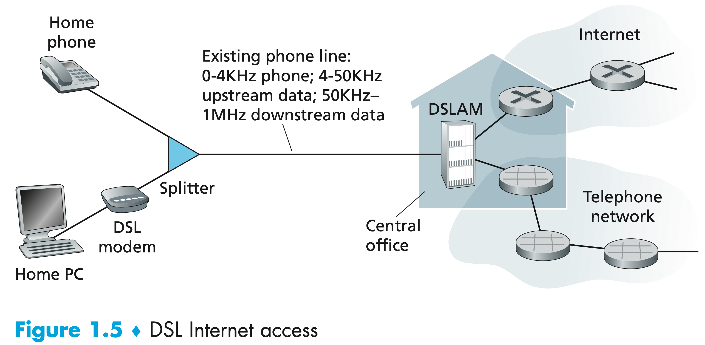
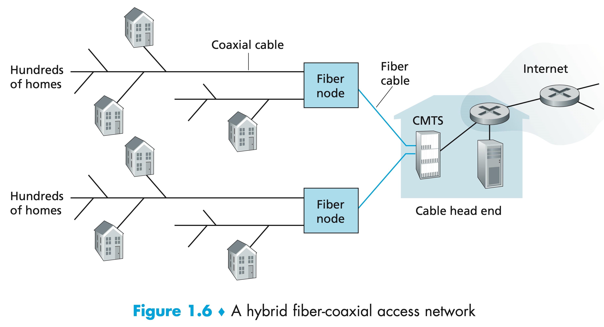
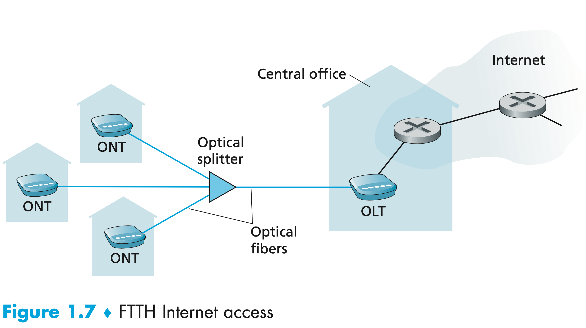
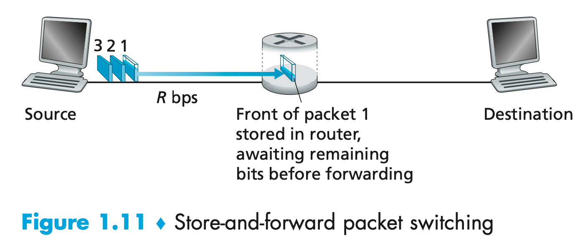
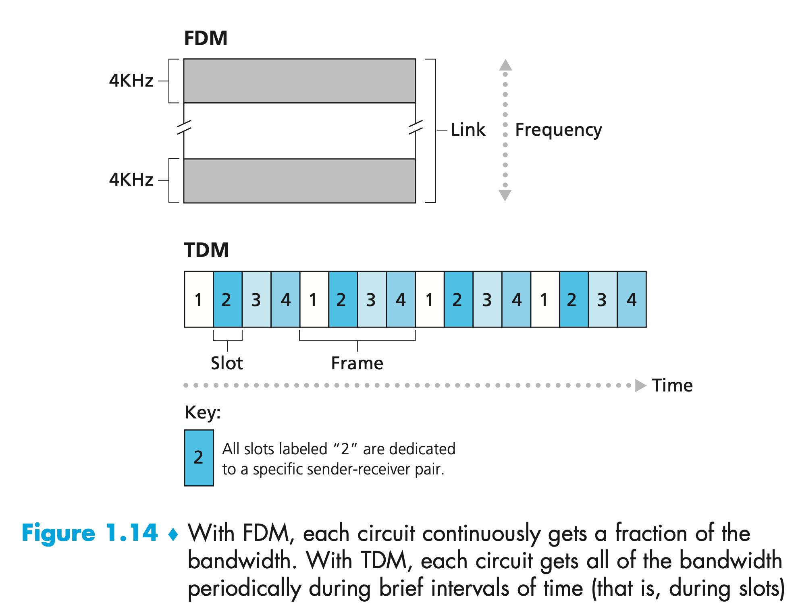
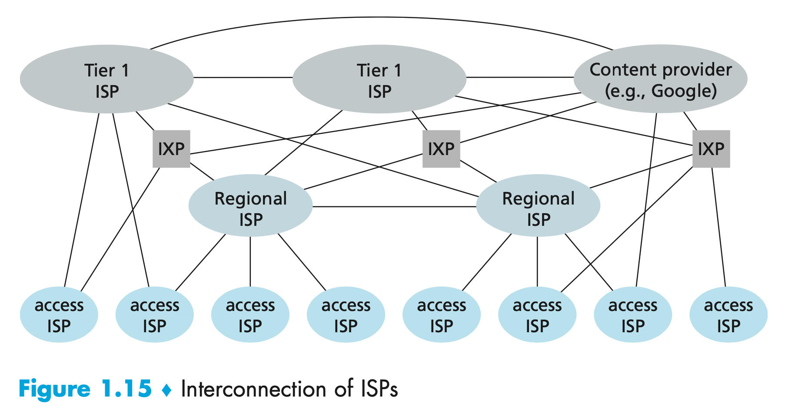
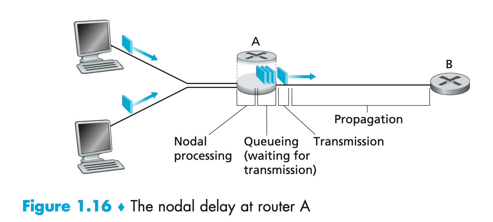

# Computer network

## What is Internet

Smart devices are refer as **hosts** or **end systems**.End systems are connected together by a network of **communication links** and **packet switches**. 

Different links can transmit data at different rates, with the **transmission rate** of a link measured in bits/second.

When one end system has data to send to another end system, the sending end system segments the data and adds header bytes to each segment. The resulting packages of information, known as **packets**.

Packet switches come in many shapes and flavors, but the two most prominent types in today’s Internet are **routers** and **link-layer switches**.Link-layer switches are typically used in access networks, while routers are typically used in the network core.

End systems access the Internet through **Internet Service Providers (ISPs)**.

End systems, packet switches, and other pieces of the Internet run **protocols** that control the sending and receiving of information within the Internet. The **Transmission Control Protocol (TCP)** and the **Internet Protocol (IP)** are two of the most important protocols in the Internet. 

- The IP protocol specifies the format of the packets that are sent and received among routers and end systems. 
- The Internet’s principal protocols are collectively known as **TCP/IP**.

*A* **protocol** defines the format and the order of messages exchanged between two or more communicating entities, as well as the actions taken on the transmission and/or receipt of a message or other event.

Two most prevalent types of broadband residential access are **digital subscriber line (DSL)** and cable. 

As shown in Figure 1.5, each customer’s DSL modem uses the existing telephone line to exchange data with a digital subscriber line access multiplexer (DSLAM) located in the telco’s local central office (CO). The home’s DSL modem takes digital data and translates it to high frequency tones for transmission over telephone wires to the CO; the analog signals from many such houses are translated back into digital format at the DSLAM.

The residential telephone line carries both data and traditional telephone signals simultaneously, which are encoded at different frequencies:

- A high-speed downstream channel, in the 50 kHz to 1 MHz band
- A medium-speed upstream channel, in the 4 kHz to 50 kHz band
- An ordinary two-way telephone channel, in the 0 to 4 kHz band

On the customer side, a splitter separates the data and telephone signals arriving to the home and forwards the data signal to the DSL modem. 

On the telco side, in the CO, the DSLAM separates the data and phone signals and sends the data into the Internet. Hundreds or even thousands of households connect to a single DSLAM.

The DSL standards define multiple transmission rates, including 12 Mbps down- stream and 1.8 Mbps upstream, and 55 Mbps downstream and 15 Mbps upstream.The maximum rate is also limited by the distance between the home and the CO, the gauge of the twisted-pair line and the degree of electrical interference.If the residence is not located within 5 to 10 miles of the CO, the residence must resort to an alternative form of Internet access.

While DSL makes use of the telco’s existing local telephone infrastructure, **cable Internet access** makes use of the cable television company’s existing cable television infrastructure. A residence obtains cable Internet access from the same company that provides its cable television. As illustrated in Figure 1.6, fiber optics connect the cable head end to neighborhood-level junctions, from which traditional coaxial cable is then used to reach individual houses and apartments. Each neighborhood junction typically supports 500 to 5,000 homes. Because both fiber and coaxial cable are employed in this system, it is often referred to as hybrid fiber coax (HFC).

Cable Internet access requires special modems, called cable modems. As with a DSL modem, the cable modem is typically an external device and connects to the home PC through an Ethernet port. At the cable head end, the cable modem termination system (CMTS) serves a similar function as the DSL network’s DSLAM—turning the analog signal sent from the cable modems in many downstream homes back into digital format. Cable modems divide the HFC network into two channels, a downstream and an upstream channel. As with DSL, access is typically asymmetric, with the downstream channel typically allocated a higher transmission rate than the upstream channel. The DOCSIS 2.0 standard defines downstream rates up to 42.8 Mbps and upstream rates of up to 30.7 Mbps. As in the case of DSL networks, the maximum achievable rate may not be realized due to lower contracted data rates or media impairments.

A distributed multiple access protocol is needed to coordinate transmissions and avoid collisions.

**Fiber to the home (FTTH)** provide an optical fiber path from the CO directly to the home. 

There are several competing technologies for optical distribution from the CO to the homes. The simplest optical distribution network is called direct fiber, with one fiber leaving the CO for each home. More commonly, each fiber leaving the central office is actually shared by many homes; it is not until the fiber gets relatively close to the homes that it is split into individual customer-specific fibers. There are two competing optical-distribution network architectures that perform this splitting: active optical networks (AONs) and passive optical networks (PONs). AON is essentially switched Ethernet, which is discussed in Chapter 6.

Figure 1.7 shows FTTH using the PON distribution architecture. Each home has an optical network terminator (ONT), which is connected by dedicated optical fiber to a neighborhood splitter. The splitter combines a number of homes (typically less than 100) onto a single, shared optical fiber, which connects to an optical line terminator (OLT) in the telco’s CO. The OLT, providing conversion between optical and electrical signals, connects to the Internet via a telco router. In the home, users connect a home router (typically a wireless router) to the ONT and access the Internet via this home router. 

In the PON architecture, all packets sent from OLT to the splitter are replicated at the splitter (similar to a cable head end).

In locations where DSL, cable, and FTTH are not available (e.g., in some rural settings), a satellite link can be used to connect a residence to the Internet at speeds of more than 1 Mbps. Dial-up access over traditional phone lines is based on the same model as DSL—a home modem connects over a phone line to a modem in the ISP. Compared with DSL and other broadband access networks, dial-up access is excruciatingly slow at 56 kbps.

For each transmitter-receiver pair, the bit is sent by propagating electromagnetic waves or optical pulses across a **physical medium**. Physical media fall into two categories: **guided media** and **unguided media**.

- guided media, the waves are guided along a solid medium, such as a fiber optic cable, a twisted-pair copper wire, or a coaxial cable.
- unguided media, the waves propagate in the atmosphere and in outer space, such as in a wireless LAN or a digital satellite channel.

### The Network Core

#### Packet Switching

To send a message from a source end system to a destination end system, the source breaks long messages into smaller chunks of data known as **packets**. Between source and destination, each packet travels through communication links and **packet switches** (for which there are two predominant types, **routers** and **link-layer switches**). Packets are transmitted over each communication link at a rate equal to the *full* transmission rate of the link. So, if a source end system or a packet switch is sending a packet of *L* bits over a link with transmission rate *R* bits/sec, then the time T to transmit the packet is
$$
T =L / R
$$

##### Store-and-Forward Transmission

Most packet switches use **store-and-forward transmission** at the inputs to the links. Store-and-forward transmission means that the packet switch must receive the entire packet before it can begin to transmit the first bit of the packet onto the outbound link. 

At time *L*/*R* seconds, since the router has just received the entire packet, it can begin to transmit the packet onto the outbound link towards the destination; at time $2\times L/R$, the router has transmitted the entire packet, and the entire packet has been received by the destination. Thus, the total delay is $2\times L/R$. If the switch instead forwarded bits as soon as they arrive.

Let’s now consider the general case of sending one packet from source to destination over a path consisting of *N* links each of rate *R* (thus, there are *N*-1 routers between source and destination). Applying the same logic as above, we see that the end-to-end delay is:
$$
d_{end\_to\_end} = N\frac{L}{R}
$$

##### Queuing Delays and Packet Loss

The packet switch has an **output buffer** (also called an **output queue**), which stores packets that the router is about to send into that link. The packages need to wait inside the queue if the forward link is busy. We call this waiting time as **queuing delays**.

Since the amount of buffer space is finite, an arriving packets faced the buffer is full, so **packet loss** will occur.

##### Forwarding Tables and Routing Protocols

In the Internet, every end system has an address called an IP address.When a source end system wants to send a packet to a destination end system, the source includes the destination’s IP address in the packet’s header. This address has a hierarchical structure. Each router has a **forwarding table** that maps destination addresses (or portions of the destination addresses) to that router’s outbound links. When a packet arrives at a router, the router examines the address and searches its forwarding table, using this destination address, to find the appropriate outbound link. The router then directs the packet to this outbound link. The Internet has a number of special **routing protocols** that are used to automatically set the forwarding tables. 

#### Circuit Switching

There are two fundamental approaches to moving data through a network of links and switches: **circuit switching** and **packet switching**.

In circuit-switched networks, the resources needed along a path to provide for communication between the end systems are *reserved* for the duration of the communication session between the end systems. Traditional telephone networks are examples of circuit-switched networks.

##### Multiplexing in Circuit-Switched Networks

A circuit in a link is implemented with either **frequency-division multiplexing (FDM)** or **time-division multiplexing (TDM)**.

With FDM, the frequency spectrum of a link is divided up among the connections established across the link. 

For a TDM link, time is divided into frames of fixed duration, and each frame is divided into a fixed number of time slots. When the network establishes a connection across a link, the network dedicates one time slot in every frame to this connection.

##### Packet Switching Versus Circuit Switching

**Packet Switching** will utilise the link fully when some of users are not using the link. **Circuit Switching** may has benefit not affecting other users when some of the users heavily use the link.

#### Network of Networks

The access ISPs interconnect with a *single global transit ISP*. The global transit ISPs  interconnect among themselves. We said that access ISPs and global transit ISPs are in different tier to form multi-tier hierarchy.To build a network that more closely resembles today’s Internet, we must add points of presence (PoPs), multi-homing, peering, and Internet exchange points (IXPs) to the hierarchical Network Structure.

A **PoP** is simply a group of one or more routers (at the same location) in the provider’s network where customer ISPs can connect into the provider ISP. It exists in all levels of the hierarchy, except for the bottom (access ISP) level. Any ISP (except for tier-1 ISPs) may choose to **multi-home**, that is, to connect to two or more provider ISPs.A pair of nearby ISPs at the same level of the hierarchy can **peer**: they can directly connect their networks together so that all the traffic between them passes over the direct connection rather than through upstream intermediaries. An **Internet Exchange Point (IXP)**, which is a meeting point where multiple ISPs can peer together.

On top of the current Network Structure, we can add **content-provider networks** to form the final piece.

### Delay, Loss, and Throughput in Packet-Switched Networks

#### Overview of Delay in Packet-Switched Networks

The most important of these delays are the **nodal processing delay**, **queuing delay**, **transmission delay**, and **propagation delay**; together, these delays accumulate to give a **total nodal delay**. 

**Processing Delay**

The time required to examine the packet’s header and determine where to direct the packet is part of the **processing delay**. The processing delay can also include other factors, such as the time needed to check for bit-level errors in the packet that occurred in transmitting the packet’s bits from the upstream node to router A.

**Queuing Delay**

At the queue, the packet experiences a queuing delay as it waits to be transmitted onto the link. The length of the queuing delay of a specific packet will depend on the number of earlier-arriving packets that are queued and waiting for transmission onto the link. If the queue is empty and no other packet is currently being transmitted, then our packet’s queuing delay will be zero.

**Transmission Delay**

Assuming that packets are transmitted in a first-come-first-served manner, as is common in packet-switched networks, our packet can be transmitted only after all the packets that have arrived before it have been transmitted. 

Denote the length of the packet by L bits, and denote the transmission rate of the link from router A to router B by R bits/sec. For example, for a 10 Mbps Ethernet link, the rate is R = 10 Mbps; for a 100 Mbps Ethernet link, the rate is R = 100 Mbps. The transmission delay is L/R.

**Propagation Delay**

Once a bit is pushed into the link, it needs to propagate to router B. The time required to propagate from the beginning of the link to router B is the **propagation delay.** The bit propagates at the propagation speed of the link. The propagation speed depends on the physical medium of the link (that is, fiber optics, twisted-pair copper wire, and so on) and is in the range of
$$
2\times 10^8 m/s \ to \ \ 3\times 10^8 m/s
$$
which is equal to, or a little less than, the speed of light. **The propagation delay is the distance between two routers divided by the propagation speed.** That is, the propagation delay is d/s, where d is the distance between router A and router B and s is the propagation speed of the link. Once the last bit of the packet propagates to node B, it and all the preceding bits of the packet are stored in router B. The whole process then continues with router B now performing the forwarding.

**Comparing Transmission and Propagation Delay**

The transmission delay is the amount of time required for the router to push out the packet; it is a function of the packet’s length and the transmission rate of the link, but has nothing to do with the distance between the two routers. The propagation delay, on the other hand, is the time it takes a bit to propagate from one router to the next; it is a function of the distance between the two routers, but has nothing to do with the packet’s length or the transmission rate of the link.

If we let $d_{proc}$,  $d_{queue}$,  $d_{trans}$,  and $d_{prop}$ denote the processing, queuing, transmission, and propagation delays, then the total nodal delay is given by
$$
d_{nodal} = d_{proc} +d_{queue} + d_{trans} + d_{prop}
$$

#### Queuing Delay and Packet Loss

##### Queuing Delay

The most complicated and interesting component of nodal delay is the queuing delay, $d_{queue}$.The queuing delay can vary from packet to packet. For example, if 10 packets arrive at an empty queue at the same time, the first packet transmitted will suffer no queuing delay, while the last packet transmitted will suffer a relatively large queuing delay. Let `a` denote the average rate at which packets arrive at the queue (`a` is in units of packets/sec). Recall that `R` is the transmission rate; that is, it is the rate (in bits/sec) at which bits are pushed out of the queue. Also suppose, for simplicity, that all packets consist of `L` bits. Then the average rate at which bits arrive at the queue is `La bits/sec`. Finally, assume that the queue is very big, so that it can hold essentially an infinite number of bits. The ratio `La/R`, called the **traffic intensity**, often plays an important role in estimating the extent of the queuing delay. If La/R > 1, then the average rate at which bits arrive at the queue exceeds the rate at which the bits can be transmitted from the queue. In this unfortunate situation, the queue will tend to increase without bound and the queuing delay will approach infinity! Therefore, one of the golden rules in traffic engineering is: **Design your system so that the traffic intensity is no greater than 1**.

##### Packet Loss

In reality a queue preceding a link has finite capacity. A packet can arrive to find a full queue. With no place to store such a packet, a router will drop that packet.The fraction of lost packets increases as the traffic intensity increases.

