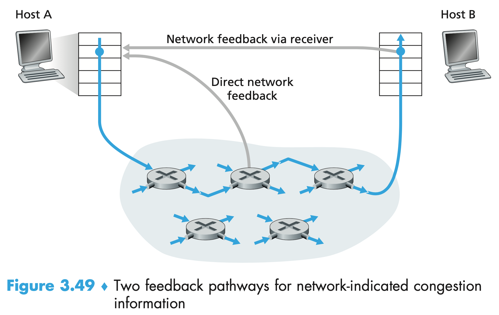

# Computer network

## What is Internet

Smart devices are refer as **hosts** or **end systems**.End systems are connected together by a network of **communication links** and **packet switches**. Different links can transmit data at different rates, with the **transmission rate** of a link measured in bits/second.

When one end system has data to send to another end system, the sending end system segments the data and adds header bytes to each segment. The resulting packages of information, known as **packets**.

Packet switches come in many shapes and flavors, but the two most prominent types in today’s Internet are **routers** and **link-layer switches**.Link-layer switches are typically used in access networks, while routers are typically used in the network core.

End systems access the Internet through **Internet Service Providers (ISPs)**.

End systems, packet switches, and other pieces of the Internet run **protocols** that control the sending and receiving of information within the Internet. The **Transmission Control Protocol (TCP)** and the **Internet Protocol (IP)** are two of the most important protocols in the Internet. 

- The IP protocol specifies the format of the packets that are sent and received among routers and end systems. 
- The Internet’s principal protocols are collectively known as **TCP/IP**.

A **protocol** defines the format and the order of messages exchanged between two or more communicating entities, as well as the actions taken on the transmission and/or receipt of a message or other event.

Two most prevalent types of broadband residential access are **digital subscriber line (DSL)** and cable. 

As shown in Figure 1.5, each customer’s DSL modem uses the existing telephone line to exchange data with a digital subscriber line access multiplexer (DSLAM) located in the telco’s local central office (CO). The home’s DSL modem takes digital data and translates it to high frequency tones for transmission over telephone wires to the CO; the analog signals from many such houses are translated back into digital format at the DSLAM.


The residential telephone line carries both data and traditional telephone signals simultaneously, which are encoded at different frequencies:

- A high-speed downstream channel, in the 50 kHz to 1 MHz band
- A medium-speed upstream channel, in the 4 kHz to 50 kHz band
- An ordinary two-way telephone channel, in the 0 to 4 kHz band

On the customer side, a splitter separates the data and telephone signals arriving to the home and forwards the data signal to the DSL modem. 

On the telco side, in the CO, the DSLAM separates the data and phone signals and sends the data into the Internet. Hundreds or even thousands of households connect to a single DSLAM.

The DSL standards define multiple transmission rates, including 12 Mbps down- stream and 1.8 Mbps upstream, and 55 Mbps downstream and 15 Mbps upstream.The maximum rate is also limited by the distance between the home and the CO, the gauge of the twisted-pair line and the degree of electrical interference.If the residence is not located within 5 to 10 miles of the CO, the residence must resort to an alternative form of Internet access.

While DSL makes use of the telco’s existing local telephone infrastructure, **cable Internet access** makes use of the cable television company’s existing cable television infrastructure. A residence obtains cable Internet access from the same company that provides its cable television. As illustrated in Figure 1.6, fiber optics connect the cable head end to neighborhood-level junctions, from which traditional coaxial cable is then used to reach individual houses and apartments. Each neighborhood junction typically supports 500 to 5,000 homes. Because both fiber and coaxial cable are employed in this system, it is often referred to as hybrid fiber coax (HFC).


Cable Internet access requires special modems, called cable modems. As with a DSL modem, the cable modem is typically an external device and connects to the home PC through an Ethernet port. At the cable head end, the cable modem termination system (CMTS) serves a similar function as the DSL network’s DSLAM—turning the analog signal sent from the cable modems in many downstream homes back into digital format. Cable modems divide the HFC network into two channels, a downstream and an upstream channel. As with DSL, access is typically asymmetric, with the downstream channel typically allocated a higher transmission rate than the upstream channel. The DOCSIS 2.0 standard defines downstream rates up to 42.8 Mbps and upstream rates of up to 30.7 Mbps. As in the case of DSL networks, the maximum achievable rate may not be realized due to lower contracted data rates or media impairments.

A distributed multiple access protocol is needed to coordinate transmissions and avoid collisions.

**Fiber to the home (FTTH)** provide an optical fiber path from the CO directly to the home. 

There are several competing technologies for optical distribution from the CO to the homes. The simplest optical distribution network is called direct fiber, with one fiber leaving the CO for each home. More commonly, each fiber leaving the central office is actually shared by many homes; it is not until the fiber gets relatively close to the homes that it is split into individual customer-specific fibers. There are two competing optical-distribution network architectures that perform this splitting: active optical networks (AONs) and passive optical networks (PONs). AON is essentially switched Ethernet, which is discussed in Chapter 6.

Figure 1.7 shows FTTH using the PON distribution architecture. Each home has an optical network terminator (ONT), which is connected by dedicated optical fiber to a neighborhood splitter. The splitter combines a number of homes (typically less than 100) onto a single, shared optical fiber, which connects to an optical line terminator (OLT) in the telco’s CO. The OLT, providing conversion between optical and electrical signals, connects to the Internet via a telco router. In the home, users connect a home router (typically a wireless router) to the ONT and access the Internet via this home router. 

In the PON architecture, all packets sent from OLT to the splitter are replicated at the splitter (similar to a cable head end).


In locations where DSL, cable, and FTTH are not available (e.g., in some rural settings), a satellite link can be used to connect a residence to the Internet at speeds of more than 1 Mbps. Dial-up access over traditional phone lines is based on the same model as DSL—a home modem connects over a phone line to a modem in the ISP. Compared with DSL and other broadband access networks, dial-up access is excruciatingly slow at 56 kbps.

For each transmitter-receiver pair, the bit is sent by propagating electromagnetic waves or optical pulses across a **physical medium**. Physical media fall into two categories: **guided media** and **unguided media**.

- guided media, the waves are guided along a solid medium, such as a fiber optic cable, a twisted-pair copper wire, or a coaxial cable.
- unguided media, the waves propagate in the atmosphere and in outer space, such as in a wireless LAN or a digital satellite channel.

### The Network Core

#### Packet Switching

To send a message from a source end system to a destination end system, the source breaks long messages into smaller chunks of data known as **packets**. Between source and destination, each packet travels through communication links and **packet switches** (for which there are two predominant types, **routers** and **link-layer switches**). Packets are transmitted over each communication link at a rate equal to the *full* transmission rate of the link. So, if a source end system or a packet switch is sending a packet of *L* bits over a link with transmission rate *R* bits/sec, then the time T to transmit the packet is
$$
T =L / R
$$

##### Store-and-Forward Transmission

Most packet switches use **store-and-forward transmission** at the inputs to the links. Store-and-forward transmission means that the packet switch must receive the entire packet before it can begin to transmit the first bit of the packet onto the outbound link. 


At time *L*/*R* seconds, since the router has just received the entire packet, it can begin to transmit the packet onto the outbound link towards the destination; at time $2\times L/R$, the router has transmitted the entire packet, and the entire packet has been received by the destination. Thus, the total delay is $2\times L/R$. If the switch instead forwarded bits as soon as they arrive.

Let’s now consider the general case of sending one packet from source to destination over a path consisting of *N* links each of rate *R* (thus, there are *N*-1 routers between source and destination). Applying the same logic as above, we see that the end-to-end delay is:
$$
d_{end\_to\_end} = N\frac{L}{R}
$$

##### Queuing Delays and Packet Loss

The packet switch has an **output buffer** (also called an **output queue**), which stores packets that the router is about to send into that link. The packages need to wait inside the queue if the forward link is busy. We call this waiting time as **queuing delays**.

Since the amount of buffer space is finite, an arriving packets faced the buffer is full, so **packet loss** will occur.

##### Forwarding Tables and Routing Protocols

In the Internet, every end system has an address called an IP address.When a source end system wants to send a packet to a destination end system, the source includes the destination’s IP address in the packet’s header. This address has a hierarchical structure. Each router has a **forwarding table** that maps destination addresses (or portions of the destination addresses) to that router’s outbound links. When a packet arrives at a router, the router examines the address and searches its forwarding table, using this destination address, to find the appropriate outbound link. The router then directs the packet to this outbound link. The Internet has a number of special **routing protocols** that are used to automatically set the forwarding tables. 

#### Circuit Switching

There are two fundamental approaches to moving data through a network of links and switches: **circuit switching** and **packet switching**.

In circuit-switched networks, the resources needed along a path to provide for communication between the end systems are *reserved* for the duration of the communication session between the end systems. Traditional telephone networks are examples of circuit-switched networks.

##### Multiplexing in Circuit-Switched Networks

A circuit in a link is implemented with either **frequency-division multiplexing (FDM)** or **time-division multiplexing (TDM)**.

With FDM, the frequency spectrum of a link is divided up among the connections established across the link. 

For a TDM link, time is divided into frames of fixed duration, and each frame is divided into a fixed number of time slots. When the network establishes a connection across a link, the network dedicates one time slot in every frame to this connection.


##### Packet Switching Versus Circuit Switching

**Packet Switching** will utilise the link fully when some of users are not using the link. **Circuit Switching** may has benefit not affecting other users when some of the users heavily use the link.

#### Network of Networks

The access ISPs interconnect with a *single global transit ISP*. The global transit ISPs  interconnect among themselves. We said that access ISPs and global transit ISPs are in different tier to form multi-tier hierarchy.To build a network that more closely resembles today’s Internet, we must add points of presence (PoPs), multi-homing, peering, and Internet exchange points (IXPs) to the hierarchical Network Structure.

A **PoP** is simply a group of one or more routers (at the same location) in the provider’s network where customer ISPs can connect into the provider ISP. It exists in all levels of the hierarchy, except for the bottom (access ISP) level. Any ISP (except for tier-1 ISPs) may choose to **multi-home**, that is, to connect to two or more provider ISPs.A pair of nearby ISPs at the same level of the hierarchy can **peer**: they can directly connect their networks together so that all the traffic between them passes over the direct connection rather than through upstream intermediaries. An **Internet Exchange Point (IXP)**, which is a meeting point where multiple ISPs can peer together.

On top of the current Network Structure, we can add **content-provider networks** to form the final piece.


### Delay, Loss, and Throughput in Packet-Switched Networks

#### Overview of Delay in Packet-Switched Networks

The most important of these delays are the **nodal processing delay**, **queuing delay**, **transmission delay**, and **propagation delay**; together, these delays accumulate to give a **total nodal delay**. 


**Processing Delay**

The time required to examine the packet’s header and determine where to direct the packet is part of the **processing delay**. The processing delay can also include other factors, such as the time needed to check for bit-level errors in the packet that occurred in transmitting the packet’s bits from the upstream node to router A.

**Queuing Delay**

At the queue, the packet experiences a queuing delay as it waits to be transmitted onto the link. The length of the queuing delay of a specific packet will depend on the number of earlier-arriving packets that are queued and waiting for transmission onto the link. If the queue is empty and no other packet is currently being transmitted, then our packet’s queuing delay will be zero.

**Transmission Delay**

Assuming that packets are transmitted in a first-come-first-served manner, as is common in packet-switched networks, our packet can be transmitted only after all the packets that have arrived before it have been transmitted. 

Denote the length of the packet by L bits, and denote the transmission rate of the link from router A to router B by R bits/sec. For example, for a 10 Mbps Ethernet link, the rate is R = 10 Mbps; for a 100 Mbps Ethernet link, the rate is R = 100 Mbps. The transmission delay is L/R.

**Propagation Delay**

Once a bit is pushed into the link, it needs to propagate to router B. The time required to propagate from the beginning of the link to router B is the **propagation delay.** The bit propagates at the propagation speed of the link. The propagation speed depends on the physical medium of the link (that is, fiber optics, twisted-pair copper wire, and so on) and is in the range of
$$
2\times 10^8 m/s \ to \ \ 3\times 10^8 m/s
$$
which is equal to, or a little less than, the speed of light. **The propagation delay is the distance between two routers divided by the propagation speed.** That is, the propagation delay is d/s, where d is the distance between router A and router B and s is the propagation speed of the link. Once the last bit of the packet propagates to node B, it and all the preceding bits of the packet are stored in router B. The whole process then continues with router B now performing the forwarding.

**Comparing Transmission and Propagation Delay**

The transmission delay is the amount of time required for the router to push out the packet; it is a function of the packet’s length and the transmission rate of the link, but has nothing to do with the distance between the two routers. The propagation delay, on the other hand, is the time it takes a bit to propagate from one router to the next; it is a function of the distance between the two routers, but has nothing to do with the packet’s length or the transmission rate of the link.

If we let $d_{proc}$,  $d_{queue}$,  $d_{trans}$,  and $d_{prop}$ denote the processing, queuing, transmission, and propagation delays, then the total nodal delay is given by
$$
d_{nodal} = d_{proc} +d_{queue} + d_{trans} + d_{prop}
$$

#### Queuing Delay and Packet Loss

##### Queuing Delay

The most complicated and interesting component of nodal delay is the queuing delay, $d_{queue}$.The queuing delay can vary from packet to packet. For example, if 10 packets arrive at an empty queue at the same time, the first packet transmitted will suffer no queuing delay, while the last packet transmitted will suffer a relatively large queuing delay. Let `a` denote the average rate at which packets arrive at the queue (`a` is in units of packets/sec). Recall that `R` is the transmission rate; that is, it is the rate (in bits/sec) at which bits are pushed out of the queue. Also suppose, for simplicity, that all packets consist of `L` bits. Then the average rate at which bits arrive at the queue is `La bits/sec`. Finally, assume that the queue is very big, so that it can hold essentially an infinite number of bits. The ratio `La/R`, called the **traffic intensity**, often plays an important role in estimating the extent of the queuing delay. If La/R > 1, then the average rate at which bits arrive at the queue exceeds the rate at which the bits can be transmitted from the queue. In this unfortunate situation, the queue will tend to increase without bound and the queuing delay will approach infinity! Therefore, one of the golden rules in traffic engineering is: **Design your system so that the traffic intensity is no greater than 1**.

##### Packet Loss

In reality a queue preceding a link has finite capacity. A packet can arrive to find a full queue. With no place to store such a packet, a router will drop that packet.The fraction of lost packets increases as the traffic intensity increases.

#### End to End Delay

Nodal delay is only the delay at a single router. Let’s now consider the total delay from source to destination. To get a handle on this concept, suppose there are *N* - 1 routers between the source host and the destination host. Let’s also suppose for the moment that the network is uncongested (so that queuing delays are negligible), the processing delay at each router and at the source host is $d_{proc}$, the transmission rate out of each router and out of the source host is *R* bits/sec, and the propagation on each link is $d_{prop}$. The nodal delays accumulate and give an end-to-end delay:
$$
d_{end\_to\_end} = N(d_{proc} + d_{trans} + d_{prop})
$$
where $d_{trans} = L/R$, where *L* is the packet size. 

#### Throughput in Computer Networks

To define throughput, consider transferring a large file from Host A to Host B across a computer network. This transfer might be, for example, a large video clip from one peer to another in a P2P file sharing system. The **instantaneous throughput** at any instant of time is the rate (in bits/ sec) at which Host B is receiving the file. If the file consists of *F* bits and the transfer takes *T* seconds for Host B to receive all *F* bits, then the **average throughput** of the file transfer is *F/T* bits/sec.

Figure 1.19(a) shows two end systems, a server and a client, connected by two communication links and a router.Let $R_s$ denote the rate of the link between the server and the router; and $R_c$ denote the rate of the link between the router and the client. The throughput is min{*R**c*, *R**s*}, that is, it is the transmission rate of the **bottleneck link**. The throughput by transfer a large file of Fbits from server to client is $F/min(R_s, R_c)$


### Protocol Layers and Their Service Models

#### Layered Architecture

A layered architecture allows us to discuss a well-defined, specific part of a large and complex system. This simplification itself is of considerable value by providing modularity, making it much easier to change the implementation of the service provided by the layer. For large and complex systems that are constantly being updated, the ability to change the implementation of a service without affecting other components of the system is an important advantage of layering.

##### Protocol Layering

The network hardware and software that implement the protocols in **layers**. Each protocol belongs to one of the layers. A protocol layer can be implemented in software, in hardware, or in a combination of the two. Application-layer protocols—such as HTTP and SMTP—are almost always implemented in software in the end systems; so are transport-layer protocols. Because the physical layer and data link layers are responsible for handling communication over a specific link, they are typically implemented in a network interface card (for example, Ethernet or WiFi interface cards) associated with a given link.The network layer is often a mixed implementation of hardware and software. 

**Some drawbacks**

- One potential drawback of layering is that one layer may duplicate lower-layer functionality. For example, many protocol stacks provide error recovery on both a per-link basis and an end-to-end basis.
- functionality at one layer may need information (for example, a timestamp value) that is present only in another layer; this violates the goal of separation of layers.

When taken together, the protocols of the various layers are called the **protocol stack**. The Internet protocol stack consists of five layers: the physical, link, network, transport, and application layers, as shown in Figure 1.23(a).


**Application Layer**

The application layer is where network applications and their application-layer protocols reside. The Internet’s application layer includes many protocols, such as:

- the HTTP protocol (which provides for Web document request and transfer)
- SMTP (which provides for the transfer of e-mail messages)
- the domain name system (DNS) which translate the domain name into IP
- FTP (which provides for the transfer of files between two end systems)

An application-layer protocol is distributed over multiple end systems, with the application in one end system using the protocol to exchange packets of information with the application in another end system. We’ll refer to this packet of information at the application layer as a **message**.

**Transport Layer**

The Internet’s transport layer transports application-layer messages between application endpoints. In the Internet there are two transport protocols, TCP and UDP, either of which can transport application-layer messages. We’ll refer to a transport-layer packet as a **segment**.

- TCP provides a connection-oriented service to its applications. This service includes guaranteed delivery of application-layer messages to the destination and flow control (that is, sender/receiver speed matching). TCP also breaks long messages into shorter segments and provides a congestion-control mechanism, so that a source throttles its transmission rate when the network is congested. 

- The UDP protocol provides a connectionless service to its applications. This is a no-frills service that provides no reliability, no flow control, and no congestion control.

**Network Layer**

The Internet’s network layer is responsible for moving network-layer packets known as **datagrams** from one host to another. The Internet transport-layer protocol (TCP or UDP) in a source host passes a transport-layer segment and a destination address to the network layer. The network layer then provides the service of delivering the segment to the transport layer in the destination host.

The Internet’s network layer includes: 

- **IP protocol**, which defines the fields in the datagram as well as how the end systems and routers act on these fields. There is only one IP protocol, and all Internet components that have a network layer must run the IP protocol. 
- **Routing protocols** that determine the routes that datagrams take between sources and destinations. The Internet has many routing protocols. 

Although the network layer contains both the IP protocol and numerous routing protocols, it is often simply referred to as the IP layer, reflecting the fact that IP is the glue that binds the Internet together.

**Link Layer**

The Internet’s network layer routes a datagram through a series of routers between the source and destination. To move a packet from one node (host or router) to the next node in the route, the network layer relies on the services of the link layer. In particular, at each node, the network layer passes the datagram down to the link layer, which delivers the datagram to the next node along the route. At this next node, the link layer passes the datagram up to the network layer.

The services provided by the link layer depend on the specific link-layer protocol that is employed over the link. For example, some link-layer protocols provide reliable delivery, from transmitting node, over one link, to receiving node.  Examples of link layer protocols include Ethernet, WiFi, and the cable access network’s DOCSIS protocol. As datagrams typically need to traverse several links to travel from source to destination, a datagram may be handled by different link-layer protocols at different links along its route. For example, a datagram may be handled by Ethernet on one link and by Point-to-Point Protocol (PPP) on the next link. The network layer will receive a different service from each of the different link-layer protocols. We’ll refer to the link layer packets as **frames**.

> _**Note**_: The reliable delivery service is different from the reliable delivery service of TCP, which provides reliable delivery from one end system to another.

**Physical Layer**

While the job of the link layer is to move entire frames from one network element to an adjacent network element, the job of the physical layer is to move the *individual bits* within the frame from one node to the next. The protocols in this layer are again link dependent and further depend on the actual transmission medium of the link (for example, twisted-pair copper wire, single-mode fiber optics). For example, Ethernet has many physical-layer protocols: one for twisted-pair copper wire, another for coaxial cable, another for fiber, and so on. In each case, a bit is moved across the link in a different way.

**The OSI Model**

The seven layers of the OSI reference model, shown in Figure 1.23(b), are: application layer, presentation layer, session layer, transport layer, network layer, data link layer, and physical layer. The functionality of five of these layers is roughly the same as their similarly named Internet counterparts. Thus, let’s consider the two additional layers present in the OSI reference model—the presentation layer and the session layer. 

**Presentation Layer**

The role of the presentation layer is to provide services that allow communicating applications to interpret the meaning of data exchanged. These services include:

- data compression
- data encryption
- data description (which frees the applications from having to worry about the internal format in which data are represented/store —formats that may differ from one computer to another). 

**Session Layer**

The session layer provides for delimiting and synchronization of data exchange, including the means to build a checkpointing and recovery scheme.

#### Encapsulation

Figure 1.24 shows the physical path that data takes down a sending end system’s protocol stack, up and down the protocol stacks of an intervening link-layer switch and router, and then up the protocol stack at the receiving end system.The link-layer switches implement layers 1 and 2; routers implement layers 1 through 3. This means, for example, that Internet routers are capable of implementing the IP protocol (a layer 3 protocol), while link-layer switches are not. So link-layer switches do not recognize IP addresses, they are capable of recognizing layer 2 addresses, such as Ethernet addresses.


Figure 1.24 also illustrates the important concept of **encapsulation**. At the send- ing host, an **application-layer message** (M in Figure 1.24) is passed to the transport layer. In the simplest case, the transport layer takes the message and appends addi- tional information (so-called transport-layer header information, H*t* in Figure 1.24) that will be used by the receiver-side transport layer. The application-layer message and the transport-layer header information together constitute the **transport-layer segment**. The transport-layer segment thus encapsulates the application-layer mes- sage. The added information might include information allowing the receiver-side transport layer to deliver the message up to the appropriate application, and error- detection bits that allow the receiver to determine whether bits in the message have been changed in route. The transport layer then passes the segment to the network layer, which adds network-layer header information (H*n* in Figure 1.24) such as source and destination end system addresses, creating a **network-layer datagram**. The datagram is then passed to the link layer, which (of course!) will add its own link-layer header information and create a **link-layer frame**. Thus, we see that at each layer, a packet has two types of fields: header fields and a **payload field**. The payload is typically a packet from the layer above.

The process of encapsulation can be more complex than that described above. For example, a large message may be divided into multiple transport-layer segments (which might themselves each be divided into multiple network-layer datagrams). At the receiving end, such a segment must then be reconstructed from its constituent datagrams.

#### Networks Under Attack

##### Malware

The host device can infected by **malware** which are bad programs that designed to cause damage or deal information to the host device. 

The compromised host may also be enrolled in a network of thousands of similarly compromised devices, collectively known as a **botnet**, which the bad guys control and leverage for spam e-mail distribution or distributed denial-of-service attacks (DDos) against targeted hosts. 

Much of the malware out there today is **self-replicating**: once it infects one host, from that host it seeks entry into other hosts over the Internet, and from the newly infected hosts, it seeks entry into yet more hosts. 

Malware can spread in the form of a virus or a worm. 

- **Viruses** are malware that require some form of user interaction to infect the user’s device. The classic example is an e-mail attachment containing malicious executable code. If a user receives and opens such an attachment, the user inadvertently runs the malware on the device. Typically, such e-mail viruses are self-replicating: once executed, the virus may send an identical message with an identical malicious attachment to, for example, every recipient in the user’s address book.
- **Worms** are malware that can enter a device without any explicit user interaction. For example, a user may be running a vulnerable network application to which an attacker can send malware.In some cases, without any user intervention, the application may accept the malware from the Internet and run it, creating a worm. The worm in the newly infected device then scans the Internet, searching for other hosts running the same vulnerable network application. When it finds other vulnerable hosts, it sends a copy of itself to those hosts.

Another broad class of security threats are known as **denial-of-service (DoS) attacks**. A DoS attack renders a network, host, or other piece of infrastructure unusable by legitimate users. Web servers, e-mail servers, DNS servers, and institutional networks can all be subject to DoS attacks. Most Internet DoS attacks fall into one of three categories:

- **Vulnerability attack**: This involves sending a few well-crafted messages to a vulnerable application or operating system running on a targeted host. If the right sequence of packets is sent to a vulnerable application or operating system, the service can stop or, worse, the host can crash.
- **Bandwidth flooding**: The attacker sends a deluge of packets to the targeted host—so many packets that the target’s access link becomes clogged, preventing legitimate packets from reaching the server.
- **Connection flooding**: The attacker establishes a large number of half-open or fully open TCP connections at the target host. The host can become so bogged down with these bogus connections that it stops accepting legitimate connections.

Let’s now explore the bandwidth-flooding attack in more detail. In a **distributed DoS (DDoS)** attack, illustrated in Figure 1.25, the attacker controls multiple sources and has each source blast traffic at the target.


##### Sniffing Packets

Many users today access the Internet via wireless devices, such as WiFi-connected laptops or handheld devices with cellular Internet connections. Placing a passive receiver in the vicinity of the wireless transmitter, that receiver can obtain a copy of every packet that is transmitted! These packets can contain all kinds of sensitive information, including passwords, social security numbers, trade secrets, and private personal messages. A passive receiver that records a copy of every packet that flies by is called a **packet sniffer**.

Sniffers can be deployed in wired environments as well. In wired broadcast environments, as in many Ethernet LANs, a packet sniffer can obtain copies of broadcast packets sent over the LAN. Furthermore, a bad guy who gains access to an institution’s access router or access link to the Internet may be able to plant a sniffer that makes a copy of every packet going to/from the organization. Sniffed packets can then be analyzed offline for sensitive information.

Because packet sniffers are passive—that is, they do not inject packets into the channel—they are difficult to detect. 

##### Masquerade

The ability to inject packets into the Internet with a false source address is known as **IP spoofing**, and is but one of many ways in which one user can masquerade as another user.

To solve this problem, we will need *end-point authentication,* that is, a mechanism that will allow us to determine with certainty if a message originates from where we think it does. 

## Application Layer

### Principles of Network Applications

Confining application software to the end systems—as shown in Figure 2.1, has facilitated the rapid development and deployment of a vast array of network applications.


#### Network Application Architectures

The **application architecture** is designed by the application developer and dictates how the application is structured over the various end systems. In choosing the application architecture, an application developer will likely draw on one of the two predominant architectural paradigms used in modern network applications: the `client-server architecture` or the `peer-to-peer (P2P) architecture`.

In a **client-server architecture**, there is an always-on host, called the *server*, which services requests from many other hosts, called *clients*. Note that with the client-server architecture, clients do not directly communicate with each other. Another characteristic of the client-server architecture is that the server has a fixed, well-known address, called an IP address. Some of the better-known applications with a client-server architecture include the Web, FTP, Telnet, and e-mail. The client-server architecture is shown in Figure 2.2(a).

Often in a client-server application, a single-server host is incapable of keep- ing up with all the requests from clients. A **data center**, housing a large number of hosts, is often used to create a powerful virtual server. A data center can have hundreds of thousands of servers, which must be powered and maintained. Additionally, the service providers must pay recurring interconnection and bandwidth costs for sending data from their data centers.


In a **P2P architecture**, there is minimal (or no) reliance on dedicated servers in data centers. Instead the application exploits direct communication between pairs of intermittently connected hosts, called *peers*. The peers are not owned by the service provider, but are instead desktops and laptops controlled by users. Because the peers communicate without passing through a dedicated server, the architecture is called peer-to-peer. The P2P architecture is illustrated in Figure 2.2(b).

Some applications have hybrid architectures, combining both client-server and P2P elements. For example, for many instant messaging applications, servers are used to track the IP addresses of users, but user-to-user messages are sent directly between user hosts (without passing through intermediate servers).

One of the most compelling features of P2P architectures is their **self-scalability**. For example, in a P2P file-sharing application, although each peer gener- ates workload by requesting files, each peer also adds service capacity to the system by distributing files to other peers. P2P architectures are also cost effective, since they normally don’t require significant server infrastructure and server bandwidth. However, P2P applications face challenges of *security*, *performance*, and *reliability* due to their highly `decentralized structure`.

#### Processes Communicating

Processes on two different end systems communicate with each other by exchanging **messages** across the computer network. A sending process creates and sends messages into the network; a receiving process receives these messages and possibly responds by sending messages back. Figure 2.1 illustrates that processes communicating with each other reside in the application layer of the five layer protocol stack.

In the context of a communication session between a pair of processes, the process that initiates the communication (that is, initially contacts the other process at the beginning of the session) is labeled as the *client*. The process that waits to be contacted to begin the session is the *server*.

##### Socket

A process sends messages into, and receives messages from, the network through a software interface called a **socket**. Figure 2.3 illustrates socket communication between two processes that communicate over the Internet. As shown in this figure, a socket is the interface between the application layer and the transport layer within a host. It is also referred to as the **Application Programming Interface (API)** between the application and the network, since the socket is the programming interface with which network applications are built.


The application developer has control of everything on the application-layer side of the socket but has little control of the transport-layer side of the socket. The only control that the application developer has on the transport-layer side is:

1. the choice of transport protocol
2. perhaps the ability to fix a few transport-layer parameters such as maximum buffer and maximum segment sizes. 

Once the application developer chooses a transport protocol (if a choice is available), the application is built using the transport-layer services provided by that protocol.

##### Address

In order for a process running on one host to send packets to a process running on another host, the receiving process needs to have an address. To identify the receiving process, two pieces of information need to be specified:

1. the address of the host
2. an identifier that specifies the receiving process in the destination host.

In the Internet, the host is identified by its **IP address**. A host could be running many network applications, so a destination **port number** helps to specify the receiving process. Popular applications have been assigned specific port numbers. For example, a Web server is identified by port number 80. A mail server process (using the SMTP protocol) is identified by port number 25.

#### Transport Services Available to Applications

Many networks, including the Internet, provide more than one transport-layer protocol. When you develop an application, you must choose one of the available transport-layer protocols. Choosing the protocol by classify the possible services along four dimensions: reliable data transfer, throughput, timing, and security.

**Reliable Data Transfer**

We know that packets can get lost within a computer network. If a protocol provides guarantee that the data sent by one end of the application is delivered correctly and completely to the other end of the application, it is said to provide **reliable data transfer**. 

When a transport-layer protocol doesn’t provide reliable data transfer, some of the data sent by the sending process may never arrive at the receiving process. This may be acceptable for **loss-tolerant applications**, most notably multimedia applications such as conversational audio/video that can tolerate some amount of data loss.

**Throughput**

Throughput is the rate at which the sending process can deliver bits to the receiving process. Because other sessions will be sharing the bandwidth along the network path, and because these other sessions will be coming and going, the available throughput can fluctuate with time. These observations lead to another natural service that a transport-layer protocol could provide, namely, guaranteed available throughput at some specified rate. With such a service, the application could request a guaranteed throughput of *r* bits/sec, and the transport protocol would then ensure that the available throughput is always at least *r* bits/sec.

Applications that have throughput requirements are said to be **bandwidth-sensitive applications**. Many current multimedia applications are bandwidth sensitive, although some multimedia applications may use adaptive coding techniques to encode digitized voice or video at a rate that matches the currently available throughput. While bandwidth-sensitive applications have specific throughput requirements, **elastic applications** can make use of as much, or as little, throughput as happens to be available.

**Timing**

A transport-layer protocol can also provide timing guarantees. As with throughput guarantees, timing guarantees can come in many shapes and forms. An example guarantee might be that every bit that the sender pumps into the socket arrives at the receiver’s socket no more than 100 msec later. Such a service would be appealing to interactive real-time applications, such as Internet telephony.

**Security**

Finally, a transport protocol can provide an application with one or more security services. For example, in the sending host, a transport protocol can encrypt all data transmitted by the sending process, and in the receiving host, the transport-layer pro- tocol can decrypt the data before delivering the data to the receiving process. Such a service would provide confidentiality between the two processes, even if the data is somehow observed between sending and receiving processes. 

A transport protocol can also provide other security services in addition to *confidentiality*, including *data integrity* and *end-point authentication*.

#### Transport Services Provided by the Internet

The Internet (and, more generally, TCP/ IP networks) makes two transport protocols available to applications, UDP and TCP. As an application developer, one of the first decisions you have to make is whether to use UDP or TCP when you create a new network application for the Internet. Each of these protocols offers a different set of services to the invoking applications. Figure 2.4 shows the service requirements for some selected applications.


**TCP Services**

The TCP service model includes a connection-oriented service and a reliable data transfer service. When an application invokes TCP as its transport protocol, the application receives both of these services from TCP.

- *Connection-oriented service.* TCP has the client and server exchange transport-layer control information with each other *before* the application-level messages begin to flow. This so-called *handshaking procedure* alerts the client and server, allowing them to prepare for an onslaught of packets. During the handshaking process, a *new* socket that is dedicated to that particular client will be created. So there are two types of socket on server side, one is welcoming socket and each newly created server-side connection socket for individual client. After the handshaking phase, a **TCP connection** is said to exist between the sockets of the two processes. The connection is a *full-duplex* connection in that the two processes can send messages to each other over the connection at the same time. When the application finishes sending messages, it must tear down the connection.
- *Reliable data transfer service.* The communicating processes can rely on TCP to deliver all data sent without error and in the proper order. When one side of the application passes a stream of bytes into a socket, it can count on TCP to deliver the same stream of bytes to the receiving socket, with no missing or duplicate bytes.

TCP also includes a *congestion-control* mechanism, a service for the general welfare of the Internet rather than for the direct benefit of the communicating processes. The TCP congestion-control mechanism throttles a sending process (client or server) when the network is congested between sender and receiver. TCP congestion control also attempts to limit each TCP connection to its fair share of network bandwidth.

Neither TCP nor UDP provides any encryption—the data that the sending process passes into its socket is the same data that travels over the network to the destination process. As privacy and other security issues have become critical for many applications, the Internet community has developed an enhancement for TCP, called **Secure Sockets Layer (SSL)**. TCP-enhanced-with-SSL not only does everything that traditional TCP does but also provides critical process-to-process security services, including encryption, data integrity, and end-point authentication. 

SSL is not a third Internet transport protocol, but instead is an enhancement of TCP, with the enhancements being implemented in the application layer.  In particular, if an application wants to use the services of SSL, it needs to include SSL code (existing, highly optimized libraries and classes) in both the client and server sides of the application. SSL has its own socket API that is similar to the traditional TCP socket API. When an application uses SSL, the sending process passes cleartext data to the SSL socket; SSL in the sending host then encrypts the data and passes the encrypted data to the TCP socket. The encrypted data travels over the Internet to the TCP socket in the receiving process. The receiving socket passes the encrypted data to SSL, which decrypts the data. Finally, SSL passes the cleartext data through its SSL socket to the receiving process. 

**UDP Services**

UDP is a *no-frills*, *lightweight* transport protocol, providing minimal services. UDP is connectionless, so there is no handshaking before the two processes start to communicate. UDP provides an unreliable data transfer service; UDP provides *no* guarantee that the message will ever reach the receiving process and messages that do arrive at the receiving process may arrive out of order. UDP does not include a congestion-control mechanism, so the sending side of UDP can pump data into the layer below (the network layer) at any rate it pleases.

**Services Not Provided by Internet Transport Protocols**

Today’s Internet can often provide satisfactory service to time-sensitive applications, but it cannot provide any *timing* or *throughput* guarantees. Figure 2.5 indicates the transport protocols used by some popular Internet applications. We see that e-mail, remote terminal access, the Web, and file transfer all use TCP. These applications have chosen TCP primarily because TCP provides reliable data transfer, guaranteeing that all data will eventually get to its destination.

Because Internet telephony applications (such as Skype) can often tolerate some loss but require a minimal rate to be effective, developers of Internet telephony applications usually prefer to run their applications over UDP, thereby circumventing TCP’s congestion control mechanism and packet overheads. But because *many firewalls are configured to block (most types of) UDP traffic*, Internet telephony applications often are *designed to use TCP as a backup if UDP communication fails*.


#### Application-Layer Protocols

An **application-layer protocol** defines how an application’s processes, running on different end systems, pass messages to each other. In particular, an application-layer protocol defines:

- The *types of messages exchanged*, for example, request messages and response messages

- The *syntax of the various message* types, such as the fields in the message and how the fields are delineated

- The *semantics of the fields*, that is, the meaning of the information in the fields

- *Rules* for determining when and how a process sends messages and responds to

  messages

It is important to distinguish between network applications and application-layer protocols. An application-layer protocol is only one piece of a network application. 

An Web application consists of many components, including a standard for document formats (that is, HTML), Web browsers, Web servers (for example, Apache and Microsoft servers), and an application-layer protocol. The Web’s application-layer protocol, *HTTP*, defines the format and sequence of messages exchanged between browser and Web server. 

An Internet e-mail application also has many components, including mail servers that house user mailboxes; mail clients (such as Microsoft Outlook) that allow users to read and create messages; a standard for defining the structure of an e-mail message; and application-layer protocols that define how messages are passed between servers, how messages are passed between servers and mail clients, and how the contents of message headers are to be interpreted. The principal application-layer protocol for electronic mail is *SMTP* (Simple Mail Transfer Protocol). Thus, e-mail’s principal application-layer protocol, SMTP, is only one piece of the e-mail application.

### The Web and HTTP

#### Overview of HTTP

The **HyperText Transfer Protocol (HTTP)**, the Web’s application-layer protocol.HTTP is implemented in two programs: a client program and a server program. The client program and server program, executing on different end systems, talk to each other by exchanging HTTP messages. HTTP defines the structure of these messages and how the client and server exchange the messages. The general idea is illustrated in Figure 2.6. When a user requests a Web page (for example, clicks on a hyperlink), the browser sends HTTP request messages for the objects in the page to the server. The server receives the requests and responds with HTTP response messages that contain the objects.


A **Web page** (also called a document) consists of objects. An **object** is simply a file—such as an HTML file, a JPEG image, a Java applet, or a video clip—that is addressable by a single URL. Most Web pages consist of a **base HTML file** and several referenced objects.  **Web browsers** (such as Internet Explorer and Firefox) implement the client side of HTTP. **Web servers**, which implement the server side of HTTP, house Web objects, each addressable by a URL. 

HTTP uses TCP as its underlying transport protocol. The HTTP client first initiates a TCP connection with the server. Once the connection is established, the browser and the server processes access TCP through their socket interfaces. HTTP need not worry about lost data or the details of how TCP recovers from loss or reordering of data within the network. That is the job of TCP and the protocols in the lower layers of the protocol stack.

It is important to note that the server sends requested files to clients without storing any state information about the client.(we call it *stateless*) Because an HTTP server maintains no information about the clients, HTTP is said to be a **stateless protocol**. 

#### Non-Persistent and Persistent Connections

When this client-server interaction is taking place over TCP, the application developer needs to make an important decision—should each request/response pair be sent over a *separate* TCP connection, or should all of the requests and their corresponding responses be sent over the *same* TCP connection?

In the former approach, the application is said to use **non-persistent connections**; and in the latter approach, **persistent connections**. HTTP, which can use both *non-persistent* connections and *persistent connections*. HTTP uses persistent connections in its default mode.

##### HTTP with Non-Persistent Connections

The steps of transferring a Web page from server to client for the case of non-persistent connections with URL http://www.someSchool.edu/someDepartment/home.index:

1. The HTTP client process initiates a TCP connection to the server www.someSchool.edu on port number 80, which is the *default port number for HTTP*. Associated with the TCP connection, there will be a socket at the client and a socket at the server.
2. The HTTP client sends an HTTP request message to the server via its socket. The request message includes the path name */someDepartment/home.index*.
3. The HTTP server process receives the request message via its socket, retrieves the object */someDepartment/home.index* from its storage (RAM or disk), encapsulates the object in an HTTP response message, and sends the response message to the client via its socket.
4. The HTTP server process tells TCP to close the TCP connection. (But TCP doesn’t actually terminate the connection until it knows for sure that the client has received the response message intact.)
5. The HTTP client receives the response message. The TCP connection terminates. The message indicates that the encapsulated object is an HTML file. The client extracts the file from the response message, examines the HTML file, and finds references to the 10 JPEG objects.
6. The first four steps are then repeated for each of the referenced JPEG objects.

The HTTP specifications define only the communication protocol between the client HTTP program and the server HTTP program. It is depended on browsers how they interpret (that is, display to the user) a Web page.

> _**Note**_: Each TCP connection transports exactly one request message and one response message. Thus, if user requests the Web page containers N objects, N TCP connections are generated with *non-persistent connections*.

The **round-trip time (RTT)**, which is the time it takes for a small packet to travel from client to server and then back to the client. The RTT includes packet-propagation delays, packet queuing delays in intermediate routers and switches, and packet-processing delays. Now consider what happens when a user clicks on a hyperlink. As shown in Figure 2.7, this causes the browser to initiate a TCP connection between the browser and the Web server; this involves a “*three-way handshake*”—the client sends a small TCP segment to the server, the server acknowledges and responds with a small TCP segment, and, finally, the client acknowledges back to the server. The first two parts of the three-way handshake take one RTT. After completing the first two parts of the handshake, the client sends the HTTP request message combined with the third part of the three-way handshake (the acknowledgment) into the TCP connection. Once the request message arrives at the server, the server sends the HTML file into the TCP connection. This HTTP request/response eats up another RTT. Thus, roughly, the total response time is two RTTs plus the transmission time at the server of the HTML file.


##### HTTP with Persistent Connections

Non-persistent connections have some shortcomings. 

1. A brand-new connection must be established and maintained for *each requested object*. For each of these connections, TCP buffers must be allocated and TCP variables must be kept in both the client and server. This can place a significant burden on the Web server, which may be serving requests from hundreds of different clients simultaneously.
2. Each object suffers a delivery delay of two RTTs—one RTT to establish the TCP connection and one RTT to request and receive an object.

With HTTP 1.1 persistent connections, the server leaves the TCP connection open after sending a response. Subsequent requests and responses between the same client and server can be sent over the same connection. Typically, the HTTP server closes a connection when it isn’t used for a certain time (a configurable timeout interval).

#### HTTP Message Format

The HTTP specifications include the definitions of the HTTP message formats. There are two types of HTTP messages, request messages and response messages, both of which are discussed below.

##### HTTP Request Message

Below we provide a typical HTTP request message:

```http
GET /somedir/page.html HTTP/1.1
Host: www.someschool.edu
Connection: close 
User-agent: Mozilla/5.0 
Accept-language: fr
```

`GET /somedir/page.html HTTP/1.1` is called the **request line**; the subsequent lines are called the **header lines**. The request line has three fields: 

1. the method field
   - The method field can take on several different values, including GET, POST, HEAD, PUT, and DELETE. The great majority of HTTP request messages use the GET method.
     - *GET* get from server
     - *POST* submit form to server
     - *HEAD* is similar to the GET method. When a server receives a request with the HEAD method, it responds with an HTTP message but it leaves out the requested object. Application developers often use the HEAD method for debugging.
     - *PUT*  is often used in conjunction with Web publishing tools. It allows a user to upload an object to a specific path (directory) on a specific Web server. It is also used by applications that need to upload objects to Web servers.
     - *DELETE*  allows a user, or an application, to delete an object on a Web server.
2. the URL field
   - The GET method is used when the browser requests an object, with the requested object identified in the URL field.
3. the HTTP version field 
   - The version is self-explanatory; in this example, the browser implements version HTTP/1.1.

`Host: www.someschool.edu` the information provided by the host header line is required by Web proxy caches. 

` Connection: close` it wants the server to close the connection after sending the requested object.

`User-agent` specifies the user agent, that is, the browser type that is making the request to the server. This header line is useful because the server can actu- ally send different versions of the same object to different types of user agents. 

`Accept-language:` indicates that the user prefers to receive a French version of the object, if such an object exists on the server; otherwise, the server should send its default version. The Accept-language: header is just one of many content negotiation headers available in HTTP.

Let’s now look at the general format of a request message, as shown in Figure 2.8. The entity body is empty with the GET method, but is used with the POST method. An HTTP client often uses the POST method when the user fills out a form.


HTML forms often use the *GET* method and include the inputted data (in the form fields) in the requested URL. For example, if a form uses the GET method, has two fields, and the inputs to the two fields are *monkeys* and *bananas*, then the URL will have the structure www.somesite.com/animalsearch?monkeys&bananas.

##### HTTP Response Message

Below we provide a typical HTTP response message. This response message could be the response to the example request message just discussed. 

```http
HTTP/1.1 200 OK
Connection: close
Date: Tue, 18 Aug 2015 15:44:04 GMT
Server: Apache/2.2.3 (CentOS)
Last-Modified: Tue, 18 Aug 2015 15:11:03 GMT 
Content-Length: 6821
Content-Type: text/html

(data data data data data ...)
```

It has three sections: an initial **status line**, six **header lines**, and then the **entity body**.

- **status line** has three fields: the *protocol version field*, a *status code*, and a corresponding *status message*. 
-  **header lines** 
  - `Connection: close` tell the client that it is going to close the TCP connection after sending the message.
  - `Date: Tue, 18 Aug 2015 15:44:04 GMT` indicates the time and date when the HTTP response was created and sent by the server
  - `Server: Apache/2.2.3 (CentOS)` indicates that the message was generated by an Apache Web server
  - `Last-Modified: Tue, 18 Aug 2015 15:11:03 GMT ` indicates the time and date when the object was created or last modified. It is critical for object caching, both in the local client and in network cache servers
  - `Content-Length: 6821` indicates the number of bytes in the object being sent.
  - `Content-Type: text/html ` indicates that the object in the entity body is HTML text.(The object type is officially indicated by the Content-Type: header and not by the file extension.)

- **Entity body** contains the requested object itself

Let’s now look at the general format of a response message, which is shown in Figure 2.9. 


The status code and associated phrase indicate the result of the request. Some common status codes and associated phrases include:

- **200 OK**: Request succeeded and the information is returned in the response.
- **301 Moved Permanently**: Requested object has been permanently moved; the new URL is specified in *Location: header* of the response message. The client software will automatically retrieve the new URL.
- **400 Bad Request**: This is a generic error code indicating that the request could not be understood by the server.
- **404 Not Found**: The requested document does not exist on this server.
- **505 HTTP Version Not Supported**: The requested HTTP protocol version is not supported by the server.

#### User-Server Interaction: Cookies

HTTP server is stateless, simplifies server design and has permitted engineers to develop high-performance Web servers that can handle thousands of simultaneous TCP connections. But often it is desirable to identify client at server side. For these purposes, HTTP uses *cookies*. Cookies allow sites to keep track of users. Most major commercial Web sites use cookies today.

As shown in Figure 2.10, cookie technology has four components: 

1. a cookie header line in the HTTP response message
2. a cookie header line in the HTTP request message
3. a cookie file kept on the user’s end system and managed by the user’s browser  
4. a back-end database at the Web site. 


Using Figure 2.10, let’s walk through an example of how cookies work. Suppose Susan, who always accesses the Web using Internet Explorer from her home PC, contacts Amazon.com for the first time. Let us suppose that in the past she has already visited the eBay site. When the request comes into the Amazon Web server, the server creates a unique identification number and creates an entry in its back-end database that is indexed by the identification number. The Amazon Web server then responds to Susan’s browser, including in the HTTP response a Set-cookie: header, which contains the identification number. For example, the header line might be:`Set-cookie: 1678`.

When Susan’s browser receives the HTTP response message, it sees the Set-cookie: header. The browser then appends a line to the special cookie file that it manages. This line includes the hostname of the server and the identification number in the Set-cookie: header. Note that the cookie file already has an entry for eBay, since Susan has visited that site in the past. As Susan continues to browse the Amazon site, each time she requests a Web page, her browser consults her cookie file, extracts her identification number for this site, and puts a cookie header line that includes the identification number in the HTTP request. Specifically, each of her HTTP requests to the Amazon server includes the header line: `Cookie: 1678`

In this manner, the Amazon server is able to track Susan’s activity at the Amazon site. Although the Amazon Web site does not necessarily know Susan’s name, it knows exactly which pages user 1678 visited, in which order, and at what times! Amazon uses cookies to provide its shopping cart service—Amazon can maintain a list of all of Susan’s intended purchases, so that she can pay for them collectively at the end of the session.

If Susan returns to Amazon’s site, say, one week later, her browser will continue to put the header line Cookie: 1678 in the request messages. Amazon also recommends products to Susan based on Web pages she has visited at Amazon in the past. If Susan also registers herself with Amazon—providing full name, e-mail address, postal address, and credit card information—Amazon can then include this information in its database, thereby associating Susan’s name with her identifica- tion number (and all of the pages she has visited at the site in the past!). This is how Amazon and other e-commerce sites provide “one-click shopping”—when Susan chooses to purchase an item during a subsequent visit, she doesn’t need to re-enter her name, credit card number, or address.

Although cookies often simplify the Internet shopping experience for the user, they are controversial because they can also be considered as an invasion of privacy. As we just saw, using a combination of cookies and user-supplied account information, a Web site can learn a lot about a user and potentially sell this information to a third party. 

#### Web Caching

A **Web cache**—also called a **proxy server**—is a network entity that satisfies HTTP requests on the behalf of an origin Web server. The Web cache has its own disk storage and keeps copies of recently requested objects in this storage. As shown in Figure 2.11, a user’s browser can be configured so that all of the user’s HTTP requests are first directed to the Web cache.


Suppose a browser is requesting the object http://www.someschool.edu/campus.gif:

1. The browser establishes a TCP connection to the Web cache and sends an HTTP request for the object to the Web cache.
2. The Web cache checks to see if it has a copy of the object stored locally. If it does, the Web cache returns the object within an HTTP response message to the client browser.
3. If the Web cache does not have the object, the Web cache opens a TCP connection to the origin server, that is, to www.someschool.edu. The Web cache then sends an HTTP request for the object into the cache-to-server TCP connection. After receiving this request, the origin server sends the object within an HTTP response to the Web cache.
4. When the Web cache receives the object, it stores a copy in its local storage and sends a copy, within an HTTP response message, to the client browser (over the existing TCP connection between the client browser and the Web cache).

**Advantage of Cache Server**

Web cache can substantially reduce the response time for a client request, particularly if the bottleneck bandwidth between the client and the origin server is much less than the bottleneck bandwidth between the client and the cache.

Web caches can substantially reduce traffic on an institution’s access link to the Internet.

Web caches can substantially reduce Web traffic in the Internet as a whole, thereby improving performance for all applications.

**The Conditional GET**

Although caching can reduce user-perceived response times, it introduces a new problem—the copy of an object residing in the cache may be stale. HTTP has a mechanism that allows a cache to verify that its objects are up to date. This mechanism is called the **conditional GET**. 

An HTTP request message is a so-called conditional GET message if 

1. the request message uses the `GET` method
2. the request message includes an `If-Modified-Since:` header line.

The cache performs an up-to-date check by issuing a conditional GET. Specifically, the cache sends:

```http
GET /fruit/kiwi.gif HTTP/1.1
Host: www.exotiquecuisine.com 
If-modified-since: Wed, 9 Sep 2015 09:23:24
```

This **conditional GET** is telling the server to send the object only if the object has been modified since the specified date. Suppose the object has not been modified since *9 Sep 2015 09:23:24*. Then, fourth, the Web server sends a response message to the cache:

```http
HTTP/1.1 304 Not Modified
Date: Sat, 10 Oct 2015 15:39:29 Server: Apache/1.3.0 (Unix)
(empty entity body)
```

### Electronic Mail in the Internet

Figure 2.14 presents a high-level view of the Internet mail system. We see from this diagram that it has three major components: **user agents**, **mail servers**, and the **Simple Mail Transfer Protocol (SMTP)**. Mail servers form the core of the e-mail infrastructure. Each recipient, such as Bob, has a **mailbox** located in one of the mail servers. The mailbox manages and maintains the messages that have been sent to the specified recipient. A typical message starts its journey in the sender’s user agent, travels to the sender’s mail server, and travels to the recipient’s mail server, where it is deposited in the recipient’s mailbox. When User wants to access the messages in his mailbox, the mail server containing his mailbox authenticates Bob (with usernames and passwords). If sender server cannot deliver mail to recipient server, Sender server holds the message in a **message queue** and attempts to transfer the message later. Reattempts are often done every 30 minutes or so.


#### SMTP

**SMTP** is the principal application-layer protocol for Internet electronic mail. It uses the reliable data transfer service of TCP to transfer mail from the sender’s mail server to the recipient’s mail server. 

To illustrate the basic operation of SMTP, let’s walk through a common scenario. Suppose Alice wants to send Bob a simple ASCII message.

1. Alice invokes her user agent for e-mail, provides Bob’s e-mail address (for example, bob@someschool.edu), composes a message, and instructs the user agent to send the message.
2. Alice’s user agent sends the message to her mail server, where it is placed in a message queue.
3. The client side of SMTP, running on Alice’s mail server, sees the message in the message queue. It opens a TCP connection to an SMTP server, running on Bob’s mail server.
4. After some initial SMTP handshaking, the SMTP client sends Alice’s message into the TCP connection.
5. At Bob’s mail server, the server side of SMTP receives the message. Bob’s mail server then places the message in Bob’s mailbox.
6. Bob invokes his user agent to read the message at his convenience.

The scenario is summarized in Figure 2.15. It is important to observe that SMTP does not normally use intermediate mail servers for sending mail, even when the two mail servers are located at opposite ends of the world.


Let’s next take a look at an example transcript of messages exchanged between an SMTP client (C) and an SMTP server (S). The hostname of the client is crepes.fr and the hostname of the server is hamburger.edu. The ASCII text lines prefaced with C: are exactly the lines the client sends into its TCP socket, and the ASCII text lines prefaced with S: are exactly the lines the server sends into its TCP socket. The following transcript begins as soon as the TCP connection is established.

```
S: 220 hamburger.edu 
C: HELO crepes.fr
S: 250 Hello crepes.fr, pleased to meet you C: MAIL FROM: <alice@crepes.fr>
S: 250 alice@crepes.fr ... Sender ok
C: RCPT TO: <bob@hamburger.edu>
S: 250 bob@hamburger.edu ... Recipient ok
C: DATA
S: 354 Enter mail, end with ”.” on a line by itself C: Do you like ketchup?
C: How about pickles?
C: .
S: 250 Message accepted for delivery
C: QUIT
S: 221 hamburger.edu closing connection
```

As part of the dialogue, the client issued five commands: *HELO* (an abbreviation for HELLO), *MAIL FROM*, *RCPT TO*, *DATA*, and *QUIT*.

#### Comparison with HTTP

HTTP is mainly a **pull protocol**—someone loads information on a Web server and users use HTTP to pull the information from the server at their convenience. SMTP is primarily a **push protocol**—the sending mail server pushes the file to the receiving mail server. 

SMTP requires each message, including the body of each message, to be in 7-bit ASCII format. If the message contains characters that are not 7-bit ASCII (for example, French characters with accents) or contains binary data (such as an image file), then the message has to be encoded into 7-bit ASCII. HTTP data does not impose this restriction.

HTTP encapsulates each object in its own HTTP response message. SMTP places all of the message’s objects into one message.

#### Mail Message Formats

A typical message header looks like this(which is different from SMTP commands mentioned above):

```smalltalk
From: alice@crepes.fr
To: bob@hamburger.edu
Subject: Searching for the meaning of life.
```

After the message header, a blank line follows; then the message body (in ASCII) follows. 

#### Mail Access Protocols

Typically the sender’s user agent does not dialogue directly with the recipient’s mail server. Instead, as shown in Figure 2.16, Alice’s user agent uses SMTP to push the e-mail message into her mail server, then Alice’s mail server uses SMTP (as an SMTP client) to relay the e-mail message to Bob’s mail server.


Bob’s user agent can’t use SMTP to obtain the messages because obtaining the messages is a pull operation, whereas SMTP is a push protocol. A special mail access protocol that transfers messages from Bob’s mail server to his local PC. There are currently a number of popular mail access protocols, including **Post Office Protocol—Version 3 (POP3), Internet Mail Access Protocol (IMAP)**, and **HTTP**.

Figure 2.16 provides a summary of the protocols that are used for Internet mail: SMTP is used to transfer mail from the sender’s mail server to the recipient’s mail server; SMTP is also used to transfer mail from the sender’s user agent to the sender’s mail server. A *mail access protocol*, such as POP3, is used to transfer mail from the recipient’s mail server to the recipient’s user agent.

##### POP3

POP3 is an extremely simple mail access protocol. It is short and quite readable. Because the protocol is so simple, its functionality is rather limited. POP3 begins when the user agent (the client) opens a TCP connection to the mail server (the server) on *port 110*. With the TCP connection established, POP3 progresses through three phases: *authorization*, *transaction*, and *update*. 

1. During the first phase, *authorization*, the user agent sends a username and a password (in the clear) to authenticate the user. 
2. During the second phase, *transaction*, the user agent retrieves messages; also during this phase, the user agent can mark messages for deletion, remove deletion marks, and obtain mail statistics. 
3. The third phase, *update*, occurs after the client has issued the quit command, ending the POP3 session; at this time, the mail server deletes the messages that were marked for deletion

In a POP3 transaction, the user agent issues commands, and the server responds to each command with a reply. There are two possible responses: *+OK* (sometimes followed by server-to-client data), used by the server to indicate that the previous command was fine; and *-ERR*, used by the server to indicate that something was wrong with the previous command.

A user agent using POP3 can often be configured (by the user) to “download and delete” or to “download and keep.”In the *download-and-delete* mode, the user agent will issue the `list`, `retr`, `quit` and `dele` commands. After processing the quit command, the POP3 server enters the update phase. A problem with this download-and-delete mode is that the recipient can't reread the message on different machines. In the *download-and-keep* mode, the user agent leaves the messages on the mail server after downloading them.

During a POP3 session between a user agent and the mail server, the POP3 server maintains some state information; in particular, it keeps track of which user messages have been marked deleted. However, the POP3 server does not carry state information across POP3 sessions. This lack of state information across sessions greatly simplifies the implementation of a POP3 server.

##### IMAP

The POP3 protocol does not provide any means for a user to create remote folders and assign messages to folders. To solve this and other problems, the IMAP protocol was invented. Like POP3, IMAP is a mail access protocol. It has many more features than POP3, but it is also significantly more complex.

An IMAP server will associate each message with a folder; when a message first arrives at the server, it is associated with the recipient’s INBOX folder. The IMAP protocol provides commands to allow users to create folders and move messages from one folder to another. IMAP also provides commands that allow users to search remote folders for messages matching specific criteria. Unlike POP3, an IMAP server maintains user state information across IMAP sessions—for example, the names of the folders and which messages are associated with which folders.

Another important feature of IMAP is that it has commands that permit a user agent to obtain components of messages. For example, a user agent can obtain just the message header of a message or just one part of a multipart MIME message. This feature is useful when there is a low-bandwidth connection.

##### Web-Based E-Mail

More and more users today are sending and accessing their e-mail through their Web browsers. With this service, the user agent is an ordinary Web browser, and the user communicates with its remote mailbox via HTTP. When a recipient wants to access a message in his mailbox, the e-mail message is sent from his mail server to his browser using the HTTP protocol rather than the POP3 or IMAP protocol. When a sender wants to send an e-mail message, the e-mail message is sent from her browser to her mail server over HTTP rather than over SMTP. Her mail server, however, still sends messages to, and receives messages from, other mail servers using SMTP.

### DNS—The Internet’s Directory Service

 Hostnames provide little, if any, information about the location within the Internet of the host and it consist of variable-length alphanumeric characters, they would be difficult to process by routers. For these reasons, hosts are identified by so-called **IP addresses**.

An IP address looks like 121.7.106.83, where each period separates one of the bytes expressed in decimal notation from 0 to 255. An *IP address is hierarchical* because as we scan the address from left to right, we obtain more and more specific information about where the host is located in the Internet.

#### Services Provided by DNS

There are two ways to identify a host—by a hostname and by an IP address. People prefer the more mnemonic hostname identifier, while routers prefer fixed-length, hierarchically structured IP addresses. 

In order to reconcile these preferences, we need a directory service that translates hostnames to IP addresses. This is the main task of the Internet’s **domain name system (DNS)**.

The DNS is a distributed database implemented in a hierarchy of **DNS servers**, and (2) an application-layer protocol that allows hosts to query the distributed database. The DNS servers are often UNIX machines running the Berkeley Internet Name Domain (BIND) software. The DNS protocol runs over *UDP* and uses *port 53*.

DNS is commonly employed by other application-layer protocols—including HTTP and SMTP to translate user-supplied hostnames to IP addresses.

Consider client browsing www.someschool.edu. This is done as follows.

1. The same user machine runs the client side of the DNS application.

2. The browser extracts the hostname, www.someschool.edu, from the URL

   and passes the hostname to the client side of the DNS application.

3. The DNS client sends a query containing the hostname to a DNS server.

4. The DNS client eventually receives a reply, which includes the IP address for

   the hostname.

5. Once the browser receives the IP address from DNS, it can initiate a TCP connection to the HTTP server process located at port 80 at that IP address.

The desired IP address is often cached in a “nearby” DNS server, which helps to reduce DNS network traffic as well as the average DNS delay.

DNS provides a few other important services in addition to translating host- names to IP addresses:

- **Host aliasing.** A host with a complicated hostname can have one or more alias names. For example, a hostname such as relay1.west-coast.enterprise.com could have, say, two aliases such as enterprise.com and www.enterprise.com. In this case, the hostname relay1.west-coast.enterprise.com is said to be a **canonical hostname**. Alias hostnames are typically more mnemonic than canonical hostnames. DNS can be invoked by an application to obtain the canonical hostname for a supplied alias hostname as well as the IP address of the host.
- **Mail server aliasing.** For obvious reasons, it is highly desirable that e-mail addresses be mnemonic. DNS can be invoked by a mail application to obtain the canonical hostname for a supplied alias hostname as well as the IP address of the host.
- **Load distribution.** DNS is also used to perform load distribution among replicated servers, such as replicated Web servers. For replicated Web servers, a *set* of IP addresses is thus associated with one canonical hostname. The DNS database contains this set of IP addresses. When clients make a DNS query for a name mapped to a set of addresses, the server responds with the entire set of IP addresses, but rotates the ordering of the addresses within each reply. A client typically sends its HTTP request message to the IP address that is listed first in the set.

#### Overview of How DNS Works

##### A Distributed, Hierarchical Database

In order to deal with the issue of scale, the DNS uses a large number of servers, organized in a hierarchical fashion and distributed around the world. No single DNS server has all of the mappings for all of the hosts in the Internet. Instead, the mappings are distributed across the DNS servers. To a first approximation, there are three classes of DNS servers—*root DNS servers*, *top-level domain (TLD)* DNS servers, and *authoritative DNS* servers—organized in a hierarchy as shown in Figure 2.17.


Three classes of DNS servers:

- **Root DNS servers.** There are over 400 root name servers scattered all over the world. Root name servers provide the IP addresses of the TLD servers.
- **Top-level domain (TLD) servers.** For each of the top-level domains — top-level domains such as com, org, net, edu, and gov, and all of the country top-level domains such as uk, fr, ca, and jp — there is TLD server (or server cluster). TLD servers provide the IP addresses for authoritative DNS servers.
- **Authoritative DNS servers.** Every organization with publicly accessible hosts (such as Web servers and mail servers) on the Internet must provide publicly accessible DNS records that map the names of those hosts to IP addresses. Most universities and large companies implement and maintain their own primary and secondary (backup) authoritative DNS server.

Suppose a DNS client wants to determine the IP address for the hostname www.amazon.com. The client first contacts one of the root servers, which returns IP addresses for TLD servers for the top-level domain *com*. The client then contacts one of these TLD servers, which returns the IP address of an authoritative server for amazon.com.

There is another important type of DNS server called the **local DNS server**. A local DNS server does not strictly belong to the hierarchy of servers but is nevertheless central to the DNS architecture. When a host makes a DNS query, the query is sent to the local DNS server, which acts a proxy, forwarding the query into the DNS server hierarchy.

The TLD server may not directly knows the authoritative DNS server for the hostname. The TLD server may know only of an intermediate DNS server, which in turn knows the authoritative DNS server for the hostname. 

The example shown in Figure 2.19 makes use of both **recursive queries** and **iterative queries**. The query sent from cse.nyu.edu to dns.nyu.edu is a recursive query, since the query asks dns.nyu.edu to obtain the mapping on its behalf. But the subsequent three queries are iterative since all of the replies are directly returned to dns.nyu.edu. In theory, any DNS query can be iterative or recursive. In practice, the queries typically follow the pattern in Figure 2.19: The query from the requesting host to the local DNS server is recursive, and the remaining queries are iterative.


##### DNS Caching

**DNS caching**, a critically important feature of the DNS system. DNS extensively exploits DNS caching in order to improve the delay performance and to reduce the number of DNS messages ricocheting around the Internet. The DNS will cache the mapping if there is any same query before. Because hosts and mappings between hostnames and IP addresses are by no means permanent, DNS servers discard cached information after a period of time (often set to two days).

#### DNS Records and Messages

The DNS servers that together implement the DNS distributed database store **resource records (RRs)**, including RRs that provide hostname-to-IP address mappings. A resource record is a four-tuple that contains the following fields:

```
(Name, Value, Type, TTL)
```

**TTL** is the time to live of the resource record; it determines when a resource should be removed from a cache.

The meaning of Name and Value depend on **Type**:

1. If *Type=A*, then Name is a hostname and Value is the *IP address for the hostname*. Thus, a Type A record provides the standard hostname-to-IP address mapping. As an example 

   ```
   (relay1.bar.foo.com, 145.37.93.126, A)
   ```

2. If *Type=NS*, then Name is a domain (such as foo.com) and Value is the *hostname of an authoritative DNS server* that knows how to obtain the IP addresses for hosts in the domain. This record is used to route DNS queries further along in the query chain. As an example 

   ```
   (foo.com, dns.foo.com, NS) 
   ```

3. If *Type=CNAME*, then Value is a *canonical hostname for the alias hostname Name*. This record can provide querying hosts the canonical name for a hostname. As an example

   ```
   (foo.com, relay1.bar.foo.com, CNAME)
   ```

4. If *Type=MX*, then Value is the *canonical name of a mail server* that has an alias hostname Name. MX records allow the hostnames of mail servers to have simple aliases. As an example

   ```
   (foo.com, mail.bar.foo.com, MX)
   ```

##### DNS Messages

These are the only two kinds of DNS messages, DNS query and reply messages.Both query and reply messages have the same format, as shown in Figure 2.21.The semantics of the various fields in a DNS message are as follows:


- The first 12 bytes is the *header section*, which has a number of fields. 
  - The first field is a 16-bit number that identifies the query. This identifier is copied into the reply message to a query, allowing the client to match received replies with sent queries.
  - There are a number of flags in the flag field. 
    - A 1-bit query/reply flag indicates whether the message is a query (0) or a reply (1). 
    - A 1-bit authoritative flag is set in a reply message when a DNS server is an authoritative server for a queried name. 
    - A 1-bit recursion-desired flag is set when a client (host or DNS server) desires that the DNS server perform recursion when it doesn’t have the record. 
    - A 1-bit recursion-available field is set in a reply if the DNS server supports recursion. 
  - There are also four number-of fields. These fields indicate the number of occurrences of the four types of data sections that follow the header.

- The *question section* contains information about the query that is being made. This section includes
  - a name field that contains the name that is being queried, 
  - a type field that indicates the type of question being asked about the name—for example, a host address associated with a name (Type A) or the mail server for a name (Type MX).
- In a reply from a DNS server, the *answer section* contains the resource records for the name that was originally queried. Recall that in each resource record there is the Type (for example, A, NS, CNAME, and MX), the Value, and the TTL. A reply can return multiple RRs in the answer, since a hostname can have multiple IP addresses.
- The *authority section* contains records of other authoritative servers.
- The *additional section* contains other helpful records. For example, the answer field in a reply to an MX query contains a resource record providing the canonical hostname of a mail server. The additional section contains a Type A record providing the IP address for the canonical hostname of the mail server.

We use **nslookup program** to send a DNS query message directly from the host to some DNS server.

##### Inserting Records into the DNS Database

Suppose you have just created an exciting new startup company called Network Utopia. The first thing you’ll surely want to do is register the domain name networkutopia.com at a registrar. A **registrar** is a commercial entity that verifies the uniqueness of the domain name, enters the domain name into the DNS database, and collects a small fee from you for its services.

When you register the domain name networkutopia.com with some registrar, you also need to provide the registrar with the names and IP addresses of your primary and secondary authoritative DNS servers. Suppose the names and IP addresses are dns1.networkutopia.com, dns2.networkutopia.com, 212.2.212.1, and 212.212.212.2. For each of these two authoritative DNS servers, the registrar would then make sure that a Type NS and a Type A record are entered into the TLD com servers. Specifically, for the primary authoritative server for networkutopia.com, the registrar would insert the following two resource records into the DNS system:

```
(networkutopia.com, dns1.networkutopia.com, NS) 
(dns1.networkutopia.com, 212.212.212.1, A)
```

You’ll also have to make sure that the Type A resource record for your Web server www.networkutopia.com and the Type MX resource record for your mail server mail.networkutopia.com are entered into your authoritative DNS servers.

### Peer-to-Peer File Distribution

We will just drive in a popular application of P2P called BitTorrent.

#### BitTorrent

BitTorrent is a popular P2P protocol for file distribution. In BitTorrent lingo, the collection of all peers participating in the distribution of a particular file is called a *torrent*. Peers in a torrent download equal-size *chunks* of the file from one another, with a typical chunk size of 256 kbytes. When a peer first joins a torrent, it has no chunks. Over time it accumulates more and more chunks. While it downloads chunks it also uploads chunks to other peers. Once a peer has acquired the entire file, it may leave the torrent, or remain in the torrent and continue to upload chunks to other peers. Also, any peer may leave the torrent at any time with only a subset of chunks, and later rejoin the torrent.

Each torrent has an infrastructure node called a *tracker*. When a peer joins a torrent, it registers itself with the tracker and periodically informs the tracker that it is still in the torrent.  In this manner, the tracker keeps track of the peers that are participating in the torrent.

As shown in Figure 2.24, when a new peer, Alice, joins the torrent, the tracker randomly selects a subset of peers (for concreteness, say 50) from the set of participating peers, and sends the IP addresses of these 50 peers to Alice. Possessing this list of peers, Alice attempts to establish concurrent TCP connections with all the peers on this list. 


In deciding which chunks to request, Alice uses a technique called **rarest first**. The idea is to determine, from among the chunks she does not have, the chunks that are the rarest among her neighbors and then request those rarest chunks first. In this manner, the rarest chunks get more quickly redistributed, aiming to (roughly) equalize the numbers of copies of each chunk in the torrent.

To determine which requests she responds to, BitTorrent uses a clever trading algorithm. The basic idea is that Alice gives priority to the neighbors that are currently supplying her data *at the highest rate*. Specifically, for each of her neighbors, Alice continually measures the rate at which she receives bits and determines the four peers that are feeding her bits at the highest rate. She then reciprocates by sending chunks to these same four peers. Every 10 seconds, she recalculates the rates and possibly modifies the set of four peers. In BitTorrent lingo, these four peers are said to be **unchoked**.  Importantly, every 30 seconds, she also picks one additional neighbor at random and sends it chunks. Let’s call the randomly chosen peer Bob. In BitTorrent lingo, Bob is said to be **optimistically unchoked**. The effect is that peers capable of uploading at compatible rates tend to find each other. BitTorrent has a number of interesting mechanisms that are not discussed here, including pieces (mini-chunks), pipelining, random first selection, endgame mode, and anti-snubbing.

#### Distributed Hast Table (DHT)

A distributed hash table is a simple database, with the database records being distributed over the peers in a P2P system. DHTs have been widely implemented (e.g., in BitTorrent) and have been the subject of extensive research.

### Video Streaming and Content Distribution Networks

#### Internet Video

A video is a sequence of images, typically being displayed at a constant rate, for example, at 24 or 30 images per second. An uncompressed, digitally encoded image consists of an array of pixels, with each pixel encoded into a number of bits to represent luminance and color. An important characteristic of video is that it can be compressed, thereby trading off video quality with bit rate. The higher the bit rate, the better the image quality and the better the overall user viewing experience.

For example, a single 2 Mbps video with a duration of 67 minutes will consume 1 gigabyte of storage and traffic. The most important performance measure for streaming video is average end- to-end throughput. In order to provide continuous playout, the network must provide an average throughput to the streaming application that is at least as large as the bit rate of the compressed video.

#### HTTP Streaming and DASH

In HTTP streaming, the video is simply stored at an HTTP server as an ordinary file with a specific URL. When a user wants to see the video, the client establishes a TCP connection with the server and issues an HTTP *GET* request for that URL. The server then sends the video file, within an HTTP response message, as quickly as the underlying network protocols and traffic conditions will allow.

On the client side, the bytes are collected in a client application buffer. Once the number of bytes in this buffer exceeds a predetermined threshold, the client application begins playback—specifically, the streaming video application periodically grabs video frames from the client application buffer, decompresses the frames, and displays them on the user’s screen. Thus, the video streaming application is displaying video as it is receiving and buffering frames corresponding to latter parts of the video. 

It has a major shortcoming: All clients receive the same encoding of the video, despite the large variations in the amount of bandwidth available to a client.

This has led to the development of a new type of HTTP-based streaming, often referred to as **Dynamic Adaptive Streaming over HTTP (DASH)**. In DASH, the video is encoded into several different versions, with each version having a different bit rate and, correspondingly, a different quality level. The client dynamically requests chunks of video segments of a few seconds in length.

With DASH, each video version is stored in the HTTP server, each with a different URL. The HTTP server also has a **manifest file**, which provides a URL for each version along with its bit rate. The client first requests the manifest file and learns about the various versions. The client then selects one chunk at a time by specifying a URL and a byte range in an HTTP GET request message for each chunk. While downloading chunks, the client also measures the received bandwidth and runs a rate determination algorithm to select the chunk to request next. DASH therefore allows the client to freely switch among different quality levels.

#### Content Distribution Networks

If a company store all of its videos in the data center, and stream the videos directly from the data center to clients worldwide. But there are three major problems with this approach:

1. If the client is far from the data center, it will pass through many ISPs and the lowest link throughput will become a bottleneck
2. A popular video will likely be sent many times over the same communication links. Not only does this waste network bandwidth, but the Internet video company itself will be paying its provider ISP for sending the *same* bytes into the Internet over and over again. 
3. A single data center represents a single point of failure—if the data center or its links to the Internet goes down, it would not be able to distribute *any* video streams.

In order to meet the challenge of distributing massive amounts of video data to users distributed around the world, almost all major video-streaming companies make use of **Content Distribution Networks (CDNs)**. A CDN manages servers in multiple geographically distributed locations, stores copies of the videos (and other types of Web content, including documents, images, and audio) in its servers, and attempts to direct each user request to a CDN location that will provide the best user experience. The CDN may be a **private CDN**; owned by the content provider itself. The CDN may alternatively be a **third-party CDN** that distributes content on behalf of multiple content providers.

CDNs typically adopt one of two different server placement philosophies:

- **Enter Deep.** is to *enter deep* into the access networks of Internet Service Providers, by deploying server clusters in access ISPs all over the world. The goal is to get close to end users, thereby improving user-perceived delay and throughput by decreasing the number of links and routers between the end user and the CDN server from which it receives content. Because of this highly distributed design, the task of maintaining and managing the clusters becomes challenging.
- **Bring Home.** is to *bring the ISPs home* by building large clusters at a smaller number (for example, tens) of sites. **Instead of getting inside the access ISPs, these CDNs typically place their clusters in Internet Exchange Points (IXPs)**. Compared with the enter-deep design philosophy, the bring-home design typically results in lower maintenance and management overhead, possibly at the expense of higher delay and lower throughput to end users.

Once its clusters are in place, the CDN replicates content across its clusters. In fact, many CDNs do not push videos to their clusters but instead use a simple pull strategy: If a client requests a video from a cluster that is not storing the video, then the cluster retrieves the video (from a central repository or from another cluster) and stores a copy locally while streaming the video to the client at the same time. When a cluster’s storage becomes full, it removes videos that are not frequently requested.

##### CDN Operation

When a browser in a user’s host is instructed to retrieve a specific video (identified by a URL), the CDN must intercept the request so that it can (1) determine a suitable CDN server cluster for that client at that time, and (2) redirect the client’s request to a server in that cluster. 

Most CDNs take advantage of DNS to intercept and redirect requests. Let’s consider a simple example to illustrate how the DNS is typically involved. Suppose a content provider, NetCinema, employs the third-party CDN company, KingCDN, to distribute its videos to its customers.On the NetCinema Web pages, each of its videos is assigned a URL that includes the string “video” and a unique identifier for the video itself; for example, a video might be assigned http://video.netcinema.com/6Y7B23V. Details as shown in Figure 2.25:

1. When the user clicks on the video link, the user’s host sends a DNS query for video.netcinema.com.

2. The user’s Local DNS Server (LDNS) relays the DNS query to an authoritative

   DNS server for NetCinema, which observes the string “video” in the hostname video.netcinema.com. To “hand over” the DNS query to KingCDN, instead of returning an IP address, the NetCinema authoritative DNS server returns to the LDNS a hostname in the KingCDN’s domain, for example, a1105.kingcdn.com.

3. From this point on, the DNS query enters into KingCDN’s private DNS infrastructure. The user’s LDNS then sends a second query, now for a1105.kingcdn.com, and KingCDN’s DNS system eventually returns the IP addresses of a KingCDN content server to the LDNS. Within the KingCDN’s DNS system, that the CDN server from which the client will receive its content is specified.

4. The LDNS forwards the IP address of the content-serving CDN node to the user’s host.

5. Once the client receives the IP address for a KingCDN content server, it establishes a direct TCP connection with the server at that IP address and issues an HTTP GET request for the video. If DASH is used, the server will first send to the client a manifest file with a list of URLs, one for each version of the video, and the client will dynamically select chunks from the different versions.


##### Cluster Selection Strategies

At the core of any CDN deployment is a **cluster selection strategy**, being able to dynamically directing clients to a server cluster or a data center within the CDN.

One simple strategy is to assign the client to the cluster that is **geographically closest**. Using commercial geo-location databases and Max-Mind, each LDNS IP address is mapped to a geographic location. Such a solution can work reasonably well for a large fraction of the clients. 

However, there are some drawbacks for some clients:

1. geographically closest cluster may not be the closest cluster in terms of the length or number of hops of the network path. 
2. a problem inherent with all DNS-based approaches is that some end-users are configured to use remotely located LDNSs, in which case the LDNS location may be far from the client’s location. 
3. this simple strategy ignores the variation in delay and available bandwidth over time of Internet paths, always assigning the same cluster to a particular client.

In order to determine the best cluster for a client based on the *current* traffic conditions, CDNs can instead perform periodic **real-time measurements** of delay and loss performance between their clusters and clients. For instance, a CDN can have each of its clusters periodically send probes (for example, ping messages or DNS queries) to all of the LDNSs around the world. One drawback of this approach is that many LDNSs are configured to not respond to such probes.

### Socket Programming: Creating Network Applications

There are two types of network applications. 

One type is an implementation whose operation is specified in a protocol standard, such as an RFC or some other standards document; such an application is sometimes referred to as “*open*,” since the rules specifying its operation are known to all. For such an implementation, the client and server programs must conform to the rules dictated by the RFC.

The other type of network application is a proprietary network application. In this case the client and server programs employ an application-layer protocol that has *not* been openly published in an RFC or elsewhere. A single developer (or development team) creates both the client and server programs, and the developer has complete control over what goes in the code. But because the code does not implement an open protocol, other independent developers will not be able to develop code that interoperates with the application.

#### Socket Programming with UDP

Figure 2.27 highlights the main socket-related activity of the client and server that communicate over the UDP transport service.


**UDPClient.py**

```python
from socket import *
serverName = ’hostname’
serverPort = 12000
# AF_INET indicates that the underlying network is using IPv4. 
# type of SOCK_DGRAM, which means it is a UDP socket
clientSocket = socket(AF_INET, SOCK_DGRAM)
#get input from user
message = raw_input(’Input lowercase sentence:’) 
# encode the string into bytes and send over to server
clientSocket.sendto(message.encode(),(serverName, serverPort)) 
# get message from server
modifiedMessage, serverAddress = clientSocket.recvfrom(2048) 
#print out the message from server
print(modifiedMessage.decode())
# close the connection
clientSocket.close()
```

**UDPServer.py**

```python
from socket import *
serverPort = 12000

serverSocket = socket(AF_INET, SOCK_DGRAM) 
# binds the port number 12000 to the server’s socket.
serverSocket.bind((’’, serverPort)) 
print(”The server is ready to receive”) 
while True:
  message, clientAddress = serverSocket.recvfrom(2048) 
  # modify the client's message
  modifiedMessage = message.decode().upper() 
  # send to client
  serverSocket.sendto(modifiedMessage.encode(), clientAddress)
```

#### Socket Programming with TCP

In order for the server to be able to react to the client’s initial contact, the server has to be ready. This implies two things. First, as in the case of UDP, the TCP server must be running as a process before the client attempts to initiate contact. Second, the server program must have a special door—more precisely, a special socket—that welcomes some initial contact from a client process running on an arbitrary host.

With the server process running, the client process can initiate a TCP connection to the server. This is done in the client program by creating a TCP socket. After creating its socket, the client initiates a three-way handshake and establishes a TCP connection with the server. The three-way handshake, which takes place within the transport layer, is completely invisible to the client and server programs.

During the three-way handshake, when the server “hears” the knocking, a *new* socket that is dedicated to that particular client. In our example below, the welcoming door is a TCP socket object that we call *serverSocket*; the newly created socket dedicated to the client making the con- nection is called *connectionSocket*.

From the application’s perspective, the client’s socket and the server’s connection socket are directly connected by a pipe. As shown in Figure 2.28, the client process can send arbitrary bytes into its socket, and TCP guarantees that the server process will receive (through the connection socket) each byte in the order sent. 


Figure 2.29 highlights the main socket-related activity of the client and server that communicate over the TCP transport service.


**TCPClient.py**

```python
from socket import *
serverName = ’servername’
serverPort = 12000
clientSocket = socket(AF_INET, SOCK_STREAM) 
#  initiates the TCP connection between the client and server.
clientSocket.connect((serverName,serverPort)) sentence = raw_input(’Input lowercase sentence:’) 
clientSocket.send(sentence.encode()) 
modifiedSentence = clientSocket.recv(1024) 
print(’From Server: ’, modifiedSentence.decode()) 
clientSocket.close()
```

**TCPServer.py**

```python
from socket import *
serverPort = 12000
serverSocket = socket(AF_INET,SOCK_STREAM) 
# serverSocket will be our welcoming socket.
serverSocket.bind((’’,serverPort)) serverSocket.listen(1)
print(’The server is ready to receive’)
while True:
  connectionSocket, addr = serverSocket.accept() 
  sentence = connectionSocket.recv(1024).decode() 
  capitalizedSentence = sentence.upper() 
  connectionSocket.send(capitalizedSentence.encode()) connectionSocket.close()
```

## Transport Layer

### Introduction and Transport-Layer Services

A transport-layer protocol provides for **logical communication** between application processes running on different hosts; from an application’s perspective, it is as if the hosts running the processes were directly connected.

Transport-layer protocols are implemented in the end systems but not in network routers.

On the sending side, the transport layer converts the application-layer messages it receives from a sending application process into transport-layer packets, known as transport-layer **segments**. This is done by (possibly) breaking the application messages into smaller chunks and adding a transport-layer header to each chunk to create the transport-layer segment.

On the receiving side, the network layer extracts the transport-layer segment from the datagram and passes the segment up to the transport layer. The transport layer then processes the received segment, making the data in the segment available to the receiving application.

#### Relationship Between Transport and Network Layers

Transport-layer protocol provides logical communication between *processes* running on different hosts, a network-layer protocol provides logical communication between *hosts*.

#### Overview of the Transport Layer in the Internet

The Internet makes two distinct transport-layer protocols available to the application layer. 

- One of these protocols is **UDP** (User Datagram Protocol), which provides an unreliable, connectionless service to the invoking application. 
- The second of these protocols is **TCP** (Transmission Control Protocol), which provides a reliable, connection-oriented service to the invoking application. 

When designing a network application, the application developer must specify one of these two transport protocols. The transport-layer packet as a *segment*.

These two minimal transport-layer services:

- process-to-process data delivery
  - The most fundamental responsibility of UDP and TCP is to extend IP’s delivery service between two end systems to a delivery service between two processes running on the end systems. Extending host-to-host delivery to process-to-process delivery is called **transport-layer multiplexing** and **demultiplexing**.
- error checking
  - UDP and TCP also provide integrity checking by including error-detection fields in their segments’ headers.

which are the only two services that UDP provides.

TCP offers several additional services to applications. 

- provides **reliable data transfer**. TCP ensures that data is delivered from sending process to receiving process, correctly and in order. 
- provides **congestion control**. TCP strives to give each connection traversing a congested link an equal share of the link bandwidth.


### Multiplexing and Demultiplexing

Transport-layer **multiplexing** and **demultiplexing** is extending the host-to-host delivery service provided by the network layer to a process-to-process delivery service for applications running on the hosts.

This job of delivering the data in a transport-layer segment to the correct socket is called **demultiplexing**.

The job of gathering data chunks at the source host from different sockets, encapsulating each data chunk with header information (that will later be used in demultiplexing) to create segments, and passing the segments to the network layer is called **multiplexing**.

Shown in Figure 3.2, the transport layer in the receiving host does not actually deliver data directly to a process, but instead to an intermediary socket. Because at any given time there can be more than one socket in the receiving host, each socket has a unique identifier. The format of the identifier depends on whether the socket is a UDP or a TCP socket.


> _**Note**_: Although we have introduced **multiplexing** and **demultiplexing** in the context of the Internet transport protocols, it’s important to realize that they are concerns whenever a single protocol at one layer (at the transport layer or elsewhere) is used by multiple protocols at the next higher layer.

Illustrated in Figure 3.3, transport-layer multiplexing requires 

1. sockets have unique identifiers 
   - source port number field
2. each segment have special fields that indicate the socket to which the segment is to be delivered. 
   - destination port number field


Each **port number** is a 16-bit number, ranging from 0 to 65535. The port numbers ranging from 0 to 1023 are called **well-known port numbers** and are restricted, which means that they are reserved for use by well-known application protocols such as HTTP (which uses port number 80) and FTP (which uses port number 21).

**Demultiplexing**: Each socket in the host could be assigned a port number, and when a segment arrives at the host, the transport layer examines the destination port number in the segment and directs the segment to the corresponding socket. The segment’s data then passes through the socket into the attached process. 

#### Connectionless Multiplexing and Demultiplexing

UDP socket is fully identified by a two-tuple consisting of a destination IP address and a destination port number. As a consequence, if two UDP segments have different source IP addresses and/or source port numbers, but have the same *destination* IP address and *destination* port number, then the two segments will be directed to the same destination process via the same destination socket.

With port numbers assigned to UDP sockets, we can now precisely describe UDP multiplexing/demultiplexing. The transport layer in Host A creates a transport-layer segment that includes the application data, the source port number, the destination port number, and two other values. The transport layer then passes the resulting segment to the network layer. The network layer encapsulates the segment in an IP datagram and makes a best-effort attempt to deliver the segment to the receiving host.

#### Connection-Oriented Multiplexing and Demultiplexing

TCP socket is identified by a four-tuple: (source IP address, source port number, destination IP address, destination port number). The newly created connection socket is identified by these four values; all subsequently arriving segments whose source port, source IP address, destination port, and destination IP address match these four values will be demultiplexed to this socket. 

The situation is illustrated in Figure 3.5, in which Host C initiates two HTTP sessions to server B, and Host A initiates one HTTP session to B. The figure shows web server that spawns a new process for each connection. However, that there is not always a one-to-one correspondence between connection sockets and processes. Instead, it creating new process, a new thread with a new connection socket for each new client connection.


### Connectionless Transport: UDP

In fact, if the application developer chooses UDP instead of TCP, then the application is almost directly talking with IP. 

> _**Note**_: UDP has no handshaking between sending and receiving transport-layer entities before sending a segment. For this reason, UDP is said to be *connectionless.*

Some applications are better suited for UDP for the following reasons:

- *Finer application-level control over what data is sent, and when.* Under UDP, as soon as an application process passes data to UDP, UDP will package the data inside a UDP segment and immediately pass the segment to the network layer.
- *No connection establishment.*UDP does not introduce any delay to establish a connection.
- *No connection state.* UDP does not maintain connection state and does not track any of these parameters. For this reason, a server devoted to a particular application can typically support many more active clients when the application runs over UDP rather than TCP.
- *Small packet header overhead.* The TCP segment has 20 bytes of header over- head in every segment, whereas UDP has only 8 bytes of overhead.

Running multimedia applications over UDP is controversial. Congestion control is needed to prevent the network from entering a congested state in which very little useful work is done. If everyone were to start streaming high-bit-rate video without using any congestion control, there would be so much packet overflow at routers that very few UDP packets would successfully traverse the source-to-destination path. 

#### UDP Segment Structure

The UDP segment structure, shown in Figure 3.7. The application data occupies the data field of the UDP segment. 


The UDP header has only four fields, each consisting of two bytes. 

- The port numbers allow the destination host to pass the application data to the correct process running on the destination end system. 
- The length field specifies the number of bytes in the UDP segment (header plus data). 
- The checksum is used by the receiving host to check whether errors have been introduced into the segment. In truth, the checksum is also calculated over a few of the fields in the IP header in addition to the UDP segment.

#### UDP Checksum

UDP at the sender side performs the 1s complement of the sum of all the 16-bit words in the segment, with any overflow encountered during the sum being wrapped around. This result is put in the checksum field of the UDP segment.

Suppose that we have the following three 16-bit words:

```
0110011001100000
0101010101010101
1000111100001100
```

The sum of first two of these 16-bit words is

```
 0110011001100000
 0101010101010101
 ----------------
 1011101110110101
```

Adding the third word to the above sum gives

```
1011101110110101
1000111100001100
-----------------
0100101011000010
```

This last addition had overflow, which was wrapped around. The 1s complement of the sum 0100101011000010 is 1011010100111101, which becomes the checksum. 

At the receiver, all four 16-bit words are added, including the checksum. If no errors are introduced into the packet, then clearly the sum at the receiver will be 1111111111111111. If one of the bits is a 0, then we know that errors have been introduced into the packet.

Although UDP provides error checking, it does not do anything to recover from an error. Some implementations of UDP simply discard the damaged segment; others pass the dam- aged segment to the application with a warning.

### Principles of Reliable Data Transfer

In a computer network setting, reliable data transfer protocols use **ARQ (Automatic Repeat reQuest) protocols** to retransmit the package.

Fundamentally, three additional protocol capabilities are required in ARQ protocols to handle the presence of bit errors:

- *Error detection.* a mechanism is needed to allow the receiver to detect when bit errors have occurred.
- *Receiver feedback.* The receiver to provide explicit feedback to the sender whether it received the packet.
- *Retransmission.* A packet that is received in error or lost at the receiver will be retransmitted by the sender.

#### Go-Back-N (GBN)

In a **Go-Back-N (GBN) protocol**, the sender is allowed to transmit multiple packets (when available) without waiting for an acknowledgment, but is constrained to have no more than some maximum allowable number, *N,* of unacknowledged packets in the pipeline. 

Figure 3.19 shows the sender’s view of the range of sequence numbers in a GBN protocol. If we define base to be the sequence number of the oldest unacknowledged packet and nextseqnum to be the smallest unused sequence number, then four intervals in the range of sequence numbers can be identified. 

- $[0,base-1]$: corresponds to packets that have already been transmitted and acknowledged.
- $[base,nextseqnum-1]$ corresponds to packets that have been sent but not yet acknowledged. 
- $[nextseqnum,base+N-1]$ corresponds to packets that can be sent immediately
- $[base+N, ...]$ cannot be used until an unacknowledged packet currently in the pipeline has been acknowledged.


As the protocol operates, this window slides forward over the sequence number space. For this reason, *N* is often referred to as the **window size** and the GBN protocol itself as a **sliding-window protocol**. 

n practice, a packet’s sequence number is carried in a fixed-length field in the packet header. If *k* is the number of bits in the packet sequence number field, the range of sequence numbers is thus $[0,2^k - 1]$. It will wrap around to 0 when $2^k - 1$ reached.

The GBN sender must respond to three types of events:

- *Invocation from above.* The sender first checks to see if the window is full, that is, whether there are *N* outstanding, unacknowledged packets. If the window is not full, a packet is created and sent, and variables are appropriately updated. If the window is full, the sender simply returns the data back to the upper layer, an implicit indication that the window is full. In a real implementation, the sender would more likely have either buffered this data, or would have a synchronization mechanism that would allow the upper layer to resend it only when the window is not full.
- *Receipt of an ACK.* The acknowledgment for a packet with sequence number *n* will be taken to be a **cumulative acknowledgment**, indicating that all packets with a sequence number up to and including *n* have been correctly received at the receiver.
- *A timeout event.* Sender uses only a single timer for the oldest transmitted but not yet acknowledged packet. If an ACK is received but there are still additional transmitted but not yet acknowledged packets, the timer is restarted. If there are no outstanding, unacknowledged packets, the timer is stopped.

In receiver’s side. If a packet with sequence number *n* is received correctly and is in order, the receiver sends an ACK for packet *n* and delivers the data portion of the packet to the upper layer. In all other cases, the receiver discards the packet and resends an ACK for the most recently received in-order packet. Note that since packets are delivered one at a time to the upper layer, if packet *k* has been received and delivered, then all packets with a sequence number lower than *k* have also been delivered.

#### Selective Repeat (SR)

GBN itself suffers from performance problems. Such as when the window size and bandwidth-delay product are both large, many packets can be in the pipeline. A single packet error can thus cause GBN to retransmit a large number of packets, many unnecessarily. As the probability of channel errors increases, the pipeline can become filled with these unnecessary retransmissions.

Unlike GBN, the sender will have already received ACKs for some of the packets in the window.Figure 3.23 shows the SR sender’s view of the sequence number space. 


The SR receiver will acknowledge a correctly received packet whether or not it is in order. Out-of-order packets are buffered until any lower sequence number missing packets are received, at which point a batch of packets can be delivered in order to the upper layer.

The SR sender must respond to three types of events:

1. *Data received from above.* When data is received from above, the SR sender checks the next available sequence number for the packet. If the sequence number is within the sender’s window, the data is packetized and sent; otherwise it is either buffered or returned to the upper layer for later transmission, as in GBN.

2. *Timeout*. Timers are again used to protect against lost packets. However, each packet must now have its own logical timer, since only a single packet will be transmitted on timeout. A single hardware timer can be used to mimic the operation of multiple logical timers.

3. *ACK received*. If an ACK is received, the SR sender marks that packet as having been received, provided it is in the window. If the packet’s sequence number is equal to send_base, the window base is moved forward to the unacknowledged packet with the smallest sequence number. If the window moves and there are untransmitted packets with sequence numbers that now fall within the window, these packets are transmitted.

The SR receiver events and actions:

1. Packet with sequence number in $[rcv\_base, rcv\_base+N-1]$ is correctly received. In this case, the received packet falls within the receiver’s window and a selective ACK packet is returned to the sender. If the packet was not previously received, it is buffered. If this packet has a sequence number equal to the base of the receive window, then this packet and previous buffered acknowledge packets in the range are delivered to the upper layer. The receiver window is then moved forward by the number of packets delivered to the upper layer.
2. Packet with sequence number in $[rcv\_base-N, rcv\_base-1]$ is correctly received. In this case, an ACK must be generated, even though this is a packet that the receiver has previously acknowledged.

3. *Otherwise.* Ignore the packet.

> _**Note**_: The receiver reacknowledges (rather than ignores) already received packets with certain sequence numbers *below* the current window base. This is necessary consider the possibility that previous ACK was lost.

The window size must be less than or equal to half the size of the sequence number space for SR protocols.

### Connection-Oriented Transport: TCP

TCP is

-  **connection-oriented**, it must establish connection first before client and server to talk to each other.
- Provides a **full-duplex service**: Client and Server can send and receive data at the same time.

The client process passes a stream of data through the socket and reached to TCP. As shown in Figure 3.28, TCP directs this data to the connection’s **send buffer**, which is one of the buffers that is set aside during the initial three-way handshake. From time to time, TCP will grab chunks of data from the send buffer and pass the data to the network layer. The maximum amount of data that can be grabbed and placed in a segment is limited by the **maximum segment size (MSS)**. The MSS is typically set by first determining the length of the largest link-layer frame that can be sent by the local sending host (the so-called **maximum transmission unit, MTU**), and then setting the MSS to ensure that a TCP segment (when encapsulated in an IP datagram) plus the TCP/IP header length (typically 40 bytes) will fit into a single link-layer frame. Both Ethernet and PPP link-layer protocols have an MTU of 1,500 bytes. Thus a typical value of MSS is 1460 bytes. 

> _**Note**_: MSS is the maximum amount of application-layer data in the segment, not the maximum size of the TCP segment including headers.


TCP pairs each chunk of client data with a TCP header, thereby forming **TCP segments**. The segments are passed down to the network layer, where they are separately encapsulated within network-layer IP datagrams. The IP datagrams are then sent into the network. When TCP receives a segment at the other end, the segment’s data is placed in the TCP connection’s receive buffer, as shown in Figure 3.28.

#### TCP Segment Structure

 The TCP segment consists of header fields and a data field. The MSS limits the maximum size of a segment’s data field. When TCP sends a large file, such as an image as part of a Web page, it typically breaks the file into chunks of size MSS.


Figure 3.29 shows the structure of the TCP segment:

- The 32-bit **sequence number field** and the 32-bit **acknowledgment number field** are used by the TCP sender and receiver in implementing a reliable data transfer service.
- The 16-bit **receive window** field is used for flow control. It is used to indicate the number of bytes that a receiver is willing to accept.
- The 4-bit **header length field** specifies the length of the TCP header in 32-bit words. The TCP header can be of variable length due to the TCP options field. (Typically, the options field is empty, so that the length of the typical TCP header is 20 bytes.)
- The optional and variable-length **options field** is used when a sender and receiver negotiate the maximum segment size (MSS) or as a window scaling factor for use in high-speed networks. A time-stamping option is also defined. 
- The **flag field** contains 6 bits. 
  - The **ACK bit** is used to indicate that the value carried in the acknowledgment field is valid; that is, the segment contains an acknowledgment for a segment that has been successfully received. 
  - The **RST**, **SYN**, and **FIN** bits are used for connection setup and teardown.
  - The **CWR** and **ECE** bits are used in explicit congestion notification.
  - Setting the **PSH** bit indicates that the receiver should pass the data to the upper layer immediately. 
  - The **URG** bit is used to indicate that there is data in this segment that the sending-side upper-layer entity has marked as “urgent.” The location of the last byte of this urgent data is indicated by the 16-bit **urgent data pointer field**. TCP must inform the receiving-side upper-layer entity when urgent data exists and pass it a pointer to the end of the urgent data. 

In practice, the **PSH**, **URG**, and the urgent data pointer are not used.


TCP’s use of sequence numbers reflects the sequence numbers are over the stream of transmitted bytes and *not* over the series of transmitted segments.

The **sequence number for a segment** is therefore the byte-stream number of the first byte in the segment. Suppose that the data stream consists of a file consisting of 500,000 bytes, that the MSS is 1,000 bytes. As shown in Figure 3.30, TCP constructs 500 segments out of the data stream. The first segment gets assigned sequence number 0, the second segment gets assigned sequence number 1,000.

> _**Note**_: In Figure 3.30, we assumed that the initial sequence number was zero. In truth, both sides of a TCP connection randomly choose an initial sequence number. This is done to minimize the possibility that a segment that is still present in the network from an earlier, already-terminated connection between two hosts is mistaken for a valid segment in a later connection between these same two hosts

Because TCP only acknowledges bytes up to the first missing byte in the stream, TCP is said to provide **cumulative acknowledgments**.


As shown in Figure 3.31, we suppose the starting sequence numbers are 42 and 79 for the client and server, respectively. 

- The **first segment** is sent from the client to the server, containing the 1-byte ASCII representation of the letter ‘C’ in its data field. This first segment also has 42 in its sequence number field. Because the client has not yet received any data from the server, this first segment will have 79 in its acknowledgment number field.
- The **second segment** is sent from the server to the client. It serves a dual purpose.
  - By putting 43 in the acknowledgment field, the server is telling the client that it has successfully received everything up through byte 42 and is now waiting for bytes 43 onward.
  - The second purpose of this segment is to echo back the letter ‘C.’ Thus, the second segment has the ASCII representation of ‘C’ in its data field. This second segment has the sequence number 79, the initial sequence number of the server-to-client data flow of this TCP connection.

- The **third segment** is sent from the client to the server. Its sole purpose is to acknowledge the data it has received from the server. This segment has an empty data field. The segment has 80 in the acknowledgment number field because the client has received the stream of bytes up through byte sequence number 79 and it is now waiting for bytes 80 onward. You might think it odd that this segment also has a sequence number since the segment contains no data. But because TCP has a sequence number field, the segment needs to have some sequence number.

#### Round-Trip Time Estimation and Timeout

TCP uses a timeout/retransmit mechanism to recover from lost segments. The timeout should be larger than the connection’s round-trip time (RTT),

**Estimating the Round-Trip Time**

The sample RTT, denoted **SampleRTT**, for a segment is the amount of time between when the segment is sent and when an acknowledgment for the segment is received. Most TCP implementations take SampleRTT value depended on currently unacknowledged segments. In order to estimate a typical RTT, it is therefore natural to take some sort of *average* of the **SampleRTT** values. TCP maintains an average, called **EstimatedRTT**, of the SampleRTT values. Upon obtaining a new SampleRTT, TCP updates EstimatedRTT according to the following formula:
$$
EstimatedRTT=(1–α)\cdot EstimatedRTT+α\cdot SampleRTT
$$
The recommended value of α is α = 0.125, which lead the formula to
$$
EstimatedRTT=(0.875)\cdot EstimatedRTT+0.125\cdot SampleRTT
$$

> _**Note**_: **EstimatedRTT** is a weighted average of the **SampleRTT** values. This weighted average puts more weight on recent samples than on old samples. As the more recent samples better reflect the current congestion in the network. In statistics, such an average is called an **exponential weighted moving average (EWMA)**.

It is also valuable to have a measure of the variability of the RTT, defines the RTT variation, **DevRTT**, as an estimate of how much SampleRTT typically deviates from **EstimatedRTT**:
$$
DevRTT=(1–β)\cdot DevRTT+β \cdot |SampleRTT–EstimatedRTT|
$$
If the SampleRTT values have little fluctuation, then DevRTT will be small; on the other hand, if there is a lot of fluctuation, DevRTT will be large. The recommended value of β is 0.25.

**Setting and Managing the Retransmission Timeout Interval**

Given values of EstimatedRTT and DevRTT, the timeout interval should be greater than or equal to the EstimatedRTT. Let x be timeout Interval

- if x < EstimatedRTT, it will causes unnecessary retransmissions
- if x >> EstimatedRTT(>> means much larger), when a segment is lost, TCP would not quickly retransmit the segment, leading to large data transfer delays.

It is therefore desirable to set the timeout equal to the EstimatedRTT plus some margin. The margin should be large when there is a lot of fluctuation in the SampleRTT values; it should be small when there is little fluctuation. The value of DevRTT should thus come into play here.

All of these considerations are taken into account in TCP’s method for determining the retransmission timeout interval:
$$
TimeoutInterval = EstimatedRTT + 4 \cdot DevRTT
$$

#### Reliable Data Transfer

When TCP receives data from the application, encapsulates the data in a segment, and passes the segment to IP. If the timer is not running for some other segment, TCP starts the timer when the segment is passed to IP. (It is helpful to think of the timer as being associated with the oldest unacknowledged segment.) The expiration interval for this timer is the `TimeoutInterval`. When there is a timeout, TCP responds to the timeout event by retransmitting the segment that caused the timeout. TCP then restarts the timer.

When TCP sender received ACK from the receiver. TCP compares the ACk value y with it's variable SendBase. The TCP state variable SendBase is the sequence number of the oldest unacknowledged byte. The y acknowledges the receipt of all bytes before byte number y. If y > SendBase, then the ACK is acknowledging one or more previously unacknowledged segments. Thus the sender updates its SendBase variable; it also restarts the timer if there currently are any not-yet-acknowledged segments.

There are a few modifications that most TCP implementations employ. 

**Doubling the Timeout Interval**

Each time TCP retransmits, it sets the next timeout interval to twice the previous value. However, whenever the timer is started after either of the two other events (that is, data received from application above, and ACK received), the TimeoutInterval is derived from the most recent values of EstimatedRTT and DevRTT.

**Fast Retransmit**

The timeout-triggered retransmissions is that the timeout period can be relatively long. When a segment is lost, this long timeout period forces the sender to delay resending the lost packet, thereby increasing the end-to-end delay. The sender can often detect packet loss well before the timeout event occurs by noting so-called duplicate ACKs. A **duplicate ACK** is an ACK that reacknowledges a segment for which the sender has already received an earlier acknowledgment.

Because a sender often sends a large number of segments back to back, if one segment is lost, there will likely be many back-to-back duplicate ACKs. If the TCP sender receives three duplicate ACKs for the same data, it takes this as an indication that the segment following the segment that has been ACKed three times has been lost. The TCP sender performs a **fast retransmit**, retransmitting the missing segment *before* that segment’s timer expires. This is shown in Figure 3.37, where the second segment is lost, then retransmitted before its timer expires.


A proposed modification to TCP, the so-called **selective acknowledgment**, allows a TCP receiver to acknowledge out-of-order segments selectively rather than just cumulatively acknowledging the last correctly received, in-order segment. When combined with selective retransmission—skipping the retransmission of segments that have already been selectively acknowledged by the receiver— TCP looks a lot like our generic SR protocol. Thus, TCP’s error-recovery mechanism is probably best categorized as a hybrid of GBN and SR protocols.

#### Flow Control

When the TCP connection receives bytes that are correct and in sequence, it places the data in the receive buffer. The associated application process will read data from this buffer, but not necessarily at the instant the data arrives. If the application is relatively slow at reading the data, the sender can very easily overflow the connection’s receive buffer by sending too much data too quickly.

TCP provides a **flow-control service** to its applications to eliminate the possibility of the sender overflowing the receiver’s buffer. TCP provides flow control by having the *sender* maintain a variable called the **receive window**. The receive window is used to give the sender an idea of how much free buffer space is available at the receiver.

Suppose that Host A is sending a large file to Host B over a TCP connection. Host B allocates a receive buffer to this connection; denote its size by *RcvBuffer*. From time to time, the application process in Host B reads from the buffer. Define the following variables:

• *LastByteRead*: the number of the last byte in the data stream read from the buffer by the application process in B

• *LastByteRcvd*: the number of the last byte in the data stream that has arrived from the network and has been placed in the receive buffer at B

Because TCP is not permitted to overflow the allocated buffer, we must have
$$
LastByteRcvd \ – LastByteRead \leq RcvBuffer
$$
The receive window, denoted rwnd is set to the amount of spare room in the buffer: 
$$
rwnd = RcvBuffer \ – [LastByteRcvd \ – LastByteRead]
$$
Because the spare room changes with time, *rwnd* is dynamic. The variable rwnd is illustrated in Figure 3.38.


The TCP specification requires Host A to continue to send segments with one data byte when B’s receive window is zero in order for A to know the receive window of B is more than zero again.

#### TCP Connection Management

TCP connection establishment can significantly add to perceived delays. Suppose a process running in one host (client) wants to initiate a connection with another process in another host (server). The client application process first informs the client TCP that it wants to establish a connection to a process in the server. The TCP in the client then proceeds to establish a TCP connection with the TCP in the server in the following manner:

1. The client-side TCP first sends a special TCP segment to the server-side TCP. An empty payload with SYN bit set to 1 in the segment's header is sent to server side TCP. This special segment is referred to as a *SYN segment*. The client also randomly chooses an initial sequence number in the sequence number field of the initial TCP SYN segment. This segment is encapsulated within an IP datagram and sent to the server. There has been considerable interest in properly randomizing the choice of the client_isn in order to avoid certain security attacks.
2. After server TCP receives the TCP SYN segment, the server extracts the TCP SYN segment from the datagram, allocates the TCP buffers and variables to the connection(allocation of these buffers and variables before completing the third step of the three-way handshake makes TCP vulnerable to a *SYN flooding attack*), and sends a connection-granted segment to the client TCP. This connection-granted segment also contains the SYN bit is set to 1, the acknowledgment field of the TCP segment header is set to client_isn+1 and initial sequence number (server_isn). The connection-granted segment is referred to as a *SYNACK segment*.
3. Upon receiving the SYNACK segment, the client also allocates buffers and variables to the connection. The client host then sends the server another segment to acknowledges the server’s connection-granted segment by putting the value server_isn+1 in the acknowledgment field of the TCP segment header and set SYN bit to zero. **This third stage of the three-way handshake may carry client-to-server data in the segment payload.**

In each of these future segments, the SYN bit will be set to zero. The **three-way handshake** process is illustrated in Figure 3.39.


When a connection ends, the “resources” (that is, the buffers and variables) in the hosts are deallocated. As an example, suppose the client decides to close the connection, as shown in Figure 3.40.


The client TCP send a special TCP segment which set FIN bit to 1. When the server receives this segment, it sends the client an acknowledgment segment in return. The server then sends its own shutdown segment, which has the FIN bit set to 1. Finally, the client acknowledges the server’s shutdown segment. At this point, all the resources in the two hosts are now deallocated.

> _**Note**_: When a host receives a TCP segment whose port numbers or source IP address do not match with any of the ongoing sockets in the host. The host will send a special reset segment to the source which has the RST flag bit set to 1 to indicating it does not have the corresponding socket.

### Principles of Congestion Control

**Cost of a congested Network**

1. Large queuing delays are experienced as the packet-arrival rate nears the link capacity.
2. The sender must perform retransmissions in order to compensate for dropped (lost) packets due to buffer overflow.
3. Unneeded retransmissions by the sender in the face of large delays may cause a router to use its link bandwidth to forward unneeded copies of a packet.
4. When a packet is dropped along a path, the transmission capacity that was used at each of the upstream links to forward that packet to the point at which it is dropped ends up having been wasted.

#### Approaches to Congestion Control

There are two types of congestion-control:

1. *End-to-end congestion control*. The network layer provides no explicit support to the transport layer for congestion-control purposes. Even the presence of network congestion must be inferred by the end systems based only on observed network behavior (for example, packet loss and delay). 
   1. TCP segment loss (as indicated by a timeout or the receipt of three duplicate acknowledgments) is taken as an indication of network congestion, and TCP decreases its window size accordingly. 
   2. Using increasing round-trip segment delay as an indicator of increased network congestion.
2. *Network-assisted congestion control*. Routers provide explicit feedback to the sender and/or receiver regarding the congestion state of the network. This feedback may be as simple as a single bit indicating congestion at a link. More sophisticated feedback is also possible. For example, in **ATM Available Bite Rate (ABR)** congestion control, a router informs the sender of the maximum host sending rate it (the router) can support on an outgoing link. 

> _**Note**_: The Internet-default versions of IP and TCP adopt an end-to-end approach towards congestion control. But IP and TCP may also optionally implement network-assisted congestion control.



For network-assisted congestion control, congestion information is typically fed back from the network to the sender in one of two ways, as shown in Figure 3.49.

1. Direct feedback may be sent from a network router to the sender. This form of notification typically takes the form of a choke packet (essentially saying, “I’m congested!”). 
2. More common form of notification occurs when a router marks/updates a field in a packet flowing from sender to receiver to indicate congestion. Upon receipt of a marked packet, the receiver then notifies the sender of the congestion indication. 

### TCP Congestion Control

TCP must use end-to-end congestion control rather than network-assisted congestion control, since the IP layer provides no explicit feedback to the end systems regarding network congestion.

The approach taken by TCP is to have each sender limit the rate at which it sends traffic into its connection as a function of perceived network congestion. 

1. If a TCP sender perceives that there is little congestion on the path between itself and the destination, then the TCP sender increases its send rate.
2. if the sender perceives that there is congestion along the path, then the sender reduces its send rate. 

**Limit the Rate**

TCP connection consists of a receive buffer, a send buffer, and several variables (LastByteRead, rwnd, and so on). The TCP congestion-control mechanism operating at the sender keeps track of an additional variable, the **congestion window**, denoted *cwnd* which imposes a constraint on the rate at which a TCP sender can send traffic into the network. Specifically, the amount of unacknowledged data at a sender may not exceed the minimum of *cwnd* and *rwnd*:
$$
LastByteSent \ – LastByteAcked = min(cwnd, rwnd)
$$
Assume *rwnd* is always greater than *cwnd*, then the amount of unacknowledged data at the sender is solely limited by *cwnd*. Consider a connection for which loss and packet transmission delays are negligible. Then at the beginning of every RTT, the constraint permits the sender to send *cwnd* bytes of data into the connection; at the end of the RTT the sender receives acknowledgments for the data. Thus the sender’s send rate is roughly cwnd/RTT bytes/sec. By adjusting the value of *cwnd*, the sender can therefore adjust the rate at which it sends data into its connection.

**Perceive Congestion**

When there is excessive congestion, then one (or more) router buffers along the path overflows, causing a datagram (containing a TCP segment) to be dropped. Resulting in a timeout or the receipt of three duplicate ACKs—which is taken by the sender to be an indication of congestion on the sender-to-receiver path.

**Adjusting Congestion**

TCP uses acknowledgments to trigger (or clock) its increase in congestion window size, TCP is said to be **self-clocking**. If acknowledgments arrive at a relatively slow rate, the congestion window will be increased at a relatively slow rate. On the other hand, if acknowledgments arrive at a high rate, then the congestion window will be increased more quickly.

TCP following guiding principles below:

- A lost segment implies congestion implies the TCP sender’s rate should be decreased when a segment is lost.
- An acknowledged segment indicates that the network is delivering the sender’s segments to the receiver, and hence, the sender’s rate can be increased when an ACK arrives for a previously unacknowledged segment.
- *Bandwidth probing*. TCP’s strategy for adjusting its transmission rate is to increase its rate in response to arriving ACKs until a loss event occurs and decreased the transmission rate. Keep increase and decrease to adjust the rate over time.

#### TCP congestion-control algorithm

 The algorithm has three major components: 

**Slow Start**

When a TCP connection begins, the value of *cwnd* is typically initialized to a small value of 1 MSS, resulting in an initial sending rate of roughly MSS/ RTT. It will increases by 1 MSS every time for each transmitted segment is first acknowledged. Figure 3.50 shows how the TCP send rate starts slow but grows exponentially during the slow start phase.


If there is a loss event indicated by a timeout, the TCP sender sets the value of *cwnd* to 1 and begins the slow start process anew. It also sets the value of a second state variable, *ssthresh* (shorthand for “slow start threshold”) to *cwnd/2*. When the new value of *cwnd* equals *ssthresh*, slow start ends and TCP transitions into *congestion avoidance mode*.

If three duplicate ACKs are detected, in which case TCP performs a fast retransmit and enters the fast recovery state.

**Congestion Avoidance**

TCP increases the value of *cwnd* by just a single MSS every RTT. A common approach is for the TCP sender to increase *cwnd* by MSS bytes (MSS/cwnd) whenever a new acknowledgment arrives. For example, if MSS is 1,460 bytes and cwnd is 14,600 bytes, then 10 segments are being sent within an RTT. Each arriving ACK (assuming one ACK per segment) increases the congestion window size by 1/10 MSS, and thus, the value of the congestion window will have increased by one MSS after ACKs when all 10 segments have been received.

TCP’s congestion-avoidance algorithm behaves the same as slow start when a timeout occurs by updating the value of *cwnd*  to 1 MSS, and the value of *ssthresh* is  to half the value of *cwnd* when the loss event occurred. 

When there is a triple duplicate ACK event, TCP halves the value of *cwnd* (adding in 3 MSS for good measure to account for the triple duplicate ACKs received) and records the value of ssthresh to be half the value of cwnd when the triple duplicate ACKs were received. The fast-recovery state is then entered.

**Fast Recovery**

In fast recovery, the value of *cwnd* is increased by 1 MSS for every duplicate ACK received for the missing segment that caused TCP to enter the fast-recovery state. Eventually, when an ACK arrives for the missing segment, TCP enters the congestion-avoidance state after deflating cwnd. 

If a timeout event occurs, fast recovery transitions to the slow-start state after performing the same actions as in slow start and congestion avoidance: The value of *cwnd* is set to 1 MSS, and the value of *ssthresh* is set to half the value of *cwnd* when the loss event occurred.

> _**Note**_: Fast recovery is a recommended, but not required, component of TCP

Figure 3.51 presents the complete FSM description of TCP’s congestion-control algorithms—slow start, congestion avoidance, and fast recovery.


#### Fairness

Consider *K* TCP connections, each with a different end-to-end path, but all passing through a bottleneck link with transmission rate *R* bps.  Suppose each connection is transferring a large file and there is no UDP traffic passing through the bottleneck link. A congestion-control mechanism is said to be *fair* if the average transmission rate of each connection is approximately *R/K;* that is, each connection gets an equal share of the link bandwidth.

#### Explicit Congestion Notification (ECN): Network-assisted Congestion Control


Extensions to both IP and TCP have been proposed, implemented, and deployed that allow the network to explicitly signal congestion to a TCP sender and receiver. This form of network-assisted congestion control is known as **Explicit Congestion Notification**. As shown in Figure 5.56, the TCP and IP protocols are involved.

At the network layer, two bits in the Type of Service field of the IP datagram header are used for *ECN*. One setting of the *ECN* bits is used by a router to indicate that it is experiencing congestion. This congestion indication is then carried in the marked IP datagram to the destination host, which then informs the sending host, as shown in Figure 3.56.

A second setting of the *ECN* bits is used by the sending host to inform routers that the sender and receiver are ECN-capable, and thus capable of taking action in response to ECN-indicated network congestion.

As shown in Figure 3.56, when the TCP in the receiving host receives an *ECN* congestion indication via a received datagram, the TCP in the receiving host informs the TCP in the sending host of the congestion indication by setting the ECE (Explicit Congestion Notification Echo) bit in a receiver-to-sender TCP ACK segment. The TCP sender reacts to an ACK with an ECE congestion indication by halving the congestion window, as it would react to a lost segment using fast retransmit, and sets the *CWR* (Congestion Window Reduced) bit in the header of the next transmitted TCP sender-to-receiver segment.

## Network Layer

The transport layer provides various forms of process-to-process communication by relying on the network layer’s host-to-host communication service. The network layer can be decomposed into two interacting parts, the *data plane* and the *control plane*. 

- The primary data-plane role of each router is to forward datagrams from its input links to its output links
- The primary role of the network control plane is to coordinate these local, per-router forwarding actions so that datagrams are ultimately transferred end-to-end, along paths of routers between source and destination hosts.

### Forwarding and Routing: The Data and Control Planes

The primary role of the network layer is to move packets from a sending host to a receiving host. To do so, two important network-layer functions can be identified:

- *Forwarding.* When a packet arrives at a router’s input link, the router must move the packet to the appropriate output link. Forwarding is  implemented in the data plane. **Forwarding** refers to the router-local action of transferring a packet from an input link interface to the appropriate output link interface. Forwarding takes place at very short timescales (typically a few nanoseconds), and thus is typically implemented in hardware. 
- *Routing.* The network layer must determine the route or path taken by packets as they flow from a sender to a receiver. The algorithms that calculate these paths are referred to as **routing algorithms**. A routing algorithm is implemented in the control plane of the network layer. **Routing** refers to the network-wide process that determines the end-to-end paths that packets take from source to destination. Routing takes place on much longer timescales (typically seconds), and as we will see is often implemented in software.

A key element in every network router is its **forwarding table**. A router forwards a packet by examining the value of one or more fields in the arriving packet’s header, and then using these header values to index into its forwarding table. The value stored in the forwarding table entry for those values indicates the outgoing link interface at that router to which that packet is to be forwarded. 

#### Control Plane: The Traditional Approach

For example, in Figure 4.2, a packet with header field value of 0110 arrives to a router. The router indexes into its forwarding table and determines that the output link interface for this packet is interface 2. The router then internally forwards the packet to interface 2. 

As shown in Figure 4.2, the routing algorithm determines the contents of the routers’ forwarding tables. In this example, a routing algorithm runs in each and every router and both forwarding and routing functions are contained within a router.


#### Control Plane: The SDN Approach

Figure 4.3 shows an alternate approach in which a physically separate (from the routers), remote controller computes and distributes the forwarding tables to be used by each and every router. Note that the data plane components of Figures 4.2 and 4.3 are identical. In Figure 4.3, however, control-plane routing functionality is separated from the physical router—the routing device performs forwarding only, while the remote controller computes and distributes forwarding tables. The remote controller might be implemented in a remote data center with high reliability and redundancy, and might be managed by the ISP or some third party. The control-plane approach shown in Figure 4.3 is at the heart of **software-defined networking (SDN)**, where the network is “software-defined” because the controller that computes forwarding tables and interacts with routers is implemented in software. Increasingly, these software implementations are also open, allowing ISPs (and networking researchers and students!) to innovate and propose changes to the software that controls network-layer functionality. 

#### Network Service Model

The **network service model** defines the characteristics of end-to-end delivery of packets between sending and receiving hosts.

These services could include:

- *Guaranteed delivery*. This service guarantees that a packet sent by a source host will eventually arrive at the destination host.

- *Guaranteed delivery with bounded delay*. This service not only guarantees delivery of the packet, but delivery within a specified host-to-host delay bound (for example, within 100 msec).

- *In-order packet delivery*. This service guarantees that packets arrive at the destination in the order that they were sent.
- *Guaranteed minimal bandwidth*. This network-layer service emulates the behavior of a transmission link of a specified bit rate (for example, 1 Mbps) between sending and receiving hosts. As long as the sending host transmits bits (as part of packets) at a rate below the specified bit rate, then all packets are eventually delivered to the destination host.
- *Security*. The network layer could encrypt all datagrams at the source and decrypt them at the destination, thereby providing confidentiality to all transport-layer segments.

### Router

A high-level view of a generic router architecture is shown in Figure 4.4. Four router components can be identified:

- *Input ports.* An **input port** performs several key functions. 
  - It performs the physical layer function of terminating an incoming physical link at a router; this is shown in the leftmost box of an input port and the rightmost box of an output port in Figure 4.4. 
  - An input port also performs link-layer functions needed to interoperate with the link layer at the other side of the incoming link; this is represented by the middle boxes in the input and output ports. 
  - Perhaps most crucially, a lookup function is also performed at the input port; this will occur in the rightmost box of the input port. It is here that the forwarding table is consulted to determine the router output port to which an arriving packet will be forwarded via the switching fabric. Control packets (for example, packets carrying routing protocol information) are forwarded from an input port to the routing processor.
- *Switching fabric.* The switching fabric connects the router’s input ports to its output ports. This switching fabric is completely contained within the router.
- *Output ports.* An **output port** stores packets received from the switching fabric and transmits these packets on the outgoing link by performing the necessary link-layer and physical-layer functions. When a link is bidirectional an output port will typically be paired with the input port for that link on the same line card.
- *Routing processor.* The routing processor performs control-plane functions. In traditional routers, it executes the routing protocols, maintains routing tables and attached link state information, and computes the forwarding table for the router. In SDN routers, the routing processor is responsible for communicating with the remote controller in order to (among other activities) receive forwarding table entries computed by the remote controller, and install these entries in the router’s input ports. The routing processor also performs the network management functions.


A router’s input ports, output ports, and switching fabric are almost always implemented in hardware, as shown in Figure 4.4.

While the data plane operates at the nanosecond time scale, a router’s control functions—executing the routing protocols, responding to attached links that go up or down, communicating with the remote controller (in the SDN case) and perform- ing management functions—operate at the millisecond or second timescale. These **control plane** functions are thus usually implemented in software and execute on the routing processor (typically a traditional CPU).

Before delving into the details of router internals, let’s return to our analogy from the beginning of this chapter, where packet forwarding was compared to cars entering and leaving an interchange. Let’s suppose that the interchange is a rounda- bout, and that as a car enters the roundabout, a bit of processing is required. Let’s consider what information is required for this processing:

#### Input Port Processing and Destination-Based Forwarding


A more detailed view of input processing is shown in Figure 4.5. The input port’s line-termination function and link-layer processing implement the physical and link layers for that individual input link. The lookup performed in the input port is central to the router’s operation—it is here that the router uses the forwarding table to look up the output port to which an arriving packet will be forwarded via the switching fabric. The forwarding table is either computed and updated by the routing processor or is received from a remote SDN controller. The forwarding table is copied from the routing processor to the line cards over a separate bus (e.g., a PCI bus) indicated by the dashed line from the routing processor to the input line cards in Figure 4.4. With such a shadow copy at each line card, forwarding decisions can be made locally, at each input port, without invoking the centralized routing processor on a per-packet basis and thus avoiding a centralized processing bottleneck.

Given the existence of a forwarding table, lookup is conceptually simple— hardware logic just searches through the forwarding table looking for the longest prefix match. But at Gigabit transmission rates, this lookup must be performed in nanoseconds

Once a packet’s output port has been determined via the lookup, the packet can be sent into the switching fabric. In some designs, a packet may be temporarily blocked from entering the switching fabric if packets from other input ports are cur- rently using the fabric. A blocked packet will be queued at the input port and then scheduled to cross the fabric at a later point in time. 

Although “lookup” is arguably the most important action in input port processing, many other actions must be taken: 

1. physical and link-layer processing must occur
2. the packet’s version number, checksum and time-to-live field must be checked and the latter two fields rewritten
3. counters used for network management (such as the number of IP datagrams received) must be updated.

The input port steps of looking up a destination IP address (“match”) and then sending the packet into the switching fabric to the specified output port (“action”) is a specific case of a more general “match plus action” abstraction that is performed in many networked devices, not just routers. 

### Switching


The switching fabric is at the very heart of a router, as it is through this fabric that the packets are actually switched (that is, forwarded) from an input port to an output port. Switching can be accomplished in a number of ways, as shown in Figure 4.6:

- *Switching via memory.* The simplest, earliest routers were traditional computers, with switching between input and output ports being done under direct control of the CPU (routing processor). Input and output ports functioned as traditional I/O devices in a traditional operating system. An input port with an arriving packet first signaled the routing processor via an interrupt. The packet was then copied from the input port into processor memory. The routing processor then extracted the destination address from the header, looked up the appropriate output port in the forwarding table, and copied the packet to the output port’s buffers. In this scenario, if the memory bandwidth is such that a maximum of *B* packets per second can be written into, or read from, memory, then the overall forwarding throughput must be less than *B*/2. Note also that two packets cannot be forwarded at the same time, even if they have different destination ports, since only one memory read/write can be done at a time over the shared system bus.

- *Switching via a bus.* In this approach, an input port transfers a packet directly to the output port over a shared bus, without intervention by the routing processor. This is typically done by having the input port pre-pend a switch-internal label (header) to the packet indicating the local output port to which this packet is being transferred and transmitting the packet onto the bus. All output ports receive the packet, but only the port that matches the label will keep the packet. The label is then removed at the output port, as this label is only used within the switch to cross the bus. If multiple packets arrive at the router at the same time, each at a different input port, all but one must wait since only one packet can cross the bus at a time. Because every packet must cross the single bus, the switching speed of the router is limited to the bus speed. Nonetheless, switching via a bus is often sufficient for routers that operate in small local area and enterprise networks. 
- *Switching via an interconnection network.* One way to overcome the bandwidth limitation of a single, shared bus is to use a more sophisticated interconnection network, such as those that have been used in the past to interconnect processors in a multiprocessor computer architecture. A crossbar switch is an interconnection network consisting of 2*N* buses that connect *N* input ports to *N* output ports, as shown in Figure 4.6. Each vertical bus intersects each horizontal bus at a crosspoint, which can be opened or closed at any time by the switch fabric controller (whose logic is part of the switching fabric itself). When a packet arrives from port A and needs to be forwarded to port Y, the switch controller closes the crosspoint at the intersection of busses A and Y, and port A then sends the packet onto its bus, which is picked up (only) by bus Y. Note that a packet from port B can be forwarded to port X at the same time, since the A-to-Y and B-to-X packets use different input and output busses. A crossbar switch is **non-blocking**—a packet being forwarded to an output port will not be blocked from reaching that output port as long as no other packet is currently being forwarded to that output port. However, if two packets from two different input ports are destined to that same output port, then one will have to wait at the input, since only one packet can be sent over any given bus at a time. 

More sophisticated interconnection networks use multiple stages of switching elements to allow packets from different input ports to proceed towards the same output port at the same time through the multi-stage switching fabric. A router’s switching capacity can also be scaled by running multiple switching fabrics in parallel. In this approach, input ports and output ports are connected to *N* switching fabrics that operate in parallel. An input port breaks a packet into *K* smaller chunks, and sends (“sprays”) the chunks through *K* of these *N* switching fabrics to the selected output port, which reassembles the *K* chunks back into the original packet.

#### Output Port Processing


Output port processing, shown in Figure 4.7, takes packets that have been stored in the output port’s memory and transmits them over the output link. This includes selecting and de-queueing packets for transmission, and performing the needed link-layer and physical-layer transmission functions.

#### Queueing

##### Input Queueing


Figure 4.8 shows an example in which two packets (darkly shaded) at the front of their input queues are destined for the same upper-right output port. Suppose that the switch fabric chooses to transfer the packet from the front of the upper-left queue. In this case, the darkly shaded packet in the lower-left queue must wait. But not only must this darkly shaded packet wait, so too must the lightly shaded packet that is queued behind that packet in the lower-left queue, even though there is *no* contention for the middle-right output port (the destination for the lightly shaded packet). This phenomenon is known as **head-of-the-line (HOL) blocking** in an input-queued switch—a queued packet in an input queue must wait for transfer through the fabric (even though its output port is free) because it is blocked by another packet at the head of the line. Due to HOL blocking, the input queue will grow to unbounded length (informally, this is equivalent to saying that significant packet loss will occur) under certain assumptions as soon as the packet arrival rate on the input links reaches only 58 percent of their capacity.

##### Output Queueing

When there is not enough memory to buffer an incoming packet, a decision must be made to either drop the arriving packet (a policy known as **drop-tail**) or remove one or more already-queued packets to make room for the newly arrived packet. In some cases, it may be advantageous to drop (or mark the header of) a packet *before* the buffer is full in order to provide a congestion signal to the sender. A number of proactive packet-dropping and -marking policies (which collectively have become known as **active queue management (AQM)** algorithms) have been proposed and analyzed. One of the most widely studied and implemented AQM algorithms is the **Random Early Detection (RED)** algorithm.


Output port queuing is illustrated in Figure 4.9. At time *t,* a packet has arrived at each of the incoming input ports, each destined for the uppermost outgoing port. Assuming identical line speeds and a switch operating at three times the line speed, one time unit later (that is, in the time needed to receive or send a packet), all three original packets have been transferred to the outgoing port and are queued awaiting transmission. In the next time unit, one of these three packets will have been transmitted over the outgoing link. In our example, two *new* packets have arrived at the incoming side of the switch; one of these packets is destined for this uppermost output port. A consequence of such queuing is that a **packet scheduler** at the output port must choose one packet, among those queued, for transmission.

The buffer sizing was that the amount of buffering *(B)* should be equal to an average round-trip time (*RTT*, say 250 msec) times the link capacity *(C)*. This result is based on an analysis of the queueing dynamics of a relatively small number of TCP flows. Thus, a 10 Gbps link with an RTT of 250 msec would need an amount of buffering equal to $B= RTT \times C = 2.5 $ Gbits of buffers. More recent theoretical and experimental efforts suggest that when there are a large number of TCP flows (*N*) passing through a link, the amount of buffering needed is $B=RT T\times C / \sqrt{N}$.

#### Packet Scheduling

- First-in-First-Out (FIFO)
- Priority Queuing
  - Under priority queuing, packets arriving at the output link are classified into priority classes upon arrival at the queue.
  - **non-preemptive priority queuing** discipline, the transmission of a packet is not interrupted once it has begun.
- Round Robin and Weighted Fair Queuing (WFQ)
  - Arriving packets are classified and queued in the appropriate per-class waiting area. As in round robin scheduling, a WFQ scheduler will serve classes in a circular manner— first serving class 1, then serving class 2, then serving class 3, and then (assuming there are three classes) repeating the service pattern. WFQ is also a work-conserving queuing discipline and thus will immediately move on to the next class in the service sequence when it finds an empty class queue.

### The Internet Protocol (IP): IPv4, Addressing, IPv6, and More

#### IPv4


The IPv4 datagram format is shown in Figure 4.16. The key fields in the IPv4 datagram are the following:

- *Version number.* These 4 bits specify the IP protocol version of the datagram. By looking at the version number, the router can determine how to interpret the remainder of the IP datagram.
- *Header length.* Because an IPv4 datagram can contain a variable number of options (which are included in the IPv4 datagram header), these 4 bits are needed to determine where in the IP datagram the payload. Most IP datagrams do not contain options, so the typical IP datagram has a 20-byte header.
- *Type of service.* The type of service (TOS) bits were included in the IPv4 header to allow different types of IP datagrams to be distinguished from each other. For example, it might be useful to distinguish real-time datagrams (such as those used by an IP telephony application) from non-real-time traffic (for example, FTP). The specific level of service to be provided is a policy issue determined and configured by the network administrator for that router.
- *Datagram length.* This is the total length of the IP datagram (header plus data), measured in bytes. Since this field is 16 bits long, the theoretical maximum size of the IP datagram is 65,535 bytes. However, datagrams are rarely larger than 1,500 bytes, which allows an IP datagram to fit in the payload field of a maximally sized Ethernet frame.
- *Identifier, flags, fragmentation offset.* These three fields have to do with IP fragmentation.
- *Time-to-live.* The time-to-live (TTL) field is included to ensure that datagrams do not circulate forever (due to, for example, a long-lived routing loop) in the network. This field is decremented by one each time the datagram is processed by a router. If the TTL field reaches 0, a router must drop that datagram.
- *Protocol.* This field is typically used only when an IP datagram reaches its final destination. The value of this field indicates the specific transport-layer protocol to which the data portion of this IP datagram should be passed. For example, a value of 6 indicates that the data portion is passed to TCP, while a value of 17 indicates that the data is passed to UDP.  The protocol number is the glue that binds the network and transport layers together, whereas the port number is the glue that binds the transport and application layers together.
- *Header checksum.* The header checksum aids a router in detecting bit errors in a received IP datagram. The header checksum is computed by treating each 2 bytes in the header as a number and summing these numbers using 1s complement arithmetic. The 1s complement of this sum, known as the Internet checksum, is stored in the checksum field. A router computes the header checksum for each received IP datagram and detects an error condition if the checksum carried in the datagram header does not equal the computed checksum. Routers typically discard datagrams for which an error has been detected. Note that the checksum must be recomputed and stored again at each router, since the TTL field, and possibly the options field as well, will change. 
  - A question often asked at this point is, why does TCP/IP perform error checking at both the transport and network layers? There are several reasons for this repetition. First, note that only the IP header is checksummed at the IP layer, while the TCP/ UDP checksum is computed over the entire TCP/UDP segment. Second, TCP/ UDP and IP do not necessarily both have to belong to the same protocol stack. TCP can, in principle, run over a different network-layer protocol and IP can carry data that will not be passed to TCP/UDP.
- *Source and destination IP addresses.* When a source creates a datagram, it inserts its IP address into the source IP address field and inserts the address of the ultimate destination into the destination IP address field. Often the source host determines the destination address via a DNS lookup.
- *Options.* The options fields allow an IP header to be extended. Header options were meant to be used rarely—hence the decision to save overhead by not including the information in options fields in every datagram header. However, the mere existence of options does complicate matters—since datagram headers can be of variable length, one cannot determine a priori where the data field will start. Also, since some datagrams may require options processing and others may not, the amount of time needed to process an IP datagram at a router can vary greatly. These considerations become particularly important for IP processing in high- performance routers and hosts. For these reasons and others, IP options were not included in the IPv6 header.
- *Data (payload).* In most circumstances, the data field of the IP datagram contains the transport-layer segment (TCP or UDP) to be delivered to the destination. However, the data field can carry other types of data, such as ICMP messages.

Note that an IP datagram has a total of 20 bytes of header (assuming no options). If the datagram carries a TCP segment, then each (non-fragmented) datagram carries a total of 40 bytes of header (20 bytes of IP header plus 20 bytes of TCP header) along with the application-layer message.

#### IPv4 Datagram Fragmentation

The maximum amount of data that a link-layer frame can carry is called the **maximum transmission unit (MTU)**. Because each IP datagram is encapsulated within the link-layer frame for transport from one router to the next router, the MTU of the link-layer protocol places a hard limit on the length of an IP datagram. Having a hard limit on the size of an IP datagram is not much of a problem. What is a problem is that each of the links along the route between sender and destination can use different link-layer protocols, and each of these protocols can have different MTUs.

The solution is to fragment the payload in the IP datagram into two or more smaller IP datagrams, encapsulate each of these smaller IP datagrams in a separate link-layer frame; and send these frames over the outgoing link. Each of these smaller datagrams is referred to as a **fragment**.Fragments need to be reassembled before they reach the transport layer at the destination. When a destination host receives a series of datagrams from the same source, it needs to determine whether any of these datagrams are fragments of some original, larger datagram.

To allow the destination host to perform these reassembly tasks, the designers of IP (version 4) put *identification, flag,* and *fragmentation offset* fields in the IP datagram header.

Because IP is an unreliable service, one or more of the fragments may never arrive at the destination. For this reason, in order for the destination host to be absolutely sure it has received the last fragment of the original datagram, the last fragment has a flag bit set to 0, whereas all the other fragments have this flag bit set to 1. The offset field is used to specify where the fragment fits within the original IP datagram.

#### IPv4 Addressing

 Because every host and router is capable of sending and receiving IP datagrams, IP requires each host and router interface to have its own IP address. *Thus, an IP address is technically associated with an interface, rather than with the host or router containing that interface.*

Each IP address is 32 bits long (equivalently, 4 bytes), and there are thus a total of $2^{32}$ (or approximately 4 billion) possible IP addresses.

Figure 4.18 provides an example of IP addressing and interfaces.In IP terms, this network interconnecting three host interfaces and one router interface forms a **subnet**.


IP addressing assigns an address to this subnet: 223.1.1.0/24, where the /24 (“slash-24”) notation, sometimes known as a **subnet mask**,  indicates that the leftmost 24 bits of the 32-bit quantity define the subnet address. 

The Internet’s address assignment strategy is known as **Classless Interdomain Routing (CIDR**—pronounced *cider*).As with subnet addressing, the 32-bit IP address is divided into two parts and again has the dotted-decimal form *a.b.c.d/x*, where *x* indicates the number of bits in the first part of the address.

> _**Note**:_ The IP broadcast address 255.255.255.255. When a host sends a datagram with destination address 255.255.255.255, the message is delivered to all hosts on the same subnet. Routers optionally forward the message into neighboring subnets as well.

**Dynamic Host Configuration Protocol (DHCP)** DHCP allows a host to obtain (be allocated) an IP address automatically. DHCP also allows a host to learn additional information, such as its subnet mask, the address of its first-hop router (often called the default gateway), and the address of its local DNS server.

For a newly arriving host, the DHCP protocol is a four-step process, as shown in Figure 4.24.

- *DHCP server discovery.* The first task of a newly arriving host is to find a DHCP server with which to interact. This is done using a **DHCP discover message**, which a client sends within a UDP packet to port 67. The UDP packet is encapsulated in an IP datagram. The DHCP client creates an IP datagram containing its DHCP discover message along with the broadcast destination IP address of 255.255.255.255 and a “this host” source IP address of 0.0.0.0. The DHCP client passes the IP datagram to the link layer, which then broadcasts this frame to all nodes attached to the subnet.

- *DHCP server offer(s).* A DHCP server receiving a DHCP discover message responds to the client with a **DHCP offer message** that is broadcast to all nodes on the subnet, again using the IP broadcast address of 255.255.255.255. Since several DHCP servers can be present on the subnet, the client may find itself in server offer message contains the transaction ID of the received discover message, the proposed IP address for the client, the network mask, and an IP **address lease time**—the amount of time for which the IP address will be valid. It is common for the server to set the lease time to several hours or days.
- *DHCP request.* The newly arriving client will choose from among one or more server offers and respond to its selected offer with a **DHCP request message**, echoing back the configuration parameters.
- *DHCP ACK.* The server responds to the DHCP request message with a **DHCP ACK message**, confirming the requested parameters.


Once the client receives the DHCP ACK, the interaction is complete and the client can use the DHCP-allocated IP address for the lease duration. Since a client may want to use its address beyond the lease’s expiration, DHCP also provides a mechanism that allows a client to renew its lease on an IP address.

#### Network Address Translation (NAT)

**Network address translation (NAT)** provides translation from public IP to private IP


#### Firewall

Firewalls inspect the datagram and segment header fields, denying suspicious datagrams entry into the internal network. For example, a firewall may be configured to block all ICMP echo request packets, thereby preventing an attacker from doing a traditional port scan across your IP address range. Firewalls can also block packets based on source and destination IP addresses and port numbers. Additionally, firewalls can be configured to track TCP connections, granting entry only to datagrams that belong to approved connections.

#### Intrusion detection systems (IDSs)

An IDS, typically situated at the network boundary, performs “deep packet inspection,” examining not only header fields but also the payloads in the datagram (including application-layer data). An IDS has a database of packet signatures that are known to be part of attacks. This database is automatically updated as new attacks are discovered. As packets pass through the IDS, the IDS attempts to match header fields and payloads to the signatures in its signature database. If such a match is found, an alert is created. An intrusion prevention system (IPS) is similar to an IDS, except that it actually blocks packets in addition to creating alerts.

#### IPv6


The format of the IPv6 datagram is shown in Figure 4.26. The most important changes introduced in IPv6 are evident in the datagram format:

- *Expanded addressing capabilities.* IPv6 increases the size of the IP address from 32 to 128 bits. This ensures that the world won’t run out of IP addresses. Now, every grain of sand on the planet can be IP-addressable. In addition to unicast and multicast addresses, IPv6 has introduced a new type of address, called an **anycast address**, that allows a datagram to be delivered to any one of a group of hosts. 
- *A streamlined 40-byte header.* A number of IPv4 fields have been dropped or made optional. The resulting 40-byte fixed-length header allows for faster processing of the IP datagram by a router. A new encoding of options allows for more flexible options processing.
- *Flow labeling.* IPv6 has an elusive definition of a **flow**. RFC 2460 states that this allows “labeling of packets belonging to particular flows for which the sender requests special handling, such as a non-default quality of service or real-time service.”
- *Version.* This 4-bit field identifies the IP version number. Not surprisingly, IPv6 carries a value of 6 in this field. Note that putting a 4 in this field does not create a valid IPv4 datagram.
- *Traffic class.* The 8-bit traffic class field, like the TOS field in IPv4, can be used to give priority to certain datagrams within a flow, or it can be used to give priority to datagrams from certain applications (for example, voice-over-IP) over datagrams from other applications (for example, SMTP e-mail).
- *Flow label.* This 20-bit field is used to identify a flow of datagrams.
- *Payload length.* This 16-bit value is treated as an unsigned integer giving the number of bytes in the IPv6 datagram following the fixed-length, 40-byte datagram header.
- *Next header.* This field identifies the protocol to which the contents (data field) of this datagram will be delivered (for example, to TCP or UDP). The field uses the same values as the protocol field in the IPv4 header.
- *Hop limit.* The contents of this field are decremented by one by each router that forwards the datagram. If the hop limit count reaches zero, the datagram is discarded.
- *Source and destination addresses.* The various formats of the IPv6 128-bit address are described in RFC 4291.
- *Data.* This is the payload portion of the IPv6 datagram. When the datagram reaches its destination, the payload will be removed from the IP datagram and passed on to the protocol specified in the next header field.

###  Generalized Forwarding and SDN


Figure 4.28 shows a match-plus-action table in each packet switch, with the table being computed, installed, and updated by a remote controller. 

#### OpenFlow

Each entry in the match-plus-action forwarding table, known as a **flow table** in OpenFlow, includes:

- *A set of header field values* to which an incoming packet will be matched. As in the case of destination-based forwarding, hardware-based matching is most rapidly performed in TCAM memory, with more than a million destination address entries being possible. A packet that matches no flow table entry can be dropped or sent to the remote controller for more processing. In practice, a flow table may be implemented by multiple flow tables for performance or cost reasons, but we’ll focus here on the abstraction of a single flow table.
- *A set of counters* that are updated as packets are matched to flow table entries. These counters might include the number of packets that have been matched by that table entry, and the time since the table entry was last updated.
- *A set of actions to be taken* when a packet matches a flow table entry. These actions might be to forward the packet to a given output port, to drop the packet, makes copies of the packet and sent them to multiple output ports, and/or to rewrite selected header fields.      

### Match


Figure 4.29 shows the eleven packet-header fields and the incoming port ID that can be matched in an OpenFlow 1.0 match-plus-action rule.

