# Computer Systems: A Programmer’s Perspective

## Chapter 1 Overview

### Form of a program

We have a simple Hello world C program in Figure 1.1.

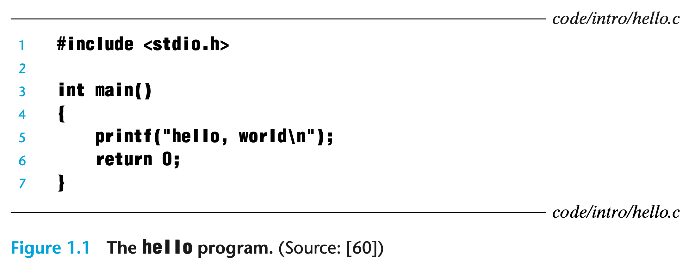

The hello program begins life as a *source program* (or *source file*) that the programmer creates with an editor and saves in a text file called hello.c. The source program is a sequence of bits, each with a value of 0 or 1, organized in 8-bit chunks called *bytes*. Each byte represents some text character in the program.

Most computer systems represent text characters using the ASCII standard that represents each character with a unique byte-size integer value. For example, Figure 1.2 shows the ASCII representation of the hello.c program.

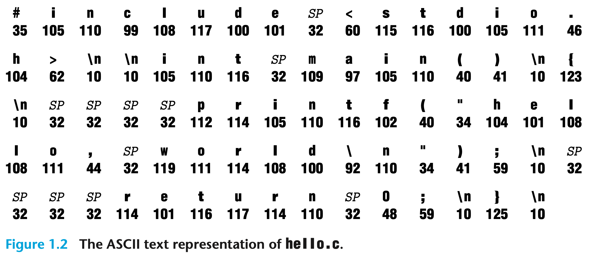

### Translation Process

The hello program begins life as a high-level C program because it can be read and understood by human beings in that form. However, in order to run hello.c on the system, the individual C statements must be translated by other programs into a sequence of low-level *machine-language* instructions. These instructions are then packaged in a form called an ***executable object program*** and stored as a binary disk file. Object programs are also referred to as *executable object files*.

```bash
gcc -o hello hello.c
```

Here, the gcc compiler driver reads the source file hello.c and translates it into an executable object file hello. The translation is performed in the sequence of four phases shown in Figure 1.3. The programs that perform the four phases (*preprocessor*, *compiler*, *assembler*, and *linker*) are known collectively as the *compilation system*.

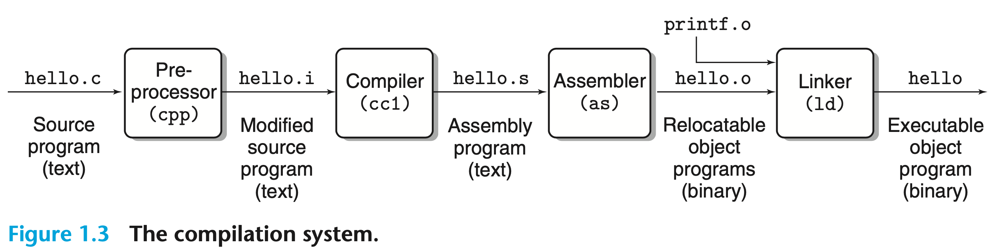

- *Preprocessing phase:* The preprocessor (cpp) modifies the original C program according to directives that begin with the ‘#’ character. For example, the #include <stdio.h> command in line 1 of hello.c tells the preprocessor to read the contents of the system header file stdio.h and insert it directly into the program text. The result is another C program, typically with the .i suffix.

- *Compilation phase:* The compiler (cc1) translates the text file hello.i into the text file hello.s, which contains an *assembly-language program*. This program includes the following definition of function main:

  ```assembly
  main:
  	subq 	$8, %rsp
  	movl 	$.LC0, %edi
  	call	puts
  	movl	$0, %eax
  	addq  $8, %rsp
  	ret
  
  ```

  Assembly language is useful because it provides a common output language for different compilers for different high-level languages. For example, C compilers and Fortran compilers both generate output files in the same assembly language.

- *Assembly phase:* Next, the assembler (as) translates hello.s into machine- language instructions, packages them in a form known as a *relocatable object program*, and stores the result in the object file hello.o. This file is a binary file containing 17 bytes to encode the instructions for function main.
- *Linking phase:* Notice that our hello program calls the printf function, which is part of the *standard C library* provided by every C compiler. The printf function resides in a separate precompiled object file called printf.o, which must somehow be merged with our hello.o program. The linker (ld) handles this merging. The result is the hello file, which is an executable object file (or simply *executable*) that is ready to be loaded into memory and executed by the system.

### General System Architectural 

To understand what happens to our hello program when we run it, we need to understand the hardware organization of a typical system, which is shown in Figure 1.4.

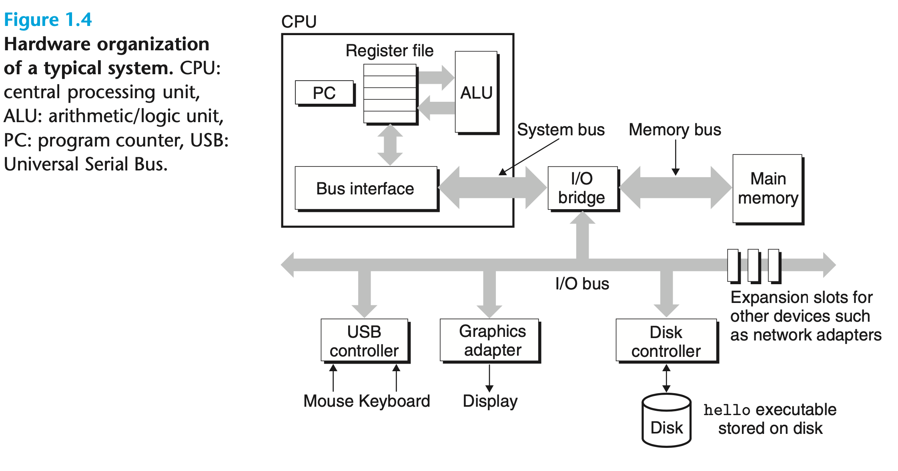

Buses

Running throughout the system is a collection of electrical conduits called *buses* that carry bytes of information back and forth between the components. Buses are typically designed to transfer fixed-size chunks of bytes known as *words*. The number of bytes in a word (the *word size*) is a fundamental system parameter that varies across systems. Most machines today have word sizes of either 4 bytes (32 bits) or 8 bytes (64 bits).

I/O Devices

Input/output (I/O) devices are the system’s connection to the external world. Our example system has four I/O devices: a keyboard and mouse for user input, a display for user output, and a disk drive (or simply disk) for long-term storage of data and programs. Initially, the executable hello program resides on the disk.

Each I/O device is connected to the I/O bus by either a *controller* or an *adapter*.

- Controllers are chip sets in the device itself or on the system’s main printed circuit board (often called the *motherboard*). 
- An adapter is a card that plugs into a slot on the motherboard. 

Regardless, the purpose of each is to transfer information back and forth between the I/O bus and an I/O device.

Main Memory

The *main memory* is a temporary storage device that holds both a program and the data it manipulates while the processor is executing the program. Physically, main memory consists of a collection of *dynamic random access memory* (DRAM) chips. Logically, memory is organized as a linear array of bytes, each with its own unique address (array index) starting at zero. In general, each of the machine instructions that constitute a program can consist of a variable number of bytes. The sizes of data items that correspond to C program variables vary according to type. For example, on an x86-64 machine running Linux, data of type short require 2 bytes, types int and float 4 bytes, and types long and double 8 bytes.

Processor

The *central processing unit* (CPU), or simply *processor*, is the engine that interprets (or *executes*) instructions stored in main memory. At its core is a word-size storage device (or *register*) called the *program counter* (PC). At any point in time, the PC points at (contains the address of) some machine-language instruction in main memory.

From the time that power is applied to the system until the time that the power is shut off, a processor repeatedly executes the instruction pointed at by the program counter and updates the program counter to point to the next instruction. A processor *appears* to operate according to a very simple instruction execution model, defined by its *instruction set architecture*. In this model, instructions execute in strict sequence, and executing a single instruction involves performing a series of steps. The processor reads the instruction from memory pointed at by the program counter (PC), interprets the bits in the instruction, performs some simple operation dictated by the instruction, and then updates the PC to point to the next instruction, which may or may not be contiguous in memory to the instruction that was just executed.

There are only a few of these simple operations, and they revolve around main memory, the *register file*, and the *arithmetic/logic unit* (ALU). 

- The register file is a small storage device that consists of a collection of word-size registers, each with its own unique name. 
- The ALU computes new data and address values. Here are some examples of the simple operations that the CPU might carry out at the request of an instruction:
	- **Load**: Copy a byte or a word from main memory into a register, overwriting the previous contents of the register.
	- **Store**: Copy a byte or a word from a register to a location in main memory, overwriting the previous contents of that location.
	- **Operate**: Copy the contents of two registers to the ALU, perform an arithmetic operation on the two words, and store the result in a register, overwriting the previous contents of that register.
	- **Jump**: Extract a word from the instruction itself and copy that word into the program counter (PC), overwriting the previous value of the PC.

We say that a processor appears to be a simple implementation of its instruction set architecture, but in fact modern processors use far more complex mechanisms to speed up program execution. Thus, we can distinguish the processor’s instruction set architecture, describing the effect of each machine-code instruction, from its *micro-architecture*, describing how the processor is actually implemented.

As we type the characters ./hello at the keyboard, the shell program reads each one into a register and then stores it in memory, as shown in Figure 1.5.When we hit the enter key on the keyboard, the shell knows that we have finished typing the command. The shell then loads the executable hello file by executing a sequence of instructions that copies the code and data in the hello object file from disk to main memory. The data includes the string of characters hello, world\n that will eventually be printed out.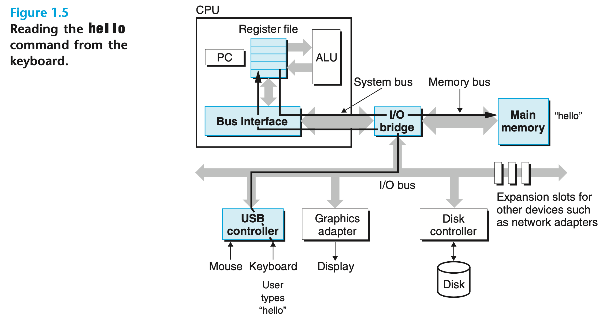

Using a technique known as *direct memory access* (DMA), the data travel directly from disk to main memory, without passing through the processor. This step is shown in Figure 1.6.

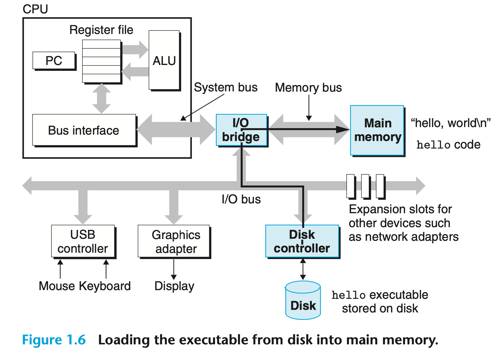

Once the code and data in the hello object file are loaded into memory, the processor begins executing the machine-language instructions in the hello program’s main routine. These instructions copy the bytes in the hello, world\n string from memory to the register file, and from there to the display device, where they are displayed on the screen. This step is shown in Figure 1.7.

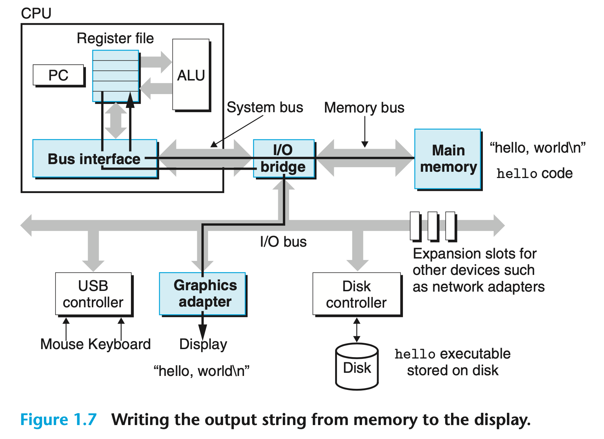

### Memory Hierarchy

An important lesson from this simple example is that a system spends a lot of time moving information from one place to another. The machine instructions in the hello program are originally stored on disk. When the program is loaded, they are copied to main memory. As the processor runs the program, instructions are copied from main memory into the processor. Similarly, the data string hello,world\n, originally on disk, is copied to main memory and then copied from main memory to the display device. From a programmer’s perspective, much of this copying is overhead that slows down the “real work” of the program. Thus, a major goal for system designers is to make these copy operations run as fast as possible.

 The processor can read data from the register file almost 100 times faster than from memory. Even more troublesome, as semiconductor technology progresses over the years, this *processor–memory gap* continues to increase. It is easier and cheaper to make processors run faster than it is to make main memory run faster.

To deal with the processor–memory gap, system designers include smaller, faster storage devices called *cache memories* (or simply caches) that serve as temporary staging areas for information that the processor is likely to need in the near future. Figure 1.8 shows the cache memories in a typical system. 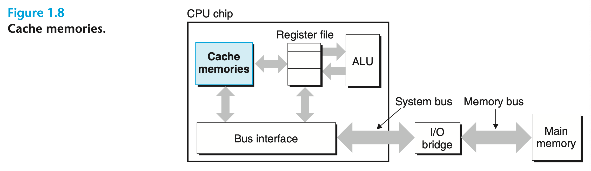

An *L1 cache* on the processor chip holds tens of thousands of bytes and can be accessed nearly as fast as the register file. A larger *L2 cache* with hundreds of thousands to millions of bytes is connected to the processor by a special bus. It might take 5 times longer for the processor to access the L2 cache than the L1 cache, but this is still 5 to 10 times faster than accessing the main memory. The L1 and L2 caches are implemented with a hardware technology known as *static random access memory* (SRAM). Newer and more powerful systems even have three levels of cache: L1, L2, and L3. The idea behind caching is that a system can get the effect of both a very large memory and a very fast one by exploiting *locality*, the tendency for programs to access data and code in localized regions. By setting up caches to hold data that are likely to be accessed often, we can perform most memory operations using the fast caches.

This notion of inserting a smaller, faster storage device (e.g., cache memory) between the processor and a larger, slower device (e.g., main memory) turns out to be a general idea. In fact, the storage devices in every computer system are organized as a *memory hierarchy* similar to Figure 1.9 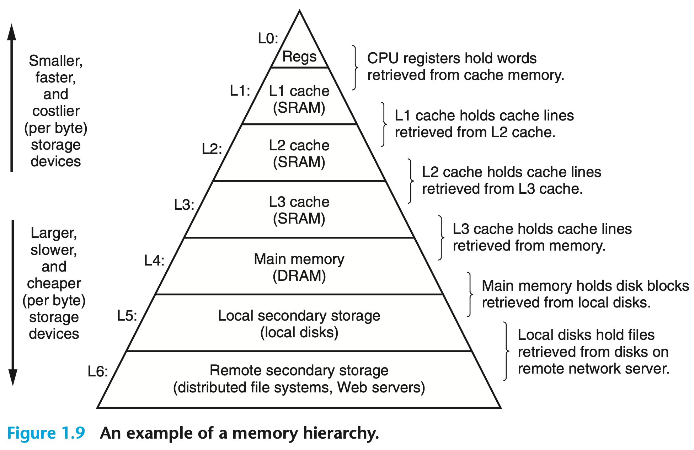As we move from the top of the hierarchy to the bottom, the devices become slower, larger, and less costly per byte. The register file occupies the top level in the hierarchy, which is known as level 0 or L0. We show three levels of caching L1 to L3, occupying memory hierarchy levels 1 to 3. Main memory occupies level 4, and so on.

The main idea of a memory hierarchy is that storage at one level serves as a cache for storage at the next lower level. Thus, the register file is a cache for the L1 cache. Caches L1 and L2 are caches for L2 and L3, respectively. The L3 cache is a cache for the main memory, which is a cache for the disk. On some networked systems with distributed file systems, the local disk serves as a cache for data stored on the disks of other systems.

### Operating System Layer

When the hello program printed its message, neither program accessed the keyboard, display, disk, or main memory directly. Rather, they relied on the services provided by the *operating system*. We can think of the operating system as a layer of software interposed between the application program and the hardware, as shown in Figure 1.10. 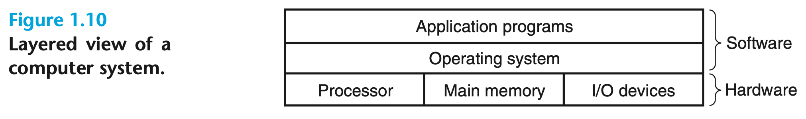All attempts by an application program to manipulate the hardware must go through the operating system.

The operating system has two primary purposes: 

1. to protect the hardware from misuse by runaway applications.
2. to provide applications with simple and uniform mechanisms for manipulating complicated and often wildly different low-level hardware devices. 

The operating system achieves both goals via the fundamental abstractions shown in Figure 1.11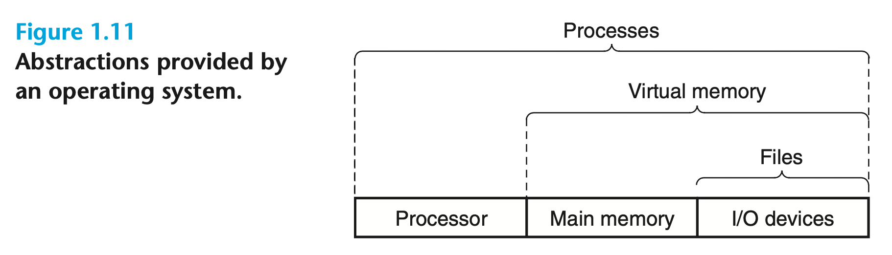 *processes*, *virtual memory*, and *files*. As this figure suggests, files are abstractions for I/O devices, virtual memory is an abstraction for both the main memory and disk I/O devices, and processes are abstractions for the processor, main memory, and I/O devices. 

#### Process

A *process* is the operating system’s abstraction for a running program. Multi- ple processes can run concurrently on the same system, and each process appears to have exclusive use of the hardware. By *concurrently*, we mean that the instructions of one process are interleaved with the instructions of another process. The operating system performs this interleaving with a mechanism known as **context switching**.

The operating system keeps track of all the state information that the process needs in order to run. This state, which is known as the *context*, includes information such as the current values of the PC, the register file, and the contents of main memory. At any point in time, a uniprocessor system can only execute the code for a single process. When the operating system decides to transfer control from the current process to some new process, it performs a *context switch* by saving the context of the current process, restoring the context of the new process, and then passing control to the new process. The new process picks up exactly where it left off. Figure 1.12 shows the basic idea for our example hello scenario.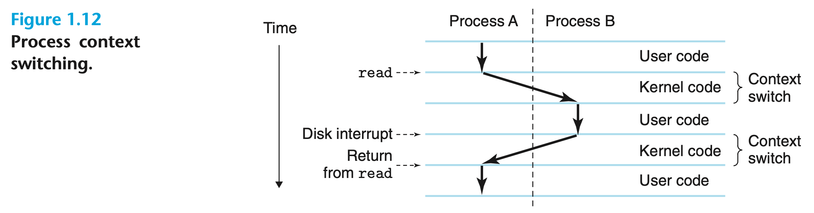

There are two concurrent processes in our example scenario: the shell process and the hello process. Initially, the shell process is running alone, waiting for input on the command line. When we ask it to run the hello program, the shell carries out our request by invoking a special function known as a **system call** that passes control to the operating system. The operating system saves the shell’s context, creates a new hello process and its context, and then passes control to the new hello process. After hello terminates, the operating system restores the context of the shell process and passes control back to it, where it waits for the next command-line input.

As Figure 1.12 indicates, the transition from one process to another is managed by the **operating system *kernel***. The kernel is the portion of the operating system code that is always resident in memory. When an application program requires some action by the operating system, such as to read or write a file, it executes a special *system call* instruction, transferring control to the kernel. The kernel then performs the requested operation and returns back to the application program. 

> _**Note:**_ kernel is not a separate process. Instead, it is a collection of code and data structures that the system uses to manage all the processes.

#### Thread

Although we normally think of a process as having a single control flow, in modern systems a process can actually consist of multiple execution units, called **threads**, each running in the context of the process and sharing the same code and global data. Threads are an increasingly important programming model because of the requirement for concurrency in network servers, because it is easier to share data between multiple threads than between multiple processes, and because threads are typically more efficient than processes. Multi-threading is also one way to make programs run faster when multiple processors are available.

#### Virtual Memory

*Virtual memory* is an abstraction that provides each process with the illusion that it has exclusive use of the main memory. Each process has the same uniform view of memory, which is known as its **virtual address space**. The virtual address space for Linux processes is shown in Figure 1.13. (Other Unix systems use a similar layout.)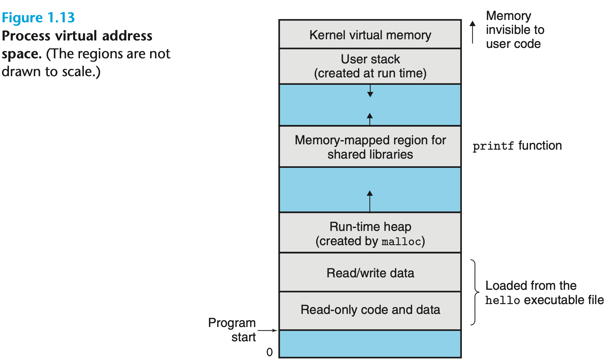 In Linux, the topmost region of the address space is reserved for code and data in the operating system that is common to all processes. The lower region of the address space holds the code and data defined by the user’s process. Note that addresses in the figure increase from the bottom to the top.

The virtual address space seen by each process consists of a number of well- defined areas, each with a specific purpose. 

- **Program code and data**: Code begins at the same fixed address for all processes, followed by data locations that correspond to global C variables. The code and data areas are initialized directly from the contents of an executable object file—in our case, the hello executable.
- **Heap**: The code and data areas are followed immediately by the run-time *heap*. Unlike the code and data areas, which are fixed in size once the process begins running, the heap expands and contracts dynamically at run time as a result of calls to C standard library routines such as malloc and free.

- **Shared libraries**: Near the middle of the address space is an area that holds the code and data for *shared libraries* such as the C standard library and the math library. The notion of a shared library is a powerful but somewhat difficult concept.
- **Stack**: At the top of the user’s virtual address space is the *user stack* that the compiler uses to implement function calls. Like the heap, the user stack expands and contracts dynamically during the execution of the program. In particular, each time we call a function, the stack grows. Each time we return from a function, it contracts.
- **Kernel virtual memory**: The top region of the address space is reserved for the kernel. Application programs are not allowed to read or write the contents of this area or to directly call functions defined in the kernel code. Instead, they must invoke the kernel to perform these operations.

For virtual memory to work, a sophisticated interaction is required between the hardware and the operating system software, including a hardware translation of every address generated by the processor. The basic idea is to store the contents of a process’s virtual memory on disk and then use the main memory as a cache for the disk.

#### Files

A *file* is a sequence of bytes, nothing more and nothing less. Every I/O device, including disks, keyboards, displays, and even networks, is modeled as a file. All input and output in the system is performed by reading and writing files, using a small set of system calls known as *Unix I/O*.

This simple and elegant notion of a file is nonetheless very powerful because it provides applications with a uniform view of all the varied I/O devices that might be contained in the system. For example, application programmers who manipulate the contents of a disk file are blissfully unaware of the specific disk technology. Further, the same program will run on different systems that use different disk technologies.

### Systems Communicate with Other Systems Using Networks

Up to this point in our tour of systems, we have treated a system as an isolated collection of hardware and software. In practice, modern systems are often linked to other systems by networks. From the point of view of an individual system, the network can be viewed as just another I/O device, as shown in Figure 1.14.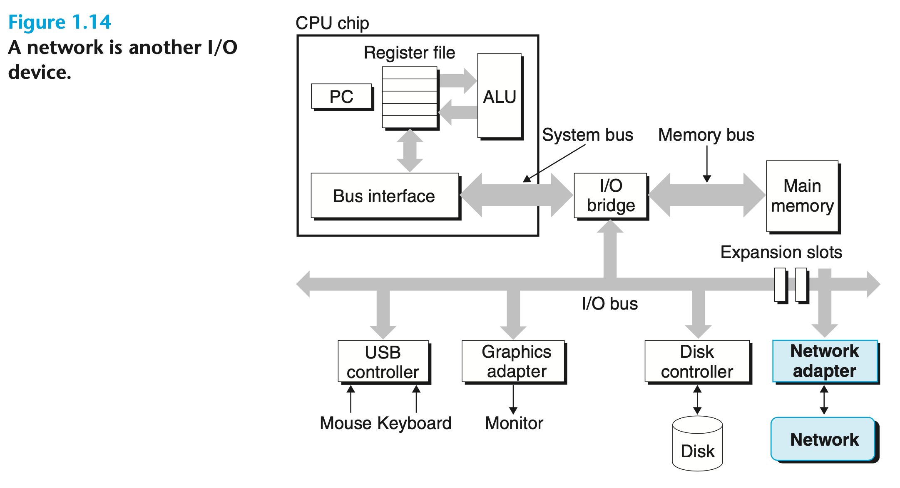 When the system copies a sequence of bytes from main memory to the network adapter, the data flow across the network to another machine. Similarly, the system can read data sent from other machines and copy these data to its main memory.

With the advent of global networks such as the Internet, copying information from one machine to another has become one of the most important uses of computer systems. For example, applications such as email, instant messaging, the World Wide Web, FTP, and telnet are all based on the ability to copy information over a network.

Returning to our hello example, we could use the familiar telnet application to run hello on a remote machine. Suppose we use a telnet *client* running on our local machine to connect to a telnet *server* on a remote machine. After we log in to the remote machine and run a shell, the remote shell is waiting to receive an input command. From this point, running the hello program remotely involves the five basic steps shown in Figure 1.15.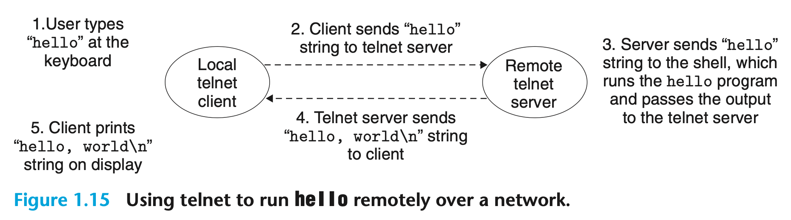

After we type in the hello string to the telnet client and hit the enter key, the client sends the string to the telnet server. After the telnet server receives the string from the network, it passes it along to the remote shell program. Next, the remote shell runs the hello program and passes the output line back to the telnet server. Finally, the telnet server forwards the output string across the network to the telnet client, which prints the output string on our local terminal.This type of exchange between clients and servers is typical of all network applications.

### Important Concepts

To close out this chapter, we highlight several important concepts that cut across all aspects of computer systems. We will discuss the importance of these concepts at multiple places within the book.

#### Amdahl’s Law

Gene Amdahl, one of the early pioneers in computing, made a simple but insightful observation about the effectiveness of improving the performance of one part of a system. This observation has come to be known as *Amdahl’s law*. The main idea is that when we speed up one part of a system, the effect on the overall system performance depends on both how significant this part was and how much it sped up. 

Consider a system in which executing some application requires time $T_{old}$. Suppose some part of the system requires a fraction $\alpha$ of this time, and that we improve its performance by a factor of $k$. That is, the component originally required time $\alpha T_{old}$, and it now requires time $\alpha T_{old}/ k$. The overall execution time would thus be
$$
T_{new} = (1 − \alpha)T_{old} + (\alpha T_{old})/k =T_{old}[(1−\alpha)+\alpha/k]
$$
From this, we can compute the speedup $S = T_{old}/T_{new}$ as
$$
S = \frac{1}{(1−\alpha)+\alpha/k}
$$
As an example, consider the case where a part of the system that initially consumed 60% of the time (α=0.6) is sped up by a factor of 3 (k=3). Then we get a speedup of 1/[0.4 + 0.6/3] = 1.67×. Even though we made a substantial improvement to a major part of the system, our net speedup was significantly less than the speedup for the one part. This is the major insight of Amdahl’s law— to significantly speed up the entire system, we must improve the speed of a very large fraction of the overall system.

One interesting special case of Amdahl’s law is to consider the effect of setting k to ∞. That is, we are able to take some part of the system and speed it up to the point at which it takes a negligible amount of time. We then get
$$
S_{\infty}=\frac{1}{(1 - \alpha)}
$$
So, for example, if we can speed up 60% of the system to the point where it requires close to no time, our net speedup will still only be 1/0.4 = 2.5×.

Amdahl’s law describes a general principle for improving any process. In addition to its application to speeding up computer systems, it can guide a company trying to reduce the cost of manufacturing razor blades, or a student trying to improve his or her grade point average. Perhaps it is most meaningful in the world of computers, where we routinely improve performance by factors of 2 or more. Such high factors can only be achieved by optimizing large parts of a system.

#### Concurrency and Parallelism

We use the term **concurrency** to refer to the general concept of a system with multiple, simultaneous activities, and the term *parallelism* to refer to the use of concurrency to make a system run faster. Parallelism can be exploited at multiple levels of abstraction in a computer system. We highlight three levels here, working from the highest to the lowest level in the system hierarchy.

##### Thread-Level Concurrency

Building on the process abstraction, we are able to devise systems where multiple programs execute at the same time, leading to *concurrency*. With threads, we can even have multiple control flows executing within a single process. Traditionally, this concurrent execution was only *simulated*, by having a single computer rapidly switch among its executing processes, much as a juggler keeps multiple balls flying through the air. Until recently, most actual computing was done by a single processor, even if that processor had to switch among multiple tasks. This configuration is known as a *uniprocessor system.*

When we construct a system consisting of multiple processors all under the control of a single operating system kernel, we have a *multiprocessor system*. Such systems have been available for large-scale computing since the 1980s, but they have more recently become commonplace with the advent of *multi-core* processors and *hyperthreading*. Figure 1.16 shows a taxonomy of these different processor types.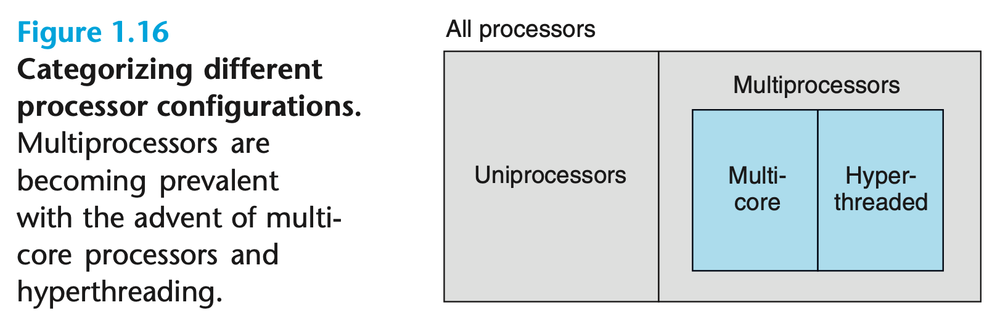

Multi-core processors have several CPUs (referred to as “cores”) integrated onto a single integrated-circuit chip. Figure 1.17 illustrates the organization of a typical multi-core processor, where the chip has four CPU cores, each with its own L1 and L2 caches, and with each L1 cache split into two parts—one to hold recently fetched instructions and one to hold data. The cores share higher levels of cache as well as the interface to main memory. Industry experts predict that they will be able to have dozens, and ultimately hundreds, of cores on a single chip.

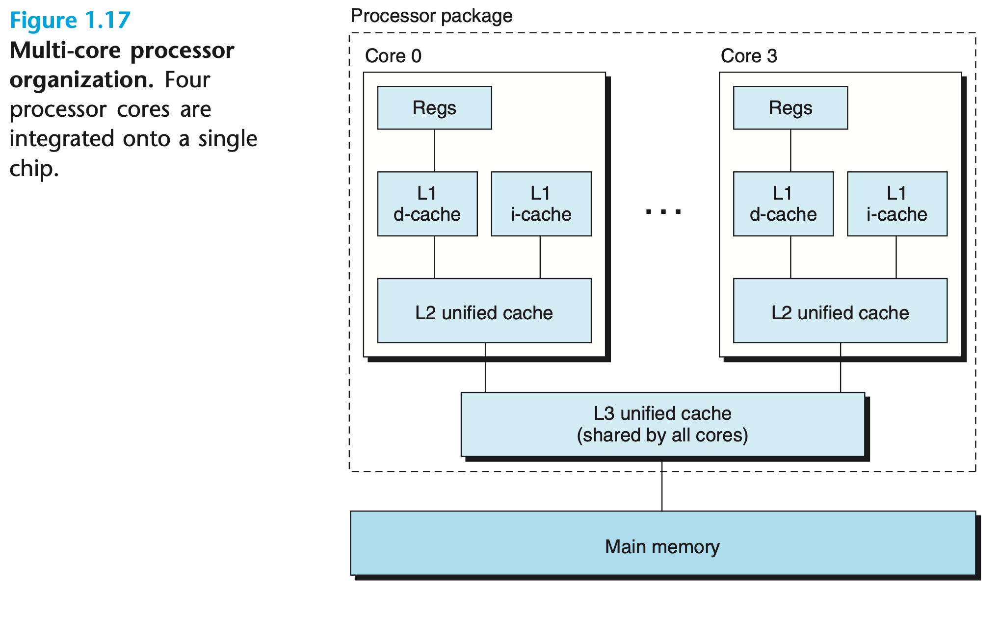

Hyperthreading, sometimes called *simultaneous multi-threading*, is a technique that allows a single CPU to execute multiple flows of control. It involves having multiple copies of some of the CPU hardware, such as program counters and register files, while having only single copies of other parts of the hardware, such as the units that perform floating-point arithmetic. Whereas a conventional processor requires around 20,000 clock cycles to shift between different threads, a hyperthreaded processor decides which of its threads to execute on a cycle-by-cycle basis. It enables the CPU to take better advantage of its processing resources. For example, if one thread must wait for some data to be loaded into a cache, the CPU can proceed with the execution of a different thread.

The use of multiprocessing can improve system performance in two ways. First, it reduces the need to simulate concurrency when performing multiple tasks. As mentioned, even a personal computer being used by a single person is expected to perform many activities concurrently. Second, it can run a single application program faster, but only if that program is expressed in terms of multiple threads that can effectively execute in parallel. Thus, although the principles of concurrency have been formulated and studied for over 50 years, the advent of multi-core and hyperthreaded systems has greatly increased the desire to find ways to write application programs that can exploit the thread-level parallelism available with Main memory the hardware.

##### Instruction-Level Parallelism

At a much lower level of abstraction, modern processors can execute multiple instructions at one time, a property known as *instruction-level parallelism*. For example, early microprocessors, such as the 1978-vintage Intel 8086, required multiple (typically 3–10) clock cycles to execute a single instruction. More recent processors can sustain execution rates of 2–4 instructions per clock cycle. Any given instruction requires much longer from start to finish, perhaps 20 cycles or more, but the processor uses a number of clever tricks to process as many as 100 instructions at a time. In Chapter 4, we will explore the use of *pipelining*, where the actions required to execute an instruction are partitioned into different steps and the processor hardware is organized as a series of stages, each performing one of these steps. The stages can operate in parallel, working on different parts of different instructions. We will see that a fairly simple hardware design can sustain an execution rate close to 1 instruction per clock cycle.

Processors that can sustain execution rates faster than 1 instruction per cycle are known as *superscalar* processors. Most modern processors support superscalar operation. In Chapter 5, we will describe a high-level model of such processors. We will see that application programmers can use this model to understand the performance of their programs. They can then write programs such that the generated code achieves higher degrees of instruction-level parallelism and therefore runs faster.

##### Single-Instruction, Multiple-Data (SIMD) Parallelism

At the lowest level, many modern processors have special hardware that allows a single instruction to cause multiple operations to be performed in parallel, a mode known as *single-instruction, multiple-data* (SIMD) parallelism. For example, recent generations of Intel and AMD processors have instructions that can add 8 pairs of single-precision floating-point numbers (C data type float) in parallel.

These SIMD instructions are provided mostly to speed up applications that process image, sound, and video data. Although some compilers attempt to automatically extract SIMD parallelism from C programs, a more reliable method is to write programs using special *vector* data types supported in compilers such as gcc. We describe this style of programming in Web Aside opt:simd, as a supplement to the more general presentation on program optimization found in Chapter 5

#### The Importance of Abstractions in Computer Systems

The use of *abstractions* is one of the most important concepts in computer science. For example, one aspect of good programming practice is to formulate a simple application program interface (API) for a set of functions that allow programmers to use the code without having to delve into its inner workings. Different programming languages provide different forms and levels of support for abstraction, such as Java class declarations and C function prototypes.

We have already been introduced to several of the abstractions seen in computer systems, as indicated in Figure 1.18.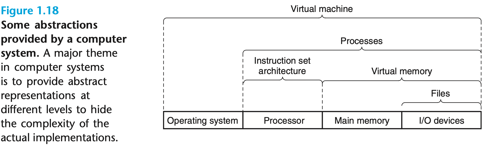 On the processor side, the *instruction set architecture* provides an abstraction of the actual processor hardware. With this abstraction, a machine-code program behaves as if it were executed on a processor that performs just one instruction at a time. The underlying hardware is far more elaborate, executing multiple instructions in parallel, but always in a way that is consistent with the simple, sequential model. By keeping the same execution model, different processor implementations can execute the same machine code while offering a range of cost and performance.

On the operating system side, we have introduced three abstractions: *files* as an abstraction of I/O devices, *virtual memory* as an abstraction of program memory, and *processes* as an abstraction of a running program. To these abstractions we add a new one: the *virtual machine*, providing an abstraction of the entire computer, including the operating system, the processor, and the programs. The idea of a virtual machine was introduced by IBM in the 1960s, but it has become more prominent recently as a way to manage computers that must be able to run programs designed for multiple operating systems (such as Microsoft Windows, Mac OS X, and Linux) or different versions of the same operating system.

### Summary

A computer system consists of hardware and systems software that cooperate to run application programs. Information inside the computer is represented as groups of bits that are interpreted in different ways, depending on the context. Programs are translated by other programs into different forms, beginning as ASCII text and then translated by compilers and linkers into binary executable files.

Processors read and interpret binary instructions that are stored in main memory. Since computers spend most of their time copying data between memory, I/O devices, and the CPU registers, the storage devices in a system are arranged in a hierarchy, with the CPU registers at the top, followed by multiple levels of hardware cache memories, DRAM main memory, and disk storage. Storage devices that are higher in the hierarchy are faster and more costly per bit than those lower in the hierarchy. Storage devices that are higher in the hierarchy serve as caches for devices that are lower in the hierarchy. Programmers can optimize the performance of their C programs by understanding and exploiting the memory hierarchy.

The operating system kernel serves as an intermediary between the application and the hardware. It provides three fundamental abstractions: (1) Files are abstractions for I/O devices. (2) Virtual memory is an abstraction for both main memory and disks. (3) Processes are abstractions for the processor, main memory, and I/O devices.

Finally, networks provide ways for computer systems to communicate with one another. From the viewpoint of a particular system, the network is just another I/O device.

## Chapter 2 Representing and Manipulating Information

### Information Storage

Rather than accessing individual bits in memory, most computers use blocks of 8 bits, or *bytes*, as the smallest addressable unit of memory. A machine-level program views memory as a very large array of bytes, referred to as **virtual memory**. Every byte of memory is identified by a unique number, known as its *address*, and the set of all possible addresses is known as the **virtual address space**.

#### Data Sizes

Every computer has a ***word size***, indicating the nominal size of pointer data. For a machine with a w-bit word size, the virtual addresses can range from 0 to $2^w$ − 1, giving the program access to at most $2^w$ bytes. A machines with 32-bit word sizes limits the virtual address space to 4 gigabytes (written 4 GB).

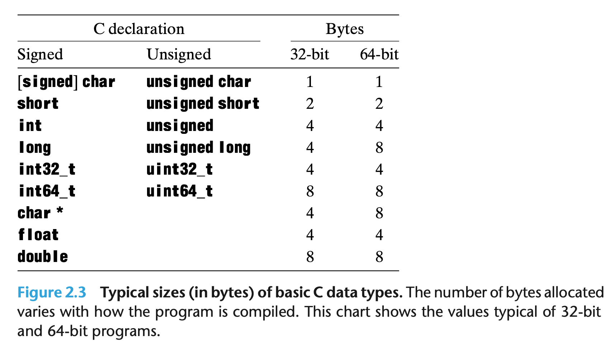

To avoid the vagaries of relying on “typical” sizes and different compiler settings, ISO C99 introduced a class of data types where the data sizes are fixed regardless of compiler and machine settings. Among these are data types int32_t and int64_t, having exactly 4 and 8 bytes, respectively. Using fixed-size integer types is the best way for programmers to have close control over data representations.

Most machines also support two different floating-point formats: single precision, declared in C as float, and double precision, declared in C as double. These formats use 4 and 8 bytes, respectively.

Computer representations use a limited number of bits to encode a number, and hence some operations can *overflow* when the results are too large to be represented. This can lead to some surprising results. On most of today’s computers (those using a 32-bit representation for data type int), computing the expression.

#### Number System

Human beings use *decimal* (base 10) number systems for counting and measurements. Computers use *binary* (base 2) number system, as they are made from binary digital components (known as transistors) operating in two states - on and off. In computing, we also use *hexadecimal* (base 16) or *octal* (base 8) number systems, as a *compact* form for representing binary numbers.

##### Binary Number System

Binary number system has two symbols: `0` and `1`, called *bits*. It is also a *positional notation*, for example,
$$
10110 = 10000 + 0000 + 100 + 10 + 0 = 1×2^4 + 0×2^3 + 1×2^2 + 1×2^1 + 0×2^0
$$

##### Hexadecimal (Base 16) Number System

Hexadecimal number system uses 16 symbols: `0`, `1`, `2`, `3`, `4`, `5`, `6`, `7`, `8`, `9`, `A`, `B`, `C`, `D`, `E`, and `F`, called *hex digits*. It is a *positional notation*, for example,
$$
0\times A3E = 0\times A00 + 0\times030 + 0\times E = 10×16^2 + 3×16^1 + 14×16^0
$$
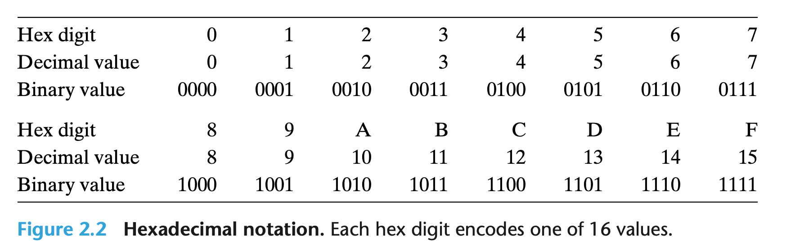

#### Conversion

##### Hexadecimal and Binary

**From Binary to Hex**: you convert binary to hexadecimal by first splitting it into groups of 4 bits each.
$$
1111001010110110110011 = 11\ \ 1100\ \ 1010\ \ 1101\ \ 1011\ \ 0011\\
=3CADB3
$$
**From Hex  to Binary**: Simply reserves the process for Hex to Binary
$$
A3C5 =\ \ 1010\ \ 0011\ \ 1100\ \ 0101
$$

##### Base r and Base 10

**Conversion from Base `r` to Decimal (Base 10)**: Given a *n*-digit base *r* number: $d_{n-1}d_{n-2}d_{n-3}...d_2d_1d_0$ (base r), the decimal equivalent is given by:
$$
d_{n-1}\times r^{n-1} +d_{n-2}\times r^{n-2} + \ldots d_1 \times r^{1} + d_0 \times r^{0}
$$
For examples,

```
0xA1C2 = 10×16^3 + 1×16^2 + 12×16^1 + 2 = 41410 (base 10)
10110 = 1×2^4 + 1×2^2 + 1×2^1 = 22 (base 10)
```

**Conversion from Base 10 to Base r**: Use repeated division/remainder. 

For example,

```
To convert 261(base 10) to hexadecimal:
  261/16 => quotient=16 remainder=5
  16/16  => quotient=1  remainder=0
  1/16   => quotient=0  remainder=1 (quotient=0 stop)
  Hence, 261 = 0x105 (Collect the hex digits from the remainder in reverse order)
```

The above procedure is actually applicable to conversion between any 2 base systems. For example,

```
To convert 1023(base 4) to base 3:
  1023(base 4)/3 => quotient=25D remainder=0
  25D/3          => quotient=8D  remainder=1
  8D/3           => quotient=2D  remainder=2
  2D/3           => quotient=0   remainder=2 (quotient=0 stop)
  Hence, 1023(base 4) = 2210(base 3)
```

##### Two Number Systems with Fractional Part

1. Separate the integral and the fractional parts.
2. For the integral part, divide by the target radix repeatably, and collect the ramainder in reverse order.
3. For the fractional part, multiply the fractional part by the target radix repeatably, and collect the integral part in the same order.

**Decimal to Binary**:

```
Convert 18.6875D to binary
Integral Part = 18D
  18/2 => quotient=9 remainder=0
  9/2  => quotient=4 remainder=1
  4/2  => quotient=2 remainder=0
  2/2  => quotient=1 remainder=0
  1/2  => quotient=0 remainder=1 (quotient=0 stop)
  Hence, 18D = 10010B
Fractional Part = .6875D
  .6875*2=1.375 => whole number is 1
  .375*2=0.75   => whole number is 0
  .75*2=1.5     => whole number is 1
  .5*2=1.0      => whole number is 1
  Hence .6875D = .1011B
Combine, 18.6875D = 10010.1011B
```

**Decimal to Hexadecimal**:

```
Convert 18.6875D to hexadecimal
Integral Part = 18D
  18/16 => quotient=1 remainder=2
  1/16  => quotient=0 remainder=1 (quotient=0 stop)
  Hence, 18D = 0x12
Fractional Part = .6875D
  .6875*16=11.0 => whole number is 11D (BH)
  Hence .6875D = 0x.B
Combine, 18.6875D = 0x12.B
```

#### Addressing and Byte Ordering

In virtually all machines, a multi-byte object is stored as a contiguous sequence of bytes, with the address of the object given by the smallest address of the bytes used. 

Some machines choose to store the object in memory ordered from least significant byte to most, while other machines store them from most to least. 

- **Little endian**: the least significant byte comes first.
- **Big endian**: the most significant byte comes first.

Suppose the variable x of type int and at address 0x100 has a hexadecimal value of 0x01234567. The ordering of the bytes within the address range 0x100 through 0x103 depends on the type of machine:

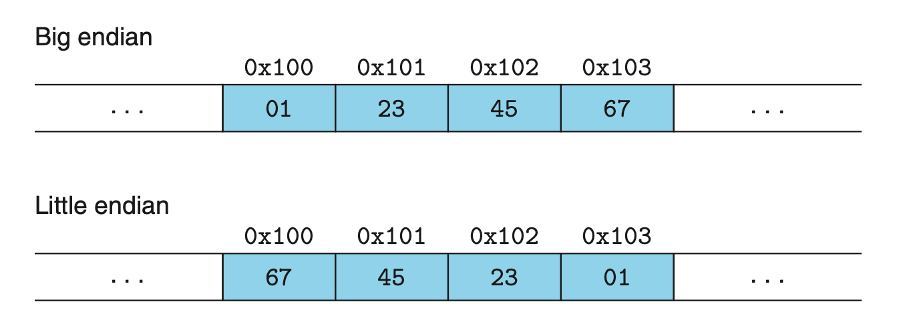

Byte ordering becomes an issue the first is when binary data are communicated over a network between different machines. A common problem is for data produced by a little-endian machine to be sent to a big-endian machine, or vice versa, leading to the bytes within the words being in reverse order for the receiving program. To avoid such problems, code written for networking applications must follow established conventions for byte ordering to make sure the sending machine converts its internal representation to the network standard, while the receiving machine converts the network standard to its internal representation. 

#### Introduction to Boolean Algebra

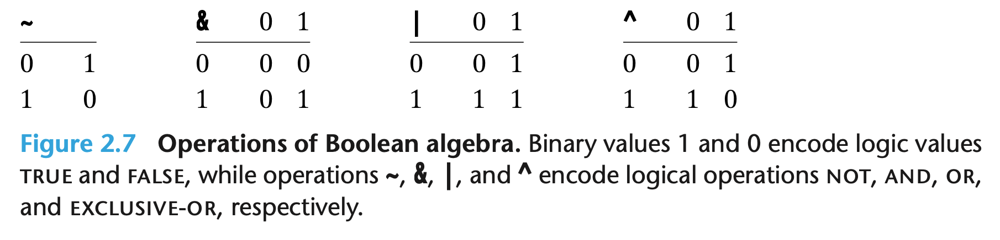

We can extend the four Boolean operations to also operate on *bit vectors*, strings of zeros and ones of some fixed length w. As examples, consider the case where w = 4, and with arguments a = [0110] and b = [1100]. Then the four operations a & b, a | b, a ^ b, and ~b yield

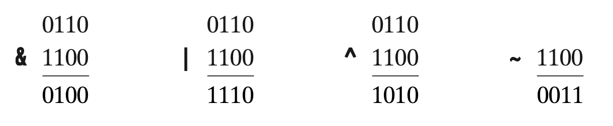

One common use of bit-level operations is to implement *masking* operations, where a mask is a bit pattern that indicates a selected set of bits within a word. As an example, the mask 0xFF (having ones for the least significant 8 bits) indicates the low-order byte of a word. The bit-level operation x & 0xFF yields a value consisting of the least significant byte of x, but with all other bytes set to 0. For example, with x = 0x89ABCDEF, the expression would yield 0x000000EF. 

#### Shift Operations in C

**Logical**: A logical right shift fills the left end with k zeros, giving a result [0, . . . , 0, $x_{w−1}$,$x_{w−2}$, . . . $x_{k}$].

**Arithmetic**: An arithmetic right shift fills the left end with k repetitions of the most significant bit, giving a result [$x_{w−1}$, . . . , $x_{w−1}$, $x_{w−1}$, $x_{w−2}$, . . . $x_{k}$]. This convention might seem peculiar, but as we will see, it is useful for operating on signed integer data.

Java has a precise definition of how right shifts should be performed. The expression x >> k shifts x arithmetically by k positions, while x >>> k shifts it logically.

#### Range of data types in C

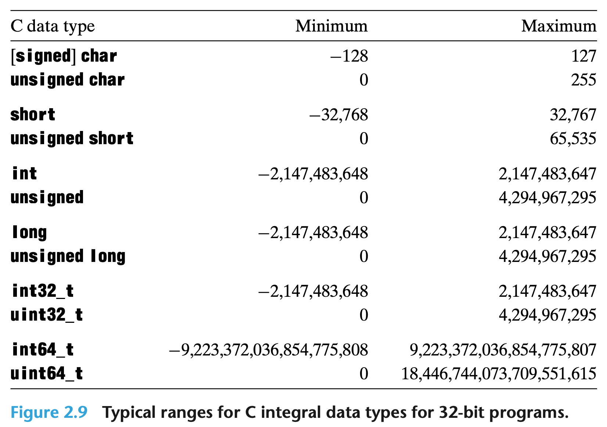

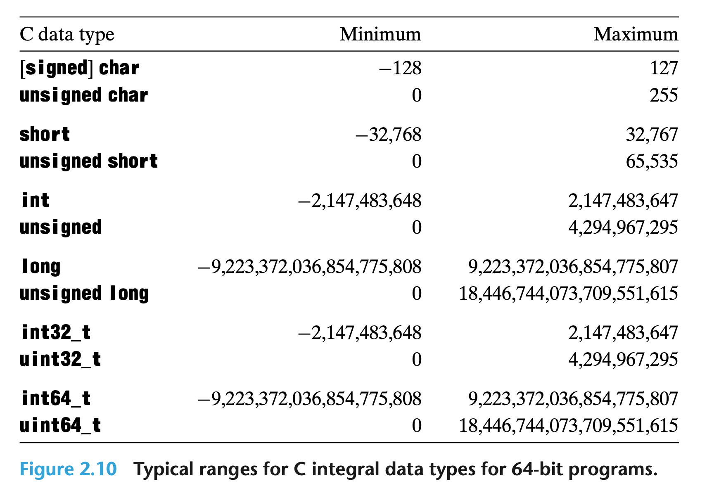

### Integer Representations

Computers use *a fixed number of bits* to represent an integer. The commonly-used bit-lengths for integers are 8-bit, 16-bit, 32-bit or 64-bit. Besides bit-lengths, there are two representation schemes for integers:

1. **Unsigned Integers**: can represent zero and positive integers.
2. **Signed Integers**: can represent zero, positive and negative integers. Three representation schemes had been proposed for signed integers:
   1. Sign-Magnitude representation
   2. 1's Complement representation
   3. 2's Complement representation

#### Unsigned Integers

Unsigned integers can represent zero and positive integers, but not negative integers. The value of an unsigned integer is interpreted as "*the magnitude of its underlying binary pattern*".

**Example 1:** Suppose that `n=8` and the binary pattern is` 0100 0001B`, the value of this unsigned integer is` 1×2^0 + 1×2^6 = 65`.

An *n*-bit pattern can represent $2^n$ distinct integers. An *n*-bit unsigned integer can represent integers from `0` to $2^n -1$, as tabulated below:

|  n   | Minimum |                       Maximum                       |
| :--: | :-----: | :-------------------------------------------------: |
|  8   |    0    |                   (2^8)-1  (=255)                   |
|  16  |    0    |                 (2^16)-1 (=65,535)                  |
|  32  |    0    |        (2^32)-1 (=4,294,967,295) (9+ digits)        |
|  64  |    0    | (2^64)-1 (=18,446,744,073,709,551,615) (19+ digits) |

#### Signed Integers

Signed integers can represent zero, positive integers, as well as negative integers. Three representation schemes are available for signed integers:

1. Sign-Magnitude representation
2. 1's Complement representation
3. 2's Complement representation

In all the above three schemes, the *most-significant bit* (msb) is called the *sign bit*. The sign bit is used to represent the *sign* of the integer - with 0 for positive integers and 1 for negative integers. The *magnitude* of the integer, however, is interpreted differently in different schemes.

##### n-bit Sign Integers in Sign-Magnitude Representation

In sign-magnitude representation:

- The most-significant bit (msb) is the *sign bit*, with value of 0 representing positive integer and 1 representing negative integer.
- The remaining *n*-1 bits represents the magnitude (absolute value) of the integer. The absolute value of the integer is interpreted as "the magnitude of the (*n*-1)-bit binary pattern".

**Example 1**: Suppose that `n=8` and the binary representation is` 0 100 0001B`.
  Sign bit is `0` ⇒ positive
  Absolute value is `100 0001B = 65D`
  Hence, the integer is `+65D`

**Example 2**: Suppose that `n=8` and the binary representation is` 1 000 0001B`.
  Sign bit is `1` ⇒ negative
  Absolute value is `000 0001B = 1D`
  Hence, the integer is `-1D`

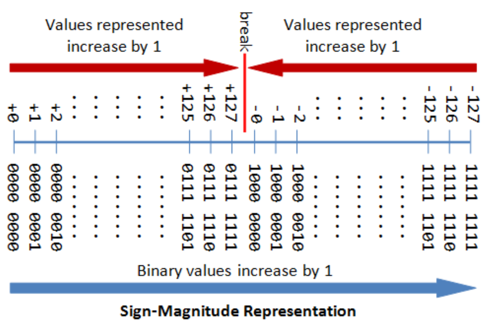

The drawbacks of sign-magnitude representation are:

1. There are two representations (`0000 0000B` and `1000 0000B`) for the number zero, which could lead to inefficiency and confusion.
2. Positive and negative integers need to be processed separately.

##### n-bit Sign Integers in 1's Complement Representation

In 1's complement representation:

- Again, the most significant bit (msb) is the *sign bit*, with value of 0 representing positive integers and 1 representing negative integers.
- The remaining n-1 bits represents the magnitude of the integer, as follows:
  - for positive integers, the absolute value of the integer is equal to "the magnitude of the (*n*-1)-bit binary pattern".
  - for negative integers, the absolute value of the integer is equal to "the magnitude of the *complement* (*inverse*) of the (*n*-1)-bit binary pattern" (hence called 1's complement).

**Example 1**: Suppose that `n=8` and the binary representation` 0 100 0001B`.
  Sign bit is `0` ⇒ positive
  Absolute value is `100 0001B = 65D`
  Hence, the integer is `+65D`

**Example 2**: Suppose that `n=8` and the binary representation` 1 000 0001B`.
  Sign bit is `1` ⇒ negative
  Absolute value is the complement of `000 0001B`, i.e., `111 1110B = 126D`
  Hence, the integer is `-126D`

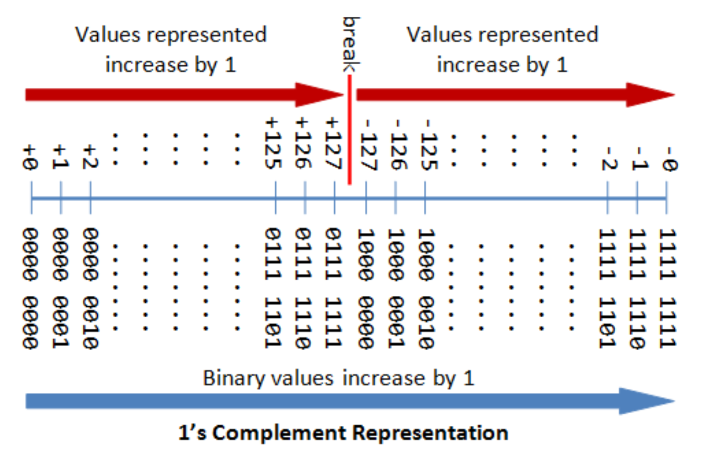

Again, the drawbacks are:

1. There are two representations (`0000 0000B` and `1111 1111B`) for zero.
2. The positive integers and negative integers need to be processed separately.

##### n-bit Sign Integers in 2's Complement Representation

In 2's complement representation:

- the most significant bit (msb) is the *sign bit*, with value of 0 representing positive integers and 1 representing negative integers.
- The remaining n-1 bits represents the magnitude of the integer, as follows:
  - for positive integers, the absolute value of the integer is equal to "the magnitude of the (*n*-1)-bit binary pattern".
  - for negative integers, the absolute value of the integer is equal to "the magnitude of the *complement* of the (*n*-1)-bit binary pattern *plus one*" (hence called 2's complement).

**Example 1**: Suppose that `n=8` and the binary representation` 0 100 0001B`.
  Sign bit is `0` ⇒ positive
  Absolute value is `100 0001B = 65D`
  Hence, the integer is `+65D`

**Example 2**: Suppose that `n=8` and the binary representation` 1 000 0001B`.
  Sign bit is `1` ⇒ negative
  Absolute value is the complement of `000 0001B` plus `1`, i.e., `111 1110B + 1B = 127D`
  Hence, the integer is `-127D`

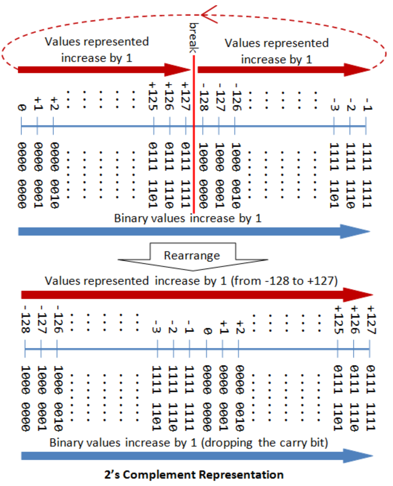

The following diagram explains how the 2's complement works. By re-arranging the number line, values from `-128` to `+127` are represented contiguously by ignoring the carry bit.

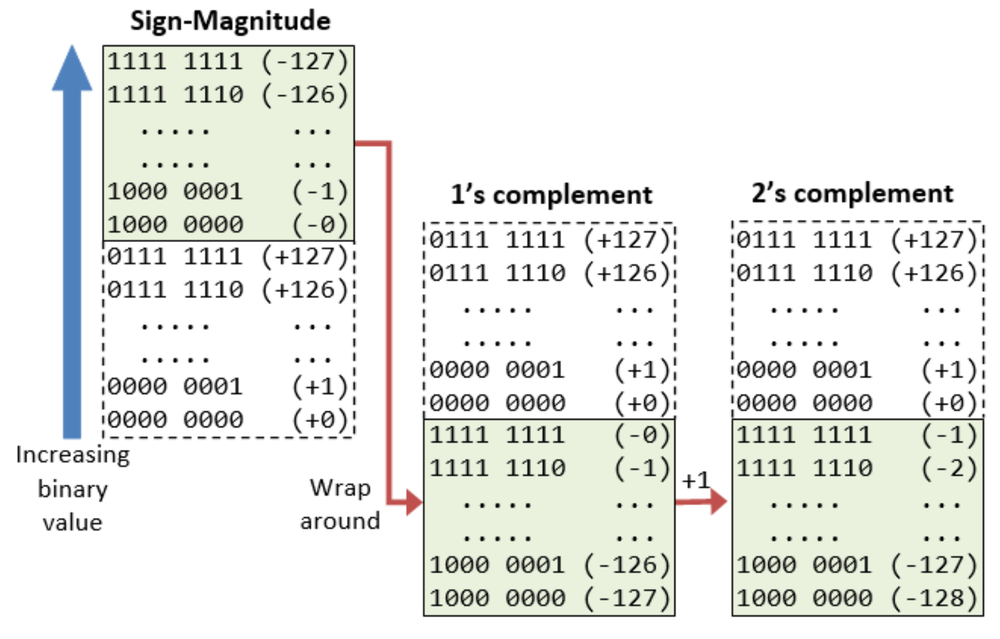

#### Conversions between Signed and Unsigned

The effect of casting is to keep the bit values identical but change how these bits are interpreted.When an operation is performed where one operand is signed and the other is unsigned, C implicitly casts the signed argument to unsigned and performs the operations assuming the numbers are nonnegative. When converting from short to unsigned, the program first changes the size and then the type.

> _**Note**_: Be aware of casting between signed and unsigned, it may cause unintentional behaviour.

### Integer Arithmetic

An arithmetic operation is said to *overflow* when the full integer result cannot fit within the word size limits of the data type.

#### Unsigned Negation

When x = 0, the additive inverse is clearly 0. For x > 0, consider the value $2^w − x$.

#### Detecting Overflow For unsigned

For x and y in the range $0≤x,y≤Max_w$,let $s= x+y$.Then the computation of s overflowed if and only if s < x (or equivalently, s < y).

##### Detecting Overflow For Two’s-Complement

For x and y in the range $Min_w ≤ x,y≤ Max_w$,let $s= x+y$. Then the computation of s has had positive overflow if and only if x > 0 and y > 0 but s ≤ 0. The computation has had negative overflow if and only if x < 0 and y < 0 but s ≥ 0.

#### Two’s-Complement Negation

For w-bit two’s-complement addition, $TMin_w$ is its own additive inverse, while any other value x has −x as its additive inverse.

Getting  two’s-complement negation:

- In C, we can state that for any integer value x, computing the expressions x and ~x + 1 will give identical results.
- A second way to perform two’s-complement negation of a number x is based on splitting the bit vector into two parts. Let k be the position of the rightmost 1, and complement each bit to the left of bit position k.

#### Unsigned Multiplication

For x and y such that $0 ≤ x, y ≤ UMax_w$, let s be the multiplication result of two unsigned number, then
$$
s=(x\ y)\ mod\ 2^w
$$

#### Two’s-Complement Multiplication

Instead, signed multi-plication in C generally is performed by truncating the 2w bit product to w bits. Truncating a two’s-complement number to w bits is equivalent to first computing its value modulo $2^w$ and then converting from unsigned to two’s complement, giving the following

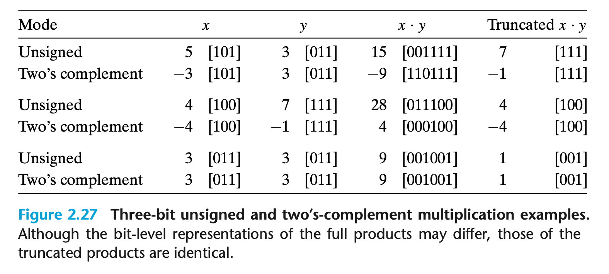

#### Multiplying by Constants

The integer multiply instruction on many machines was fairly slow, it requires clock cycles than addition, subtraction, bit-level operations, and shifting—required only 1 clock cycle. As a consequence, one important optimization used by compilers is to attempt to replace multiplications by constant factors with combinations of shift and addition operations. 

Given that integer multiplication is more costly than shifting and adding, many C compilers try to remove many cases where an integer is being multiplied by a constant with combinations of shifting, adding, and subtracting. For example, suppose a program contains the expression $x*14$. Recognizing that $14 = 2^3 + 2^2 + 2^1$, the compiler can rewrite the multiplication as (x<<3) + (x<<2) + (x<<1), replacing one multiplication with three shifts and two additions. The two computations will yield the same result, regardless of whether x is unsigned or two’s complement, and even if the multiplication would cause an overflow. Even better, the compiler can also use the property $14 = 2^4 − 2^1$ to rewrite the multiplication as (x<<4) - (x<<1), requiring only two shifts and a subtraction.

#### Dividing by Powers of 2

Integer division on most machines is even slower than integer multiplication— requiring 30 or more clock cycles.

##### Unsigned division by a power of 2

For C variables x and k with unsigned values x and k, such that 0 ≤ k < w, the C

expression x >> k yields the value ⌊x/2k⌋.

##### Two’s-complement division by a power of 2, rounding down

Let C variables x and k have two’s-complement value x and unsigned value k, respectively, such that 0 ≤ k < w. The C expression x >> k, when the shift is performed arithmetically, yields the value ⌊x/2k⌋.

### Floating Point

A floating-point number (or real number) can represent a very large (`1.23×10^88`) or a very small (`1.23×10^-88`) value. It could also represent very large negative number (`-1.23×10^88`) and very small negative number (`-1.23×10^88`), as well as zero, as illustrated:

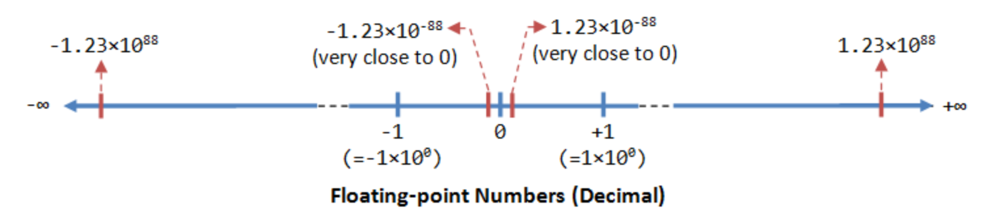

A floating-point number is typically expressed in the scientific notation, with a *fraction* (`F`), and an *exponent* (`E`) of a certain *radix* (`r`), in the form of `F×r^E`. Decimal numbers use radix of 10 (`F×10^E`); while binary numbers use radix of 2 (`F×2^E`).

Representation of floating point number is not unique. For example, the number `55.66` can be represented as `5.566×10^1`, `0.5566×10^2`, `0.05566×10^3`, and so on. The fractional part can be *normalized*. In the normalized form, there is only a single non-zero digit before the radix point. For example, decimal number `123.4567` can be normalized as `1.234567×10^2`; binary number `1010.1011B` can be normalized as `1.0101011B×2^3`.

It is important to note that floating-point numbers suffer from *loss of precision* when represented with a fixed number of bits (e.g., 32-bit or 64-bit). This is because there are *infinite* number of real numbers (even within a small range of says 0.0 to 0.1). On the other hand, a *n*-bit binary pattern can represent a *finite* `2^n` distinct numbers. Hence, not all the real numbers can be represented. The nearest approximation will be used instead, resulted in loss of accuracy.

It is also important to note that floating number arithmetic is very much less efficient than integer arithmetic. It could be speed up with a so-called dedicated *floating-point co-processor*. Hence, use integers if your application does not require floating-point numbers.

In computers, floating-point numbers are represented in scientific notation of *fraction* (`F`) and *exponent* (`E`) with a *radix* of 2, in the form of `F×2^E`. Both `E` and `F` can be positive as well as negative. Modern computers adopt IEEE 754 standard for representing floating-point numbers. There are two representation schemes: 32-bit single-precision and 64-bit double-precision.

#### IEEE-754 32-bit Single-Precision Floating-Point Numbers

In 32-bit single-precision floating-point representation:

- The most significant bit is the *sign bit* (`S`), with 0 for positive numbers and 1 for negative numbers.
- The following 8 bits represent *exponent* (`E`).
- The remaining 23 bits represents *fraction* (`F`).

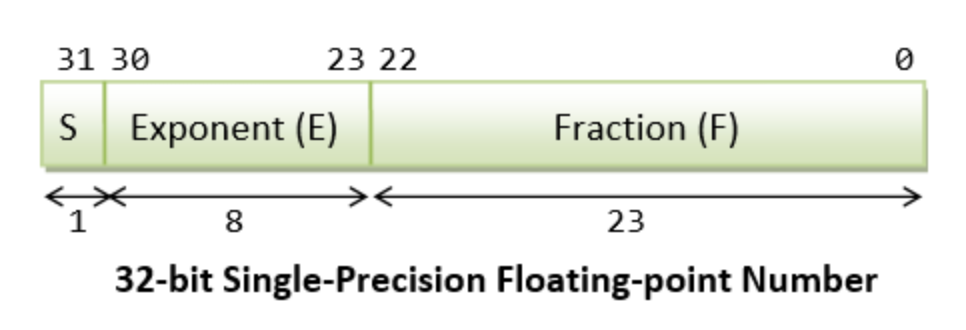

##### Normalized Form

Let's illustrate with an example, suppose that the 32-bit pattern is `1 1000 0001 011 0000 0000 0000 0000 0000`, with:

- `S = 1`
- `E = 1000 0001`
- `F = 011 0000 0000 0000 0000 0000`

In the *normalized form*, the actual fraction is normalized with an implicit leading 1 in the form of `1.F`. In this example, the actual fraction is `1.011 0000 0000 0000 0000 0000 = 1 + 1×2^-2 + 1×2^-3 = 1.375D`.

The sign bit represents the sign of the number, with `S=0` for positive and `S=1` for negative number. In this example with `S=1`, this is a negative number, i.e., `-1.375D`.

In normalized form, the actual exponent is `E-127` (so-called excess-127 or bias-127). This is because we need to represent both positive and negative exponent. With an 8-bit E, ranging from 0 to 255, the excess-127 scheme could provide actual exponent of -127 to 128. In this example, `E-127=129-127=2D`.

Hence, the number represented is `-1.375×2^2=-5.5D`.

**Example 1:** Suppose that IEEE-754 32-bit floating-point representation pattern is `0 10000000 110 0000 0000 0000 0000 0000`.

```
Sign bit S = 0 ⇒ positive number
E = 1000 0000B = 128D (in normalized form)
Fraction is 1.11B (with an implicit leading 1) = 1 + 1×2^-1 + 1×2^-2 = 1.75D
The number is +1.75 × 2^(128-127) = +3.5D
```

**Example 2:** Suppose that IEEE-754 32-bit floating-point representation pattern is `1 01111110 100 0000 0000 0000 0000 0000`.

```
Sign bit S = 1 ⇒ negative number
E = 0111 1110B = 126D (in normalized form)
Fraction is 1.1B  (with an implicit leading 1) = 1 + 2^-1 = 1.5D
The number is -1.5 × 2^(126-127) = -0.75D
```

##### De-Normalized Form

Normalized form has a serious problem, with an implicit leading 1 for the fraction, it cannot represent the number zero! Convince yourself on this!

De-normalized form was devised to represent zero and other numbers.

For `E=0`, the numbers are in the de-normalized form. An implicit leading 0 (instead of 1) is used for the fraction; and the actual exponent is always `-126`. Hence, the number zero can be represented with `E=0` and `F=0` (because `0.0×2^-126=0`).

We can also represent very small positive and negative numbers in de-normalized form with `E=0`. For example, if `S=1`, `E=0`, and `F=011 0000 0000 0000 0000 0000`. The actual fraction is `0.011=1×2^-2+1×2^-3=0.375D`. Since `S=1`, it is a negative number. With `E=0`, the actual exponent is `-126`. Hence the number is `-0.375×2^-126 = -4.4×10^-39`, which is an extremely small negative number (close to zero).

**Example of De-Normalized Form:** Suppose that IEEE-754 32-bit floating-point representation pattern is `1 00000000 000 0000 0000 0000 0000 0001`.

```
Sign bit S = 1 ⇒ negative number
E = 0 (in de-normalized form)
Fraction is 0.000 0000 0000 0000 0000 0001B  (with an implicit leading 0) = 1×2^-23
The number is -2^-23 × 2^(-126) = -2×(-149) ≈ -1.4×10^-45
```

##### Summary

In summary, the value (`N`) is calculated as follows:

- For `1 ≤ E ≤ 254, N = (-1)^S × 1.F × 2^(E-127)`. These numbers are in the so-called *normalized* form. The sign-bit represents the sign of the number. Fractional part (`1.F`) are normalized with an implicit leading 1. The exponent is bias (or in excess) of `127`, so as to represent both positive and negative exponent. The range of exponent is `-126` to `+127`.
- For `E = 0, N = (-1)^S × 0.F × 2^(-126)`. These numbers are in the so-called *denormalized* form. The exponent of `2^-126` evaluates to a very small number. Denormalized form is needed to represent zero (with `F=0` and `E=0`). It can also represents very small positive and negative number close to zero.
- For `E = 255`, it represents special values, such as `±INF` (positive and negative infinity) and `NaN` (not a number).

#### IEEE-754 64-bit Double-Precision Floating-Point Numbers

The representation scheme for 64-bit double-precision is similar to the 32-bit single-precision:

- The most significant bit is the *sign bit* (`S`), with 0 for positive numbers and 1 for negative numbers.
- The following 11 bits represent *exponent* (`E`).
- The remaining 52 bits represents *fraction* (`F`).

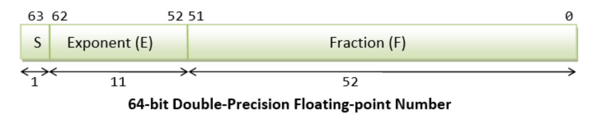

The value (`N`) is calculated as follows:

- Normalized form: For `1 ≤ E ≤ 2046, N = (-1)^S × 1.F × 2^(E-1023)`.
- Denormalized form: For `E = 0, N = (-1)^S × 0.F × 2^(-1022)`. These are in the denormalized form.
- For `E = 2047`, `N` represents special values, such as `±INF` (infinity), `NaN` (not a number).

#### More on Floating-Point Representation

There are three parts in the floating-point representation:

- The *sign bit* (`S`) is self-explanatory (0 for positive numbers and 1 for negative numbers).
- For the *exponent* (`E`), a so-called *bias* (or *excess*) is applied so as to represent both positive and negative exponent. The bias is set at half of the range. For single precision with an 8-bit exponent, the bias is 127 (or excess-127). For double precision with a 11-bit exponent, the bias is 1023 (or excess-1023).
- The *fraction* (`F`) (also called the *mantissa* or *significand*) is composed of an implicit leading bit (before the radix point) and the fractional bits (after the radix point). The leading bit for normalized numbers is 1; while the leading bit for denormalized numbers is 0.

##### Normalized Floating-Point Numbers

In normalized form, the radix point is placed after the first non-zero digit, e,g., `9.8765D×10^-23D`, `1.001011B×2^11B`. For binary number, the leading bit is always 1, and need not be represented explicitly - this saves 1 bit of storage.

In IEEE 754's normalized form:

- For single-precision, `1 ≤ E ≤ 254` with excess of 127. Hence, the actual exponent is from `-126` to `+127`. Negative exponents are used to represent small numbers (< 1.0); while positive exponents are used to represent large numbers (> 1.0).
    `N = (-1)^S × 1.F × 2^(E-127)`
- For double-precision, `1 ≤ E ≤ 2046` with excess of 1023. The actual exponent is from `-1022` to `+1023`, and
    `N = (-1)^S × 1.F × 2^(E-1023)`

The *minimum* and *maximum* normalized floating-point numbers are:

| Precision |                      Normalized N(min)                       |                      Normalized N(max)                       |
| :-------: | :----------------------------------------------------------: | :----------------------------------------------------------: |
|  Single   | 0080 0000H 0 00000001 00000000000000000000000B E = 1, F = 0 N(min) = 1.0B × 2^-126 (≈1.17549435 × 10^-38) | 7F7F FFFFH 0 11111110 00000000000000000000000B E = 254, F = 0 N(max) = 1.1...1B × 2^127 = (2 - 2^-23) × 2^127 (≈3.4028235 × 10^38) |
|  Double   | 0010 0000 0000 0000H N(min) = 1.0B × 2^-1022 (≈2.2250738585072014 × 10^-308) | 7FEF FFFF FFFF FFFFH N(max) = 1.1...1B × 2^1023 = (2 - 2^-52) × 2^1023 (≈1.7976931348623157 × 10^308) |

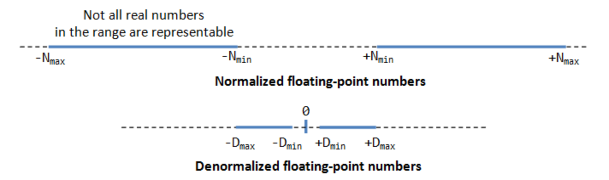

##### Denormalized Floating-Point Numbers

If `E = 0`, but the fraction is non-zero, then the value is in denormalized form, and a leading bit of 0 is assumed, as follows:

- For single-precision, `E = 0`,
    `N = (-1)^S × 0.F × 2^(-126)`
- For double-precision, `E = 0`,
    `N = (-1)^S × 0.F × 2^(-1022)`

Denormalized form can represent very small numbers closed to zero, and zero, which cannot be represented in normalized form, as shown in the above figure.

The minimum and maximum of *denormalized floating-point numbers* are:

| Precision |                     Denormalized D(min)                      |                     Denormalized D(max)                      |
| :-------: | :----------------------------------------------------------: | :----------------------------------------------------------: |
|  Single   | 0000 0001H 0 00000000 00000000000000000000001B E = 0, F = 00000000000000000000001B D(min) = 0.0...1 × 2^-126 = 1 × 2^-23 × 2^-126 = 2^-149 (≈1.4 × 10^-45) | 007F FFFFH 0 00000000 11111111111111111111111B E = 0, F = 11111111111111111111111B D(max) = 0.1...1 × 2^-126 = (1-2^-23)×2^-126 (≈1.1754942 × 10^-38) |
|  Double   | 0000 0000 0000 0001H D(min) = 0.0...1 × 2^-1022 = 1 × 2^-52 × 2^-1022 = 2^-1074 (≈4.9 × 10^-324) | 001F FFFF FFFF FFFFH D(max) = 0.1...1 × 2^-1022 = (1-2^-52)×2^-1022 (≈4.4501477170144023 × 10^-308) |

The value encoded by a given bit representation can be divided into three different cases (the latter having two variants), depending on the value of exp. These are illustrated in Figure 2.33 for the single-precision format: 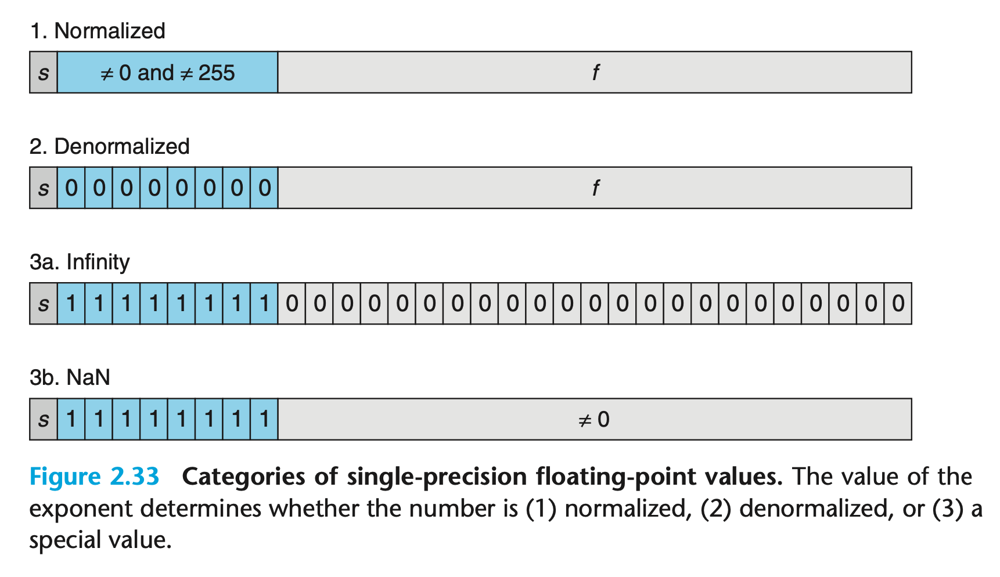

### Character Encoding

In computer memory, character are "encoded" (or "represented") using a chosen "character encoding schemes" (aka "character set", "charset", "character map", or "code page").

For example, in ASCII (as well as Latin1, Unicode, and many other character sets):

- code numbers `65D (41H)` to `90D (5AH)` represents `'A'` to `'Z'`, respectively.
- code numbers `97D (61H)` to `122D (7AH)` represents `'a'` to `'z'`, respectively.
- code numbers `48D (30H)` to `57D (39H)` represents `'0'` to `'9'`, respectively.

It is important to note that the representation scheme must be known before a binary pattern can be interpreted. E.g., the 8-bit pattern "`0100 0010B`" could represent anything under the sun known only to the person encoded it.

The most commonly-used character encoding schemes are: 7-bit ASCII (ISO/IEC 646) and 8-bit Latin-x (ISO/IEC 8859-x) for western european characters, and Unicode (ISO/IEC 10646) for internationalization (i18n).

A 7-bit encoding scheme (such as ASCII) can represent 128 characters and symbols. An 8-bit character encoding scheme (such as Latin-x) can represent 256 characters and symbols; whereas a 16-bit encoding scheme (such as Unicode UCS-2) can represents 65,536 characters and symbols.

#### 7-bit ASCII Code (aka US-ASCII, ISO/IEC 646, ITU-T T.50)

ASCII (American Standard Code for Information Interchange) is one of the earlier character coding schemes. ASCII is originally a 7-bit code. It has been extended to 8-bit to better utilize the 8-bit computer memory organization. (The 8th-bit was originally used for *parity check* in the early computers.) Code numbers `32D (20H)` to `126D (7EH)` are printable (displayable) characters as tabulated (arranged in hexadecimal and decimal) as follows:

| Hex  |  0   |  1   |  2   |  3   |  4   |  5   |  6   |  7   |  8   |  9   |  A   |  B   |  C   |  D   |  E   |  F   |
| :--: | :--: | :--: | :--: | :--: | :--: | :--: | :--: | :--: | :--: | :--: | :--: | :--: | :--: | :--: | :--: | :--: |
|  2   |  SP  |  !   |  "   |  #   |  $   |  %   |  &   |  '   |  (   |  )   |  *   |  +   |  ,   |  -   |  .   |  /   |
|  3   |  0   |  1   |  2   |  3   |  4   |  5   |  6   |  7   |  8   |  9   |  :   |  ;   |  <   |  =   |  >   |  ?   |
|  4   |  @   |  A   |  B   |  C   |  D   |  E   |  F   |  G   |  H   |  I   |  J   |  K   |  L   |  M   |  N   |  O   |
|  5   |  P   |  Q   |  R   |  S   |  T   |  U   |  V   |  W   |  X   |  Y   |  Z   |  [   |  \   |  ]   |  ^   |  _   |
|  6   |  `   |  a   |  b   |  c   |  d   |  e   |  f   |  g   |  h   |  i   |  j   |  k   |  l   |  m   |  n   |  o   |
|  7   |  p   |  q   |  r   |  s   |  t   |  u   |  v   |  w   |  x   |  y   |  z   |  {   |  \|  |  }   |  ~   |      |

- Code number `32D (20H)` is the *blank* or *space* character.
- `'0'` to `'9'`: `30H-39H (0011 0001B to 0011 1001B)` or `(0011 xxxxB` where `xxxx` is the equivalent integer value`)`
- `'A'` to `'Z'`: `41H-5AH (0101 0001B to 0101 1010B)` or `(010x xxxxB)`. `'A'` to `'Z'` are continuous without gap.
- `'a'` to `'z'`: `61H-7AH (0110 0001B to 0111 1010B)` or `(011x xxxxB)`. `'A'` to `'Z'` are also continuous without gap. However, there is a gap between uppercase and lowercase letters. To convert between upper and lowercase, flip the value of bit-5.

Code numbers `0D (00H)` to `31D (1FH)`, and `127D (7FH)` are special control characters, which are non-printable (non-displayable), as tabulated below. Many of these characters were used in the early days for transmission control (e.g., STX, ETX) and printer control (e.g., Form-Feed), which are now obsolete. The remaining meaningful codes today are:

- `09H` for Tab (`'\t'`).
- `0AH` for Line-Feed or newline (LF or `'\n'`) and `0DH` for Carriage-Return (CR or `'r'`), which are used as *line delimiter* (aka *line separator*, *end-of-line*) for text files. There is unfortunately no standard for line delimiter: Unixes and Mac use `0AH` (LF or "`\n`"), Windows use `0D0AH` (CR+LF or "`\r\n`"). Programming languages such as C/C++/Java (which was created on Unix) use `0AH` (LF or "`\n`").
- In programming languages such as C/C++/Java, line-feed (`0AH`) is denoted as `'\n'`, carriage-return (`0DH`) as `'\r'`, tab (`09H`) as `'\t'`.

|  DEC   |  HEX   | Meaning |            DEC             | HEX  | Meaning |      |                     |
| :----: | :----: | :-----: | :------------------------: | :--: | :-----: | ---- | ------------------- |
|   0    |   00   |   NUL   |            Null            |  17  |   11    | DC1  | Device Control 1    |
|   1    |   01   |   SOH   |      Start of Heading      |  18  |   12    | DC2  | Device Control 2    |
|   2    |   02   |   STX   |       Start of Text        |  19  |   13    | DC3  | Device Control 3    |
|   3    |   03   |   ETX   |        End of Text         |  20  |   14    | DC4  | Device Control 4    |
|   4    |   04   |   EOT   |    End of Transmission     |  21  |   15    | NAK  | Negative Ack.       |
|   5    |   05   |   ENQ   |          Enquiry           |  22  |   16    | SYN  | Sync. Idle          |
|   6    |   06   |   ACK   |       Acknowledgment       |  23  |   17    | ETB  | End of Transmission |
|   7    |   07   |   BEL   |            Bell            |  24  |   18    | CAN  | Cancel              |
|   8    |   08   |   BS    |     Back Space `'\b'`      |  25  |   19    | EM   | End of Medium       |
| **9**  | **09** | **HT**  | **Horizontal Tab `'\t'`**  |  26  |   1A    | SUB  | Substitute          |
| **10** | **0A** | **LF**  |    **Line Feed `'\n'`**    |  27  |   1B    | ESC  | Escape              |
|   11   |   0B   |   VT    |       Vertical Feed        |  28  |   1C    | IS4  | File Separator      |
|   12   |   0C   |   FF    |      Form Feed `'f'`       |  29  |   1D    | IS3  | Group Separator     |
| **13** | **0D** | **CR**  | **Carriage Return `'\r'`** |  30  |   1E    | IS2  | Record Separator    |
|   14   |   0E   |   SO    |         Shift Out          |  31  |   1F    | IS1  | Unit Separator      |
|   15   |   0F   |   SI    |          Shift In          |      |         |      |                     |
|   16   |   10   |   DLE   |      Datalink Escape       | 127  |   7F    | DEL  | Delete              |

####  8-bit Latin-1 (aka ISO/IEC 8859-1)

ISO/IEC-8859 is a *collection* of 8-bit character encoding standards for the western languages.

ISO/IEC 8859-1, aka Latin alphabet No. 1, or Latin-1 in short, is the most commonly-used encoding scheme for western european languages. It has 191 printable characters from the latin script, which covers languages like English, German, Italian, Portuguese and Spanish. Latin-1 is backward compatible with the 7-bit US-ASCII code. That is, the first 128 characters in Latin-1 (code numbers 0 to 127 (7FH)), is the same as US-ASCII. Code numbers 128 (80H) to 159 (9FH) are not assigned. Code numbers 160 (A0H) to 255 (FFH) are given as follows:

| Hex  |  0   |  1   |  2   |  3   |  4   |  5   |  6   |  7   |  8   |  9   |  A   |  B   |  C   |  D   |  E   |  F   |
| :--: | :--: | :--: | :--: | :--: | :--: | :--: | :--: | :--: | :--: | :--: | :--: | :--: | :--: | :--: | :--: | :--: |
|  A   | NBSP |  ¡   |  ¢   |  £   |  ¤   |  ¥   |  ¦   |  §   |  ¨   |  ©   |  ª   |  «   |  ¬   | SHY  |  ®   |  ¯   |
|  B   |  °   |  ±   |  ²   |  ³   |  ´   |  µ   |  ¶   |  ·   |  ¸   |  ¹   |  º   |  »   |  ¼   |  ½   |  ¾   |  ¿   |
|  C   |  À   |  Á   |  Â   |  Ã   |  Ä   |  Å   |  Æ   |  Ç   |  È   |  É   |  Ê   |  Ë   |  Ì   |  Í   |  Î   |  Ï   |
|  D   |  Ð   |  Ñ   |  Ò   |  Ó   |  Ô   |  Õ   |  Ö   |  ×   |  Ø   |  Ù   |  Ú   |  Û   |  Ü   |  Ý   |  Þ   |  ß   |
|  E   |  à   |  á   |  â   |  ã   |  ä   |  å   |  æ   |  ç   |  è   |  é   |  ê   |  ë   |  ì   |  í   |  î   |  ï   |
|  F   |  ð   |  ñ   |  ò   |  ó   |  ô   |  õ   |  ö   |  ÷   |  ø   |  ù   |  ú   |  û   |  ü   |  ý   |  þ   |  ÿ   |

ISO/IEC-8859 has 16 parts. Besides the most commonly-used Part 1, Part 2 is meant for Central European (Polish, Czech, Hungarian, etc), Part 3 for South European (Turkish, etc), Part 4 for North European (Estonian, Latvian, etc), Part 5 for Cyrillic, Part 6 for Arabic, Part 7 for Greek, Part 8 for Hebrew, Part 9 for Turkish, Part 10 for Nordic, Part 11 for Thai, Part 12 was abandon, Part 13 for Baltic Rim, Part 14 for Celtic, Part 15 for French, Finnish, etc. Part 16 for South-Eastern European.

#### Unicode (aka ISO/IEC 10646 Universal Character Set)

Before Unicode, no single character encoding scheme could represent characters in all languages. Unicode aims to provide a standard character encoding scheme, which is universal, efficient, uniform and unambiguous. Unicode is backward compatible with the 7-bit US-ASCII and 8-bit Latin-1 (ISO-8859-1). That is, the first 128 characters are the same as US-ASCII; and the first 256 characters are the same as Latin-1.

Unicode originally uses 16 bits (called UCS-2 or Unicode Character Set - 2 byte), which can represent up to 65,536 characters. It has since been expanded to more than 16 bits, currently stands at 21 bits. The range of the legal codes in ISO/IEC 10646 is now from U+0000H to U+10FFFFH (21 bits or about 2 million characters), covering all current and ancient historical scripts. The original 16-bit range of U+0000H to U+FFFFH (65536 characters) is known as *Basic Multilingual Plane* (BMP), covering all the major languages in use currently. The characters outside BMP are called *Supplementary Characters*, which are not frequently-used.

Unicode has two encoding schemes:

- **UCS-2** (Universal Character Set - 2 Byte): Uses 2 bytes (16 bits), covering 65,536 characters in the BMP. BMP is sufficient for most of the applications. UCS-2 is now obsolete.
- **UCS-4** (Universal Character Set - 4 Byte): Uses 4 bytes (32 bits), covering BMP and the supplementary characters.


#### UTF-8 (Unicode Transformation Format - 8-bit)

The 16/32-bit Unicode (UCS-2/4) is grossly inefficient if the document contains mainly ASCII characters, because each character occupies two bytes of storage. Variable-length encoding schemes, such as UTF-8, which uses 1-4 bytes to represent a character, was devised to improve the efficiency. In UTF-8, the 128 commonly-used US-ASCII characters use only 1 byte, but some less-commonly characters may require up to 4 bytes. Overall, the efficiency improved for document containing mainly US-ASCII texts.

The transformation between Unicode and UTF-8 is as follows:

| Bits |          Unicode           |             UTF-8 Code              |   Bytes   |
| :--: | :------------------------: | :---------------------------------: | :-------: |
|  7   |     00000000 0xxxxxxx      |              0xxxxxxx               | 1 (ASCII) |
|  11  |     00000yyy yyxxxxxx      |          110yyyyy 10xxxxxx          |     2     |
|  16  |     zzzzyyyy yyxxxxxx      |     1110zzzz 10yyyyyy 10xxxxxx      |     3     |
|  21  | 000uuuuu zzzzyyyy yyxxxxxx | 11110uuu 10uuzzzz 10yyyyyy 10xxxxxx |     4     |

In UTF-8, Unicode numbers corresponding to the 7-bit ASCII characters are padded with a leading zero; thus has the same value as ASCII. Hence, UTF-8 can be used with all software using ASCII. Unicode numbers of 128 and above, which are less frequently used, are encoded using more bytes (2-4 bytes). UTF-8 generally requires less storage and is compatible with ASCII. The drawback of UTF-8 is more processing power needed to unpack the code due to its variable length. UTF-8 is the most popular format for Unicode.

Notes:

- UTF-8 uses 1-3 bytes for the characters in BMP (16-bit), and 4 bytes for supplementary characters outside BMP (21-bit).
- The 128 ASCII characters (basic Latin letters, digits, and punctuation signs) use one byte. Most European and Middle East characters use a 2-byte sequence, which includes extended Latin letters (with tilde, macron, acute, grave and other accents), Greek, Armenian, Hebrew, Arabic, and others. Chinese, Japanese and Korean (CJK) use three-byte sequences.
- All the bytes, except the 128 ASCII characters, have a leading `'1'` bit. In other words, the ASCII bytes, with a leading `'0'` bit, can be identified and decoded easily.

**Example**: 您好 `(Unicode: 0x60A8 597D)`

```
Unicode (UCS-2) is 60A8 = 0110 0000 10 101000B
⇒ UTF-8 is 11100110 10000010 10101000B = 0xE6 82 A8
Unicode (UCS-2) is 597D = 0101 1001 01 111101B
⇒ UTF-8 is 11100101 10100101 10111101B = 0xE5 A5 BD
```

#### UTF-16 (Unicode Transformation Format - 16-bit)

UTF-16 is a variable-length Unicode character encoding scheme, which uses 2 to 4 bytes. UTF-16 is not commonly used. The transformation table is as follows:

|               Unicode                |                      UTF-16 Code                       | Bytes |
| :----------------------------------: | :----------------------------------------------------: | :---: |
|          xxxxxxxx xxxxxxxx           |              Same as UCS-2 - no encoding               |   2   |
| 000uuuuu zzzzyyyy yyxxxxxx (uuuuu≠0) | 110110ww wwzzzzyy 110111yy yyxxxxxx (wwww = uuuuu - 1) |   4   |

Take note that for the 65536 characters in BMP, the UTF-16 is the same as UCS-2 (2 bytes). However, 4 bytes are used for the supplementary characters outside the BMP.

For BMP characters, UTF-16 is the same as UCS-2. For supplementary characters, each character requires a pair 16-bit values, the first from the high-surrogates range, (`\uD800-\uDBFF`), the second from the low-surrogates range (`\uDC00-\uDFFF`).

#### Formats of Multi-Byte (e.g., Unicode) Text Files

**Endianess (or byte-order)**: For a multi-byte character, you need to take care of the order of the bytes in storage. In *big endian*, the most significant byte is stored at the memory location with the lowest address (big byte first). In *little endian*, the most significant byte is stored at the memory location with the highest address (little byte first). For example, 您 (with Unicode number of `60A8H`) is stored as `60 A8` in big endian; and stored as `A8 60` in little endian. Big endian, which produces a more readable hex dump, is more commonly-used, and is often the default.

**BOM (Byte Order Mark)**: BOM is a special Unicode character having code number of `0xFEFF`, which is used to differentiate big-endian and little-endian. For big-endian, BOM appears as `0xFE FF` in the storage. For little-endian, BOM appears as `0xFF FE`. Unicode reserves these two code numbers to prevent it from crashing with another character.

Unicode text files could take on these formats:

- Big Endian: UCS-2BE, UTF-16BE, UTF-32BE.
- Little Endian: UCS-2LE, UTF-16LE, UTF-32LE.
- UTF-16 with BOM. The first character of the file is a BOM character, which specifies the endianess. 

UTF-8 file is always stored as big endian. BOM plays no part. However, in some systems (in particular Windows), a BOM is added as the first character in the UTF-8 file as the signature to identity the file as UTF-8 encoded. The BOM character (`FEFFH`) is encoded in UTF-8 as `0xEF BB BF`. Adding a BOM as the first character of the file is not recommended, as it may be incorrectly interpreted in other system. You can have a UTF-8 file without BOM.

#### Formats of Text Files

**Line Delimiter or End-Of-Line (EOL)**: Sometimes, when you use the Windows NotePad to open a text file (created in Unix or Mac), all the lines are joined together. This is because different operating platforms use different character as the so-called *line delimiter* (or *end-of-line* or EOL). Two non-printable control characters are involved: `0AH` (Line-Feed or LF) and `0DH` (Carriage-Return or CR).

- Windows/DOS uses `OD0AH` (CR+LF or "`\r\n`") as EOL.
- Unix and Mac use `0AH` (LF or "`\n`") only.

**End-of-File (EOF)**: when you read from a file, EOF is an indicator that you reached the end of file. Note that, EOF is not a sign but a system signal(return -1 when reach the end of file). (TODO, how to distinguish between error is EOF)

