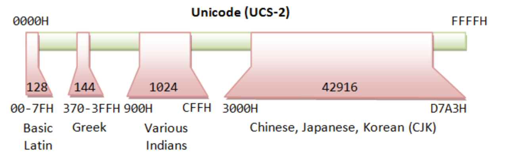
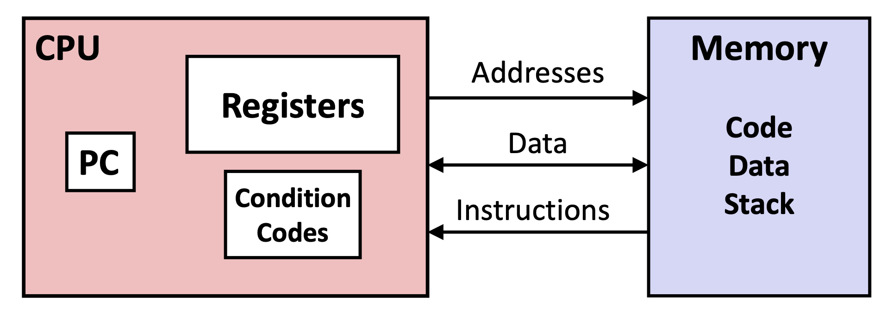
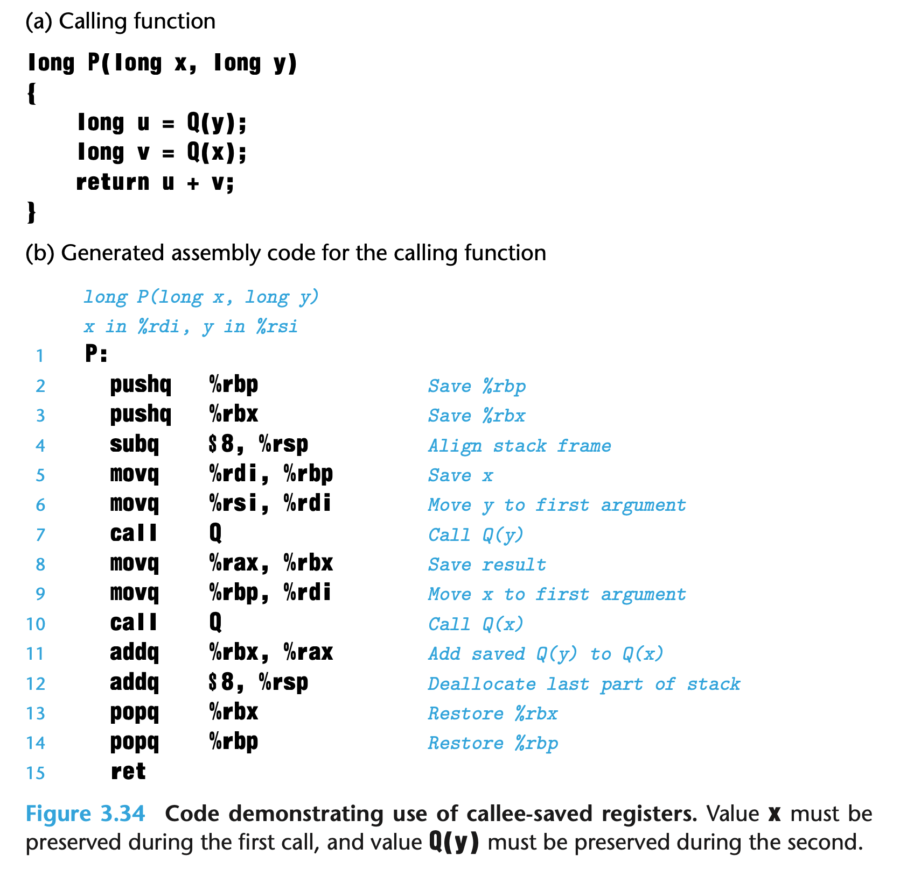

# Computer Systems: A Programmer’s Perspective

## Overview

### Form of a program

We have a simple Hello world C program in Figure 1.1.


The hello program begins life as a *source program* (or *source file*) that the programmer creates with an editor and saves in a text file called hello.c. The source program is a sequence of bits, each with a value of 0 or 1, organized in 8-bit chunks called *bytes*. Each byte represents some text character in the program.

Most computer systems represent text characters using the ASCII standard that represents each character with a unique byte-size integer value. For example, Figure 1.2 shows the ASCII representation of the hello.c program.


### Translation Process

The hello program begins life as a high-level C program because it can be read and understood by human beings in that form. However, in order to run hello.c on the system, the individual C statements must be translated by other programs into a sequence of low-level *machine-language* instructions. These instructions are then packaged in a form called an ***executable object program*** and stored as a binary disk file. Object programs are also referred to as *executable object files*.

```bash
gcc -o hello hello.c
```

Here, the gcc compiler driver reads the source file hello.c and translates it into an executable object file hello. The translation is performed in the sequence of four phases shown in Figure 1.3. The programs that perform the four phases (*preprocessor*, *compiler*, *assembler*, and *linker*) are known collectively as the *compilation system*.


- *Preprocessing phase:* The preprocessor (cpp) modifies the original C program according to directives that begin with the ‘#’ character. For example, the #include <stdio.h> command in line 1 of hello.c tells the preprocessor to read the contents of the system header file stdio.h and insert it directly into the program text. The result is another C program, typically with the .i suffix.

- *Compilation phase:* The compiler (cc1) translates the text file hello.i into the text file hello.s, which contains an *assembly-language program*. This program includes the following definition of function main:

  ```assembly
  main:
  	subq 	$8, %rsp
  	movl 	$.LC0, %edi
  	call	puts
  	movl	$0, %eax
  	addq  $8, %rsp
  	ret
  
  ```

  Assembly language is useful because it provides a common output language for different compilers for different high-level languages. For example, C compilers and Fortran compilers both generate output files in the same assembly language.

- *Assembly phase:* Next, the assembler (as) translates hello.s into machine- language instructions, packages them in a form known as a *relocatable object program*, and stores the result in the object file hello.o. This file is a binary file containing 17 bytes to encode the instructions for function main.
- *Linking phase:* Notice that our hello program calls the printf function, which is part of the *standard C library* provided by every C compiler. The printf function resides in a separate precompiled object file called printf.o, which must somehow be merged with our hello.o program. The linker (ld) handles this merging. The result is the hello file, which is an executable object file (or simply *executable*) that is ready to be loaded into memory and executed by the system.

### General System Architectural 

To understand what happens to our hello program when we run it, we need to understand the hardware organization of a typical system, which is shown in Figure 1.4.


**Buses**

Running throughout the system is a collection of electrical conduits called *buses* that carry bytes of information back and forth between the components. Buses are typically designed to transfer fixed-size chunks of bytes known as *words*. The number of bytes in a word (the *word size*) is a fundamental system parameter that varies across systems. Most machines today have word sizes of either 4 bytes (32 bits) or 8 bytes (64 bits).

**I/O Devices**

Input/output (I/O) devices are the system’s connection to the external world. Our example system has four I/O devices: a keyboard and mouse for user input, a display for user output, and a disk drive (or simply disk) for long-term storage of data and programs. Initially, the executable hello program resides on the disk.

Each I/O device is connected to the I/O bus by either a *controller* or an *adapter*.

- Controllers are chip sets in the device itself or on the system’s main printed circuit board (often called the *motherboard*). 
- An adapter is a card that plugs into a slot on the motherboard. 

Regardless, the purpose of each is to transfer information back and forth between the I/O bus and an I/O device.

**Main Memory**

The *main memory* is a temporary storage device that holds both a program and the data it manipulates while the processor is executing the program. Physically, main memory consists of a collection of *dynamic random access memory* (DRAM) chips. Logically, memory is organized as a linear array of bytes, each with its own unique address (array index) starting at zero. In general, each of the machine instructions that constitute a program can consist of a variable number of bytes. The sizes of data items that correspond to C program variables vary according to type. For example, on an x86-64 machine running Linux, data of type short require 2 bytes, types int and float 4 bytes, and types long and double 8 bytes.

**Processor**

The *central processing unit* (CPU), or simply *processor*, is the engine that interprets (or *executes*) instructions stored in main memory. At its core is a word-size storage device (or *register*) called the *program counter* (PC). At any point in time, the PC points at (contains the address of) some machine-language instruction in main memory.

From the time that power is applied to the system until the time that the power is shut off, a processor repeatedly executes the instruction pointed at by the program counter and updates the program counter to point to the next instruction. A processor *appears* to operate according to a very simple instruction execution model, defined by its *instruction set architecture*. In this model, instructions execute in strict sequence, and executing a single instruction involves performing a series of steps. The processor reads the instruction from memory pointed at by the program counter (PC), interprets the bits in the instruction, performs some simple operation dictated by the instruction, and then updates the PC to point to the next instruction, which may or may not be contiguous in memory to the instruction that was just executed.

There are only a few of these simple operations, and they revolve around main memory, the *register file*, and the *arithmetic/logic unit* (ALU). 

- The register file is a small storage device that consists of a collection of word-size registers, each with its own unique name. 
- The ALU computes new data and address values. Here are some examples of the simple operations that the CPU might carry out at the request of an instruction:
	- **Load**: Copy a byte or a word from main memory into a register, overwriting the previous contents of the register.
	- **Store**: Copy a byte or a word from a register to a location in main memory, overwriting the previous contents of that location.
	- **Operate**: Copy the contents of two registers to the ALU, perform an arithmetic operation on the two words, and store the result in a register, overwriting the previous contents of that register.
	- **Jump**: Extract a word from the instruction itself and copy that word into the program counter (PC), overwriting the previous value of the PC.

We say that a processor appears to be a simple implementation of its instruction set architecture, but in fact modern processors use far more complex mechanisms to speed up program execution. Thus, we can distinguish the processor’s instruction set architecture, describing the effect of each machine-code instruction, from its *micro-architecture*, describing how the processor is actually implemented.

As we type the characters ./hello at the keyboard, the shell program reads each one into a register and then stores it in memory, as shown in Figure 1.5.When we hit the enter key on the keyboard, the shell knows that we have finished typing the command. The shell then loads the executable hello file by executing a sequence of instructions that copies the code and data in the hello object file from disk to main memory. The data includes the string of characters hello, world\n that will eventually be printed out.

Using a technique known as *direct memory access* (DMA), the data travel directly from disk to main memory, without passing through the processor. This step is shown in Figure 1.6.


Once the code and data in the hello object file are loaded into memory, the processor begins executing the machine-language instructions in the hello program’s main routine. These instructions copy the bytes in the hello, world\n string from memory to the register file, and from there to the display device, where they are displayed on the screen. This step is shown in Figure 1.7.


### Memory Hierarchy

An important lesson from this simple example is that a system spends a lot of time moving information from one place to another. The machine instructions in the hello program are originally stored on disk. When the program is loaded, they are copied to main memory. As the processor runs the program, instructions are copied from main memory into the processor. Similarly, the data string hello,world\n, originally on disk, is copied to main memory and then copied from main memory to the display device. From a programmer’s perspective, much of this copying is overhead that slows down the “real work” of the program. Thus, a major goal for system designers is to make these copy operations run as fast as possible.

 The processor can read data from the register file almost 100 times faster than from memory. Even more troublesome, as semiconductor technology progresses over the years, this *processor–memory gap* continues to increase. It is easier and cheaper to make processors run faster than it is to make main memory run faster.

To deal with the processor–memory gap, system designers include smaller, faster storage devices called *cache memories* (or simply caches) that serve as temporary staging areas for information that the processor is likely to need in the near future. Figure 1.8 shows the cache memories in a typical system. 

An *L1 cache* on the processor chip holds tens of thousands of bytes and can be accessed nearly as fast as the register file. A larger *L2 cache* with hundreds of thousands to millions of bytes is connected to the processor by a special bus. It might take 5 times longer for the processor to access the L2 cache than the L1 cache, but this is still 5 to 10 times faster than accessing the main memory. The L1 and L2 caches are implemented with a hardware technology known as *static random access memory* (SRAM). Newer and more powerful systems even have three levels of cache: L1, L2, and L3. The idea behind caching is that a system can get the effect of both a very large memory and a very fast one by exploiting *locality*, the tendency for programs to access data and code in localized regions. By setting up caches to hold data that are likely to be accessed often, we can perform most memory operations using the fast caches.

This notion of inserting a smaller, faster storage device (e.g., cache memory) between the processor and a larger, slower device (e.g., main memory) turns out to be a general idea. In fact, the storage devices in every computer system are organized as a *memory hierarchy* similar to Figure 1.9 As we move from the top of the hierarchy to the bottom, the devices become slower, larger, and less costly per byte. The register file occupies the top level in the hierarchy, which is known as level 0 or L0. We show three levels of caching L1 to L3, occupying memory hierarchy levels 1 to 3. Main memory occupies level 4, and so on.

The main idea of a memory hierarchy is that storage at one level serves as a cache for storage at the next lower level. Thus, the register file is a cache for the L1 cache. Caches L1 and L2 are caches for L2 and L3, respectively. The L3 cache is a cache for the main memory, which is a cache for the disk. On some networked systems with distributed file systems, the local disk serves as a cache for data stored on the disks of other systems.

### Operating System Layer

When the hello program printed its message, neither program accessed the keyboard, display, disk, or main memory directly. Rather, they relied on the services provided by the *operating system*. We can think of the operating system as a layer of software interposed between the application program and the hardware, as shown in Figure 1.10. All attempts by an application program to manipulate the hardware must go through the operating system.

The operating system has two primary purposes: 

1. to protect the hardware from misuse by runaway applications.
2. to provide applications with simple and uniform mechanisms for manipulating complicated and often wildly different low-level hardware devices. 

The operating system achieves both goals via the fundamental abstractions shown in Figure 1.11 *processes*, *virtual memory*, and *files*. As this figure suggests, files are abstractions for I/O devices, virtual memory is an abstraction for both the main memory and disk I/O devices, and processes are abstractions for the processor, main memory, and I/O devices. 

#### Process

A *process* is the operating system’s abstraction for a running program. Multi- ple processes can run concurrently on the same system, and each process appears to have exclusive use of the hardware. By *concurrently*, we mean that the instructions of one process are interleaved with the instructions of another process. The operating system performs this interleaving with a mechanism known as **context switching**.

The operating system keeps track of all the state information that the process needs in order to run. This state, which is known as the *context*, includes information such as the current values of the PC, the register file, and the contents of main memory. At any point in time, a uniprocessor system can only execute the code for a single process. When the operating system decides to transfer control from the current process to some new process, it performs a *context switch* by saving the context of the current process, restoring the context of the new process, and then passing control to the new process. The new process picks up exactly where it left off. Figure 1.12 shows the basic idea for our example hello scenario.

There are two concurrent processes in our example scenario: the shell process and the hello process. Initially, the shell process is running alone, waiting for input on the command line. When we ask it to run the hello program, the shell carries out our request by invoking a special function known as a **system call** that passes control to the operating system. The operating system saves the shell’s context, creates a new hello process and its context, and then passes control to the new hello process. After hello terminates, the operating system restores the context of the shell process and passes control back to it, where it waits for the next command-line input.

As Figure 1.12 indicates, the transition from one process to another is managed by the **operating system *kernel***. The kernel is the portion of the operating system code that is always resident in memory. When an application program requires some action by the operating system, such as to read or write a file, it executes a special *system call* instruction, transferring control to the kernel. The kernel then performs the requested operation and returns back to the application program. 

> _**Note:**_ kernel is not a separate process. Instead, it is a collection of code and data structures that the system uses to manage all the processes.

#### Thread

Although we normally think of a process as having a single control flow, in modern systems a process can actually consist of multiple execution units, called **threads**, each running in the context of the process and sharing the same code and global data. Threads are an increasingly important programming model because of the requirement for concurrency in network servers, because it is easier to share data between multiple threads than between multiple processes, and because threads are typically more efficient than processes. Multi-threading is also one way to make programs run faster when multiple processors are available.

#### Virtual Memory

*Virtual memory* is an abstraction that provides each process with the illusion that it has exclusive use of the main memory. Each process has the same uniform view of memory, which is known as its **virtual address space**. The virtual address space for Linux processes is shown in Figure 1.13. (Other Unix systems use a similar layout.) In Linux, the topmost region of the address space is reserved for code and data in the operating system that is common to all processes. The lower region of the address space holds the code and data defined by the user’s process. Note that addresses in the figure increase from the bottom to the top.

The virtual address space seen by each process consists of a number of well- defined areas, each with a specific purpose. 

- **Program code and data**: Code begins at the same fixed address for all processes, followed by data locations that correspond to global C variables. The code and data areas are initialized directly from the contents of an executable object file—in our case, the hello executable.
- **Heap**: The code and data areas are followed immediately by the run-time *heap*. Unlike the code and data areas, which are fixed in size once the process begins running, the heap expands and contracts dynamically at run time as a result of calls to C standard library routines such as malloc and free.

- **Shared libraries**: Near the middle of the address space is an area that holds the code and data for *shared libraries* such as the C standard library and the math library. The notion of a shared library is a powerful but somewhat difficult concept.
- **Stack**: At the top of the user’s virtual address space is the *user stack* that the compiler uses to implement function calls. Like the heap, the user stack expands and contracts dynamically during the execution of the program. In particular, each time we call a function, the stack grows. Each time we return from a function, it contracts.
- **Kernel virtual memory**: The top region of the address space is reserved for the kernel. Application programs are not allowed to read or write the contents of this area or to directly call functions defined in the kernel code. Instead, they must invoke the kernel to perform these operations.

For virtual memory to work, a sophisticated interaction is required between the hardware and the operating system software, including a hardware translation of every address generated by the processor. The basic idea is to store the contents of a process’s virtual memory on disk and then use the main memory as a cache for the disk.

#### Files

A *file* is a sequence of bytes, nothing more and nothing less. Every I/O device, including disks, keyboards, displays, and even networks, is modeled as a file. All input and output in the system is performed by reading and writing files, using a small set of system calls known as *Unix I/O*.

This simple and elegant notion of a file is nonetheless very powerful because it provides applications with a uniform view of all the varied I/O devices that might be contained in the system. For example, application programmers who manipulate the contents of a disk file are blissfully unaware of the specific disk technology. Further, the same program will run on different systems that use different disk technologies.

### Systems Communicate with Other Systems Using Networks

Up to this point in our tour of systems, we have treated a system as an isolated collection of hardware and software. In practice, modern systems are often linked to other systems by networks. From the point of view of an individual system, the network can be viewed as just another I/O device, as shown in Figure 1.14. When the system copies a sequence of bytes from main memory to the network adapter, the data flow across the network to another machine. Similarly, the system can read data sent from other machines and copy these data to its main memory.

With the advent of global networks such as the Internet, copying information from one machine to another has become one of the most important uses of computer systems. For example, applications such as email, instant messaging, the World Wide Web, FTP, and telnet are all based on the ability to copy information over a network.

Returning to our hello example, we could use the familiar telnet application to run hello on a remote machine. Suppose we use a telnet *client* running on our local machine to connect to a telnet *server* on a remote machine. After we log in to the remote machine and run a shell, the remote shell is waiting to receive an input command. From this point, running the hello program remotely involves the five basic steps shown in Figure 1.15.

After we type in the hello string to the telnet client and hit the enter key, the client sends the string to the telnet server. After the telnet server receives the string from the network, it passes it along to the remote shell program. Next, the remote shell runs the hello program and passes the output line back to the telnet server. Finally, the telnet server forwards the output string across the network to the telnet client, which prints the output string on our local terminal.This type of exchange between clients and servers is typical of all network applications.

### Important Concepts

To close out this chapter, we highlight several important concepts that cut across all aspects of computer systems. We will discuss the importance of these concepts at multiple places within the book.

#### Amdahl’s Law

Gene Amdahl, one of the early pioneers in computing, made a simple but insightful observation about the effectiveness of improving the performance of one part of a system. This observation has come to be known as *Amdahl’s law*. The main idea is that when we speed up one part of a system, the effect on the overall system performance depends on both how significant this part was and how much it sped up. 

Consider a system in which executing some application requires time $T_{old}$. Suppose some part of the system requires a fraction $\alpha$ of this time, and that we improve its performance by a factor of $k$. That is, the component originally required time $\alpha T_{old}$, and it now requires time $\alpha T_{old}/ k$. The overall execution time would thus be
$$
T_{new} = (1 − \alpha)T_{old} + (\alpha T_{old})/k =T_{old}[(1−\alpha)+\alpha/k]
$$
From this, we can compute the speedup $S = T_{old}/T_{new}$ as
$$
S = \frac{1}{(1−\alpha)+\alpha/k}
$$
As an example, consider the case where a part of the system that initially consumed 60% of the time (α=0.6) is sped up by a factor of 3 (k=3). Then we get a speedup of 1/[0.4 + 0.6/3] = 1.67×. Even though we made a substantial improvement to a major part of the system, our net speedup was significantly less than the speedup for the one part. This is the major insight of Amdahl’s law— to significantly speed up the entire system, we must improve the speed of a very large fraction of the overall system.

One interesting special case of Amdahl’s law is to consider the effect of setting k to ∞. That is, we are able to take some part of the system and speed it up to the point at which it takes a negligible amount of time. We then get
$$
S_{\infty}=\frac{1}{(1 - \alpha)}
$$
So, for example, if we can speed up 60% of the system to the point where it requires close to no time, our net speedup will still only be 1/0.4 = 2.5×.

Amdahl’s law describes a general principle for improving any process. In addition to its application to speeding up computer systems, it can guide a company trying to reduce the cost of manufacturing razor blades, or a student trying to improve his or her grade point average. Perhaps it is most meaningful in the world of computers, where we routinely improve performance by factors of 2 or more. Such high factors can only be achieved by optimizing large parts of a system.

#### Concurrency and Parallelism

We use the term **concurrency** to refer to the general concept of a system with multiple, simultaneous activities, and the term *parallelism* to refer to the use of concurrency to make a system run faster. Parallelism can be exploited at multiple levels of abstraction in a computer system. We highlight three levels here, working from the highest to the lowest level in the system hierarchy.

##### Thread-Level Concurrency

Building on the process abstraction, we are able to devise systems where multiple programs execute at the same time, leading to *concurrency*. With threads, we can even have multiple control flows executing within a single process. Traditionally, this concurrent execution was only *simulated*, by having a single computer rapidly switch among its executing processes, much as a juggler keeps multiple balls flying through the air. Until recently, most actual computing was done by a single processor, even if that processor had to switch among multiple tasks. This configuration is known as a *uniprocessor system.*

When we construct a system consisting of multiple processors all under the control of a single operating system kernel, we have a *multiprocessor system*. Such systems have been available for large-scale computing since the 1980s, but they have more recently become commonplace with the advent of *multi-core* processors and *hyperthreading*. Figure 1.16 shows a taxonomy of these different processor types.


Multi-core processors have several CPUs (referred to as “cores”) integrated onto a single integrated-circuit chip. Figure 1.17 illustrates the organization of a typical multi-core processor, where the chip has four CPU cores, each with its own L1 and L2 caches, and with each L1 cache split into two parts—one to hold recently fetched instructions and one to hold data. The cores share higher levels of cache as well as the interface to main memory. Industry experts predict that they will be able to have dozens, and ultimately hundreds, of cores on a single chip.


Hyperthreading, sometimes called *simultaneous multi-threading*, is a technique that allows a single CPU to execute multiple flows of control. It involves having multiple copies of some of the CPU hardware, such as program counters and register files, while having only single copies of other parts of the hardware, such as the units that perform floating-point arithmetic. Whereas a conventional processor requires around 20,000 clock cycles to shift between different threads, a hyperthreaded processor decides which of its threads to execute on a cycle-by-cycle basis. It enables the CPU to take better advantage of its processing resources. For example, if one thread must wait for some data to be loaded into a cache, the CPU can proceed with the execution of a different thread.

The use of multiprocessing can improve system performance in two ways. First, it reduces the need to simulate concurrency when performing multiple tasks. As mentioned, even a personal computer being used by a single person is expected to perform many activities concurrently. Second, it can run a single application program faster, but only if that program is expressed in terms of multiple threads that can effectively execute in parallel. Thus, although the principles of concurrency have been formulated and studied for over 50 years, the advent of multi-core and hyperthreaded systems has greatly increased the desire to find ways to write application programs that can exploit the thread-level parallelism available with Main memory the hardware.

##### Instruction-Level Parallelism

At a much lower level of abstraction, modern processors can execute multiple instructions at one time, a property known as *instruction-level parallelism*. More recent processors can sustain execution rates of 2–4 instructions per clock cycle. Any given instruction requires much longer from start to finish, perhaps 20 cycles or more, but the processor uses a number of clever tricks to process as many as 100 instructions at a time. *Pipelining*, where the actions required to execute an instruction are partitioned into different steps and the processor hardware is organized as a series of stages, each performing one of these steps. The stages can operate in parallel, working on different parts of different instructions. We will see that a fairly simple hardware design can sustain an execution rate close to 1 instruction per clock cycle.

Processors that can sustain execution rates faster than 1 instruction per cycle are known as *superscalar* processors. Most modern processors support superscalar operation. In Chapter 5, we will describe a high-level model of such processors. We will see that application programmers can use this model to understand the performance of their programs. They can then write programs such that the generated code achieves higher degrees of instruction-level parallelism and therefore runs faster.

##### Single-Instruction, Multiple-Data (SIMD) Parallelism

At the lowest level, many modern processors have special hardware that allows a single instruction to cause multiple operations to be performed in parallel, a mode known as *single-instruction, multiple-data* (SIMD) parallelism. For example, recent generations of Intel and AMD processors have instructions that can add 8 pairs of single-precision floating-point numbers (C data type float) in parallel.

These SIMD instructions are provided mostly to speed up applications that process image, sound, and video data. Although some compilers attempt to automatically extract SIMD parallelism from C programs, a more reliable method is to write programs using special *vector* data types supported in compilers such as gcc. We describe this style of programming in Web Aside opt:simd, as a supplement to the more general presentation on program optimization found in Chapter 5

#### The Importance of Abstractions in Computer Systems

The use of *abstractions* is one of the most important concepts in computer science. For example, one aspect of good programming practice is to formulate a simple application program interface (API) for a set of functions that allow programmers to use the code without having to delve into its inner workings. Different programming languages provide different forms and levels of support for abstraction, such as Java class declarations and C function prototypes.

We have already been introduced to several of the abstractions seen in computer systems, as indicated in Figure 1.18. On the processor side, the *instruction set architecture* provides an abstraction of the actual processor hardware. With this abstraction, a machine-code program behaves as if it were executed on a processor that performs just one instruction at a time. The underlying hardware is far more elaborate, executing multiple instructions in parallel, but always in a way that is consistent with the simple, sequential model. By keeping the same execution model, different processor implementations can execute the same machine code while offering a range of cost and performance.

On the operating system side, we have introduced three abstractions: *files* as an abstraction of I/O devices, *virtual memory* as an abstraction of program memory, and *processes* as an abstraction of a running program. To these abstractions we add a new one: the *virtual machine*, providing an abstraction of the entire computer, including the operating system, the processor, and the programs. The idea of a virtual machine was introduced by IBM in the 1960s, but it has become more prominent recently as a way to manage computers that must be able to run programs designed for multiple operating systems (such as Microsoft Windows, Mac OS X, and Linux) or different versions of the same operating system.

### Summary

A computer system consists of hardware and systems software that cooperate to run application programs. Information inside the computer is represented as groups of bits that are interpreted in different ways, depending on the context. Programs are translated by other programs into different forms, beginning as ASCII text and then translated by compilers and linkers into binary executable files.

Processors read and interpret binary instructions that are stored in main memory. Since computers spend most of their time copying data between memory, I/O devices, and the CPU registers, the storage devices in a system are arranged in a hierarchy, with the CPU registers at the top, followed by multiple levels of hardware cache memories, DRAM main memory, and disk storage. Storage devices that are higher in the hierarchy are faster and more costly per bit than those lower in the hierarchy. Storage devices that are higher in the hierarchy serve as caches for devices that are lower in the hierarchy. Programmers can optimize the performance of their C programs by understanding and exploiting the memory hierarchy.

The operating system kernel serves as an intermediary between the application and the hardware. It provides three fundamental abstractions: (1) Files are abstractions for I/O devices. (2) Virtual memory is an abstraction for both main memory and disks. (3) Processes are abstractions for the processor, main memory, and I/O devices.

Finally, networks provide ways for computer systems to communicate with one another. From the viewpoint of a particular system, the network is just another I/O device.

## Representing and Manipulating Information

### Information Storage

Rather than accessing individual bits in memory, most computers use blocks of 8 bits, or *bytes*, as the smallest addressable unit of memory. A machine-level program views memory as a very large array of bytes, referred to as **virtual memory**. Every byte of memory is identified by a unique number, known as its *address*, and the set of all possible addresses is known as the **virtual address space**.

#### Data Sizes

Every computer has a ***word size***, indicating the nominal size of pointer data. For a machine with a w-bit word size, the virtual addresses can range from 0 to $2^w$ − 1, giving the program access to at most $2^w$ bytes. A machines with 32-bit word sizes limits the virtual address space to 4 gigabytes (written 4 GB).


To avoid the vagaries of relying on “typical” sizes and different compiler settings, ISO C99 introduced a class of data types where the data sizes are fixed regardless of compiler and machine settings. Among these are data types int32_t and int64_t, having exactly 4 and 8 bytes, respectively. Using fixed-size integer types is the best way for programmers to have close control over data representations.

Most machines also support two different floating-point formats: single precision, declared in C as float, and double precision, declared in C as double. These formats use 4 and 8 bytes, respectively.

Computer representations use a limited number of bits to encode a number, and hence some operations can *overflow* when the results are too large to be represented. This can lead to some surprising results. On most of today’s computers (those using a 32-bit representation for data type int), computing the expression.

#### Number System

Human beings use *decimal* (base 10) number systems for counting and measurements. Computers use *binary* (base 2) number system, as they are made from binary digital components (known as transistors) operating in two states - on and off. In computing, we also use *hexadecimal* (base 16) or *octal* (base 8) number systems, as a *compact* form for representing binary numbers.

##### Binary Number System

Binary number system has two symbols: `0` and `1`, called *bits*. It is also a *positional notation*, for example,
$$
10110 = 10000 + 0000 + 100 + 10 + 0 = 1×2^4 + 0×2^3 + 1×2^2 + 1×2^1 + 0×2^0
$$

##### Hexadecimal (Base 16) Number System

Hexadecimal number system uses 16 symbols: `0`, `1`, `2`, `3`, `4`, `5`, `6`, `7`, `8`, `9`, `A`, `B`, `C`, `D`, `E`, and `F`, called *hex digits*. It is a *positional notation*, for example,
$$
0\times A3E = 0\times A00 + 0\times030 + 0\times E = 10×16^2 + 3×16^1 + 14×16^0
$$


#### Conversion

##### Hexadecimal and Binary

**From Binary to Hex**: you convert binary to hexadecimal by first splitting it into groups of 4 bits each.
$$
1111001010110110110011 = 11\ \ 1100\ \ 1010\ \ 1101\ \ 1011\ \ 0011\\
=3CADB3
$$
**From Hex  to Binary**: Simply reserves the process for Hex to Binary
$$
A3C5 =\ \ 1010\ \ 0011\ \ 1100\ \ 0101
$$

##### Base r and Base 10

**Conversion from Base `r` to Decimal (Base 10)**: Given a *n*-digit base *r* number: $d_{n-1}d_{n-2}d_{n-3}...d_2d_1d_0$ (base r), the decimal equivalent is given by:
$$
d_{n-1}\times r^{n-1} +d_{n-2}\times r^{n-2} + \ldots d_1 \times r^{1} + d_0 \times r^{0}
$$
For examples,

```
0xA1C2 = 10×16^3 + 1×16^2 + 12×16^1 + 2 = 41410 (base 10)
10110 = 1×2^4 + 1×2^2 + 1×2^1 = 22 (base 10)
```

**Conversion from Base 10 to Base r**: Use repeated division/remainder. 

For example,

```
To convert 261(base 10) to hexadecimal:
  261/16 => quotient=16 remainder=5
  16/16  => quotient=1  remainder=0
  1/16   => quotient=0  remainder=1 (quotient=0 stop)
  Hence, 261 = 0x105 (Collect the hex digits from the remainder in reverse order)
```

The above procedure is actually applicable to conversion between any 2 base systems. For example,

```
To convert 1023(base 4) to base 3:
  1023(base 4)/3 => quotient=25D remainder=0
  25D/3          => quotient=8D  remainder=1
  8D/3           => quotient=2D  remainder=2
  2D/3           => quotient=0   remainder=2 (quotient=0 stop)
  Hence, 1023(base 4) = 2210(base 3)
```

##### Two Number Systems with Fractional Part

1. Separate the integral and the fractional parts.
2. For the integral part, divide by the target radix repeatably, and collect the ramainder in reverse order.
3. For the fractional part, multiply the fractional part by the target radix repeatably, and collect the integral part in the same order.

**Decimal to Binary**:

```
Convert 18.6875D to binary
Integral Part = 18D
  18/2 => quotient=9 remainder=0
  9/2  => quotient=4 remainder=1
  4/2  => quotient=2 remainder=0
  2/2  => quotient=1 remainder=0
  1/2  => quotient=0 remainder=1 (quotient=0 stop)
  Hence, 18D = 10010B
Fractional Part = .6875D
  .6875*2=1.375 => whole number is 1
  .375*2=0.75   => whole number is 0
  .75*2=1.5     => whole number is 1
  .5*2=1.0      => whole number is 1
  Hence .6875D = .1011B
Combine, 18.6875D = 10010.1011B
```

**Decimal to Hexadecimal**:

```
Convert 18.6875D to hexadecimal
Integral Part = 18D
  18/16 => quotient=1 remainder=2
  1/16  => quotient=0 remainder=1 (quotient=0 stop)
  Hence, 18D = 0x12
Fractional Part = .6875D
  .6875*16=11.0 => whole number is 11D (BH)
  Hence .6875D = 0x.B
Combine, 18.6875D = 0x12.B
```

#### Addressing and Byte Ordering

In virtually all machines, a multi-byte object is stored as a contiguous sequence of bytes, with the address of the object given by the smallest address of the bytes used. 

Some machines choose to store the object in memory ordered from least significant byte to most, while other machines store them from most to least. 

- **Little endian**: the least significant byte comes first.
- **Big endian**: the most significant byte comes first.

Suppose the variable x of type int and at address 0x100 has a hexadecimal value of 0x01234567. The ordering of the bytes within the address range 0x100 through 0x103 depends on the type of machine:


Byte ordering becomes an issue the first is when binary data are communicated over a network between different machines. A common problem is for data produced by a little-endian machine to be sent to a big-endian machine, or vice versa, leading to the bytes within the words being in reverse order for the receiving program. To avoid such problems, code written for networking applications must follow established conventions for byte ordering to make sure the sending machine converts its internal representation to the network standard, while the receiving machine converts the network standard to its internal representation. 

#### Introduction to Boolean Algebra


We can extend the four Boolean operations to also operate on *bit vectors*, strings of zeros and ones of some fixed length w. As examples, consider the case where w = 4, and with arguments a = [0110] and b = [1100]. Then the four operations a & b, a | b, a ^ b, and ~b yield


One common use of bit-level operations is to implement *masking* operations, where a mask is a bit pattern that indicates a selected set of bits within a word. As an example, the mask 0xFF (having ones for the least significant 8 bits) indicates the low-order byte of a word. The bit-level operation x & 0xFF yields a value consisting of the least significant byte of x, but with all other bytes set to 0. For example, with x = 0x89ABCDEF, the expression would yield 0x000000EF. 

#### Shift Operations in C

**Logical**: A logical right shift fills the left end with k zeros, giving a result [0, . . . , 0, $x_{w−1}$,$x_{w−2}$, . . . $x_{k}$].

**Arithmetic**: An arithmetic right shift fills the left end with k repetitions of the most significant bit, giving a result [$x_{w−1}$, . . . , $x_{w−1}$, $x_{w−1}$, $x_{w−2}$, . . . $x_{k}$]. This convention might seem peculiar, but as we will see, it is useful for operating on signed integer data.

Java has a precise definition of how right shifts should be performed. The expression x >> k shifts x arithmetically by k positions, while x >>> k shifts it logically.

#### Range of data types in C


### Integer Representations

Computers use *a fixed number of bits* to represent an integer. The commonly-used bit-lengths for integers are 8-bit, 16-bit, 32-bit or 64-bit. Besides bit-lengths, there are two representation schemes for integers:

1. **Unsigned Integers**: can represent zero and positive integers.
2. **Signed Integers**: can represent zero, positive and negative integers. Three representation schemes had been proposed for signed integers:
   1. Sign-Magnitude representation
   2. 1's Complement representation
   3. 2's Complement representation

#### Unsigned Integers

Unsigned integers can represent zero and positive integers, but not negative integers. The value of an unsigned integer is interpreted as "*the magnitude of its underlying binary pattern*".

**Example 1:** Suppose that `n=8` and the binary pattern is` 0100 0001B`, the value of this unsigned integer is` 1×2^0 + 1×2^6 = 65`.

An *n*-bit pattern can represent $2^n$ distinct integers. An *n*-bit unsigned integer can represent integers from `0` to $2^n -1$, as tabulated below:

|  n   | Minimum |                       Maximum                       |
| :--: | :-----: | :-------------------------------------------------: |
|  8   |    0    |                   (2^8)-1  (=255)                   |
|  16  |    0    |                 (2^16)-1 (=65,535)                  |
|  32  |    0    |        (2^32)-1 (=4,294,967,295) (9+ digits)        |
|  64  |    0    | (2^64)-1 (=18,446,744,073,709,551,615) (19+ digits) |

#### Signed Integers

Signed integers can represent zero, positive integers, as well as negative integers. Three representation schemes are available for signed integers:

1. Sign-Magnitude representation
2. 1's Complement representation
3. 2's Complement representation

In all the above three schemes, the *most-significant bit* (msb) is called the *sign bit*. The sign bit is used to represent the *sign* of the integer - with 0 for positive integers and 1 for negative integers. The *magnitude* of the integer, however, is interpreted differently in different schemes.

##### n-bit Sign Integers in Sign-Magnitude Representation

In sign-magnitude representation:

- The most-significant bit (msb) is the *sign bit*, with value of 0 representing positive integer and 1 representing negative integer.
- The remaining *n*-1 bits represents the magnitude (absolute value) of the integer. The absolute value of the integer is interpreted as "the magnitude of the (*n*-1)-bit binary pattern".

**Example 1**: Suppose that `n=8` and the binary representation is` 0 100 0001B`.
  Sign bit is `0` ⇒ positive
  Absolute value is `100 0001B = 65D`
  Hence, the integer is `+65D`

**Example 2**: Suppose that `n=8` and the binary representation is` 1 000 0001B`.
  Sign bit is `1` ⇒ negative
  Absolute value is `000 0001B = 1D`
  Hence, the integer is `-1D`


The drawbacks of sign-magnitude representation are:

1. There are two representations (`0000 0000B` and `1000 0000B`) for the number zero, which could lead to inefficiency and confusion.
2. Positive and negative integers need to be processed separately.

##### n-bit Sign Integers in 1's Complement Representation

In 1's complement representation:

- Again, the most significant bit (msb) is the *sign bit*, with value of 0 representing positive integers and 1 representing negative integers.
- The remaining n-1 bits represents the magnitude of the integer, as follows:
  - for positive integers, the absolute value of the integer is equal to "the magnitude of the (*n*-1)-bit binary pattern".
  - for negative integers, the absolute value of the integer is equal to "the magnitude of the *complement* (*inverse*) of the (*n*-1)-bit binary pattern" (hence called 1's complement).

**Example 1**: Suppose that `n=8` and the binary representation` 0 100 0001B`.
  Sign bit is `0` ⇒ positive
  Absolute value is `100 0001B = 65D`
  Hence, the integer is `+65D`

**Example 2**: Suppose that `n=8` and the binary representation` 1 000 0001B`.
  Sign bit is `1` ⇒ negative
  Absolute value is the complement of `000 0001B`, i.e., `111 1110B = 126D`
  Hence, the integer is `-126D`


Again, the drawbacks are:

1. There are two representations (`0000 0000B` and `1111 1111B`) for zero.
2. The positive integers and negative integers need to be processed separately.

##### n-bit Sign Integers in 2's Complement Representation

In 2's complement representation:

- the most significant bit (msb) is the *sign bit*, with value of 0 representing positive integers and 1 representing negative integers.
- The remaining n-1 bits represents the magnitude of the integer, as follows:
  - for positive integers, the absolute value of the integer is equal to "the magnitude of the (*n*-1)-bit binary pattern".
  - for negative integers, the absolute value of the integer is equal to "the magnitude of the *complement* of the (*n*-1)-bit binary pattern *plus one*" (hence called 2's complement).

**Example 1**: Suppose that `n=8` and the binary representation` 0 100 0001B`.
  Sign bit is `0` ⇒ positive
  Absolute value is `100 0001B = 65D`
  Hence, the integer is `+65D`

**Example 2**: Suppose that `n=8` and the binary representation` 1 000 0001B`.
  Sign bit is `1` ⇒ negative
  Absolute value is the complement of `000 0001B` plus `1`, i.e., `111 1110B + 1B = 127`

  The negative value is $-2^7 + 2^0 = -127$


The following diagram explains how the 2's complement works. By re-arranging the number line, values from `-128` to `+127` are represented contiguously by ignoring the carry bit.


**Max Positive Number**: $2^{w}-1$

**Max Negative Number**: $-2^w$

#### Conversions between Signed and Unsigned

The effect of casting is to keep the bit values identical but change how these bits are interpreted.When an operation is performed where one operand is signed and the other is unsigned, C implicitly casts the signed argument to unsigned and performs the operations assuming the numbers are nonnegative. When converting from short to unsigned, the program first changes the size and then the type.

> _**Note**_: Be aware of casting between signed and unsigned, it may cause unintentional behaviour. In c, if you compare unsigned value with signed, c will explicit convert signed value into unsigned value which will leads to surprise result!

Conversions between Signed and Unsigned can be split into two parts, if we convert signed to unsigned, we call signed as *from* and unsigned as *to*:

1. If *from* is positive, then *to* is same value
2. if *from* is negative, then
   1. if *from* is *signed*, then add $2^w$ to *from* where* $2^w$ is the highest bit of current representation. eg. if it's 4 bit representation,  $2^4$ = 16 as showing below
   2. if *from* is *unsigned*, then subtract $2^w$ to *from*


#### Sign Extension

Given w-bit signed integer x, convert it to (w+k)-bit integer with same value:

Make k copies of sign bit for the left padding.


Examples are showing below:

Often see value like `ffff 0123`, it represents negative number. 


#### Truncation

Given k+w-bit signed or unsigned integer X, convert it to w-bit integer X’ with same value for “small enough” X:

Drop top k bits, it results to $x_{w–1} , x_{w–2},\dots, x_0$


### Integer Arithmetic

An arithmetic operation is said to *overflow* when the full integer result cannot fit within the word size limits of the data type. 

#### Addition

##### Unsigned Addition

If there is an *overflow*, simply ignore the carry bit, it is some form of **modular arithmetic** where $s = (u + v) \ mod \ 2^{w}$


##### Two’s Complement Addition

If there is an *overflow*, same as unsigned addition, simply ignore the carry bit.


#### Detecting Overflow

##### Detecting Overflow For unsigned

For x and y in the range $0≤x,y≤Max_w$,let $s= x+y$.Then the computation of s overflowed if and only if s < x (or equivalently, s < y).

##### Detecting Overflow For Two’s-Complement

For x and y in the range $Min_w ≤ x,y≤ Max_w$,let $s= x+y$. Then the computation of s has had positive overflow if and only if x > 0 and y > 0 but s ≤ 0. The computation has had negative overflow if and only if x < 0 and y < 0 but s ≥ 0.

#### Negation

##### Unsigned Negation

When x = 0, the additive inverse is clearly 0. For x > 0, consider the value $2^w − x$.

##### Two’s-Complement Negation

For w-bit two’s-complement addition, $TMin_w$ is its own additive inverse, while any other value x has −x as its additive inverse.

Getting  two’s-complement negation:

- x and -x = ~x + 1

- splitting the bit vector of x into two parts. Let k be the position of the rightmost 1, so the bit-level representation of x has the form $[x_{w−1}, x_{w−2}, . . . , x_{k+1}, 1, 0, . . . 0]$. The negation is then written in binary form as $[\sim x_{w−1}, \sim x_{w−2}, . . . \sim  x_{k+1}, 1, 0, . . . , 0]$. That is, we complement each bit to the left of bit position k. We illustrate this idea with some 4-bit numbers, where we highlight the rightmost pattern 1, 0, . . . , 0 in italics:

  | x    |      |      | -x   |      |
  | ---- | ---- | ---- | ---- | ---- |
  | 1100 | -4   |      | 0100 | 4    |
  | 1000 | -8   |      | 1000 | -8   |
  | 0101 | 5    |      | 1011 | -5   |
  | 0111 | 7    |      | 1001 | -7   |

#### Multiplication

##### Unsigned Multiplication

For x and y such that $0 ≤ x, y ≤ UMax_w$, let s be the multiplication result of two unsigned number, then
$$
s=(x\ y)\ mod\ 2^w
$$

##### Two’s-Complement Multiplication

Instead, signed multi-plication in C generally is performed by truncating the 2w bit product to w bits. Truncating a two’s-complement number to w bits is equivalent to first computing its value modulo $2^w$ and then converting from unsigned to two’s complement, giving the following


##### Multiplying by Constants

The integer multiply instruction on many machines was fairly slow, it requires clock cycles than addition, subtraction, bit-level operations, and shifting—required only 1 clock cycle. As a consequence, one important optimization used by compilers is to attempt to replace multiplications by constant factors with combinations of shift and addition operations. 

Given that integer multiplication is more costly than shifting and adding, many C compilers try to remove many cases where an integer is being multiplied by a constant with combinations of shifting, adding, and subtracting. For example, suppose a program contains the expression $x*14$. Recognizing that $14 = 2^3 + 2^2 + 2^1$, the compiler can rewrite the multiplication as (x<<3) + (x<<2) + (x<<1), replacing one multiplication with three shifts and two additions. The two computations will yield the same result, regardless of whether x is unsigned or two’s complement, and even if the multiplication would cause an overflow. Even better, the compiler can also use the property $14 = 2^4 − 2^1$ to rewrite the multiplication as (x<<4) - (x<<1), requiring only two shifts and a subtraction.

#### Division

##### Dividing by Powers of 2

Integer division on most machines is even slower than integer multiplication— requiring 30 or more clock cycles.

##### Unsigned division by a power of 2

For C variables x and k with unsigned values x and k, such that 0 ≤ k < w, the C

expression x >> k yields the value ⌊x/2k⌋.

##### Two’s-complement division by a power of 2, rounding down

Let C variables x and k have two’s-complement value x and unsigned value k, respectively, such that 0 ≤ k < w. The C expression x >> k, when the shift is performed arithmetically, yields the value ⌊x/2k⌋.

### Floating Point


Numbers of form 0.111111...2 are just below 1.0

- 1/2 + 1/4 + 1/8 + ... + 1/2i + ... ➙ 1.0 = 1.0 – ε

#### Floating Point Representation


**Numerical Form:** $(-1)^s \cdot M \cdot 2^E$

- Sign bit **s** determines whether number is negative or positive 
- Significand **M** normally a fractional value in range [1.0,2.0)
- Exponent **E** weights value by power of two

**Encoding** 

- MSB s is sign bit **s**
- **exp** field encodes **E** (but is not equal to E)
- **frac** field encodes **M** (but is not equal to M)


**Precision options**


#### Three “kinds” of floating point numbers

Floating number can be categorised into three different kinds with different exp values:


##### Normalized Form

A floating number is in normalized form when the *exp* is in between 0 and 11..11(no included).

**Exponent E coded as a biased value:**  E = exp – Bias

- *exp*: unsigned value of exp field
- *Bias* = $2^{k-1} - 1$, where *k* is number of exponent bits
  - Single precision: $2^{8-1} - 1= 127$ (**exp**: 1...254, E: -126...127)
  - Double precision: $2^{11-1} - 1= 1023$ (**exp**: 1...2046, E: -1022…1023)

**Significand M coded with implied leading 1:** M = 1.xxx...x2

- xxx...x: bits of frac field
- Minimum when **frac**=000...0 (M = 1.0)
- Maximum when **frac**=111...1 (M = 2.0 – ε)

**Example**


##### Denormalized Form

Normalized form has a serious problem, with an implicit leading 1 for the fraction, it cannot represent the number zero.  A floating number is in denormalized form when the *exp* = 000…0

**Exponent E coded as a biased value:**  E = 1 – Bias

**Significand M coded with implied leading 0:** M = 0.xxx...x2

- xxx...x: bits of frac field

##### Special Values

When exp = 111…1

1. frac = 000…0, Represents value $\infty$ (infinity)
2. frac != 000…0, Represents Not-a-Number (NaN)

See Figure 2.33 for the summary of single-precision format: 

A overall range for floating number is showing below:


#### Rounding

There are four ways to do a rounding:


**Nearest Even Around Rules**:

1. if it's more than half, around up
2. if it's less than half, around down
3. if it's half, around to nearest even
   1. value at specify precision is odd, around up(since it's odd, we can't truncate)
   2. value at specify precision is even, around up (since it's even, we can truncate)

**Example of decimal number**


**Example of binary number**


#### Floating Number Multiplication

Consider $(–1)^{s_1}\cdot M_1\cdot 2^{E_1}\times (–1)^{s_2}\cdot M_2\cdot 2^{E_2}= (–1)^s\cdot M\cdot 2^E$

A result $(–1)^s\cdot M\cdot 2^E$ consists:

- Sign s = s1 ^ s2
- Significand M = M1 x M2
- Exponent E = E1 + E2

There are some problems we need to fix:

1. If *M* ≥ 2, shift *M* right, increment *E*
2. If *E* out of range, overflow
3. Round *M* to fit **frac** precision

**Example with 4 bit significand**


#### Floating Point Addition

Consider $(–1)^{s_1}\cdot M_1\cdot 2^{E_1}+ (–1)^{s_2}\cdot M_2\cdot 2^{E_2}= (–1)^s\cdot M\cdot 2^E$ where $E_1 > E_2$.

A result $(–1)^s\cdot M\cdot 2^E$ consists:

- Sign *s*, significand *M*:
  - Result of signed align & add
- Exponent $E = E_1$


There are some problems we need to fix:

1. If *M* ≥ 2, shift *M* right, increment *E*
2. if *M* < 1, shift *M* left *k* positions, decrement *E* by *k*
3. Overflow if *E* out of range
4. Round *M* to fit **frac** precision

**Example**


### Character Encoding

In computer memory, character are "encoded" (or "represented") using a chosen "character encoding schemes" (aka "character set", "charset", "character map", or "code page").

For example, in ASCII (as well as Latin1, Unicode, and many other character sets):

- code numbers `65D (41H)` to `90D (5AH)` represents `'A'` to `'Z'`, respectively.
- code numbers `97D (61H)` to `122D (7AH)` represents `'a'` to `'z'`, respectively.
- code numbers `48D (30H)` to `57D (39H)` represents `'0'` to `'9'`, respectively.

It is important to note that the representation scheme must be known before a binary pattern can be interpreted. E.g., the 8-bit pattern "`0100 0010B`" could represent anything under the sun known only to the person encoded it.

The most commonly-used character encoding schemes are: 7-bit ASCII (ISO/IEC 646) and 8-bit Latin-x (ISO/IEC 8859-x) for western european characters, and Unicode (ISO/IEC 10646) for internationalization (i18n).

A 7-bit encoding scheme (such as ASCII) can represent 128 characters and symbols. An 8-bit character encoding scheme (such as Latin-x) can represent 256 characters and symbols; whereas a 16-bit encoding scheme (such as Unicode UCS-2) can represents 65,536 characters and symbols.

#### 7-bit ASCII Code (aka US-ASCII, ISO/IEC 646, ITU-T T.50)

ASCII (American Standard Code for Information Interchange) is one of the earlier character coding schemes. ASCII is originally a 7-bit code. It has been extended to 8-bit to better utilize the 8-bit computer memory organization. (The 8th-bit was originally used for *parity check* in the early computers.) Code numbers `32D (20H)` to `126D (7EH)` are printable (displayable) characters as tabulated (arranged in hexadecimal and decimal) as follows:

| Hex  |  0   |  1   |  2   |  3   |  4   |  5   |  6   |  7   |  8   |  9   |  A   |  B   |  C   |  D   |  E   |  F   |
| :--: | :--: | :--: | :--: | :--: | :--: | :--: | :--: | :--: | :--: | :--: | :--: | :--: | :--: | :--: | :--: | :--: |
|  2   |  SP  |  !   |  "   |  #   |  $   |  %   |  &   |  '   |  (   |  )   |  *   |  +   |  ,   |  -   |  .   |  /   |
|  3   |  0   |  1   |  2   |  3   |  4   |  5   |  6   |  7   |  8   |  9   |  :   |  ;   |  <   |  =   |  >   |  ?   |
|  4   |  @   |  A   |  B   |  C   |  D   |  E   |  F   |  G   |  H   |  I   |  J   |  K   |  L   |  M   |  N   |  O   |
|  5   |  P   |  Q   |  R   |  S   |  T   |  U   |  V   |  W   |  X   |  Y   |  Z   |  [   |  \   |  ]   |  ^   |  _   |
|  6   |  `   |  a   |  b   |  c   |  d   |  e   |  f   |  g   |  h   |  i   |  j   |  k   |  l   |  m   |  n   |  o   |
|  7   |  p   |  q   |  r   |  s   |  t   |  u   |  v   |  w   |  x   |  y   |  z   |  {   |  \|  |  }   |  ~   |      |

- Code number `32D (20H)` is the *blank* or *space* character.
- `'0'` to `'9'`: `30H-39H (0011 0001B to 0011 1001B)` or `(0011 xxxxB` where `xxxx` is the equivalent integer value`)`
- `'A'` to `'Z'`: `41H-5AH (0101 0001B to 0101 1010B)` or `(010x xxxxB)`. `'A'` to `'Z'` are continuous without gap.
- `'a'` to `'z'`: `61H-7AH (0110 0001B to 0111 1010B)` or `(011x xxxxB)`. `'A'` to `'Z'` are also continuous without gap. However, there is a gap between uppercase and lowercase letters. To convert between upper and lowercase, flip the value of bit-5.

Code numbers `0D (00H)` to `31D (1FH)`, and `127D (7FH)` are special control characters, which are non-printable (non-displayable), as tabulated below. Many of these characters were used in the early days for transmission control (e.g., STX, ETX) and printer control (e.g., Form-Feed), which are now obsolete. The remaining meaningful codes today are:

- `09H` for Tab (`'\t'`).
- `0AH` for Line-Feed or newline (LF or `'\n'`) and `0DH` for Carriage-Return (CR or `'r'`), which are used as *line delimiter* (aka *line separator*, *end-of-line*) for text files. There is unfortunately no standard for line delimiter: Unixes and Mac use `0AH` (LF or "`\n`"), Windows use `0D0AH` (CR+LF or "`\r\n`"). Programming languages such as C/C++/Java (which was created on Unix) use `0AH` (LF or "`\n`").
- In programming languages such as C/C++/Java, line-feed (`0AH`) is denoted as `'\n'`, carriage-return (`0DH`) as `'\r'`, tab (`09H`) as `'\t'`.

|  DEC   |  HEX   | Meaning |            DEC             | HEX  | Meaning |      |                     |
| :----: | :----: | :-----: | :------------------------: | :--: | :-----: | ---- | ------------------- |
|   0    |   00   |   NUL   |            Null            |  17  |   11    | DC1  | Device Control 1    |
|   1    |   01   |   SOH   |      Start of Heading      |  18  |   12    | DC2  | Device Control 2    |
|   2    |   02   |   STX   |       Start of Text        |  19  |   13    | DC3  | Device Control 3    |
|   3    |   03   |   ETX   |        End of Text         |  20  |   14    | DC4  | Device Control 4    |
|   4    |   04   |   EOT   |    End of Transmission     |  21  |   15    | NAK  | Negative Ack.       |
|   5    |   05   |   ENQ   |          Enquiry           |  22  |   16    | SYN  | Sync. Idle          |
|   6    |   06   |   ACK   |       Acknowledgment       |  23  |   17    | ETB  | End of Transmission |
|   7    |   07   |   BEL   |            Bell            |  24  |   18    | CAN  | Cancel              |
|   8    |   08   |   BS    |     Back Space `'\b'`      |  25  |   19    | EM   | End of Medium       |
| **9**  | **09** | **HT**  | **Horizontal Tab `'\t'`**  |  26  |   1A    | SUB  | Substitute          |
| **10** | **0A** | **LF**  |    **Line Feed `'\n'`**    |  27  |   1B    | ESC  | Escape              |
|   11   |   0B   |   VT    |       Vertical Feed        |  28  |   1C    | IS4  | File Separator      |
|   12   |   0C   |   FF    |      Form Feed `'f'`       |  29  |   1D    | IS3  | Group Separator     |
| **13** | **0D** | **CR**  | **Carriage Return `'\r'`** |  30  |   1E    | IS2  | Record Separator    |
|   14   |   0E   |   SO    |         Shift Out          |  31  |   1F    | IS1  | Unit Separator      |
|   15   |   0F   |   SI    |          Shift In          |      |         |      |                     |
|   16   |   10   |   DLE   |      Datalink Escape       | 127  |   7F    | DEL  | Delete              |

####  8-bit Latin-1 (aka ISO/IEC 8859-1)

ISO/IEC-8859 is a *collection* of 8-bit character encoding standards for the western languages.

ISO/IEC 8859-1, aka Latin alphabet No. 1, or Latin-1 in short, is the most commonly-used encoding scheme for western european languages. It has 191 printable characters from the latin script, which covers languages like English, German, Italian, Portuguese and Spanish. Latin-1 is backward compatible with the 7-bit US-ASCII code. That is, the first 128 characters in Latin-1 (code numbers 0 to 127 (7FH)), is the same as US-ASCII. Code numbers 128 (80H) to 159 (9FH) are not assigned. Code numbers 160 (A0H) to 255 (FFH) are given as follows:

| Hex  |  0   |  1   |  2   |  3   |  4   |  5   |  6   |  7   |  8   |  9   |  A   |  B   |  C   |  D   |  E   |  F   |
| :--: | :--: | :--: | :--: | :--: | :--: | :--: | :--: | :--: | :--: | :--: | :--: | :--: | :--: | :--: | :--: | :--: |
|  A   | NBSP |  ¡   |  ¢   |  £   |  ¤   |  ¥   |  ¦   |  §   |  ¨   |  ©   |  ª   |  «   |  ¬   | SHY  |  ®   |  ¯   |
|  B   |  °   |  ±   |  ²   |  ³   |  ´   |  µ   |  ¶   |  ·   |  ¸   |  ¹   |  º   |  »   |  ¼   |  ½   |  ¾   |  ¿   |
|  C   |  À   |  Á   |  Â   |  Ã   |  Ä   |  Å   |  Æ   |  Ç   |  È   |  É   |  Ê   |  Ë   |  Ì   |  Í   |  Î   |  Ï   |
|  D   |  Ð   |  Ñ   |  Ò   |  Ó   |  Ô   |  Õ   |  Ö   |  ×   |  Ø   |  Ù   |  Ú   |  Û   |  Ü   |  Ý   |  Þ   |  ß   |
|  E   |  à   |  á   |  â   |  ã   |  ä   |  å   |  æ   |  ç   |  è   |  é   |  ê   |  ë   |  ì   |  í   |  î   |  ï   |
|  F   |  ð   |  ñ   |  ò   |  ó   |  ô   |  õ   |  ö   |  ÷   |  ø   |  ù   |  ú   |  û   |  ü   |  ý   |  þ   |  ÿ   |

ISO/IEC-8859 has 16 parts. Besides the most commonly-used Part 1, Part 2 is meant for Central European (Polish, Czech, Hungarian, etc), Part 3 for South European (Turkish, etc), Part 4 for North European (Estonian, Latvian, etc), Part 5 for Cyrillic, Part 6 for Arabic, Part 7 for Greek, Part 8 for Hebrew, Part 9 for Turkish, Part 10 for Nordic, Part 11 for Thai, Part 12 was abandon, Part 13 for Baltic Rim, Part 14 for Celtic, Part 15 for French, Finnish, etc. Part 16 for South-Eastern European.

#### Unicode (aka ISO/IEC 10646 Universal Character Set)

Before Unicode, no single character encoding scheme could represent characters in all languages. Unicode aims to provide a standard character encoding scheme, which is universal, efficient, uniform and unambiguous. Unicode is backward compatible with the 7-bit US-ASCII and 8-bit Latin-1 (ISO-8859-1). That is, the first 128 characters are the same as US-ASCII; and the first 256 characters are the same as Latin-1.

Unicode originally uses 16 bits (called UCS-2 or Unicode Character Set - 2 byte), which can represent up to 65,536 characters. It has since been expanded to more than 16 bits, currently stands at 21 bits. The range of the legal codes in ISO/IEC 10646 is now from U+0000H to U+10FFFFH (21 bits or about 2 million characters), covering all current and ancient historical scripts. The original 16-bit range of U+0000H to U+FFFFH (65536 characters) is known as *Basic Multilingual Plane* (BMP), covering all the major languages in use currently. The characters outside BMP are called *Supplementary Characters*, which are not frequently-used.

Unicode has two encoding schemes:

- **UCS-2** (Universal Character Set - 2 Byte): Uses 2 bytes (16 bits), covering 65,536 characters in the BMP. BMP is sufficient for most of the applications. UCS-2 is now obsolete.
- **UCS-4** (Universal Character Set - 4 Byte): Uses 4 bytes (32 bits), covering BMP and the supplementary characters.



#### UTF-8 (Unicode Transformation Format - 8-bit)

The 16/32-bit Unicode (UCS-2/4) is grossly inefficient if the document contains mainly ASCII characters, because each character occupies two bytes of storage. Variable-length encoding schemes, such as UTF-8, which uses 1-4 bytes to represent a character, was devised to improve the efficiency. In UTF-8, the 128 commonly-used US-ASCII characters use only 1 byte, but some less-commonly characters may require up to 4 bytes. Overall, the efficiency improved for document containing mainly US-ASCII texts.

The transformation between Unicode and UTF-8 is as follows:

| Bits |          Unicode           |             UTF-8 Code              |   Bytes   |
| :--: | :------------------------: | :---------------------------------: | :-------: |
|  7   |     00000000 0xxxxxxx      |              0xxxxxxx               | 1 (ASCII) |
|  11  |     00000yyy yyxxxxxx      |          110yyyyy 10xxxxxx          |     2     |
|  16  |     zzzzyyyy yyxxxxxx      |     1110zzzz 10yyyyyy 10xxxxxx      |     3     |
|  21  | 000uuuuu zzzzyyyy yyxxxxxx | 11110uuu 10uuzzzz 10yyyyyy 10xxxxxx |     4     |

In UTF-8, Unicode numbers corresponding to the 7-bit ASCII characters are padded with a leading zero; thus has the same value as ASCII. Hence, UTF-8 can be used with all software using ASCII. Unicode numbers of 128 and above, which are less frequently used, are encoded using more bytes (2-4 bytes). UTF-8 generally requires less storage and is compatible with ASCII. The drawback of UTF-8 is more processing power needed to unpack the code due to its variable length. UTF-8 is the most popular format for Unicode.

Notes:

- UTF-8 uses 1-3 bytes for the characters in BMP (16-bit), and 4 bytes for supplementary characters outside BMP (21-bit).
- The 128 ASCII characters (basic Latin letters, digits, and punctuation signs) use one byte. Most European and Middle East characters use a 2-byte sequence, which includes extended Latin letters (with tilde, macron, acute, grave and other accents), Greek, Armenian, Hebrew, Arabic, and others. Chinese, Japanese and Korean (CJK) use three-byte sequences.
- All the bytes, except the 128 ASCII characters, have a leading `'1'` bit. In other words, the ASCII bytes, with a leading `'0'` bit, can be identified and decoded easily.

**Example**: 您好 `(Unicode: 0x60A8 597D)`

```
Unicode (UCS-2) is 60A8 = 0110 0000 10 101000B
⇒ UTF-8 is 11100110 10000010 10101000B = 0xE6 82 A8
Unicode (UCS-2) is 597D = 0101 1001 01 111101B
⇒ UTF-8 is 11100101 10100101 10111101B = 0xE5 A5 BD
```

#### UTF-16 (Unicode Transformation Format - 16-bit)

UTF-16 is a variable-length Unicode character encoding scheme, which uses 2 to 4 bytes. UTF-16 is not commonly used. The transformation table is as follows:

|               Unicode                |                      UTF-16 Code                       | Bytes |
| :----------------------------------: | :----------------------------------------------------: | :---: |
|          xxxxxxxx xxxxxxxx           |              Same as UCS-2 - no encoding               |   2   |
| 000uuuuu zzzzyyyy yyxxxxxx (uuuuu≠0) | 110110ww wwzzzzyy 110111yy yyxxxxxx (wwww = uuuuu - 1) |   4   |

Take note that for the 65536 characters in BMP, the UTF-16 is the same as UCS-2 (2 bytes). However, 4 bytes are used for the supplementary characters outside the BMP.

For BMP characters, UTF-16 is the same as UCS-2. For supplementary characters, each character requires a pair 16-bit values, the first from the high-surrogates range, (`\uD800-\uDBFF`), the second from the low-surrogates range (`\uDC00-\uDFFF`).

#### Formats of Multi-Byte (e.g., Unicode) Text Files

**Endianess (or byte-order)**: For a multi-byte character, you need to take care of the order of the bytes in storage. In *big endian*, the most significant byte is stored at the memory location with the lowest address (big byte first). In *little endian*, the most significant byte is stored at the memory location with the highest address (little byte first). For example, 您 (with Unicode number of `60A8H`) is stored as `60 A8` in big endian; and stored as `A8 60` in little endian. Big endian, which produces a more readable hex dump, is more commonly-used, and is often the default.

**BOM (Byte Order Mark)**: BOM is a special Unicode character having code number of `0xFEFF`, which is used to differentiate big-endian and little-endian. For big-endian, BOM appears as `0xFE FF` in the storage. For little-endian, BOM appears as `0xFF FE`. Unicode reserves these two code numbers to prevent it from crashing with another character.

Unicode text files could take on these formats:

- Big Endian: UCS-2BE, UTF-16BE, UTF-32BE.
- Little Endian: UCS-2LE, UTF-16LE, UTF-32LE.
- UTF-16 with BOM. The first character of the file is a BOM character, which specifies the endianess. 

UTF-8 file is always stored as big endian. BOM plays no part. However, in some systems (in particular Windows), a BOM is added as the first character in the UTF-8 file as the signature to identity the file as UTF-8 encoded. The BOM character (`FEFFH`) is encoded in UTF-8 as `0xEF BB BF`. Adding a BOM as the first character of the file is not recommended, as it may be incorrectly interpreted in other system. You can have a UTF-8 file without BOM.

#### Formats of Text Files

**Line Delimiter or End-Of-Line (EOL)**: Sometimes, when you use the Windows NotePad to open a text file (created in Unix or Mac), all the lines are joined together. This is because different operating platforms use different character as the so-called *line delimiter* (or *end-of-line* or EOL). Two non-printable control characters are involved: `0AH` (Line-Feed or LF) and `0DH` (Carriage-Return or CR).

- Windows/DOS uses `OD0AH` (CR+LF or "`\r\n`") as EOL.
- Unix and Mac use `0AH` (LF or "`\n`") only.

**End-of-File (EOF)**: when you read from a file, EOF is an indicator that you reached the end of file. Note that, EOF is not a sign but a system signal(return -1 when reach the end of file). (TODO, how to distinguish between error is EOF)

## Machine-Level Representation of Programs

There are mainly two types of instruction set computer:

1. Complex instruction set computer
2. Reduced Instruction set computer

**Architecture**

Architecture also refers to *Instruction set architecture* is the parts of a processor design that one needs to understand or write assembly/machine code

- Examples: Instruction set specification, registers

**Microarchitecture**

Microarchitecture is the implementation(more low level) of the architecture.

- Examples: cache size and core frequency

**Code Forms**

- **Machine Code**: The byte-level programs that a processor executes
- **Assembly Code**: A text representation of machine code

### Assembly/Machine Code View



#### Visible State for Programmer

**Program counter(PC)**: Address of next instruction

**Registers**: Special "named" memory for store program data

**Condition codes**: 

- Store status information about most recent arithmetic or logical operation
- Used for conditional branching

**Memory**:

- Byte addressable array
- Store code and user data

#### Assemble Code

`-Og` : specify the optimisation level. in this case, this is debug level, `O` stand for optimazation

`-S`: the complier will stop at assembly  code

```c
gcc -Og -S hello.c 
```

#### Disassemble Code

There are two ways recommend:

1. Use `objdump -d <binary_file_name>`
2. Use *gdb*, `gdb <binary_file_name>`

#### Data Formats

Due to its origins as a 16-bit architecture that expanded into a 32-bit one, Intel uses the term “word” to refer to a 16-bit data type. Based on this, they refer to 32- bit quantities as “double words,” and 64-bit quantities as “quad words.”

Figure 3.1 shows the x86-64 representations used for the primitive data types of C. 


As the table of Figure 3.1 indicates, most assembly-code instructions generated by gcc have a single-character suffix denoting the size of the operand. For example, the data movement instruction has four variants: `movb` (move byte), `movw` (move word), `movl` (move double word), and `movq` (move quad word).

#### Accessing Information

An x86-64 central processing unit (CPU) contains a set of 16 *general-purpose registers* storing 64-bit values. These registers are used to store integer data as well as pointers. Figure 3.2 diagrams the 16 registers.

As the nested boxes in Figure 3.2 indicate, instructions can operate on data of different sizes stored in the low-order bytes of the 16 registers. Byte-level operations can access the least significant byte, 16-bit operations can access the least significant 2 bytes, 32-bit operations can access the least significant 4 bytes, and 64-bit operations can access entire registers. For example, if you are using `%al` register, it means you will only overwrite first 8-bit for register `%rax`.

As the annotations along the right-hand side of Figure 3.2 indicate, different registers serve different roles in typical programs. Most unique among them is the stack pointer, `%rsp`, used to indicate the end position in the run-time stack. Some instructions specifically read and write this register. 

##### Operand Types For Instructions

The different operand possibilities can be classified into three types. 

1. *immediate*, is for constant values.
   - example, \$-577 or \$0x1F 
   - Prefix with `$`
   - Encode with 1, 2 or 4 bytes
2.  *register*, One of 16 integer registers
   - Example: **%rax**, **%r13**
   - **%rsp** reserved for special use(stack pointer)
   - Others have special uses for particular instructions
3. *memory* reference, 8 consecutive bytes of memory at address given by register 
   - Simplest example: `(%rax)`, use `%rax` value as address of the memory location
   - `8(%rax)` offset 8 to current value of `%rax`


As Figure 3.3 shows, there are many different *addressing modes* allowing different forms of memory references. The most general form is shown at the bottom of the table with syntax *Imm*($r_b$,$r_i$,s). Such a reference has four components: 

1. an immediate offset *Imm*
2. a base register $r_b$
3. an index register $r_i$ 
4. a scale factor s, where s must be 1, 2, 4, or 8.

Both the base and index must be 64-bit registers. The effective address is computed as $Imm + R[r_b] + R[r_i] \times s$. This general form is often seen when referencing elements of arrays. The other forms are simply special cases of this general form where some of the components are omitted. 

**Example**


##### Data Movement Instructions

Figure 3.4 lists the simplest form of data movement instructions—mov class. The class consists of four instructions: `movb`, `movw`, `movl`, and `movq`. 


**Example**

`movq Source, Dest` move source to destination, `q` here specify the word size, which is quad word in this case.

- `Source`:is *immediate*, stored in a *register*, or stored in *memory*. 
- `Dest`: designates a location that is either a register or a memory address.

> _Note:_ Cannot do memory to memory transfer with a single instruction, you need to load the source value into a register, and the second to write this register value to the destination. 

> _Note_: For most cases, the mov instructions will only update the specific register bytes or memory locations indicated by the destination operand. The only exception is that when `movl` has a register as the destination, it will also set the high-order 4 bytes of the register to 0.

**Movq Operand Combinations**


##### Data Movement Example

Consider the data exchange routine shown in Figure 3.7, both as C code and as assembly code generated by gcc.


##### Pushing and Popping Stack Data

 The program stack plays a vital role in the handling of procedure calls. Recall that stack is *Last-in-First-Out*(LIFO) data structure.

The `pushq` instruction provides the ability to push data onto the stack, while the `popq` instruction pops it. Each of these instructions takes a single operand—the data source for pushing and the data destination for popping.


### Arithmetic and Logical Operations

Figure 3.10 lists some of the x86-64 integer and logic operations. Most of the operations are given as instruction classes, as they can have different variants with different operand sizes. (Only leaq has no other size variants.) For example, add class has `addb`, `addw`, `addl`, and `addq`.


The operations are divided into four groups: 

1. load effective address
   1. The *load effective address* instruction `leaq` is actually a variant of the `movq` instruction. It has the form of an instruction that reads from memory to a register, but it does not reference memory at all. (move address instead of content)
2. unary
   1. This operand can be either a *register* or a *memory location*. 
   2. `incq (%rsp)` increase the value of `%rsp` by 8-byte
   3. This syntax is reminiscent of the C increment (++) and decrement (--) operators.
3. binary
   1. This syntax is reminiscent of the C assignment operators, such as x -= y.
   2. For example, the instruction subq %rax,%rdx decrements register` %rdx` by the value in `%rax`. 
   3. The first operand can be either an *immediate* value, a *register*, or a *memory location*. The second can be either a *register* or a *memory location*. 
4. shifts
   1. the shift amount is given first and the value to shift is given second. 
   2. the shift amount either as an *immediate* value or with the `single-byte register %cl`.

*Binary* operations have two operands, while *unary* operations have one operand. 

### Control

#### Condition Codes

In addition to the integer registers, the CPU maintains a set of single-bit *condition code* registers describing attributes of the most recent arithmetic or logical operation. They are:

- **CF**: Carry flag. The most recent operation generated a carry out of the most significant bit. Used to detect overflow for unsigned operations.
- **ZF**: Zero flag. The most recent operation yielded zero.
- **SF**: Sign flag. The most recent operation yielded a negative value.
- **OF**: Overflow flag. The most recent operation caused a two’s-complement overflow—either negative or positive.

**Example**

For example, suppose we used one of the add instructions to perform the equivalent of the C assignment t = a+b, where variables a, b, and t are integers. Then the condition codes would be set according to the following C expressions:

CF	(unsigned) t < (unsigned) a				  	 Unsigned overflow 

ZF	(t == 0) 															 Zero

SF	(t < 0)															 	Negative

OF	 (a < 0 == b < 0) && (t < 0 != a < 0)	  Signed overflow

> _**Note**_: The `leaq` instruction does not alter any condition codes, since it is intended to be used in address computations. Otherwise, all of the instructions listed in Figure 3.10 cause the condition codes to be set. 

#### Accessing the Condition Codes

Rather than reading the condition codes directly, there are three common ways of using the condition codes: 

1. we can set a single byte to 0 or 1 depending on some combination of the condition codes
   - the instructions described in Figure 3.14 set a single byte to 0 or to 1 depending on some combination of the condition codes.
2. we can conditionally jump to some other part of the program
3. we can conditionally transfer data


#### Jump Instructions


Figure 3.15 shows the different jump instructions. The `jmp` instruction jumps unconditionally. The remaining jump instructions in the table are *conditional*. There are two type of `jmp`:

1. a *direct* jump, where the jump target is encoded as part of the instruction
   - Direct jumps are written in assembly code by giving a *label* as the jump target.
2. an *indirect* jump, where the jump target is read from a register or a memory location.
   - using `*` followed by an operand specifier using one of the memory operand formats described in Figure 3.3. 
   - `jmp *%rax` uses the value in register `%rax` as the jump target
   - `jmp *(%rax)`reads the jump target from memory using the value in `%rax` as the read address.

#### Implementing Conditional Branches with Conditional Control

The most general way to translate conditional expressions and statements from C into machine code is to use combinations of conditional and unconditional jumps.

For example, Figure 3.16 shows three version of a function that computes the absolute value of the difference of two numbers.


#### Implementing Conditional Branches with Conditional Moves

The conditional control is simple and general, but it can be very inefficient on modern processors. An alternate strategy is through a conditional transfer of *data*. This approach computes both outcomes of a conditional operation and then selects one based on whether or not the condition holds.

This strategy makes sense only if running all operations outweighs the branch misprediction penalty(find out what is branch mispreidction at later chapter).

Figure 3.17 shows same example as of previous example but compiled using a conditional move. The function computes the absolute value of its arguments x and y, as did our earlier example (Figure 3.16). 


This approach achieves high performance by overlapping the steps of the successive instructions, such as fetching one instruction while performing the arithmetic operations for a previous instruction. To do this requires being able to determine the sequence of instructions to be executed well ahead of time in order to keep the pipeline full of instructions to be executed.

Figure 3.18 illustrates some of the conditional move instructions available with x86-64. Each of these instructions has two operands: a source register or memory location *S*, and a destination register *R*. 


> _**Note**_: Not all conditional expressions can be compiled using conditional moves. If one of those two expressions could possibly generate an error condition or a side effect, this could lead to invalid behavior.

#### Loops

C provides several looping constructs—namely, do-while, while, and for. No corresponding instructions exist in machine code. Instead, combinations of conditional tests and jumps are used to implement the effect of loops.

##### Do-While Loops

The general form of a do-while statement is as follows:

```c
do
	body-statement 
while (test-expr);
```

which can be translate to:

```c
loop:
	body-statement 
  t = test-expr;
	if (t)
		goto loop;
```

As an example, Figure 3.19  shows an implementation of a routine to compute the factorial of its argument with a do-while loop. 


##### While Loops

There are a number of ways to translate a while loop into machine code, two of which are used in code generated by gcc.

1. *jump to middle*: performs the initial test by performing an unconditional jump to the test at the end of the loop. 

   ```c
   		goto test;
   loop:
   		body-statement
   test:
   		t = test-expr;
   		if (t)
   				goto loop;
   ```

   As an example, Figure 3.20 shows an implementation of the factorial function using a *jump to middle* while loop.

   

2. *guarded do*: transforms the code into a do-while loop by using a conditional branch to skip over the loop if the initial test fails.

   ```c
   t = test-expr; 
   if (!t)
   	goto done;
   loop:
   	body-statement 
     t = test-expr; 
   	if (t)
   		goto loop;
   done:
   ```

   As an example, Figure 3.21 shows an implementation of the factorial function using a *guarded do* while loop.

   

##### For Loops

The general form of a for loop is as follows:

```c
for (init-expr; test-expr; update-expr) {
  body-statement
}
```

which is identical to the following code using a while loop:

```c
init-expr;
while (test-expr) {
	body-statement
	update-expr; 
}
```

##### Switch Statements

A switch statement provides a multiway branching capability based on the value of an integer index. It is not only do they make the C code more readable, but they also allow an efficient implementation using a data structure called a *jump table*.

A *jump table* is an array where entry `i` is the address of a code segment implementing the action the program should take when the switch index equals `i`. The code performs an array reference into the jump table using the switch index to determine the target for a jump instruction.

The **advantage** of using a jump table over a long sequence of if-else statements is that the time taken to perform the switch is *independent* of the number of switch cases. 

Figure 3.22 shows an example of a C switch statement. 


Figure 3.23 shows the assembly code generated when compiling switch_eg.


In the assembly code, the jump table is indicated by the following declarations:


### Procedures

Suppose procedure P calls procedure Q, and Q then executes and returns back to P. These actions involve one or more of the following mechanisms:

- *Passing control.* The program counter must be set to the starting address of the code for Q upon entry and then set to the instruction in P following the call to Q upon return.

- *Passing data.* P must be able to provide one or more parameters to Q, and Q must be able to return a value back to P.

- *Allocating and deallocating memory.* Q may need to allocate space for local variables when it begins and then free that storage before it returns.

#### The Run-Time Stack

The x86-64 stack grows toward lower addresses and the stack pointer `%rsp `points to the top element of the stack. Data can be stored on and retrieved from the stack using the `pushq` and `popq` instructions.

When an x86-64 procedure requires storage beyond what it can hold in registers, it allocates space on the stack. This region is referred to as the procedure’s *stack frame*.

Figure 3.25 shows the overall structure of the run-time stack, including its partitioning into stack frames, in its most general form. The frame for the currently executing procedure is always at the top of the stack. 


When procedure P calls procedure Q, it will push the *return address* onto the stack, indicating where within P the program should resume execution once Q returns. We consider the return address to be part of P’s stack frame, since it holds state relevant to P. Procedure P can pass up to six integral values (i.e., pointers and integers) on the stack, but if Q requires more arguments, these can be stored by P within its stack frame prior to the call.

However, sometimes functions do not even require a stack frame. This occurs when all of the local variables can be held in registers and the function does not call any other functions (sometimes referred to as a *leaf procedure*, in reference to the tree structure of procedure calls). 

#### Control Transfer

Passing control from function P to function Q involves:

1. pushes an address A onto the stack
2. setting the program counter (PC) to the starting address of the code for Q

All of this can be done by simply calling instruction `call Q`. The address A is referred to as the *return address* and is computed as the address of the instruction immediately following the `call` instruction. The counterpart instruction `ret` pops an address A off the stack and sets the PC to A.

The general forms of the call and ret instructions are described as follows:


Like jumps, a call can be either direct or indirect. Like jumps, a call can be either direct or indirect. In assembly code, the target of a direct call is given as a label, while the target of an indirect call is given by `*`followed by an operand specifier using one of the formats described in Figure 3.3.

#### Data Transfer

With x86-64, up to six integral (i.e., integer and pointer) arguments can be passed via registers. The registers are used in a specified order, with the name used for a register depending on the size of the data type being passed. These are shown in Figure 3.28. Arguments are allocated to these registers according to their ordering in the argument list.


Assume that procedure P calls procedure Q with n integral arguments, such that n > 6. Then the code for P must allocate a stack frame with enough storage for arguments 7 through n. It copies arguments 1–6 into the appropriate registers, and it puts arguments 7 through n onto the stack, with argument 7 at the top of the stack. When passing parameters on the stack, all data sizes are rounded up to be multiples of eight. With the arguments in place, the program can then execute a call instruction to transfer control to procedure Q.

Consider the C function proc shown in Figure 3.29(a). This function has eight arguments, including integers with different numbers of bytes (8, 4, 2, and 1), as well as different types of pointers, each of which is 8 bytes. The assembly code generated for proc is shown in Figure 3.29(b). 


The first six arguments are passed in registers. The last two are passed on the stack, as documented by the diagram of Figure 3.30.


#### Local Storage on the Stack

Additional to parameters, we have local data too, local data must be stored in memory. Common cases of this include these:

- There are not enough registers to hold all of the local data.
- The address operator `&` is applied to a local variable, and hence we must be able to generate an address for it.
- Some of the local variables are arrays or structures and hence must be accessed by array or structure references. We will discuss this possibility when we describe how arrays and structures are allocated.

As an example of the handling of the address operator, consider the two functions shown in Figure 3.31.


As a more complex example, the function call_proc, shown in Figure 3.32, illustrates many aspects of the x86-64 stack discipline.


As shown in Figure 3.30, arguments 7 and 8 are now at offsets 8 and 16 relative to the stack pointer, because the return address was pushed onto the stack.


#### Local Storage in Registers

The set of program registers acts as a single resource shared by all of the procedures. When one procedure (the *caller*) calls another (the *callee*), the callee does not overwrite some register value that the caller planned to use later. For this reason, x86-64 adopts a uniform set of conventions for register usage that must be respected by all procedures, including those in program libraries.

By convention, registers `%rbx`, `%rbp`, and `%r12–%r15` are classified as *callee-saved* registers. The *callee* must *preserve* the values of these registers for *caller*. The *callee* can preserve a register value by either not changing it at all or by pushing the original value on the stack. 

All other registers, except for the stack pointer `%rsp`, are classified as *caller-saved* registers. This means that they can be modified by any function. The *caller* must save all the used registers before it makes the call.

An example shown in Figure 3.34 using of callee-saved registers.



#### Recursive Procedures

Figure 3.35 shows both the C code and the generated assembly code for a recursive factorial function. 


### Array Allocation and Access

#### Basic Principles

Consider the following declarations:

```c
char A[12];
char *B[8];
int C[6];
double *D[5];
```

These declarations will generate arrays with the following parameters:


For example, the address of B(int array) is stored in register `%rdx` and i is stored in register `%rcx`. Below instruction will read B[i] and copy the result to register `%eax`.

```assembly
movl (%rdx,%rcx,4),%eax
```

#### Pointer Arithmetic

The unary operators `&` and `*` allow the generation and dereferencing of pointers. For a variable A, `&A` is a pointer giving the address of the object. If A is a pointer, then `*A` gives the value at that address A. So `A` and `*&A` are equivalent.

If $p$ is a pointer to data of type $T$, and the value of $p$ is $V_p$, then the expression $p+i$ has value $V_p +L\cdot i$, where $L$ is the size of data type $T$ .

Suppose the starting address of integer array E and integer index i are stored in registers `%rdx` and `%rcx`, respectively. The following are some expressions involving E.


#### Nested Arrays

The general principles of array allocation and referencing hold even when we create arrays of arrays. For example, the declaration

```c
int A[5][3];
```

is equivalent to the declaration

```c
typedef int row3_t[3];
row3_t A[5];
```

The array elements are ordered in memory in *row-major* order, is illustrated in Figure 3.36.


In general, for an array declared as T D\[R\]\[C\] , array element D\[i\]\[j\] is at memory address $\&D[i][j]=x_D + L (C\cdot i + j)$.

Consider the 5 × 3 integer array A defined earlier. Suppose $x_A$, i, and j are in registers `%rdi`, `%rsi`, and `%rdx`, respectively. Then array element A\[i\]\[j\] can be copied to register `%eax` by the following code:


### Heterogeneous Data Structures

C provides two mechanisms for creating data types by combining objects of different types:

1. *structures*, declared using the keyword `struct`, aggregate multiple objects into a single unit.
2. *unions*, declared using the keyword `union`, allow an object to be referenced using several different types.

#### Structures

Consider the following structure declaration:

```c
struct rec {
    int i;
    int j;
    int a[2];
    int *p;
};
```

This structure contains four fields: two 4-byte values of type `int`, a two-element

array of type `int`, and an 8-byte `integer pointer`, giving a total of 24 bytes:


For example, suppose variable r of type `struct rec *` is in register `%rdi`. Then the following code copies element r->i to element r->j:


We can generate the pointer value &(r->a[i]) with the single instruction:


As these examples show, the selection of the different fields of a structure is handled completely at compile time. The machine code contains no information about the field declarations or the names of the fields.

#### Unions

The syntax of a union declaration is identical to that for structures, but its semantics are very different. Rather than having the different fields reference different blocks of memory, they all reference the same block.

Consider the following declarations:

```c
struct S3 {
  char c;
  int i[2];
  double v; 
};
union U3 {
  char c;
  int i[2];
  double v; 
};
```

When compiled on an x86-64 Linux machine, the offsets of the fields, as well as the total size of data types S3 and U3, are as shown in the following table:


(We will see shortly why i has offset 4 in S3 rather than 1, and why v has offset 16, rather than 9 or 12.) Observe also that the overall size of a union equals the maximum size of any of its fields.

#### Data Alignment

Many computer systems place restrictions on requiring that the address for some objects must be a multiple of some value K (typically 2, 4, or 8). Such *alignment restrictions* simplify the design of the hardware forming the interface between the processor and the memory system. 

For example, K = 8, due to double element

```c
struct S1 {
  char c;
  int i[2];
  double v;
} *p;
```


For largest alignment requirement K, overall structure must be multiple of K:

```c
struct S2 {
  double v;
  int i[2];
  char c;
} *p;
```


Arrays of Structures

```c
struct S2 {
  double v;
  int i[2];
  char c;
} a[10];
```


So we can save space by **putting large data types first**.


### Combining Control and Data in Machine-Level Programs

#### Thwarting Buffer Overflow Attacks

There are three mechanisms to deal with buffer overflow:

1. *Stack Randomization*:  to make the position of the stack vary from one run of a program to another by allocating a random amount of space between 0 and n bytes on the stack at the start of a program. It greatly reduce the rate at which a virus or worm can spread, but it cannot provide a complete safeguard.

2. *Stack Corruption Detection*: detect when a stack has been corrupted. The idea is to store a special *canary* value in the stack frame between any local buffer and the rest of the stack state, as illustrated in Figure 3.42. This canary value, also referred to as a *guard value*, is generated randomly each time the program runs, and so there is no easy way for an attacker to determine what it is. Before restoring the register state and returning from the function, the program checks if the canary has been altered by some operation of this function or one that it has called. If so, the program aborts with an error.

   

   Example with assembly code:

   

3. *Limiting Executable Code Regions*: limit which memory regions hold executable code.

#### Supporting Variable-Size Stack Frames

To manage a variable-size stack frame, x86-64 code uses register `%rbp` to serve as a *frame pointer* (sometimes referred to as a *base pointer*, and hence the letters bp in %rbp). When using a frame pointer, the stack frame is organized as shown for the case of function vframe in Figure 3.44.


Example of variable-size array:


### Floating-Point Code

Since the introduction of the Pentium/MMX in 1997, both Intel and AMD have incorporated successive generations of *media* instructions to support graphics and image processing. These instructions originally focused on allowing multiple operations to be performed in a parallel mode known as *single instruction, multiple data,* or *SIMD* (pronounced sim-dee).

In this mode the same operation is performed on a number of different data values in parallel. Over the years, there has been a progression of these extensions. The most recently is AVX (for “advanced vector extensions”).

Within each generation, there have also been different versions.  Each of these extensions manages data in sets of registers, referred to as "YMM” for AVX. Each YMM register can hold eight 32-bit values, or four 64-bit values, where these values can be either integer or floating point.

As is illustrated in Figure 3.45, the AVX floating-point architecture allows data to be stored in 16 YMM registers, named `%ymm0`–`%ymm15`. Each YMM register is 256 bits (32 bytes) long. When operating on scalar data, these registers only hold floating-point data, and only the low-order 32 bits (for float) or 64 bits (for double) are used. The assembly code refers to the registers by their SSE XMM register names `%xmm0`–`%xmm15`, where each XMM register is the low-order 128 bits (16 bytes) of the corresponding YMM register. All XMM registers are `caller-saved`.


Example of floating point addition:


## Optimizing Program Performance

### Eliminating Loop Inefficiencies

Assign value to local variable if the evaluation of some functions will not change inside a loop

```c
// instead of this
for (i= 0; i < strlen("abc"); i++) {
  //...
}
// do this
long len = strlen("abc")
for (i= 0; i < len; i++) {
  //...
}
```

### Reducing Procedure Calls

```c
#define IDENT 0
#define OP  +

typedef struct {
long len;
    data_t *data;
} vec_rec, *vec_ptr;

void combine2(vec_ptr v, data_t *dest)
{
  long i;
  long length = vec_length(v);
  
  *dest = INDENT;
  for (i = 0; i < length; i++) {
    data_t val;
    get_vec_element(v, i, &val);
    *dest = *dest OP val;
  }
}
```

We can see in the code for combine2 that *get_vec_element* is called on every loop iteration to retrieve the next vector element. This function checks the vector index i against the loop bounds with every vector reference, a clear source of inefficiency. Bounds checking might be a useful feature when dealing with arbitrary array accesses, but a simple analysis of the code for combine2 shows that all references will be valid.

```c
void combine3(vec_ptr v, data_t *dest)
{
  long i;
  long length = vec_length(v);
  data_t *data = get_vec_start(v);
  *dest = IDENT; for(i=0;i<length;i++){
    *dest = *dest OP data[i];
  }
}
```

Instead that we add a function *get_vec_start* to our abstract data type. This function returns the starting address of the data array as showing combine3. Rather than making a function call to retrieve each vector element, it accesses the array directly.

### Eliminating Unneeded Memory References

Eliminating Unneeded Memory References by introducing local variables, as local variables. In the case of combine3:

```c
void combine3(vec_ptr v, data_t *dest)
{
  long i;
  long length = vec_length(v);
  data_t *data = get_vec_start(v);
  *dest = IDENT; for(i=0;i<length;i++){
    *dest = *dest OP data[i];
  }
}
```

The corresponding machine level code


The pointer dest is held in register `%rbx`. It has also transformed the code to maintain a pointer to the $i^{th}$ data element in register `%rdx`, shown in the annotations as data+i. This pointer is incremented by 8 on every iteration. The loop termination is detected by comparing this pointer to one stored in register `%rax`. We can see that the accumulated value is read from and written to memory on each iteration. This reading and writing is wasteful, since the value read from dest at the beginning of each iteration should simply be the value written at the end of the previous iteration.

```c
/* Accumulate result in local variable */
void combine4(vec_ptr v, data_t *dest)
{
  long i;
  long length = vec_length(v);
  data_t *data = get_vec_start(v);
  data_t acc =IDENT;

  for(i=0;i<length;i++){
    acc = acc OP data[i];
  }
  *dest = acc;
}
```


In combine4, a temporary variable acc that is used in the loop to accumulate the computed value. The result is stored at dest only after the loop has been completed. The compiler can now use register `%xmm0` to hold the accumulated value. Compared to the loop in combine3, we have reduced the memory operations per iteration from two reads and one write to just a single read.

### Understanding Modern Processors

At the code level, it appears as if instructions are executed one at a time, where each instruction involves fetching values from registers or memory, performing an operation, and storing results back to a register or memory location. In the actual processor, a number of instructions are evaluated simultaneously, a phenomenon referred to as *instruction-level parallelism*.

We will find that two different lower bounds characterize the maximum performance of a program. 

1. The *latency bound* is encountered when a series of operations must be performed in strict sequence. This bound can limit program performance when the data dependencies in the code limit the ability of the processor to exploit instruction-level parallelism. 
2. The *throughput bound* characterizes the raw computing capacity of the processor’s functional units. This bound becomes the ultimate limit on program performance.

#### Overall Operation

Figure 5.11 shows a very simplified view of a modern microprocessor. These processors are described in the industry as being *superscalar*, which means they can perform multiple operations on every clock cycle and *out of order*.

The overall processor design has two main parts: the *instruction control unit* (ICU), which is responsible for reading a sequence of instructions from memory and generating from these a set of primitive operations to perform on program data, and the *execution unit* (EU), which then executes these operations.


The ICU reads the instructions from an *instruction cache*—a special high-speed memory containing the most recently accessed instructions. In general, the ICU fetches well ahead of the currently executing instructions, so that it has enough time to decode these and send operations down to the EU. 

Modern processors employ *branch prediction*, in which they guess whether or not a branch will be taken and also predict the target address for the branch. Using a technique known as *speculative execution*, the processor begins fetching and decoding instructions at where it predicts the branch will go, and even begins executing these operations before it has been determined whether or not the branch prediction was correct. If it later determines that the branch was predicted incorrectly, it resets the state to that at the branch point and begins fetching and executing instructions in the other direction. The block labeled “Fetch control” incorporates branch prediction to perform the task of determining which instructions to fetch.

The *instruction decoding* logic takes the actual program instructions and converts them into a set of primitive *operations* (sometimes referred to as *micro-operations*). Each of these operations performs some simple computational task such as adding two numbers, reading data from memory, or writing data to memory.

In a typical x86 implementation, an instruction that only operates on registers, such as

```assembly
addq %rax,%rdx
```

is converted into a single operation. On the other hand, an instruction involving one or more memory references, such as

```assembly
addq %rax,8(%rdx)
```

yields multiple operations, separating the memory references from the arithmetic operations. This particular instruction would be decoded as three operations: 

1. one to *load* a value from memory into the processor
2. one to add the loaded value to the value in register `%eax`
3. one to *store* the result back to memory. 

The decoding splits instructions to allow a division of labor among a set of dedicated hardware units. These units can then execute the different parts of multiple instructions in parallel.

The EU receives operations from the instruction fetch unit. Typically, it can receive a number of them on each clock cycle. These operations are dispatched to a set of *functional units* that perform the actual operations. These functional units are specialized to handle different types of operations.

Reading and writing memory is implemented by the load and store units. 

1. The load unit handles operations that read data from the memory into the processor. This unit has an adder to perform address computations. 
2. Similarly, the store unit handles operations that write data from the processor to the memory. It also has an adder to perform address computations. 

As shown in the figure, the load and store units access memory via a *data cache*, a high-speed memory containing the most recently accessed data values.

With speculative execution, the operations are evaluated, but the final results are not stored in the program registers or data memory until the processor can be certain that these instructions should actually have been executed. Branch operations are sent to the EU, not to determine where the branch should go, but rather to determine whether or not they were predicted correctly. If the prediction was incorrect, the EU will discard the results that have been computed beyond the branch point. It will also signal the branch unit that the prediction was incorrect and indicate the correct branch destination. In this case, the branch unit begins fetching at the new location. Such a *misprediction* incurs a significant cost in performance. It takes a while before the new instructions can be fetched, decoded, and sent to the functional units.

The most common mechanism for controlling the communication of operands among the execution units is called *register renaming*. When an instruction that updates register r is decoded, a *tag* t is generated giving a unique identifier to the result of the operation. An entry (r, t) is added to a table maintaining the association between program register r and tag t for an operation that will update this register. When a subsequent instruction using register r as an operand is decoded, the operation sent to the execution unit will contain t as the source for the operand value. When some execution unit completes the first operation, it generates a result (v, t), indicating that the operation with tag t produced value v. Any operation waiting for t as a source will then use v as the source value, a form of data forwarding. 

By this mechanism, values can be forwarded directly from one operation to another, rather than being written to and read from the register file, enabling the second operation to begin as soon as the first has completed. The renaming table only contains entries for registers having pending write operations. When a decoded instruction requires a register r, and there is no tag associated with this register, the operand is retrieved directly from the register file. With register renaming, an entire sequence of operations can be performed speculatively, even though the registers are updated only after the processor is certain of the branch outcomes.

#### Functional Unit Performance


Figure 5.12 documents the performance of some of the arithmetic operations in CPF(cycles per element) for our Intel Core i7 Haswell reference machine. Each operation is characterized by

1.  *latency*, meaning the total time required to perform the operation
2. *issue time*, meaning the minimum number of clock cycles between two independent operations of the same type
3. *capacity*, indicating the number of functional units capable of performing that operation.

For Integer multiplication, the latency is 3 but the issue is 1. This short issue time is achieved through the use of *pipelining*. A pipelined function unit is implemented as a series of *stages*, each of which performs part of the operation.

Functional units with issue times of 1 cycle are said to be *fully pipelined:* they can start a new operation every clock cycle. Operations with capacity greater than 1 arise due to the capabilities of the multiple functional units.

The divider (used for integer and floating-point division, as well as floating-point square root) is not pipelined—its issue time equals its latency. What this means is that the divider must perform a complete division before it can begin a new one. We also see that the latencies and issue times for division are given as ranges, because some combinations of dividend and divisor require more steps than others. The long latency and issue times of division make it a comparatively costly operation.

For an operation with capacity C and issue time I , the processor can potentially achieve a throughput of C/I operations per clock cycle. For example, our reference machine is capable of performing floating-point multiplication operations at a rate of 2 per clock cycle.

> _**Note**_: Creating a unit with short latency or with pipelining requires more hardware, especially for more complex functions such as multiplication and floating-point operations. Since there is only a limited amount of space for these units on the microprocessor chip, CPU designers must carefully balance the number of functional units and their individual performance to achieve optimal overall performance. As Figure 5.12 indicates, integer multiplication and floating-point multiplication and addition were considered important operations in the design of the Core i7 Haswell processor, even though a significant amount of hardware is required to achieve the low latencies and high degree of pipelining shown. On the other hand, division is relatively infrequent and difficult to implement with either short latency or full pipelining.

The *latencies*, *issue times*, and *capacities* of these arithmetic operations can affect the performance of our combining functions. We can express these effects in terms of two fundamental bounds on the CPE values:


The *latency bound* gives a minimum value for the CPE for any function that must perform the combining operation in a strict sequence. 

The *throughput bound* gives a minimum bound for the CPE based on the maximum rate at which the functional units can produce results. 

For example, since there is only one integer multiplier, and it has an issue time of 1 clock cycle, the processor cannot possibly sustain a rate of more than 1 multiplication per clock cycle. On the other hand, with four functional units capable of performing integer addition, the processor can potentially sustain a rate of 4 operations per cycle. Unfortunately, the need to read elements from memory creates an additional throughput bound. The two load units limit the processor to reading at most 2 data values per clock cycle, yielding a throughput bound of 0.50. 

### Loop Unrolling

Loop unrolling is a program transformation that reduces the number of iterations for a loop by increasing the number of elements computed on each iteration.Loop unrolling can improve performance in two ways. 

1. it reduces the number of operations that do not contribute directly to the program result, such as loop indexing and conditional branching. 
2. it exposes ways in which we can further transform the code to reduce the number of operations in the critical paths of the overall computation. 


```c
/* Compute prefix sum of vector a */
void psum1(float a[], float p[], long n)
{
  long i;
  p[0] = a[0];
  for(i=1;i<n;i++)
    p[i] = p[i-1] + a[i];
}
// unrolling
void psum2(float a[], float p[], long n)
{
  long i;
  p[0] = a[0]; for(i=1;i<n-1;i+=2){
    float mid_val = p[i-1] + a[i];
    p[i]    = mid_val;
    p[i+1]  = mid_val + a[i+1];
  }
  /* For even n, finish remaining element */ 
  if(i<n) {
    p[i] = p[i - 1] + a[i]
  }
}
```

### Enhancing Parallelism


```c
/* Accumulate result in local variable */
void combine4(vec_ptr v, data_t *dest)
{
  long i;
  long length = vec_length(v);
  data_t *data = get_vec_start(v);
  data_t acc =IDENT;

  for(i=0;i<length;i++){
    acc = acc OP data[i];
  }
  *dest = acc;
}
/* 2 x 1 loop unrolling */
void combine5(vec_ptr v, data_t *dest)
{
  long i;
  long length = vec_length(v);
  long limit = length-1;
  data_t *data = get_vec_start(v);
  data_t acc = IDENT;

  /* Combine 2 elements at a time */
  for(i=0;i<limit;i+=2){
    acc = (acc OP data[i]) OP data[i+1];
  }

  /* Finish any remaining elements */
  for (; i < length; i++) {
    acc = acc OP data[i];
  }
  *dest = acc;
}
/* 2 x 1a loop unrolling */
void combine5(vec_ptr v, data_t *dest)
{
  long i;
  long length = vec_length(v);
  long limit = length-1;
  data_t *data = get_vec_start(v);
  data_t acc = IDENT;

  /* Combine 2 elements at a time */
  for(i=0;i<limit;i+=2){
    acc = acc OP (data[i] OP data[i+1]);
  }

  /* Finish any remaining elements */
  for (; i < length; i++) {
    acc = acc OP data[i];
  }
  *dest = acc;
}
/* 2 x 2 loop unrolling */
void combine6(vec_ptr v, data_t *dest)
{
  long i;
  long length = vec_length(v);
  long limit = length-1;
  data_t *data = get_vec_start(v);
  data_t acc0 = IDENT;
  data_t acc1 = IDENT;

  /* Combine 2 elements at a time */
  for(i=0;i<limit;i+=2){
    acc0 = acc0 OP data[i];
    acc1 = acc1 OP data[i+1];
  }

  /* Finish any remaining elements */
  for (; i < length; i++) {
    acc0 = acc0 OP data[i];
  }
  *dest = acc0 OP acc1;
}
```

### Some Limiting Factors

#### Register Spilling

The benefits of loop parallelism are limited by the ability to express the computation in assembly code. If a program has a degree of parallelism P that exceeds the number of available registers, then the compiler will resort to *spilling*, storing some of the temporary values in memory, typically by allocating space on the run-time stack. 

#### Write Code Suitable for Implementation with Conditional Moves

Suppose we are given two arrays of integers a and b, and at each position i, we want to set a[i] to the minimum of a[i] and b[i], and b[i] to the maximum. 

An imperative style of implementing this function is to check at each position i and swap the two elements if they are out of order:

```c
/* Rearrange two vectors so that for each i, b[i] >= a[i] */
void minmax1(long a[], long b[], long n) {
  long i;
  for (i = 0; i < n; i++) {
    if (a[i] > b[i]) {
      long t = a[i];
      a[i] = b[i];
      b[i] = t;
    }
  }
}
```

This function show a CPE of around 13.5 for random data and 2.5–3.5 for predictable data, an indication of a misprediction penalty of around 20 cycles.

A functional style of implementing this function is to compute the minimum and maximum values at each position i and then assign these values to a[i] and b[i], respectively:

```c
/* Rearrange two vectors so that for each i, b[i] >= a[i] */
void minmax2(long a[], long b[], long n) {
  long i;
  for 
    (i = 0; i < n; i++) {
    long min = a[i] < b[i] ? a[i] : b[i];
    long max = a[i] < b[i] ? b[i] : a[i];
    a[i] = min;
    b[i] = max;
  }
}
```

This function show a CPE of around 4.0 regardless of whether the data are arbitrary or predictable. (We also examined the generated assembly code to make sure that it indeed uses conditional moves.)

A little cleverness on the part of the programmer can sometimes make code more amenable to translation into conditional data transfers. This requires some amount of experimentation, writing different versions of the function and then examining the generated assembly code and measuring performance.

### Performance Improvement Techniques

We have described a number of basic strategies for optimizing program performance:

- *High-level design.* Choose appropriate algorithms and data structures for the problem at hand. Be especially vigilant to avoid algorithms or coding techniques that yield asymptotically poor performance.

- *Basic coding principles.* Avoid optimization blockers so that a compiler can generate efficient code.
  - Eliminate excessive function calls. Move computations out of loops when possible. Consider selective compromises of program modularity to gain greater efficiency.
  - Eliminate unnecessary memory references. Introduce temporary vari- ables to hold intermediate results. Store a result in an array or global variable only when the final value has been computed.

- *Low-level optimizations.* Structure code to take advantage of the hardware capabilities.
  - Unroll loops to reduce overhead and to enable further optimizations. 
  - Find ways to increase instruction-level parallelism by techniques such as multiple accumulators and reassociation.
  - Rewrite conditional operations in a functional style to enable compilation via conditional data transfers.

### Identifying and Eliminating Performance Bottlenecks

#### Program Profiling

Unix systems provide the profiling program `gprof`. This program generates two forms of information. First, it determines how much CPU time was spent for each of the functions in the program. Second, it computes a count of how many times each function gets called, categorized by which function performs the call. Both forms of information can be quite useful. The timings give a sense of the relative importance of the different functions in determining the overall run time. The calling information allows us to understand the dynamic behavior of the program.

Profiling with gprof requires three steps, as shown for a C program prog.c, which runs with command-line argument file.txt:

- The program must be compiled and linked for profiling. With gcc (and other C compilers), this involves simply including the run-time flag `-pg` on the command line. It is important to ensure that the compiler does not attempt to perform any optimizations via inline substitution, or else the calls to functions may not be tabulated accurately. We use optimization flag `-Og`, guaranteeing that function calls will be tracked properly.

  ```c
  linux> gcc -Og -pg prog.c -o prog
  ```

- The program is then executed as usual and generates a file gmon.out.

  ```c
  linux> *./prog file.txt3
  ```

- gprof is invoked to analyze the data in gmon.out:

  ```c
  linux> gprof prog
  ```

## Memory Hierarchy

In practice, a *memory system* is a hierarchy of storage devices with different capacities, costs, and access times. CPU registers hold the most frequently used data. Small, fast *cache memories* nearby the CPU act as staging areas for a subset of the data and instructions stored in the relatively slow main memory. 

As a programmer, it is to understand the memory hierarchy because it has a big impact on the performance of your applications. If the data your program needs are stored in a CPU register, then they can be accessed in 0 cycles during the execution of the instruction. If stored in a cache, 4 to 75 cycles. If stored in main memory, hundreds of cycles. And if stored in disk, tens of millions of cycles!

This idea centers around a fundamental property of computer programs known as *locality*. Programs with good locality tend to access the same set of data items over and over again, or they tend to access sets of nearby data items.

### Storage Technologies

#### Random Access Memory

*Random access memory (RAM)* comes in two varieties—static and dynamic. 

- *Static RAM (SRAM)* is faster and significantly more expensive than *dynamic RAM (DRAM)*. SRAM is used for cache memories, both on and off the CPU chip. 

  - SRAM stores each bit in a *bistable* memory cell. Each cell is implemented with a six-transistor circuit. This circuit has the property that it can stay indefinitely in either of two different voltage configurations, or *states.* Any other state will be unstable—starting from there, the circuit will quickly move toward one of the stable states. Such a memory cell is analogous to the inverted pendulum illustrated in Figure 6.1.

    

- DRAM is used for the main memory plus the frame buffer of a graphics system.

  - DRAM stores each bit as charge on a capacitor. This capacitor is very small— typically around 30 femtofarads—that is, 30 × 10−15 farads. 
  - DRAM storage can be made very dense— each cell consists of a capacitor and a single access transistor.
  - Unlike SRAM, however, a DRAM memory cell is very sensitive to any disturbance. 
  - The memory system must periodically refresh every bit of memory by reading it out and then rewriting it.

Figure 6.2 summarizes the characteristics of SRAM and DRAM memory.


##### Conventional DRAMs

The cells (bits) in a DRAM chip are partitioned into d *supercells*, each consisting of w DRAM cells. A d × w DRAM stores a total of dw bits of information. The supercells are organized as a rectangular array with r rows and c columns, where r c = d . Each supercell has an address of the form (i, j ), where i denotes the row and j denotes the column.


For example, Figure 6.3 shows the organization of a 16 × 8 DRAM chip with d = 16 supercells, w = 8 bits per supercell, r = 4 rows, and c = 4 columns. The shaded box denotes the supercell at address (2, 1). Information flows in and out of the chip via external connectors called *pins*. Each pin carries a 1-bit signal. Figure 6.3 shows two of these sets of pins: eight data pins that can transfer 1 byte in or out of the chip, and two addr pins that carry two-bit row and column supercell addresses. Other pins that carry control information are not shown.

Each DRAM chip is connected to some circuitry, known as the *memory controller*, that can transfer w bits at a time to and from each DRAM chip. To read the contents of supercell (i, j ), the memory controller sends the row address i to the DRAM, followed by the column address j . The DRAM responds by sending the contents of supercell (i, j ) back to the controller. The row address i is called a *RAS (row access strobe) request*. The column address j is called a *CAS (column access strobe) request*. Notice that the RAS and CAS requests share the same DRAM address pins.

For example, to read supercell (2, 1) from the 16 × 8 DRAM in Figure 6.3, the memory controller sends row address 2, as shown in Figure 6.4(a). The DRAM responds by copying the entire contents of row 2 into an internal row buffer. Next, the memory controller sends column address 1, as shown in Figure 6.4(b). The DRAM responds by copying the 8 bits in supercell (2, 1) from the row buffer and sending them to the memory controller.


##### Memory Modules

DRAM chips are packaged in *memory modules* that plug into expansion slots on the main system board (motherboard). Core i7 systems use the 240-pin *dual inline memory module (DIMM),* which transfers data to and from the memory controller in 64-bit chunks.

Figure 6.5 shows the basic idea of a memory module. The example module stores a total of 64 MB (megabytes) using eight 64-Mbit 8M × 8 DRAM chips, numbered 0 to 7. Each supercell stores 1 byte of *main memory*, and each 64-bit word at byte address A in main memory is represented by the eight supercells whose corresponding supercell address is (i,j). In the example in Figure 6.5, DRAM 0 stores the first (lower-order) byte, DRAM 1 stores the next byte, and so on.


To retrieve the word at memory address A, the memory controller converts A to a supercell address (i, j ) and sends it to the memory module, which then broadcasts i and j to each DRAM. In response, each DRAM outputs the 8-bit contents of its (i, j ) supercell. Circuitry in the module collects these outputs and forms them into a 64-bit word, which it returns to the memory controller.

##### Enhanced DRAMs

- *Fast page mode DRAM (FPM DRAM).*: FPM DRAM improves allowing consecutive accesses to the same row to be served directly from the row buffer. To read supercells from the same row of an FPM DRAM, the memory controller sends an initial RAS/CAS request, followed by three CAS requests. The initial RAS/CAS request copies row i into the row buffer and returns the supercell addressed by the CAS. The next three supercells are served directly from the row buffer, and thus are returned more quickly than the initial supercell.
- *Extended data out DRAM (EDO DRAM).* An enhanced form of FPM DRAM that allows the individual CAS signals to be spaced closer together in time.
- *Synchronous DRAM (SDRAM)*: Conventional, FPM, and EDO DRAMs are asynchronous in the sense that they communicate with the memory con- troller using a set of explicit control signals. SDRAM replaces many of these control signals with the rising edges of the same external clock signal that drives the memory controller. An SDRAM can output the contents of its supercells at a faster rate than its asynchronous counterparts.
- *Double Data-Rate Synchronous DRAM (DDR SDRAM).* DDR SDRAM is an enhancement of SDRAM that doubles the speed of the DRAM by using both clock edges as control signals. Different types of DDR SDRAMs are characterized by the size of a small prefetch buffer that increases the effective bandwidth: DDR (2 bits), DDR2 (4 bits), and DDR3 (8 bits).
- *Video RAM (VRAM).* Used in the frame buffers of graphics systems. VRAM is similar in spirit to FPM DRAM. Two major differences are that (1) VRAM output is produced by shifting the entire contents of the internal buffer in sequence and (2) VRAM allows concurrent reads and writes to the memory. Thus, the system can be painting the screen with the pixels in the frame buffer (reads) while concurrently writing new values for the next update (writes).

##### Nonvolatile Memory

DRAMs and SRAMs are *volatile*; they lose their information if the supply voltage is turned off. There are a variety of nonvolatile memories. For historical reasons, they are referred to collectively as *read-only memories* (ROMs), even though some types of ROMs can be written to as well as read. ROMs are distinguished by the number of times they can be reprogrammed (written to) and by the mechanism for reprogramming them.

- A *programmable ROM (PROM)* can be programmed exactly once. PROMs include a sort of fuse with each memory cell that can be blown once by zapping it with a high current.
- An *erasable programmable ROM (EPROM)* has a transparent quartz window that permits light to reach the storage cells. The EPROM cells are cleared to zeros by shining ultraviolet light through the window. Programming an EPROM is done by using a special device to write ones into the EPROM. An EPROM can be erased and reprogrammed on the order of 1,000 times. 
- An *electrically erasable PROM (EEPROM)* is akin to an EPROM, but it does not require a physically separate programming device, and thus can be reprogrammed in-place on printed circuit cards. An EEPROM can be reprogrammed on the order of $10^5$ times before it wears out.
  - *Flash memory* is a type of nonvolatile memory, based on EEPROMs, that has become an important storage technology.

Programs stored in ROM devices are often referred to as *firmware*. When a computer system is powered up, it runs firmware stored in a ROM. Some systems provide a small set of primitive input and output functions in firmware—for example, a PC’s BIOS (basic input/output system) routines. Complicated devices such as graphics cards and disk drive controllers also rely on firmware to translate I/O (input/output) requests from the CPU.

##### Accessing Main Memory

Data flows back and forth between the processor and the DRAM main memory over shared electrical conduits called *buses*. 

- A *bus* is a collection of parallel wires that carry address, data, and control signals. Depending on the particular bus design, data and address signals can share the same set of wires or can use different sets. 

Each transfer of data between the CPU and memory is accomplished with a series of steps called a *bus transaction*. 

- A *read transaction* transfers data from the main memory to the CPU. 
- A *write transaction* transfers data from the CPU to the main memory.


Figure 6.6 shows the configuration of an example computer system. The main components are the 

- CPU chip
- a chipset that we will call an *I/O bridge* (which includes the memory controller)
  - The I/O bridge translates the electrical signals of the system bus into the electrical signals of the memory bus. 
  - the I/O bridge also connects the system bus and memory bus to an *I/O bus* that is shared by I/O devices such as disks and graphics cards. 
- the DRAM memory modules that make up main memory. 
- These components are connected by a pair of buses: 
  - a *system bus* that connects the CPU to the I/O bridge
  - a *memory bus* that connects the I/O bridge to the main memory

When the CPU performs a load operation such as

```assembly
movq A,%rax
```

where the contents of address A are loaded into register `%rax`. Circuitry on the CPU chip called the *bus interface* initiates a read transaction on the bus. The read transaction consists of three steps. 

1. The CPU places the address A on the system bus. The I/O bridge passes the signal along to the memory bus (Figure 6.7(a))
2. The main memory senses the address signal on the memory bus, reads the address from the memory bus, fetches the data from the DRAM, and writes the data to the memory bus. The I/O bridge translates the memory bus signal into a system bus signal and passes it along to the system bus (Figure 6.7(b)).
3. The CPU senses the data on the system bus, reads the data from the bus, and copies the data to register `%rax` (Figure 6.7(c)).


Conversely, when the CPU performs a store operation such as where the contents of register `%rax` are written to address A, the CPU initiates a write transaction. Again, there are three basic steps. 

1. The CPU places the address on the system bus. The memory reads the address from the memory bus and waits for the data to arrive (Figure 6.8(a)).
2. The CPU copies the data in `%rax` to the system bus (Figure 6.8(b)). 
3. The main memory reads the data from the memory bus and stores the bits in the DRAM (Figure 6.8(c)).


