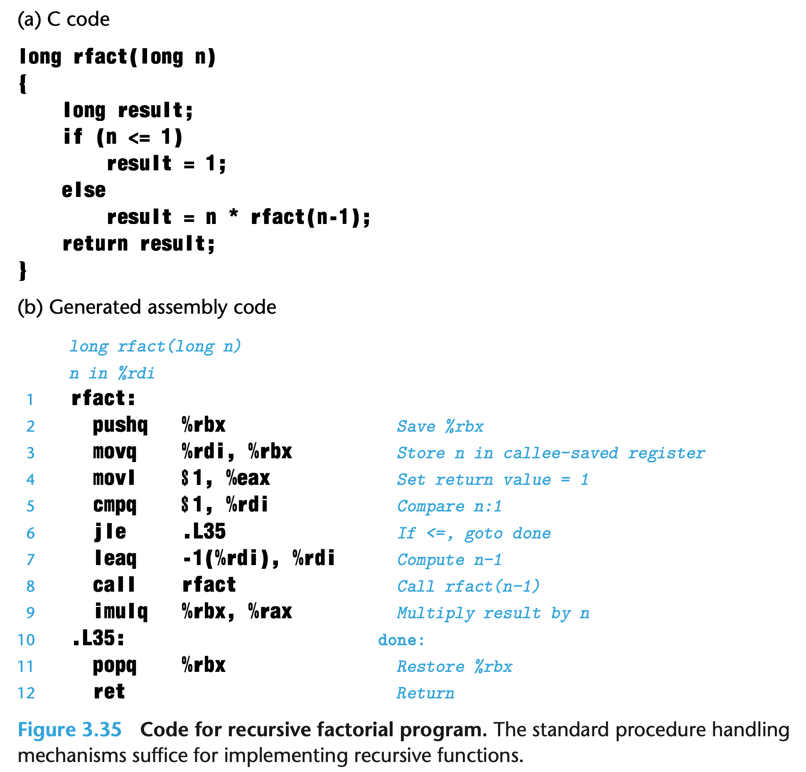
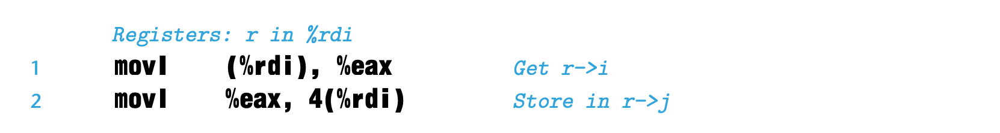
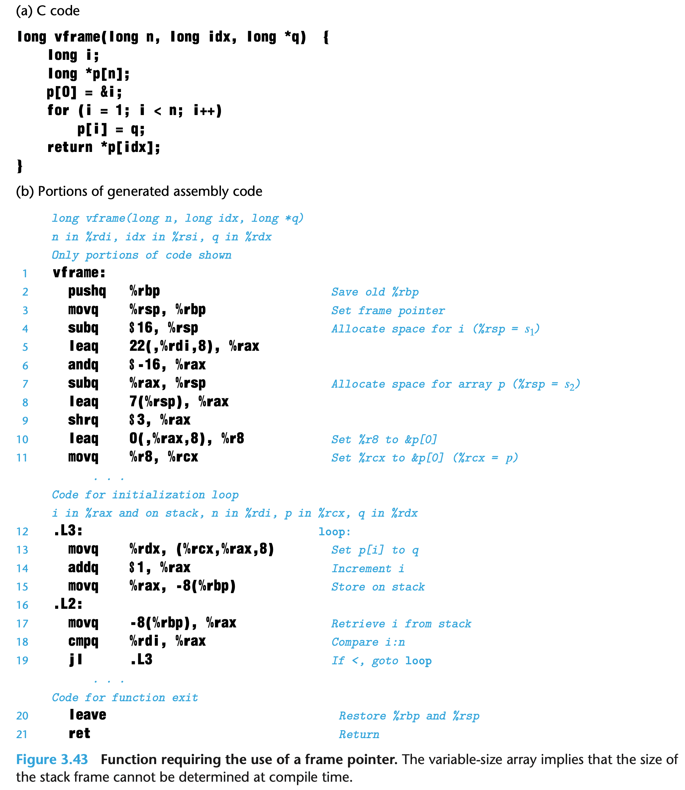
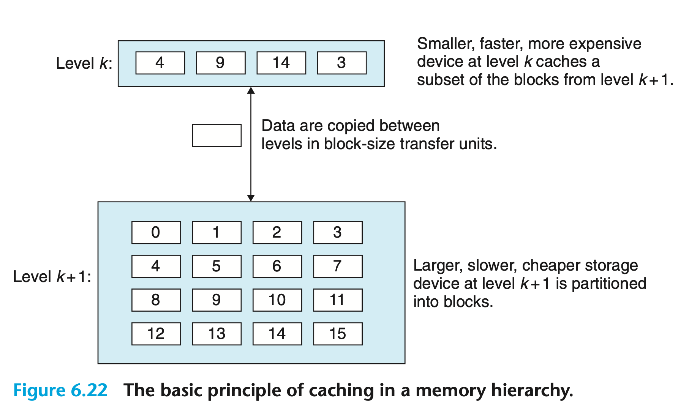
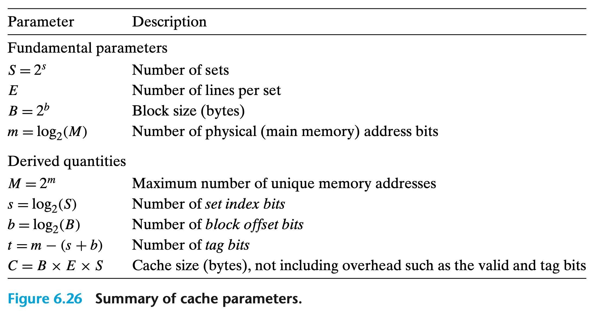
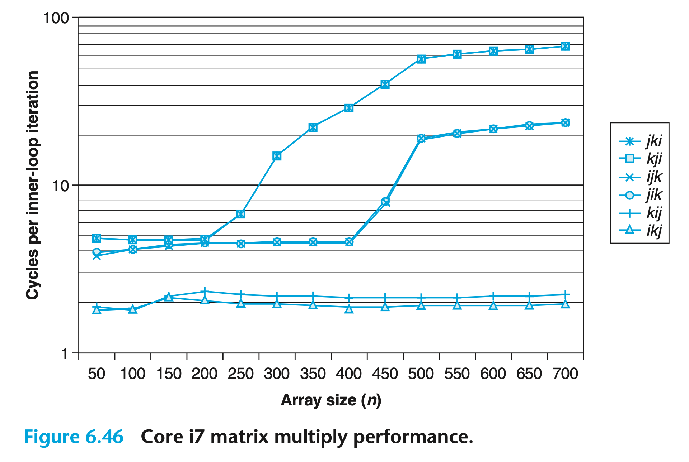
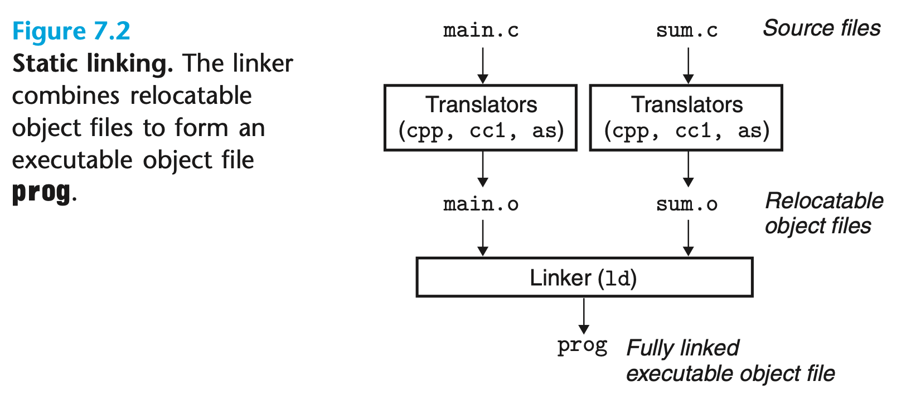
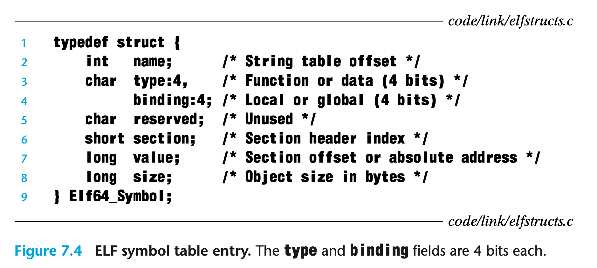
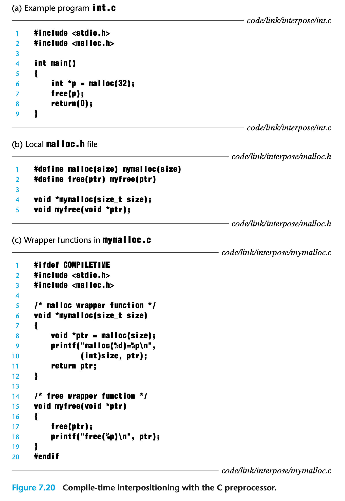
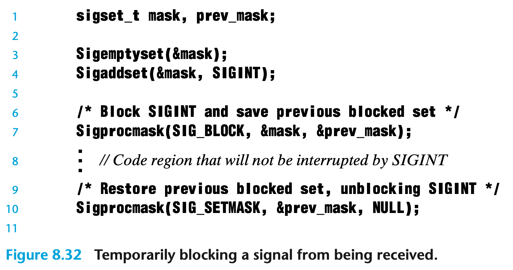

# Computer Systems: A Programmer’s Perspective

## Overview

### Form of a program

We have a simple Hello world C program in Figure 1.1.


The hello program begins life as a *source program* (or *source file*) that the programmer creates with an editor and saves in a text file called hello.c. The source program is a sequence of bits, each with a value of 0 or 1, organized in 8-bit chunks called *bytes*. Each byte represents some text character in the program.

Most computer systems represent text characters using the ASCII standard that represents each character with a unique byte-size integer value. For example, Figure 1.2 shows the ASCII representation of the hello.c program.


### Translation Process

The hello program begins life as a high-level C program because it can be read and understood by human beings in that form. However, in order to run hello.c on the system, the individual C statements must be translated by other programs into a sequence of low-level *machine-language* instructions. These instructions are then packaged in a form called an ***executable object program*** and stored as a binary disk file. Object programs are also referred to as *executable object files*.

```bash
gcc -o hello hello.c
```

Here, the gcc compiler driver reads the source file hello.c and translates it into an executable object file hello. The translation is performed in the sequence of four phases shown in Figure 1.3. The programs that perform the four phases (*preprocessor*, *compiler*, *assembler*, and *linker*) are known collectively as the *compilation system*.


- *Preprocessing phase:* The preprocessor (cpp) modifies the original C program according to directives that begin with the ‘#’ character. For example, the #include <stdio.h> command in line 1 of hello.c tells the preprocessor to read the contents of the system header file stdio.h and insert it directly into the program text. The result is another C program, typically with the .i suffix.

- *Compilation phase:* The compiler (cc1) translates the text file hello.i into the text file hello.s, which contains an *assembly-language program*. This program includes the following definition of function main:

  ```assembly
  main:
  	subq 	$8, %rsp
  	movl 	$.LC0, %edi
  	call	puts
  	movl	$0, %eax
  	addq  $8, %rsp
  	ret
  
  ```

  Assembly language is useful because it provides a common output language for different compilers for different high-level languages. For example, C compilers and Fortran compilers both generate output files in the same assembly language.

- *Assembly phase:* Next, the assembler (as) translates hello.s into machine- language instructions, packages them in a form known as a *relocatable object program*, and stores the result in the object file hello.o. This file is a binary file containing 17 bytes to encode the instructions for function main.
- *Linking phase:* Notice that our hello program calls the printf function, which is part of the *standard C library* provided by every C compiler. The printf function resides in a separate precompiled object file called printf.o, which must somehow be merged with our hello.o program. The linker (ld) handles this merging. The result is the hello file, which is an executable object file (or simply *executable*) that is ready to be loaded into memory and executed by the system.

### General System Architectural 

To understand what happens to our hello program when we run it, we need to understand the hardware organization of a typical system, which is shown in Figure 1.4.


**Buses**

Running throughout the system is a collection of electrical conduits called *buses* that carry bytes of information back and forth between the components. Buses are typically designed to transfer fixed-size chunks of bytes known as *words*. The number of bytes in a word (the *word size*) is a fundamental system parameter that varies across systems. Most machines today have word sizes of either 4 bytes (32 bits) or 8 bytes (64 bits).

**I/O Devices**

Input/output (I/O) devices are the system’s connection to the external world. Our example system has four I/O devices: a keyboard and mouse for user input, a display for user output, and a disk drive (or simply disk) for long-term storage of data and programs. Initially, the executable hello program resides on the disk.

Each I/O device is connected to the I/O bus by either a *controller* or an *adapter*.

- Controllers are chip sets in the device itself or on the system’s main printed circuit board (often called the *motherboard*). 
- An adapter is a card that plugs into a slot on the motherboard. 

Regardless, the purpose of each is to transfer information back and forth between the I/O bus and an I/O device.

**Main Memory**

The *main memory* is a temporary storage device that holds both a program and the data it manipulates while the processor is executing the program. Physically, main memory consists of a collection of *dynamic random access memory* (DRAM) chips. Logically, memory is organized as a linear array of bytes, each with its own unique address (array index) starting at zero. In general, each of the machine instructions that constitute a program can consist of a variable number of bytes. The sizes of data items that correspond to C program variables vary according to type. For example, on an x86-64 machine running Linux, data of type short require 2 bytes, types int and float 4 bytes, and types long and double 8 bytes.

**Processor**

The *central processing unit* (CPU), or simply *processor*, is the engine that interprets (or *executes*) instructions stored in main memory. At its core is a word-size storage device (or *register*) called the *program counter* (PC). At any point in time, the PC points at (contains the address of) some machine-language instruction in main memory.

From the time that power is applied to the system until the time that the power is shut off, a processor repeatedly executes the instruction pointed at by the program counter and updates the program counter to point to the next instruction. A processor *appears* to operate according to a very simple instruction execution model, defined by its *instruction set architecture*. In this model, instructions execute in strict sequence, and executing a single instruction involves performing a series of steps. The processor reads the instruction from memory pointed at by the program counter (PC), interprets the bits in the instruction, performs some simple operation dictated by the instruction, and then updates the PC to point to the next instruction, which may or may not be contiguous in memory to the instruction that was just executed.

There are only a few of these simple operations, and they revolve around main memory, the *register file*, and the *arithmetic/logic unit* (ALU). 

- The register file is a small storage device that consists of a collection of word-size registers, each with its own unique name. 
- The ALU computes new data and address values. Here are some examples of the simple operations that the CPU might carry out at the request of an instruction:
	- **Load**: Copy a byte or a word from main memory into a register, overwriting the previous contents of the register.
	- **Store**: Copy a byte or a word from a register to a location in main memory, overwriting the previous contents of that location.
	- **Operate**: Copy the contents of two registers to the ALU, perform an arithmetic operation on the two words, and store the result in a register, overwriting the previous contents of that register.
	- **Jump**: Extract a word from the instruction itself and copy that word into the program counter (PC), overwriting the previous value of the PC.

We say that a processor appears to be a simple implementation of its instruction set architecture, but in fact modern processors use far more complex mechanisms to speed up program execution. Thus, we can distinguish the processor’s instruction set architecture, describing the effect of each machine-code instruction, from its *micro-architecture*, describing how the processor is actually implemented.

As we type the characters ./hello at the keyboard, the shell program reads each one into a register and then stores it in memory, as shown in Figure 1.5.When we hit the enter key on the keyboard, the shell knows that we have finished typing the command. The shell then loads the executable hello file by executing a sequence of instructions that copies the code and data in the hello object file from disk to main memory. The data includes the string of characters hello, world\n that will eventually be printed out.

Using a technique known as *direct memory access* (DMA), the data travel directly from disk to main memory, without passing through the processor. This step is shown in Figure 1.6.


Once the code and data in the hello object file are loaded into memory, the processor begins executing the machine-language instructions in the hello program’s main routine. These instructions copy the bytes in the hello, world\n string from memory to the register file, and from there to the display device, where they are displayed on the screen. This step is shown in Figure 1.7.


### Memory Hierarchy

An important lesson from this simple example is that a system spends a lot of time moving information from one place to another. The machine instructions in the hello program are originally stored on disk. When the program is loaded, they are copied to main memory. As the processor runs the program, instructions are copied from main memory into the processor. Similarly, the data string hello,world\n, originally on disk, is copied to main memory and then copied from main memory to the display device. From a programmer’s perspective, much of this copying is overhead that slows down the “real work” of the program. Thus, a major goal for system designers is to make these copy operations run as fast as possible.

 The processor can read data from the register file almost 100 times faster than from memory. Even more troublesome, as semiconductor technology progresses over the years, this *processor–memory gap* continues to increase. It is easier and cheaper to make processors run faster than it is to make main memory run faster.

To deal with the processor–memory gap, system designers include smaller, faster storage devices called *cache memories* (or simply caches) that serve as temporary staging areas for information that the processor is likely to need in the near future. Figure 1.8 shows the cache memories in a typical system. 

An *L1 cache* on the processor chip holds tens of thousands of bytes and can be accessed nearly as fast as the register file. A larger *L2 cache* with hundreds of thousands to millions of bytes is connected to the processor by a special bus. It might take 5 times longer for the processor to access the L2 cache than the L1 cache, but this is still 5 to 10 times faster than accessing the main memory. The L1 and L2 caches are implemented with a hardware technology known as *static random access memory* (SRAM). Newer and more powerful systems even have three levels of cache: L1, L2, and L3. The idea behind caching is that a system can get the effect of both a very large memory and a very fast one by exploiting *locality*, the tendency for programs to access data and code in localized regions. By setting up caches to hold data that are likely to be accessed often, we can perform most memory operations using the fast caches.

This notion of inserting a smaller, faster storage device (e.g., cache memory) between the processor and a larger, slower device (e.g., main memory) turns out to be a general idea. In fact, the storage devices in every computer system are organized as a *memory hierarchy* similar to Figure 1.9 As we move from the top of the hierarchy to the bottom, the devices become slower, larger, and less costly per byte. The register file occupies the top level in the hierarchy, which is known as level 0 or L0. We show three levels of caching L1 to L3, occupying memory hierarchy levels 1 to 3. Main memory occupies level 4, and so on.

The main idea of a memory hierarchy is that storage at one level serves as a cache for storage at the next lower level. Thus, the register file is a cache for the L1 cache. Caches L1 and L2 are caches for L2 and L3, respectively. The L3 cache is a cache for the main memory, which is a cache for the disk. On some networked systems with distributed file systems, the local disk serves as a cache for data stored on the disks of other systems.

### Operating System Layer

When the hello program printed its message, neither program accessed the keyboard, display, disk, or main memory directly. Rather, they relied on the services provided by the *operating system*. We can think of the operating system as a layer of software interposed between the application program and the hardware, as shown in Figure 1.10. All attempts by an application program to manipulate the hardware must go through the operating system.

The operating system has two primary purposes: 

1. to protect the hardware from misuse by runaway applications.
2. to provide applications with simple and uniform mechanisms for manipulating complicated and often wildly different low-level hardware devices. 

The operating system achieves both goals via the fundamental abstractions shown in Figure 1.11 *processes*, *virtual memory*, and *files*. As this figure suggests, files are abstractions for I/O devices, virtual memory is an abstraction for both the main memory and disk I/O devices, and processes are abstractions for the processor, main memory, and I/O devices. 

#### Process

A *process* is the operating system’s abstraction for a running program. Multi- ple processes can run concurrently on the same system, and each process appears to have exclusive use of the hardware. By *concurrently*, we mean that the instructions of one process are interleaved with the instructions of another process. The operating system performs this interleaving with a mechanism known as **context switching**.

The operating system keeps track of all the state information that the process needs in order to run. This state, which is known as the *context*, includes information such as the current values of the PC, the register file, and the contents of main memory. At any point in time, a uniprocessor system can only execute the code for a single process. When the operating system decides to transfer control from the current process to some new process, it performs a *context switch* by saving the context of the current process, restoring the context of the new process, and then passing control to the new process. The new process picks up exactly where it left off. Figure 1.12 shows the basic idea for our example hello scenario.

There are two concurrent processes in our example scenario: the shell process and the hello process. Initially, the shell process is running alone, waiting for input on the command line. When we ask it to run the hello program, the shell carries out our request by invoking a special function known as a **system call** that passes control to the operating system. The operating system saves the shell’s context, creates a new hello process and its context, and then passes control to the new hello process. After hello terminates, the operating system restores the context of the shell process and passes control back to it, where it waits for the next command-line input.

As Figure 1.12 indicates, the transition from one process to another is managed by the **operating system *kernel***. The kernel is the portion of the operating system code that is always resident in memory. When an application program requires some action by the operating system, such as to read or write a file, it executes a special *system call* instruction, transferring control to the kernel. The kernel then performs the requested operation and returns back to the application program. 

> _**Note:**_ kernel is not a separate process. Instead, it is a collection of code and data structures that the system uses to manage all the processes.

#### Thread

Although we normally think of a process as having a single control flow, in modern systems a process can actually consist of multiple execution units, called **threads**, each running in the context of the process and sharing the same code and global data. Threads are an increasingly important programming model because of the requirement for concurrency in network servers, because it is easier to share data between multiple threads than between multiple processes, and because threads are typically more efficient than processes. Multi-threading is also one way to make programs run faster when multiple processors are available.

#### Virtual Memory

*Virtual memory* is an abstraction that provides each process with the illusion that it has exclusive use of the main memory. Each process has the same uniform view of memory, which is known as its **virtual address space**. The virtual address space for Linux processes is shown in Figure 1.13. (Other Unix systems use a similar layout.) In Linux, the topmost region of the address space is reserved for code and data in the operating system that is common to all processes. The lower region of the address space holds the code and data defined by the user’s process. Note that addresses in the figure increase from the bottom to the top.

The virtual address space seen by each process consists of a number of well- defined areas, each with a specific purpose. 

- **Program code and data**: Code begins at the same fixed address for all processes, followed by data locations that correspond to global C variables. The code and data areas are initialized directly from the contents of an executable object file—in our case, the hello executable.
- **Heap**: The code and data areas are followed immediately by the run-time *heap*. Unlike the code and data areas, which are fixed in size once the process begins running, the heap expands and contracts dynamically at run time as a result of calls to C standard library routines such as malloc and free.

- **Shared libraries**: Near the middle of the address space is an area that holds the code and data for *shared libraries* such as the C standard library and the math library. The notion of a shared library is a powerful but somewhat difficult concept.
- **Stack**: At the top of the user’s virtual address space is the *user stack* that the compiler uses to implement function calls. Like the heap, the user stack expands and contracts dynamically during the execution of the program. In particular, each time we call a function, the stack grows. Each time we return from a function, it contracts.
- **Kernel virtual memory**: The top region of the address space is reserved for the kernel. Application programs are not allowed to read or write the contents of this area or to directly call functions defined in the kernel code. Instead, they must invoke the kernel to perform these operations.

For virtual memory to work, a sophisticated interaction is required between the hardware and the operating system software, including a hardware translation of every address generated by the processor. The basic idea is to store the contents of a process’s virtual memory on disk and then use the main memory as a cache for the disk.

#### Files

A *file* is a sequence of bytes, nothing more and nothing less. Every I/O device, including disks, keyboards, displays, and even networks, is modeled as a file. All input and output in the system is performed by reading and writing files, using a small set of system calls known as *Unix I/O*.

This simple and elegant notion of a file is nonetheless very powerful because it provides applications with a uniform view of all the varied I/O devices that might be contained in the system. For example, application programmers who manipulate the contents of a disk file are blissfully unaware of the specific disk technology. Further, the same program will run on different systems that use different disk technologies.

### Systems Communicate with Other Systems Using Networks

Up to this point in our tour of systems, we have treated a system as an isolated collection of hardware and software. In practice, modern systems are often linked to other systems by networks. From the point of view of an individual system, the network can be viewed as just another I/O device, as shown in Figure 1.14. When the system copies a sequence of bytes from main memory to the network adapter, the data flow across the network to another machine. Similarly, the system can read data sent from other machines and copy these data to its main memory.

With the advent of global networks such as the Internet, copying information from one machine to another has become one of the most important uses of computer systems. For example, applications such as email, instant messaging, the World Wide Web, FTP, and telnet are all based on the ability to copy information over a network.

Returning to our hello example, we could use the familiar telnet application to run hello on a remote machine. Suppose we use a telnet *client* running on our local machine to connect to a telnet *server* on a remote machine. After we log in to the remote machine and run a shell, the remote shell is waiting to receive an input command. From this point, running the hello program remotely involves the five basic steps shown in Figure 1.15.

After we type in the hello string to the telnet client and hit the enter key, the client sends the string to the telnet server. After the telnet server receives the string from the network, it passes it along to the remote shell program. Next, the remote shell runs the hello program and passes the output line back to the telnet server. Finally, the telnet server forwards the output string across the network to the telnet client, which prints the output string on our local terminal.This type of exchange between clients and servers is typical of all network applications.

### Important Concepts

To close out this chapter, we highlight several important concepts that cut across all aspects of computer systems. We will discuss the importance of these concepts at multiple places within the book.

#### Amdahl’s Law

Gene Amdahl, one of the early pioneers in computing, made a simple but insightful observation about the effectiveness of improving the performance of one part of a system. This observation has come to be known as *Amdahl’s law*. The main idea is that when we speed up one part of a system, the effect on the overall system performance depends on both how significant this part was and how much it sped up. 

Consider a system in which executing some application requires time $T_{old}$. Suppose some part of the system requires a fraction $\alpha$ of this time, and that we improve its performance by a factor of $k$. That is, the component originally required time $\alpha T_{old}$, and it now requires time $\alpha T_{old}/ k$. The overall execution time would thus be
$$
T_{new} = (1 − \alpha)T_{old} + (\alpha T_{old})/k =T_{old}[(1−\alpha)+\alpha/k]
$$
From this, we can compute the speedup $S = T_{old}/T_{new}$ as
$$
S = \frac{1}{(1−\alpha)+\alpha/k}
$$
As an example, consider the case where a part of the system that initially consumed 60% of the time (α=0.6) is sped up by a factor of 3 (k=3). Then we get a speedup of 1/[0.4 + 0.6/3] = 1.67×. Even though we made a substantial improvement to a major part of the system, our net speedup was significantly less than the speedup for the one part. This is the major insight of Amdahl’s law— to significantly speed up the entire system, we must improve the speed of a very large fraction of the overall system.

One interesting special case of Amdahl’s law is to consider the effect of setting k to ∞. That is, we are able to take some part of the system and speed it up to the point at which it takes a negligible amount of time. We then get
$$
S_{\infty}=\frac{1}{(1 - \alpha)}
$$
So, for example, if we can speed up 60% of the system to the point where it requires close to no time, our net speedup will still only be 1/0.4 = 2.5×.

Amdahl’s law describes a general principle for improving any process. In addition to its application to speeding up computer systems, it can guide a company trying to reduce the cost of manufacturing razor blades, or a student trying to improve his or her grade point average. Perhaps it is most meaningful in the world of computers, where we routinely improve performance by factors of 2 or more. Such high factors can only be achieved by optimizing large parts of a system.

#### Concurrency and Parallelism

We use the term **concurrency** to refer to the general concept of a system with multiple, simultaneous activities, and the term *parallelism* to refer to the use of concurrency to make a system run faster. Parallelism can be exploited at multiple levels of abstraction in a computer system. We highlight three levels here, working from the highest to the lowest level in the system hierarchy.

##### Thread-Level Concurrency

Building on the process abstraction, we are able to devise systems where multiple programs execute at the same time, leading to *concurrency*. With threads, we can even have multiple control flows executing within a single process. Traditionally, this concurrent execution was only *simulated*, by having a single computer rapidly switch among its executing processes, much as a juggler keeps multiple balls flying through the air. Until recently, most actual computing was done by a single processor, even if that processor had to switch among multiple tasks. This configuration is known as a *uniprocessor system.*

When we construct a system consisting of multiple processors all under the control of a single operating system kernel, we have a *multiprocessor system*. Such systems have been available for large-scale computing since the 1980s, but they have more recently become commonplace with the advent of *multi-core* processors and *hyperthreading*. Figure 1.16 shows a taxonomy of these different processor types.


Multi-core processors have several CPUs (referred to as “cores”) integrated onto a single integrated-circuit chip. Figure 1.17 illustrates the organization of a typical multi-core processor, where the chip has four CPU cores, each with its own L1 and L2 caches, and with each L1 cache split into two parts—one to hold recently fetched instructions and one to hold data. The cores share higher levels of cache as well as the interface to main memory. Industry experts predict that they will be able to have dozens, and ultimately hundreds, of cores on a single chip.


Hyperthreading, sometimes called *simultaneous multi-threading*, is a technique that allows a single CPU to execute multiple flows of control. It involves having multiple copies of some of the CPU hardware, such as program counters and register files, while having only single copies of other parts of the hardware, such as the units that perform floating-point arithmetic. Whereas a conventional processor requires around 20,000 clock cycles to shift between different threads, a hyperthreaded processor decides which of its threads to execute on a cycle-by-cycle basis. It enables the CPU to take better advantage of its processing resources. For example, if one thread must wait for some data to be loaded into a cache, the CPU can proceed with the execution of a different thread.

The use of multiprocessing can improve system performance in two ways. First, it reduces the need to simulate concurrency when performing multiple tasks. As mentioned, even a personal computer being used by a single person is expected to perform many activities concurrently. Second, it can run a single application program faster, but only if that program is expressed in terms of multiple threads that can effectively execute in parallel. Thus, although the principles of concurrency have been formulated and studied for over 50 years, the advent of multi-core and hyperthreaded systems has greatly increased the desire to find ways to write application programs that can exploit the thread-level parallelism available with Main memory the hardware.

##### Instruction-Level Parallelism

At a much lower level of abstraction, modern processors can execute multiple instructions at one time, a property known as *instruction-level parallelism*. More recent processors can sustain execution rates of 2–4 instructions per clock cycle. Any given instruction requires much longer from start to finish, perhaps 20 cycles or more, but the processor uses a number of clever tricks to process as many as 100 instructions at a time. *Pipelining*, where the actions required to execute an instruction are partitioned into different steps and the processor hardware is organized as a series of stages, each performing one of these steps. The stages can operate in parallel, working on different parts of different instructions. We will see that a fairly simple hardware design can sustain an execution rate close to 1 instruction per clock cycle.

Processors that can sustain execution rates faster than 1 instruction per cycle are known as *superscalar* processors. Most modern processors support superscalar operation. In Chapter 5, we will describe a high-level model of such processors. We will see that application programmers can use this model to understand the performance of their programs. They can then write programs such that the generated code achieves higher degrees of instruction-level parallelism and therefore runs faster.

##### Single-Instruction, Multiple-Data (SIMD) Parallelism

At the lowest level, many modern processors have special hardware that allows a single instruction to cause multiple operations to be performed in parallel, a mode known as *single-instruction, multiple-data* (SIMD) parallelism. For example, recent generations of Intel and AMD processors have instructions that can add 8 pairs of single-precision floating-point numbers (C data type float) in parallel.

These SIMD instructions are provided mostly to speed up applications that process image, sound, and video data. Although some compilers attempt to automatically extract SIMD parallelism from C programs, a more reliable method is to write programs using special *vector* data types supported in compilers such as gcc. We describe this style of programming in Web Aside opt:simd, as a supplement to the more general presentation on program optimization found in Chapter 5

#### The Importance of Abstractions in Computer Systems

The use of *abstractions* is one of the most important concepts in computer science. For example, one aspect of good programming practice is to formulate a simple application program interface (API) for a set of functions that allow programmers to use the code without having to delve into its inner workings. Different programming languages provide different forms and levels of support for abstraction, such as Java class declarations and C function prototypes.

We have already been introduced to several of the abstractions seen in computer systems, as indicated in Figure 1.18. On the processor side, the *instruction set architecture* provides an abstraction of the actual processor hardware. With this abstraction, a machine-code program behaves as if it were executed on a processor that performs just one instruction at a time. The underlying hardware is far more elaborate, executing multiple instructions in parallel, but always in a way that is consistent with the simple, sequential model. By keeping the same execution model, different processor implementations can execute the same machine code while offering a range of cost and performance.

On the operating system side, we have introduced three abstractions: *files* as an abstraction of I/O devices, *virtual memory* as an abstraction of program memory, and *processes* as an abstraction of a running program. To these abstractions we add a new one: the *virtual machine*, providing an abstraction of the entire computer, including the operating system, the processor, and the programs. The idea of a virtual machine was introduced by IBM in the 1960s, but it has become more prominent recently as a way to manage computers that must be able to run programs designed for multiple operating systems (such as Microsoft Windows, Mac OS X, and Linux) or different versions of the same operating system.

### Summary

A computer system consists of hardware and systems software that cooperate to run application programs. Information inside the computer is represented as groups of bits that are interpreted in different ways, depending on the context. Programs are translated by other programs into different forms, beginning as ASCII text and then translated by compilers and linkers into binary executable files.

Processors read and interpret binary instructions that are stored in main memory. Since computers spend most of their time copying data between memory, I/O devices, and the CPU registers, the storage devices in a system are arranged in a hierarchy, with the CPU registers at the top, followed by multiple levels of hardware cache memories, DRAM main memory, and disk storage. Storage devices that are higher in the hierarchy are faster and more costly per bit than those lower in the hierarchy. Storage devices that are higher in the hierarchy serve as caches for devices that are lower in the hierarchy. Programmers can optimize the performance of their C programs by understanding and exploiting the memory hierarchy.

The operating system kernel serves as an intermediary between the application and the hardware. It provides three fundamental abstractions: (1) Files are abstractions for I/O devices. (2) Virtual memory is an abstraction for both main memory and disks. (3) Processes are abstractions for the processor, main memory, and I/O devices.

Finally, networks provide ways for computer systems to communicate with one another. From the viewpoint of a particular system, the network is just another I/O device.

## Representing and Manipulating Information

### Information Storage

Rather than accessing individual bits in memory, most computers use blocks of 8 bits, or *bytes*, as the smallest addressable unit of memory. A machine-level program views memory as a very large array of bytes, referred to as **virtual memory**. Every byte of memory is identified by a unique number, known as its *address*, and the set of all possible addresses is known as the **virtual address space**.

#### Data Sizes

Every computer has a ***word size***, indicating the nominal size of pointer data. For a machine with a w-bit word size, the virtual addresses can range from 0 to $2^w$ − 1, giving the program access to at most $2^w$ bytes. A machines with 32-bit word sizes limits the virtual address space to 4 gigabytes (written 4 GB).


To avoid the vagaries of relying on “typical” sizes and different compiler settings, ISO C99 introduced a class of data types where the data sizes are fixed regardless of compiler and machine settings. Among these are data types int32_t and int64_t, having exactly 4 and 8 bytes, respectively. Using fixed-size integer types is the best way for programmers to have close control over data representations.

Most machines also support two different floating-point formats: single precision, declared in C as float, and double precision, declared in C as double. These formats use 4 and 8 bytes, respectively.

Computer representations use a limited number of bits to encode a number, and hence some operations can *overflow* when the results are too large to be represented. This can lead to some surprising results. On most of today’s computers (those using a 32-bit representation for data type int), computing the expression.

#### Number System

Human beings use *decimal* (base 10) number systems for counting and measurements. Computers use *binary* (base 2) number system, as they are made from binary digital components (known as transistors) operating in two states - on and off. In computing, we also use *hexadecimal* (base 16) or *octal* (base 8) number systems, as a *compact* form for representing binary numbers.

##### Binary Number System

Binary number system has two symbols: `0` and `1`, called *bits*. It is also a *positional notation*, for example,
$$
10110 = 10000 + 0000 + 100 + 10 + 0 = 1×2^4 + 0×2^3 + 1×2^2 + 1×2^1 + 0×2^0
$$

##### Hexadecimal (Base 16) Number System

Hexadecimal number system uses 16 symbols: `0`, `1`, `2`, `3`, `4`, `5`, `6`, `7`, `8`, `9`, `A`, `B`, `C`, `D`, `E`, and `F`, called *hex digits*. It is a *positional notation*, for example,
$$
0\times A3E = 0\times A00 + 0\times030 + 0\times E = 10×16^2 + 3×16^1 + 14×16^0
$$


#### Conversion

##### Hexadecimal and Binary

**From Binary to Hex**: you convert binary to hexadecimal by first splitting it into groups of 4 bits each.
$$
1111001010110110110011 = 11\ \ 1100\ \ 1010\ \ 1101\ \ 1011\ \ 0011\\
=3CADB3
$$
**From Hex  to Binary**: Simply reserves the process for Hex to Binary
$$
A3C5 =\ \ 1010\ \ 0011\ \ 1100\ \ 0101
$$

##### Base r and Base 10

**Conversion from Base `r` to Decimal (Base 10)**: Given a *n*-digit base *r* number: $d_{n-1}d_{n-2}d_{n-3}...d_2d_1d_0$ (base r), the decimal equivalent is given by:
$$
d_{n-1}\times r^{n-1} +d_{n-2}\times r^{n-2} + \ldots d_1 \times r^{1} + d_0 \times r^{0}
$$
For examples,

```
0xA1C2 = 10×16^3 + 1×16^2 + 12×16^1 + 2 = 41410 (base 10)
10110 = 1×2^4 + 1×2^2 + 1×2^1 = 22 (base 10)
```

**Conversion from Base 10 to Base r**: Use repeated division/remainder. 

For example,

```
To convert 261(base 10) to hexadecimal:
  261/16 => quotient=16 remainder=5
  16/16  => quotient=1  remainder=0
  1/16   => quotient=0  remainder=1 (quotient=0 stop)
  Hence, 261 = 0x105 (Collect the hex digits from the remainder in reverse order)
```

The above procedure is actually applicable to conversion between any 2 base systems. For example,

```
To convert 1023(base 4) to base 3:
  1023(base 4)/3 => quotient=25D remainder=0
  25D/3          => quotient=8D  remainder=1
  8D/3           => quotient=2D  remainder=2
  2D/3           => quotient=0   remainder=2 (quotient=0 stop)
  Hence, 1023(base 4) = 2210(base 3)
```

##### Two Number Systems with Fractional Part

1. Separate the integral and the fractional parts.
2. For the integral part, divide by the target radix repeatably, and collect the ramainder in reverse order.
3. For the fractional part, multiply the fractional part by the target radix repeatably, and collect the integral part in the same order.

**Decimal to Binary**:

```
Convert 18.6875D to binary
Integral Part = 18D
  18/2 => quotient=9 remainder=0
  9/2  => quotient=4 remainder=1
  4/2  => quotient=2 remainder=0
  2/2  => quotient=1 remainder=0
  1/2  => quotient=0 remainder=1 (quotient=0 stop)
  Hence, 18D = 10010B
Fractional Part = .6875D
  .6875*2=1.375 => whole number is 1
  .375*2=0.75   => whole number is 0
  .75*2=1.5     => whole number is 1
  .5*2=1.0      => whole number is 1
  Hence .6875D = .1011B
Combine, 18.6875D = 10010.1011B
```

**Decimal to Hexadecimal**:

```
Convert 18.6875D to hexadecimal
Integral Part = 18D
  18/16 => quotient=1 remainder=2
  1/16  => quotient=0 remainder=1 (quotient=0 stop)
  Hence, 18D = 0x12
Fractional Part = .6875D
  .6875*16=11.0 => whole number is 11D (BH)
  Hence .6875D = 0x.B
Combine, 18.6875D = 0x12.B
```

#### Addressing and Byte Ordering

In virtually all machines, a multi-byte object is stored as a contiguous sequence of bytes, with the address of the object given by the smallest address of the bytes used. 

Some machines choose to store the object in memory ordered from least significant byte to most, while other machines store them from most to least. 

- **Little endian**: the least significant byte comes first.
- **Big endian**: the most significant byte comes first.

Suppose the variable x of type int and at address 0x100 has a hexadecimal value of 0x01234567. The ordering of the bytes within the address range 0x100 through 0x103 depends on the type of machine:


Byte ordering becomes an issue the first is when binary data are communicated over a network between different machines. A common problem is for data produced by a little-endian machine to be sent to a big-endian machine, or vice versa, leading to the bytes within the words being in reverse order for the receiving program. To avoid such problems, code written for networking applications must follow established conventions for byte ordering to make sure the sending machine converts its internal representation to the network standard, while the receiving machine converts the network standard to its internal representation. 

#### Introduction to Boolean Algebra


We can extend the four Boolean operations to also operate on *bit vectors*, strings of zeros and ones of some fixed length w. As examples, consider the case where w = 4, and with arguments a = [0110] and b = [1100]. Then the four operations a & b, a | b, a ^ b, and ~b yield


One common use of bit-level operations is to implement *masking* operations, where a mask is a bit pattern that indicates a selected set of bits within a word. As an example, the mask 0xFF (having ones for the least significant 8 bits) indicates the low-order byte of a word. The bit-level operation x & 0xFF yields a value consisting of the least significant byte of x, but with all other bytes set to 0. For example, with x = 0x89ABCDEF, the expression would yield 0x000000EF. 

#### Shift Operations in C

**Logical**: A logical right shift fills the left end with k zeros, giving a result [0, . . . , 0, $x_{w−1}$,$x_{w−2}$, . . . $x_{k}$].

**Arithmetic**: An arithmetic right shift fills the left end with k repetitions of the most significant bit, giving a result [$x_{w−1}$, . . . , $x_{w−1}$, $x_{w−1}$, $x_{w−2}$, . . . $x_{k}$]. This convention might seem peculiar, but as we will see, it is useful for operating on signed integer data.

Java has a precise definition of how right shifts should be performed. The expression x >> k shifts x arithmetically by k positions, while x >>> k shifts it logically.

#### Range of data types in C


### Integer Representations

Computers use *a fixed number of bits* to represent an integer. The commonly-used bit-lengths for integers are 8-bit, 16-bit, 32-bit or 64-bit. Besides bit-lengths, there are two representation schemes for integers:

1. **Unsigned Integers**: can represent zero and positive integers.
2. **Signed Integers**: can represent zero, positive and negative integers. Three representation schemes had been proposed for signed integers:
   1. Sign-Magnitude representation
   2. 1's Complement representation
   3. 2's Complement representation

#### Unsigned Integers

Unsigned integers can represent zero and positive integers, but not negative integers. The value of an unsigned integer is interpreted as "*the magnitude of its underlying binary pattern*".

**Example 1:** Suppose that `n=8` and the binary pattern is` 0100 0001B`, the value of this unsigned integer is` 1×2^0 + 1×2^6 = 65`.

An *n*-bit pattern can represent $2^n$ distinct integers. An *n*-bit unsigned integer can represent integers from `0` to $2^n -1$, as tabulated below:

|  n   | Minimum |                       Maximum                       |
| :--: | :-----: | :-------------------------------------------------: |
|  8   |    0    |                   (2^8)-1  (=255)                   |
|  16  |    0    |                 (2^16)-1 (=65,535)                  |
|  32  |    0    |        (2^32)-1 (=4,294,967,295) (9+ digits)        |
|  64  |    0    | (2^64)-1 (=18,446,744,073,709,551,615) (19+ digits) |

#### Signed Integers

Signed integers can represent zero, positive integers, as well as negative integers. Three representation schemes are available for signed integers:

1. Sign-Magnitude representation
2. 1's Complement representation
3. 2's Complement representation

In all the above three schemes, the *most-significant bit* (msb) is called the *sign bit*. The sign bit is used to represent the *sign* of the integer - with 0 for positive integers and 1 for negative integers. The *magnitude* of the integer, however, is interpreted differently in different schemes.

##### n-bit Sign Integers in Sign-Magnitude Representation

In sign-magnitude representation:

- The most-significant bit (msb) is the *sign bit*, with value of 0 representing positive integer and 1 representing negative integer.
- The remaining *n*-1 bits represents the magnitude (absolute value) of the integer. The absolute value of the integer is interpreted as "the magnitude of the (*n*-1)-bit binary pattern".

**Example 1**: Suppose that `n=8` and the binary representation is` 0 100 0001B`.
  Sign bit is `0` ⇒ positive
  Absolute value is `100 0001B = 65D`
  Hence, the integer is `+65D`

**Example 2**: Suppose that `n=8` and the binary representation is` 1 000 0001B`.
  Sign bit is `1` ⇒ negative
  Absolute value is `000 0001B = 1D`
  Hence, the integer is `-1D`


The drawbacks of sign-magnitude representation are:

1. There are two representations (`0000 0000B` and `1000 0000B`) for the number zero, which could lead to inefficiency and confusion.
2. Positive and negative integers need to be processed separately.

##### n-bit Sign Integers in 1's Complement Representation

In 1's complement representation:

- Again, the most significant bit (msb) is the *sign bit*, with value of 0 representing positive integers and 1 representing negative integers.
- The remaining n-1 bits represents the magnitude of the integer, as follows:
  - for positive integers, the absolute value of the integer is equal to "the magnitude of the (*n*-1)-bit binary pattern".
  - for negative integers, the absolute value of the integer is equal to "the magnitude of the *complement* (*inverse*) of the (*n*-1)-bit binary pattern" (hence called 1's complement).

**Example 1**: Suppose that `n=8` and the binary representation` 0 100 0001B`.
  Sign bit is `0` ⇒ positive
  Absolute value is `100 0001B = 65D`
  Hence, the integer is `+65D`

**Example 2**: Suppose that `n=8` and the binary representation` 1 000 0001B`.
  Sign bit is `1` ⇒ negative
  Absolute value is the complement of `000 0001B`, i.e., `111 1110B = 126D`
  Hence, the integer is `-126D`


Again, the drawbacks are:

1. There are two representations (`0000 0000B` and `1111 1111B`) for zero.
2. The positive integers and negative integers need to be processed separately.

##### n-bit Sign Integers in 2's Complement Representation

In 2's complement representation:

- the most significant bit (msb) is the *sign bit*, with value of 0 representing positive integers and 1 representing negative integers.
- The remaining n-1 bits represents the magnitude of the integer, as follows:
  - for positive integers, the absolute value of the integer is equal to "the magnitude of the (*n*-1)-bit binary pattern".
  - for negative integers, the absolute value of the integer is equal to "the magnitude of the *complement* of the (*n*-1)-bit binary pattern *plus one*" (hence called 2's complement).

**Example 1**: Suppose that `n=8` and the binary representation` 0 100 0001B`.
  Sign bit is `0` ⇒ positive
  Absolute value is `100 0001B = 65D`
  Hence, the integer is `+65D`

**Example 2**: Suppose that `n=8` and the binary representation` 1 000 0001B`.
  Sign bit is `1` ⇒ negative
  Absolute value is the complement of `000 0001B` plus `1`, i.e., `111 1110B + 1B = 127`

  The negative value is $-2^7 + 2^0 = -127$


The following diagram explains how the 2's complement works. By re-arranging the number line, values from `-128` to `+127` are represented contiguously by ignoring the carry bit.


**Max Positive Number**: $2^{w}-1$

**Max Negative Number**: $-2^w$

#### Conversions between Signed and Unsigned

The effect of casting is to keep the bit values identical but change how these bits are interpreted.When an operation is performed where one operand is signed and the other is unsigned, C implicitly casts the signed argument to unsigned and performs the operations assuming the numbers are nonnegative. When converting from short to unsigned, the program first changes the size and then the type.

> _**Note**_: Be aware of casting between signed and unsigned, it may cause unintentional behaviour. In c, if you compare unsigned value with signed, c will explicit convert signed value into unsigned value which will leads to surprise result!

Conversions between Signed and Unsigned can be split into two parts, if we convert signed to unsigned, we call signed as *from* and unsigned as *to*:

1. If *from* is positive, then *to* is same value
2. if *from* is negative, then
   1. if *from* is *signed*, then add $2^w$ to *from* where* $2^w$ is the highest bit of current representation. eg. if it's 4 bit representation,  $2^4$ = 16 as showing below
   2. if *from* is *unsigned*, then subtract $2^w$ to *from*


#### Sign Extension

Given w-bit signed integer x, convert it to (w+k)-bit integer with same value:

Make k copies of sign bit for the left padding.


Examples are showing below:

Often see value like `ffff 0123`, it represents negative number. 


#### Truncation

Given k+w-bit signed or unsigned integer X, convert it to w-bit integer X’ with same value for “small enough” X:

Drop top k bits, it results to $x_{w–1} , x_{w–2},\dots, x_0$


### Integer Arithmetic

An arithmetic operation is said to *overflow* when the full integer result cannot fit within the word size limits of the data type. 

#### Addition

##### Unsigned Addition

If there is an *overflow*, simply ignore the carry bit, it is some form of **modular arithmetic** where $s = (u + v) \ mod \ 2^{w}$


##### Two’s Complement Addition

If there is an *overflow*, same as unsigned addition, simply ignore the carry bit.


#### Detecting Overflow

##### Detecting Overflow For unsigned

For x and y in the range $0≤x,y≤Max_w$,let $s= x+y$.Then the computation of s overflowed if and only if s < x (or equivalently, s < y).

##### Detecting Overflow For Two’s-Complement

For x and y in the range $Min_w ≤ x,y≤ Max_w$,let $s= x+y$. Then the computation of s has had positive overflow if and only if x > 0 and y > 0 but s ≤ 0. The computation has had negative overflow if and only if x < 0 and y < 0 but s ≥ 0.

#### Negation

##### Unsigned Negation

When x = 0, the additive inverse is clearly 0. For x > 0, consider the value $2^w − x$.

##### Two’s-Complement Negation

For w-bit two’s-complement addition, $TMin_w$ is its own additive inverse, while any other value x has −x as its additive inverse.

Getting  two’s-complement negation:

- x and -x = ~x + 1

- splitting the bit vector of x into two parts. Let k be the position of the rightmost 1, so the bit-level representation of x has the form $[x_{w−1}, x_{w−2}, . . . , x_{k+1}, 1, 0, . . . 0]$. The negation is then written in binary form as $[\sim x_{w−1}, \sim x_{w−2}, . . . \sim  x_{k+1}, 1, 0, . . . , 0]$. That is, we complement each bit to the left of bit position k. We illustrate this idea with some 4-bit numbers, where we highlight the rightmost pattern 1, 0, . . . , 0 in italics:

  | x    |      |      | -x   |      |
  | ---- | ---- | ---- | ---- | ---- |
  | 1100 | -4   |      | 0100 | 4    |
  | 1000 | -8   |      | 1000 | -8   |
  | 0101 | 5    |      | 1011 | -5   |
  | 0111 | 7    |      | 1001 | -7   |

#### Multiplication

##### Unsigned Multiplication

For x and y such that $0 ≤ x, y ≤ UMax_w$, let s be the multiplication result of two unsigned number, then
$$
s=(x\ y)\ mod\ 2^w
$$

##### Two’s-Complement Multiplication

Instead, signed multi-plication in C generally is performed by truncating the 2w bit product to w bits. Truncating a two’s-complement number to w bits is equivalent to first computing its value modulo $2^w$ and then converting from unsigned to two’s complement, giving the following


##### Multiplying by Constants

The integer multiply instruction on many machines was fairly slow, it requires clock cycles than addition, subtraction, bit-level operations, and shifting—required only 1 clock cycle. As a consequence, one important optimization used by compilers is to attempt to replace multiplications by constant factors with combinations of shift and addition operations. 

Given that integer multiplication is more costly than shifting and adding, many C compilers try to remove many cases where an integer is being multiplied by a constant with combinations of shifting, adding, and subtracting. For example, suppose a program contains the expression $x*14$. Recognizing that $14 = 2^3 + 2^2 + 2^1$, the compiler can rewrite the multiplication as (x<<3) + (x<<2) + (x<<1), replacing one multiplication with three shifts and two additions. The two computations will yield the same result, regardless of whether x is unsigned or two’s complement, and even if the multiplication would cause an overflow. Even better, the compiler can also use the property $14 = 2^4 − 2^1$ to rewrite the multiplication as (x<<4) - (x<<1), requiring only two shifts and a subtraction.

#### Division

##### Dividing by Powers of 2

Integer division on most machines is even slower than integer multiplication— requiring 30 or more clock cycles.

##### Unsigned division by a power of 2

For C variables x and k with unsigned values x and k, such that 0 ≤ k < w, the C

expression x >> k yields the value ⌊x/2k⌋.

##### Two’s-complement division by a power of 2, rounding down

Let C variables x and k have two’s-complement value x and unsigned value k, respectively, such that 0 ≤ k < w. The C expression x >> k, when the shift is performed arithmetically, yields the value ⌊x/2k⌋.

### Floating Point


Numbers of form 0.111111...2 are just below 1.0

- 1/2 + 1/4 + 1/8 + ... + 1/2i + ... ➙ 1.0 = 1.0 – ε

#### Floating Point Representation


**Numerical Form:** $(-1)^s \cdot M \cdot 2^E$

- Sign bit **s** determines whether number is negative or positive 
- Significand **M** normally a fractional value in range [1.0,2.0)
- Exponent **E** weights value by power of two

**Encoding** 

- MSB s is sign bit **s**
- **exp** field encodes **E** (but is not equal to E)
- **frac** field encodes **M** (but is not equal to M)


**Precision options**


#### Three “kinds” of floating point numbers

Floating number can be categorised into three different kinds with different exp values:


##### Normalized Form

A floating number is in normalized form when the *exp* is in between 0 and 11..11(no included).

**Exponent E coded as a biased value:**  E = exp – Bias

- *exp*: unsigned value of exp field
- *Bias* = $2^{k-1} - 1$, where *k* is number of exponent bits
  - Single precision: $2^{8-1} - 1= 127$ (**exp**: 1...254, E: -126...127)
  - Double precision: $2^{11-1} - 1= 1023$ (**exp**: 1...2046, E: -1022…1023)

**Significand M coded with implied leading 1:** M = 1.xxx...x2

- xxx...x: bits of frac field
- Minimum when **frac**=000...0 (M = 1.0)
- Maximum when **frac**=111...1 (M = 2.0 – ε)

**Example**


##### Denormalized Form

Normalized form has a serious problem, with an implicit leading 1 for the fraction, it cannot represent the number zero.  A floating number is in denormalized form when the *exp* = 000…0

**Exponent E coded as a biased value:**  E = 1 – Bias

**Significand M coded with implied leading 0:** M = 0.xxx...x2

- xxx...x: bits of frac field

##### Special Values

When exp = 111…1

1. frac = 000…0, Represents value $\infty$ (infinity)
2. frac != 000…0, Represents Not-a-Number (NaN)

See Figure 2.33 for the summary of single-precision format: 

A overall range for floating number is showing below:


#### Rounding

There are four ways to do a rounding:


**Nearest Even Around Rules**:

1. if it's more than half, around up
2. if it's less than half, around down
3. if it's half, around to nearest even
   1. value at specify precision is odd, around up(since it's odd, we can't truncate)
   2. value at specify precision is even, around up (since it's even, we can truncate)

**Example of decimal number**


**Example of binary number**


#### Floating Number Multiplication

Consider $(–1)^{s_1}\cdot M_1\cdot 2^{E_1}\times (–1)^{s_2}\cdot M_2\cdot 2^{E_2}= (–1)^s\cdot M\cdot 2^E$

A result $(–1)^s\cdot M\cdot 2^E$ consists:

- Sign s = s1 ^ s2
- Significand M = M1 x M2
- Exponent E = E1 + E2

There are some problems we need to fix:

1. If *M* ≥ 2, shift *M* right, increment *E*
2. If *E* out of range, overflow
3. Round *M* to fit **frac** precision

**Example with 4 bit significand**


#### Floating Point Addition

Consider $(–1)^{s_1}\cdot M_1\cdot 2^{E_1}+ (–1)^{s_2}\cdot M_2\cdot 2^{E_2}= (–1)^s\cdot M\cdot 2^E$ where $E_1 > E_2$.

A result $(–1)^s\cdot M\cdot 2^E$ consists:

- Sign *s*, significand *M*:
  - Result of signed align & add
- Exponent $E = E_1$


There are some problems we need to fix:

1. If *M* ≥ 2, shift *M* right, increment *E*
2. if *M* < 1, shift *M* left *k* positions, decrement *E* by *k*
3. Overflow if *E* out of range
4. Round *M* to fit **frac** precision

**Example**


### Character Encoding

In computer memory, character are "encoded" (or "represented") using a chosen "character encoding schemes" (aka "character set", "charset", "character map", or "code page").

For example, in ASCII (as well as Latin1, Unicode, and many other character sets):

- code numbers `65D (41H)` to `90D (5AH)` represents `'A'` to `'Z'`, respectively.
- code numbers `97D (61H)` to `122D (7AH)` represents `'a'` to `'z'`, respectively.
- code numbers `48D (30H)` to `57D (39H)` represents `'0'` to `'9'`, respectively.

It is important to note that the representation scheme must be known before a binary pattern can be interpreted. E.g., the 8-bit pattern "`0100 0010B`" could represent anything under the sun known only to the person encoded it.

The most commonly-used character encoding schemes are: 7-bit ASCII (ISO/IEC 646) and 8-bit Latin-x (ISO/IEC 8859-x) for western european characters, and Unicode (ISO/IEC 10646) for internationalization (i18n).

A 7-bit encoding scheme (such as ASCII) can represent 128 characters and symbols. An 8-bit character encoding scheme (such as Latin-x) can represent 256 characters and symbols; whereas a 16-bit encoding scheme (such as Unicode UCS-2) can represents 65,536 characters and symbols.

#### 7-bit ASCII Code (aka US-ASCII, ISO/IEC 646, ITU-T T.50)

ASCII (American Standard Code for Information Interchange) is one of the earlier character coding schemes. ASCII is originally a 7-bit code. It has been extended to 8-bit to better utilize the 8-bit computer memory organization. (The 8th-bit was originally used for *parity check* in the early computers.) Code numbers `32D (20H)` to `126D (7EH)` are printable (displayable) characters as tabulated (arranged in hexadecimal and decimal) as follows:

| Hex  |  0   |  1   |  2   |  3   |  4   |  5   |  6   |  7   |  8   |  9   |  A   |  B   |  C   |  D   |  E   |  F   |
| :--: | :--: | :--: | :--: | :--: | :--: | :--: | :--: | :--: | :--: | :--: | :--: | :--: | :--: | :--: | :--: | :--: |
|  2   |  SP  |  !   |  "   |  #   |  $   |  %   |  &   |  '   |  (   |  )   |  *   |  +   |  ,   |  -   |  .   |  /   |
|  3   |  0   |  1   |  2   |  3   |  4   |  5   |  6   |  7   |  8   |  9   |  :   |  ;   |  <   |  =   |  >   |  ?   |
|  4   |  @   |  A   |  B   |  C   |  D   |  E   |  F   |  G   |  H   |  I   |  J   |  K   |  L   |  M   |  N   |  O   |
|  5   |  P   |  Q   |  R   |  S   |  T   |  U   |  V   |  W   |  X   |  Y   |  Z   |  [   |  \   |  ]   |  ^   |  _   |
|  6   |  `   |  a   |  b   |  c   |  d   |  e   |  f   |  g   |  h   |  i   |  j   |  k   |  l   |  m   |  n   |  o   |
|  7   |  p   |  q   |  r   |  s   |  t   |  u   |  v   |  w   |  x   |  y   |  z   |  {   |  \|  |  }   |  ~   |      |

- Code number `32D (20H)` is the *blank* or *space* character.
- `'0'` to `'9'`: `30H-39H (0011 0001B to 0011 1001B)` or `(0011 xxxxB` where `xxxx` is the equivalent integer value`)`
- `'A'` to `'Z'`: `41H-5AH (0101 0001B to 0101 1010B)` or `(010x xxxxB)`. `'A'` to `'Z'` are continuous without gap.
- `'a'` to `'z'`: `61H-7AH (0110 0001B to 0111 1010B)` or `(011x xxxxB)`. `'A'` to `'Z'` are also continuous without gap. However, there is a gap between uppercase and lowercase letters. To convert between upper and lowercase, flip the value of bit-5.

Code numbers `0D (00H)` to `31D (1FH)`, and `127D (7FH)` are special control characters, which are non-printable (non-displayable), as tabulated below. Many of these characters were used in the early days for transmission control (e.g., STX, ETX) and printer control (e.g., Form-Feed), which are now obsolete. The remaining meaningful codes today are:

- `09H` for Tab (`'\t'`).
- `0AH` for Line-Feed or newline (LF or `'\n'`) and `0DH` for Carriage-Return (CR or `'r'`), which are used as *line delimiter* (aka *line separator*, *end-of-line*) for text files. There is unfortunately no standard for line delimiter: Unixes and Mac use `0AH` (LF or "`\n`"), Windows use `0D0AH` (CR+LF or "`\r\n`"). Programming languages such as C/C++/Java (which was created on Unix) use `0AH` (LF or "`\n`").
- In programming languages such as C/C++/Java, line-feed (`0AH`) is denoted as `'\n'`, carriage-return (`0DH`) as `'\r'`, tab (`09H`) as `'\t'`.

|  DEC   |  HEX   | Meaning |            DEC             | HEX  | Meaning |      |                     |
| :----: | :----: | :-----: | :------------------------: | :--: | :-----: | ---- | ------------------- |
|   0    |   00   |   NUL   |            Null            |  17  |   11    | DC1  | Device Control 1    |
|   1    |   01   |   SOH   |      Start of Heading      |  18  |   12    | DC2  | Device Control 2    |
|   2    |   02   |   STX   |       Start of Text        |  19  |   13    | DC3  | Device Control 3    |
|   3    |   03   |   ETX   |        End of Text         |  20  |   14    | DC4  | Device Control 4    |
|   4    |   04   |   EOT   |    End of Transmission     |  21  |   15    | NAK  | Negative Ack.       |
|   5    |   05   |   ENQ   |          Enquiry           |  22  |   16    | SYN  | Sync. Idle          |
|   6    |   06   |   ACK   |       Acknowledgment       |  23  |   17    | ETB  | End of Transmission |
|   7    |   07   |   BEL   |            Bell            |  24  |   18    | CAN  | Cancel              |
|   8    |   08   |   BS    |     Back Space `'\b'`      |  25  |   19    | EM   | End of Medium       |
| **9**  | **09** | **HT**  | **Horizontal Tab `'\t'`**  |  26  |   1A    | SUB  | Substitute          |
| **10** | **0A** | **LF**  |    **Line Feed `'\n'`**    |  27  |   1B    | ESC  | Escape              |
|   11   |   0B   |   VT    |       Vertical Feed        |  28  |   1C    | IS4  | File Separator      |
|   12   |   0C   |   FF    |      Form Feed `'f'`       |  29  |   1D    | IS3  | Group Separator     |
| **13** | **0D** | **CR**  | **Carriage Return `'\r'`** |  30  |   1E    | IS2  | Record Separator    |
|   14   |   0E   |   SO    |         Shift Out          |  31  |   1F    | IS1  | Unit Separator      |
|   15   |   0F   |   SI    |          Shift In          |      |         |      |                     |
|   16   |   10   |   DLE   |      Datalink Escape       | 127  |   7F    | DEL  | Delete              |

####  8-bit Latin-1 (aka ISO/IEC 8859-1)

ISO/IEC-8859 is a *collection* of 8-bit character encoding standards for the western languages.

ISO/IEC 8859-1, aka Latin alphabet No. 1, or Latin-1 in short, is the most commonly-used encoding scheme for western european languages. It has 191 printable characters from the latin script, which covers languages like English, German, Italian, Portuguese and Spanish. Latin-1 is backward compatible with the 7-bit US-ASCII code. That is, the first 128 characters in Latin-1 (code numbers 0 to 127 (7FH)), is the same as US-ASCII. Code numbers 128 (80H) to 159 (9FH) are not assigned. Code numbers 160 (A0H) to 255 (FFH) are given as follows:

| Hex  |  0   |  1   |  2   |  3   |  4   |  5   |  6   |  7   |  8   |  9   |  A   |  B   |  C   |  D   |  E   |  F   |
| :--: | :--: | :--: | :--: | :--: | :--: | :--: | :--: | :--: | :--: | :--: | :--: | :--: | :--: | :--: | :--: | :--: |
|  A   | NBSP |  ¡   |  ¢   |  £   |  ¤   |  ¥   |  ¦   |  §   |  ¨   |  ©   |  ª   |  «   |  ¬   | SHY  |  ®   |  ¯   |
|  B   |  °   |  ±   |  ²   |  ³   |  ´   |  µ   |  ¶   |  ·   |  ¸   |  ¹   |  º   |  »   |  ¼   |  ½   |  ¾   |  ¿   |
|  C   |  À   |  Á   |  Â   |  Ã   |  Ä   |  Å   |  Æ   |  Ç   |  È   |  É   |  Ê   |  Ë   |  Ì   |  Í   |  Î   |  Ï   |
|  D   |  Ð   |  Ñ   |  Ò   |  Ó   |  Ô   |  Õ   |  Ö   |  ×   |  Ø   |  Ù   |  Ú   |  Û   |  Ü   |  Ý   |  Þ   |  ß   |
|  E   |  à   |  á   |  â   |  ã   |  ä   |  å   |  æ   |  ç   |  è   |  é   |  ê   |  ë   |  ì   |  í   |  î   |  ï   |
|  F   |  ð   |  ñ   |  ò   |  ó   |  ô   |  õ   |  ö   |  ÷   |  ø   |  ù   |  ú   |  û   |  ü   |  ý   |  þ   |  ÿ   |

ISO/IEC-8859 has 16 parts. Besides the most commonly-used Part 1, Part 2 is meant for Central European (Polish, Czech, Hungarian, etc), Part 3 for South European (Turkish, etc), Part 4 for North European (Estonian, Latvian, etc), Part 5 for Cyrillic, Part 6 for Arabic, Part 7 for Greek, Part 8 for Hebrew, Part 9 for Turkish, Part 10 for Nordic, Part 11 for Thai, Part 12 was abandon, Part 13 for Baltic Rim, Part 14 for Celtic, Part 15 for French, Finnish, etc. Part 16 for South-Eastern European.

#### Unicode (aka ISO/IEC 10646 Universal Character Set)

Before Unicode, no single character encoding scheme could represent characters in all languages. Unicode aims to provide a standard character encoding scheme, which is universal, efficient, uniform and unambiguous. Unicode is backward compatible with the 7-bit US-ASCII and 8-bit Latin-1 (ISO-8859-1). That is, the first 128 characters are the same as US-ASCII; and the first 256 characters are the same as Latin-1.

Unicode originally uses 16 bits (called UCS-2 or Unicode Character Set - 2 byte), which can represent up to 65,536 characters. It has since been expanded to more than 16 bits, currently stands at 21 bits. The range of the legal codes in ISO/IEC 10646 is now from U+0000H to U+10FFFFH (21 bits or about 2 million characters), covering all current and ancient historical scripts. The original 16-bit range of U+0000H to U+FFFFH (65536 characters) is known as *Basic Multilingual Plane* (BMP), covering all the major languages in use currently. The characters outside BMP are called *Supplementary Characters*, which are not frequently-used.

Unicode has two encoding schemes:

- **UCS-2** (Universal Character Set - 2 Byte): Uses 2 bytes (16 bits), covering 65,536 characters in the BMP. BMP is sufficient for most of the applications. UCS-2 is now obsolete.
- **UCS-4** (Universal Character Set - 4 Byte): Uses 4 bytes (32 bits), covering BMP and the supplementary characters.


#### UTF-8 (Unicode Transformation Format - 8-bit)

The 16/32-bit Unicode (UCS-2/4) is grossly inefficient if the document contains mainly ASCII characters, because each character occupies two bytes of storage. Variable-length encoding schemes, such as UTF-8, which uses 1-4 bytes to represent a character, was devised to improve the efficiency. In UTF-8, the 128 commonly-used US-ASCII characters use only 1 byte, but some less-commonly characters may require up to 4 bytes. Overall, the efficiency improved for document containing mainly US-ASCII texts.

The transformation between Unicode and UTF-8 is as follows:

| Bits |          Unicode           |             UTF-8 Code              |   Bytes   |
| :--: | :------------------------: | :---------------------------------: | :-------: |
|  7   |     00000000 0xxxxxxx      |              0xxxxxxx               | 1 (ASCII) |
|  11  |     00000yyy yyxxxxxx      |          110yyyyy 10xxxxxx          |     2     |
|  16  |     zzzzyyyy yyxxxxxx      |     1110zzzz 10yyyyyy 10xxxxxx      |     3     |
|  21  | 000uuuuu zzzzyyyy yyxxxxxx | 11110uuu 10uuzzzz 10yyyyyy 10xxxxxx |     4     |

In UTF-8, Unicode numbers corresponding to the 7-bit ASCII characters are padded with a leading zero; thus has the same value as ASCII. Hence, UTF-8 can be used with all software using ASCII. Unicode numbers of 128 and above, which are less frequently used, are encoded using more bytes (2-4 bytes). UTF-8 generally requires less storage and is compatible with ASCII. The drawback of UTF-8 is more processing power needed to unpack the code due to its variable length. UTF-8 is the most popular format for Unicode.

Notes:

- UTF-8 uses 1-3 bytes for the characters in BMP (16-bit), and 4 bytes for supplementary characters outside BMP (21-bit).
- The 128 ASCII characters (basic Latin letters, digits, and punctuation signs) use one byte. Most European and Middle East characters use a 2-byte sequence, which includes extended Latin letters (with tilde, macron, acute, grave and other accents), Greek, Armenian, Hebrew, Arabic, and others. Chinese, Japanese and Korean (CJK) use three-byte sequences.
- All the bytes, except the 128 ASCII characters, have a leading `'1'` bit. In other words, the ASCII bytes, with a leading `'0'` bit, can be identified and decoded easily.

**Example**: 您好 `(Unicode: 0x60A8 597D)`

```
Unicode (UCS-2) is 60A8 = 0110 0000 10 101000B
⇒ UTF-8 is 11100110 10000010 10101000B = 0xE6 82 A8
Unicode (UCS-2) is 597D = 0101 1001 01 111101B
⇒ UTF-8 is 11100101 10100101 10111101B = 0xE5 A5 BD
```

#### UTF-16 (Unicode Transformation Format - 16-bit)

UTF-16 is a variable-length Unicode character encoding scheme, which uses 2 to 4 bytes. UTF-16 is not commonly used. The transformation table is as follows:

|               Unicode                |                      UTF-16 Code                       | Bytes |
| :----------------------------------: | :----------------------------------------------------: | :---: |
|          xxxxxxxx xxxxxxxx           |              Same as UCS-2 - no encoding               |   2   |
| 000uuuuu zzzzyyyy yyxxxxxx (uuuuu≠0) | 110110ww wwzzzzyy 110111yy yyxxxxxx (wwww = uuuuu - 1) |   4   |

Take note that for the 65536 characters in BMP, the UTF-16 is the same as UCS-2 (2 bytes). However, 4 bytes are used for the supplementary characters outside the BMP.

For BMP characters, UTF-16 is the same as UCS-2. For supplementary characters, each character requires a pair 16-bit values, the first from the high-surrogates range, (`\uD800-\uDBFF`), the second from the low-surrogates range (`\uDC00-\uDFFF`).

#### Formats of Multi-Byte (e.g., Unicode) Text Files

**Endianess (or byte-order)**: For a multi-byte character, you need to take care of the order of the bytes in storage. In *big endian*, the most significant byte is stored at the memory location with the lowest address (big byte first). In *little endian*, the most significant byte is stored at the memory location with the highest address (little byte first). For example, 您 (with Unicode number of `60A8H`) is stored as `60 A8` in big endian; and stored as `A8 60` in little endian. Big endian, which produces a more readable hex dump, is more commonly-used, and is often the default.

**BOM (Byte Order Mark)**: BOM is a special Unicode character having code number of `0xFEFF`, which is used to differentiate big-endian and little-endian. For big-endian, BOM appears as `0xFE FF` in the storage. For little-endian, BOM appears as `0xFF FE`. Unicode reserves these two code numbers to prevent it from crashing with another character.

Unicode text files could take on these formats:

- Big Endian: UCS-2BE, UTF-16BE, UTF-32BE.
- Little Endian: UCS-2LE, UTF-16LE, UTF-32LE.
- UTF-16 with BOM. The first character of the file is a BOM character, which specifies the endianess. 

UTF-8 file is always stored as big endian. BOM plays no part. However, in some systems (in particular Windows), a BOM is added as the first character in the UTF-8 file as the signature to identity the file as UTF-8 encoded. The BOM character (`FEFFH`) is encoded in UTF-8 as `0xEF BB BF`. Adding a BOM as the first character of the file is not recommended, as it may be incorrectly interpreted in other system. You can have a UTF-8 file without BOM.

#### Formats of Text Files

**Line Delimiter or End-Of-Line (EOL)**: Sometimes, when you use the Windows NotePad to open a text file (created in Unix or Mac), all the lines are joined together. This is because different operating platforms use different character as the so-called *line delimiter* (or *end-of-line* or EOL). Two non-printable control characters are involved: `0AH` (Line-Feed or LF) and `0DH` (Carriage-Return or CR).

- Windows/DOS uses `OD0AH` (CR+LF or "`\r\n`") as EOL.
- Unix and Mac use `0AH` (LF or "`\n`") only.

**End-of-File (EOF)**: when you read from a file, EOF is an indicator that you reached the end of file. Note that, EOF is not a sign but a system signal(return -1 when reach the end of file). (TODO, how to distinguish between error is EOF)

## Machine-Level Representation of Programs

There are mainly two types of instruction set computer:

1. Complex instruction set computer
2. Reduced Instruction set computer

**Architecture**

Architecture also refers to *Instruction set architecture* is the parts of a processor design that one needs to understand or write assembly/machine code

- Examples: Instruction set specification, registers

**Microarchitecture**

Microarchitecture is the implementation(more low level) of the architecture.

- Examples: cache size and core frequency

**Code Forms**

- **Machine Code**: The byte-level programs that a processor executes
- **Assembly Code**: A text representation of machine code

### Assembly/Machine Code View


#### Visible State for Programmer

**Program counter(PC)**: Address of next instruction

**Registers**: Special "named" memory for store program data

**Condition codes**: 

- Store status information about most recent arithmetic or logical operation
- Used for conditional branching

**Memory**:

- Byte addressable array
- Store code and user data

#### Assemble Code

`-Og` : specify the optimisation level. in this case, this is debug level, `O` stand for optimazation

`-S`: the complier will stop at assembly  code

```c
gcc -Og -S hello.c 
```

#### Disassemble Code

There are two ways recommend:

1. Use `objdump -d <binary_file_name>`
2. Use *gdb*, `gdb <binary_file_name>`

#### Data Formats

Due to its origins as a 16-bit architecture that expanded into a 32-bit one, Intel uses the term “word” to refer to a 16-bit data type. Based on this, they refer to 32- bit quantities as “double words,” and 64-bit quantities as “quad words.”

Figure 3.1 shows the x86-64 representations used for the primitive data types of C. 


As the table of Figure 3.1 indicates, most assembly-code instructions generated by gcc have a single-character suffix denoting the size of the operand. For example, the data movement instruction has four variants: `movb` (move byte), `movw` (move word), `movl` (move double word), and `movq` (move quad word).

#### Accessing Information

An x86-64 central processing unit (CPU) contains a set of 16 *general-purpose registers* storing 64-bit values. These registers are used to store integer data as well as pointers. Figure 3.2 diagrams the 16 registers.

As the nested boxes in Figure 3.2 indicate, instructions can operate on data of different sizes stored in the low-order bytes of the 16 registers. Byte-level operations can access the least significant byte, 16-bit operations can access the least significant 2 bytes, 32-bit operations can access the least significant 4 bytes, and 64-bit operations can access entire registers. For example, if you are using `%al` register, it means you will only overwrite first 8-bit for register `%rax`.

As the annotations along the right-hand side of Figure 3.2 indicate, different registers serve different roles in typical programs. Most unique among them is the stack pointer, `%rsp`, used to indicate the end position in the run-time stack. Some instructions specifically read and write this register. 

##### Operand Types For Instructions

The different operand possibilities can be classified into three types. 

1. *immediate*, is for constant values.
   - example, \$-577 or \$0x1F 
   - Prefix with `$`
   - Encode with 1, 2 or 4 bytes
2.  *register*, One of 16 integer registers
   - Example: **%rax**, **%r13**
   - **%rsp** reserved for special use(stack pointer)
   - Others have special uses for particular instructions
3. *memory* reference, 8 consecutive bytes of memory at address given by register 
   - Simplest example: `(%rax)`, use `%rax` value as address of the memory location
   - `8(%rax)` offset 8 to current value of `%rax`


As Figure 3.3 shows, there are many different *addressing modes* allowing different forms of memory references. The most general form is shown at the bottom of the table with syntax *Imm*($r_b$,$r_i$,s). Such a reference has four components: 

1. an immediate offset *Imm*
2. a base register $r_b$
3. an index register $r_i$ 
4. a scale factor s, where s must be 1, 2, 4, or 8.

Both the base and index must be 64-bit registers. The effective address is computed as $Imm + R[r_b] + R[r_i] \times s$. This general form is often seen when referencing elements of arrays. The other forms are simply special cases of this general form where some of the components are omitted. 

**Example**


##### Data Movement Instructions

Figure 3.4 lists the simplest form of data movement instructions—mov class. The class consists of four instructions: `movb`, `movw`, `movl`, and `movq`. 


**Example**

`movq Source, Dest` move source to destination, `q` here specify the word size, which is quad word in this case.

- `Source`:is *immediate*, stored in a *register*, or stored in *memory*. 
- `Dest`: designates a location that is either a register or a memory address.

> _Note:_ Cannot do memory to memory transfer with a single instruction, you need to load the source value into a register, and the second to write this register value to the destination. 

> _Note_: For most cases, the mov instructions will only update the specific register bytes or memory locations indicated by the destination operand. The only exception is that when `movl` has a register as the destination, it will also set the high-order 4 bytes of the register to 0.

**Movq Operand Combinations**


##### Data Movement Example

Consider the data exchange routine shown in Figure 3.7, both as C code and as assembly code generated by gcc.


##### Pushing and Popping Stack Data

 The program stack plays a vital role in the handling of procedure calls. Recall that stack is *Last-in-First-Out*(LIFO) data structure.

The `pushq` instruction provides the ability to push data onto the stack, while the `popq` instruction pops it. Each of these instructions takes a single operand—the data source for pushing and the data destination for popping.


### Arithmetic and Logical Operations

Figure 3.10 lists some of the x86-64 integer and logic operations. Most of the operations are given as instruction classes, as they can have different variants with different operand sizes. (Only leaq has no other size variants.) For example, add class has `addb`, `addw`, `addl`, and `addq`.


The operations are divided into four groups: 

1. load effective address
   1. The *load effective address* instruction `leaq` is actually a variant of the `movq` instruction. It has the form of an instruction that reads from memory to a register, but it does not reference memory at all. (move address instead of content)
2. unary
   1. This operand can be either a *register* or a *memory location*. 
   2. `incq (%rsp)` increase the value of `%rsp` by 8-byte
   3. This syntax is reminiscent of the C increment (++) and decrement (--) operators.
3. binary
   1. This syntax is reminiscent of the C assignment operators, such as x -= y.
   2. For example, the instruction subq %rax,%rdx decrements register` %rdx` by the value in `%rax`. 
   3. The first operand can be either an *immediate* value, a *register*, or a *memory location*. The second can be either a *register* or a *memory location*. 
4. shifts
   1. the shift amount is given first and the value to shift is given second. 
   2. the shift amount either as an *immediate* value or with the `single-byte register %cl`.

*Binary* operations have two operands, while *unary* operations have one operand. 

### Control

#### Condition Codes

In addition to the integer registers, the CPU maintains a set of single-bit *condition code* registers describing attributes of the most recent arithmetic or logical operation. They are:

- **CF**: Carry flag. The most recent operation generated a carry out of the most significant bit. Used to detect overflow for unsigned operations.
- **ZF**: Zero flag. The most recent operation yielded zero.
- **SF**: Sign flag. The most recent operation yielded a negative value.
- **OF**: Overflow flag. The most recent operation caused a two’s-complement overflow—either negative or positive.

**Example**

For example, suppose we used one of the add instructions to perform the equivalent of the C assignment t = a+b, where variables a, b, and t are integers. Then the condition codes would be set according to the following C expressions:

CF	(unsigned) t < (unsigned) a				  	 Unsigned overflow 

ZF	(t == 0) 															 Zero

SF	(t < 0)															 	Negative

OF	 (a < 0 == b < 0) && (t < 0 != a < 0)	  Signed overflow

> _**Note**_: The `leaq` instruction does not alter any condition codes, since it is intended to be used in address computations. Otherwise, all of the instructions listed in Figure 3.10 cause the condition codes to be set. 

#### Accessing the Condition Codes

Rather than reading the condition codes directly, there are three common ways of using the condition codes: 

1. we can set a single byte to 0 or 1 depending on some combination of the condition codes
   - the instructions described in Figure 3.14 set a single byte to 0 or to 1 depending on some combination of the condition codes.
2. we can conditionally jump to some other part of the program
3. we can conditionally transfer data


#### Jump Instructions


Figure 3.15 shows the different jump instructions. The `jmp` instruction jumps unconditionally. The remaining jump instructions in the table are *conditional*. There are two type of `jmp`:

1. a *direct* jump, where the jump target is encoded as part of the instruction
   - Direct jumps are written in assembly code by giving a *label* as the jump target.
2. an *indirect* jump, where the jump target is read from a register or a memory location.
   - using `*` followed by an operand specifier using one of the memory operand formats described in Figure 3.3. 
   - `jmp *%rax` uses the value in register `%rax` as the jump target
   - `jmp *(%rax)`reads the jump target from memory using the value in `%rax` as the read address.

#### Implementing Conditional Branches with Conditional Control

The most general way to translate conditional expressions and statements from C into machine code is to use combinations of conditional and unconditional jumps.

For example, Figure 3.16 shows three version of a function that computes the absolute value of the difference of two numbers.


#### Implementing Conditional Branches with Conditional Moves

The conditional control is simple and general, but it can be very inefficient on modern processors. An alternate strategy is through a conditional transfer of *data*. This approach computes both outcomes of a conditional operation and then selects one based on whether or not the condition holds.

This strategy makes sense only if running all operations outweighs the branch misprediction penalty(find out what is branch mispreidction at later chapter).

Figure 3.17 shows same example as of previous example but compiled using a conditional move. The function computes the absolute value of its arguments x and y, as did our earlier example (Figure 3.16). 


This approach achieves high performance by overlapping the steps of the successive instructions, such as fetching one instruction while performing the arithmetic operations for a previous instruction. To do this requires being able to determine the sequence of instructions to be executed well ahead of time in order to keep the pipeline full of instructions to be executed.

Figure 3.18 illustrates some of the conditional move instructions available with x86-64. Each of these instructions has two operands: a source register or memory location *S*, and a destination register *R*. 


> _**Note**_: Not all conditional expressions can be compiled using conditional moves. If one of those two expressions could possibly generate an error condition or a side effect, this could lead to invalid behavior.

#### Loops

C provides several looping constructs—namely, do-while, while, and for. No corresponding instructions exist in machine code. Instead, combinations of conditional tests and jumps are used to implement the effect of loops.

##### Do-While Loops

The general form of a do-while statement is as follows:

```c
do
	body-statement 
while (test-expr);
```

which can be translate to:

```c
loop:
	body-statement 
  t = test-expr;
	if (t)
		goto loop;
```

As an example, Figure 3.19  shows an implementation of a routine to compute the factorial of its argument with a do-while loop. 


##### While Loops

There are a number of ways to translate a while loop into machine code, two of which are used in code generated by gcc.

1. *jump to middle*: performs the initial test by performing an unconditional jump to the test at the end of the loop. 

   ```c
   		goto test;
   loop:
   		body-statement
   test:
   		t = test-expr;
   		if (t)
   				goto loop;
   ```

   As an example, Figure 3.20 shows an implementation of the factorial function using a *jump to middle* while loop.

   

2. *guarded do*: transforms the code into a do-while loop by using a conditional branch to skip over the loop if the initial test fails.

   ```c
   t = test-expr; 
   if (!t)
   	goto done;
   loop:
   	body-statement 
     t = test-expr; 
   	if (t)
   		goto loop;
   done:
   ```

   As an example, Figure 3.21 shows an implementation of the factorial function using a *guarded do* while loop.

   

##### For Loops

The general form of a for loop is as follows:

```c
for (init-expr; test-expr; update-expr) {
  body-statement
}
```

which is identical to the following code using a while loop:

```c
init-expr;
while (test-expr) {
	body-statement
	update-expr; 
}
```

##### Switch Statements

A switch statement provides a multiway branching capability based on the value of an integer index. It is not only do they make the C code more readable, but they also allow an efficient implementation using a data structure called a *jump table*.

A *jump table* is an array where entry `i` is the address of a code segment implementing the action the program should take when the switch index equals `i`. The code performs an array reference into the jump table using the switch index to determine the target for a jump instruction.

The **advantage** of using a jump table over a long sequence of if-else statements is that the time taken to perform the switch is *independent* of the number of switch cases. 

Figure 3.22 shows an example of a C switch statement. 


Figure 3.23 shows the assembly code generated when compiling switch_eg.


In the assembly code, the jump table is indicated by the following declarations:


### Procedures

Suppose procedure P calls procedure Q, and Q then executes and returns back to P. These actions involve one or more of the following mechanisms:

- *Passing control.* The program counter must be set to the starting address of the code for Q upon entry and then set to the instruction in P following the call to Q upon return.

- *Passing data.* P must be able to provide one or more parameters to Q, and Q must be able to return a value back to P.

- *Allocating and deallocating memory.* Q may need to allocate space for local variables when it begins and then free that storage before it returns.

#### The Run-Time Stack

The x86-64 stack grows toward lower addresses and the stack pointer `%rsp `points to the top element of the stack. Data can be stored on and retrieved from the stack using the `pushq` and `popq` instructions.

When an x86-64 procedure requires storage beyond what it can hold in registers, it allocates space on the stack. This region is referred to as the procedure’s *stack frame*.

Figure 3.25 shows the overall structure of the run-time stack, including its partitioning into stack frames, in its most general form. The frame for the currently executing procedure is always at the top of the stack. 


When procedure P calls procedure Q, it will push the *return address* onto the stack, indicating where within P the program should resume execution once Q returns. We consider the return address to be part of P’s stack frame, since it holds state relevant to P. Procedure P can pass up to six integral values (i.e., pointers and integers) on the stack, but if Q requires more arguments, these can be stored by P within its stack frame prior to the call.

However, sometimes functions do not even require a stack frame. This occurs when all of the local variables can be held in registers and the function does not call any other functions (sometimes referred to as a *leaf procedure*, in reference to the tree structure of procedure calls). 

#### Control Transfer

Passing control from function P to function Q involves:

1. pushes an address A onto the stack
2. setting the program counter (PC) to the starting address of the code for Q

All of this can be done by simply calling instruction `call Q`. The address A is referred to as the *return address* and is computed as the address of the instruction immediately following the `call` instruction. The counterpart instruction `ret` pops an address A off the stack and sets the PC to A.

The general forms of the call and ret instructions are described as follows:


Like jumps, a call can be either direct or indirect. Like jumps, a call can be either direct or indirect. In assembly code, the target of a direct call is given as a label, while the target of an indirect call is given by `*`followed by an operand specifier using one of the formats described in Figure 3.3.

#### Data Transfer

With x86-64, up to six integral (i.e., integer and pointer) arguments can be passed via registers. The registers are used in a specified order, with the name used for a register depending on the size of the data type being passed. These are shown in Figure 3.28. Arguments are allocated to these registers according to their ordering in the argument list.


Assume that procedure P calls procedure Q with n integral arguments, such that n > 6. Then the code for P must allocate a stack frame with enough storage for arguments 7 through n. It copies arguments 1–6 into the appropriate registers, and it puts arguments 7 through n onto the stack, with argument 7 at the top of the stack. When passing parameters on the stack, all data sizes are rounded up to be multiples of eight. With the arguments in place, the program can then execute a call instruction to transfer control to procedure Q.

Consider the C function proc shown in Figure 3.29(a). This function has eight arguments, including integers with different numbers of bytes (8, 4, 2, and 1), as well as different types of pointers, each of which is 8 bytes. The assembly code generated for proc is shown in Figure 3.29(b). 


The first six arguments are passed in registers. The last two are passed on the stack, as documented by the diagram of Figure 3.30.


#### Local Storage on the Stack

Additional to parameters, we have local data too, local data must be stored in memory. Common cases of this include these:

- There are not enough registers to hold all of the local data.
- The address operator `&` is applied to a local variable, and hence we must be able to generate an address for it.
- Some of the local variables are arrays or structures and hence must be accessed by array or structure references. We will discuss this possibility when we describe how arrays and structures are allocated.

As an example of the handling of the address operator, consider the two functions shown in Figure 3.31.


As a more complex example, the function call_proc, shown in Figure 3.32, illustrates many aspects of the x86-64 stack discipline.


As shown in Figure 3.30, arguments 7 and 8 are now at offsets 8 and 16 relative to the stack pointer, because the return address was pushed onto the stack.


#### Local Storage in Registers

The set of program registers acts as a single resource shared by all of the procedures. When one procedure (the *caller*) calls another (the *callee*), the callee does not overwrite some register value that the caller planned to use later. For this reason, x86-64 adopts a uniform set of conventions for register usage that must be respected by all procedures, including those in program libraries.

By convention, registers `%rbx`, `%rbp`, and `%r12–%r15` are classified as *callee-saved* registers. The *callee* must *preserve* the values of these registers for *caller*. The *callee* can preserve a register value by either not changing it at all or by pushing the original value on the stack. 

All other registers, except for the stack pointer `%rsp`, are classified as *caller-saved* registers. This means that they can be modified by any function. The *caller* must save all the used registers before it makes the call.

An example shown in Figure 3.34 using of callee-saved registers.


#### Recursive Procedures

Figure 3.35 shows both the C code and the generated assembly code for a recursive factorial function. 



### Array Allocation and Access

#### Basic Principles

Consider the following declarations:

```c
char A[12];
char *B[8];
int C[6];
double *D[5];
```

These declarations will generate arrays with the following parameters:


For example, the address of B(int array) is stored in register `%rdx` and i is stored in register `%rcx`. Below instruction will read B[i] and copy the result to register `%eax`.

```assembly
movl (%rdx,%rcx,4),%eax
```

#### Pointer Arithmetic

The unary operators `&` and `*` allow the generation and dereferencing of pointers. For a variable A, `&A` is a pointer giving the address of the object. If A is a pointer, then `*A` gives the value at that address A. So `A` and `*&A` are equivalent.

If $p$ is a pointer to data of type $T$, and the value of $p$ is $V_p$, then the expression $p+i$ has value $V_p +L\cdot i$, where $L$ is the size of data type $T$ .

Suppose the starting address of integer array E and integer index i are stored in registers `%rdx` and `%rcx`, respectively. The following are some expressions involving E.


#### Nested Arrays

The general principles of array allocation and referencing hold even when we create arrays of arrays. For example, the declaration

```c
int A[5][3];
```

is equivalent to the declaration

```c
typedef int row3_t[3];
row3_t A[5];
```

The array elements are ordered in memory in *row-major* order, is illustrated in Figure 3.36.


In general, for an array declared as T D\[R\]\[C\] , array element D\[i\]\[j\] is at memory address $\&D[i][j]=x_D + L (C\cdot i + j)$.

Consider the 5 × 3 integer array A defined earlier. Suppose $x_A$, i, and j are in registers `%rdi`, `%rsi`, and `%rdx`, respectively. Then array element A\[i\]\[j\] can be copied to register `%eax` by the following code:


### Heterogeneous Data Structures

C provides two mechanisms for creating data types by combining objects of different types:

1. *structures*, declared using the keyword `struct`, aggregate multiple objects into a single unit.
2. *unions*, declared using the keyword `union`, allow an object to be referenced using several different types.

#### Structures

Consider the following structure declaration:

```c
struct rec {
    int i;
    int j;
    int a[2];
    int *p;
};
```

This structure contains four fields: two 4-byte values of type `int`, a two-element

array of type `int`, and an 8-byte `integer pointer`, giving a total of 24 bytes:


For example, suppose variable r of type `struct rec *` is in register `%rdi`. Then the following code copies element r->i to element r->j:



We can generate the pointer value &(r->a[i]) with the single instruction:


As these examples show, the selection of the different fields of a structure is handled completely at compile time. The machine code contains no information about the field declarations or the names of the fields.

#### Unions

The syntax of a union declaration is identical to that for structures, but its semantics are very different. Rather than having the different fields reference different blocks of memory, they all reference the same block.

Consider the following declarations:

```c
struct S3 {
  char c;
  int i[2];
  double v; 
};
union U3 {
  char c;
  int i[2];
  double v; 
};
```

When compiled on an x86-64 Linux machine, the offsets of the fields, as well as the total size of data types S3 and U3, are as shown in the following table:


(We will see shortly why i has offset 4 in S3 rather than 1, and why v has offset 16, rather than 9 or 12.) Observe also that the overall size of a union equals the maximum size of any of its fields.

#### Data Alignment

Many computer systems place restrictions on requiring that the address for some objects must be a multiple of some value K (typically 2, 4, or 8). Such *alignment restrictions* simplify the design of the hardware forming the interface between the processor and the memory system. 

For example, K = 8, due to double element

```c
struct S1 {
  char c;
  int i[2];
  double v;
} *p;
```


For largest alignment requirement K, overall structure must be multiple of K:

```c
struct S2 {
  double v;
  int i[2];
  char c;
} *p;
```


Arrays of Structures

```c
struct S2 {
  double v;
  int i[2];
  char c;
} a[10];
```


So we can save space by **putting large data types first**.


### Combining Control and Data in Machine-Level Programs

#### Thwarting Buffer Overflow Attacks

There are three mechanisms to deal with buffer overflow:

1. *Stack Randomization*:  to make the position of the stack vary from one run of a program to another by allocating a random amount of space between 0 and n bytes on the stack at the start of a program. It greatly reduce the rate at which a virus or worm can spread, but it cannot provide a complete safeguard.

2. *Stack Corruption Detection*: detect when a stack has been corrupted. The idea is to store a special *canary* value in the stack frame between any local buffer and the rest of the stack state, as illustrated in Figure 3.42. This canary value, also referred to as a *guard value*, is generated randomly each time the program runs, and so there is no easy way for an attacker to determine what it is. Before restoring the register state and returning from the function, the program checks if the canary has been altered by some operation of this function or one that it has called. If so, the program aborts with an error.

   

   Example with assembly code:

   

3. *Limiting Executable Code Regions*: limit which memory regions hold executable code.

#### Supporting Variable-Size Stack Frames

To manage a variable-size stack frame, x86-64 code uses register `%rbp` to serve as a *frame pointer* (sometimes referred to as a *base pointer*, and hence the letters bp in %rbp). When using a frame pointer, the stack frame is organized as shown for the case of function vframe in Figure 3.44.


Example of variable-size array:




### Floating-Point Code

Since the introduction of the Pentium/MMX in 1997, both Intel and AMD have incorporated successive generations of *media* instructions to support graphics and image processing. These instructions originally focused on allowing multiple operations to be performed in a parallel mode known as *single instruction, multiple data,* or *SIMD* (pronounced sim-dee).

In this mode the same operation is performed on a number of different data values in parallel. Over the years, there has been a progression of these extensions. The most recently is AVX (for “advanced vector extensions”).

Within each generation, there have also been different versions.  Each of these extensions manages data in sets of registers, referred to as "YMM” for AVX. Each YMM register can hold eight 32-bit values, or four 64-bit values, where these values can be either integer or floating point.

As is illustrated in Figure 3.45, the AVX floating-point architecture allows data to be stored in 16 YMM registers, named `%ymm0`–`%ymm15`. Each YMM register is 256 bits (32 bytes) long. When operating on scalar data, these registers only hold floating-point data, and only the low-order 32 bits (for float) or 64 bits (for double) are used. The assembly code refers to the registers by their SSE XMM register names `%xmm0`–`%xmm15`, where each XMM register is the low-order 128 bits (16 bytes) of the corresponding YMM register. All XMM registers are `caller-saved`.


Example of floating point addition:


## Optimizing Program Performance

### Eliminating Loop Inefficiencies

Assign value to local variable if the evaluation of some functions will not change inside a loop

```c
// instead of this
for (i= 0; i < strlen("abc"); i++) {
  //...
}
// do this
long len = strlen("abc")
for (i= 0; i < len; i++) {
  //...
}
```

### Reducing Procedure Calls

```c
#define IDENT 0
#define OP  +

typedef struct {
long len;
    data_t *data;
} vec_rec, *vec_ptr;

void combine2(vec_ptr v, data_t *dest)
{
  long i;
  long length = vec_length(v);
  
  *dest = INDENT;
  for (i = 0; i < length; i++) {
    data_t val;
    get_vec_element(v, i, &val);
    *dest = *dest OP val;
  }
}
```

We can see in the code for combine2 that *get_vec_element* is called on every loop iteration to retrieve the next vector element. This function checks the vector index i against the loop bounds with every vector reference, a clear source of inefficiency. Bounds checking might be a useful feature when dealing with arbitrary array accesses, but a simple analysis of the code for combine2 shows that all references will be valid.

```c
void combine3(vec_ptr v, data_t *dest)
{
  long i;
  long length = vec_length(v);
  data_t *data = get_vec_start(v);
  *dest = IDENT; for(i=0;i<length;i++){
    *dest = *dest OP data[i];
  }
}
```

Instead that we add a function *get_vec_start* to our abstract data type. This function returns the starting address of the data array as showing combine3. Rather than making a function call to retrieve each vector element, it accesses the array directly.

### Eliminating Unneeded Memory References

Eliminating Unneeded Memory References by introducing local variables, as local variables. In the case of combine3:

```c
void combine3(vec_ptr v, data_t *dest)
{
  long i;
  long length = vec_length(v);
  data_t *data = get_vec_start(v);
  *dest = IDENT; for(i=0;i<length;i++){
    *dest = *dest OP data[i];
  }
}
```

The corresponding machine level code


The pointer dest is held in register `%rbx`. It has also transformed the code to maintain a pointer to the $i^{th}$ data element in register `%rdx`, shown in the annotations as data+i. This pointer is incremented by 8 on every iteration. The loop termination is detected by comparing this pointer to one stored in register `%rax`. We can see that the accumulated value is read from and written to memory on each iteration. This reading and writing is wasteful, since the value read from dest at the beginning of each iteration should simply be the value written at the end of the previous iteration.

```c
/* Accumulate result in local variable */
void combine4(vec_ptr v, data_t *dest)
{
  long i;
  long length = vec_length(v);
  data_t *data = get_vec_start(v);
  data_t acc =IDENT;

  for(i=0;i<length;i++){
    acc = acc OP data[i];
  }
  *dest = acc;
}
```


In combine4, a temporary variable acc that is used in the loop to accumulate the computed value. The result is stored at dest only after the loop has been completed. The compiler can now use register `%xmm0` to hold the accumulated value. Compared to the loop in combine3, we have reduced the memory operations per iteration from two reads and one write to just a single read.

### Understanding Modern Processors

At the code level, it appears as if instructions are executed one at a time, where each instruction involves fetching values from registers or memory, performing an operation, and storing results back to a register or memory location. In the actual processor, a number of instructions are evaluated simultaneously, a phenomenon referred to as *instruction-level parallelism*.

We will find that two different lower bounds characterize the maximum performance of a program. 

1. The *latency bound* is encountered when a series of operations must be performed in strict sequence. This bound can limit program performance when the data dependencies in the code limit the ability of the processor to exploit instruction-level parallelism. 
2. The *throughput bound* characterizes the raw computing capacity of the processor’s functional units. This bound becomes the ultimate limit on program performance.

#### Overall Operation

Figure 5.11 shows a very simplified view of a modern microprocessor. These processors are described in the industry as being *superscalar*, which means they can perform multiple operations on every clock cycle and *out of order*.

The overall processor design has two main parts: the *instruction control unit* (ICU), which is responsible for reading a sequence of instructions from memory and generating from these a set of primitive operations to perform on program data, and the *execution unit* (EU), which then executes these operations.


The ICU reads the instructions from an *instruction cache*—a special high-speed memory containing the most recently accessed instructions. In general, the ICU fetches well ahead of the currently executing instructions, so that it has enough time to decode these and send operations down to the EU. 

Modern processors employ *branch prediction*, in which they guess whether or not a branch will be taken and also predict the target address for the branch. Using a technique known as *speculative execution*, the processor begins fetching and decoding instructions at where it predicts the branch will go, and even begins executing these operations before it has been determined whether or not the branch prediction was correct. If it later determines that the branch was predicted incorrectly, it resets the state to that at the branch point and begins fetching and executing instructions in the other direction. The block labeled “Fetch control” incorporates branch prediction to perform the task of determining which instructions to fetch.

The *instruction decoding* logic takes the actual program instructions and converts them into a set of primitive *operations* (sometimes referred to as *micro-operations*). Each of these operations performs some simple computational task such as adding two numbers, reading data from memory, or writing data to memory.

In a typical x86 implementation, an instruction that only operates on registers, such as

```assembly
addq %rax,%rdx
```

is converted into a single operation. On the other hand, an instruction involving one or more memory references, such as

```assembly
addq %rax,8(%rdx)
```

yields multiple operations, separating the memory references from the arithmetic operations. This particular instruction would be decoded as three operations: 

1. one to *load* a value from memory into the processor
2. one to add the loaded value to the value in register `%eax`
3. one to *store* the result back to memory. 

The decoding splits instructions to allow a division of labor among a set of dedicated hardware units. These units can then execute the different parts of multiple instructions in parallel.

The EU receives operations from the instruction fetch unit. Typically, it can receive a number of them on each clock cycle. These operations are dispatched to a set of *functional units* that perform the actual operations. These functional units are specialized to handle different types of operations.

Reading and writing memory is implemented by the load and store units. 

1. The load unit handles operations that read data from the memory into the processor. This unit has an adder to perform address computations. 
2. Similarly, the store unit handles operations that write data from the processor to the memory. It also has an adder to perform address computations. 

As shown in the figure, the load and store units access memory via a *data cache*, a high-speed memory containing the most recently accessed data values.

With speculative execution, the operations are evaluated, but the final results are not stored in the program registers or data memory until the processor can be certain that these instructions should actually have been executed. Branch operations are sent to the EU, not to determine where the branch should go, but rather to determine whether or not they were predicted correctly. If the prediction was incorrect, the EU will discard the results that have been computed beyond the branch point. It will also signal the branch unit that the prediction was incorrect and indicate the correct branch destination. In this case, the branch unit begins fetching at the new location. Such a *misprediction* incurs a significant cost in performance. It takes a while before the new instructions can be fetched, decoded, and sent to the functional units.

The most common mechanism for controlling the communication of operands among the execution units is called *register renaming*. When an instruction that updates register r is decoded, a *tag* t is generated giving a unique identifier to the result of the operation. An entry (r, t) is added to a table maintaining the association between program register r and tag t for an operation that will update this register. When a subsequent instruction using register r as an operand is decoded, the operation sent to the execution unit will contain t as the source for the operand value. When some execution unit completes the first operation, it generates a result (v, t), indicating that the operation with tag t produced value v. Any operation waiting for t as a source will then use v as the source value, a form of data forwarding. 

By this mechanism, values can be forwarded directly from one operation to another, rather than being written to and read from the register file, enabling the second operation to begin as soon as the first has completed. The renaming table only contains entries for registers having pending write operations. When a decoded instruction requires a register r, and there is no tag associated with this register, the operand is retrieved directly from the register file. With register renaming, an entire sequence of operations can be performed speculatively, even though the registers are updated only after the processor is certain of the branch outcomes.

#### Functional Unit Performance


Figure 5.12 documents the performance of some of the arithmetic operations in CPF(cycles per element) for our Intel Core i7 Haswell reference machine. Each operation is characterized by

1.  *latency*, meaning the total time required to perform the operation
2. *issue time*, meaning the minimum number of clock cycles between two independent operations of the same type
3. *capacity*, indicating the number of functional units capable of performing that operation.

For Integer multiplication, the latency is 3 but the issue is 1. This short issue time is achieved through the use of *pipelining*. A pipelined function unit is implemented as a series of *stages*, each of which performs part of the operation.

Functional units with issue times of 1 cycle are said to be *fully pipelined:* they can start a new operation every clock cycle. Operations with capacity greater than 1 arise due to the capabilities of the multiple functional units.

The divider (used for integer and floating-point division, as well as floating-point square root) is not pipelined—its issue time equals its latency. What this means is that the divider must perform a complete division before it can begin a new one. We also see that the latencies and issue times for division are given as ranges, because some combinations of dividend and divisor require more steps than others. The long latency and issue times of division make it a comparatively costly operation.

For an operation with capacity C and issue time I , the processor can potentially achieve a throughput of C/I operations per clock cycle. For example, our reference machine is capable of performing floating-point multiplication operations at a rate of 2 per clock cycle.

> _**Note**_: Creating a unit with short latency or with pipelining requires more hardware, especially for more complex functions such as multiplication and floating-point operations. Since there is only a limited amount of space for these units on the microprocessor chip, CPU designers must carefully balance the number of functional units and their individual performance to achieve optimal overall performance. As Figure 5.12 indicates, integer multiplication and floating-point multiplication and addition were considered important operations in the design of the Core i7 Haswell processor, even though a significant amount of hardware is required to achieve the low latencies and high degree of pipelining shown. On the other hand, division is relatively infrequent and difficult to implement with either short latency or full pipelining.

The *latencies*, *issue times*, and *capacities* of these arithmetic operations can affect the performance of our combining functions. We can express these effects in terms of two fundamental bounds on the CPE values:


The *latency bound* gives a minimum value for the CPE for any function that must perform the combining operation in a strict sequence. 

The *throughput bound* gives a minimum bound for the CPE based on the maximum rate at which the functional units can produce results. 

For example, since there is only one integer multiplier, and it has an issue time of 1 clock cycle, the processor cannot possibly sustain a rate of more than 1 multiplication per clock cycle. On the other hand, with four functional units capable of performing integer addition, the processor can potentially sustain a rate of 4 operations per cycle. Unfortunately, the need to read elements from memory creates an additional throughput bound. The two load units limit the processor to reading at most 2 data values per clock cycle, yielding a throughput bound of 0.50. 

### Loop Unrolling

Loop unrolling is a program transformation that reduces the number of iterations for a loop by increasing the number of elements computed on each iteration.Loop unrolling can improve performance in two ways. 

1. it reduces the number of operations that do not contribute directly to the program result, such as loop indexing and conditional branching. 
2. it exposes ways in which we can further transform the code to reduce the number of operations in the critical paths of the overall computation. 


```c
/* Compute prefix sum of vector a */
void psum1(float a[], float p[], long n)
{
  long i;
  p[0] = a[0];
  for(i=1;i<n;i++)
    p[i] = p[i-1] + a[i];
}
// unrolling
void psum2(float a[], float p[], long n)
{
  long i;
  p[0] = a[0]; for(i=1;i<n-1;i+=2){
    float mid_val = p[i-1] + a[i];
    p[i]    = mid_val;
    p[i+1]  = mid_val + a[i+1];
  }
  /* For even n, finish remaining element */ 
  if(i<n) {
    p[i] = p[i - 1] + a[i]
  }
}
```

### Enhancing Parallelism


```c
/* Accumulate result in local variable */
void combine4(vec_ptr v, data_t *dest)
{
  long i;
  long length = vec_length(v);
  data_t *data = get_vec_start(v);
  data_t acc =IDENT;

  for(i=0;i<length;i++){
    acc = acc OP data[i];
  }
  *dest = acc;
}
/* 2 x 1 loop unrolling */
void combine5(vec_ptr v, data_t *dest)
{
  long i;
  long length = vec_length(v);
  long limit = length-1;
  data_t *data = get_vec_start(v);
  data_t acc = IDENT;

  /* Combine 2 elements at a time */
  for(i=0;i<limit;i+=2){
    acc = (acc OP data[i]) OP data[i+1];
  }

  /* Finish any remaining elements */
  for (; i < length; i++) {
    acc = acc OP data[i];
  }
  *dest = acc;
}
/* 2 x 1a loop unrolling */
void combine5(vec_ptr v, data_t *dest)
{
  long i;
  long length = vec_length(v);
  long limit = length-1;
  data_t *data = get_vec_start(v);
  data_t acc = IDENT;

  /* Combine 2 elements at a time */
  for(i=0;i<limit;i+=2){
    acc = acc OP (data[i] OP data[i+1]);
  }

  /* Finish any remaining elements */
  for (; i < length; i++) {
    acc = acc OP data[i];
  }
  *dest = acc;
}
/* 2 x 2 loop unrolling */
void combine6(vec_ptr v, data_t *dest)
{
  long i;
  long length = vec_length(v);
  long limit = length-1;
  data_t *data = get_vec_start(v);
  data_t acc0 = IDENT;
  data_t acc1 = IDENT;

  /* Combine 2 elements at a time */
  for(i=0;i<limit;i+=2){
    acc0 = acc0 OP data[i];
    acc1 = acc1 OP data[i+1];
  }

  /* Finish any remaining elements */
  for (; i < length; i++) {
    acc0 = acc0 OP data[i];
  }
  *dest = acc0 OP acc1;
}
```

### Some Limiting Factors

#### Register Spilling

The benefits of loop parallelism are limited by the ability to express the computation in assembly code. If a program has a degree of parallelism P that exceeds the number of available registers, then the compiler will resort to *spilling*, storing some of the temporary values in memory, typically by allocating space on the run-time stack. 

#### Write Code Suitable for Implementation with Conditional Moves

Suppose we are given two arrays of integers a and b, and at each position i, we want to set a[i] to the minimum of a[i] and b[i], and b[i] to the maximum. 

An imperative style of implementing this function is to check at each position i and swap the two elements if they are out of order:

```c
/* Rearrange two vectors so that for each i, b[i] >= a[i] */
void minmax1(long a[], long b[], long n) {
  long i;
  for (i = 0; i < n; i++) {
    if (a[i] > b[i]) {
      long t = a[i];
      a[i] = b[i];
      b[i] = t;
    }
  }
}
```

This function show a CPE of around 13.5 for random data and 2.5–3.5 for predictable data, an indication of a misprediction penalty of around 20 cycles.

A functional style of implementing this function is to compute the minimum and maximum values at each position i and then assign these values to a[i] and b[i], respectively:

```c
/* Rearrange two vectors so that for each i, b[i] >= a[i] */
void minmax2(long a[], long b[], long n) {
  long i;
  for 
    (i = 0; i < n; i++) {
    long min = a[i] < b[i] ? a[i] : b[i];
    long max = a[i] < b[i] ? b[i] : a[i];
    a[i] = min;
    b[i] = max;
  }
}
```

This function show a CPE of around 4.0 regardless of whether the data are arbitrary or predictable. (We also examined the generated assembly code to make sure that it indeed uses conditional moves.)

A little cleverness on the part of the programmer can sometimes make code more amenable to translation into conditional data transfers. This requires some amount of experimentation, writing different versions of the function and then examining the generated assembly code and measuring performance.

### Performance Improvement Techniques

We have described a number of basic strategies for optimizing program performance:

- *High-level design.* Choose appropriate algorithms and data structures for the problem at hand. Be especially vigilant to avoid algorithms or coding techniques that yield asymptotically poor performance.

- *Basic coding principles.* Avoid optimization blockers so that a compiler can generate efficient code.
  - Eliminate excessive function calls. Move computations out of loops when possible. Consider selective compromises of program modularity to gain greater efficiency.
  - Eliminate unnecessary memory references. Introduce temporary vari- ables to hold intermediate results. Store a result in an array or global variable only when the final value has been computed.

- *Low-level optimizations.* Structure code to take advantage of the hardware capabilities.
  - Unroll loops to reduce overhead and to enable further optimizations. 
  - Find ways to increase instruction-level parallelism by techniques such as multiple accumulators and reassociation.
  - Rewrite conditional operations in a functional style to enable compilation via conditional data transfers.

### Identifying and Eliminating Performance Bottlenecks

#### Program Profiling

Unix systems provide the profiling program `gprof`. This program generates two forms of information. First, it determines how much CPU time was spent for each of the functions in the program. Second, it computes a count of how many times each function gets called, categorized by which function performs the call. Both forms of information can be quite useful. The timings give a sense of the relative importance of the different functions in determining the overall run time. The calling information allows us to understand the dynamic behavior of the program.

Profiling with gprof requires three steps, as shown for a C program prog.c, which runs with command-line argument file.txt:

- The program must be compiled and linked for profiling. With gcc (and other C compilers), this involves simply including the run-time flag `-pg` on the command line. It is important to ensure that the compiler does not attempt to perform any optimizations via inline substitution, or else the calls to functions may not be tabulated accurately. We use optimization flag `-Og`, guaranteeing that function calls will be tracked properly.

  ```c
  linux> gcc -Og -pg prog.c -o prog
  ```

- The program is then executed as usual and generates a file gmon.out.

  ```c
  linux> *./prog file.txt3
  ```

- gprof is invoked to analyze the data in gmon.out:

  ```c
  linux> gprof prog
  ```

## Memory Hierarchy

In practice, a *memory system* is a hierarchy of storage devices with different capacities, costs, and access times. CPU registers hold the most frequently used data. Small, fast *cache memories* nearby the CPU act as staging areas for a subset of the data and instructions stored in the relatively slow main memory. 

As a programmer, it is to understand the memory hierarchy because it has a big impact on the performance of your applications. If the data your program needs are stored in a CPU register, then they can be accessed in 0 cycles during the execution of the instruction. If stored in a cache, 4 to 75 cycles. If stored in main memory, hundreds of cycles. And if stored in disk, tens of millions of cycles!

This idea centers around a fundamental property of computer programs known as *locality*. Programs with good locality tend to access the same set of data items over and over again, or they tend to access sets of nearby data items.

### Storage Technologies

#### Random Access Memory

*Random access memory (RAM)* comes in two varieties—static and dynamic. 

- *Static RAM (SRAM)* is faster and significantly more expensive than *dynamic RAM (DRAM)*. SRAM is used for cache memories, both on and off the CPU chip. 

  - SRAM stores each bit in a *bistable* memory cell. Each cell is implemented with a six-transistor circuit. This circuit has the property that it can stay indefinitely in either of two different voltage configurations, or *states.* Any other state will be unstable—starting from there, the circuit will quickly move toward one of the stable states. Such a memory cell is analogous to the inverted pendulum illustrated in Figure 6.1.

    

- DRAM is used for the main memory plus the frame buffer of a graphics system.

  - DRAM stores each bit as charge on a capacitor. This capacitor is very small— typically around 30 femtofarads—that is, 30 × 10−15 farads. 
  - DRAM storage can be made very dense— each cell consists of a capacitor and a single access transistor.
  - Unlike SRAM, however, a DRAM memory cell is very sensitive to any disturbance. 
  - The memory system must periodically refresh every bit of memory by reading it out and then rewriting it.

Figure 6.2 summarizes the characteristics of SRAM and DRAM memory.


##### Conventional DRAMs

The cells (bits) in a DRAM chip are partitioned into d *supercells*, each consisting of w DRAM cells. A d × w DRAM stores a total of dw bits of information. The supercells are organized as a rectangular array with r rows and c columns, where r c = d . Each supercell has an address of the form (i, j ), where i denotes the row and j denotes the column.


For example, Figure 6.3 shows the organization of a 16 × 8 DRAM chip with d = 16 supercells, w = 8 bits per supercell, r = 4 rows, and c = 4 columns. The shaded box denotes the supercell at address (2, 1). Information flows in and out of the chip via external connectors called *pins*. Each pin carries a 1-bit signal. Figure 6.3 shows two of these sets of pins: eight data pins that can transfer 1 byte in or out of the chip, and two addr pins that carry two-bit row and column supercell addresses. Other pins that carry control information are not shown.

Each DRAM chip is connected to some circuitry, known as the *memory controller*, that can transfer w bits at a time to and from each DRAM chip. To read the contents of supercell (i, j ), the memory controller sends the row address i to the DRAM, followed by the column address j . The DRAM responds by sending the contents of supercell (i, j ) back to the controller. The row address i is called a *RAS (row access strobe) request*. The column address j is called a *CAS (column access strobe) request*. Notice that the RAS and CAS requests share the same DRAM address pins.

For example, to read supercell (2, 1) from the 16 × 8 DRAM in Figure 6.3, the memory controller sends row address 2, as shown in Figure 6.4(a). The DRAM responds by copying the entire contents of row 2 into an internal row buffer. Next, the memory controller sends column address 1, as shown in Figure 6.4(b). The DRAM responds by copying the 8 bits in supercell (2, 1) from the row buffer and sending them to the memory controller.


##### Memory Modules

DRAM chips are packaged in *memory modules* that plug into expansion slots on the main system board (motherboard). Core i7 systems use the 240-pin *dual inline memory module (DIMM),* which transfers data to and from the memory controller in 64-bit chunks.

Figure 6.5 shows the basic idea of a memory module. The example module stores a total of 64 MB (megabytes) using eight 64-Mbit 8M × 8 DRAM chips, numbered 0 to 7. Each supercell stores 1 byte of *main memory*, and each 64-bit word at byte address A in main memory is represented by the eight supercells whose corresponding supercell address is (i,j). In the example in Figure 6.5, DRAM 0 stores the first (lower-order) byte, DRAM 1 stores the next byte, and so on.


To retrieve the word at memory address A, the memory controller converts A to a supercell address (i, j ) and sends it to the memory module, which then broadcasts i and j to each DRAM. In response, each DRAM outputs the 8-bit contents of its (i, j ) supercell. Circuitry in the module collects these outputs and forms them into a 64-bit word, which it returns to the memory controller.

##### Enhanced DRAMs

- *Fast page mode DRAM (FPM DRAM).*: FPM DRAM improves allowing consecutive accesses to the same row to be served directly from the row buffer. To read supercells from the same row of an FPM DRAM, the memory controller sends an initial RAS/CAS request, followed by three CAS requests. The initial RAS/CAS request copies row i into the row buffer and returns the supercell addressed by the CAS. The next three supercells are served directly from the row buffer, and thus are returned more quickly than the initial supercell.
- *Extended data out DRAM (EDO DRAM).* An enhanced form of FPM DRAM that allows the individual CAS signals to be spaced closer together in time.
- *Synchronous DRAM (SDRAM)*: Conventional, FPM, and EDO DRAMs are asynchronous in the sense that they communicate with the memory con- troller using a set of explicit control signals. SDRAM replaces many of these control signals with the rising edges of the same external clock signal that drives the memory controller. An SDRAM can output the contents of its supercells at a faster rate than its asynchronous counterparts.
- *Double Data-Rate Synchronous DRAM (DDR SDRAM).* DDR SDRAM is an enhancement of SDRAM that doubles the speed of the DRAM by using both clock edges as control signals. Different types of DDR SDRAMs are characterized by the size of a small prefetch buffer that increases the effective bandwidth: DDR (2 bits), DDR2 (4 bits), and DDR3 (8 bits).
- *Video RAM (VRAM).* Used in the frame buffers of graphics systems. VRAM is similar in spirit to FPM DRAM. Two major differences are that (1) VRAM output is produced by shifting the entire contents of the internal buffer in sequence and (2) VRAM allows concurrent reads and writes to the memory. Thus, the system can be painting the screen with the pixels in the frame buffer (reads) while concurrently writing new values for the next update (writes).

##### Nonvolatile Memory

DRAMs and SRAMs are *volatile*; they lose their information if the supply voltage is turned off. There are a variety of nonvolatile memories. For historical reasons, they are referred to collectively as *read-only memories* (ROMs), even though some types of ROMs can be written to as well as read. ROMs are distinguished by the number of times they can be reprogrammed (written to) and by the mechanism for reprogramming them.

- A *programmable ROM (PROM)* can be programmed exactly once. PROMs include a sort of fuse with each memory cell that can be blown once by zapping it with a high current.
- An *erasable programmable ROM (EPROM)* has a transparent quartz window that permits light to reach the storage cells. The EPROM cells are cleared to zeros by shining ultraviolet light through the window. Programming an EPROM is done by using a special device to write ones into the EPROM. An EPROM can be erased and reprogrammed on the order of 1,000 times. 
- An *electrically erasable PROM (EEPROM)* is akin to an EPROM, but it does not require a physically separate programming device, and thus can be reprogrammed in-place on printed circuit cards. An EEPROM can be reprogrammed on the order of $10^5$ times before it wears out.
  - *Flash memory* is a type of nonvolatile memory, based on EEPROMs, that has become an important storage technology.

Programs stored in ROM devices are often referred to as *firmware*. When a computer system is powered up, it runs firmware stored in a ROM. Some systems provide a small set of primitive input and output functions in firmware—for example, a PC’s BIOS (basic input/output system) routines. Complicated devices such as graphics cards and disk drive controllers also rely on firmware to translate I/O (input/output) requests from the CPU.

##### Accessing Main Memory

Data flows back and forth between the processor and the DRAM main memory over shared electrical conduits called *buses*. 

- A *bus* is a collection of parallel wires that carry address, data, and control signals. Depending on the particular bus design, data and address signals can share the same set of wires or can use different sets. 

Each transfer of data between the CPU and memory is accomplished with a series of steps called a *bus transaction*. 

- A *read transaction* transfers data from the main memory to the CPU. 
- A *write transaction* transfers data from the CPU to the main memory.


Figure 6.6 shows the configuration of an example computer system. The main components are the 

- CPU chip
- a chipset that we will call an *I/O bridge* (which includes the memory controller)
  - The I/O bridge translates the electrical signals of the system bus into the electrical signals of the memory bus. 
  - the I/O bridge also connects the system bus and memory bus to an *I/O bus* that is shared by I/O devices such as disks and graphics cards. 
- the DRAM memory modules that make up main memory. 
- These components are connected by a pair of buses: 
  - a *system bus* that connects the CPU to the I/O bridge
  - a *memory bus* that connects the I/O bridge to the main memory

When the CPU performs a load operation such as

```assembly
movq A,%rax
```

where the contents of address A are loaded into register `%rax`. Circuitry on the CPU chip called the *bus interface* initiates a read transaction on the bus. The read transaction consists of three steps. 

1. The CPU places the address A on the system bus. The I/O bridge passes the signal along to the memory bus (Figure 6.7(a))
2. The main memory senses the address signal on the memory bus, reads the address from the memory bus, fetches the data from the DRAM, and writes the data to the memory bus. The I/O bridge translates the memory bus signal into a system bus signal and passes it along to the system bus (Figure 6.7(b)).
3. The CPU senses the data on the system bus, reads the data from the bus, and copies the data to register `%rax` (Figure 6.7(c)).


Conversely, when the CPU performs a store operation such as where the contents of register `%rax` are written to address A, the CPU initiates a write transaction. Again, there are three basic steps. 

1. The CPU places the address on the system bus. The memory reads the address from the memory bus and waits for the data to arrive (Figure 6.8(a)).
2. The CPU copies the data in `%rax` to the system bus (Figure 6.8(b)). 
3. The main memory reads the data from the memory bus and stores the bits in the DRAM (Figure 6.8(c)).


### Storage 

#### Random Access Memory

##### Disk Geometry

Disks are constructed from *platters*. Each platter consists of two sides, or *surfaces*, that are coated with magnetic recording material.Figure 6.9(a) shows the geometry of a typical disk surface. 

- Each surface consists of a collection of concentric rings called *tracks*. 
- Each track is partitioned into a collection of *sectors*. 
- Each sector contains an equal number of data bits (typically 512 bytes) encoded in the magnetic material on the sector. Sectors are separated by *gaps* where no data bits are stored. Gaps store formatting bits that identify sectors.

A rotating *spindle* in the center of the platter spins the platter at a fixed *rotational rate*, typically between 5,400 and 15,000 *revolutions per minute (RPM)*. A disk consists of one or more platters stacked on top of each other and encased in a sealed package, as shown in Figure 6.9(b).


##### Disk Capacity

The maximum number of bits that can be recorded by a disk is known as its *maximum capacity*, or simply *capacity*. Disk capacity is determined by the following technology factors:

- *Recording density* (bits/in). The number of bits that can be squeezed into a 1-inch segment of a track.
- *Track density* (tracks/in). The number of tracks that can be squeezed into a 1-inch segment of the radius extending from the center of the platter.
- *Areal density* (bits/in2). The product of the recording density and the track density.

The original disks partitioned every track into the same number of sectors, which was determined by the number of sectors that could be recorded on the innermost track. To maintain a fixed number of sectors per track, the sectors were spaced farther apart on the outer tracks.

The modern high-capacity disks use a technique known as *multiple zone recording*, where the set of cylinders is partitioned into disjoint subsets known as *recording zones*. Each zone consists of a contiguous collection of cylinders. Each track in each cylinder in a zone has the same number of sectors, which is determined by the number of sectors that can be packed into the innermost track of the zone.

The capacity of a disk is given by the following formula:
$$
Capacity = \frac{\#bytes} {sector}× \frac{average\ \# sectors} {\# tracks} × \frac{\#tracks}{surface}× \frac{\#surfaces}{platter} × \frac{\# platters}{disk}
$$

> _**Note**_: Unfortunately, the meanings of prefixes such as kilo (K), mega (M), giga (G), and tera (T) depend on the context. For measures that relate to the capacity of DRAMs and SRAMs, typically K = $2^{10}$, M = $2^{20}$, G = 2$^{30}$, and T = $2^{40}$. For measures related to the capacity of I/O devices such as disks and networks, typically K = $10^3$, M = $10^6$, G = $10^9$, and T = $10^{12}$. 

##### Disk Operation


Disks read and write bits stored on the magnetic surface using a *read/write head* connected to the end of an *actuator arm*, as shown in Figure 6.10(a).

By moving the arm back and forth along its radial axis, the drive can position the head over any track on the surface. This mechanical motion is known as a *seek*. Disks with multiple platters have a separate read/write head for each surface, as shown in Figure 6.10(b). The heads are lined up vertically and move in unison. At any point in time, all heads are positioned on the same cylinder.

Disks read and write data in sector-size blocks. The *access time* for a sector has three main components: *seek time*, *rotational latency*, and *transfer time:*

- *Seek time.* To read the contents of some target sector, the arm first positions the head over the track that contains the target sector. The time required to move the arm is called the *seek time*. 

  - The seek time, $T_{seek}$, depends on the previous position of the head and the speed that the arm moves across the surface. 
  - The average seek time in modern drives, $T_{avg\ seek}$, measured by taking the mean of several thousand seeks to random sectors, is typically on the order of 3 to 9 ms. 
  - The maximum time for a single seek, $T_{max\ seek}$, can be as high as 20 ms.

- *Rotational latency.* Once the head is in position over the track, the drive waits for the first bit of the target sector to pass under the head. The performance of this step depends on both the position of the surface when the head arrives at the target track and the rotational speed of the disk. In the worst case, the head just misses the target sector and waits for the disk to make a full rotation. Thus, the maximum rotational latency, in seconds, is given by $T_{max\ rotation} = \frac{1}{RPM} × \frac{60\ secs}{1\ min}$

  The average rotational latency, $T_{avg\ rotation}$, is simply half of $T_{max\ rotation}$

- *Transfer time.* When the first bit of the target sector is under the head, the drive can begin to read or write the contents of the sector. The transfer time for one sector depends on the rotational speed and the number of sectors per track. Thus, we can roughly estimate the average transfer time for one sector in seconds as $T_{avg\ transfer} = \frac{1}{RPM} × \frac{1}{(average\ \# \ sectors/track)} × \frac{60\ secs}{1\  min}$

For example, consider a disk with the following parameters:

| Parameter                       | Value     |
| ------------------------------- | --------- |
| Rotational rate                 | 7,200 RPM |
| $T_{avg\ seek}$                 | 9 ms      |
| Average number of sectors/track | 400       |

For this disk, the average rotational latency (in ms) is
$$
\begin{equation}
\begin{split}
T_{avg\ rotation} & = 1/2 × T_{max\ rotation} \\
 & = 1/2 × (60 secs/7,200 RPM) × 1,000 ms/sec \\
 & ≈ 4 ms
\end{split}
\end{equation}
$$
The average transfer time is
$$
\begin{equation}
\begin{split}
T_{avg\ transfer} & = 60/7,200 RPM × 1,000 ms/sec × \frac{1}{400} sectors/track \\
 & ≈ 0.02 ms
\end{split}
\end{equation}
$$
Putting it all together, the total estimated access time is
$$
\begin{equation}
\begin{split}
T_{access} & = T_{avg\ seek} + T_{avg\ rotation} + T_{avg\ transfer} \\
& = 9 ms + 4 ms + 0.02 ms \\
& = 13.02 ms
\end{split}
\end{equation}
$$
This example illustrates some important points:

- The time to access the 512 bytes in a disk sector is dominated by the seek time and the rotational latency. Accessing the first byte in the sector takes a long time, but the remaining bytes are essentially free.
- Since the seek time and rotational latency are roughly the same, twice the seek time is a simple and reasonable rule for estimating disk access time.
- The access time for a 64-bit word stored in SRAM is roughly 4 ns, and 60 ns for DRAM. Thus, the time to read a 512-byte sector-size block from memory is roughly 256 ns for SRAM and 4,000 ns for DRAM. The disk access time, roughly 10 ms, is about 40,000 times greater than SRAM, and about 2,500 times greater than DRAM.

##### Logical Disk Blocks

To hide the complexity geometries from the operating system, modern disks present a simpler view of their geometry as a sequence of B sector-size *logical blocks*, numbered 0, 1, . . . , B − 1. A small hardware/firmware device in the disk package, called the *disk controller*, maintains the mapping between logical block numbers and actual (physical) disk sectors.

When the operating system wants to perform an I/O operation such as reading a disk sector into main memory, it sends a command to the disk controller asking it to read a particular logical block number. Firmware on the controller performs a fast table lookup that translates the logical block number into a *(surface, track, sector)* triple that uniquely identifies the corresponding physical sector. Hardware on the controller interprets this triple to move the heads to the appropriate cylinder, waits for the sector to pass under the head, gathers up the bits sensed by the head into a small memory buffer on the controller, and copies them into main memory.

> _**Note**_: Before a disk can be used to store data, it must be *formatted* by the disk controller. This involves filling in the gaps between sectors with information that identifies the sectors, identifying any cylinders with surface defects and taking them out of action, and setting aside a set of cylinders in each zone as spares that can be called into action if one or more cylinders in the zone goes bad during the lifetime of the disk. The *formatted capacity* quoted by disk manufacturers is less than the maximum capacity because of the existence of these spare cylinders.

##### Connecting I/O Devices


Input/output (I/O) devices such as graphics cards, monitors, mice, keyboards, and disks are connected to the CPU and main memory using an *I/O bus*.  Unlike the system bus and memory buses, which are CPU-specific, I/O buses are designed to be independent of the underlying CPU. Figure 6.11 shows a representative I/O bus structure that connects the CPU, main memory, and I/O devices.

Although the I/O bus is slower than the system and memory buses, it can accommodate a wide variety of third-party I/O devices. For example, the bus in Figure 6.11 has three different types of devices attached to it.

- A *Universal Serial Bus (USB)* controller is a conduit for devices attached to a USB bus, which is a wildly popular standard for connecting a variety of peripheral I/O devices, including keyboards, mice and so on. USB 3.0 buses have a maximum bandwidth of 625 MB/s. USB 3.1 buses have a maximum bandwidth of 1,250 MB/s.

- A *graphics card* (or *adapter*) contains hardware and software logic that is responsible for painting the pixels on the display monitor on behalf of the CPU.
- A *host bus adapter* that connects one or more disks to the I/O bus using a communication protocol defined by a particular *host bus interface*. The two most popular such interfaces for disks are *SCSI* and *SATA*. SCSI disks are typically faster and more expensive than SATA drives. A SCSI host bus adapter (often called a *SCSI controller*) can support multiple disk drives, as opposed to SATA adapters, which can only support one drive.

> _**Note**_: The I/O bus in Figure 6.11 is a simple abstraction. It is based on the *peripheral component interconnect (PCI)* bus which each device in the system shares the bus, and only one device at a time can access these wires. In modern systems, the shared PCI bus has been replaced by a *PCI express* (PCIe) bus, which is a set of high-speed serial, point-to-point links connected by switches. A PCIe bus, with a maximum throughput of 16 GB/s, is an order of magnitude faster than a PCI bus, which has a maximum throughput of 533 MB/s. Except for measured I/O performance, the differences between the different bus designs are not visible to application programs.

Additional devices such as *network adapters* can be attached to the I/O bus by plugging the adapter into empty *expansion slots* on the motherboard that provide a direct electrical connection to the bus.

##### Accessing Disks


When a CPU reads data from a disk, the CPU issues commands to I/O devices using a technique called *memory- mapped I/O* (Figure 6.12(a)). In a system with memory-mapped I/O, a block of addresses in the address space is reserved for communicating with I/O devices. Each of these addresses is known as an *I/O port*. Each device is associated with (or mapped to) one or more ports when it is attached to the bus.

Suppose that the disk controller is mapped to port `0xa0`. Then the CPU might initiate a disk read by executing three store instructions to address `0xa0`: 

1. The first of these instructions sends a command word that tells the disk to initiate a read, along with other parameters such as whether to interrupt the CPU when the read is finished. 
2. The second instruction indicates the logical block number that should be read. 
3. The third instruction indicates the main memory address where the contents of the disk sector should be stored.

After the disk controller receives the read command from the CPU, it translates the logical block number to a sector address, reads the contents of the sector, and transfers the contents directly to main memory, without any intervention from the CPU (Figure 6.12(b)). A device performs a read or write bus transaction on its own, without any involvement of the CPU, is known as *direct memory access* (DMA). The transfer of data is known as a *DMA transfer*.

After the DMA transfer is complete and the contents of the disk sector are safely stored in main memory, the disk controller notifies the CPU by sending an interrupt signal to the CPU (Figure 6.12(c)). The basic idea is that an interrupt signals an external pin on the CPU chip. This causes the CPU to stop what it is currently working on and jump to an operating system routine. The routine records the fact that the I/O has finished and then returns control to the point where the CPU was interrupted.

#### Solid State Disks


A solid state disk (SSD) is a storage technology, based on flash memory. Figure 6.13 shows the basic idea. An SSD package plugs into a standard disk slot on the I/O bus and behaves like any other disk, processing requests from the CPU to read and write logical disk blocks. 

An SSD package consists of:

1. one or more flash memory chips, which replace the mechanical drive in a conventional rotating disk
2. a *flash translation layer*, which is a hardware/firmware device that plays the same role as a disk controller, translating requests for logical blocks into accesses of the underlying physical device.

As shown in Figure 6.13, a flash memory consists of a sequence of B *blocks*, where each block consists of P pages. Typically, pages are 512 bytes to 4 KB in size, and a block consists of 32–128 pages, with total block sizes ranging from 16 KB to 512 KB. Data are read and written in units of pages. 

A page can be written only after the entire block to which it belongs has been *erased* (typically, this means that all bits in the block are set to 1). However, once a block is erased, each page in the block can be written once with no further erasing. A block wears out after roughly 100,000 repeated writes. Once a block wears out, it can no longer be used.

Figure 6.14 shows the performance characteristics of a typical SSD. 


Random writes are slower for two reasons.

1. Erasing a block takes a relatively long time, on the order of 1 ms, which is more than an order of magnitude longer than it takes to access a page. 
2. If a write operation attempts to modify a page p that contains existing data (i.e., not all ones), then any pages in the same block with useful data must be copied to a new (erased) block before the write to page p can occur. 

SSDs have a number of advantages over rotating disks. 

- They are built of semiconductor memory, with no moving parts, and thus have much faster random access times than rotating disks
- use less power
- are more rugged. 

However, there are some disadvantages. 

- because flash blocks wear out after repeated writes, SSDs have the potential to wear out as well. *Wear-leveling* logic in the flash translation layer attempts to maximize the lifetime of each block by spreading erasures evenly across all blocks.
- SSDs are about 30 times more expensive per byte than rotating disks, and thus the typical storage capacities are significantly less than rotating disks.

### Locality

Well-written computer programs tend to exhibit good *locality*. That is, they tend to reference data items that are near other recently referenced data items. This tendency, known as the *principle of locality*, is an enduring concept that has enormous impact on the design and performance of hardware and software systems.

Locality is typically described as having two distinct forms: *temporal locality* and *spatial locality*.

- In a program with good temporal locality, a memory location that is referenced once is likely to be referenced again multiple times in the near future.
- In a program with good spatial locality, if a memory location is referenced once, then the program is likely to reference a nearby memory location in the near future.

Programmers should understand the principle of locality because, in general, *programs with good locality run faster than programs with poor locality*. All levels of modern computer systems, from the hardware, to the operating system, to application programs, are designed to exploit locality. 

- At the hardware level, the principle of locality allows computer designers to speed up main memory accesses by introducing small fast memories known as *cache memories* that hold blocks of the most recently referenced instructions and data items. 
- At the operating system level, the principle of locality allows the system to use the main memory as a cache of the most recently referenced chunks of the virtual address space. Similarly, the operating system uses main memory to cache the most recently used disk blocks in the disk file system. 
- The principle of locality also plays a crucial role in the design of application programs. For example, Web browsers exploit temporal locality by caching recently referenced documents on a local disk. High-volume Web servers hold recently requested documents in front-end disk caches that satisfy requests for these documents without requiring any intervention from the server.

#### Locality of References to Program Data

A function visits each element of a vector sequentially is said to have a *stride-1 reference pattern* or *sequential reference patterns*(with respect to the element size). Visiting every kth element of a contiguous vector is called a *stride-*k *reference pattern*. Stride-1 reference patterns are a common and important source of spatial locality in programs. In general, as the stride increases, the spatial locality decreases.

```c
//good spatial locality
int sumarrayrows(int a[M][N])
{
  int i, j, sum = 0;
  for (i = 0; i < M; i++){
    for (j = 0; j < N;j++){
      sum += a[i][j];
    }
  }
  return sum;
}
//bad spatial locality
int sumarrayrows(int a[M][N])
{
  int i, j, sum = 0;
  for (j = 0; j < N;j++){
    for (i = 0; i < M; i++){
      sum += a[i][j];
    }
  }
  return sum;
}
```

### The Memory Hierarchy


Figure 6.21 shows a typical memory hierarchy. In general, the storage devices get slower, cheaper, and larger as we move from higher to lower *levels*.

#### Caching in the Memory Hierarchy

In general, a *cache* is a small, fast storage device that acts as a staging area for the data objects stored in a larger, slower device. The process of using a cache is known as *caching* .

The central idea of a memory hierarchy is that for each k, the faster and smaller storage device at level k serves as a cache for the larger and slower storage device at level k + 1.  In other words, each level in the hierarchy caches data objects from the next lower level. 



Figure 6.22 shows the general concept of caching in a memory hierarchy. The storage at level k + 1 is partitioned into contiguous chunks of data objects called *blocks*. Each block has a unique address or name that distinguishes it from other blocks. Blocks can be either fixed size (the usual case) or variable size. At any point in time, the cache at level k contains copies of a subset of the blocks from level k + 1. Figure 6.22, the cache at level k has room for four blocks and currently contains copies of blocks 4, 9, 14, and 3.

Data are always copied back and forth between level k and level k + 1 in block-size *transfer units*. It is important to realize that while the block size is fixed between any particular pair of adjacent levels in the hierarchy, other pairs of levels can have different block sizes.

**Cache Hits**

When a program needs a particular data object d from level k + 1, it first looks for d in one of the blocks currently stored at level k. If d happens to be cached at level k, then we have what is called a *cache hit*.

**Cache Misses**

If, on the other hand, the data object d is not cached at level k, then we have what is called a *cache miss*. When there is a miss, the cache at level k fetches the block containing d from the cache at level k + 1, possibly overwriting an existing block if the level k cache is already full.

This process of overwriting an existing block is known as *replacing* or *evicting* the block. The block that is evicted is sometimes referred to as a *victim block*. The decision about which block to replace is governed by the cache’s *replacement policy*. For example, a cache with a *least recently used (LRU)* replacement policy would choose the block that was last accessed the furthest in the past.

**Kinds of Cache Misses**

- If the cache at level k is empty, then any access of any data object will miss. An empty cache is sometimes referred to as a *cold cache*, and misses of this kind are called *compulsory misses* or *cold misses*.

- Whenever there is a miss, the cache at level k must implement some *placement policy* that determines where to place the block it has retrieved from level k + 1. Hardware caches typically implement a simpler placement policy that restricts a particular block at level k + 1 to a small subset (sometimes a singleton) of the blocks at level k. For example, in Figure 6.22, we might decide that a block i at level k + 1 must be placed in block (i mod 4) at level k. For example, blocks 0, 4, 8, and 12 at level k + 1 would map to block 0 at level k; blocks 1, 5, 9, and 13 would map to block 1; and so on.
  - Restrictive placement policies of this kind lead to a type of miss known as a *conflict miss*, which the program try to access 0 and 8 consecutively but 8 was replaced to 0 when program accessing 0 and 0 was replaced to 8 when program accessing 8.
- Programs often run as a sequence of phases (e.g., loops) where each phase accesses some reasonably constant set of cache blocks. For example, a nested loop might access the elements of the same array over and over again. This set of blocks is called the *working set* of the phase. When the size of the working set exceeds the size of the cache, the cache will experience what are known as *capacity misses*. In other words, the cache is just too small to handle this particular working set.

**Cache Management**

The essence of the memory hierarchy is that the storage device at each level is a cache for the next lower level. At each level, some form of logic must *manage* the cache. By this we mean that something has to partition the cache storage into blocks, transfer blocks between different levels, decide when there are hits and misses, and then deal with them. The logic that manages the cache can be hardware, software, or a combination of the two.

- The compiler manages the register file, the highest level of the cache hierarchy. It decides when to issue loads when there are misses, and determines which register to store the data in. 
- The caches at levels L1, L2, and L3 are managed entirely by hardware logic built into the caches.
- In a system with virtual memory, the DRAM main memory serves as a cache for data blocks stored on disk, and is managed by a combination of operating system software and address translation hardware on the CPU. 

To summarize, memory hierarchies based on caching work because slower storage is cheaper than faster storage and because programs tend to exhibit locality:

- *Exploiting temporal locality.* Because of temporal locality, the same data objects are likely to be reused multiple times. Once a data object has been copied into the cache on the first miss, we can expect a number of subsequent hits on that object. Since the cache is faster than the storage at the next lower level, these subsequent hits can be served much faster than the original miss.

- *Exploiting spatial locality.* Blocks usually contain multiple data objects. Because of spatial locality, we can expect that the cost of copying a block after a miss will be amortized by subsequent references to other objects within that block.

### Cache Memories

Consider a computer system where each memory address has m bits that form M = $2^m$ unique addresses. As illustrated in Figure 6.25(a), a cache for such a machine is organized as an array of S = $2^s$ *cache sets*. Each set consists of E *cache lines*. Each line consists of a data *block* of B = $2^b$ bytes, a *valid bit* that indicates whether or not the line contains meaningful information, and t = m − (b + s) *tag bits* (a subset of the bits from the current block’s memory address) that uniquely identify the block stored in the cache line.


In general, a cache’s organization can be characterized by the tuple (S, E, B, m). The size (or capacity) of a cache, C, is stated in terms of the aggregate size of all the blocks. The tag bits and valid bit are not included. Thus, C = S × E × B.

When the CPU is instructed by a load instruction to read a word from address A of main memory, it sends address A to the cache. If the cache is holding a copy of the word at address A, it sends the word immediately back to the CPU. 

The parameters S and B induce a partitioning of the m address bits into the three fields shown in Figure 6.25(b). 

- The s *set index bits* indicates which set the word belongs to, starting from 0.
- The t *tag bits* indicates which line in the set contains the word.
- The b *block offset bits* give us the offset of the word in the B-byte data block.

A line in the set contains the word if and only if the valid bit is set and the tag bits in the line match the tag bits in the given address. 



Figure 6.26 summarizes all the symbols

The process that a cache goes through of determining whether a request is a hit or a miss and then extracting the requested word consists of three steps: 

1. *set selection*: the cache extracts the s set index bits from the middle of the address for w. These bits are interpreted as an unsigned integer that corresponds to a set number.
2. *line matching*: determine if a copy of the word w is stored in one of the cache lines contained in set i. A copy of w is contained in the line if and only if the valid bit is set and the tag in the cache line matches the tag in the address of w.
3. *word extraction*: the block offset bits provide us with the offset of the first byte in the desired word.

If the cache misses, then it needs to retrieve the requested block from the next level in the memory hierarchy and store the new block in one of the cache lines of the set indicated by the set index bits. In general, if the set is full of valid cache lines, then one of the existing lines must be evicted.

> _**Note**_: Why caches use the middle bits for the set index instead of the high-order bits. If the high-order bits are used as an index, then some contiguous memory blocks will map to the same cache set.

#### Direct-Mapped Caches

Caches are grouped into different classes based on E, the number of cache lines per set. A cache with exactly one line per set (E = 1) is known as a *direct-mapped* cache (see Figure 6.27). 


#### Set Associative Caches

A *set associative cache* relaxes this constraint so that each set holds more than one cache line. A cache with 1 < E < C/B is often called an E-way set associative cache.

Figure 6.32 shows the organization of a two-way set associative cache.


A conventional memory is an array of values that takes an address as input and returns the value stored at that address. An *associative memory*, on the other hand, is an array of (key, value) pairs that takes as input the key and returns a value from one of the (key, value) pairs that matches the input key. Thus, we can think of each set in a set associative cache as a small associative memory where the keys are the concatenation of the tag and valid bits, and the values are the contents of a block.


Figure 6.34 shows the basic idea of line matching in an associative cache. An important idea here is that any line in the set can contain any of the memory blocks that map to that set. So the cache must search each line in the set for a valid line whose tag matches the tag in the address. If the cache finds such a line, then we have a hit and the block offset selects a word from the block, as before.

If it's cached miss and the set is full. The replacement policy will take in-charge to decide which line to replace.

- A *least frequently used (LFU)* policy will replace the line that has been referenced the fewest times over some past time window. 
- A *least recently used (LRU)* policy will replace the line that was last accessed the furthest in the past. 

All of these policies require additional time and hardware. But as we move further down the memory hierarchy, away from the CPU, the cost of a miss becomes more expensive and it becomes more worthwhile to minimize misses with good replacement policies.

#### Fully Associative Caches

A *fully associative cache* consists of a single set (i.e., E = C/B) that contains all of the cache lines. Figure 6.35 shows the basic organization.


Because the cache circuitry must search for many matching tags in parallel, it is difficult and expensive to build an associative cache that is both large and fast. As a result, fully associative caches are only appropriate for small caches, such as the translation lookaside buffers (TLBs) in virtual memory systems that cache page table entries.

Suppose we write a word w that is already cached (a *write hit*). After the cache updates its copy of w, what does it do about updating the copy of w in the next lower level of the hierarchy? 

- The simplest approach, known as *write-through*, is to immediately write w’s cache block to the next lower level. 
  - While simple, write-through has the disadvantage of causing bus traffic with every write. 
- Another approach, known as *write-back*, defers the update as long as possible by writing the updated block to the next lower level only when it is evicted from the cache by the replacement algorithm. 
  - Because of locality, write-back can significantly reduce the amount of bus traffic
  - but it has the disadvantage of additional complexity. The cache must maintain an additional *dirty bit* for each cache line that indicates whether or not the cache block has been modified.

To deal with write misses. 

- One approach, known as *write-allocate*, loads the corresponding block from the next lower level into the cache and then updates the cache block.
  - Write-allocate tries to exploit spatial locality of writes, but it has the disadvantage that every miss results in a block transfer from the next lower level to the cache. 
- The alternative, known as *no-write-allocate*, bypasses the cache and writes the word directly to the next lower level. 

Write-through caches are typically no-write-allocate. Write-back caches are typically write-allocate.

Optimizing caches for writes is a subtle and difficult issue, and we are only scratching the surface here. The details vary from system to system and are often proprietary and poorly documented. To the programmer trying to write reasonably cache-friendly programs, **we suggest adopting a mental model that assumes write-back, write-allocate caches.**

#### Real Cache Hierarchy

A cache that holds instructions only is called an *i-cache*. A cache that holds program data only is called a *d-cache*. A cache that holds both instructions and data is known as a *unified cache*. Modern processors include separate i-caches and d-caches. There are a number of reasons for this.

- the processor can read an instruction word and a data word at the same time.
- I-caches are typically read-only, and thus simpler.
- The two caches are often optimized to different access patterns and can have different block sizes, associativities, and capacities. 
- ensures that data accesses do not create conflict misses with instruction accesses, and vice versa, at the cost of a potential increase in capacity misses.

Figure 6.38 shows the cache hierarchy for the Intel Core i7 processor.


Figure 6.39 summarizes the basic characteristics of the Core i7 caches.


#### Performance Impact of Cache Parameters

Cache performance is evaluated with a number of metrics:

- *Miss rate.* The fraction of memory references during the execution of a program, or a part of a program, that miss. It is computed as $\frac{\#\ misses}{\#\ references}$.
- *Hit rate.* The fraction of memory references that hit. It is computed as 1 − *miss rate*.
- *Hit time.* The time to deliver a word in the cache to the CPU, including the time for set selection, line identification, and word selection. Hit time is on the order of several clock cycles for L1 caches.
- *Miss penalty.* Any additional time required because of a miss. The penalty for L1 misses served from L2 is on the order of 10 cycles; from L3, 50 cycles; and from main memory, 200 cycles.

### Writing Cache-Friendly Code

Programs with better locality will tend to have lower miss rates, and programs with lower miss rates will tend to run faster than programs with higher miss rates. Thus, good programmers should always try to write code that is cache friendly, in the sense that it has good locality. Here is the basic approach we use to try to ensure that our code is cache friendly.

1. *Make the common case go fast.* Programs often spend most of their time in a few core functions. These functions often spend most of their time in a few loops. So focus on the inner loops of the core functions and ignore the rest.
2. *Minimize the number of cache misses in each inner loop.* All other things being equal, such as the total number of loads and stores, loops with better miss rates will run faster.

### The Impact of Caches on Program Performance

#### Rearranging Loops to Increase Spatial Locality

Figure 6.44 shows different versions of matrix multiply function.


Figure 6.45 summarizes the results of our inner-loop analysis.


1. The inner loops of the class AB routines (Figure 6.44(a) and (b)) scan a row of array A with a stride of 1. Since each cache block holds four 8-byte words, the miss rate for A is 0.25 misses per iteration. On the other hand, the inner loop scans a column of B with a stride of n. Since n is large, each access of array B results in a miss, for a total of 1.25 misses per iteration.

2. The inner loops in the class AC routines (Figure 6.44(c) and (d)) have some problems. Each iteration performs two loads and a store (as opposed to the class AB routines, which perform two loads and no stores). Second, the inner loop scans the columns of A and C with a stride of n. The result is a miss on each load, for a total of two misses per iteration. Notice that interchanging the loops has decreased the amount of spatial locality compared to the class AB routines.
3. The B C routines (Figure 6.44(e) and (f)) present an interesting trade-off: With two loads and a store, they require one more memory operation than the AB routines. On the other hand, since the inner loop scans both B and C row-wise with a stride-1 access pattern, the miss rate on each array is only 0.25 misses per iteration, for a total of 0.50 misses per iteration.

Figure 6.46 summarizes the performance of different versions of matrix mul- tiply on a Core i7 system. The graph plots the measured number of CPU cycles per inner-loop iteration as a function of array size (n).



There are a number of interesting points to notice about this graph:

- For large values of n, the fastest version runs almost 40 times faster than the slowest version, even though each performs the same number of floating-point arithmetic operations.
- Pairs of versions with the same number of memory references and misses per iteration have almost identical measured performance.
- The two versions with the worst memory behavior, in terms of the number of accesses and misses per iteration, run significantly slower than the other four versions, which have fewer misses or fewer accesses, or both.
- Miss rate, in this case, is a better predictor of performance than the total number of memory accesses.
- For large values of n, the performance of the fastest pair of versions (kij and ikj) is constant. Even though the array is much larger than any of the SRAM cache memories, the prefetching hardware is smart enough to recognize the stride-1 access pattern, and fast enough to keep up with memory accesses in the tight inner loop. This is a stunning accomplishment by the Intel engineers who designed this memory system, providing even more incentive for programmers to develop programs with good spatial locality.

#### Exploiting Locality in Your Programs

Programs with good locality access most of their data from fast cache memories. Programs with poor locality access most of their data from the relatively slow DRAM main memory. Programmers who understand the nature of the memory hierarchy can exploit this understanding to write more efficient programs, regardless of the specific memory system organization. In particular, we recommend the following techniques:

- Focus your attention on the inner loops, where the bulk of the computations and memory accesses occur.
- Try to maximize the spatial locality in your programs by reading data objects sequentially, with stride 1, in the order they are stored in memory.
- Try to maximize the temporal locality in your programs by using a data object as often as possible once it has been read from memory.

## Linking

Linking is the process of collecting and combining various pieces of code and data into a single file that can be *loaded* (copied) into memory and executed.

Linking can be performed at *compile time*, when the source code is translated into machine code; at *load time*, when the program is loaded into memory and executed by the *loader*; and even at *run time*, by application programs. On modern systems, linking is performed automatically by programs called *linkers*.

With the following command to the shell:

```bash
linux> gcc -Og -o prog main.c sum.c
```

Figure 7.2 summarizes the activities of the driver as it translates the example program from an ASCII source file into an executable object file.



### Static Linking

*Static linkers* such as the Linux ld program take as input a collection of relocatable object files and command-line arguments and generate as output a fully linked executable object file that can be loaded and run.

To build the executable, the linker must perform two main tasks:

1. *Symbol resolution.* Object files define and reference *symbols*, where each symbol corresponds to a function, a global variable, or a *static variable* (i.e., any C variable declared with the static attribute). The purpose of symbol resolution is to associate each symbol *reference* with exactly one symbol *definition*.
2. *Relocation.* Compilers and assemblers generate code and data sections that start at address 0. The linker *relocates* these sections by associating a memory location with each symbol definition, and then modifying all of the references to those symbols so that they point to this memory location. The linker blindly performs these relocations using detailed instructions, generated by the assembler, called *relocation entries*.

### Object Files

Object files come in three forms:

1. *Relocatable object file.* Contains binary code and data in a form that can be combined with other relocatable object files at compile time to create an executable object file.

2. *Executable object file.* Contains binary code and data in a form that can be copied directly into memory and executed.

3. *Shared object file.* A special type of relocatable object file that can be loaded into memory and linked dynamically, at either load time or run time.

Compilers and assemblers generate relocatable object files (including shared object files). Linkers generate executable object files. Object files are organized according to specific *object file formats*, which vary from system to system. Modern x86-64 Linux and Unix systems use *Executable and Linkable Format (ELF)*. Although our discussion will focus on ELF, the basic concepts are similar, regardless of the particular format.

### Relocatable Object Files


Figure 7.3 shows the format of a typical ELF relocatable object file. 

The *ELF header* begins with 

- a 16-byte sequence that describes the word size and byte ordering of the system that generated the file.
- The rest of the ELF header contains information that allows a linker to parse and interpret the object file. This includes
  - the size of the ELF header
  - the object file type (e.g., relocatable, executable, or shared)
  - the machine type (e.g., x86-64)
  - the file offset of the section header table
  - the size and number of entries in the section header table
    - The locations and sizes of the various sections are described by the *section header table*, which contains a fixed-size entry for each section in the object file.

A typical ELF relocatable object file contains the following sections:

- **.text** The machine code of the compiled program.

- **.rodata** Read-only data such as the format strings in printf statements, and

  jump tables for switch statements.

- **.data** *Initialized* global and static C variables. Local C variables are maintained at run time on the stack and do *not* appear in either the *.data* or *.bss* sections.

- **.bss** *Uninitialized* global and static C variables, along with any global or static variables that are initialized to zero. This section occupies no actual space in the object file; it is merely a placeholder. Object file formats distinguish between initialized and uninitialized variables for space efficiency: uninitialized variables do not have to occupy any actual disk space in the object file. At run time, these variables are allocated in memory with an initial value of zero.

- **.symtab** A *symbol table* with information about functions and global variables that are defined and referenced in the program. Some programmers mistakenly believe that a program must be compiled with the -g option to get symbol table information. However, unlike the symbol table inside a compiler, the .symtab symbol table does not contain entries for local variables.

- **.rel.text** A list of locations in the .text section that will need to be modified when the linker combines this object file with others. In general, any instruction that calls an external function or references a global variable will need to be modified.

- **.rel.data** Relocation information for any global variables that are referenced or defined by the module. In general, any initialized global variable whose initial value is the address of a global variable or externally defined function will need to be modified.

- **.debug** A debugging symbol table with entries for local variables and typedefs defined in the program, global variables defined and referenced in the program, and the original C source file. It is only present if the compiler driver is invoked with the -g option.

- **.line** A mapping between line numbers in the original C source program and machine code instructions in the .text section. It is only present if the compiler driver is invoked with the -g option.

- **.strtab** A string table for the symbol tables in the .symtab and .debug sections and for the section names in the section headers. A string table is a sequence of null-terminated character strings.

### Symbols and Symbol Tables

Each relocatable object module, m, has a symbol table that contains information about the symbols that are defined and referenced by m. In the context of a linker, there are three different kinds of symbols:

- *Global symbols* that are defined by module m and that can be referenced by other modules. Global linker symbols correspond to *nonstatic* C functions and global variables.
- Global symbols that are referenced by module m but defined by some other module. Such symbols are called *externals* and correspond to nonstatic C functions and global variables that are defined in other modules.
- *Local symbols* that are defined and referenced exclusively by module m. These correspond to static C functions and global variables that are defined with the static attribute. These symbols are visible anywhere within module m, but cannot be referenced by other modules.

An ELF symbol table is contained in the .symtab section. It contains an array of entries. Figure 7.4 shows the format of each entry.



### Symbol Resolution

When the compiler encounters a symbol (either a variable or function name) that is not defined in the current module, it assumes that it is defined in some other module, generates a linker symbol table entry, and leaves it for the linker to handle. If the linker is unable to find a definition for the referenced symbol in any of its input modules, it prints an (often cryptic) error message and terminates. 

> <center><strong>Mangling of linker symbols in C++ and Java</strong></center>
>
> The compiler encodes each unique method and parameter list combination into a unique name for the linker. This encoding process is called *mangling*, and the inverse process is known as *demangling*.

#### How Linkers Resolve Duplicate Symbol Names

At compile time, the compiler exports each global symbol to the assembler as either *strong* or *weak*, and the assembler encodes this information implicitly in the symbol table of the relocatable object file. Functions and initialized global variables get strong symbols. Uninitialized global variables get weak symbols.

Linux linkers use the following rules for dealing with duplicate symbol names:

**Rule 1**: Multiple strong symbols with the same name are not allowed.

**Rule 2**: Given a strong symbol and multiple weak symbols with the same name, choose the strong symbol.

**Rule 3**: Given multiple weak symbols with the same name, choose any of the weak symbols.

When in doubt, invoke the linker with a flag such as the `gcc -fno-common` flag, which triggers an error if it encounters multiply-defined global symbols. Or use the `-Werror` option, which turns all warnings into errors.

#### Linking with Static Libraries

In practice, all compilation systems provide a mechanism for packaging related object modules into a single file called a *static library*, which can then be supplied as input to the linker. When it builds the output executable, the linker copies only the object modules in the library that are referenced by the application program.

#### How Linkers Use Static Libraries to Resolve References

During the symbol resolution phase, the linker scans the relocatable object files and archives left to right in the same sequential order that they appear on the compiler driver’s command line. (The driver automatically translates any .c files on the command line into .o files.) During this scan, the linker maintains a set E of relocatable object files that will be merged to form the executable, a set U of unresolved symbols (i.e., symbols referred to but not yet defined), and a set D of symbols that have been defined in previous input files. Initially, E, U, and D are empty.

- For each input file f on the command line, the linker determines if f is an object file or an archive.
  - If f is an object file, the linker adds f to E, updates U and D to reflect the symbol definitions and references in f , and proceeds to the next input file.
  - If f is an archive, the linker attempts to match the unresolved symbols in U against the symbols defined by the members of the archive.
- If U is nonempty when the linker finishes scanning the input files on the command line, it prints an error and terminates. Otherwise, it merges and relocates the object files in E to build the output executable file.

This algorithm can result in some baffling link-time errors because the ordering of libraries and object files on the command line is significant. If the library that defines a symbol appears on the command line before the object file that references that symbol, then the reference will not be resolved and linking will fail. 

For example, consider the following:

```bash
linux> gcc -static ./libvector.a main2.c
/tmp/cc9XH6Rp.o: In function ‘main’: /tmp/cc9XH6Rp.o(.text+0x18): undefined reference to ‘addvec’
```

The general rule for libraries is to place them at the end of the command line.

### Relocation

Relocation consists of two steps:

1. *Relocating sections and symbol definitions.* The linker merges all sections of the same type into a new aggregate section of the same type. For example, the *.data* sections from the input modules are all merged into one section that will become the *.data* section for the output executable object file. The linker then assigns run-time memory addresses to the new aggregate sections, to each section defined by the input modules, and to each symbol defined by the input modules. When this step is complete, each instruction and global variable in the program has a unique run-time memory address.
2. *Relocating symbol references within sections.* In this step, the linker modifies every symbol reference in the bodies of the code and data sections so that they point to the correct run-time addresses. To perform this step, the linker relies on data structures in the relocatable object modules known as relocation entries.

#### Relocation Entries

Whenever the assembler encounters a reference to an object whose ultimate location is unknown, it generates a *relocation entry* that tells the linker how to modify the reference when it merges the object file into an executable. Relocation entries for code are placed in **.rel.text*. Relocation entries for data are placed in *.rel.data*.

Figure 7.9 shows the format of an ELF relocation entry.


ELF defines 32 different relocation types, many quite arcane. We are con- cerned with only the two most basic relocation types:

- **R_X86_64_PC32**: Relocate a reference that uses a 32-bit PC-relative address. A PC-relative address is an offset from the current run-time value of the program counter (PC). When the CPU executes an instruction using PC-relative addressing, it forms the *effective address* (e.g., the target of the call instruction) by adding the 32-bit value encoded in the instruction to the current run-time value of the PC, which is always the address of the next instruction in memory.
- **R_X86_64_32**: Relocate a reference that uses a 32-bit absolute address. With absolute addressing, the CPU directly uses the 32-bit value encoded in the instruction as the effective address, without further modifications.

### Executable Object Files

Figure 7.13 shows a typical ELF executable file.


ELF executables are designed to be easy to load into memory, with contiguous chunks of the executable file mapped to contiguous memory segments. This mapping is described by the *program header table*. 

### Loading Executable Object Files

The system invokes *loader* to handle the executable object file. Any Linux program can invoke the loader by calling the `execve` function. The loader copies the code and data in the executable object file from disk into memory and then runs the program by jumping to its first instruction, or *entry point*. This process of copying the program into memory and then running it is known as *loading*.

When the loader runs, it creates a memory image similar to the one shown in Figure 7.15. Guided by the program header table, it copies chunks of the executable object file into the code and data segments. Next, the loader jumps to the program’s entry point, which is always the address of the `_start` function. This function is defined in the system object file `crt1.o` and is the same for all C programs. The `_start` function calls the *system startup function*, `__libc_start_main`, which is defined in `libc.so`. It initializes the execution environment, calls the user-level `main` function, handles its return value, and if necessary returns control to the kernel.


> <center><strong>How do loaders really work</strong></center>
>
> Each program in a Linux system runs in the context of a process with its own virtual address space. When the shell runs a program, the parent shell process forks a child process that is a duplicate of the parent. The child process invokes the loader via the execve system call. The loader deletes the child’s existing virtual memory segments and creates a new set of code, data, heap, and stack segments. The new stack and heap segments are initialized to zero. The new code and data segments are initialized to the contents of the executable file by mapping pages in the virtual address space to page-size chunks of the executable file. Finally, the loader jumps to the `_start` address, which eventually calls the application’s main routine. Aside from some header information, there is no copying of data from disk to memory during loading. The copying is deferred until the CPU references a mapped virtual page, at which point the operating system automatically transfers the page from disk to memory using its paging mechanism.

### Dynamic Linking with Shared Libraries

Static libraries need to be maintained and updated periodically. If application programmers want to use the most recent version of a library, they aware that the library has changed and then explicitly relink their programs against the updated library. Another issue is that almost every C program uses standard I/O functions such as printf and scanf. At run time, the code for these functions is duplicated in the text segment of each running process. On a typical system that is running hundreds of processes, this can be a significant waste of scarce memory system resources.

*Shared libraries* are modern innovations that address the disadvantages of static libraries. A shared library is an object module that can be loaded at an arbitrary memory address and linked with a program in memory during either run time or load time. This process is known as *dynamic linking* and is performed by a program called a *dynamic linker*. Shared libraries are also referred to as *shared objects*, and on Linux systems they are indicated by the `.so` suffix. Microsoft operating systems make heavy use of shared libraries, which they refer to as `DLLs` (dynamic link libraries).

Shared libraries are “shared” in two different ways. 

1. in any given file system, there is exactly one `.so` file for a particular library. The code and data in this `.so` file are shared by all of the executable object files that reference the library, as opposed to the contents of static libraries, which are copied and embedded in the executables that reference them.
2. A single copy of the `.text` section of a shared library in memory can be shared by different running processes.

Figure 7.16 summarizes the dynamic linking process.


To build a shared library called libvector.so, we invoke the compiler driver with some special directives to the compiler and linker:

```c
linux> gcc -shared -fpic -o libvector.so addvec.c multvec.c
```

The `-fpic` flag directs the compiler to generate *position-independent code*.

The `-shared` flag directs the linker to create a shared object file. 

Once we have created the library, we would then link it:

```c
linux> gcc -o prog2l main2.c ./libvector.so
```

When the loader loads and runs the executable called prog2, it loads the partially linked executable prog2. Next, it notices that prog2 contains a `.interp` section, which contains the path name of the dynamic linker, which is itself a shared object. Instead of passing control to the application, the loader loads and runs the dynamic linker. The dynamic linker then finishes the linking task by performing the following relocations:

- Relocating the text and data of libc.so into some memory segment
- Relocating the text and data of libvector.so into another memory segment
- Relocating any references in prog2 to symbols defined by libc.so and libvector.so

Finally, the dynamic linker passes control to the application. The locations of the shared libraries are fixed and do not change during execution of the program.

### Dynamic Linking at Runtime

Linux systems provide a simple interface to the dynamic linker that allows application programs to load and link shared libraries at run time.

The `dlopen` function loads and links the shared library filename. The external symbols in filename are resolved using libraries previously opened with the `RTLD_ GLOBAL` flag. If the current executable was compiled with the `-rdynamic` flag, then its global symbols are also available for symbol resolution. The flag argument must include either `RTLD_NOW`, which tells the linker to resolve references to external symbols immediately, or the `RTLD_LAZY` flag, which instructs the linker to defer symbol resolution until code from the library is executed. Either of these values can be ored with the `RTLD_GLOBAL` flag.

```c
#include <dlfcn.h>
void *dlopen(const char *filename, int flag);
```

The dlsym function takes a handle to a previously opened shared library and a symbol name and returns the address of the symbol, if it exists, or NULL otherwise.

```c
#include <dlfcn.h>
void *dlsym(void *handle, char *symbol);
```

The dlclose function unloads the shared library if no other shared libraries are still using it.

```c
#include <dlfcn.h>
int dlclose (void *handle);
```

The `dlerror` function returns a string describing the most recent error that oc- curred as a result of calling dlopen, dlsym, or dlclose, or NULL if no error occurred.

```c
#include <dlfcn.h>
const char *dlerror(void);
```

Figure 7.17 shows how we would use this interface to dynamically link our libvector.so shared library at run time and then invoke its addvec routine. To compile the program, we would invoke gcc in the following way:

```c
linux> gcc -rdynamic -o prog2r dll.c -ldl
```


### Position-Independent Code (PIC)

Modern systems compile the code segments of shared modules so that they can be loaded anywhere in memory without having to be modified by the linker. With this approach, a single copy of a shared module’s code segment can be shared by an unlimited number of processes. (Of course, each process will still get its own copy of the read/write data segment.)

Code that can be loaded without needing any relocations is known as *position- independent code (PIC)*. Users direct GNU compilation systems to generate PIC code with the `-fpic` option to gcc. Shared libraries must always be compiled with this option.

On x86-64 systems, references to symbols in the same executable object module require no special treatment to be PIC. These references can be compiled using PC-relative addressing and relocated by the static linker when it builds the object file. However, references to external procedures and global variables that are defined by shared modules require some special techniques, which we describe next.

#### PIC Data References

Compilers generate PIC references to global variables by exploiting the following interesting fact: no matter where we load an object module in memory, the data segment is always the same distance from the code segment. Thus, the *distance* between any instruction in the code segment and any variable in the data segment is a run-time constant, independent of the absolute memory locations of the code and data segments.

Compilers that want to generate PIC references to global variables exploit this fact by creating a table called the *global offset table (GOT)* at the beginning of the data segment. The GOT contains an 8-byte entry for each global data object (procedure or global variable) that is referenced by the object module. The compiler also generates a relocation record for each entry in the GOT. At load time, the dynamic linker relocates each GOT entry so that it contains the absolute address of the object. Each object module that references global objects has its own GOT.


Figure 7.18 shows the GOT from example `libvector.so` shared module. The addvec routine loads the address of the global variable addcnt indirectly via GOT[3] and then increments addcnt in memory. The key idea here is that the offset in the PC-relative reference to GOT[3] is a run-time constant.

#### PIC Function Calls

Suppose that a program calls a function that is defined by a shared library. The compiler has no way of predicting the run-time address of the function, since the shared module that defines it could be loaded anywhere at run time. 

GNU compilation systems solve this problem using an interesting technique, called *lazy binding*, that defers the binding of each procedure address until the *first time* the procedure is called. Lazy binding is implemented with a compact and complex interaction between two data structures: the GOT and the *procedure linkage table (PLT)*. If an object module calls any functions that are defined in shared libraries, then it has its own GOT and PLT. The GOT is part of the data segment. The PLT is part of the code segment.


Figure 7.19 shows how the PLT and GOT work together to resolve the address of a function at run time. 

let’s examine the contents of each of these tables:

- *Procedure linkage table (PLT).* The PLT is an array of 16-byte code entries. PLT[0] is a special entry that jumps into the dynamic linker. Each shared library function called by the executable has its own PLT entry. Each of these entries is responsible for invoking a specific function. PLT[1] (not shown here) invokes the system startup function (__libc_start_main), which initializes the execution environment, calls the main function, and handles its return value. Entries starting at PLT[2] invoke functions called by the user code. In our example, PLT[2] invokes `addvec` and PLT[3] (not shown) invokes printf.
- *Global offset table (GOT).* The GOT is an array of 8-byte address entries. When used in conjunction with the PLT, GOT[0] and GOT[1] contain information that the dynamic linker uses when it resolves function addresses. GOT[2] is the entry point for the dynamic linker in the ld-linux.so module. Each of the remaining entries corresponds to a called function whose address needs to be resolved at run time. Each has a matching PLT entry. For example, GOT[4] and PLT[2] correspond to addvec. Initially, each GOT entry points to the second instruction in the corresponding PLT entry.

Figure 7.19(a) shows how the GOT and PLT work together to lazily resolve the run-time address of function `addvec` the first time it is called:

*Step 1.* Instead of directly calling `addvec`, the program calls into PLT[2], which is the PLT entry for `addvec`.

*Step 2.* The first PLT instruction does an indirect jump through GOT[4]. Since each GOT entry initially points to the second instruction in its corresponding PLT entry, the indirect jump simply transfers control back to the next instruction in PLT[2].

*Step 3.* After pushing an ID for addvec (0x1) onto the stack, PLT[2] jumps to PLT[0].

*Step 4.* PLT[0] pushes an argument for the dynamic linker indirectly through GOT[1] and then jumps into the dynamic linker indirectly through GOT[2]. The dynamic linker uses the two stack entries to determine the run-time location of `addvec`, overwrites GOT[4] with this address, and passes control to `addvec`.

Figure 7.19(b) shows the control flow for any subsequent invocations of addvec:

*Step 1.* Control passes to PLT[2] as before.
*Step 2.* However, this time the indirect jump through GOT[4] transfers control directly to `addvec`.

### Library Interpositioning

Linux linkers support a powerful technique, called *library interpositioning*, that allows you to intercept calls to shared library functions and execute your own code instead. Using interpositioning, you could trace the number of times a particular library function is called, validate and trace its input and output values, or even replace it with a completely different implementation.

Given some *target function* to be interposed on, you create a *wrapper function* whose prototype is identical to the target function. Using some particular interpositioning mechanism, you then trick the system into calling the wrapper function instead of the target function. The wrapper function typically executes its own logic, then calls the target function and passes its return value back to the caller.

Interpositioning can occur at compile time, link time, or run time as the program is being loaded and executed. To explore these different mechanisms, we will use the example program in Figure 7.20(a) as a running example. Our goal is to use interpositioning to trace the calls to malloc and free as the program runs.



#### Compile-Time Interpositioning

Figure 7.20 shows how to use the C preprocessor to interpose at compile time. Each wrapper function in mymalloc.c (Figure 7.20(c)) calls the target function, prints a trace, and returns. The local malloc.h header file (Figure 7.20(b)) instructs the preprocessor to replace each call to a target function with a call to its wrapper. 

Here is how to compile and link the program:

```c
linux> gcc -DCOMPILETIME -c mymalloc.c 
linux> gcc -I. -o intc int.c mymalloc.o
```

The flag `-I` tells the C preprocessor to look for malloc.h in the current directory before looking in the usual system directories. 

#### Link-Time Interpositioning

The Linux static linker supports link-time interpositioning with the `--wrap f` flag. This flag tells the linker to resolve references to symbol f as `__wrap_f`, and to resolve references to symbol `__real_f` as f. Figure 7.21 shows the wrappers for our example program.

Here is how to compile the source files into relocatable object files:

```c
linux> gcc -DLINKTIME -c mymalloc.c
linux> gcc -c int.c
```


And here is how to link the object files into an executable:

```c
linux> gcc -Wl,--wrap,malloc -Wl,--wrap,free -o intl int.o mymalloc.o
```

The `-Wl` flag passes option to the linker. Each comma in option is replaced with a space. So `-Wl,--wrap,malloc` passes `--wrap malloc` to the linker, and similarly for `-Wl,--wrap,free`.

#### Run-Time Interpositioning

The Run-Time Interpositioning is based on the dynamic linker’s `LD_PRELOAD` environment variable.

If the `LD_PRELOAD` environment variable is set to a list of shared library pathnames (separated by spaces or colons), then when you load and execute a program, the dynamic linker (ld-linux.so) will search the `LD_PRELOAD` libraries first, before any other shared libraries, when it resolves undefined references. With this mechanism, you can interpose on any function in any shared library, including libc.so, when you load and execute any executable.


Figure 7.22 shows the wrappers for `malloc` and `free`. In each wrapper, the call to `dlsym` returns the pointer to the target libc function. The wrapper then calls the target function, prints a trace, and returns.

Here is how to build the shared library that contains the wrapper functions:

```c
linux> gcc -DRUNTIME -shared -fpic -o mymalloc.so mymalloc.c -ldl
```

Here is how to compile the main program:

```c
linux> gcc -o intr int.c
```

Here is how to run the program from the bash shell:

```c
linux> LD_PRELOAD="./mymalloc.so" ./intr
```

## Exceptional Control Flow

From the time you first apply power to a processor until the time you shut it off, the program counter assumes a sequence of values $a_0,a_1,\dots, a_{n-1}$ where each  $a_i$ is the is the address of some corresponding instruction $I_i$. Each transition from $a_i$ to $a_{k+1}$ is called a *control transfer*. A sequence of such control transfers is called the *flow of control*, or *control flow*, of the processor.

The simplest kind of control flow is a “smooth” sequence where each $I_k$ and $I_{k+1}$ are adjacent in memory. Typically, abrupt changes to this smooth flow, where $I_{k+1}$ is not adjacent to $I_k$, are caused by familiar program instructions such as jumps, calls, and returns. Such instructions are necessary mechanisms that allow programs to react to changes in internal program state represented by program variables.

But systems must also be able to react to changes in system state that are not captured by internal program variables and are not necessarily related to the execution of the program. For example, a hardware timer goes off at regular intervals and must be dealt with. Packets arrive at the network adapter and must be stored in memory. Programs request data from a disk and then sleep until they are notified that the data are ready. Parent processes that create child processes must be notified when their children terminate.

Modern systems react to these situations by making abrupt changes in the control flow. In general, we refer to these abrupt changes as *exceptional control flow (ECF)*. ECF occurs at all levels of a computer system. 

- At the hardware level, events detected by the hardware trigger abrupt control transfers to exception handlers. 
- At the operating systems level, the kernel transfers control from one user process to another via context switches. 
- At the application level, a process can send a *signal* to another process that abruptly transfers control to a signal handler in the recipient. 
- An individual program can react to errors by sidestepping the usual stack discipline and making nonlocal jumps to arbitrary locations in other functions.

### Exceptions

Exceptions are a form of exceptional control flow that are implemented partly by the hardware and partly by the operating system.

Figure 8.1 shows the basic idea, the processor is executing some current instruction $I_{curr}$ when a significant change in the processor’s *state* occurs. The state is encoded in various bits and signals inside the processor. The change in state is known as an *event*.


When the processor detects that the event has occurred, it makes an indirect procedure call (the exception), through a jump table called an *exception table*, to an operating system subroutine (the *exception handler*) that is specifically designed to process this particular kind of event. When the exception handler finishes processing, one of three things happens, depending on the type of event that caused the exception:

1. The handler returns control to the current instruction $I_{curr}$, the instruction that was executing when the event occurred.
2. The handler returns control to $I_{next}$ ,the instruction that would have executed next had the exception not occurred.
3. The handler aborts the interrupted program.

#### Exception Handling

Each type of possible exception in a system is assigned a unique nonnegative integer *exception number*. Some of these numbers are assigned by the designers of the processor. Other numbers are assigned by the designers of the operating system *kernel*. At system boot time (when the computer is reset or powered on), the operat ing system allocates and initializes a jump table called an *exception table*, so that entry k contains the address of the handler for exception k. Figure 8.2 shows the format of an exception table.


At run time (when the system is executing some program), the processor detects that an event has occurred and determines the corresponding exception number k. The processor then triggers the exception by making an indirect procedure call, through entry k of the exception table, to the corresponding handler. Figure 8.3 shows how the processor uses the exception table to form the address of the appropriate exception handler. The exception number is an index into the exception table, whose starting address is contained in a special CPU register called the *exception table base register*.


An exception is akin to a procedure call, but with some important differences:

- As with a procedure call, the processor pushes a return address on the stack before branching to the handler. However, depending on the class of exception, the return address is either the current instruction (the instruction that was executing when the event occurred) or the next instruction (the instruction that would have executed after the current instruction had the event not occurred).
- The processor also pushes some additional processor state onto the stack that will be necessary to restart the interrupted program when the handler returns. For example, an x86-64 system pushes the EFLAGS register containing the current condition codes, among other things, onto the stack.
- When control is being transferred from a user program to the kernel, all of these items are pushed onto the kernel’s stack rather than onto the user’s stack.
- Exception handlers run in *kernel mode*, which means they have complete access to all system resources.

After the handler has processed the event, it optionally returns to the interrupted program by executing a special “return from interrupt” instruction, which pops the appropriate state back into the processor’s control and data registers, restores the state to *user mode* if the exception interrupted a user program, and then returns control to the interrupted program.

#### Classes of Exceptions

Exceptions can be divided into four classes: *interrupts*, *traps*, *faults*, and *aborts*. The table in Figure 8.4 summarizes the attributes of these classes.


##### Interrupts

*Interrupts* occur *asynchronously* as a result of signals from I/O devices that are external to the processor. Exception handlers for hardware interrupts are often called *interrupt handlers*.

Figure 8.5 summarizes the processing for an interrupt. I/O devices such as network adapters, disk controllers, and timer chips trigger interrupts by signaling a pin on the processor chip and placing onto the system bus the exception number that identifies the device that caused the interrupt.

After the current instruction finishes executing, the processor notices that the interrupt pin has gone high, reads the exception number from the system bus, and then calls the appropriate interrupt handler. When the handler returns, it returns control to the next instruction. The effect is that the program continues executing as though the interrupt had never happened.


##### Traps and System Calls

*Traps* are *intentional* exceptions that occur as a result of executing an instruction. Like interrupt handlers, trap handlers return control to the next instruction. The most important use of traps is to provide a procedure-like interface between user programs and the kernel, known as a *system call*.

User programs often need to request services from the kernel such as reading a file (read), creating a new process (fork), loading a new program (execve), and terminating the current process (exit). To allow controlled access to such kernel services, processors provide a special syscall n instruction that user programs can execute when they want to request service n. Executing the syscall instruction causes a trap to an exception handler that decodes the argument and calls the appropriate kernel routine. Figure 8.6 summarizes the processing for a system call.


> <center><strong>Regular Functions and System Calls</strong></center>
>
> Regular functions run in *user mode*, which restricts the types of instructions they can execute, and they access the same stack as the calling function. A system call runs in *kernel mode*, which allows it to execute privileged instructions and access a stack defined in the kernel.

##### Faults

Faults result from error conditions that a handler might be able to correct. When a fault occurs, the processor transfers control to the fault handler. If the handler is able to correct the error condition, it returns control to the faulting instruction, thereby re-executing it. Otherwise, the handler returns to an abort routine in the kernel that terminates the application program that caused the fault. Figure 8.7 summarizes the processing for a fault.


A classic example of a fault is the page fault exception, which occurs when an instruction references a virtual address whose corresponding page is not resident in memory and must therefore be retrieved from disk. The page fault handler loads the appropriate page from disk and then returns control to the instruction that caused the fault. When the instruction executes again, the appropriate page is now resident in memory and the instruction is able to run to completion without faulting.

##### Aborts

Aborts result from unrecoverable fatal errors, typically hardware errors such as parity errors that occur when DRAM or SRAM bits are corrupted. Abort handlers never return control to the application program. As shown in Figure 8.8, the handler returns control to an abort routine that terminates the application program.


#### Exceptions in Linux/x86-64 Systems

There are up to 256 different exception types for x86-64 systems. Numbers in the range from 0 to 31 correspond to exceptions that are defined by the Intel architects and thus are identical for any x86-64 system. Numbers in the range from 32 to 255 correspond to interrupts and traps that are defined by the operating system. Figure 8.9 shows a few examples.


##### Linux/x86-64 Faults and Aborts

- *Divide error.* A divide error (exception 0) occurs when an application attempts to divide by zero or when the result of a divide instruction is too big for the destination operand. Unix does not attempt to recover from divide errors, opting instead to abort the program. Linux shells typically report divide errors as “Floating exceptions.”

- *General protection fault.* The infamous general protection fault (exception 13) occurs for many reasons, usually because a program references an undefined area of virtual memory or because the program attempts to write to a read-only text segment. Linux does not attempt to recover from this fault. Linux shells typically report general protection faults as “Segmentation faults.”

- *Page fault.* A page fault (exception 14) is an example of an exception where the faulting instruction is restarted. The handler maps the appropriate page of virtual memory on disk into a page of physical memory and then restarts the faulting instruction. 
- *Machine check.* A machine check (exception 18) occurs as a result of a fatal hardware error that is detected during the execution of the faulting instruction. Machine check handlers never return control to the application program.

##### Linux/x86-64 System Calls

Linux provides hundreds of system calls that application programs use when they want to request services from the kernel, such as reading a file, writing a file, and creating a new process. Figure 8.10 lists some popular Linux system calls. Each system call has a unique integer number that corresponds to an offset in a jump table in the kernel. (Notice that this jump table is not the same as the exception table.)


C programs can invoke any system call directly by using the syscall function. However, this is rarely necessary in practice. The C standard library provides a set of convenient wrapper functions for most system calls. The wrapper functions package up the arguments, trap to the kernel with the appropriate system call instruction, and then pass the return status of the system call back to the calling program. 

System calls are provided on x86-64 systems via a trapping instruction called `syscall`. All arguments to Linux system calls are passed through general-purpose registers rather than the stack. By convention, register `%rax` contains the `syscall number`, with up to six arguments in `%rdi`, `%rsi`, `%rdx`, `%r10`, `%r8`, and `%r9`. The first argument is in `%rdi`, the second in `%rsi`, and so on. On return from the system call, registers `%rcx` and `%r11` are destroyed, and `%rax` contains the return value. A negative return value between −4,095 and −1 indicates an error corresponding to negative errno.

For example, consider the following version of the familiar hello program, written using the write system-level function instead of printf. The first argument to write sends the output to stdout. The second argument is the sequence of bytes to write, and the third argument gives the number of bytes to write.

```c
int main() {
  write(1, "hello, world\n", 13);
  _exit(0);
}
```

Figure 8.11 shows an assembly-language version of hello that uses the syscall instruction to invoke the write and exit system calls directly. Lines 9–13 invoke the write function. First, line 9 stores the number of the write system call in `%rax`, and lines 10–12 set up the argument list. Then, line 13 uses the syscall instruction to invoke the system call. Similarly, lines 14–16 invoke the _exit system call.


### Processes

The classic definition of a process is *an instance of a program in execution*. Each program in the system runs in the *context* of some process. The context consists of the state that the program needs to run correctly. This state includes the program’s code and data stored in memory, its stack, the contents of its general- purpose registers, its program counter, environment variables, and the set of open file descriptors.

Each time a user runs a program by typing the name of an executable object file to the shell, the shell creates a new process and then runs the executable object file in the context of this new process. Application programs can also create new processes and run either their own code or other applications in the context of the new process.

#### Logical Control Flow

If we were to use a debugger to single-step the execution of our program, we would observe a series of program counter (PC) values that corresponded exclusively to instructions contained in our program’s executable object file or in shared objects linked into our program dynamically at run time. This sequence of PC values is known as a *logical control flow*, or simply *logical flow*.

#### Concurrent Flows

Logical flows take many different forms in computer systems. Exception handlers, processes, signal handlers, threads, and Java processes are all examples of logical flows.

A logical flow whose execution overlaps in time with another flow is called a *concurrent flow*, and the two flows are said to *run concurrently*.

The general phenomenon of multiple flows executing concurrently is known as *concurrency*. The notion of a process taking turns with other processes is also known as *multitasking*. Each time period that a process executes a portion of its flow is called a *time slice*. Thus, multitasking is also referred to as *time slicing*. 

If two flows are running concurrently on different processor cores or computers, then we say that they are *parallel flows*, that they are *running in parallel*, and have *parallel execution*.

#### Private Address Space

A process provides each program with the illusion that it has exclusive use of the system’s address space. On a machine with n-bit addresses, the *address space* is the set of $2^n$ possible addresses, 0, 1, . . . , $2^n − 1$. A process provides each program with its own *private address space*.

Figure 8.13 shows the organization of the address space for an x86-64 Linux process.

The bottom portion of the address space is reserved for the user program, with the usual code, data, heap, and stack segments. The code segment always begins at address 0x400000. The top portion of the address space is reserved for the kernel (the memory-resident part of the operating system). This part of the address space contains the code, data, and stack that the kernel uses when it executes instructions on behalf of the process (e.g., when the application program executes a system call).


#### User and Kernel Modes

In order for the operating system kernel to provide an airtight process abstraction, the processor must provide a mechanism that restricts the instructions that an application can execute, as well as the portions of the address space that it can access.

Processors typically provide this capability with a *mode bit* in some control register that characterizes the privileges that the process currently enjoys. 

- When the mode bit is set, the process is running in *kernel mode* (sometimes called *supervisor mode*). A process running in kernel mode can execute any instruction in the instruction set and access any memory location in the system.
- When the mode bit is not set, the process is running in *user mode*. A process in user mode is not allowed to execute *privileged instructions* that do things such as halt the processor, change the mode bit, or initiate an I/O operation. Nor is it allowed to directly reference code or data in the kernel area of the address space. Any such attempt results in a fatal protection fault. User programs must instead access kernel code and data indirectly via the system call interface.

A process running application code is initially in user mode. The only way for the process to change from user mode to kernel mode is via an exception such as an interrupt, a fault, or a trapping system call. When the exception occurs, and control passes to the exception handler, the processor changes the mode from user mode to kernel mode. The handler runs in kernel mode. When it returns to the application code, the processor changes the mode from kernel mode back to user mode.

Linux provides a clever mechanism, called the `/proc` filesystem, that allows user mode processes to access the contents of kernel data structures. The `/proc` filesystem exports the contents of many kernel data structures as a hierarchy of text files that can be read by user programs. For example, you can use the `/proc` filesystem to find out general system attributes such as CPU type (/proc/cpuinfo), or the memory segments used by a particular process (/proc/*process-id*/maps). The 2.6 version of the Linux kernel introduced a `/sys` filesystem, which exports additional low-level information about system buses and devices.

#### Context Switches

The operating system kernel implements multitasking using a higher-level form of exceptional control flow known as a *context switch*. 

The kernel maintains a *context* for each process. The context is the state that the kernel needs to restart a preempted process. It consists of the values of objects such as the general-purpose registers, the floating-point registers, the program counter, user’s stack, status registers, kernel’s stack, and various kernel data structures such as a *page table* that characterizes the address space, a *process table* that contains information about the current process, and a *file table* that contains information about the files that the process has opened.

At certain points during the execution of a process, the kernel can decide to preempt the current process and restart a previously preempted process. This decision is known as *scheduling* and is handled by code in the kernel, called the *scheduler*. When the kernel selects a new process to run, we say that the kernel has *scheduled* that process. After the kernel has scheduled a new process to run, it preempts the current process and transfers control to the new process using a mechanism called a *context switch* that 

1. saves the context of the current process
2. restores the saved context of some previously preempted process
3. passes control to this newly restored process.

A context switch can occur while the kernel is executing a system call on behalf of the user. If the system call blocks because it is waiting for some event to occur, then the kernel can put the current process to sleep and switch to another process. For example, if a read system call requires a disk access, the kernel can opt to perform a context switch and run another process instead of waiting for the data to arrive from the disk. In general, even if a system call does not block, the kernel can decide to perform a context switch rather than return control to the calling process.

A context switch can also occur as a result of an interrupt. For example, all systems have some mechanism for generating periodic timer interrupts, typically every 1 ms or 10 ms. Each time a timer interrupt occurs, the kernel can decide that the current process has run long enough and switch to a new process.

Figure 8.14 shows an example of context switching between a pair of processes A and B. In this example, initially process A is running in user mode until it traps to the kernel by executing a read system call. The trap handler in the kernel requests a DMA transfer from the disk controller and arranges for the disk to interrupt the processor after the disk controller has finished transferring the data from disk to memory.


The disk will take a relatively long time to fetch the data (on the order of tens of milliseconds), so instead of waiting and doing nothing in the interim, the kernel performs a context switch from process A to B. Note that, before the switch, the kernel is executing instructions in user mode on behalf of process A (i.e., there is no separate kernel process). During the first part of the switch, the kernel is executing instructions in kernel mode on behalf of process A. Then at some point it begins executing instructions (still in kernel mode) on behalf of process B. And after the switch, the kernel is executing instructions in user mode on behalf of process B.

Process B then runs for a while in user mode until the disk sends an interrupt to signal that data have been transferred from disk to memory. The kernel decides that process B has run long enough and performs a context switch from process B to A, returning control in process A to the instruction immediately following the read system call. Process A continues to run until the next exception occurs, and so on.

### System Call Error Handling

When Unix system-level functions encounter an error, they typically return −1 and set the global integer variable errno to indicate what went wrong. Programmers should *always* check for errors, but unfortunately, many skip error checking because it bloats the code and makes it harder to read.

For example, here is how we might check for errors when we call the Linux fork function:

```c
if ((pid = fork()) < 0) {
  fprintf(stderr, "fork error: %s\n", strerror(errno));
  exit(0);
}
```

We can wrap the make wrappers on top of it.

```c
void unix_error(char *msg) /* Unix-style error */ {
  fprintf(stderr, "%s: %s\n", msg, strerror(errno));
  exit(0);
}
pid_t Fork(void) {
  pid_t pid;

  if ((pid = fork()) < 0)
    unix_error("Fork error");
  return pid;
}
pid = Fork();
```

### Process Control

Some useful system calls.

```c
#include <sys/types.h>
#include <unistd.h>
#include <stdlib.h>

pid_t getpid(void); // return process id
pid_t getppid(void); // return parent id of current process
void exit(int status); // terminate process with status number
pid_t fork(void); // create new child process

```

#### Fork

When a process call `fork()`, it will create a child process that is identical (but separate) copy of the parent’s user-level virtual address space, including the code and data segments, heap, shared libraries, and user stack. The child also gets identical copies of any of the parent’s open file descriptors, which means the child can read and write any files that were open in the parent when it called fork. The most significant difference between the parent and the newly created child is that they have different PIDs.

The fork function is interesting (and often confusing) because it is called *once* but it returns *twice:* once in the calling process (the parent), and once in the newly created child process. In the parent, fork returns the PID of the child. In the child, fork returns a value of 0. Since the PID of the child is always nonzero, the return value provides an unambiguous way to tell whether the program is executing in the parent or the child.

Figure 8.15 shows a simple example of a parent process that uses fork to create a child process. When the fork call returns in line 6, x has a value of 1 in both the parent and child. The child increments and prints its copy of x in line 8. Similarly, the parent decrements and prints its copy of x in line 13.


We can draw process graph to understand the bahavior of fork(). Figure 8.17 shows a program with two calls to fork in the source code. The corresponding process graph helps us see that this program runs four processes, each of which makes a call to printf and which can execute in any order.


#### Reaping Child Processes

When a process terminates for any reason, the kernel does not remove it from the system immediately. Instead, the process is kept around in a terminated state until it is *reaped* by its parent. When the parent reaps the terminated child, the kernel passes the child’s exit status to the parent and then discards the terminated process, at which point it ceases to exist. A terminated process that has not yet been reaped is called a *zombie*.

When a parent process terminates, the kernel arranges for the init process to become the adopted parent of any orphaned children. The init process, which has a PID of 1, is created by the kernel during system start-up, never terminates, and is the ancestor of every process. If a parent process terminates without reaping its zombie children, then the kernel arranges for the init process to reap them. However, long-running programs such as shells or servers should always reap their zombie children. Even though zombies are not running, they still consume system memory resources.

##### Waitpid

A process waits for its children to terminate or stop by calling the waitpid function. By default (when options = 0), waitpid suspends execution of the calling process until a child process in its *wait set* terminates. If a process in the wait set has already terminated at the time of the call, then waitpid returns immediately. In either case, waitpid returns the PID of the terminated child that caused waitpid to return. At this point, the terminated child has been reaped and the kernel removes all traces of it from the system.

```c
#include <sys/types.h>
#include <sys/wait.h>
// Returns: PID of child if OK, 0 (if WNOHANG), or −1 on error
pid_t waitpid(pid_t pid, int *statusp, int options);

```

**Determining the Members of the Wait Set**

The members of the wait set are determined by the pid argument:

- If pid > 0, then the wait set is the singleton child process whose process ID is

  equal to pid.

- If pid = -1, then the wait set consists of all of the parent’s child processes. The waitpid function also supports other kinds of wait sets, involving Unix pro- cess groups, which we will not discuss.

**Modifying the Default Behavior**

The default behavior can be modified by setting options to various combinations of the `WNOHANG`, `WUNTRACED`, and `WCONTINUED` constants:

- `WNOHANG`. Return immediately (with a return value of 0) if none of the child processes in the wait set has terminated yet. The default behavior suspends the calling process until a child terminates; this option is useful in those cases where you want to continue doing useful work while waiting for a child to terminate.
- `WUNTRACED`. Suspendexecutionofthecallingprocessuntilaprocessinthe wait set becomes either terminated or stopped. Return the PID of the terminated or stopped child that caused the return. The default behavior returns only for terminated children; this option is useful when you want to check for both terminated *and* stopped children.
- `WCONTINUED`. Suspend execution of the calling process until a running process in the wait set is terminated or until a stopped process in the wait set has been resumed by the receipt of a SIGCONT signal. (Signals are explained in Section 8.5.)

You can combine options by oring them together. For example: `WNOHANG | WUNTRACED`: Return immediately, with a return value of 0, if none of the children in the wait set has stopped or terminated, or with a return value equal to the PID of one of the stopped or terminated children.

**Checking the Exit Status of a Reaped Child**

If the statusp argument is non-NULL, then waitpid encodes status information about the child that caused the return in status, which is the value pointed to by statusp. The wait.h include file defines several macros for interpreting the status argument:

- `WIFEXITED(status)`. Returnstrueifthechildterminatednormally,viaacall to exit or a return.
- `WEXITSTATUS(status)`. Returns the exit status of a normally terminated child. This status is only defined if WIFEXITED() returned true.
- `WIFSIGNALED(status)`. Returns true if the child process terminated be- cause of a signal that was not caught.
- `WTERMSIG(status)`. Returnsthenumberofthesignalthatcausedthechild process to terminate. This status is only defined if WIFSIGNALED() returned true.
- `WIFSTOPPED(status)`. Returns true if the child that caused the return is currently stopped.
- `WSTOPSIG(status)`. Returns the number of the signal that caused the child to stop. This status is only defined if WIFSTOPPED() returned true.
- `WIFCONTINUED(status)`. Returnstrueifthechildprocesswasrestartedby receipt of a SIGCONT signal.

**Error Conditions**

If the calling process has no children, then waitpid returns −1 and sets errno to ECHILD. If the waitpid function was interrupted by a signal, then it returns −1 and sets errno to EINTR.

**The wait Function**

Simple version of `waitpid` is `wait`. Calling `wait(&status)` is equivalent to calling `waitpid(-1, &status, 0)`.

```c
#include <sys/types.h>
#include <sys/wait.h>
pid_t wait(int *statusp);
```

**Example of Waitpid**


#### Putting Processes to Sleep

The sleep function suspends a process for a specified period of time. Sleep returns zero if the requested amount of time has elapsed, and the number of seconds still left to sleep otherwise. The latter case is possible if the sleep function returns prematurely because it was interrupted by a *signal*. 

```c
#include <unistd.h>
unsigned int sleep(unsigned int secs);
```

The pause function, which puts the calling function to sleep until a signal is received by the process.

```c
#include <unistd.h>
// always returns -1
int pause(void);
```

#### Loading and Running Programs

The `execve` function loads and runs a new program in the context of the current process. The execve function loads and runs the executable object file filename with the argument list argv and the environment variable list envp. Execve returns to the calling program only if there is an error, such as not being able to find filename. So unlike fork, which is called once but returns twice, execve is called once and never returns.

```c
#include <unistd.h>
int execve(const char *filename, const char *argv[],
           const char *envp[]);
```


After `execve` loads filename, it calls the start-up code. The start-up code sets up the stack and passes control to the main routine of the new program, which has a prototype of the form. The three arguments to function main, each stored in a register according to the x86-64 stack discipline:

1. `argc`, which gives the number of non-null pointers in the argv[] array
2. `argv`, which points to the first entry in the argv[] array
3. `envp`, which points to the first entry in the envp[] array.

```c
int main(int argc, char **argv, char **envp);
```


Linux provides several functions for manipulating the environment array:

```c
#include <stdlib.h>
// searches the environment array for a string name=value. If found, it returns a pointer to value; otherwise, it returns NULL.
char *getenv(const char *name);

// Returns: 0 on success, −1 on error
int setenv(const char *name, const char *newvalue, int overwrite);

void unsetenv(const char *name);
```

### Signals

A *signal* is a small message that notifies a process that an event of some type has occurred in the system. Figure 8.26 shows the 30 different types of signals that are supported on Linux systems.


#### Signal Terminology

The transfer of a signal to a destination process occurs in two distinct steps:

- *Sending a signal.* The kernel *sends* (*delivers*) a signal to a destination process by updating some state in the context of the destination process. The signal is delivered for one of two reasons: 
  - The kernel has detected a system event such as a divide-by-zero error or the termination of a child process. 
  - A process has invoked the kill function to explicitly request the kernel to send a signal to the destination process. A process can send a signal to itself.

- *Receiving a signal.* A destination process *receives* a signal when it is forced by the kernel to react in some way to the delivery of the signal. The process can either ignore the signal, terminate, or *catch* the signal by executing a user-level function called a *signal handler*. 

A signal that has been sent but not yet received is called a *pending signal*. At any point in time, there can be at most one pending signal of a particular type. If a process has a pending signal of type k, then any subsequent signals of type k sent to that process are *not* queued; they are simply discarded. A process can selectively *block* the receipt of certain signals. When a signal is blocked, it can be delivered, but the resulting pending signal will not be received until the process unblocks the signal.

A pending signal is received at most once. For each process, the kernel maintains the set of pending signals in the pending bit vector, and the set of blocked signals in the blocked bit vector. The kernel sets bit k in pending whenever a signal of type k is delivered and clears bit k in pending whenever a signal of type k is received.

#### Sending Signals

Unix systems provide a number of mechanisms for sending signals to processes. All of the mechanisms rely on the notion of a *process group*.

##### Process Groups

Every process belongs to exactly one *process group*, which is identified by a positive integer *process group ID*. The `getpgrp` function returns the process group ID of the current process.

```c
#include <unistd.h>

pid_t getpgrp(void);

//  changes the process group of process pid to pgid
// if pid is zero, the PID of the current process is used.
// if process 15213 is the calling process, it creates a new process group whose process group ID is 15213, and adds process 15213 to this new group.

int setpgid(pid_t pid, pid_t pgid);
```

##### Sending Signals with the /bin/kill Program

```c
// sends signal 9 (SIGKILL) to process 15213.
linux> /bin/kill -9 15213
// sends signal 9 (SIGKILL) to process group 15213.
linux> /bin/kill -9 -15213

```

##### Sending Signals from the Keyboard

Typing Ctrl+C at the keyboard causes the kernel to send a SIGINT signal to every process in the foreground process group. In the default case, the result is to terminate the foreground job. 

##### Sending Signals with the kill Function

 Processes send signals to other processes (including themselves) by calling the kill function. 

- If pid is greater than zero, then the kill function sends signal number sig to process pid. 
- If pid is equal to zero, then kill sends signal sig to every process in the process group of the calling process, including the calling process itself. 
- If pid is less than zero, then kill sends signal sig to every process in process group |pid| (the absolute value of pid). 

```c
#include <sys/types.h>
#include <signal.h>
int kill(pid_t pid, int sig);
```

Figure 8.29 shows an example of a parent that uses the kill function to send a SIGKILL signal to its child.


##### Sending Signals with the alarm Function

A process can send SIGALRM signals to itself by calling the alarm function. The alarm function arranges for the kernel to send a SIGALRM signal to the calling process in secs seconds. If secs is 0, then no new alarm is scheduled. In any event, the call to alarm cancels any pending alarms and returns the number of seconds remaining until any pending alarm was due to be delivered (had not this call to alarm canceled it), or 0 if there were no pending alarms.

```c
#include <unistd.h>
unsigned int alarm(unsigned int secs);
```

#### Receiving Signals

When the kernel switches a process p from kernel mode to user mode, it checks the set of unblocked pending signals (pending & ~blocked) for p. 

- If this set is empty (the usual case), then the kernel passes control to the next instruction (Inext) in the logical control flow of p. 
- If the set is nonempty, then the kernel chooses some signal k in the set (typically the smallest k) and forces p to *receive* signal k. The receipt of the signal triggers some *action* by the process. Once the process completes the action, then control passes back to the next instruction (Inext) in the logical control flow of p. 

Each signal type has a predefined *default action*, which is one of the following:

- The process terminates.
- The process terminates and dumps core.
- The process stops (suspends) until restarted by a `SIGCONT` signal.
- The process ignores the signal.

A process can modify the default action associated with a signal by using the `signal` function. The only exceptions are `SIGSTOP` and `SIGKILL`, whose default actions cannot be changed.

```c
#include <signal.h>
typedef void (*sighandler_t)(int);
// Returns: pointer to previous handler if OK, SIG_ERR on error (does not set errno)
sighandler_t signal(int signum, sighandler_t handler);
```

The signal function can change the action associated with a signal signum in one of three ways:

- If handler is `SIG_IGN`, then signals of type signum are ignored.

- If handler is `SIG_DFL`, then the action for signals of type signum reverts to

  the default action.

- Otherwise, handler is the address of a user-defined function, called a *signal handler*, that will be called whenever the process receives a signal of type signum. 

Changing the default action by passing the address of a handler to the signal function is known as *installing the handler*. The invocation of the handler is called *catching the signal*. The execution of the handler is referred to as *handling the signal*.

When a process catches a signal of type k, the handler installed for signal k is invoked with a single integer argument set to k. This argument allows the same handler function to catch different types of signals.

When the handler executes its return statement, control (usually) passes back to the instruction in the control flow where the process was interrupted by the receipt of the signal. We say “usually” because in some systems, interrupted system calls return immediately with an error.

Figure 8.30 shows a program that catches the SIGINT signal that is sent whenever the user types Ctrl+C at the keyboard. We modify the default behavior to catch the signal, print a message, and then terminate the process.


Signal handlers can be interrupted by other handlers, as shown in Figure 8.31.


#### Blocking and Unblocking Signals

Linux provides implicit and explicit mechanisms for blocking signals:

- *Implicit blocking mechanism.* By default, the kernel blocks any pending signals of the type currently being processed by a handler. For example, in Figure 8.31, suppose the program has caught signal s and is currently running handler S. If another signal s is sent to the process, then s will become pending but will not be received until after handler S returns.
- *Explicit blocking mechanism.* Applications can explicitly block and unblock selected signals using the sigprocmask function and its helpers.

The `sigprocmask` function changes the set of currently blocked signals (the blocked bit vector). The specific behavior depends on the value of how:

- `SIG_BLOCK`. Add the signals in set to blocked (blocked = blocked | set).
- `SIG_UNBLOCK`. Remove the signals in set from blocked (blocked = blocked&~set).
- `SIG_SETMASK`. blocked = set.

```c
#include <signal.h>
// changes the set of currently blocked signals(blocked bit vector)
int sigprocmask(int how, const sigset_t *set, sigset_t *oldset);
int sigemptyset(sigset_t *set);
int sigfillset(sigset_t *set);
int sigaddset(sigset_t *set, int signum);
int sigdelset(sigset_t *set, int signum);

int sigismember(const sigset_t *set, int signum);
```

If oldset is non-NULL, the previous value of the blocked bit vector is stored in oldset.

Signal sets such as set are manipulated using the following functions: 

- The `sigemptyset` initializes set to the empty set. 
- The `sigfillset` function adds every signal to set. 
- The `sigaddset` function adds signum to set
- The `sigdelset` deletes signum from set
- The `sigismember` returns 1 if signum is a member of set, and 0 if not.

For example, Figure 8.32 shows how you would use `sigprocmask` to temporarily block the receipt of SIGINT signals.



#### Writing Signal Handlers

Handlers have several attributes that make them difficult to reason about:

- Handlers run concurrently with the main program and share the same global variables, and thus can interfere with the main program and with other handlers.
- The rules for how and when signals are received is often counterintuitive. 
- Different systems can have different signal-handling semantics.

##### Safe Signal Handling

*Keep handlers as simple as possible.* The best way to avoid trouble is to keep your handlers as small and simple as possible. For example, the handler might simply set a global flag and return immediately; all processing associated with the receipt of the signal is performed by the main program, which periodically checks (and resets) the flag.

*Call only async-signal-safe functions in your handlers.* A function that is *async-signal-safe*, or simply *safe*, has the property that it can be safely called from a signal handler, either because it is *reentrant* (e.g., accesses only local variables), or because it cannot be interrupted by a signal handler. Figure 8.33 lists the system-level functions that Linux guarantees to be safe. Notice that many popular functions, such as printf, sprintf, malloc, and exit, are *not* on this list.

*Save and restore errno*. Many of the Linux async-signal-safe functions set errno when they return with an error. Calling such functions inside a handler might interfere with other parts of the program that rely on errno. The workaround is to save errno to a local variable on entry to the handler and restore it before the handler returns. Note that this is only necessary if the handler returns. It is not necessary if the handler terminates the process by calling `_exit`.

*Protect accesses to shared global data structures by blocking all signals.* If a handler shares a global data structure with the main program or with other handlers, then your handlers and main program should temporarily block all signals while accessing (reading or writing) that data structure. The reason for this rule is that accessing a data structure d from the main program typically requires a sequence of instructions. If this instruction sequence is interrupted by a handler that accesses d, then the handler might find d in an inconsistent state, with unpredictable results. Temporarily blocking signals while you access d guarantees that a handler will not interrupt the instruction sequence.

*Declare global variables with volatile*. Consider a handler and main routine that share a global variable g. The handler updates g, and main periodically reads g. To an optimizing compiler, it would appear that the value of g never changes in main, and thus it would be safe to use a copy of g that is cached in a register to satisfy every reference to g. In this case, the main function would never see the updated values from the handler. You can tell the compiler not to cache a variable by declaring it with the volatile type qualifier. For example:

```c
volatile int g;
```

The volatile qualifier forces the compiler to read the value of g from memory each time it is referenced in the code. In general, as with any shared data structure, each access to a global variable should be protected by temporarily blocking signals.

*Declare flags with `sig_atomic_t`*. In one common handler design, the handler records the receipt of the signal by writing to a global *flag*. The main program periodically reads the flag, responds to the signal, and clears the flag. For flags that are shared in this way, C provides an integer data type `sig_atomic_t`, for which reads and writes are guaranteed to be *atomic* (uninterruptible) because they can be implemented with a single instruction:

```c
volatile sig_atomic_t flag;
```

Since they can’t be interrupted, you can safely read from and write to `sig_atomic_t` variables without temporarily blocking signals. Note that the guarantee of atomicity only applies to individual reads and writes. It does not apply to updates such as flag++ or flag = flag + 10, which might require multiple instructions.

The only safe way to generate output from a signal handler is to use the write function.


##### Correct Signal Handling

> _**Note**_: Signals cannot be used to count the occurrence of events in other processes as it will be discarded if there is a pending signal.


As the Signal is not queued, some signals may be lost when there is pending signal. To solve the issue, we need to modify the handler like below.


##### Portable Signal Handling

Another ugly aspect of Unix signal handling is that different systems have different signal-handling semantics. To deal with the issue, the Posix standard defines the `sigaction` function, which allows users to clearly specify the signal-handling semantics they want when they install a handler.

```c
#include <signal.h>
int sigaction(int signum,  struct sigaction *act,
              struct sigaction *oldact);
```

The sigaction function is unwieldy because it requires the user to set the entries of a complicated structure. We can define a wrapper function called Signal, that calls sigaction for us. Figure 8.38 shows the definition of Signal, which is invoked in the same way as the signal function.


The Signal wrapper installs a signal handler with the following signal-handling semantics:

- Only signals of the type currently being processed by the handler are blocked.
- As with all signal implementations, signals are not queued.
- Interrupted system calls are automatically restarted whenever possible.
- Once the signal handler is installed, it remains installed until Signal is called with a handler argument of either `SIG_IGN` or `SIG_DFL`.

#### Synchronizing Flows


#### Explicitly Waiting for Signals


Instead of spinning, we can use `sigsuspend`.

```c
#include <signal.h>
// return -1
int sigsuspend(const sigset_t *mask);
```

The `sigsuspend` function temporarily replaces the current blocked set with mask and then suspends the process until the receipt of a signal whose action is either to run a handler or to terminate the process. 

- If the action is to terminate, then the process terminates without returning from sigsuspend. 
- If the action is to run a handler, then sigsuspend returns after the handler returns, restoring the blocked set to its state when sigsuspend was called.

The `sigsuspend` function is equivalent to an *atomic* (uninterruptible) version of the following:

```c
sigprocmask(SIG_BLOCK, &mask, &prev);
pause();
sigprocmask(SIG_SETMASK, &prev, NULL);
```

Figure 8.42 shows how we would use `sigsuspend` to replace the spin loop in Figure 8.41. Before each call to `sigsuspend`, SIGCHLD is blocked. The `sigsuspend` temporarily unblocks SIGCHLD, and then sleeps until the parent catches a signal. Before returning, it restores the original blocked set, which blocks SIGCHLD again. 

- If the parent caught a SIGINT, then the loop test succeeds and the next iteration calls `sigsuspend` again. 
- If the parent caught a SIGCHLD, then the loop test fails and we exit the loop. At this point, SIGCHLD is blocked, and so we can optionally unblock SIGCHLD. This might be useful in a real shell with background jobs that need to be reaped.


### Nonlocal Jumps

C provides a form of user-level exceptional control flow, called a *nonlocal jump*, that transfers control directly from one function to another currently executing function without having to go through the normal call-and-return sequence. Non-local jumps are provided by the `setjmp` and `longjmp` functions.

The `setjmp` function saves the current *calling environment* in the env buffer, for later use by `longjmp`, and returns 0. The calling environment includes the program counter, stack pointer, and general-purpose registers. For subtle reasons beyond our scope, the value that `setjmp` returns should not be assigned to a variable. However, it can be safely used as a test in a switch or conditional statement.

```c
#include <setjmp.h>
int setjmp(jmp_buf env);
int sigsetjmp(sigjmp_buf env, int savesigs);
```

The `longjmp` function restores the calling environment from the env buffer and then triggers a return from the most recent `setjmp` call that initialized env. The `setjmp` then returns with the nonzero return value `retval`.

The interactions between `setjmp` and `longjmp` can be confusing at first glance. The `longjmp` function is called once but never returns, on the other hand, the `setjmp` function is called once but returns *multiple times:* 

- once when the `setjmp` is first called and the calling environment is stored in the env buffer
- once for each corresponding `longjmp` call. 

```c
#include <setjmp.h>
void longjmp(jmp_buf env, int retval);
void siglongjmp(sigjmp_buf env, int retval);
```

An important application of nonlocal jumps is to permit an immediate return from a deeply nested function call, usually as a result of detecting some error condition. If an error condition is detected deep in a nested function call, we can use a nonlocal jump to return directly to a common localized error handler instead of laboriously unwinding the call stack.

Figure 8.43 shows an example of how this might work. The main routine first calls `setjmp` to save the current calling environment, and then calls function `foo`, which in turn calls function `bar`. If `foo` or `bar` encounter an error, they return immediately from the `setjmp` via a `longjmp` call. The nonzero return value of the `setjmp` indicates the error type, which can then be decoded and handled in one place in the code.


The feature of `longjmp` that allows it to skip up through all intermediate calls can have unintended consequences. For example, if some data structures were allocated in the intermediate function calls with the intention to deallocate them at the end of the function, the deallocation code gets skipped, thus creating a memory leak.

Another important application of nonlocal jumps is to branch out of a signal handler to a specific code location, rather than returning to the instruction that was interrupted by the arrival of the signal. 

Figure 8.44 shows a simple program that illustrates this basic technique. The program uses signals and nonlocal jumps to do a soft restart whenever the user types Ctrl+C at the keyboard. The `sigsetjmp` and `siglongjmp` functions are versions of `setjmp` and `longjmp` that can be used by signal handlers.


The initial call to the `sigsetjmp` function saves the calling environment and signal context (including the pending and blocked signal vectors) when the program first starts. The main routine then enters an infinite processing loop. When the user types Ctrl+C, the kernel sends a SIGINT signal to the process, which catches it. Instead of returning from the signal handler, which would pass control back to the interrupted processing loop, the handler performs a nonlocal jump back to the beginning of the main program. 

> _**Note**_: You can think of a catch clause inside a try statement as being akin to a setjmp function. Similarly, a throw statement is similar to a longjmp function.

### Tools for Manipulating Processes

Linux systems provide a number of useful tools for monitoring and manipulating processes:

- `strace`: Prints a trace of each system call invoked by a running program and its children. Compile your program with `-static` to get a cleaner trace without a lot of output related to shared libraries.
- `ps`: Lists processes (including zombies) currently in the system.
- `top`: Prints information about the resource usage of current processes. 
- `pmap`: Displays the memory map of a process.
- `/proc`: A virtual filesystem that exports the contents of numerous kernel data structures in an ASCII text form that can be read by user programs. For example, type cat /proc/loadavg to see the current load average on your Linux system

## Virtual Memory