## Virtual Memory

In order to manage memory more efficiently and with fewer errors, modern systems provide an abstraction of main memory known as *virtual memory (VM)*. With one clean mechanism, virtual memory provides three important capabilities: 

1. It uses main memory efficiently by treating it as a cache for an address space stored on disk, keeping only the active areas in main memory and transferring data back and forth between disk and memory as needed.
2. It simplifies memory management by providing each process with a uniform address space. 
3. It protects the address space of each process from corruption by other processes.

### Physical and Virtual Addressing

Figure 9.1 shows an example of physical addressing in the context of a load instruction that reads the 4-byte word starting at physical address 4. When the CPU executes the load instruction, it generates an effective physical address and passes it to main memory over the memory bus. The main memory fetches the 4-byte word starting at physical address 4 and returns it to the CPU, which stores it in a register.

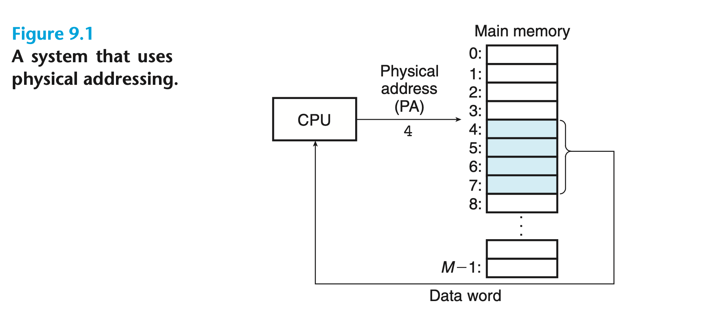

The modern processors use a form of addressing known as *virtual addressing*, as shown in Figure 9.2. With virtual addressing, the CPU accesses main memory by generating a *virtual address (VA)*, which is converted to the appropriate physical address before being sent to main memory. The task of converting a virtual address to a physical one is known as *address translation*. Like exception handling, address translation requires close cooperation between the CPU hardware and the operating system. Dedicated hardware on the CPU chip called the *memory management unit (MMU)* translates virtual addresses on the fly, using a lookup table stored in main memory whose contents are managed by the operating system.

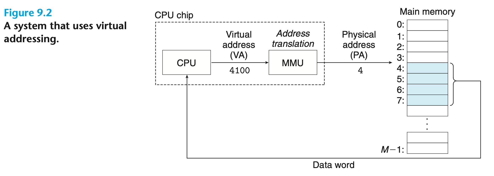

### Address Spaces

In a system with virtual memory, the CPU generates virtual addresses from an address space of N = $2^n$ addresses called the *virtual address space*. The size of an address space is characterized by the number of bits that are needed to represent the largest address. A virtual address space with N = $2^n$ addresses is called an n-bit address space. Modern systems typically support either 32-bit or 64-bit virtual address spaces.

### Page

#### Page Tables

The data on disk (the lower level) is partitioned into blocks that serve as the transfer units between the disk and the main memory (the upper level). Virtual memory systems handle this by partitioning the virtual memory into fixed-size blocks called *virtual pages (VPs)*. Each virtual page is P = $2^p$ bytes in size. Similarly, physical memory is partitioned into *physical pages (PPs)*, also P bytes in size. (Physical pages are also referred to as *page frames*.)

The address translation hardware  in the MMU reads the page table each time it converts a virtual address to a physical address using a data structure stored in physical memory known as a *page table* that maps virtual pages to physical pages. The operating system is responsible for maintaining the contents of the page table and transferring pages back and forth between disk and DRAM.

Figure 9.4 shows the basic organization of a page table. A page table is an array of *page table entries (PTEs)*. Each page in the virtual address space has a PTE at a fixed offset in the page table. For our purposes, we will assume that each PTE consists of a *valid bit* and an n-bit address field. The valid bit indicates whether the virtual page is currently cached in DRAM. If the valid bit is set, the address field indicates the start of the corresponding physical page in DRAM where the virtual page is cached. If the valid bit is not set, then a null address indicates that the virtual page has not yet been allocated. Otherwise, the address points to the start of the virtual page on disk.

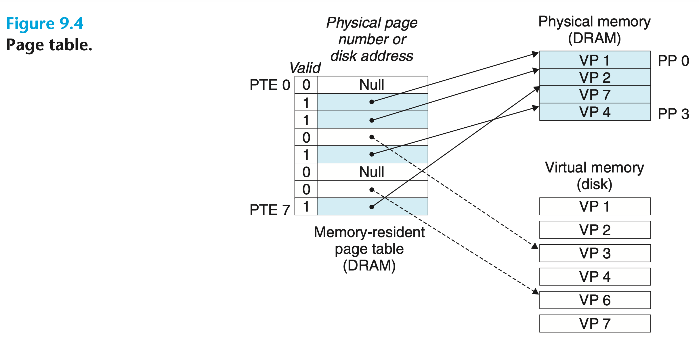

#### Page Hits and Page Faults

If the valid bit is set for specify read instruction, the address translation hardware knows the physical memory address n the PTE and uses it to find the content. This is consider as a **Page hit**.

If the valid bit is not set for specify read instruction, the address translation hardware triggers a page fault exception. The page fault exception invokes a page fault exception handler in the kernel, which load the physical location into page table. This process called **Page Fault**. 

#### Demand Paging

The activity of transferring a page between disk and memory is known as *swapping* or *paging*. Pages are *swapped in* (*paged in*) from disk to DRAM, and *swapped out* (*paged out*) from DRAM to disk. The strategy of waiting until the last moment to swap in a page, when a miss occurs, is known as *demand paging*.

#### Locality

In practice, virtual memory works well, mainly because of *locality*. If the working set size exceeds the size of physical memory, then the program can produce an unfortunate situation known as *thrashing*, where pages are swapped in and out continuously. Although virtual memory is usually efficient, if a program’s performance slows to a crawl, the wise programmer will consider the possibility that it is thrashing.

### Memory Management

Operating systems provide a separate page table, and thus a separate virtual address space, for each process. Figure 9.9 shows the basic idea.

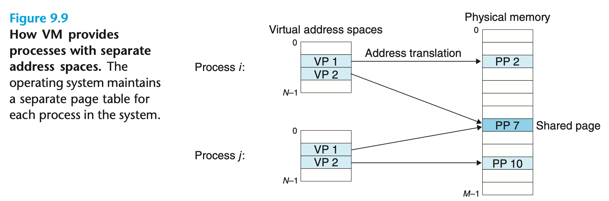

VM simplifies linking and loading, the sharing of code and data, and allocating memory to applications.

- *Simplifying linking.* A separate address space allows each process to use the same basic format for its memory image, regardless of where the code and data actually reside in physical memory. For 64-bit address spaces, the code segment *always* starts at virtual address `0x400000`. The data segment follows the code segment after a suitable alignment gap. The stack occupies the highest portion of the user process address space and grows downward. Such uniformity greatly simplifies the design and implementation of linkers, allowing them to produce fully linked executables that are independent of the ultimate location of the code and data in physical memory.
- *Simplifying loading.* Virtual memory also makes it easy to load executable and shared object files into memory. To load the .text and .data sections of an object file into a newly created process, the Linux loader allocates virtual pages for the code and data segments, marks them as invalid (i.e., not cached), and points their page table entries to the appropriate locations in the object file. The interesting point is that the loader never actually copies any data from disk into memory. The data are paged in automatically and on demand by the virtual memory system the first time each page is referenced, either by the CPU when it fetches an instruction or by an executing instruction when it references a memory location.
- *Simplifying sharing.* In some instances it is desirable for processes to share code and data. For example, every process must call the same operating system kernel code, and every C program makes calls to routines in the standard C library such as printf. Rather than including separate copies of the kernel and standard C library in each process, the operating system can arrange for multiple processes to share a single copy of this code by mapping the appropriate virtual pages in different processes to the same physical pages.

- *Simplifying memory allocation.* Virtual memory provides a simple mechanism for allocating additional memory to user processes. When a program running in a user process requests additional heap space, the operating system allocates an appropriate number, say, k, of contiguous virtual memory pages, and maps them to k arbitrary physical pages located anywhere in physical memory. Because of the way page tables work, there is no need for the operating system to locate k contiguous pages of physical memory. The pages can be scattered randomly in physical memory.

### Memory Protection

The operating system to control access to the memory system to prevent any unauthorized or unauthenticated users or programs to access the memory regions that they are not supposed to access. Figure 9.10 shows the general idea. There are 3 extra bits:

1. The SUP bit indicates whether processes must be running in kernel (supervisor) mode to access the page. Processes running in kernel mode can access any page, but processes running in user mode are only allowed to access pages for which SUP is 0.
2. The READ and WRITE bits control read and write access to the page.

If an instruction violates these permissions, then the CPU triggers a general protection fault that transfers control to an exception handler in the kernel, which sends a `SIGSEGV` signal to the offending process. Linux shells typically report this exception as a “segmentation fault.”

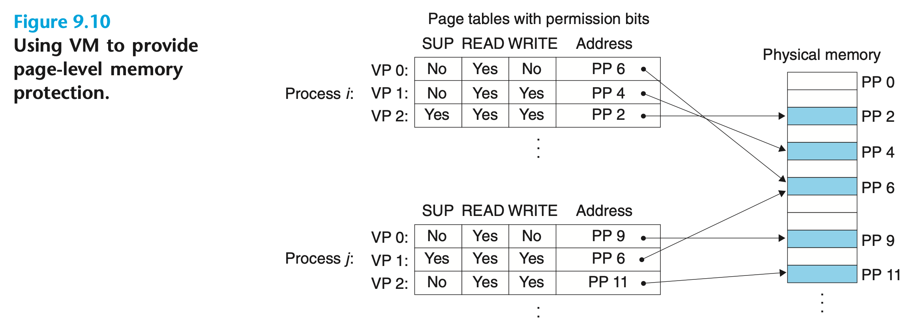

### Address Translation

Figure 9.12 shows how the MMU uses the page table to perform this mapping. A control register in the CPU, the *page table base register (PTBR)* points to the current page table. 

The n-bit virtual address has two components: 

- a p-bit *virtual page offset (VPO)*
- an (n − p)-bit *virtual page number (VPN)*. 

The MMU uses the VPN to select the appropriate PTE. For example, VPN 0 selects PTE 0, VPN 1 selects PTE 1, and so on. The corresponding physical address is the concatenation of the *physical page number (PPN)* from the page table entry and the VPO from the virtual address. Notice that since the physical and virtual pages are both P bytes, the *physical page offset (PPO)* is identical to the VPO.

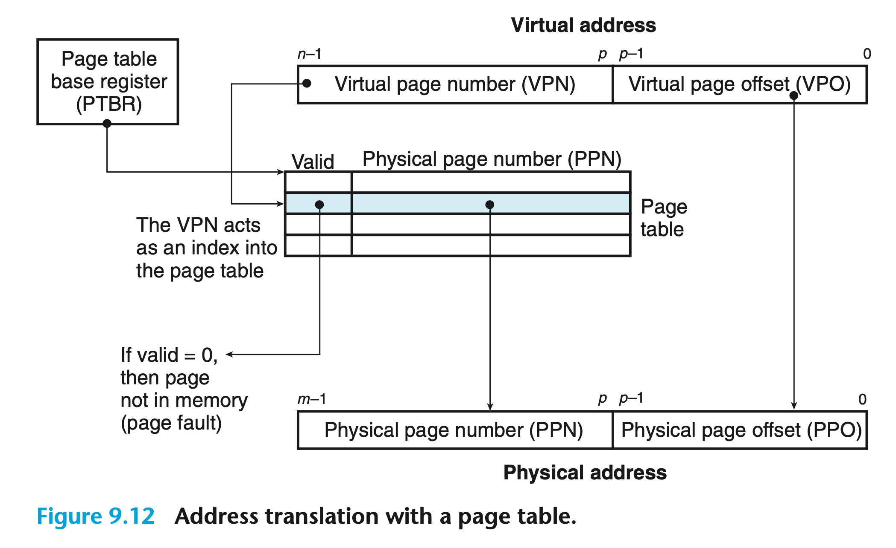

Figure 9.13(a) shows the steps that the CPU hardware performs when there is a page hit.

1. The processor generates a virtual address and sends it to the MMU. 
2. The MMU generates the PTE address and requests it from the cache/main memory.
3. The cache/main memory returns the PTE to the MMU.
4. The MMU constructs the physical address and sends it to the cache/main memory.
5. The cache/main memory returns the requested data word to the processor.

Unlike a page hit, which is handled entirely by hardware, handling a page fault requires cooperation between hardware and the operating system kernel (Figure 9.13(b)).

1. The processor generates a virtual address and sends it to the MMU. 
2. The MMU generates the PTE address and requests it from the cache/main memory.
3. The cache/main memory returns the PTE to the MMU.
4. The valid bit in the PTE is zero, so the MMU triggers an exception, which transfers control in the CPU to a page fault exception handler in the operating system kernel.
5. The fault handler identifies a victim page in physical memory, and if that page has been modified, pages it out to disk.
6. The fault handler pages in the new page and updates the PTE in memory.
7. The fault handler returns to the original process, causing the faulting instruction to be restarted. The CPU resends the offending virtual address to the MMU. Because the virtual page is now cached in physical memory, there is a hit, and after the MMU performs the steps in Figure 9.13(a), the main memory returns the requested word to the processor.

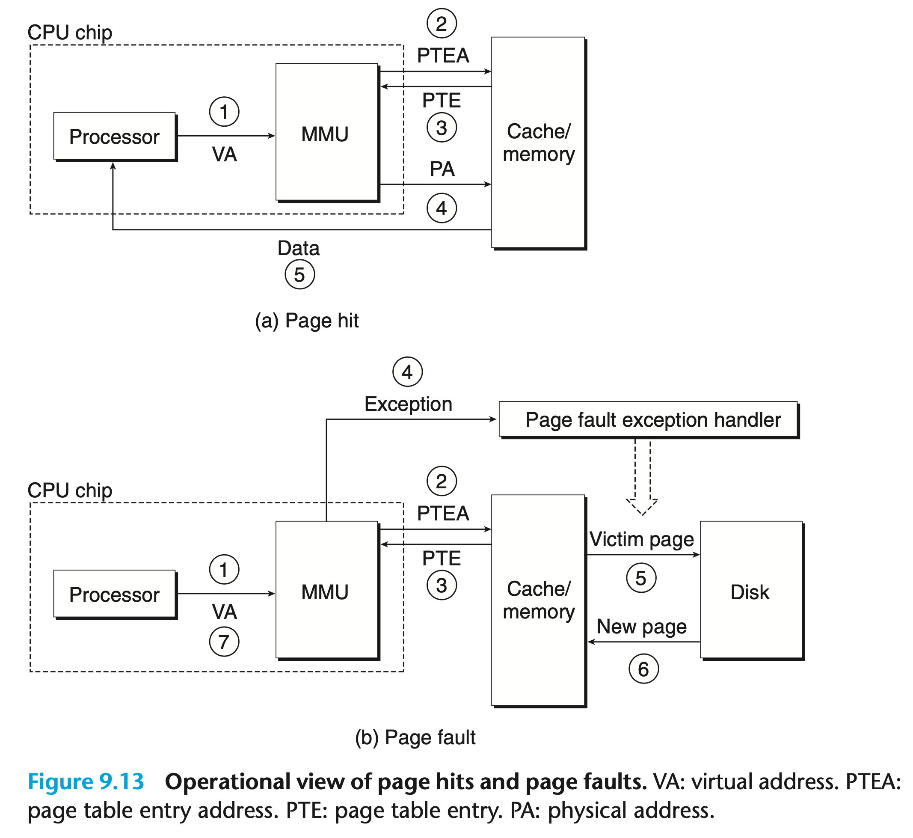

#### Speeding Up Address Translation with a TLB

Every time the CPU generates a virtual address, the MMU must refer to a PTE in order to translate the virtual address into a physical address. In the worst case, this requires an additional fetch from memory, at a cost of tens to hundreds of cycles. If the PTE happens to be cached in L1, then the cost goes down to a handful of cycles. However, many systems try to eliminate even this cost by including a small cache of PTEs in the MMU called a *translation lookaside buffer (TLB)*.

A TLB is a small, virtually addressed cache where each line holds a block consisting of a single PTE. A TLB usually has a high degree of associativity. As shown in Figure 9.15, the index and tag fields that are used for set selection and line matching are extracted from the virtual page number in the virtual address. If the TLB has T = $2^t$ sets, then the *TLB index (TLBI)* consists of the t least significant bits of the VPN, and the *TLB tag (TLBT)* consists of the remaining bits in the VPN.

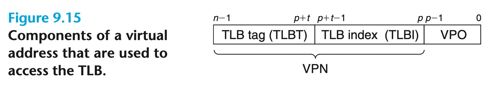

Figure 9.16(a) shows the steps involved when there is a TLB hit (the usual case). The key point here is that all of the address translation steps are performed inside the on-chip MMU and thus are fast.

1. The CPU generates a virtual address.
2. The MMU fetches the appropriate PTE from the TLB.
3. The MMU translates the virtual address to a physical address and sends it to the cache/main memory.
4. The cache/main memory returns the requested data word to the CPU.

When there is a TLB miss, then the MMU must fetch the PTE from the L1 cache, as shown in Figure 9.16(b). The newly fetched PTE is stored in the TLB, possibly overwriting an existing entry.

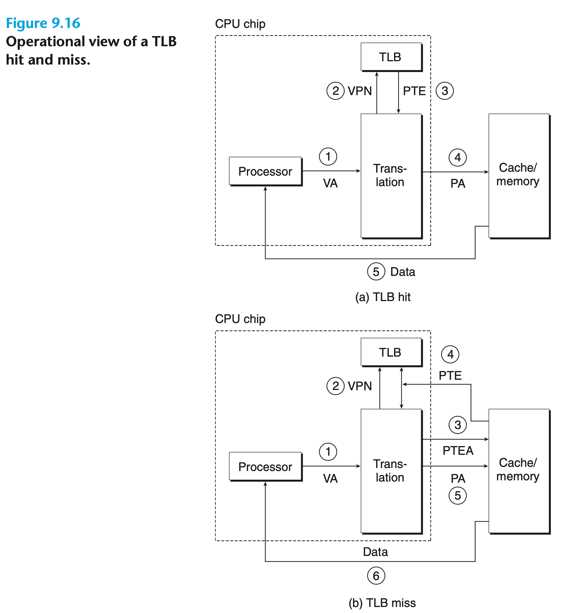

#### Multi-Level Page Tables

With systems with 64-bit address spaces, a single page table will be to big to hold all the PTEs. It is not only hard to place it on memory but also will causing a slow look up compare to small page table.

The common approach for compacting the page table is to use a hierarchy of page tables instead. Consider a 32-bit virtual address space partitioned into 4 KB pages, with page table entries that are 4 bytes each. Suppose also that at this point in time the virtual address space has the following form: The first 2 K pages of memory are allocated for code and data, the next 6 K pages are unallocated, the next 1,023 pages are also unallocated, and the next page is allocated for the user stack. Figure 9.17 shows how we might construct a two-level page table hierarchy for this virtual address space.

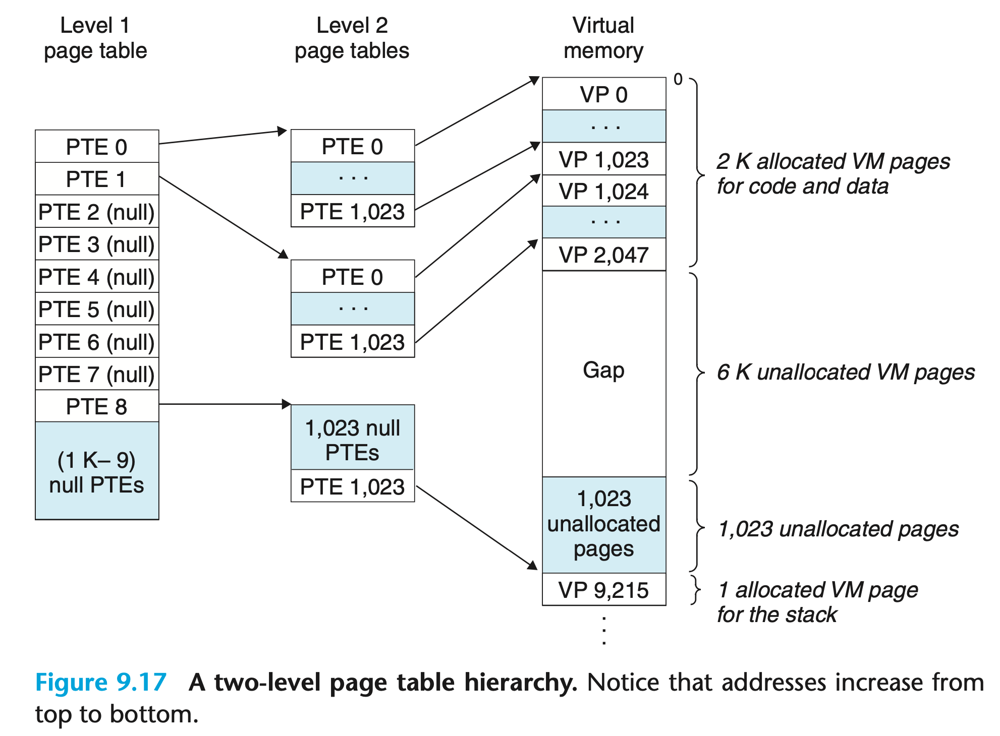

This scheme reduces memory requirements in two ways. 

- First, if a PTE in the level 1 table is null, then the corresponding level 2 page table does not even have to exist. This represents a significant potential savings, since most of the 4 GB virtual address space for a typical program is unallocated. 
- Second, only the level 1 table needs to be in main memory at all times. The level 2 page tables can be created and paged in and out by the VM system as they are needed, which reduces pressure on main memory. Only the most heavily used level 2 page tables need to be cached in main memory.

Figure 9.18 summarizes address translation with a k-level page table hierarchy. The virtual address is partitioned into k VPNs and a VPO. Each VPN i, 1 ≤ i ≤ k, is an index into a page table at level i. Each PTE in a level j table, 1 ≤ j ≤ k − 1, points to the base of some page table at level j + 1. Each PTE in a level k table contains either the PPN of some physical page or the address of a disk block. To construct the physical address, the MMU must access k PTEs before it can determine the PPN. As with a single-level hierarchy, the PPO is identical to the VPO.

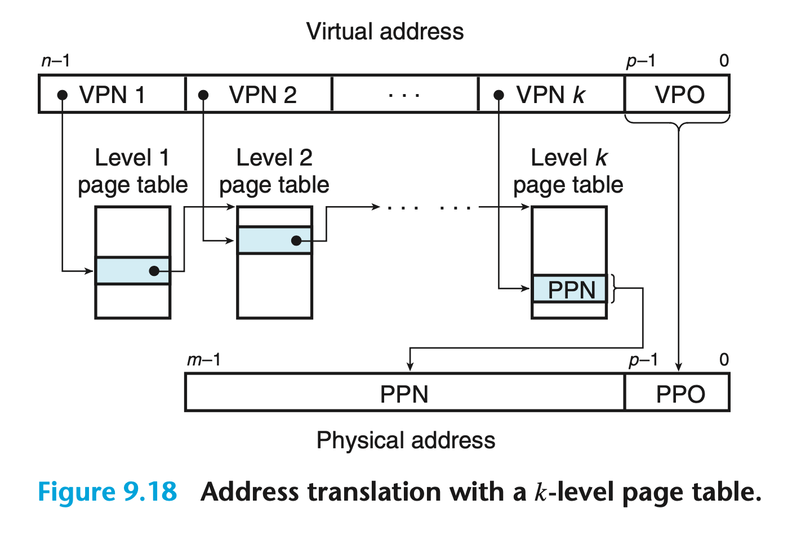

### End-to-End Address Translation

To keep things manageable, we make the following assumptions:

- The memory is byte addressable.
- Memory accesses are to *1-byte words* (not 4-byte words).
- Virtual addresses are 14 bits wide (n = 14).
- Physical addresses are 12 bits wide (m = 12).
- The page size is 64 bytes (P = 64).
- The TLB is 4-way set associative with 16 total entries.
- The L1 d-cache is physically addressed and direct mapped, with a 4-byte line size and 16 total sets.

Figure 9.19 shows the formats of the virtual and physical addresses. Since each page is $2^6 = 64$ bytes, the low-order 6 bits of the virtual and physical addresses serve as the VPO and PPO, respectively. The high-order 8 bits of the virtual address serve as the VPN. The high-order 6 bits of the physical address serve as the PPN.

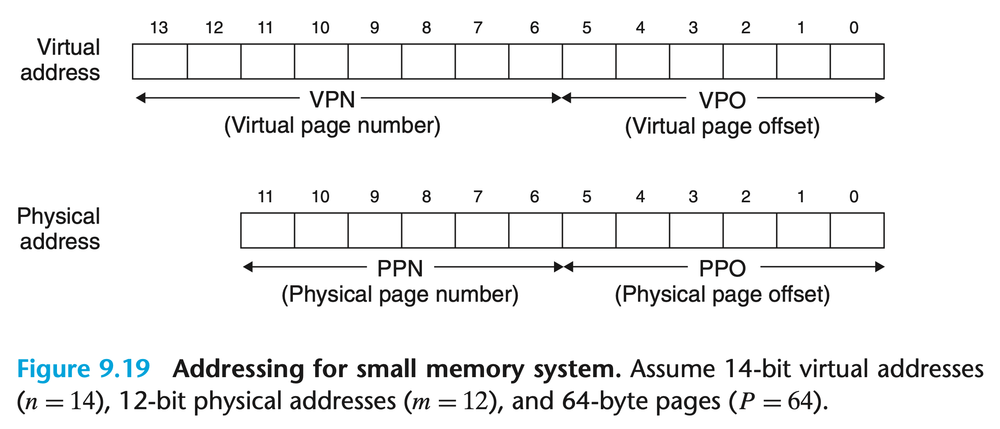

Figure 9.20 shows a snapshot of our little memory system.

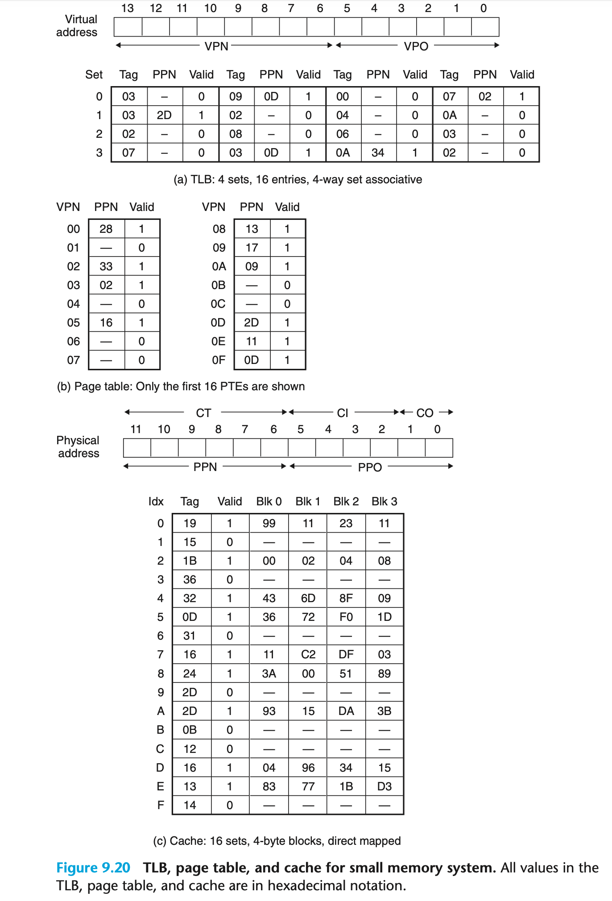

When the CPU executes a load instruction that reads the byte at address `0x03d4`. (Recall that our hypothetical CPU reads 1-byte words rather than 4-byte words.) 

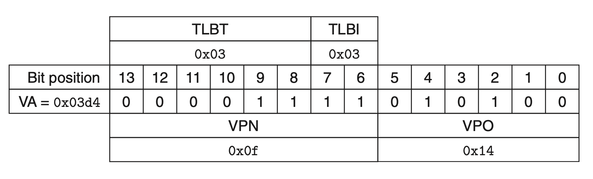

The MMU extracts the VPN (0x0F) from the virtual address and checks with the TLB to see if it has cached a copy of PTE 0x0F from some previous memory reference. The TLB extracts the TLB index (0x03) and the TLB tag (0x3) from the VPN, hits on a valid match in the second entry of set 0x3, and returns the cached PPN (`0x0D`) to the MMU.

If the TLB had missed, then the MMU would need to fetch the PTE from main memory. However, in this case, we got lucky and had a TLB hit. The MMU now has everything it needs to form the physical address. It does this by concatenating the PPN (0x0D) from the PTE with the VPO (0x14) from the virtual address, which forms the physical address (0x354).

Next, the MMU sends the physical address to the cache, which extracts the cache offset CO (0x0), the cache set index CI (0x5), and the cache tag CT (0x0D) from the physical address.

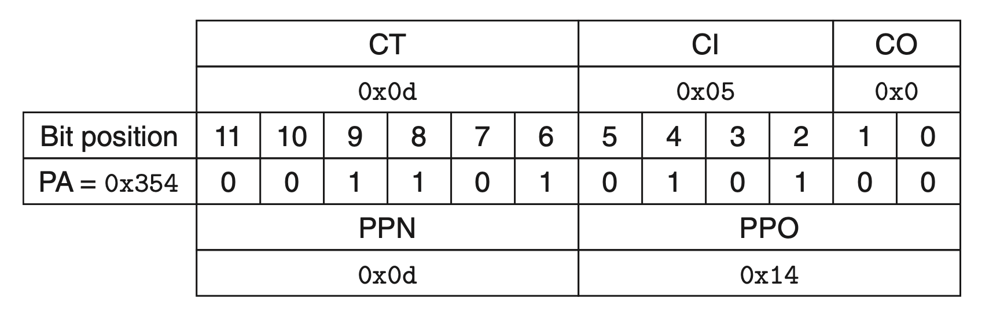

Since the tag in set 0x5 matches CT, the cache detects a hit, reads out the data byte (0x36) at offset CO, and returns it to the MMU, which then passes it back to the CPU.

If the TLB misses, then the MMU must fetch the PPN from a PTE in the page table. If the resulting PTE is invalid, then there is a page fault and the kernel must page in the appropriate page and rerun the load instruction. Another possibility is that the PTE is valid, but the necessary memory block misses in the cache.

### Case Study: The Intel Core i7/Linux Memory System

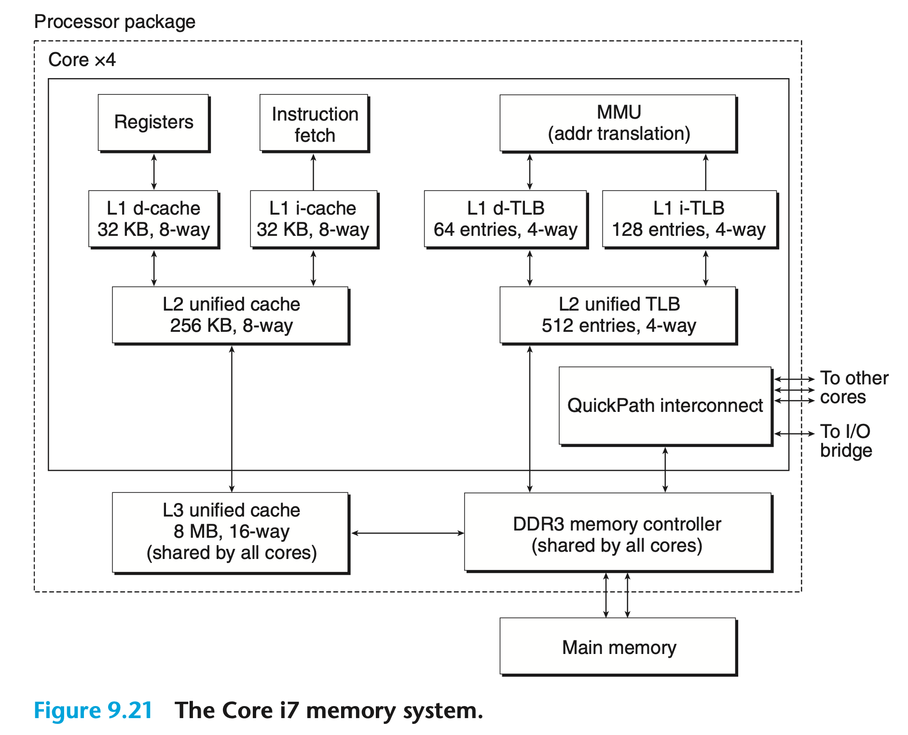

Figure 9.21 gives the highlights of the Core i7 memory system which support a 48-bit (256 TB) virtual address space and a 52-bit (4 PB) physical address space, along with a compatibility mode that supports 32-bit (4 GB) virtual and physical address spaces. The *processor package* (chip) includes 

- four cores
  - Each core contains a hierarchy of TLBs
    - a hierarchy of data and instruction caches
    - a set of fast point-to-point links, based on the QuickPath technology, for communicating directly with the other cores and the external I/O bridge. 
  - The TLBs are virtually addressed, and 4-way set associative. 
  - The L1, L2, and L3 caches are physically addressed, with a block size of 64 bytes. 
    - L1 and L2 are 8-way set associative
    - L3 is 16-way set associative. 
  - The page size can be configured at start-up time as either 4 KB or 4 MB. Linux uses 4 KB pages.
- a large L3 cache shared by all of the cores
- a DDR3 memory controller shared by all of the cores

#### Core i7 Address Translation

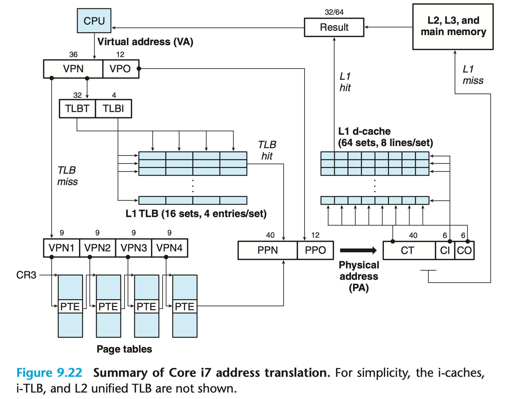

Figure 9.22 summarizes the entire Core i7 address translation process, from the time the CPU generates a virtual address until a data word arrives from memory. The Core i7 uses a four-level page table hierarchy. Each process has its own private page table hierarchy. 

When a Linux process is running, the page tables associated with allocated pages are all memory-resident, although the Core i7 architecture allows these page tables to be swapped in and out. The *CR3* control register contains the physical address of the beginning of the level 1 (L1) page table. The value of CR3 is part of each process context, and is restored during each context switch.

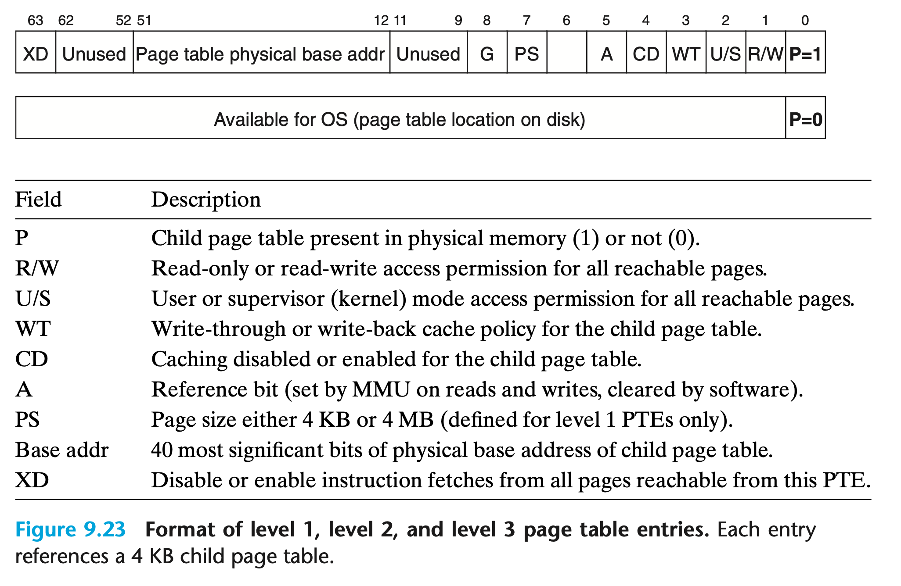

Figure 9.23 shows the format of an entry in a level 1, level 2, or level 3 page table. When P = 1 (which is always the case with Linux), the address field contains a 40-bit physical page number (PPN) that points to the beginning of the appropriate page table. Notice that this imposes a 4 KB alignment requirement on page tables.

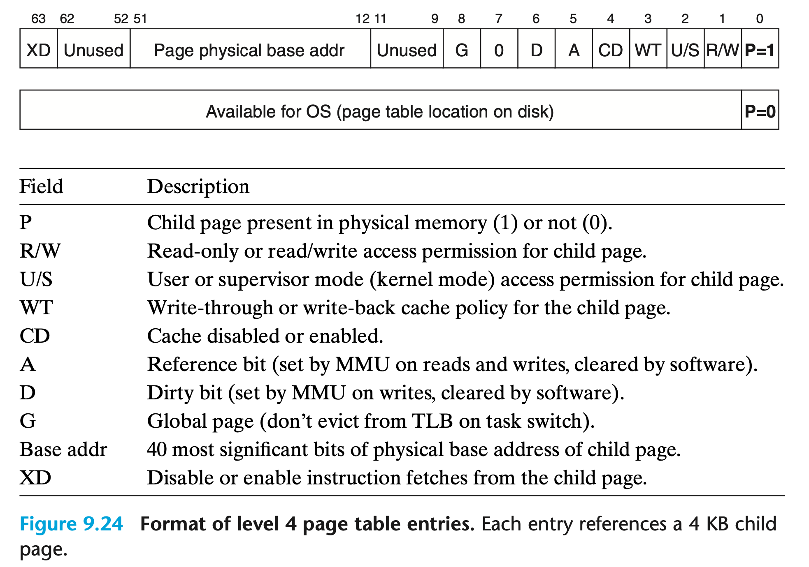

Figure 9.24 shows the format of an entry in a level 4 page table. When P = 1, the address field contains a 40-bit PPN that points to the base of some page in physical memory. Again, this imposes a 4 KB alignment requirement on physical pages.

> _**Note**_: The *XD* (execute disable) bit, which was introduced in 64-bit systems, can be used to disable instruction fetches from individual memory pages. This is an important new feature that allows the operating system kernel to reduce the risk of buffer overflow attacks by restricting execution to the read-only code segment.

As the MMU translates each virtual address, it also updates two other bits that can be used by the kernel’s page fault handler. 

- The MMU sets the A bit, which is known as a *reference bit*, each time a page is accessed. The kernel can use the reference bit to implement its page replacement algorithm. 
- The MMU sets the D bit, or *dirty bit*, each time the page is written to. A page that has been modified is sometimes called a *dirty page*. The dirty bit tells the kernel whether or not it must write back a victim page before it copies in a replacement page. 

The kernel can call a special kernel-mode instruction to clear the reference or dirty bits.

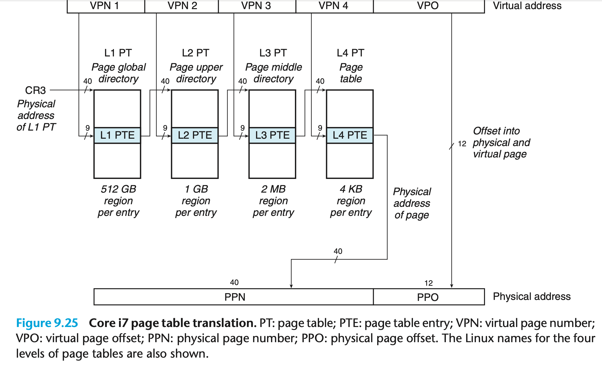

Figure 9.25 shows how the Core i7 MMU uses the four levels of page tables to translate a virtual address to a physical address. The 36-bit VPN is partitioned into four 9-bit chunks, each of which is used as an offset into a page table. The CR3 register contains the physical address of the L1 page table. VPN 1 provides an offset to an L1 PTE, which contains the base address of the L2 page table. VPN 2 provides an offset to an L2 PTE, and so on.

#### Linux Virtual Memory System

Linux maintains a separate virtual address space for each process of the form shown in Figure 9.26. The kernel virtual memory contains the code and data structures in the kernel. Some regions of the kernel virtual memory are mapped to physical pages that are shared by all processes. For example, each process shares the kernel’s code and global data structures. Linux also maps a set of contiguous virtual pages (equal in size to the total amount of DRAM in the system) to the corresponding set of contiguous physical pages. This provides the kernel with a convenient way to access any specific location in physical memory—for example, when it needs to access page tables or to perform memory-mapped I/O operations on devices that are mapped to particular physical memory locations.

Other regions of kernel virtual memory contain data that differ for each process. Examples include page tables, the stack that the kernel uses when it is executing code in the context of the process, and various data structures that keep track of the current organization of the virtual address.

#### Linux Virtual Memory Areas

Linux organizes the virtual memory as a collection of *areas* (also called *segments*). For example, the code segment, data segment, heap, shared library segment, and user stack are all distinct areas. Each existing virtual page is contained in some area, and any virtual page that is not part of some area does not exist and cannot be referenced by the process. The notion of an area is important because it allows the virtual address space to have gaps. The kernel does not keep track of virtual pages that do not exist, and such pages do not consume any additional resources in memory, on disk, or in the kernel itself.

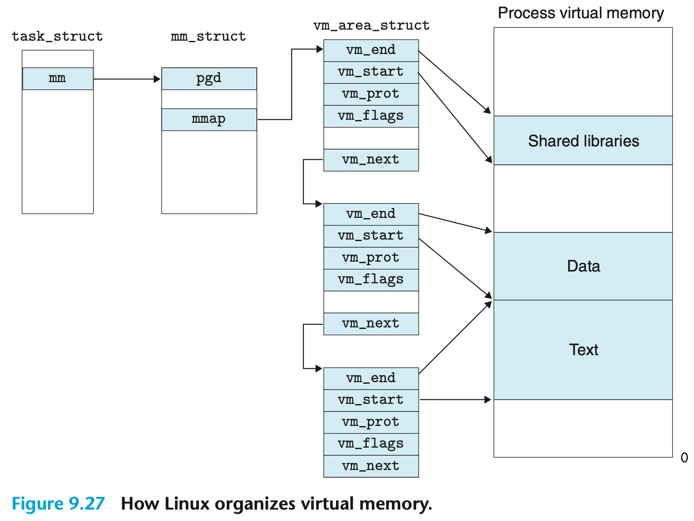

Figure 9.27 highlights the kernel data structures that keep track of the virtual memory areas in a process. The kernel maintains a distinct task structure (`task_ struct` in the source code) for each process in the system. The elements of the task structure either contain or point to all of the information that the kernel needs to run the process (e.g., the PID, pointer to the user stack, name of the executable object file, and program counter).

One of the entries in the task structure points to an `mm_struct` that characterizes the current state of the virtual memory. The two fields of interest to us are 

- `pgd`, which points to the base of the level 1 table (the page global directory)
- `mmap`, which points to a list of `vm_area_structs` (area structs), each of which characterizes an area of the current virtual address space. When the kernel runs this process, it stores `pgd` in the CR3 control register.

For our purposes, the area struct for a particular area contains the following fields:

- `fvm_start`: Points to the beginning of the area.

- `vm_end`: Points to the end of the area.

- `vm_prot`: Describes the read/write permissions for all of the pages contained in the area.

- `vm_flags`: Describes (among other things) whether the pages in the area are shared with other processes or private to this process.

- `vm_next`: Points to the next area struct in the list.

#### Linux Page Fault Exception Handling

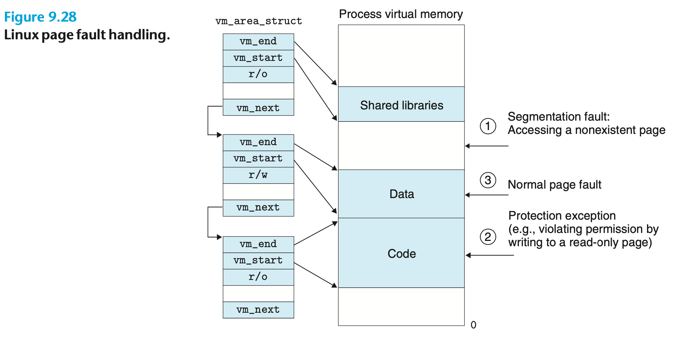

Suppose the MMU triggers a page fault while trying to translate some virtual address A. The exception results in a transfer of control to the kernel’s page fault handler, which then performs the following steps:

1. `Check the validity of the address A`. The fault handler searches the list of area structs, comparing A with the `vm_start` and `vm_end` in each area struct. If the instruction is not legal, then the fault handler triggers a segmentation fault, which terminates the process. This situation is labeled “1” in Figure 9.28. 
   - Because a process can create an arbitrary number of new virtual memory areas (using the mmap function), a sequential search of the list of area structs might be very costly. So in practice, Linux superimposes a tree on the list, using some fields that we have not shown, and performs the search on this tree.
2. `Check permission of the instruction`. If the attempted access is not legal, then the fault handler triggers a protection exception, which terminates the process. This situation is labeled “2” in Figure 9.28.
3. At this point, the kernel knows that the page fault resulted from a legal operation on a legal virtual address. It handles the fault by selecting a victim page, swapping out the victim page if it is dirty, swapping in the new page, and updating the page table. When the page fault handler returns, the CPU restarts the faulting instruction, which sends A to the MMU again. This time, the MMU translates A normally, without generating a page fault.

### Memory Mapping

