## Memory Hierarchy

### Storage 

#### Random Access Memory

##### Disk Geometry

Disks are constructed from *platters*. Each platter consists of two sides, or *surfaces*, that are coated with magnetic recording material.Figure 6.9(a) shows the geometry of a typical disk surface. 

- Each surface consists of a collection of concentric rings called *tracks*. 
- Each track is partitioned into a collection of *sectors*. 
- Each sector contains an equal number of data bits (typically 512 bytes) encoded in the magnetic material on the sector. Sectors are separated by *gaps* where no data bits are stored. Gaps store formatting bits that identify sectors.

A rotating *spindle* in the center of the platter spins the platter at a fixed *rotational rate*, typically between 5,400 and 15,000 *revolutions per minute (RPM)*. A disk consists of one or more platters stacked on top of each other and encased in a sealed package, as shown in Figure 6.9(b).

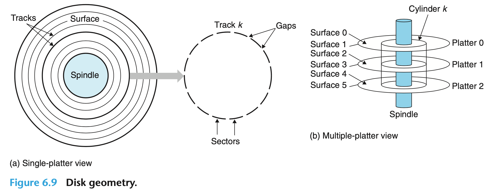

##### Disk Capacity

The maximum number of bits that can be recorded by a disk is known as its *maximum capacity*, or simply *capacity*. Disk capacity is determined by the following technology factors:

- *Recording density* (bits/in). The number of bits that can be squeezed into a 1-inch segment of a track.
- *Track density* (tracks/in). The number of tracks that can be squeezed into a 1-inch segment of the radius extending from the center of the platter.
- *Areal density* (bits/in2). The product of the recording density and the track density.

The original disks partitioned every track into the same number of sectors, which was determined by the number of sectors that could be recorded on the innermost track. To maintain a fixed number of sectors per track, the sectors were spaced farther apart on the outer tracks.

The modern high-capacity disks use a technique known as *multiple zone recording*, where the set of cylinders is partitioned into disjoint subsets known as *recording zones*. Each zone consists of a contiguous collection of cylinders. Each track in each cylinder in a zone has the same number of sectors, which is determined by the number of sectors that can be packed into the innermost track of the zone.

The capacity of a disk is given by the following formula:
$$
Capacity = \frac{\#bytes} {sector}× \frac{average\ \# sectors} {\# tracks} × \frac{\#tracks}{surface}× \frac{\#surfaces}{platter} × \frac{\# platters}{disk}
$$

> _**Note**_: Unfortunately, the meanings of prefixes such as kilo (K), mega (M), giga (G), and tera (T) depend on the context. For measures that relate to the capacity of DRAMs and SRAMs, typically K = $2^{10}$, M = $2^{20}$, G = 2$^{30}$, and T = $2^{40}$. For measures related to the capacity of I/O devices such as disks and networks, typically K = $10^3$, M = $10^6$, G = $10^9$, and T = $10^{12}$. 

##### Disk Operation

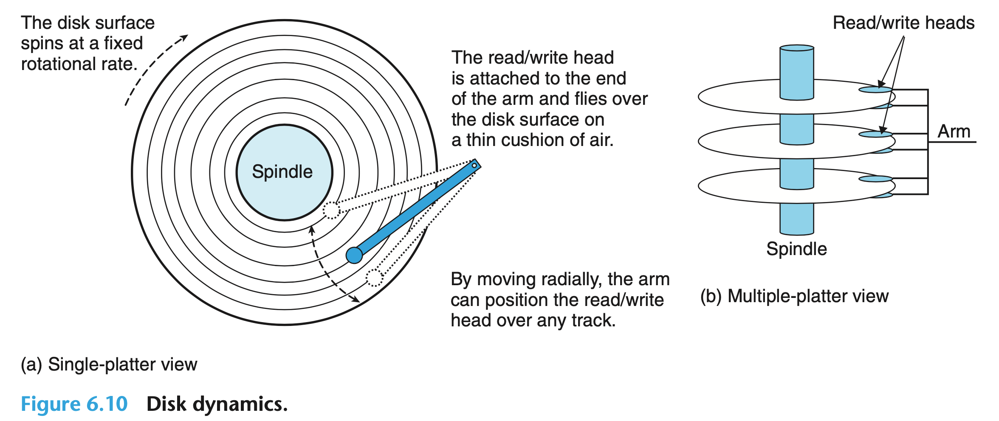

Disks read and write bits stored on the magnetic surface using a *read/write head* connected to the end of an *actuator arm*, as shown in Figure 6.10(a).

By moving the arm back and forth along its radial axis, the drive can position the head over any track on the surface. This mechanical motion is known as a *seek*. Disks with multiple platters have a separate read/write head for each surface, as shown in Figure 6.10(b). The heads are lined up vertically and move in unison. At any point in time, all heads are positioned on the same cylinder.

Disks read and write data in sector-size blocks. The *access time* for a sector has three main components: *seek time*, *rotational latency*, and *transfer time:*

- *Seek time.* To read the contents of some target sector, the arm first positions the head over the track that contains the target sector. The time required to move the arm is called the *seek time*. 

  - The seek time, $T_{seek}$, depends on the previous position of the head and the speed that the arm moves across the surface. 
  - The average seek time in modern drives, $T_{avg\ seek}$, measured by taking the mean of several thousand seeks to random sectors, is typically on the order of 3 to 9 ms. 
  - The maximum time for a single seek, $T_{max\ seek}$, can be as high as 20 ms.

- *Rotational latency.* Once the head is in position over the track, the drive waits for the first bit of the target sector to pass under the head. The performance of this step depends on both the position of the surface when the head arrives at the target track and the rotational speed of the disk. In the worst case, the head just misses the target sector and waits for the disk to make a full rotation. Thus, the maximum rotational latency, in seconds, is given by $T_{max\ rotation} = \frac{1}{RPM} × \frac{60\ secs}{1\ min}$

  The average rotational latency, $T_{avg\ rotation}$, is simply half of $T_{max\ rotation}$

- *Transfer time.* When the first bit of the target sector is under the head, the drive can begin to read or write the contents of the sector. The transfer time for one sector depends on the rotational speed and the number of sectors per track. Thus, we can roughly estimate the average transfer time for one sector in seconds as $T_{avg\ transfer} = \frac{1}{RPM} × \frac{1}{(average\ \# \ sectors/track)} × \frac{60\ secs}{1\  min}$

For example, consider a disk with the following parameters:

| Parameter                       | Value     |
| ------------------------------- | --------- |
| Rotational rate                 | 7,200 RPM |
| $T_{avg\ seek}$                 | 9 ms      |
| Average number of sectors/track | 400       |

For this disk, the average rotational latency (in ms) is
$$
\begin{equation}
\begin{split}
T_{avg\ rotation} & = 1/2 × T_{max\ rotation} \\
 & = 1/2 × (60 secs/7,200 RPM) × 1,000 ms/sec \\
 & ≈ 4 ms
\end{split}
\end{equation}
$$
The average transfer time is
$$
\begin{equation}
\begin{split}
T_{avg\ transfer} & = 60/7,200 RPM × 1,000 ms/sec × \frac{1}{400} sectors/track \\
 & ≈ 0.02 ms
\end{split}
\end{equation}
$$
Putting it all together, the total estimated access time is
$$
\begin{equation}
\begin{split}
T_{access} & = T_{avg\ seek} + T_{avg\ rotation} + T_{avg\ transfer} \\
& = 9 ms + 4 ms + 0.02 ms \\
& = 13.02 ms
\end{split}
\end{equation}
$$
This example illustrates some important points:

- The time to access the 512 bytes in a disk sector is dominated by the seek time and the rotational latency. Accessing the first byte in the sector takes a long time, but the remaining bytes are essentially free.
- Since the seek time and rotational latency are roughly the same, twice the seek time is a simple and reasonable rule for estimating disk access time.
- The access time for a 64-bit word stored in SRAM is roughly 4 ns, and 60 ns for DRAM. Thus, the time to read a 512-byte sector-size block from memory is roughly 256 ns for SRAM and 4,000 ns for DRAM. The disk access time, roughly 10 ms, is about 40,000 times greater than SRAM, and about 2,500 times greater than DRAM.

##### Logical Disk Blocks

To hide the complexity geometries from the operating system, modern disks present a simpler view of their geometry as a sequence of B sector-size *logical blocks*, numbered 0, 1, . . . , B − 1. A small hardware/firmware device in the disk package, called the *disk controller*, maintains the mapping between logical block numbers and actual (physical) disk sectors.

When the operating system wants to perform an I/O operation such as reading a disk sector into main memory, it sends a command to the disk controller asking it to read a particular logical block number. Firmware on the controller performs a fast table lookup that translates the logical block number into a *(surface, track, sector)* triple that uniquely identifies the corresponding physical sector. Hardware on the controller interprets this triple to move the heads to the appropriate cylinder, waits for the sector to pass under the head, gathers up the bits sensed by the head into a small memory buffer on the controller, and copies them into main memory.

> _**Note**_: Before a disk can be used to store data, it must be *formatted* by the disk controller. This involves filling in the gaps between sectors with information that identifies the sectors, identifying any cylinders with surface defects and taking them out of action, and setting aside a set of cylinders in each zone as spares that can be called into action if one or more cylinders in the zone goes bad during the lifetime of the disk. The *formatted capacity* quoted by disk manufacturers is less than the maximum capacity because of the existence of these spare cylinders.

##### Connecting I/O Devices

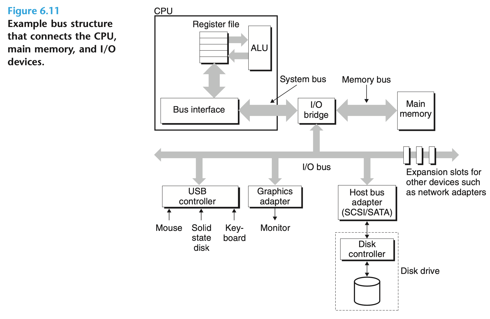

Input/output (I/O) devices such as graphics cards, monitors, mice, keyboards, and disks are connected to the CPU and main memory using an *I/O bus*.  Unlike the system bus and memory buses, which are CPU-specific, I/O buses are designed to be independent of the underlying CPU. Figure 6.11 shows a representative I/O bus structure that connects the CPU, main memory, and I/O devices.

Although the I/O bus is slower than the system and memory buses, it can accommodate a wide variety of third-party I/O devices. For example, the bus in Figure 6.11 has three different types of devices attached to it.

- A *Universal Serial Bus (USB)* controller is a conduit for devices attached to a USB bus, which is a wildly popular standard for connecting a variety of peripheral I/O devices, including keyboards, mice and so on. USB 3.0 buses have a maximum bandwidth of 625 MB/s. USB 3.1 buses have a maximum bandwidth of 1,250 MB/s.

- A *graphics card* (or *adapter*) contains hardware and software logic that is responsible for painting the pixels on the display monitor on behalf of the CPU.
- A *host bus adapter* that connects one or more disks to the I/O bus using a communication protocol defined by a particular *host bus interface*. The two most popular such interfaces for disks are *SCSI* and *SATA*. SCSI disks are typically faster and more expensive than SATA drives. A SCSI host bus adapter (often called a *SCSI controller*) can support multiple disk drives, as opposed to SATA adapters, which can only support one drive.

> _**Note**_: The I/O bus in Figure 6.11 is a simple abstraction. It is based on the *peripheral component interconnect (PCI)* bus which each device in the system shares the bus, and only one device at a time can access these wires. In modern systems, the shared PCI bus has been replaced by a *PCI express* (PCIe) bus, which is a set of high-speed serial, point-to-point links connected by switches. A PCIe bus, with a maximum throughput of 16 GB/s, is an order of magnitude faster than a PCI bus, which has a maximum throughput of 533 MB/s. Except for measured I/O performance, the differences between the different bus designs are not visible to application programs.

Additional devices such as *network adapters* can be attached to the I/O bus by plugging the adapter into empty *expansion slots* on the motherboard that provide a direct electrical connection to the bus.

##### Accessing Disks


When a CPU reads data from a disk, the CPU issues commands to I/O devices using a technique called *memory- mapped I/O* (Figure 6.12(a)). In a system with memory-mapped I/O, a block of addresses in the address space is reserved for communicating with I/O devices. Each of these addresses is known as an *I/O port*. Each device is associated with (or mapped to) one or more ports when it is attached to the bus.

Suppose that the disk controller is mapped to port `0xa0`. Then the CPU might initiate a disk read by executing three store instructions to address `0xa0`: 

1. The first of these instructions sends a command word that tells the disk to initiate a read, along with other parameters such as whether to interrupt the CPU when the read is finished. 
2. The second instruction indicates the logical block number that should be read. 
3. The third instruction indicates the main memory address where the contents of the disk sector should be stored.

After the disk controller receives the read command from the CPU, it translates the logical block number to a sector address, reads the contents of the sector, and transfers the contents directly to main memory, without any intervention from the CPU (Figure 6.12(b)). A device performs a read or write bus transaction on its own, without any involvement of the CPU, is known as *direct memory access* (DMA). The transfer of data is known as a *DMA transfer*.

After the DMA transfer is complete and the contents of the disk sector are safely stored in main memory, the disk controller notifies the CPU by sending an interrupt signal to the CPU (Figure 6.12(c)). The basic idea is that an interrupt signals an external pin on the CPU chip. This causes the CPU to stop what it is currently working on and jump to an operating system routine. The routine records the fact that the I/O has finished and then returns control to the point where the CPU was interrupted.

#### Solid State Disks

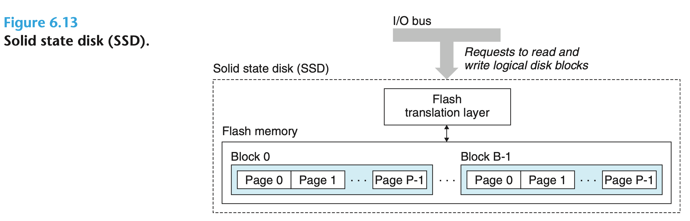

A solid state disk (SSD) is a storage technology, based on flash memory. Figure 6.13 shows the basic idea. An SSD package plugs into a standard disk slot on the I/O bus and behaves like any other disk, processing requests from the CPU to read and write logical disk blocks. 

An SSD package consists of:

1. one or more flash memory chips, which replace the mechanical drive in a conventional rotating disk
2. a *flash translation layer*, which is a hardware/firmware device that plays the same role as a disk controller, translating requests for logical blocks into accesses of the underlying physical device.

As shown in Figure 6.13, a flash memory consists of a sequence of B *blocks*, where each block consists of P pages. Typically, pages are 512 bytes to 4 KB in size, and a block consists of 32–128 pages, with total block sizes ranging from 16 KB to 512 KB. Data are read and written in units of pages. 

A page can be written only after the entire block to which it belongs has been *erased* (typically, this means that all bits in the block are set to 1). However, once a block is erased, each page in the block can be written once with no further erasing. A block wears out after roughly 100,000 repeated writes. Once a block wears out, it can no longer be used.

Figure 6.14 shows the performance characteristics of a typical SSD. 

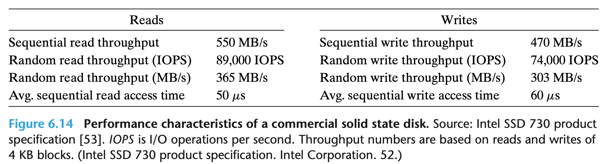

Random writes are slower for two reasons.

1. Erasing a block takes a relatively long time, on the order of 1 ms, which is more than an order of magnitude longer than it takes to access a page. 
2. If a write operation attempts to modify a page p that contains existing data (i.e., not all ones), then any pages in the same block with useful data must be copied to a new (erased) block before the write to page p can occur. 

SSDs have a number of advantages over rotating disks. 

- They are built of semiconductor memory, with no moving parts, and thus have much faster random access times than rotating disks
- use less power
- are more rugged. 

However, there are some disadvantages. 

- because flash blocks wear out after repeated writes, SSDs have the potential to wear out as well. *Wear-leveling* logic in the flash translation layer attempts to maximize the lifetime of each block by spreading erasures evenly across all blocks.
- SSDs are about 30 times more expensive per byte than rotating disks, and thus the typical storage capacities are significantly less than rotating disks.

### Locality

Well-written computer programs tend to exhibit good *locality*. That is, they tend to reference data items that are near other recently referenced data items. This tendency, known as the *principle of locality*, is an enduring concept that has enormous impact on the design and performance of hardware and software systems.

Locality is typically described as having two distinct forms: *temporal locality* and *spatial locality*.

- In a program with good temporal locality, a memory location that is referenced once is likely to be referenced again multiple times in the near future.
- In a program with good spatial locality, if a memory location is referenced once, then the program is likely to reference a nearby memory location in the near future.

Programmers should understand the principle of locality because, in general, *programs with good locality run faster than programs with poor locality*. All levels of modern computer systems, from the hardware, to the operating system, to application programs, are designed to exploit locality. 

- At the hardware level, the principle of locality allows computer designers to speed up main memory accesses by introducing small fast memories known as *cache memories* that hold blocks of the most recently referenced instructions and data items. 
- At the operating system level, the principle of locality allows the system to use the main memory as a cache of the most recently referenced chunks of the virtual address space. Similarly, the operating system uses main memory to cache the most recently used disk blocks in the disk file system. 
- The principle of locality also plays a crucial role in the design of application programs. For example, Web browsers exploit temporal locality by caching recently referenced documents on a local disk. High-volume Web servers hold recently requested documents in front-end disk caches that satisfy requests for these documents without requiring any intervention from the server.

#### Locality of References to Program Data

A function visits each element of a vector sequentially is said to have a *stride-1 reference pattern* or *sequential reference patterns*(with respect to the element size). Visiting every kth element of a contiguous vector is called a *stride-*k *reference pattern*. Stride-1 reference patterns are a common and important source of spatial locality in programs. In general, as the stride increases, the spatial locality decreases.

```c
//good spatial locality
int sumarrayrows(int a[M][N])
{
  int i, j, sum = 0;
  for (i = 0; i < M; i++){
    for (j = 0; j < N;j++){
      sum += a[i][j];
    }
  }
  return sum;
}
//bad spatial locality
int sumarrayrows(int a[M][N])
{
  int i, j, sum = 0;
  for (j = 0; j < N;j++){
    for (i = 0; i < M; i++){
      sum += a[i][j];
    }
  }
  return sum;
}
```

### The Memory Hierarchy

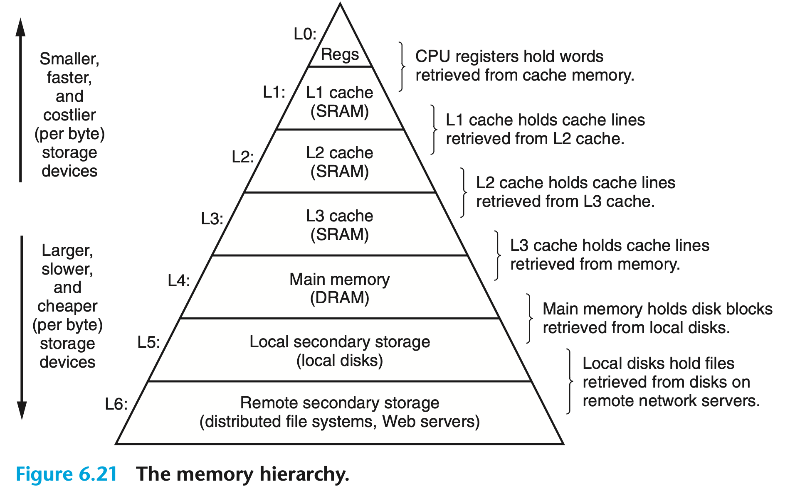

Figure 6.21 shows a typical memory hierarchy. In general, the storage devices get slower, cheaper, and larger as we move from higher to lower *levels*.

#### Caching in the Memory Hierarchy

In general, a *cache* is a small, fast storage device that acts as a staging area for the data objects stored in a larger, slower device. The process of using a cache is known as *caching* .

The central idea of a memory hierarchy is that for each k, the faster and smaller storage device at level k serves as a cache for the larger and slower storage device at level k + 1.  In other words, each level in the hierarchy caches data objects from the next lower level. 


Figure 6.22 shows the general concept of caching in a memory hierarchy. The storage at level k + 1 is partitioned into contiguous chunks of data objects called *blocks*. Each block has a unique address or name that distinguishes it from other blocks. Blocks can be either fixed size (the usual case) or variable size. At any point in time, the cache at level k contains copies of a subset of the blocks from level k + 1. Figure 6.22, the cache at level k has room for four blocks and currently contains copies of blocks 4, 9, 14, and 3.

Data are always copied back and forth between level k and level k + 1 in block-size *transfer units*. It is important to realize that while the block size is fixed between any particular pair of adjacent levels in the hierarchy, other pairs of levels can have different block sizes.

**Cache Hits**

When a program needs a particular data object d from level k + 1, it first looks for d in one of the blocks currently stored at level k. If d happens to be cached at level k, then we have what is called a *cache hit*.

**Cache Misses**

If, on the other hand, the data object d is not cached at level k, then we have what is called a *cache miss*. When there is a miss, the cache at level k fetches the block containing d from the cache at level k + 1, possibly overwriting an existing block if the level k cache is already full.

This process of overwriting an existing block is known as *replacing* or *evicting* the block. The block that is evicted is sometimes referred to as a *victim block*. The decision about which block to replace is governed by the cache’s *replacement policy*. For example, a cache with a *least recently used (LRU)* replacement policy would choose the block that was last accessed the furthest in the past.

**Kinds of Cache Misses**

- If the cache at level k is empty, then any access of any data object will miss. An empty cache is sometimes referred to as a *cold cache*, and misses of this kind are called *compulsory misses* or *cold misses*.

- Whenever there is a miss, the cache at level k must implement some *placement policy* that determines where to place the block it has retrieved from level k + 1. Hardware caches typically implement a simpler placement policy that restricts a particular block at level k + 1 to a small subset (sometimes a singleton) of the blocks at level k. For example, in Figure 6.22, we might decide that a block i at level k + 1 must be placed in block (i mod 4) at level k. For example, blocks 0, 4, 8, and 12 at level k + 1 would map to block 0 at level k; blocks 1, 5, 9, and 13 would map to block 1; and so on.
  - Restrictive placement policies of this kind lead to a type of miss known as a *conflict miss*, which the program try to access 0 and 8 consecutively but 8 was replaced to 0 when program accessing 0 and 0 was replaced to 8 when program accessing 8.
- Programs often run as a sequence of phases (e.g., loops) where each phase accesses some reasonably constant set of cache blocks. For example, a nested loop might access the elements of the same array over and over again. This set of blocks is called the *working set* of the phase. When the size of the working set exceeds the size of the cache, the cache will experience what are known as *capacity misses*. In other words, the cache is just too small to handle this particular working set.

**Cache Management**

The essence of the memory hierarchy is that the storage device at each level is a cache for the next lower level. At each level, some form of logic must *manage* the cache. By this we mean that something has to partition the cache storage into blocks, transfer blocks between different levels, decide when there are hits and misses, and then deal with them. The logic that manages the cache can be hardware, software, or a combination of the two.

- The compiler manages the register file, the highest level of the cache hierarchy. It decides when to issue loads when there are misses, and determines which register to store the data in. 
- The caches at levels L1, L2, and L3 are managed entirely by hardware logic built into the caches.
- In a system with virtual memory, the DRAM main memory serves as a cache for data blocks stored on disk, and is managed by a combination of operating system software and address translation hardware on the CPU. 

To summarize, memory hierarchies based on caching work because slower storage is cheaper than faster storage and because programs tend to exhibit locality:

- *Exploiting temporal locality.* Because of temporal locality, the same data objects are likely to be reused multiple times. Once a data object has been copied into the cache on the first miss, we can expect a number of subsequent hits on that object. Since the cache is faster than the storage at the next lower level, these subsequent hits can be served much faster than the original miss.

- *Exploiting spatial locality.* Blocks usually contain multiple data objects. Because of spatial locality, we can expect that the cost of copying a block after a miss will be amortized by subsequent references to other objects within that block.

### Cache Memories

Consider a computer system where each memory address has m bits that form M = $2^m$ unique addresses. As illustrated in Figure 6.25(a), a cache for such a machine is organized as an array of S = $2^s$ *cache sets*. Each set consists of E *cache lines*. Each line consists of a data *block* of B = $2^b$ bytes, a *valid bit* that indicates whether or not the line contains meaningful information, and t = m − (b + s) *tag bits* (a subset of the bits from the current block’s memory address) that uniquely identify the block stored in the cache line.

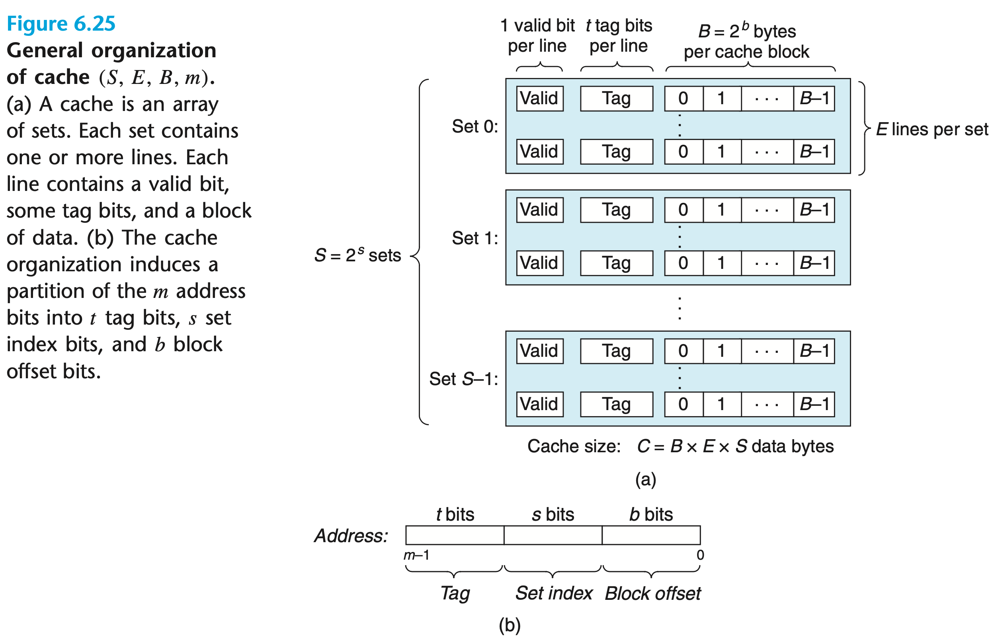

In general, a cache’s organization can be characterized by the tuple (S, E, B, m). The size (or capacity) of a cache, C, is stated in terms of the aggregate size of all the blocks. The tag bits and valid bit are not included. Thus, C = S × E × B.

When the CPU is instructed by a load instruction to read a word from address A of main memory, it sends address A to the cache. If the cache is holding a copy of the word at address A, it sends the word immediately back to the CPU. 

The parameters S and B induce a partitioning of the m address bits into the three fields shown in Figure 6.25(b). 

- The s *set index bits* indicates which set the word belongs to, starting from 0.
- The t *tag bits* indicates which line in the set contains the word.
- The b *block offset bits* give us the offset of the word in the B-byte data block.

A line in the set contains the word if and only if the valid bit is set and the tag bits in the line match the tag bits in the given address. 

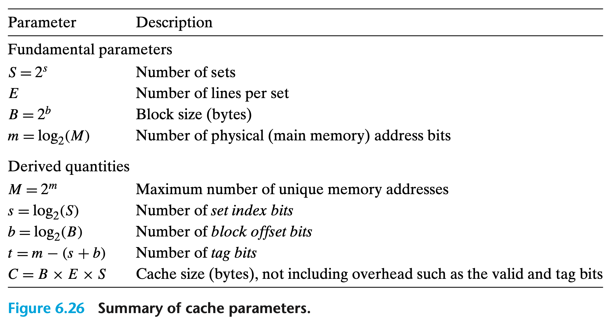

Figure 6.26 summarizes all the symbols

The process that a cache goes through of determining whether a request is a hit or a miss and then extracting the requested word consists of three steps: 

1. *set selection*: the cache extracts the s set index bits from the middle of the address for w. These bits are interpreted as an unsigned integer that corresponds to a set number.
2. *line matching*: determine if a copy of the word w is stored in one of the cache lines contained in set i. A copy of w is contained in the line if and only if the valid bit is set and the tag in the cache line matches the tag in the address of w.
3. *word extraction*: the block offset bits provide us with the offset of the first byte in the desired word.

If the cache misses, then it needs to retrieve the requested block from the next level in the memory hierarchy and store the new block in one of the cache lines of the set indicated by the set index bits. In general, if the set is full of valid cache lines, then one of the existing lines must be evicted.

> _**Note**_: Why caches use the middle bits for the set index instead of the high-order bits. If the high-order bits are used as an index, then some contiguous memory blocks will map to the same cache set.

#### Direct-Mapped Caches

Caches are grouped into different classes based on E, the number of cache lines per set. A cache with exactly one line per set (E = 1) is known as a *direct-mapped* cache (see Figure 6.27). 

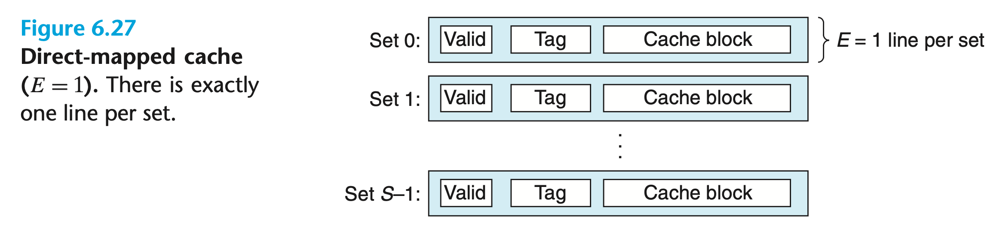

#### Set Associative Caches

A *set associative cache* relaxes this constraint so that each set holds more than one cache line. A cache with 1 < E < C/B is often called an E-way set associative cache.

Figure 6.32 shows the organization of a two-way set associative cache.

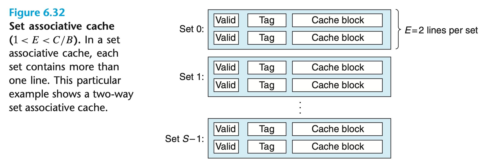

A conventional memory is an array of values that takes an address as input and returns the value stored at that address. An *associative memory*, on the other hand, is an array of (key, value) pairs that takes as input the key and returns a value from one of the (key, value) pairs that matches the input key. Thus, we can think of each set in a set associative cache as a small associative memory where the keys are the concatenation of the tag and valid bits, and the values are the contents of a block.

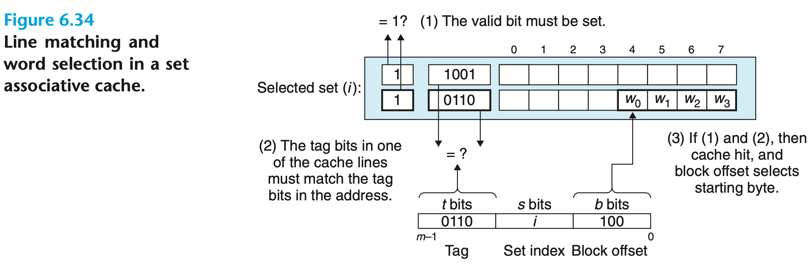

Figure 6.34 shows the basic idea of line matching in an associative cache. An important idea here is that any line in the set can contain any of the memory blocks that map to that set. So the cache must search each line in the set for a valid line whose tag matches the tag in the address. If the cache finds such a line, then we have a hit and the block offset selects a word from the block, as before.

If it's cached miss and the set is full. The replacement policy will take in-charge to decide which line to replace.

- A *least frequently used (LFU)* policy will replace the line that has been referenced the fewest times over some past time window. 
- A *least recently used (LRU)* policy will replace the line that was last accessed the furthest in the past. 

All of these policies require additional time and hardware. But as we move further down the memory hierarchy, away from the CPU, the cost of a miss becomes more expensive and it becomes more worthwhile to minimize misses with good replacement policies.

#### Fully Associative Caches

A *fully associative cache* consists of a single set (i.e., E = C/B) that contains all of the cache lines. Figure 6.35 shows the basic organization.

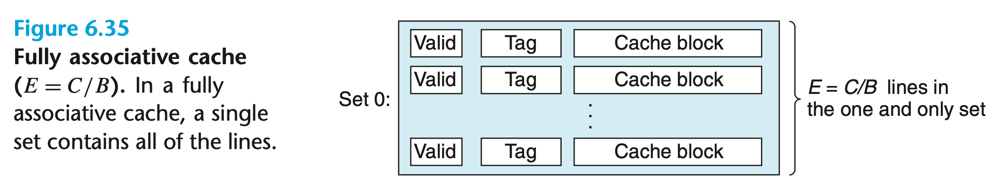

Because the cache circuitry must search for many matching tags in parallel, it is difficult and expensive to build an associative cache that is both large and fast. As a result, fully associative caches are only appropriate for small caches, such as the translation lookaside buffers (TLBs) in virtual memory systems that cache page table entries.

Suppose we write a word w that is already cached (a *write hit*). After the cache updates its copy of w, what does it do about updating the copy of w in the next lower level of the hierarchy? 

- The simplest approach, known as *write-through*, is to immediately write w’s cache block to the next lower level. 
  - While simple, write-through has the disadvantage of causing bus traffic with every write. 
- Another approach, known as *write-back*, defers the update as long as possible by writing the updated block to the next lower level only when it is evicted from the cache by the replacement algorithm. 
  - Because of locality, write-back can significantly reduce the amount of bus traffic
  - but it has the disadvantage of additional complexity. The cache must maintain an additional *dirty bit* for each cache line that indicates whether or not the cache block has been modified.

To deal with write misses. 

- One approach, known as *write-allocate*, loads the corresponding block from the next lower level into the cache and then updates the cache block.
  - Write-allocate tries to exploit spatial locality of writes, but it has the disadvantage that every miss results in a block transfer from the next lower level to the cache. 
- The alternative, known as *no-write-allocate*, bypasses the cache and writes the word directly to the next lower level. 

Write-through caches are typically no-write-allocate. Write-back caches are typically write-allocate.

Optimizing caches for writes is a subtle and difficult issue, and we are only scratching the surface here. The details vary from system to system and are often proprietary and poorly documented. To the programmer trying to write reasonably cache-friendly programs, **we suggest adopting a mental model that assumes write-back, write-allocate caches.**

#### Real Cache Hierarchy

A cache that holds instructions only is called an *i-cache*. A cache that holds program data only is called a *d-cache*. A cache that holds both instructions and data is known as a *unified cache*. Modern processors include separate i-caches and d-caches. There are a number of reasons for this.

- the processor can read an instruction word and a data word at the same time.
- I-caches are typically read-only, and thus simpler.
- The two caches are often optimized to different access patterns and can have different block sizes, associativities, and capacities. 
- ensures that data accesses do not create conflict misses with instruction accesses, and vice versa, at the cost of a potential increase in capacity misses.

Figure 6.38 shows the cache hierarchy for the Intel Core i7 processor.

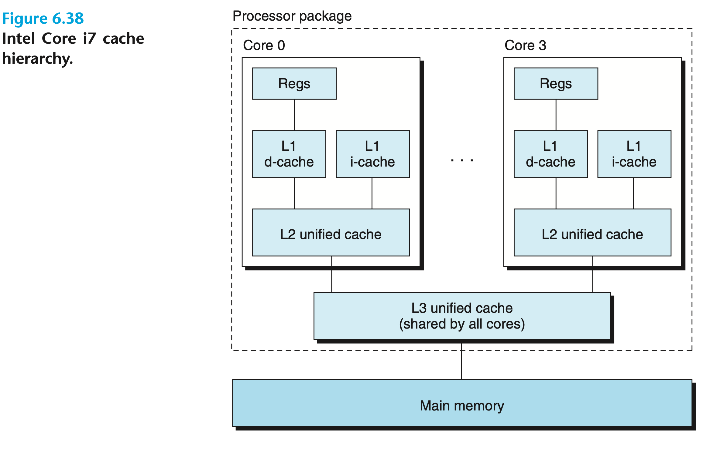

Figure 6.39 summarizes the basic characteristics of the Core i7 caches.

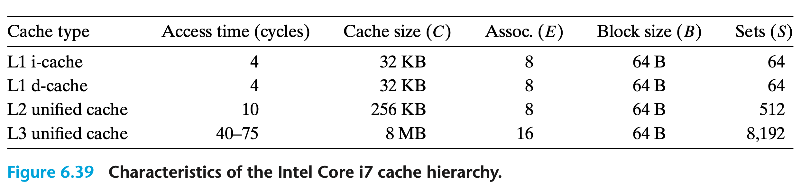

#### Performance Impact of Cache Parameters

Cache performance is evaluated with a number of metrics:

- *Miss rate.* The fraction of memory references during the execution of a program, or a part of a program, that miss. It is computed as $\frac{\#\ misses}{\#\ references}$.
- *Hit rate.* The fraction of memory references that hit. It is computed as 1 − *miss rate*.
- *Hit time.* The time to deliver a word in the cache to the CPU, including the time for set selection, line identification, and word selection. Hit time is on the order of several clock cycles for L1 caches.
- *Miss penalty.* Any additional time required because of a miss. The penalty for L1 misses served from L2 is on the order of 10 cycles; from L3, 50 cycles; and from main memory, 200 cycles.

### Writing Cache-Friendly Code

Programs with better locality will tend to have lower miss rates, and programs with lower miss rates will tend to run faster than programs with higher miss rates. Thus, good programmers should always try to write code that is cache friendly, in the sense that it has good locality. Here is the basic approach we use to try to ensure that our code is cache friendly.

1. *Make the common case go fast.* Programs often spend most of their time in a few core functions. These functions often spend most of their time in a few loops. So focus on the inner loops of the core functions and ignore the rest.
2. *Minimize the number of cache misses in each inner loop.* All other things being equal, such as the total number of loads and stores, loops with better miss rates will run faster.

### The Impact of Caches on Program Performance

#### Rearranging Loops to Increase Spatial Locality

Figure 6.44 shows different versions of matrix multiply function.

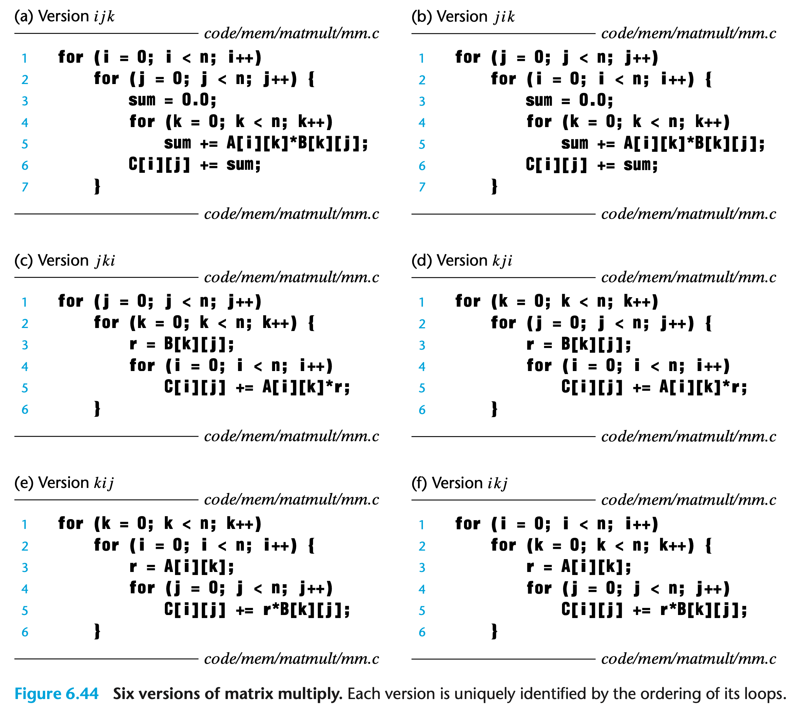

Figure 6.45 summarizes the results of our inner-loop analysis.

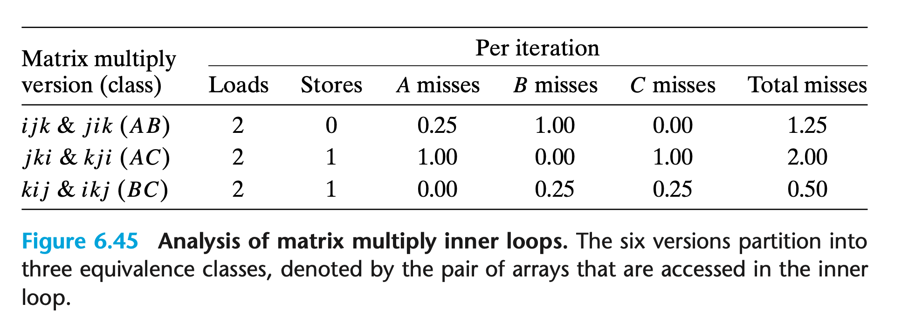

1. The inner loops of the class AB routines (Figure 6.44(a) and (b)) scan a row of array A with a stride of 1. Since each cache block holds four 8-byte words, the miss rate for A is 0.25 misses per iteration. On the other hand, the inner loop scans a column of B with a stride of n. Since n is large, each access of array B results in a miss, for a total of 1.25 misses per iteration.

2. The inner loops in the class AC routines (Figure 6.44(c) and (d)) have some problems. Each iteration performs two loads and a store (as opposed to the class AB routines, which perform two loads and no stores). Second, the inner loop scans the columns of A and C with a stride of n. The result is a miss on each load, for a total of two misses per iteration. Notice that interchanging the loops has decreased the amount of spatial locality compared to the class AB routines.
3. The B C routines (Figure 6.44(e) and (f)) present an interesting trade-off: With two loads and a store, they require one more memory operation than the AB routines. On the other hand, since the inner loop scans both B and C row-wise with a stride-1 access pattern, the miss rate on each array is only 0.25 misses per iteration, for a total of 0.50 misses per iteration.

Figure 6.46 summarizes the performance of different versions of matrix mul- tiply on a Core i7 system. The graph plots the measured number of CPU cycles per inner-loop iteration as a function of array size (n).

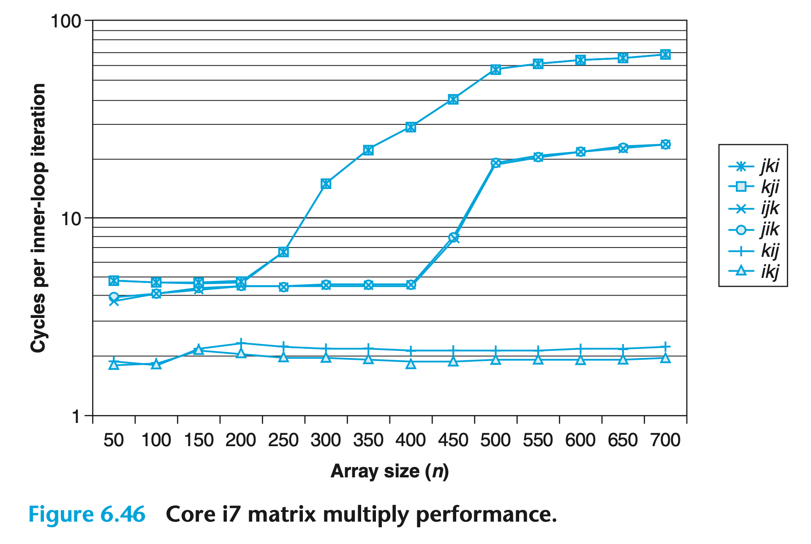

There are a number of interesting points to notice about this graph:

- For large values of n, the fastest version runs almost 40 times faster than the slowest version, even though each performs the same number of floating-point arithmetic operations.
- Pairs of versions with the same number of memory references and misses per iteration have almost identical measured performance.
- The two versions with the worst memory behavior, in terms of the number of accesses and misses per iteration, run significantly slower than the other four versions, which have fewer misses or fewer accesses, or both.
- Miss rate, in this case, is a better predictor of performance than the total number of memory accesses.
- For large values of n, the performance of the fastest pair of versions (kij and ikj) is constant. Even though the array is much larger than any of the SRAM cache memories, the prefetching hardware is smart enough to recognize the stride-1 access pattern, and fast enough to keep up with memory accesses in the tight inner loop. This is a stunning accomplishment by the Intel engineers who designed this memory system, providing even more incentive for programmers to develop programs with good spatial locality.

#### Exploiting Locality in Your Programs

Programs with good locality access most of their data from fast cache memories. Programs with poor locality access most of their data from the relatively slow DRAM main memory. Programmers who understand the nature of the memory hierarchy can exploit this understanding to write more efficient programs, regardless of the specific memory system organization. In particular, we recommend the following techniques:

- Focus your attention on the inner loops, where the bulk of the computations and memory accesses occur.
- Try to maximize the spatial locality in your programs by reading data objects sequentially, with stride 1, in the order they are stored in memory.
- Try to maximize the temporal locality in your programs by using a data object as often as possible once it has been read from memory.

## Linking

Linking is the process of collecting and combining various pieces of code and data into a single file that can be *loaded* (copied) into memory and executed.

Linking can be performed at *compile time*, when the source code is translated into machine code; at *load time*, when the program is loaded into memory and executed by the *loader*; and even at *run time*, by application programs. On modern systems, linking is performed automatically by programs called *linkers*.

With the following command to the shell:

```bash
linux> gcc -Og -o prog main.c sum.c
```

Figure 7.2 summarizes the activities of the driver as it translates the example program from an ASCII source file into an executable object file.

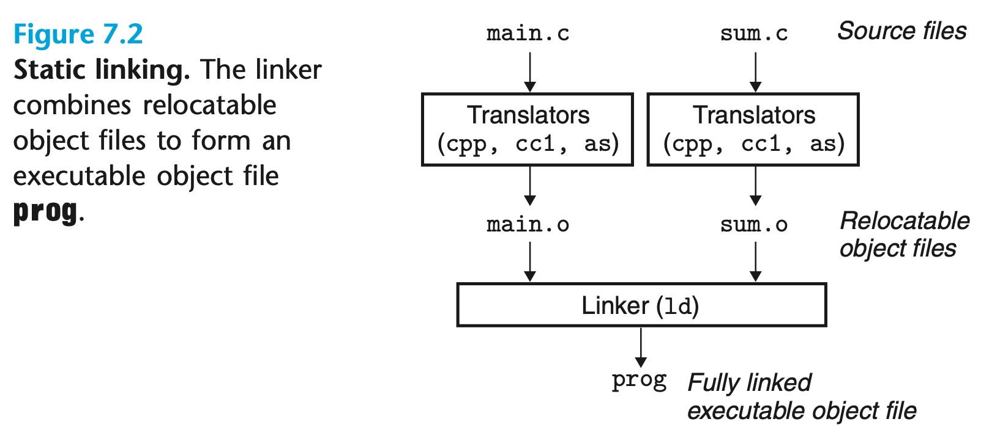

### Static Linking

*Static linkers* such as the Linux ld program take as input a collection of relocatable object files and command-line arguments and generate as output a fully linked executable object file that can be loaded and run.

To build the executable, the linker must perform two main tasks:

1. *Symbol resolution.* Object files define and reference *symbols*, where each symbol corresponds to a function, a global variable, or a *static variable* (i.e., any C variable declared with the static attribute). The purpose of symbol resolution is to associate each symbol *reference* with exactly one symbol *definition*.
2. *Relocation.* Compilers and assemblers generate code and data sections that start at address 0. The linker *relocates* these sections by associating a memory location with each symbol definition, and then modifying all of the references to those symbols so that they point to this memory location. The linker blindly performs these relocations using detailed instructions, generated by the assembler, called *relocation entries*.

### Object Files

Object files come in three forms:

1. *Relocatable object file.* Contains binary code and data in a form that can be combined with other relocatable object files at compile time to create an executable object file.

2. *Executable object file.* Contains binary code and data in a form that can be copied directly into memory and executed.

3. *Shared object file.* A special type of relocatable object file that can be loaded into memory and linked dynamically, at either load time or run time.

Compilers and assemblers generate relocatable object files (including shared object files). Linkers generate executable object files. Object files are organized according to specific *object file formats*, which vary from system to system. Modern x86-64 Linux and Unix systems use *Executable and Linkable Format (ELF)*. Although our discussion will focus on ELF, the basic concepts are similar, regardless of the particular format.

### Relocatable Object Files

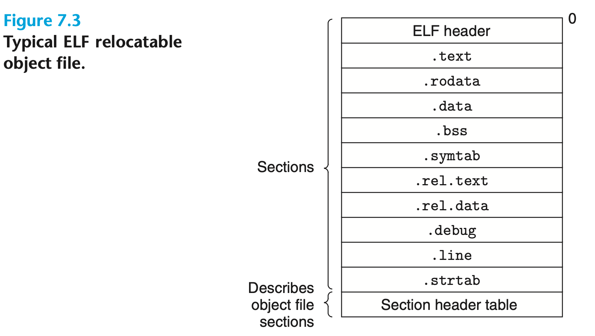

Figure 7.3 shows the format of a typical ELF relocatable object file. 

The *ELF header* begins with 

- a 16-byte sequence that describes the word size and byte ordering of the system that generated the file.
- The rest of the ELF header contains information that allows a linker to parse and interpret the object file. This includes
  - the size of the ELF header
  - the object file type (e.g., relocatable, executable, or shared)
  - the machine type (e.g., x86-64)
  - the file offset of the section header table
  - the size and number of entries in the section header table
    - The locations and sizes of the various sections are described by the *section header table*, which contains a fixed-size entry for each section in the object file.

A typical ELF relocatable object file contains the following sections:

- **.text** The machine code of the compiled program.

- **.rodata** Read-only data such as the format strings in printf statements, and

  jump tables for switch statements.

- **.data** *Initialized* global and static C variables. Local C variables are maintained at run time on the stack and do *not* appear in either the *.data* or *.bss* sections.
- **.bss** *Uninitialized* global and static C variables, along with any global or static variables that are initialized to zero. This section occupies no actual space in the object file; it is merely a placeholder. Object file formats distinguish between initialized and uninitialized variables for space efficiency: uninitialized variables do not have to occupy any actual disk space in the object file. At run time, these variables are allocated in memory with an initial value of zero.
- **.symtab** A *symbol table* with information about functions and global variables that are defined and referenced in the program. Some programmers mistakenly believe that a program must be compiled with the -g option to get symbol table information. However, unlike the symbol table inside a compiler, the .symtab symbol table does not contain entries for local variables.
- **.rel.text** A list of locations in the .text section that will need to be modified when the linker combines this object file with others. In general, any instruction that calls an external function or references a global variable will need to be modified.
- **.rel.data** Relocation information for any global variables that are referenced or defined by the module. In general, any initialized global variable whose initial value is the address of a global variable or externally defined function will need to be modified.
- **.debug** A debugging symbol table with entries for local variables and typedefs defined in the program, global variables defined and referenced in the program, and the original C source file. It is only present if the compiler driver is invoked with the -g option.
- **.line** A mapping between line numbers in the original C source program and machine code instructions in the .text section. It is only present if the compiler driver is invoked with the -g option.
- **.strtab** A string table for the symbol tables in the .symtab and .debug sections and for the section names in the section headers. A string table is a sequence of null-terminated character strings.

### Symbols and Symbol Tables

Each relocatable object module, m, has a symbol table that contains information about the symbols that are defined and referenced by m. In the context of a linker, there are three different kinds of symbols:

- *Global symbols* that are defined by module m and that can be referenced by other modules. Global linker symbols correspond to *nonstatic* C functions and global variables.
- Global symbols that are referenced by module m but defined by some other module. Such symbols are called *externals* and correspond to nonstatic C functions and global variables that are defined in other modules.
- *Local symbols* that are defined and referenced exclusively by module m. These correspond to static C functions and global variables that are defined with the static attribute. These symbols are visible anywhere within module m, but cannot be referenced by other modules.

An ELF symbol table is contained in the .symtab section. It contains an array of entries. Figure 7.4 shows the format of each entry.


### Symbol Resolution

When the compiler encounters a symbol (either a variable or function name) that is not defined in the current module, it assumes that it is defined in some other module, generates a linker symbol table entry, and leaves it for the linker to handle. If the linker is unable to find a definition for the referenced symbol in any of its input modules, it prints an (often cryptic) error message and terminates. 

> <center><strong>Mangling of linker symbols in C++ and Java</strong></center>
>
> The compiler encodes each unique method and parameter list combination into a unique name for the linker. This encoding process is called *mangling*, and the inverse process is known as *demangling*.

#### How Linkers Resolve Duplicate Symbol Names

At compile time, the compiler exports each global symbol to the assembler as either *strong* or *weak*, and the assembler encodes this information implicitly in the symbol table of the relocatable object file. Functions and initialized global variables get strong symbols. Uninitialized global variables get weak symbols.

Linux linkers use the following rules for dealing with duplicate symbol names:

**Rule 1**: Multiple strong symbols with the same name are not allowed.

**Rule 2**: Given a strong symbol and multiple weak symbols with the same name, choose the strong symbol.

**Rule 3**: Given multiple weak symbols with the same name, choose any of the weak symbols.

When in doubt, invoke the linker with a flag such as the `gcc -fno-common` flag, which triggers an error if it encounters multiply-defined global symbols. Or use the `-Werror` option, which turns all warnings into errors.

#### Linking with Static Libraries

In practice, all compilation systems provide a mechanism for packaging related object modules into a single file called a *static library*, which can then be supplied as input to the linker. When it builds the output executable, the linker copies only the object modules in the library that are referenced by the application program.

#### How Linkers Use Static Libraries to Resolve References

During the symbol resolution phase, the linker scans the relocatable object files and archives left to right in the same sequential order that they appear on the compiler driver’s command line. (The driver automatically translates any .c files on the command line into .o files.) During this scan, the linker maintains a set E of relocatable object files that will be merged to form the executable, a set U of unresolved symbols (i.e., symbols referred to but not yet defined), and a set D of symbols that have been defined in previous input files. Initially, E, U, and D are empty.

- For each input file f on the command line, the linker determines if f is an object file or an archive.
  - If f is an object file, the linker adds f to E, updates U and D to reflect the symbol definitions and references in f , and proceeds to the next input file.
  - If f is an archive, the linker attempts to match the unresolved symbols in U against the symbols defined by the members of the archive.
- If U is nonempty when the linker finishes scanning the input files on the command line, it prints an error and terminates. Otherwise, it merges and relocates the object files in E to build the output executable file.

This algorithm can result in some baffling link-time errors because the ordering of libraries and object files on the command line is significant. If the library that defines a symbol appears on the command line before the object file that references that symbol, then the reference will not be resolved and linking will fail. 

For example, consider the following:

```bash
linux> gcc -static ./libvector.a main2.c
/tmp/cc9XH6Rp.o: In function ‘main’: /tmp/cc9XH6Rp.o(.text+0x18): undefined reference to ‘addvec’
```

The general rule for libraries is to place them at the end of the command line.

### Relocation

Relocation consists of two steps:

1. *Relocating sections and symbol definitions.* The linker merges all sections of the same type into a new aggregate section of the same type. For example, the *.data* sections from the input modules are all merged into one section that will become the *.data* section for the output executable object file. The linker then assigns run-time memory addresses to the new aggregate sections, to each section defined by the input modules, and to each symbol defined by the input modules. When this step is complete, each instruction and global variable in the program has a unique run-time memory address.
2. *Relocating symbol references within sections.* In this step, the linker modifies every symbol reference in the bodies of the code and data sections so that they point to the correct run-time addresses. To perform this step, the linker relies on data structures in the relocatable object modules known as relocation entries.

#### Relocation Entries

Whenever the assembler encounters a reference to an object whose ultimate location is unknown, it generates a *relocation entry* that tells the linker how to modify the reference when it merges the object file into an executable. Relocation entries for code are placed in **.rel.text*. Relocation entries for data are placed in *.rel.data*.

Figure 7.9 shows the format of an ELF relocation entry.

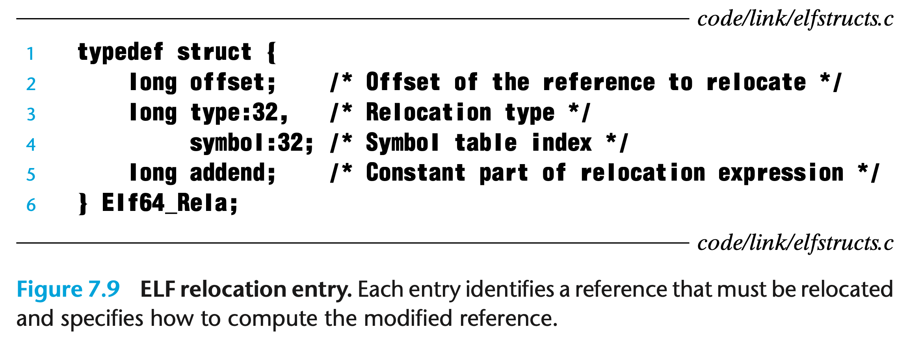

ELF defines 32 different relocation types, many quite arcane. We are con- cerned with only the two most basic relocation types:

- **R_X86_64_PC32**: Relocate a reference that uses a 32-bit PC-relative address. A PC-relative address is an offset from the current run-time value of the program counter (PC). When the CPU executes an instruction using PC-relative addressing, it forms the *effective address* (e.g., the target of the call instruction) by adding the 32-bit value encoded in the instruction to the current run-time value of the PC, which is always the address of the next instruction in memory.
- **R_X86_64_32**: Relocate a reference that uses a 32-bit absolute address. With absolute addressing, the CPU directly uses the 32-bit value encoded in the instruction as the effective address, without further modifications.

### Executable Object Files

Figure 7.13 shows a typical ELF executable file.


ELF executables are designed to be easy to load into memory, with contiguous chunks of the executable file mapped to contiguous memory segments. This mapping is described by the *program header table*. 

### Loading Executable Object Files

The system invokes *loader* to handle the executable object file. Any Linux program can invoke the loader by calling the `execve` function. The loader copies the code and data in the executable object file from disk into memory and then runs the program by jumping to its first instruction, or *entry point*. This process of copying the program into memory and then running it is known as *loading*.

When the loader runs, it creates a memory image similar to the one shown in Figure 7.15. Guided by the program header table, it copies chunks of the executable object file into the code and data segments. Next, the loader jumps to the program’s entry point, which is always the address of the `_start` function. This function is defined in the system object file `crt1.o` and is the same for all C programs. The `_start` function calls the *system startup function*, `__libc_start_main`, which is defined in `libc.so`. It initializes the execution environment, calls the user-level `main` function, handles its return value, and if necessary returns control to the kernel.

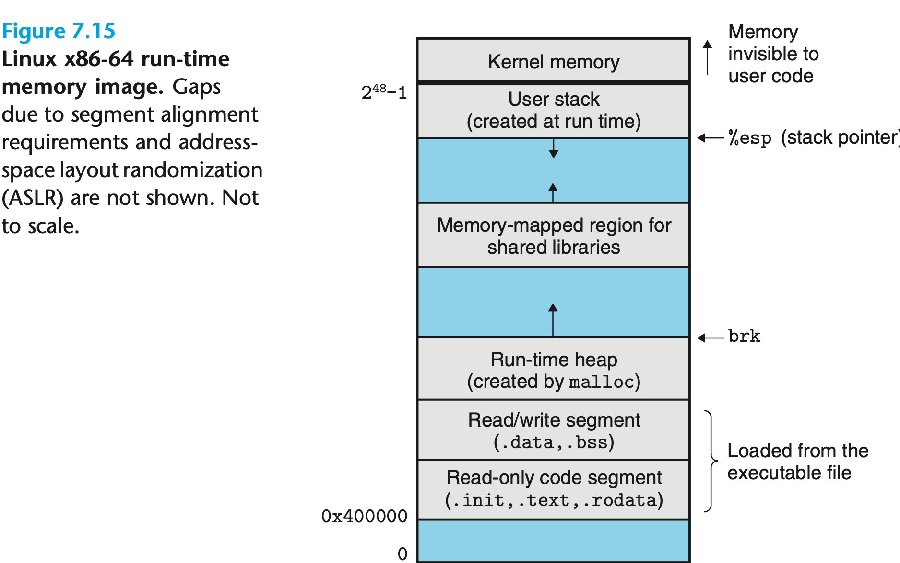

> <center><strong>How do loaders really work</strong></center>
>
> Each program in a Linux system runs in the context of a process with its own virtual address space. When the shell runs a program, the parent shell process forks a child process that is a duplicate of the parent. The child process invokes the loader via the execve system call. The loader deletes the child’s existing virtual memory segments and creates a new set of code, data, heap, and stack segments. The new stack and heap segments are initialized to zero. The new code and data segments are initialized to the contents of the executable file by mapping pages in the virtual address space to page-size chunks of the executable file. Finally, the loader jumps to the `_start` address, which eventually calls the application’s main routine. Aside from some header information, there is no copying of data from disk to memory during loading. The copying is deferred until the CPU references a mapped virtual page, at which point the operating system automatically transfers the page from disk to memory using its paging mechanism.

### Dynamic Linking with Shared Libraries

Static libraries need to be maintained and updated periodically. If application programmers want to use the most recent version of a library, they aware that the library has changed and then explicitly relink their programs against the updated library. Another issue is that almost every C program uses standard I/O functions such as printf and scanf. At run time, the code for these functions is duplicated in the text segment of each running process. On a typical system that is running hundreds of processes, this can be a significant waste of scarce memory system resources.

*Shared libraries* are modern innovations that address the disadvantages of static libraries. A shared library is an object module that can be loaded at an arbitrary memory address and linked with a program in memory during either run time or load time. This process is known as *dynamic linking* and is performed by a program called a *dynamic linker*. Shared libraries are also referred to as *shared objects*, and on Linux systems they are indicated by the `.so` suffix. Microsoft operating systems make heavy use of shared libraries, which they refer to as `DLLs` (dynamic link libraries).

Shared libraries are “shared” in two different ways. 

1. in any given file system, there is exactly one `.so` file for a particular library. The code and data in this `.so` file are shared by all of the executable object files that reference the library, as opposed to the contents of static libraries, which are copied and embedded in the executables that reference them.
2. A single copy of the `.text` section of a shared library in memory can be shared by different running processes.

Figure 7.16 summarizes the dynamic linking process.

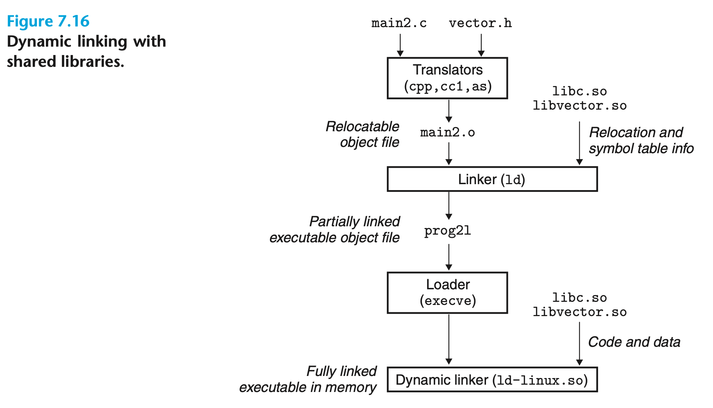

To build a shared library called libvector.so, we invoke the compiler driver with some special directives to the compiler and linker:

```c
linux> gcc -shared -fpic -o libvector.so addvec.c multvec.c
```

The `-fpic` flag directs the compiler to generate *position-independent code*.

The `-shared` flag directs the linker to create a shared object file. 

Once we have created the library, we would then link it:

```c
linux> gcc -o prog2l main2.c ./libvector.so
```

When the loader loads and runs the executable called prog2, it loads the partially linked executable prog2. Next, it notices that prog2 contains a `.interp` section, which contains the path name of the dynamic linker, which is itself a shared object. Instead of passing control to the application, the loader loads and runs the dynamic linker. The dynamic linker then finishes the linking task by performing the following relocations:

- Relocating the text and data of libc.so into some memory segment
- Relocating the text and data of libvector.so into another memory segment
- Relocating any references in prog2 to symbols defined by libc.so and libvector.so

Finally, the dynamic linker passes control to the application. The locations of the shared libraries are fixed and do not change during execution of the program.

### Dynamic Linking at Runtime

Linux systems provide a simple interface to the dynamic linker that allows application programs to load and link shared libraries at run time.

The `dlopen` function loads and links the shared library filename. The external symbols in filename are resolved using libraries previously opened with the `RTLD_ GLOBAL` flag. If the current executable was compiled with the `-rdynamic` flag, then its global symbols are also available for symbol resolution. The flag argument must include either `RTLD_NOW`, which tells the linker to resolve references to external symbols immediately, or the `RTLD_LAZY` flag, which instructs the linker to defer symbol resolution until code from the library is executed. Either of these values can be ored with the `RTLD_GLOBAL` flag.

```c
#include <dlfcn.h>
void *dlopen(const char *filename, int flag);
```

The dlsym function takes a handle to a previously opened shared library and a symbol name and returns the address of the symbol, if it exists, or NULL otherwise.

```c
#include <dlfcn.h>
void *dlsym(void *handle, char *symbol);
```

The dlclose function unloads the shared library if no other shared libraries are still using it.

```c
#include <dlfcn.h>
int dlclose (void *handle);
```

The `dlerror` function returns a string describing the most recent error that oc- curred as a result of calling dlopen, dlsym, or dlclose, or NULL if no error occurred.

```c
#include <dlfcn.h>
const char *dlerror(void);
```

Figure 7.17 shows how we would use this interface to dynamically link our libvector.so shared library at run time and then invoke its addvec routine. To compile the program, we would invoke gcc in the following way:

```c
linux> gcc -rdynamic -o prog2r dll.c -ldl
```

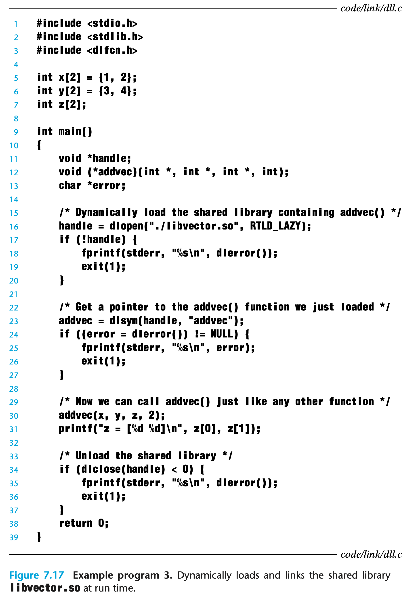

### Position-Independent Code (PIC)

Modern systems compile the code segments of shared modules so that they can be loaded anywhere in memory without having to be modified by the linker. With this approach, a single copy of a shared module’s code segment can be shared by an unlimited number of processes. (Of course, each process will still get its own copy of the read/write data segment.)

Code that can be loaded without needing any relocations is known as *position- independent code (PIC)*. Users direct GNU compilation systems to generate PIC code with the `-fpic` option to gcc. Shared libraries must always be compiled with this option.

On x86-64 systems, references to symbols in the same executable object module require no special treatment to be PIC. These references can be compiled using PC-relative addressing and relocated by the static linker when it builds the object file. However, references to external procedures and global variables that are defined by shared modules require some special techniques, which we describe next.

#### PIC Data References

Compilers generate PIC references to global variables by exploiting the following interesting fact: no matter where we load an object module in memory, the data segment is always the same distance from the code segment. Thus, the *distance* between any instruction in the code segment and any variable in the data segment is a run-time constant, independent of the absolute memory locations of the code and data segments.

Compilers that want to generate PIC references to global variables exploit this fact by creating a table called the *global offset table (GOT)* at the beginning of the data segment. The GOT contains an 8-byte entry for each global data object (procedure or global variable) that is referenced by the object module. The compiler also generates a relocation record for each entry in the GOT. At load time, the dynamic linker relocates each GOT entry so that it contains the absolute address of the object. Each object module that references global objects has its own GOT.

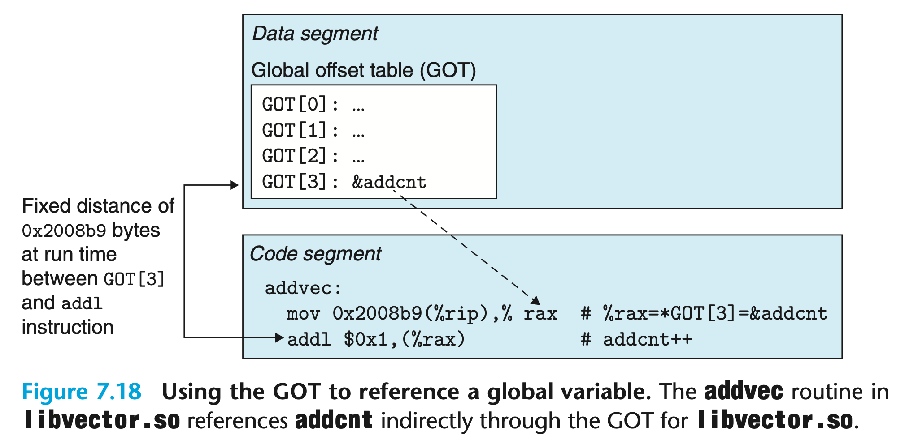

Figure 7.18 shows the GOT from example `libvector.so` shared module. The addvec routine loads the address of the global variable addcnt indirectly via GOT[3] and then increments addcnt in memory. The key idea here is that the offset in the PC-relative reference to GOT[3] is a run-time constant.

#### PIC Function Calls

Suppose that a program calls a function that is defined by a shared library. The compiler has no way of predicting the run-time address of the function, since the shared module that defines it could be loaded anywhere at run time. 

GNU compilation systems solve this problem using an interesting technique, called *lazy binding*, that defers the binding of each procedure address until the *first time* the procedure is called. Lazy binding is implemented with a compact and complex interaction between two data structures: the GOT and the *procedure linkage table (PLT)*. If an object module calls any functions that are defined in shared libraries, then it has its own GOT and PLT. The GOT is part of the data segment. The PLT is part of the code segment.

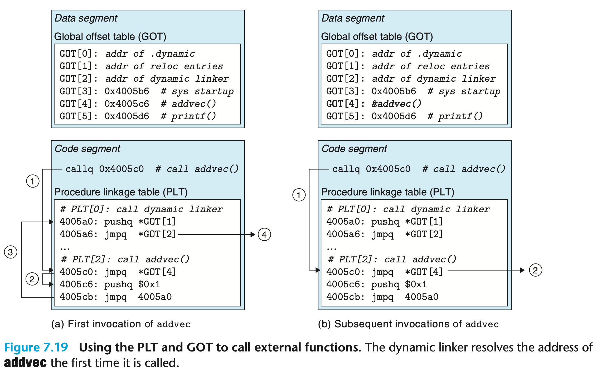

Figure 7.19 shows how the PLT and GOT work together to resolve the address of a function at run time. 

let’s examine the contents of each of these tables:

- *Procedure linkage table (PLT).* The PLT is an array of 16-byte code entries. PLT[0] is a special entry that jumps into the dynamic linker. Each shared library function called by the executable has its own PLT entry. Each of these entries is responsible for invoking a specific function. PLT[1] (not shown here) invokes the system startup function (__libc_start_main), which initializes the execution environment, calls the main function, and handles its return value. Entries starting at PLT[2] invoke functions called by the user code. In our example, PLT[2] invokes `addvec` and PLT[3] (not shown) invokes printf.
- *Global offset table (GOT).* The GOT is an array of 8-byte address entries. When used in conjunction with the PLT, GOT[0] and GOT[1] contain information that the dynamic linker uses when it resolves function addresses. GOT[2] is the entry point for the dynamic linker in the ld-linux.so module. Each of the remaining entries corresponds to a called function whose address needs to be resolved at run time. Each has a matching PLT entry. For example, GOT[4] and PLT[2] correspond to addvec. Initially, each GOT entry points to the second instruction in the corresponding PLT entry.

Figure 7.19(a) shows how the GOT and PLT work together to lazily resolve the run-time address of function `addvec` the first time it is called:

*Step 1.* Instead of directly calling `addvec`, the program calls into PLT[2], which is the PLT entry for `addvec`.

*Step 2.* The first PLT instruction does an indirect jump through GOT[4]. Since each GOT entry initially points to the second instruction in its corresponding PLT entry, the indirect jump simply transfers control back to the next instruction in PLT[2].

*Step 3.* After pushing an ID for addvec (0x1) onto the stack, PLT[2] jumps to PLT[0].

*Step 4.* PLT[0] pushes an argument for the dynamic linker indirectly through GOT[1] and then jumps into the dynamic linker indirectly through GOT[2]. The dynamic linker uses the two stack entries to determine the run-time location of `addvec`, overwrites GOT[4] with this address, and passes control to `addvec`.

Figure 7.19(b) shows the control flow for any subsequent invocations of addvec:

*Step 1.* Control passes to PLT[2] as before.
*Step 2.* However, this time the indirect jump through GOT[4] transfers control directly to `addvec`.

### Library Interpositioning

Linux linkers support a powerful technique, called *library interpositioning*, that allows you to intercept calls to shared library functions and execute your own code instead. Using interpositioning, you could trace the number of times a particular library function is called, validate and trace its input and output values, or even replace it with a completely different implementation.

Given some *target function* to be interposed on, you create a *wrapper function* whose prototype is identical to the target function. Using some particular interpositioning mechanism, you then trick the system into calling the wrapper function instead of the target function. The wrapper function typically executes its own logic, then calls the target function and passes its return value back to the caller.

Interpositioning can occur at compile time, link time, or run time as the program is being loaded and executed. To explore these different mechanisms, we will use the example program in Figure 7.20(a) as a running example. Our goal is to use interpositioning to trace the calls to malloc and free as the program runs.

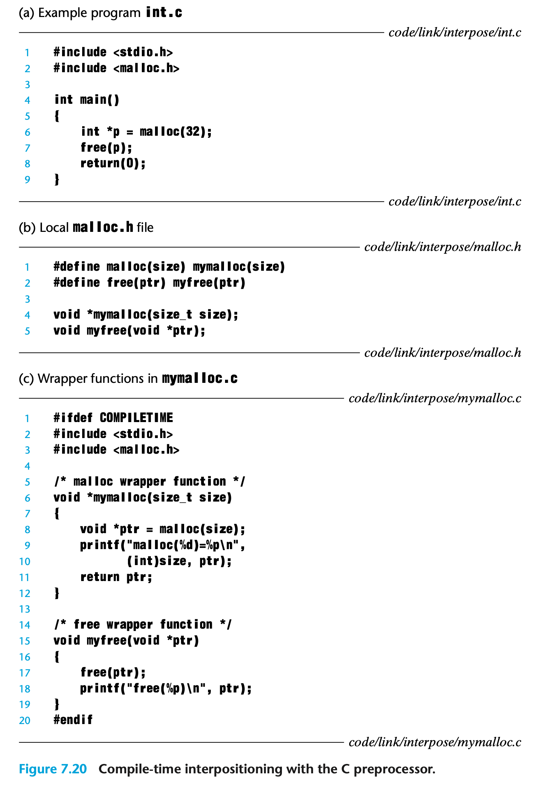

#### Compile-Time Interpositioning

Figure 7.20 shows how to use the C preprocessor to interpose at compile time. Each wrapper function in mymalloc.c (Figure 7.20(c)) calls the target function, prints a trace, and returns. The local malloc.h header file (Figure 7.20(b)) instructs the preprocessor to replace each call to a target function with a call to its wrapper. 

Here is how to compile and link the program:

```c
linux> gcc -DCOMPILETIME -c mymalloc.c 
linux> gcc -I. -o intc int.c mymalloc.o
```

The flag `-I` tells the C preprocessor to look for malloc.h in the current directory before looking in the usual system directories. 

#### Link-Time Interpositioning

The Linux static linker supports link-time interpositioning with the `--wrap f` flag. This flag tells the linker to resolve references to symbol f as `__wrap_f`, and to resolve references to symbol `__real_f` as f. Figure 7.21 shows the wrappers for our example program.

Here is how to compile the source files into relocatable object files:

```c
linux> gcc -DLINKTIME -c mymalloc.c
linux> gcc -c int.c
```

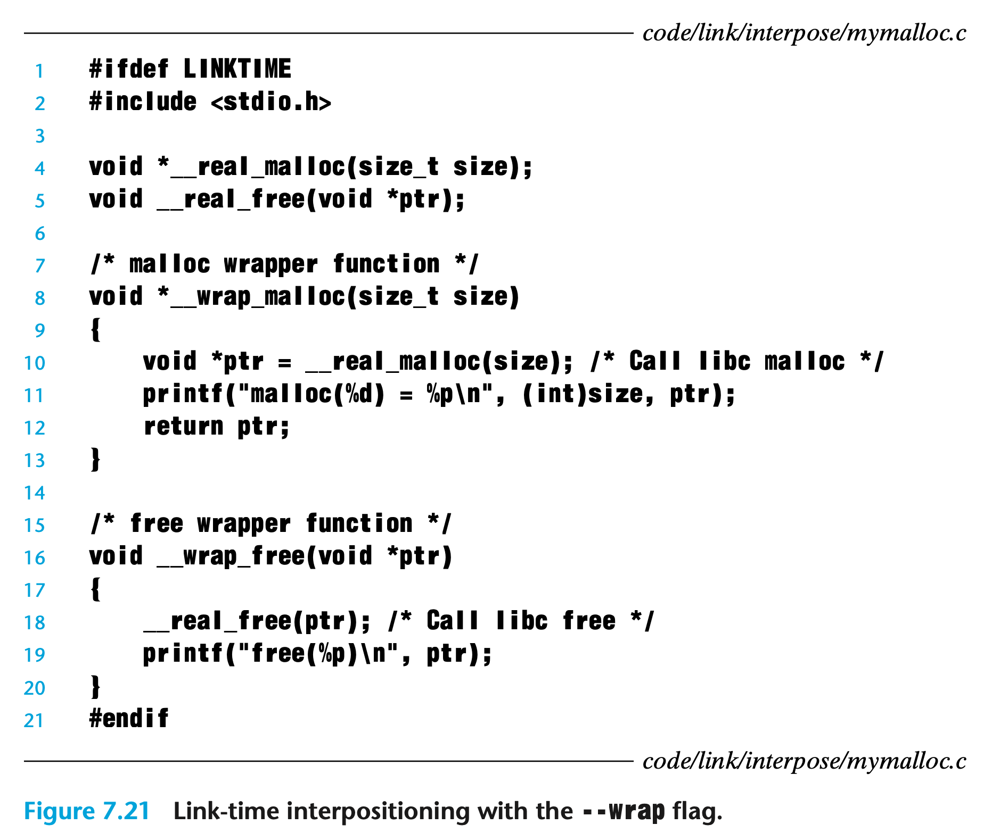

And here is how to link the object files into an executable:

```c
linux> gcc -Wl,--wrap,malloc -Wl,--wrap,free -o intl int.o mymalloc.o
```

The `-Wl` flag passes option to the linker. Each comma in option is replaced with a space. So `-Wl,--wrap,malloc` passes `--wrap malloc` to the linker, and similarly for `-Wl,--wrap,free`.

#### Run-Time Interpositioning

The Run-Time Interpositioning is based on the dynamic linker’s `LD_PRELOAD` environment variable.

If the `LD_PRELOAD` environment variable is set to a list of shared library pathnames (separated by spaces or colons), then when you load and execute a program, the dynamic linker (ld-linux.so) will search the `LD_PRELOAD` libraries first, before any other shared libraries, when it resolves undefined references. With this mechanism, you can interpose on any function in any shared library, including libc.so, when you load and execute any executable.

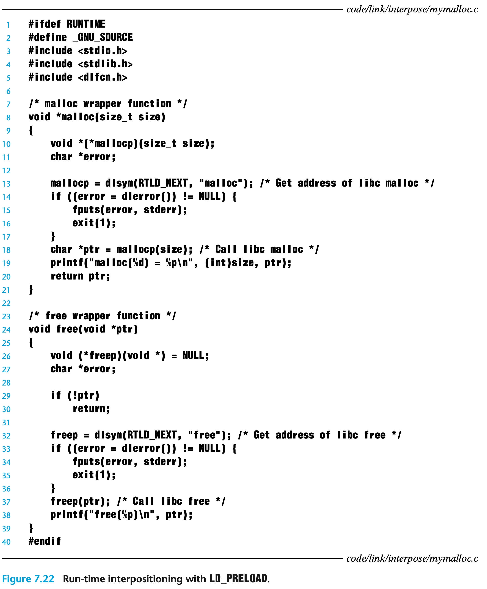

Figure 7.22 shows the wrappers for `malloc` and `free`. In each wrapper, the call to `dlsym` returns the pointer to the target libc function. The wrapper then calls the target function, prints a trace, and returns.

Here is how to build the shared library that contains the wrapper functions:

```c
linux> gcc -DRUNTIME -shared -fpic -o mymalloc.so mymalloc.c -ldl
```

Here is how to compile the main program:

```c
linux> gcc -o intr int.c
```

Here is how to run the program from the bash shell:

```c
linux> LD_PRELOAD="./mymalloc.so" ./intr
```

