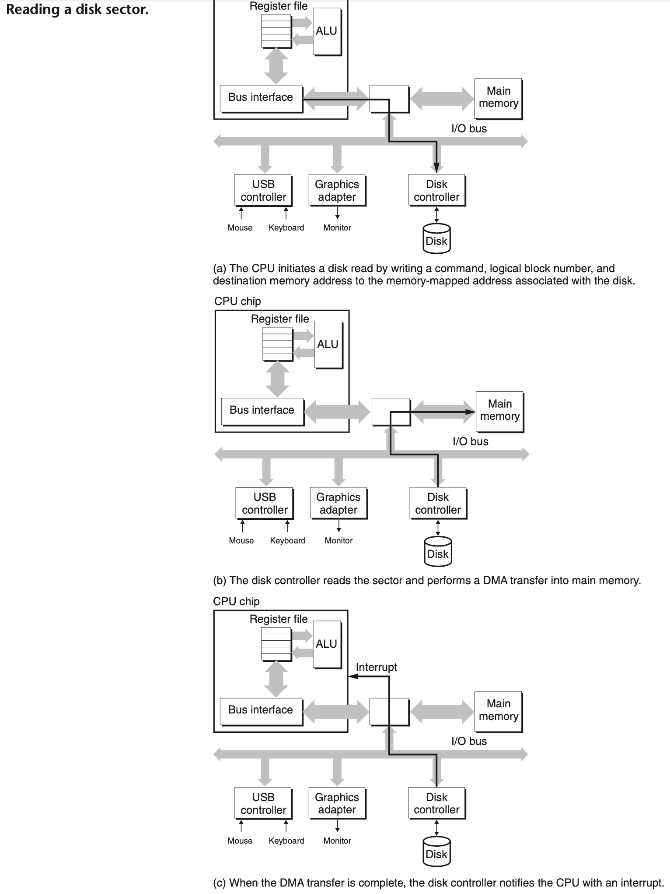

## Memory Hierarchy

### Storage 

#### Random Access Memory

##### Disk Geometry

Disks are constructed from *platters*. Each platter consists of two sides, or *surfaces*, that are coated with magnetic recording material.Figure 6.9(a) shows the geometry of a typical disk surface. 

- Each surface consists of a collection of concentric rings called *tracks*. 
- Each track is partitioned into a collection of *sectors*. 
- Each sector contains an equal number of data bits (typically 512 bytes) encoded in the magnetic material on the sector. Sectors are separated by *gaps* where no data bits are stored. Gaps store formatting bits that identify sectors.

A rotating *spindle* in the center of the platter spins the platter at a fixed *rotational rate*, typically between 5,400 and 15,000 *revolutions per minute (RPM)*. A disk consists of one or more platters stacked on top of each other and encased in a sealed package, as shown in Figure 6.9(b).


##### Disk Capacity

The maximum number of bits that can be recorded by a disk is known as its *maximum capacity*, or simply *capacity*. Disk capacity is determined by the following technology factors:

- *Recording density* (bits/in). The number of bits that can be squeezed into a 1-inch segment of a track.
- *Track density* (tracks/in). The number of tracks that can be squeezed into a 1-inch segment of the radius extending from the center of the platter.
- *Areal density* (bits/in2). The product of the recording density and the track density.

The original disks partitioned every track into the same number of sectors, which was determined by the number of sectors that could be recorded on the innermost track. To maintain a fixed number of sectors per track, the sectors were spaced farther apart on the outer tracks.

The modern high-capacity disks use a technique known as *multiple zone recording*, where the set of cylinders is partitioned into disjoint subsets known as *recording zones*. Each zone consists of a contiguous collection of cylinders. Each track in each cylinder in a zone has the same number of sectors, which is determined by the number of sectors that can be packed into the innermost track of the zone.

The capacity of a disk is given by the following formula:
$$
Capacity = \frac{\#bytes} {sector}× \frac{average\ \# sectors} {\# tracks} × \frac{\#tracks}{surface}× \frac{\#surfaces}{platter} × \frac{\# platters}{disk}
$$

> _**Note**_: Unfortunately, the meanings of prefixes such as kilo (K), mega (M), giga (G), and tera (T) depend on the context. For measures that relate to the capacity of DRAMs and SRAMs, typically K = $2^{10}$, M = $2^{20}$, G = 2$^{30}$, and T = $2^{40}$. For measures related to the capacity of I/O devices such as disks and networks, typically K = $10^3$, M = $10^6$, G = $10^9$, and T = $10^{12}$. 

##### Disk Operation


Disks read and write bits stored on the magnetic surface using a *read/write head* connected to the end of an *actuator arm*, as shown in Figure 6.10(a).

By moving the arm back and forth along its radial axis, the drive can position the head over any track on the surface. This mechanical motion is known as a *seek*. Disks with multiple platters have a separate read/write head for each surface, as shown in Figure 6.10(b). The heads are lined up vertically and move in unison. At any point in time, all heads are positioned on the same cylinder.

Disks read and write data in sector-size blocks. The *access time* for a sector has three main components: *seek time*, *rotational latency*, and *transfer time:*

- *Seek time.* To read the contents of some target sector, the arm first positions the head over the track that contains the target sector. The time required to move the arm is called the *seek time*. 

  - The seek time, $T_{seek}$, depends on the previous position of the head and the speed that the arm moves across the surface. 
  - The average seek time in modern drives, $T_{avg\ seek}$, measured by taking the mean of several thousand seeks to random sectors, is typically on the order of 3 to 9 ms. 
  - The maximum time for a single seek, $T_{max\ seek}$, can be as high as 20 ms.

- *Rotational latency.* Once the head is in position over the track, the drive waits for the first bit of the target sector to pass under the head. The performance of this step depends on both the position of the surface when the head arrives at the target track and the rotational speed of the disk. In the worst case, the head just misses the target sector and waits for the disk to make a full rotation. Thus, the maximum rotational latency, in seconds, is given by $T_{max\ rotation} = \frac{1}{RPM} × \frac{60\ secs}{1\ min}$

  The average rotational latency, $T_{avg\ rotation}$, is simply half of $T_{max\ rotation}$

- *Transfer time.* When the first bit of the target sector is under the head, the drive can begin to read or write the contents of the sector. The transfer time for one sector depends on the rotational speed and the number of sectors per track. Thus, we can roughly estimate the average transfer time for one sector in seconds as $T_{avg\ transfer} = \frac{1}{RPM} × \frac{1}{(average\ \# \ sectors/track)} × \frac{60\ secs}{1\  min}$

For example, consider a disk with the following parameters:

| Parameter                       | Value     |
| ------------------------------- | --------- |
| Rotational rate                 | 7,200 RPM |
| $T_{avg\ seek}$                 | 9 ms      |
| Average number of sectors/track | 400       |

For this disk, the average rotational latency (in ms) is
$$
\begin{equation}
\begin{split}
T_{avg\ rotation} & = 1/2 × T_{max\ rotation} \\
 & = 1/2 × (60 secs/7,200 RPM) × 1,000 ms/sec \\
 & ≈ 4 ms
\end{split}
\end{equation}
$$
The average transfer time is
$$
\begin{equation}
\begin{split}
T_{avg\ transfer} & = 60/7,200 RPM × 1,000 ms/sec × \frac{1}{400} sectors/track \\
 & ≈ 0.02 ms
\end{split}
\end{equation}
$$
Putting it all together, the total estimated access time is
$$
\begin{equation}
\begin{split}
T_{access} & = T_{avg\ seek} + T_{avg\ rotation} + T_{avg\ transfer} \\
& = 9 ms + 4 ms + 0.02 ms \\
& = 13.02 ms
\end{split}
\end{equation}
$$
This example illustrates some important points:

- The time to access the 512 bytes in a disk sector is dominated by the seek time and the rotational latency. Accessing the first byte in the sector takes a long time, but the remaining bytes are essentially free.
- Since the seek time and rotational latency are roughly the same, twice the seek time is a simple and reasonable rule for estimating disk access time.
- The access time for a 64-bit word stored in SRAM is roughly 4 ns, and 60 ns for DRAM. Thus, the time to read a 512-byte sector-size block from memory is roughly 256 ns for SRAM and 4,000 ns for DRAM. The disk access time, roughly 10 ms, is about 40,000 times greater than SRAM, and about 2,500 times greater than DRAM.

##### Logical Disk Blocks

To hide the complexity geometries from the operating system, modern disks present a simpler view of their geometry as a sequence of B sector-size *logical blocks*, numbered 0, 1, . . . , B − 1. A small hardware/firmware device in the disk package, called the *disk controller*, maintains the mapping between logical block numbers and actual (physical) disk sectors.

When the operating system wants to perform an I/O operation such as reading a disk sector into main memory, it sends a command to the disk controller asking it to read a particular logical block number. Firmware on the controller performs a fast table lookup that translates the logical block number into a *(surface, track, sector)* triple that uniquely identifies the corresponding physical sector. Hardware on the controller interprets this triple to move the heads to the appropriate cylinder, waits for the sector to pass under the head, gathers up the bits sensed by the head into a small memory buffer on the controller, and copies them into main memory.

> _**Note**_: Before a disk can be used to store data, it must be *formatted* by the disk controller. This involves filling in the gaps between sectors with information that identifies the sectors, identifying any cylinders with surface defects and taking them out of action, and setting aside a set of cylinders in each zone as spares that can be called into action if one or more cylinders in the zone goes bad during the lifetime of the disk. The *formatted capacity* quoted by disk manufacturers is less than the maximum capacity because of the existence of these spare cylinders.

##### Connecting I/O Devices


Input/output (I/O) devices such as graphics cards, monitors, mice, keyboards, and disks are connected to the CPU and main memory using an *I/O bus*.  Unlike the system bus and memory buses, which are CPU-specific, I/O buses are designed to be independent of the underlying CPU. Figure 6.11 shows a representative I/O bus structure that connects the CPU, main memory, and I/O devices.

Although the I/O bus is slower than the system and memory buses, it can accommodate a wide variety of third-party I/O devices. For example, the bus in Figure 6.11 has three different types of devices attached to it.

- A *Universal Serial Bus (USB)* controller is a conduit for devices attached to a USB bus, which is a wildly popular standard for connecting a variety of peripheral I/O devices, including keyboards, mice and so on. USB 3.0 buses have a maximum bandwidth of 625 MB/s. USB 3.1 buses have a maximum bandwidth of 1,250 MB/s.

- A *graphics card* (or *adapter*) contains hardware and software logic that is responsible for painting the pixels on the display monitor on behalf of the CPU.
- A *host bus adapter* that connects one or more disks to the I/O bus using a communication protocol defined by a particular *host bus interface*. The two most popular such interfaces for disks are *SCSI* and *SATA*. SCSI disks are typically faster and more expensive than SATA drives. A SCSI host bus adapter (often called a *SCSI controller*) can support multiple disk drives, as opposed to SATA adapters, which can only support one drive.

> _**Note**_: The I/O bus in Figure 6.11 is a simple abstraction. It is based on the *peripheral component interconnect (PCI)* bus which each device in the system shares the bus, and only one device at a time can access these wires. In modern systems, the shared PCI bus has been replaced by a *PCI express* (PCIe) bus, which is a set of high-speed serial, point-to-point links connected by switches. A PCIe bus, with a maximum throughput of 16 GB/s, is an order of magnitude faster than a PCI bus, which has a maximum throughput of 533 MB/s. Except for measured I/O performance, the differences between the different bus designs are not visible to application programs.

Additional devices such as *network adapters* can be attached to the I/O bus by plugging the adapter into empty *expansion slots* on the motherboard that provide a direct electrical connection to the bus.

##### Accessing Disks



When a CPU reads data from a disk, the CPU issues commands to I/O devices using a technique called *memory- mapped I/O* (Figure 6.12(a)). In a system with memory-mapped I/O, a block of addresses in the address space is reserved for communicating with I/O devices. Each of these addresses is known as an *I/O port*. Each device is associated with (or mapped to) one or more ports when it is attached to the bus.

Suppose that the disk controller is mapped to port `0xa0`. Then the CPU might initiate a disk read by executing three store instructions to address `0xa0`: 

1. The first of these instructions sends a command word that tells the disk to initiate a read, along with other parameters such as whether to interrupt the CPU when the read is finished. 
2. The second instruction indicates the logical block number that should be read. 
3. The third instruction indicates the main memory address where the contents of the disk sector should be stored.

After the disk controller receives the read command from the CPU, it translates the logical block number to a sector address, reads the contents of the sector, and transfers the contents directly to main memory, without any intervention from the CPU (Figure 6.12(b)). A device performs a read or write bus transaction on its own, without any involvement of the CPU, is known as *direct memory access* (DMA). The transfer of data is known as a *DMA transfer*.

After the DMA transfer is complete and the contents of the disk sector are safely stored in main memory, the disk controller notifies the CPU by sending an interrupt signal to the CPU (Figure 6.12(c)). The basic idea is that an interrupt signals an external pin on the CPU chip. This causes the CPU to stop what it is currently working on and jump to an operating system routine. The routine records the fact that the I/O has finished and then returns control to the point where the CPU was interrupted.

#### Solid State Disks


A solid state disk (SSD) is a storage technology, based on flash memory. Figure 6.13 shows the basic idea. An SSD package plugs into a standard disk slot on the I/O bus and behaves like any other disk, processing requests from the CPU to read and write logical disk blocks. 

An SSD package consists of:

1. one or more flash memory chips, which replace the mechanical drive in a conventional rotating disk
2. a *flash translation layer*, which is a hardware/firmware device that plays the same role as a disk controller, translating requests for logical blocks into accesses of the underlying physical device.

As shown in Figure 6.13, a flash memory consists of a sequence of B *blocks*, where each block consists of P pages. Typically, pages are 512 bytes to 4 KB in size, and a block consists of 32–128 pages, with total block sizes ranging from 16 KB to 512 KB. Data are read and written in units of pages. 

A page can be written only after the entire block to which it belongs has been *erased* (typically, this means that all bits in the block are set to 1). However, once a block is erased, each page in the block can be written once with no further erasing. A block wears out after roughly 100,000 repeated writes. Once a block wears out, it can no longer be used.

Figure 6.14 shows the performance characteristics of a typical SSD. 


Random writes are slower for two reasons.

1. Erasing a block takes a relatively long time, on the order of 1 ms, which is more than an order of magnitude longer than it takes to access a page. 
2. If a write operation attempts to modify a page p that contains existing data (i.e., not all ones), then any pages in the same block with useful data must be copied to a new (erased) block before the write to page p can occur. 

SSDs have a number of advantages over rotating disks. 

- They are built of semiconductor memory, with no moving parts, and thus have much faster random access times than rotating disks
- use less power
- are more rugged. 

However, there are some disadvantages. 

- because flash blocks wear out after repeated writes, SSDs have the potential to wear out as well. *Wear-leveling* logic in the flash translation layer attempts to maximize the lifetime of each block by spreading erasures evenly across all blocks.
- SSDs are about 30 times more expensive per byte than rotating disks, and thus the typical storage capacities are significantly less than rotating disks.

### Locality

Well-written computer programs tend to exhibit good *locality*. That is, they tend to reference data items that are near other recently referenced data items. This tendency, known as the *principle of locality*, is an enduring concept that has enormous impact on the design and performance of hardware and software systems.

Locality is typically described as having two distinct forms: *temporal locality* and *spatial locality*.

- In a program with good temporal locality, a memory location that is referenced once is likely to be referenced again multiple times in the near future.
- In a program with good spatial locality, if a memory location is referenced once, then the program is likely to reference a nearby memory location in the near future.

Programmers should understand the principle of locality because, in general, *programs with good locality run faster than programs with poor locality*. All levels of modern computer systems, from the hardware, to the operating system, to application programs, are designed to exploit locality. 

- At the hardware level, the principle of locality allows computer designers to speed up main memory accesses by introducing small fast memories known as *cache memories* that hold blocks of the most recently referenced instructions and data items. 
- At the operating system level, the principle of locality allows the system to use the main memory as a cache of the most recently referenced chunks of the virtual address space. Similarly, the operating system uses main memory to cache the most recently used disk blocks in the disk file system. 
- The principle of locality also plays a crucial role in the design of application programs. For example, Web browsers exploit temporal locality by caching recently referenced documents on a local disk. High-volume Web servers hold recently requested documents in front-end disk caches that satisfy requests for these documents without requiring any intervention from the server.

#### Locality of References to Program Data

A function visits each element of a vector sequentially is said to have a *stride-1 reference pattern* or *sequential reference patterns*(with respect to the element size). Visiting every kth element of a contiguous vector is called a *stride-*k *reference pattern*. Stride-1 reference patterns are a common and important source of spatial locality in programs. In general, as the stride increases, the spatial locality decreases.

```c
//good spatial locality
int sumarrayrows(int a[M][N])
{
  int i, j, sum = 0;
  for (i = 0; i < M; i++){
    for (j = 0; j < N;j++){
      sum += a[i][j];
    }
  }
  return sum;
}
//bad spatial locality
int sumarrayrows(int a[M][N])
{
  int i, j, sum = 0;
  for (j = 0; j < N;j++){
    for (i = 0; i < M; i++){
      sum += a[i][j];
    }
  }
  return sum;
}
```

### The Memory Hierarchy


Figure 6.21 shows a typical memory hierarchy. In general, the storage devices get slower, cheaper, and larger as we move from higher to lower *levels*.

#### Caching in the Memory Hierarchy

In general, a *cache* is a small, fast storage device that acts as a staging area for the data objects stored in a larger, slower device. The process of using a cache is known as *caching* .

The central idea of a memory hierarchy is that for each k, the faster and smaller storage device at level k serves as a cache for the larger and slower storage device at level k + 1.  In other words, each level in the hierarchy caches data objects from the next lower level. 


Figure 6.22 shows the general concept of caching in a memory hierarchy. The storage at level k + 1 is partitioned into contiguous chunks of data objects called *blocks*. Each block has a unique address or name that distinguishes it from other blocks. Blocks can be either fixed size (the usual case) or variable size. At any point in time, the cache at level k contains copies of a subset of the blocks from level k + 1. Figure 6.22, the cache at level k has room for four blocks and currently contains copies of blocks 4, 9, 14, and 3.

Data are always copied back and forth between level k and level k + 1 in block-size *transfer units*. It is important to realize that while the block size is fixed between any particular pair of adjacent levels in the hierarchy, other pairs of levels can have different block sizes.

**Cache Hits**

When a program needs a particular data object d from level k + 1, it first looks for d in one of the blocks currently stored at level k. If d happens to be cached at level k, then we have what is called a *cache hit*.

**Cache Misses**

If, on the other hand, the data object d is not cached at level k, then we have what is called a *cache miss*. When there is a miss, the cache at level k fetches the block containing d from the cache at level k + 1, possibly overwriting an existing block if the level k cache is already full.

This process of overwriting an existing block is known as *replacing* or *evicting* the block. The block that is evicted is sometimes referred to as a *victim block*. The decision about which block to replace is governed by the cache’s *replacement policy*. For example, a cache with a *least recently used (LRU)* replacement policy would choose the block that was last accessed the furthest in the past.

**Kinds of Cache Misses**

- If the cache at level k is empty, then any access of any data object will miss. An empty cache is sometimes referred to as a *cold cache*, and misses of this kind are called *compulsory misses* or *cold misses*.

- Whenever there is a miss, the cache at level k must implement some *placement policy* that determines where to place the block it has retrieved from level k + 1. Hardware caches typically implement a simpler placement policy that restricts a particular block at level k + 1 to a small subset (sometimes a singleton) of the blocks at level k. For example, in Figure 6.22, we might decide that a block i at level k + 1 must be placed in block (i mod 4) at level k. For example, blocks 0, 4, 8, and 12 at level k + 1 would map to block 0 at level k; blocks 1, 5, 9, and 13 would map to block 1; and so on.
  - Restrictive placement policies of this kind lead to a type of miss known as a *conflict miss*, which the program try to access 0 and 8 consecutively but 8 was replaced to 0 when program accessing 0 and 0 was replaced to 8 when program accessing 8.
- Programs often run as a sequence of phases (e.g., loops) where each phase accesses some reasonably constant set of cache blocks. For example, a nested loop might access the elements of the same array over and over again. This set of blocks is called the *working set* of the phase. When the size of the working set exceeds the size of the cache, the cache will experience what are known as *capacity misses*. In other words, the cache is just too small to handle this particular working set.

**Cache Management**

The essence of the memory hierarchy is that the storage device at each level is a cache for the next lower level. At each level, some form of logic must *manage* the cache. By this we mean that something has to partition the cache storage into blocks, transfer blocks between different levels, decide when there are hits and misses, and then deal with them. The logic that manages the cache can be hardware, software, or a combination of the two.

- The compiler manages the register file, the highest level of the cache hierarchy. It decides when to issue loads when there are misses, and determines which register to store the data in. 
- The caches at levels L1, L2, and L3 are managed entirely by hardware logic built into the caches.
- In a system with virtual memory, the DRAM main memory serves as a cache for data blocks stored on disk, and is managed by a combination of operating system software and address translation hardware on the CPU. 

To summarize, memory hierarchies based on caching work because slower storage is cheaper than faster storage and because programs tend to exhibit locality:

- *Exploiting temporal locality.* Because of temporal locality, the same data objects are likely to be reused multiple times. Once a data object has been copied into the cache on the first miss, we can expect a number of subsequent hits on that object. Since the cache is faster than the storage at the next lower level, these subsequent hits can be served much faster than the original miss.

- *Exploiting spatial locality.* Blocks usually contain multiple data objects. Because of spatial locality, we can expect that the cost of copying a block after a miss will be amortized by subsequent references to other objects within that block.

### Cache Memories

Consider a computer system where each memory address has m bits that form M = $2^m$ unique addresses. As illustrated in Figure 6.25(a), a cache for such a machine is organized as an array of S = $2^s$ *cache sets*. Each set consists of E *cache lines*. Each line consists of a data *block* of B = $2^b$ bytes, a *valid bit* that indicates whether or not the line contains meaningful information, and t = m − (b + s) *tag bits* (a subset of the bits from the current block’s memory address) that uniquely identify the block stored in the cache line.


In general, a cache’s organization can be characterized by the tuple (S, E, B, m). The size (or capacity) of a cache, C, is stated in terms of the aggregate size of all the blocks. The tag bits and valid bit are not included. Thus, C = S × E × B.

When the CPU is instructed by a load instruction to read a word from address A of main memory, it sends address A to the cache. If the cache is holding a copy of the word at address A, it sends the word immediately back to the CPU. 

The parameters S and B induce a partitioning of the m address bits into the three fields shown in Figure 6.25(b). 

- The s *set index bits* indicates which set the word belongs to, starting from 0.
- The t *tag bits* indicates which line in the set contains the word.
- The b *block offset bits* give us the offset of the word in the B-byte data block.

A line in the set contains the word if and only if the valid bit is set and the tag bits in the line match the tag bits in the given address. 


Figure 6.26 summarizes all the symbols

The process that a cache goes through of determining whether a request is a hit or a miss and then extracting the requested word consists of three steps: 

1. *set selection*: the cache extracts the s set index bits from the middle of the address for w. These bits are interpreted as an unsigned integer that corresponds to a set number.
2. *line matching*: determine if a copy of the word w is stored in one of the cache lines contained in set i. A copy of w is contained in the line if and only if the valid bit is set and the tag in the cache line matches the tag in the address of w.
3. *word extraction*: the block offset bits provide us with the offset of the first byte in the desired word.

If the cache misses, then it needs to retrieve the requested block from the next level in the memory hierarchy and store the new block in one of the cache lines of the set indicated by the set index bits. In general, if the set is full of valid cache lines, then one of the existing lines must be evicted.

> _**Note**_: Why caches use the middle bits for the set index instead of the high-order bits. If the high-order bits are used as an index, then some contiguous memory blocks will map to the same cache set.

#### Direct-Mapped Caches

Caches are grouped into different classes based on E, the number of cache lines per set. A cache with exactly one line per set (E = 1) is known as a *direct-mapped* cache (see Figure 6.27). 


#### Set Associative Caches

A *set associative cache* relaxes this constraint so that each set holds more than one cache line. A cache with 1 < E < C/B is often called an E-way set associative cache.

Figure 6.32 shows the organization of a two-way set associative cache.


A conventional memory is an array of values that takes an address as input and returns the value stored at that address. An *associative memory*, on the other hand, is an array of (key, value) pairs that takes as input the key and returns a value from one of the (key, value) pairs that matches the input key. Thus, we can think of each set in a set associative cache as a small associative memory where the keys are the concatenation of the tag and valid bits, and the values are the contents of a block.


Figure 6.34 shows the basic idea of line matching in an associative cache. An important idea here is that any line in the set can contain any of the memory blocks that map to that set. So the cache must search each line in the set for a valid line whose tag matches the tag in the address. If the cache finds such a line, then we have a hit and the block offset selects a word from the block, as before.

If it's cached miss and the set is full. The replacement policy will take in-charge to decide which line to replace.

- A *least frequently used (LFU)* policy will replace the line that has been referenced the fewest times over some past time window. 
- A *least recently used (LRU)* policy will replace the line that was last accessed the furthest in the past. 

All of these policies require additional time and hardware. But as we move further down the memory hierarchy, away from the CPU, the cost of a miss becomes more expensive and it becomes more worthwhile to minimize misses with good replacement policies.

#### Fully Associative Caches

A *fully associative cache* consists of a single set (i.e., E = C/B) that contains all of the cache lines. Figure 6.35 shows the basic organization.


Because the cache circuitry must search for many matching tags in parallel, it is difficult and expensive to build an associative cache that is both large and fast. As a result, fully associative caches are only appropriate for small caches, such as the translation lookaside buffers (TLBs) in virtual memory systems that cache page table entries.

Suppose we write a word w that is already cached (a *write hit*). After the cache updates its copy of w, what does it do about updating the copy of w in the next lower level of the hierarchy? 

- The simplest approach, known as *write-through*, is to immediately write w’s cache block to the next lower level. 
  - While simple, write-through has the disadvantage of causing bus traffic with every write. 
- Another approach, known as *write-back*, defers the update as long as possible by writing the updated block to the next lower level only when it is evicted from the cache by the replacement algorithm. 
  - Because of locality, write-back can significantly reduce the amount of bus traffic
  - but it has the disadvantage of additional complexity. The cache must maintain an additional *dirty bit* for each cache line that indicates whether or not the cache block has been modified.

To deal with write misses. 

- One approach, known as *write-allocate*, loads the corresponding block from the next lower level into the cache and then updates the cache block.
  - Write-allocate tries to exploit spatial locality of writes, but it has the disadvantage that every miss results in a block transfer from the next lower level to the cache. 
- The alternative, known as *no-write-allocate*, bypasses the cache and writes the word directly to the next lower level. 

Write-through caches are typically no-write-allocate. Write-back caches are typically write-allocate.

Optimizing caches for writes is a subtle and difficult issue, and we are only scratching the surface here. The details vary from system to system and are often proprietary and poorly documented. To the programmer trying to write reasonably cache-friendly programs, **we suggest adopting a mental model that assumes write-back, write-allocate caches.**

#### Real Cache Hierarchy

A cache that holds instructions only is called an *i-cache*. A cache that holds program data only is called a *d-cache*. A cache that holds both instructions and data is known as a *unified cache*. Modern processors include separate i-caches and d-caches. There are a number of reasons for this.

- the processor can read an instruction word and a data word at the same time.
- I-caches are typically read-only, and thus simpler.
- The two caches are often optimized to different access patterns and can have different block sizes, associativities, and capacities. 
- ensures that data accesses do not create conflict misses with instruction accesses, and vice versa, at the cost of a potential increase in capacity misses.

Figure 6.38 shows the cache hierarchy for the Intel Core i7 processor.


Figure 6.39 summarizes the basic characteristics of the Core i7 caches.


#### Performance Impact of Cache Parameters

Cache performance is evaluated with a number of metrics:

- *Miss rate.* The fraction of memory references during the execution of a program, or a part of a program, that miss. It is computed as $\frac{\#\ misses}{\#\ references}$.
- *Hit rate.* The fraction of memory references that hit. It is computed as 1 − *miss rate*.
- *Hit time.* The time to deliver a word in the cache to the CPU, including the time for set selection, line identification, and word selection. Hit time is on the order of several clock cycles for L1 caches.
- *Miss penalty.* Any additional time required because of a miss. The penalty for L1 misses served from L2 is on the order of 10 cycles; from L3, 50 cycles; and from main memory, 200 cycles.

### Writing Cache-Friendly Code

Programs with better locality will tend to have lower miss rates, and programs with lower miss rates will tend to run faster than programs with higher miss rates. Thus, good programmers should always try to write code that is cache friendly, in the sense that it has good locality. Here is the basic approach we use to try to ensure that our code is cache friendly.

1. *Make the common case go fast.* Programs often spend most of their time in a few core functions. These functions often spend most of their time in a few loops. So focus on the inner loops of the core functions and ignore the rest.
2. *Minimize the number of cache misses in each inner loop.* All other things being equal, such as the total number of loads and stores, loops with better miss rates will run faster.

### The Impact of Caches on Program Performance

#### Rearranging Loops to Increase Spatial Locality

Figure 6.44 shows different versions of matrix multiply function.


Figure 6.45 summarizes the results of our inner-loop analysis.


1. The inner loops of the class AB routines (Figure 6.44(a) and (b)) scan a row of array A with a stride of 1. Since each cache block holds four 8-byte words, the miss rate for A is 0.25 misses per iteration. On the other hand, the inner loop scans a column of B with a stride of n. Since n is large, each access of array B results in a miss, for a total of 1.25 misses per iteration.

2. The inner loops in the class AC routines (Figure 6.44(c) and (d)) have some problems. Each iteration performs two loads and a store (as opposed to the class AB routines, which perform two loads and no stores). Second, the inner loop scans the columns of A and C with a stride of n. The result is a miss on each load, for a total of two misses per iteration. Notice that interchanging the loops has decreased the amount of spatial locality compared to the class AB routines.
3. The B C routines (Figure 6.44(e) and (f)) present an interesting trade-off: With two loads and a store, they require one more memory operation than the AB routines. On the other hand, since the inner loop scans both B and C row-wise with a stride-1 access pattern, the miss rate on each array is only 0.25 misses per iteration, for a total of 0.50 misses per iteration.

Figure 6.46 summarizes the performance of different versions of matrix mul- tiply on a Core i7 system. The graph plots the measured number of CPU cycles per inner-loop iteration as a function of array size (n).


There are a number of interesting points to notice about this graph:

- For large values of n, the fastest version runs almost 40 times faster than the slowest version, even though each performs the same number of floating-point arithmetic operations.
- Pairs of versions with the same number of memory references and misses per iteration have almost identical measured performance.
- The two versions with the worst memory behavior, in terms of the number of accesses and misses per iteration, run significantly slower than the other four versions, which have fewer misses or fewer accesses, or both.
- Miss rate, in this case, is a better predictor of performance than the total number of memory accesses.
- For large values of n, the performance of the fastest pair of versions (kij and ikj) is constant. Even though the array is much larger than any of the SRAM cache memories, the prefetching hardware is smart enough to recognize the stride-1 access pattern, and fast enough to keep up with memory accesses in the tight inner loop. This is a stunning accomplishment by the Intel engineers who designed this memory system, providing even more incentive for programmers to develop programs with good spatial locality.

#### Exploiting Locality in Your Programs

Programs with good locality access most of their data from fast cache memories. Programs with poor locality access most of their data from the relatively slow DRAM main memory. Programmers who understand the nature of the memory hierarchy can exploit this understanding to write more efficient programs, regardless of the specific memory system organization. In particular, we recommend the following techniques:

- Focus your attention on the inner loops, where the bulk of the computations and memory accesses occur.
- Try to maximize the spatial locality in your programs by reading data objects sequentially, with stride 1, in the order they are stored in memory.
- Try to maximize the temporal locality in your programs by using a data object as often as possible once it has been read from memory.

## Linking