## Linking

Linking is the process of collecting and combining various pieces of code and data into a single file that can be *loaded* (copied) into memory and executed.

Linking can be performed at *compile time*, when the source code is translated into machine code; at *load time*, when the program is loaded into memory and executed by the *loader*; and even at *run time*, by application programs. On modern systems, linking is performed automatically by programs called *linkers*.

With the following command to the shell:

```bash
linux> gcc -Og -o prog main.c sum.c
```

Figure 7.2 summarizes the activities of the driver as it translates the example program from an ASCII source file into an executable object file.


### Static Linking

*Static linkers* such as the Linux ld program take as input a collection of relocatable object files and command-line arguments and generate as output a fully linked executable object file that can be loaded and run.

To build the executable, the linker must perform two main tasks:

1. *Symbol resolution.* Object files define and reference *symbols*, where each symbol corresponds to a function, a global variable, or a *static variable* (i.e., any C variable declared with the static attribute). The purpose of symbol resolution is to associate each symbol *reference* with exactly one symbol *definition*.
2. *Relocation.* Compilers and assemblers generate code and data sections that start at address 0. The linker *relocates* these sections by associating a memory location with each symbol definition, and then modifying all of the references to those symbols so that they point to this memory location. The linker blindly performs these relocations using detailed instructions, generated by the assembler, called *relocation entries*.

### Object Files

Object files come in three forms:

1. *Relocatable object file.* Contains binary code and data in a form that can be combined with other relocatable object files at compile time to create an executable object file.

2. *Executable object file.* Contains binary code and data in a form that can be copied directly into memory and executed.

3. *Shared object file.* A special type of relocatable object file that can be loaded into memory and linked dynamically, at either load time or run time.

Compilers and assemblers generate relocatable object files (including shared object files). Linkers generate executable object files. Object files are organized according to specific *object file formats*, which vary from system to system. Modern x86-64 Linux and Unix systems use *Executable and Linkable Format (ELF)*. Although our discussion will focus on ELF, the basic concepts are similar, regardless of the particular format.

### Relocatable Object Files


Figure 7.3 shows the format of a typical ELF relocatable object file. 

The *ELF header* begins with 

- a 16-byte sequence that describes the word size and byte ordering of the system that generated the file.
- The rest of the ELF header contains information that allows a linker to parse and interpret the object file. This includes
  - the size of the ELF header
  - the object file type (e.g., relocatable, executable, or shared)
  - the machine type (e.g., x86-64)
  - the file offset of the section header table
  - the size and number of entries in the section header table
    - The locations and sizes of the various sections are described by the *section header table*, which contains a fixed-size entry for each section in the object file.

A typical ELF relocatable object file contains the following sections:

- **.text** The machine code of the compiled program.

- **.rodata** Read-only data such as the format strings in printf statements, and

  jump tables for switch statements.

- **.data** *Initialized* global and static C variables. Local C variables are maintained at run time on the stack and do *not* appear in either the *.data* or *.bss* sections.

- **.bss** *Uninitialized* global and static C variables, along with any global or static variables that are initialized to zero. This section occupies no actual space in the object file; it is merely a placeholder. Object file formats distinguish between initialized and uninitialized variables for space efficiency: uninitialized variables do not have to occupy any actual disk space in the object file. At run time, these variables are allocated in memory with an initial value of zero.

- **.symtab** A *symbol table* with information about functions and global variables that are defined and referenced in the program. Some programmers mistakenly believe that a program must be compiled with the -g option to get symbol table information. However, unlike the symbol table inside a compiler, the .symtab symbol table does not contain entries for local variables.

- **.rel.text** A list of locations in the .text section that will need to be modified when the linker combines this object file with others. In general, any instruction that calls an external function or references a global variable will need to be modified.

- **.rel.data** Relocation information for any global variables that are referenced or defined by the module. In general, any initialized global variable whose initial value is the address of a global variable or externally defined function will need to be modified.

- **.debug** A debugging symbol table with entries for local variables and typedefs defined in the program, global variables defined and referenced in the program, and the original C source file. It is only present if the compiler driver is invoked with the -g option.

- **.line** A mapping between line numbers in the original C source program and machine code instructions in the .text section. It is only present if the compiler driver is invoked with the -g option.

- **.strtab** A string table for the symbol tables in the .symtab and .debug sections and for the section names in the section headers. A string table is a sequence of null-terminated character strings.

### Symbols and Symbol Tables

Each relocatable object module, m, has a symbol table that contains information about the symbols that are defined and referenced by m. In the context of a linker, there are three different kinds of symbols:

- *Global symbols* that are defined by module m and that can be referenced by other modules. Global linker symbols correspond to *nonstatic* C functions and global variables.
- Global symbols that are referenced by module m but defined by some other module. Such symbols are called *externals* and correspond to nonstatic C functions and global variables that are defined in other modules.
- *Local symbols* that are defined and referenced exclusively by module m. These correspond to static C functions and global variables that are defined with the static attribute. These symbols are visible anywhere within module m, but cannot be referenced by other modules.

An ELF symbol table is contained in the .symtab section. It contains an array of entries. Figure 7.4 shows the format of each entry.


### Symbol Resolution

When the compiler encounters a symbol (either a variable or function name) that is not defined in the current module, it assumes that it is defined in some other module, generates a linker symbol table entry, and leaves it for the linker to handle. If the linker is unable to find a definition for the referenced symbol in any of its input modules, it prints an (often cryptic) error message and terminates. 

> <center><strong>Mangling of linker symbols in C++ and Java</strong></center>
>
> The compiler encodes each unique method and parameter list combination into a unique name for the linker. This encoding process is called *mangling*, and the inverse process is known as *demangling*.

#### How Linkers Resolve Duplicate Symbol Names

At compile time, the compiler exports each global symbol to the assembler as either *strong* or *weak*, and the assembler encodes this information implicitly in the symbol table of the relocatable object file. Functions and initialized global variables get strong symbols. Uninitialized global variables get weak symbols.

Linux linkers use the following rules for dealing with duplicate symbol names:

**Rule 1**: Multiple strong symbols with the same name are not allowed.

**Rule 2**: Given a strong symbol and multiple weak symbols with the same name, choose the strong symbol.

**Rule 3**: Given multiple weak symbols with the same name, choose any of the weak symbols.

When in doubt, invoke the linker with a flag such as the `gcc -fno-common` flag, which triggers an error if it encounters multiply-defined global symbols. Or use the `-Werror` option, which turns all warnings into errors.

#### Linking with Static Libraries

In practice, all compilation systems provide a mechanism for packaging related object modules into a single file called a *static library*, which can then be supplied as input to the linker. When it builds the output executable, the linker copies only the object modules in the library that are referenced by the application program.

#### How Linkers Use Static Libraries to Resolve References

During the symbol resolution phase, the linker scans the relocatable object files and archives left to right in the same sequential order that they appear on the compiler driver’s command line. (The driver automatically translates any .c files on the command line into .o files.) During this scan, the linker maintains a set E of relocatable object files that will be merged to form the executable, a set U of unresolved symbols (i.e., symbols referred to but not yet defined), and a set D of symbols that have been defined in previous input files. Initially, E, U, and D are empty.

- For each input file f on the command line, the linker determines if f is an object file or an archive.
  - If f is an object file, the linker adds f to E, updates U and D to reflect the symbol definitions and references in f , and proceeds to the next input file.
  - If f is an archive, the linker attempts to match the unresolved symbols in U against the symbols defined by the members of the archive.
- If U is nonempty when the linker finishes scanning the input files on the command line, it prints an error and terminates. Otherwise, it merges and relocates the object files in E to build the output executable file.

This algorithm can result in some baffling link-time errors because the ordering of libraries and object files on the command line is significant. If the library that defines a symbol appears on the command line before the object file that references that symbol, then the reference will not be resolved and linking will fail. 

For example, consider the following:

```bash
linux> gcc -static ./libvector.a main2.c/tmp/cc9XH6Rp.o: In function ‘main’: /tmp/cc9XH6Rp.o(.text+0x18): undefined reference to ‘addvec’
```

The general rule for libraries is to place them at the end of the command line.

### Relocation

Relocation consists of two steps:

1. *Relocating sections and symbol definitions.* The linker merges all sections of the same type into a new aggregate section of the same type. For example, the *.data* sections from the input modules are all merged into one section that will become the *.data* section for the output executable object file. The linker then assigns run-time memory addresses to the new aggregate sections, to each section defined by the input modules, and to each symbol defined by the input modules. When this step is complete, each instruction and global variable in the program has a unique run-time memory address.
2. *Relocating symbol references within sections.* In this step, the linker modifies every symbol reference in the bodies of the code and data sections so that they point to the correct run-time addresses. To perform this step, the linker relies on data structures in the relocatable object modules known as relocation entries.

#### Relocation Entries

Whenever the assembler encounters a reference to an object whose ultimate location is unknown, it generates a *relocation entry* that tells the linker how to modify the reference when it merges the object file into an executable. Relocation entries for code are placed in **.rel.text*. Relocation entries for data are placed in *.rel.data*.

Figure 7.9 shows the format of an ELF relocation entry.


ELF defines 32 different relocation types, many quite arcane. We are con- cerned with only the two most basic relocation types:

- **R_X86_64_PC32**: Relocate a reference that uses a 32-bit PC-relative address. A PC-relative address is an offset from the current run-time value of the program counter (PC). When the CPU executes an instruction using PC-relative addressing, it forms the *effective address* (e.g., the target of the call instruction) by adding the 32-bit value encoded in the instruction to the current run-time value of the PC, which is always the address of the next instruction in memory.
- **R_X86_64_32**: Relocate a reference that uses a 32-bit absolute address. With absolute addressing, the CPU directly uses the 32-bit value encoded in the instruction as the effective address, without further modifications.

### Executable Object Files

Figure 7.13 shows a typical ELF executable file.

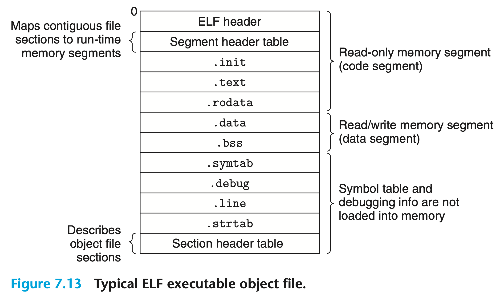

ELF executables are designed to be easy to load into memory, with contiguous chunks of the executable file mapped to contiguous memory segments. This mapping is described by the *program header table*. 

### Loading Executable Object Files

The system invokes *loader* to handle the executable object file. Any Linux program can invoke the loader by calling the `execve` function. The loader copies the code and data in the executable object file from disk into memory and then runs the program by jumping to its first instruction, or *entry point*. This process of copying the program into memory and then running it is known as *loading*.

When the loader runs, it creates a memory image similar to the one shown in Figure 7.15. Guided by the program header table, it copies chunks of the executable object file into the code and data segments. Next, the loader jumps to the program’s entry point, which is always the address of the `_start` function. This function is defined in the system object file `crt1.o` and is the same for all C programs. The `_start` function calls the *system startup function*, `__libc_start_main`, which is defined in `libc.so`. It initializes the execution environment, calls the user-level `main` function, handles its return value, and if necessary returns control to the kernel.


> <center><strong>How do loaders really work</strong></center>
>
> Each program in a Linux system runs in the context of a process with its own virtual address space. When the shell runs a program, the parent shell process forks a child process that is a duplicate of the parent. The child process invokes the loader via the execve system call. The loader deletes the child’s existing virtual memory segments and creates a new set of code, data, heap, and stack segments. The new stack and heap segments are initialized to zero. The new code and data segments are initialized to the contents of the executable file by mapping pages in the virtual address space to page-size chunks of the executable file. Finally, the loader jumps to the `_start` address, which eventually calls the application’s main routine. Aside from some header information, there is no copying of data from disk to memory during loading. The copying is deferred until the CPU references a mapped virtual page, at which point the operating system automatically transfers the page from disk to memory using its paging mechanism.

### Dynamic Linking with Shared Libraries

Static libraries need to be maintained and updated periodically. If application programmers want to use the most recent version of a library, they aware that the library has changed and then explicitly relink their programs against the updated library. Another issue is that almost every C program uses standard I/O functions such as printf and scanf. At run time, the code for these functions is duplicated in the text segment of each running process. On a typical system that is running hundreds of processes, this can be a significant waste of scarce memory system resources.

*Shared libraries* are modern innovations that address the disadvantages of static libraries. A shared library is an object module that can be loaded at an arbitrary memory address and linked with a program in memory during either run time or load time. This process is known as *dynamic linking* and is performed by a program called a *dynamic linker*. Shared libraries are also referred to as *shared objects*, and on Linux systems they are indicated by the `.so` suffix. Microsoft operating systems make heavy use of shared libraries, which they refer to as `DLLs` (dynamic link libraries).

Shared libraries are “shared” in two different ways. 

1. in any given file system, there is exactly one `.so` file for a particular library. The code and data in this `.so` file are shared by all of the executable object files that reference the library, as opposed to the contents of static libraries, which are copied and embedded in the executables that reference them.
2. A single copy of the `.text` section of a shared library in memory can be shared by different running processes.

Figure 7.16 summarizes the dynamic linking process.


To build a shared library called libvector.so, we invoke the compiler driver with some special directives to the compiler and linker:

```c
linux> gcc -shared -fpic -o libvector.so addvec.c multvec.c
```

The `-fpic` flag directs the compiler to generate *position-independent code*.

The `-shared` flag directs the linker to create a shared object file. 

Once we have created the library, we would then link it:

```c
linux> gcc -o prog2l main2.c ./libvector.so
```

When the loader loads and runs the executable called prog2, it loads the partially linked executable prog2. Next, it notices that prog2 contains a `.interp` section, which contains the path name of the dynamic linker, which is itself a shared object. Instead of passing control to the application, the loader loads and runs the dynamic linker. The dynamic linker then finishes the linking task by performing the following relocations:

- Relocating the text and data of libc.so into some memory segment
- Relocating the text and data of libvector.so into another memory segment
- Relocating any references in prog2 to symbols defined by libc.so and libvector.so

Finally, the dynamic linker passes control to the application. The locations of the shared libraries are fixed and do not change during execution of the program.

### Dynamic Linking at Runtime

Linux systems provide a simple interface to the dynamic linker that allows application programs to load and link shared libraries at run time.

The `dlopen` function loads and links the shared library filename. The external symbols in filename are resolved using libraries previously opened with the `RTLD_ GLOBAL` flag. If the current executable was compiled with the `-rdynamic` flag, then its global symbols are also available for symbol resolution. The flag argument must include either `RTLD_NOW`, which tells the linker to resolve references to external symbols immediately, or the `RTLD_LAZY` flag, which instructs the linker to defer symbol resolution until code from the library is executed. Either of these values can be ored with the `RTLD_GLOBAL` flag.

```c
#include <dlfcn.h>void *dlopen(const char *filename, int flag);
```

The dlsym function takes a handle to a previously opened shared library and a symbol name and returns the address of the symbol, if it exists, or NULL otherwise.

```c
#include <dlfcn.h>void *dlsym(void *handle, char *symbol);
```

The dlclose function unloads the shared library if no other shared libraries are still using it.

```c
#include <dlfcn.h>int dlclose (void *handle);
```

The `dlerror` function returns a string describing the most recent error that oc- curred as a result of calling dlopen, dlsym, or dlclose, or NULL if no error occurred.

```c
#include <dlfcn.h>const char *dlerror(void);
```

Figure 7.17 shows how we would use this interface to dynamically link our libvector.so shared library at run time and then invoke its addvec routine. To compile the program, we would invoke gcc in the following way:

```c
linux> gcc -rdynamic -o prog2r dll.c -ldl
```


### Position-Independent Code (PIC)

Modern systems compile the code segments of shared modules so that they can be loaded anywhere in memory without having to be modified by the linker. With this approach, a single copy of a shared module’s code segment can be shared by an unlimited number of processes. (Of course, each process will still get its own copy of the read/write data segment.)

Code that can be loaded without needing any relocations is known as *position- independent code (PIC)*. Users direct GNU compilation systems to generate PIC code with the `-fpic` option to gcc. Shared libraries must always be compiled with this option.

On x86-64 systems, references to symbols in the same executable object module require no special treatment to be PIC. These references can be compiled using PC-relative addressing and relocated by the static linker when it builds the object file. However, references to external procedures and global variables that are defined by shared modules require some special techniques, which we describe next.

#### PIC Data References

Compilers generate PIC references to global variables by exploiting the following interesting fact: no matter where we load an object module in memory, the data segment is always the same distance from the code segment. Thus, the *distance* between any instruction in the code segment and any variable in the data segment is a run-time constant, independent of the absolute memory locations of the code and data segments.

Compilers that want to generate PIC references to global variables exploit this fact by creating a table called the *global offset table (GOT)* at the beginning of the data segment. The GOT contains an 8-byte entry for each global data object (procedure or global variable) that is referenced by the object module. The compiler also generates a relocation record for each entry in the GOT. At load time, the dynamic linker relocates each GOT entry so that it contains the absolute address of the object. Each object module that references global objects has its own GOT.


Figure 7.18 shows the GOT from example `libvector.so` shared module. The addvec routine loads the address of the global variable addcnt indirectly via GOT[3] and then increments addcnt in memory. The key idea here is that the offset in the PC-relative reference to GOT[3] is a run-time constant.

#### PIC Function Calls

Suppose that a program calls a function that is defined by a shared library. The compiler has no way of predicting the run-time address of the function, since the shared module that defines it could be loaded anywhere at run time. 

GNU compilation systems solve this problem using an interesting technique, called *lazy binding*, that defers the binding of each procedure address until the *first time* the procedure is called. Lazy binding is implemented with a compact and complex interaction between two data structures: the GOT and the *procedure linkage table (PLT)*. If an object module calls any functions that are defined in shared libraries, then it has its own GOT and PLT. The GOT is part of the data segment. The PLT is part of the code segment.


Figure 7.19 shows how the PLT and GOT work together to resolve the address of a function at run time. 

let’s examine the contents of each of these tables:

- *Procedure linkage table (PLT).* The PLT is an array of 16-byte code entries. PLT[0] is a special entry that jumps into the dynamic linker. Each shared library function called by the executable has its own PLT entry. Each of these entries is responsible for invoking a specific function. PLT[1] (not shown here) invokes the system startup function (__libc_start_main), which initializes the execution environment, calls the main function, and handles its return value. Entries starting at PLT[2] invoke functions called by the user code. In our example, PLT[2] invokes `addvec` and PLT[3] (not shown) invokes printf.
- *Global offset table (GOT).* The GOT is an array of 8-byte address entries. When used in conjunction with the PLT, GOT[0] and GOT[1] contain information that the dynamic linker uses when it resolves function addresses. GOT[2] is the entry point for the dynamic linker in the ld-linux.so module. Each of the remaining entries corresponds to a called function whose address needs to be resolved at run time. Each has a matching PLT entry. For example, GOT[4] and PLT[2] correspond to addvec. Initially, each GOT entry points to the second instruction in the corresponding PLT entry.

Figure 7.19(a) shows how the GOT and PLT work together to lazily resolve the run-time address of function `addvec` the first time it is called:

*Step 1.* Instead of directly calling `addvec`, the program calls into PLT[2], which is the PLT entry for `addvec`.

*Step 2.* The first PLT instruction does an indirect jump through GOT[4]. Since each GOT entry initially points to the second instruction in its corresponding PLT entry, the indirect jump simply transfers control back to the next instruction in PLT[2].

*Step 3.* After pushing an ID for addvec (0x1) onto the stack, PLT[2] jumps to PLT[0].

*Step 4.* PLT[0] pushes an argument for the dynamic linker indirectly through GOT[1] and then jumps into the dynamic linker indirectly through GOT[2]. The dynamic linker uses the two stack entries to determine the run-time location of `addvec`, overwrites GOT[4] with this address, and passes control to `addvec`.

Figure 7.19(b) shows the control flow for any subsequent invocations of addvec:

*Step 1.* Control passes to PLT[2] as before.
*Step 2.* However, this time the indirect jump through GOT[4] transfers control directly to `addvec`.

### Library Interpositioning

Linux linkers support a powerful technique, called *library interpositioning*, that allows you to intercept calls to shared library functions and execute your own code instead. Using interpositioning, you could trace the number of times a particular library function is called, validate and trace its input and output values, or even replace it with a completely different implementation.

Given some *target function* to be interposed on, you create a *wrapper function* whose prototype is identical to the target function. Using some particular interpositioning mechanism, you then trick the system into calling the wrapper function instead of the target function. The wrapper function typically executes its own logic, then calls the target function and passes its return value back to the caller.

Interpositioning can occur at compile time, link time, or run time as the program is being loaded and executed. To explore these different mechanisms, we will use the example program in Figure 7.20(a) as a running example. Our goal is to use interpositioning to trace the calls to malloc and free as the program runs.


#### Compile-Time Interpositioning

Figure 7.20 shows how to use the C preprocessor to interpose at compile time. Each wrapper function in mymalloc.c (Figure 7.20(c)) calls the target function, prints a trace, and returns. The local malloc.h header file (Figure 7.20(b)) instructs the preprocessor to replace each call to a target function with a call to its wrapper. 

Here is how to compile and link the program:

```c
linux> gcc -DCOMPILETIME -c mymalloc.c 
linux> gcc -I. -o intc int.c mymalloc.o
```

The flag `-I` tells the C preprocessor to look for malloc.h in the current directory before looking in the usual system directories. 

#### Link-Time Interpositioning

The Linux static linker supports link-time interpositioning with the `--wrap f` flag. This flag tells the linker to resolve references to symbol f as `__wrap_f`, and to resolve references to symbol `__real_f` as f. Figure 7.21 shows the wrappers for our example program.

Here is how to compile the source files into relocatable object files:

```c
linux> gcc -DLINKTIME -c mymalloc.c
linux> gcc -c int.c
```


And here is how to link the object files into an executable:

```c
linux> gcc -Wl,--wrap,malloc -Wl,--wrap,free -o intl int.o mymalloc.o
```

The `-Wl` flag passes option to the linker. Each comma in option is replaced with a space. So `-Wl,--wrap,malloc` passes `--wrap malloc` to the linker, and similarly for `-Wl,--wrap,free`.

#### Run-Time Interpositioning

The Run-Time Interpositioning is based on the dynamic linker’s `LD_PRELOAD` environment variable.

If the `LD_PRELOAD` environment variable is set to a list of shared library pathnames (separated by spaces or colons), then when you load and execute a program, the dynamic linker (ld-linux.so) will search the `LD_PRELOAD` libraries first, before any other shared libraries, when it resolves undefined references. With this mechanism, you can interpose on any function in any shared library, including libc.so, when you load and execute any executable.


Figure 7.22 shows the wrappers for `malloc` and `free`. In each wrapper, the call to `dlsym` returns the pointer to the target libc function. The wrapper then calls the target function, prints a trace, and returns.

Here is how to build the shared library that contains the wrapper functions:

```c
linux> gcc -DRUNTIME -shared -fpic -o mymalloc.so mymalloc.c -ldl
```

Here is how to compile the main program:

```c
linux> gcc -o intr int.c
```

Here is how to run the program from the bash shell:

```c
linux> LD_PRELOAD="./mymalloc.so" ./intr
```

## Exceptional Control Flow

From the time you first apply power to a processor until the time you shut it off, the program counter assumes a sequence of values $a_0,a_1,\dots, a_{n-1}$ where each  $a_i$ is the is the address of some corresponding instruction $I_i$. Each transition from $a_i$ to $a_{k+1}$ is called a *control transfer*. A sequence of such control transfers is called the *flow of control*, or *control flow*, of the processor.

The simplest kind of control flow is a “smooth” sequence where each $I_k$ and $I_{k+1}$ are adjacent in memory. Typically, abrupt changes to this smooth flow, where $I_{k+1}$ is not adjacent to $I_k$, are caused by familiar program instructions such as jumps, calls, and returns. Such instructions are necessary mechanisms that allow programs to react to changes in internal program state represented by program variables.

But systems must also be able to react to changes in system state that are not captured by internal program variables and are not necessarily related to the execution of the program. For example, a hardware timer goes off at regular intervals and must be dealt with. Packets arrive at the network adapter and must be stored in memory. Programs request data from a disk and then sleep until they are notified that the data are ready. Parent processes that create child processes must be notified when their children terminate.

Modern systems react to these situations by making abrupt changes in the control flow. In general, we refer to these abrupt changes as *exceptional control flow (ECF)*. ECF occurs at all levels of a computer system. 

- At the hardware level, events detected by the hardware trigger abrupt control transfers to exception handlers. 
- At the operating systems level, the kernel transfers control from one user process to another via context switches. 
- At the application level, a process can send a *signal* to another process that abruptly transfers control to a signal handler in the recipient. 
- An individual program can react to errors by sidestepping the usual stack discipline and making nonlocal jumps to arbitrary locations in other functions.

### Exceptions

Exceptions are a form of exceptional control flow that are implemented partly by the hardware and partly by the operating system.

Figure 8.1 shows the basic idea, the processor is executing some current instruction $I_{curr}$ when a significant change in the processor’s *state* occurs. The state is encoded in various bits and signals inside the processor. The change in state is known as an *event*.

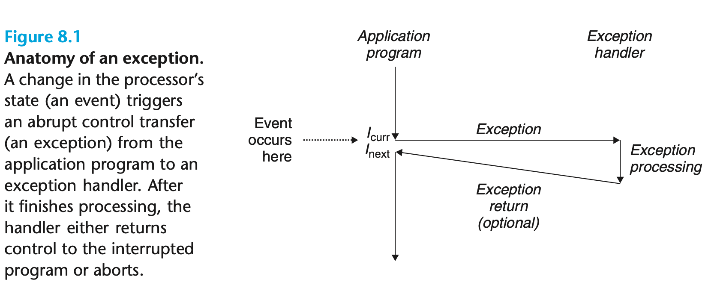

When the processor detects that the event has occurred, it makes an indirect procedure call (the exception), through a jump table called an *exception table*, to an operating system subroutine (the *exception handler*) that is specifically designed to process this particular kind of event. When the exception handler finishes processing, one of three things happens, depending on the type of event that caused the exception:

1. The handler returns control to the current instruction $I_{curr}$, the instruction that was executing when the event occurred.
2. The handler returns control to $I_{next}$ ,the instruction that would have executed next had the exception not occurred.
3. The handler aborts the interrupted program.

#### Exception Handling

Each type of possible exception in a system is assigned a unique nonnegative integer *exception number*. Some of these numbers are assigned by the designers of the processor. Other numbers are assigned by the designers of the operating system *kernel*. At system boot time (when the computer is reset or powered on), the operat ing system allocates and initializes a jump table called an *exception table*, so that entry k contains the address of the handler for exception k. Figure 8.2 shows the format of an exception table.


At run time (when the system is executing some program), the processor detects that an event has occurred and determines the corresponding exception number k. The processor then triggers the exception by making an indirect procedure call, through entry k of the exception table, to the corresponding handler. Figure 8.3 shows how the processor uses the exception table to form the address of the appropriate exception handler. The exception number is an index into the exception table, whose starting address is contained in a special CPU register called the *exception table base register*.

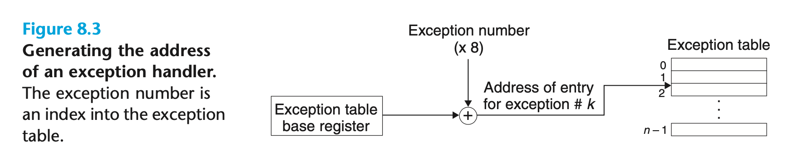

An exception is akin to a procedure call, but with some important differences:

- As with a procedure call, the processor pushes a return address on the stack before branching to the handler. However, depending on the class of exception, the return address is either the current instruction (the instruction that was executing when the event occurred) or the next instruction (the instruction that would have executed after the current instruction had the event not occurred).
- The processor also pushes some additional processor state onto the stack that will be necessary to restart the interrupted program when the handler returns. For example, an x86-64 system pushes the EFLAGS register containing the current condition codes, among other things, onto the stack.
- When control is being transferred from a user program to the kernel, all of these items are pushed onto the kernel’s stack rather than onto the user’s stack.
- Exception handlers run in *kernel mode*, which means they have complete access to all system resources.

After the handler has processed the event, it optionally returns to the interrupted program by executing a special “return from interrupt” instruction, which pops the appropriate state back into the processor’s control and data registers, restores the state to *user mode* if the exception interrupted a user program, and then returns control to the interrupted program.

#### Classes of Exceptions

Exceptions can be divided into four classes: *interrupts*, *traps*, *faults*, and *aborts*. The table in Figure 8.4 summarizes the attributes of these classes.

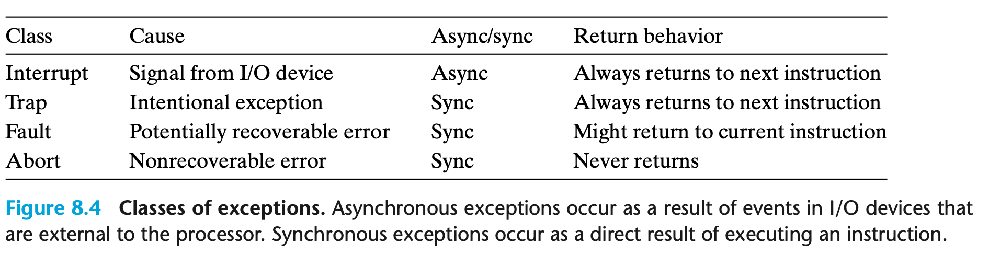

##### Interrupts

*Interrupts* occur *asynchronously* as a result of signals from I/O devices that are external to the processor. Exception handlers for hardware interrupts are often called *interrupt handlers*.

Figure 8.5 summarizes the processing for an interrupt. I/O devices such as network adapters, disk controllers, and timer chips trigger interrupts by signaling a pin on the processor chip and placing onto the system bus the exception number that identifies the device that caused the interrupt.

After the current instruction finishes executing, the processor notices that the interrupt pin has gone high, reads the exception number from the system bus, and then calls the appropriate interrupt handler. When the handler returns, it returns control to the next instruction. The effect is that the program continues executing as though the interrupt had never happened.


##### Traps and System Calls

*Traps* are *intentional* exceptions that occur as a result of executing an instruction. Like interrupt handlers, trap handlers return control to the next instruction. The most important use of traps is to provide a procedure-like interface between user programs and the kernel, known as a *system call*.

User programs often need to request services from the kernel such as reading a file (read), creating a new process (fork), loading a new program (execve), and terminating the current process (exit). To allow controlled access to such kernel services, processors provide a special syscall n instruction that user programs can execute when they want to request service n. Executing the syscall instruction causes a trap to an exception handler that decodes the argument and calls the appropriate kernel routine. Figure 8.6 summarizes the processing for a system call.


> <center><strong>Regular Functions and System Calls</strong></center>
>
> Regular functions run in *user mode*, which restricts the types of instructions they can execute, and they access the same stack as the calling function. A system call runs in *kernel mode*, which allows it to execute privileged instructions and access a stack defined in the kernel.

##### Faults

Faults result from error conditions that a handler might be able to correct. When a fault occurs, the processor transfers control to the fault handler. If the handler is able to correct the error condition, it returns control to the faulting instruction, thereby re-executing it. Otherwise, the handler returns to an abort routine in the kernel that terminates the application program that caused the fault. Figure 8.7 summarizes the processing for a fault.

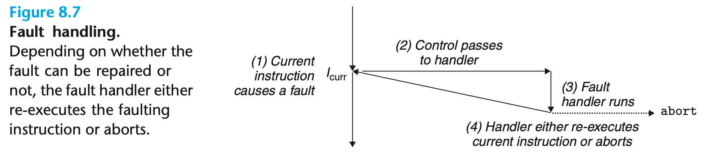

A classic example of a fault is the page fault exception, which occurs when an instruction references a virtual address whose corresponding page is not resident in memory and must therefore be retrieved from disk. The page fault handler loads the appropriate page from disk and then returns control to the instruction that caused the fault. When the instruction executes again, the appropriate page is now resident in memory and the instruction is able to run to completion without faulting.

##### Aborts

Aborts result from unrecoverable fatal errors, typically hardware errors such as parity errors that occur when DRAM or SRAM bits are corrupted. Abort handlers never return control to the application program. As shown in Figure 8.8, the handler returns control to an abort routine that terminates the application program.

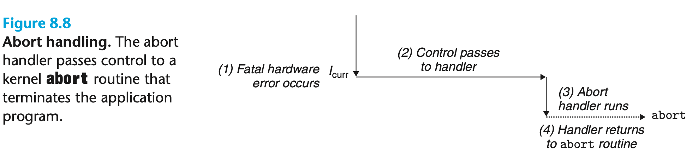

#### Exceptions in Linux/x86-64 Systems

There are up to 256 different exception types for x86-64 systems. Numbers in the range from 0 to 31 correspond to exceptions that are defined by the Intel architects and thus are identical for any x86-64 system. Numbers in the range from 32 to 255 correspond to interrupts and traps that are defined by the operating system. Figure 8.9 shows a few examples.


##### Linux/x86-64 Faults and Aborts

- *Divide error.* A divide error (exception 0) occurs when an application attempts to divide by zero or when the result of a divide instruction is too big for the destination operand. Unix does not attempt to recover from divide errors, opting instead to abort the program. Linux shells typically report divide errors as “Floating exceptions.”

- *General protection fault.* The infamous general protection fault (exception 13) occurs for many reasons, usually because a program references an undefined area of virtual memory or because the program attempts to write to a read-only text segment. Linux does not attempt to recover from this fault. Linux shells typically report general protection faults as “Segmentation faults.”

- *Page fault.* A page fault (exception 14) is an example of an exception where the faulting instruction is restarted. The handler maps the appropriate page of virtual memory on disk into a page of physical memory and then restarts the faulting instruction. 
- *Machine check.* A machine check (exception 18) occurs as a result of a fatal hardware error that is detected during the execution of the faulting instruction. Machine check handlers never return control to the application program.

##### Linux/x86-64 System Calls

Linux provides hundreds of system calls that application programs use when they want to request services from the kernel, such as reading a file, writing a file, and creating a new process. Figure 8.10 lists some popular Linux system calls. Each system call has a unique integer number that corresponds to an offset in a jump table in the kernel. (Notice that this jump table is not the same as the exception table.)

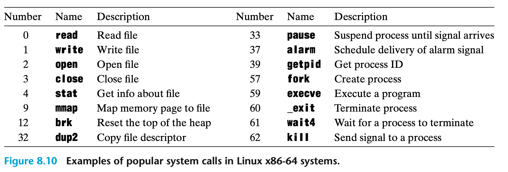

C programs can invoke any system call directly by using the syscall function. However, this is rarely necessary in practice. The C standard library provides a set of convenient wrapper functions for most system calls. The wrapper functions package up the arguments, trap to the kernel with the appropriate system call instruction, and then pass the return status of the system call back to the calling program. 

System calls are provided on x86-64 systems via a trapping instruction called `syscall`. All arguments to Linux system calls are passed through general-purpose registers rather than the stack. By convention, register `%rax` contains the `syscall number`, with up to six arguments in `%rdi`, `%rsi`, `%rdx`, `%r10`, `%r8`, and `%r9`. The first argument is in `%rdi`, the second in `%rsi`, and so on. On return from the system call, registers `%rcx` and `%r11` are destroyed, and `%rax` contains the return value. A negative return value between −4,095 and −1 indicates an error corresponding to negative errno.

For example, consider the following version of the familiar hello program, written using the write system-level function instead of printf. The first argument to write sends the output to stdout. The second argument is the sequence of bytes to write, and the third argument gives the number of bytes to write.

```c
int main() {  write(1, "hello, world\n", 13);  _exit(0);}
```

Figure 8.11 shows an assembly-language version of hello that uses the syscall instruction to invoke the write and exit system calls directly. Lines 9–13 invoke the write function. First, line 9 stores the number of the write system call in `%rax`, and lines 10–12 set up the argument list. Then, line 13 uses the syscall instruction to invoke the system call. Similarly, lines 14–16 invoke the _exit system call.

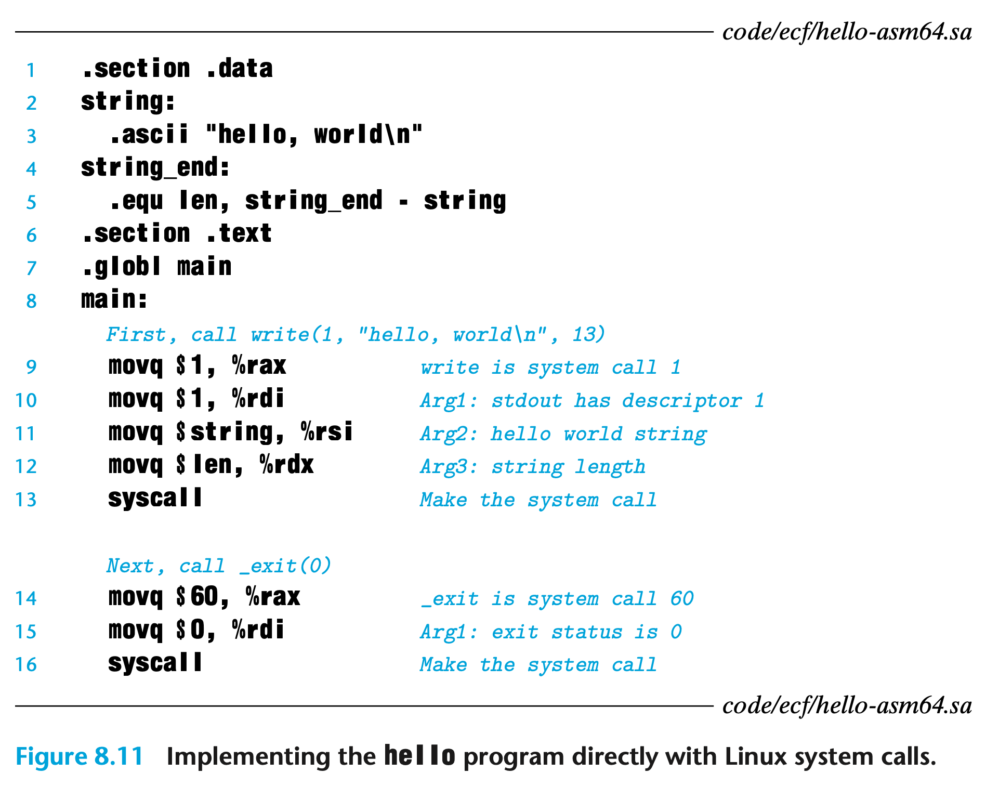

### Processes

The classic definition of a process is *an instance of a program in execution*. Each program in the system runs in the *context* of some process. The context consists of the state that the program needs to run correctly. This state includes the program’s code and data stored in memory, its stack, the contents of its general- purpose registers, its program counter, environment variables, and the set of open file descriptors.

Each time a user runs a program by typing the name of an executable object file to the shell, the shell creates a new process and then runs the executable object file in the context of this new process. Application programs can also create new processes and run either their own code or other applications in the context of the new process.

#### Logical Control Flow

If we were to use a debugger to single-step the execution of our program, we would observe a series of program counter (PC) values that corresponded exclusively to instructions contained in our program’s executable object file or in shared objects linked into our program dynamically at run time. This sequence of PC values is known as a *logical control flow*, or simply *logical flow*.

#### Concurrent Flows

Logical flows take many different forms in computer systems. Exception handlers, processes, signal handlers, threads, and Java processes are all examples of logical flows.

A logical flow whose execution overlaps in time with another flow is called a *concurrent flow*, and the two flows are said to *run concurrently*.

The general phenomenon of multiple flows executing concurrently is known as *concurrency*. The notion of a process taking turns with other processes is also known as *multitasking*. Each time period that a process executes a portion of its flow is called a *time slice*. Thus, multitasking is also referred to as *time slicing*. 

If two flows are running concurrently on different processor cores or computers, then we say that they are *parallel flows*, that they are *running in parallel*, and have *parallel execution*.

#### Private Address Space

A process provides each program with the illusion that it has exclusive use of the system’s address space. On a machine with n-bit addresses, the *address space* is the set of $2^n$ possible addresses, 0, 1, . . . , $2^n − 1$. A process provides each program with its own *private address space*.

Figure 8.13 shows the organization of the address space for an x86-64 Linux process.

The bottom portion of the address space is reserved for the user program, with the usual code, data, heap, and stack segments. The code segment always begins at address 0x400000. The top portion of the address space is reserved for the kernel (the memory-resident part of the operating system). This part of the address space contains the code, data, and stack that the kernel uses when it executes instructions on behalf of the process (e.g., when the application program executes a system call).

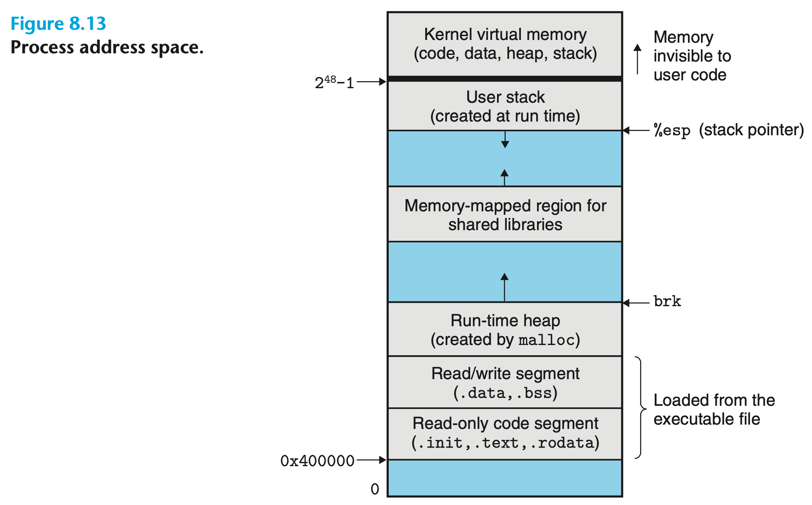

#### User and Kernel Modes

In order for the operating system kernel to provide an airtight process abstraction, the processor must provide a mechanism that restricts the instructions that an application can execute, as well as the portions of the address space that it can access.

Processors typically provide this capability with a *mode bit* in some control register that characterizes the privileges that the process currently enjoys. 

- When the mode bit is set, the process is running in *kernel mode* (sometimes called *supervisor mode*). A process running in kernel mode can execute any instruction in the instruction set and access any memory location in the system.
- When the mode bit is not set, the process is running in *user mode*. A process in user mode is not allowed to execute *privileged instructions* that do things such as halt the processor, change the mode bit, or initiate an I/O operation. Nor is it allowed to directly reference code or data in the kernel area of the address space. Any such attempt results in a fatal protection fault. User programs must instead access kernel code and data indirectly via the system call interface.

A process running application code is initially in user mode. The only way for the process to change from user mode to kernel mode is via an exception such as an interrupt, a fault, or a trapping system call. When the exception occurs, and control passes to the exception handler, the processor changes the mode from user mode to kernel mode. The handler runs in kernel mode. When it returns to the application code, the processor changes the mode from kernel mode back to user mode.

Linux provides a clever mechanism, called the `/proc` filesystem, that allows user mode processes to access the contents of kernel data structures. The `/proc` filesystem exports the contents of many kernel data structures as a hierarchy of text files that can be read by user programs. For example, you can use the `/proc` filesystem to find out general system attributes such as CPU type (/proc/cpuinfo), or the memory segments used by a particular process (/proc/*process-id*/maps). The 2.6 version of the Linux kernel introduced a `/sys` filesystem, which exports additional low-level information about system buses and devices.

#### Context Switches

The operating system kernel implements multitasking using a higher-level form of exceptional control flow known as a *context switch*. 

The kernel maintains a *context* for each process. The context is the state that the kernel needs to restart a preempted process. It consists of the values of objects such as the general-purpose registers, the floating-point registers, the program counter, user’s stack, status registers, kernel’s stack, and various kernel data structures such as a *page table* that characterizes the address space, a *process table* that contains information about the current process, and a *file table* that contains information about the files that the process has opened.

At certain points during the execution of a process, the kernel can decide to preempt the current process and restart a previously preempted process. This decision is known as *scheduling* and is handled by code in the kernel, called the *scheduler*. When the kernel selects a new process to run, we say that the kernel has *scheduled* that process. After the kernel has scheduled a new process to run, it preempts the current process and transfers control to the new process using a mechanism called a *context switch* that 

1. saves the context of the current process
2. restores the saved context of some previously preempted process
3. passes control to this newly restored process.

A context switch can occur while the kernel is executing a system call on behalf of the user. If the system call blocks because it is waiting for some event to occur, then the kernel can put the current process to sleep and switch to another process. For example, if a read system call requires a disk access, the kernel can opt to perform a context switch and run another process instead of waiting for the data to arrive from the disk. In general, even if a system call does not block, the kernel can decide to perform a context switch rather than return control to the calling process.

A context switch can also occur as a result of an interrupt. For example, all systems have some mechanism for generating periodic timer interrupts, typically every 1 ms or 10 ms. Each time a timer interrupt occurs, the kernel can decide that the current process has run long enough and switch to a new process.

Figure 8.14 shows an example of context switching between a pair of processes A and B. In this example, initially process A is running in user mode until it traps to the kernel by executing a read system call. The trap handler in the kernel requests a DMA transfer from the disk controller and arranges for the disk to interrupt the processor after the disk controller has finished transferring the data from disk to memory.

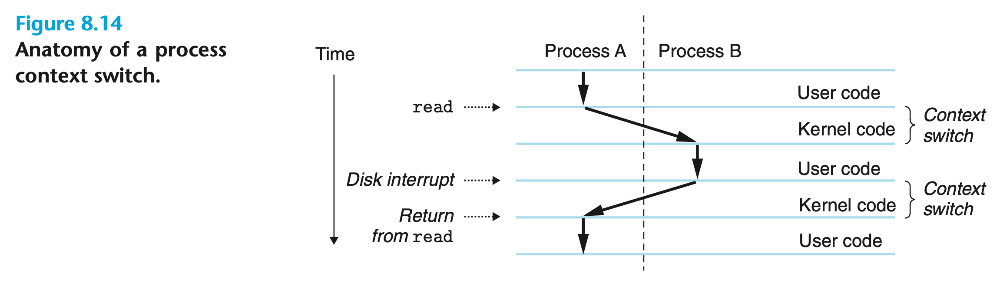

The disk will take a relatively long time to fetch the data (on the order of tens of milliseconds), so instead of waiting and doing nothing in the interim, the kernel performs a context switch from process A to B. Note that, before the switch, the kernel is executing instructions in user mode on behalf of process A (i.e., there is no separate kernel process). During the first part of the switch, the kernel is executing instructions in kernel mode on behalf of process A. Then at some point it begins executing instructions (still in kernel mode) on behalf of process B. And after the switch, the kernel is executing instructions in user mode on behalf of process B.

Process B then runs for a while in user mode until the disk sends an interrupt to signal that data have been transferred from disk to memory. The kernel decides that process B has run long enough and performs a context switch from process B to A, returning control in process A to the instruction immediately following the read system call. Process A continues to run until the next exception occurs, and so on.

### System Call Error Handling

When Unix system-level functions encounter an error, they typically return −1 and set the global integer variable errno to indicate what went wrong. Programmers should *always* check for errors, but unfortunately, many skip error checking because it bloats the code and makes it harder to read.

For example, here is how we might check for errors when we call the Linux fork function:

```c
if ((pid = fork()) < 0) {  fprintf(stderr, "fork error: %s\n", strerror(errno));  exit(0);}
```

We can wrap the make wrappers on top of it.

```c
void unix_error(char *msg) /* Unix-style error */ {  fprintf(stderr, "%s: %s\n", msg, strerror(errno));  exit(0);}pid_t Fork(void) {  pid_t pid;  if ((pid = fork()) < 0)    unix_error("Fork error");  return pid;}pid = Fork();
```

### Process Control

Some useful system calls.

```c
#include <sys/types.h>
#include <unistd.h>
#include <stdlib.h>

pid_t getpid(void); // return process id
pid_t getppid(void); // return parent id of current process
void exit(int status); // terminate process with status number
pid_t fork(void); // create new child process

```

#### Fork

When a process call `fork()`, it will create a child process that is identical (but separate) copy of the parent’s user-level virtual address space, including the code and data segments, heap, shared libraries, and user stack. The child also gets identical copies of any of the parent’s open file descriptors, which means the child can read and write any files that were open in the parent when it called fork. The most significant difference between the parent and the newly created child is that they have different PIDs.

The fork function is interesting (and often confusing) because it is called *once* but it returns *twice:* once in the calling process (the parent), and once in the newly created child process. In the parent, fork returns the PID of the child. In the child, fork returns a value of 0. Since the PID of the child is always nonzero, the return value provides an unambiguous way to tell whether the program is executing in the parent or the child.

Figure 8.15 shows a simple example of a parent process that uses fork to create a child process. When the fork call returns in line 6, x has a value of 1 in both the parent and child. The child increments and prints its copy of x in line 8. Similarly, the parent decrements and prints its copy of x in line 13.

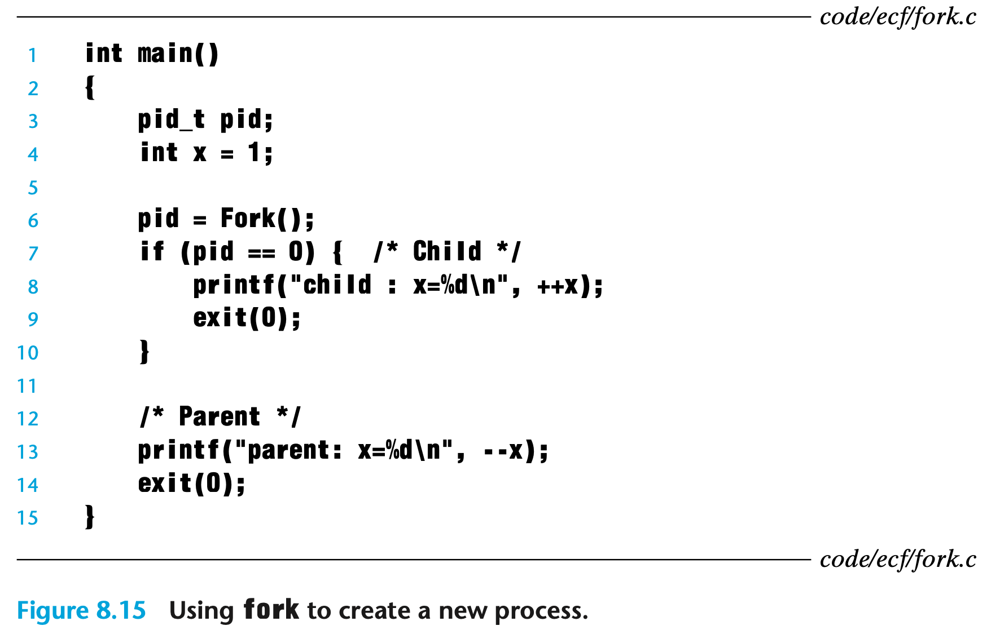

We can draw process graph to understand the bahavior of fork(). Figure 8.17 shows a program with two calls to fork in the source code. The corresponding process graph helps us see that this program runs four processes, each of which makes a call to printf and which can execute in any order.

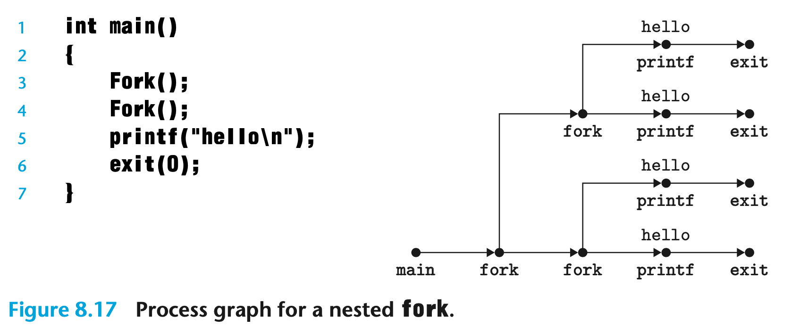

#### Reaping Child Processes

When a process terminates for any reason, the kernel does not remove it from the system immediately. Instead, the process is kept around in a terminated state until it is *reaped* by its parent. When the parent reaps the terminated child, the kernel passes the child’s exit status to the parent and then discards the terminated process, at which point it ceases to exist. A terminated process that has not yet been reaped is called a *zombie*.

When a parent process terminates, the kernel arranges for the init process to become the adopted parent of any orphaned children. The init process, which has a PID of 1, is created by the kernel during system start-up, never terminates, and is the ancestor of every process. If a parent process terminates without reaping its zombie children, then the kernel arranges for the init process to reap them. However, long-running programs such as shells or servers should always reap their zombie children. Even though zombies are not running, they still consume system memory resources.

##### Waitpid

A process waits for its children to terminate or stop by calling the waitpid function. By default (when options = 0), waitpid suspends execution of the calling process until a child process in its *wait set* terminates. If a process in the wait set has already terminated at the time of the call, then waitpid returns immediately. In either case, waitpid returns the PID of the terminated child that caused waitpid to return. At this point, the terminated child has been reaped and the kernel removes all traces of it from the system.

```c
#include <sys/types.h>#include <sys/wait.h>// Returns: PID of child if OK, 0 (if WNOHANG), or −1 on errorpid_t waitpid(pid_t pid, int *statusp, int options);
```

**Determining the Members of the Wait Set**

The members of the wait set are determined by the pid argument:

- If pid > 0, then the wait set is the singleton child process whose process ID is

  equal to pid.

- If pid = -1, then the wait set consists of all of the parent’s child processes. The waitpid function also supports other kinds of wait sets, involving Unix pro- cess groups, which we will not discuss.

**Modifying the Default Behavior**

The default behavior can be modified by setting options to various combinations of the `WNOHANG`, `WUNTRACED`, and `WCONTINUED` constants:

- `WNOHANG`. Return immediately (with a return value of 0) if none of the child processes in the wait set has terminated yet. The default behavior suspends the calling process until a child terminates; this option is useful in those cases where you want to continue doing useful work while waiting for a child to terminate.
- `WUNTRACED`. Suspendexecutionofthecallingprocessuntilaprocessinthe wait set becomes either terminated or stopped. Return the PID of the terminated or stopped child that caused the return. The default behavior returns only for terminated children; this option is useful when you want to check for both terminated *and* stopped children.
- `WCONTINUED`. Suspend execution of the calling process until a running process in the wait set is terminated or until a stopped process in the wait set has been resumed by the receipt of a SIGCONT signal. (Signals are explained in Section 8.5.)

You can combine options by oring them together. For example: `WNOHANG | WUNTRACED`: Return immediately, with a return value of 0, if none of the children in the wait set has stopped or terminated, or with a return value equal to the PID of one of the stopped or terminated children.

**Checking the Exit Status of a Reaped Child**

If the statusp argument is non-NULL, then waitpid encodes status information about the child that caused the return in status, which is the value pointed to by statusp. The wait.h include file defines several macros for interpreting the status argument:

- `WIFEXITED(status)`. Returnstrueifthechildterminatednormally,viaacall to exit or a return.
- `WEXITSTATUS(status)`. Returns the exit status of a normally terminated child. This status is only defined if WIFEXITED() returned true.
- `WIFSIGNALED(status)`. Returns true if the child process terminated be- cause of a signal that was not caught.
- `WTERMSIG(status)`. Returnsthenumberofthesignalthatcausedthechild process to terminate. This status is only defined if WIFSIGNALED() returned true.
- `WIFSTOPPED(status)`. Returns true if the child that caused the return is currently stopped.
- `WSTOPSIG(status)`. Returns the number of the signal that caused the child to stop. This status is only defined if WIFSTOPPED() returned true.
- `WIFCONTINUED(status)`. Returnstrueifthechildprocesswasrestartedby receipt of a SIGCONT signal.

**Error Conditions**

If the calling process has no children, then waitpid returns −1 and sets errno to ECHILD. If the waitpid function was interrupted by a signal, then it returns −1 and sets errno to EINTR.

**The wait Function**

Simple version of `waitpid` is `wait`. Calling `wait(&status)` is equivalent to calling `waitpid(-1, &status, 0)`.

```c
#include <sys/types.h>#include <sys/wait.h>pid_t wait(int *statusp);
```

**Example of Waitpid**


#### Putting Processes to Sleep

The sleep function suspends a process for a specified period of time. Sleep returns zero if the requested amount of time has elapsed, and the number of seconds still left to sleep otherwise. The latter case is possible if the sleep function returns prematurely because it was interrupted by a *signal*. 

```c
#include <unistd.h>unsigned int sleep(unsigned int secs);
```

The pause function, which puts the calling function to sleep until a signal is received by the process.

```c
#include <unistd.h>// always returns -1int pause(void);
```

#### Loading and Running Programs

The `execve` function loads and runs a new program in the context of the current process. The execve function loads and runs the executable object file filename with the argument list argv and the environment variable list envp. Execve returns to the calling program only if there is an error, such as not being able to find filename. So unlike fork, which is called once but returns twice, execve is called once and never returns.

```c
#include <unistd.h>int execve(const char *filename, const char *argv[],           const char *envp[]);
```


After `execve` loads filename, it calls the start-up code. The start-up code sets up the stack and passes control to the main routine of the new program, which has a prototype of the form. The three arguments to function main, each stored in a register according to the x86-64 stack discipline:

1. `argc`, which gives the number of non-null pointers in the argv[] array
2. `argv`, which points to the first entry in the argv[] array
3. `envp`, which points to the first entry in the envp[] array.

```c
int main(int argc, char **argv, char **envp);
```


Linux provides several functions for manipulating the environment array:

```c
#include <stdlib.h>// searches the environment array for a string name=value. If found, it returns a pointer to value; otherwise, it returns NULL.char *getenv(const char *name);// Returns: 0 on success, −1 on errorint setenv(const char *name, const char *newvalue, int overwrite);void unsetenv(const char *name);
```

### Signals

A *signal* is a small message that notifies a process that an event of some type has occurred in the system. Figure 8.26 shows the 30 different types of signals that are supported on Linux systems.


#### Signal Terminology

The transfer of a signal to a destination process occurs in two distinct steps:

- *Sending a signal.* The kernel *sends* (*delivers*) a signal to a destination process by updating some state in the context of the destination process. The signal is delivered for one of two reasons: 
  - The kernel has detected a system event such as a divide-by-zero error or the termination of a child process. 
  - A process has invoked the kill function to explicitly request the kernel to send a signal to the destination process. A process can send a signal to itself.

- *Receiving a signal.* A destination process *receives* a signal when it is forced by the kernel to react in some way to the delivery of the signal. The process can either ignore the signal, terminate, or *catch* the signal by executing a user-level function called a *signal handler*. 

A signal that has been sent but not yet received is called a *pending signal*. At any point in time, there can be at most one pending signal of a particular type. If a process has a pending signal of type k, then any subsequent signals of type k sent to that process are *not* queued; they are simply discarded. A process can selectively *block* the receipt of certain signals. When a signal is blocked, it can be delivered, but the resulting pending signal will not be received until the process unblocks the signal.

A pending signal is received at most once. For each process, the kernel maintains the set of pending signals in the pending bit vector, and the set of blocked signals in the blocked bit vector. The kernel sets bit k in pending whenever a signal of type k is delivered and clears bit k in pending whenever a signal of type k is received.

#### Sending Signals

Unix systems provide a number of mechanisms for sending signals to processes. All of the mechanisms rely on the notion of a *process group*.

##### Process Groups

Every process belongs to exactly one *process group*, which is identified by a positive integer *process group ID*. The `getpgrp` function returns the process group ID of the current process.

```c
#include <unistd.h>pid_t getpgrp(void);//  changes the process group of process pid to pgid// if pid is zero, the PID of the current process is used.// if process 15213 is the calling process, it creates a new process group whose process group ID is 15213, and adds process 15213 to this new group.int setpgid(pid_t pid, pid_t pgid);
```

##### Sending Signals with the /bin/kill Program

```c
// sends signal 9 (SIGKILL) to process 15213.linux> /bin/kill -9 15213// sends signal 9 (SIGKILL) to process group 15213.linux> /bin/kill -9 -15213
```

##### Sending Signals from the Keyboard

Typing Ctrl+C at the keyboard causes the kernel to send a SIGINT signal to every process in the foreground process group. In the default case, the result is to terminate the foreground job. 

##### Sending Signals with the kill Function

 Processes send signals to other processes (including themselves) by calling the kill function. 

- If pid is greater than zero, then the kill function sends signal number sig to process pid. 
- If pid is equal to zero, then kill sends signal sig to every process in the process group of the calling process, including the calling process itself. 
- If pid is less than zero, then kill sends signal sig to every process in process group |pid| (the absolute value of pid). 

```c
#include <sys/types.h>#include <signal.h>int kill(pid_t pid, int sig);
```

Figure 8.29 shows an example of a parent that uses the kill function to send a SIGKILL signal to its child.


##### Sending Signals with the alarm Function

A process can send SIGALRM signals to itself by calling the alarm function. The alarm function arranges for the kernel to send a SIGALRM signal to the calling process in secs seconds. If secs is 0, then no new alarm is scheduled. In any event, the call to alarm cancels any pending alarms and returns the number of seconds remaining until any pending alarm was due to be delivered (had not this call to alarm canceled it), or 0 if there were no pending alarms.

```c
#include <unistd.h>unsigned int alarm(unsigned int secs);
```

#### Receiving Signals

When the kernel switches a process p from kernel mode to user mode, it checks the set of unblocked pending signals (pending & ~blocked) for p. 

- If this set is empty (the usual case), then the kernel passes control to the next instruction (Inext) in the logical control flow of p. 
- If the set is nonempty, then the kernel chooses some signal k in the set (typically the smallest k) and forces p to *receive* signal k. The receipt of the signal triggers some *action* by the process. Once the process completes the action, then control passes back to the next instruction (Inext) in the logical control flow of p. 

Each signal type has a predefined *default action*, which is one of the following:

- The process terminates.
- The process terminates and dumps core.
- The process stops (suspends) until restarted by a `SIGCONT` signal.
- The process ignores the signal.

A process can modify the default action associated with a signal by using the `signal` function. The only exceptions are `SIGSTOP` and `SIGKILL`, whose default actions cannot be changed.

```c
#include <signal.h>
typedef void (*sighandler_t)(int);
// Returns: pointer to previous handler if OK, SIG_ERR on error (does not set errno)
sighandler_t signal(int signum, sighandler_t handler);
```

The signal function can change the action associated with a signal signum in one of three ways:

- If handler is `SIG_IGN`, then signals of type signum are ignored.

- If handler is `SIG_DFL`, then the action for signals of type signum reverts to

  the default action.

- Otherwise, handler is the address of a user-defined function, called a *signal handler*, that will be called whenever the process receives a signal of type signum. 

Changing the default action by passing the address of a handler to the signal function is known as *installing the handler*. The invocation of the handler is called *catching the signal*. The execution of the handler is referred to as *handling the signal*.

When a process catches a signal of type k, the handler installed for signal k is invoked with a single integer argument set to k. This argument allows the same handler function to catch different types of signals.

When the handler executes its return statement, control (usually) passes back to the instruction in the control flow where the process was interrupted by the receipt of the signal. We say “usually” because in some systems, interrupted system calls return immediately with an error.

Figure 8.30 shows a program that catches the SIGINT signal that is sent whenever the user types Ctrl+C at the keyboard. We modify the default behavior to catch the signal, print a message, and then terminate the process.


Signal handlers can be interrupted by other handlers, as shown in Figure 8.31.


#### Blocking and Unblocking Signals

Linux provides implicit and explicit mechanisms for blocking signals:

- *Implicit blocking mechanism.* By default, the kernel blocks any pending signals of the type currently being processed by a handler. For example, in Figure 8.31, suppose the program has caught signal s and is currently running handler S. If another signal s is sent to the process, then s will become pending but will not be received until after handler S returns.
- *Explicit blocking mechanism.* Applications can explicitly block and unblock selected signals using the sigprocmask function and its helpers.

The `sigprocmask` function changes the set of currently blocked signals (the blocked bit vector). The specific behavior depends on the value of how:

- `SIG_BLOCK`. Add the signals in set to blocked (blocked = blocked | set).
- `SIG_UNBLOCK`. Remove the signals in set from blocked (blocked = blocked&~set).
- `SIG_SETMASK`. blocked = set.

```c
#include <signal.h>
// changes the set of currently blocked signals(blocked bit vector)
int sigprocmask(int how, const sigset_t *set, sigset_t *oldset);
int sigemptyset(sigset_t *set);
int sigfillset(sigset_t *set);
int sigaddset(sigset_t *set, int signum);
int sigdelset(sigset_t *set, int signum);

int sigismember(const sigset_t *set, int signum);
```

If oldset is non-NULL, the previous value of the blocked bit vector is stored in oldset.

Signal sets such as set are manipulated using the following functions: 

- The `sigemptyset` initializes set to the empty set. 
- The `sigfillset` function adds every signal to set. 
- The `sigaddset` function adds signum to set
- The `sigdelset` deletes signum from set
- The `sigismember` returns 1 if signum is a member of set, and 0 if not.

For example, Figure 8.32 shows how you would use `sigprocmask` to temporarily block the receipt of SIGINT signals.


#### Writing Signal Handlers

Handlers have several attributes that make them difficult to reason about:

- Handlers run concurrently with the main program and share the same global variables, and thus can interfere with the main program and with other handlers.
- The rules for how and when signals are received is often counterintuitive. 
- Different systems can have different signal-handling semantics.

##### Safe Signal Handling

*Keep handlers as simple as possible.* The best way to avoid trouble is to keep your handlers as small and simple as possible. For example, the handler might simply set a global flag and return immediately; all processing associated with the receipt of the signal is performed by the main program, which periodically checks (and resets) the flag.

*Call only async-signal-safe functions in your handlers.* A function that is *async-signal-safe*, or simply *safe*, has the property that it can be safely called from a signal handler, either because it is *reentrant* (e.g., accesses only local variables), or because it cannot be interrupted by a signal handler. Figure 8.33 lists the system-level functions that Linux guarantees to be safe. Notice that many popular functions, such as printf, sprintf, malloc, and exit, are *not* on this list.

*Save and restore errno*. Many of the Linux async-signal-safe functions set errno when they return with an error. Calling such functions inside a handler might interfere with other parts of the program that rely on errno. The workaround is to save errno to a local variable on entry to the handler and restore it before the handler returns. Note that this is only necessary if the handler returns. It is not necessary if the handler terminates the process by calling `_exit`.

*Protect accesses to shared global data structures by blocking all signals.* If a handler shares a global data structure with the main program or with other handlers, then your handlers and main program should temporarily block all signals while accessing (reading or writing) that data structure. The reason for this rule is that accessing a data structure d from the main program typically requires a sequence of instructions. If this instruction sequence is interrupted by a handler that accesses d, then the handler might find d in an inconsistent state, with unpredictable results. Temporarily blocking signals while you access d guarantees that a handler will not interrupt the instruction sequence.

*Declare global variables with volatile*. Consider a handler and main routine that share a global variable g. The handler updates g, and main periodically reads g. To an optimizing compiler, it would appear that the value of g never changes in main, and thus it would be safe to use a copy of g that is cached in a register to satisfy every reference to g. In this case, the main function would never see the updated values from the handler. You can tell the compiler not to cache a variable by declaring it with the volatile type qualifier. For example:

```c
volatile int g;
```

The volatile qualifier forces the compiler to read the value of g from memory each time it is referenced in the code. In general, as with any shared data structure, each access to a global variable should be protected by temporarily blocking signals.

*Declare flags with `sig_atomic_t`*. In one common handler design, the handler records the receipt of the signal by writing to a global *flag*. The main program periodically reads the flag, responds to the signal, and clears the flag. For flags that are shared in this way, C provides an integer data type `sig_atomic_t`, for which reads and writes are guaranteed to be *atomic* (uninterruptible) because they can be implemented with a single instruction:

```c
volatile sig_atomic_t flag;
```

Since they can’t be interrupted, you can safely read from and write to `sig_atomic_t` variables without temporarily blocking signals. Note that the guarantee of atomicity only applies to individual reads and writes. It does not apply to updates such as flag++ or flag = flag + 10, which might require multiple instructions.

The only safe way to generate output from a signal handler is to use the write function.

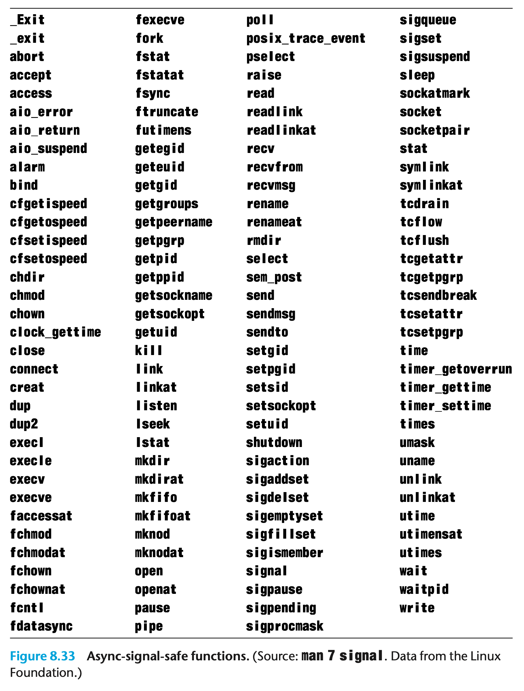

##### Correct Signal Handling

> _**Note**_: Signals cannot be used to count the occurrence of events in other processes as it will be discarded if there is a pending signal.

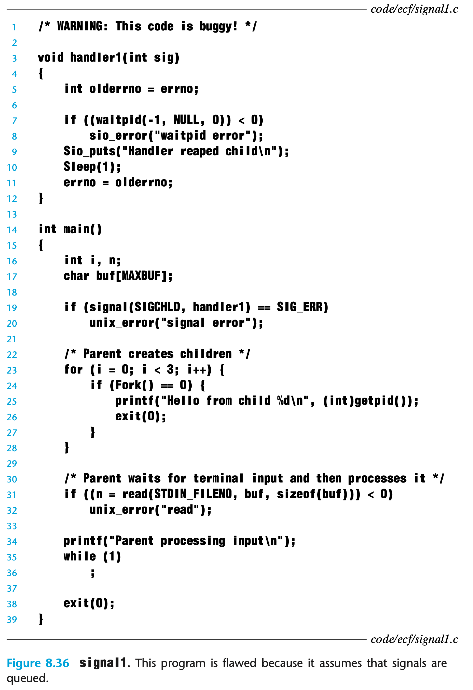

As the Signal is not queued, some signals may be lost when there is pending signal. To solve the issue, we need to modify the handler like below.


##### Portable Signal Handling

Another ugly aspect of Unix signal handling is that different systems have different signal-handling semantics. To deal with the issue, the Posix standard defines the `sigaction` function, which allows users to clearly specify the signal-handling semantics they want when they install a handler.

```c
#include <signal.h>int sigaction(int signum,  struct sigaction *act,              struct sigaction *oldact);
```

The sigaction function is unwieldy because it requires the user to set the entries of a complicated structure. We can define a wrapper function called Signal, that calls sigaction for us. Figure 8.38 shows the definition of Signal, which is invoked in the same way as the signal function.


The Signal wrapper installs a signal handler with the following signal-handling semantics:

- Only signals of the type currently being processed by the handler are blocked.
- As with all signal implementations, signals are not queued.
- Interrupted system calls are automatically restarted whenever possible.
- Once the signal handler is installed, it remains installed until Signal is called with a handler argument of either `SIG_IGN` or `SIG_DFL`.

#### Synchronizing Flows

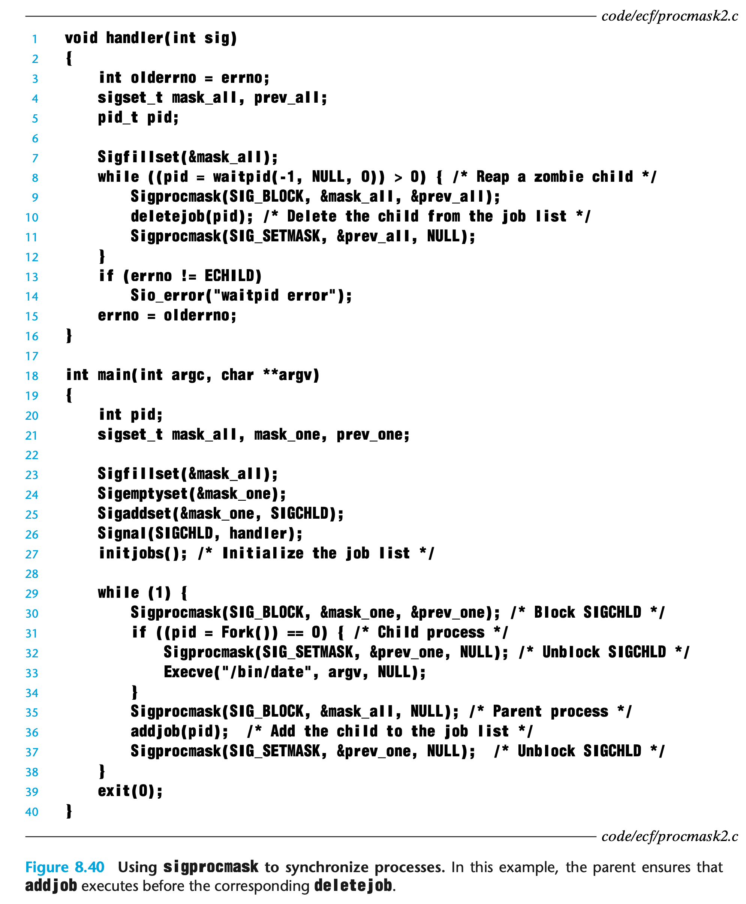

#### Explicitly Waiting for Signals

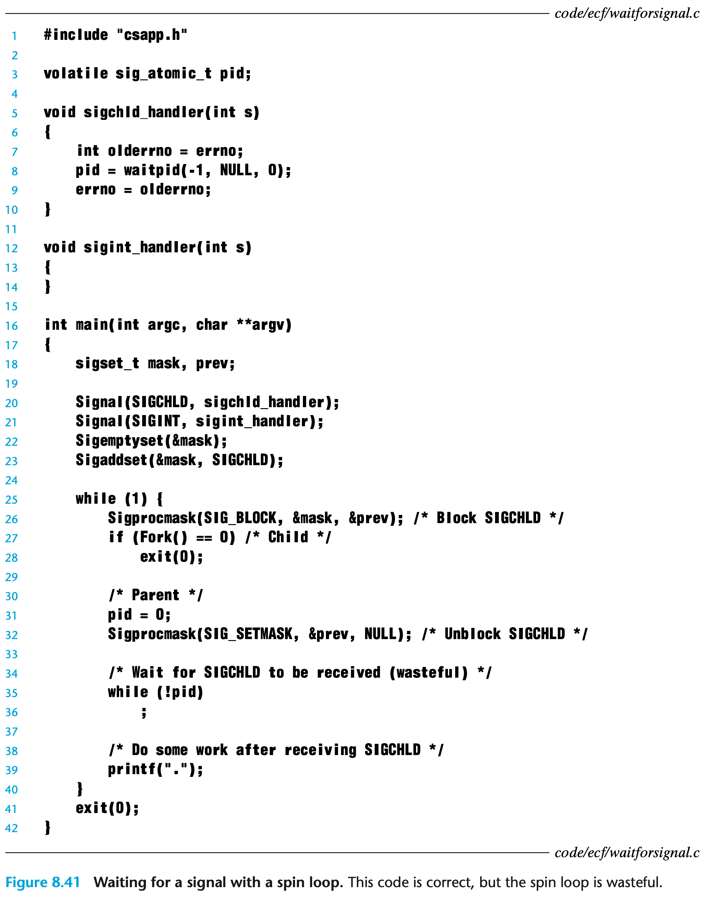

Instead of spinning, we can use `sigsuspend`.

```c
#include <signal.h>// return -1int sigsuspend(const sigset_t *mask);
```

The `sigsuspend` function temporarily replaces the current blocked set with mask and then suspends the process until the receipt of a signal whose action is either to run a handler or to terminate the process. 

- If the action is to terminate, then the process terminates without returning from sigsuspend. 
- If the action is to run a handler, then sigsuspend returns after the handler returns, restoring the blocked set to its state when sigsuspend was called.

The `sigsuspend` function is equivalent to an *atomic* (uninterruptible) version of the following:

```c
sigprocmask(SIG_BLOCK, &mask, &prev);pause();sigprocmask(SIG_SETMASK, &prev, NULL);
```

Figure 8.42 shows how we would use `sigsuspend` to replace the spin loop in Figure 8.41. Before each call to `sigsuspend`, SIGCHLD is blocked. The `sigsuspend` temporarily unblocks SIGCHLD, and then sleeps until the parent catches a signal. Before returning, it restores the original blocked set, which blocks SIGCHLD again. 

- If the parent caught a SIGINT, then the loop test succeeds and the next iteration calls `sigsuspend` again. 
- If the parent caught a SIGCHLD, then the loop test fails and we exit the loop. At this point, SIGCHLD is blocked, and so we can optionally unblock SIGCHLD. This might be useful in a real shell with background jobs that need to be reaped.


### Nonlocal Jumps

C provides a form of user-level exceptional control flow, called a *nonlocal jump*, that transfers control directly from one function to another currently executing function without having to go through the normal call-and-return sequence. Non-local jumps are provided by the `setjmp` and `longjmp` functions.

The `setjmp` function saves the current *calling environment* in the env buffer, for later use by `longjmp`, and returns 0. The calling environment includes the program counter, stack pointer, and general-purpose registers. For subtle reasons beyond our scope, the value that `setjmp` returns should not be assigned to a variable. However, it can be safely used as a test in a switch or conditional statement.

```c
#include <setjmp.h>
int setjmp(jmp_buf env);
int sigsetjmp(sigjmp_buf env, int savesigs);
```

The `longjmp` function restores the calling environment from the env buffer and then triggers a return from the most recent `setjmp` call that initialized env. The `setjmp` then returns with the nonzero return value `retval`.

The interactions between `setjmp` and `longjmp` can be confusing at first glance. The `longjmp` function is called once but never returns, on the other hand, the `setjmp` function is called once but returns *multiple times:* 

- once when the `setjmp` is first called and the calling environment is stored in the env buffer
- once for each corresponding `longjmp` call. 

```c
#include <setjmp.h>
void longjmp(jmp_buf env, int retval);
void siglongjmp(sigjmp_buf env, int retval);
```

An important application of nonlocal jumps is to permit an immediate return from a deeply nested function call, usually as a result of detecting some error condition. If an error condition is detected deep in a nested function call, we can use a nonlocal jump to return directly to a common localized error handler instead of laboriously unwinding the call stack.

Figure 8.43 shows an example of how this might work. The main routine first calls `setjmp` to save the current calling environment, and then calls function `foo`, which in turn calls function `bar`. If `foo` or `bar` encounter an error, they return immediately from the `setjmp` via a `longjmp` call. The nonzero return value of the `setjmp` indicates the error type, which can then be decoded and handled in one place in the code.


The feature of `longjmp` that allows it to skip up through all intermediate calls can have unintended consequences. For example, if some data structures were allocated in the intermediate function calls with the intention to deallocate them at the end of the function, the deallocation code gets skipped, thus creating a memory leak.

Another important application of nonlocal jumps is to branch out of a signal handler to a specific code location, rather than returning to the instruction that was interrupted by the arrival of the signal. 

Figure 8.44 shows a simple program that illustrates this basic technique. The program uses signals and nonlocal jumps to do a soft restart whenever the user types Ctrl+C at the keyboard. The `sigsetjmp` and `siglongjmp` functions are versions of `setjmp` and `longjmp` that can be used by signal handlers.

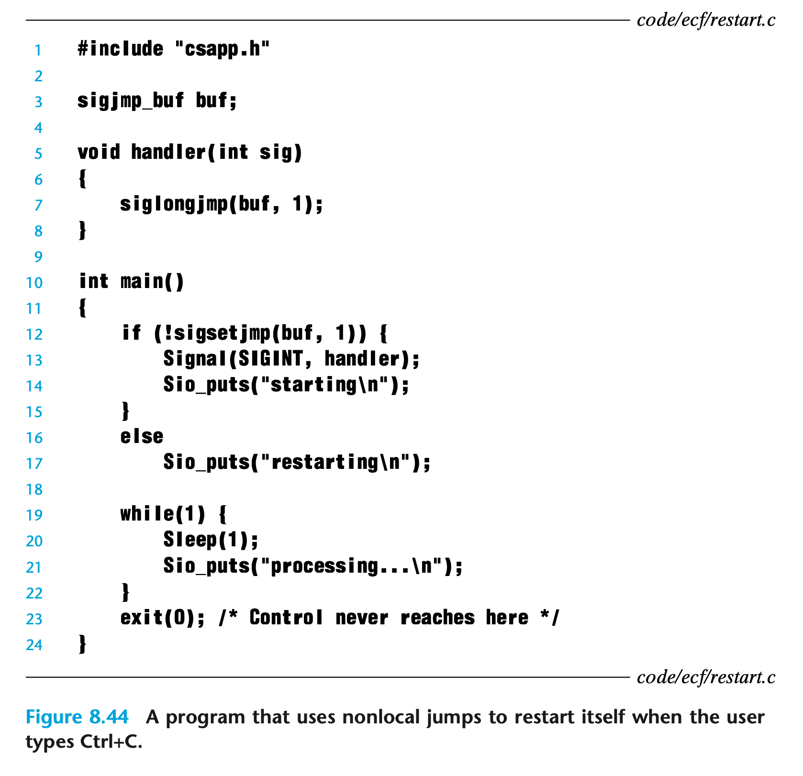

The initial call to the `sigsetjmp` function saves the calling environment and signal context (including the pending and blocked signal vectors) when the program first starts. The main routine then enters an infinite processing loop. When the user types Ctrl+C, the kernel sends a SIGINT signal to the process, which catches it. Instead of returning from the signal handler, which would pass control back to the interrupted processing loop, the handler performs a nonlocal jump back to the beginning of the main program. 

> _**Note**_: You can think of a catch clause inside a try statement as being akin to a setjmp function. Similarly, a throw statement is similar to a longjmp function.

### Tools for Manipulating Processes

Linux systems provide a number of useful tools for monitoring and manipulating processes:

- `strace`: Prints a trace of each system call invoked by a running program and its children. Compile your program with `-static` to get a cleaner trace without a lot of output related to shared libraries.
- `ps`: Lists processes (including zombies) currently in the system.
- `top`: Prints information about the resource usage of current processes. 
- `pmap`: Displays the memory map of a process.
- `/proc`: A virtual filesystem that exports the contents of numerous kernel data structures in an ASCII text form that can be read by user programs. For example, type cat /proc/loadavg to see the current load average on your Linux system

## Virtual Memory

In order to manage memory more efficiently and with fewer errors, modern systems provide an abstraction of main memory known as *virtual memory (VM)*. With one clean mechanism, virtual memory provides three important capabilities: 

1. It uses main memory efficiently by treating it as a cache for an address space stored on disk, keeping only the active areas in main memory and transferring data back and forth between disk and memory as needed.
2. It simplifies memory management by providing each process with a uniform address space. 
3. It protects the address space of each process from corruption by other processes.

### Physical and Virtual Addressing

Figure 9.1 shows an example of physical addressing in the context of a load instruction that reads the 4-byte word starting at physical address 4. When the CPU executes the load instruction, it generates an effective physical address and passes it to main memory over the memory bus. The main memory fetches the 4-byte word starting at physical address 4 and returns it to the CPU, which stores it in a register.


The modern processors use a form of addressing known as *virtual addressing*, as shown in Figure 9.2. With virtual addressing, the CPU accesses main memory by generating a *virtual address (VA)*, which is converted to the appropriate physical address before being sent to main memory. The task of converting a virtual address to a physical one is known as *address translation*. Like exception handling, address translation requires close cooperation between the CPU hardware and the operating system. Dedicated hardware on the CPU chip called the *memory management unit (MMU)* translates virtual addresses on the fly, using a lookup table stored in main memory whose contents are managed by the operating system.


### Address Spaces

In a system with virtual memory, the CPU generates virtual addresses from an address space of N = $2^n$ addresses called the *virtual address space*. The size of an address space is characterized by the number of bits that are needed to represent the largest address. A virtual address space with N = $2^n$ addresses is called an n-bit address space. Modern systems typically support either 32-bit or 64-bit virtual address spaces.

### Page

#### Page Tables

The data on disk (the lower level) is partitioned into blocks that serve as the transfer units between the disk and the main memory (the upper level). Virtual memory systems handle this by partitioning the virtual memory into fixed-size blocks called *virtual pages (VPs)*. Each virtual page is P = $2^p$ bytes in size. Similarly, physical memory is partitioned into *physical pages (PPs)*, also P bytes in size. (Physical pages are also referred to as *page frames*.)

The address translation hardware  in the MMU reads the page table each time it converts a virtual address to a physical address using a data structure stored in physical memory known as a *page table* that maps virtual pages to physical pages. The operating system is responsible for maintaining the contents of the page table and transferring pages back and forth between disk and DRAM.

Figure 9.4 shows the basic organization of a page table. A page table is an array of *page table entries (PTEs)*. Each page in the virtual address space has a PTE at a fixed offset in the page table. For our purposes, we will assume that each PTE consists of a *valid bit* and an n-bit address field. The valid bit indicates whether the virtual page is currently cached in DRAM. If the valid bit is set, the address field indicates the start of the corresponding physical page in DRAM where the virtual page is cached. If the valid bit is not set, then a null address indicates that the virtual page has not yet been allocated. Otherwise, the address points to the start of the virtual page on disk.


#### Page Hits and Page Faults

If the valid bit is set for specify read instruction, the address translation hardware knows the physical memory address n the PTE and uses it to find the content. This is consider as a **Page hit**.

If the valid bit is not set for specify read instruction, the address translation hardware triggers a page fault exception. The page fault exception invokes a page fault exception handler in the kernel, which load the physical location into page table. This process called **Page Fault**. 

#### Demand Paging

The activity of transferring a page between disk and memory is known as *swapping* or *paging*. Pages are *swapped in* (*paged in*) from disk to DRAM, and *swapped out* (*paged out*) from DRAM to disk. The strategy of waiting until the last moment to swap in a page, when a miss occurs, is known as *demand paging*.

#### Locality

In practice, virtual memory works well, mainly because of *locality*. If the working set size exceeds the size of physical memory, then the program can produce an unfortunate situation known as *thrashing*, where pages are swapped in and out continuously. Although virtual memory is usually efficient, if a program’s performance slows to a crawl, the wise programmer will consider the possibility that it is thrashing.

### Memory Management

Operating systems provide a separate page table, and thus a separate virtual address space, for each process. Figure 9.9 shows the basic idea.


VM simplifies linking and loading, the sharing of code and data, and allocating memory to applications.

- *Simplifying linking.* A separate address space allows each process to use the same basic format for its memory image, regardless of where the code and data actually reside in physical memory. For 64-bit address spaces, the code segment *always* starts at virtual address `0x400000`. The data segment follows the code segment after a suitable alignment gap. The stack occupies the highest portion of the user process address space and grows downward. Such uniformity greatly simplifies the design and implementation of linkers, allowing them to produce fully linked executables that are independent of the ultimate location of the code and data in physical memory.
- *Simplifying loading.* Virtual memory also makes it easy to load executable and shared object files into memory. To load the .text and .data sections of an object file into a newly created process, the Linux loader allocates virtual pages for the code and data segments, marks them as invalid (i.e., not cached), and points their page table entries to the appropriate locations in the object file. The interesting point is that the loader never actually copies any data from disk into memory. The data are paged in automatically and on demand by the virtual memory system the first time each page is referenced, either by the CPU when it fetches an instruction or by an executing instruction when it references a memory location.
- *Simplifying sharing.* In some instances it is desirable for processes to share code and data. For example, every process must call the same operating system kernel code, and every C program makes calls to routines in the standard C library such as printf. Rather than including separate copies of the kernel and standard C library in each process, the operating system can arrange for multiple processes to share a single copy of this code by mapping the appropriate virtual pages in different processes to the same physical pages.

- *Simplifying memory allocation.* Virtual memory provides a simple mechanism for allocating additional memory to user processes. When a program running in a user process requests additional heap space, the operating system allocates an appropriate number, say, k, of contiguous virtual memory pages, and maps them to k arbitrary physical pages located anywhere in physical memory. Because of the way page tables work, there is no need for the operating system to locate k contiguous pages of physical memory. The pages can be scattered randomly in physical memory.

### Memory Protection

The operating system to control access to the memory system to prevent any unauthorized or unauthenticated users or programs to access the memory regions that they are not supposed to access. Figure 9.10 shows the general idea. There are 3 extra bits:

1. The SUP bit indicates whether processes must be running in kernel (supervisor) mode to access the page. Processes running in kernel mode can access any page, but processes running in user mode are only allowed to access pages for which SUP is 0.
2. The READ and WRITE bits control read and write access to the page.

If an instruction violates these permissions, then the CPU triggers a general protection fault that transfers control to an exception handler in the kernel, which sends a `SIGSEGV` signal to the offending process. Linux shells typically report this exception as a “segmentation fault.”


### Address Translation

Figure 9.12 shows how the MMU uses the page table to perform this mapping. A control register in the CPU, the *page table base register (PTBR)* points to the current page table. 

The n-bit virtual address has two components: 

- a p-bit *virtual page offset (VPO)*
- an (n − p)-bit *virtual page number (VPN)*. 

The MMU uses the VPN to select the appropriate PTE. For example, VPN 0 selects PTE 0, VPN 1 selects PTE 1, and so on. The corresponding physical address is the concatenation of the *physical page number (PPN)* from the page table entry and the VPO from the virtual address. Notice that since the physical and virtual pages are both P bytes, the *physical page offset (PPO)* is identical to the VPO.


Figure 9.13(a) shows the steps that the CPU hardware performs when there is a page hit.

1. The processor generates a virtual address and sends it to the MMU. 
2. The MMU generates the PTE address and requests it from the cache/main memory.
3. The cache/main memory returns the PTE to the MMU.
4. The MMU constructs the physical address and sends it to the cache/main memory.
5. The cache/main memory returns the requested data word to the processor.

Unlike a page hit, which is handled entirely by hardware, handling a page fault requires cooperation between hardware and the operating system kernel (Figure 9.13(b)).

1. The processor generates a virtual address and sends it to the MMU. 
2. The MMU generates the PTE address and requests it from the cache/main memory.
3. The cache/main memory returns the PTE to the MMU.
4. The valid bit in the PTE is zero, so the MMU triggers an exception, which transfers control in the CPU to a page fault exception handler in the operating system kernel.
5. The fault handler identifies a victim page in physical memory, and if that page has been modified, pages it out to disk.
6. The fault handler pages in the new page and updates the PTE in memory.
7. The fault handler returns to the original process, causing the faulting instruction to be restarted. The CPU resends the offending virtual address to the MMU. Because the virtual page is now cached in physical memory, there is a hit, and after the MMU performs the steps in Figure 9.13(a), the main memory returns the requested word to the processor.


#### Speeding Up Address Translation with a TLB

Every time the CPU generates a virtual address, the MMU must refer to a PTE in order to translate the virtual address into a physical address. In the worst case, this requires an additional fetch from memory, at a cost of tens to hundreds of cycles. If the PTE happens to be cached in L1, then the cost goes down to a handful of cycles. However, many systems try to eliminate even this cost by including a small cache of PTEs in the MMU called a *translation lookaside buffer (TLB)*.

A TLB is a small, virtually addressed cache where each line holds a block consisting of a single PTE. A TLB usually has a high degree of associativity. As shown in Figure 9.15, the index and tag fields that are used for set selection and line matching are extracted from the virtual page number in the virtual address. If the TLB has T = $2^t$ sets, then the *TLB index (TLBI)* consists of the t least significant bits of the VPN, and the *TLB tag (TLBT)* consists of the remaining bits in the VPN.


Figure 9.16(a) shows the steps involved when there is a TLB hit (the usual case). The key point here is that all of the address translation steps are performed inside the on-chip MMU and thus are fast.

1. The CPU generates a virtual address.
2. The MMU fetches the appropriate PTE from the TLB.
3. The MMU translates the virtual address to a physical address and sends it to the cache/main memory.
4. The cache/main memory returns the requested data word to the CPU.

When there is a TLB miss, then the MMU must fetch the PTE from the L1 cache, as shown in Figure 9.16(b). The newly fetched PTE is stored in the TLB, possibly overwriting an existing entry.


#### Multi-Level Page Tables

With systems with 64-bit address spaces, a single page table will be to big to hold all the PTEs. It is not only hard to place it on memory but also will causing a slow look up compare to small page table.

The common approach for compacting the page table is to use a hierarchy of page tables instead. Consider a 32-bit virtual address space partitioned into 4 KB pages, with page table entries that are 4 bytes each. Suppose also that at this point in time the virtual address space has the following form: The first 2 K pages of memory are allocated for code and data, the next 6 K pages are unallocated, the next 1,023 pages are also unallocated, and the next page is allocated for the user stack. Figure 9.17 shows how we might construct a two-level page table hierarchy for this virtual address space.


This scheme reduces memory requirements in two ways. 

- First, if a PTE in the level 1 table is null, then the corresponding level 2 page table does not even have to exist. This represents a significant potential savings, since most of the 4 GB virtual address space for a typical program is unallocated. 
- Second, only the level 1 table needs to be in main memory at all times. The level 2 page tables can be created and paged in and out by the VM system as they are needed, which reduces pressure on main memory. Only the most heavily used level 2 page tables need to be cached in main memory.

Figure 9.18 summarizes address translation with a k-level page table hierarchy. The virtual address is partitioned into k VPNs and a VPO. Each VPN i, 1 ≤ i ≤ k, is an index into a page table at level i. Each PTE in a level j table, 1 ≤ j ≤ k − 1, points to the base of some page table at level j + 1. Each PTE in a level k table contains either the PPN of some physical page or the address of a disk block. To construct the physical address, the MMU must access k PTEs before it can determine the PPN. As with a single-level hierarchy, the PPO is identical to the VPO.


### End-to-End Address Translation

To keep things manageable, we make the following assumptions:

- The memory is byte addressable.
- Memory accesses are to *1-byte words* (not 4-byte words).
- Virtual addresses are 14 bits wide (n = 14).
- Physical addresses are 12 bits wide (m = 12).
- The page size is 64 bytes (P = 64).
- The TLB is 4-way set associative with 16 total entries.
- The L1 d-cache is physically addressed and direct mapped, with a 4-byte line size and 16 total sets.

Figure 9.19 shows the formats of the virtual and physical addresses. Since each page is $2^6 = 64$ bytes, the low-order 6 bits of the virtual and physical addresses serve as the VPO and PPO, respectively. The high-order 8 bits of the virtual address serve as the VPN. The high-order 6 bits of the physical address serve as the PPN.


Figure 9.20 shows a snapshot of our little memory system.


When the CPU executes a load instruction that reads the byte at address `0x03d4`. (Recall that our hypothetical CPU reads 1-byte words rather than 4-byte words.) 


The MMU extracts the VPN (0x0F) from the virtual address and checks with the TLB to see if it has cached a copy of PTE 0x0F from some previous memory reference. The TLB extracts the TLB index (0x03) and the TLB tag (0x3) from the VPN, hits on a valid match in the second entry of set 0x3, and returns the cached PPN (`0x0D`) to the MMU.

If the TLB had missed, then the MMU would need to fetch the PTE from main memory. However, in this case, we got lucky and had a TLB hit. The MMU now has everything it needs to form the physical address. It does this by concatenating the PPN (0x0D) from the PTE with the VPO (0x14) from the virtual address, which forms the physical address (0x354).

Next, the MMU sends the physical address to the cache, which extracts the cache offset CO (0x0), the cache set index CI (0x5), and the cache tag CT (0x0D) from the physical address.


Since the tag in set 0x5 matches CT, the cache detects a hit, reads out the data byte (0x36) at offset CO, and returns it to the MMU, which then passes it back to the CPU.

If the TLB misses, then the MMU must fetch the PPN from a PTE in the page table. If the resulting PTE is invalid, then there is a page fault and the kernel must page in the appropriate page and rerun the load instruction. Another possibility is that the PTE is valid, but the necessary memory block misses in the cache.

### Case Study: The Intel Core i7/Linux Memory System


Figure 9.21 gives the highlights of the Core i7 memory system which support a 48-bit (256 TB) virtual address space and a 52-bit (4 PB) physical address space, along with a compatibility mode that supports 32-bit (4 GB) virtual and physical address spaces. The *processor package* (chip) includes 

- four cores
  - Each core contains a hierarchy of TLBs
    - a hierarchy of data and instruction caches
    - a set of fast point-to-point links, based on the QuickPath technology, for communicating directly with the other cores and the external I/O bridge. 
  - The TLBs are virtually addressed, and 4-way set associative. 
  - The L1, L2, and L3 caches are physically addressed, with a block size of 64 bytes. 
    - L1 and L2 are 8-way set associative
    - L3 is 16-way set associative. 
  - The page size can be configured at start-up time as either 4 KB or 4 MB. Linux uses 4 KB pages.
- a large L3 cache shared by all of the cores
- a DDR3 memory controller shared by all of the cores

#### Core i7 Address Translation


Figure 9.22 summarizes the entire Core i7 address translation process, from the time the CPU generates a virtual address until a data word arrives from memory. The Core i7 uses a four-level page table hierarchy. Each process has its own private page table hierarchy. 

When a Linux process is running, the page tables associated with allocated pages are all memory-resident, although the Core i7 architecture allows these page tables to be swapped in and out. The *CR3* control register contains the physical address of the beginning of the level 1 (L1) page table. The value of CR3 is part of each process context, and is restored during each context switch.


Figure 9.23 shows the format of an entry in a level 1, level 2, or level 3 page table. When P = 1 (which is always the case with Linux), the address field contains a 40-bit physical page number (PPN) that points to the beginning of the appropriate page table. Notice that this imposes a 4 KB alignment requirement on page tables.


Figure 9.24 shows the format of an entry in a level 4 page table. When P = 1, the address field contains a 40-bit PPN that points to the base of some page in physical memory. Again, this imposes a 4 KB alignment requirement on physical pages.

> _**Note**_: The *XD* (execute disable) bit, which was introduced in 64-bit systems, can be used to disable instruction fetches from individual memory pages. This is an important new feature that allows the operating system kernel to reduce the risk of buffer overflow attacks by restricting execution to the read-only code segment.

As the MMU translates each virtual address, it also updates two other bits that can be used by the kernel’s page fault handler. 

- The MMU sets the A bit, which is known as a *reference bit*, each time a page is accessed. The kernel can use the reference bit to implement its page replacement algorithm. 
- The MMU sets the D bit, or *dirty bit*, each time the page is written to. A page that has been modified is sometimes called a *dirty page*. The dirty bit tells the kernel whether or not it must write back a victim page before it copies in a replacement page. 

The kernel can call a special kernel-mode instruction to clear the reference or dirty bits.


Figure 9.25 shows how the Core i7 MMU uses the four levels of page tables to translate a virtual address to a physical address. The 36-bit VPN is partitioned into four 9-bit chunks, each of which is used as an offset into a page table. The CR3 register contains the physical address of the L1 page table. VPN 1 provides an offset to an L1 PTE, which contains the base address of the L2 page table. VPN 2 provides an offset to an L2 PTE, and so on.

#### Linux Virtual Memory System


Linux maintains a separate virtual address space for each process of the form shown in Figure 9.26. The kernel virtual memory contains the code and data structures in the kernel. Some regions of the kernel virtual memory are mapped to physical pages that are shared by all processes. For example, each process shares the kernel’s code and global data structures. Linux also maps a set of contiguous virtual pages (equal in size to the total amount of DRAM in the system) to the corresponding set of contiguous physical pages. This provides the kernel with a convenient way to access any specific location in physical memory—for example, when it needs to access page tables or to perform memory-mapped I/O operations on devices that are mapped to particular physical memory locations.

Other regions of kernel virtual memory contain data that differ for each process. Examples include page tables, the stack that the kernel uses when it is executing code in the context of the process, and various data structures that keep track of the current organization of the virtual address.

#### Linux Virtual Memory Areas

Linux organizes the virtual memory as a collection of *areas* (also called *segments*). For example, the code segment, data segment, heap, shared library segment, and user stack are all distinct areas. Each existing virtual page is contained in some area, and any virtual page that is not part of some area does not exist and cannot be referenced by the process. The notion of an area is important because it allows the virtual address space to have gaps. The kernel does not keep track of virtual pages that do not exist, and such pages do not consume any additional resources in memory, on disk, or in the kernel itself.


Figure 9.27 highlights the kernel data structures that keep track of the virtual memory areas in a process. The kernel maintains a distinct task structure (`task_ struct` in the source code) for each process in the system. The elements of the task structure either contain or point to all of the information that the kernel needs to run the process (e.g., the PID, pointer to the user stack, name of the executable object file, and program counter).

One of the entries in the task structure points to an `mm_struct` that characterizes the current state of the virtual memory. The two fields of interest to us are 

- `pgd`, which points to the base of the level 1 table (the page global directory)
- `mmap`, which points to a list of `vm_area_structs` (area structs), each of which characterizes an area of the current virtual address space. When the kernel runs this process, it stores `pgd` in the CR3 control register.

For our purposes, the area struct for a particular area contains the following fields:

- `fvm_start`: Points to the beginning of the area.

- `vm_end`: Points to the end of the area.

- `vm_prot`: Describes the read/write permissions for all of the pages contained in the area.

- `vm_flags`: Describes (among other things) whether the pages in the area are shared with other processes or private to this process.

- `vm_next`: Points to the next area struct in the list.

#### Linux Page Fault Exception Handling


Suppose the MMU triggers a page fault while trying to translate some virtual address A. The exception results in a transfer of control to the kernel’s page fault handler, which then performs the following steps:

1. `Check the validity of the address A`. The fault handler searches the list of area structs, comparing A with the `vm_start` and `vm_end` in each area struct. If the instruction is not legal, then the fault handler triggers a segmentation fault, which terminates the process. This situation is labeled “1” in Figure 9.28. 
   - Because a process can create an arbitrary number of new virtual memory areas (using the mmap function), a sequential search of the list of area structs might be very costly. So in practice, Linux superimposes a tree on the list, using some fields that we have not shown, and performs the search on this tree.
2. `Check permission of the instruction`. If the attempted access is not legal, then the fault handler triggers a protection exception, which terminates the process. This situation is labeled “2” in Figure 9.28.
3. At this point, the kernel knows that the page fault resulted from a legal operation on a legal virtual address. It handles the fault by selecting a victim page, swapping out the victim page if it is dirty, swapping in the new page, and updating the page table. When the page fault handler returns, the CPU restarts the faulting instruction, which sends A to the MMU again. This time, the MMU translates A normally, without generating a page fault.

### Memory Mapping

Linux initializes the contents of a virtual memory area by associating it with an *object* on disk, a process known as *memory mapping*. Areas can be mapped to one of two types of objects:

- *Regular file in the Linux file system:* An area can be mapped to a contiguous section of a regular disk file, such as an executable object file. The file section is divided into page-size pieces, with each piece containing the initial contents of a virtual page. Because of demand paging, none of these virtual pages is actually swapped into physical memory until the CPU first *touches* the page (i.e., issues a virtual address that falls within that page’s region of the address space). If the area is larger than the file section, then the area is padded with zeros.
- *Anonymous file:* An area can also be mapped to an anonymous file, created by the kernel, that contains all binary zeros. The first time the CPU touches a virtual page in such an area, the kernel finds an appropriate victim page in physical memory, swaps out the victim page if it is dirty, overwrites the victim page with binary zeros, and updates the page table to mark the page as resident. Notice that no data are actually transferred between disk and memory. For this reason, pages in areas that are mapped to anonymous files are sometimes called *demand-zero pages*.

In either case, once a virtual page is initialized, it is swapped back and forth between a special *swap file* maintained by the kernel. The swap file is also known as the *swap space* or the *swap area*. An important point to realize is that at any point in time, the swap space bounds the total amount of virtual pages that can be allocated by the currently running processes.

#### Shared Objects

Memory mapping provides us with a clean mechanism for controlling how objects are shared by multiple processes. 

An object can be mapped into an area of virtual memory as either a *shared object* or a *private object*. A virtual memory area for a shared object is called a *shared area*. Similarly for a *private area*.

- Any writes to shared object will be visible to any processes that mapped the shared object into their virtual memory, the changes are also reflected in the original object on disk.
- On the other hand, changes made to an area mapped to a private object are not visible to other processes, and any writes that the process makes to the area are *not* reflected back to the object on disk. 


Private objects are mapped into virtual memory using a clever technique known as *copy-on-write*. A private object begins life in exactly the same way as a shared object, with only one copy of the private object stored in physical memory  show in Figure 9.30(a). By deferring the copying of the pages in private objects until the last possible moment, copy-on-write makes the most efficient use of scarce physical memory.

For each process that maps the private object, the page table entries for the corresponding private area are flagged as read-only, and the area struct is flagged as *private copy-on-write*. If a process attempts to write to some page in the private area, the write triggers a protection fault.

When the fault handler notices that the protection exception was caused by the process trying to write to a page in a private copy-on-write area, it creates a new copy of the page in physical memory, updates the page table entry to point to the new copy, and then restores write permissions to the page, as shown in Figure 9.30(b). When the fault handler returns, the CPU re-executes the write, which now proceeds normally on the newly created page.

#### Fork

When the fork function is called by the *current process*, the kernel creates various data structures for the *new process* and assigns it a unique PID. To create the virtual memory for the new process, it creates exact copies of the current process’s `mm_struct`, `area structs`, and page tables. It flags each page in both processes as read-only, and flags each area struct in both processes as private copy-on-write.

When the fork returns in the new process, the new process now has an exact copy of the virtual memory as it existed when the fork was called. When either of the processes performs any subsequent writes, the copy-on-write mechanism creates new pages, thus preserving the abstraction of a private address space for each process.

#### Execve

Suppose that the program running in the current process makes the following call:

```c
execve("a.out", NULL, NULL);
```


Loading and running `a.out` requires the following steps:

1. *Delete existing user areas.* Delete the existing area structs in the user portion of the current process’s virtual address.

2. *Map private areas.* Create new area structs for the code, data, bss, and stack areas of the new program. All of these new areas are private copy-on-write. The code and data areas are mapped to the `.text` and `.data` sections of the a.out file. The bss area is demand-zero, mapped to an anonymous file whose size is contained in a.out. The stack and heap area are also demand-zero, initially of zero length. Figure 9.31 summarizes the different mappings of the private areas.
3. *Map shared areas.* If the a.out program was linked with shared objects, such as the standard C library libc.so, then these objects are dynamically linked into the program, and then mapped into the shared region of the user’s virtual address space.
4. *Set the program counter (PC).* The last thing that `execve` does is to set the program counter in the current process’s context to point to the entry point in the code area.

#### User-Level Memory Mapping with the mmap Function

Linux processes can use the `mmap` function to create new areas of virtual memory and to map objects into these areas.

```c
#include <unistd.h>
#include <sys/mman.h>
void  *mmap(void *start, size_t length, int prot, int flags,
            int fd, off_t offset);
```


The `mmap` function asks the kernel to create a new virtual memory area, preferably one that starts at address `start`, and to map a contiguous chunk of the object specified by file descriptor `fd` to the new area. The contiguous object chunk has a size of `length` bytes and starts at an offset of `offset` bytes from the beginning of the file. The start address is merely a hint, and is usually specified as NULL. For our purposes, we will always assume a NULL start address. Figure 9.32 depicts the meaning of these arguments.

The `prot` argument contains bits that describe the access permissions of the newly mapped virtual memory area (i.e., the vm_prot bits in the corresponding area struct).

- `PROT_EXEC`. Pages in the area consist of instructions that may be executed by the CPU.
- `PROT_READ`. Pages in the area may be read. 
- `PROT_WRITE`. Pages in the area may be written. 
- `PROT_NONE`. Pages in the area cannot be accessed.

The `flags` argument consists of bits that describe the type of the mapped object.

- If the `MAP_ANON` flag bit is set, then the backing store is an anonymous object and the corresponding virtual pages are demand-zero.
- `MAP_PRIVATE` indicates a private copy-on-write object
- `MAP_SHARED` indicates a shared object. For example,

For example, asks the kernel to create a new read-only, private, demand-zero area of virtual memory containing size bytes. If the call is successful, then `bufp` contains the address of the new area.

```c
bufp = Mmap(NULL, size, PROT_READ, MAP_PRIVATE|MAP_ANON, 0, 0);
```

The `munmap` function deletes regions of virtual memory:

```c
#include <unistd.h>
#include <sys/mman.h>
int munmap(void *start, size_t length);
```

### Dynamic Memory Allocation

While it is certainly possible to use the low-level `mmap` and `munmap` functions to create and delete areas of virtual memory, C programmers typically find it more convenient and more portable to use a *dynamic memory allocator* when they need to acquire additional virtual memory at run time.


A dynamic memory allocator maintains an area of a process’s virtual memory known as the *heap* (Figure 9.33). Details vary from system to system, but without loss of generality, we will assume that the heap is an area of demand-zero memory that begins immediately after the uninitialized data area and grows upward (toward higher addresses). For each process, the kernel maintains a variable `brk` (pronounced “break”) that points to the top of the heap.

An allocator maintains the heap as a collection of various-size *blocks*. Each block is a contiguous chunk of virtual memory that is either *allocated* or *free*. An allocated block has been explicitly reserved for use by the application. A free block is available to be allocated. A free block remains free until it is explicitly allocated by the application. An allocated block remains allocated until it is freed, either explicitly by the application or implicitly by the memory allocator itself.

Allocators come in two basic styles. Both styles require the application to explicitly allocate blocks. They differ about which entity is responsible for freeing allocated blocks.

- *Explicit allocators* require the application to explicitly free any allocated blocks. For example, the C standard library provides an explicit allocator called the malloc package. C programs allocate a block by calling the `malloc` function, and free a block by calling the `free` function. The new and delete calls in C++ are comparable.
- *Implicit allocators* require the allocator to detect when an allocated block is no longer being used by the program and then free the block. Implicit allocators are also known as *garbage collectors*, and the process of automatically freeing unused allocated blocks is known as *garbage collection*. For example, higher-level languages such as Lisp, ML, and Java rely on garbage collection to free allocated blocks.

#### The malloc and free Functions

The `malloc` function returns a pointer to a block of memory of at least size bytes that is suitably aligned for any kind of data object that might be contained in the block. If `malloc` encounters a problem (e.g., the program requests a block of memory that is larger than the available virtual memory), then it returns NULL and sets `errno`. `Malloc` does not initialize the memory it returns. Applications that want initialized dynamic memory can use `calloc`, a thin wrapper around the `malloc` function that initializes the allocated memory to zero. Applications that want to change the size of a previously allocated block can use the `realloc` function.

```c
#include <stdlib.h>
void *malloc(size_t size);
```

Dynamic memory allocators such as `malloc` can allocate or deallocate heap memory explicitly by using the `mmap` and `munmap` functions, or they can use the `sbrk` function. The `sbrk` function grows or shrinks the heap by adding `incr` to the kernel’s `brk` pointer. If successful, it returns the old value of `brk`, otherwise it returns −1 and sets `errno` to *ENOMEM*. If `incr` is zero, then `sbrk` returns the current value of `brk`. Calling `sbrk` with a negative incr is legal but tricky because the return value (the old value of brk) points to `abs(incr)` bytes past the new top of the heap.

```c
#include <unistd.h>
void *sbrk(intptr_t incr);
```

Programs free allocated heap blocks by calling the `free` function. The `ptr` argument must point to the beginning of an allocated block that was obtained from `malloc`, `calloc`, or `realloc`. If not, then the behavior of `free` is undefined. Even worse, since it returns nothing, free gives no indication to the application that something is wrong. This can produce some baffling run-time errors.

#### Allocator Requirements and Goals

Explicit allocators must operate within some rather stringent constraints:

- *Handling arbitrary request sequences.* The allocator cannot make any assumptions about the ordering of allocate and free requests. 

- *Making immediate responses to requests.* The allocator must respond immediately to allocate requests. Thus, the allocator is not allowed to reorder or buffer requests in order to improve performance.
- *Using only the heap.* In order for the allocator to be scalable, any nonscalar data structures used by the allocator must be stored in the heap itself.
- *Aligning blocks (alignment requirement).* The allocator must align blocks in such a way that they can hold any type of data object.
- *Not modifying allocated blocks.* Allocators can only manipulate or change free blocks. In particular, they are not allowed to modify or move blocks once they are allocated. Thus, techniques such as compaction of allocated blocks are not permitted.

Working within these constraints, the author of an allocator attempts to meet the often conflicting performance goals of maximizing throughput and memory utilization.

- *Goal 1: Maximizing throughput.*  For example, if an allocator completes 500 allocate requests and 500 free requests in 1 second, then its throughput is 1,000 operations per second. In general, we can maximize throughput by minimizing the average time to satisfy allocate and free requests.
- *Goal 2: Maximizing memory utilization.* Good programmers know that virtual memory is a finite resource that must be used efficiently. 

#### Fragmentation

The primary cause of poor heap utilization is a phenomenon known as *fragmentation*, which occurs when otherwise unused memory is not available to satisfy allocate requests. There are two forms of fragmentation: *internal fragmentation* and *external fragmentation*.

- *Internal fragmentation* occurs when an allocated block is larger than the payload. The smallest unit in heap is block size, if the requested size is not multiple of block size, the free spaces left is internal fragmentation.
- *External fragmentation* occurs when there *is* enough aggregate free memory to satisfy an allocate request, but no single free block is large enough to handle the request. 

#### Implementation

A practical allocator that strikes a better balance between throughput and utilization must consider the following issues:

- *Free block organization.* How do we keep track of free blocks?
- *Placement.* How do we choose an appropriate free block in which to place a newly allocated block?
- *Splitting.* After we place a newly allocated block in some free block, what do we do with the remainder of the free block?
- *Coalescing.* What do we do with a block that has just been freed?

#### Implicit Free Lists


Any practical allocator needs some data structure that allows it to distinguish block boundaries and to distinguish between allocated and free blocks. Most allocators embed this information in the blocks themselves. One simple approach is shown in Figure 9.35.

#### Explicit Free Lists

The implicit free list provides us with a simple way to introduce some basic allocator concepts. However, because block allocation time is linear in the total number of heap blocks, the implicit free list is not appropriate for a general purpose allocator (although it might be fine for a special-purpose allocator where the number of heap blocks is known beforehand to be small).


A better approach is to organize the free blocks into some form of explicit data structure. Since by definition the body of a free block is not needed by the program, the pointers that implement the data structure can be stored within the bodies of the free blocks. For example, the heap can be organized as a doubly linked free list by including a `pred` (predecessor) and `succ` (successor) pointer in each free block, as shown in Figure 9.48.

#### Segregated Free Lists

A popular approach for reducing the allocation time, known generally as *segregated storage*, is to maintain multiple free lists, where each list holds blocks that are roughly the same size. The general idea is to partition the set of all possible block sizes into equivalence classes called *size classes*. 

The allocator maintains an array of free lists, with one free list per size class, ordered by increasing size. When the allocator needs a block of size n, it searches the appropriate free list. If it cannot find a block that fits, it searches the next list, and so on.

##### Simple Segregated Storage

With simple segregated storage, the free list for each size class contains same-size blocks, each the size of the largest element of the size class. For example, if some size class is defined as {17–32}, then the free list for that class consists entirely of blocks of size 32.

To allocate a block of some given size, we check the appropriate free list. If the list is not empty, we simply allocate the first block in its entirety. Free blocks are never split to satisfy allocation requests. If the list is empty, the allocator requests a fixed-size chunk of additional memory from the operating system (typically a multiple of the page size), divides the chunk into equal-size blocks, and links the blocks together to form the new free list. To free a block, the allocator simply inserts the block at the front of the appropriate free list.

There are a number of advantages to this simple scheme. 

- Allocating and freeing blocks are both fast constant-time operations. 
- The combination of the same-size blocks in each chunk, no splitting, and no coalescing means that there is very little per-block memory overhead. 
- Since each chunk has only same-size blocks, the size of an allocated block can be inferred from its address.
- Since there is no coalescing, allocated blocks do not need an allocated/free flag in the header. Thus, allocated blocks require no headers, and since there is no coalescing, they do not require any footers either. 
- Since allocate and free operations insert and delete blocks at the beginning of the free list, the list need only be singly linked instead of doubly linked. 
- The only required field in any block is a one-word `succ` pointer in each free block, and thus the minimum block size is only one word.

A significant disadvantage is that simple segregated storage is 

- susceptible to internal and external fragmentation. Internal fragmentation is possible because free blocks are never split. Worse, certain reference patterns can cause extreme external fragmentation because free blocks are never coalesced.

##### Segregated Fits

The allocator maintains an array of free lists. Each free list is associated with a size class and is organized as some kind of explicit or implicit list. Each list contains potentially different-size blocks whose sizes are members of the size class. There are many variants of segregated fits allocators. Here we describe a simple version.

To allocate a block, we determine the size class of the request and do a first-fit search of the appropriate free list for a block that fits. If we find one, then we (optionally) split it and insert the fragment in the appropriate free list. If we cannot find a block that fits, then we search the free list for the next larger size class. We repeat until we find a block that fits. If none of the free lists yields a block that fits, then we request additional heap memory from the operating system, allocate the block out of this new heap memory, and place the remainder in the appropriate size class. To free a block, we coalesce and place the result on the appropriate free list.

The segregated fits approach is a popular choice with production-quality allocators such as the GNU `malloc` package provided in the C standard library because it is both fast and memory efficient. Search times are reduced because searches are limited to particular parts of the heap instead of the entire heap. Memory utilization can improve because of the interesting fact that a simple first-fit search of a segregated free list approximates a best-fit search of the entire heap.

##### Buddy Systems

A *buddy system* is a special case of segregated fits where each size class is a power of 2. The basic idea is that, given a heap of $2^m$ words, we maintain a separate free list for each block size $2^k$, where 0 ≤ k ≤ m. Requested block sizes are rounded up to the nearest power of 2. Originally, there is one free block of size $2^m$ words.

To allocate a block of size $2^k$, we find the first available block of size $2^j$, such that k ≤ j ≤ m. If j = k, then we are done. Otherwise, we recursively split the block in half until j = k. As we perform this splitting, each remaining half (known as a *buddy*) is placed on the appropriate free list. To free a block of size $2^k$, we continue coalescing with the free buddies. When we encounter an allocated buddy, we stop the coalescing.

A key fact about buddy systems is that, given the address and size of a block, it is easy to compute the address of its buddy; the addresses of a block and its buddy differ in exactly one bit position. For example, a block of size 32 bytes with address `xxx . . . x00000` has its buddy at address `xxx . . . x10000`

The major advantage of a buddy system allocator is its fast searching and coalescing. 

The major disadvantage is that the power-of-2 requirement on the block size can cause significant internal fragmentation. For this reason, buddy system allocators are not appropriate for general-purpose workloads. However, for certain application-specific workloads, where the block sizes are known in advance to be powers of 2, buddy system allocators have a certain appeal.

### Garbage Collection

A *garbage collector* is a dynamic storage allocator that automatically frees allocated blocks that are no longer needed by the program. Such blocks are known as *garbage*. The process of automatically reclaiming heap storage is known as *garbage collection*. In a system that supports garbage collection, applications explicitly allocate heap blocks but never explicitly free them. In the context of a C program, the application calls malloc but never calls free. Instead, the garbage collector periodically identifies the garbage blocks and makes the appropriate calls to free to place those blocks back on the free list.

#### Garbage Collector Basics


A garbage collector views memory as a directed *reachability graph* of the form shown in Figure 9.49. The nodes of the graph are partitioned into a set of *root nodes* and a set of *heap nodes*. Each heap node corresponds to an allocated block in the heap. A directed edge p → q means that some location in block p points to some location in block q. Root nodes correspond to locations not in the heap that contain pointers into the heap. These locations can be registers, variables on the stack, or global variables in the read/write data area of virtual memory. The unreachable nodes correspond to garbage that can never be used again by the application. A node p is *reachable* if there exists a directed path from any root node to p. The role of a garbage collector is to maintain some representation of the reachability graph and periodically reclaim the unreachable nodes by freeing them and returning them to the free list.

#### Mark&Sweep Garbage Collectors

A Mark&Sweep garbage collector consists of a *mark phase*, which marks all reachable and allocated descendants of the root nodes, followed by a *sweep phase*, which frees each unmarked allocated block. Typically, one of the spare low-order bits in the block header is used to indicate whether a block is marked or not.

### Common Memory-Related Bugs in C Programs

#### Dereferencing Bad Pointers

```c
// you should pass in address of val instead of the content
scanf("%d", &val)
// dont do this
scanf("%d", val)
```

#### Reading Uninitialized Memory

```c
/* Return y = Ax */
int *matvec(int **A, int *x, int n) {
  int i, j;
  int *y = (int *)Malloc(n * sizeof(int));
  for(i=0;i<n;i++) {
        // you should initialize y[i] before use it
    y[i] = 0;
    for (j = 0; j < n; j++)
      y[i] += A[i][j] * x[j];
  }

  return y;
}

```

#### Stack Buffer Overflows

```c
void bufoverflow() {
  char buf[64];
   /* Here is the stack buffer overflow bug 
   	the gets function copies an arbitrary-length string to the buffer.
   */
  gets(buf);
  // use fget instead
  fgets(buf);
  return;
}
```

#### Assuming That Pointers and the Objects They Point to Are the Same Size

```c
/* Create an nxm array */

int **makeArray1(int n, int m) {
  int i;
  // should be sizeof(int *) here
  int **A = (int **)Malloc(n * sizeof(int));
  for (i = 0; i < n; i++)
    A[i] = (int *)Malloc(m * sizeof(int));
  return A;
}

```

#### Making Off-by-One Errors

```c
/* Create an nxm array */
int **makeArray2(int n, int m) {
  int i;
  int **A = (int **)Malloc(n * sizeof(int *));
  // should be < n here
  for (i = 0; i <= n; i++)
    A[i] = (int *)Malloc(m * sizeof(int));
  return A;
}

```

#### Referencing a Pointer Instead of the Object It Points To

```c
int *binheapDelete(int **binheap, int *size) {
  int *packet = binheap[0];
  binheap[0] = binheap[*size - 1];
  *size--; /* This should be (*size)-- */
  heapify(binheap, *size, 0);
  return(packet);
}
```

#### Misunderstanding Pointer Arithmetic

Arithmetic operations on pointers are performed in units that are the size of the objects they point to, which are not necessarily bytes. 

```c
int *search(int *p, int val) {
  while (*p && *p != val)
    p += sizeof(int); /* Should be p++ */
  return p;
}
```

#### Referencing Nonexistent Variables

When the function return, the address of val is invalid.

```c
int *stackref () {
  int val;
  return &val; 
}
```

#### Referencing Data in Free Heap Blocks

```c
int *heapref(int n, int m) {
  int i;
  int *x, *y;
  x = (int *)Malloc(n * sizeof(int));
  // Other calls to malloc and free go here free(x);
  y= (int *)Malloc(m * sizeof(int)); 
  for (i=0;i<m;i++)
    y[i] = x[i]++; /* Oops! x[i] is a word in a free block */
  return y;
}
```

#### Introducing Memory Leaks

```c
void leak(int n)
{
  int *x = (int *)Malloc(n * sizeof(int)); 
  // need to free the x before returning
  return; /* x is garbage at this point */ 
}
```

## System-Level I/O

*Input/output (I/O)* is the process of copying data between main memory and external devices such as disk drives, terminals, and networks. An input operation copies data from an I/O device to main memory, and an output operation copies data from memory to a device.

A Linux *file* is a sequence of m bytes. All I/O devices, such as networks, disks, and terminals, are modeled as files, and all input and output is performed by reading and writing the appropriate files. This elegant mapping of devices to files allows the Linux kernel to export a simple, low-level application interface, known as *Unix I/O*, that enables all input and output to be performed in a uniform and consistent way:

- *Opening files.* An application ask the kernel to *open* the corresponding file. The kernel returns a small nonnegative integer, called a *descriptor*, that identifies the file in all subsequent operations on the file. The kernel keeps track of all information about the open file. The application only keeps track of the descriptor.

  Each process created by a Linux shell begins life with three open files:

  - *standard input* (descriptor 0)
  - *standard output* (descriptor 1)
  - *standard error* (descriptor 2). 

  The header file `<unistd.h>` defines constants `STDIN_ FILENO`, `STDOUT_FILENO`, and `STDERR_FILENO`, which can be used instead of the explicit descriptor values.

- *Changing the current file position.* The kernel maintains a *file position* k, initially 0, for each open file. The file position is a byte offset from the beginning of a file. An application can set the current file position k explicitly by performing a `seek` operation.

- *Reading and writing files.* A *read* operation copies n bytes (n > 0) from a file to memory, starting at the current file position k and then incrementing k by n. 

  Given a file with a size of m bytes, performing a read operation when k ≥ m triggers a condition known as *end-of-file (EOF)*, which can be detected by the application. There is no explicit “EOF character” at the end of a file.

  Similarly, a *write* operation copies n bytes (n > 0) from memory to a file, starting at the current file position k and then updating k.

- *Closing files.* When an application has finished accessing a file, it asks the kernel to *close* the file. The kernel responds by freeing the data structures it created when the file was opened and restoring the descriptor to a pool of available descriptors. When a process terminates for any reason, the kernel closes all open files and frees their memory resources.

### Files

Each Linux file has a *type* that indicates its role in the system:

- A *regular file* contains arbitrary data. Application programs often distinguish between *text files*, which are regular files that contain only ASCII or Unicode characters, and *binary files*, which are everything else. To the kernel there is no difference between text and binary files.

  A Linux text file consists of a sequence of *text lines*, where each line is a sequence of characters  by a *newline* character (‘\n’). The newline character is the same as the ASCII line feed character (LF) and has a numeric value of `0x0a`.

- A *directory* is a file consisting of an array of *links*, where each link maps a *filename* to a file, which may be another directory. Each directory contains at least two entries: 

  - `.` (dot) is a link to the directory itself
  - `..` (dot-dot) is a link to the *parent directory* in the directory hierarchy. 

- A *socket* is a file that is used to communicate with another process across a network.

Other file types include *named pipes*, *symbolic links*, and *character* and *block devices*.

The Linux kernel organizes all files in a single *directory hierarchy* anchored by the *root directory* named `/` (slash). Each file in the system is a direct or indirect descendant of the root directory. Figure 10.1 shows a portion of the directory hierarchy on our Linux system.


Locations in the directory hierarchy are specified by *pathnames*. A pathname is a string consisting of an optional slash followed by a sequence of filenames separated by slashes. Pathnames have two forms:

- An *absolute pathname* starts with a slash and denotes a path from the root node. For example, in Figure 10.1, the absolute pathname for `hello.c` is `/home/droh/hello.c`.
- A *relative pathname* starts with a filename and denotes a path from the current working directory. For example, in Figure 10.1, if `/home/droh` is the current working directory, then the relative pathname for `hello.c` is `./hello.c`.

### Opening and Closing Files

```c
#include <sys/types.h>
#include <sys/stat.h>
#include <fcntl.h>
// Returns: new file descriptor if OK, −1 on error
int open(char *filename, int flags, mode_t mode);
```

A process opens an existing file or creates a new file by calling the `open` function. The `open` function converts a filename to a file descriptor and returns the descriptor number. The descriptor returned is always the smallest descriptor that is not currently open in the process. The flags argument indicates how the process intends to access the file, we can join them by `O_WRONLY|O_APPEND`.

- `O_RDONLY`. Reading only 
- `O_WRONLY`. Writing only 
- `O_RDWR`. Reading and writing
- `O_CREAT`. If the file doesn’t exist, then create a *truncated* (empty) version of it.
- `O_TRUNC`. If the file already exists, then truncate it.
- `O_APPEND`. Before each write operation, set the file position to the end of the file.


The mode argument specifies the access permission bits of new files. The symbolic names for these bits are shown in Figure 10.2. Each process has a `umask` that is set by calling the `umask` function. When a process creates a new file by calling the `open` function with some `mode` argument, then the access permission bits of the file are set to `mode & ~umask`. 

Finally, a process closes an open file by calling the `close` function. Closing a descriptor that is already closed is an error.

```c
#include <unistd.h>
// Returns: 0 if OK, −1 on error
int close(int fd);
```

### Reading and Writing Files

```c
#include <unistd.h>
// Returns: number of bytes read if OK, 0 on EOF, −1 on error
ssize_t read(int fd, void *buf, size_t n);
//Returns: number of bytes written if OK, −1 on error
ssize_t write(int fd, const void *buf, size_t n);

```

Applications can explicitly modify the current file position by calling the `lseek` function. In some situations, read and write transfer fewer bytes than the application requests. Such *short counts* do *not* indicate an error. They occur for a number of reasons:

- *Encountering EOF on reads.* 
- *Reading text lines from a terminal.*
- *Reading and writing network sockets.* 

### Robust Reading and Writing with the Rio Package

Rio provides two different kinds of functions:

- *Unbuffered input and output functions.* 

- *Buffered input functions.* These functions allow you to efficiently read text lines and binary data from a file whose contents are cached in an application-level buffer, similar to the one provided for standard I/O functions such as printf. 

#### Rio Unbuffered Input and Output Functions


#### Rio Buffered Input Functions


### Reading File Metadata

An application can retrieve information about a file (sometimes called the file’s

*metadata*) by calling the stat and fstat functions.


The `stat` function takes as input a filename and fills in the members of a stat structure shown in Figure 10.9. The `fstat` function is similar, but it takes a file descriptor instead of a filename. 

```c
#include <unistd.h>
#include <sys/stat.h>
int stat(const char *filename, struct stat *buf);
int fstat(int fd, struct stat *buf);
```

### Reading Directory Contents


### Sharing Files

The kernel represents open files using three related data structures:

- *Descriptor table.* Each process has its own separate *descriptor table* whose entries are indexed by the process’s open file descriptors. Each open descriptor entry points to an entry in the *file table.*

- *File table.* The set of open files is represented by a file table that is shared by all processes. Each file table entry consists of (for our purposes) the current file position, a *reference count* of the number of descriptor entries that currently point to it, and a pointer to an entry in the *v-node table*. Closing a descriptor decrements the reference count in the associated file table entry. The kernel will not delete the file table entry until its reference count is zero.
- *v-node table.* Like the file table, the v-node table is shared by all processes. Each entry contains most of the information in the stat structure, including the `st_mode` and `st_size` members.


Figure 10.12 shows an example where descriptors 1 and 4 reference two different files through distinct open file table entries. This is the typical situation, where files are not shared and where each descriptor corresponds to a distinct file.


Multiple descriptors can also reference the same file through different file table entries, as shown in Figure 10.13. This might happen, for example, if you were to call the open function twice with the same filename. The key idea is that each descriptor has its own distinct file position, so different reads on different descriptors can fetch data from different locations in the file.


Suppose that before a call to `fork`, the parent process has the open files shown in Figure 10.12. Then Figure 10.14 shows the situation after the call to `fork`.

The child gets its own duplicate copy of the parent’s descriptor table. Parent and child share the same set of open file tables and thus share the same file position. An important consequence is that the parent and child must both close their descriptors before the kernel will delete the corresponding file table entry.

### I/O Redirection

The `dup2` function copies descriptor table entry `oldfd` to descriptor table entry `newfd`, overwriting the previous contents of descriptor table entry `newfd`. If `newfd` was already open, then `dup2` closes `newfd` before it copies `oldfd`.

```c
#include <unistd.h>
// Returns: nonnegative descriptor if OK, −1 on error
int dup2(int oldfd, int newfd);
```

### Standard I/O

The C language defines a set of higher-level input and output functions, called the *standard I/O library*, that provides programmers with a higher-level alternative to Unix I/O. The library (libc) provides functions for opening and closing files (fopen and fclose), reading and writing bytes (fread and fwrite), reading and writing strings (fgets and fputs), and sophisticated formatted I/O (scanf and printf).

The standard I/O library models an open file as a *stream*. To the programmer, a stream is a pointer to a structure of type `FILE`. Every ANSI C program begins with three open streams, stdin, stdout, and stderr, which correspond to standard input, standard output, and standard error, respectively:

```c
#include <stdio.h>
extern FILE *stdin;
extern FILE *stdout;
extern FILE *stderr;
/* Standard input (descriptor 0) */
/* Standard output (descriptor 1) */
/* Standard error (descriptor 2) */
```

## Network Programming

Every network application is based on the *client-server model*. With this model, an application consists of a *server* process and one or more *client* processes. A server manages some *resource*, and it provides some *service* for its clients by manipulating that resource. For example, a Web server manages a set of disk files that it retrieves and executes on behalf of clients. An FTP server manages a set of disk files that it stores and retrieves for clients. Similarly, an email server manages a spool file that it reads and updates for clients.


The fundamental operation in the client-server model is the *transaction* (Figure 11.1). A client-server transaction consists of four steps:

1. When a client needs service, it initiates a transaction by sending a *request* to the server. For example, when a Web browser needs a file, it sends a request to a Web server.
2. The server receives the request, interprets it, and manipulates its resources in the appropriate way. For example, when a Web server receives a request from a browser, it reads a disk file.
3. The server sends a *response* to the client and then waits for the next request. For example, a Web server sends the file back to a client.
4. The client receives the response and manipulates it. For example, after a Web browser receives a page from the server, it displays it on the screen.

### Networks

To a host, a network is just another I/O device that serves as a source and sink for data, as shown in Figure 11.2.


An adapter plugged into an expansion slot on the I/O bus provides the physical interface to the network. Data received from the network are copied from the adapter across the I/O and memory buses into memory, typically by a DMA transfer. Similarly, data can also be copied from memory to the network.


An *Ethernet segment* consists of some wires (usually twisted pairs of wires) and a small box called a *hub*, as shown in Figure 11.3. Each Ethernet adapter has a globally unique 48-bit address that is stored in a nonvolatile memory on the adapter. A host can send a chunk of bits called a *frame* to any other host on the segment. Each frame includes some fixed number of *header* bits that identify the source and destination of the frame and the frame length, followed by a *payload* of data bits. Every host adapter sees the frame, but only the destination host actually reads it.


Figure 11.6 shows an example internet with a pair of LANs and WANs connected by three routers.


Figure 11.7 shows an example of how hosts and routers use the internet protocol to transfer data across incompatible LANs. The example internet consists of two LANs connected by a router. A client running on host A, which is attached to LAN1, sends a sequence of data bytes to a server running on host B, which is attached to LAN2. There are eight basic steps:

1. The client on host A invokes a system call that copies the data from the client’s virtual address space into a kernel buffer.

2. The protocol software on host A creates a LAN1 frame by appending an internet header and a LAN1 frame header to the data. The internet header is addressed to internet host B. The LAN1 frame header is addressed to the router. It then passes the frame to the adapter. Notice that the payload of the LAN1 frame is an internet packet, whose payload is the actual user data. This kind of *encapsulation* is one of the fundamental insights of internetworking.

3. The LAN1 adapter copies the frame to the network.

4. When the frame reaches the router, the router’s LAN1 adapter reads it from

   the wire and passes it to the protocol software.

5. The router fetches the destination internet address from the internet packet header and uses this as an index into a routing table to determine where to forward the packet, which in this case is LAN2. The router then strips off the old LAN1 frame header, prepends a new LAN2 frame header addressed to host B, and passes the resulting frame to the adapter.

6. The router’s LAN2 adapter copies the frame to the network.

7. When the frame reaches host B, its adapter reads the frame from the wire and

   passes it to the protocol software.

8. Finally, the protocol software on host B strips off the packet header and frame header. The protocol software will eventually copy the resulting data into the server’s virtual address space when the server invokes a system call that reads the data.

### The Global IP Internet


Figure 11.8 shows the basic hardware and software organization of an Internet client-server application.

Each Internet host runs software that implements the *TCP/IP* protocol (*Transmission Control Protocol/Internet Protocol*), which is supported by almost every modern computer system. Internet clients and servers communicate using a mix of *sockets interface* functions and Unix I/O functions. The sockets functions are typically implemented as system calls that trap into the kernel and call various kernel-mode functions in TCP/IP.

TCP/IP is actually a family of protocols, each of which contributes different capabilities. 

- IP provides the basic naming scheme and a delivery mechanism that can send packets, known as *datagrams*, from one Internet host to any other host. The IP mechanism is unreliable in the sense that it makes no effort to recover if datagrams are lost or duplicated in the network. 
- UDP (Unreliable Datagram Protocol) extends IP slightly, so that datagrams can be transferred from process to process, rather than host to host. 
- TCP is a complex protocol that builds on IP to provide reliable full duplex (bidirectional) *connections* between processes.

### IP Addresses

An IP address is an unsigned 32-bit integer. Network programs store IP addresses in the *IP address structure* shown in Figure 11.9.


Because Internet hosts can have different host byte orders, TCP/IP defines a uniform *network byte order* (big-endian byte order) for any integer data item, such as an IP address, that is carried across the network in a packet header. Addresses in IP address structures are always stored in (big-endian) network byte order, even if the host byte order is little-endian. Unix provides the following functions for converting between network and host byte order.

```c
#include <arpa/inet.h>
// Returns: value in network byte order
uint32_t htonl(uint32_t hostlong);
uint16_t htons(uint16_t hostshort);

// Returns: value in host byte order
uint32_t ntohl(uint32_t netlong);
uint16_t ntohs(unit16_t netshort);
```

Application programs can convert back and forth between IP addresses and dotted-decimal strings using the functions `inet_pton` and `inet_ntop`.

```c
#include <arpa/inet.h>
// Returns: 1 if OK, 0 if src is invalid dotted decimal, −1 on error
int inet_pton(AF_INET, const char *src, void *dst);

// Returns: pointer to a dotted-decimal string if OK, NULL on error
const char *inet_ntop(AF_INET, const void *src, char *dst,
                      socklen_t size);
```

### Socket

A *socket* is an end point of a connection. Each socket has a corresponding *socket address* that consists of an Internet address and a 16-bit integer *port* and is denoted by the notation `address:port`.

The port in the client’s socket address is assigned automatically by the kernel when the client makes a connection request and is known as an *ephemeral port*. However, the port in the server’s socket address is typically some *well-known port* that is permanently associated with the service. For example, Web servers typically use port 80. The mapping between well-known names and well-known ports is contained in a file called `/etc/services`.

#### The Sockets Interface


The *sockets interface* is a set of functions that are used in conjunction with the Unix I/O functions to build network applications. It has been implemented on most modern systems, including all Unix variants as well as Windows and Macintosh systems. Figure 11.12 gives an overview of the sockets interface in the context of a typical client-server transaction. 


Internet socket addresses are stored in 16-byte structures having the type `sockaddr_in`, shown in Figure 11.13. For Internet applications, the sin_family field is AF_INET, the sin_port field is a 16-bit port number, and the sin_addr field contains a 32-bit IP address. The IP address and port number are always stored in network (big-endian) byte order.

#### The socket Function

Clients and servers use the socket function to create a *socket descriptor*.

```c
#include <sys/types.h>
#include <sys/socket.h>
// Returns: nonnegative descriptor if OK, −1 on error
int socket(int domain, int type, int protocol);
```

If we wanted the socket to be the end point for a connection, then we could call socket with the following hardcoded arguments:

```c
    clientfd = Socket(AF_INET, SOCK_STREAM, 0);
```

where 

- `AF_INET` indicates that we are using 32-bit IP addresses
- `SOCK_STREAM` indicates that the socket will be an end point for a connection. 

However, the best practice is to use the `getaddrinfo` function (Section 11.4.7) to generate these parameters automatically, so that the code is protocol-independent. 

The `clientfd` descriptor returned by socket is only partially opened and cannot yet be used for reading and writing. 

#### The Connect Function

A client establishes a connection with a server by calling the `connect` function. The `connect` function attempts to establish an Internet connection with the server at socket address `addr`, where `addrlen` is `sizeof(sockaddr_in)`. The connect function blocks until either the connection is successfully established or an error occurs. If successful, the `clientfd` descriptor is now ready for reading and writing.

```c
#include <sys/socket.h>
// Returns: 0 if OK, −1 on error
int connect(int clientfd, const struct sockaddr *addr,
            socklen_t addrlen);
```

#### The bind Function

The `bind` function asks the kernel to associate the server’s socket address in `addr` with the socket descriptor `sockfd`. The `addrlen` argument is `sizeof(sockaddr_ in)`. As with socket and connect, the best practice is to use getaddrinfo to supply the arguments to bind.

```c
#include <sys/socket.h>
// Returns: 0 if OK, −1 on error
int bind(int sockfd, const struct sockaddr *addr,
```

#### The listen Function

A server calls the `listen` function to tell the kernel that the descriptor will be used by a server instead of a client. The `listen` function converts `sockfd` from an active socket to a *listening socket* that can accept connection requests from clients. The backlog argument is a hint about the number of outstanding connection requests that the kernel should queue up before it starts to refuse requests. We will typically set it to a large value, such as 1,024.

```c
#include <sys/socket.h>
Returns: 0 if OK, −1 on error
int listen(int sockfd, int backlog);
```

#### The accept Function

Servers wait for connection requests from clients by calling the `accept` function. The `accept` function waits for a connection request from a client to arrive on the listening descriptor `listenfd`, then fills in the client’s socket address in addr, and returns a *connected descriptor* that can be used to communicate with the client using Unix I/O functions.

```c
#include <sys/socket.h>
// Returns: nonnegative connected descriptor if OK, −1 on error
int accept(int listenfd, struct sockaddr *addr, int *addrlen);
```

The `listening` descriptor serves as an end point for client connection requests. It is typically created once and exists for the lifetime of the server. The `connected` descriptor is the end point of the connection that is established between the client and the server. It is created each time the server accepts a connection request and exists only as long as it takes the server to service a client.


Figure 11.14 outlines the roles of the listening and connected descriptors. 

#### Host and Service Conversion

Linux provides some powerful functions, called `getaddrinfo` and `getnameinfo`, for converting back and forth between binary socket address structures and the string representations of hostnames, host addresses, service names, and port numbers. When used in conjunction with the sockets interface, they allow us to write network programs that are independent of any particular version of the IP protocol.

##### The getaddrinfo Function


The `getaddrinfo` function converts string representations of hostnames, host addresses, service names, and port numbers into socket address structures. Given `host` and `service` (the two components of a socket address), `getaddrinfo` returns a result that points to a linked list of `addrinfo` structures, each of which points to a socket address structure that corresponds to `host` and `service` (Figure 11.15).

```c
#include <sys/types.h>
#include <sys/socket.h>
#include <netdb.h>
int getaddrinfo(const char *host, const char *service,
                const struct addrinfo *hints,
                struct addrinfo **result);
// Returns: 0 if OK, nonzero error code on error
void freeaddrinfo(struct addrinfo *result);
//   Returns: error message
const char *gai_strerror(int errcode);
```

After a client calls `getaddrinfo`, it walks this list, trying each socket address in turn until the calls to `socket` and `connect` succeed and the connection is established. Similarly, a server tries each socket address on the list until the calls to `socket` and `bind` succeed and the descriptor is bound to a valid socket address. To avoid memory leaks, the application must eventually free the list by calling `freeaddrinfo`. If `getaddrinfo` returns a nonzero error code, the application can call `gai_strerror` to convert the code to a message string.

##### The getnameinfo Function

The `getnameinfo` function is the inverse of `getaddrinfo`. It converts a socket address structure to the corresponding host and service name strings.

```c
#include <sys/socket.h>
#include <netdb.h>
// Returns: 0 if OK, nonzero error code on error
int getnameinfo(const struct sockaddr *sa, socklen_t salen,
                char *host, size_t hostlen,
                char *service, size_t servlen, int flags);

```

### Web Servers

#### Web Content


To Web clients and servers, *content* is a sequence of bytes with an associated *MIME (multipurpose internet mail extensions)* type. Figure 11.23 shows some common MIME types.

Web servers provide content to clients in two different ways:

- Fetch a disk file and return its contents to the client. The disk file is known as *static content* and the process of returning the file to the client is known as *serving static content*.
- Run an executable file and return its output to the client. The output produced by the executable at run time is known as *dynamic content*, and the process of running the program and returning its output to the client is known as *serving dynamic content*.

## Concurrent Programming

Modern operating systems provide three basic approaches for building concurrent programs:

- *Processes.* With this approach, each logical control flow is a process that is scheduled and maintained by the kernel. Since processes have separate virtual address spaces, flows that want to communicate with each other must use some kind of explicit *interprocess communication (IPC)* mechanism.
- *I/O multiplexing.*This is a form of concurrent programming where applications explicitly schedule their own logical flows in the context of a single process. Logical flows are modeled as state machines that the main program explicitly transitions from state to state as a result of data arriving on file descriptors. Since the program is a single process, all flows share the same address space.
- *Threads.* Threads are logical flows that run in the context of a single process and are scheduled by the kernel. You can think of threads as a hybrid of the other two approaches, scheduled by the kernel like process flows and sharing the same virtual address space like I/O multiplexing flows.

### Concurrent Programming with Processes

The simplest way to build a concurrent program is with processes, using familiar functions such as `fork`, `exec`, and `waitpid`. For example, a natural approach for building a concurrent server is to accept client connection requests in the parent and then create a new child process to service each new client.


Suppose we have two clients and a server that is listening for connection requests on a listening descriptor 3. Now suppose that the server accepts a connection request from client 1 and returns a connected descriptor 4, as shown in Figure 12.1. After accepting the connection request, the server forks a child, which gets a complete copy of the server’s descriptor table. The child closes its copy of listening descriptor 3, and the parent closes its copy of connected descriptor 4, since they are no longer needed. This gives us the situation shown in Figure 12.2, where the child process is busy servicing the client.


> _**Note**_: Since the connected descriptors in the parent and child each point to the same file table entry, it is crucial for the parent to close its copy of the connected descriptor. Otherwise, the file table entry for connected descriptor 4 will never be released, and the resulting memory leak will eventually consume the available memory and crash the system.

#### A Concurrent Server Based on Processes

```c
/* 
 * echoserverp.c - A concurrent echo server based on processes
 */
/* $begin echoserverpmain */
#include "csapp.h"
void echo(int connfd);

void sigchld_handler(int sig) //line:conc:echoserverp:handlerstart
{
    while (waitpid(-1, 0, WNOHANG) > 0)
	;
    return;
} //line:conc:echoserverp:handlerend

int main(int argc, char **argv) 
{
    int listenfd, connfd, port;
    socklen_t clientlen=sizeof(struct sockaddr_in);
    struct sockaddr_in clientaddr;

    if (argc != 2) {
	fprintf(stderr, "usage: %s <port>\n", argv[0]);
	exit(0);
    }
    port = atoi(argv[1]);

    Signal(SIGCHLD, sigchld_handler);
    listenfd = Open_listenfd(port);
    while (1) {
	connfd = Accept(listenfd, (SA *) &clientaddr, &clientlen);
	if (Fork() == 0) { 
	    Close(listenfd); /* Child closes its listening socket */
	    echo(connfd);    /* Child services client */ //line:conc:echoserverp:echofun
	    Close(connfd);   /* Child closes connection with client */ //line:conc:echoserverp:childclose
	    exit(0);         /* Child exits */
	}
	Close(connfd); /* Parent closes connected socket (important!) */ //line:conc:echoserverp:parentclose
    }
}
/* $end echoserverpmain */
```

Above code is for a concurrent echo server based on processes. There are several important points to make about this server:

- Servers typically run for long periods of time, so we must include a `SIGCHLD` handler that reaps zombie children. Since `SIGCHLD` signals are blocked while the `SIGCHLD` handler is executing, and since Linux signals are not queued, the `SIGCHLD` handler must be prepared to reap multiple zombie children(in a while loop).
- The parent and the child must close their respective copies of `connfd`to avoid a memory leak.
- Finally, because of the reference count in the socket’s file table entry, the connection to the client will not be terminated until both the parent’s and child’s copies of `connfd` are closed.

#### Pros and Cons of Processes

Processes have a clean model for sharing state information between parents and children: file tables are shared and user address spaces are not. Having separate address spaces for processes is both an advantage and a disadvantage. 

- It is impossible for one process to accidentally overwrite the virtual memory of another process, which eliminates a lot of confusing failures—an obvious advantage.
- On the other hand, separate address spaces make it more difficult for processes to share state information. To share information, they must use explicit IPC (interprocess communications) mechanisms. 

Another disadvantage of process-based designs is that they tend to be slower because the overhead for process control and IPC is high.

### Concurrent Programming with I/O Multiplexing

The basic idea is to use the `select` function to ask the kernel to suspend the process, returning control to the application only after one or more I/O events have occurred, as in the following examples:

- Return when any descriptor in the set {0, 4} is ready for reading.
- Return when any descriptor in the set {1, 2, 7} is ready for writing.
- Time out if 152.13 seconds have elapsed waiting for an I/O event to occur.

`Select` is a complicated function with many different usage scenarios. We will only discuss the first scenario: waiting for a set of descriptors to be ready for reading. 

```c
#include <sys/select.h>
// Returns: nonzero count of ready descriptors, −1 on error
int select(int n, fd_set *fdset, NULL, NULL, NULL);

// Macros for manipulating descriptor sets
FD_ZERO(fd_set *fdset);   /* Clear all bits in fdset */
FD_CLR(int fd, fd_set *fdset); /* Clear bit fd in fdset */
FD_SET(int fd, fd_set *fdset);		/* Turn on bit fd in fdset */
FD_ISSET(int fd, fd_set *fdset);  /* Is bit fd in fdset on? */
```

The `select` function manipulates sets of type `fd_set`, which are known as *descriptor sets*. Logically, we think of a descriptor set as a bit vector (introduced in Section 2.1) of size n. Each bit corresponds to a descriptor.  A descriptor k is a member of the descriptor set if and only if $b_k = 1$. 

You are only allowed to do three things with descriptor sets: 

1. allocate them
2. assign one variable of this type to another
3. modify and inspect them using the `FD_ZERO`, `FD_SET`, `FD_CLR`, and `FD_ISSET` macros.

For our purposes, the `select` function takes two inputs: 

- a descriptor set (fdset) called the *read set*
- the cardinality (n) of the read set (actually the maximum cardinality of any descriptor set). 

The `select` function blocks until at least one descriptor in the read set is ready for reading. A descriptor k is *ready for reading* if and only if a request to read 1 byte from that descriptor would not block. As a side effect, `select` modifies the `fd_set` pointed to by argument `fdset` to indicate a subset of the read set called the *ready set*, consisting of the descriptors in the read set that are ready for reading. The value returned by the function indicates the cardinality of the ready set. Note that because of the side effect, we must update the read set every time `select` is called.

```c
/*  
 * open_listenfd - Open and return a listening socket on port. This
 *     function is reentrant and protocol-independent.
 *
 *     On error, returns: 
 *       -2 for getaddrinfo error
 *       -1 with errno set for other errors.
 */
/* $begin open_listenfd */
int open_listenfd(char *port) 
{
  struct addrinfo hints, *listp, *p;
  int listenfd, rc, optval=1;

  /* Get a list of potential server addresses */
  memset(&hints, 0, sizeof(struct addrinfo));
  hints.ai_socktype = SOCK_STREAM;             /* Accept connections */
  hints.ai_flags = AI_PASSIVE | AI_ADDRCONFIG; /* ... on any IP address */
  hints.ai_flags |= AI_NUMERICSERV;            /* ... using port number */
  if ((rc = getaddrinfo(NULL, port, &hints, &listp)) != 0) {
    fprintf(stderr, "getaddrinfo failed (port %s): %s\n", port, gai_strerror(rc));
    return -2;
  }

  /* Walk the list for one that we can bind to */
  for (p = listp; p; p = p->ai_next) {
    /* Create a socket descriptor */
    if ((listenfd = socket(p->ai_family, p->ai_socktype, p->ai_protocol)) < 0) 
      continue;  /* Socket failed, try the next */

    /* Eliminates "Address already in use" error from bind */
    setsockopt(listenfd, SOL_SOCKET, SO_REUSEADDR,    //line:netp:csapp:setsockopt
               (const void *)&optval , sizeof(int));

    /* Bind the descriptor to the address */
    if (bind(listenfd, p->ai_addr, p->ai_addrlen) == 0)
      break; /* Success */
    if (close(listenfd) < 0) { /* Bind failed, try the next */
      fprintf(stderr, "open_listenfd close failed: %s\n", strerror(errno));
      return -1;
    }
  }


  /* Clean up */
  freeaddrinfo(listp);
  if (!p) /* No address worked */
    return -1;

  /* Make it a listening socket ready to accept connection requests */
  if (listen(listenfd, LISTENQ) < 0) {
    close(listenfd);
    return -1;
  }
  return listenfd;
}
/* $end open_listenfd */
```

Code below how we might use `select` to implement an iterative echo server that also accepts user commands on the standard input. 

```c
/* $begin select */
#include "csapp.h"
void echo(int connfd);
void command(void);

int main(int argc, char **argv) 
{
  int listenfd, connfd;
  socklen_t clientlen;
  struct sockaddr_storage clientaddr;
  fd_set read_set, ready_set;

  if (argc != 2) {
    fprintf(stderr, "usage: %s <port>\n", argv[0]);
    exit(0);
  }
  listenfd = Open_listenfd(argv[1]);  //line:conc:select:openlistenfd

  FD_ZERO(&read_set);              /* Clear read set */ //line:conc:select:clearreadset
  FD_SET(STDIN_FILENO, &read_set); /* Add stdin to read set */ //line:conc:select:addstdin
  FD_SET(listenfd, &read_set);     /* Add listenfd to read set */ //line:conc:select:addlistenfd

  while (1) {
    ready_set = read_set;
    Select(listenfd+1, &ready_set, NULL, NULL, NULL); //line:conc:select:select
    if (FD_ISSET(STDIN_FILENO, &ready_set)) //line:conc:select:stdinready
      command(); /* Read command line from stdin */
    if (FD_ISSET(listenfd, &ready_set)) { //line:conc:select:listenfdready
      clientlen = sizeof(struct sockaddr_storage); 
      connfd = Accept(listenfd, (SA *)&clientaddr, &clientlen);
      echo(connfd); /* Echo client input until EOF */
      Close(connfd);
    }
  }
}

void command(void) {
  char buf[MAXLINE];
  if (!Fgets(buf, MAXLINE, stdin))
    exit(0); /* EOF */
  printf("%s", buf); /* Process the input command */
}
/* $end select */
```

We begin by using the `open_listenfd` function to open a listening descriptor

```c
listenfd = Open_listenfd(argv[1]); 
```

and then using `FD_ZERO` to create an empty read set and define the read set to consist of descriptor 0 (standard input) and descriptor 3 (the listening descriptor), respectively:

```c
    FD_ZERO(&read_set);              /* Clear read set */ //line:conc:select:clearreadset
    FD_SET(STDIN_FILENO, &read_set); /* Add stdin to read set */ //line:conc:select:addstdin
    FD_SET(listenfd, &read_set);     /* Add listenfd to read set */ 
```


At this point, we begin the typical server loop. But instead of waiting for a connection request by calling the `accept` function, we call the `select` function, which blocks until either the listening descriptor or standard input is ready for reading. 

```c
Select(listenfd+1, &ready_set, NULL, NULL, NULL); 
```

For example, here is the value of `ready_set` that `select` would return if the user hit the enter key, thus causing the standard input descriptor to become ready for reading:


Once `select` returns, we use the `FD_ISSET` macro to determine which descriptors are ready for reading. If standard input is ready, we call the command function, which reads, parses, and responds to the command before returning to the main routine. 

```c
if (FD_ISSET(STDIN_FILENO, &ready_set)) //line:conc:select:stdinready
  command(); /* Read command line from stdin */
```

If the listening descriptor is ready we call `accept` to get a connected descriptor 

and then call the `echo` function, which echoes each line from the client until the client closes its end of the connection.

```c
/*
 * echo - read and echo text lines until client closes connection
 */
/* $begin echo */
#include "csapp.h"

void echo(int connfd) 
{
    size_t n; 
    char buf[MAXLINE]; 
    rio_t rio;

    Rio_readinitb(&rio, connfd);
    while((n = Rio_readlineb(&rio, buf, MAXLINE)) != 0) { //line:netp:echo:eof
	printf("server received %d bytes\n", (int)n);
	Rio_writen(connfd, buf, n);
    }
}
/* $end echo */
```

```c
if (FD_ISSET(listenfd, &ready_set)) { //line:conc:select:listenfdready
  clientlen = sizeof(struct sockaddr_storage); 
  connfd = Accept(listenfd, (SA *)&clientaddr, &clientlen);
  echo(connfd); /* Echo client input until EOF */
  Close(connfd);
}
```

While this program is a good example of using select, it still leaves something to be desired. The problem is that once it connects to a client, it continues echoing input lines until the client closes its end of the connection. Thus, if you type a command to standard input, you will not get a response until the server is finished with the client. A better approach would be to multiplex at a finer granularity, echoing (at most) one text line each time through the server loop.

#### A Concurrent Event-Driven Server Based on I/O Multiplexing

I/O multiplexing can be used as the basis for concurrent *event-driven* programs, where flows make progress as a result of certain events. The general idea is to model logical flows as state machines. 


For each new client k, a concurrent server based on I/O multiplexing creates a new state machine $s_k$ and associates it with connected descriptor $d_k$. As shown in Figure 12.7, each state machine $s_k$ has one state (“waiting for descriptor $d_k$ to be ready for reading”), one input event (“descriptor $d_k$ is ready for reading”), and one transition (“read a text line from descriptor $d_k$”).

The server uses the I/O multiplexing, courtesy of the `select` function, to detect the occurrence of input events. As each connected descriptor becomes ready for reading, the server executes the transition for the corresponding state machine—in this case, reading and echoing a text line from the descriptor.

```c
/* 
 * echoservers.c - A concurrent echo server based on select
 */
/* $begin echoserversmain */
#include "csapp.h"

typedef struct { /* represents a pool of connected descriptors */ //line:conc:echoservers:beginpool
  int maxfd;        /* largest descriptor in read_set */   
  fd_set read_set;  /* set of all active descriptors */
  fd_set ready_set; /* subset of descriptors ready for reading  */
  int nready;       /* number of ready descriptors from select */   
  int maxi;         /* highwater index into client array */
  int clientfd[FD_SETSIZE];    /* set of active descriptors */
  rio_t clientrio[FD_SETSIZE]; /* set of active read buffers */
} pool; //line:conc:echoservers:endpool
/* $end echoserversmain */

void init_pool(int listenfd, pool *p);
void add_client(int connfd, pool *p);
void check_clients(pool *p);
/* $begin echoserversmain */

int byte_cnt = 0; /* counts total bytes received by server */

int main(int argc, char **argv)
{
  int listenfd, connfd, port; 
  socklen_t clientlen = sizeof(struct sockaddr_in);
  struct sockaddr_in clientaddr;
  static pool pool; 

  if (argc != 2) {
    fprintf(stderr, "usage: %s <port>\n", argv[0]);
    exit(0);
  }
  port = atoi(argv[1]);

  listenfd = Open_listenfd(port);
  init_pool(listenfd, &pool); //line:conc:echoservers:initpool
  while (1) {
    /* Wait for listening/connected descriptor(s) to become ready */
    pool.ready_set = pool.read_set;
    pool.nready = Select(pool.maxfd+1, &pool.ready_set, NULL, NULL, NULL);

    /* If listening descriptor ready, add new client to pool */
    if (FD_ISSET(listenfd, &pool.ready_set)) { //line:conc:echoservers:listenfdready
      connfd = Accept(listenfd, (SA *)&clientaddr, &clientlen); //line:conc:echoservers:accept
      add_client(connfd, &pool); //line:conc:echoservers:addclient
    }

    /* Echo a text line from each ready connected descriptor */ 
    check_clients(&pool); //line:conc:echoservers:checkclients
  }
}
/* $end echoserversmain */
```

Code above shows a concurrent event-driven server based on I/O multiplexing. The set of active clients is maintained in a pool structure. 

```c
typedef struct { /* represents a pool of connected descriptors */ //line:conc:echoservers:beginpool
  int maxfd;        /* largest descriptor in read_set */   
  fd_set read_set;  /* set of all active descriptors */
  fd_set ready_set; /* subset of descriptors ready for reading  */
  int nready;       /* number of ready descriptors from select */   
  int maxi;         /* highwater index into client array */
  int clientfd[FD_SETSIZE];    /* set of active descriptors */
  rio_t clientrio[FD_SETSIZE]; /* set of active read buffers */
} pool; //line:conc:echoservers:endpool
```

After initializing the pool by calling `init_pool`, 

```c
  init_pool(listenfd, &pool); //line:conc:echoservers:initpool
```

the server enters an infinite loop. 

```c
while (1) {
  /* Wait for listening/connected descriptor(s) to become ready */
  pool.ready_set = pool.read_set;
  pool.nready = Select(pool.maxfd+1, &pool.ready_set, NULL, NULL, NULL);

  /* If listening descriptor ready, add new client to pool */
  if (FD_ISSET(listenfd, &pool.ready_set)) { //line:conc:echoservers:listenfdready
    connfd = Accept(listenfd, (SA *)&clientaddr, &clientlen); //line:conc:echoservers:accept
    add_client(connfd, &pool); //line:conc:echoservers:addclient
  }

  /* Echo a text line from each ready connected descriptor */ 
  check_clients(&pool); //line:conc:echoservers:checkclients
}
```

During each iteration of this loop, the server calls the select function to detect two different kinds of input events: 

1. a connection request arriving from a new client
2. a connected descriptor for an existing client being ready for reading. 

When a connection request arrives, the server opens the connection and calls the `add_client` function to add the client to the pool. 

```c
/* If listening descriptor ready, add new client to pool */
if (FD_ISSET(listenfd, &pool.ready_set)) { //line:conc:echoservers:listenfdready
  connfd = Accept(listenfd, (SA *)&clientaddr, &clientlen); //line:conc:echoservers:accept
  add_client(connfd, &pool); //line:conc:echoservers:addclient
}
```

Finally, the server calls the `check_clients` function to echo a single text line from each ready connected descriptor.

```c
/* Echo a text line from each ready connected descriptor */ 
check_clients(&pool); //line:conc:echoservers:checkclients
```

The `init_pool` function initializes the client pool. The `clientfd` array represents a set of connected descriptors, with the integer −1 denoting an available slot. Initially, the set of connected descriptors is empty, and the listening descriptor is the only descriptor in the `select` read set.

```c
/* $begin init_pool */
void init_pool(int listenfd, pool *p) 
{
  /* Initially, there are no connected descriptors */
  int i;
  p->maxi = -1;                   //line:conc:echoservers:beginempty
  for (i=0; i< FD_SETSIZE; i++)  
    p->clientfd[i] = -1;        //line:conc:echoservers:endempty

  /* Initially, listenfd is only member of select read set */
  p->maxfd = listenfd;            //line:conc:echoservers:begininit
  FD_ZERO(&p->read_set);
  FD_SET(listenfd, &p->read_set); //line:conc:echoservers:endinit
}
/* $end init_pool */
```

The `add_client` function adds a new client to the pool of active clients. After finding an empty slot in the `clientfd` array, the server adds the connected descriptor to the array and initializes a corresponding Rio read buffer so that we can call `rio_readlineb` on the descriptor. We then add the connected descriptor to the select read set, and we update some global properties of the pool. The `maxfd` variable keeps track of the largest file descriptor for select. The maxi variable keeps track of the largest index into the `clientfd` array so that the `check_clients` function does not have to search the entire array.

```c
/* $begin add_client */
void add_client(int connfd, pool *p) 
{
  int i;
  p->nready--;
  for (i = 0; i < FD_SETSIZE; i++)  /* Find an available slot */
    if (p->clientfd[i] < 0) { 
      /* Add connected descriptor to the pool */
      p->clientfd[i] = connfd;                 //line:conc:echoservers:beginaddclient
      Rio_readinitb(&p->clientrio[i], connfd); //line:conc:echoservers:endaddclient

      /* Add the descriptor to descriptor set */
      FD_SET(connfd, &p->read_set); //line:conc:echoservers:addconnfd

      /* Update max descriptor and pool highwater mark */
      if (connfd > p->maxfd) //line:conc:echoservers:beginmaxfd
        p->maxfd = connfd; //line:conc:echoservers:endmaxfd
      if (i > p->maxi)       //line:conc:echoservers:beginmaxi
        p->maxi = i;       //line:conc:echoservers:endmaxi
      break;
    }
  if (i == FD_SETSIZE) /* Couldn't find an empty slot */
    app_error("add_client error: Too many clients");
}
/* $end add_client */
```

The `check_clients` function echoes a text line from each ready connected descriptor. If we are successful in reading a text line from the descriptor, then we echo that line back to the client. Notice we are maintaining a cumulative count of total bytes received from all clients. If we detect EOF because the client has closed its end of the connection, then we close our end of the connection and remove the descriptor from the pool.

```c
void check_clients(pool *p) 
{
  int i, connfd, n;
  char buf[MAXLINE]; 
  rio_t rio;

  for (i = 0; (i <= p->maxi) && (p->nready > 0); i++) {
    connfd = p->clientfd[i];
    rio = p->clientrio[i];

    /* If the descriptor is ready, echo a text line from it */
    if ((connfd > 0) && (FD_ISSET(connfd, &p->ready_set))) { 
      p->nready--;
      if ((n = Rio_readlineb(&rio, buf, MAXLINE)) != 0) {
        byte_cnt += n; //line:conc:echoservers:beginecho
        printf("Server received %d (%d total) bytes on fd %d\n", 
               n, byte_cnt, connfd);
        Rio_writen(connfd, buf, n); //line:conc:echoservers:endecho
      }

      /* EOF detected, remove descriptor from pool */
      else { 
        Close(connfd); //line:conc:echoservers:closeconnfd
        FD_CLR(connfd, &p->read_set); //line:conc:echoservers:beginremove
        p->clientfd[i] = -1;          //line:conc:echoservers:endremove
      }
    }
  }
}
/* $end check_clients */
```

In terms of the finite state model in Figure 12.7, the `select` function detects input events, and the `add_client` function creates a new logical flow (state machine). The `check_clients` function performs state transitions by echoing input lines, and it also deletes the state machine when the client has finished sending text lines.

#### Pros and Cons of I/O Multiplexing

One advantage is that event-driven designs give programmers more control over the behavior of their programs than process-based designs. For example, we can imagine writing an event-driven concurrent server that gives preferred service to some clients, which would be difficult for a concurrent server based on processes.

Another advantage is that an event-driven server based on I/O multiplexing runs in the context of a single process, and thus every logical flow has access to the entire address space of the process. This makes it easy to share data between flows. A related advantage of running as a single process is that you can debug your concurrent server as you would any sequential program, using a familiar debugging tool such as gdb. Finally, event-driven designs are often significantly more efficient than process-based designs because they do not require a process context switch to schedule a new flow.

A significant disadvantage of event-driven designs is coding complexity. Our event-driven concurrent echo server requires three times more code than the process-based server. Unfortunately, the complexity increases as the granularity of the concurrency decreases. By *granularity*, we mean the number of instructions that each logical flow executes per time slice. For instance, in our example concurrent server, the granularity of concurrency is the number of instructions required to read an entire text line. As long as some logical flow is busy reading a text line, no other logical flow can make progress. This is fine for our example, but it makes our event-driven server vulnerable to a malicious client that sends only a partial text line and then halts. Modifying an event-driven server to handle partial text lines is a nontrivial task, but it is handled cleanly and automatically by a process-based design. Another significant disadvantage of event-based designs is that they cannot fully utilize multi-core processors.

Despite the disadvantages, modern high-performance servers such as Node.js, nginx, and Tornado use event-driven programming based on I/O multiplexing, mainly because of the significant performance advantage compared to processes and threads.

### Concurrent Programming with Threads

A *thread* is a logical flow that runs in the context of a process. Modern systems also allow us to write programs that have multiple threads running concurrently in a single process. The threads are scheduled automatically by the kernel. Each thread has its own *thread context*, including a unique integer *thread ID (TID),* stack, stack pointer, program counter, general-purpose registers, and condition codes. All threads running in a process share the entire virtual address space of that process.

Logical flows based on threads combine qualities of flows based on processes and I/O multiplexing. Like processes, threads are scheduled automatically by the kernel and are known to the kernel by an integer ID. Like flows based on I/O multiplexing, multiple threads run in the context of a single process, and thus they share the entire contents of the process virtual address space, including its code, data, heap, shared libraries, and open files.

#### Thread Execution Model

The execution model for multiple threads is similar in some ways to the execution model for multiple processes. Consider the example in Figure 12.12. Each process begins life as a single thread called the *main thread*. At some point, the main thread creates a *peer thread*, and from this point in time the two threads run concurrently. Eventually, control passes to the peer thread via a context switch, either because the main thread executes a slow system call such as read or sleep or because it is interrupted by the system’s interval timer. The peer thread executes for a while before control passes back to the main thread, and so on.


Thread execution differs from processes in some important ways. 

- Because a thread context is much smaller than a process context, a thread context switch is faster than a process context switch. 
- Thread is not organized in a rigid parent-child hierarchy. The threads associated with a process form a *pool* of peers, independent of which threads were created by which other threads. The main thread is distinguished from other threads only in the sense that it is always the first thread to run in the process. The main impact of this notion of a pool of peers is that a thread can kill any of its peers or wait for any of its peers to terminate. Further, each peer can read and write the same shared data.

#### Posix Threads

Posix threads (Pthreads) is a standard interface for manipulating threads from C programs. Below shows a simple Pthreads program. The main thread creates a new peer thread by calling the `pthread_create` function. When the call to `pthread_create` returns, the main thread and the newly created peer thread are running concurrently, and `tid` contains the ID of the new thread. The main thread waits for the peer thread to terminate with the call to `pthread_join` . Finally, the main thread calls exit, which terminates all threads (in this case, just the main thread) currently running in the process.

```c
/* 
 * hello.c - Pthreads "hello, world" program 
 */
/* $begin hello */
#include "csapp.h"
void *thread(void *vargp);                    //line:conc:hello:prototype

int main()                                    //line:conc:hello:main
{
  pthread_t tid;                            //line:conc:hello:tid
  Pthread_create(&tid, NULL, thread, NULL); //line:conc:hello:create
  Pthread_join(tid, NULL);                  //line:conc:hello:join
  exit(0);                                  //line:conc:hello:exit
}

void *thread(void *vargp) /* thread routine */  //line:conc:hello:beginthread
{
  printf("Hello, world!\n");                 
  return NULL;                               //line:conc:hello:return
}                                              //line:conc:hello:endthread
/* $end hello */
```

##### Creating Threads

Threads create other threads by calling the `pthread_create` function. The `pthread_create` function creates a new thread and runs the *thread routine* `f` in the context of the new thread and with an input argument of `arg`. The `attr` argument can be used to change the default attributes of the newly created thread. When `pthread_create` returns, argument `tid` contains the ID of the newly created thread. The new thread can determine its own thread ID by calling the `pthread_self` function.

```c
#include <pthread.h>
typedef void *(func)(void *);
// Returns: 0 if OK, nonzero on error
int pthread_create(pthread_t *tid, pthread_attr_t *attr,
                   func *f, void *arg);
// Returns: thread ID of caller
pthread_t pthread_self(void);
```

##### Terminating Threads

A thread terminates in one of the following ways:

- The thread terminates *implicitly* when its top-level thread routine returns.

- The thread terminates *explicitly* by calling the `pthread_exit` function. If the main thread calls `pthread_exit`, it waits for all other peer threads to terminate and then terminates the main thread and the entire process with a return value of `thread_return`.
- Some peer thread calls the Linux exit function, which terminates the process and all threads associated with the process.
- Another peer thread terminates the current thread by calling the `pthread_cancel` function with the ID of the current thread.

```c
#include <pthread.h>
void pthread_exit(void *thread_return);
// Returns: 0 if OK, nonzero on error
int pthread_cancel(pthread_t tid);
```

##### Reaping Terminated Threads

Threads wait for other threads to terminate by calling the `pthread_join` function. The `pthread_join` function blocks until thread `tid` terminates, assigns the generic (void *) pointer returned by the thread routine to the location pointed to by `thread_return`, and then *reaps* any memory resources held by the terminated thread. Notice that, unlike the Linux wait function, the `pthread_join` function can only wait for a specific thread to terminate. There is no way to instruct `pthread_join` to wait for an *arbitrary* thread to terminate. This can complicate our code by forcing us to use other, less intuitive mechanisms to detect process termination. 

```c
#include <pthread.h>
// Returns: 0 if OK, nonzero on error
int pthread_join(pthread_t tid, void **thread_return);
```

##### Detaching Threads

At any point in time, a thread is *joinable* or *detached*. A joinable thread can be reaped and killed by other threads. Its memory resources (such as the stack) are not freed until it is reaped by another thread. In contrast, a detached thread cannot be reaped or killed by other threads. Its memory resources are freed automatically by the system when it terminates.

By default, threads are created joinable. In order to avoid memory leaks, each joinable thread should be either explicitly reaped by another thread or detached by a call to the `pthread_detach` function. The `pthread_detach` function detaches the joinable thread `tid`. Threads can detach themselves by calling `pthread_detach` with an argument of `pthread_ self()`.

Although some of our examples will use joinable threads, there are good reasons to use detached threads in real programs. For example, a high-performance Web server might create a new peer thread each time it receives a connection request from a Web browser. Since each connection is handled independently by a separate thread, it is unnecessary—and indeed undesirable—for the server to explicitly wait for each peer thread to terminate. In this case, each peer thread should detach itself before it begins processing the request so that its memory resources can be reclaimed after it terminates.

```c
#include <pthread.h>
// Returns: 0 if OK, nonzero on error
int pthread_detach(pthread_t tid);
```

##### Initializing Threads

The `pthread_once` function allows you to initialize the state associated with a thread routine. The `once_control` variable is a global or static variable that is always initialized to `PTHREAD_ONCE_INIT`. The first time you call `pthread_once` with an argument of `once_control`, it invokes `init_routine`, which is a function with no input arguments that returns nothing. Subsequent calls to `pthread_once` with the same `once_control` variable do nothing. The `pthread_once` function is useful whenever you need to dynamically initialize global variables that are shared by multiple threads. 

```c
#include <pthread.h>
pthread_once_t once_control = PTHREAD_ONCE_INIT;
// Always returns 0
int pthread_once(pthread_once_t *once_control,
                 void (*init_routine)(void));
```

##### A Concurrent Server Based on Threads

```c
/* 
 * echoservert.c - A concurrent echo server using threads
 */
/* $begin echoservertmain */
#include "csapp.h"

void echo(int connfd);
void *thread(void *vargp);

int main(int argc, char **argv) 
{
  int listenfd, *connfdp, port;
  socklen_t clientlen=sizeof(struct sockaddr_in);
  struct sockaddr_in clientaddr;
  pthread_t tid; 

  if (argc != 2) {
    fprintf(stderr, "usage: %s <port>\n", argv[0]);
    exit(0);
  }
  port = atoi(argv[1]);

  listenfd = Open_listenfd(port);
  while (1) {
    connfdp = Malloc(sizeof(int)); //line:conc:echoservert:beginmalloc
    *connfdp = Accept(listenfd, (SA *) &clientaddr, &clientlen); //line:conc:echoservert:endmalloc
    Pthread_create(&tid, NULL, thread, connfdp);
  }
}

/* thread routine */
void *thread(void *vargp) 
{  
  int connfd = *((int *)vargp);
  Pthread_detach(pthread_self()); //line:conc:echoservert:detach
  Free(vargp);                    //line:conc:echoservert:free
  echo(connfd);
  Close(connfd);
  return NULL;
}
/* $end echoservertmain */
```

### Shared Variables in Threaded Programs

#### Threads Memory Model

A pool of concurrent threads runs in the context of a process. Each thread has its own separate *thread context*, which includes a thread ID, stack, stack pointer, program counter, condition codes, and general-purpose register values. Each thread shares the rest of the process context with the other threads. This includes the entire user virtual address space, which consists of read-only text (code), read/write data, the heap, and any shared library code and data areas. The threads also share the same set of open files.

#### Mapping Variables to Memory

Variables in threaded C programs are mapped to virtual memory according to their storage classes:

- *Global variables*. A *global variable* is any variable declared outside of a function. At run time, the read/write area of virtual memory contains exactly one instance of each global variable that can be referenced by any thread.
- *Local automatic variables*. A *local automatic variable* is one that is declared inside a function without the static attribute. At run time, each thread’s stack contains its own instances of any local automatic variables. This is true even if multiple threads execute the same thread routine.
- *Local static variables*. A *local static variable* is one that is declared inside a function with the static attribute. As with global variables, the read/write area of virtual memory contains exactly one instance of each local static variable declared in a program. For example, even though each peer thread create a static variable, at run time there is only one instance residing in the read/write area of virtual memory. Each peer thread reads and writes this instance.

### Synchronizing Threads with Semaphores

#### Semaphores

A semaphore, s, is a global variable with a nonnegative integer value that can only be manipulated by two special operations, called P and V :

- P(s): If s is nonzero, then P decrements s and returns immediately. If s is zero, then suspend the thread until s becomes nonzero and the thread is restarted by a V operation. After restarting, the P operation decrements s and returns control to the caller.

- V (s): The V operation increments s by 1. If there are any threads blocked at a P operation waiting for s to become nonzero, then the V operation restarts exactly one of these threads, which then completes its P operation by decrementing s.

The definitions of P and V ensure that a running program can never enter a state where a properly initialized semaphore has a negative value. This property, known as the *semaphore invariant*.

The Posix standard defines a variety of functions for manipulating semaphores.

```c
#include <semaphore.h>
// Returns: 0 if OK, −1 on error  
int sem_init(sem_t *sem, 0, unsigned int value);
int sem_wait(sem_t *s);   /* P(s) */
int sem_post(sem_t *s);   /* V(s) */
```

The `sem_init` function initializes semaphore `sem` to `value`. Each semaphore must be initialized before it can be used. Programs perform P and V operations by calling the `sem_wait` and `sem_post` functions, respectively. For conciseness, we prefer to use the following equivalent P and V wrapper functions instead:

```c
#include "csapp.h"
// Returns: nothing
void P(sem_t *s);   /* Wrapper function for sem_wait */
void V(sem_t *s);   /* Wrapper function for sem_post */
```

#### Using Semaphores for Mutual Exclusion

A semaphore that is used in this way to protect shared variables is called a *binary semaphore* because its value is always 0 or 1. Binary semaphores whose purpose is to provide mutual exclusion are often called *mutexes*. Performing a P operation on a mutex is called *locking* the mutex. Similarly, performing the V operation is called *unlocking* the mutex. A thread that has locked but not yet unlocked a mutex is said to be *holding* the mutex. A semaphore that is used as a counter for a set of available resources is called a *counting semaphore*.

```c
volatile long cnt = 0; /* Counter */
sem_t mutex;           /* Semaphore that protects counter */

Sem_init(&mutex, 0, 1); /* mutex = 1 */


for (i = 0; i < niters; i++) {
  P(&mutex);
  cnt++;
  V(&mutex); 
}

```

#### Using Semaphores to Schedule Shared Resources

Another important use of semaphores, besides providing mutual exclusion, is to schedule accesses to shared resources. In this scenario, a thread uses a semaphore operation to notify another thread that some condition in the program state has become true. Two classical and useful examples are the *producer-consumer* and *readers-writers* problems.

##### Producer-Consumer Problem


The *producer-consumer* problem is shown in Figure 12.23. A producer and consumer thread share a *bounded buffer* with n *slots*. The producer thread repeatedly produces new *items* and inserts them in the buffer. The consumer thread repeatwhedly removes items from the buffer and then consumes (uses) them. Variants with multiple producers and consumers are also possible.

Since inserting and removing items involves updating shared variables, we must guarantee mutually exclusive access to the buffer. But guaranteeing mutual exclusion is not sufficient. We also need to schedule accesses to the buffer. If the buffer is full (there are no empty slots), then the producer must wait until a slot becomes available. Similarly, if the buffer is empty (there are no available items), then the consumer must wait until an item becomes available.

Producer-consumer interactions occur frequently in real systems. For example, in a multimedia system, the producer might encode video frames while the consumer decodes and renders them on the screen. The purpose of the buffer is to reduce jitter in the video stream caused by data-dependent differences in the encoding and decoding times for individual frames. The buffer provides a reservoir of slots to the producer and a reservoir of encoded frames to the consumer. Another common example is the design of graphical user interfaces. The producer detects mouse and keyboard events and inserts them in the buffer. The consumer removes the events from the buffer in some priority-based manner and paints the screen.


We will develop a simple package, called `Sbuf`, for building producer-consumer programs. `Sbuf` manipulates bounded buffers of type `sbuf_t` (Figure 12.24). Items are stored in a dynamically allocated integer array (buf) with n items. The `front` and `rear` indices keep track of the first and last items in the array. Three semaphores synchronize access to the buffer. The `mutex` semaphore provides mutually exclusive buffer access. Semaphores `slots` and `items` are counting semaphores that count the number of empty slots and available items, respectively.

```c
/* $begin sbufc */
#include "csapp.h"
#include "sbuf.h"

/* Create an empty, bounded, shared FIFO buffer with n slots */
/* $begin sbuf_init */
void sbuf_init(sbuf_t *sp, int n)
{
  sp->buf = Calloc(n, sizeof(int)); 
  sp->n = n;                       /* Buffer holds max of n items */
  sp->front = sp->rear = 0;        /* Empty buffer iff front == rear */
  Sem_init(&sp->mutex, 0, 1);      /* Binary semaphore for locking */
  Sem_init(&sp->slots, 0, n);      /* Initially, buf has n empty slots */
  Sem_init(&sp->items, 0, 0);      /* Initially, buf has zero data items */
}
/* $end sbuf_init */

/* Clean up buffer sp */
/* $begin sbuf_deinit */
void sbuf_deinit(sbuf_t *sp)
{
  Free(sp->buf);
}
/* $end sbuf_deinit */

/* Insert item onto the rear of shared buffer sp */
/* $begin sbuf_insert */
void sbuf_insert(sbuf_t *sp, int item)
{
  P(&sp->slots);                          /* Wait for available slot */
  P(&sp->mutex);                          /* Lock the buffer */
  sp->buf[(++sp->rear)%(sp->n)] = item;   /* Insert the item */
  V(&sp->mutex);                          /* Unlock the buffer */
  V(&sp->items);                          /* Announce available item */
}
/* $end sbuf_insert */

/* Remove and return the first item from buffer sp */
/* $begin sbuf_remove */
int sbuf_remove(sbuf_t *sp)
{
  int item;
  P(&sp->items);                          /* Wait for available item */
  P(&sp->mutex);                          /* Lock the buffer */
  item = sp->buf[(++sp->front)%(sp->n)];  /* Remove the item */
  V(&sp->mutex);                          /* Unlock the buffer */
  V(&sp->slots);                          /* Announce available slot */
  return item;
}
/* $end sbuf_remove */
/* $end sbufc */
```

Code above shows the implementation of the `Sbuf` package. The `sbuf_init` function allocates heap memory for the buffer, sets `front` and `rear` to indicate an empty buffer, and assigns initial values to the three semaphores. This function is called once, before calls to any of the other three functions. The `sbuf_deinit` function frees the buffer storage when the application is through using it. The `sbuf_insert` function waits for an available slot, locks the mutex, adds the item, unlocks the mutex, and then announces the availability of a new item. The `sbuf_remove` function is symmetric. After waiting for an available buffer item, it locks the mutex, removes the item from the front of the buffer, unlocks the mutex, and then signals the availability of a new slot.

##### Readers-Writers Problem

The *readers-writers problem* is a generalization of the mutual exclusion problem. A collection of concurrent threads is accessing a shared object such as a data structure in main memory or a database on disk. Some threads only read the object, while others modify it. Threads that modify the object are called *writers*. Threads that only read it are called *readers*. Writers must have exclusive access to the object, but readers may share the object with an unlimited number of other readers. In general, there are an unbounded number of concurrent readers and writers.

Readers-writers interactions occur frequently in real systems. For example, in an online airline reservation system, an unlimited number of customers are allowed to concurrently inspect the seat assignments, but a customer who is booking a seat must have exclusive access to the database. As another example, in a multi-threaded caching Web proxy, an unlimited number of threads can fetch existing pages from the shared page cache, but any thread that writes a new page to the cache must have exclusive access.

The readers-writers problem has several variations, each based on the priorities of readers and writers. 

- The *first readers-writers problem*, which avors readers, requires that no reader be kept waiting unless a writer has already been granted permission to use the object. In other words, no reader should wait simply because a writer is waiting. 
- The *second readers-writers problem*, which favors writers, requires that once a writer is ready to write, it performs its write as soon as possible. Unlike the first problem, a reader that arrives after a writer must wait, even if the writer is also waiting.


Figure 12.26 shows a solution to the first readers-writers problem. Like the solutions to many synchronization problems, it is subtle and deceptively simple. The w semaphore controls access to the critical sections that access the shared object. The mutex semaphore protects access to the shared readcnt variable, which counts the number of readers currently in the critical section. A writer locks the w mutex each time it enters the critical section and unlocks it each time it leaves. This guarantees that there is at most one writer in the critical section at any point in time. On the other hand, only the first reader to enter the critical section locks w, and only the last reader to leave the critical section unlocks it. The w mutex is ignored by readers who enter and leave while other readers are present. This means that as long as a single reader holds the w mutex, an unbounded number of readers can enter the critical section unimpeded.

A correct solution to either of the readers-writers problems can result in *starvation*, where a thread blocks indefinitely and fails to make progress. For example, in the solution in Figure 12.26, a writer could wait indefinitely while a stream of readers arrived.

#### A Concurrent Server Based on Prethreading


We created a new thread for each new client in the concurrent server previously. A disadvantage of this approach is that we incur the nontrivial cost of creating a new thread for each new client. A server based on prethreading tries to reduce this overhead by using the producer-consumer model shown in Figure 12.27. The server consists of a main thread and a set of worker threads. The main thread repeatedly accepts connection requests from clients and places the resulting connected descriptors in a bounded buffer. Each worker thread repeatedly removes a descriptor from the buffer, services the client, and then waits for the next descriptor.

Code bolow shows how we would use the `Sbuf` package to implement a prethreaded concurrent echo server. After initializing buffer `sbuf`, the main thread creates the set of worker threads. Then it enters the infinite server loop, accepting connection requests and inserting the resulting connected descriptors in `sbuf`. Each worker thread has a very simple behavior. It waits until it is able to remove a connected descriptor from the buffer and then calls the `echo_cnt` function to echo client input.

```c
/* 
 * echoservert_pre.c - A prethreaded concurrent echo server
 */
/* $begin echoservertpremain */
#include "csapp.h"
#include "sbuf.h"
#define NTHREADS  4
#define SBUFSIZE  16

void echo_cnt(int connfd);
void *thread(void *vargp);

sbuf_t sbuf; /* shared buffer of connected descriptors */

int main(int argc, char **argv) 
{
  int i, listenfd, connfd, port;
  socklen_t clientlen=sizeof(struct sockaddr_in);
  struct sockaddr_in clientaddr;
  pthread_t tid; 

  if (argc != 2) {
    fprintf(stderr, "usage: %s <port>\n", argv[0]);
    exit(0);
  }
  port = atoi(argv[1]);
  sbuf_init(&sbuf, SBUFSIZE); //line:conc:pre:initsbuf
  listenfd = Open_listenfd(port);

  for (i = 0; i < NTHREADS; i++)  /* Create worker threads */ //line:conc:pre:begincreate
    Pthread_create(&tid, NULL, thread, NULL);               //line:conc:pre:endcreate

  while (1) { 
    connfd = Accept(listenfd, (SA *) &clientaddr, &clientlen);
    sbuf_insert(&sbuf, connfd); /* Insert connfd in buffer */
  }
}

void *thread(void *vargp) 
{  
  Pthread_detach(pthread_self()); 
  while (1) { 
    int connfd = sbuf_remove(&sbuf); /* Remove connfd from buffer */ //line:conc:pre:removeconnfd
    echo_cnt(connfd);                /* Service client */
    Close(connfd);
  }
}
/* $end echoservertpremain */
```

The `echo_cnt` function records the cumulative number of bytes received from all clients in a global variable called `byte_cnt`. This is interesting code to study because it shows you a general technique for initializing packages that are called from thread routines. We need to initialize the `byte_cnt` counter and the `mutex` semaphore. One approach, which we used for the `Sbuf` and `Rio` packages, is to require the main thread to explicitly call an initialization function. Another approach, shown here, uses the `pthread_once` function to call the initialization function the first time some thread calls the `echo_cnt` function. The advantage of this approach is that it makes the package easier to use. The disadvantage is that every call to `echo_cnt` makes a call to `pthread_once`, which most times does nothing useful.

Once the package is initialized, the `echo_cnt` function initializes the Rio buffered I/O package and then echoes each text line that is received from the client. Notice that the accesses to the shared `byte_cnt` variable are protected by P and V operations.

```c

#include "csapp.h" 
static int byte_cnt; /* Byte counter */
static sem_t mutex; /* and the mutex that protects it */

static void init_echo_cnt(void) 7{
  Sem_init(&mutex, 0, 1);
  byte_cnt = 0;
}

void echo_cnt(int connfd)
{
  int n;
  char buf[MAXLINE];
  rio_t rio;
  static pthread_once_t once = PTHREAD_ONCE_INIT;

  Pthread_once(&once, init_echo_cnt);
  Rio_readinitb(&rio, connfd);
  while((n = Rio_readlineb(&rio, buf, MAXLINE)) != 0) {
    P(&mutex);
    byte_cnt += n;
    printf("server received %d (%d total) bytes on fd %d\n",
           n, byte_cnt, connfd);
    V(&mutex);
    Rio_writen(connfd, buf, n);
  }
}
```

> _**Note**_: I/O multiplexing is not the only way to write an event-driven program. For example, you might have noticed that the concurrent prethreaded server that we just developed is really an event-driven server with simple state machines for the main and worker threads. The main thread has two states (“waiting for connection request” and “waiting for available buffer slot”), two I/O events (“connection request arrives” and “buffer slot becomes available”), and two transitions (“accept connection request” and “insert buffer item”). Similarly, each worker thread has one state (“waiting for available buffer item”), one I/O event (“buffer item becomes available”), and one transition (“remove buffer item”).

### Using Threads for Parallelism

> _**Note**_: Synchronization overhead is expensive and should be avoided if possible. If it cannot be avoided, the overhead should be amortized by as much useful computation as possible. Because of the overhead of context switching multiple threads on the same core is large, parallel programs are often written so that each core runs exactly one thread.

The *speedup* of a parallel program is typically defined as
$$
S_p = \frac{T_1}{T_p}
$$
where p is the number of processor cores and $T_k$ is the running time on k cores. This formulation is sometimes referred to as *strong scaling*. When $T_1$ is the execution time of a sequential version of the program, then $S_p$ is called the *absolute speedup*. Absolute speedup is a truer measure of the benefits of parallelism than relative speedup. Parallel programs often suffer from synchronization overheads, even when they run on one processor, and these overheads can artificially inflate the relative speedup numbers because they increase the size of the numerator. On the other hand, absolute speedup is more difficult to measure than relative speedup because measuring absolute speedup requires two different versions of the program. For complex parallel codes, creating a separate sequential version might not be feasible, either because the code is too complex or because the source code is not available.

A related measure, known as *efficiency*, is defined as 
$$
E_p = \frac{S_p}{p} = \frac{T_1}{pT_p}
$$
and is typically reported as a percentage in the range (0, 100]. Efficiency is a measure of the overhead due to parallelization. Programs with high efficiency are spending more time doing useful work and less time synchronizing and communicating than programs with low efficiency.


Figure 12.36 shows the different speedup and efficiency measures for our example parallel sum program. Efficiencies over 90 percent such as these are very good, but do not be fooled. We were able to achieve high efficiency because our problem was trivially easy to parallelize. In practice, this is not usually the case. Parallel programming has been an active area of research for decades. With the advent of commodity multi-core machines whose core count is doubling every few years, parallel programming continues to be a deep, difficult, and active area of research.

There is another view of speedup, known as *weak scaling*, which increases the problem size along with the number of processors, such that the amount of work performed on each processor is held constant as the number of processors increases. With this formulation, speedup and efficiency are expressed in terms of the total amount of work accomplished per unit time. For example, if we can double the number of processors and do twice the amount of work per hour, then we are enjoying linear speedup and 100 percent efficiency.

Weak scaling is often a truer measure than strong scaling because it more accurately reflects our desire to use bigger machines to do more work. This is particularly true for scientific codes, where the problem size can be easily increased and where bigger problem sizes translate directly to better predictions of nature. However, there exist applications whose sizes are not so easily increased, and for these applications strong scaling is more appropriate. For example, the amount of work performed by real-time signal-processing applications is often determined by the properties of the physical sensors that are generating the signals. Changing the total amount of work requires using different physical sensors, which might not be feasible or necessary. For these applications, we typically want to use parallelism to accomplish a fixed amount of work as quickly as possible.

### Other Concurrency Issues

#### Thread Safety

When we program with threads, we must be careful to write functions that have a property called thread safety. A function is said to be *thread-safe* if and only if it will always produce correct results when called repeatedly from multiple concurrent threads. If a function is not thread-safe, then we say it is *thread-unsafe*.

We can identify four (nondisjoint) classes of thread-unsafe functions:

- Class 1: *Functions that do not protect shared variables.* This class of thread-unsafe functions is relatively easy to make thread-safe: protect the shared variables with synchronization operations such as P and V . An advantage is that it does not require any changes in the calling program. A disadvantage is that the synchronization operations slow down the function.

- Class2: *Functions that keep state across multiple invocations.* The result of the current invocation depends on an intermediate result from the previous iteration. When we call `rand` repeatedly from a single thread after seeding it with a call to srand, we can expect a repeatable sequence of numbers. However, this assumption no longer holds if multiple threads are calling rand.

  The only way to make a function such as `rand` thread-safe is to rewrite it so that it does not use any static data, relying instead on the caller to pass the state information in arguments. The disadvantage is that the programmer is now forced to change the code in the calling routine as well.

  ```c
  unsigned next_seed = 1;
  /* rand - return pseudorandom integer in the range 0..32767 */
  unsigned rand(void)
  {
    next_seed = next_seed*1103515245 + 12543;
    return (unsigned)(next_seed>>16) % 32768;
  }
  /* srand - set the initial seed for rand() */
  void srand(unsigned new_seed)
  {
    next_seed = new_seed;
  }
  ```

- Class 3: *Functions that return a pointer to a static variable.* Some functions compute a result in a static variable and then return a pointer to that variable. If we call such functions from concurrent threads, the results being used by one thread are silently overwritten by another thread. 

  There are two ways to deal with this class of thread-unsafe functions. 

  - One option is to rewrite the function so that the caller passes the address of the variable in which to store the results. This eliminates all shared data, but it requires the programmer to have access to the function source code.
  - Another option is to use the *lock-and-copy* technique. The basic idea is to associate a mutex with the thread-unsafe function. At each call site, lock the mutex, call the thread-unsafe function, copy the result returned by the function to a private memory location, and then unlock the mutex. To minimize changes to the caller, you should define a thread-safe wrapper function that performs the lock-and-copy and then replace all calls to the thread-unsafe function with calls to the wrapper.

- Class4: *Functions that call thread-unsafe functions.* If a function f calls a thread-unsafe function g, is f thread-unsafe? It depends. If g is a class 2 function that relies on state across multiple invocations, then f is also thread-unsafe and there is no recourse short of rewriting g. However, if g is a class 1 or class 3 function, then f can still be thread-safe if you protect the call site and any resulting shared data with a mutex.

#### Reentrancy

There is an important class of thread-safe functions, known as *reentrant functions*, that are characterized by the property that they do not reference *any* shared data when they are called by multiple threads. Although the terms *thread-safe* and *reentrant* are sometimes used (incorrectly) as synonyms, there is a clear technical distinction that is worth preserving. Figure 12.39 shows the set relationships be- tween reentrant, thread-safe, and thread-unsafe functions. The set of all functions is partitioned into the disjoint sets of thread-safe and thread-unsafe functions. The set of reentrant functions is a proper subset of the thread-safe functions.