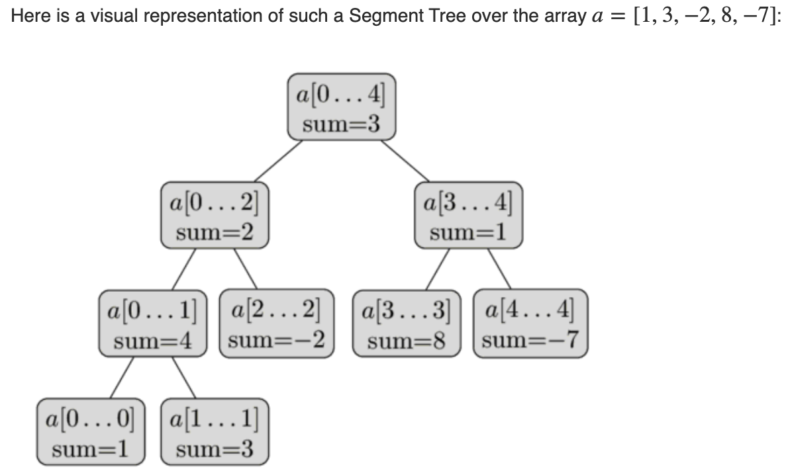

## Segment Tree(range query, update, find min and max)

For a given array arr[0... n - 1], 

1. find the sum of elements from index i to j where 0 <= i <= j <= n - 1
2. Update element in the array.
3. Max or Min in certain range.

Segment Tree comes handy when **there are large number of queries and updates**.

Properties of Segment Tree:

1. Leaf nodes are the elements of the input array.
2. Each internal node(parents) represents the merge information of the leaf nodes(eg. parents represent **Sum of the leaf nodes**) .

**Array representation:** Assuming the root index is at `1`.Then the left child will be located `2 * i` and right child will be located at`2 * i + 1`. The parent of such node is at .

Example of Sum Segment Tree:

**Construction:** Dividing the array into two halves segments until the length of every segments become 1.  

**Total size of segment tree:** Let n be the size of the array. 

1. If n is a power of 2, then there are no dummy nodes.Total of `2*n - 1` nodes (n leaf nodes and n - 1internal nodes).
2. If n is not a power of 2, then the size will be `2*x - 1` where `x` is the smallest power of 2 greater than `n`.(eg. if n = 6, then x = 8 = $2^3$ so the size will be 2 * 8 - 1 = 15).

**Height of segment tree:** The height of segment tree is  as we always divide the segments into two halves at every level.In order to maintain the relation between parents and children, the size of the tree must be a Full Binary Tree which is.

**Time Complexity:** 

1. O(n) for constructing segment tree.
2. O($\log n$) for query sum (at most height of the tree).
3. O($\log n$) for update sum (at most height of the tree).

**Implementation:**

[Java Implementation of Segement Tree](https://github.com/LearnToRunFast/cs-related-notes/Data%20Structures%20and%20Algorithms/Code%20Implementations/SegmentTree)

**References:**

[cp-algorithms](https://cp-algorithms.com/data_structures/segment_tree.html)

[geeksforgeeks](https://www.geeksforgeeks.org/segment-tree-set-1-sum-of-given-range/)

