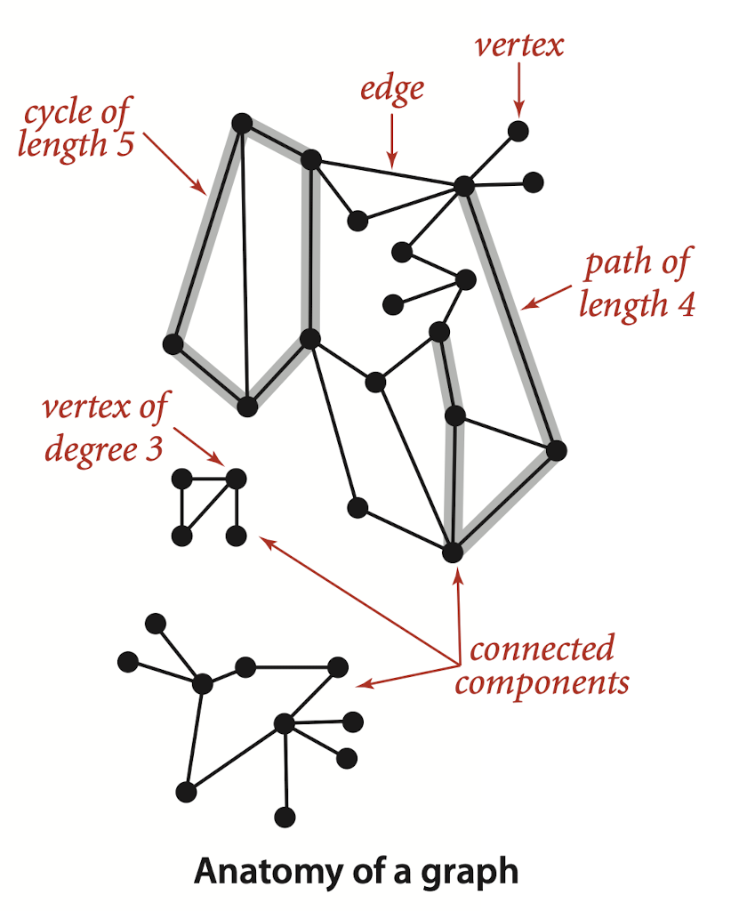
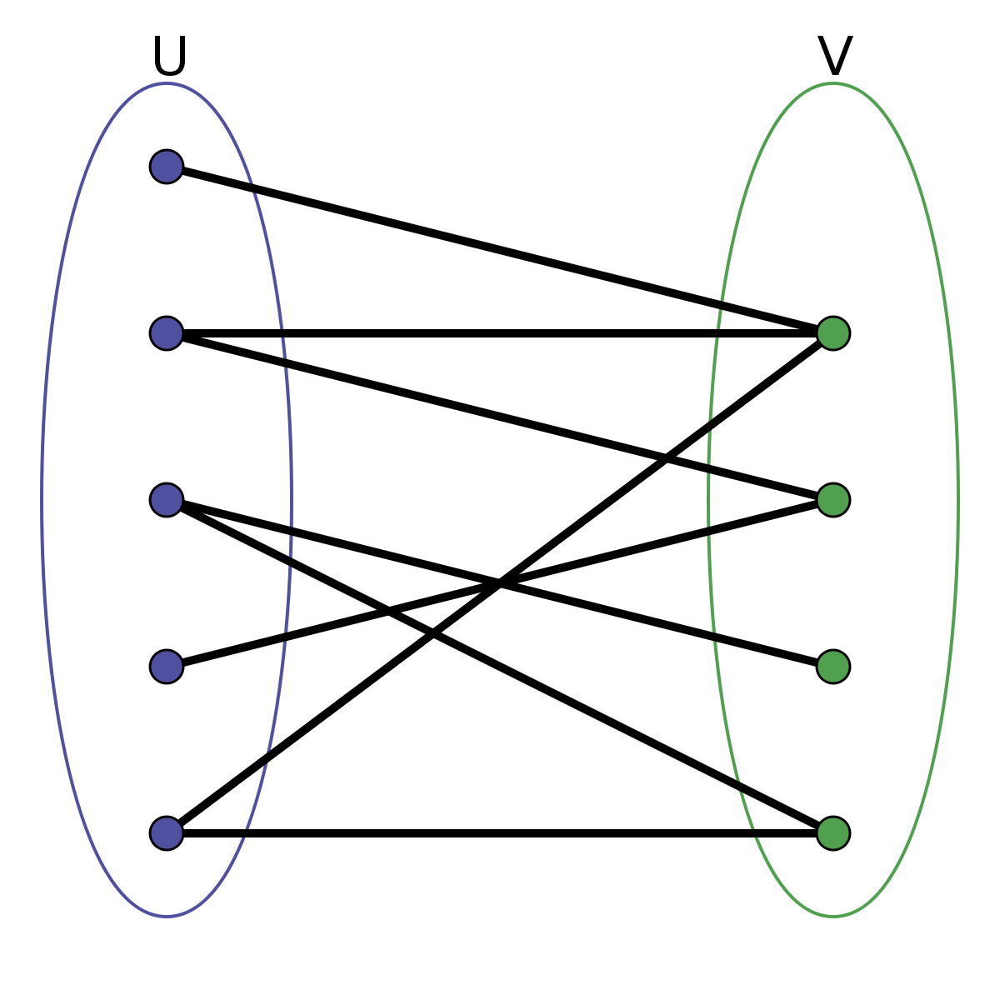
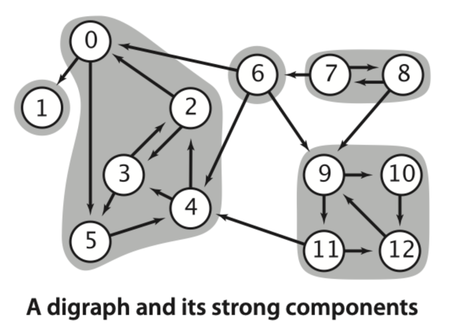
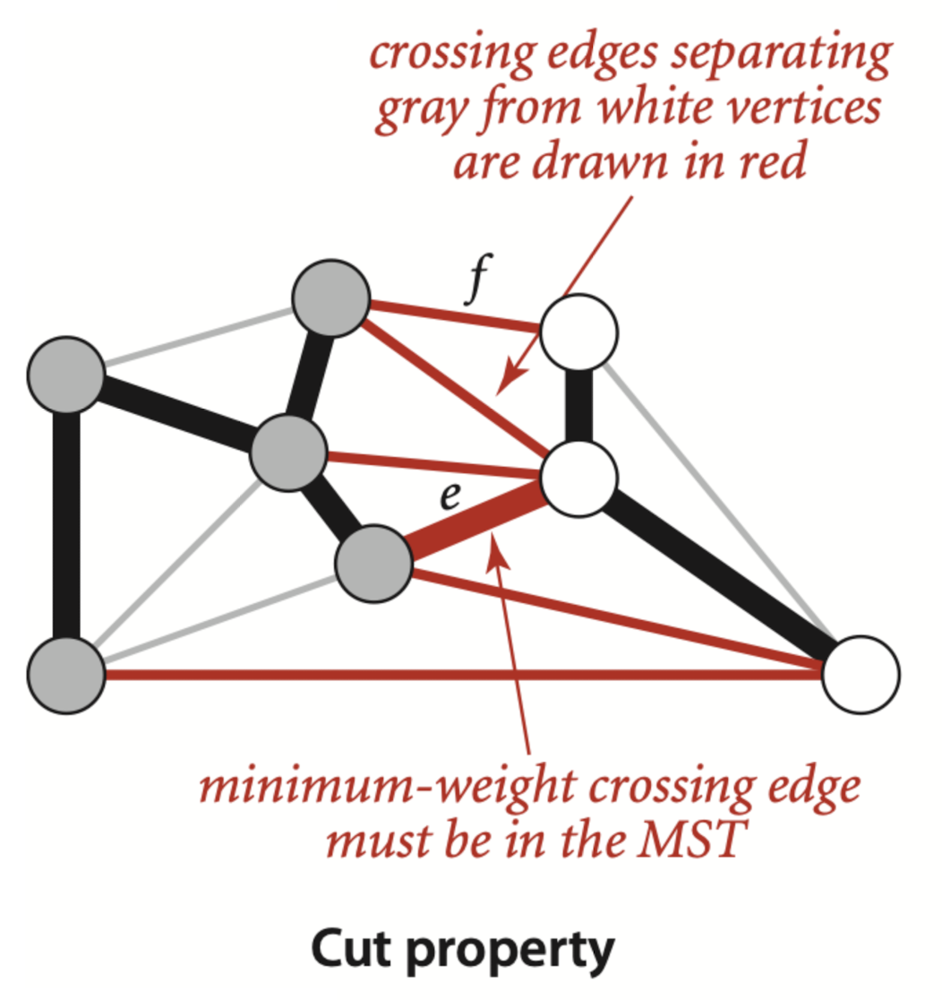

[toc]

# Graph

**Graph**: A **graph** is a set of vertices and a collection of edges that each connect a pair of vertices.

**Vertex:** Vertex is the node of the graph.

**Edge:**  Edge connects two vertexes together.

**Path:** A path in a graph is a sequence of vertices connected by edges. 

**Simple Path:** A simple path is one with no repeated vertices. 

**Cycle:** A cycle is a path with at least one edge whose first and last vertices are the same. 

**Connected Graph:** A graph is connected if there is a path from every vertex to every other vertex in the graph. A graph that is not connected consists of a set of connected components, which are maximal connected subgraphs.

**Acyclic Graph:** An acyclic graph is a graph with no cycles.A tree is an acyclic connected graph. 

**Tree:** An acyclic connected graph.A graph G with V vertices is a [[Tree]] if and only if it satisfies any of the following five conditions:

- G has $V-1$ edges and no cycles.
- G has $V-1$ edges and is connected.
- G is connected, but removing any edge disconnects it.
- G is acyclic, but adding any edge creates a cycle.
- Exactly one simple path connects each pair of vertices in G.

**Forest:** A disjoint set of trees is called a forest. 

**Spanning Tree:** A spanning tree of a connected graph is a subgraph that contains all of that graph’s vertices and is a single tree. 

**Spanning Forest:** A spanning forest of a graph is the union of spanning trees of its connected components.

**Adjacent:** When there is an edge connecting two vertices, we say that the vertices are adjacent to one another.

**Degree:** The degree of a vertex is the number of edges connected to it.

**Subgraph:** A subgraph is a subset of a graph’s edges (and associated vertices) that constitutes a graph.



## Undirected Graphs

```java
import java.util.NoSuchElementException;

public class Graph {
    private static final String NEWLINE = System.getProperty("line.separator");

    private final int V;
    private int E;
    private List<List<Integer>> adj;
    
    public Graph(int V) {
        if (V < 0) throw new IllegalArgumentException("Number of vertices must be nonnegative");
        this.V = V;
        this.E = 0;
        adj = new ArrayList<>(V);
        for (int v = 0; v < V; v++) {
            adj[v] = new ArrayList<Integer>();
        }
    }

    public Graph(In in) {
        if (in == null) throw new IllegalArgumentException("argument is null");
        try {
            this.V = in.readInt();
            if (V < 0) throw new IllegalArgumentException("number of vertices in a Graph must be nonnegative");
            adj = new ArrayList<>(V);
            for (int v = 0; v < V; v++) {
                adj[v] = new List<Integer>();
            }
            int E = in.readInt();
            if (E < 0) throw new IllegalArgumentException("number of edges in a Graph must be nonnegative");
            for (int i = 0; i < E; i++) {
                int v = in.readInt();
                int w = in.readInt();
                validateVertex(v);
                validateVertex(w);
                addEdge(v, w); 
            }
        }
        catch (NoSuchElementException e) {
            throw new IllegalArgumentException("invalid input format in Graph constructor", e);
        }
    }
		
    // num of vertices
    public int V() {
        return V;
    }
		// num of edges
    public int E() {
        return E;
    }

    private void validateVertex(int v) {
        if (v < 0 || v >= V)
            throw new IllegalArgumentException("vertex " + v + " is not between 0 and " + (V-1));
    }

    public void addEdge(int v, int w) {
        validateVertex(v);
        validateVertex(w);
        E++;
        adj.get(v).add(w);
        adj.get(w).add(v);
    }


    public Iterable<Integer> adj(int v) {
        validateVertex(v);
        return adj.get(v);
    }

    public int degree(int v) {
        validateVertex(v);
        return adj.get(v).size();
    }

    public String toString() {
        StringBuilder s = new StringBuilder();
        s.append(V + " vertices, " + E + " edges " + NEWLINE);
        for (int v = 0; v < V; v++) {
            s.append(v + ": ");
            for (int w : adj.get(v)) {
                s.append(w + " ");
            }
            s.append(NEWLINE);
        }
        return s.toString();
    }
}
```

### Depth-First Search

```java
public class DepthFirstPaths {
    private boolean[] marked;    // marked[v] = is there an s-v path?
    private int[] edgeTo;        // edgeTo[v] = last edge on s-v path
    private final int s;         // source vertex

    public DepthFirstPaths(Graph G, int s) {
        this.s = s;
        edgeTo = new int[G.V()];
        marked = new boolean[G.V()];
        validateVertex(s);
        dfs(G, s);
    }

    // depth first search from v
    private void dfs(Graph G, int v) {
        marked[v] = true;
        for (int w : G.adj(v)) {
            if (!marked[w]) {
                edgeTo[w] = v;
                dfs(G, w);
            }
        }
    }

    public boolean hasPathTo(int v) {
        validateVertex(v);
        return marked[v];
    }

    public Iterable<Integer> pathTo(int v) {
        validateVertex(v);
        if (!hasPathTo(v)) return null;
        Stack<Integer> path = new Stack<Integer>();
        for (int x = v; x != s; x = edgeTo[x])
            path.push(x);
        path.push(s);
        return path;
    }

    // throw an IllegalArgumentException unless {@code 0 <= v < V}
    private void validateVertex(int v) {
        int V = marked.length;
        if (v < 0 || v >= V)
            throw new IllegalArgumentException("vertex " + v + " is not between 0 and " + (V-1));
    }
}
```

### Breadth-first Search (Shortest Path)

```java
public class BreadthFirstPaths {
    private static final int INFINITY = Integer.MAX_VALUE;
    private boolean[] marked;  // marked[v] = is there an s-v path
    private int[] edgeTo;      // edgeTo[v] = previous edge on shortest s-v path
    private int[] distTo;      // distTo[v] = number of edges shortest s-v path

    public BreadthFirstPaths(Graph G, int s) {
        marked = new boolean[G.V()];
        distTo = new int[G.V()];
        edgeTo = new int[G.V()];
        validateVertex(s);
        bfs(G, s);

        assert check(G, s);
    }

    public BreadthFirstPaths(Graph G, Iterable<Integer> sources) {
        marked = new boolean[G.V()];
        distTo = new int[G.V()];
        edgeTo = new int[G.V()];
        for (int v = 0; v < G.V(); v++)
            distTo[v] = INFINITY;
        validateVertices(sources);
        bfs(G, sources);
    }

    // breadth-first search from a single source
    private void bfs(Graph G, int s) {
        Queue<Integer> q = new Queue<Integer>();
        for (int v = 0; v < G.V(); v++)
            distTo[v] = INFINITY;
        distTo[s] = 0;
        marked[s] = true;
        q.enqueue(s);

        while (!q.isEmpty()) {
            int v = q.dequeue();
            for (int w : G.adj(v)) {
                if (!marked[w]) {
                    edgeTo[w] = v;
                    distTo[w] = distTo[v] + 1;
                    marked[w] = true;
                    q.enqueue(w);
                }
            }
        }
    }

    // breadth-first search from multiple sources
    private void bfs(Graph G, Iterable<Integer> sources) {
        Queue<Integer> q = new Queue<Integer>();
        for (int s : sources) {
            marked[s] = true;
            distTo[s] = 0;
            q.enqueue(s);
        }
        while (!q.isEmpty()) {
            int v = q.dequeue();
            for (int w : G.adj(v)) {
                if (!marked[w]) {
                    edgeTo[w] = v;
                    distTo[w] = distTo[v] + 1;
                    marked[w] = true;
                    q.enqueue(w);
                }
            }
        }
    }

    public boolean hasPathTo(int v) {
        validateVertex(v);
        return marked[v];
    }

    public int distTo(int v) {
        validateVertex(v);
        return distTo[v];
    }

    public Iterable<Integer> pathTo(int v) {
        validateVertex(v);
        if (!hasPathTo(v)) return null;
        Stack<Integer> path = new Stack<Integer>();
        int x;
        for (x = v; distTo[x] != 0; x = edgeTo[x])
            path.push(x);
        path.push(x);
        return path;
    }

    // check optimality conditions for single source
    private boolean check(Graph G, int s) {

        // check that the distance of s = 0
        if (distTo[s] != 0) {
            StdOut.println("distance of source " + s + " to itself = " + distTo[s]);
            return false;
        }

        // check that for each edge v-w dist[w] <= dist[v] + 1
        // provided v is reachable from s
        for (int v = 0; v < G.V(); v++) {
            for (int w : G.adj(v)) {
                if (hasPathTo(v) != hasPathTo(w)) {
                    StdOut.println("edge " + v + "-" + w);
                    StdOut.println("hasPathTo(" + v + ") = " + hasPathTo(v));
                    StdOut.println("hasPathTo(" + w + ") = " + hasPathTo(w));
                    return false;
                }
                if (hasPathTo(v) && (distTo[w] > distTo[v] + 1)) {
                    StdOut.println("edge " + v + "-" + w);
                    StdOut.println("distTo[" + v + "] = " + distTo[v]);
                    StdOut.println("distTo[" + w + "] = " + distTo[w]);
                    return false;
                }
            }
        }

        // check that v = edgeTo[w] satisfies distTo[w] = distTo[v] + 1
        // provided v is reachable from s
        for (int w = 0; w < G.V(); w++) {
            if (!hasPathTo(w) || w == s) continue;
            int v = edgeTo[w];
            if (distTo[w] != distTo[v] + 1) {
                StdOut.println("shortest path edge " + v + "-" + w);
                StdOut.println("distTo[" + v + "] = " + distTo[v]);
                StdOut.println("distTo[" + w + "] = " + distTo[w]);
                return false;
            }
        }

        return true;
    }

    // throw an IllegalArgumentException unless {@code 0 <= v < V}
    private void validateVertex(int v) {
        int V = marked.length;
        if (v < 0 || v >= V)
            throw new IllegalArgumentException("vertex " + v + " is not between 0 and " + (V-1));
    }

    // throw an IllegalArgumentException unless {@code 0 <= v < V}
    private void validateVertices(Iterable<Integer> vertices) {
        if (vertices == null) {
            throw new IllegalArgumentException("argument is null");
        }
        for (Integer v : vertices) {
            if (v == null) {
                throw new IllegalArgumentException("vertex is null");
            }
            validateVertex(v);
        }
    }
}
```

### Connected Component

Find connected component with given graph

```java
public class CC {
    private boolean[] marked;   // marked[v] = has vertex v been marked?
    private int[] id;           // id[v] = id of connected component containing v
    private int[] size;         // size[id] = number of vertices in given component
    private int count;          // number of connected components

    public CC(Graph G) {
        marked = new boolean[G.V()];
        id = new int[G.V()];
        size = new int[G.V()];
        for (int v = 0; v < G.V(); v++) {
            if (!marked[v]) {
                dfs(G, v);
                count++;
            }
        }
    }

    public CC(EdgeWeightedGraph G) {
        marked = new boolean[G.V()];
        id = new int[G.V()];
        size = new int[G.V()];
        for (int v = 0; v < G.V(); v++) {
            if (!marked[v]) {
                dfs(G, v);
                count++;
            }
        }
    }

    // depth-first search for a Graph
    private void dfs(Graph G, int v) {
        marked[v] = true;
        id[v] = count;
        size[count]++;
        for (int w : G.adj(v)) {
            if (!marked[w]) {
                dfs(G, w);
            }
        }
    }

    // depth-first search for an EdgeWeightedGraph
    private void dfs(EdgeWeightedGraph G, int v) {
        marked[v] = true;
        id[v] = count;
        size[count]++;
        for (Edge e : G.adj(v)) {
            int w = e.other(v);
            if (!marked[w]) {
                dfs(G, w);
            }
        }
    }

    public int id(int v) {
        validateVertex(v);
        return id[v];
    }

    public int size(int v) {
        validateVertex(v);
        return size[id[v]];
    }

    public int count() {
        return count;
    }

    public boolean connected(int v, int w) {
        validateVertex(v);
        validateVertex(w);
        return id(v) == id(w);
    }

    // throw an IllegalArgumentException unless {@code 0 <= v < V}
    private void validateVertex(int v) {
        int V = marked.length;
        if (v < 0 || v >= V)
            throw new IllegalArgumentException("vertex " + v + " is not between 0 and " + (V-1));
    }

}

```

### Bipartite Graph

In the mathematical field of graph theory, a bipartite graph is a graph whose vertices can be divided into two disjoint and independent sets and such that every edge connects a vertex in to one in. 



#### Find Bipartite Graph

```java
public class Bipartite {
    private boolean isBipartite;   // is the graph bipartite?
    private boolean[] color;       // color[v] gives vertices on one side of bipartition
    private boolean[] marked;      // marked[v] = true iff v has been visited in DFS
    private int[] edgeTo;          // edgeTo[v] = last edge on path to v
    private Stack<Integer> cycle;  // odd-length cycle

    public Bipartite(Graph G) {
        isBipartite = true;
        color  = new boolean[G.V()];
        marked = new boolean[G.V()];
        edgeTo = new int[G.V()];

        for (int v = 0; v < G.V(); v++) {
            if (!marked[v]) {
                dfs(G, v);
            }
        }
        assert check(G);
    }

    private void dfs(Graph G, int v) { 
        marked[v] = true;
        for (int w : G.adj(v)) {

            // short circuit if odd-length cycle found
            if (cycle != null) return;

            // found uncolored vertex, so recur
            if (!marked[w]) {
                edgeTo[w] = v;
                color[w] = !color[v];
                dfs(G, w);
            } 
            // if v-w create an odd-length cycle, find it
            else if (color[w] == color[v]) {
                isBipartite = false;
                cycle = new Stack<Integer>();
                cycle.push(w);  // don't need this unless you want to include start vertex twice
                for (int x = v; x != w; x = edgeTo[x]) {
                    cycle.push(x);
                }
                cycle.push(w);
            }
        }
    }

    public boolean isBipartite() {
        return isBipartite;
    }
 
    public boolean color(int v) {
        validateVertex(v);
        if (!isBipartite)
            throw new UnsupportedOperationException("graph is not bipartite");
        return color[v];
    }

    public Iterable<Integer> oddCycle() {
        return cycle; 
    }

    private boolean check(Graph G) {
        // graph is bipartite
        if (isBipartite) {
            for (int v = 0; v < G.V(); v++) {
                for (int w : G.adj(v)) {
                    if (color[v] == color[w]) {
                        System.err.printf("edge %d-%d with %d and %d in same side of bipartition\n", v, w, v, w);
                        return false;
                    }
                }
            }
        }

        // graph has an odd-length cycle
        else {
            // verify cycle
            int first = -1, last = -1;
            for (int v : oddCycle()) {
                if (first == -1) first = v;
                last = v;
            }
            if (first != last) {
                System.err.printf("cycle begins with %d and ends with %d\n", first, last);
                return false;
            }
        }

        return true;
    }

    // throw an IllegalArgumentException unless {@code 0 <= v < V}
    private void validateVertex(int v) {
        int V = marked.length;
        if (v < 0 || v >= V)
            throw new IllegalArgumentException("vertex " + v + " is not between 0 and " + (V-1));
    }
}
```

### Cycle Detection

#### Using Boolean Array

```java
public class Cycle {
    private boolean[] marked;
    private int[] edgeTo;
    private Stack<Integer> cycle;
		private boolean[] onStack;
  
    public Cycle(Graph G) {
        if (hasSelfLoop(G)) return;
        if (hasParallelEdges(G)) return;
        marked = new boolean[G.V()];
        edgeTo = new int[G.V()];
        onStack = new boolean[G.V()];
        for (int v = 0; v < G.V(); v++) {
          if (!marked[v]) {
 						dfs(G, v);
          }    
        }
    }

    // does this graph have a self loop?
    // side effect: initialize cycle to be self loop
    private boolean hasSelfLoop(Graph G) {
        for (int v = 0; v < G.V(); v++) {
            for (int w : G.adj(v)) {
                if (v == w) {
                    cycle = new Stack<Integer>();
                    cycle.push(v);
                    cycle.push(v);
                    return true;
                }
            }
        }
        return false;
    }

    // does this graph have two parallel edges?
    // side effect: initialize cycle to be two parallel edges
    private boolean hasParallelEdges(Graph G) {
        marked = new boolean[G.V()];

        for (int v = 0; v < G.V(); v++) {

            // check for parallel edges incident to v
            for (int w : G.adj(v)) {
                if (marked[w]) {
                    cycle = new Stack<Integer>();
                    cycle.push(v);
                    cycle.push(w);
                    cycle.push(v);
                    return true;
                }
                marked[w] = true;
            }

            // reset so marked[v] = false for all v
            for (int w : G.adj(v)) {
                marked[w] = false;
            }
        }
        return false;
    }

    public boolean hasCycle() {
        return cycle != null;
    }

    public Iterable<Integer> cycle() {
        return cycle;
    }

    private void dfs(Graph G, int u, int v) {
        marked[v] = true;
        onStack[v] = true;
        for (int w : G.adj(v)) {
					
            // short circuit if cycle already found
            if (cycle != null) return;

            if (!marked[w]) {
                edgeTo[w] = v;
                dfs(G, w);
            }
            else if (onStack[w]) {
                cycle = new Stack<Integer>();
                for (int x = v; x != w; x = edgeTo[x]) {
                    cycle.push(x);
                }
                cycle.push(w);
                cycle.push(v);
            }
        }
      	onStack[v] = false;
    }
}
```

#### Using Three Vertixes

```java
public class Cycle {
    private boolean[] marked;
    private int[] edgeTo;
    private Stack<Integer> cycle;

    public Cycle(Graph G) {
        if (hasSelfLoop(G)) return;
        if (hasParallelEdges(G)) return;
        marked = new boolean[G.V()];
        edgeTo = new int[G.V()];
        for (int v = 0; v < G.V(); v++)
            if (!marked[v])
                dfs(G, -1, v);
    }

    // does this graph have a self loop?
    // side effect: initialize cycle to be self loop
    private boolean hasSelfLoop(Graph G) {
        for (int v = 0; v < G.V(); v++) {
            for (int w : G.adj(v)) {
                if (v == w) {
                    cycle = new Stack<Integer>();
                    cycle.push(v);
                    cycle.push(v);
                    return true;
                }
            }
        }
        return false;
    }

    // does this graph have two parallel edges?
    // side effect: initialize cycle to be two parallel edges
    private boolean hasParallelEdges(Graph G) {
        marked = new boolean[G.V()];

        for (int v = 0; v < G.V(); v++) {

            // check for parallel edges incident to v
            for (int w : G.adj(v)) {
                if (marked[w]) {
                    cycle = new Stack<Integer>();
                    cycle.push(v);
                    cycle.push(w);
                    cycle.push(v);
                    return true;
                }
                marked[w] = true;
            }

            // reset so marked[v] = false for all v
            for (int w : G.adj(v)) {
                marked[w] = false;
            }
        }
        return false;
    }

    public boolean hasCycle() {
        return cycle != null;
    }

    public Iterable<Integer> cycle() {
        return cycle;
    }

    private void dfs(Graph G, int u, int v) {
        marked[v] = true;
        for (int w : G.adj(v)) {

            // short circuit if cycle already found
            if (cycle != null) return;

            if (!marked[w]) {
                edgeTo[w] = v;
                dfs(G, v, w);
            }
            // check for cycle (but disregard reverse of edge leading to v)
            else if (w != u) {
                cycle = new Stack<Integer>();
                for (int x = v; x != w; x = edgeTo[x]) {
                    cycle.push(x);
                }
                cycle.push(w);
                cycle.push(v);
            }
        }
    }
}
```

#### Directed Cycle

```java
public class EdgeWeightedDirectedCycle {
    private boolean[] marked;             // marked[v] = has vertex v been marked?
    private DirectedEdge[] edgeTo;        // edgeTo[v] = previous edge on path to v
    private boolean[] onStack;            // onStack[v] = is vertex on the stack?
    private Stack<DirectedEdge> cycle;    // directed cycle (or null if no such cycle)

    public EdgeWeightedDirectedCycle(EdgeWeightedDigraph G) {
        marked  = new boolean[G.V()];
        onStack = new boolean[G.V()];
        edgeTo  = new DirectedEdge[G.V()];
        for (int v = 0; v < G.V(); v++)
            if (!marked[v]) dfs(G, v);

        // check that digraph has a cycle
        assert check();
    }

    // check that algorithm computes either the topological order or finds a directed cycle
    private void dfs(EdgeWeightedDigraph G, int v) {
        onStack[v] = true;
        marked[v] = true;
        for (DirectedEdge e : G.adj(v)) {
            int w = e.to();

            // short circuit if directed cycle found
            if (cycle != null) return;

            // found new vertex, so recur
            else if (!marked[w]) {
                edgeTo[w] = e;
                dfs(G, w);
            }

            // trace back directed cycle
            else if (onStack[w]) {
                cycle = new Stack<DirectedEdge>();

                DirectedEdge f = e;
                while (f.from() != w) {
                    cycle.push(f);
                    f = edgeTo[f.from()];
                }
                cycle.push(f);

                return;
            }
        }

        onStack[v] = false;
    }

    public boolean hasCycle() {
        return cycle != null;
    }

    public Iterable<DirectedEdge> cycle() {
        return cycle;
    }


    // certify that digraph is either acyclic or has a directed cycle
    private boolean check() {

        // edge-weighted digraph is cyclic
        if (hasCycle()) {
            // verify cycle
            DirectedEdge first = null, last = null;
            for (DirectedEdge e : cycle()) {
                if (first == null) first = e;
                if (last != null) {
                    if (last.to() != e.from()) {
                        System.err.printf("cycle edges %s and %s not incident\n", last, e);
                        return false;
                    }
                }
                last = e;
            }

            if (last.to() != first.from()) {
                System.err.printf("cycle edges %s and %s not incident\n", last, first);
                return false;
            }
        }


        return true;
    }

    public static void main(String[] args) {

        // create random DAG with V vertices and E edges; then add F random edges
        int V = Integer.parseInt(args[0]);
        int E = Integer.parseInt(args[1]);
        int F = Integer.parseInt(args[2]);
        EdgeWeightedDigraph G = new EdgeWeightedDigraph(V);
        int[] vertices = new int[V];
        for (int i = 0; i < V; i++)
            vertices[i] = i;
        StdRandom.shuffle(vertices);
        for (int i = 0; i < E; i++) {
            int v, w;
            do {
                v = StdRandom.uniform(V);
                w = StdRandom.uniform(V);
            } while (v >= w);
            double weight = StdRandom.uniform();
            G.addEdge(new DirectedEdge(v, w, weight));
        }

        // add F extra edges
        for (int i = 0; i < F; i++) {
            int v = StdRandom.uniform(V);
            int w = StdRandom.uniform(V);
            double weight = StdRandom.uniform(0.0, 1.0);
            G.addEdge(new DirectedEdge(v, w, weight));
        }

        StdOut.println(G);

        // find a directed cycle
        EdgeWeightedDirectedCycle finder = new EdgeWeightedDirectedCycle(G);
        if (finder.hasCycle()) {
            StdOut.print("Cycle: ");
            for (DirectedEdge e : finder.cycle()) {
                StdOut.print(e + " ");
            }
            StdOut.println();
        }

        // or give topologial sort
        else {
            StdOut.println("No directed cycle");
        }
    }
}
```


## Directed Graphs

A directed graph (or digraph) is a set of vertices and a collection of directed edges. Each directed edge connects an ordered pair of vertices.

### API

```java
import java.util.NoSuchElementException;

public class Digraph {
    Digraph(int V)
    Digraph(In in)
    Digraph(Digraph G)
      
    int V()
    int E()
    void addEdge(int v, int w)
    Iterable<Integer> adj(int v)
    int outdegree(int v)
    int indegree(int v)
    Digraph reverse()
    String toString()
}
```

### Implementation

```java
import java.util.NoSuchElementException;

public class Digraph {
    private static final String NEWLINE = System.getProperty("line.separator");

    private final int V;           // number of vertices in this digraph
    private int E;                 // number of edges in this digraph
    private List<List<Integer>> adj;    // adj[v] = adjacency list for vertex v
    private int[] indegree;        // indegree[v] = indegree of vertex v
    
    public Digraph(int V) {
        if (V < 0) throw new IllegalArgumentException("Number of vertices in a Digraph must be nonnegative");
        this.V = V;
        this.E = 0;
        indegree = new int[V];
        adj = new ArrayList<>(V);
        for (int v = 0; v < V; v++) {
            adj.get(v).set(new ArrayList<Integer>());
        }
    }

    public Digraph(In in) {
        if (in == null) throw new IllegalArgumentException("argument is null");
        try {
            this.V = in.readInt();
            if (V < 0) throw new IllegalArgumentException("number of vertices in a Digraph must be nonnegative");
            indegree = new int[V];
            dj = new ArrayList<>(V);
            for (int v = 0; v < V; v++) {
                adj.get(v).set(new ArrayList<Integer>());
            }
            int E = in.readInt();
            if (E < 0) throw new IllegalArgumentException("number of edges in a Digraph must be nonnegative");
            for (int i = 0; i < E; i++) {
                int v = in.readInt();
                int w = in.readInt();
                addEdge(v, w); 
            }
        }
        catch (NoSuchElementException e) {
            throw new IllegalArgumentException("invalid input format in Digraph constructor", e);
        }
    }

    public Digraph(Digraph G) {
        if (G == null) throw new IllegalArgumentException("argument is null");

        this.V = G.V();
        this.E = G.E();
        if (V < 0) throw new IllegalArgumentException("Number of vertices in a Digraph must be nonnegative");

        // update indegrees
        indegree = new int[V];
        for (int v = 0; v < V; v++)
            this.indegree[v] = G.indegree(v);

        // update adjacency lists
        adj = new ArrayList<>(V);
        for (int v = 0; v < V; v++) {
          adj.get(v).set(new ArrayList<Integer>());
        }

        for (int v = 0; v < G.V(); v++) {
            // reverse so that adjacency list is in same order as original
            Stack<Integer> reverse = new Stack<Integer>();
            for (int w : G.adj[v]) {
                reverse.push(w);
            }
            for (int w : reverse) {
                adj.get(v).add(w);
            }
        }
    }
        
    public int V() {
        return V;
    }

    public int E() {
        return E;
    }


    // throw an IllegalArgumentException unless {@code 0 <= v < V}
    private void validateVertex(int v) {
        if (v < 0 || v >= V)
            throw new IllegalArgumentException("vertex " + v + " is not between 0 and " + (V-1));
    }

    public void addEdge(int v, int w) {
        validateVertex(v);
        validateVertex(w);
        adj.get(v).add(w);
        indegree[w]++;
        E++;
    }

    public Iterable<Integer> adj(int v) {
        validateVertex(v);
        return adj[v];
    }

    public int outdegree(int v) {
        validateVertex(v);
        return adj[v].size();
    }

    public int indegree(int v) {
        validateVertex(v);
        return indegree[v];
    }

    public Digraph reverse() {
        Digraph reverse = new Digraph(V);
        for (int v = 0; v < V; v++) {
            for (int w : adj(v)) {
                reverse.addEdge(w, v);
            }
        }
        return reverse;
    }

    public String toString() {
        StringBuilder s = new StringBuilder();
        s.append(V + " vertices, " + E + " edges " + NEWLINE);
        for (int v = 0; v < V; v++) {
            s.append(String.format("%d: ", v));
            for (int w : adj[v]) {
                s.append(String.format("%d ", w));
            }
            s.append(NEWLINE);
        }
        return s.toString();
    }
}
```

## Topological Sort

### Depth First Order

```java
public class DepthFirstOrder {
    private boolean[] marked;          // marked[v] = has v been marked in dfs?
    private int[] pre;                 // pre[v]    = preorder  number of v
    private int[] post;                // post[v]   = postorder number of v
    private Queue<Integer> preorder;   // vertices in preorder
    private Queue<Integer> postorder;  // vertices in postorder
    private int preCounter;            // counter or preorder numbering
    private int postCounter;           // counter for postorder numbering

    /**
     * Determines a depth-first order for the digraph {@code G}.
     * @param G the digraph
     */
    public DepthFirstOrder(Digraph G) {
        pre    = new int[G.V()];
        post   = new int[G.V()];
        postorder = new Queue<Integer>();
        preorder  = new Queue<Integer>();
        marked    = new boolean[G.V()];
        for (int v = 0; v < G.V(); v++)
            if (!marked[v]) dfs(G, v);

        assert check();
    }

    /**
     * Determines a depth-first order for the edge-weighted digraph {@code G}.
     * @param G the edge-weighted digraph
     */
    public DepthFirstOrder(EdgeWeightedDigraph G) {
        pre    = new int[G.V()];
        post   = new int[G.V()];
        postorder = new Queue<Integer>();
        preorder  = new Queue<Integer>();
        marked    = new boolean[G.V()];
        for (int v = 0; v < G.V(); v++)
            if (!marked[v]) dfs(G, v);
    }

    // run DFS in digraph G from vertex v and compute preorder/postorder
    private void dfs(Digraph G, int v) {
        marked[v] = true;
        pre[v] = preCounter++;
        preorder.enqueue(v);
        for (int w : G.adj(v)) {
            if (!marked[w]) {
                dfs(G, w);
            }
        }
        postorder.enqueue(v);
        post[v] = postCounter++;
    }

    // run DFS in edge-weighted digraph G from vertex v and compute preorder/postorder
    private void dfs(EdgeWeightedDigraph G, int v) {
        marked[v] = true;
        pre[v] = preCounter++;
        preorder.enqueue(v);
        for (DirectedEdge e : G.adj(v)) {
            int w = e.to();
            if (!marked[w]) {
                dfs(G, w);
            }
        }
        postorder.enqueue(v);
        post[v] = postCounter++;
    }

    /**
     * Returns the preorder number of vertex {@code v}.
     * @param  v the vertex
     * @return the preorder number of vertex {@code v}
     * @throws IllegalArgumentException unless {@code 0 <= v < V}
     */
    public int pre(int v) {
        validateVertex(v);
        return pre[v];
    }

    /**
     * Returns the postorder number of vertex {@code v}.
     * @param  v the vertex
     * @return the postorder number of vertex {@code v}
     * @throws IllegalArgumentException unless {@code 0 <= v < V}
     */
    public int post(int v) {
        validateVertex(v);
        return post[v];
    }

    /**
     * Returns the vertices in postorder.
     * @return the vertices in postorder, as an iterable of vertices
     */
    public Iterable<Integer> post() {
        return postorder;
    }

    public Iterable<Integer> pre() {
        return preorder;
    }

    public Iterable<Integer> reversePost() {
        Stack<Integer> reverse = new Stack<Integer>();
        for (int v : postorder)
            reverse.push(v);
        return reverse;
    }


    // check that pre() and post() are consistent with pre(v) and post(v)
    private boolean check() {

        // check that post(v) is consistent with post()
        int r = 0;
        for (int v : post()) {
            if (post(v) != r) {
                StdOut.println("post(v) and post() inconsistent");
                return false;
            }
            r++;
        }

        // check that pre(v) is consistent with pre()
        r = 0;
        for (int v : pre()) {
            if (pre(v) != r) {
                StdOut.println("pre(v) and pre() inconsistent");
                return false;
            }
            r++;
        }

        return true;
    }

    // throw an IllegalArgumentException unless {@code 0 <= v < V}
    private void validateVertex(int v) {
        int V = marked.length;
        if (v < 0 || v >= V)
            throw new IllegalArgumentException("vertex " + v + " is not between 0 and " + (V-1));
    }

}
```

### Topological Sort

```java
public class Topological {
    private Iterable<Integer> order;  // topological order
    private int[] rank;               // rank[v] = rank of vertex v in order

    public Topological(Digraph G) {
        DirectedCycle finder = new DirectedCycle(G);
        if (!finder.hasCycle()) {
            DepthFirstOrder dfs = new DepthFirstOrder(G);
            order = dfs.reversePost();
            rank = new int[G.V()];
            int i = 0;
            for (int v : order)
                rank[v] = i++;
        }
    }

    public Topological(EdgeWeightedDigraph G) {
        EdgeWeightedDirectedCycle finder = new EdgeWeightedDirectedCycle(G);
        if (!finder.hasCycle()) {
            DepthFirstOrder dfs = new DepthFirstOrder(G);
            order = dfs.reversePost();
        }
    }

    public Iterable<Integer> order() {
        return order;
    }

    public boolean hasOrder() {
        return order != null;
    }

    public int rank(int v) {
        validateVertex(v);
        if (hasOrder()) return rank[v];
        else            return -1;
    }

    // throw an IllegalArgumentException unless {@code 0 <= v < V}
    private void validateVertex(int v) {
        int V = rank.length;
        if (v < 0 || v >= V)
            throw new IllegalArgumentException("vertex " + v + " is not between 0 and " + (V-1));
    }
  
    public static void main(String[] args) {
        String filename  = args[0];
        String delimiter = args[1];
        SymbolDigraph sg = new SymbolDigraph(filename, delimiter);
        Topological topological = new Topological(sg.digraph());
        for (int v : topological.order()) {
            StdOut.println(sg.nameOf(v));
        }
    }

}
```


## Strong Connectivity In Digraphs

Two vertices `v` and `w` are strongly connected if they are mutually reachable: that is, if there is a directed path from `v` to `w` and a directed path from `w` to `v`. A digraph is strongly connected if all its vertices are strongly connected to one another.

> **_Note:_** Two vertices are strongly connected if and only if there exists a general directed cycle that contains them both.

**Strong connectivity** in digraphs is an equivalence relation on the set of vertices, as it has the following properties:

- **Reflexive** : Every vertex v is strongly connected to itself.
- **Symmetric** : If v is strongly connected to w, then w is strongly connected to v.
- **Transitive** : If v is strongly connected to w and w is strongly connected to x, then v
  is also strongly connected to x.



### Kosaraju-Sharir

Contract each strong component into a single vertex.

- Compute reverse postorder of reverse graph
- Run DFS, considering vertices in reverse topological order

```java
public class KosarajuSharirSCC {
    private boolean[] marked;     // marked[v] = has vertex v been visited?
    private int[] id;             // id[v] = id of strong component containing v
    private int count;            // number of strongly-connected components

    public KosarajuSharirSCC(Digraph G) {

        // compute reverse postorder of reverse graph
        DepthFirstOrder dfs = new DepthFirstOrder(G.reverse());

        // run DFS on G, using reverse postorder to guide calculation
        marked = new boolean[G.V()];
        id = new int[G.V()];
        for (int v : dfs.reversePost()) {
            if (!marked[v]) {
                dfs(G, v);
                count++;
            }
        }

        // check that id[] gives strong components
        assert check(G);
    }

    // DFS on graph G
    private void dfs(Digraph G, int v) { 
        marked[v] = true;
        id[v] = count;
        for (int w : G.adj(v)) {
            if (!marked[w]) dfs(G, w);
        }
    }
  
    public int count() {
        return count;
    }

    public boolean stronglyConnected(int v, int w) {
        validateVertex(v);
        validateVertex(w);
        return id[v] == id[w];
    }

    public int id(int v) {
        validateVertex(v);
        return id[v];
    }

    // does the id[] array contain the strongly connected components?
    private boolean check(Digraph G) {
        TransitiveClosure tc = new TransitiveClosure(G);
        for (int v = 0; v < G.V(); v++) {
            for (int w = 0; w < G.V(); w++) {
                if (stronglyConnected(v, w) != (tc.reachable(v, w) && tc.reachable(w, v)))
                    return false;
            }
        }
        return true;
    }

    // throw an IllegalArgumentException unless {@code 0 <= v < V}
    private void validateVertex(int v) {
        int V = marked.length;
        if (v < 0 || v >= V)
            throw new IllegalArgumentException("vertex " + v + " is not between 0 and " + (V-1));
    }

    public static void main(String[] args) {
        In in = new In(args[0]);
        Digraph G = new Digraph(in);
        KosarajuSharirSCC scc = new KosarajuSharirSCC(G);

        // number of connected components
        int m = scc.count();
        StdOut.println(m + " strong components");

        // compute list of vertices in each strong component
        Queue<Integer>[] components = (Queue<Integer>[]) new Queue[m];
        for (int i = 0; i < m; i++) {
            components[i] = new Queue<Integer>();
        }
        for (int v = 0; v < G.V(); v++) {
            components[scc.id(v)].enqueue(v);
        }

        // print results
        for (int i = 0; i < m; i++) {
            for (int v : components[i]) {
                StdOut.print(v + " ");
            }
            StdOut.println();
        }
    }
}

```

### Tarjan

```java
public class TarjanSCC {

    private boolean[] marked;        // marked[v] = has v been visited?
    private int[] id;                // id[v] = id of strong component containing v
    private int[] low;               // low[v] = low number of v
    private int pre;                 // preorder number counter
    private int count;               // number of strongly-connected components
    private Stack<Integer> stack;

    public TarjanSCC(Digraph G) {
        marked = new boolean[G.V()];
        stack = new Stack<Integer>();
        id = new int[G.V()]; 
        low = new int[G.V()];
        for (int v = 0; v < G.V(); v++) {
            if (!marked[v]) dfs(G, v);
        }

        // check that id[] gives strong components
        assert check(G);
    }

    private void dfs(Digraph G, int v) { 
        marked[v] = true;
        low[v] = pre++;
        int min = low[v];
        stack.push(v);
        for (int w : G.adj(v)) {
            if (!marked[w]) dfs(G, w);
            if (low[w] < min) min = low[w];
        }
        if (min < low[v]) {
            low[v] = min;
            return;
        }
        int w;
        do {
            w = stack.pop();
            id[w] = count;
            low[w] = G.V();
        } while (w != v);
        count++;
    }

    public int count() {
        return count;
    }

    public boolean stronglyConnected(int v, int w) {
        validateVertex(v);
        validateVertex(w);
        return id[v] == id[w];
    }

    public int id(int v) {
        validateVertex(v);
        return id[v];
    }

    // does the id[] array contain the strongly connected components?
    private boolean check(Digraph G) {
        TransitiveClosure tc = new TransitiveClosure(G);
        for (int v = 0; v < G.V(); v++) {
            for (int w = 0; w < G.V(); w++) {
                if (stronglyConnected(v, w) != (tc.reachable(v, w) && tc.reachable(w, v)))
                    return false;
            }
        }
        return true;
    }

    // throw an IllegalArgumentException unless {@code 0 <= v < V}
    private void validateVertex(int v) {
        int V = marked.length;
        if (v < 0 || v >= V)
            throw new IllegalArgumentException("vertex " + v + " is not between 0 and " + (V-1));
    }

    public static void main(String[] args) {
        In in = new In(args[0]);
        Digraph G = new Digraph(in);
        TarjanSCC scc = new TarjanSCC(G);

        // number of connected components
        int m = scc.count();
        StdOut.println(m + " components");

        // compute list of vertices in each strong component
        Queue<Integer>[] components = (Queue<Integer>[]) new Queue[m];
        for (int i = 0; i < m; i++) {
            components[i] = new Queue<Integer>();
        }
        for (int v = 0; v < G.V(); v++) {
            components[scc.id(v)].enqueue(v);
        }

        // print results
        for (int i = 0; i < m; i++) {
            for (int v : components[i]) {
                StdOut.print(v + " ");
            }
            StdOut.println();
        }

    }

}
```

### Gabow

```java
public class GabowSCC {

    private boolean[] marked;        // marked[v] = has v been visited?
    private int[] id;                // id[v] = id of strong component containing v
    private int[] preorder;          // preorder[v] = preorder of v
    private int pre;                 // preorder number counter
    private int count;               // number of strongly-connected components
    private Stack<Integer> stack1;
    private Stack<Integer> stack2;

    public GabowSCC(Digraph G) {
        marked = new boolean[G.V()];
        stack1 = new Stack<Integer>();
        stack2 = new Stack<Integer>();
        id = new int[G.V()]; 
        preorder = new int[G.V()];
        for (int v = 0; v < G.V(); v++)
            id[v] = -1;

        for (int v = 0; v < G.V(); v++) {
            if (!marked[v]) dfs(G, v);
        }

        // check that id[] gives strong components
        assert check(G);
    }

    private void dfs(Digraph G, int v) { 
        marked[v] = true;
        preorder[v] = pre++;
        stack1.push(v);
        stack2.push(v);
        for (int w : G.adj(v)) {
            if (!marked[w]) dfs(G, w);
            else if (id[w] == -1) {
                while (preorder[stack2.peek()] > preorder[w])
                    stack2.pop();
            }
        }

        // found strong component containing v
        if (stack2.peek() == v) {
            stack2.pop();
            int w;
            do {
                w = stack1.pop();
                id[w] = count;
            } while (w != v);
            count++;
        }
    }

    public int count() {
        return count;
    }

    public boolean stronglyConnected(int v, int w) {
        validateVertex(v);
        validateVertex(w);
        return id[v] == id[w];
    }

    public int id(int v) {
        validateVertex(v);
        return id[v];
    }

    // does the id[] array contain the strongly connected components?
    private boolean check(Digraph G) {
        TransitiveClosure tc = new TransitiveClosure(G);
        for (int v = 0; v < G.V(); v++) {
            for (int w = 0; w < G.V(); w++) {
                if (stronglyConnected(v, w) != (tc.reachable(v, w) && tc.reachable(w, v)))
                    return false;
            }
        }
        return true;
    }

    // throw an IllegalArgumentException unless {@code 0 <= v < V}
    private void validateVertex(int v) {
        int V = marked.length;
        if (v < 0 || v >= V)
            throw new IllegalArgumentException("vertex " + v + " is not between 0 and " + (V-1));
    }

    public static void main(String[] args) {
        In in = new In(args[0]);
        Digraph G = new Digraph(in);
        GabowSCC scc = new GabowSCC(G);

        // number of connected components
        int m = scc.count();
        StdOut.println(m + " components");

        // compute list of vertices in each strong component
        Queue<Integer>[] components = (Queue<Integer>[]) new Queue[m];
        for (int i = 0; i < m; i++) {
            components[i] = new Queue<Integer>();
        }
        for (int v = 0; v < G.V(); v++) {
            components[scc.id(v)].enqueue(v);
        }

        // print results
        for (int i = 0; i < m; i++) {
            for (int v : components[i]) {
                StdOut.print(v + " ");
            }
            StdOut.println();
        }

    }
}
```

## Weighted  Graph

### Edge

#### Edge API

```java
public class Edge implements Comparable<Edge> { 

    Edge(int v, int w, double weight)
      
    double weight()
    int either()
    int other(int vertex)
		int compareTo(Edge that)
    String toString()
}
```

#### Edge Implementation

```java
public class Edge implements Comparable<Edge> { 

    private final int v;
    private final int w;
    private final double weight;

    public Edge(int v, int w, double weight) {
        if (v < 0) throw new IllegalArgumentException("vertex index must be a nonnegative integer");
        if (w < 0) throw new IllegalArgumentException("vertex index must be a nonnegative integer");
        if (Double.isNaN(weight)) throw new IllegalArgumentException("Weight is NaN");
        this.v = v;
        this.w = w;
        this.weight = weight;
    }

    public double weight() {
        return weight;
    }

    public int either() {
        return v;
    }

    public int other(int vertex) {
        if      (vertex == v) return w;
        else if (vertex == w) return v;
        else throw new IllegalArgumentException("Illegal endpoint");
    }

    @Override
    public int compareTo(Edge that) {
        return Double.compare(this.weight, that.weight);
    }

    public String toString() {
        return String.format("%d-%d %.5f", v, w, weight);
    }
}
```

### Edge-Weighted Graph

#### API

```java
public class EdgeWeightedGraph {
    
    EdgeWeightedGraph(int V)
		EdgeWeightedGraph(int V, int E)
    EdgeWeightedGraph(In in)
	  EdgeWeightedGraph(EdgeWeightedGraph G)
		
    // number of vertexes
    int V()
    int E()
    void addEdge(Edge e)
    Iterable<Edge> adj(int v)
		int degree(int v)
		Iterable<Edge> edges()
		String toString()
}
```

#### Implementation

```java
public class EdgeWeightedGraph {
    private static final String NEWLINE = System.getProperty("line.separator");

    private final int V;
    private int E;
    private Bag<Edge>[] adj;
    
    public EdgeWeightedGraph(int V) {
        if (V < 0) throw new IllegalArgumentException("Number of vertices must be nonnegative");
        this.V = V;
        this.E = 0;
        adj = (Bag<Edge>[]) new Bag[V];
        for (int v = 0; v < V; v++) {
            adj[v] = new Bag<Edge>();
        }
    }

    public EdgeWeightedGraph(int V, int E) {
        this(V);
        if (E < 0) throw new IllegalArgumentException("Number of edges must be nonnegative");
        for (int i = 0; i < E; i++) {
            int v = StdRandom.uniform(V);
            int w = StdRandom.uniform(V);
            double weight = Math.round(100 * StdRandom.uniform()) / 100.0;
            Edge e = new Edge(v, w, weight);
            addEdge(e);
        }
    }

    public EdgeWeightedGraph(In in) {
        if (in == null) throw new IllegalArgumentException("argument is null");

        try {
            V = in.readInt();
            adj = (Bag<Edge>[]) new Bag[V];
            for (int v = 0; v < V; v++) {
                adj[v] = new Bag<Edge>();
            }

            int E = in.readInt();
            if (E < 0) throw new IllegalArgumentException("Number of edges must be nonnegative");
            for (int i = 0; i < E; i++) {
                int v = in.readInt();
                int w = in.readInt();
                validateVertex(v);
                validateVertex(w);
                double weight = in.readDouble();
                Edge e = new Edge(v, w, weight);
                addEdge(e);
            }
        }   
        catch (NoSuchElementException e) {
            throw new IllegalArgumentException("invalid input format in EdgeWeightedGraph constructor", e);
        }

    }

    public EdgeWeightedGraph(EdgeWeightedGraph G) {
        this(G.V());
        this.E = G.E();
        for (int v = 0; v < G.V(); v++) {
            // reverse so that adjacency list is in same order as original
            Stack<Edge> reverse = new Stack<Edge>();
            for (Edge e : G.adj[v]) {
                reverse.push(e);
            }
            for (Edge e : reverse) {
                adj[v].add(e);
            }
        }
    }


    public int V() {
        return V;
    }

    public int E() {
        return E;
    }

    // throw an IllegalArgumentException unless {@code 0 <= v < V}
    private void validateVertex(int v) {
        if (v < 0 || v >= V)
            throw new IllegalArgumentException("vertex " + v + " is not between 0 and " + (V-1));
    }

    public void addEdge(Edge e) {
        int v = e.either();
        int w = e.other(v);
        validateVertex(v);
        validateVertex(w);
        adj[v].add(e);
        adj[w].add(e);
        E++;
    }

    public Iterable<Edge> adj(int v) {
        validateVertex(v);
        return adj[v];
    }

    public int degree(int v) {
        validateVertex(v);
        return adj[v].size();
    }

    public Iterable<Edge> edges() {
        Bag<Edge> list = new Bag<Edge>();
        for (int v = 0; v < V; v++) {
            int selfLoops = 0;
            for (Edge e : adj(v)) {
                if (e.other(v) > v) {
                    list.add(e);
                }
                // add only one copy of each self loop (self loops will be consecutive)
                else if (e.other(v) == v) {
                    if (selfLoops % 2 == 0) list.add(e);
                    selfLoops++;
                }
            }
        }
        return list;
    }

    public String toString() {
        StringBuilder s = new StringBuilder();
        s.append(V + " " + E + NEWLINE);
        for (int v = 0; v < V; v++) {
            s.append(v + ": ");
            for (Edge e : adj[v]) {
                s.append(e + "  ");
            }
            s.append(NEWLINE);
        }
        return s.toString();
    }
}
```

## Weighted  Digraph

### Directed Edge

#### API

```java
public class DirectedEdge { 
    DirectedEdge(int v, int w, double weight)
    int from()
    int to()
    double weight()
    String toString()
}
```

#### Implementation

```java
public class Edge implements Comparable<Edge> { 

    private final int v;
    private final int w;
    private final double weight;

    public Edge(int v, int w, double weight) {
        if (v < 0) throw new IllegalArgumentException("vertex index must be a nonnegative integer");
        if (w < 0) throw new IllegalArgumentException("vertex index must be a nonnegative integer");
        if (Double.isNaN(weight)) throw new IllegalArgumentException("Weight is NaN");
        this.v = v;
        this.w = w;
        this.weight = weight;
    }

    public double weight() {
        return weight;
    }

    public int either() {
        return v;
    }

    public int other(int vertex) {
        if      (vertex == v) return w;
        else if (vertex == w) return v;
        else throw new IllegalArgumentException("Illegal endpoint");
    }

    @Override
    public int compareTo(Edge that) {
        return Double.compare(this.weight, that.weight);
    }

    public String toString() {
        return String.format("%d-%d %.5f", v, w, weight);
    }
}
```

### Edge-Weighted Digraph

#### API

```java
public class EdgeWeightedDigraph {
    EdgeWeightedDigraph(int V)
    EdgeWeightedDigraph(int V, int E)
    EdgeWeightedDigraph(In in)
    EdgeWeightedDigraph(EdgeWeightedDigraph G)
      
    int V()
    int E()
    void addEdge(DirectedEdge e)
    int outdegree(int v)
    int indegree(int v)
    Iterable<DirectedEdge> edges()
    String toString()
}
```

#### Implementation

```java
public class EdgeWeightedDigraph {
    private static final String NEWLINE = System.getProperty("line.separator");

    private final int V;                // number of vertices in this digraph
    private int E;                      // number of edges in this digraph
    private Bag<DirectedEdge>[] adj;    // adj[v] = adjacency list for vertex v
    private int[] indegree;             // indegree[v] = indegree of vertex v
    
    public EdgeWeightedDigraph(int V) {
        if (V < 0) throw new IllegalArgumentException("Number of vertices in a Digraph must be nonnegative");
        this.V = V;
        this.E = 0;
        this.indegree = new int[V];
        adj = (Bag<DirectedEdge>[]) new Bag[V];
        for (int v = 0; v < V; v++)
            adj[v] = new Bag<DirectedEdge>();
    }

    public EdgeWeightedDigraph(int V, int E) {
        this(V);
        if (E < 0) throw new IllegalArgumentException("Number of edges in a Digraph must be nonnegative");
        for (int i = 0; i < E; i++) {
            int v = StdRandom.uniform(V);
            int w = StdRandom.uniform(V);
            double weight = 0.01 * StdRandom.uniform(100);
            DirectedEdge e = new DirectedEdge(v, w, weight);
            addEdge(e);
        }
    }

    public EdgeWeightedDigraph(In in) {
        if (in == null) throw new IllegalArgumentException("argument is null");
        try {
            this.V = in.readInt();
            if (V < 0) throw new IllegalArgumentException("number of vertices in a Digraph must be nonnegative");
            indegree = new int[V];
            adj = (Bag<DirectedEdge>[]) new Bag[V];
            for (int v = 0; v < V; v++) {
                adj[v] = new Bag<DirectedEdge>();
            }

            int E = in.readInt();
            if (E < 0) throw new IllegalArgumentException("Number of edges must be nonnegative");
            for (int i = 0; i < E; i++) {
                int v = in.readInt();
                int w = in.readInt();
                validateVertex(v);
                validateVertex(w);
                double weight = in.readDouble();
                addEdge(new DirectedEdge(v, w, weight));
            }
        }   
        catch (NoSuchElementException e) {
            throw new IllegalArgumentException("invalid input format in EdgeWeightedDigraph constructor", e);
        }
    }

    public EdgeWeightedDigraph(EdgeWeightedDigraph G) {
        this(G.V());
        this.E = G.E();
        for (int v = 0; v < G.V(); v++)
            this.indegree[v] = G.indegree(v);
        for (int v = 0; v < G.V(); v++) {
            // reverse so that adjacency list is in same order as original
            Stack<DirectedEdge> reverse = new Stack<DirectedEdge>();
            for (DirectedEdge e : G.adj[v]) {
                reverse.push(e);
            }
            for (DirectedEdge e : reverse) {
                adj[v].add(e);
            }
        }
    }
  
    public int V() {
        return V;
    }

    public int E() {
        return E;
    }

    // throw an IllegalArgumentException unless {@code 0 <= v < V}
    private void validateVertex(int v) {
        if (v < 0 || v >= V)
            throw new IllegalArgumentException("vertex " + v + " is not between 0 and " + (V-1));
    }

    public void addEdge(DirectedEdge e) {
        int v = e.from();
        int w = e.to();
        validateVertex(v);
        validateVertex(w);
        adj[v].add(e);
        indegree[w]++;
        E++;
    }

    public Iterable<DirectedEdge> adj(int v) {
        validateVertex(v);
        return adj[v];
    }

    public int outdegree(int v) {
        validateVertex(v);
        return adj[v].size();
    }

    public int indegree(int v) {
        validateVertex(v);
        return indegree[v];
    }

    public Iterable<DirectedEdge> edges() {
        Bag<DirectedEdge> list = new Bag<DirectedEdge>();
        for (int v = 0; v < V; v++) {
            for (DirectedEdge e : adj(v)) {
                list.add(e);
            }
        }
        return list;
    } 

    public String toString() {
        StringBuilder s = new StringBuilder();
        s.append(V + " " + E + NEWLINE);
        for (int v = 0; v < V; v++) {
            s.append(v + ": ");
            for (DirectedEdge e : adj[v]) {
                s.append(e + "  ");
            }
            s.append(NEWLINE);
        }
        return s.toString();
    }
}
```

## Spanning Tree

Given an undirected graph `G`with positive edge weights, a spanning tree of G is a subgraph `T` that is both a tree(connected and acyclic) and spanning(includes all of the vertices).

**Minimum Spanning Tree(MST):** is the spanning tree with smallest weight.

**Cut:** A `cut` in a graph is a partition of its vertices into two(non-empty) sets.

**Crossing Edge: **A `crossing edge` connects a vertex in one set with a vertex in the other.

**Cut property: ** Given any `cut`, the `crossing edge` of min weight is in the MST.



### Kruskal's Algorithm

1. Sort the edges by weight in asc order.
2. Pick the minimal weight that will not create a cycle.

```java
public class KruskalMST {
    private static final double FLOATING_POINT_EPSILON = 1E-12;

    private double weight;                        // weight of MST
    private Queue<Edge> mst = new Queue<Edge>();  // edges in MST

    public KruskalMST(EdgeWeightedGraph G) {
        // more efficient to build heap by passing array of edges
        MinPQ<Edge> pq = new MinPQ<Edge>();
        for (Edge e : G.edges()) {
            pq.insert(e);
        }

        // run greedy algorithm
        UF uf = new UF(G.V());
        while (!pq.isEmpty() && mst.size() < G.V() - 1) {
            Edge e = pq.delMin();
            int v = e.either();
            int w = e.other(v);
            if (uf.find(v) != uf.find(w)) { // v-w does not create a cycle
                uf.union(v, w);  // merge v and w components
                mst.enqueue(e);  // add edge e to mst
                weight += e.weight();
            }
        }

        // check optimality conditions
        assert check(G);
    }

    public Iterable<Edge> edges() {
        return mst;
    }

    public double weight() {
        return weight;
    }
    
    // check optimality conditions (takes time proportional to E V lg* V)
    private boolean check(EdgeWeightedGraph G) {

        // check total weight
        double total = 0.0;
        for (Edge e : edges()) {
            total += e.weight();
        }
        if (Math.abs(total - weight()) > FLOATING_POINT_EPSILON) {
            System.err.printf("Weight of edges does not equal weight(): %f vs. %f\n", total, weight());
            return false;
        }

        // check that it is acyclic
        UF uf = new UF(G.V());
        for (Edge e : edges()) {
            int v = e.either(), w = e.other(v);
            if (uf.find(v) == uf.find(w)) {
                System.err.println("Not a forest");
                return false;
            }
            uf.union(v, w);
        }

        // check that it is a spanning forest
        for (Edge e : G.edges()) {
            int v = e.either(), w = e.other(v);
            if (uf.find(v) != uf.find(w)) {
                System.err.println("Not a spanning forest");
                return false;
            }
        }

        // check that it is a minimal spanning forest (cut optimality conditions)
        for (Edge e : edges()) {

            // all edges in MST except e
            uf = new UF(G.V());
            for (Edge f : mst) {
                int x = f.either(), y = f.other(x);
                if (f != e) uf.union(x, y);
            }
            
            // check that e is min weight edge in crossing cut
            for (Edge f : G.edges()) {
                int x = f.either(), y = f.other(x);
                if (uf.find(x) != uf.find(y)) {
                    if (f.weight() < e.weight()) {
                        System.err.println("Edge " + f + " violates cut optimality conditions");
                        return false;
                    }
                }
            }

        }

        return true;
    }

    public static void main(String[] args) {
        In in = new In(args[0]);
        EdgeWeightedGraph G = new EdgeWeightedGraph(in);
        KruskalMST mst = new KruskalMST(G);
        for (Edge e : mst.edges()) {
            StdOut.println(e);
        }
        StdOut.printf("%.5f\n", mst.weight());
    }

}
```

### Prim's Algorithm

1. Start from first edge, add all it's edges to the priority queue
2. Find the minimal weight and make sure the vertex `w` is not already in the tree.
3. Add `w` to the tree, and add all edges that connected to `w` but the vertex is not already in the tree to the priority queue.
4. Repeat until V - 1 edges.

#### Lazy Implementation

Left the invalid edges in the priority queue and pop it off when necessary.

```java
public class LazyPrimMST {
    private static final double FLOATING_POINT_EPSILON = 1E-12;

    private double weight;       // total weight of MST
    private Queue<Edge> mst;     // edges in the MST
    private boolean[] marked;    // marked[v] = true iff v on tree
    private MinPQ<Edge> pq;      // edges with one endpoint in tree
    public LazyPrimMST(EdgeWeightedGraph G) {
        mst = new Queue<Edge>();
        pq = new MinPQ<Edge>();
        marked = new boolean[G.V()];
        for (int v = 0; v < G.V(); v++)     // run Prim from all vertices to
            if (!marked[v]) prim(G, v);     // get a minimum spanning forest

        // check optimality conditions
        assert check(G);
    }

    // run Prim's algorithm
    private void prim(EdgeWeightedGraph G, int s) {
        scan(G, s);
        while (!pq.isEmpty()) {                        // better to stop when mst has V-1 edges
            Edge e = pq.delMin();                      // smallest edge on pq
            int v = e.either(), w = e.other(v);        // two endpoints
            assert marked[v] || marked[w];
            if (marked[v] && marked[w]) continue;      // lazy, both v and w already scanned
            mst.enqueue(e);                            // add e to MST
            weight += e.weight();
            if (!marked[v]) scan(G, v);               // v becomes part of tree
            if (!marked[w]) scan(G, w);               // w becomes part of tree
        }
    }

    // add all edges e incident to v onto pq if the other endpoint has not yet been scanned
    private void scan(EdgeWeightedGraph G, int v) {
        assert !marked[v];
        marked[v] = true;
        for (Edge e : G.adj(v))
            if (!marked[e.other(v)]) pq.insert(e);
    }
        
    public Iterable<Edge> edges() {
        return mst;
    }

    public double weight() {
        return weight;
    }

    // check optimality conditions (takes time proportional to E V lg* V)
    private boolean check(EdgeWeightedGraph G) {

        // check weight
        double totalWeight = 0.0;
        for (Edge e : edges()) {
            totalWeight += e.weight();
        }
        if (Math.abs(totalWeight - weight()) > FLOATING_POINT_EPSILON) {
            System.err.printf("Weight of edges does not equal weight(): %f vs. %f\n", totalWeight, weight());
            return false;
        }

        // check that it is acyclic
        UF uf = new UF(G.V());
        for (Edge e : edges()) {
            int v = e.either(), w = e.other(v);
            if (uf.find(v) == uf.find(w)) {
                System.err.println("Not a forest");
                return false;
            }
            uf.union(v, w);
        }

        // check that it is a spanning forest
        for (Edge e : G.edges()) {
            int v = e.either(), w = e.other(v);
            if (uf.find(v) != uf.find(w)) {
                System.err.println("Not a spanning forest");
                return false;
            }
        }

        // check that it is a minimal spanning forest (cut optimality conditions)
        for (Edge e : edges()) {

            // all edges in MST except e
            uf = new UF(G.V());
            for (Edge f : mst) {
                int x = f.either(), y = f.other(x);
                if (f != e) uf.union(x, y);
            }

            // check that e is min weight edge in crossing cut
            for (Edge f : G.edges()) {
                int x = f.either(), y = f.other(x);
                if (uf.find(x) != uf.find(y)) {
                    if (f.weight() < e.weight()) {
                        System.err.println("Edge " + f + " violates cut optimality conditions");
                        return false;
                    }
                }
            }

        }

        return true;
    }
    
    
    public static void main(String[] args) {
        In in = new In(args[0]);
        EdgeWeightedGraph G = new EdgeWeightedGraph(in);
        LazyPrimMST mst = new LazyPrimMST(G);
        for (Edge e : mst.edges()) {
            StdOut.println(e);
        }
        StdOut.printf("%.5f\n", mst.weight());
    }

}

```

#### Eager Implementation

```java
public class PrimMST {
    private static final double FLOATING_POINT_EPSILON = 1E-12;

    private Edge[] edgeTo;        // edgeTo[v] = shortest edge from tree vertex to non-tree vertex
    private double[] distTo;      // distTo[v] = weight of shortest such edge
    private boolean[] marked;     // marked[v] = true if v on tree, false otherwise
    private IndexMinPQ<Double> pq;

    public PrimMST(EdgeWeightedGraph G) {
        edgeTo = new Edge[G.V()];
        distTo = new double[G.V()];
        marked = new boolean[G.V()];
        pq = new IndexMinPQ<Double>(G.V());
        for (int v = 0; v < G.V(); v++)
            distTo[v] = Double.POSITIVE_INFINITY;

        for (int v = 0; v < G.V(); v++)      // run from each vertex to find
            if (!marked[v]) prim(G, v);      // minimum spanning forest

        // check optimality conditions
        assert check(G);
    }

    // run Prim's algorithm in graph G, starting from vertex s
    private void prim(EdgeWeightedGraph G, int s) {
        distTo[s] = 0.0;
        pq.insert(s, distTo[s]);
        while (!pq.isEmpty()) {
            int v = pq.delMin();
            scan(G, v);
        }
    }

    // scan vertex v
    private void scan(EdgeWeightedGraph G, int v) {
        marked[v] = true;
        for (Edge e : G.adj(v)) {
            int w = e.other(v);
            if (marked[w]) continue;         // v-w is obsolete edge
            if (e.weight() < distTo[w]) {
                distTo[w] = e.weight();
                edgeTo[w] = e;
                if (pq.contains(w)) pq.decreaseKey(w, distTo[w]);
                else                pq.insert(w, distTo[w]);
            }
        }
    }

    public Iterable<Edge> edges() {
        Queue<Edge> mst = new Queue<Edge>();
        for (int v = 0; v < edgeTo.length; v++) {
            Edge e = edgeTo[v];
            if (e != null) {
                mst.enqueue(e);
            }
        }
        return mst;
    }

    public double weight() {
        double weight = 0.0;
        for (Edge e : edges())
            weight += e.weight();
        return weight;
    }


    // check optimality conditions (takes time proportional to E V lg* V)
    private boolean check(EdgeWeightedGraph G) {

        // check weight
        double totalWeight = 0.0;
        for (Edge e : edges()) {
            totalWeight += e.weight();
        }
        if (Math.abs(totalWeight - weight()) > FLOATING_POINT_EPSILON) {
            System.err.printf("Weight of edges does not equal weight(): %f vs. %f\n", totalWeight, weight());
            return false;
        }

        // check that it is acyclic
        UF uf = new UF(G.V());
        for (Edge e : edges()) {
            int v = e.either(), w = e.other(v);
            if (uf.find(v) == uf.find(w)) {
                System.err.println("Not a forest");
                return false;
            }
            uf.union(v, w);
        }

        // check that it is a spanning forest
        for (Edge e : G.edges()) {
            int v = e.either(), w = e.other(v);
            if (uf.find(v) != uf.find(w)) {
                System.err.println("Not a spanning forest");
                return false;
            }
        }

        // check that it is a minimal spanning forest (cut optimality conditions)
        for (Edge e : edges()) {

            // all edges in MST except e
            uf = new UF(G.V());
            for (Edge f : edges()) {
                int x = f.either(), y = f.other(x);
                if (f != e) uf.union(x, y);
            }

            // check that e is min weight edge in crossing cut
            for (Edge f : G.edges()) {
                int x = f.either(), y = f.other(x);
                if (uf.find(x) != uf.find(y)) {
                    if (f.weight() < e.weight()) {
                        System.err.println("Edge " + f + " violates cut optimality conditions");
                        return false;
                    }
                }
            }

        }

        return true;
    }

    public static void main(String[] args) {
        In in = new In(args[0]);
        EdgeWeightedGraph G = new EdgeWeightedGraph(in);
        PrimMST mst = new PrimMST(G);
        for (Edge e : mst.edges()) {
            StdOut.println(e);
        }
        StdOut.printf("%.5f\n", mst.weight());
    }

}
```

## Shortest path

Like MST but the shortest path applied to digraph.

> **_Optimality Condition:_** Let G be an edge-weighted digraph.
>
> The distTo[] are the shortest path distances from `s` iff:
>
> - dist[s] = 0
> - For each vertex `v`, distTo[v] is the length of some path from `s` to `v`
> - For each edge $e = v \rightarrow w, distTo[w] \le distTo[v] + e.weight().$ 

### Dijkstra's algorithm (nonnegative weights)

1. Initialize $distTo[s]= 0$ and $distTo[v] = \infty$ for all other vertices
2. Repeat until optimality conditions are satisfied:
   - Relax any edge

```java
public class DijkstraSP {
    private double[] distTo;          // distTo[v] = distance  of shortest s->v path
    private DirectedEdge[] edgeTo;    // edgeTo[v] = last edge on shortest s->v path
    private IndexMinPQ<Double> pq;    // priority queue of vertices

    public DijkstraSP(EdgeWeightedDigraph G, int s) {
        for (DirectedEdge e : G.edges()) {
            if (e.weight() < 0)
                throw new IllegalArgumentException("edge " + e + " has negative weight");
        }

        distTo = new double[G.V()];
        edgeTo = new DirectedEdge[G.V()];

        validateVertex(s);

        for (int v = 0; v < G.V(); v++)
            distTo[v] = Double.POSITIVE_INFINITY;
        distTo[s] = 0.0;

        // relax vertices in order of distance from s
        pq = new IndexMinPQ<Double>(G.V());
        pq.insert(s, distTo[s]);
        while (!pq.isEmpty()) {
            int v = pq.delMin();
            for (DirectedEdge e : G.adj(v))
                relax(e);
        }

        // check optimality conditions
        assert check(G, s);
    }

    // relax edge e and update pq if changed
    private void relax(DirectedEdge e) {
        int v = e.from(), w = e.to();
        if (distTo[w] > distTo[v] + e.weight()) {
            distTo[w] = distTo[v] + e.weight();
            edgeTo[w] = e;
            if (pq.contains(w)) pq.decreaseKey(w, distTo[w]);
            else                pq.insert(w, distTo[w]);
        }
    }

    public double distTo(int v) {
        validateVertex(v);
        return distTo[v];
    }

    public boolean hasPathTo(int v) {
        validateVertex(v);
        return distTo[v] < Double.POSITIVE_INFINITY;
    }

    public Iterable<DirectedEdge> pathTo(int v) {
        validateVertex(v);
        if (!hasPathTo(v)) return null;
        Stack<DirectedEdge> path = new Stack<DirectedEdge>();
        for (DirectedEdge e = edgeTo[v]; e != null; e = edgeTo[e.from()]) {
            path.push(e);
        }
        return path;
    }


    // check optimality conditions:
    // (i) for all edges e:            distTo[e.to()] <= distTo[e.from()] + e.weight()
    // (ii) for all edge e on the SPT: distTo[e.to()] == distTo[e.from()] + e.weight()
    private boolean check(EdgeWeightedDigraph G, int s) {

        // check that edge weights are nonnegative
        for (DirectedEdge e : G.edges()) {
            if (e.weight() < 0) {
                System.err.println("negative edge weight detected");
                return false;
            }
        }

        // check that distTo[v] and edgeTo[v] are consistent
        if (distTo[s] != 0.0 || edgeTo[s] != null) {
            System.err.println("distTo[s] and edgeTo[s] inconsistent");
            return false;
        }
        for (int v = 0; v < G.V(); v++) {
            if (v == s) continue;
            if (edgeTo[v] == null && distTo[v] != Double.POSITIVE_INFINITY) {
                System.err.println("distTo[] and edgeTo[] inconsistent");
                return false;
            }
        }

        // check that all edges e = v->w satisfy distTo[w] <= distTo[v] + e.weight()
        for (int v = 0; v < G.V(); v++) {
            for (DirectedEdge e : G.adj(v)) {
                int w = e.to();
                if (distTo[v] + e.weight() < distTo[w]) {
                    System.err.println("edge " + e + " not relaxed");
                    return false;
                }
            }
        }

        // check that all edges e = v->w on SPT satisfy distTo[w] == distTo[v] + e.weight()
        for (int w = 0; w < G.V(); w++) {
            if (edgeTo[w] == null) continue;
            DirectedEdge e = edgeTo[w];
            int v = e.from();
            if (w != e.to()) return false;
            if (distTo[v] + e.weight() != distTo[w]) {
                System.err.println("edge " + e + " on shortest path not tight");
                return false;
            }
        }
        return true;
    }

    // throw an IllegalArgumentException unless {@code 0 <= v < V}
    private void validateVertex(int v) {
        int V = distTo.length;
        if (v < 0 || v >= V)
            throw new IllegalArgumentException("vertex " + v + " is not between 0 and " + (V-1));
    }
  
    public static void main(String[] args) {
        In in = new In(args[0]);
        EdgeWeightedDigraph G = new EdgeWeightedDigraph(in);
        int s = Integer.parseInt(args[1]);

        // compute shortest paths
        DijkstraSP sp = new DijkstraSP(G, s);


        // print shortest path
        for (int t = 0; t < G.V(); t++) {
            if (sp.hasPathTo(t)) {
                StdOut.printf("%d to %d (%.2f)  ", s, t, sp.distTo(t));
                for (DirectedEdge e : sp.pathTo(t)) {
                    StdOut.print(e + "   ");
                }
                StdOut.println();
            }
            else {
                StdOut.printf("%d to %d         no path\n", s, t);
            }
        }
    }
}
```

### Topological sort algorithm(no directed cycles)

```java
public class AcyclicSP {
    private double[] distTo;         // distTo[v] = distance  of shortest s->v path
    private DirectedEdge[] edgeTo;   // edgeTo[v] = last edge on shortest s->v path

    public AcyclicSP(EdgeWeightedDigraph G, int s) {
        distTo = new double[G.V()];
        edgeTo = new DirectedEdge[G.V()];

        validateVertex(s);

        for (int v = 0; v < G.V(); v++)
            distTo[v] = Double.POSITIVE_INFINITY;
        distTo[s] = 0.0;

        // visit vertices in topological order
        Topological topological = new Topological(G);
        if (!topological.hasOrder())
            throw new IllegalArgumentException("Digraph is not acyclic.");
        for (int v : topological.order()) {
            for (DirectedEdge e : G.adj(v))
                relax(e);
        }
    }

    // relax edge e
    private void relax(DirectedEdge e) {
        int v = e.from(), w = e.to();
        if (distTo[w] > distTo[v] + e.weight()) {
            distTo[w] = distTo[v] + e.weight();
            edgeTo[w] = e;
        }       
    }

    public double distTo(int v) {
        validateVertex(v);
        return distTo[v];
    }

    public boolean hasPathTo(int v) {
        validateVertex(v);
        return distTo[v] < Double.POSITIVE_INFINITY;
    }

    public Iterable<DirectedEdge> pathTo(int v) {
        validateVertex(v);
        if (!hasPathTo(v)) return null;
        Stack<DirectedEdge> path = new Stack<DirectedEdge>();
        for (DirectedEdge e = edgeTo[v]; e != null; e = edgeTo[e.from()]) {
            path.push(e);
        }
        return path;
    }

    // throw an IllegalArgumentException unless {@code 0 <= v < V}
    private void validateVertex(int v) {
        int V = distTo.length;
        if (v < 0 || v >= V)
            throw new IllegalArgumentException("vertex " + v + " is not between 0 and " + (V-1));
    }

    public static void main(String[] args) {
        In in = new In(args[0]);
        int s = Integer.parseInt(args[1]);
        EdgeWeightedDigraph G = new EdgeWeightedDigraph(in);

        // find shortest path from s to each other vertex in DAG
        AcyclicSP sp = new AcyclicSP(G, s);
        for (int v = 0; v < G.V(); v++) {
            if (sp.hasPathTo(v)) {
                StdOut.printf("%d to %d (%.2f)  ", s, v, sp.distTo(v));
                for (DirectedEdge e : sp.pathTo(v)) {
                    StdOut.print(e + "   ");
                }
                StdOut.println();
            }
            else {
                StdOut.printf("%d to %d         no path\n", s, v);
            }
        }
    }
}
```

### Bellman-Ford algorithm(no negative cycles)

```java
public class BellmanFordSP {
    // for floating-point precision issues
    private static final double EPSILON = 1E-14;

    private double[] distTo;               // distTo[v] = distance  of shortest s->v path
    private DirectedEdge[] edgeTo;         // edgeTo[v] = last edge on shortest s->v path
    private boolean[] onQueue;             // onQueue[v] = is v currently on the queue?
    private Queue<Integer> queue;          // queue of vertices to relax
    private int cost;                      // number of calls to relax()
    private Iterable<DirectedEdge> cycle;  // negative cycle (or null if no such cycle)

    public BellmanFordSP(EdgeWeightedDigraph G, int s) {
        distTo  = new double[G.V()];
        edgeTo  = new DirectedEdge[G.V()];
        onQueue = new boolean[G.V()];
        for (int v = 0; v < G.V(); v++)
            distTo[v] = Double.POSITIVE_INFINITY;
        distTo[s] = 0.0;

        // Bellman-Ford algorithm
        queue = new Queue<Integer>();
        queue.enqueue(s);
        onQueue[s] = true;
        while (!queue.isEmpty() && !hasNegativeCycle()) {
            int v = queue.dequeue();
            onQueue[v] = false;
            relax(G, v);
        }

        assert check(G, s);
    }

    // relax vertex v and put other endpoints on queue if changed
    private void relax(EdgeWeightedDigraph G, int v) {
        for (DirectedEdge e : G.adj(v)) {
            int w = e.to();
            if (distTo[w] > distTo[v] + e.weight() + EPSILON) {
                distTo[w] = distTo[v] + e.weight();
                edgeTo[w] = e;
                if (!onQueue[w]) {
                    queue.enqueue(w);
                    onQueue[w] = true;
                }
            }
            if (++cost % G.V() == 0) {
                findNegativeCycle();
                if (hasNegativeCycle()) return;  // found a negative cycle
            }
        }
    }

    public boolean hasNegativeCycle() {
        return cycle != null;
    }

    public Iterable<DirectedEdge> negativeCycle() {
        return cycle;
    }

    // by finding a cycle in predecessor graph
    private void findNegativeCycle() {
        int V = edgeTo.length;
        EdgeWeightedDigraph spt = new EdgeWeightedDigraph(V);
        for (int v = 0; v < V; v++)
            if (edgeTo[v] != null)
                spt.addEdge(edgeTo[v]);

        EdgeWeightedDirectedCycle finder = new EdgeWeightedDirectedCycle(spt);
        cycle = finder.cycle();
    }

    public double distTo(int v) {
        validateVertex(v);
        if (hasNegativeCycle())
            throw new UnsupportedOperationException("Negative cost cycle exists");
        return distTo[v];
    }

    public boolean hasPathTo(int v) {
        validateVertex(v);
        return distTo[v] < Double.POSITIVE_INFINITY;
    }

    public Iterable<DirectedEdge> pathTo(int v) {
        validateVertex(v);
        if (hasNegativeCycle())
            throw new UnsupportedOperationException("Negative cost cycle exists");
        if (!hasPathTo(v)) return null;
        Stack<DirectedEdge> path = new Stack<DirectedEdge>();
        for (DirectedEdge e = edgeTo[v]; e != null; e = edgeTo[e.from()]) {
            path.push(e);
        }
        return path;
    }

    // check optimality conditions: either 
    // (i) there exists a negative cycle reacheable from s
    //     or 
    // (ii)  for all edges e = v->w:            distTo[w] <= distTo[v] + e.weight()
    // (ii') for all edges e = v->w on the SPT: distTo[w] == distTo[v] + e.weight()
    private boolean check(EdgeWeightedDigraph G, int s) {

        // has a negative cycle
        if (hasNegativeCycle()) {
            double weight = 0.0;
            for (DirectedEdge e : negativeCycle()) {
                weight += e.weight();
            }
            if (weight >= 0.0) {
                System.err.println("error: weight of negative cycle = " + weight);
                return false;
            }
        }

        // no negative cycle reachable from source
        else {

            // check that distTo[v] and edgeTo[v] are consistent
            if (distTo[s] != 0.0 || edgeTo[s] != null) {
                System.err.println("distanceTo[s] and edgeTo[s] inconsistent");
                return false;
            }
            for (int v = 0; v < G.V(); v++) {
                if (v == s) continue;
                if (edgeTo[v] == null && distTo[v] != Double.POSITIVE_INFINITY) {
                    System.err.println("distTo[] and edgeTo[] inconsistent");
                    return false;
                }
            }

            // check that all edges e = v->w satisfy distTo[w] <= distTo[v] + e.weight()
            for (int v = 0; v < G.V(); v++) {
                for (DirectedEdge e : G.adj(v)) {
                    int w = e.to();
                    if (distTo[v] + e.weight() < distTo[w]) {
                        System.err.println("edge " + e + " not relaxed");
                        return false;
                    }
                }
            }

            // check that all edges e = v->w on SPT satisfy distTo[w] == distTo[v] + e.weight()
            for (int w = 0; w < G.V(); w++) {
                if (edgeTo[w] == null) continue;
                DirectedEdge e = edgeTo[w];
                int v = e.from();
                if (w != e.to()) return false;
                if (distTo[v] + e.weight() != distTo[w]) {
                    System.err.println("edge " + e + " on shortest path not tight");
                    return false;
                }
            }
        }

        StdOut.println("Satisfies optimality conditions");
        StdOut.println();
        return true;
    }

    // throw an IllegalArgumentException unless {@code 0 <= v < V}
    private void validateVertex(int v) {
        int V = distTo.length;
        if (v < 0 || v >= V)
            throw new IllegalArgumentException("vertex " + v + " is not between 0 and " + (V-1));
    }

    public static void main(String[] args) {
        In in = new In(args[0]);
        int s = Integer.parseInt(args[1]);
        EdgeWeightedDigraph G = new EdgeWeightedDigraph(in);

        BellmanFordSP sp = new BellmanFordSP(G, s);

        // print negative cycle
        if (sp.hasNegativeCycle()) {
            for (DirectedEdge e : sp.negativeCycle())
                StdOut.println(e);
        }

        // print shortest paths
        else {
            for (int v = 0; v < G.V(); v++) {
                if (sp.hasPathTo(v)) {
                    StdOut.printf("%d to %d (%5.2f)  ", s, v, sp.distTo(v));
                    for (DirectedEdge e : sp.pathTo(v)) {
                        StdOut.print(e + "   ");
                    }
                    StdOut.println();
                }
                else {
                    StdOut.printf("%d to %d           no path\n", s, v);
                }
            }
        }
    }
}
```

