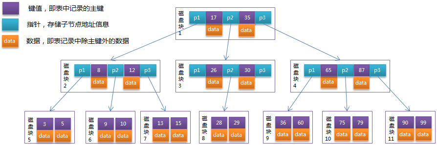

# Tree

A **tree** is a widely used abstract data type that simulates a hierarchical tree structure, with a root value and subtrees of children with a parent node, represented as a set of linked nodes.

| .svg.png) |
| :----------------------------------------------------------: |
| `Root` is circled in red Each single circle called node 9 is `parent` of 4 so 4 is `child` of 9 |

Normal tree can be any forms as long as it follows the structures of any node inside the tree can be access via `root`.

## Binary Tree

A tree whose elements have at most 2 children is called a `binary tree`. Since each element in a binary tree can have only 2 children, we typically name them the left and right child.

### Binary Search Tree

Binary search tree is a special type of binary tree which has following properties:

1. The value of the key of the left sub-tree is less than the value of its parent (root) node's key.
2. The value of the key of the right sub-tree is greater than or equal to the value of its parent (root) node's key.
3. The left and right subtree must also be a binary search tree.

|  |  |
| :--------------------------------------------------: | :---------------------------------------------------: |
|                 Binary Search Tree 1                 |                 Binary Search Tree 2                  |

Both of them are binary tree, but you can see that if we need to do [[binary search]] on those tree, we will get `O(n)` for **Binary Search Tree 2 **  which is not what we want. To deal with such edge cases,  [[#Balanced Binary Search Tree]] was introduced to deal with such bad performance.

##  Balanced Binary Search Tree

A Balanced Binary Search Tree is a special type of  [[#Binary Search Tree]] that automatically keeps its height (maximal number of levels below the root) small during insertions and deletions.

### AVL Tree

AVL tree is a self-balancing Binary Search Tree (BST) where satisfy all the characteristics of [[#Binary Search Tree]] and the difference between heights of left and right subtrees cannot be more than one for all nodes.

|  |
| :----------------------------------------------------------: |
| The difference between heights of left and right of the highlighted nodes is more than 1 |

#### UnBalance Situation

AVL tree may lose balance when we delete or insert node into the tree. It can be summaries into four type of scenarios:

1. **LeftLeft**: the `left child` of the root has height different of 2 causing the unbalance(it's `left child` is taller than right child)
2. **LeftRight**: the `left child` of the root has height different of 2 causing the unbalance(it's `right child` is taller than left child)
3. **RightLeft**: the `right child` of the root has height different of 2 causing the unbalance(it's `left child` is taller than left child)
4. **RightRight**: the `right child` of the root has height different of 2 causing the unbalance(it's `right child` is taller than left child)

#### Rebalancing

For the four types of unbalance situation, we need four ways to restore the balance state.

**LeftLeft**:

1. Saving the right child(`Y`) of the left child(`k1`) of the root
2. Assign root(`k2`) as it's(`k1`) right child
3. Assign root(`k2`)'s left to the saved right child(`Y`)

**RightRight**:

1. Saving the left child(`Y`) of the right child(`k2`) of the root(`k1`)
2. Assign root(`k1`) as it's(`k2`) left child
3. Assign root(`k1`)'s right to the saved left child(`Y`)

**LeftRight**: 

1. Do a **RR** on left child(`k1`) of the root
2. Do a **LL** on root(`k3`)

**RightLeft**:

1. Do a **LL** on right child(`k3`) of the root
2. Do a **RR** on root(`k1`)

#### Implementation

// TODO (Java version)

## B Tree

**B**-**tree** is a self-balancing **tree** data structure that maintains sorted data and allows searches, sequential access, insertions, and deletions in logarithmic time.

A B-tree of order `m` is a tree which satisfies the following properties:

1. Every node has at most `m` children.
2. Every non-leaf node (except root) has at least `⌈m/2⌉` child nodes.
3. The root has at least two children if it is not a leaf node.
4. A non-leaf node with `k` children contains `k - 1` keys.
5. All leaves appear in the same level and carry no information.

### Application

B tree is normally used in different database systems or file systems.

### Insertion

Example of order 5 B-tree,

1. 2 <=  No. children of root <= 5
2. 

## B+ Tree

| B+ Tree                                     | B Tree                                      |
| ------------------------------------------- | ------------------------------------------- |
| Non-leaf node only contains key information | All nodes contains key information and data |
| A link association between leaf node        | No association between leaf node            |
| Lead node only contains data                | All nodes contains key information and data |

