[toc]

# Designing Data Intensive Applications

## Chapter 1

we focus on three concerns that are important in most software systems:

### Reliability

The system should continue to work correctly even in the face of adversity (hardware or software faults, and even human error). 

- The application performs the function that the user expected.
- It can tolerate the user making mistakes or using the software in unexpected ways.
- Its performance is good enough for the required use case, under the expected load and data volume.
- The system prevents any unauthorized access and abuse.

The things that can go wrong are called faults, and systems that anticipate faults and can cope with them are called **fault-tolerant** or **resilient**. 

> **_NOTE:_** A fault is not the same as a failure. A fault is usually defined as one component of the system deviating from its spec, whereas a failure is when the system as a whole stops providing the required service to the user. It is impossible to reduce the probability of a fault to zero; therefore it is usually best to design fault-tolerance mechanisms that prevent faults from causing failures. 

Although we generally prefer tolerating faults over preventing faults, there are cases where prevention is better. This is the case with security matters, for example: if an attacker has compromised a system and gained access to sensitive data, that event cannot be undone.

#### Hardware Faults

#### Backup Machine

Normal way is to have backup machine to be able to restore to desired state quickly.

#### Software Fault-Tolenrance

As data volumes and applications's computing demands have increaded, more applications have begun using larger numbers of machines, which proportionally increases the rate of hardware faults. 

Using software fault-tolerance techniques in preference or in addition to hardware redundancy. Such systems also have operational advantages: a single-server system requires planned downtime if you need to reboot the machine, whereas a system that can tolerate machine failure can be patched one node at a time, without downtime of the entire system.

#### Software Faults

A systematic error within the system is harder to anticipate, and because they are correlated across nodes, they tend to cause many more system failures than uncorrelated hardware faults.

#### Prevention

- carefully thinking about assumptions and interactions in the system
- thorough testing
- process isolation
- allowing processes to crash and restart
- measuring, monitoring, and analyzing system behavior in production
- If a system is expected to provide some guarantee, it can constantly check itself while it is running and raise an alert if a discrepancy is found

#### Human Errors

- Design systems in a way that minimizes opportunities for error. For example, well-designed abstractions, APIs.
- Decouple the places where people make the most mistakes from the places where they can cause failures. In particular, provide fully featured non-production sandbox environments where people can explore and experiment safely, using real data, without affecting real users.
- Test thoroughly at all levels, from unit tests to whole system integration tests and manual tests. Automated testing is widely used, well understood, and especially valuable for covering corner cases that rarely arise in normal operation.
- Allow quick and easy recovery from human errors, to minimize the impact in the case of a failure.
- Set up detailed and clear monitoring, such as performance metrics and error rates.
- Implement good management practices and training.

### Scalability

**Scalability** is the term we use to describe a system’s ability to cope with increased load. 

### Maintainability

Over time, many different people will work on the system (engineering and operations, both maintaining current behavior and adapting the system to new use cases), and they should all be able to work on it productively.

## Chapter 2

Choose right database type for your application, SQL or NoSQL.

### Application Example

#### Resume

Most people have had more than one job in their career, so there is a one-to-many relationship from the user to their experiences and jobs.

In SQL way, there are three ways to store them:

1. Store positions, education and contact information in separate tables and associate with foreign key to user table.
2. Later version of the SQL support for structured datatypes and XML data which allowed multi-valued data to be stored within a single row.
3. Encode jobs, education and contact information as a JSON or XML and store it on a text column, but you can use the database to query for values inside the encoded column.

For a data structure like a résumé, which is mostly a self-contained document, a **JSON** representation can be quite appropriate.The JSON representation has better locality than the multi-table schema.

## Chapter 3

We need to select a storage engine that is appropriate for our application.There are two families of storage engines: `log-structured storage engines` and `page-oriented storage engines`.

### Log-Structured Storage Engines

#### Hash Table

Keeping an in-memory hash map for every segment where every key is mapped to a byte offset in the data file—the location at which the value can be found.

Whenever you append a new key-value pair to the file, you also update the hash map to reflect the offset of the data you just wrote (this works both for inserting new keys and for updating existing keys). 

When you want to look up a value, use the hash map to find the offset in the data file, seek to that location, and read the value.

This is essentially what `Bitcask` (the default storage engine in Riak) does. A storage engine like `Bitcask` is well suited to situations where the value for each key is **updated frequently**.

**To Avoid out of disk space:** Break the log into segments of a certain size by closing a segment file when it reaches a certain size, and making subsequent writes to a new segment file.We can then perform **compaction** on these segments by throwing away duplicate keys in the log, and keeping only the most recent update for each key. Since compaction often makes segments much smaller, we can also merge several segments together at the same time as performing the compaction. Such process can be done in the background thread. We continue to serve read and write requests as normal using the old segment files and switch read requests to using the new merged segment once the process is done.

Lots of detail goes into making this simple idea work in practice. Briefly, some of the issues that are important in a real implementation are:

**File Format** 

It’s faster and simpler to use a binary format that first encodes the length of a string in bytes, followed by the raw string (without need for escaping).

**Deleting Records**

If you want to delete a key and its associated value, you have to append a special deletion record to the data file (sometimes called a tombstone). When log segments are merged, the tombstone tells the merging process to discard any previous values for the deleted key.

**Crash recovery**

If the database is restarted, the in-memory hash maps are lost. In principle, you can restore each segment’s hash map by reading the entire segment file from beginning to end and noting the offset of the most recent value for every key as you go along. However, that might take a long time if the segment files are large, which would make server restarts painful. Bitcask speeds up recovery by storing a snapshot of each segment’s hash map on disk, which can be loaded into memory more quickly.

**Partially written records**

The database may crash at any time, including halfway through appending a record to the log. Bitcask files include checksums, allowing such corrupted parts of the log to be detected and ignored.

**Concurrency control**
As writes are appended to the log in a strictly sequential order, a common imple‐ mentation choice is to have only one writer thread. Data file segments are append-only and otherwise immutable, so they can be read concurrently by multiple threads.

**Why append-only design is good**

- Appending and segment merging are sequential write operations, which are generally much faster than random writes.
- Concurrency and crash recovery are much simpler if segment files are append-only or immutable. For example, you don’t have to worry about the case where a crash happened while a value was being overwritten, leaving you with a file containing part of the old and part of the new value spliced together.
- Merging old segments avoids the problem of data files getting fragmented over time.

**The hash table index also has limitations**

- The hash table must fit in memory.In principle, you could maintain a hash map on disk, but unfortunately it is difficult to make an on-disk hash map perform well. It requires a lot of random access I/O, it is expensive to grow when it becomes full, and hash collisions require fiddly logic.
- Range queries are not efficient. For example, you cannot easily scan over all keys between kitty00000 and kitty99999—you’d have to look up each key individually in the hash maps.

#### Sorted String Table(SSTable)

The sequence of key-value pairs is sorted by key.

Advantage over `Index Hash Table`:

- Merging segments is simple and efficient, even if the files are bigger than the available memory. Start reading the input files side by side, look at the first key in each file, copy the lowest key (according to the sort order) to the output file, and repeat. This produces a new merged segment file, also sorted by key.When multiple segments contain the same key, we can keep the value from the most recent segment and discard the values in older segments.
- Not need to keep indexing of all keys, an in-memory index to tell you the offsets for some of the keys, but it can be sparse: one key for every few kilobytes of segment file is sufficient, because a few kilobytes can be scanned very quickly.
- Since read requests need to scan over several key-value pairs in the requested range anyway, it is possible to group those records into a block and compress it before writing it to disk. Each entry of the sparse in-memory index then points at the start of a compressed block. Besides saving disk space, compression also reduces the I/O bandwidth use.

##### How it works

- When a write comes in, add it to an in-memory balanced tree data structure (for example, a red-black tree). This in-memory tree is sometimes called a `memtable`.

- When the `memtable` gets bigger than some threshold—typically a few megabytes, write it out to disk as an SSTable file. This can be done efficiently because the tree already maintains the key-value pairs sorted by key. The new SSTable file becomes the most recent segment of the database. While the SSTable is being written out to disk, writes can continue to a new `memtable` instance.
- In order to serve a read request, first try to find the key in the `memtable`, then in the most recent on-disk segment, then in the next-older segment, etc.
- From time to time, run a merging and compaction process in the background to combine segment files and to discard overwritten or deleted values.

**It only suffers from one problem**

If the database crashes, the most recent writes (which are in the memtable but not yet written out to disk) are lost. In order to avoid that problem, we can keep a separate log on disk to which every write is immediately appended. That log is not in sorted order, but that doesn’t matter, because its only purpose is to restore the `memtable` after a crash. Every time the `memtable` is written out to an SSTable, the corresponding log can be discarded.

##### Performance Optimisations

**Search for non-exist key**

Search non-exist key may required scan the whole database, can use additional Bloom filters to avoid scan the entire database.

> _**Note:**_ `Bloom filter` is a memory-efficient data structure for approximating the contents of a set. It can tell you if a key does not appear in the database, and thus saves many unnecessary disk reads for nonexistent keys.

**Compaction and Merge** 

In `size-tiered` compaction, newer and smaller SSTables are successively merged into older and larger SSTables. 

In `leveled` compaction, the key range is split up into smaller SSTables and older data is moved into separate “levels,” which allows the compaction to proceed more incrementally and use less disk space.

**Summary**

Even though there are many subtleties, the basic idea of LSM-trees—keeping a cascade of SSTables that are merged in the background—is simple and effective. 

Even when the dataset is much bigger than the available memory it continues to work well. Since data is stored in sorted order, you can efficiently perform range queries (scanning all keys above some minimum and up to some maximum).

Because the disk writes are sequential the LSM-tree can support remarkably high write throughput.

### Page-Oritented Storage

#### B-Tree

B-trees break the database down into fixed-size *blocks* or *pages*, traditionally 4 KB in size (sometimes bigger), and read or write one page at a time. This design corresponds more closely to the underlying hardware, as disks are also arranged in fixed-size blocks.

Each page can be identified using an address or location, which allows one page to refer to another—similar to a pointer, but on disk instead of in memory. We can use these page references to construct a tree of pages.

One page is designated as the root of the B-tree; whenever you want to look up a key in the index, you start here. The page contains several keys and references to child pages. Each child is responsible for a continuous range of keys, and the keys between the references indicate where the boundaries between those ranges lie.

Eventually we get down to a page containing individual keys (a leaf page), which either contains the value for each key inline or contains references to the pages where the values can be found.

The number of references to child pages in one page of the B-tree is called the `branching factor`. In practice, the branching factor depends on the amount of space required to store the page references and the range boundaries, but typically it is several hundred.

There is a big difference between storage engines that are optimized for transactional workloads and those that are optimized for analytics.

**Update**

If you want to update the value for an existing key in a B-tree, you search for the leaf page containing that key, change the value in that page, and write the page back to disk (any references to that page remain valid). 

**Add**

If you want to add a new key, you need to find the page whose range encompasses the new key and add it to that page. If there isn’t enough free space in the page to accommodate the new key, it is split into two half-full pages, and the parent page is updated to account for the new subdivision of key ranges

This algorithm ensures that the tree remains balanced: a B-tree with n keys always has a depth of O(log n). Most databases can fit into a B-tree that is three or four levels deep, so you don’t need to follow many page references to find the page you are looking for. (A four-level tree of 4 KB pages with a branching factor of 500 can store up to 256 TB.)

**Making B-Trees Reliable**

- The basic underlying write operation of a B-tree is to overwrite a page on disk with new data. It is assumed that the overwrite does not change the location of the page.
  - Moreover, some operations require several different pages to be overwritten. For example, **if you split a page because an insertion caused it to be overfull, you need to write the two pages that were split, and also overwrite their parent page to update the references to the two child pages.** This is a dangerous operation, because if the database crashes after only some of the pages have been written, you end up with a corrupted index (e.g., there may be an orphan page that is not a child of any parent).
  - In order to make the database resilient to crashes, it is common for B-tree implementations to include an additional data structure on disk: a write-ahead log (WAL, also known as a redo log). This is an append-only file to which every B-tree modification must be written before it can be applied to the pages of the tree itself. When the database comes back up after a crash, this log is used to restore the B-tree back to a consistent state.

- **Updating pages in place is that careful concurrency control is required if multiple threads are going to access the B-tree at the same time** —otherwise a thread may see the tree in an inconsistent state. This is typically done by protecting the tree’s data structures with latches (lightweight locks). 

**B-tree optimizations**

- Instead of overwriting pages and maintaining a WAL for crash recovery, some databases (like LMDB) use a copy-on-write scheme . A modified page is written to a different location, and a new version of the parent pages in the tree is created, pointing at the new location. 
- We can save space in pages by not storing the entire key, but abbreviating it. So that we can packing more keys into a page allows the tree to have a higher branching factor, and thus fewer levels.
- If a query needs to scan over a large part of the key range in sorted order, that page-by-page layout can be inefficient, because a disk seek may be required for every page that is read. Many B-tree implementations therefore try to lay out the tree so that leaf pages appear in sequential order on disk. However, it’s difficult to maintain that order as the tree grows.
- Additional pointers have been added to the tree. For example, each leaf page may have references to its sibling pages to the left and right, which allows scanning keys in order without jumping back to parent pages.
-  B-tree variants such as fractal trees borrow some log-structured ideas to reduce disk seeks. 

**Comparison between B-Trees and LSM-Trees**

| B-Tree                                                       | LSM-Tree                                                     |
| ------------------------------------------------------------ | ------------------------------------------------------------ |
| A B-tree index must write every piece of data at least twice: once to the write-ahead log, and once to the tree page itself.There is also overhead from having to write an entire page at a time, even if only a few bytes in that page changed. | Log-structured indexes also rewrite data multiple times due to repeated compaction and merging of SSTables. This effect—one write to the database resulting in multiple writes to the disk over the course of the database’s lifetime—is known as `write amplification`. **Low write amplification** |
| Less write throughput than LSM-trees                         | LSM-trees are typically able to **sustain higher write** throughput. Partly because they sometimes have lower write amplification.  Partly because they sequentially write compact SSTable files rather than having to overwrite several pages in the tree. |
| B-tree storage engines leave some disk space unused due to fragmentation: when a page is split or when a row cannot fit into an existing page, some space in a page remains unused. | LSM-trees can be compressed better, and thus often produce smaller files on disk.**Low storage overheads**. |
| B-trees can be more predictable.                             | Compaction process can sometimes interfere with the performance of ongoing reads and writes.The impact on throughput and average response time is usually small, but at higher percentiles.The response time of queries to log-structured storage engines can sometimes be quite high. |
| -                                                            | Compaction arises at high write throughput: the disk’s finite write bandwidth needs to be shared between the initial write (logging and flushing a memtable to disk) and the compaction threads running in the background. When writing to an empty database, the full disk bandwidth can be used for the initial write, but the bigger the database gets, the more disk bandwidth is required for compaction. |
| Each key exists in exactly one place in the index. This aspect makes B-trees attractive in databases that want to offer strong transactional semantics. | May have multiple copies of the same key in different segments. |

### More Indexing Structures

**Secondary Indexes:** Same as primary indexes but it is not unique.

The key in an index is the thing that queries search for, but the value can be one of two things: 

1. It could be the actual row (document, vertex) in question
2. It could be a reference to the row stored elsewhere. 
   - The place where rows are stored is known as a heap file, and it stores data in no particular order (it may be append-only, or it may keep track of deleted rows in order to overwrite them with new data later). 
   - The heap file approach is common because it avoids duplicating data when multiple secondary indexes are present: each index just references a location in the heap file, and the actual data is kept in one place.
   - Efficient on updating a value without changing the key, provided that the new value is not larger than the old value.

> _**Clustered index:**_ In some situations, the extra hop from the index to the heap file is too much of a performance penalty for reads, so it can be desirable to store the indexed row directly within an index. This is known as a `clustered index`. 

****

#### Multi-column Indexes

The most common type of multi-column index is called a `concatenated index`, which simply combines several fields into one key by appending one column to another (the index definition specifies in which order the fields are concatenated).

**Multi-dimensional Indexes**

Multi-dimensional indexes are a more general way of querying several columns at once, which is particularly important for geospatial data. 

One option is to translate a two-dimensional location into a single number using a space-filling curve, and then to use a regular B-tree index. More commonly, specialized spatial indexes such as R-trees are used. 

#### Full-text search and fuzzy indexes

Use for finding similar keys or misspelled words.

`Lucene` is able to search text for words within a certain edit distance (an edit distance of 1 means that one letter has been added, removed, or replaced)

`Lucene` uses a SSTable-like structure for its term dictionary. This structure requires a small in-memory index that tells queries at which offset in the sorted file they need to look for a key.The in-memory index is a finite state automaton over the characters in the keys, similar to a trie. 

### In-memory Database

Some of the in-memory stores such as Memcached, are intended for caching use only, where it’s acceptable for data to be lost if a machine is restarted. But other in-memory databases aim for `durability`, which can be achieved with special hardware (such as battery-powered RAM), by writing a log of changes to disk, by writing periodic snapshots to disk, or by replicating the in-memory state to other machines.

Despite writing to disk, it’s still an in-memory database, because the disk is merely used as an append-only log for durability, and reads are served entirely from memory. Writing to disk also has operational advantages: files on disk can easily be backed up, inspected, and analyzed by external utilities.

**Performance Advantage**

The performance advantage of in-memory databases is they can avoid the overheads of encoding in-memory data structures in a form that can be written to disk.

**Simple Implementation**

In-memory databases is providing data models that are difficult to implement with disk-based indexes. For example, Redis offers a database-like interface to various data structures such as priority queues and sets. Because it keeps all data in memory, its implementation is comparatively simple.

**Anti-caching**

In-memory database architecture could be extended to support datasets larger than the available memory, without bringing back the overheads of a disk-centric architecture. It works by evicting the least recently used data from memory to disk when there is not enough memory, and loading it back into memory when it is accessed again in the future. This approach still requires indexes to fit entirely in memory.

### Transaction Processing and Analytics

An application looks up a small number of records by some key, using an index. Records are inserted or updated based on the user’s input. Because these applications are interactive, the access pattern became known as **online transaction processing** (**OLTP**).

Compared to data analytics, which  an analytic query needs to scan over a huge number of records, only reading a few columns per record, and calculates aggregate statistics (such as count, sum, or average) rather than returning the raw data to the user. These queries are often written by business analysts, and feed into reports that help the management of a company make better decisions (business intelligence). In order to differentiate this pattern of using databases from transaction processing, it has been called **online analytic processing** (**OLAP**)

| Property             | Transaction processing systems (OLTP)             | Analytic systems (OLAP)                   |
| -------------------- | ------------------------------------------------- | ----------------------------------------- |
| Main read pattern    | Small number of records per query, fetched by key | Aggregate over large number of records    |
| Main write pattern   | Random-access, low-latency writes from user input | Bulk import (ETL) or event stream         |
| Primarily used by    | End user/customer, via web application            | Internal analyst, for decision support    |
| What data represents | Latest state of data (current point in time)      | History of events that happened over time |
| Dataset size         | Gigabytes to terabytes                            | Terabytes to petabytes                    |

#### Data Warehousing

Data warehousing is a separate database mainly for data analysis without affecting OLTP operations.The data warehouse contains a read-only copy of the data in all the various OLTP systems in the company. Data is extracted from OLTP databases (using either a periodic data dump or a continuous stream of updates), transformed into an analysis-friendly schema, cleaned up, and then loaded into the data warehouse. This process of getting data into the warehouse is known as **Extract–Transform–Load** (**ETL**).

##### Star schema

Star schema or dimensional modelling in Figure 3-9 shows a data warehouse that might be found at a grocery retailer. At the center of the schema is a so-called fact table (in this example, it is called fact_sales). Each row of the fact table represents an event that occurred at a particular time (here, each row represents a customer’s purchase of a product). If we were analyzing website traffic rather than retail sales, each row might represent a page view or a click by a user.

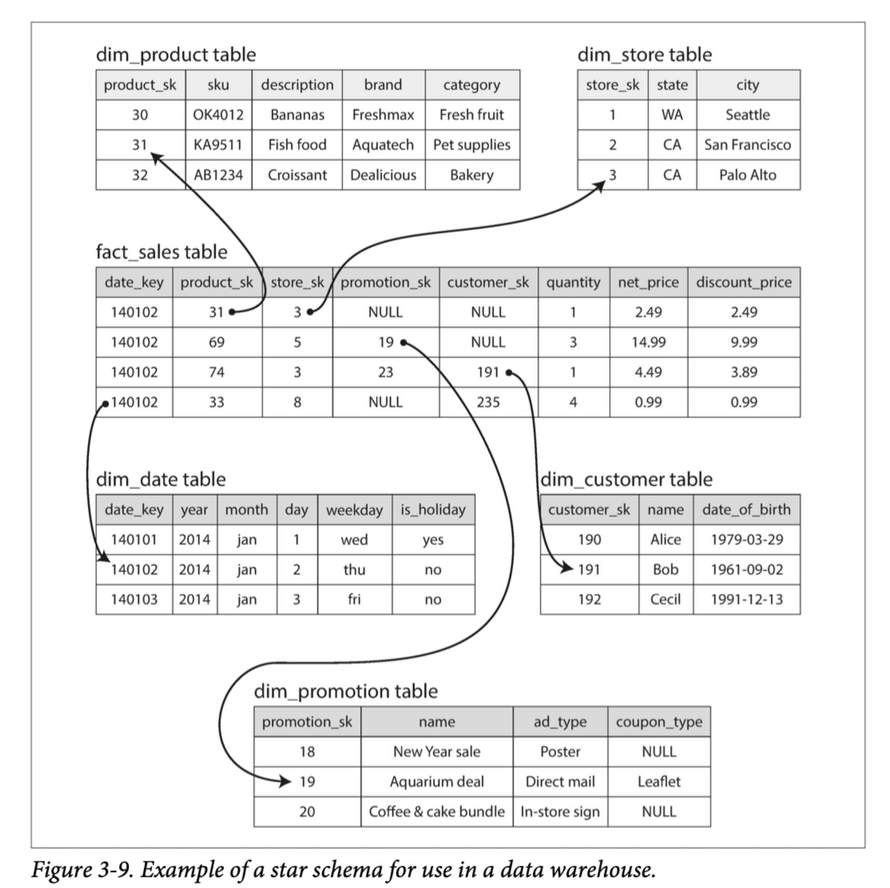

Usually, facts are captured as individual events, because this allows maximum flexibility of analysis later. However, this means that the fact table can become extremely large.
Some of the columns in the fact table are attributes, such as the price at which the product was sold and the cost of buying it from the supplier (allowing the profit margin to be calculated). Other columns in the fact table are foreign key references to other tables, called dimension tables. As each row in the fact table represents an event, the dimensions represent the who, what, where, when, how, and why of the event.

##### Snowflask Schema

Snowflask schema is a variation of star schema, where dimensions are further broken down into subdimensions. For example, there could be separate tables for brands and product categories, and each row in the dim_product table could reference the brand and category as foreign keys, rather than storing them as strings in the dim_product table. Snowflake schemas are more normalized than star schemas, but star schemas are often preferred because they are simpler for analysts to work with.

### Column-Oriented Storage

In a typical data warehouse, tables are often very wide: fact tables often have over 100 columns, sometimes several hundred. Dimension tables can also be very wide, as they include all the metadata that may be relevant for analysis. If you have trillions of rows and petabytes of data in your fact tables, storing and querying them efficiently becomes a challenging problem.

But usually for the result of query, it only need few columns and ignore all other columns.

We can use `column-oriented storage` to make the query efficiently.The idea behind column-oriented storage is simple: don’t store all the values from one row together, but store all the values from each column together instead. If each column is stored in a separate file, a query only needs to read and parse those columns that are used in that query, which can save a lot of work. This principle is illustrated in Figure 3-10.

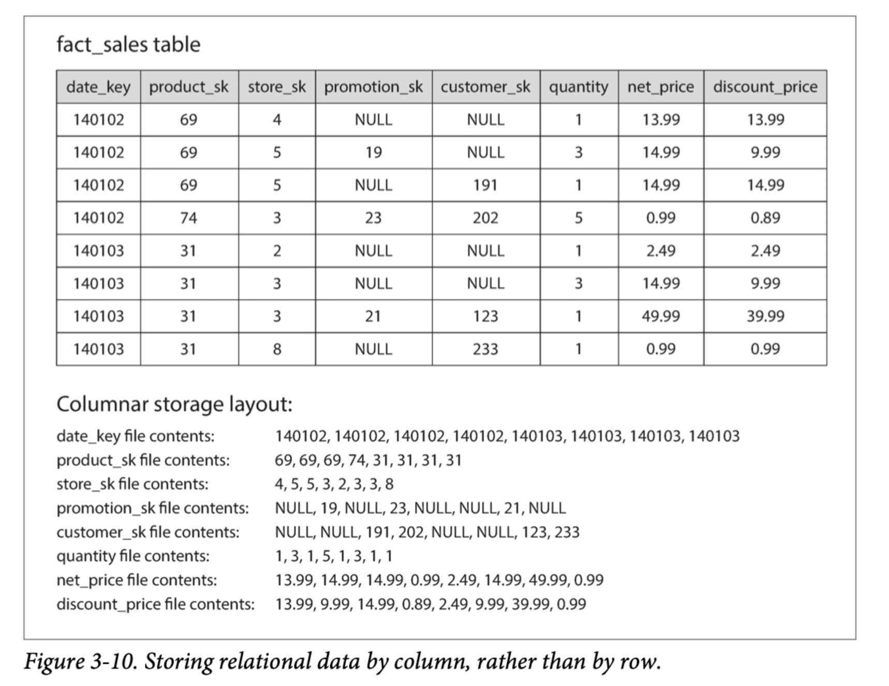

#### Column Compression

We can further reduce the demands on disk throughput by compressing data.One technique that is particularly effective in data warehouses is bitmap encoding, illustrated in Figure 3-11.

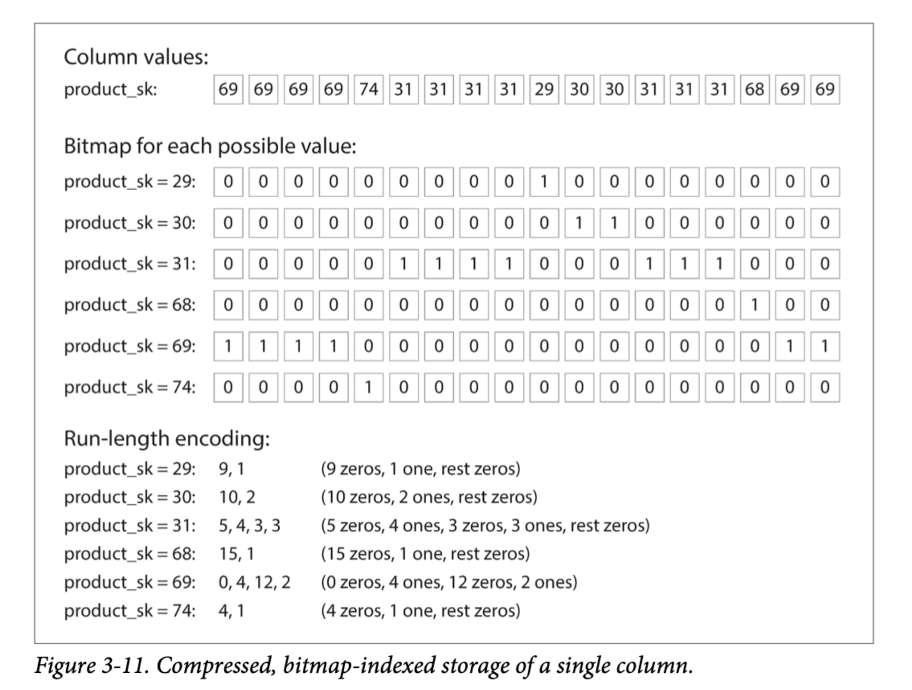

Often, the number of distinct values in a column is small compared to the number of rows. We can now take a column with n distinct values and turn it into n separate bitmaps: one bitmap for each distinct value, with one bit for each row. The bit is 1 if the row has that value, and 0 if not.

If n is very small (for example, a country column may have approximately 200 distinct values), those bitmaps can be stored with one bit per row. But if n is bigger, there will be a lot of zeros in most of the bitmaps (we say that they are sparse). In that case, the bitmaps can additionally be run-length encoded, as shown at the bottom of Figure 3-11. This can make the encoding of a column remarkably compact.

##### Memory bandwidth and vectorized processing

Column-oriented storage not only reducing the volume of data that needs to be loaded from disk but also good for making efficient use of CPU cycles. For example, the query engine can take a chunk of compressed column data that fits comfortably in the CPU’s L1 cache and iterate through it in a tight loop (that is, with no function calls). A CPU can execute such a loop much faster than code that requires a lot of function calls and conditions for each record that is processed. 

Column compression allows more rows from a column to fit in the same amount of L1 cache. Bitwise AND and OR operators can be designed to operate on such chunks of compressed column data directly. This technique is known as **vectorized processing**.

##### Sort Oder in Column Storage

The data needs to be sorted an entire row at a time.The sorted order will depend on analysis needs, with the sorted order data, we now can query more efficiently. Another advantage of sorted order is that it can help with compression of columns. we can used bitmaps to compress the non-distinct values down to a few kilobytes—even if the table has billions of rows.

##### Several different sort orders

Different queries benefit from different sort orders, we can store the same data sorted in several different ways in different replicated data machines. You don’t lose data if one machine fails. When you’re processing a query, you can use the version that best fits the query pattern.

##### Writing to Column-Oriented Storage

Column-oriented storage, compression, and sorting all help to make those read queries faster. However, they have the downside of making writes more difficult.

Fortunately, we have already seen a good solution: LSM-trees. All writes first go to an in-memory store, where they are added to a sorted structure and prepared for writing to disk. It doesn’t matter whether the in-memory store is row-oriented or column-oriented. When enough writes have accumulated, they are merged with the column files on disk and written to new files in bulk. This is essentially what Vertica does.

Queries need to examine both the column data on disk and the recent writes in memory, and combine the two. However, the query optimizer hides this distinction from the user.

##### Aggregation: Data Cubes and Materialized Views

Not every data warehouse is necessarily a column store: traditional row-oriented databases and a few other architectures are also used. Another aspect of data warehouses that is worth mentioning briefly is **materialized aggregates**. 

**Materialized Aggregates**

We can cache some of the counts or sums that queries use most often.One way of creating such a cache is a materialized view. In a relational data model, it is often defined like a standard (virtual) view: a table-like object whose contents are the results of some query. The difference is that a materialized view is an actual copy of the query results, written to disk, whereas a virtual view is just a shortcut for writing queries. When you read from a virtual view, the SQL engine expands it into the view’s underlying query on the fly and then processes the expanded query.

When the underlying data changes, a materialized view needs to be updated, because it is a denormalized copy of the data. The database can do that automatically, but such updates make writes more expensive, which is why materialized views are not often used in OLTP databases. In read-heavy data warehouses they can make more sense (whether or not they actually improve read performance depends on the individual case).

A common special case of a materialized view is known as a data cube or OLAP cube. It is a grid of aggregates grouped by different dimensions. Figure 3-12 shows an example.

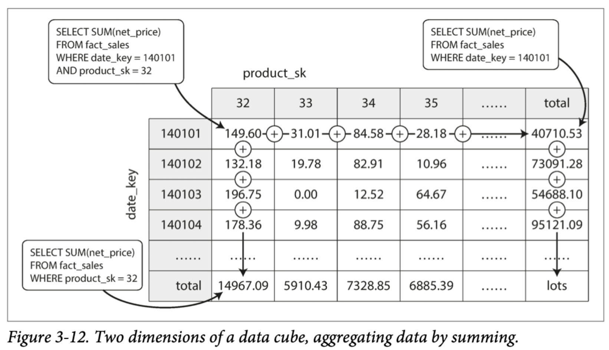

You can apply the same aggregate along each row or column and get a summary that has been reduced by one dimension (the sales by product regardless of date, or the sales by date regardless of product).

**Advantage**

The advantage of a materialized data cube is that certain queries become very fast because they have effectively been precomputed. 

**Disadvantage**

The disadvantage is that a data cube doesn’t have the same flexibility as querying the raw data. 

## Chapter 4

In this chapter we will look at several formats for encoding data, including JSON, XML, Protocol Buffers, Thrift, and Avro. In particular, we will look at how they handle schema changes and how they support systems where old and new data and code need to coexist. We will then discuss how those formats are used for data storage and for communication: in web services, Representational State Transfer (REST), and remote procedure calls (RPC), as well as message-passing systems such as actors and message queues.

When a data format or schema changes, a corresponding change to application code often needs to happen. However, in a large application, code changes often cannot happen instantaneously:

- With server-side applications you may want to perform a rolling upgrade (also known as a staged rollout), deploying the new version to a few nodes at a time, checking whether the new version is running smoothly, and gradually working your way through all the nodes. This allows new versions to be deployed without service downtime, and thus encourages more frequent releases and better evolvability.
- With client-side applications you’re at the mercy of the user, who may not install the update for some time.

This means that old and new versions of the code, and old and new data formats, may potentially all coexist in the system at the same time. In order for the system to continue running smoothly, we need to maintain compatibility in both directions:

- Backward compatibility
  Newer code can read data that was written by older code.
- Forward compatibility
  Older code can read data that was written by newer code.

### Formats for Encoding Data

Programs usually work with data in (at least) two different representations:
1. In memory, data is kept in objects, structs, lists, arrays, hash tables, trees, and so on. These data structures are optimized for efficient access and manipulation by the CPU (typically using pointers).
2. When you want to write data to a file or send it over the network, you have to encode it as some kind of self-contained sequence of bytes (for example, a JSON document). Since a pointer wouldn’t make sense to any other process, this sequence-of-bytes representation looks quite different from the data structures that are normally used in memory.

Thus, we need some kind of translation between the two representations. The translation from the in-memory representation to a byte sequence is called encoding (also known as serialization or marshalling), and the reverse is called decoding (parsing, deserialization, unmarshalling)

#### Language-Specific Formats

Many programming languages come with built-in support for encoding in-memory objects into byte sequences. They are very convenient, because they allow in-memory objects to be saved and restored with minimal additional code. However, they also have a number of deep problems:

- The encoding is often tied to a particular programming language, and reading the data in another language is very difficult. If you store or transmit data in such an encoding, you are committing yourself to your current programming language for potentially a very long time, and precluding integrating your systems with those of other organizations (which may use different languages).
- In order to restore data in the same object types, the decoding process needs to be able to instantiate arbitrary classes. This is frequently a source of security problems: if an attacker can get your application to decode an arbitrary byte sequence, they can instantiate arbitrary classes, which in turn often allows them to do terrible things such as remotely executing arbitrary code.

- Versioning data is often an afterthought in these libraries: as they are intended for quick and easy encoding of data, they often neglect the inconvenient problems of forward and backward compatibility.
- Efficiency (CPU time taken to encode or decode, and the size of the encoded structure) is also often an afterthought. For example, Java’s built-in serialization is notorious for its bad performance and bloated encoding.

For these reasons **it’s generally a bad idea to use your language’s built-in encoding for anything other than very transient purposes**.

#### JSON, XML, and Binary Variants

JSON and XML  encodings that can be written and read by many programming languages. XML is often criticized for being too verbose and unnecessarily complicated. JSON’s popularity is mainly due to its built-in support in web browsers and simplicity relative to XML. CSV is another popular language-independent format, albeit less powerful.
JSON, XML, and CSV are textual formats, besides the superficial syntactic issues, they also have some subtle problems:

- There is a lot of ambiguity around the encoding of numbers. 
  - In XML and CSV, you cannot distinguish between a number and a string that happens to consist of digits (except by referring to an external schema). 
  - JSON distinguishes strings and numbers, but it doesn’t distinguish integers and floating-point numbers, and it doesn’t specify a precision.
    For example, integers greater than $2^{53}$ cannot be exactly represented in an IEEE 754 double-precision floating- point number. Twitter, which uses a 64-bit number to identify each tweet. The JSON returned by Twitter’s API includes tweet IDs twice, once as a JSON number and once as a decimal string, to work around the fact that the numbers are not correctly parsed by JavaScript applications.

- JSON and XML have good support for Unicode character strings, but they don’t support binary strings (sequences of bytes without a character encoding). Binary strings are a useful feature, so people get around this limitation by encoding the binary data as text using Base64. The schema is then used to indicate that the value should be interpreted as Base64-encoded. This works, but it’s somewhat hacky and increases the data size by 33%.

- There is optional schema support for both XML and JSON. These schema languages are quite powerful, and thus quite complicated to learn and implement. Use of XML schemas is fairly widespread, but many JSON-based tools don’t bother using schemas. Since the correct interpretation of data (such as numbers and binary strings) depends on information in the schema, applications that don’t use XML/JSON schemas need to potentially hardcode the appropriate encoding/decoding logic instead.
- CSV does not have any schema, so it is up to the application to define the meaning of each row and column. If an application change adds a new row or column, you have to handle that change manually. CSV is also a quite vague format (what happens if a value contains a comma or a newline character?). Although its escaping rules have been formally specified, not all parsers implement them correctly.

##### Binary encoding

Both JSON and XML use a lot of space compared to binary formats. This observation led to the development of a profusion of binary encodings for JSON (MessagePack, BSON, BJSON, UBJSON, BISON, and Smile, to name a few) and for XML (WBXML and Fast Infoset, for example). These formats have been adopted in various niches, but none of them are as widely adopted as the textual versions of JSON and XML.

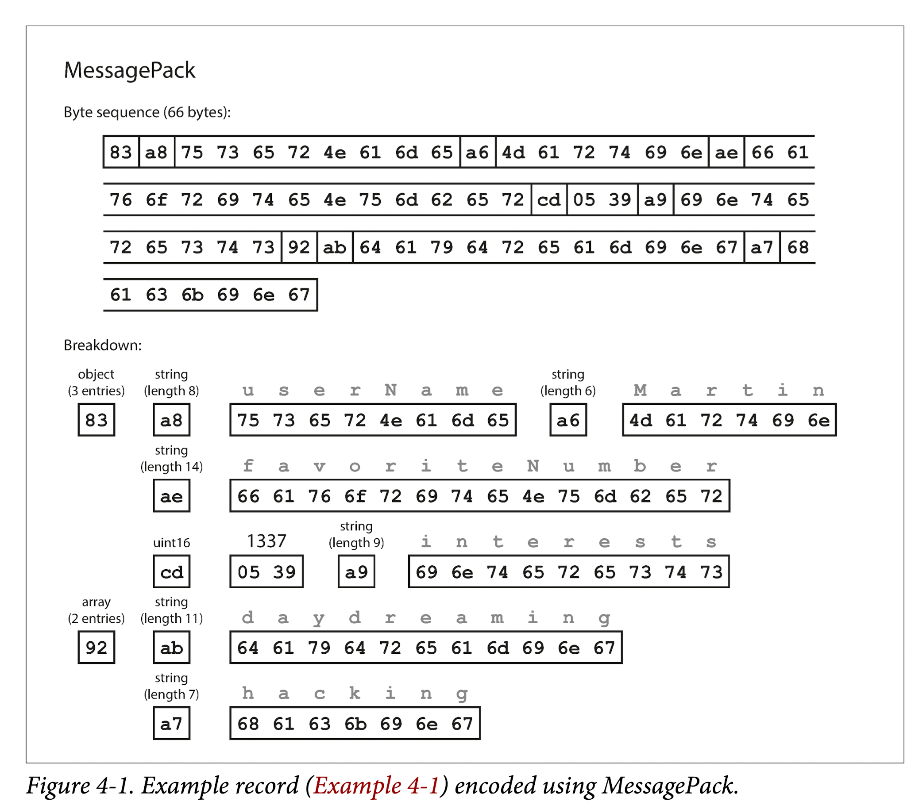

Let’s look at an example of MessagePack, a binary encoding for JSON. Figure 4-1 shows the byte sequence that you get if you encode the JSON document in Example 4-1 with MessagePack. The first few bytes are as follows:
1. The first byte, 0x83, indicates that what follows is an object (top four bits = 0x80) with three fields (bottom four bits = 0x03). (In case you’re wondering what hap‐ pens if an object has more than 15 fields, so that the number of fields doesn’t fit in four bits, it then gets a different type indicator, and the number of fields is encoded in two or four bytes.)
2. The second byte, 0xa8, indicates that what follows is a string (top four bits = 0xa0) that is eight bytes long (bottom four bits = 0x08).
3. The next eight bytes are the field name userName in ASCII. Since the length was indicated previously, there’s no need for any marker to tell us where the string ends (or any escaping).
4. The next seven bytes encode the six-letter string value Martin with a prefix 0xa6, and so on.

The binary encoding is 66 bytes long, which is only a little less than the 81 bytes taken by the textual JSON encoding (with whitespace removed). All the binary encodings of JSON are similar in this regard. It’s not clear whether such a small space reduction (and perhaps a speedup in parsing) is worth the loss of human-readability.
In the following sections we will see how we can do much better, and encode the same record in just 32 bytes.

##### Thrift and Protocol Buffers

Both Thrift and Protocol Buffers require a schema for any data that is encoded. To encode the data in Example 4-1 in Thrift, you would describe the schema in the Thrift interface definition language (IDL) like this:

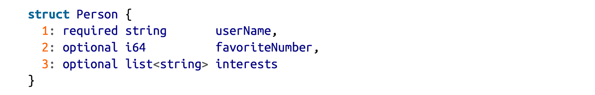

The equivalent schema definition for Protocol Buffers looks very similar:

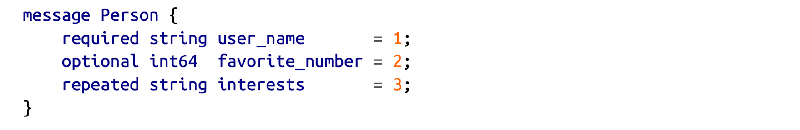

Thrift and Protocol Buffers each come with a code generation tool that takes a schema, and produces classes that implement the schema in various programming languages.

Thrift has two different binary encoding formats called *BinaryProtocol* and *CompactProtocol*, respectively. 

**BinaryProtocol**

Let’s look at BinaryProtocol first, as shown in **Figure 4-2**.

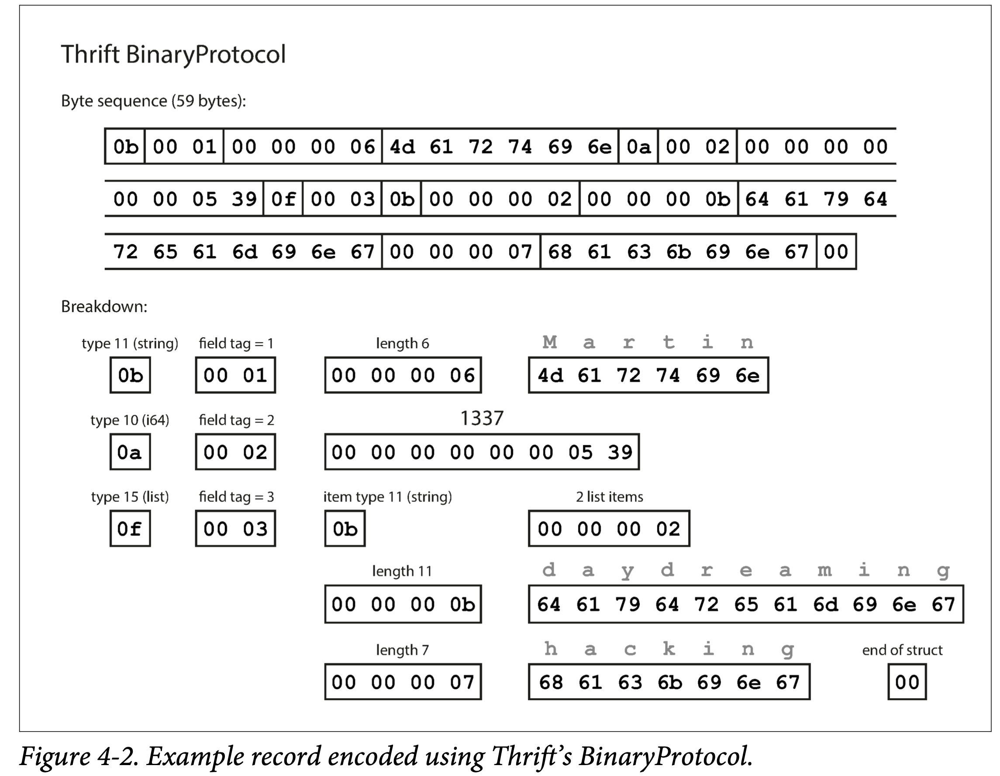

Similarly to **Figure 4-1**, each field has a type annotation (to indicate whether it is a string, integer, list, etc.) and, where required, a length indication (length of a string, number of items in a list). The strings that appear in the data (“Martin”, “daydreaming”, “hacking”) are also encoded as ASCII (UTF-8).

The big difference compared to **Figure 4-1** is that there are no field names (userName, favoriteNumber, interests). Instead, the encoded data contains *field tags*, which are numbers (1, 2, and 3). Those are the numbers that appear in the schema definition.

**CompactProtocol**

The Thrift CompactProtocol encoding is semantically equivalent to BinaryProtocol, but as you can see in **Figure 4-3**, it packs the same information into only 34 bytes. It does this by packing the field type and tag number into a single byte, and by using variable-length integers. Rather than using a full eight bytes for the number 1337, it is encoded in two bytes, with the top bit of each byte used to indicate whether there are still more bytes to come. This means numbers between –64 and 63 are encoded in one byte, numbers between –8192 and 8191 are encoded in two bytes, etc. Bigger numbers use more bytes.

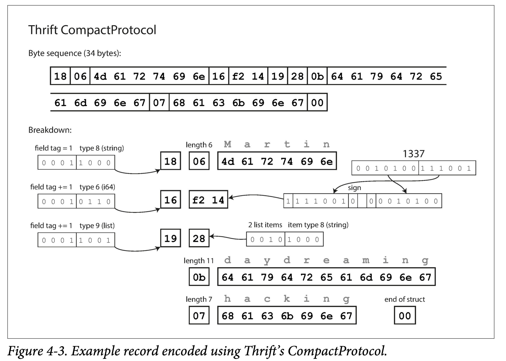

**Protocol Buffers**

Protocol Buffers (which has only one binary encoding format) encodes the same data as shown in **Figure 4-4**. It does the bit packing slightly differently, but is otherwise very similar to Thrift’s CompactProtocol. Protocol Buffers fits the same record in 33 bytes. 

> _**Note:**_  In the schemas shown earlier, each field was marked either required or optional, but this makes no difference to how the field is encoded (nothing in the binary data indicates whether a field was required). The difference is simply that required enables a runtime check that fails if the field is not set, which can be useful for catching bugs.

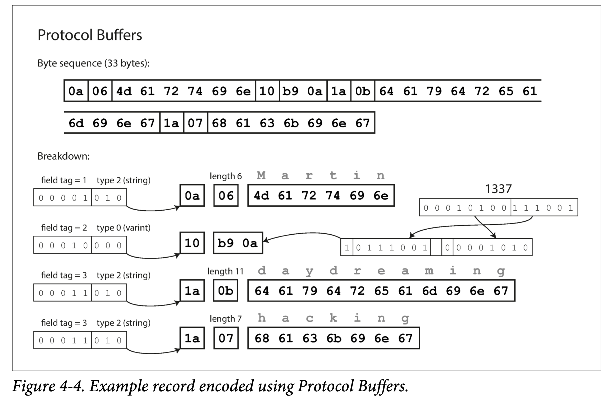

###### Field tags and schema evolution

Schemas inevitably need to change over time, we call this *schema evolution*. How do Thrift and Protocol Buffers handle schema changes while keeping backward and forward compatibility?

The encoded record is just the concatenation of its encoded fields. Each field is identified by its tag number (the numbers 1, 2, 3 in the sample schemas) and annotated with a datatype (e.g., string or integer). If a field value is not set, it is simply omitted from the encoded record. The field tags are critical to the meaning of the encoded data. You can change the name of a field in the schema, since the encoded data never refers to field names, but you cannot change a field’s tag, since that would make all existing encoded data invalid.

**Forward Compatibility**

You can add new fields to the schema, provided that you give each field a new tag number. If old code (which doesn’t know about the new tag numbers you added) tries to read data written by new code, including a new field with a tag number it doesn’t recognize, it can simply ignore that field. The datatype annotation allows the parser to determine how many bytes it needs to skip. This maintains forward compatibility: old code can read records that were written by new code.

**Backward Compatibility**

As long as each field has a unique tag number, new code can always read old data, because the tag numbers still have the same meaning. The only detail is that if you add a new field, you cannot make it required. If you were to add a field and make it required, that check would fail if new code read data written by old code, because the old code will not have written the new field that you added. Therefore, to maintain backward compatibility, every field you add after the initial deployment of the schema must be optional or have a default value.

Removing a field is just like adding a field, with backward and forward compatibility concerns reversed. That means you can only remove a field that is optional (a required field can never be removed), and you can never use the same tag number again (because you may still have data written somewhere that includes the old tag number, and that field must be ignored by new code).

###### Datatypes and schema evolution

What about changing the datatype of a field? There is a risk that values will lose precision or get truncated. For example, changing a 32-bit integer into a 64-bit integer, the old code reads data written by new code with any decoded 64-bit value won’t fit in 32 bits, it will be truncated.

A curious detail of Protocol Buffers is that it does not have a list or array datatype, but instead has a repeated marker for fields (which is a third option alongside required and optional). As you can see in **Figure 4-4**, the encoding of a repeated field is just what it says on the tin: the same field tag simply appears multiple times in the record. This has the nice effect that it’s okay to change an optional (single-valued) field into a repeated (multi-valued) field. New code reading old data sees a list with zero or one elements (depending on whether the field was present); old code reading new data sees only the last element of the list.

Thrift has a dedicated list datatype, which is parameterized with the datatype of the list elements. This does not allow the same evolution from single-valued to multi-valued as Protocol Buffers does, but it has the advantage of supporting nested lists.

##### Avro

Apache Avro is another binary encoding format that is interestingly different from Protocol Buffers and Thrift. It was started in 2009 as a subproject of Hadoop, as a result of Thrift not being a good fit for Hadoop’s use cases.

Avro also uses a schema to specify the structure of the data being encoded. It has two schema languages: one (Avro IDL) intended for human editing, and one (based on JSON) that is more easily machine-readable.

Our example schema, written in Avro IDL, might look like this:

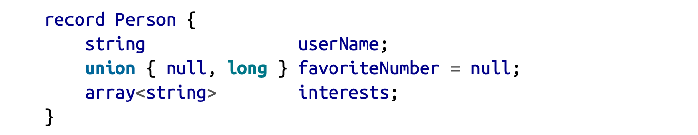

The equivalent JSON representation of that schema is as follows:

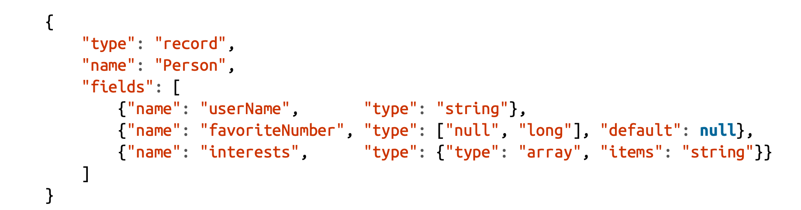

First of all, notice that there are no tag numbers in the schema. If we encode our example record (**Example 4-1**) using this schema, the Avro binary encoding is just 32 bytes long—the most compact of all the encodings we have seen. The breakdown of the encoded byte sequence is shown in **Figure 4-5**.

There is nothing to identify fields or their datatypes. The encoding simply consists of values concatenated together. A string is just a length prefix followed by UTF-8 bytes, but there’s nothing in the encoded data that tells you that it is a string. It could just as well be an integer, or something else entirely. An integer is encoded using a variable-length encoding (the same as Thrift’s CompactProtocol).

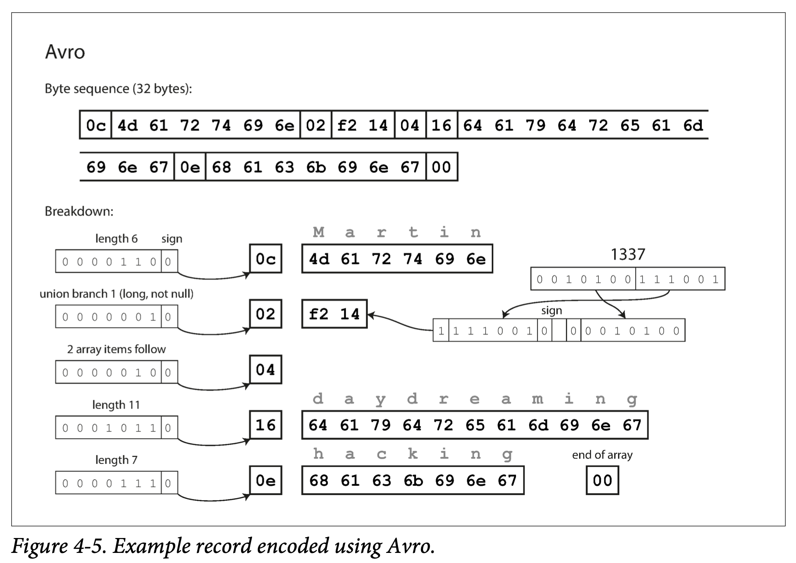

To parse the binary data, you go through the fields in the order that they appear in the schema and use the schema to tell you the datatype of each field. This means that the binary data can only be decoded correctly if the code reading the data is using the *exact same schema* as the code that wrote the data. Any mismatch in the schema between the reader and the writer would mean incorrectly decoded data.

###### Schema Evolution

With Avro, when an application wants to encode some data, it encodes the data using whatever version of the schema it knows about—for example, that schema may be compiled into the application. This is known as the `writer’s schema`.

When an application wants to decode some data, it is expecting the data to be in some schema, which is known as the `reader’s schema`. That is the schema the application code is relying on —code may have been generated from that schema during the application’s build process.

The writer’s schema and the reader’s schema *don’t have to be the same*—they only need to be compatible. When data is decoded (read), the Avro library resolves the differences by looking at the writer’s schema and the reader’s schema side by side and translating the data from the writer’s schema into the reader’s schema. The Avro specification defines exactly how this resolution works, and it is illustrated in Figure 4-6.

1. If the writer’s schema and the reader’s schema have their fields in a different order, the schema resolution will matches up the fields by field name.
2. If the code reading the data encounters a field that appears in the writer’s schema but not in the reader’s schema, it is ignored.
3. If the code reading the data expects some field, but the writer’s schema does not contain a field of that name, it is filled in with a default value declared in the reader’s schema.

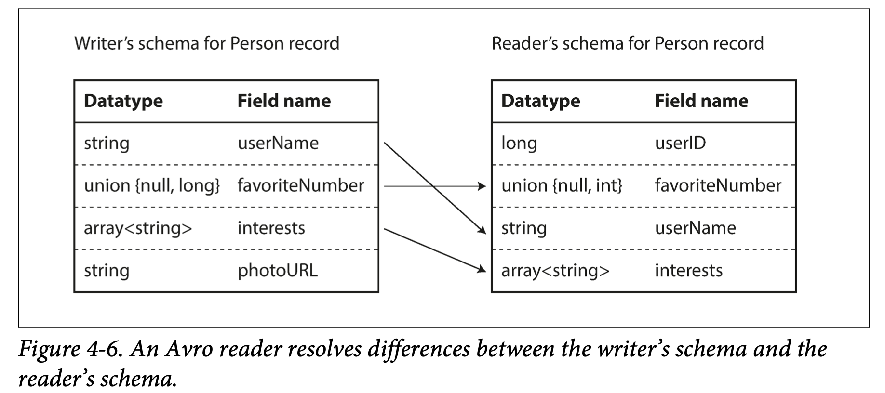

###### Schema Evolution Rules

With Avro, forward compatibility means that you can have a new version of the schema as writer and an old version of the schema as reader. Conversely, backward compatibility means that you can have a new version of the schema as reader and an old version as writer.

To maintain compatibility, you may only add or remove a field that has a default value.If you were to add a field that has no default value, new readers wouldn’t be able to read data written by old writers, so you would break backward compatibility. If you were to remove a field that has no default value, old readers wouldn’t be able to read data written by new writers, so you would break forward compatibility.

In Avro, if you want to allow a field to be null, you have to use a *union type*. For example, union { null, long, string } field; indicates that field can be a number, or a string, or null. You can only use null as a default value if it is one of the branches of the union. This is a little more verbose than having everything nullable by default, but it helps prevent bugs by being explicit about what can and cannot be null.

Consequently, Avro doesn’t have optional and required markers in the same way as Protocol Buffers and Thrift do (it has union types and default values instead).

Changing the datatype of a field is possible, provided that Avro can convert the type. Changing the name of a field is possible but a little tricky: the reader’s schema can contain aliases for field names, so it can match an old writer’s schema field names against the aliases. This means that changing a field name is backward compatible but not forward compatible. Similarly, adding a branch to a union type is backward compatible but not forward compatible.

 **Writer’s Schema**

How does the reader know the writer’s schema with which a particular piece of data was encoded? We can’t just include the entire schema with every record, because the schema would likely be much bigger than the encoded data, making all the space savings from the binary encoding futile.

The answer depends on the context in which Avro is being used. To give a few examples:

*Large file with lots of records*

​	A common use for Avro—especially in the context of Hadoop—is for storing a large file containing millions of records, all encoded with the same schema. In this case, the writer of that file can just include the writer’s schema once at the beginning of the file. Avro specifies a file format (object container files) to do this.

*Database with individually written records*

​	In a database, different records may be written at different points in time using different writer’s schemas. The simplest solution is to include a version number at the beginning of every encoded record, and to keep a list of schema versions in your database. A reader can fetch a record, extract the version number, and then fetch the writer’s schema for that version number from the database. Using that writer’s schema, it can decode the rest of the record. (Espresso works this way)

*Sending records over a network connection*

​	When two processes are communicating over a bidirectional network connection, they can negotiate the schema version on connection setup and then use that schema for the lifetime of the connection. The Avro RPC protocol works like this.

A database of schema versions is a useful thing to have in any case, since it acts as documentation and gives you a chance to check schema compatibility As the version number, you could use a simple incrementing integer, or you could use a hash of the schema.

###### Dynamically generated schemas

Avro is friendlier to *dynamically generated* schemas, because it's schema doesn’t contain any tag numbers. For example, say you have a relational database whose contents you want to dump to a file, and you want to use a binary format to avoid the aforementioned problems with textual formats (JSON, CSV, SQL). If you use Avro, you can fairly easily generate an Avro schema (in the JSON representation we saw earlier) from the relational schema and encode the database contents using that schema, dumping it all to an Avro object container file. You generate a record schema for each database table, and each column becomes a field in that record. The column name in the database maps to the field name in Avro.

If the database schema changes (one column added and one column removed), you can just generate a new Avro schema from the updated database schema and export data in the new Avro schema. The data export process does not need to pay any attention to the schema change—it can simply do the schema conversion every time it runs. Anyone who reads the new data files will see that the fields of the record have changed, but since the fields are identified by name, the updated writer’s schema can still be matched up with the old reader’s schema.

By contrast, if you were using Thrift or Protocol Buffers for this purpose, the field tags would likely have to be assigned by hand: every time the database schema changes, an administrator would have to manually update the mapping from database column names to field tags. (It might be possible to automate this, but the schema generator would have to be very careful to not assign previously used field tags.) This kind of dynamically generated schema simply wasn’t a design goal of Thrift or Protocol Buffers, whereas it was for Avro.

###### Code generation and dynamically typed languages

Thrift and Protocol Buffers rely on code generation: after a schema has been defined, you can generate code that implements this schema in a programming language of your choice. This is useful in statically typed languages such as Java, C++, or C#, because it allows efficient in-memory structures to be used for decoded data, and it allows type checking and autocompletion in IDEs when writing programs that access the data structures.

In dynamically typed programming languages such as JavaScript, Ruby, or Python, there is not much point in generating code, since there is no compile-time type checker to satisfy. Code generation is often frowned upon in these languages, since they otherwise avoid an explicit compilation step. Moreover, in the case of a dynamically generated schema (such as an Avro schema generated from a database table), code generation is an unnecessarily obstacle to getting to the data.

Avro provides optional code generation for statically typed programming languages, but it can be used just as well without any code generation. If you have an object container file (which embeds the writer’s schema), you can simply open it using the Avro library and look at the data in the same way as you could look at a JSON file. The file is *self-describing* since it includes all the necessary metadata.

This property is especially useful in conjunction with dynamically typed data processing languages like Apache Pig. In Pig, you can just open some Avro files, start analyzing them, and write derived datasets to output files in Avro format without even thinking about schemas.

##### The Merits of Schemas

Protocol Buffers, Thrift, and Avro all use a schema to describe a binary encoding format. Their schema languages are much simpler than XML Schema or JSON Schema, which support much more detailed validation rules (e.g., “the string value of this field must match this regular expression” or “the integer value of this field must be between 0 and 100”). As Protocol Buffers, Thrift, and Avro are simpler to implement and simpler to use, they have grown to support a fairly wide range of programming languages.

Many data systems also implement some kind of proprietary binary encoding for their data. For example, most relational databases have a network protocol over which you can send queries to the database and get back responses. Those protocols are generally specific to a particular database, and the database vendor provides a driver (e.g., using the ODBC or JDBC APIs) that decodes responses from the database’s network protocol into in-memory data structures.

So, we can see that although textual data formats such as JSON, XML, and CSV are widespread, binary encodings based on schemas are also a viable option. They have a number of nice properties:

- They can be much more compact than the various “binary JSON” variants, since they can omit field names from the encoded data.
- The schema is a valuable form of documentation, and because the schema is required for decoding, you can be sure that it is up to date (whereas manually maintained documentation may easily diverge from reality).
- Keeping a database of schemas allows you to check forward and backward compatibility of schema changes, before anything is deployed.
- For users of statically typed programming languages, the ability to generate code from the schema is useful, since it enables type checking at compile time.

In summary, schema evolution allows the same kind of flexibility as schemaless/schema-on-read JSON databases provide, while also providing better guarantees about your data and better tooling.

### Modes of Dataflow

We discussed a variety of different encodings methods when you want to send data over the network or write it to a file—you need to encode it as a sequence of bytes. We talked about forward and backward compatibility, which are important for evolvability (making change easy by allowing you to upgrade different parts of your system independently, and not having to change everything at once). Compatibility is a relationship between one process that encodes the data, and another process that decodes it.

We will explore some of the most common ways how data flows between processes:

- Via databases

- Via service calls
- Via asynchronous message passing

#### Dataflow Through Databases

In a database, the process that writes to the database encodes the data, and the process that reads from the database decodes it. There may just be a single process accessing the database, in which case the reader is simply a later version of the same process—in that case you can think of storing something in the database as *sending a message to your future self*.

Backward compatibility is clearly necessary here; otherwise your future self won’t be able to decode what you previously wrote.

In general, it’s common for several different processes to be accessing a database at the same time. Those processes might be several different applications or services, or they may simply be several instances of the same service. Either way, in an environment where the application is changing, it is likely that some processes accessing the database will be running newer code and some will be running older code—for example because a new version is currently being deployed in a rolling upgrade, so some instances have been updated while others haven’t yet.

This means that a value in the database may be written by a *newer* version of the code, and subsequently read by an *older* version of the code that is still running. Thus, forward compatibility is also often required for databases.

However, there is an additional snag. Say you add a field to a record schema, and the newer code writes a value for that new field to the database. Subsequently, an older version of the code (which doesn’t yet know about the new field) reads the record, updates it, and writes it back. In this situation, the desirable behavior is usually for the old code to keep the new field intact, even though it couldn’t be interpreted.

The encoding formats discussed previously support such preservation of unknown fields, but sometimes you need to take care at an application level, as illustrated in **Figure 4-7**. For example, if you decode a database value into model objects in the application, and later re-encode those model objects, the unknown field might be lost in that translation process. Solving this is not a hard problem; you just need to be aware of it.

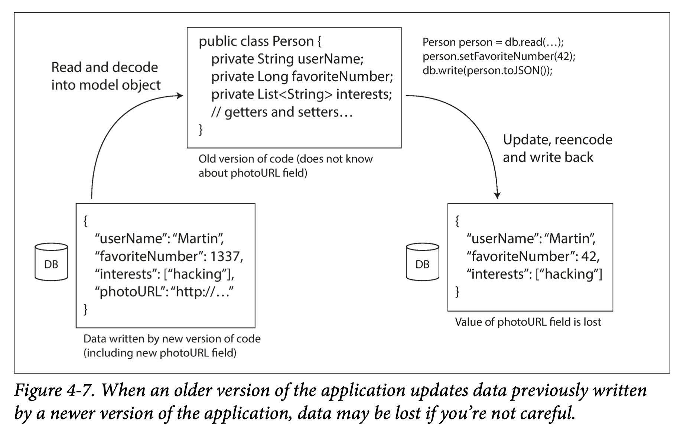

#### Different values written at different times

A database generally allows any value to be updated at any time.When you deploy a new version of your application (of a server-side application, at least), you may entirely replace the old version with the new version within a few minutes. The same is not true of database contents: the five-year-old data will still be there, in the original encoding, unless you have explicitly rewritten it since then. This observation is sometimes summed up as *data outlives code*.

Rewriting (*migrating*) data into a new schema is certainly possible, but it’s an expensive thing to do on a large dataset, so most databases avoid it if possible. Most relational databases allow simple schema changes, such as adding a new column with a null default value, without rewriting existing data. When an old row is read, the database fills in nulls for any columns that are missing from the encoded data on disk. LinkedIn’s document database Espresso uses Avro for storage, allowing it to use Avro’s schema evolution rules.

Schema evolution thus allows the entire database to appear as if it was encoded with a single schema, even though the underlying storage may contain records encoded with various historical versions of the schema.

##### Archival storage

Perhaps you take a snapshot of your database from time to time, say for backup purposes or for loading into a data warehouse. In this case, the data dump will typically be encoded using the latest schema, even if the original encoding in the source database contained a mixture of schema versions from different eras. Since you’re copying the data anyway, you might as well encode the copy of the data consistently.

As the data dump is written in one go and is thereafter immutable, formats like Avro object container files are a good fit. This is also a good opportunity to encode the data in an analytics-friendly column-oriented format such as Parquet.

#### Dataflow Through Services: REST and RPC

When you have processes that need to communicate over a network, there are a few different ways of arranging that communication. The most common arrangement is to have two roles: *clients* and *servers*. The servers expose an API over the network, and the clients can connect to the servers to make requests to that API. The API exposed by the server is known as a *service*.

The web works this way: clients (web browsers) make requests to web servers, making GET requests to download HTML, CSS, JavaScript, images, etc., and making POST requests to submit data to the server. The API consists of a standardized set of protocols and data formats (HTTP, URLs, SSL/TLS, HTML, etc.). Because web browsers, web servers, and website authors mostly agree on these standards, you can use any web browser to access any website (at least in theory!).

Web browsers are not the only type of client. For example, a native app running on a mobile device or a desktop computer can also make network requests to a server, and a client-side JavaScript application running inside a web browser can use XMLHttpRequest to become an HTTP client (this technique is known as *Ajax*). In this case, the server’s response is typically not HTML for displaying to a human, but rather data in an encoding that is convenient for further processing by the client-side application code (such as JSON). Although HTTP may be used as the transport protocol, the API implemented on top is application-specific, and the client and server need to agree on the details of that API.

Moreover, a server can itself be a client to another service (for example, a typical web app server acts as client to a database). This approach is often used to decompose a large application into smaller services by area of functionality, such that one service makes a request to another when it requires some functionality or data from that other service. This way of building applications has traditionally been called a *service-oriented architecture* (SOA), more recently refined and rebranded as *microservices architecture*.

In some ways, services are similar to databases: they typically allow clients to submit and query data. However, while databases allow arbitrary queries using the query languages we discussed, services expose an application-specific API that only allows inputs and outputs that are predetermined by the business logic (application code) of the service. This restriction provides a degree of encapsulation: services can impose fine-grained restrictions on what clients can and cannot do.

A key design goal of a service-oriented/microservices architecture is to make the application easier to change and maintain by making services independently deployable and evolvable. For example, each service should be owned by one team, and that team should be able to release new versions of the service frequently, without having to coordinate with other teams. In other words, we should expect old and new versions of servers and clients to be running at the same time, and so the data encoding used by servers and clients must be compatible across versions of the service API.

##### Web services

When HTTP is used as the underlying protocol for talking to the service, it is called a *web service*. This is perhaps a slight misnomer, because web services are not only used on the web, but in several different contexts. For example:

1. A client application running on a user’s device making requests to a service over HTTP. These requests typically go over the public internet.
2. One service making requests to another service owned by the same organization, often located within the same datacenter, as part of a service-oriented/microservices architecture. (Software that supports this kind of use case is sometimes called *middleware*.)
3. One service making requests to a service owned by a different organization, usually via the internet. This is used for data exchange between different organizations’ backend systems. This category includes public APIs provided by online services, such as credit card processing systems, or OAuth for shared access to user data.

There are two popular approaches to web services: *REST* and *SOAP*. They are almost diametrically opposed in terms of philosophy, and often the subject of heated debate among their respective proponents.

REST is not a protocol, but rather a design philosophy that builds upon the principles of HTTP . It emphasizes simple data formats, using URLs for identifying resources and using HTTP features for cache control, authentication, and content type negotiation. REST has been gaining popularity compared to SOAP, at least in the context of cross-organizational service integration, and is often associated with microservices. An API designed according to the principles of REST is called *RESTful*.

By contrast, SOAP is an XML-based protocol for making network API requests. Although it is most commonly used over HTTP, it aims to be independent from HTTP and avoids using most HTTP features. Instead, it comes with a sprawling and complex multitude of related standards (the *web service framework*, known as *WS-\**) that add various features.

The API of a SOAP web service is described using an XML-based language called the Web Services Description Language, or WSDL. WSDL enables code generation so that a client can access a remote service using local classes and method calls (which are encoded to XML messages and decoded again by the framework). This is useful in statically typed programming languages, but less so in dynamically typed ones.

As WSDL is not designed to be human-readable, and as SOAP messages are often too complex to construct manually, users of SOAP rely heavily on tool support, code generation, and IDEs. For users of programming languages that are not supported by SOAP vendors, integration with SOAP services is difficult.

Even though SOAP and its various extensions are ostensibly standardized, interoperability between different vendors’ implementations often causes problems. For all of these reasons, although SOAP is still used in many large enterprises, it has fallen out of favor in most smaller companies.

RESTful APIs tend to favor simpler approaches, typically involving less code generation and automated tooling. A definition format such as OpenAPI, also known as Swagger , can be used to describe RESTful APIs and produce documentation.

##### The problems with remote procedure calls (RPCs)

Web services are merely the latest incarnation of a long line of technologies for making API requests over a network, many of which received a lot of hype but have serious problems. Enterprise JavaBeans (EJB) and Java’s Remote Method Invocation (RMI) are limited to Java. The Distributed Component Object Model (DCOM) is limited to Microsoft platforms. The Common Object Request Broker Architecture (CORBA) is excessively complex, and does not provide backward or forward compatibility.

All of these are based on the idea of a *remote procedure call* (RPC), which has been around since the 1970s. **The RPC model tries to make a request to a remote network service look the same as calling a function or method in your programming language**, within the same process (this abstraction is called *location transparency*). Although RPC seems convenient at first, the approach is fundamentally flawed. A network request is very different from a local function call:

- A local function call is predictable and either succeeds or fails, depending only on parameters that are under your control. A network request is unpredictable: the request or response may be lost due to a network problem, or the remote machine may be slow or unavailable, and such problems are entirely outside of your control. Network problems are common, so you have to anticipate them, for example by retrying a failed request.
- A local function call either returns a result, or throws an exception, or never returns (because it goes into an infinite loop or the process crashes). A network request has another possible outcome: it may return without a result, due to a *timeout*. In that case, you simply don’t know what happened: if you don’t get a response from the remote service, you have no way of knowing whether the request got through or not.
- If you retry a failed network request, it could happen that the requests are actually getting through, and only the responses are getting lost. In that case, retrying will cause the action to be performed multiple times, unless you build a mechanism for deduplication (*idempotence*) into the protocol. Local function calls don’t have this problem. 
- Every time you call a local function, it normally takes about the same time to execute. A network request is much slower than a function call, and its latency is also wildly variable: at good times it may complete in less than a millisecond, but when the network is congested or the remote service is overloaded it may take many seconds to do exactly the same thing.
- When you call a local function, you can efficiently pass it references (pointers) to objects in local memory. When you make a network request, all those parameters need to be encoded into a sequence of bytes that can be sent over the network. That’s okay if the parameters are primitives like numbers or strings, but quickly becomes problematic with larger objects.
- The client and the service may be implemented in different programming languages, so the RPC framework must translate datatypes from one language into another. This can end up ugly, since not all languages have the same types— recall JavaScript’s problems with numbers greater than $2^{53}$. This problem doesn’t exist in a single process written in a single language.

All of these factors mean that there’s no point trying to make a remote service look too much like a local object in your programming language, because it’s a fundamentally different thing. Part of the appeal of REST is that it doesn’t try to hide the fact that it’s a network protocol (although this doesn’t seem to stop people from building RPC libraries on top of REST).

##### Current directions for RPC

Despite all these problems, RPC isn’t going away. Various RPC frameworks have been built on top of all the encodings methods like: Thrift and Avro come with RPC support included, gRPC is an RPC implementation using Protocol Buffers, Finagle also uses Thrift, and Rest.li uses JSON over HTTP.

This new generation of RPC frameworks is more explicit about the fact that a remote request is different from a local function call. For example, Finagle and Rest.li use *futures* (*promises*) to encapsulate asynchronous actions that may fail. Futures also simplify situations where you need to make requests to multiple services in parallel, and combine their results. gRPC supports *streams*, where a call consists of not just one request and one response, but a series of requests and responses over time.

Some of these frameworks also provide *service discovery*—that is, allowing a client to find out at which IP address and port number it can find a particular service. 

Custom RPC protocols with a binary encoding format can achieve better performance than something generic like JSON over REST. However, a RESTful API has other significant advantages: 

1. it is good for experimentation and debugging (you can simply make requests to it using a web browser or the command-line tool curl, without any code generation or software installation)
2. it is supported by all mainstream programming languages and platforms, and there is a vast ecosystem of tools available (servers, caches, load balancers, proxies, firewalls, monitoring, debugging tools, testing tools, etc.).

For these reasons, REST seems to be the predominant style for public APIs. **The main focus of RPC frameworks is on requests between services owned by the same organization, typically within the same datacenter.**

##### Data encoding and evolution for RPC

For evolvability, it is important that RPC clients and servers can be changed and deployed independently. Compared to data flowing through databases, we can make a simplifying assumption in the case of dataflow through services: it is reasonable to assume that all the servers will be updated first, and all the clients second. Thus, you only need backward compatibility on requests, and forward compatibility on responses.

The backward and forward compatibility properties of an RPC scheme are inherited from whatever encoding it uses:

- Thrift, gRPC (Protocol Buffers), and Avro RPC can be evolved according to the compatibility rules of the respective encoding format.
- In SOAP, requests and responses are specified with XML schemas. These can be evolved, but there are some subtle pitfalls.
- RESTful APIs most commonly use JSON (without a formally specified schema) for responses, and JSON or URI-encoded/form-encoded request parameters for requests. Adding optional request parameters and adding new fields to response objects are usually considered changes that maintain compatibility.

Service compatibility is made harder by the fact that RPC is often used for communication across organizational boundaries, so the provider of a service often has no control over its clients and cannot force them to upgrade. Thus, compatibility needs to be maintained for a long time, perhaps indefinitely. If a compatibility-breaking change is required, the service provider often ends up maintaining multiple versions of the service API side by side.

There is no agreement on how API versioning should work (i.e., how a client can indicate which version of the API it wants to use). For RESTful APIs, common approaches are to use a version number in the URL or in the HTTP Accept header. For services that use API keys to identify a particular client, another option is to store a client’s requested API version on the server and to allow this version selection to be updated through a separate administrative interface.

#### Message-Passing Dataflow

In this final section, we will briefly look at *asynchronous message-passing* systems, which are somewhere between RPC and databases. They are similar to RPC in that a client’s request (usually called a *message*) is delivered to another process with low latency. They are similar to databases in that the message is not sent via a direct network connection, but goes via an intermediary called a *message broker* (also called a *message queue* or *message-oriented middleware*), which stores the message temporarily.

Using a message broker has several advantages compared to direct RPC:

- **It can act as a buffer** if the recipient is unavailable or overloaded, and thus improve system reliability.
- **It can automatically redeliver messages to a process that has crashed**, and thus prevent messages from being lost.
- **It avoids the sender needing to know the IP address and port number of the recipient** (which is particularly useful in a cloud deployment where virtual machines often come and go).
- **It allows one message to be sent to several recipients.**
- **It logically decouples the sender from the recipient** (the sender just publishes messages and doesn’t care who consumes them).

However, a difference compared to RPC is that **message-passing communication is usually one-way**: a sender normally doesn’t expect to receive a reply to its messages. It is possible for a process to send a response, but this would usually be done on a separate channel. This communication pattern is *asynchronous*: the sender doesn’t wait for the message to be delivered, but simply sends it and then forgets about it.

##### Message brokers

The detailed delivery semantics vary by implementation and configuration, but in general, message brokers are used as follows: one process sends a message to a named *queue* or *topic*, and the broker ensures that the message is delivered to one or more *consumers* of or *subscribers* to that queue or topic. There can be many producers and many consumers on the same topic.

A topic provides only one-way dataflow. However, a consumer may itself publish messages to another topic, or to a reply queue that is consumed by the sender of the original message.

Message brokers typically don’t enforce any particular data model—a message is just a sequence of bytes with some metadata, so you can use any encoding format. If the encoding is backward and forward compatible, you have the greatest flexibility to change publishers and consumers independently and deploy them in any order.

If a consumer republishes messages to another topic, you may need to be careful to preserve unknown fields, to prevent the issue described previously in the context of databases (Figure 4-7).

##### Distributed actor frameworks

The *actor model* is a programming model for concurrency in a single process. Rather than dealing directly with threads (and the associated problems of race conditions, locking, and deadlock), logic is encapsulated in *actors*. Each actor typically represents one client or entity, it may have some local state (which is not shared with any other actor), and it communicates with other actors by sending and receiving asynchronous messages. Message delivery is not guaranteed: in certain error scenarios, messages will be lost. Since each actor processes only one message at a time, it doesn’t need to worry about threads, and each actor can be scheduled independently by the framework.

In *distributed actor frameworks*, this programming model is used to scale an application across multiple nodes. The same message-passing mechanism is used, no matter whether the sender and recipient are on the same node or different nodes. If they are on different nodes, the message is transparently encoded into a byte sequence, sent over the network, and decoded on the other side.

Location transparency works better in the actor model than in RPC, because the actor model already assumes that messages may be lost, even within a single process. Although latency over the network is likely higher than within the same process, there is less of a fundamental mismatch between local and remote communication when using the actor model.

A distributed actor framework essentially integrates a message broker and the actor programming model into a single framework. However, if you want to perform rolling upgrades of your actor-based application, you still have to worry about forward and backward compatibility, as messages may be sent from a node running the new version to a node running the old version, and vice versa.

Three popular `distributed actor frameworks` handle message encoding as follows:

- *Akka* uses Java’s built-in serialization by default, which does not provide forward or backward compatibility. However, you can replace it with something like Protocol Buffers, and thus gain the ability to do rolling upgrades.
- *Orleans* by default uses a custom data encoding format that does not support rolling upgrade deployments; to deploy a new version of your application, you need to set up a new cluster, move traffic from the old cluster to the new one, and shut down the old one . Like with Akka, custom serialization plug-ins can be used.
- In *Erlang OTP* it is surprisingly hard to make changes to record schemas (despite the system having many features designed for high availability); rolling upgrades are possible but need to be planned carefully. An experimental new maps datatype (a JSON-like structure) may make this easier in the future.

#### Summary

Many services need to support rolling upgrades, where a new version of a service is gradually deployed to a few nodes at a time, rather than deploying to all nodes simultaneously. Rolling upgrades allow new versions of a service to be released without downtime (thus encouraging frequent small releases over rare big releases) and make deployments less risky (allowing faulty releases to be detected and rolled back before they affect a large number of users). These properties are hugely beneficial for *evolvability*, the ease of making changes to an application.

During rolling upgrades, or for various other reasons, we must assume that different nodes are running the different versions of our application’s code. Thus, it is important that all data flowing around the system is encoded in a way that provides backward compatibility (new code can read old data) and forward compatibility (old code can read new data).

We discussed several data encoding formats and their compatibility properties:

- Programming language–specific encodings are restricted to a single programming language and often fail to provide forward and backward compatibility.
- Textual formats like JSON, XML, and CSV are widespread, and their compatibility depends on how you use them. They have optional schema languages, which are sometimes helpful and sometimes a hindrance. These formats are somewhat ague about datatypes, so you have to be careful with things like numbers and binary strings.
- Binary schema–driven formats like Thrift, Protocol Buffers, and Avro allow compact, efficient encoding with clearly defined forward and backward compatibility semantics. The schemas can be useful for documentation and code generation in statically typed languages. However, they have the downside that data needs to be decoded before it is human-readable.

We also discussed several modes of dataflow, illustrating different scenarios in which data encodings are important:

- Databases, where the process writing to the database encodes the data and the process reading from the database decodes it
- RPC and REST APIs, where the client encodes a request, the server decodes the request and encodes a response, and the client finally decodes the response
- Asynchronous message passing (using message brokers or actors), where nodes communicate by sending each other messages that are encoded by the sender and decoded by the recipient

## Chapter 5

