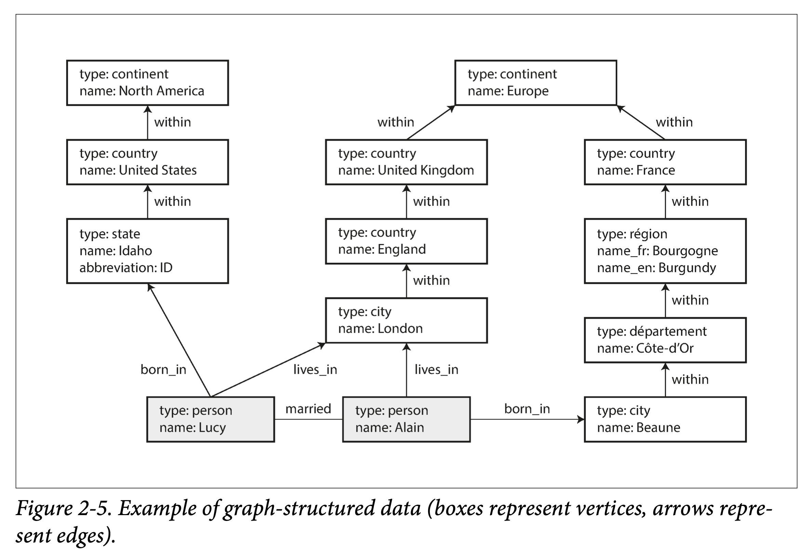
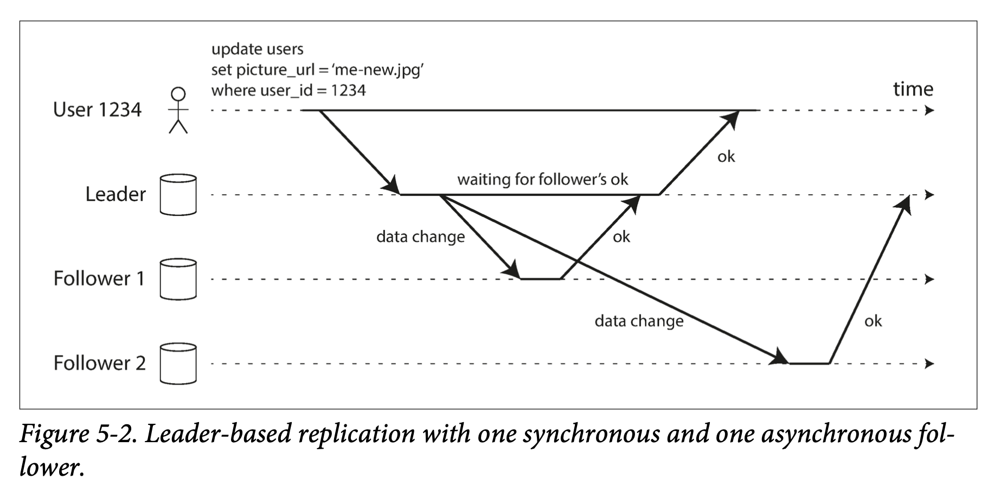
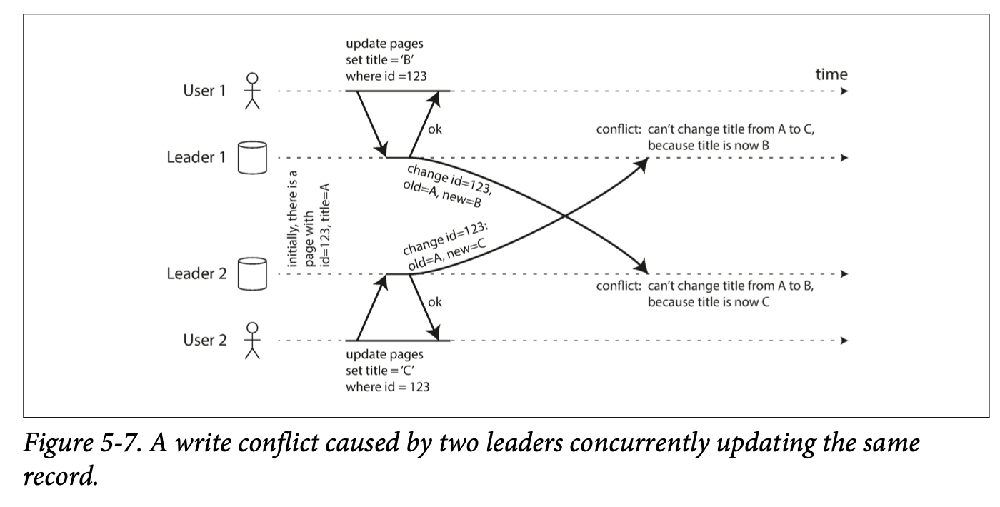
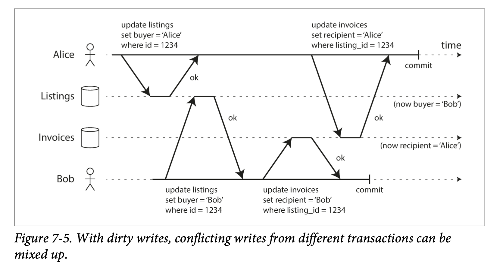
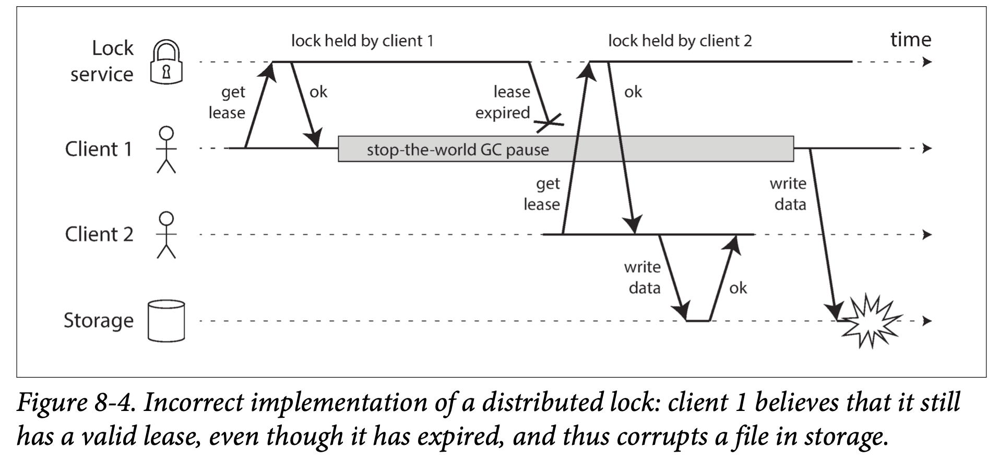
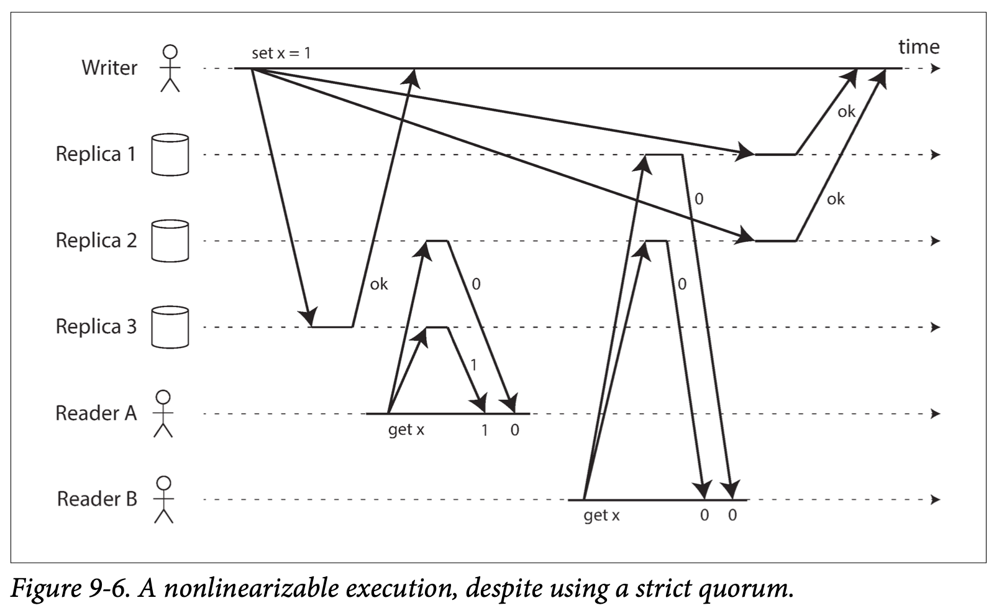

[toc]

# Overview

Three concerns that are import in most software systems:

- **Reliability**
  The system should continue to work correctly (performing the correct function at the desired level of performance) even in the face of adversity (hardware or software faults, and even human error). 

- **Scalability**
  As the system grows (in data volume, traffic volume, or complexity), there should be reasonable ways of dealing with that growth.

- **Maintainability** 

  Over time, many different people will work on the system (engineering and operations, both maintaining current behavior and adapting the system to new use cases), and they should all be able to work on it productively.

## Reliability

For software, typical expectations for reliability include:

- The application performs the function that the user expected.
- It can tolerate the user making mistakes or using the software in unexpected ways.
- Its performance is good enough for the required use case, under the expected load and data volume.
- The system prevents any unauthorized access and abuse.

The things that can go wrong are called *faults*, and systems that anticipate *faults* and can cope with them are called *fault-tolerant* or *resilient*. 

> _**Fault vs Failure**_: A *fault* is usually defined as one component of the system deviating from its spec, whereas a *failure* is when the system as a whole stops providing the required service to the user. 

It is impossible to reduce the probability of a fault to zero; therefore it is usually best to design fault-tolerance mechanisms that prevent faults from causing failures.

### Hardware Faults

Hard disks crash, RAM becomes faulty, the power grid has a blackout, someone unplugs the wrong network cable. 

As the volumes of data and traffic increased, there is a move toward systems that can tolerate the loss of entire machines, by using software fault-tolerance techniques in preference or in addition to hardware redundancy. 

Such systems also have operational advantages: no downtime, as the back up machine can take over when primary machine need to restart.

### Software Errors

Another class of fault is a systematic error within the system. Such faults are harder to anticipate, and because they are correlated across nodes, they tend to cause many more system failures than uncorrelated hardware faults.

There is no quick solution to the problem of systematic faults in software. Lots of small things can help: 

- carefully thinking about assumptions and interactions in the system; 
- thorough testing; 
- process isolation; 
- allowing processes to crash and restart; measuring, monitoring, and analyzing system behavior in production. 
- If a system is expected to provide some guarantee (for example, in a message queue, that the number of incoming messages equals the number of outgoing messages), it can constantly check itself while it is running and raise an alert if a discrepancy is found.

### Human Errors

The best systems combine several approaches to prevent unreliable humans:

- Design systems in a way that minimizes opportunities for error. 
  - For example, well-designed abstractions, APIs, and admin interfaces make it easy to do “the right thing” and discourage “the wrong thing.” However, if the interfaces are too restrictive people will work around them, negating their benefit, so this is a tricky balance to get right.
- Decouple the places where people make the most mistakes from the places where they can cause failures. 
  - In particular, provide fully featured non-production sandbox environments where people can explore and experiment safely, using real data, without affecting real users.
- Test thoroughly at all levels, from unit tests to whole-system integration tests and manual tests. Automated testing is widely used, well understood, and especially valuable for covering corner cases that rarely arise in normal operation.
- Allow quick and easy recovery from human errors, to minimize the impact in the case of a failure. 
  - For example, make it fast to roll back configuration changes, roll out new code gradually (so that any unexpected bugs affect only a small subset of users), and provide tools to recompute data (in case it turns out that the old computation was incorrect).
- Set up detailed and clear monitoring, such as performance metrics and error rates. In other engineering disciplines this is referred to as telemetry. (Once a rocket has left the ground, telemetry is essential for tracking what is happening, and for understanding failures.) 
  - Monitoring can show us early warning signals and allow us to check whether any assumptions or constraints are being violated. When a problem occurs, metrics can be invaluable in diagnosing the issue.
- Implement good management practices and training.

## Scalability

Scalability is the term to describe a system’s ability to cope with increased load. However, it is meaningless to say “X is scalable” or “Y doesn’t scale.” Rather, discussing scalability means considering questions like “If the system grows in a particular way, what are our options for coping with the growth?” and “How can we add computing resources to handle the additional load?”

### Describing Load

Load can be described with a few numbers of load parameters. The best choice of parameters depends on the architecture of your system: it may be requests per second to a web server, the ratio of reads to writes in a database, the number of simultaneously active users in a chat room, the hit rate on a cache, or something else. 

#### Twitter Twitte Case Study

Let’s consider Twitter as an example. Two of Twitter’s main operations are:

- Post tweet
  A user can publish a new message to their followers (4.6k requests/sec on aver‐ age, over 12k requests/sec at peak).
- Home timeline
  A user can view tweets posted by the people they follow (300k requests/sec).

Twitter’s scaling challenge is not primarily due to tweet volume, but due to *fan-out*—each user follows many people, and each user is followed by many people. There are broadly two ways of implementing these two operations:

1. Posting a tweet simply inserts the new tweet into a global collection of tweets. When a user requests their home timeline, look up all the people they follow, find all the tweets for each of those users, and merge them (sorted by time). In a relational database like in Figure 1-2, you could write a query such as:

   ```sql
   SELECT tweets.*, users.* FROM tweets
     JOIN users ON tweets.sender_id = users.id 
     JOIN follows ON follows.followee_id = users.id 
     WHERE follows.follower_id = current_user
   ```

   

2. Maintain a cache for each user’s home timeline—like a mailbox of tweets for each recipient user. When a user posts a tweet, look up all the people who follow that user, and insert the new tweet into each of their home timeline caches. The request to read the home timeline is then cheap, because its result has been computed ahead of time.

   - If the an user has over 30 million followers, this means that result in over 30 million writes to home timelines which is challenger to match Twitter's goal, deliver tweets to followers within five seconds.

   

In the example of Twitter, the distribution of followers per user (maybe weighted by how often those users tweet) is a key load parameter for discussing scalability, since it determines the fan-out load.

Twitter is moving to a hybrid of both approaches. Most users’ tweets continue to be fanned out to home timelines at the time when they are posted, but a small number of users with a very large number of followers (i.e., celebrities) are excepted from this fan-out. Tweets from any celebrities that a user may follow are fetched separately and merged with that user’s home timeline when it is read. This hybrid approach is able to deliver consistently good performance.

### Describing Performance

Once you have described the load on your system, you can investigate what happens when the load increases. 

- When you increase a load parameter and keep the system resources (CPU, memory, network bandwidth, etc.) unchanged, how is the performance of your system affected?
- When you increase a load parameter, how much do you need to increase the resources if you want to keep performance unchanged?

Let’s look briefly at describing the performance of a system.

- In a batch processing system such as Hadoop, we usually care about *throughput*—the number of records we can process per second, or the total time it takes to run a job on a dataset of a certain size.
- In online systems, what’s usually more important is the service’s response time—the time between a client sending a request and receiving a response.

The median a good metric if you want to know how long users typically have to wait: half of user requests are served in less than the median response time, and the other half take longer than the median. The median is also known as the 50th percentile, and sometimes abbreviated as p50.

- For example, if the 95th percentile response time is 1.5 seconds, that means 95 out of 100 requests take less than 1.5 seconds, and 5 out of 100 requests take 1.5 seconds or more. High percentiles of response times, also known as *tail latencies*, are important because they directly affect users’ experience of the service.
- Percentiles are often used in *service level objectives (SLOs)* and *service level agreements (SLAs)*, contracts that define the expected performance and availability of a service. An SLA may state that the service is considered to be up if it has a median response time of less than 200 ms and a 99th percentile under 1 s (if the response time is longer, it might as well be down), and the service may be required to be up at least 99.9% of the time. These metrics set expectations for clients of the service and allow customers to demand a refund if the SLA is not met.

> _**Latency and response time**_
> Latency and response time are often used synonymously, but they are not the same. 
>
> The response time is what the client sees: besides the actual time to process the request (the service time), it includes network delays and queueing delays. The latency is the duration that a request is waiting to be handled—during which it is latent, awaiting service.

Queueing delays often account for a large part of the response time at high percentiles. 

- As a server can only process a small number of things in parallel (limited, for example, by its number of CPU cores), it only takes a small number of slow requests to hold up the processing of subsequent requests—an effect sometimes known as *head-of-line blocking*. Even if those subsequent requests are fast to process on the server, the client will see a slow overall response time due to the time waiting for the prior request to complete. Due to this effect, it is important to measure response times on the client side.
- Even if only a small percentage of backend calls are slow, the chance of getting a slow call increases if an end-user request requires multiple back‐end calls, and so a higher proportion of end-user requests end up being slow (an effect known as *tail latency amplification*)

### Approaches for Coping with Load

An architecture that is appropriate for one level of load is unlikely to cope with 10 times that load. If you are working on a fast-growing service, it is therefore likely that you will need to rethink your architecture on every order of magnitude load increase —or perhaps even more often than that.

- **scaling up** (vertical scaling, moving to a more powerful machine)
- **scaling out** (horizontal scaling, distributing the load across multiple smaller machines). 
  - Distributing load across multiple machines is also known as a shared-nothing architecture.

In reality, good architectures usually involve a pragmatic mixture of approaches: for example, using several fairly powerful machines can still be simpler and cheaper than a large number of small virtual machines.
Some systems are elastic, meaning that they can automatically add computing resources when they detect a load increase, whereas other systems are scaled manually (a human analyzes the capacity and decides to add more machines to the system).

## Maintainability

we can and should design software in such a way that it will hopefully minimize pain during maintenance, and thus avoid creating legacy software ourselves. To this end, we will pay particular attention to three design principles for software systems:

- **Operability**
  Make it easy for operations teams to keep the system running smoothly.
- **Simplicity**
  Make it easy for new engineers to understand the system, by removing as much complexity as possible from the system.
- **Evolvability**
  Make it easy for engineers to make changes to the system in the future, adapting it for unanticipated use cases as requirements change. Also known as extensibility, modifiability, or plasticity.

### Operability: Making Life Easy for Operations

Data systems can do various things to make routine tasks easy, including:

- Providing visibility into the runtime behavior and internals of the system, with good monitoring
- Providing good support for automation and integration with standard tools
- Avoiding dependency on individual machines (allowing machines to be taken down for maintenance while the system as a whole continues running uninter‐ rupted)
- Providing good documentation and an easy-to-understand operational model (“If I do X, Y will happen”)
- Providing good default behavior, but also giving administrators the freedom to override defaults when needed
- Self-healing where appropriate, but also giving administrators manual control over the system state when needed
- Exhibiting predictable behavior, minimizing surprises

### Simplicity: Managing Complexity

Reducing complexity greatly improves the maintainability of software, and thus simplicity should be a key goal for the systems we build.

We can remove *accidental complexity*,if it is not inherent in the problem that the software solves (as seen by the users) but arises only from the implementation.

One of the best tools we have for removing accidental complexity is abstraction. A good abstraction can hide a great deal of implementation detail behind a clean, simple-to-understand façade. 

A good abstraction can also be used for a wide range of different applications. 

- Reuse
- Leads to higher-quality software, as quality improvements in the abstracted component benefit all applications that use it.

### Evolvability: Making Change Easy

In terms of organizational processes, Agile working patterns provide a framework for adapting to change. The Agile community has also developed technical tools and pat‐ terns that are helpful when developing software in a frequently changing environment, such as test-driven development (TDD) and refactoring.

# Data Models and Query Languages

## Relational Model Versus Document Model

### NoSQL

There are several driving forces behind the adoption of NoSQL databases, including:

- A need for *greater scalability* than relational databases can easily achieve, including very large datasets or very high write throughput
- A widespread preference for free and open source software over commercial database products
- Specialized query operations that are not well supported by the relational model
- Frustration with the restrictiveness of relational schemas, and a desire for a more dynamic and expressive data model

### The Object-Relational Mismatch

If data is stored in relational tables, an awkward translation layer is required between the objects in the application code and the database model of tables, rows, and columns. The disconnect between the models is sometimes called an *impedance mismatch*.

**Object-relational mapping** (ORM) frameworks like ActiveRecord and Hibernate reduce the amount of boilerplate code required for this translation layer, but they can’t completely hide the differences between the two models.

### Relational Versus Document Databases Versus Graph Model

There are many differences to consider when comparing relational databases to document databases, including their fault-tolerance properties and handling of concurrency we will concentrate only on the differences in the data model.

- **Document data model**
  - schema-on-read
    - the structure of the data is implicit, and only interpreted when the data is read
    - start writing new documents with the new fields and have code in the application that handles the case when old documents are read if you want to change the field
  - Pros
    - schema flexibility
    - better performance due to locality
    - for some applications it is closer to the data structures used by the application
  - Cons
    - cannot refer directly to a nested item within a document. However, as long as documents are not too deeply nested, that is not usually a problem.
    - Joins can be emulated in application code by making multiple requests to the database, using a document model can lead to significantly more complex application code and worse performance
  - Use cases
    - If application often needs to access the entire document, there is a performance advantage to this storage locality
    - On updates to a document, the entire document usually needs to be rewritten—only modifications that don’t change the encoded size of a document can easily be performed in place
    - application has mostly one-to-many relationships (tree-structured data) or no relationships between records
- **The relational model**
  - schema-on-write
    - the schema is explicit and the database ensures all written data conforms to it
    - you need to perform a migration if you want to change the field
    - keep documents fairly small and avoid writes that increase the size of a document
  - Pros
    - providing better support for joins, and many-to-one and many-to-many relationships
- **Graph Model**
  - Pros
    - For highly interconnected data
    - Good for evolvability: a graph can easily be extended to accommodate changes in your application’s data structures.

## Query Languages for Data

- Declarative query 

  In a declarative query language, like SQL or relational algebra, you just specify the pattern of the data you want

  - typically more concise and easier to work with than an imperative API
  - hides implementation details of the database engine, which makes it possible for the database system to introduce performance improvements without requiring any changes to queries.
  - declarative languages often lend themselves to parallel execution.

- Imperative query
  An imperative language tells the computer to perform certain operations in a certain order. 

## Graph-Like Data Models

Graph can provide a consistent way of storing completely different types of objects in a single datastore. 

There are several different, but related, ways of structuring and querying data in graphs.

- The **property graph model** (implemented by Neo4j, Titan, and InfiniteGraph)
- The triple-store model (implemented by Datomic, AllegroGraph, and others). 

There are declarative and imperative graph query languages:

- Declarative query languages for graphs
  - Cypher, SPARQL, and Datalog
- Imperative graph query languages
  - Gremlin

### Property Graphs

The **property graph model** (implemented by Neo4j, Titan, and InfiniteGraph)

- Each vertex consists of:
  - A unique identifier
  - A set of outgoing edges
  - A set of incoming edges
  - A collection of properties (key-value pairs)
- Each edge consists of:
  - A unique identifier
  - The vertex at which the edge starts (the tail vertex)
  - The vertex at which the edge ends (the head vertex)
  - A label to describe the kind of relationship between the two vertices
  - A collection of properties (key-value pairs)
- There is no schema that restricts which kinds of things can or cannot be associated.
- Given any vertex, you can efficiently find both its incoming and its outgoing edges, and thus traverse the graph
- By using different labels for different kinds of relationships, you can store several different kinds of information in a single graph, while still maintaining a clean data model.

#### The Cypher Query Language

Cypher is a declarative query language for property graphs, created for the Neo4j graph database.



Below code shows the Cypher query to insert the lefthand portion of Figure 2-5 into a graph database. 

```cypher
CREATE
  (NAmerica:Location {name:'North America', type:'continent'}),
  (USA:Location      {name:'United States', type:'country'  }),
  (Idaho:Location    {name:'Idaho',         type:'state'    }),
  (Lucy:Person       {name:'Lucy' }),
  (Idaho) -[:WITHIN]->  (USA)  -[:WITHIN]-> (NAmerica),
  (Lucy)  -[:BORN_IN]-> (Idaho)
```

Cypher query to find people who emigrated from the US to Europe

```cypher
MATCH
  (person) -[:BORN_IN]->  () -[:WITHIN*0..]-> (us:Location {name:'United States'}),
(person) -[:LIVES_IN]-> () -[:WITHIN*0..]-> (eu:Location {name:'Europe'}) 
RETURN person.name
```

### Triple-Stores and SPARQL

In a triple-store, all information is stored in the form of very simple three-part statements: (*subject*, *predicate*, *object*).

The subject of a triple is equivalent to a vertex in a graph. 

The object is one of two things:

1. A value in a primitive datatype, such as a string or a number. 
   - In that case, the predicate and object of the triple are equivalent to the key and value of a property on the subject vertex. 
     - For example, (*lucy*, *age*, *33*) is like a vertex lucy with properties {"age":33}.
2. Another vertex in the graph. 
   - In that case, the predicate is an edge in the graph, the subject is the tail vertex, and the object is the head vertex. 
     - For example, in (*lucy*, *marriedTo*, *alain*) the subject and object *lucy* and *alain* are both vertices, and the predicate *marriedTo* is the label of the edge that connects them.

A subset of the data in Figure 2-5, represented as Turtle triples, vertices of the graph are written as _:*someName*.

When the predicate represents an edge, the object is a vertex, as in *_:idaho :within _:usa*. When the predicate is a property, the object is a string literal, as in _:usa :name "United States".

```turtle
@prefix : <urn:example:>.
_:lucy     a       :Person.
_:lucy     :name   "Lucy".
_:lucy     :bornIn _:idaho.
_:idaho    a       :Location.
_:idaho    :name   "Idaho".
_:idaho    :type   "state".
_:idaho		 :within _:usa.
_:usa			 a				:Location.
_:usa			 :name	 "United States".
_:usa      :type   "country".
_:usa      :within _:namerica.
_:namerica a				:Location.
_:namerica :name		"North America".
_:namerica :type		"continent".

# you can use semicolons to say multiple things about the same subject.
# above can be equivalent to below
@prefix : <urn:example:>.
_:lucy	a :Person;   :name "Lucy";          :bornIn _:idaho.
_:idaho	a :Location; :name "Idaho";         :type "state";   :within _:usa.
_:usa		a :Location; :name "United States"; :type "country"; :within _:namerica.
_:namerica a :Location; :name "North America"; :type "continent".
```

#### The SPARQL Query Language

*SPARQL* is a query language for triple-stores using the *Resource Description Framework* (RDF) data model. It predates Cypher, and since Cypher’s pattern matching is borrowed from SPARQL, they look quite similar. 

The same query as before—finding people who have moved from the US to Europe— is even more concise in SPARQL than it is in Cypher.

```SPARQL
PREFIX : <urn:example:>
SELECT ?personName WHERE {
  ?person :name ?personName.
  ?person :bornIn  / :within* / :name "United States".
  ?person :livesIn / :within* / :name "Europe".
}
```

#### DataLog

Skip

# Storage and Retrieval

There are two families of storage engines: `log-structured storage engines` and `page-oriented storage engine`such as B-tree.

**Index**

An *index* is an additional structure that stored as meta data, which is used to more efficiently find out the desired data location. A well-chosen indexes speed up read queries, but every index slows down writes. 

## Log-Structured Storage Engines

### Hash Indexes

Keeping an in-memory hash map for every segment where every key is mapped to a byte offset in the data file—the location at which the value can be found.

Whenever you append a new key-value pair to the file, you also update the hash map to reflect the offset of the data you just wrote (this works both for inserting new keys and for updating existing keys). 

When you want to look up a value, use the hash map to find the offset in the data file, seek to that location, and read the value.

This is essentially what `Bitcask` (the default storage engine in *Riak*) does. A storage engine like `Bitcask` is well suited to situations where the value for each key is **updated frequently**.

**To Avoid out of disk space:** 

1. Break the log into segments of a certain size by closing a segment file when it reaches a certain size, and making subsequent writes to a new segment file.
2. We can then perform **compaction** on these segments by throwing away duplicate keys in the log, and keeping only the most recent update for each key. 
3. Since compaction often makes segments much smaller, we can also merge several segments together at the same time as performing the compaction. 
4. Segments are never modified after they have been written, so the merged segment is written to a new file. 
5. Such process can be done in the background thread. We continue to serve read and write requests as normal using the old segment files and switch read requests to using the new merged segment once the process is done.
6. Each segment now has its own in-memory hash table, mapping keys to file offsets. In order to find the value for a key, we first check the most recent segment’s hash map; if the key is not present we check the second-most-recent segment, and so on. The merging process keeps the number of segments small, so lookups don’t need to check many hash maps.

**Some of the issues that are important in a real implementation are:**

- File Format 
  CSV is not the best format for a log. It’s faster and simpler to use a binary format that first encodes the length of a string in bytes, followed by the raw string (without need for escaping).
- Deleting Records
  If you want to delete a key and its associated value, you have to append a special deletion record to the data file (sometimes called a *tombstone*). When log segments are merged, the tombstone tells the merging process to discard any previous values for the deleted key.
- Crash recovery
  If the database is restarted, the in-memory hash maps are lost. In principle, you can restore each segment’s hash map by reading the entire segment file from beginning to end and noting the offset of the most recent value for every key as you go along. However, that might take a long time if the segment files are large, which would make server restarts painful. 
  - *Bitcask* speeds up recovery by storing a snapshot of each segment’s hash map on disk, which can be loaded into memory more quickly.
- Partially written records
  The database may crash at any time, including halfway through appending a record to the log. 
  - *Bitcask* files include checksums, allowing such corrupted parts of the log to be detected and ignored.
- Concurrency control
  As writes are appended to the log in a strictly sequential order, a common implementation choice is to have only one writer thread. Data file segments are append-only and otherwise immutable, so they can be read concurrently by multiple threads.
  - One Writer, multiple readers

**Advantage of append-only logs:**

- Appending and segment merging are sequential write operations, which are generally much faster than random writes.
- Concurrency and crash recovery are much simpler if segment files are append-only or immutable. 
  - For example, you don’t have to worry about the case where a crash happened while a value was being overwritten, leaving you with a file containing part of the old and part of the new value spliced together.

- Merging old segments avoids the problem of data files getting fragmented over time.

**The hash table index‘s limitations**

- The hash table must fit in memory.
  - In principle, you could maintain a hash map on disk, but unfortunately it is difficult to make an on-disk hash map perform well. It requires a lot of random access I/O, it is expensive to grow when it becomes full, and hash collisions require fiddly logic.

- Range queries are not efficient. 
  - For example, you cannot easily scan over all keys between kitty00000 and kitty99999—you’d have to look up each key individually in the hash maps.


### Sorted String Table(SSTable)

The sequence of key-value pairs is sorted by key, such format called *Sorted String Table*.

Advantage over `Index Hash Table`:

- Merging segments is simple and efficient, even if the files are bigger than the available memory. 
  - Start reading the input files side by side, look at the first key in each file, copy the lowest key (according to the sort order) to the output file, and repeat. This produces a new merged segment file, also sorted by key. 
  - When multiple segments contain the same key, we can keep the value from the most recent segment and discard the values in older segments.
- Not need to keep indexing of all keys, since it's in order, an in-memory index can tell you the offsets for some of the keys, but it can be sparse: one key for every few kilobytes of segment file is sufficient, because a few kilobytes can be scanned very quickly.
- Since read requests need to scan over several key-value pairs in the requested range anyway, it is possible to group those records into a block and compress it before writing it to disk. Each entry of the sparse in-memory index then points at the start of a compressed block. Besides saving disk space, compression also reduces the I/O bandwidth use.

#### Constructing and maintaining SSTables

- When a write comes in, add it to an in-memory balanced tree data structure (for example, a red-black tree). 
  - This in-memory tree is sometimes called a `memtable`.

- When the `memtable` gets bigger than some threshold—typically a few megabytes, write it out to disk as an SSTable file. 
  - This can be done efficiently because the tree already maintains the key-value pairs sorted by key. The new SSTable file becomes the most recent segment of the database. While the SSTable is being written out to disk, writes can continue to a new `memtable` instance.

- In order to serve a read request, first try to find the key in the `memtable`, then in the most recent on-disk segment, then in the next-older segment, etc.
- From time to time, run a merging and compaction process in the background to combine segment files and to discard overwritten or deleted values.

**Crash safe for memtable**

If the database crashes, the data in memtable which have not yet written out to disk will be lost. We can keep a separate log on disk to which every write is immediately appended. 

- That log is not in sorted order, but that doesn’t matter, because its only purpose is to restore the `memtable` after a crash. Every time the `memtable` is written out to an SSTable, the corresponding log can be discarded.

Storage engines that are based on this principle of merging and compacting sorted files are often called *Log-Structured Merge-Tree* (LSM) storage engines.

> _**Lucene**_, an indexing engine for full-text search used by Elasticsearch and Solr, uses a similar method for storing its *term dictionary*. A full-text index is much more complex than a key-value index but is based on a similar idea: given a word in a search query, find all the documents (web pages, product descriptions, etc.) that mention the word. This is implemented with a key-value structure where the key is a word (a *term*) and the value is the list of IDs of all the documents that contain the word (the *postings list*). 
>
> In Lucene, this mapping from term to postings list is kept in SSTable-like sorted files, which are merged in the background as needed.

#### Performance Optimisations

**Search for non-exist key**

Search non-exist key may required scan the whole database, can use additional *Bloom filters* to avoid scan the entire database.

> _**Note:**_ `Bloom filter` is a memory-efficient data structure for approximating the contents of a set. It can tell you if a key does not appear in the database, and thus saves many unnecessary disk reads for nonexistent keys.

**Strategies to determine the order and timing of how SSTables are compacted and merged** 

- `size-tiered` compaction, newer and smaller SSTables are successively merged into older and larger SSTables. 
  - HBase uses size-tiered, Cassandra
- In `leveled` compaction, the key range is split up into smaller SSTables and older data is moved into separate “levels,” which allows the compaction to proceed more incrementally and use less disk space.
  - LevelDB and RocksDB use leveled compaction, Cassandra

#### Summary

The basic idea of LSM-trees—keeping a cascade of SSTables that are merged in the background:

- is simple and effective
- dataset that bigger than available memory can still work well
- efficiently perform range queries due to sorted order
- support remarkably high write throughput thanks to sequential writes

## Page-Oritented Storage

### B-Trees

B-trees break the database down into fixed-size *blocks* or *pages*, traditionally 4 KB in size (sometimes bigger), and read or write one page at a time. 

- This design corresponds more closely to the underlying hardware, as disks are also arranged in fixed-size blocks.

Each page can be identified using an address or location, which allows one page to refer to another—similar to a pointer, but on disk instead of in memory. We can use these page references to construct a tree of pages, as illustrated below:


One page is designated as the root of the B-tree. The page contains several keys and references to child pages. Each child is responsible for a continuous range of keys, and the keys between the references indicate where the boundaries between those ranges lie.

Eventually we get down to a page containing individual keys (a leaf page), which either contains the value for each key inline or contains references to the pages where the values can be found.

The number of references to child pages in one page of the B-tree is called the `branching factor`. In practice, the branching factor depends on the amount of space required to store the page references and the range boundaries, but typically it is several hundred.

**Update**

If you want to update the value for an existing key in a B-tree, you search for the leaf page containing that key, change the value in that page, and write the page back to disk (any references to that page remain valid). 

**Add**

If you want to add a new key, you need to find the page whose range encompasses the new key and add it to that page. If there isn’t enough free space in the page to accommodate the new key, it is split into two half-full pages, and the parent page is updated to account for the new subdivision of key ranges.


This algorithm ensures that the tree remains balanced: a B-tree with n keys always has a depth of O(log n). Most databases can fit into a B-tree that is three or four levels deep. (A four-level tree of 4 KB pages with a branching factor of 500 can store up to 256 TB.)

#### Making B-Trees Reliable

The basic underlying write operation of a B-tree is to overwrite a page on disk with new data. It is assumed that the overwrite does not change the location of the page.

Extra steps need to done if there are changes for the locations:

1. If you split a page because an insertion caused it to be overfull, you need to write the two pages that were split, and also overwrite their parent page to update the references to the two child pages. 
   - If the database crashes in the middle of writing process, you end up with a corrupted index. To make the database resilient to crashes, it is common for B-tree implementations to include an additional data structure on disk: 
     - A *write-ahead log* (*WAL*, also known as a redo log). This is an append-only file to which every B-tree modification must be written before it can be applied to the pages of the tree itself. When the database comes back up after a crash, this log is used to restore the B-tree back to a consistent state.

2. Careful concurrency control is required if multiple threads are going to access the B-tree at the same time. 
   - This is typically done by protecting the tree’s data structures with latches (lightweight locks). 

#### B-tree Optimizations

- Instead of overwriting pages and maintaining a WAL for crash recovery, some databases (like LMDB) use a *copy-on-write* scheme.
  -  A modified page is written to a different location, and a new version of the parent pages in the tree is created, pointing at the new location. 

- We can save space in pages by not storing the entire key, but abbreviating it. So that we can packing more keys into a page allows the tree to have a higher *branching factor*, and thus fewer levels.
- In general, pages can be positioned anywhere on disk, if a query needs to scan over a large part of the key range in sorted order, that page-by-page layout can be inefficient, because a disk seek may be required for every page that is read. 
  - Many B-tree implementations therefore try to lay out the tree so that leaf pages appear in sequential order on disk. However, it’s difficult to maintain that order as the tree grows.

- Additional pointers have been added to the tree. 
  - For example, each leaf page may have references to its sibling pages to the left and right, which allows scanning keys in order without jumping back to parent pages.

- B-tree variants such as *fractal trees* borrow some log-structured ideas to reduce disk seeks. 

#### Comparison between B-Trees and LSM-Trees

Write:

- B-Tree
  - A B-tree index must write every piece of data at least twice: 
    - once to the write-ahead log
    - once to the tree page itself.
  - There is also overhead from having to write an entire page at a time, even if only a few bytes in that page changed.
- LSM-Tree
  - Log-structured indexes also rewrite data multiple times due to repeated compaction and merging of SSTables. This effect—one write to the database resulting in multiple writes to the disk over the course of the database’s lifetime—is known as `write amplification`. 
- LSM-trees are typically able to sustain higher write throughput than B-trees
  - partly because they sometimes have lower write amplification (although this depends on the storage engine configuration and workload)
  - partly because they sequentially write compact SSTable files rather than having to overwrite several pages in the tree. 

Space:

- LSM-tree
  - Compressed better, produce smaller files on disk than B-trees. 
- B-Tree
  - B-tree storage engines leave some disk space unused due to fragmentation: 
    - when a page is split or when a row cannot fit into an existing page, some space in a page remains unused. 
- Since LSM-trees are not page-oriented and periodically rewrite SSTables to remove fragmentation, they have lower storage overheads, especially when using *leveled compaction*.

Compaction Impact:

- LSM-tree
  - Compaction process can sometimes interfere with the performance of ongoing reads and writes. Disks have limited resources, so it can easily happen that a request needs to wait while the disk finishes an expensive compaction operation. The impact on throughput and average response time is usually small, but at higher percentiles the response time of queries to log-structured storage engines can sometimes be quite high.
  - The disk’s finite write bandwidth needs to be shared between the initial write (logging and flushing a memtable to disk) and the compaction threads running in the background.
    - When writing to an empty database, the full disk bandwidth can be used for the initial write, but the bigger the database gets, the more disk bandwidth is required for compaction.
  - If write throughput is high and compaction is not configured carefully, it can happen that compaction cannot keep up with the rate of incoming writes. 
    - In this case, the number of unmerged segments on disk keeps growing until you run out of disk space, and reads also slow down because they need to check more segment files. Typically, SSTable-based storage engines do not throttle the rate of incoming writes, even if compaction cannot keep up, so you need explicit monitoring to detect this situation.
- B-Tree
  - B-trees can be more predictable delay

Keys:

- B-trees
  - Each key exists in exactly one place in the index
    - This aspect makes B-trees attractive in databases that want to offer strong transactional semantics: in many relational databases, transaction isolation is implemented using locks on ranges of keys, and in a B-tree index, those locks can be directly attached to the tree
- LSM-tree
  - A log-structured storage engine may have multiple copies of the same key in different segments.

There is no quick and easy rule for determining which type of storage engine is better for your use case, so it is worth testing empirically.

## More Indexing Structures

### Secondary Indexes

**Secondary Indexes:** Same as primary indexes but it is not unique, and they are often crucial for performing joins efficiently.

The key in an index is the thing that queries search for, but the value can be one of two things: 

1. It could be the actual row (document, vertex) in question
2. It could be a reference to the row stored elsewhere. 
   - The place where rows are stored is known as a **heap file**, and it stores data in no particular order (it may be append-only, or it may keep track of deleted rows in order to overwrite them with new data later). 
   - The heap file approach is common because it avoids duplicating data when multiple secondary indexes are present: each index just references a location in the heap file, and the actual data is kept in one place.
   - Efficient on updating a value without changing the key, provided that the new value is not larger than the old value.

### Clustered index

In some situations, the extra hop from the index to the heap file is too much of a performance penalty for reads, so it can be desirable to store the indexed row directly within an index. This is known as a `clustered index`. 

- For example, in MySQL’s InnoDB storage engine, the primary key of a table is always a clustered index, and secondary indexes refer to the primary key (rather than a heap file location). 
- In SQL Server, you can specify one clustered index per table.

### Covering Index

*Covering Index* is a compromise between a clustered index (storing all row data within the index) and a non-clustered index (storing only references to the data within the index)

- which stores *some* of a table’s columns within the index

As with any kind of duplication of data, clustered and covering indexes can speed up reads, but they require additional storage and can add overhead on writes. Databases also need to go to additional effort to enforce transactional guarantees, because applications should not see inconsistencies due to the duplication.

### Multi-column Indexes

The most common type of multi-column index is called a `concatenated index`, which simply combines several fields into one key by appending one column to another (the index definition specifies in which order the fields are concatenated).

#### Multi-dimensional Indexes

Multi-dimensional indexes are a more general way of querying several columns at once, which is particularly important for geospatial data. 

A standard B-tree or LSM-tree index is not able to answer that kind of query efficiently: it can give you either all the restaurants in a range of latitudes (but at any longitude), or all the restaurants in a range of longitudes (but anywhere between the North and South poles), but not both simultaneously.

One option is to translate a two-dimensional location into a single number using a space-filling curve, and then to use a regular B-tree index. More commonly, specialized spatial indexes such as R-trees are used. 

- For example, *PostGIS* implements geospatial indexes as R-trees using PostgreSQL’s Generalized Search Tree indexing facility.

### Full-text search and fuzzy indexes

Use for finding similar keys or misspelled words.

`Lucene` is able to search text for words within a certain edit distance (an edit distance of 1 means that one letter has been added, removed, or replaced)

`Lucene` uses a SSTable-like structure for its term dictionary. This structure requires a small in-memory index that tells queries at which offset in the sorted file they need to look for a key.The in-memory index is a finite state automaton over the characters in the keys, similar to a trie. 

Other fuzzy search techniques go in the direction of document classification and machine learning. 

### In-memory Database

There are different types of in-memory stores:

- Such as Memcached, are intended for caching use only, where it’s acceptable for data to be lost if a machine is restarted.
- Some aim for `durability`, which can be achieved with special hardware 
  - Such as battery-powered RAM
  - Writing a log of changes to disk
  - Writing periodic snapshots to disk
  - Replicating the in-memory state to other machines.

**Performance Advantage**

The performance advantage of in-memory databases is they can avoid the overheads of encoding in-memory data structures in a form that can be written to disk.

**Simple Implementation**

In-memory databases is providing data models that are difficult to implement with disk-based indexes. For example, Redis offers a database-like interface to various data structures such as priority queues and sets. Because it keeps all data in memory, its implementation is comparatively simple.

#### Anti-caching

In-memory database architecture could be extended to support datasets larger than the available memory, without bringing back the overheads of a disk-centric architecture. The so-called *anti-caching* approach works by evicting the least recently used data from memory to disk when there is not enough memory, and loading it back into memory when it is accessed again in the future. This approach still requires indexes to fit entirely in memory.

- This is similar to what operating systems do with virtual memory and swap files, but the database can manage memory more efficiently than the OS, as it can work at the granularity of individual records rather than entire memory pages.

## Transaction Processing and Analytics

An application looks up a small number of records by some key, using an index. Records are inserted or updated based on the user’s input. Because these applications are interactive, the access pattern became known as **online transaction processing** (**OLTP**).

An analytic query needs to scan over a huge number of records, only reading a few columns per record, and calculates aggregate statistics (such as count, sum, or average) rather than returning the raw data to the user. These queries are often written by business analysts, and feed into reports that help the management of a company make better decisions (business intelligence). In order to differentiate this pattern of using databases from transaction processing, it has been called **online analytic processing** (**OLAP**)

| Property             | Transaction processing systems (OLTP)             | Analytic systems (OLAP)                   |
| -------------------- | ------------------------------------------------- | ----------------------------------------- |
| Main read pattern    | Small number of records per query, fetched by key | Aggregate over large number of records    |
| Main write pattern   | Random-access, low-latency writes from user input | Bulk import (ETL) or event stream         |
| Primarily used by    | End user/customer, via web application            | Internal analyst, for decision support    |
| What data represents | Latest state of data (current point in time)      | History of events that happened over time |
| Dataset size         | Gigabytes to terabytes                            | Terabytes to petabytes                    |

### Data Warehousing

Data warehousing is a separate database mainly for data analysis without affecting OLTP operations.The data warehouse contains a read-only copy of the data in all the various OLTP systems in the company. Data is extracted from OLTP databases (using either a periodic data dump or a continuous stream of updates), transformed into an analysis-friendly schema, cleaned up, and then loaded into the data warehouse. This process of getting data into the warehouse is known as **Extract–Transform–Load** (**ETL**) and is illustrated below:


A big advantage of using a separate data warehouse, rather than querying OLTP systems directly for analytics, is that the data warehouse can be optimized for analytic access patterns.

The data model of a data warehouse is most commonly relational, because SQL is generally a good fit for analytic queries. There are many graphical data analysis tools that generate SQL queries, visualize the results, and allow analysts to explore the data (through operations such as *drill-down* and *slicing and dicing*).

Some databases, such as Microsoft SQL Server and SAP HANA, have support for transaction processing and data warehousing in the same product. 

- However, they are increasingly becoming two separate storage and query engines, which happen to be accessible through a common SQL interface.

Data warehouse vendors such as

-  *Teradata*, *Vertica*, *SAP HANA*, and *ParAccel* typically sell their systems under expensive commercial licenses. Amazon RedShift is a hosted version of *ParAccel*.
- A plethora of open source SQL-on-Hadoop projects have emerged.
  - These include *Apache Hive*, *Spark SQL*, *Cloudera Impala*, *Facebook Presto*, *Apache Tajo*, and *Apache Drill* . Some of them are based on ideas from Google’s *Dremel*.

### Stars and Snowflakes: Schemas for Analytics

#### Stars Schema

In analytics, there is much less diversity of data models. Many data warehouses are used in a fairly formulaic style, known as a *star schema* (also known as *dimensional modeling*).

Figure 3-9 shows a data warehouse that might be found at a grocery retailer. 

- At the center of the schema is a so-called *fact table* (in this example, it is called *fact_sales*). 
- Each row of the *fact table* represents an event that occurred at a particular time (here, each row represents a customer’s purchase of a product). 
- If we were analyzing website traffic rather than retail sales, each row might represent a page view or a click by a user.


Usually, facts are captured as individual events, because this allows maximum flexibility of analysis later. However, this means that the fact table can become extremely large.

- Some of the columns in the fact table are attributes, such as the price at which the product was sold and the cost of buying it from the supplier (allowing the profit margin to be calculated).
- Other columns in the fact table are foreign key references to other tables, called *dimension tables*. 
  - As each row in the fact table represents an event, the dimensions represent the who, what, where, when, how, and why of the event.

#### Snowflask Schema

Snowflask schema is a variation of star schema, where dimensions are further broken down into subdimensions. 

- For example, there could be separate tables for brands and product categories, and each row in the dim_product table could reference the brand and category as foreign keys, rather than storing them as strings in the dim_product table. 

Snowflake schemas are more normalized than star schemas, but star schemas are often preferred because they are simpler for analysts to work with.

## Column-Oriented Storage

In a typical data warehouse, tables are often very wide: fact tables often have over 100 columns, sometimes several hundred. Dimension tables can also be very wide, as they include all the metadata that may be relevant for analysis. If you have trillions of rows and petabytes of data in your fact tables, storing and querying them efficiently becomes a challenging problem.

But usually for the result of query, it only need few columns and ignore all other columns.

We can use `column-oriented storage` to make the query efficiently.

- The idea behind column-oriented storage is simple: don’t store all the values from one row together, but store all the values from each column together instead. If each column is stored in a separate file, a query only needs to read and parse those columns that are used in that query, which can save a lot of work. This principle is illustrated in Figure 3-10.
- Column storage is easiest to understand in a relational data model, but it applies equally to nonrelational data. 
  - For example, *Parquet* is a columnar storage format that supports a document data model, based on Google’s Dremel.


### Column Compression

We can further reduce the demands on disk throughput by compressing data. Take a look at the sequences of values for each column in Figure 3-10: they often look quite repetitive, which is a good sign for compression. Depending on the data in the column, different compression techniques can be used. 

- One technique that is particularly effective in data warehouses is bitmap encoding, illustrated in Figure 3-11.
  - Often, the number of distinct values in a column is small compared to the number of rows. We can now take a column with n distinct values and turn it into n separate bitmaps: one bitmap for each distinct value, with one bit for each row. The bit is 1 if the row has that value, and 0 if not.
  - If n is very small (for example, a country column may have approximately 200 distinct values), those bitmaps can be stored with one bit per row. 
  - But if n is bigger, there will be a lot of zeros in most of the bitmaps (we say that they are sparse). 
    - In that case, the bitmaps can additionally be run-length encoded, as shown at the bottom of Figure 3-11. This can make the encoding of a column remarkably compact.


Bitmap indexes such as these are very well suited for the kinds of queries that are common in a data warehouse. For example:

- WHERE product_sk IN (30, 68, 69):
  - Load the three bitmaps for product_sk = 30, product_sk = 68, and product_sk = 69, and calculate the bitwise *OR* of the three bitmaps, which can be done very efficiently.
- WHERE product_sk = 31 AND store_sk = 3:
  - Load the bitmaps for product_sk = 31 and store_sk = 3, and calculate the bit‐wise *AND*. This works because the columns contain the rows in the same order, so the *k*th bit in one column’s bitmap corresponds to the same row as the *k*th bit in another column’s bitmap.

#### Memory bandwidth and vectorized processing

The advantage of column-oriented storage:

- Reducing the volume of data that needs to be loaded from disk 
- Making efficient use of CPU cycles. 
  - For example, the query engine can take a chunk of compressed column data that fits comfortably in the CPU’s L1 cache and iterate through it in a *tight loop* (that is, with no function calls). A CPU can execute such a loop much faster than code that requires a lot of function calls and conditions for each record that is processed. 
  - Column compression allows more rows from a column to fit in the same amount of L1 cache. Bitwise AND and OR operators can be designed to operate on such chunks of compressed column data directly. This technique is known as **vectorized processing**.

### Sort Oder in Column Storage

The data needs to be sorted an entire row at a time.The sorted order will depend on analysis needs, with the sorted order data, we now can query more efficiently. 

Sorted order can help with compression of columns. 

- If the primary sort column does not have many distinct values, then after sorting, it will have long sequences where the same value is repeated many times in a row. 
- A simple run-length encoding, like bitmaps, could compress that column down to a few kilobytes—even if the table has billions of rows.

That compression effect is strongest on the first sort key. The second and third sort keys will be more jumbled up, and thus not have such long runs of repeated values. Columns further down the sorting priority appear in essentially random order, so they probably won’t compress as well. But having the first few columns sorted is still a win overall.

#### Several different sort orders

Different queries benefit from different sort orders, we can store the same data sorted in several different ways in different replicated data machines. You don’t lose data if one machine fails. When you’re processing a query, you can use the version that best fits the query pattern.

### Writing to Column-Oriented Storage

Column-oriented storage, compression, and sorting all help to make those read queries faster. However, they have the downside of making writes more difficult.

We can use LSM-trees, All writes first go to an in-memory store, where they are added to a sorted structure and prepared for writing to disk. It doesn’t matter whether the in-memory store is row-oriented or column-oriented. When enough writes have accumulated, they are merged with the column files on disk and written to new files in bulk. This is essentially what *Vertica* does.

Queries need to examine both the column data on disk and the recent writes in memory, and combine the two. However, the query optimizer hides this distinction from the user.

### Aggregation: Data Cubes and Materialized Views

Not every data warehouse is necessarily a column store: traditional row-oriented databases and a few other architectures are also used. 

Another aspect of data warehouses that is worth mentioning briefly is *materialized aggregates*. 

#### Materialized Aggregates

We can cache some of the counts or sums that queries use most often. 

- One way of creating such a cache is a materialized view. 
  - An materialized view is an actual copy of the query results, written to disk.
  - When the underlying data changes, a materialized view needs to be updated, because it is a denormalized copy of the data. The database can do that automatically, but such updates make writes more expensive, which is why materialized views are not often used in OLTP databases. In read-heavy data warehouses they can make more sense (whether or not they actually improve read performance depends on the individual case).

In a relational data model, it is often defined like a standard (virtual) view: a table-like object whose contents are the results of some query, a virtual view is just a shortcut for writing queries. When you read from a virtual view, the SQL engine expands it into the view’s underlying query on the fly and then processes the expanded query.

A common special case of a materialized view is known as a *data cube* or OLAP cube. It is a grid of aggregates grouped by different dimensions. Figure 3-12 shows an example.


You can apply the same aggregate along each row or column and get a summary that has been reduced by one dimension (the sales by product regardless of date, or the sales by date regardless of product).

**Advantage**

The advantage of a materialized data cube is that certain queries become very fast because they have effectively been precomputed. 

**Disadvantage**

The disadvantage is that a data cube doesn’t have the same flexibility as querying the raw data. 

## Summary

Storage engines fall into two broad categories: 

- Those optimized for transaction processing (OLTP)
  - Typically user-facing
  - A huge volume of requests. In order to handle the load, applications usually only touch a small number of records in each query. The application requests records using some kind of key, and the storage engine uses an index to find the data for the requested key. Disk seek time is often the bottleneck.
  - Storage engines
    - log-structured, which only permits appending to files and deleting obsolete files, but never updates a file that has been written. Bitcask, SSTables, LSM-trees, LevelDB, Cassandra, HBase, Lucene, and others belong to this group.
      - Key idea is to turn random-access writes into sequential writes on disk, which enables higher write throughput due to the performance characteristics of hard drives and SSDs.
    - Update-in-place, which treats the disk as a set of fixed-size pages that can be overwritten. B-trees is one of the example and it's being used in all major relational databases and also many nonrelational ones.
- Those optimized for analytics (OLAP).
  - Primarily used by business analysts. 
  - They handle a much lower volume of queries than OLTP systems, but each query is typically very demanding, requiring many millions of records to be scanned in a short time. 
  - Disk bandwidth (not seek time) is often the bottleneck here, and column-oriented storage is an increasingly popular solution for this kind of workload.
  - Require sequentially scanning across a large number of rows, indexes are much less relevant. Instead it becomes important to encode data very compactly, to minimize the amount of data that the query needs to read from disk. Column-oriented storage helps achieve this goal.

# Encoding and Evolution

In most cases, a change to an application’s features also requires a change to data that it stores: perhaps a new field or record type needs to be captured, or perhaps existing data needs to be presented in a new way.

Relational databases generally assume that all data in the database conforms to one schema: although that schema can be changed (through schema migrations; i.e., ALTER statements), there is exactly one schema in force at any one point in time. 

By contrast, schema-on-read (“schemaless”) databases don’t enforce a schema, so the database can contain a mixture of older and newer data formats written at different times.

When a data format or schema changes, a corresponding change to application code often needs to happen. However, in a large application, code changes often cannot happen instantaneously:

- With server-side applications you may want to perform a *rolling upgrade* (also known as a *staged rollout*), deploying the new version to a few nodes at a time, checking whether the new version is running smoothly, and gradually working your way through all the nodes. This allows new versions to be deployed without service downtime, and thus encourages more frequent releases and better evolvability.
- With client-side applications you’re at the mercy of the user, who may not install the update for some time.

This means that old and new versions of the code, and old and new data formats, may potentially all coexist in the system at the same time. In order for the system to continue running smoothly, we need to maintain compatibility in both directions:

- Backward compatibility
  Newer code can read data that was written by older code.
- Forward compatibility
  Older code can read data that was written by newer code.

## Formats for Encoding Data

Programs usually work with data in (at least) two different representations:
1. In memory, data is kept in objects, structs, lists, arrays, hash tables, trees, and so on. These data structures are optimized for efficient access and manipulation by the CPU (typically using pointers).
2. When you want to write data to a file or send it over the network, you have to encode it as some kind of self-contained sequence of bytes (for example, a JSON document). Since a pointer wouldn’t make sense to any other process, this sequence-of-bytes representation looks quite different from the data structures that are normally used in memory.

Thus, we need some kind of translation between the two representations. The translation from the in-memory representation to a byte sequence is called *encoding* (also known as serialization or marshalling), and the reverse is called *decoding* (parsing, deserialization, unmarshalling)

### Language-Specific Formats

Many programming languages come with built-in support for encoding in-memory objects into byte sequences. They are very convenient, because they allow in-memory objects to be saved and restored with minimal additional code. However, they also have a number of deep problems:

- The encoding is often tied to a particular programming language, and reading the data in another language is very difficult. If you store or transmit data in such an encoding, you are committing yourself to your current programming language for potentially a very long time, and precluding integrating your systems with those of other organizations (which may use different languages).
- In order to restore data in the same object types, the decoding process needs to be able to instantiate arbitrary classes. This is frequently a source of security problems: if an attacker can get your application to decode an arbitrary byte sequence, they can instantiate arbitrary classes, which in turn often allows them to do terrible things such as remotely executing arbitrary code.

- Versioning data is often an afterthought in these libraries: as they are intended for quick and easy encoding of data, they often neglect the inconvenient problems of forward and backward compatibility.
- Efficiency (CPU time taken to encode or decode, and the size of the encoded structure) is also often an afterthought. For example, Java’s built-in serialization is notorious for its bad performance and bloated encoding.

For these reasons **it’s generally a bad idea to use your language’s built-in encoding for anything other than very transient purposes**.

### JSON, XML, and Binary Variants

JSON and XML  encodings that can be written and read by many programming languages. 

- XML is often criticized for being too verbose and unnecessarily complicated. 
- JSON’s popularity is mainly due to its built-in support in web browsers and simplicity relative to XML. 
- CSV is another popular language-independent format, albeit less powerful.

JSON, XML, and CSV are textual formats, besides the superficial syntactic issues, they also have some subtle problems:

- There is a lot of ambiguity around the encoding of numbers. 
  - In XML and CSV, you cannot distinguish between a number and a string that happens to consist of digits (except by referring to an external schema). 
  - JSON distinguishes strings and numbers, but it doesn’t distinguish integers and floating-point numbers, and it doesn’t specify a precision.
    - For example, integers greater than $2^{53}$ cannot be exactly represented in an IEEE 754 double-precision floating-point number. Twitter, which uses a 64-bit number to identify each tweet. The JSON returned by Twitter’s API includes tweet IDs twice, once as a JSON number and once as a decimal string, to work around the fact that the numbers are not correctly parsed by JavaScript applications.

- JSON and XML have good support for Unicode character strings, but they don’t support binary strings. Binary strings are a useful feature, so people get around this limitation by encoding the binary data as text using Base64. The schema is then used to indicate that the value should be interpreted as Base64-encoded. This works, but it’s somewhat hacky and increases the data size by 33%.

- There is optional schema support for both XML and JSON. These schema languages are quite powerful, and thus quite complicated to learn and implement. Use of XML schemas is fairly widespread, but many JSON-based tools don’t bother using schemas. Since the correct interpretation of data (such as numbers and binary strings) depends on information in the schema, applications that don’t use XML/JSON schemas need to potentially hardcode the appropriate encoding/decoding logic instead.
- CSV does not have any schema, so it is up to the application to define the meaning of each row and column. If an application change adds a new row or column, you have to handle that change manually. CSV is also a quite vague format (what happens if a value contains a comma or a newline character?). Although its escaping rules have been formally specified, not all parsers implement them correctly.

#### Binary encoding

For data that is used only internally within your organization, there is less pressure to use a lowest-common-denominator encoding format. 

- For example, you could choose a format that is more compact or faster to parse. For a small dataset, the gains are negligible, but once you get into the terabytes, the choice of data format can have a big impact.

Both JSON and XML use a lot of space compared to binary formats. This observation led to the development of a profusion of binary encodings for JSON (MessagePack, BSON, BJSON, UBJSON, BISON, and Smile, to name a few) and for XML (WBXML and Fast Infoset, for example). These formats have been adopted in various niches, but none of them are as widely adopted as the textual versions of JSON and XML.


Let’s look at an example of *MessagePack*, a binary encoding for JSON. Figure 4-1 shows the byte sequence that you get if you encode the JSON document in Example 4-1 with MessagePack. The first few bytes are as follows:
1. The first byte, 0x83, indicates that what follows is an object (top four bits = 0x80) with three fields (bottom four bits = 0x03). (In case you’re wondering what happens if an object has more than 15 fields, so that the number of fields doesn’t fit in four bits, it then gets a different type indicator, and the number of fields is encoded in two or four bytes.)
2. The second byte, 0xa8, indicates that what follows is a string (top four bits = 0xa0) that is eight bytes long (bottom four bits = 0x08).
3. The next eight bytes are the field name userName in ASCII. Since the length was indicated previously, there’s no need for any marker to tell us where the string ends (or any escaping).
4. The next seven bytes encode the six-letter string value Martin with a prefix 0xa6, and so on.

The binary encoding is 66 bytes long, which is only a little less than the 81 bytes taken by the textual JSON encoding (with whitespace removed). All the binary encodings of JSON are similar in this regard. It’s not clear whether such a small space reduction (and perhaps a speedup in parsing) is worth the loss of human-readability.

#### Thrift and Protocol Buffers

Apache Thrift and Protocol Buffers (protobuf) are binary encoding libraries that are based on the same principle. Protocol Buffers was originally developed at Google, Thrift was originally developed at Facebook, and both were made open source in 2007–08.

Both Thrift and Protocol Buffers require a schema for any data that is encoded. To encode the data in Example 4-1 in Thrift, you would describe the schema in the Thrift interface definition language (IDL) like this:


The equivalent schema definition for Protocol Buffers looks very similar:


Thrift and Protocol Buffers each come with a code generation tool that takes a schema, and produces classes that implement the schema in various programming languages. Your application code can call this generated code to encode or decode records of the schema.

Thrift has two different binary encoding formats called *BinaryProtocol* and *CompactProtocol*, respectively. 

##### Thrift BinaryProtocol


Similarly to **Figure 4-1**, each field has a type annotation (to indicate whether it is a string, integer, list, etc.) and, where required, a length indication (length of a string, number of items in a list). The strings that appear in the data (“Martin”, “daydreaming”, “hacking”) are also encoded as ASCII (UTF-8).

The big difference compared to **Figure 4-1** is that there are no field names (userName, favoriteNumber, interests). Instead, the encoded data contains *field tags*, which are numbers (1, 2, and 3). Those are the numbers that appear in the schema definition.

##### Thrift CompactProtocol

The Thrift CompactProtocol encoding is semantically equivalent to BinaryProtocol, but it packs the same information into only 34 bytes. It does this by packing the field type and tag number into a single byte, and by using variable-length integers. Rather than using a full eight bytes for the number 1337, it is encoded in two bytes, with the top bit of each byte used to indicate whether there are still more bytes to come. This means numbers between –64 and 63 are encoded in one byte, numbers between –8192 and 8191 are encoded in two bytes, etc. Bigger numbers use more bytes.


##### Protocol Buffers

Protocol Buffers (which has only one binary encoding format) encodes the same data as shown in **Figure 4-4**. It does the bit packing slightly differently, but is otherwise very similar to Thrift’s CompactProtocol. Protocol Buffers fits the same record in 33 bytes. 

> _**Note:**_  In the schemas shown earlier, each field was marked either required or optional, but this makes no difference to how the field is encoded (nothing in the binary data indicates whether a field was required). The difference is simply that required enables a runtime check that fails if the field is not set, which can be useful for catching bugs.


##### Field tags and schema evolution

Schemas inevitably need to change over time, we call this *schema evolution*. 

The encoded record is just the concatenation of its encoded fields. Each field is identified by its tag number (the numbers 1, 2, 3 in the sample schemas) and annotated with a datatype (e.g., string or integer). If a field value is not set, it is simply omitted from the encoded record. The field tags are critical to the meaning of the encoded data. You can change the name of a field in the schema, since the encoded data never refers to field names, but you cannot change a field’s tag, since that would make all existing encoded data invalid.

**Forward Compatibility**

You can add new fields to the schema, provided that you give each field a new tag number. 

- If old code (which doesn’t know about the new tag numbers you added) tries to read data written by new code, including a new field with a tag number it doesn’t recognize, it can simply ignore that field. 
- The datatype annotation allows the parser to determine how many bytes it needs to skip. This maintains forward compatibility: old code can read records that were written by new code.

**Backward Compatibility**

- As long as each field has a unique tag number, new code can always read old data, because the tag numbers still have the same meaning. 
- The only detail is that if you add a new field, you cannot make it required. If you were to add a field and make it required, that check would fail if new code read data written by old code, because the old code will not have written the new field that you added. 
  - Therefore, to maintain backward compatibility, every field you add after the initial deployment of the schema must be optional or have a default value.

Removing a field you can only remove a field that is optional, and you can never use the same tag number again (because you may still have data written somewhere that includes the old tag number, and that field must be ignored by new code).

##### Datatypes and schema evolution

What about changing the datatype of a field? There is a risk that values will lose precision or get truncated. 

- For example, changing a 32-bit integer into a 64-bit integer, the old code reads data written by new code with any decoded 64-bit value won’t fit in 32 bits, it will be truncated.

Protocol Buffers is that it does not have a list or array datatype, but instead has a repeated marker for fields (which is a third option alongside required and optional). As you can see in **Figure 4-4**. This has the nice effect that it’s okay to change an optional (single-valued) field into a repeated (multi-valued) field. 

- New code reading old data sees a list with zero or one elements (depending on whether the field was present); 
- Old code reading new data sees only the last element of the list.

Thrift has a dedicated list datatype. This does not allow the same evolution from single-valued to multi-valued as Protocol Buffers does, but it has the advantage of supporting nested lists.

#### Avro

Apache Avro is another binary encoding format that is interestingly different from Protocol Buffers and Thrift.

Avro also uses a schema to specify the structure of the data being encoded. It has two schema languages: 

- Avro IDL, intended for human editing
- One (based on JSON) that is more easily machine-readable.

Our example schema, written in Avro IDL, might look like this:


The equivalent JSON representation of that schema is as follows:


First of all, notice that there are no tag numbers in the schema. If we encode our example record (**Example 4-1**) using this schema, the Avro binary encoding is just 32 bytes long—the most compact of all the encodings we have seen. The breakdown of the encoded byte sequence is shown in **Figure 4-5**.

There is nothing to identify fields or their datatypes. The encoding simply consists of values concatenated together.


To parse the binary data, you go through the fields in the order that they appear in the schema and use the schema to tell you the datatype of each field. This means that the binary data can only be decoded correctly if the code reading the data is using the *exact same schema* as the code that wrote the data.

##### The writer’s schema and the reader’s schema

With Avro, when an application wants to encode some data, it encodes the data using whatever version of the schema it knows about

- For example, that schema may be compiled into the application. This is known as the `writer’s schema`.

When an application wants to decode some data, it is expecting the data to be in some schema, which is known as the `reader’s schema`. That is the schema the application code is relying on —code may have been generated from that schema during the application’s build process.

The writer’s schema and the reader’s schema *don’t have to be the same*—they only need to be compatible. The Avro specification defines exactly how this resolution works, and it is illustrated in Figure 4-6.

1. If the writer’s schema and the reader’s schema have their fields in a different order, the schema resolution will matches up the fields by field name.
2. If the code reading the data encounters a field that appears in the writer’s schema but not in the reader’s schema, it is ignored.
3. If the code reading the data expects some field, but the writer’s schema does not contain a field of that name, it is filled in with a default value declared in the reader’s schema.


##### Schema Evolution Rules

With Avro,

- Forward compatibility means that you can have a new version of the schema as writer and an old version of the schema as reader. 
- Backward compatibility means that you can have a new version of the schema as reader and an old version as writer.

To maintain compatibility, you may only add or remove a field that has a default value.

- If you were to add a field that has no default value, new readers wouldn’t be able to read data written by old writers, so you would break backward compatibility. 
- If you were to remove a field that has no default value, old readers wouldn’t be able to read data written by new writers, so you would break forward compatibility.

In Avro, if you want to allow a field to be null, you have to use a *union type*. 

- For example, union { null, long, string } field; indicates that field can be a number, or a string, or null. You can only use null as a default value if it is one of the branches of the union. 
- This is a little more verbose than having everything nullable by default, but it helps prevent bugs by being explicit about what can and cannot be null.
- Consequently, Avro doesn’t have optional and required markers in the same way as Protocol Buffers and Thrift do (it has union types and default values instead).

Changing the datatype of a field is possible, provided that Avro can convert the type. 

Changing the name of a field is possible but a little tricky: the reader’s schema can contain aliases for field names, so it can match an old writer’s schema field names against the aliases. This means that changing a field name is backward compatible but not forward compatible. Similarly, adding a branch to a union type is backward compatible but not forward compatible.

#####  Writer’s Schema

Below are the context of how does the reader know the writer’s schema with which a particular piece of data was encoded?

- *Large file with lots of records*
  - A common use for Avro—especially in the context of Hadoop—is for storing a large file containing millions of records, all encoded with the same schema. 
  - In this case, the writer of that file can just include the writer’s schema once at the beginning of the file. Avro specifies a file format (object container files) to do this.
- *Database with individually written records*
  - In a database, different records may be written at different points in time using different writer’s schemas. 
  - The simplest solution is to include a version number at the beginning of every encoded record, and to keep a list of schema versions in your database. A reader can fetch a record, extract the version number, and then fetch the writer’s schema for that version number from the database. Using that writer’s schema, it can decode the rest of the record. (Espresso works this way)
- *Sending records over a network connection*
  - When two processes are communicating over a bidirectional network connection, they can negotiate the schema version on connection setup and then use that schema for the lifetime of the connection. The Avro RPC protocol works like this.

A database of schema versions is a useful thing to have in any case, since it acts as documentation and gives you a chance to check schema compatibility. As the version number, you could use a simple incrementing integer, or you could use a hash of the schema.

##### Dynamically generated schemas

Avro is friendlier to *dynamically generated* schemas, because it's schema doesn’t contain any tag numbers. 

- For example, say you have a relational database whose contents you want to dump to a file using a binary format. If you use Avro, you can fairly easily generate an Avro schema (in the JSON representation) from the relational schema and encode the database contents using that schema, dumping it all to an Avro object container file. You generate a record schema for each database table, and each column becomes a field in that record. The column name in the database maps to the field name in Avro.

If the database schema changes (one column added and one column removed), you can just generate a new Avro schema from the updated database schema and export data in the new Avro schema. The data export process does not need to pay any attention to the schema change—it can simply do the schema conversion every time it runs. Anyone who reads the new data files will see that the fields of the record have changed, but since the fields are identified by name, the updated writer’s schema can still be matched up with the old reader’s schema.

By contrast, if you were using Thrift or Protocol Buffers for this purpose, the field tags would likely have to be assigned by hand: every time the database schema changes, an administrator would have to manually update the mapping from database column names to field tags. (It might be possible to automate this, but the schema generator would have to be very careful to not assign previously used field tags.) This kind of dynamically generated schema simply wasn’t a design goal of Thrift or Protocol Buffers, whereas it was for Avro.

##### Code generation and dynamically typed languages

Thrift and Protocol Buffers rely on code generation: after a schema has been defined, you can generate code that implements this schema in a programming language of your choice. 

- This is useful in statically typed languages such as Java, C++, or C#, because it allows efficient in-memory structures to be used for decoded data, and it allows type checking and autocompletion in IDEs when writing programs that access the data structures.
- In dynamically typed programming languages such as JavaScript, Ruby, or Python, there is not much point in generating code, since there is no compile-time type checker to satisfy. Code generation is often frowned upon in these languages, since they otherwise avoid an explicit compilation step. 
- Moreover, in the case of a dynamically generated schema (such as an Avro schema generated from a database table), code generation is an unnecessarily obstacle to getting to the data.

Avro provides optional code generation for statically typed programming languages, but it can be used just as well without any code generation. If you have an object container file (which embeds the writer’s schema), you can simply open it using the Avro library and look at the data in the same way as you could look at a JSON file. The file is *self-describing* since it includes all the necessary metadata.

- This property is especially useful in conjunction with dynamically typed data processing languages like Apache Pig. In Pig, you can just open some Avro files, start analyzing them, and write derived datasets to output files in Avro format without even thinking about schemas.

### The Merits of Schemas

Protocol Buffers, Thrift, and Avro all use a schema to describe a binary encoding format. Their schema languages are much simpler than XML Schema or JSON Schema, which support much more detailed validation rules. 

Many data systems also implement some kind of proprietary binary encoding for their data. 

- For example, most relational databases have a network protocol over which you can send queries to the database and get back responses. Those protocols are generally specific to a particular database, and the database vendor provides a driver (e.g., using the ODBC or JDBC APIs) that decodes responses from the database’s network protocol into in-memory data structures.

Binary encodings have a number of nice properties:

- They can be much more compact than the various “binary JSON” variants, since they can omit field names from the encoded data.
- The schema is a valuable form of documentation, and because the schema is required for decoding, you can be sure that it is up to date (whereas manually maintained documentation may easily diverge from reality).
- Keeping a database of schemas allows you to check forward and backward compatibility of schema changes, before anything is deployed.
- For users of statically typed programming languages, the ability to generate code from the schema is useful, since it enables type checking at compile time.

## Modes of Dataflow

Some of the most common ways how data flows between processes:

- Via databases

- Via service calls
- Via asynchronous message passing

### Dataflow Through Databases

In a database, the process that writes to the database encodes the data, and the process that reads from the database decodes it. 

If you add a field to a record schema, and the newer code writes a value for that new field to the database. Subsequently, an older version of the code (which doesn’t yet know about the new field) reads the record, updates it, and writes it back. 

- In this situation, the desirable behavior is usually for the old code to keep the new field intact, even though it couldn’t be interpreted.

The encoding formats discussed previously support such preservation of unknown fields, but sometimes you need to take care at an application level, as illustrated in **Figure 4-7**. 

- For example, if you decode a database value into model objects in the application, and later re-encode those model objects, the unknown field might be lost in that translation process. Solving this is not a hard problem; you just need to be aware of it.


#### Different values written at different times

A database generally allows any value to be updated at any time.When you deploy a new version of your application (of a server-side application, at least), you may entirely replace the old version with the new version within a few minutes. The same is not true of database contents: the five-year-old data will still be there, in the original encoding, unless you have explicitly rewritten it since then. This observation is sometimes summed up as *data outlives code*.

Rewriting (*migrating*) data into a new schema is certainly possible, but it’s an expensive thing to do on a large dataset, so most databases avoid it if possible. Most relational databases allow simple schema changes, such as adding a new column with a null default value, without rewriting existing data. When an old row is read, the database fills in nulls for any columns that are missing from the encoded data on disk. 

- LinkedIn’s document database Espresso uses Avro for storage, allowing it to use Avro’s schema evolution rules.

Schema evolution thus allows the entire database to appear as if it was encoded with a single schema, even though the underlying storage may contain records encoded with various historical versions of the schema.

#### Archival storage

Taking a snapshot of the database from time to time, the data dump will typically be encoded using the latest schema, even if the original encoding in the source database contained a mixture of schema versions from different eras. Since you’re copying the data anyway, you might as well encode the copy of the data consistently.

As the data dump is written in one go and is thereafter immutable, formats like Avro object container files are a good fit. This is also a good opportunity to encode the data in an analytics-friendly column-oriented format such as Parquet.

### Dataflow Through Services: REST and RPC

The most common arrangement for processes communicate over a network is to have two roles: *clients* and *servers*. The servers expose an API over the network, and the clients can connect to the servers to make requests to that API. The API exposed by the server is known as a *service*.

The web works this way: clients (web browsers) make requests to web servers, making GET requests to download HTML, CSS, JavaScript, images, etc., and making POST requests to submit data to the server. The API consists of a standardized set of protocols and data formats (HTTP, URLs, SSL/TLS, HTML, etc.). Because web browsers, web servers, and website authors mostly agree on these standards, you can use any web browser to access any website (at least in theory!).

A server can itself be a client to another service (for example, a typical web app server acts as client to a database). This approach is often used to decompose a large application into smaller services by area of functionality, such that one service makes a request to another when it requires some functionality or data from that other service. This way of building applications has traditionally been called a *service-oriented architecture* (SOA), more recently refined and rebranded as *microservices architecture*.

Unlike database, services expose an application-specific API that only allows inputs and outputs that are predetermined by the business logic (application code) of the service. This restriction provides a degree of encapsulation: services can impose fine-grained restrictions on what clients can and cannot do.

A key design goal of a service-oriented/microservices architecture is to make the application easier to change and maintain by making services independently deployable and evolvable. 

- For example, each service should be owned by one team, and that team should be able to release new versions of the service frequently, without having to coordinate with other teams. In other words, we should expect old and new versions of servers and clients to be running at the same time, and so the data encoding used by servers and clients must be compatible across versions of the service API.

#### Web services

When HTTP is used as the underlying protocol for talking to the service, it is called a *web service*. This is perhaps a slight misnomer, because web services are not only used on the web, but in several different contexts. For example:

1. A client application running on a user’s device making requests to a service over HTTP. These requests typically go over the public internet.
2. One service making requests to another service owned by the same organization, often located within the same datacenter, as part of a service-oriented/microservices architecture. (Software that supports this kind of use case is sometimes called *middleware*.)
3. One service making requests to a service owned by a different organization, usually via the internet. This is used for data exchange between different organizations’ backend systems. This category includes public APIs provided by online services, such as credit card processing systems, or OAuth for shared access to user data.

There are two popular approaches to web services: *REST* and *SOAP*. 

- REST is not a protocol, but rather a design philosophy that builds upon the principles of HTTP .
  - It emphasizes simple data formats, using URLs for identifying resources and using HTTP features for cache control, authentication, and content type negotiation. 
  - REST has been gaining popularity compared to SOAP, at least in the context of cross-organizational service integration, and is often associated with microservices. 
  - An API designed according to the principles of REST is called *RESTful*.
  - RESTful APIs tend to favor simpler approaches, typically involving less code generation and automated tooling. A definition format such as OpenAPI, also known as Swagger , can be used to describe RESTful APIs and produce documentation.
- SOAP is an XML-based protocol for making network API requests. Although it is most commonly used over HTTP, it aims to be independent from HTTP and avoids using most HTTP features. Instead, it comes with a sprawling and complex multitude of related standards (the *web service framework*, known as *WS-\**) that add various features.
  - The API of a SOAP web service is described using an XML-based language called the *Web Services Description Language*(WSDL). WSDL enables code generation so that a client can access a remote service using local classes and method calls (which are encoded to XML messages and decoded again by the framework). This is useful in statically typed programming languages, but less so in dynamically typed ones.
  - As WSDL is not designed to be human-readable, and as SOAP messages are often too complex to construct manually, users of SOAP rely heavily on tool support, code generation, and IDEs. For users of programming languages that are not supported by SOAP vendors, integration with SOAP services is difficult.
  - Even though SOAP and its various extensions are ostensibly standardized, interoperability between different vendors’ implementations often causes problems. For all of these reasons, although SOAP is still used in many large enterprises, it has fallen out of favor in most smaller companies.

#### The problems with remote procedure calls (RPCs)

A *remote procedure call* (RPC) tries to make a request to a remote network service look the same as calling a function or method in your programming language, within the same process (this abstraction is called *location transparency*). 

Although RPC seems convenient at first, the approach is fundamentally flawed. A network request is very different from a local function call:

- A local function call is predictable and either succeeds or fails, depending only on parameters that are under your control. A network request is unpredictable: the request or response may be lost due to a network problem, or the remote machine may be slow or unavailable, and such problems are entirely outside of your control.
- A local function call either returns a result, or throws an exception, or never returns (because it goes into an infinite loop or the process crashes). A network request has another possible outcome: it may return without a result, due to a *timeout*. In that case, you simply don’t know what happened: if you don’t get a response from the remote service, you have no way of knowing whether the request got through or not.
- If you retry a failed network request, it could happen that the requests are actually getting through, and only the responses are getting lost. In that case, retrying will cause the action to be performed multiple times, unless you build a mechanism for deduplication (*idempotence*) into the protocol. Local function calls don’t have this problem. 
- Every time you call a local function, it normally takes about the same time to execute. A network request is much slower than a function call, and its latency is also wildly variable: at good times it may complete in less than a millisecond, but when the network is congested or the remote service is overloaded it may take many seconds to do exactly the same thing.
- When you call a local function, you can efficiently pass it references (pointers) to objects in local memory. When you make a network request, all those parameters need to be encoded into a sequence of bytes that can be sent over the network. That’s okay if the parameters are primitives like numbers or strings, but quickly becomes problematic with larger objects.
- The client and the service may be implemented in different programming languages, so the RPC framework must translate datatypes from one language into another. This can end up ugly, since not all languages have the same types.
  - JavaScript’s problems with numbers greater than $2^{53}$. This problem doesn’t exist in a single process written in a single language.


#### Current directions for RPC

Various RPC frameworks have been built on top of all the encodings methods like: Thrift and Avro come with RPC support included, gRPC is an RPC implementation using Protocol Buffers, Finagle also uses Thrift, and Rest.li uses JSON over HTTP.

This new generation of RPC frameworks is more explicit about the fact that a remote request is different from a local function call. 

- For example, Finagle and Rest.li use *futures* (*promises*) to encapsulate asynchronous actions that may fail. Futures also simplify situations where you need to make requests to multiple services in parallel, and combine their results. 
- gRPC supports *streams*, where a call consists of not just one request and one response, but a series of requests and responses over time.

Some of these frameworks also provide *service discovery*—that is, allowing a client to find out at which IP address and port number it can find a particular service. 

Custom RPC protocols with a binary encoding format can achieve better performance than something generic like JSON over REST. However, a RESTful API has other significant advantages: 

1. it is good for experimentation and debugging (you can simply make requests to it using a web browser or the command-line tool curl, without any code generation or software installation)
2. it is supported by all mainstream programming languages and platforms, and there is a vast ecosystem of tools available (servers, caches, load balancers, proxies, firewalls, monitoring, debugging tools, testing tools, etc.).

For these reasons, REST seems to be the predominant style for public APIs. **The main focus of RPC frameworks is on requests between services owned by the same organization, typically within the same datacenter.**

#### Data encoding and evolution for RPC

For evolvability, it is important that RPC clients and servers can be changed and deployed independently. Compared to data flowing through databases, we can make a simplifying assumption in the case of dataflow through services: it is reasonable to assume that all the servers will be updated first, and all the clients second. Thus, you only need backward compatibility on requests, and forward compatibility on responses.

The backward and forward compatibility properties of an RPC scheme are inherited from whatever encoding it uses:

- Thrift, gRPC (Protocol Buffers), and Avro RPC can be evolved according to the compatibility rules of the respective encoding format.
- In SOAP, requests and responses are specified with XML schemas. These can be evolved, but there are some subtle pitfalls.
- RESTful APIs most commonly use JSON (without a formally specified schema) for responses, and JSON or URI-encoded/form-encoded request parameters for requests. Adding optional request parameters and adding new fields to response objects are usually considered changes that maintain compatibility.

Service compatibility is made harder by the fact that RPC is often used for communication across organizational boundaries, so the provider of a service often has no control over its clients and cannot force them to upgrade. Thus, compatibility needs to be maintained for a long time, perhaps indefinitely. If a compatibility-breaking change is required, the service provider often ends up maintaining multiple versions of the service API side by side.

There is no agreement on how API versioning should work (i.e., how a client can indicate which version of the API it wants to use). 

- For RESTful APIs, common approaches are to use a version number in the URL or in the HTTP Accept header. 
- For services that use API keys to identify a particular client, another option is to store a client’s requested API version on the server and to allow this version selection to be updated through a separate administrative interface.

### Message-Passing Dataflow

*Asynchronous message-passing* systems, which are somewhere between RPC and databases. 

- Similar to RPC in that a client’s request (usually called a *message*) is delivered to another process with low latency. 
- Similar to databases in that the message is not sent via a direct network connection, but goes via an intermediary called a *message broker* (also called a *message queue* or *message-oriented middleware*), which stores the message temporarily.

Using a message broker has several advantages compared to direct RPC:

- **It can act as a buffer** if the recipient is unavailable or overloaded, and thus improve system reliability.
- **It can automatically redeliver messages to a process that has crashed**, and thus prevent messages from being lost.
- **It avoids the sender needing to know the IP address and port number of the recipient** (which is particularly useful in a cloud deployment where virtual machines often come and go).
- **It allows one message to be sent to several recipients.**
- **It logically decouples the sender from the recipient** (the sender just publishes messages and doesn’t care who consumes them).

However, a difference compared to RPC is that **message-passing communication is usually one-way**: a sender normally doesn’t expect to receive a reply to its messages. It is possible for a process to send a response, but this would usually be done on a separate channel. This communication pattern is *asynchronous*: the sender doesn’t wait for the message to be delivered, but simply sends it and then forgets about it.

#### Message brokers

The detailed delivery semantics vary by implementation and configuration, but in general, message brokers are used as follows: 

- one process sends a message to a named *queue* or *topic*, and the broker ensures that the message is delivered to one or more *consumers* of or *subscribers* to that queue or topic. There can be many producers and many consumers on the same topic.

A topic provides only one-way dataflow. However, a consumer may itself publish messages to another topic, or to a reply queue that is consumed by the sender of the original message.

Message brokers typically don’t enforce any particular data model.

- A message is just a sequence of bytes with some metadata, so you can use any encoding format. 
- If the encoding is backward and forward compatible, you have the greatest flexibility to change publishers and consumers independently and deploy them in any order.

If a consumer republishes messages to another topic, you may need to be careful to preserve unknown fields, to prevent the issue described previously in the context of databases (Figure 4-7).

#### Distributed actor frameworks

The *actor model* is a programming model for concurrency in a single process. 

- Rather than dealing directly with threads (and the associated problems of race conditions, locking, and deadlock), logic is encapsulated in *actors*. 
- Each actor typically represents one client or entity, it may have some local state (which is not shared with any other actor), and it communicates with other actors by sending and receiving asynchronous messages. 
- Message delivery is not guaranteed: in certain error scenarios, messages will be lost. Since each actor processes only one message at a time, it doesn’t need to worry about threads, and each actor can be scheduled independently by the framework.

In *distributed actor frameworks*, this programming model is used to scale an application across multiple nodes. 

- The same message-passing mechanism is used, no matter whether the sender and recipient are on the same node or different nodes. 
- If they are on different nodes, the message is transparently encoded into a byte sequence, sent over the network, and decoded on the other side.

*Location transparency* works better in the actor model than in RPC, because the actor model already assumes that messages may be lost, even within a single process. Although latency over the network is likely higher than within the same process, there is less of a fundamental mismatch between local and remote communication when using the actor model.

A distributed actor framework essentially integrates a message broker and the actor programming model into a single framework. 

- However, if you want to perform rolling upgrades of your actor-based application, you still have to worry about forward and backward compatibility, as messages may be sent from a node running the new version to a node running the old version, and vice versa.

Three popular `distributed actor frameworks` handle message encoding as follows:

- *Akka* uses Java’s built-in serialization by default, which does not provide forward or backward compatibility. 
  - However, you can replace it with something like Protocol Buffers, and thus gain the ability to do rolling upgrades.

- *Orleans* by default uses a custom data encoding format that does not support rolling upgrade deployments.
  - To deploy a new version of your application, you need to set up a new cluster, move traffic from the old cluster to the new one, and shut down the old one . 
  - Like with Akka, custom serialization plug-ins can be used.

- In *Erlang OTP* it is surprisingly hard to make changes to record schemas (despite the system having many features designed for high availability)
  - Rolling upgrades are possible but need to be planned carefully. 
  - An experimental new maps datatype (a JSON-like structure) may make this easier in the future.


### Summary

Many services need to support rolling upgrades, where a new version of a service is gradually deployed to a few nodes at a time, rather than deploying to all nodes simultaneously. Rolling upgrades allow new versions of a service to be released without downtime (thus encouraging frequent small releases over rare big releases) and make deployments less risky (allowing faulty releases to be detected and rolled back before they affect a large number of users). These properties are hugely beneficial for *evolvability*, the ease of making changes to an application.

During rolling upgrades, or for various other reasons, we must assume that different nodes are running the different versions of our application’s code. 

- Thus, it is important that all data flowing around the system is encoded in a way that provides backward compatibility (new code can read old data) and forward compatibility (old code can read new data).

Several data encoding formats and their compatibility properties:

- Programming language–specific encodings are restricted to a single programming language and often fail to provide forward and backward compatibility.
- Textual formats like JSON, XML, and CSV are widespread, and their compatibility depends on how you use them. They have optional schema languages, which are sometimes helpful and sometimes a hindrance. These formats are somewhat ague about datatypes, so you have to be careful with things like numbers and binary strings.
- Binary schema–driven formats like Thrift, Protocol Buffers, and Avro allow compact, efficient encoding with clearly defined forward and backward compatibility semantics. The schemas can be useful for documentation and code generation in statically typed languages. However, they have the downside that data needs to be decoded before it is human-readable.

Several modes of dataflow, illustrating different scenarios in which data encodings are important:

- Databases, where the process writing to the database encodes the data and the process reading from the database decodes it
- RPC and REST APIs, where the client encodes a request, the server decodes the request and encodes a response, and the client finally decodes the response
- Asynchronous message passing (using message brokers or actors), where nodes communicate by sending each other messages that are encoded by the sender and decoded by the recipient

# Distributed Data

There are various reasons why distribute a database across multiple machines:

- *Scalability*
  - If your data volume, read load, or write load grows bigger than a single machine can handle, you can potentially spread the load across multiple machines.
- *Fault tolerance/high availability*
  - If application needs to continue working even if one machine (or several machines, or the network, or an entire datacenter) goes down, you can use multiple machines to give you redundancy. When one fails, another one can take over.
- *Latency*
  - If you have users around the world, you might want to have servers at various locations worldwide so that each user can be served from a datacenter that is geo‐graphically close to them. That avoids the users having to wait for network packets to travel halfway around the world.

## Scaling to Higher Load

### Shared-memory architecture

A more powerful machine (sometimes called *vertical scaling* or *scaling up*) has few drawbacks:

- The cost grows faster than linearly. 
- Due to bottlenecks, a machine twice the size cannot necessarily handle twice the load.
- Offer limited fault tolerance.
  - High-end machines have hot-swappable components  (you can replace disks, memory modules, and even CPUs without shutting down the machines), but it is definitely limited to a single geographic location.

### Shared-disk architecture

*Shared-disk architecture*, which uses several machines with independent CPUs and RAM, but stores data on an array of disks that is shared between the machines, which are connected via a fast network. 

- This architecture is used for some data warehousing workloads, but contention and the overhead of locking limit the scalability of the shared-disk approach.

### Shared-Nothing Architectures

Shared-nothing architectures(sometimes called *horizontal scaling* or *scaling out*), which each machine or virtual machine running the database software is called a *node*. 

- Each node uses its CPUs, RAM, and disks independently. 
- Any coordination between nodes is done at the software level, using a conventional network.
- No special hardware is required by a shared-nothing system, so you can use whatever machines have the best price/performance ratio. 
- You can potentially distribute data across multiple geographic regions, and thus reduce latency for users and potentially be able to survive the loss of an entire datacenter. 
- With cloud deployments of virtual machines, you don’t need to be operating at Google scale: even for small companies, a multi-region distributed architecture is now feasible.
- While a distributed shared-nothing architecture has many advantages, it usually also incurs additional complexity for applications and sometimes limits the expressiveness of the data models you can use.
  - In some cases, a simple single-threaded program can perform significantly better than a cluster with over 100 CPU cores.

### Replication Versus Partitioning

There are two common ways data is distributed across multiple nodes:

- *Replication*
  - Keeping a copy of the same data on several different nodes, potentially in different locations.
    - **Replication provides redundancy**: if some nodes are unavailable, the data can still be served from the remaining nodes. Replication can also help improve performance.
- *Partitioning*
  - Splitting a big database into smaller subsets called *partitions* so that different partitions can be assigned to different nodes (also known as *sharding*).

These are separate mechanisms, but they often go hand in hand, as illustrated in Figure II-1.


# Replication

We will assume that your dataset is so small that each machine can hold a copy of the entire dataset in this chapter.

*Replication* means keeping a copy of the same data on multiple machines that are connected via a network.There are several reasons why you might want to replicate data:

- To keep data geographically close to your users (and thus reduce latency)
- To allow the system to continue working even if some of its parts have failed (and thus increase availability)
- To scale out the number of machines that can serve read queries (and thus increase read throughput)


All of the difficulty in replication lies in handling *changes* to replicated data. 

There are three popular algorithms for replicating changes between nodes: 

- *single-leader* replication
- *multi-leader* replication
- *leaderless* replication

## Leaders and Followers

Each node that stores a copy of the database is called a *replica*. Every write to the database needs to be processed by every replica; otherwise, the rep‐ licas would no longer contain the same data.The most common solution for this is called *leader-based replication* (also known as *active/passive* or *master–slave replication*) and is illustrated in **Figure 5-1**. It works as follows:

1. One of the replicas is designated the *leader* (also known as *master* or *primary*). When clients want to write to the database, they must send their requests to the leader, which first writes the new data to its local storage.
2. The other replicas are known as *followers* (*read replicas*, *slaves*, *secondaries*, or *hot standbys*). Whenever the leader writes new data to its local storage, it also sends the data change to all of its followers as part of a *replication log* or *change stream*. Each follower takes the log from the leader and updates its local copy of the database accordingly, by applying all writes in the same order as they were processed on the leader.
3. When a client wants to read from the database, it can query either the leader or any of the followers. However, writes are only accepted on the leader (the followers are read-only from the client’s point of view).


This mode of replication is a built-in feature of many relational databases, such as PostgreSQL (since version 9.0), MySQL, Oracle Data Guard, and SQL Server’s AlwaysOn Availability Groups. It is also used in some nonrelational databases, including MongoDB, RethinkDB, and Espresso. 

Finally, leader-based replication is not restricted to only databases: distributed message brokers such as Kafka and RabbitMQ highly available queues also use it. Some network filesystems and replicated block devices such as DRBD are similar.

#### Synchronous Versus Asynchronous Replication

**Figure 5-2** shows the communication between various components of the system: the user’s client, the leader, and two followers. Time flows from left to right. A request or response message is shown as a thick arrow.



In the example of **Figure 5-2**, the replication to follower 1 is *synchronous*: the leader waits until follower 1 has confirmed that it received the write before reporting success to the user, and before making the write visible to other clients. The replication to follower 2 is *asynchronous*: the leader sends the message, but doesn’t wait for a response from the follower.

The advantage of synchronous replication is that the follower is guaranteed to have an up-to-date copy of the data that is consistent with the leader. If the leader suddenly fails, we can be sure that the data is still available on the follower. 

The disadvantage is that if the synchronous follower doesn’t respond (because it has crashed, or there is a network fault, or for any other reason), the write cannot be processed. The leader must block all writes and wait until the synchronous replica is available again.

In practice, if you enable synchronous replication on a database, it usually means that *one* of the followers is synchronous, and the others are asynchronous. If the synchronous follower becomes unavailable or slow, one of the asynchronous followers is made synchronous. This guarantees that you have an up-to-date copy of the data on at least two nodes: the leader and one synchronous follower. This configuration is sometimes also called *semi-synchronous*.

Often, **leader-based replication** is configured to be completely asynchronous. In this case, if the leader fails and is not recoverable, any writes that have not yet been replicated to followers are lost. This means that a write is not guaranteed to be durable, even if it has been confirmed to the client. However, a fully asynchronous configuration has the advantage that the leader can continue processing writes, even if all of its followers have fallen behind.

Weakening durability may sound like a bad trade-off, but asynchronous replication is nevertheless widely used, especially if there are many followers or if they are geographically distributed.

#### Setting Up New Followers

Setting up a follower can usually be done without downtime.

1. Take a consistent snapshot of the leader’s database at some point in time—if possible, without taking a lock on the entire database. Most databases have this feature, as it is also required for backups. In some cases, third-party tools are needed, such as *innobackupex* for MySQL.
2. Copy the snapshot to the new follower node.
3. The follower connects to the leader and requests all the data changes that have happened since the snapshot was taken. This requires that the snapshot is associated with an exact position in the leader’s replication log. That position has various names: 
   - For example, PostgreSQL calls it the *log sequence number*, and MySQL calls it the *binlog coordinates*.
4. When the follower has processed the backlog of data changes since the snapshot, we say it has *caught up*. It can now continue to process data changes from the leader as they happen.

#### Handling Node Outages

Any node in the system can go down, perhaps unexpectedly due to a fault, but just as likely due to planned maintenance (for example, rebooting a machine to install a kernel security patch). Being able to reboot individual nodes without downtime is a big advantage for operations and maintenance. Thus, the goal is to keep the system as a whole running despite individual node failures, and to keep the impact of a node outage as small as possible.

We achieve such high availability with leader-based replication by identify the role of the node:

##### Follower failure: Catch-up recovery

Each follower keeps a log of the data changes it has received from the leader. If a follower crashes and is restarted, or if the network between the leader and the follower is temporarily interrupted, the follower can recover quite easily: from its log, it knows the last transaction that was processed before the fault occurred. Thus, the follower can connect to the leader and request all the data changes that occurred during the time when the follower was disconnected. When it has applied these changes, it has caught up to the leader and can continue receiving a stream of data changes as before.

##### Leader failure: Failover

Handling a failure of the leader is trickier: one of the followers needs to be promoted to be the new leader, clients need to be reconfigured to send their writes to the new leader, and the other followers need to start consuming data changes from the new leader. This process is called *failover*.

An automatic failover process usually consists of the following steps:

1. *Determining that the leader has failed.* 
   - Most systems simply use a timeout.
     - Nodes frequently bounce messages back and forth between each other, and if a node doesn’t respond for some period of time—say, 30 seconds—it is assumed to be dead.
2. *Choosing a new leader.* 
   - This could be done through an election process (where the leader is chosen by a majority of the remaining replicas), or a new leader could be appointed by a previously elected *controller node*. 
   - The best candidate for leadership is usually the replica with the most up-to-date data changes from the old leader (to minimize any data loss). 
   - Getting all the nodes to agree on a new leader requires consensus.
3. *Reconfiguring the system to use the new leader.* 
   - Clients need to send their write requests to the new leader. 
   - If the old leader comes back, it might still believe that it is the leader, not realizing that the other replicas have forced it to step down. 
     - The system needs to ensure that the old leader becomes a follower and recognizes the new leader.

###### Failover is fraught with things that can go wrong:

- If asynchronous replication is used, the new leader may not have received all the writes from the old leader before it failed. If the former leader rejoins the cluster after a new leader has been chosen, the new leader may have received conflicting writes in the meantime. The most common solution is for the old leader’s unreplicated writes to simply be discarded, which may violate clients’ durability expectations.
- Discarding writes is especially dangerous if other storage systems outside of the database need to be coordinated with the database contents. 
  - For example, in one incident at GitHub, an out-of-date MySQL follower was promoted to leader. The database used an auto incrementing counter to assign primary keys to new rows, but because the new leader’s counter lagged behind the old leader’s, it reused some primary keys that were previously assigned by the old leader. These primary keys were also used in a Redis store, so the reuse of primary keys resulted in inconsistency between MySQL and Redis, which caused some private data to be disclosed to the wrong users.

- *Split brain*, in certain fault scenarios, it could happen that two nodes both believe that they are the leader. 
  - If both leaders accept writes, and there is no process for resolving conflicts, data is likely to be lost or corrupted. As a safety catch, some systems have a mechanism to shut down one node if two leaders are detected. However, if this mechanism is not carefully designed, you can end up with both nodes being shut down.

- What is the right timeout before the leader is declared dead? 
  - A longer timeout means a longer time to recovery in the case where the leader fails. 
  - If the timeout is too short, there could be unnecessary failovers. 
    - For example, a temporary load spike could cause a node’s response time to increase above the timeout, or a network glitch could cause delayed packets. If the system is already struggling with high load or network problems, an unnecessary failover is likely to make the situation worse.


Node failures, unreliable networks and trade-offs around replica consistency, durability, availability, and latency—are in fact fundamental problems in distributed systems. 

### Implementation of Replication Logs

Several different replication methods are used in practice.

#### Statement-based replication

The leader logs every write request (*statement*) that it executes and sends that statement log to its followers. 

- For a relational database, this means that every INSERT, UPDATE, or DELETE statement is forwarded to followers, and each follower parses and executes that SQL statement as if it had been received from a client.

There are various ways in which this approach to replication can break down:

- Any statement that calls a nondeterministic function.
  - Such as NOW() to get the current date and time or RAND() to get a random number, is likely to generate a different value on each replica.

- If statements use an auto-incrementing column, or if they depend on the existing data in the database (e.g., UPDATE ... WHERE *<some condition>*), they must be executed in exactly the same order on each replica, or else they may have a different effect. This can be limiting when there are multiple concurrently executing transactions.
- Statements that have side effects (e.g., triggers, stored procedures, user-defined functions) may result in different side effects occurring on each replica, unless the side effects are absolutely deterministic.

It is possible to work around those issues—for example, the leader can replace any nondeterministic function calls with a fixed return value when the statement is logged so that the followers all get the same value. However, because there are so many edge cases, other replication methods are now generally preferred.

Statement-based replication was used in MySQL before version 5.1. It is still sometimes used today, as it is quite compact, but by default MySQL now switches to row-based replication if there is any nondeterminism in a statement. VoltDB uses statement-based replication, and makes it safe by requiring transactions to be deterministic.

#### Write-ahead log (WAL) shipping

Leader writes an append-only log to disk, the leader also sends it across the network to its followers. When the follower processes this log, it builds a copy of the exact same data structures as found on the leader.

This method of replication is used in PostgreSQL and Oracle, among others. 

The main disadvantage is that the log describes the data on a very low level: a WAL contains details of which bytes were changed in which disk blocks. This makes replication closely coupled to the storage engine. If the database changes its storage format from one version to another, it is typically not possible to run different versions of the database software on the leader and the followers.

If the replication protocol allows the follower to use a newer software version than the leader, you can perform a zero-downtime upgrade of the database software by first upgrading the followers and then performing a failover to make one of the upgraded nodes the new leader. If the replication protocol does not allow this version mismatch, as is often the case with WAL shipping, such upgrades require downtime.

#### Logical (row-based) log replication

An alternative is to use different log formats for replication and for the storage engine, which allows the replication log to be decoupled from the storage engine internals. 

- This kind of replication log is called a *logical log*, to distinguish it from the storage engine’s (*physical*) data representation.

A logical log for a relational database is usually a sequence of records describing writes to database tables at the granularity of a row:

- For an inserted row, the log contains the new values of all columns.
- For a deleted row, the log contains enough information to uniquely identify the row that was deleted. Typically this would be the primary key, but if there is no primary key on the table, the old values of all columns need to be logged.
- For an updated row, the log contains enough information to uniquely identify the updated row, and the new values of all columns (or at least the new values of all columns that changed).

A transaction that modifies several rows generates several such log records, followed by a record indicating that the transaction was committed. 

- MySQL’s binlog (when configured to use row-based replication) uses this approach.

Since a logical log is decoupled from the storage engine internals, it can more easily be kept backward compatible, allowing the leader and the follower to run different versions of the database software, or even different storage engines.

A logical log format is also easier for external applications to parse. This aspect is useful if you want to send the contents of a database to an external system, such as a data warehouse for offline analysis, or for building custom indexes and caches. This technique is called *change data capture*.

#### Trigger-based replication

The replication approaches described so far are implemented by the database system, without involving any application code. In many cases, that’s what you want—but there are some circumstances where more flexibility is needed. 

- For example, if you want to only replicate a subset of the data, or want to replicate from one kind of database to another, or if you need conflict resolution logic, then you may need to move replication up to the application layer.

Some tools, such as Oracle GoldenGate, can make data changes available to an application by reading the database log. 

An alternative is to use features that are available in many relational databases: *triggers* and *stored procedures*.

A trigger lets you register custom application code that is automatically executed when a data change (write transaction) occurs in a database system. The trigger has the opportunity to log this change into a separate table, from which it can be read by an external process. That external process can then apply any necessary application logic and replicate the data change to another system. Databus for Oracle and Bucardo for Postgres work like this.

Trigger-based replication typically has greater overheads than other replication methods, and is more prone to bugs and limitations than the database’s built-in replication. However, it can nevertheless be useful due to its flexibility.

## Problems with Replication Lag

Being able to tolerate node failures is just one reason for wanting replication. Other reasons are scalability (processing more requests than a single machine can handle) and latency (placing replicas geographically closer to users).

Leader-based replication requires all writes to go through a single node, but read-only queries can go to any replica. For workloads that consist of mostly reads and only a small percentage of writes (a common pattern on the web), there is an attractive option: create many followers, and distribute the read requests across those followers. This removes load from the leader and allows read requests to be served by nearby replicas.

In this *read-scaling* architecture, you can increase the capacity for serving read-only requests simply by adding more followers. 

- However, this approach only realistically works with asynchronous replication—if you tried to synchronously replicate to all followers, a single node failure or network outage would make the entire system unavailable for writing. And the more nodes you have, the likelier it is that one will be down, so a fully synchronous configuration would be very unreliable.
- If an application reads from an *asynchronous* follower, it may see outdated information if the follower has fallen behind. This leads to apparent inconsistencies in the database: if you run the same query on the leader and a follower at the same time, you may get different results, because not all writes have been reflected in the follower. This inconsistency is just a temporary state—if you stop writing to the database and wait a while, the followers will eventually catch up and become consistent with the leader. 
  - For that reason, this effect is known as *eventual consistency*.

When the lag is so large, the inconsistencies it introduces are not just a theoretical issue but a real problem for applications. In this section we will highlight three examples of problems that are likely to occur when there is replication lag and outline some approaches to solving them.

#### Reading Your Own Writes

Many applications let the user submit some data and then view what they have submitted. This might be a record in a customer database, or a comment on a discussion thread, or something else of that sort. When new data is submitted, it must be sent to the leader, but when the user views the data, it can be read from a follower. This is especially appropriate if data is frequently viewed but only occasionally written.

With asynchronous replication, there is a problem, illustrated in Figure 5-3: if the user views the data shortly after making a write, the new data may not yet have reached the replica. To the user, it looks as though the data they submitted was lost.


In this situation, we need *read-after-write consistency*, also known as *read-your-writes consistency*.

- This is a guarantee that if the user reloads the page, they will always see any updates they submitted themselves. 
- It makes no promises about other users: other users’ updates may not be visible until some later time. However, it reassures the user that their own input has been saved correctly.

There are various possible techniques implementing **read-after-write consistency** in a system with leader-based replication:

- When reading something that the user may have modified, read it from the leader; otherwise, read it from a follower. Always read the user’s own profile from the leader, and any other users’ profiles from a follower.
- If most things in the application are potentially editable by the user, we would have to be read from the leader (negating the benefit of read scaling). In that case, other criteria may be used to decide whether to read from the leader. 
  - For example, you could track the time of the last update and, for one minute after the last update, make all reads from the leader. You could also monitor the replication lag on followers and prevent queries on any follower that is more than one minute behind the leader.

- The client can remember the timestamp of its most recent write—then the system can ensure that the replica serving any reads for that user reflects updates at least until that timestamp. If a replica is not sufficiently up to date, either the read can be handled by another replica or the query can wait until the replica has caught up. 
  - The timestamp could be a *logical timestamp* (something that indicates ordering of writes, such as the log sequence number) or the actual system clock. 

- If your replicas are distributed across multiple datacenters (for geographical proximity to users or for availability), there is additional complexity. Any request that needs to be served by the leader must be routed to the datacenter that contains the leader.

Another complication arises when the same user is accessing your service from multiple devices, for example a desktop web browser and a mobile app. 

- In this case you may want to provide *cross-device* read-after-write consistency: if the user enters some information on one device and then views it on another device, they should see the information they just entered.

- In this case, there are some additional issues to consider:

  - This metadata will need to be centralized.
    - Approaches that require remembering the *timestamp* of the user’s last update become more difficult, because the code running on one device doesn’t know what updates have happened on the other device. 


  - If your replicas are distributed across different datacenters, there is no guarantee that connections from different devices will be routed to the same datacenter. If your approach requires reading from the leader, you may first need to route requests from all of a user’s devices to the same datacenter.


#### Monotonic Reads

Our second example of an anomaly that can occur when reading from asynchronous followers is that it’s possible for a user to see things *moving backward in time*.

This can happen if a user makes several reads from different replicas. 

- For example, Figure 5-4 shows user 2345 making the same query twice, first to a follower with little lag, then to a follower with greater lag. (This scenario is quite likely if the user refreshes a web page, and each request is routed to a random server.) The first query returns a comment that was recently added by user 1234, but the second query doesn’t return anything because the lagging follower has not yet picked up that write. In effect, the second query is observing the system at an earlier point in time than the first query. This wouldn’t be so bad if the first query hadn’t returned anything, because user 2345 probably wouldn’t know that user 1234 had recently added a comment. However, it’s very confusing for user 2345 if they first see user 1234’s comment appear, and then see it disappear again.


*Monotonic reads* is a guarantee that this kind of anomaly does not happen.

-  It’s a lesser guarantee than strong consistency, but a stronger guarantee than eventual consistency. 
- When you read data, you may see an old value; monotonic reads only means that if one user makes several reads in sequence, they will not see time go backward— i.e., they will not read older data after having previously read newer data.

One way of achieving monotonic reads is to make sure that each user always makes their reads from the same replica (different users can read from different replicas). 

- For example, the replica can be chosen based on a hash of the user ID, rather than randomly. However, if that replica fails, the user’s queries will need to be rerouted to another replica.

#### Consistent Prefix Reads

Our third example of replication lag anomalies concerns violation of causality. See Figure 5-5, the answer is only make sense if there is a question first.


*Consistent prefix reads* guarantee says that if a sequence of writes happens in a certain order, then anyone reading those writes will see them appear in the same order.

This is a particular problem in partitioned (sharded) databases. 

- If the database always applies writes in the same order, reads always see a consistent prefix, so this anomaly cannot happen. 
- However, in many distributed databases, different partitions operate independently, so there is no global ordering of writes: when a user reads from the database, they may see some parts of the database in an older state and some in a newer state.

One solution is to make sure that any writes that are causally related to each other are written to the same partition—but in some applications that cannot be done efficiently. There are also algorithms that explicitly keep track of causal dependencies.

#### Solutions for Replication Lag

When working with an eventually consistent system, it is worth thinking about how the application behaves if the replication lag increases to several minutes or even hours.It’s important to design the system to provide a stronger guarantee when there is a big lag, such as read-after-write. Pretending that replication is synchronous when in fact it is asynchronous is a recipe for problems down the line.

It would be better if application developers didn’t have to worry about subtle replication issues and could just trust their databases to “do the right thing.” This is why *transactions* exist: they are a way for a database to provide stronger guarantees so that the application can be simpler.

Single-node transactions have existed for a long time. However, in the move to distributed (replicated and partitioned) databases, many systems have abandoned them, claiming that transactions are too expensive in terms of performance and availability, and asserting that eventual consistency is inevitable in a scalable system. 

## Multi-Leader Replication

Leader-based replication has one major downside: there is only one leader, and all writes must go through it. If you can’t connect to the leader for any reason, for example due to a network interruption between you and the leader, you can’t write to the database.

A natural extension of the leader-based replication model is to allow more than one node to accept writes. 

- Replication still happens in the same way: each node that processes a write must forward that data change to all the other nodes. 
- We call this a *multi-leader* configuration (also known as *master–master* or *active/active replication*). In this setup, each leader simultaneously acts as a follower to the other leaders.

### Use Cases for Multi-Leader Replication

It rarely makes sense to use a multi-leader setup within a single datacenter, because the benefits rarely outweigh the added complexity. However, there are some situations in which this configuration is reasonable.

#### Multi-datacenter operation

Imagine you have a database with replicas in several different datacenters (perhaps so that you can tolerate failure of an entire datacenter, or perhaps in order to be closer to your users). With a normal leader-based replication setup, the leader has to be in *one* of the datacenters, and all writes must go through that datacenter.

In a multi-leader configuration, you can have a leader in *each* datacenter. **Figure 5-6** shows within each datacenter, regular leader–follower replication is used; between datacenters, each datacenter’s leader replicates its changes to the leaders in other datacenters.


Let’s compare how the single-leader and multi-leader configurations fare in a multi-datacenter deployment:

- *Performance*
  - In a single-leader configuration, every write must go over the internet to the datacenter with the leader. This can add significant latency to writes and might contravene the purpose of having multiple datacenters in the first place. 
  - In a multi-leader configuration, every write can be processed in the local datacenter and is replicated asynchronously to the other datacenters. Thus, the inter-datacenter network delay is hidden from users, which means the perceived performance may be better.
- *Tolerance of datacenter outages*
  - In a single-leader configuration, if the datacenter with the leader fails, failover can promote a follower in another datacenter to be leader. 
  - In a multi-leader configuration, each datacenter can continue operating independently of the others, and replication catches up when the failed datacenter comes back online.
- *Tolerance of network problems*
  - Traffic between datacenters usually goes over the public internet, which may be less reliable than the local network within a datacenter. 
  - A single-leader configuration is very sensitive to problems in this inter-datacenter link, because writes are made synchronously over this link. 
  - A multi-leader configuration with asynchronous replication can usually tolerate network problems better: a temporary network interruption does not prevent writes being processed.

Some databases support multi-leader configurations by default, but it is also often implemented with external tools.

- Such as Tungsten Replicator for MySQL , BDR for PostgreSQL , and GoldenGate for Oracle.

As multi-leader replication is a somewhat retrofitted feature in many databases, there are often subtle configuration pitfalls and surprising interactions with other database features. 

- For example, autoincrementing keys, triggers, and integrity constraints can be problematic. For this reason, multi-leader replication is often considered dangerous territory that should be avoided if possible.

#### Clients with offline operation

Another situation in which multi-leader replication is appropriate is if you have an application that needs to continue to work while it is disconnected from the internet.

Consider the calendar apps on your devices. You need to be able to see your meetings and enter new meetings at any time, regardless of whether your device currently has an internet connection. If you make any changes while you are offline, they need to be synced with a server and your other devices when the device is next online.

In this case, every device has a local database that acts as a leader (it accepts write requests), and there is an asynchronous multi-leader replication process (sync) between the replicas of your calendar on all of your devices. The replication lag may be hours or even days, depending on when you have internet access available.

From an architectural point of view, this setup is essentially the same as multi-leader replication between datacenters, taken to the extreme: each device is a “datacenter,” and the network connection between them is extremely unreliable. As the rich history of broken calendar sync implementations demonstrates, multi-leader replication is a tricky thing to get right.

There are tools that aim to make this kind of multi-leader configuration easier. 

- For example, CouchDB is designed for this mode of operation.

#### Collaborative editing

*Real-time collaborative editing* applications allow several people to edit a document simultaneously. We don’t usually think of collaborative editing as a database replication problem, but it has a lot in common with the previously mentioned offline editing use case. When one user edits a document, the changes are instantly applied to their local replica (the state of the document in their web browser or client application) and asynchronously replicated to the server and any other users who are editing the same document.

If you want to guarantee that there will be no editing conflicts, the application must obtain a lock on the document before a user can edit it. If another user wants to edit the same document, they first have to wait until the first user has committed their changes and released the lock. This collaboration model is equivalent to single-leader replication with transactions on the leader.

However, for faster collaboration, you may want to make the unit of change very small (e.g., a single keystroke) and avoid locking. This approach allows multiple users to edit simultaneously, but it also brings all the challenges of multi-leader replication, including requiring conflict resolution.

### Handling Write Conflicts

The biggest problem with multi-leader replication is that write conflicts can occur, which means that conflict resolution is required.

For example, consider a wiki page that is simultaneously being edited by two users, as shown in **Figure 5-7**. 

- User 1 changes the title of the page from A to B, and user 2 changes the title from A to C at the same time. 
- Each user’s change is successfully applied to their local leader. However, when the changes are asynchronously replicated, a conflict is detected. This problem does not occur in a single-leader database.



#### Synchronous versus asynchronous conflict detection

In a single-leader database, the second writer will either block and wait for the first write to complete, or abort the second write transaction, forcing the user to retry the write. 

In a multi-leader setup, both writes are successful, and the conflict is only detected asynchronously at some later point in time. At that time, it may be too late to ask the user to resolve the conflict.

In principle, you could make the conflict detection synchronous—i.e., wait for the write to be replicated to all replicas before telling the user that the write was successful. However, by doing so, you would lose the main advantage of multi-leader replication: allowing each replica to accept writes independently. If you want synchronous conflict detection, you might as well just use single-leader replication.

#### Conflict avoidance

The simplest strategy for dealing with conflicts is to avoid them: 

- If the application can ensure that all writes for a particular record go through the same leader, then conflicts cannot occur. Since many implementations of multi-leader replication handle conflicts quite poorly, avoiding conflicts is a frequently recommended approach.
- For example, in an application where a user can edit their own data, you can ensure that requests from a particular user are always routed to the same datacenter and use the leader in that datacenter for reading and writing. Different users may have different “home” datacenters, but from user’s point of view the configuration is essentially single-leader.

However, sometimes you might want to change the designated leader for a record— perhaps because one datacenter has failed and you need to reroute traffic to another datacenter, or perhaps because a user has moved to a different location and is now closer to a different datacenter. In this situation, conflict avoidance breaks down, and you have to deal with the possibility of concurrent writes on different leaders.

#### Converging toward a consistent state

A single-leader database applies writes in a sequential order: if there are several updates to the same field, the last write determines the final value of the field.

In a multi-leader configuration, there is no defined ordering of writes, so it’s not clear what the final value should be.

If each replica simply applied writes in the order that it saw the writes, the database would end up in an inconsistent state: the final value would be C at leader 1 and B at leader 2. 

That is not acceptable—every replication scheme must ensure that the data is eventually the same in all replicas. Thus, the database must resolve the conflict in a *convergent* way, which means that all replicas must arrive at the same final value when all changes have been replicated.

There are various ways of achieving convergent conflict resolution:

- Give each write a unique ID (e.g., a timestamp, a long random number, a UUID, or a hash of the key and value), pick the write with the highest ID as the *winner*, and throw away the other writes. If a timestamp is used, this technique is known as *last write wins* (LWW). 
  - Although this approach is popular, it is dangerously prone to data loss.

- Give each replica a unique ID, and let writes that originated at a higher-numbered replica always take precedence over writes that originated at a lower-numbered replica. This approach also implies data loss.
- Somehow merge the values together—e.g., order them alphabetically and then concatenate them (in Figure 5-7, the merged title might be something like “B/C”).
- Record the conflict in an explicit data structure that preserves all information, and write application code that resolves the conflict at some later time (perhaps by prompting the user).

#### Custom conflict resolution logic

As the most appropriate way of resolving a conflict may depend on the application, most multi-leader replication tools let you write conflict resolution logic using application code. That code may be executed on write or on read:

- *On write*
  - As soon as the database system detects a conflict in the log of replicated changes, it calls the conflict handler. 
    - For example, Bucardo allows you to write a snippet of Perl for this purpose. This handler typically cannot prompt a user—it runs in a background process and it must execute quickly.
- *On read*
  - When a conflict is detected, all the conflicting writes are stored. The next time the data is read, these multiple versions of the data are returned to the application. The application may prompt the user or automatically resolve the conflict, and write the result back to the database. 
    - CouchDB works this way, for example.

Note that conflict resolution usually applies at the level of an individual row or document, not for an entire transaction. Thus, if you have a transaction that atomically makes several different writes, each write is still considered separately for the purposes of conflict resolution.

### Multi-Leader Replication Topologies

A *replication topology* describes the communication paths along which writes are propagated from one node to another. 

If you have two leaders, like in Figure 5-7, there is only one plausible topology: leader 1 must send all of its writes to leader 2, and vice versa. With more than two leaders, various different topologies are possible. Some examples are illustrated in **Figure 5-8**.


The most general topology is *all-to-all* (Figure 5-8 [c]), in which every leader sends its writes to every other leader. 

- However, more restricted topologies are also used: for example, MySQL by default supports only a *circular topology*, in which each node receives writes from one node and forwards those writes (plus any writes of its own) to one other node. 
- Another popular topology has the shape of a *star*: it designated root node forwards writes to all of the other nodes. The star topology can be generalized to a tree.

In circular and star topologies, a write may need to pass through several nodes before it reaches all replicas. Therefore, nodes need to forward data changes they receive from other nodes. To prevent infinite replication loops, each node is given a unique identifier, and in the replication log, each write is tagged with the identifiers of all the nodes it has passed through. When a node receives a data change that is tagged with its own identifier, that data change is ignored, because the node knows that it has already been processed.

A problem with circular and star topologies is that if just one node fails, it can interrupt the flow of replication messages between other nodes, causing them to be unable to communicate until the node is fixed. 

- The topology could be reconfigured to work around the failed node, but in most deployments such reconfiguration would have to be done manually. 
- The fault tolerance of a more densely connected topology (such as all-to-all) is better because it allows messages to travel along different paths, avoiding a single point of failure.

On the other hand, all-to-all topologies can have issues too. 

- In particular, some network links may be faster than others (e.g., due to network congestion), with the result that some replication messages may “overtake” others, as illustrated in **Figure 5-9**.


In **Figure 5-9**, client A inserts a row into a table on leader 1, and client B updates that row on leader 3. 

- However, leader 2 may receive the writes in a different order: it may first receive the update and only later receive the corresponding insert.

To order these events correctly, a technique called *version vectors* can be used, which we will discuss later in this chapter. However, conflict detection techniques are poorly implemented in many multi-leader replication systems. 

- For example, at the time of writing, PostgreSQL BDR does not provide causal ordering of writes, and Tungsten Replicator for MySQL doesn’t even try to detect conflicts.

If you are using a system with multi-leader replication, it is worth being aware of these issues, carefully reading the documentation, and thoroughly testing your database to ensure that it really does provide the guarantees you believe it to have.

## Leaderless Replication

The replication approaches we have discussed so far in this chapter—single-leader and multi-leader replication—are based on the idea that a client sends a write request to one node (the leader), and the database system takes care of copying that write to the other replicas. A leader determines the order in which writes should be processed, and followers apply the leader’s writes in the same order.

Some of the earliest replicated data systems were leaderless, but the idea was mostly forgotten during the era of dominance of relational databases. 

- It once again became a fashionable architecture for databases after Amazon used it for its in-house *Dynamo* system. 

- Riak, Cassandra, and Voldemort are open source datastores with leaderless replication models inspired by Dynamo, so this kind of database is also known as *Dynamo-style*.

In some leaderless implementations:

- The client directly sends its writes to several replicas,
- While in others, a coordinator node does this on behalf of the client. 
  - However, unlike a leader database, that coordinator does not enforce a particular ordering of writes. 
  - As we shall see, this difference in design has profound consequences for the way the database is used.

### Writing to the Database When a Node Is Down

In a leaderless configuration, failover does not exist.

**Figure 5-10** shows what happens: the client (user 1234) sends the write to all three replicas in parallel, and the two available replicas accept the write but the unavailable replica misses it. Let’s say that it’s sufficient for two out of three replicas to acknowledge the write: after user 1234 has received two *ok* responses, we consider the write to be successful. The client simply ignores the fact that one of the replicas missed the write.


Once the unavailable node comes back online, if user read from that node, he may get *stale* (outdated) values as responses.

- To solve that problem, when a client reads from the database, it doesn’t just send its request to one replica: *read requests are also sent to several nodes in parallel*. The client may get different responses from different nodes; i.e., the up-to-date value from one node and a stale value from another. 
  - Version numbers are used to determine which value is newer.

#### Read repair and anti-entropy

The replication scheme should ensure that eventually all the data is copied to every replica. After an unavailable node comes back online, how does it catch up on the writes that it missed?

Two mechanisms are often used in Dynamo-style datastores:

***Read repair***

When a client makes a read from several nodes in parallel, it can detect any stale responses. For example, in Figure 5-10, user 2345 gets a version 6 value from replica 3 and a version 7 value from replicas 1 and 2. The client sees that replica 3 has a stale value and writes the newer value back to that replica. This approach works well for values that are frequently read.

***Anti-entropy process***

In addition, some datastores have a background process that constantly looks for differences in the data between replicas and copies any missing data from one replica to another. Unlike the replication log in leader-based replication, this *anti-entropy process* does not copy writes in any particular order, and there may be a significant delay before data is copied.

Not all systems implement both of these; for example, Voldemort currently does not have an anti-entropy process. Note that without an anti-entropy process, values that are rarely read may be missing from some replicas and thus have reduced durability, because read repair is only performed when a value is read by the application.

###### Quorums for reading and writing

In the example of **Figure 5-10**, we considered the write to be successful even though it was only processed on two out of three replicas. What if only one out of three replicas accepted the write? How far can we push this?

If we know that every successful write is guaranteed to be present on at least two out of three replicas, that means at most one replica can be stale. Thus, if we read from at least two replicas, we can be sure that at least one of the two is up to date. If the third replica is down or slow to respond, reads can nevertheless continue returning an up-to-date value.

More generally, if there are *n* replicas, every write must be confirmed by *w* nodes to be considered successful, and we must query at least *r* nodes for each read. (In our example, *n* = 3, *w* = 2, *r* = 2.) As long as *w* + *r* > *n*, we expect to get an up-to-date value when reading, because at least one of the *r* nodes we’re reading from must be up to date. Reads and writes that obey these *r* and *w* values are called *quorum* reads and writes.You can think of *r* and *w* as the minimum number of votes required for the read or write to be valid. In Dynamo-style databases, the parameters *n*, *w*, and *r* are typically configurable. A common choice is to make *n* an odd number (typically 3 or 5) and to set $w = r = \lceil{(n + 1) / 2}\rceil$. However, you can vary the numbers as you see fit. For example, a workload with few writes and many reads may benefit from setting *w* = *n* and *r* = 1. This makes reads faster, but has the disadvantage that just one failed node causes all database writes to fail.

> _**Note:**_ There may be more than *n* nodes in the cluster, but any given value is stored only on *n* nodes. This allows the dataset to be partitioned, supporting datasets that are larger than you can fit on one node.

The quorum condition, *w* + *r* > *n*, allows the system to tolerate unavailable nodes as follows:

- If *w* < *n*, we can still process writes if a node is unavailable.
- If *r* < *n*, we can still process reads if a node is unavailable.
- With *n* = 3, *w* = 2, *r* = 2 we can tolerate one unavailable node.
- With *n* = 5, *w* = 3, *r* = 3 we can tolerate two unavailable nodes. This case is illustrated in Figure 5-11.
- Normally, reads and writes are always sent to all *n* replicas in parallel. The parameters *w* and *r* determine how many nodes we wait for—i.e., how many of the *n* nodes need to report success before we consider the read or write to be successful.


If fewer than the required *w* or *r* nodes are available, writes or reads return an error. A node could be unavailable for many reasons: because the node is down (crashed, powered down), due to an error executing the operation (can’t write because the disk is full), due to a network interruption between the client and the node, or for any number of other reasons. We only care whether the node returned a successful response and don’t need to distinguish between different kinds of fault.

##### Limitations of Quorum Consistency

If you have *n* replicas, and you choose *w* and *r* such that *w* + *r* > *n*, you can generally expect every read to return the most recent value written for a key. This is the case because the set of nodes to which you’ve written and the set of nodes from which you’ve read must overlap. That is, among the nodes you read there must be at least one node with the latest value (illustrated in Figure 5-11).

Often, *r* and *w* are chosen to be a majority (more than *n*/2) of nodes, because that ensures *w* + *r* > *n* while still tolerating up to *n*/2 node failures. But quorums are not necessarily majorities—it only matters that the sets of nodes used by the read and write operations overlap in at least one node. Other quorum assignments are possible, which allows some flexibility in the design of distributed algorithms.

You may also set *w* and *r* to smaller numbers, so that *w* + *r* ≤ *n* (i.e., the quorum condition is not satisfied). In this case, reads and writes will still be sent to *n* nodes, but a smaller number of successful responses is required for the operation to succeed.

With a smaller *w* and *r* you are more likely to read stale values, because it’s more likely that your read didn’t include the node with the latest value. **On the upside, this configuration allows lower latency and higher availability**: if there is a network interruption and many replicas become unreachable, there’s a higher chance that you can continue processing reads and writes. Only after the number of reachable replicas falls below *w* or *r* does the database become unavailable for writing or reading, respectively.

However, even with *w* + *r* > *n*, there are likely to be edge cases where stale values are returned. These depend on the implementation, but possible scenarios include:

- If a sloppy quorum is used, the *w* writes may end up on different nodes than the *r* reads, so there is no longer a guaranteed overlap between the *r* nodes and the *w* nodes.
- If two writes occur concurrently, it is not clear which one happened first. In this case, the only safe solution is to merge the concurrent writes. If a winner is picked based on a timestamp (last write wins), writes can be lost due to clock skew.

- If a write happens concurrently with a read, the write may be reflected on only some of the replicas. In this case, it’s undetermined whether the read returns the old or the new value.
- If a write succeeded on some replicas but failed on others, and overall succeeded on fewer than *w* replicas, it is not rolled back on the replicas where it succeeded. This means that if a write was reported as failed, subsequent reads may or may not return the value from that write.
- If a node carrying a new value fails, and its data is restored from a replica carrying an old value, the number of replicas storing the new value may fall below *w*, breaking the quorum condition.
- Even if everything is working correctly, there are edge cases in which you can get unlucky with the timing.

Thus, although quorums appear to guarantee that a read returns the latest written value, in practice it is not so simple. Dynamo-style databases are generally optimized for use cases that can tolerate eventual consistency. The parameters *w* and *r* allow you to adjust the probability of stale values being read, but it’s wise to not take them as absolute guarantees.

In particular, you usually do not get the guarantees discussed in “Problems with Rep‐ lication Lag” (reading your writes, monotonic reads, or consistent prefix reads), so the previously mentioned anomalies can occur in applications. Stronger guarantees generally require transactions or consensus.

###### Monitoring staleness

From an operational perspective, it’s important to monitor whether your databases are returning up-to-date results. Even if your application can tolerate stale reads, you need to be aware of the health of your replication. If it falls behind significantly, it should alert you so that you can investigate the cause.

For leader-based replication, the database typically exposes metrics for the replication lag, which you can feed into a monitoring system. This is possible because writes are applied to the leader and to followers in the same order, and each node has a position in the replication log (the number of writes it has applied locally). By subtracting a follower’s current position from the leader’s current position, you can measure the amount of replication lag.

However, in systems with leaderless replication, there is no fixed order in which writes are applied, which makes monitoring more difficult. Moreover, if the database only uses read repair (no anti-entropy), there is no limit to how old a value might be —if a value is only infrequently read, the value returned by a stale replica may be ancient.

There has been some research on measuring replica staleness in databases with leaderless replication and predicting the expected percentage of stale reads depending on the parameters *n*, *w*, and *r*. This is unfortunately not yet common practice, but it would be good to include staleness measurements in the standard set of metrics for databases. Eventual consistency is a deliberately vague guarantee, but for operability it’s important to be able to quantify “eventual.”

##### Sloppy Quorums and Hinted Handoff

Databases with appropriately configured quorums can tolerate the failure of individual nodes without the need for failover. They can also tolerate individual nodes going slow, because requests don’t have to wait for all *n* nodes to respond—they can return when *w* or *r* nodes have responded. **These characteristics make databases with leaderless replication appealing for use cases that require high availability and low latency, and that can tolerate occasional stale reads.**

However, quorums (as described so far) are not as fault-tolerant as they could be. A network interruption can easily cut off a client from a large number of database nodes. Although those nodes are alive, and other clients may be able to connect to them, to a client that is cut off from the database nodes, they might as well be dead. In this situation, it’s likely that fewer than *w* or *r* reachable nodes remain, so the client can no longer reach a quorum.

In a large cluster (with significantly more than *n* nodes) it’s likely that the client can connect to *some* database nodes during the network interruption, just not to the nodes that it needs to assemble a quorum for a particular value. In that case, database designers face a trade-off:

- Is it better to return errors to all requests for which we cannot reach a quorum of *w* or *r* nodes?
- Or should we accept writes anyway, and write them to some nodes that are reachable but aren’t among the *n* nodes on which the value usually lives?

The latter is known as a *sloppy quorum* : writes and reads still require *w* and *r* successful responses, but those may include nodes that are not among the designated *n* “home” nodes for a value. By analogy, if you lock yourself out of your house, you may knock on the neighbour’s door and ask whether you may stay on their couch temporarily.

Once the network interruption is fixed, any writes that one node temporarily accepted on behalf of another node are sent to the appropriate “home” nodes. This is called ***hinted handoff***. (Once you find the keys to your house again, your neighbor politely asks you to get off their couch and go home.)

Sloppy quorums are particularly useful for increasing write availability: as long as *any w* nodes are available, the database can accept writes. However, this means that even when *w* + *r* > *n*, you cannot be sure to read the latest value for a key, because the latest value may have been temporarily written to some nodes outside of *n*.

Thus, a sloppy quorum actually isn’t a quorum at all in the traditional sense. It’s only an assurance of durability, namely that the data is stored on *w* nodes somewhere. There is no guarantee that a read of *r* nodes will see it until the **hinted handoff** has completed.

Sloppy quorums are optional in all common Dynamo implementations. In Riak they are enabled by default, and in Cassandra and Voldemort they are disabled by default.

###### Multi-datacenter operation

We previously discussed cross-datacenter replication as a use case for multi-leader replication. Leaderless replication is also suitable for multi-datacenter operation, since it is designed to tolerate conflicting concurrent writes, network interruptions, and latency spikes.

Cassandra and Voldemort implement their multi-datacenter support within the normal leaderless model: the number of replicas *n* includes nodes in all datacenters, and in the configuration you can specify how many of the *n* replicas you want to have in each datacenter. Each write from a client is sent to all replicas, regardless of datacenter, but the client usually only waits for acknowledgment from a quorum of nodes within its local datacenter so that it is unaffected by delays and interruptions on the cross-datacenter link. The higher-latency writes to other datacenters are often configured to happen asynchronously, although there is some flexibility in the configuration.

Riak keeps all communication between clients and database nodes local to one datacenter, so *n* describes the number of replicas within one datacenter. Cross-datacenter replication between database clusters happens asynchronously in the background, in a style that is similar to multi-leader replication.

##### Detecting Concurrent Writes

Dynamo-style databases allow several clients to concurrently write to the same key, which means that conflicts will occur even if strict quorums are used. The situation is similar to multi-leader replication, although in Dynamo-style databases conflicts can also arise during read repair or hinted handoff.

The problem is that events may arrive in a different order at different nodes, due to variable network delays and partial failures. For example, **Figure 5-12** shows two clients, A and B, simultaneously writing to a key *X* in a three-node datastore:

- Node 1 receives the write from A, but never receives the write from B due to a transient outage.

- Node 2 first receives the write from A, then the write from B.

- Node 3 first receives the write from B, then the write from A.


If each node simply overwrote the value for a key whenever it received a write request from a client, the nodes would become permanently inconsistent, as shown by the final *get* request in Figure 5-12: node 2 thinks that the final value of *X* is B, whereas the other nodes think that the value is A.

In order to become eventually consistent, the replicas should converge toward the same value. How do they do that? One might hope that replicated databases would handle this automatically, but unfortunately most implementations are quite poor: if you want to avoid losing data, as the application developer need to know a lot about the internals of your database’s conflict handling.

We briefly touched on some techniques for conflict resolution in “Handling Write Conflicts”. Let’s explore the issue in a bit more detail.

###### Last write wins (discarding concurrent writes)

One approach for achieving eventual convergence is to declare that each replica need only store the most “recent” value and allow “older” values to be overwritten and discarded. Then, as long as we have some way of unambiguously determining which write is more “recent,” and every write is eventually copied to every replica, the replicas will eventually converge to the same value.

As indicated by the quotes around “recent,” this idea is actually quite misleading. When the writes are *concurrent*, so their order is undefined.Even though the writes don’t have a natural ordering, we can force an arbitrary order on them. For example, we can attach a timestamp to each write, pick the biggest timestamp as the most “recent,” and discard any writes with an earlier timestamp. This conflict resolution algorithm, called ***last write wins* (LWW)**, is the only supported conflict resolution method in Cassandra, and an optional feature in Riak.

LWW achieves the goal of eventual convergence, but at the cost of durability: if there are several concurrent writes to the same key, even if they were all reported as successful to the client (because they were written to *w* replicas), only one of the writes will survive and the others will be silently discarded. Moreover, LWW may even drop writes that are not concurrent.

**There are some situations, such as caching, in which lost writes are perhaps acceptable. If losing data is not acceptable, LWW is a poor choice for conflict resolution.**

The only safe way of using a database with LWW is to ensure that a key is only written once and thereafter treated as immutable, thus avoiding any concurrent updates to the same key. For example, a recommended way of using Cassandra is to use a UUID as the key, thus giving each write operation a unique key.

###### The “happens-before” relationship and concurrency

An operation A *happens before* another operation B if B knows about A, or depends on A, or builds upon A in some way. Whether one operation happens before another operation is the key to defining what concurrency means. In fact, we can simply say that two operations are *concurrent* if neither happens before the other (i.e., neither knows about the other).

Thus, whenever you have two operations A and B, there are three possibilities: either A happened before B, or B happened before A, or A and B are concurrent. What we need is an algorithm to tell us whether two operations are concurrent or not. If one operation happened before another, the later operation should overwrite the earlier operation, but if the operations are concurrent, we have a conflict that needs to be resolved.

> _**Concurrency, Time, and Relativity:**_ It may seem that two operations should be called concurrent if they occur “at the same time”—but in fact, it is not important whether they literally overlap in time. Because of problems with clocks in distributed systems, it is actually quite difficult to tell whether two things happened at exactly the same time

###### Capturing the happens-before relationship

Let’s look at an algorithm that determines whether two operations are concurrent, or whether one happened before another. To keep things simple, let’s start with a database that has only one replica. Once we have worked out how to do this on a single replica, we can generalize the approach to a leaderless database with multiple replicas.

**Figure 5-13** shows two clients concurrently adding items to the same shopping cart. Initially, the cart is empty. Between them, the clients make five writes to the database:


1. Client 1 adds milk to the cart. This is the first write to that key, so the server successfully stores it and assigns it version 1. The server also echoes the value back to the client, along with the version number.
2. Client 2 adds eggs to the cart, not knowing that client 1 concurrently added milk (client 2 thought that its eggs were the only item in the cart). The server assigns version 2 to this write, and stores eggs and milk as two separate values. It then returns *both* values to the client, along with the version number of 2.
3. Client 1, oblivious to client 2’s write, wants to add flour to the cart, so it thinks the current cart contents should be [milk, flour]. It sends this value to the server, along with the version number 1 that the server gave client 1 previously. The server can tell from the version number that the write of [milk, flour] supersedes the prior value of [milk] but that it is concurrent with [eggs]. Thus, the server assigns version 3 to [milk, flour], overwrites the version 1 value [milk], but keeps the version 2 value [eggs] and returns both remaining values to the client.
4. Meanwhile, client 2 wants to add ham to the cart, unaware that client 1 just added flour. Client 2 received the two values [milk] and [eggs] from the server in the last response, so the client now merges those values and adds ham to form a new value, [eggs, milk, ham]. It sends that value to the server, along with the previous version number 2. The server detects that version 2 overwrites [eggs] but is concurrent with [milk, flour], so the two remaining values are [milk, flour] with version 3, and [eggs, milk, ham] with version 4.
5. Finally, client 1 wants to add bacon. It previously received [milk, flour] and [eggs] from the server at version 3, so it merges those, adds bacon, and sends the final value [milk, flour, eggs, bacon] to the server, along with the version number 3. This overwrites [milk, flour] (note that [eggs] was already over‐written in the last step) but is concurrent with [eggs, milk, ham], so the server keeps those two concurrent values.

The dataflow between the operations in Figure 5-13 is illustrated graphically in Figure 5-14. The arrows indicate which operation *happened before* which other operation, in the sense that the later operation *knew about* or *depended on* the earlier one. In this example, the clients are never fully up to date with the data on the server, since there is always another operation going on concurrently. But old versions of the value do get overwritten eventually, and no writes are lost.


**Note that the server can determine whether two operations are concurrent by looking at the version numbers**—it does not need to interpret the value itself (so the value could be any data structure). The algorithm works as follows:

- The server maintains a version number for every key, increments the version number every time that key is written, and stores the new version number along with the value written.
- When a client reads a key, the server returns all values that have not been overwritten, as well as the latest version number. A client must read a key before writing.
- When a client writes a key, it must include the version number from the prior read, and it must merge together all values that it received in the prior read. (The response from a write request can be like a read, returning all current values, which allows us to chain several writes like in the shopping cart example.)
- When the server receives a write with a particular version number, it can overwrite all values with that version number or below (since it knows that they have been merged into the new value), but it must keep all values with a higher version number (because those values are concurrent with the incoming write).

When a write includes the version number from a prior read, that tells us which previous state the write is based on. If you make a write without including a version number, it is concurrent with all other writes, so it will not overwrite anything—it will just be returned as one of the values on subsequent reads.

###### Merging concurrently written values

This algorithm ensures that no data is silently dropped, but it unfortunately requires that the clients do some extra work: if several operations happen concurrently, clients have to clean up afterward by merging the concurrently written values. Riak calls these concurrent values *siblings*.

Merging sibling values is essentially the same problem as conflict resolution in multi-leader replication, which we discussed previously. A simple approach is to just pick one of the values based on a version number or timestamp (last write wins), but that implies losing data. So, you may need to do something more intelligent in application code.

With the example of a shopping cart, a reasonable approach to merging siblings is to just take the union. In Figure 5-14, the two final siblings are [milk, flour, eggs, bacon] and [eggs, milk, ham]; note that milk and eggs appear in both, even though they were each only written once. The merged value might be something like [milk, flour, eggs, bacon, ham], without duplicates.

However, if you want to allow people to also *remove* things from their carts, and not just add things, then taking the union of siblings may not yield the right result: if you merge two sibling carts and an item has been removed in only one of them, then the removed item will reappear in the union of the siblings. To prevent this problem, an item cannot simply be deleted from the database when it is removed; instead, the system must leave a marker with an appropriate version number to indicate that the item has been removed when merging siblings. Such a deletion marker is known as a *tombstone*.

As merging siblings in application code is complex and error-prone, there are some efforts to design data structures that can perform this merging automatically. For example, Riak’s datatype support uses a family of data structures called CRDTs that can automatically merge siblings in sensible ways, including preserving deletions.

###### Version vectors

The example in Figure 5-13 used only a single replica. How does the algorithm change when there are multiple replicas, but no leader?

Figure 5-13 uses a single version number to capture dependencies between operations, but that is not sufficient when there are multiple replicas accepting writes concurrently. Instead, we need to use a version number *per replica* as well as per key. Each replica increments its own version number when processing a write, and also keeps track of the version numbers it has seen from each of the other replicas. This information indicates which values to overwrite and which values to keep as siblings.

The collection of version numbers from all the replicas is called a *version vector*. A few variants of this idea are in use, but the most interesting is probably the *dotted version vector* , which is used in Riak 2.0. We won’t go into the details, but the way it works is quite similar to what we saw in our cart example.

Like the version numbers in Figure 5-13, version vectors are sent from the database replicas to clients when values are read, and need to be sent back to the database when a value is subsequently written. (Riak encodes the version vector as a string that it calls *causal context*.) **The version vector allows the database to distinguish between overwrites and concurrent writes.**

Also, like in the single-replica example, the application may need to merge siblings. The version vector structure ensures that it is safe to read from one replica and subsequently write back to another replica. Doing so may result in siblings being created, but no data is lost as long as siblings are merged correctly.

### Summary

Replication can serve several purposes:

***High availability***

Keeping the system running, even when one machine (or several machines, or an entire datacenter) goes down

***Disconnected operation***

Allowing an application to continue working when there is a network interruption

***Latency***

Placing data geographically close to users, so that users can interact with it faster

***Scalability***

Being able to handle a higher volume of reads than a single machine could handle, by performing reads on replicas

Three main approaches to replication:

***Single-leader replication***

Clients send all writes to a single node (the leader), which sends a stream of data change events to the other replicas (followers). Reads can be performed on any replica, but reads from followers might be stale.

- It is fairly easy to understand and there is no conflict resolution to worry about.

***Multi-leader replication***

Clients send each write to one of several leader nodes, any of which can accept writes. The leaders send streams of data change events to each other and to any follower nodes.

- Multi-leader and leaderless replication can be more robust in the presence of faulty nodes, network interruptions, and latency spikes—at the cost of being harder to reason about and providing only very weak consistency guarantees.

***Leaderless replication***

Clients send each write to several nodes, and read from several nodes in parallel in order to detect and correct nodes with stale data.

Replication can be synchronous or asynchronous.

A few consistency models which are helpful for deciding how an application should behave under replication lag:

***Read-after-write consistency***

Users should always see data that they submitted themselves.

***Monotonic reads***

After users have seen the data at one point in time, they shouldn’t later see the data from some earlier point in time.

***Consistent prefix reads***

Users should see the data in a state that makes causal sense: for example, seeing a question and its reply in the correct order.

# Partitioning

For very large datasets, or very high query throughput, replication is not sufficient: we need to break the data up into *partitions*, also known as *sharding*.Each partition is a small database of its own, although the database may support operations that touch multiple partitions at the same time.The main reason for wanting to partition data is *scalability*. Different partitions can be placed on different nodes in a shared-nothing cluster. Thus, a large dataset can be distributed across many disks, and the query load can be distributed across many processors.

For queries that operate on a single partition, each node can independently execute the queries for its own partition, so query throughput can be scaled by adding more nodes. Large, complex queries can potentially be parallelized across many nodes, although this gets significantly harder.

Partitioned databases were pioneered in the 1980s by products such as Teradata and Tandem NonStop SQL, and more recently rediscovered by NoSQL databases and Hadoop-based data warehouses. Some systems are designed for transactional workloads, and others for analytics , this difference affects how the system is tuned, but the fundamentals of partitioning apply to both kinds of workloads.

In this chapter we will first look at different approaches for partitioning large datasets and observe how the indexing of data interacts with partitioning. We’ll then talk about rebalancing, which is necessary if you want to add or remove nodes in your cluster. Finally, we’ll get an overview of how databases route requests to the right partitions and execute queries.

### Partitioning and Replication

Partitioning is usually combined with replication so that copies of each partition are stored on multiple nodes. This means that, even though each record belongs to exactly one partition, it may still be stored on several different nodes for fault tolerance.

A node may store more than one partition. If a leader–follower replication model is used, the combination of partitioning and replication can look like Figure 6-1. Each partition’s leader is assigned to one node, and its followers are assigned to other nodes. Each node may be the leader for some partitions and a follower for other partitions.


The choice of partitioning scheme is mostly independent of the choice of replication scheme.

#### Partitioning of Key-Value Data

**Our goal with partitioning is to spread the data and the query load evenly across nodes.** If every node takes a fair share, then—in theory—10 nodes should be able to handle 10 times as much data and 10 times the read and write throughput of a single node (ignoring replication for now).

**If the partitioning is unfair, so that some partitions have more data or queries than others, we call it *skewed*.** The presence of skew makes partitioning much less effective. In an extreme case, all the load could end up on one partition, so 9 out of 10 nodes are idle and your bottleneck is the single busy node. **A partition with disproportionately high load is called a *hot spot*.**

The simplest approach for avoiding hot spots would be to assign records to nodes randomly. That would distribute the data quite evenly across the nodes, but it has a big disadvantage: when you’re trying to read a particular item, you have no way of knowing which node it is on, so you have to query all nodes in parallel.

Let’s assume for now that you have a simple key-value data model, in which you always access a record by its primary key. For example, in an old- fashioned paper encyclopedia, you look up an entry by its title; since all the entries are alphabetically sorted by title, you can quickly find the one you’re looking for.

##### Partitioning by Key Range

One way of partitioning is to assign a continuous range of keys (from some minimum to some maximum) to each partition, like the volumes of a paper encyclopedia (Figure 6-2). If you know the boundaries between the ranges, you can easily determine which partition contains a given key. If you also know which partition is assigned to which node, then you can make your request directly to the appropriate node (or, in the case of the encyclopedia, pick the correct book off the shelf).


The ranges of keys are not necessarily evenly spaced, because your data may not be evenly distributed. For example, in Figure 6-2, volume 1 contains words starting with A and B, but volume 12 contains words starting with T, U, V, X, Y, and Z. Simply having one volume per two letters of the alphabet would lead to some volumes being much bigger than others. In order to distribute the data evenly, the partition boundaries need to adapt to the data.

The partition boundaries might be chosen manually by an administrator, or the database can choose them automatically. This partitioning strategy is used by Bigtable, its open source equivalent HBase, RethinkDB, and MongoDB before version 2.4.

Within each partition, we can keep keys in sorted order. This has the advantage that range scans are easy, and you can treat the key as a concatenated index in order to fetch several related records in one query. For example, consider an application that stores data from a network of sensors, where the key is the timestamp of the measurement. Range scans are very useful in this case, because they let you easily fetch, say, all the readings from a particular month.

However, the downside of key range partitioning is that certain access patterns can lead to hot spots. If the key is a timestamp, then the partitions correspond to ranges of time—e.g., one partition per day. Unfortunately, because we write data from the sensors to the database as the measurements happen, all the writes end up going to the same partition (the one for today), so that partition can be overloaded with writes while others sit idle.

To avoid this problem in the sensor database, you need to use something other than the timestamp as the first element of the key. For example, you could prefix each timestamp with the sensor name so that the partitioning is first by sensor name and then by time. Assuming you have many sensors active at the same time, the write load will end up more evenly spread across the partitions. Now, when you want to fetch the values of multiple sensors within a time range, you need to perform a separate range query for each sensor name.

##### Partitioning by Hash of Key

Because of this risk of skew and hot spots, many distributed datastores use a hash function to determine the partition for a given key.

A good hash function takes skewed data and makes it uniformly distributed. Say you have a 32-bit hash function that takes a string. Whenever you give it a new string, it returns a seemingly random number between 0 and $232−1$. Even if the input strings are very similar, their hashes are evenly distributed across that range of numbers.

For partitioning purposes, the hash function need not be cryptographically strong: for example, Cassandra and MongoDB use MD5, and Voldemort uses the FowlerNoll–Vo function. Many programming languages have simple hash functions built in (as they are used for hash tables), but they may not be suitable for partitioning: for example, in Java’s Object.hashCode() and Ruby’s Object#hash, the same key may have a different hash value in different processes.

Once you have a suitable hash function for keys, you can assign each partition a range of hashes (rather than a range of keys), and every key whose hash falls within a partition’s range will be stored in that partition. This is illustrated in Figure 6-3.


This technique is good at distributing keys fairly among the partitions. The partition boundaries can be evenly spaced, or they can be chosen pseudorandomly (in which case the technique is sometimes known as *consistent hashing*).

> _**Consistent Hashing:**_ Consistent hashing is a way of evenly distributing load across an internet-wide system of caches such as a content delivery network (CDN). It uses randomly chosen partition boundaries to avoid the need for central control or distributed consensus. 

Unfortunately however, by using the hash of the key for partitioning we lose a nice property of key-range partitioning: the ability to do efficient range queries. Keys that were once adjacent are now scattered across all the partitions, so their sort order is lost. In MongoDB, if you have enabled hash-based sharding mode, any range query has to be sent to all partitions. Range queries on the primary key are not supported by Riak, Couchbase, or Voldemort.

Cassandra achieves a compromise between the two partitioning strategies. A table in Cassandra can be declared with a *compound primary key* consisting of several columns. Only the first part of that key is hashed to determine the partition, but the other columns are used as a concatenated index for sorting the data in Cassandra’s SSTables. A query therefore cannot search for a range of values within the first column of a compound key, but if it specifies a fixed value for the first column, it can perform an efficient range scan over the other columns of the key.

The concatenated index approach enables an elegant data model for one-to-many relationships. For example, on a social media site, one user may post many updates. If the primary key for updates is chosen to be (user_id, update_timestamp), then you can efficiently retrieve all updates made by a particular user within some time interval, sorted by timestamp. Different users may be stored on different partitions, but within each user, the updates are stored ordered by timestamp on a single partition.

##### Skewed Workloads and Relieving Hot Spots

As discussed, hashing a key to determine its partition can help reduce hot spots. However, it can’t avoid them entirely: in the extreme case where all reads and writes are for the same key, you still end up with all requests being routed to the same partition.

This kind of workload is perhaps unusual, but not unheard of: for example, on a social media site, a celebrity user with millions of followers may cause a storm of activity when they do something. This event can result in a large volume of writes to the same key (where the key is perhaps the user ID of the celebrity, or the ID of the action that people are commenting on). Hashing the key doesn’t help, as the hash of two identical IDs is still the same.

Today, most data systems are not able to automatically compensate for such a highly skewed workload, so it’s the responsibility of the application to reduce the skew. For example, if one key is known to be very hot, a simple technique is to add a random number to the beginning or end of the key. Just a two-digit decimal random number would split the writes to the key evenly across 100 different keys, allowing those keys to be distributed to different partitions.

However, having split the writes across different keys, any reads now have to do additional work, as they have to read the data from all 100 keys and combine it. This technique also requires additional bookkeeping: it only makes sense to append the random number for the small number of hot keys; for the vast majority of keys with low write throughput this would be unnecessary overhead. Thus, you also need some way of keeping track of which keys are being split.

Perhaps in the future, data systems will be able to automatically detect and compensate for skewed workloads; but for now, you need to think through the trade-offs for your own application.

#### Partitioning and Secondary Indexes

The partitioning schemes we have discussed so far rely on a key-value data model. If records are only ever accessed via their primary key, we can determine the partition from that key and use it to route read and write requests to the partition responsible for that key.

The situation becomes more complicated if secondary indexes are involved. A secondary index usually doesn’t identify a record uniquely but rather is a way of searching for occurrences of a particular value: find all actions by user 123, find all articles containing the word hogwash, find all cars whose color is red, and so on.

Secondary indexes are the bread and butter of relational databases, and they are common in document databases too. Many key-value stores (such as HBase and Voldemort) have avoided secondary indexes because of their added implementation complexity, but some (such as Riak) have started adding them because they are so useful for data modeling. And finally, secondary indexes are the *raison d’être* of search servers such as Solr and Elasticsearch.

The problem with secondary indexes is that they don’t map neatly to partitions. There are two main approaches to partitioning a database with secondary indexes: document-based partitioning and term-based partitioning.

##### Partitioning Secondary Indexes by Document

For example, imagine you are operating a website for selling used cars (illustrated in Figure 6-4). Each listing has a unique ID—call it the *document ID*—and you partition the database by the document ID (for example, IDs 0 to 499 in partition 0, IDs 500 to 999 in partition 1, etc.).

You want to let users search for cars, allowing them to filter by color and by make, so you need a secondary index on color and make (in a document database these would be fields; in a relational database they would be columns). If you have declared the index, the database can perform the indexing automatically. For example, whenever a red car is added to the database, the database partition automatically adds it to the list of document IDs for the index entry color:red.


In this indexing approach, each partition is completely separate: each partition maintains its own secondary indexes, covering only the documents in that partition. It doesn’t care what data is stored in other partitions. Whenever you need to write to the database—to add, remove, or update a document—you only need to deal with the partition that contains the document ID that you are writing. For that reason, a document-partitioned index is also known as a *local index* (as opposed to a *global index*, described in the next section).

However, reading from a document-partitioned index requires care: unless you have done something special with the document IDs, there is no reason why all the cars with a particular color or a particular make would be in the same partition. In Figure 6-4, red cars appear in both partition 0 and partition 1. Thus, if you want to search for red cars, you need to send the query to *all* partitions, and combine all the results you get back.

This approach to querying a partitioned database is sometimes known as *scatter/gather*, and it can make read queries on secondary indexes quite expensive. Even if you query the partitions in parallel, scatter/gather is prone to tail latency amplification. Nevertheless, it is widely used: MongoDB, Riak, Cassandra, Elasticsearch, SolrCloud, and VoltDB all use document-partitioned secondary indexes. Most database vendors recommend that you structure your partitioning scheme so that secondary index queries can be served from a single partition, but that is not always possible, especially when you’re using multiple secondary indexes in a single query.

##### Partitioning Secondary Indexes by Term

Rather than each partition having its own secondary index (a *local index*), we can construct a *global index* that covers data in all partitions. However, we can’t just store that index on one node, since it would likely become a bottleneck and defeat the purpose of partitioning. A global index must also be partitioned, but it can be partitioned differently from the primary key index.

Figure 6-5 illustrates what this could look like: red cars from all partitions appear under color:red in the index, but the index is partitioned so that colors starting with the letters *a* to *r* appear in partition 0 and colors starting with *s* to *z* appear in partition 1. The index on the make of car is partitioned similarly (with the partition boundary being between *f* and *h*).


We call this kind of index *term-partitioned*, because the term we’re looking for determines the partition of the index. Here, a term would be color:red, for example. The name *term* comes from full-text indexes (a particular kind of secondary index), where the terms are all the words that occur in a document.

As before, we can partition the index by the term itself, or using a hash of the term. Partitioning by the term itself can be useful for range scans (e.g., on a numeric property, such as the asking price of the car), whereas partitioning on a hash of the term gives a more even distribution of load.

The advantage of a global (term-partitioned) index over a document-partitioned index is that it can make reads more efficient: rather than doing scatter/gather over all partitions, a client only needs to make a request to the partition containing the term that it wants. However, the downside of a global index is that writes are slower and more complicated, because a write to a single document may now affect multiple partitions of the index (every term in the document might be on a different partition, on a different node).

In an ideal world, the index would always be up to date, and every document written to the database would immediately be reflected in the index. However, in a term-partitioned index, that would require a distributed transaction across all partitions affected by a write, which is not supported in all databases.

In practice, updates to global secondary indexes are often asynchronous (that is, if you read the index shortly after a write, the change you just made may not yet be reflected in the index). For example, Amazon DynamoDB states that its global secondary indexes are updated within a fraction of a second in normal circumstances, but may experience longer propagation delays in cases of faults in the infrastructure.

Other uses of global term-partitioned indexes include Riak’s search feature and the Oracle data warehouse, which lets you choose between local and global indexing.

#### Rebalancing Partitions

Over time, things change in a database:

- The query throughput increases, so you want to add more CPUs to handle the load.
- The dataset size increases, so you want to add more disks and RAM to store it.
- A machine fails, and other machines need to take over the failed machine’s responsibilities.

All of these changes call for data and requests to be moved from one node to another. The process of moving load from one node in the cluster to another is called *rebalancing*.

No matter which partitioning scheme is used, rebalancing is usually expected to meet some minimum requirements:

- After rebalancing, the load (data storage, read and write requests) should be shared fairly between the nodes in the cluster.
- While rebalancing is happening, the database should continue accepting reads and writes.
- No more data than necessary should be moved between nodes, to make rebalancing fast and to minimize the network and disk I/O load.

##### Strategies for Rebalancing

There are a few different ways of assigning partitions to nodes. Let’s briefly discuss each in turn.

###### How not to do it: hash mod N

When partitioning by the hash of a key, we said earlier (Figure 6-3) that it’s best to divide the possible hashes into ranges and assign each range to a partition (e.g, assign *key* to partition 0 if $0 \le hash(key) \lt b_0$, to partition 1 if $b_0 \le hash(key) \lt b_1$, etc.).

Perhaps you wondered why we don’t just use *mod* (the % operator in many programming languages). For example, *hash*(*key*) *mod* 10 would return a number between 0 and 9 (if we write the hash as a decimal number, the hash *mod* 10 would be the last digit). If we have 10 nodes, numbered 0 to 9, that seems like an easy way of assigning each key to a node.

The problem with the *mod N* approach is that if the number of nodes *N* changes, most of the keys will need to be moved from one node to another. For example, say *hash*(*key*) = 123456. If you initially have 10 nodes, that key starts out on node 6 (because 123456 *mod* 10 = 6). When you grow to 11 nodes, the key needs to move to node 3 (123456 *mod* 11 = 3), and when you grow to 12 nodes, it needs to move to node 0 (123456 *mod* 12 = 0). Such frequent moves make rebalancing excessively expensive.

###### Fixed number of partitions

Fortunately, there is a fairly simple solution: create many more partitions than there are nodes, and assign several partitions to each node. For example, a database running on a cluster of 10 nodes may be split into 1,000 partitions from the outset so that approximately 100 partitions are assigned to each node.

Now, if a node is added to the cluster, the new node can *steal* a few partitions from every existing node until partitions are fairly distributed once again. This process is illustrated in Figure 6-6. If a node is removed from the cluster, the same happens in reverse.


Only entire partitions are moved between nodes. The number of partitions does not change, nor does the assignment of keys to partitions. The only thing that changes is the assignment of partitions to nodes. This change of assignment is not immediate— it takes some time to transfer a large amount of data over the network—so the old assignment of partitions is used for any reads and writes that happen while the transfer is in progress.

In principle, you can even account for mismatched hardware in your cluster: by assigning more partitions to nodes that are more powerful, you can force those nodes to take a greater share of the load.This approach to rebalancing is used in Riak, Elasticsearch, Couchbase, and Voldemort.

In this configuration, the number of partitions is usually fixed when the database is first set up and not changed afterward. Although in principle it’s possible to split and merge partitions, a fixed number of partitions is operationally simpler, and so many fixed-partition databases choose not to implement partition splitting. Thus, **the number of partitions configured at the outset is the maximum number of nodes you can have, so you need to choose it high enough to accommodate future growth. However, each partition also has management overhead, so it’s counterproductive to choose too high a number.**

Choosing the right number of partitions is difficult if the total size of the dataset is highly variable (for example, if it starts small but may grow much larger over time). Since each partition contains a fixed fraction of the total data, the size of each partition grows proportionally to the total amount of data in the cluster. If partitions are very large, rebalancing and recovery from node failures become expensive. But if partitions are too small, they incur too much overhead. The best performance is achieved when the size of partitions is “just right,” neither too big nor too small, which can be hard to achieve if the number of partitions is fixed but the dataset size varies.

###### Dynamic partitioning

For databases that use key range partitioning, a fixed number of partitions with fixed boundaries would be very inconvenient: if you got the boundaries wrong, you could end up with all of the data in one partition and all of the other partitions empty. Reconfiguring the partition boundaries manually would be very tedious.

For that reason, key range–partitioned databases such as HBase and RethinkDB create partitions dynamically. When a partition grows to exceed a configured size (on HBase, the default is 10 GB), it is split into two partitions so that approximately half of the data ends up on each side of the split [26]. Conversely, if lots of data is deleted and a partition shrinks below some threshold, it can be merged with an adjacent partition. This process is similar to what happens at the top level of a B-tree.

Each partition is assigned to one node, and each node can handle multiple partitions, like in the case of a fixed number of partitions. After a large partition has been split, one of its two halves can be transferred to another node in order to balance the load. In the case of HBase, the transfer of partition files happens through HDFS, the underlying distributed filesystem.

An advantage of dynamic partitioning is that the number of partitions adapts to the total data volume. If there is only a small amount of data, a small number of partitions is sufficient, so overheads are small; if there is a huge amount of data, the size of each individual partition is limited to a configurable maximum.

However, a caveat is that an empty database starts off with a single partition, since there is no *a priori* information about where to draw the partition boundaries. While the dataset is small—until it hits the point at which the first partition is split—all writes have to be processed by a single node while the other nodes sit idle. To mitigate this issue, HBase and MongoDB allow an initial set of partitions to be configured on an empty database (this is called *pre-splitting*). In the case of key-range partitioning, pre-splitting requires that you already know what the key distribution is going to look like.

Dynamic partitioning is not only suitable for key range–partitioned data, but can equally well be used with hash-partitioned data. MongoDB since version 2.4 supports both key-range and hash partitioning, and it splits partitions dynamically in either case.

###### Partitioning proportionally to nodes

With dynamic partitioning, the number of partitions is proportional to the size of the dataset, since the splitting and merging processes keep the size of each partition between some fixed minimum and maximum. On the other hand, with a fixed number of partitions, the size of each partition is proportional to the size of the dataset. In both of these cases, the number of partitions is independent of the number of nodes.

A third option, used by Cassandra and Ketama, is to make the number of partitions proportional to the number of nodes—in other words, to have a fixed number of partitions *per node*. In this case, the size of each partition grows proportionally to the dataset size while the number of nodes remains unchanged, but when you increase the number of nodes, the partitions become smaller again. Since a larger data volume generally requires a larger number of nodes to store, this approach also keeps the size of each partition fairly stable.

When a new node joins the cluster, it randomly chooses a fixed number of existing partitions to split, and then takes ownership of one half of each of those split partitions while leaving the other half of each partition in place. The randomization can produce unfair splits, but when averaged over a larger number of partitions, the new node ends up taking a fair share of the load from the existing nodes. Cassandra 3.0 introduced an alternative rebalancing algorithm that avoids unfair splits.

Picking partition boundaries randomly requires that hash-based partitioning is used. Indeed, this approach corresponds most closely to the original definition of consistent hashing. Newer hash functions can achieve a similar effect with lower metadata overhead.

##### Operations: Automatic or Manual Rebalancing

There is one important question with regard to rebalancing that we have glossed over: does the rebalancing happen automatically or manually?

There is a gradient between fully automatic rebalancing (the system decides automatically when to move partitions from one node to another, without any administrator interaction) and fully manual (the assignment of partitions to nodes is explicitly configured by an administrator, and only changes when the administrator explicitly reconfigures it). For example, Couchbase, Riak, and Voldemort generate a suggested partition assignment automatically, but require an administrator to commit it before it takes effect.

Fully automated rebalancing can be convenient, because there is less operational work to do for normal maintenance. However, it can be unpredictable. Rebalancing is an expensive operation, because it requires rerouting requests and moving a large amount of data from one node to another. If it is not done carefully, this process can overload the network or the nodes and harm the performance of other requests while the rebalancing is in progress.

Such automation can be dangerous in combination with automatic failure detection. For example, say one node is overloaded and is temporarily slow to respond to requests. The other nodes conclude that the overloaded node is dead, and automatically rebalance the cluster to move load away from it. This puts additional load on the overloaded node, other nodes, and the network—making the situation worse and potentially causing a cascading failure.

For that reason, it can be a good thing to have a human in the loop for rebalancing. It’s slower than a fully automatic process, but it can help prevent operational surprises.

#### Request Routing

We have now partitioned our dataset across multiple nodes running on multiple machines. But there remains an open question: when a client wants to make a request, how does it know which node to connect to? As partitions are rebalanced, the assignment of partitions to nodes changes. Somebody needs to stay on top of those changes in order to answer the question: if I want to read or write the key “foo”, which IP address and port number do I need to connect to?

This is an instance of a more general problem called *service discovery*, which isn’t limited to just databases. Any piece of software that is accessible over a network has this problem, especially if it is aiming for high availability (running in a redundant configuration on multiple machines). Many companies have written their own in- house service discovery tools, and many of these have been released as open source.

On a high level, there are a few different approaches to this problem (illustrated in Figure 6-7):

1. Allow clients to contact any node (e.g., via a round-robin load balancer). If that node coincidentally owns the partition to which the request applies, it can handle the request directly; otherwise, it forwards the request to the appropriate node, receives the reply, and passes the reply along to the client.
2. Send all requests from clients to a routing tier first, which determines the node that should handle each request and forwards it accordingly. This routing tier does not itself handle any requests; it only acts as a partition-aware load balancer.
3. Require that clients be aware of the partitioning and the assignment of partitions to nodes. In this case, a client can connect directly to the appropriate node, without any intermediary.


In all cases, the key problem is: how does the component making the routing decision learn about changes in the assignment of partitions to nodes?

This is a challenging problem, because it is important that all participants agree—otherwise requests would be sent to the wrong nodes and not handled correctly. There are protocols for achieving consensus in a distributed system, but they are hard to implement correctly.

Many distributed data systems rely on a separate coordination service such as Zoo‐Keeper to keep track of this cluster metadata, as illustrated in Figure 6-8. Each node registers itself in ZooKeeper, and ZooKeeper maintains the authoritative mapping of partitions to nodes. Other actors, such as the routing tier or the partitioning-aware client, can subscribe to this information in ZooKeeper. Whenever a partition changes ownership, or a node is added or removed, ZooKeeper notifies the routing tier so that it can keep its routing information up to date.


For example, LinkedIn’s Espresso uses Helix for cluster management (which in turn relies on ZooKeeper), implementing a routing tier as shown in Figure 6-8. HBase, SolrCloud, and Kafka also use ZooKeeper to track partition assignment. MongoDB has a similar architecture, but it relies on its own *config server* implementation and *mongos* daemons as the routing tier.

Cassandra and Riak take a different approach: they use a *gossip protocol* among the nodes to disseminate any changes in cluster state. Requests can be sent to any node, and that node forwards them to the appropriate node for the requested partition (approach 1 in Figure 6-7). This model puts more complexity in the database nodes but avoids the dependency on an external coordination service such as ZooKeeper.

Couchbase does not rebalance automatically, which simplifies the design. Normally it is configured with a routing tier called *moxi*, which learns about routing changes from the cluster nodes.

When using a routing tier or when sending requests to a random node, clients still need to find the IP addresses to connect to. These are not as fast-changing as the assignment of partitions to nodes, so it is often sufficient to use DNS for this purpose.

##### Parallel Query Execution

So far we have focused on very simple queries that read or write a single key (plus scatter/gather queries in the case of document-partitioned secondary indexes). This is about the level of access supported by most NoSQL distributed datastores.

However, *massively parallel processing* (MPP) relational database products, often used for analytics, are much more sophisticated in the types of queries they support. A typical data warehouse query contains several join, filtering, grouping, and aggregation operations. The MPP query optimizer breaks this complex query into a number of execution stages and partitions, many of which can be executed in parallel on different nodes of the database cluster. Queries that involve scanning over large parts of the dataset particularly benefit from such parallel execution.

Fast parallel execution of data warehouse queries is a specialized topic, and given the business importance of analytics, it receives a lot of commercial interest. We will discuss some techniques for parallel query execution in Chapter 10.

#### Summary

Partitioning is necessary when you have so much data that storing and processing it on a single machine is no longer feasible.

The goal of partitioning is to spread the data and query load evenly across multiple machines, avoiding hot spots (nodes with disproportionately high load). This requires choosing a partitioning scheme that is appropriate to your data, and rebalancing the partitions when nodes are added to or removed from the cluster.

We discussed two main approaches to partitioning:

- *Key range partitioning*, where keys are sorted, and a partition owns all the keys from some minimum up to some maximum. Sorting has the advantage that efficient range queries are possible, but there is a risk of hot spots if the application often accesses keys that are close together in the sorted order.

In this approach, partitions are typically rebalanced dynamically by splitting the range into two subranges when a partition gets too big.

- *Hash partitioning*, where a hash function is applied to each key, and a partition owns a range of hashes. This method destroys the ordering of keys, making range queries inefficient, but may distribute load more evenly.

When partitioning by hash, it is common to create a fixed number of partitions in advance, to assign several partitions to each node, and to move entire partitions from one node to another when nodes are added or removed. Dynamic partitioning can also be used.

Hybrid approaches are also possible, for example with a compound key: using one part of the key to identify the partition and another part for the sort order.

We also discussed the interaction between partitioning and secondary indexes. A secondary index also needs to be partitioned, and there are two methods:

• *Document-partitioned indexes* (local indexes), where the secondary indexes are stored in the same partition as the primary key and value. This means that only a single partition needs to be updated on write, but a read of the secondary index requires a scatter/gather across all partitions.

• *Term-partitioned indexes* (global indexes), where the secondary indexes are partitioned separately, using the indexed values. An entry in the secondary index may include records from all partitions of the primary key. When a document is written, several partitions of the secondary index need to be updated; however, a read can be served from a single partition.

Finally, we discussed techniques for routing queries to the appropriate partition, which range from simple partition-aware load balancing to sophisticated parallel query execution engines.

By design, every partition operates mostly independently—that’s what allows a partitioned database to scale to multiple machines. However, operations that need to write to several partitions can be difficult to reason about: for example, what happens if the write to one partition succeeds, but another fails? We will address that question in the following chapters.

## Chapter 7 Transactions

A transaction is a way for an application to group several reads and writes together into a logical unit. Conceptually, all the reads and writes in a transaction are executed as one operation: either the entire transaction succeeds (*commit*) or it fails (*abort*, *rollback*). If it fails, the application can safely retry. With transactions, error handling becomes much simpler for an application, because it doesn’t need to worry about partial failure—i.e., the case where some operations succeed and some fail (for whatever reason).

If you have spent years working with transactions, they may seem obvious, but we shouldn’t take them for granted. Transactions are not a law of nature; they were created with a purpose, namely to *simplify the programming model* for applications accessing a database. By using transactions, the application is free to ignore certain potential error scenarios and concurrency issues, because the database takes care of them instead (we call these *safety guarantees*).

Not every application needs transactions, and sometimes there are advantages to weakening transactional guarantees or abandoning them entirely (for example, to achieve higher performance or higher availability). Some safety properties can be achieved without transactions.

How do you figure out whether you need transactions? In order to answer that question, we first need to understand exactly what safety guarantees transactions can provide, and what costs are associated with them. Although transactions seem straightforward at first glance, there are actually many subtle but important details that come into play.

In this chapter, we will examine many examples of things that can go wrong, and explore the algorithms that databases use to guard against those issues. We will go especially deep in the area of concurrency control, discussing various kinds of race conditions that can occur and how databases implement isolation levels such as *read committed*, *snapshot isolation*, and *serializability*.

This chapter applies to both single-node and distributed databases; in Chapter 8 we will focus the discussion on the particular challenges that arise only in distributed systems.

### The Slippery Concept of a Transaction

Almost all relational databases today, and some nonrelational databases, support transactions. Most of them follow the style that was introduced in 1975 by IBM System R, the first SQL database. Although some implementation details have changed, the general idea has remained virtually the same for 40 years: the transaction support in MySQL, PostgreSQL, Oracle, SQL Server, etc., is uncannily similar to that of System R.

In the late 2000s, nonrelational (NoSQL) databases started gaining popularity. They aimed to improve upon the relational status quo by offering a choice of new data models, and by including replication and partitioning by default. Transactions were the main casualty of this movement: many of this new generation of databases abandoned transactions entirely, or redefined the word to describe a much weaker set of guarantees than had previously been understood.

With the hype around this new crop of distributed databases, there emerged a popular belief that transactions were the antithesis of scalability, and that any large-scale system would have to abandon transactions in order to maintain good performance and high availability. On the other hand, transactional guarantees are sometimes presented by database vendors as an essential requirement for “serious applications” with “valuable data.” Both viewpoints are pure hyperbole.

The truth is not that simple: like every other technical design choice, transactions have advantages and limitations. In order to understand those trade-offs, let’s go into the details of the guarantees that transactions can provide—both in normal operation and in various extreme (but realistic) circumstances.

#### The Meaning of ACID

The safety guarantees provided by transactions are often described by the well- known acronym *ACID*, which stands for *Atomicity*, *Consistency*, *Isolation*, and *Durability*. It was coined in 1983 by Theo Härder and Andreas Reuter in an effort to establish precise terminology for fault-tolerance mechanisms in databases.

However, in practice, one database’s implementation of ACID does not equal another’s implementation. For example, as we shall see, there is a lot of ambiguity around the meaning of *isolation*. The high-level idea is sound, but the devil is in the details. Today, when a system claims to be “ACID compliant,” it’s unclear what guarantees you can actually expect. ACID has unfortunately become mostly a marketing term.

(Systems that do not meet the ACID criteria are sometimes called *BASE*, which stands for *Basically Available*, *Softstate*, and *Eventual consistency*. This is even more vague than the definition of ACID. It seems that the only sensible definition of BASE is “not ACID”.

Let’s dig into the definitions of atomicity, consistency, isolation, and durability, as this will let us refine our idea of transactions.

##### Atomicity

In general, *atomic* refers to something that cannot be broken down into smaller parts. The word means similar but subtly different things in different branches of computing. For example, in multi-threaded programming, if one thread executes an atomic operation, that means there is no way that another thread could see the half-finished result of the operation. The system can only be in the state it was before the operation or after the operation, not something in between.

By contrast, in the context of ACID, atomicity is *not* about concurrency. It does not describe what happens if several processes try to access the same data at the same time, because that is covered under the letter *I*, for *isolation*.

Rather, ACID atomicity describes what happens if a client wants to make several writes, but a fault occurs after some of the writes have been processed—for example, a process crashes, a network connection is interrupted, a disk becomes full, or some integrity constraint is violated. If the writes are grouped together into an atomic transaction, and the transaction cannot be completed (*committed*) due to a fault, then the transaction is *aborted* and the database must discard or undo any writes it has made so far in that transaction.

Without atomicity, if an error occurs partway through making multiple changes, it’s difficult to know which changes have taken effect and which haven’t. The application could try again, but that risks making the same change twice, leading to duplicate or incorrect data. Atomicity simplifies this problem: if a transaction was aborted, the application can be sure that it didn’t change anything, so it can safely be retried.

The ability to abort a transaction on error and have all writes from that transaction discarded is the defining feature of ACID atomicity. Perhaps *abortability* would have been a better term than *atomicity*, but we will stick with *atomicity* since that’s the usual word.

##### Consistency

The word *consistency* is terribly overloaded:

- In Chapter 5 we discussed *replica consistency* and the issue of *eventual consistency* that arises in asynchronously replicated systems.
- *Consistent hashing* is an approach to partitioning that some systems use for rebalancing.
- In the CAP theorem, the word *consistency* is used to mean *linearizability*.
- In the context of ACID, *consistency* refers to an application-specific notion of the database being in a “good state.”

It’s unfortunate that the same word is used with at least four different meanings.The idea of ACID consistency is that you have certain statements about your data (*invariants*) that must always be true—for example, in an accounting system, credits and debits across all accounts must always be balanced. If a transaction starts with a database that is valid according to these invariants, and any writes during the transaction preserve the validity, then you can be sure that the invariants are always satisfied.

However, this idea of consistency depends on the application’s notion of invariants, and it’s the application’s responsibility to define its transactions correctly so that they preserve consistency. This is not something that the database can guarantee: if you write bad data that violates your invariants, the database can’t stop you. (Some specific kinds of invariants can be checked by the database, for example using foreign key constraints or uniqueness constraints. However, in general, the application defines what data is valid or invalid—the database only stores it.)

Atomicity, isolation, and durability are properties of the database, whereas consistency (in the ACID sense) is a property of the application. The application may rely on the database’s atomicity and isolation properties in order to achieve consistency, but it’s not up to the database alone. Thus, the letter C doesn’t really belong in ACID.

##### Isolation

Most databases are accessed by several clients at the same time. That is no problem if they are reading and writing different parts of the database, but if they are accessing the same database records, you can run into concurrency problems (race conditions).

Figure 7-1 is a simple example of this kind of problem. Say you have two clients simultaneously incrementing a counter that is stored in a database. Each client needs to read the current value, add 1, and write the new value back (assuming there is no increment operation built into the database). In Figure 7-1 the counter should have increased from 42 to 44, because two increments happened, but it actually only went to 43 because of the race condition.


*Isolation* in the sense of ACID means that concurrently executing transactions are isolated from each other: they cannot step on each other’s toes. The classic database textbooks formalize isolation as *serializability*, which means that each transaction can pretend that it is the only transaction running on the entire database. The database ensures that when the transactions have committed, the result is the same as if they had run *serially* (one after another), even though in reality they may have run concurrently.

However, in practice, serializable isolation is rarely used, because it carries a performance penalty. Some popular databases, such as Oracle 11g, don’t even implement it. In Oracle there is an isolation level called “serializable,” but it actually implements something called *snapshot isolation*, which is a weaker guarantee than serializability.

##### Durability

The purpose of a database system is to provide a safe place where data can be stored without fear of losing it. *Durability* is the promise that once a transaction has committed successfully, any data it has written will not be forgotten, even if there is a hardware fault or the database crashes.

In a single-node database, durability typically means that the data has been written to nonvolatile storage such as a hard drive or SSD. It usually also involves a write-ahead log or similar, which allows recovery in the event that the data structures on disk are corrupted. In a replicated database, durability may mean that the data has been successfully copied to some number of nodes. In order to provide a durability guarantee, a database must wait until these writes or replications are complete before reporting a transaction as successfully committed.

Perfect durability does not exist: if all your hard disks and all your backups are destroyed at the same time, there’s obviously nothing your database can do to save you.

#### Single-Object and Multi-Object Operations

To recap, in ACID, atomicity and isolation describe what the database should do if a client makes several writes within the same transaction:

*Atomicity*

If an error occurs halfway through a sequence of writes, the transaction should be aborted, and the writes made up to that point should be discarded. In other words, the database saves you from having to worry about partial failure, by giving an all-or-nothing guarantee.

*Isolation*

Concurrently running transactions shouldn’t interfere with each other. For example, if one transaction makes several writes, then another transaction should see either all or none of those writes, but not some subset.


These definitions assume that you want to modify several objects (rows, documents, records) at once. Such *multi-object transactions* are often needed if several pieces of data need to be kept in sync. Figure 7-2 shows an example from an email application. To display the number of unread messages for a user, you could query something like:

```sql

SELECT COUNT(*) FROM emails WHERE recipient_id = 2 AND unread_flag = true
```

However, you might find this query to be too slow if there are many emails, and decide to store the number of unread messages in a separate field (a kind of denormalization). Now, whenever a new message comes in, you have to increment the unread counter as well, and whenever a message is marked as read, you also have to decrement the unread counter.

In Figure 7-2, user 2 experiences an anomaly: the mailbox listing shows an unread message, but the counter shows zero unread messages because the counter increment has not yet happened. Isolation would have prevented this issue by ensuring that user 2 sees either both the inserted email and the updated counter, or neither, but not an inconsistent halfway point.


Figure 7-3 illustrates the need for atomicity: if an error occurs somewhere over the course of the transaction, the contents of the mailbox and the unread counter might become out of sync. In an atomic transaction, if the update to the counter fails, the transaction is aborted and the inserted email is rolled back.

Multi-object transactions require some way of determining which read and write operations belong to the same transaction. In relational databases, that is typically done based on the client’s TCP connection to the database server: on any particular connection, everything between a BEGIN TRANSACTION and a COMMIT statement is considered to be part of the same transaction.

On the other hand, many nonrelational databases don’t have such a way of grouping operations together. Even if there is a multi-object API (for example, a key-value store may have a *multi-put* operation that updates several keys in one operation), that doesn’t necessarily mean it has transaction semantics: the command may succeed for some keys and fail for others, leaving the database in a partially updated state.

##### Single-object writes

Atomicity and isolation also apply when a single object is being changed. For example, imagine you are writing a 20 KB JSON document to a database:

- If the network connection is interrupted after the first 10 KB have been sent, does the database store that unparseable 10 KB fragment of JSON?
- If the power fails while the database is in the middle of overwriting the previous value on disk, do you end up with the old and new values spliced together?
- If another client reads that document while the write is in progress, will it see a partially updated value?

Those issues would be incredibly confusing, so storage engines almost universally aim to provide atomicity and isolation on the level of a single object (such as a key-value pair) on one node. Atomicity can be implemented using a log for crash recovery, and isolation can be implemented using a lock on each object (allowing only one thread to access an object at any one time).

Some databases also provide more complex atomic operations, such as an increment operation, which removes the need for a read-modify-write cycle like that in Figure 7-1. Similarly popular is a compare-and-set operation, which allows a write to happen only if the value has not been concurrently changed by someone else.

These single-object operations are useful, as they can prevent lost updates when several clients try to write to the same object concurrently. However, they are not transactions in the usual sense of the word. Compare-and-set and other single-object operations have been dubbed “light‐weight transactions” or even “ACID” for marketing purposes, but that terminology is misleading. A transaction is usually understood as a mechanism for grouping multiple operations on multiple objects into one unit of execution.

##### The need for multi-object transactions

Many distributed datastores have abandoned multi-object transactions because they are difficult to implement across partitions, and they can get in the way in some scenarios where very high availability or performance is required. However, there is nothing that fundamentally prevents transactions in a distributed database, and we will discuss implementations of distributed transactions in Chapter 9.

But do we need multi-object transactions at all? Would it be possible to implement any application with only a key-value data model and single-object operations?

There are some use cases in which single-object inserts, updates, and deletes are sufficient. However, in many other cases writes to several different objects need to be coordinated:

- In a relational data model, a row in one table often has a foreign key reference to a row in another table. (Similarly, in a graph-like data model, a vertex has edges to other vertices.) Multi-object transactions allow you to ensure that these references remain valid: when inserting several records that refer to one another, the foreign keys have to be correct and up to date, or the data becomes nonsensical.

- In a document data model, the fields that need to be updated together are often within the same document, which is treated as a single object—no multi-object transactions are needed when updating a single document. However, document databases lacking join functionality also encourage denormalization. When denormalized information needs to be updated, like in the example of Figure 7-2, you need to update several documents in one go. Transactions are very useful in this situation to prevent denormalized data from going out of sync.

- In databases with secondary indexes (almost everything except pure key-value stores), the indexes also need to be updated every time you change a value. These indexes are different database objects from a transaction point of view: for example, without transaction isolation, it’s possible for a record to appear in one index but not another, because the update to the second index hasn’t happened yet.

Such applications can still be implemented without transactions. However, error handling becomes much more complicated without atomicity, and the lack of isolation can cause concurrency problems.

##### Handling errors and aborts

A key feature of a transaction is that it can be aborted and safely retried if an error occurred. ACID databases are based on this philosophy: if the database is in danger of violating its guarantee of atomicity, isolation, or durability, it would rather abandon the transaction entirely than allow it to remain half-finished.

Not all systems follow that philosophy, though. In particular, datastores with leaderless replication work much more on a “best effort” basis, which could be summarized as “the database will do as much as it can, and if it runs into an error, it won’t undo something it has already done”—so it’s the application’s responsibility to recover from errors.

Errors will inevitably happen, but many software developers prefer to think only about the happy path rather than the intricacies of error handling. For example, popular object-relational mapping (ORM) frameworks such as Rails’s ActiveRecord and Django don’t retry aborted transactions—the error usually results in an exception bubbling up the stack, so any user input is thrown away and the user gets an error message. This is a shame, because the whole point of aborts is to enable safe retries.

Although retrying an aborted transaction is a simple and effective error handling mechanism, it isn’t perfect:

- If the transaction actually succeeded, but the network failed while the server tried to acknowledge the successful commit to the client (so the client thinks it failed), then retrying the transaction causes it to be performed twice—unless you have an additional application-level deduplication mechanism in place.
- If the error is due to overload, retrying the transaction will make the problem worse, not better. To avoid such feedback cycles, you can limit the number of retries, use exponential backoff, and handle overload-related errors differently from other errors.
- It is only worth retrying after transient errors (for example due to deadlock, isolation violation, temporary network interruptions, and failover); after a permanent error (e.g., constraint violation) a retry would be pointless.
- If the transaction also has side effects outside of the database, those side effects may happen even if the transaction is aborted. For example, if you’re sending an email, you wouldn’t want to send the email again every time you retry the transaction. If you want to make sure that several different systems either commit or abort together, two-phase commit can help.
- If the client process fails while retrying, any data it was trying to write to the database is lost.

### Weak Isolation Levels

If two transactions don’t touch the same data, they can safely be run in parallel, because neither depends on the other. Concurrency issues (race conditions) only come into play when one transaction reads data that is concurrently modified by another transaction, or when two transactions try to simultaneously modify the same data.

Concurrency bugs are hard to find by testing, because such bugs are only triggered when you get unlucky with the timing. Such timing issues might occur very rarely, and are usually difficult to reproduce. Concurrency is also very difficult to reason about, especially in a large application where you don’t necessarily know which other pieces of code are accessing the database. Application development is difficult enough if you just have one user at a time; having many concurrent users makes it much harder still, because any piece of data could unexpectedly change at any time.

For that reason, databases have long tried to hide concurrency issues from application developers by providing *transaction isolation*. In theory, isolation should make your life easier by letting you pretend that no concurrency is happening: *serializable* isolation means that the database guarantees that transactions have the same effect as if they ran *serially*.

In practice, isolation is unfortunately not that simple. Serializable isolation has a performance cost, and many databases don’t want to pay that price. It’s therefore common for systems to use weaker levels of isolation, which protect against *some* concurrency issues, but not all. Those levels of isolation are much harder to understand, and they can lead to subtle bugs, but they are nevertheless used in practice.

Concurrency bugs caused by weak transaction isolation are not just a theoretical problem. They have caused substantial loss of money, led to investigation by financial auditors, and caused customer data to be corrupted. A popular comment on revelations of such problems is “Use an ACID database if you’re handling financial data!”—but that misses the point. Even many popular relational database systems (which are usually considered “ACID”) use weak isolation, so they wouldn’t necessarily have prevented these bugs from occurring.

Rather than blindly relying on tools, we need to develop a good understanding of the kinds of concurrency problems that exist, and how to prevent them. Then we can build applications that are reliable and correct, using the tools at our disposal.

In this section we will look at several weak (nonserializable) isolation levels that are used in practice, and discuss in detail what kinds of race conditions can and cannot occur, so that you can decide what level is appropriate to your application. Once we’ve done that, we will discuss serializability in detail. Our discussion of isolation levels will be informal, using examples. If you want rigorous definitions and analyses of their properties, you can find them in the academic literature

#### Read Committed

The most basic level of transaction isolation is *read committed*. It makes two guarantees:

1. When reading from the database, you will only see data that has been committed (no *dirty reads*).
2. When writing to the database, you will only overwrite data that has been committed (no *dirty writes*).

Let’s discuss these two guarantees in more detail.

##### No dirty reads

Imagine a transaction has written some data to the database, but the transaction has not yet committed or aborted. Can another transaction see that uncommitted data? If yes, that is called a *dirty read* .

Transactions running at the read committed isolation level must prevent dirty reads. This means that any writes by a transaction only become visible to others when that transaction commits (and then all of its writes become visible at once). This is illustrated in Figure 7-4, where user 1 has set *x* = 3, but user 2’s *get x* still returns the old value, 2, while user 1 has not yet committed.


There are a few reasons why it’s useful to prevent dirty reads:

- If a transaction needs to update several objects, a dirty read means that another transaction may see some of the updates but not others. For example, in Figure 7-2, the user sees the new unread email but not the updated counter. This is a dirty read of the email. Seeing the database in a partially updated state is confusing to users and may cause other transactions to take incorrect decisions.
- If a transaction aborts, any writes it has made need to be rolled back (like in Figure 7-3). If the database allows dirty reads, that means a transaction may see data that is later rolled back—i.e., which is never actually committed to the database. Reasoning about the consequences quickly becomes mind-bending.

##### No dirty writes

What happens if two transactions concurrently try to update the same object in a database? We don’t know in which order the writes will happen, but we normally assume that the later write overwrites the earlier write.

However, what happens if the earlier write is part of a transaction that has not yet committed, so the later write overwrites an uncommitted value? This is called a *dirty write* . Transactions running at the read committed isolation level must prevent dirty writes, usually by delaying the second write until the first write’s transaction has committed or aborted.

By preventing dirty writes, this isolation level avoids some kinds of concurrency problems:

- If transactions update multiple objects, dirty writes can lead to a bad outcome. For example, consider Figure 7-5, which illustrates a used car sales website on which two people, Alice and Bob, are simultaneously trying to buy the same car. Buying a car requires two database writes: the listing on the website needs to be updated to reflect the buyer, and the sales invoice needs to be sent to the buyer. In the case of Figure 7-5, the sale is awarded to Bob (because he performs the winning update to the listings table), but the invoice is sent to Alice (because she performs the winning update to the invoices table). Read committed prevents such mishaps.
- However, read committed does not prevent the race condition between two counter increments in Figure 7-1. In this case, the second write happens after the first transaction has committed, so it’s not a dirty write. It’s still incorrect, but for a different reason—in “Preventing Lost Updates” on page 242 we will discuss how to make such counter increments safe.



##### Implementing read committed

Read committed is a very popular isolation level. It is the default setting in Oracle 11g, PostgreSQL, SQL Server 2012, MemSQL, and many other databases.

Most commonly, databases prevent dirty writes by using row-level locks: when a transaction wants to modify a particular object (row or document), it must first acquire a lock on that object. It must then hold that lock until the transaction is committed or aborted. Only one transaction can hold the lock for any given object; if another transaction wants to write to the same object, it must wait until the first transaction is committed or aborted before it can acquire the lock and continue. This locking is done automatically by databases in read committed mode (or stronger isolation levels).

How do we prevent dirty reads? One option would be to use the same lock, and to require any transaction that wants to read an object to briefly acquire the lock and then release it again immediately after reading. This would ensure that a read couldn’t happen while an object has a dirty, uncommitted value (because during that time the lock would be held by the transaction that has made the write).

However, the approach of requiring read locks does not work well in practice, because one long-running write transaction can force many read-only transactions to wait until the long-running transaction has completed. This harms the response time of read-only transactions and is bad for operability: a slowdown in one part of an application can have a knock-on effect in a completely different part of the application, due to waiting for locks.

For that reason, most database prevent dirty reads using the approach illustrated in

Figure 7-4: for every object that is written, the database remembers both the old committed value and the new value set by the transaction that currently holds the write lock. While the transaction is ongoing, any other transactions that read the object are simply given the old value. Only when the new value is committed do transactions switch over to reading the new value.

#### Snapshot Isolation and Repeatable Read

If you look superficially at read committed isolation, you could be forgiven for thinking that it does everything that a transaction needs to do: it allows aborts (required for atomicity), it prevents reading the incomplete results of transactions, and it prevents concurrent writes from getting intermingled. Indeed, those are useful features, and much stronger guarantees than you can get from a system that has no transactions.

However, there are still plenty of ways in which you can have concurrency bugs when using this isolation level. For example, Figure 7-6 illustrates a problem that can occur with read committed.


Say Alice has \$1,000 of savings at a bank, split across two accounts with \$500 each. Now a transaction transfers \$100 from one of her accounts to the other. If she is unlucky enough to look at her list of account balances in the same moment as that transaction is being processed, she may see one account balance at a time before the incoming payment has arrived (with a balance of \$500), and the other account after the outgoing transfer has been made (the new balance being \$400). To Alice it now appears as though she only has a total of ​\$900 in her accounts—it seems that \$100 has vanished into thin air.

This anomaly is called a *nonrepeatable read* or *read skew*: if Alice were to read the balance of account 1 again at the end of the transaction, she would see a different value ($600) than she saw in her previous query. Read skew is considered acceptable under read committed isolation: the account balances that Alice saw were indeed committed at the time when she read them.

In Alice’s case, this is not a lasting problem, because she will most likely see consistent account balances if she reloads the online banking website a few seconds later. However, some situations cannot tolerate such temporary inconsistency:

*Backups*

Taking a backup requires making a copy of the entire database, which may take hours on a large database. During the time that the backup process is running, writes will continue to be made to the database. Thus, you could end up with some parts of the backup containing an older version of the data, and other parts containing a newer version. If you need to restore from such a backup, the inconsistencies (such as disappearing money) become permanent.

*Analytic queries and integrity checks*

Sometimes, you may want to run a query that scans over large parts of the database. Such queries are common in analytics, or may be part of a periodic integrity check that everything is in order (monitoring for data corruption). These queries are likely to return nonsensical results if they observe parts of the database at different points in time.

*Snapshot isolation* is the most common solution to this problem. The idea is that each transaction reads from a *consistent snapshot* of the database—that is, the transaction sees all the data that was committed in the database at the start of the transaction. Even if the data is subsequently changed by another transaction, each transaction sees only the old data from that particular point in time.

Snapshot isolation is a boon for long-running, read-only queries such as backups and analytics. It is very hard to reason about the meaning of a query if the data on which it operates is changing at the same time as the query is executing. When a transaction can see a consistent snapshot of the database, frozen at a particular point in time, it is much easier to understand.

Snapshot isolation is a popular feature: it is supported by PostgreSQL, MySQL with the InnoDB storage engine, Oracle, SQL Server, and others.

##### Implementing snapshot isolation

Like read committed isolation, implementations of snapshot isolation typically use write locks to prevent dirty writes, which means that a transaction that makes a write can block the progress of another transaction that writes to the same object. However, reads do not require any locks. From a performance point of view, a key principle of snapshot isolation is *readers never block writers, and writers never block readers*. This allows a database to handle long-running read queries on a consistent snapshot at the same time as processing writes normally, without any lock contention between the two.

To implement snapshot isolation, databases use a generalization of the mechanism we saw for preventing dirty reads in Figure 7-4. The database must potentially keep several different committed versions of an object, because various in-progress transactions may need to see the state of the database at different points in time. Because it maintains several versions of an object side by side, this technique is known as *multi-version concurrency control* (MVCC).

If a database only needed to provide read committed isolation, but not snapshot isolation, it would be sufficient to keep two versions of an object: the committed version and the overwritten-but-not-yet-committed version. However, storage engines that support snapshot isolation typically use MVCC for their read committed isolation level as well. A typical approach is that read committed uses a separate snapshot for each query, while snapshot isolation uses the same snapshot for an entire transaction.

Figure 7-7 illustrates how MVCC-based snapshot isolation is implemented in PostgreSQL. When a transaction is started, it is given a unique, always-increasing transaction ID (txid). Whenever a transaction writes anything to the database, the data it writes is tagged with the transaction ID of the writer.


Each row in a table has a created_by field, containing the ID of the transaction that inserted this row into the table. Moreover, each row has a deleted_by field, which is initially empty. If a transaction deletes a row, the row isn’t actually deleted from the database, but it is marked for deletion by setting the deleted_by field to the ID of the transaction that requested the deletion. At some later time, when it is certain that no transaction can any longer access the deleted data, a garbage collection process in the database removes any rows marked for deletion and frees their space.

An update is internally translated into a delete and a create. For example, in Figure 7-7, transaction 13 deducts \$100 from account 2, changing the balance from​ \$500 to \$400. The accounts table now actually contains two rows for account 2: a row with a balance of ​\$500 which was marked as deleted by transaction 13, and a row with a balance of \$400 which was created by transaction 13.

##### Visibility rules for observing a consistent snapshot

When a transaction reads from the database, transaction IDs are used to decide which objects it can see and which are invisible. By carefully defining visibility rules, the database can present a consistent snapshot of the database to the application. This works as follows:

1. At the start of each transaction, the database makes a list of all the other transactions that are in progress (not yet committed or aborted) at that time. Any writes that those transactions have made are ignored, even if the transactions subsequently commit.
2. Any writes made by aborted transactions are ignored.
3. Any writes made by transactions with a later transaction ID (i.e., which started after the current transaction started) are ignored, regardless of whether those transactions have committed.
4. All other writes are visible to the application’s queries.

These rules apply to both creation and deletion of objects. In Figure 7-7, when transaction 12 reads from account 2, it sees a balance of \$500 because the deletion of the \$500 balance was made by transaction 13 (according to rule 3, transaction 12 cannot see a deletion made by transaction 13), and the creation of the \$400 balance is not yet visible (by the same rule).

Put another way, an object is visible if both of the following conditions are true:

- At the time when the reader’s transaction started, the transaction that created the object had already committed.
- The object is not marked for deletion, or if it is, the transaction that requested deletion had not yet committed at the time when the reader’s transaction started.

A long-running transaction may continue using a snapshot for a long time, continuing to read values that (from other transactions’ point of view) have long been overwritten or deleted. By never updating values in place but instead creating a new version every time a value is changed, the database can provide a consistent snapshot while incurring only a small overhead.

##### Indexes and snapshot isolation

How do indexes work in a multi-version database? One option is to have the index simply point to all versions of an object and require an index query to filter out any object versions that are not visible to the current transaction. When garbage collection removes old object versions that are no longer visible to any transaction, the corresponding index entries can also be removed.

In practice, many implementation details determine the performance of multi-version concurrency control. For example, PostgreSQL has optimizations for avoiding index updates if different versions of the same object can fit on the same page. Another approach is used in CouchDB, Datomic, and LMDB. Although they also use B-trees, they use an *append-only/copy-on-write* variant that does not overwrite pages of the tree when they are updated, but instead creates a new copy of each modified page. Parent pages, up to the root of the tree, are copied and updated to point to the new versions of their child pages. Any pages that are not affected by a write do not need to be copied, and remain immutable.

With append-only B-trees, every write transaction (or batch of transactions) creates a new B-tree root, and a particular root is a consistent snapshot of the database at the point in time when it was created. There is no need to filter out objects based on transaction IDs because subsequent writes cannot modify an existing B-tree; they can only create new tree roots. However, this approach also requires a background process for compaction and garbage collection.

##### Repeatable read and naming confusion

Snapshot isolation is a useful isolation level, especially for read-only transactions. However, many databases that implement it call it by different names. In Oracle it is called *serializable*, and in PostgreSQL and MySQL it is called *repeatable read*.

The reason for this naming confusion is that the SQL standard doesn’t have the concept of snapshot isolation, because the standard is based on System R’s 1975 definition of isolation levels and snapshot isolation hadn’t yet been invented then. Instead, it defines repeatable read, which looks superficially similar to snapshot isolation. PostgreSQL and MySQL call their snapshot isolation level repeatable read because it meets the requirements of the standard, and so they can claim standards compliance.

Unfortunately, the SQL standard’s definition of isolation levels is flawed—it is ambiguous, imprecise, and not as implementation-independent as a standard should be. Even though several databases implement repeatable read, there are big differences in the guarantees they actually provide, despite being ostensibly standardized. There has been a formal definition of repeatable read in the research literature, but most implementations don’t satisfy that formal definition. And to top it off, IBM DB2 uses “repeatable read” to refer to serializability.

As a result, nobody really knows what repeatable read means.

#### Preventing Lost Updates

The read committed and snapshot isolation levels we’ve discussed so far have been primarily about the guarantees of what a read-only transaction can see in the presence of concurrent writes. We have mostly ignored the issue of two transactions writing concurrently—we have only discussed dirty writes, one particular type of write-write conflict that can occur.

There are several other interesting kinds of conflicts that can occur between concurrently writing transactions. The best known of these is the *lost update* problem, illustrated in Figure 7-1 with the example of two concurrent counter increments.

The lost update problem can occur if an application reads some value from the database, modifies it, and writes back the modified value (a *read-modify-write cycle*). If two transactions do this concurrently, one of the modifications can be lost, because the second write does not include the first modification. (We sometimes say that the later write *clobbers* the earlier write.) This pattern occurs in various different scenarios:

- Incrementing a counter or updating an account balance (requires reading the current value, calculating the new value, and writing back the updated value)
- Making a local change to a complex value, e.g., adding an element to a list within a JSON document (requires parsing the document, making the change, and writing back the modified document)
- Two users editing a wiki page at the same time, where each user saves their changes by sending the entire page contents to the server, overwriting whatever is currently in the database

Because this is such a common problem, a variety of solutions have been developed.

##### Atomic write operations

Many databases provide atomic update operations, which remove the need to implement read-modify-write cycles in application code. They are usually the best solution if your code can be expressed in terms of those operations. For example, the following instruction is concurrency-safe in most relational databases:

```sql
UPDATE counters SET value = value + 1 WHERE key = 'foo';
```

Similarly, document databases such as MongoDB provide atomic operations for making local modifications to a part of a JSON document, and Redis provides atomic operations for modifying data structures such as priority queues. Not all writes can easily be expressed in terms of atomic operations—for example, updates to a wiki page involve arbitrary text editing—but in situations where atomic operations can be used, they are usually the best choice.

Atomic operations are usually implemented by taking an exclusive lock on the object when it is read so that no other transaction can read it until the update has been applied. This technique is sometimes known as *cursor stability*. Another option is to simply force all atomic operations to be executed on a single thread.

Unfortunately, object-relational mapping frameworks make it easy to accidentally write code that performs unsafe read-modify-write cycles instead of using atomic operations provided by the database. That’s not a problem if you know what you are doing, but it is potentially a source of subtle bugs that are difficult to find by testing.

##### Explicit locking

Another option for preventing lost updates, if the database’s built-in atomic operations don’t provide the necessary functionality, is for the application to explicitly lock objects that are going to be updated. Then the application can perform a read- modify-write cycle, and if any other transaction tries to concurrently read the same object, it is forced to wait until the first read-modify-write cycle has completed.

For example, consider a multiplayer game in which several players can move the same figure concurrently. In this case, an atomic operation may not be sufficient, because the application also needs to ensure that a player’s move abides by the rules of the game, which involves some logic that you cannot sensibly implement as a database query. Instead, you may use a lock to prevent two players from concurrently moving the same piece, as illustrated in Example 7-1.


This works, but to get it right, you need to carefully think about your application logic. It’s easy to forget to add a necessary lock somewhere in the code, and thus introduce a race condition.

##### Automatically detecting lost updates

Atomic operations and locks are ways of preventing lost updates by forcing the read- modify-write cycles to happen sequentially. An alternative is to allow them to execute in parallel and, if the transaction manager detects a lost update, abort the transaction and force it to retry its read-modify-write cycle.

An advantage of this approach is that databases can perform this check efficiently in conjunction with snapshot isolation. Indeed, PostgreSQL’s repeatable read, Oracle’s serializable, and SQL Server’s snapshot isolation levels automatically detect when a lost update has occurred and abort the offending transaction. However, MySQL/ InnoDB’s repeatable read does not detect lost updates. Some authors argue that a database must prevent lost updates in order to qualify as providing snapshot isolation, so MySQL does not provide snapshot isolation under this definition.

Lost update detection is a great feature, because it doesn’t require application code to use any special database features—you may forget to use a lock or an atomic operation and thus introduce a bug, but lost update detection happens automatically and is thus less error-prone.

##### Compare-and-set

In databases that don’t provide transactions, you sometimes find an atomic compare-and-set operation. The purpose of this operation is to avoid lost updates by allowing an update to happen only if the value has not changed since you last read it. If the current value does not match what you previously read, the update has no effect, and the read-modify-write cycle must be retried.

For example, to prevent two users concurrently updating the same wiki page, you might try something like this, expecting the update to occur only if the content of the page hasn’t changed since the user started editing it:

```sql
   -- This may or may not be safe, depending on the database implementation
UPDATE wiki_pages SET content = 'new content' WHERE id = 1234 AND content = 'old content';
```

If the content has changed and no longer matches 'old content', this update will have no effect, so you need to check whether the update took effect and retry if necessary. However, if the database allows the WHERE clause to read from an old snapshot, this statement may not prevent lost updates, because the condition may be true even though another concurrent write is occurring. Check whether your database’s compare-and-set operation is safe before relying on it.

##### Conflict resolution and replication

In replicated databases, preventing lost updates takes on another dimension: since they have copies of the data on multiple nodes, and the data can potentially be modified concurrently on different nodes, some additional steps need to be taken to prevent lost updates.

Locks and compare-and-set operations assume that there is a single up-to-date copy of the data. However, databases with multi-leader or leaderless replication usually allow several writes to happen concurrently and replicate them asynchronously, so they cannot guarantee that there is a single up-to-date copy of the data. Thus, techniques based on locks or compare-and-set do not apply in this context.

Instead, as discussed in “Detecting Concurrent Writes” on page 184, a common approach in such replicated databases is to allow concurrent writes to create several conflicting versions of a value (also known as *siblings*), and to use application code or special data structures to resolve and merge these versions after the fact.

Atomic operations can work well in a replicated context, especially if they are commutative (i.e., you can apply them in a different order on different replicas, and still get the same result). For example, incrementing a counter or adding an element to a set are commutative operations. That is the idea behind Riak 2.0 datatypes, which prevent lost updates across replicas. When a value is concurrently updated by different clients, Riak automatically merges together the updates in such a way that no updates are lost.

On the other hand, the *last write wins* (LWW) conflict resolution method is prone to lost updates. Unfortunately, LWW is the default in many replicated databases.

#### Write Skew and Phantoms

In the previous sections we saw *dirty writes* and *lost updates*, two kinds of race conditions that can occur when different transactions concurrently try to write to the same objects. In order to avoid data corruption, those race conditions need to be prevented —either automatically by the database, or by manual safeguards such as using locks or atomic write operations.

However, that is not the end of the list of potential race conditions that can occur between concurrent writes. In this section we will see some subtler examples of conflicts.

To begin, imagine this example: you are writing an application for doctors to manage their on-call shifts at a hospital. The hospital usually tries to have several doctors on call at any one time, but it absolutely must have at least one doctor on call. Doctors can give up their shifts, provided that at least one colleague remains on call in that shift.

Now imagine that Alice and Bob are the two on-call doctors for a particular shift. Both are feeling unwell, so they both decide to request leave. Unfortunately, they happen to click the button to go off call at approximately the same time. What happens next is illustrated in Figure 7-8.


In each transaction, your application first checks that two or more doctors are currently on call; if yes, it assumes it’s safe for one doctor to go off call. Since the database is using snapshot isolation, both checks return 2, so both transactions proceed to the next stage. Alice updates her own record to take herself off call, and Bob updates his own record likewise. Both transactions commit, and now no doctor is on call. Your requirement of having at least one doctor on call has been violated.

##### Characterizing write skew

This anomaly is called *write skew*. It is neither a dirty write nor a lost update, because the two transactions are updating two different objects (Alice’s and Bob’s on- call records, respectively). It is less obvious that a conflict occurred here, but it’s definitely a race condition: if the two transactions had run one after another, the second doctor would have been prevented from going off call. The anomalous behavior was only possible because the transactions ran concurrently.

You can think of write skew as a generalization of the lost update problem. Write skew can occur if two transactions read the same objects, and then update some of those objects (different transactions may update different objects). In the special case where different transactions update the same object, you get a dirty write or lost update anomaly (depending on the timing).

We saw that there are various different ways of preventing lost updates. With write skew, our options are more restricted:

- Atomic single-object operations don’t help, as multiple objects are involved.
- The automatic detection of lost updates that you find in some implementations of snapshot isolation unfortunately doesn’t help either: write skew is not automatically detected in PostgreSQL’s repeatable read, MySQL/InnoDB’s repeatable read, Oracle’s serializable, or SQL Server’s snapshot isolation level. Automatically preventing write skew requires true serializable isolation.
- Some databases allow you to configure constraints, which are then enforced by the database. However, in order to specify that at least one doctor must be on call, you would need a constraint that involves multiple objects. Most databases do not have built-in support for such constraints, but you may be able to implement them with triggers or materialized views, depending on the database.
- If you can’t use a serializable isolation level, the second-best option in this case is probably to explicitly lock the rows that the transaction depends on. In the doctors example, you could write something like the following:


##### More examples of write skew

Write skew may seem like an esoteric issue at first, but once you’re aware of it, you may notice more situations in which it can occur. Here are some more examples:

*Meeting room booking system*

​	Say you want to enforce that there cannot be two bookings for the same meeting room at the same time. When someone wants to make a booking, you first check for any conflicting bookings (i.e., bookings for the same room with an overlapping time range), and if none are found, you create the meeting (see Example 7-2).


​	Unfortunately, snapshot isolation does not prevent another user from concurrently inserting a conflicting meeting. In order to guarantee you won’t get scheduling conflicts, you once again need serializable isolation.

*Multiplayer game*

​	In Example 7-1, we used a lock to prevent lost updates (that is, making sure that two players can’t move the same figure at the same time). However, the lock doesn’t prevent players from moving two different figures to the same position on the board or potentially making some other move that violates the rules of the game. Depending on the kind of rule you are enforcing, you might be able to use a unique constraint, but otherwise you’re vulnerable to write skew.

*Claiming a username*

On a website where each user has a unique username, two users may try to create accounts with the same username at the same time. You may use a transaction to check whether a name is taken and, if not, create an account with that name. However, like in the previous examples, that is not safe under snapshot isolation. Fortunately, a unique constraint is a simple solution here (the second transaction that tries to register the username will be aborted due to violating the constraint).

*Preventing double-spending*

A service that allows users to spend money or points needs to check that a user doesn’t spend more than they have. You might implement this by inserting a tentative spending item into a user’s account, listing all the items in the account, and checking that the sum is positive. With write skew, it could happen that two spending items are inserted concurrently that together cause the balance to go negative, but that neither transaction notices the other.

##### Phantoms causing write skew

All of these examples follow a similar pattern:

1. A SELECT query checks whether some requirement is satisfied by searching for rows that match some search condition (there are at least two doctors on call, there are no existing bookings for that room at that time, the position on the board doesn’t already have another figure on it, the username isn’t already taken, there is still money in the account).

2. Depending on the result of the first query, the application code decides how to continue (perhaps to go ahead with the operation, or perhaps to report an error to the user and abort).

3. If the application decides to go ahead, it makes a write (INSERT, UPDATE, or DELETE) to the database and commits the transaction.

   The effect of this write changes the precondition of the decision of step 2. In other words, if you were to repeat the SELECT query from step 1 after commiting the write, you would get a different result, because the write changed the set of rows matching the search condition (there is now one fewer doctor on call, the meeting room is now booked for that time, the position on the board is now taken by the figure that was moved, the username is now taken, there is now less money in the account).

The steps may occur in a different order. For example, you could first make the write, then the SELECT query, and finally decide whether to abort or commit based on the result of the query.

In the case of the doctor on call example, the row being modified in step 3 was one of the rows returned in step 1, so we could make the transaction safe and avoid write skew by locking the rows in step 1 (SELECT FOR UPDATE). However, the other four examples are different: they check for the *absence* of rows matching some search condition, and the write *adds* a row matching the same condition. If the query in step 1 doesn’t return any rows, SELECT FOR UPDATE can’t attach locks to anything.

This effect, where a write in one transaction changes the result of a search query in another transaction, is called a *phantom*. Snapshot isolation avoids phantoms in read-only queries, but in read-write transactions like the examples we discussed, phantoms can lead to particularly tricky cases of write skew.

##### Materializing conflicts

If the problem of phantoms is that there is no object to which we can attach the locks, perhaps we can artificially introduce a lock object into the database?

For example, in the meeting room booking case you could imagine creating a table of time slots and rooms. Each row in this table corresponds to a particular room for a particular time period (say, 15 minutes). You create rows for all possible combinations of rooms and time periods ahead of time, e.g. for the next six months.

Now a transaction that wants to create a booking can lock (SELECT FOR UPDATE) the rows in the table that correspond to the desired room and time period. After it has acquired the locks, it can check for overlapping bookings and insert a new booking as before. Note that the additional table isn’t used to store information about the booking—it’s purely a collection of locks which is used to prevent bookings on the same room and time range from being modified concurrently.

This approach is called *materializing conflicts*, because it takes a phantom and turns it into a lock conflict on a concrete set of rows that exist in the database. Unfortunately, it can be hard and error-prone to figure out how to materialize conflicts, and it’s ugly to let a concurrency control mechanism leak into the application data model. For those reasons, materializing conflicts should be considered a last resort if no alternative is possible. A serializable isolation level is much preferable in most cases.

### Serializability

In this chapter we have seen several examples of transactions that are prone to race conditions. Some race conditions are prevented by the read committed and snapshot isolation levels, but others are not. We encountered some particularly tricky examples with write skew and phantoms. It’s a sad situation:

- Isolation levels are hard to understand, and inconsistently implemented in different databases.

- If you look at your application code, it’s difficult to tell whether it is safe to run at a particular isolation level—especially in a large application, where you might not be aware of all the things that may be happening concurrently.
- There are no good tools to help us detect race conditions. In principle, static analysis may help, but research techniques have not yet found their way into practical use. Testing for concurrency issues is hard, because they are usually nondeterministic—problems only occur if you get unlucky with the timing.

This is not a new problem—it has been like this since the 1970s, when weak isolation levels were first introduced. All along, the answer from researchers has been simple: use *serializable* isolation!

Serializable isolation is usually regarded as the strongest isolation level. It guarantees that even though transactions may execute in parallel, the end result is the same as if they had executed one at a time, *serially*, without any concurrency. Thus, the database guarantees that if the transactions behave correctly when run individually, they continue to be correct when run concurrently—in other words, the database prevents *all* possible race conditions.

But if serializable isolation is so much better than the mess of weak isolation levels, then why isn’t everyone using it? To answer this question, we need to look at the options for implementing serializability, and how they perform. Most databases that provide serializability today use one of three techniques, which we will explore in the rest of this chapter:

- Literally executing transactions in a serial order
- Two-phase locking, which for several decades was the only viable option
- Optimistic concurrency control techniques such as serializable snapshot isolation

For now, we will discuss these techniques primarily in the context of single-node databases; in Chapter 9 we will examine how they can be generalized to transactions that involve multiple nodes in a distributed system.

#### Actual Serial Execution

The simplest way of avoiding concurrency problems is to remove the concurrency entirely: to execute only one transaction at a time, in serial order, on a single thread. By doing so, we completely sidestep the problem of detecting and preventing conflicts between transactions: the resulting isolation is by definition serializable.

Even though this seems like an obvious idea, database designers only fairly recently— around 2007—decided that a single-threaded loop for executing transactions was feasible. If multi-threaded concurrency was considered essential for getting good performance during the previous 30 years, what changed to make single-threaded execution possible?

Two developments caused this rethink:

- RAM became cheap enough that for many use cases is now feasible to keep the entire active dataset in memory. When all data that a transaction needs to access is in memory, transactions can execute much faster than if they have to wait for data to be loaded from disk.
- Database designers realized that OLTP transactions are usually short and only make a small number of reads and writes. By contrast, long-running analytic queries are typically read-only, so they can be run on a consistent snapshot (using snapshot isolation) outside of the serial execution loop.

The approach of executing transactions serially is implemented in VoltDB/H-Store, Redis, and Datomic. A system designed for single-threaded execution can sometimes perform better than a system that supports concurrency, because it can avoid the coordination overhead of locking. However, its throughput is limited to that of a single CPU core. In order to make the most of that single thread, transactions need to be structured differently from their traditional form.

##### Encapsulating transactions in stored procedures

In the early days of databases, the intention was that a database transaction could encompass an entire flow of user activity. For example, booking an airline ticket is a multi-stage process. Database designers thought that it would be neat if that entire process was one transaction so that it could be committed atomically.

Unfortunately, humans are very slow to make up their minds and respond. If a database transaction needs to wait for input from a user, the database needs to support a potentially huge number of concurrent transactions, most of them idle. Most databases cannot do that efficiently, and so almost all OLTP applications keep transactions short by avoiding interactively waiting for a user within a transaction. On the web, this means that a transaction is committed within the same HTTP request—a transaction does not span multiple requests. A new HTTP request starts a new transaction.

Even though the human has been taken out of the critical path, transactions have continued to be executed in an interactive client/server style, one statement at a time.

An application makes a query, reads the result, perhaps makes another query depending on the result of the first query, and so on. The queries and results are sent back and forth between the application code (running on one machine) and the database server (on another machine).

In this interactive style of transaction, a lot of time is spent in network communication between the application and the database. If you were to disallow concurrency in the database and only process one transaction at a time, the throughput would be dreadful because the database would spend most of its time waiting for the application to issue the next query for the current transaction. In this kind of database, it’s necessary to process multiple transactions concurrently in order to get reasonable performance.

For this reason, systems with single-threaded serial transaction processing don’t allow interactive multi-statement transactions. Instead, the application must submit the entire transaction code to the database ahead of time, as a *stored procedure*. The differences between these approaches is illustrated in Figure 7-9. Provided that all data required by a transaction is in memory, the stored procedure can execute very fast, without waiting for any network or disk I/O.


##### Pros and cons of stored procedures

Stored procedures have existed for some time in relational databases, and they have been part of the SQL standard (SQL/PSM) since 1999. They have gained a somewhat bad reputation, for various reasons:

- Each database vendor has its own language for stored procedures (Oracle has PL/ SQL, SQL Server has T-SQL, PostgreSQL has PL/pgSQL, etc.). These languages haven’t kept up with developments in general-purpose programming languages, so they look quite ugly and archaic from today’s point of view, and they lack the ecosystem of libraries that you find with most programming languages.
- Code running in a database is difficult to manage: compared to an application server, it’s harder to debug, more awkward to keep in version control and deploy, trickier to test, and difficult to integrate with a metrics collection system for monitoring.
- A database is often much more performance-sensitive than an application server, because a single database instance is often shared by many application servers. A badly written stored procedure (e.g., using a lot of memory or CPU time) in a database can cause much more trouble than equivalent badly written code in an application server.

However, those issues can be overcome. Modern implementations of stored procedures have abandoned PL/SQL and use existing general-purpose programming languages instead: VoltDB uses Java or Groovy, Datomic uses Java or Clojure, and Redis uses Lua.

With stored procedures and in-memory data, executing all transactions on a single thread becomes feasible. As they don’t need to wait for I/O and they avoid the overhead of other concurrency control mechanisms, they can achieve quite good throughput on a single thread.

VoltDB also uses stored procedures for replication: instead of copying a transaction’s writes from one node to another, it executes the same stored procedure on each replica. VoltDB therefore requires that stored procedures are *deterministic* (when run on different nodes, they must produce the same result). **If a transaction needs to use the current date and time, for example, it must do so through special deterministic APIs.**

##### Partitioning

Executing all transactions serially makes concurrency control much simpler, but limits the transaction throughput of the database to the speed of a single CPU core on a single machine. Read-only transactions may execute elsewhere, using snapshot isolation, but for applications with high write throughput, the single-threaded transaction processor can become a serious bottleneck.

In order to scale to multiple CPU cores, and multiple nodes, you can potentially partition your data, which is supported in VoltDB. If you can find a way of partitioning your dataset so that each transaction only needs to read and write data within a single partition, then each partition can have its own transaction processing thread running independently from the others. In this case, you can give each CPU core its own partition, which allows your transaction throughput to scale linearly with the number of CPU cores.

However, for any transaction that needs to access multiple partitions, the database must coordinate the transaction across all the partitions that it touches. The stored procedure needs to be performed in lock-step across all partitions to ensure serializability across the whole system.

Since cross-partition transactions have additional coordination overhead, they are vastly slower than single-partition transactions. VoltDB reports a throughput of about 1,000 cross-partition writes per second, which is orders of magnitude below its single-partition throughput and cannot be increased by adding more machines.

Whether transactions can be single-partition depends very much on the structure of the data used by the application. Simple key-value data can often be partitioned very easily, but data with multiple secondary indexes is likely to require a lot of cross-partition coordination.

##### Summary of serial execution

Serial execution of transactions has become a viable way of achieving serializable isolation within certain constraints:

- Every transaction must be small and fast, because it takes only one slow transaction to stall all transaction processing.
- It is limited to use cases where the active dataset can fit in memory. Rarely accessed data could potentially be moved to disk, but if it needed to be accessed in a single-threaded transaction, the system would get very slow.
- Write throughput must be low enough to be handled on a single CPU core, or else transactions need to be partitioned without requiring cross-partition coordination.
- Cross-partition transactions are possible, but there is a hard limit to the extent to which they can be used.

### Two-Phase Locking (2PL)

For around 30 years, there was only one widely used algorithm for serializability in databases: *two-phase locking* (2PL).

We saw previously that locks are often used to prevent dirty writes : if two transactions concurrently try to write to the same object, the lock ensures that the second writer must wait until the first one has finished its transaction (aborted or committed) before it may continue.

Two-phase locking is similar, but makes the lock requirements much stronger. Several transactions are allowed to concurrently read the same object as long as nobody is writing to it. But as soon as anyone wants to write (modify or delete) an object, exclusive access is required:

- If transaction A has read an object and transaction B wants to write to that object, B must wait until A commits or aborts before it can continue. (This ensures that B can’t change the object unexpectedly behind A’s back.)
- If transaction A has written an object and transaction B wants to read that object, B must wait until A commits or aborts before it can continue. (Reading an old version of the object, like in Figure 7-1, is not acceptable under 2PL.)

In 2PL, writers don’t just block other writers; they also block readers and vice versa. Snapshot isolation has the mantra *readers never block writers, and writers never block readers*, which captures this key difference between snapshot isolation and two-phase locking. On the other hand, because 2PL provides serializability, it protects against all the race conditions discussed earlier, including lost updates and write skew.

#### Implementation of two-phase locking

2PL is used by the serializable isolation level in MySQL (InnoDB) and SQL Server, and the repeatable read isolation level in DB2.

The blocking of readers and writers is implemented by a having a lock on each object in the database. The lock can either be in *shared mode* or in *exclusive mode*. The lock is used as follows:

- If a transaction wants to read an object, it must first acquire the lock in shared mode. Several transactions are allowed to hold the lock in shared mode simultaneously, but if another transaction already has an exclusive lock on the object, these transactions must wait.
- If a transaction wants to write to an object, it must first acquire the lock in exclusive mode. No other transaction may hold the lock at the same time (either in shared or in exclusive mode), so if there is any existing lock on the object, the transaction must wait.
- If a transaction first reads and then writes an object, it may upgrade its shared lock to an exclusive lock. The upgrade works the same as getting an exclusive lock directly.
- After a transaction has acquired the lock, it must continue to hold the lock until the end of the transaction (commit or abort). This is where the name “two- phase” comes from: the first phase (while the transaction is executing) is when the locks are acquired, and the second phase (at the end of the transaction) is when all the locks are released.

Since so many locks are in use, it can happen quite easily that transaction A is stuck waiting for transaction B to release its lock, and vice versa. This situation is called *deadlock*. The database automatically detects deadlocks between transactions and aborts one of them so that the others can make progress. The aborted transaction needs to be retried by the application.

#### Performance of two-phase locking

The big downside of two-phase locking, and the reason why it hasn’t been used by everybody since the 1970s, is performance: transaction throughput and response times of queries are significantly worse under two-phase locking than under weak isolation.

This is partly due to the overhead of acquiring and releasing all those locks, but more importantly due to reduced concurrency. By design, if two concurrent transactions try to do anything that may in any way result in a race condition, one has to wait for the other to complete.

Traditional relational databases don’t limit the duration of a transaction, because they are designed for interactive applications that wait for human input. Consequently, when one transaction has to wait on another, there is no limit on how long it may have to wait. Even if you make sure that you keep all your transactions short, a queue may form if several transactions want to access the same object, so a transaction may have to wait for several others to complete before it can do anything.

For this reason, databases running 2PL can have quite unstable latencies, and they can be very slow at high percentiles if there is contention in the workload. It may take just one slow transaction, or one transaction that accesses a lot of data and acquires many locks, to cause the rest of the system to grind to a halt. This instability is problematic when robust operation is required.

Although deadlocks can happen with the lock-based read committed isolation level, they occur much more frequently under 2PL serializable isolation (depending on the access patterns of your transaction). This can be an additional performance problem: when a transaction is aborted due to deadlock and is retried, it needs to do its work all over again. If deadlocks are frequent, this can mean significant wasted effort.

#### Predicate locks

In the preceding description of locks, we glossed over a subtle but important detail. In “Phantoms causing write skew” on page 250 we discussed the problem of *phantoms*—that is, one transaction changing the results of another transaction’s search query. A database with serializable isolation must prevent phantoms.

In the meeting room booking example this means that if one transaction has searched for existing bookings for a room within a certain time window (see Example 7-2), another transaction is not allowed to concurrently insert or update another booking for the same room and time range. (It’s okay to concurrently insert bookings for other rooms, or for the same room at a different time that doesn’t affect the proposed booking.)

How do we implement this? Conceptually, we need a *predicate lock*. It works similarly to the shared/exclusive lock described earlier, but rather than belonging to a particular object (e.g., one row in a table), it belongs to all objects that match some search condition, such as:

```sql
SELECT * FROM bookings WHERE room_id = 123 AND
end_time > '2018-01-01 12:00' AND start_time < '2018-01-01 13:00';
```

A predicate lock restricts access as follows:

- If transaction A wants to read objects matching some condition, like in that SELECT query, it must acquire a shared-mode predicate lock on the conditions of the query. If another transaction B currently has an exclusive lock on any object matching those conditions, A must wait until B releases its lock before it is allowed to make its query.

- If transaction A wants to insert, update, or delete any object, it must first check whether either the old or the new value matches any existing predicate lock. If there is a matching predicate lock held by transaction B, then A must wait until B has committed or aborted before it can continue.

The key idea here is that a predicate lock applies even to objects that do not yet exist in the database, but which might be added in the future (phantoms). If two-phase locking includes predicate locks, the database prevents all forms of write skew and other race conditions, and so its isolation becomes serializable.

#### Index-range locks

Unfortunately, predicate locks do not perform well: if there are many locks by active transactions, checking for matching locks becomes time-consuming. For that reason, most databases with 2PL actually implement *index-range locking* (also known as *next-key locking*), which is a simplified approximation of predicate locking.

It’s safe to simplify a predicate by making it match a greater set of objects. For example, if you have a predicate lock for bookings of room 123 between noon and 1 p.m., you can approximate it by locking bookings for room 123 at any time, or you can approximate it by locking all rooms (not just room 123) between noon and 1 p.m. This is safe, because any write that matches the original predicate will definitely also match the approximations.

In the room bookings database you would probably have an index on the room_id column, and/or indexes on start_time and end_time (otherwise the preceding query would be very slow on a large database):

- Say your index is on room_id, and the database uses this index to find existing bookings for room 123. Now the database can simply attach a shared lock to this index entry, indicating that a transaction has searched for bookings of room 123.
- Alternatively, if the database uses a time-based index to find existing bookings, it can attach a shared lock to a range of values in that index, indicating that a transaction has searched for bookings that overlap with the time period of noon to 1 p.m. on January 1, 2018.

Either way, an approximation of the search condition is attached to one of the indexes. Now, if another transaction wants to insert, update, or delete a booking for the same room and/or an overlapping time period, it will have to update the same part of the index. In the process of doing so, it will encounter the shared lock, and it will be forced to wait until the lock is released.

This provides effective protection against phantoms and write skew. Index-range locks are not as precise as predicate locks would be (they may lock a bigger range of objects than is strictly necessary to maintain serializability), but since they have much lower overheads, they are a good compromise.

If there is no suitable index where a range lock can be attached, the database can fall back to a shared lock on the entire table. This will not be good for performance, since it will stop all other transactions writing to the table, but it’s a safe fallback position.

### Serializable Snapshot Isolation (SSI)

This chapter has painted a bleak picture of concurrency control in databases. On the one hand, we have implementations of serializability that don’t perform well (two- phase locking) or don’t scale well (serial execution). On the other hand, we have weak isolation levels that have good performance, but are prone to various race conditions (lost updates, write skew, phantoms, etc.). Are serializable isolation and good performance fundamentally at odds with each other?

Perhaps not: an algorithm called *serializable snapshot isolation* (SSI) is very promising. It provides full serializability, but has only a small performance penalty compared to snapshot isolation. SSI is fairly new: it was first described in 2008 and is the subject of Michael Cahill’s PhD thesis.

Today SSI is used both in single-node databases (the serializable isolation level in PostgreSQL since version 9.1) and distributed databases (FoundationDB uses a similar algorithm). As SSI is so young compared to other concurrency control mechanisms, it is still proving its performance in practice, but it has the possibility of being fast enough to become the new default in the future.

#### Pessimistic versus optimistic concurrency control

Two-phase locking is a so-called *pessimistic* concurrency control mechanism: it is based on the principle that if anything might possibly go wrong (as indicated by a lock held by another transaction), it’s better to wait until the situation is safe again before doing anything. It is like *mutual exclusion*, which is used to protect data structures in multi-threaded programming.

Serial execution is, in a sense, pessimistic to the extreme: it is essentially equivalent to each transaction having an exclusive lock on the entire database (or one partition of the database) for the duration of the transaction. We compensate for the pessimism by making each transaction very fast to execute, so it only needs to hold the “lock” for a short time.

By contrast, serializable snapshot isolation is an *optimistic* concurrency control technique. Optimistic in this context means that instead of blocking if something potentially dangerous happens, transactions continue anyway, in the hope that everything will turn out all right. When a transaction wants to commit, the database checks whether anything bad happened; if so, the transaction is aborted and has to be retried. Only transactions that executed serializably are allowed to commit.

Optimistic concurrency control is an old idea, and its advantages and disadvantages have been debated for a long time. It performs badly if there is high contention (many transactions trying to access the same objects), as this leads to a high proportion of transactions needing to abort. If the system is already close to its maximum throughput, the additional transaction load from retried transactions can make performance worse.

However, if there is enough spare capacity, and if contention between transactions is not too high, optimistic concurrency control techniques tend to perform better than pessimistic ones. Contention can be reduced with commutative atomic operations: for example, if several transactions concurrently want to increment a counter, it doesn’t matter in which order the increments are applied (as long as the counter isn’t read in the same transaction), so the concurrent increments can all be applied without conflicting.

As the name suggests, SSI is based on snapshot isolation—that is, all reads within a transaction are made from a consistent snapshot of the database. This is the main difference compared to earlier optimistic concurrency control techniques. On top of snapshot isolation, SSI adds an algorithm for detecting serialization conflicts among writes and determining which transactions to abort.

#### Decisions based on an outdated premise

When we previously discussed write skew in snapshot isolation, we observed a recurring pattern: a transaction reads some data from the database, examines the result of the query, and decides to take some action (write to the database) based on the result that it saw. However, under snapshot isolation, the result from the original query may no longer be up-to-date by the time the transaction commits, because the data may have been modified in the meantime.

Put another way, the transaction is taking an action based on a *premise* (a fact that was true at the beginning of the transaction, e.g., “There are currently two doctors on call”). Later, when the transaction wants to commit, the original data may have changed—the premise may no longer be true.

When the application makes a query, the database doesn’t know how the application logic uses the result of that query. To be safe, the database needs to assume that any change in the query result (the premise) means that writes in that transaction may be invalid. In other words, there may be a causal dependency between the queries and the writes in the transaction. In order to provide serializable isolation, the database must detect situations in which a transaction may have acted on an outdated premise and abort the transaction in that case.

How does the database know if a query result might have changed? There are two cases to consider:

• Detecting reads of a stale MVCC object version (uncommitted write occurred before the read)

• Detecting writes that affect prior reads (the write occurs after the read)

##### Detecting stale MVCC reads

Recall that snapshot isolation is usually implemented by multi-version concurrency control (MVCC; see Figure 7-10). When a transaction reads from a consistent snapshot in an MVCC database, it ignores writes that were made by any other transactions that hadn’t yet committed at the time when the snapshot was taken. In Figure 7-10, transaction 43 sees Alice as having on_call = true, because transaction 42 (which modified Alice’s on-call status) is uncommitted. However, by the time transaction 43 wants to commit, transaction 42 has already committed. This means that the write that was ignored when reading from the consistent snapshot has now taken effect, and transaction 43’s premise is no longer true.


In order to prevent this anomaly, the database needs to track when a transaction ignores another transaction’s writes due to MVCC visibility rules. When the transaction wants to commit, the database checks whether any of the ignored writes have now been committed. If so, the transaction must be aborted.

Why wait until committing? Why not abort transaction 43 immediately when the stale read is detected? Well, if transaction 43 was a read-only transaction, it wouldn’t need to be aborted, because there is no risk of write skew. At the time when transaction 43 makes its read, the database doesn’t yet know whether that transaction is going to later perform a write. Moreover, transaction 42 may yet abort or may still be uncommitted at the time when transaction 43 is committed, and so the read may turn out not to have been stale after all. By avoiding unnecessary aborts, SSI preserves snapshot isolation’s support for long-running reads from a consistent snapshot.

##### Detecting writes that affect prior reads

The second case to consider is when another transaction modifies data after it has been read. This case is illustrated in Figure 7-11.


In the context of two-phase locking we discussed index-range locks (see “Index-range locks” on page 260), which allow the database to lock access to all rows matching some search query, such as WHERE shift_id = 1234. We can use a similar technique here, except that SSI locks don’t block other transactions.

In Figure 7-11, transactions 42 and 43 both search for on-call doctors during shift 1234. If there is an index on shift_id, the database can use the index entry 1234 to record the fact that transactions 42 and 43 read this data. (If there is no index, this information can be tracked at the table level.) This information only needs to be kept for a while: after a transaction has finished (committed or aborted), and all concurrent transactions have finished, the database can forget what data it read.

When a transaction writes to the database, it must look in the indexes for any other transactions that have recently read the affected data. This process is similar to acquiring a write lock on the affected key range, but rather than blocking until the readers have committed, the lock acts as a tripwire: it simply notifies the transactions that the data they read may no longer be up to date.

In Figure 7-11, transaction 43 notifies transaction 42 that its prior read is outdated, and vice versa. Transaction 42 is first to commit, and it is successful: although transaction 43’s write affected 42, 43 hasn’t yet committed, so the write has not yet taken effect. However, when transaction 43 wants to commit, the conflicting write from 42 has already been committed, so 43 must abort.

##### Performance of serializable snapshot isolation

As always, many engineering details affect how well an algorithm works in practice. For example, one trade-off is the granularity at which transactions’ reads and writes are tracked. If the database keeps track of each transaction’s activity in great detail, it can be precise about which transactions need to abort, but the bookkeeping overhead can become significant. Less detailed tracking is faster, but may lead to more transactions being aborted than strictly necessary.

In some cases, it’s okay for a transaction to read information that was overwritten by another transaction: depending on what else happened, it’s sometimes possible to prove that the result of the execution is nevertheless serializable. PostgreSQL uses this theory to reduce the number of unnecessary aborts.

Compared to two-phase locking, the big advantage of serializable snapshot isolation is that one transaction doesn’t need to block waiting for locks held by another transaction. Like under snapshot isolation, writers don’t block readers, and vice versa. This design principle makes query latency much more predictable and less variable. In particular, read-only queries can run on a consistent snapshot without requiring any locks, which is very appealing for read-heavy workloads.

Compared to serial execution, serializable snapshot isolation is not limited to the throughput of a single CPU core: FoundationDB distributes the detection of serialization conflicts across multiple machines, allowing it to scale to very high throughput. Even though data may be partitioned across multiple machines, transactions can read and write data in multiple partitions while ensuring serializable isolation.

The rate of aborts significantly affects the overall performance of SSI. For example, a transaction that reads and writes data over a long period of time is likely to run into conflicts and abort, so SSI requires that read-write transactions be fairly short (long- running read-only transactions may be okay). However, SSI is probably less sensitive to slow transactions than two-phase locking or serial execution.

### Summary

Transactions are an abstraction layer that allows an application to pretend that certain concurrency problems and certain kinds of hardware and software faults don’t exist. A large class of errors is reduced down to a simple *transaction abort*, and the application just needs to try again.

In this chapter we saw many examples of problems that transactions help prevent. Not all applications are susceptible to all those problems: an application with very simple access patterns, such as reading and writing only a single record, can probably manage without transactions. However, for more complex access patterns, transactions can hugely reduce the number of potential error cases you need to think about.

Without transactions, various error scenarios (processes crashing, network interruptions, power outages, disk full, unexpected concurrency, etc.) mean that data can become inconsistent in various ways. For example, denormalized data can easily go out of sync with the source data. Without transactions, it becomes very difficult to reason about the effects that complex interacting accesses can have on the database.

In this chapter, we went particularly deep into the topic of concurrency control. We discussed several widely used isolation levels, in particular *read committed*, *snapshot isolation* (sometimes called *repeatable read*), and *serializable*. We characterized those isolation levels by discussing various examples of race conditions:

*Dirty reads*

​	One client reads another client’s writes before they have been committed. The read committed isolation level and stronger levels prevent dirty reads.

*Dirty writes*

​	One client overwrites data that another client has written, but not yet committed. Almost all transaction implementations prevent dirty writes.

*Read skew (nonrepeatable reads)*

​	A client sees different parts of the database at different points in time. This issue is most commonly prevented with snapshot isolation, which allows a transaction to read from a consistent snapshot at one point in time. It is usually implemented with *multi-version concurrency control* (MVCC).

*Lost updates*

​	Two clients concurrently perform a read-modify-write cycle. One overwrites the other’s write without incorporating its changes, so data is lost. Some implemen‐ tations of snapshot isolation prevent this anomaly automatically, while others require a manual lock (SELECT FOR UPDATE).

*Write skew*

​	A transaction reads something, makes a decision based on the value it saw, and writes the decision to the database. However, by the time the write is made, the premise of the decision is no longer true. Only serializable isolation prevents this anomaly.

*Phantom reads*

​	A transaction reads objects that match some search condition. Another client makes a write that affects the results of that search. Snapshot isolation prevents straightforward phantom reads, but phantoms in the context of write skew require special treatment, such as index-range locks.

Weak isolation levels protect against some of those anomalies but leave you, the application developer, to handle others manually (e.g., using explicit locking). Only serializable isolation protects against all of these issues. We discussed three different approaches to implementing serializable transactions:

*Literally executing transactions in a serial order*

​	If you can make each transaction very fast to execute, and the transaction throughput is low enough to process on a single CPU core, this is a simple and effective option.

*Two-phase locking*

​	For decades this has been the standard way of implementing serializability, but many applications avoid using it because of its performance characteristics.

*Serializable snapshot isolation (SSI)*

​	A fairly new algorithm that avoids most of the downsides of the previous approaches. It uses an optimistic approach, allowing transactions to proceed without blocking. When a transaction wants to commit, it is checked, and it is aborted if the execution was not serializable.

The examples in this chapter used a relational data model. However, transactions are a valuable database feature, no matter which data model is used.

In this chapter, we explored ideas and algorithms mostly in the context of a database running on a single machine. Transactions in distributed databases open a new set of difficult challenges, which we’ll discuss in the next two chapters.

## Chapter 8 The Trouble with Distributed Systems

Working with distributed systems is fundamentally different from writing software on a single computer—and the main difference is that there are lots of new and exciting ways for things to go wrong. In this chapter, we will get a taste of the problems that arise in practice, and an understanding of the things we can and cannot rely on.

In the end, our task as engineers is to build systems that do their job, in spite of everything going wrong. In Chapter 9, we will look at some examples of algorithms that can provide such guarantees in a distributed system. But first, in this chapter, we must understand what challenges we are up against.

This chapter is a thoroughly pessimistic and depressing overview of things that may go wrong in a distributed system. We will look into problems with networks; clocks and timing issues; and we’ll discuss to what degree they are avoidable. The consequences of all these issues are disorienting, so we’ll explore how to think about the state of a distributed system and how to reason about things that have happened.

### Faults and Partial Failures

When you are writing a program on a single computer, it normally behaves in a fairly predictable way: either it works or it doesn’t. Buggy software may give the appearance that the computer is sometimes “having a bad day” (a problem that is often fixed by a reboot), but that is mostly just a consequence of badly written software.

There is no fundamental reason why software on a single computer should be flaky: when the hardware is working correctly, the same operation always produces the same result (it is *deterministic*). If there is a hardware problem, the consequence is usually a total system failure. An individual computer with good software is usually either fully functional or entirely broken, but not something in between.

This is a deliberate choice in the design of computers: if an internal fault occurs, we prefer a computer to crash completely rather than returning a wrong result, because wrong results are difficult and confusing to deal with. Thus, computers hide the fuzzy physical reality on which they are implemented and present an idealized system model that operates with mathematical perfection. A CPU instruction always does the same thing; if you write some data to memory or disk, that data remains intact and doesn’t get randomly corrupted. This design goal of always-correct computation goes all the way back to the very first digital computer.

When you are writing software that runs on several computers, connected by a network, the situation is fundamentally different. In distributed systems, we are no longer operating in an idealized system model—we have no choice but to confront the messy reality of the physical world. And in the physical world, a remarkably wide range of things can go wrong, as illustrated by this anecdote:

In a distributed system, there may well be some parts of the system that are broken in some unpredictable way, even though other parts of the system are working fine. This is known as a *partial failure*. The difficulty is that partial failures are *nondeterministic*: if you try to do anything involving multiple nodes and the network, it may sometimes work and sometimes unpredictably fail. As we shall see, you may not even *know* whether something succeeded or not, as the time it takes for a message to travel across a network is also nondeterministic!

This nondeterminism and possibility of partial failures is what makes distributed systems hard to work with.

#### Cloud Computing and Supercomputing

There is a spectrum of philosophies on how to build large-scale computing systems:

- At one end of the scale is the field of *high-performance computing* (HPC). Supercomputers with thousands of CPUs are typically used for computationally intensive scientific computing tasks, such as weather forecasting or molecular dynamics (simulating the movement of atoms and molecules).
- At the other extreme is *cloud computing*, which is not very well defined but is often associated with multi-tenant datacenters, commodity computers connected with an IP network (often Ethernet), elastic/on-demand resource allocation, and metered billing.
- Traditional enterprise datacenters lie somewhere between these extremes.

With these philosophies come very different approaches to handling faults. In a supercomputer, a job typically checkpoints the state of its computation to durable storage from time to time. If one node fails, a common solution is to simply stop the entire cluster workload. After the faulty node is repaired, the computation is restarted from the last checkpoint [7, 8]. Thus, a supercomputer is more like a single-node computer than a distributed system: it deals with partial failure by letting it escalate into total failure—if any part of the system fails, just let everything crash (like a kernel panic on a single machine).

In this book we focus on systems for implementing internet services, which usually look very different from supercomputers:

- Many internet-related applications are *online*, in the sense that they need to be able to serve users with low latency at any time. Making the service unavailable— for example, stopping the cluster for repair—is not acceptable. In contrast, off‐line (batch) jobs like weather simulations can be stopped and restarted with fairly low impact.
- Supercomputers are typically built from specialized hardware, where each node is quite reliable, and nodes communicate through shared memory and remote direct memory access (RDMA). On the other hand, nodes in cloud services are built from commodity machines, which can provide equivalent performance at lower cost due to economies of scale, but also have higher failure rates.
- Large datacenter networks are often based on IP and Ethernet, arranged in Clos topologies to provide high bisection bandwidth. Supercomputers often use specialized network topologies, such as multi-dimensional meshes and toruses, which yield better performance for HPC workloads with known communication patterns.
- The bigger a system gets, the more likely it is that one of its components is broken. Over time, broken things get fixed and new things break, but in a system with thousands of nodes, it is reasonable to assume that *something* is always broken. When the error handling strategy consists of simply giving up, a large system can end up spending a lot of its time recovering from faults rather than doing useful work.
- If the system can tolerate failed nodes and still keep working as a whole, that is a very useful feature for operations and maintenance: for example, you can perform a rolling upgrade, restarting one node at a time, while the service continues serving users without interruption. In cloud environments, if one virtual machine is not performing well, you can just kill it and request a new one (hoping that the new one will be faster).
- In a geographically distributed deployment (keeping data geographically close to your users to reduce access latency), communication most likely goes over the internet, which is slow and unreliable compared to local networks. Supercomputers generally assume that all of their nodes are close together.

If we want to make distributed systems work, we must accept the possibility of partial failure and build fault-tolerance mechanisms into the software. In other words, we need to build a reliable system from unreliable components. 

Even in smaller systems consisting of only a few nodes, it’s important to think about partial failure. In a small system, it’s quite likely that most of the components are working correctly most of the time. However, sooner or later, some part of the system *will* become faulty, and the software will have to somehow handle it. The fault handling must be part of the software design, and you need to know what behavior to expect from the software in the case of a fault.

It would be unwise to assume that faults are rare and simply hope for the best. It is important to consider a wide range of possible faults—even fairly unlikely ones—and to artificially create such situations in your testing environment to see what happens. In distributed systems, suspicion, pessimism, and paranoia pay off.

### Unreliable Networks

As discussed in the introduction to Part II, the distributed systems we focus on in this book are *shared-nothing systems*: i.e., a bunch of machines connected by a network. The network is the only way those machines can communicate—we assume that each machine has its own memory and disk, and one machine cannot access another machine’s memory or disk (except by making requests to a service over the network).

Shared-nothing is not the only way of building systems, but it has become the dominant approach for building internet services, for several reasons: it’s comparatively cheap because it requires no special hardware, it can make use of commoditized cloud computing services, and it can achieve high reliability through redundancy across multiple geographically distributed datacenters.

The internet and most internal networks in datacenters (often Ethernet) are *asynchronous packet networks*. In this kind of network, one node can send a message (a packet) to another node, but the network gives no guarantees as to when it will arrive, or whether it will arrive at all. If you send a request and expect a response, many things could go wrong (some of which are illustrated in Figure 8-1):

1. Your request may have been lost (perhaps someone unplugged a network cable).
2. Your request may be waiting in a queue and will be delivered later (perhaps the network or the recipient is overloaded).
3. The remote node may have failed (perhaps it crashed or it was powered down).
4. The remote node may have temporarily stopped responding, but it will start responding again later.
5. The remote node may have processed your request, but the response has been lost on the network (perhaps a network switch has been misconfigured).
6. The remote node may have processed your request, but the response has been delayed and will be delivered later (perhaps the network or your own machine is overloaded).


The sender can’t even tell whether the packet was delivered: the only option is for the recipient to send a response message, which may in turn be lost or delayed. These issues are indistinguishable in an asynchronous network: the only information you have is that you haven’t received a response yet. **If you send a request to another node and don’t receive a response, it is *impossible* to tell why.**

The usual way of handling this issue is a *timeout*: after some time you give up waiting and assume that the response is not going to arrive. However, when a timeout occurs, you still don’t know whether the remote node got your request or not (and if the request is still queued somewhere, it may still be delivered to the recipient, even if the sender has given up on it).

#### Network Faults in Practice

We have been building computer networks for decades—one might hope that by now we would have figured out how to make them reliable. However, it seems that we have not yet succeeded.

There are some systematic studies, and plenty of anecdotal evidence, showing that network problems can be surprisingly common, even in controlled environments like a datacenter operated by one company. One study in a medium-sized datacenter found about 12 network faults per month, of which half disconnected a single machine, and half disconnected an entire rack. Another study measured the failure rates of components like top-of-rack switches, aggregation switches, and load balancers. It found that adding redundant networking gear doesn’t reduce faults as much as you might hope, since it doesn’t guard against human error, which is a major cause of outages.

Public cloud services such as EC2 are notorious for having frequent transient network glitches, and well-managed private datacenter networks can be stabler environments. Nevertheless, nobody is immune from network problems: for example, a problem during a software upgrade for a switch could trigger a network topology reconfiguration, during which network packets could be delayed for more than a minute. Sharks might bite undersea cables and damage them. Other surprising faults include a network interface that sometimes drops all inbound packets but sends outbound packets successfully: just because a network link works in one direction doesn’t guarantee it’s also working in the opposite direction.

Even if network faults are rare in your environment, the fact that faults *can* occur means that your software needs to be able to handle them. Whenever any communication happens over a network, it may fail—there is no way around it.

If the error handling of network faults is not defined and tested, arbitrarily bad things could happen: for example, the cluster could become deadlocked and permanently unable to serve requests, even when the network recovers, or it could even delete all of your data. If software is put in an unanticipated situation, it may do arbitrary unexpected things.

Handling network faults doesn’t necessarily mean *tolerating* them: if your network is normally fairly reliable, a valid approach may be to simply show an error message to users while your network is experiencing problems. However, you do need to know how your software reacts to network problems and ensure that the system can recover from them. It may make sense to deliberately trigger network problems and test the system’s response.

#### Detecting Faults

Many systems need to automatically detect faulty nodes. For example:

- A load balancer needs to stop sending requests to a node that is dead.

- In a distributed database with single-leader replication, if the leader fails, one of the followers needs to be promoted to be the new leader.

Unfortunately, the uncertainty about the network makes it difficult to tell whether a node is working or not. In some specific circumstances you might get some feedback to explicitly tell you that something is not working:

- If you can reach the machine on which the node should be running, but no process is listening on the destination port (e.g., because the process crashed), the operating system will helpfully close or refuse TCP connections by sending a RST or FIN packet in reply. However, if the node crashed while it was handling your request, you have no way of knowing how much data was actually processed by the remote node. 
- If a node process crashed (or was killed by an administrator) but the node’s operating system is still running, a script can notify other nodes about the crash so that another node can take over quickly without having to wait for a timeout to expire. For example, HBase does this.
- If you have access to the management interface of the network switches in your datacenter, you can query them to detect link failures at a hardware level (e.g., if the remote machine is powered down). This option is ruled out if you’re connecting via the internet, or if you’re in a shared datacenter with no access to the switches themselves, or if you can’t reach the management interface due to a network problem.
- If a router is sure that the IP address you’re trying to connect to is unreachable, it may reply to you with an ICMP Destination Unreachable packet. However, the router doesn’t have a magic failure detection capability either—it is subject to the same limitations as other participants of the network.

Rapid feedback about a remote node being down is useful, but you can’t count on it. Even if TCP acknowledges that a packet was delivered, the application may have crashed before handling it. If you want to be sure that a request was successful, you need a positive response from the application itself.

Conversely, if something has gone wrong, you may get an error response at some level of the stack, but in general you have to assume that you will get no response at all. You can retry a few times (TCP retries transparently, but you may also retry at the application level), wait for a timeout to elapse, and eventually declare the node dead if you don’t hear back within the timeout.

#### Timeouts and Unbounded Delays

If a timeout is the only sure way of detecting a fault, then how long should the timeout be? There is unfortunately no simple answer.

A long timeout means a long wait until a node is declared dead (and during this time, users may have to wait or see error messages). A short timeout detects faults faster, but carries a higher risk of incorrectly declaring a node dead when in fact it has only suffered a temporary slowdown (e.g., due to a load spike on the node or the network).

Prematurely declaring a node dead is problematic: if the node is actually alive and in the middle of performing some action (for example, sending an email), and another node takes over, the action may end up being performed twice.

When a node is declared dead, its responsibilities need to be transferred to other nodes, which places additional load on other nodes and the network. If the system is already struggling with high load, declaring nodes dead prematurely can make the problem worse. In particular, it could happen that the node actually wasn’t dead but only slow to respond due to overload; transferring its load to other nodes can cause a cascading failure (in the extreme case, all nodes declare each other dead, and every‐ thing stops working).

Imagine a fictitious system with a network that guaranteed a maximum delay for packets—every packet is either delivered within some time *d*, or it is lost, but delivery never takes longer than *d*. Furthermore, assume that you can guarantee that a non-failed node always handles a request within some time *r*. In this case, you could guarantee that every successful request receives a response within time 2*d* + *r*—and if you don’t receive a response within that time, you know that either the network or the remote node is not working. If this was true, 2*d* + *r* would be a reasonable timeout to use.

Unfortunately, most systems we work with have neither of those guarantees: asynchronous networks have *unbounded delays* (that is, they try to deliver packets as quickly as possible, but there is no upper limit on the time it may take for a packet to arrive), and most server implementations cannot guarantee that they can handle requests within some maximum time. For failure detection, it’s not sufficient for the system to be fast most of the time: if your timeout is low, it only takes a transient spike in round-trip times to throw the system off-balance.

##### Network congestion and queueing

When driving a car, travel times on road networks often vary most due to traffic congestion. Similarly, the variability of packet delays on computer networks is most often due to queueing:

- If several different nodes simultaneously try to send packets to the same destination, the network switch must queue them up and feed them into the destination network link one by one (as illustrated in Figure 8-2). On a busy network link, a packet may have to wait a while until it can get a slot (this is called *network congestion*). If there is so much incoming data that the switch queue fills up, the packet is dropped, so it needs to be resent—even though the network is functioning fine.
- When a packet reaches the destination machine, if all CPU cores are currently busy, the incoming request from the network is queued by the operating system until the application is ready to handle it. Depending on the load on the machine, this may take an arbitrary length of time.
- In virtualized environments, a running operating system is often paused for tens of milliseconds while another virtual machine uses a CPU core. During this time, the VM cannot consume any data from the network, so the incoming data is queued (buffered) by the virtual machine monitor, further increasing the variability of network delays.
- TCP performs *flow control* (also known as *congestion avoidance* or *backpressure*), in which a node limits its own rate of sending in order to avoid overloading a network link or the receiving node. This means additional queueing at the sender before the data even enters the network.


Moreover, TCP considers a packet to be lost if it is not acknowledged within some timeout (which is calculated from observed round-trip times), and lost packets are automatically retransmitted. Although the application does not see the packet loss and retransmission, it does see the resulting delay (waiting for the timeout to expire, and then waiting for the retransmitted packet to be acknowledged).

All of these factors contribute to the variability of network delays. Queueing delays have an especially wide range when a system is close to its maximum capacity: a system with plenty of spare capacity can easily drain queues, whereas in a highly utilized system, long queues can build up very quickly.

In public clouds and multi-tenant datacenters, resources are shared among many customers: the network links and switches, and even each machine’s network interface and CPUs (when running on virtual machines), are shared. Batch workloads such as MapReduce can easily saturate network links. As you have no control over or insight into other customers’ usage of the shared resources, network delays can be highly variable if someone near you (a *noisy neighbor*) is using a lot of resources.

In such environments, you can only choose timeouts experimentally: measure the distribution of network round-trip times over an extended period, and over many machines, to determine the expected variability of delays. Then, taking into account your application’s characteristics, you can determine an appropriate trade-off between failure detection delay and risk of premature timeouts.

Even better, rather than using configured constant timeouts, systems can continually measure response times and their variability (*jitter*), and automatically adjust timeouts according to the observed response time distribution. This can be done with a Phi Accrual failure detector , which is used for example in Akka and Cassandra . TCP retransmission timeouts also work similarly.

#### Synchronous Versus Asynchronous Networks

Distributed systems would be a lot simpler if we could rely on the network to deliver packets with some fixed maximum delay, and not to drop packets. Why can’t we solve this at the hardware level and make the network reliable so that the software doesn’t need to worry about it?

To answer this question, it’s interesting to compare datacenter networks to the traditional fixed-line telephone network (non-cellular, non-VoIP), which is extremely reliable: delayed audio frames and dropped calls are very rare. A phone call requires a constantly low end-to-end latency and enough bandwidth to transfer the audio samples of your voice. Wouldn’t it be nice to have similar reliability and predictability in computer networks?

When you make a call over the telephone network, it establishes a *circuit*: a fixed, guaranteed amount of bandwidth is allocated for the call, along the entire route between the two callers. This circuit remains in place until the call ends. For example, an ISDN network runs at a fixed rate of 4,000 frames per second. When a call is established, it is allocated 16 bits of space within each frame (in each direction). Thus, for the duration of the call, each side is guaranteed to be able to send exactly 16 bits of audio data every 250 microseconds.

This kind of network is *synchronous*: even as data passes through several routers, it does not suffer from queueing, because the 16 bits of space for the call have already been reserved in the next hop of the network. And because there is no queueing, the maximum end-to-end latency of the network is fixed. We call this a *bounded delay*.

**Can we not simply make network delays predictable?**

Note that a circuit in a telephone network is very different from a TCP connection: a circuit is a fixed amount of reserved bandwidth which nobody else can use while the circuit is established, whereas the packets of a TCP connection opportunistically use whatever network bandwidth is available. You can give TCP a variable-sized block of data (e.g., an email or a web page), and it will try to transfer it in the shortest time possible. While a TCP connection is idle, it doesn’t use any bandwidth.

If datacenter networks and the internet were circuit-switched networks, it would be possible to establish a guaranteed maximum round-trip time when a circuit was set up. However, they are not: Ethernet and IP are packet-switched protocols, which suffer from queueing and thus unbounded delays in the network. These protocols do not have the concept of a circuit.

Why do datacenter networks and the internet use packet switching? The answer is that they are optimized for *bursty traffic*. A circuit is good for an audio or video call, which needs to transfer a fairly constant number of bits per second for the duration of the call. On the other hand, requesting a web page, sending an email, or transferring a file doesn’t have any particular bandwidth requirement—we just want it to complete as quickly as possible.

If you wanted to transfer a file over a circuit, you would have to guess a bandwidth allocation. If you guess too low, the transfer is unnecessarily slow, leaving network capacity unused. If you guess too high, the circuit cannot be set up (because the network cannot allow a circuit to be created if its bandwidth allocation cannot be guaranteed). Thus, using circuits for bursty data transfers wastes network capacity and makes transfers unnecessarily slow. By contrast, TCP dynamically adapts the rate of data transfer to the available network capacity.

There have been some attempts to build hybrid networks that support both circuit switching and packet switching, such as ATM. InfiniBand has some similarities: it implements end-to-end flow control at the link layer, which reduces the need for queueing in the network, although it can still suffer from delays due to link congestion. With careful use of *quality of service* (QoS, prioritization and scheduling of packets) and *admission control* (rate-limiting senders), it is possible to emulate circuit switching on packet networks, or provide statistically bounded delay.

However, such quality of service is currently not enabled in multi-tenant datacenters and public clouds, or when communicating via the internet. Currently deployed technology does not allow us to make any guarantees about delays or reliability of the network: we have to assume that network congestion, queueing, and unbounded delays will happen. Consequently, there’s no “correct” value for timeouts—they need to be determined experimentally.

### Unreliable Clocks

Clocks and time are important. Applications depend on clocks in various ways to answer questions like the following:

1. Has this request timed out yet?
2. What’s the 99th percentile response time of this service?
3. How many queries per second did this service handle on average in the last five minutes?
4. How long did the user spend on our site?
5. When was this article published?
6. At what date and time should the reminder email be sent?
7. When does this cache entry expire?
8. What is the timestamp on this error message in the log file?

Examples 1–4 measure *durations* (e.g., the time interval between a request being sent and a response being received), whereas examples 5–8 describe *points in time* (events that occur on a particular date, at a particular time).

In a distributed system, time is a tricky business, because communication is not instantaneous: it takes time for a message to travel across the network from one machine to another. The time when a message is received is always later than the time when it is sent, but due to variable delays in the network, we don’t know how much later. This fact sometimes makes it difficult to determine the order in which things happened when multiple machines are involved.

Moreover, each machine on the network has its own clock, which is an actual hardware device: usually a quartz crystal oscillator. These devices are not perfectly accurate, so each machine has its own notion of time, which may be slightly faster or slower than on other machines. It is possible to synchronize clocks to some degree: the most commonly used mechanism is the Network Time Protocol (NTP), which allows the computer clock to be adjusted according to the time reported by a group of servers. The servers in turn get their time from a more accurate time source, such as a GPS receiver.

####  Monotonic Versus Time-of-Day Clocks

Modern computers have at least two different kinds of clocks: a *time-of-day clock* and a *monotonic clock*. Although they both measure time, it is important to distinguish the two, since they serve different purposes.

**Time-of-day clocks**

A time-of-day clock does what you intuitively expect of a clock: it returns the current date and time according to some calendar (also known as *wall-clock time*). For example, clock_gettime(CLOCK_REALTIME) on Linuxv and System.currentTimeMillis() in Java return the number of seconds (or milliseconds) since the *epoch*: midnight UTC on January 1, 1970, according to the Gregorian calendar, not counting leap seconds. Some systems use other dates as their reference point.

Time-of-day clocks are usually synchronized with NTP, which means that a time‐stamp from one machine (ideally) means the same as a timestamp on another machine. However, time-of-day clocks also have various oddities, as described in the next section. In particular, if the local clock is too far ahead of the NTP server, it may be forcibly reset and appear to jump back to a previous point in time. These jumps, as well as the fact that they often ignore leap seconds, make time-of-day clocks unsuitable for measuring elapsed time.

Time-of-day clocks have also historically had quite a coarse-grained resolution, e.g., moving forward in steps of 10 ms on older Windows systems. On recent systems, this is less of a problem.

**Monotonic clocks**

A monotonic clock is suitable for measuring a duration (time interval), such as a timeout or a service’s response time: clock_gettime(CLOCK_MONOTONIC) on Linux and System.nanoTime() in Java are monotonic clocks, for example. The name comes from the fact that they are guaranteed to always move forward (whereas a time-of- day clock may jump back in time).

You can check the value of the monotonic clock at one point in time, do something, and then check the clock again at a later time. The *difference* between the two values tells you how much time elapsed between the two checks. However, the *absolute* value of the clock is meaningless: it might be the number of nanoseconds since the computer was started, or something similarly arbitrary. In particular, it makes no sense to compare monotonic clock values from two different computers, because they don’t mean the same thing.

On a server with multiple CPU sockets, there may be a separate timer per CPU, which is not necessarily synchronized with other CPUs. Operating systems compensate for any discrepancy and try to present a monotonic view of the clock to application threads, even as they are scheduled across different CPUs. However, it is wise to take this guarantee of monotonicity with a pinch of salt.

NTP may adjust the frequency at which the monotonic clock moves forward (this is known as *slewing* the clock) if it detects that the computer’s local quartz is moving faster or slower than the NTP server. By default, NTP allows the clock rate to be speeded up or slowed down by up to 0.05%, but NTP cannot cause the monotonic clock to jump forward or backward. The resolution of monotonic clocks is usually quite good: on most systems they can measure time intervals in microseconds or less.

In a distributed system, using a monotonic clock for measuring elapsed time (e.g., timeouts) is usually fine, because it doesn’t assume any synchronization between different nodes’ clocks and is not sensitive to slight inaccuracies of measurement.

#### Clock Synchronization and Accuracy

Monotonic clocks don’t need synchronization, but time-of-day clocks need to be set according to an NTP server or other external time source in order to be useful. Unfortunately, our methods for getting a clock to tell the correct time aren’t nearly as reliable or accurate as you might hope—hardware clocks and NTP can be fickle beasts. To give just a few examples:

- The quartz clock in a computer is not very accurate: it *drifts* (runs faster or slower than it should). Clock drift varies depending on the temperature of the machine. Google assumes a clock drift of 200 ppm (parts per million) for its servers, which is equivalent to 6 ms drift for a clock that is resynchronized with a server every 30 seconds, or 17 seconds drift for a clock that is resynchronized once a day. This drift limits the best possible accuracy you can achieve, even if everything is working correctly.
- If a computer’s clock differs too much from an NTP server, it may refuse to synchronize, or the local clock will be forcibly reset. Any applications observing the time before and after this reset may see time go backward or suddenly jump forward.
- If a node is accidentally firewalled off from NTP servers, the misconfiguration may go unnoticed for some time. Anecdotal evidence suggests that this does happen in practice.
- NTP synchronization can only be as good as the network delay, so there is a limit to its accuracy when you’re on a congested network with variable packet delays. One experiment showed that a minimum error of 35 ms is achievable when synchronizing over the internet, though occasional spikes in network delay lead to errors of around a second. Depending on the configuration, large network delays can cause the NTP client to give up entirely.
- Some NTP servers are wrong or misconfigured, reporting time that is off by hours. NTP clients are quite robust, because they query several servers and ignore outliers. Nevertheless, it’s somewhat worrying to bet the correctness of your systems on the time that you were told by a stranger on the internet.
- Leap seconds result in a minute that is 59 seconds or 61 seconds long, which messes up timing assumptions in systems that are not designed with leap seconds in mind. The fact that leap seconds have crashed many large systems shows how easy it is for incorrect assumptions about clocks to sneak into a system. The best way of handling leap seconds may be to make NTP servers “lie,” by performing the leap second adjustment gradually over the course of a day (this is known as *smearing*), although actual NTP server behavior varies in practice.
- In virtual machines, the hardware clock is virtualized, which raises additional challenges for applications that need accurate timekeeping. When a CPU core is shared between virtual machines, each VM is paused for tens of milli‐seconds while another VM is running. From an application’s point of view, this pause manifests itself as the clock suddenly jumping forward.
- If you run software on devices that you don’t fully control (e.g., mobile or embedded devices), you probably cannot trust the device’s hardware clock at all. Some users deliberately set their hardware clock to an incorrect date and time, for example to circumvent timing limitations in games. As a result, the clock might be set to a time wildly in the past or the future.

It is possible to achieve very good clock accuracy if you care about it sufficiently to invest significant resources. For example, the MiFID II draft European regulation for financial institutions requires all high-frequency trading funds to synchronize their clocks to within 100 microseconds of UTC, in order to help debug market anomalies such as “flash crashes” and to help detect market manipulation.

Such accuracy can be achieved using GPS receivers, the Precision Time Protocol (PTP), and careful deployment and monitoring. However, it requires significant effort and expertise, and there are plenty of ways clock synchronization can go wrong. If your NTP daemon is misconfigured, or a firewall is blocking NTP traffic, the clock error due to drift can quickly become large.

#### Relying on Synchronized Clocks

The problem with clocks is that while they seem simple and easy to use, they have a surprising number of pitfalls: a day may not have exactly 86,400 seconds, time-of-day clocks may move backward in time, and the time on one node may be quite different from the time on another node.

Earlier in this chapter we discussed networks dropping and arbitrarily delaying pack‐ ets. Even though networks are well behaved most of the time, software must be designed on the assumption that the network will occasionally be faulty, and the software must handle such faults gracefully. The same is true with clocks: although they work quite well most of the time, robust software needs to be prepared to deal with incorrect clocks.

Part of the problem is that incorrect clocks easily go unnoticed. If a machine’s CPU is defective or its network is misconfigured, it most likely won’t work at all, so it will quickly be noticed and fixed. On the other hand, if its quartz clock is defective or its NTP client is misconfigured, most things will seem to work fine, even though its clock gradually drifts further and further away from reality. If some piece of software is relying on an accurately synchronized clock, the result is more likely to be silent and subtle data loss than a dramatic crash.

Thus, if you use software that requires synchronized clocks, it is essential that you also carefully monitor the clock offsets between all the machines. Any node whose clock drifts too far from the others should be declared dead and removed from the cluster. Such monitoring ensures that you notice the broken clocks before they can cause too much damage.

##### Timestamps for ordering events

Let’s consider one particular situation in which it is tempting, but dangerous, to rely on clocks: ordering of events across multiple nodes. For example, if two clients write to a distributed database, who got there first? Which write is the more recent one?

Figure 8-3 illustrates a dangerous use of time-of-day clocks in a database with multi-leader replication (the example is similar to Figure 5-9). Client A writes *x* = 1 on node 1; the write is replicated to node 3; client B increments *x* on node 3 (we now have *x* = 2); and finally, both writes are replicated to node 2.


In Figure 8-3, when a write is replicated to other nodes, it is tagged with a timestamp according to the time-of-day clock on the node where the write originated. The clock synchronization is very good in this example: the skew between node 1 and node 3 is less than 3 ms, which is probably better than you can expect in practice.

Nevertheless, the timestamps in Figure 8-3 fail to order the events correctly: the write *x* = 1 has a timestamp of 42.004 seconds, but the write *x* = 2 has a timestamp of 42.003 seconds, even though *x* = 2 occurred unambiguously later. When node 2 receives these two events, it will incorrectly conclude that *x* = 1 is the more recent value and drop the write *x* = 2. In effect, client B’s increment operation will be lost.

This conflict resolution strategy is called *last write wins* (LWW), and it is widely used in both multi-leader replication and leaderless databases such as Cassandra and Riak. Some implementations generate timestamps on the client rather than the server, but this doesn’t change the fundamental problems with LWW:

- Database writes can mysteriously disappear: a node with a lagging clock is unable to overwrite values previously written by a node with a fast clock until the clock skew between the nodes has elapsed. This scenario can cause arbitrary amounts of data to be silently dropped without any error being reported to the application.
- LWW cannot distinguish between writes that occurred sequentially in quick succession (in Figure 8-3, client B’s increment definitely occurs *after* client A’s write) and writes that were truly concurrent (neither writer was aware of the other). Additional causality tracking mechanisms, such as version vectors, are needed in order to prevent violations of causality.
- It is possible for two nodes to independently generate writes with the same time‐stamp, especially when the clock only has millisecond resolution. An additional tiebreaker value (which can simply be a large random number) is required to resolve such conflicts, but this approach can also lead to violations of causality.

Thus, even though it is tempting to resolve conflicts by keeping the most “recent” value and discarding others, it’s important to be aware that the definition of “recent” depends on a local time-of-day clock, which may well be incorrect. Even with tightly NTP-synchronized clocks, you could send a packet at timestamp 100 ms (according to the sender’s clock) and have it arrive at timestamp 99 ms (according to the recipi‐ ent’s clock)—so it appears as though the packet arrived before it was sent, which is impossible.

Could NTP synchronization be made accurate enough that such incorrect orderings cannot occur? Probably not, because NTP’s synchronization accuracy is itself limited by the network round-trip time, in addition to other sources of error such as quartz drift. For correct ordering, you would need the clock source to be significantly more accurate than the thing you are measuring (namely network delay).

So-called *logical clocks*, which are based on incrementing counters rather than an oscillating quartz crystal, are a safer alternative for ordering events. Logical clocks do not measure the time of day or the number of seconds elapsed, only the relative ordering of events (whether one event happened before or after another). In contrast, time-of-day and monotonic clocks, which measure actual elapsed time, are also known as *physical clocks*.

##### Clock readings have a confidence interval

You may be able to read a machine’s time-of-day clock with microsecond or even nanosecond resolution. But even if you can get such a fine-grained measurement, that doesn’t mean the value is actually accurate to such precision. In fact, it most likely is not—as mentioned previously, the drift in an imprecise quartz clock can easily be several milliseconds, even if you synchronize with an NTP server on the local network every minute. With an NTP server on the public internet, the best possible accuracy is probably to the tens of milliseconds, and the error may easily spike to over 100 ms when there is network congestion.

Thus, it doesn’t make sense to think of a clock reading as a point in time—it is more like a range of times, within a confidence interval: for example, a system may be 95% confident that the time now is between 10.3 and 10.5 seconds past the minute, but it doesn’t know any more precisely than that. If we only know the time +/– 100 ms, the microsecond digits in the timestamp are essentially meaningless.

The uncertainty bound can be calculated based on your time source. If you have a GPS receiver or atomic (caesium) clock directly attached to your computer, the expected error range is reported by the manufacturer. If you’re getting the time from a server, the uncertainty is based on the expected quartz drift since your last sync with the server, plus the NTP server’s uncertainty, plus the network round-trip time to the server (to a first approximation, and assuming you trust the server).

Unfortunately, most systems don’t expose this uncertainty: for example, when you call clock_gettime(), the return value doesn’t tell you the expected error of the timestamp, so you don’t know if its confidence interval is five milliseconds or five years.

An interesting exception is Google’s *TrueTime* API in Spanner, which explicitly reports the confidence interval on the local clock. When you ask it for the current time, you get back two values: [*earliest*, *latest*], which are the *earliest possible* and the *latest possible* timestamp. Based on its uncertainty calculations, the clock knows that the actual current time is somewhere within that interval. The width of the interval depends, among other things, on how long it has been since the local quartz clock was last synchronized with a more accurate clock source.

##### Synchronized clocks for global snapshots

snapshot iso‐ation is a very useful feature in databases that need to support both small, fast read-write transactions and large, long-running read-only transactions (e.g., for backups or analytics). It allows read-only transactions to see the database in a consis‐tent state at a particular point in time, without locking and interfering with read-write transactions.

The most common implementation of snapshot isolation requires a monotonically increasing transaction ID. If a write happened later than the snapshot (i.e., the write has a greater transaction ID than the snapshot), that write is invisible to the snapshot transaction. On a single-node database, a simple counter is sufficient for generating transaction IDs.

However, when a database is distributed across many machines, potentially in multi‐ple datacenters, a global, monotonically increasing transaction ID (across all parti‐tions) is difficult to generate, because it requires coordination. The transaction ID must reflect causality: if transaction B reads a value that was written by transaction A, then B must have a higher transaction ID than A—otherwise, the snapshot would not be consistent. With lots of small, rapid transactions, creating transaction IDs in a dis‐tributed system becomes an untenable bottleneck.

Can we use the timestamps from synchronized time-of-day clocks as transaction IDs? If we could get the synchronization good enough, they would have the right proper‐ties: later transactions have a higher timestamp. The problem, of course, is the uncer‐tainty about clock accuracy.

Spanner implements snapshot isolation across datacenters in this way. It uses the clock’s confidence interval as reported by the TrueTime API, and is based on the following observation: if you have two confidence intervals, each consisting of an earliest and latest possible timestamp (*A* = [*A**earliest*, *A**latest*] and *B* = [*B**earliest*, *B**latest*]), and those two intervals do not overlap (i.e., *A**earliest* < *A**latest* < *B**earliest* < *B**latest*), then B definitely happened after A—there can be no doubt. Only if the intervals overlap are we unsure in which order A and B happened.

In order to ensure that transaction timestamps reflect causality, Spanner deliberately waits for the length of the confidence interval before committing a read-write transaction. By doing so, it ensures that any transaction that may read the data is at a sufficiently later time, so their confidence intervals do not overlap. In order to keep the wait time as short as possible, Spanner needs to keep the clock uncertainty as small as possible; for this purpose, Google deploys a GPS receiver or atomic clock in each datacenter, allowing clocks to be synchronized to within about 7 ms.

Using clock synchronization for distributed transaction semantics is an area of active research. These ideas are interesting, but they have not yet been implemented in mainstream databases outside of Google.

#### Process Pauses

Let’s consider another example of dangerous clock use in a distributed system. Say you have a database with a single leader per partition. Only the leader is allowed to accept writes. How does a node know that it is still leader (that it hasn’t been declared dead by the others), and that it may safely accept writes?

One option is for the leader to obtain a *lease* from the other nodes, which is similar to a lock with a timeout. Only one node can hold the lease at any one time—thus, when a node obtains a lease, it knows that it is the leader for some amount of time, until the lease expires. In order to remain leader, the node must periodically renew the lease before it expires. If the node fails, it stops renewing the lease, so another node can take over when it expires.

You can imagine the request-handling loop looking something like this:

```java
while (true) {
    request = getIncomingRequest();
            // Ensure that the lease always has at least 10 seconds remaining
    if (lease.expiryTimeMillis - System.currentTimeMillis() < 10000) { 
      	lease = lease.renew();
    }
    if (lease.isValid()) { 
      	process(request);
    } 
}
```

What’s wrong with this code? Firstly, it’s relying on synchronized clocks: the expiry time on the lease is set by a different machine (where the expiry may be calculated as the current time plus 30 seconds, for example), and it’s being compared to the local system clock. If the clocks are out of sync by more than a few seconds, this code will start doing strange things.

Secondly, even if we change the protocol to only use the local monotonic clock, there is another problem: the code assumes that very little time passes between the point that it checks the time (System.currentTimeMillis()) and the time when the request is processed (process(request)). Normally this code runs very quickly, so the 10 second buffer is more than enough to ensure that the lease doesn’t expire in the middle of processing a request.

However, what if there is an unexpected pause in the execution of the program? For example, imagine the thread stops for 15 seconds around the line lease.isValid() before finally continuing. In that case, it’s likely that the lease will have expired by the time the request is processed, and another node has already taken over as leader. However, there is nothing to tell this thread that it was paused for so long, so this code won’t notice that the lease has expired until the next iteration of the loop—by which time it may have already done something unsafe by processing the request.

Is it crazy to assume that a thread might be paused for so long? Unfortunately not. There are various reasons why this could happen:

- Many programming language runtimes (such as the Java Virtual Machine) have a *garbage collector* (GC) that occasionally needs to stop all running threads. These *“stop-the-world” GC pauses* have sometimes been known to last for several minutes! Even so-called “concurrent” garbage collectors like the HotSpot JVM’s CMS cannot fully run in parallel with the application code—even they need to stop the world from time to time. Although the pauses can often be reduced by changing allocation patterns or tuning GC settings, we must assume the worst if we want to offer robust guarantees.
- In virtualized environments, a virtual machine can be *suspended* (pausing the execution of all processes and saving the contents of memory to disk) and *resumed* (restoring the contents of memory and continuing execution). This pause can occur at any time in a process’s execution and can last for an arbitrary length of time. This feature is sometimes used for *live migration* of virtual machines from one host to another without a reboot, in which case the length of the pause depends on the rate at which processes are writing to memory.
- On end-user devices such as laptops, execution may also be suspended and resumed arbitrarily, e.g., when the user closes the lid of their laptop.
- When the operating system context-switches to another thread, or when the hypervisor switches to a different virtual machine (when running in a virtual machine), the currently running thread can be paused at any arbitrary point in the code. In the case of a virtual machine, the CPU time spent in other virtual machines is known as *steal time*. If the machine is under heavy load—i.e., if there is a long queue of threads waiting to run—it may take some time before the paused thread gets to run again.
- If the application performs synchronous disk access, a thread may be paused waiting for a slow disk I/O operation to complete. In many languages, disk access can happen surprisingly, even if the code doesn’t explicitly mention file access—for example, the Java classloader lazily loads class files when they are first used, which could happen at any time in the program execution. I/O pauses and GC pauses may even conspire to combine their delays. If the disk is actually a network filesystem or network block device (such as Amazon’s EBS), the I/O latency is further subject to the variability of network delays.
- If the operating system is configured to allow *swapping to disk* (*paging*), a simple memory access may result in a page fault that requires a page from disk to be loaded into memory. The thread is paused while this slow I/O operation takes place. If memory pressure is high, this may in turn require a different page to be swapped out to disk. In extreme circumstances, the operating system may spend most of its time swapping pages in and out of memory and getting little actual work done (this is known as *thrashing*). To avoid this problem, paging is often disabled on server machines (if you would rather kill a process to free up memory than risk thrashing).
- A Unix process can be paused by sending it the SIGSTOP signal, for example by pressing Ctrl-Z in a shell. This signal immediately stops the process from getting any more CPU cycles until it is resumed with SIGCONT, at which point it continues running where it left off. Even if your environment does not normally use SIGSTOP, it might be sent accidentally by an operations engineer.

All of these occurrences can *preempt* the running thread at any point and resume it at some later time, without the thread even noticing. The problem is similar to making multi-threaded code on a single machine thread-safe: you can’t assume anything about timing, because arbitrary context switches and parallelism may occur.

When writing multi-threaded code on a single machine, we have fairly good tools for making it thread-safe: mutexes, semaphores, atomic counters, lock-free data structures, blocking queues, and so on. Unfortunately, these tools don’t directly translate to distributed systems, because a distributed system has no shared memory—only messages sent over an unreliable network.

A node in a distributed system must assume that its execution can be paused for a significant length of time at any point, even in the middle of a function. During the pause, the rest of the world keeps moving and may even declare the paused node dead because it’s not responding. Eventually, the paused node may continue running, without even noticing that it was asleep until it checks its clock sometime later.

##### Response time guarantees

In many programming languages and operating systems, threads and processes may pause for an unbounded amount of time, as discussed. Those reasons for pausing *can* be eliminated if you try hard enough.

Some software runs in environments where a failure to respond within a specified time can cause serious damage: computers that control aircraft, rockets, robots, cars, and other physical objects must respond quickly and predictably to their sensor inputs. In these systems, there is a specified *deadline* by which the software must respond; if it doesn’t meet the deadline, that may cause a failure of the entire system. These are so-called *hard real-time* systems.

For example, if your car’s onboard sensors detect that you are currently experiencing a crash, you wouldn’t want the release of the airbag to be delayed due to an inopportune GC pause in the airbag release system.

Providing real-time guarantees in a system requires support from all levels of the software stack: a *real-time operating system* (RTOS) that allows processes to be scheduled with a guaranteed allocation of CPU time in specified intervals is needed; library functions must document their worst-case execution times; dynamic memory allocation may be restricted or disallowed entirely (real-time garbage collectors exist, but the application must still ensure that it doesn’t give the GC too much work to do); and an enormous amount of testing and measurement must be done to ensure that guarantees are being met.

All of this requires a large amount of additional work and severely restricts the range of programming languages, libraries, and tools that can be used (since most languages and tools do not provide real-time guarantees). For these reasons, developing real-time systems is very expensive, and they are most commonly used in safety-critical embedded devices. Moreover, “real-time” is not the same as “high-performance”—in fact, real-time systems may have lower throughput, since they have to prioritize timely responses above all else.

For most server-side data processing systems, real-time guarantees are simply not economical or appropriate. Consequently, these systems must suffer the pauses and clock instability that come from operating in a non-real-time environment.

##### Limiting the impact of garbage collection

The negative effects of process pauses can be mitigated without resorting to expensive real-time scheduling guarantees. Language runtimes have some flexibility around when they schedule garbage collections, because they can track the rate of object allocation and the remaining free memory over time.

An emerging idea is to treat GC pauses like brief planned outages of a node, and to let other nodes handle requests from clients while one node is collecting its garbage. If the runtime can warn the application that a node soon requires a GC pause, the application can stop sending new requests to that node, wait for it to finish processing outstanding requests, and then perform the GC while no requests are in progress. This trick hides GC pauses from clients and reduces the high percentiles of response time. Some latency-sensitive financial trading systems use this approach.

A variant of this idea is to use the garbage collector only for short-lived objects (which are fast to collect) and to restart processes periodically, before they accumulate enough long-lived objects to require a full GC of long-lived objects. One node can be restarted at a time, and traffic can be shifted away from the node before the planned restart, like in a rolling upgrade.

These measures cannot fully prevent garbage collection pauses, but they can usefully reduce their impact on the application.

### Knowledge, Truth, and Lies

Distributed systems are different from programs running on a single computer: there is no shared memory, only message passing via an unreliable network with variable delays, and the systems may suffer from partial failures, unreliable clocks, and processing pauses.

The consequences of these issues are profoundly disorienting if you’re not used to distributed systems. A node in the network cannot *know* anything for sure—it can only make guesses based on the messages it receives (or doesn’t receive) via the network. A node can only find out what state another node is in (what data it has stored, whether it is correctly functioning, etc.) by exchanging messages with it. If a remote node doesn’t respond, there is no way of knowing what state it is in, because problems in the network cannot reliably be distinguished from problems at a node.

Discussions of these systems border on the philosophical: What do we know to be true or false in our system? How sure can we be of that knowledge, if the mechanisms for perception and measurement are unreliable? Should software systems obey the laws that we expect of the physical world, such as cause and effect?

Fortunately, we don’t need to go as far as figuring out the meaning of life. In a distributed system, we can state the assumptions we are making about the behavior (the *system model*) and design the actual system in such a way that it meets those assumptions. Algorithms can be proved to function correctly within a certain system model. This means that reliable behavior is achievable, even if the underlying system model provides very few guarantees.

However, although it is possible to make software well behaved in an unreliable system model, it is not straightforward to do so. In the rest of this chapter we will further explore the notions of knowledge and truth in distributed systems, which will help us think about the kinds of assumptions we can make and the guarantees we may want to provide. In Chapter 9 we will proceed to look at some examples of distributed systems, algorithms that provide particular guarantees under particular assumptions.

#### The Truth Is Defined by the Majority

Imagine a network with an asymmetric fault: a node is able to receive all messages sent to it, but any outgoing messages from that node are dropped or delayed. Even though that node is working perfectly well, and is receiving requests from other nodes, the other nodes cannot hear its responses. After some timeout, the other nodes declare it dead, because they haven’t heard from the node. The situation unfolds like a nightmare: the semi-disconnected node is dragged to the graveyard, kicking and screaming “I’m not dead!”—but since nobody can hear its screaming, the funeral procession continues with stoic determination.

In a slightly less nightmarish scenario, the semi-disconnected node may notice that the messages it is sending are not being acknowledged by other nodes, and so realize that there must be a fault in the network. Nevertheless, the node is wrongly declared dead by the other nodes, and the semi-disconnected node cannot do anything about it.

As a third scenario, imagine a node that experiences a long stop-the-world garbage collection pause. All of the node’s threads are preempted by the GC and paused for one minute, and consequently, no requests are processed and no responses are sent. The other nodes wait, retry, grow impatient, and eventually declare the node dead and load it onto the hearse. Finally, the GC finishes and the node’s threads continue as if nothing had happened. The other nodes are surprised as the supposedly dead node suddenly raises its head out of the coffin, in full health, and starts cheerfully chatting with bystanders. At first, the GCing node doesn’t even realize that an entire minute has passed and that it was declared dead—from its perspective, hardly any time has passed since it was last talking to the other nodes.

The moral of these stories is that a node cannot necessarily trust its own judgment of a situation. A distributed system cannot exclusively rely on a single node, because a node may fail at any time, potentially leaving the system stuck and unable to recover. Instead, many distributed algorithms rely on a *quorum*, that is, voting among the nodes: decisions require some minimum number of votes from several nodes in order to reduce the dependence on any one particular node.

That includes decisions about declaring nodes dead. If a quorum of nodes declares another node dead, then it must be considered dead, even if that node still very much feels alive. The individual node must abide by the quorum decision and step down.

Most commonly, the quorum is an absolute majority of more than half the nodes (although other kinds of quorums are possible). A majority quorum allows the system to continue working if individual nodes have failed (with three nodes, one failure can be tolerated; with five nodes, two failures can be tolerated). However, it is still safe, because there can only be only one majority in the system—there cannot be two majorities with conflicting decisions at the same time. We will discuss the use of quorums in more detail when we get to *consensus algorithms* in Chapter 9.

##### The leader and the lock

Frequently, a system requires there to be only one of some thing. For example:

- Only one node is allowed to be the leader for a database partition, to avoid split brain (see “Handling Node Outages” on page 156).
- Only one transaction or client is allowed to hold the lock for a particular resource or object, to prevent concurrently writing to it and corrupting it.
- Only one user is allowed to register a particular username, because a username must uniquely identify a user.

Implementing this in a distributed system requires care: even if a node believes that it is “the chosen one” (the leader of the partition, the holder of the lock, the request handler of the user who successfully grabbed the username), that doesn’t necessarily mean a quorum of nodes agrees! A node may have formerly been the leader, but if the other nodes declared it dead in the meantime (e.g., due to a network interruption or GC pause), it may have been demoted and another leader may have already been elected.

If a node continues acting as the chosen one, even though the majority of nodes have declared it dead, it could cause problems in a system that is not carefully designed. Such a node could send messages to other nodes in its self-appointed capacity, and if other nodes believe it, the system as a whole may do something incorrect.

For example, Figure 8-4 shows a data corruption bug due to an incorrect implementation of locking. (The bug is not theoretical: HBase used to have this problem.) Say you want to ensure that a file in a storage service can only be accessed by one client at a time, because if multiple clients tried to write to it, the file would become corrupted. You try to implement this by requiring a client to obtain a lease from a lock service before accessing the file.



The problem is an example of what we discussed in “Process Pauses”: if the client holding the lease is paused for too long, its lease expires. Another client can obtain a lease for the same file, and start writing to the file. When the paused client comes back, it believes (incorrectly) that it still has a valid lease and proceeds to also write to the file. As a result, the clients’ writes clash and corrupt the file.

##### Fencing tokens

When using a lock or lease to protect access to some resource, such as the file storage in Figure 8-4, we need to ensure that a node that is under a false belief of being “the chosen one” cannot disrupt the rest of the system. A fairly simple technique that achieves this goal is called *fencing*, and is illustrated in Figure 8-5.


Let’s assume that every time the lock server grants a lock or lease, it also returns a *fencing token*, which is a number that increases every time a lock is granted (e.g., incremented by the lock service). We can then require that every time a client sends a write request to the storage service, it must include its current fencing token.

In Figure 8-5, client 1 acquires the lease with a token of 33, but then it goes into a long pause and the lease expires. Client 2 acquires the lease with a token of 34 (the number always increases) and then sends its write request to the storage service, including the token of 34. Later, client 1 comes back to life and sends its write to the storage service, including its token value 33. However, the storage server remembers that it has already processed a write with a higher token number (34), and so it rejects the request with token 33.

If ZooKeeper is used as lock service, the transaction ID zxid or the node version cversion can be used as fencing token. Since they are guaranteed to be monotonically increasing, they have the required properties.

Note that this mechanism requires the resource itself to take an active role in check‐ing tokens by rejecting any writes with an older token than one that has already been processed—it is not sufficient to rely on clients checking their lock status themselves. For resources that do not explicitly support fencing tokens, you might still be able work around the limitation (for example, in the case of a file storage service you could include the fencing token in the filename). However, some kind of check is necessary to avoid processing requests outside of the lock’s protection.

Checking a token on the server side may seem like a downside, but it is arguably a good thing: it is unwise for a service to assume that its clients will always be well behaved, because the clients are often run by people whose priorities are very different from the priorities of the people running the service. Thus, it is a good idea for any service to protect itself from accidentally abusive clients.

#### Byzantine Faults

Fencing tokens can detect and block a node that is *inadvertently* acting in error (e.g., because it hasn’t yet found out that its lease has expired). However, if the node deliberately wanted to subvert the system’s guarantees, it could easily do so by sending messages with a fake fencing token.

In this book we assume that nodes are unreliable but honest: they may be slow or never respond (due to a fault), and their state may be outdated (due to a GC pause or network delays), but we assume that if a node *does* respond, it is telling the “truth”: to the best of its knowledge, it is playing by the rules of the protocol.

Distributed systems problems become much harder if there is a risk that nodes may “lie” (send arbitrary faulty or corrupted responses)—for example, if a node may claim to have received a particular message when in fact it didn’t. Such behavior is known as a *Byzantine fault*, and the problem of reaching consensus in this untrusting environment is known as the *Byzantine Generals Problem*.

A system is *Byzantine fault-tolerant* if it continues to operate correctly even if some of the nodes are malfunctioning and not obeying the protocol, or if malicious attackers are interfering with the network. This concern is relevant in certain specific circumstances. For example:

- In aerospace environments, the data in a computer’s memory or CPU register could become corrupted by radiation, leading it to respond to other nodes in arbitrarily unpredictable ways. Since a system failure would be very expensive (e.g., an aircraft crashing and killing everyone on board, or a rocket colliding with the International Space Station), flight control systems must tolerate Byzantine faults.
- In a system with multiple participating organizations, some participants may attempt to cheat or defraud others. In such circumstances, it is not safe for a node to simply trust another node’s messages, since they may be sent with malicious intent. For example, peer-to-peer networks like Bitcoin and other blockchains can be considered to be a way of getting mutually untrusting parties to agree whether a transaction happened or not, without relying on a central authority.

However, in the kinds of systems we discuss in this book, we can usually safely assume that there are no Byzantine faults. In your datacenter, all the nodes are controlled by your organization (so they can hopefully be trusted) and radiation levels are low enough that memory corruption is not a major problem. Protocols for making systems Byzantine fault-tolerant are quite complicated, and fault-tolerant embedded systems rely on support from the hardware level. In most server-side data systems, the cost of deploying Byzantine fault-tolerant solutions makes them impractical.

Web applications do need to expect arbitrary and malicious behavior of clients that are under end-user control, such as web browsers. This is why input validation, sanitization, and output escaping are so important: to prevent SQL injection and cross-site scripting, for example. However, we typically don’t use Byzantine fault-tolerant protocols here, but simply make the server the authority on deciding what client behavior is and isn’t allowed. In peer-to-peer networks, where there is no such central authority, Byzantine fault tolerance is more relevant.

A bug in the software could be regarded as a Byzantine fault, but if you deploy the same software to all nodes, then a Byzantine fault-tolerant algorithm cannot save you. Most Byzantine fault-tolerant algorithms require a supermajority of more than two-thirds of the nodes to be functioning correctly (i.e., if you have four nodes, at most one may malfunction). To use this approach against bugs, you would have to have four independent implementations of the same software and hope that a bug only appears in one of the four implementations.

Similarly, it would be appealing if a protocol could protect us from vulnerabilities, security compromises, and malicious attacks. Unfortunately, this is not realistic either: in most systems, if an attacker can compromise one node, they can probably compromise all of them, because they are probably running the same software. Thus, traditional mechanisms (authentication, access control, encryption, firewalls, and so on) continue to be the main protection against attackers.

##### Weak forms of lying

Although we assume that nodes are generally honest, it can be worth adding mechanisms to software that guard against weak forms of “lying”—for example, invalid messages due to hardware issues, software bugs, and misconfiguration. Such protection mechanisms are not full-blown Byzantine fault tolerance, as they would not withstand a determined adversary, but they are nevertheless simple and pragmatic steps toward better reliability. For example:

- Network packets do sometimes get corrupted due to hardware issues or bugs in operating systems, drivers, routers, etc. Usually, corrupted packets are caught by the checksums built into TCP and UDP, but sometimes they evade detection. Simple measures are usually sufficient protection against such corruption, such as checksums in the application-level protocol.

- A publicly accessible application must carefully sanitize any inputs from users, for example checking that a value is within a reasonable range and limiting the size of strings to prevent denial of service through large memory allocations. An internal service behind a firewall may be able to get away with less strict checks on inputs, but some basic sanity-checking of values is a good idea.
- NTP clients can be configured with multiple server addresses. When synchronizing, the client contacts all of them, estimates their errors, and checks that a majority of servers agree on some time range. As long as most of the servers are okay, a misconfigured NTP server that is reporting an incorrect time is detected as an outlier and is excluded from synchronization. The use of multiple servers makes NTP more robust than if it only uses a single server.

#### System Model and Reality

Many algorithms have been designed to solve distributed systems problems—for example, we will examine solutions for the consensus problem in Chapter 9. In order to be useful, these algorithms need to tolerate the various faults of distributed systems that we discussed in this chapter.

Algorithms need to be written in a way that does not depend too heavily on the details of the hardware and software configuration on which they are run. This in turn requires that we somehow formalize the kinds of faults that we expect to happen in a system. We do this by defining a *system model*, which is an abstraction that describes what things an algorithm may assume.

With regard to timing assumptions, three system models are in common use:

*Synchronous model*

​	The synchronous model assumes bounded network delay, bounded process pauses, and bounded clock error. This does not imply exactly synchronized clocks or zero network delay; it just means you know that network delay, pauses, and clock drift will never exceed some fixed upper bound. The synchronous model is not a realistic model of most practical systems, because (as discussed in this chapter) unbounded delays and pauses do occur.

*Partially synchronous model*

​	Partial synchrony means that a system behaves like a synchronous system *most of the time*, but it sometimes exceeds the bounds for network delay, process pauses, and clock drift. This is a realistic model of many systems: most of the time, networks and processes are quite well behaved—otherwise we would never be able to get anything done—but we have to reckon with the fact that any timing assumptions may be shattered occasionally. When this happens, network delay, pauses, and clock error may become arbitrarily large.

*Asynchronous model*

​	In this model, an algorithm is not allowed to make any timing assumptions—in fact, it does not even have a clock (so it cannot use timeouts). Some algorithms can be designed for the asynchronous model, but it is very restrictive.

Moreover, besides timing issues, we have to consider node failures. The three most common system models for nodes are:

*Crash-stop faults*

​	In the crash-stop model, an algorithm may assume that a node can fail in only one way, namely by crashing. This means that the node may suddenly stop responding at any moment, and thereafter that node is gone forever—it never comes back.

*Crash-recovery faults*

​	We assume that nodes may crash at any moment, and perhaps start responding again after some unknown time. In the crash-recovery model, nodes are assumed to have stable storage (i.e., nonvolatile disk storage) that is preserved across crashes, while the in-memory state is assumed to be lost.

*Byzantine (arbitrary) faults*

​	Nodes may do absolutely anything, including trying to trick and deceive other nodes, as described in the last section.

For modeling real systems, the partially synchronous model with crash-recovery faults is generally the most useful model. But how do distributed algorithms cope with that model?

##### Correctness of an algorithm

To define what it means for an algorithm to be *correct*, we can describe its *properties*. For example, the output of a sorting algorithm has the property that for any two distinct elements of the output list, the element further to the left is smaller than the element further to the right. That is simply a formal way of defining what it means for a list to be sorted.

Similarly, we can write down the properties we want of a distributed algorithm to define what it means to be correct. For example, if we are generating fencing tokens for a lock, we may require the algorithm to have the following properties:

*Uniqueness*

​	No two requests for a fencing token return the same value.

*Monotonic sequence* 

​	If request *x* returned token $t_x$, and request *y* returned token $t_y$, and *x* completed before *y* began, then $t_x < t_y$.

*Availability*

​	A node that requests a fencing token and does not crash eventually receives a response.

An algorithm is correct in some system model if it always satisfies its properties in all situations that we assume may occur in that system model. But how does this make sense? If all nodes crash, or all network delays suddenly become infinitely long, then no algorithm will be able to get anything done.

##### Safety and liveness

To clarify the situation, it is worth distinguishing between two different kinds of properties: *safety* and *liveness* properties. In the example just given, *uniqueness* and *monotonic sequence* are safety properties, but *availability* is a liveness property.

What distinguishes the two kinds of properties? A giveaway is that liveness properties often include the word “eventually” in their definition. (And yes, you guessed it— *eventual consistency* is a liveness property.)

Safety is often informally defined as *nothing bad happens*, and liveness as *something good eventually happens*. However, it’s best to not read too much into those informal definitions, because the meaning of good and bad is subjective. The actual definitions of safety and liveness are precise and mathematical:

- If a safety property is violated, we can point at a particular point in time at which it was broken (for example, if the uniqueness property was violated, we can identify the particular operation in which a duplicate fencing token was returned). After a safety property has been violated, the violation cannot be undone—the damage is already done.
- A liveness property works the other way round: it may not hold at some point in time (for example, a node may have sent a request but not yet received a response), but there is always hope that it may be satisfied in the future (namely by receiving a response).

An advantage of distinguishing between safety and liveness properties is that it helps us deal with difficult system models. For distributed algorithms, it is common to require that safety properties *always* hold, in all possible situations of a system model. That is, even if all nodes crash, or the entire network fails, the algorithm must nevertheless ensure that it does not return a wrong result.

However, with liveness properties we are allowed to make caveats: for example, we could say that a request needs to receive a response only if a majority of nodes have not crashed, and only if the network eventually recovers from an outage. The definition of the partially synchronous model requires that eventually the system returns to a synchronous state—that is, any period of network interruption lasts only for a finite duration and is then repaired.

##### Mapping system models to the real world

Safety and liveness properties and system models are very useful for reasoning about the correctness of a distributed algorithm. However, when implementing an algorithm in practice, the messy facts of reality come back to bite you again, and it becomes clear that the system model is a simplified abstraction of reality.

For example, algorithms in the crash-recovery model generally assume that data in stable storage survives crashes. However, what happens if the data on disk is corrupted, or the data is wiped out due to hardware error or misconfiguration? What happens if a server has a firmware bug and fails to recognize its hard drives on reboot, even though the drives are correctly attached to the server?

Quorum algorithms rely on a node remembering the data that it claims to have stored. If a node may suffer from amnesia and forget previously stored data, that breaks the quorum condition, and thus breaks the correctness of the algorithm. Perhaps a new system model is needed, in which we assume that stable storage mostly survives crashes, but may sometimes be lost. But that model then becomes harder to reason about.

The theoretical description of an algorithm can declare that certain things are simply assumed not to happen—and in non-Byzantine systems, we do have to make some assumptions about faults that can and cannot happen. However, a real implementation may still have to include code to handle the case where something happens that was assumed to be impossible, even if that handling boils down to printf("Sucks to be you") and exit(666)—i.e., letting a human operator clean up the mess. (This is arguably the difference between computer science and software engineering.)

That is not to say that theoretical, abstract system models are worthless—quite the opposite. They are incredibly helpful for distilling down the complexity of real systems to a manageable set of faults that we can reason about, so that we can understand the problem and try to solve it systematically. We can prove algorithms correct by showing that their properties always hold in some system model.

Proving an algorithm correct does not mean its *implementation* on a real system will necessarily always behave correctly. But it’s a very good first step, because the theoretical analysis can uncover problems in an algorithm that might remain hidden for a long time in a real system, and that only come to bite you when your assumptions (e.g., about timing) are defeated due to unusual circumstances. Theoretical analysis and empirical testing are equally important.

### Summary

In this chapter we have discussed a wide range of problems that can occur in distributed systems, including:

- Whenever you try to send a packet over the network, it may be lost or arbitrarily delayed. Likewise, the reply may be lost or delayed, so if you don’t get a reply, you have no idea whether the message got through.
- A node’s clock may be significantly out of sync with other nodes (despite your best efforts to set up NTP), it may suddenly jump forward or back in time, and relying on it is dangerous because you most likely don’t have a good measure of your clock’s error interval.
- A process may pause for a substantial amount of time at any point in its execution (perhaps due to a stop-the-world garbage collector), be declared dead by other nodes, and then come back to life again without realizing that it was paused.

The fact that such *partial failures* can occur is the defining characteristic of distributed systems. Whenever software tries to do anything involving other nodes, there is the possibility that it may occasionally fail, or randomly go slow, or not respond at all (and eventually time out). In distributed systems, we try to build tolerance of partial failures into software, so that the system as a whole may continue functioning even when some of its constituent parts are broken.

To tolerate faults, the first step is to *detect* them, but even that is hard. Most systems don’t have an accurate mechanism of detecting whether a node has failed, so most distributed algorithms rely on timeouts to determine whether a remote node is still available. However, timeouts can’t distinguish between network and node failures, and variable network delay sometimes causes a node to be falsely suspected of crashing. Moreover, sometimes a node can be in a degraded state: for example, a Gigabit network interface could suddenly drop to 1 Kb/s throughput due to a driver bug. Such a node that is “limping” but not dead can be even more difficult to deal with than a cleanly failed node.

Once a fault is detected, making a system tolerate it is not easy either: there is no global variable, no shared memory, no common knowledge or any other kind of shared state between the machines. Nodes can’t even agree on what time it is, let alone on anything more profound. The only way information can flow from one node to another is by sending it over the unreliable network. Major decisions cannot be safely made by a single node, so we require protocols that enlist help from other nodes and try to get a quorum to agree.

If you’re used to writing software in the idealized mathematical perfection of a single computer, where the same operation always deterministically returns the same result, then moving to the messy physical reality of distributed systems can be a bit of a shock. Conversely, distributed systems engineers will often regard a problem as trivial if it can be solved on a single computer, and indeed a single computer can do a lot nowadays. If you can avoid opening Pandora’s box and simply keep things on a single machine, it is generally worth doing so.

However, **scalability is not the only reason for wanting to use a distributed system. Fault tolerance and low latency (by placing data geographically close to users) are equally important goals, and those things cannot be achieved with a single node.**

In this chapter we also went on some tangents to explore whether the unreliability of networks, clocks, and processes is an inevitable law of nature. We saw that it isn’t: it is possible to give hard real-time response guarantees and bounded delays in networks, but doing so is very expensive and results in lower utilization of hardware resources. Most non-safety-critical systems choose cheap and unreliable over expensive and reliable.

We also touched on supercomputers, which assume reliable components and thus have to be stopped and restarted entirely when a component does fail. By contrast, distributed systems can run forever without being interrupted at the service level, because all faults and maintenance can be handled at the node level—at least in theory. (In practice, if a bad configuration change is rolled out to all nodes, that will still bring a distributed system to its knees.)

## CHAPTER 9 Consistency and Consensus

The simplest way of handling such faults is to simply let the entire service fail, and show the user an error message. If that solution is unacceptable, we need to find ways of *tolerating* faults—that is, of keeping the service functioning correctly, even if some internal component is faulty.

In this chapter, we will talk about some examples of algorithms and protocols for building fault-tolerant distributed systems. We will assume that all the problems from Chapter 8 can occur: packets can be lost, reordered, duplicated, or arbitrarily delayed in the network; clocks are approximate at best; and nodes can pause (e.g., due to garbage collection) or crash at any time.

The best way of building fault-tolerant systems is to find some general-purpose abstractions with useful guarantees, implement them once, and then let applications rely on those guarantees. This is the same approach as we used with transactions in Chapter 7: by using a transaction, the application can pretend that there are no crashes (atomicity), that nobody else is concurrently accessing the database (isolation), and that storage devices are perfectly reliable (durability). Even though crashes, race conditions, and disk failures do occur, the transaction abstraction hides those problems so that the application doesn’t need to worry about them.

We will now continue along the same lines, and seek abstractions that can allow an application to ignore some of the problems with distributed systems. For example, one of the most important abstractions for distributed systems is *consensus*: that is, getting all of the nodes to agree on something. As we shall see in this chapter, reliably reaching consensus in spite of network faults and process failures is a surprisingly tricky problem.

Once you have an implementation of consensus, applications can use it for various purposes. For example, say you have a database with single-leader replication. If the leader dies and you need to fail over to another node, the remaining database nodes can use consensus to elect a new leader.It’s important that there is only one leader, and that all nodes agree who the leader is. If two nodes both believe that they are the leader, that situation is called *split brain*, and it often leads to data loss. Correct implementations of consensus help avoid such problems.

We will look into algorithms to solve consensus and related problems. But first we first need to explore the range of guarantees and abstractions that can be provided in a distributed system.

We need to understand the scope of what can and cannot be done: in some situations, it’s possible for the system to tolerate faults and continue working; in other situations, that is not possible. The limits of what is and isn’t possible have been explored in depth, both in theoretical proofs and in practical implementations. We will get an overview of those fundamental limits in this chapter.

Researchers in the field of distributed systems have been studying these topics for decades, so there is a lot of material—we’ll only be able to scratch the surface. In this book we don’t have space to go into details of the formal models and proofs, so we will stick with informal intuitions. The literature references offer plenty of additional depth if you’re interested.

### Consistency Guarantees

In “Problems with Replication Lag”  we looked at some timing issues that occur in a replicated database. If you look at two database nodes at the same moment in time, you’re likely to see different data on the two nodes, because write requests arrive on different nodes at different times. These inconsistencies occur no matter what replication method the database uses (single-leader, multi-leader, or leaderless replication).

Most replicated databases provide at least *eventual consistency*, which means that if you stop writing to the database and wait for some unspecified length of time, then eventually all read requests will return the same value. In other words, the inconsistency is temporary, and it eventually resolves itself (assuming that any faults in the network are also eventually repaired). A better name for eventual consistency may be *convergence*, as we expect all replicas to eventually converge to the same value.

However, this is a very weak guarantee—it doesn’t say anything about *when* the replicas will converge. Until the time of convergence, reads could return anything or nothing. For example, if you write a value and then immediately read it again, there is no guarantee that you will see the value you just wrote, because the read may be routed to a different replica.

Eventual consistency is hard for application developers because it is so different from the behavior of variables in a normal single-threaded program. If you assign a value to a variable and then read it shortly afterward, you don’t expect to read back the old value, or for the read to fail. A database looks superficially like a variable that you can read and write, but in fact it has much more complicated semantics.

When working with a database that provides only weak guarantees, you need to be constantly aware of its limitations and not accidentally assume too much. Bugs are often subtle and hard to find by testing, because the application may work well most of the time. The edge cases of eventual consistency only become apparent when there is a fault in the system (e.g., a network interruption) or at high concurrency.

In this chapter we will explore stronger consistency models that data systems may choose to provide. They don’t come for free: systems with stronger guarantees may have worse performance or be less fault-tolerant than systems with weaker guarantees. Nevertheless, stronger guarantees can be appealing because they are easier to use correctly. Once you have seen a few different consistency models, you’ll be in a better position to decide which one best fits your needs.

There is some similarity between distributed consistency models and the hierarchy of transaction isolation levels we discussed previously. But while there is some overlap, they are mostly independent concerns: transaction isolation is primarily about avoiding race conditions due to concurrently executing transactions, whereas distributed consistency is mostly about coordinating the state of replicas in the face of delays and faults.

This chapter covers a broad range of topics, but as we shall see, these areas are in fact deeply linked:

- We will start by looking at one of the strongest consistency models in common use, *linearizability*, and examine its pros and cons.
- We’ll then examine the issue of ordering events in a distributed system, particularly around causality and total ordering.
- In the third section, we will explore how to atomically commit a distributed transaction, which will finally lead us toward solutions for the consensus problem.

### Linearizability

In an eventually consistent database, if you ask two different replicas the same question at the same time, you may get two different answers. That’s confusing. Wouldn’t it be a lot simpler if the database could give the illusion that there is only one replica (i.e., only one copy of the data)? Then every client would have the same view of the data, and you wouldn’t have to worry about replication lag.

This is the idea behind *linearizability* (also known as *atomic consistency*, *strong consistency*, *immediate consistency*, or *external consistency*). The exact definition of linearizability is quite subtle, and we will explore it in the rest of this section. But the basic idea is to make a system appear as if there were only one copy of the data, and all operations on it are atomic. With this guarantee, even though there may be multiple replicas in reality, the application does not need to worry about them.

In a linearizable system, as soon as one client successfully completes a write, all clients reading from the database must be able to see the value just written. Maintaining the illusion of a single copy of the data means guaranteeing that the value read is the most recent, up-to-date value, and doesn’t come from a stale cache or replica. In other words, linearizability is a *recency guarantee*. To clarify this idea, let’s look at an example of a system that is not linearizable. 

Figure 9-1 shows an example of a nonlinearizable sports website. Alice and Bob are sitting in the same room, both checking their phones to see the outcome of the 2014 FIFA World Cup final. Just after the final score is announced, Alice refreshes the page, sees the winner announced, and excitedly tells Bob about it. Bob incredulously hits *reload* on his own phone, but his request goes to a database replica that is lagging, and so his phone shows that the game is still ongoing.


If Alice and Bob had hit reload at the same time, it would have been less surprising if they had gotten two different query results, because they wouldn’t know at exactly what time their respective requests were processed by the server. However, Bob knows that he hit the reload button (initiated his query) *after* he heard Alice exclaim the final score, and therefore he expects his query result to be at least as recent as Alice’s. The fact that his query returned a stale result is a violation of linearizability.

#### What Makes a System Linearizable?

The basic idea behind linearizability is simple: to make a system appear as if there is only a single copy of the data. However, nailing down precisely what that means actually requires some care. In order to understand linearizability better, let’s look at some more examples.

Figure 9-2 shows three clients concurrently reading and writing the same key *x* in a linearizable database. In the distributed systems literature, *x* is called a *register*—in practice, it could be one key in a key-value store, one row in a relational database, or one document in a document database, for example.


For simplicity, Figure 9-2 shows only the requests from the clients’ point of view, not the internals of the database. Each bar is a request made by a client, where the start of a bar is the time when the request was sent, and the end of a bar is when the response was received by the client. Due to variable network delays, a client doesn’t know exactly when the database processed its request—it only knows that it must have happened sometime between the client sending the request and receiving the response.

In this example, the register has two types of operations:

- *read*(*x*) ⇒ *v* means the client requested to read the value of register *x*, and the database returned the value *v*.
- *write*(*x*, *v*) ⇒ *r* means the client requested to set the register *x* to value *v*, and the database returned response *r* (which could be *ok* or *error*).

In Figure 9-2, the value of *x* is initially 0, and client C performs a write request to set it to 1. While this is happening, clients A and B are repeatedly polling the database to read the latest value. What are the possible responses that A and B might get for their read requests?

- The first read operation by client A completes before the write begins, so it must definitely return the old value 0.
- The last read by client A begins after the write has completed, so it must definitely return the new value 1 if the database is linearizable: we know that the write must have been processed sometime between the start and end of the write operation, and the read must have been processed sometime between the start and end of the read operation. If the read started after the write ended, then the read must have been processed after the write, and therefore it must see the new value that was written.
- Any read operations that overlap in time with the write operation might return either 0 or 1, because we don’t know whether or not the write has taken effect at the time when the read operation is processed. These operations are *concurrent* with the write.

However, that is not yet sufficient to fully describe linearizability: if reads that are concurrent with a write can return either the old or the new value, then readers could see a value flip back and forth between the old and the new value several times while a write is going on. That is not what we expect of a system that emulates a “single copy of the data.”

To make the system linearizable, we need to add another constraint, illustrated in Figure 9-3.


In a linearizable system we imagine that there must be some point in time (between the start and end of the write operation) at which the value of *x* atomically flips from 0 to 1. Thus, if one client’s read returns the new value 1, all subsequent reads must also return the new value, even if the write operation has not yet completed.

This timing dependency is illustrated with an arrow in Figure 9-3. Client A is the first to read the new value, 1. Just after A’s read returns, B begins a new read. Since B’s read occurs strictly after A’s read, it must also return 1, even though the write by C is still ongoing. (It’s the same situation as with Alice and Bob in Figure 9-1: after Alice has read the new value, Bob also expects to read the new value.)

We can further refine this timing diagram to visualize each operation taking effect atomically at some point in time. A more complex example is shown in Figure 9-4.

In Figure 9-4 we add a third type of operation besides *read* and *write*:

- *cas*(*x*, *v*old, *v*new) ⇒ *r* means the client requested an atomic *compare-and-set* operation. If the current value of the register *x* equals *v*old, it should be atomically set to *v*new. If *x* ≠ *v*old then the operation should leave the register unchanged and return an error. *r* is the database’s response (*ok* or *error*).

Each operation in Figure 9-4 is marked with a vertical line (inside the bar for each operation) at the time when we think the operation was executed. Those markers are joined up in a sequential order, and the result must be a valid sequence of reads and writes for a register (every read must return the value set by the most recent write).

The requirement of linearizability is that the lines joining up the operation markers always move forward in time (from left to right), never backward. This requirement ensures the recency guarantee we discussed earlier: once a new value has been written or read, all subsequent reads see the value that was written, until it is overwritten again.

There are a few interesting details to point out in Figure 9-4:

- First client B sent a request to read *x*, then client D sent a request to set *x* to 0, and then client A sent a request to set *x* to 1. Nevertheless, the value returned to B’s read is 1 (the value written by A). This is okay: it means that the database first processed D’s write, then A’s write, and finally B’s read. Although this is not the order in which the requests were sent, it’s an acceptable order, because the three requests are concurrent. Perhaps B’s read request was slightly delayed in the network, so it only reached the database after the two writes.
- Client B’s read returned 1 before client A received its response from the database, saying that the write of the value 1 was successful. This is also okay: it doesn’t mean the value was read before it was written, it just means the *ok* response from the database to client A was slightly delayed in the network.
- This model doesn’t assume any transaction isolation: another client may change a value at any time. For example, C first reads 1 and then reads 2, because the value was changed by B between the two reads. An atomic compare-and-set (*cas*) operation can be used to check the value hasn’t been concurrently changed by another client: B and C’s *cas* requests succeed, but D’s *cas* request fails (by the time the database processes it, the value of *x* is no longer 0).
- The final read by client B (in a shaded bar) is not linearizable. The operation is concurrent with C’s *cas* write, which updates *x* from 2 to 4. In the absence of other requests, it would be okay for B’s read to return 2. However, client A has already read the new value 4 before B’s read started, so B is not allowed to read an older value than A. Again, it’s the same situation as with Alice and Bob in Figure 9-1.

 That is the intuition behind linearizability; the formal definition describes it more precisely. It is possible (though computationally expensive) to test whether a system’s behavior is linearizable by recording the timings of all requests and responses, and checking whether they can be arranged into a valid sequential order.

#### Relying on Linearizability

In what circumstances is linearizability useful? Viewing the final score of a sporting match is perhaps a frivolous example: a result that is outdated by a few seconds is unlikely to cause any real harm in this situation. However, there a few areas in which linearizability is an important requirement for making a system work correctly.

##### Locking and leader election

A system that uses single-leader replication needs to ensure that there is indeed only one leader, not several (split brain). One way of electing a leader is to use a lock: every node that starts up tries to acquire the lock, and the one that succeeds becomes the leader. No matter how this lock is implemented, it must be linearizable: all nodes must agree which node owns the lock; otherwise it is useless.

Coordination services like Apache ZooKeeper and etcd are often used to implement distributed locks and leader election. They use consensus algorithms to implement linearizable operations in a fault-tolerant way. There are still many subtle details to implementing locks and leader election correctly, and libraries like Apache Curator help by providing higher-level recipes on top of ZooKeeper. However, a linearizable storage service is the basic foundation for these coordination tasks.

Distributed locking is also used at a much more granular level in some distributed databases, such as Oracle Real Application Clusters (RAC). RAC uses a lock per disk page, with multiple nodes sharing access to the same disk storage system. Since these linearizable locks are on the critical path of transaction execution, RAC deployments usually have a dedicated cluster interconnect network for communication between database nodes.

##### Constraints and uniqueness guarantees

Uniqueness constraints are common in databases: for example, a username or email address must uniquely identify one user, and in a file storage service there cannot be two files with the same path and filename. If you want to enforce this constraint as the data is written (such that if two people try to concurrently create a user or a file with the same name, one of them will be returned an error), you need linearizability.

This situation is actually similar to a lock: when a user registers for your service, you can think of them acquiring a “lock” on their chosen username. The operation is also very similar to an atomic compare-and-set, setting the username to the ID of the user who claimed it, provided that the username is not already taken.

Similar issues arise if you want to ensure that a bank account balance never goes negative, or that you don’t sell more items than you have in stock in the warehouse, or that two people don’t concurrently book the same seat on a flight or in a theater. These constraints all require there to be a single up-to-date value (the account balance, the stock level, the seat occupancy) that all nodes agree on.

In real applications, it is sometimes acceptable to treat such constraints loosely (for example, if a flight is overbooked, you can move customers to a different flight and offer them compensation for the inconvenience). In such cases, linearizability may not be needed, and we will discuss such loosely interpreted constraints in “Timeliness and Integrity”.

However, a hard uniqueness constraint, such as the one you typically find in relational databases, requires linearizability. Other kinds of constraints, such as foreign key or attribute constraints, can be implemented without requiring linearizability.

##### Cross-channel timing dependencies

Notice a detail in Figure 9-1: if Alice hadn’t exclaimed the score, Bob wouldn’t have known that the result of his query was stale. He would have just refreshed the page again a few seconds later, and eventually seen the final score. The linearizability violation was only noticed because there was an additional communication channel in the system (Alice’s voice to Bob’s ears).

Similar situations can arise in computer systems. For example, say you have a website where users can upload a photo, and a background process resizes the photos to lower resolution for faster download (thumbnails). The architecture and dataflow of this system is illustrated in Figure 9-5.


The image resizer needs to be explicitly instructed to perform a resizing job, and this instruction is sent from the web server to the resizer via a message queue. The web server doesn’t place the entire photo on the queue, since most message brokers are designed for small messages, and a photo may be several megabytes in size. Instead, the photo is first written to a file storage service, and once the write is complete, the instruction to the resizer is placed on the queue.

If the file storage service is linearizable, then this system should work fine. If it is not linearizable, there is the risk of a race condition: the message queue (steps 3 and 4 in Figure 9-5) might be faster than the internal replication inside the storage service. In this case, when the resizer fetches the image (step 5), it might see an old version of the image, or nothing at all. If it processes an old version of the image, the full-size and resized images in the file storage become permanently inconsistent.

This problem arises because there are two different communication channels between the web server and the resizer: the file storage and the message queue. Without the recency guarantee of linearizability, race conditions between these two channels are possible. This situation is analogous to Figure 9-1, where there was also a race condition between two communication channels: the database replication and the real-life audio channel between Alice’s mouth and Bob’s ears.

Linearizability is not the only way of avoiding this race condition, but it’s the simplest to understand. If you control the additional communication channel (like in the case of the message queue, but not in the case of Alice and Bob), you can use alternative approaches similar to what we discussed in “Reading Your Own Writes” at the cost of additional complexity.

#### Implementing Linearizable Systems

Now that we’ve looked at a few examples in which linearizability is useful, let’s think about how we might implement a system that offers linearizable semantics.

Since linearizability essentially means “behave as though there is only a single copy of the data, and all operations on it are atomic,” the simplest answer would be to really only use a single copy of the data. However, that approach would not be able to tolerate faults: if the node holding that one copy failed, the data would be lost, or at least inaccessible until the node was brought up again.

The most common approach to making a system fault-tolerant is to use replication. Let’s revisit the replication methods from Chapter 5, and compare whether they can be made linearizable:

*Single-leader replication (potentially linearizable)*

​	In a system with single-leader replication, the leader has the primary copy of the data that is used for writes, and the followers maintain backup copies of the data on other nodes. If you make reads from the leader, or from synchronously updated followers, they have the *potential* to be linearizable. However, not every single-leader database is actually linearizable, either by design (e.g., because it uses snapshot isolation) or due to concurrency bugs.

​	Using the leader for reads relies on the assumption that you know for sure who the leader is. It is quite possible for a node to think that it is the leader, when in fact it is not—and if the delusional leader continues to serve requests, it is likely to violate linearizability. With asynchronous replication, failover may even lose committed writes, which violates both durability and linearizability.

*Consensus algorithms (linearizable)*

​	Some consensus algorithms, which we will discuss later in this chapter, bear a resemblance to single-leader replication. However, consensus protocols contain measures to prevent split brain and stale replicas. Thanks to these details, consensus algorithms can implement linearizable storage safely. This is how Zoo‐ Keeper and etcd work, for example.

*Multi-leader replication (not linearizable)*

​	Systems with multi-leader replication are generally not linearizable, because they concurrently process writes on multiple nodes and asynchronously replicate them to other nodes. For this reason, they can produce conflicting writes that require resolution. Such conflicts are an artifact of the lack of a single copy of the data.

*Leaderless replication (probably not linearizable)*

​	For systems with leaderless replication (Dynamo-style), people sometimes claim that you can obtain “strong consistency” by requiring quorum reads and writes (*w* + *r* > *n*). Depending on the exact configuration of the quorums, and depending on how you define strong consistency, this is not quite true.

​	“Last write wins” conflict resolution methods based on time-of-day clocks are almost certainly nonlinearizable, because clock timestamps cannot be guaranteed to be consistent with actual event ordering due to clock skew. Sloppy quorums also ruin any chance of linearizability. Even with strict quorums, nonlinearizable behavior is possible, as demonstrated in the next section.

##### Linearizability and quorums

Intuitively, it seems as though strict quorum reads and writes should be linearizable in a Dynamo-style model. However, when we have variable network delays, it is possible to have race conditions, as demonstrated in Figure 9-6.



In Figure 9-6, the initial value of *x* is 0, and a writer client is updating *x* to 1 by sending the write to all three replicas (*n* = 3, *w* = 3). Concurrently, client A reads from a quorum of two nodes (*r* = 2) and sees the new value 1 on one of the nodes. Also concurrently with the write, client B reads from a different quorum of two nodes, and gets back the old value 0 from both.

The quorum condition is met (*w* + *r* > *n*), but this execution is nevertheless not linearizable: B’s request begins after A’s request completes, but B returns the old value while A returns the new value. (It’s once again the Alice and Bob situation from Figure 9-1.)

Interestingly, it *is* possible to make Dynamo-style quorums linearizable at the cost of reduced performance: a reader must perform read repair synchronously, before returning results to the application, and a writer must read the latest state of a quorum of nodes before sending its writes. However, Riak does not perform synchronous read repair due to the performance penalty. Cassandra *does* wait for read repair to complete on quorum reads, but it loses linearizability if there are multiple concurrent writes to the same key, due to its use of last-write-wins conflict resolution.

Moreover, only linearizable read and write operations can be implemented in this way; a linearizable compare-and-set operation cannot, because it requires a consensus algorithm.

In summary, it is safest to assume that a leaderless system with Dynamo-style replication does not provide linearizability.

#### The Cost of Linearizability

As some replication methods can provide linearizability and others cannot, it is interesting to explore the pros and cons of linearizability in more depth.

We already discussed some use cases for different replication methods in Chapter 5; for example, we saw that multi-leader replication is often a good choice for multi-datacenter replication. An example of such a deployment is illustrated in Figure 9-7.


Consider what happens if there is a network interruption between the two datacenters. Let’s assume that the network within each datacenter is working, and clients can reach the datacenters, but the datacenters cannot connect to each other.

With a multi-leader database, each datacenter can continue operating normally: since writes from one datacenter are asynchronously replicated to the other, the writes are simply queued up and exchanged when network connectivity is restored.

On the other hand, if single-leader replication is used, then the leader must be in one of the datacenters. Any writes and any linearizable reads must be sent to the leader— thus, for any clients connected to a follower datacenter, those read and write requests must be sent synchronously over the network to the leader datacenter.

If the network between datacenters is interrupted in a single-leader setup, clients connected to follower datacenters cannot contact the leader, so they cannot make any writes to the database, nor any linearizable reads. They can still make reads from the follower, but they might be stale (nonlinearizable). If the application requires linearizable reads and writes, the network interruption causes the application to become unavailable in the datacenters that cannot contact the leader.

If clients can connect directly to the leader datacenter, this is not a problem, since the application continues to work normally there. But clients that can only reach a follower datacenter will experience an outage until the network link is repaired.

##### The CAP theorem

This issue is not just a consequence of single-leader and multi-leader replication: any linearizable database has this problem, no matter how it is implemented. The issue also isn’t specific to multi-datacenter deployments, but can occur on any unreliable network, even within one datacenter. The trade-off is as follows:

- If your application *requires* linearizability, and some replicas are disconnected from the other replicas due to a network problem, then some replicas cannot process requests while they are disconnected: they must either wait until the network problem is fixed, or return an error (either way, they become *unavailable*).
- If your application *does not require* linearizability, then it can be written in a way that each replica can process requests independently, even if it is disconnected from other replicas (e.g., multi-leader). In this case, the application can remain *available* in the face of a network problem, but its behavior is not linearizable.

Thus, applications that don’t require linearizability can be more tolerant of network problems. This insight is popularly known as the *CAP theorem*, named by Eric Brewer in 2000, although the trade-off has been known to designers of distributed databases since the 1970s.

CAP was originally proposed as a rule of thumb, without precise definitions, with the goal of starting a discussion about trade-offs in databases. At the time, many distributed databases focused on providing linearizable semantics on a cluster of machines with shared storage, and CAP encouraged database engineers to explore a wider design space of distributed shared-nothing systems, which were more suitable for implementing large-scale web services. CAP deserves credit for this culture shift—witness the explosion of new database technologies since the mid-2000s (known as NoSQL).

> _**CAP:**_ CAP is sometimes presented as *Consistency, Availability, Partition tolerance: pick 2 out of 3*. Unfortunately, putting it this way is misleading  because network partitions are a kind of fault, so they aren’t something about which you have a choice: they will happen whether you like it or not.
>
> At times when the network is working correctly, a system can provide both consistency (linearizability) and total availability. When a network fault occurs, you have to choose between either linearizability or total availability. Thus, a better way of phrasing CAP would be *either Consistent or Available when Partitioned*. A more reliable network needs to make this choice less often, but at some point the choice is inevitable.
>
> In discussions of CAP there are several contradictory definitions of the term *availability*, and the formalization as a theorem does not match its usual meaning. Many so-called “highly available” (fault-tolerant) systems actually do not meet CAP’s idiosyncratic definition of availability. All in all, there is a lot of misunderstanding and confusion around CAP, and it does not help us understand systems better, so CAP is best avoided.

The CAP theorem as formally defined is of very narrow scope: it only considers one consistency model (namely linearizability) and one kind of fault (*network partitions*, or nodes that are alive but disconnected from each other). It doesn’t say anything about network delays, dead nodes, or other trade-offs. Thus, although CAP has been historically influential, it has little practical value for designing systems.

There are many more interesting impossibility results in distributed systems, and CAP has now been superseded by more precise results, so it is of mostly historical interest today.

##### Linearizability and network delays

Although linearizability is a useful guarantee, surprisingly few systems are actually linearizable in practice. For example, even RAM on a modern multi-core CPU is not linearizable: if a thread running on one CPU core writes to a memory address, and a thread on another CPU core reads the same address shortly afterward, it is not guaranteed to read the value written by the first thread (unless a *memory barrier* or *fence* is used).

The reason for this behavior is that every CPU core has its own memory cache and store buffer. Memory access first goes to the cache by default, and any changes are asynchronously written out to main memory. Since accessing data in the cache is much faster than going to main memory, this feature is essential for good performance on modern CPUs. However, there are now several copies of the data (one in main memory, and perhaps several more in various caches), and these copies are asynchronously updated, so linearizability is lost.

Why make this trade-off? It makes no sense to use the CAP theorem to justify the multi-core memory consistency model: within one computer we usually assume reliable communication, and we don’t expect one CPU core to be able to continue operating normally if it is disconnected from the rest of the computer. The reason for dropping linearizability is *performance*, not fault tolerance.

The same is true of many distributed databases that choose not to provide linearizable guarantees: they do so primarily to increase performance, not so much for fault tolerance. Linearizability is slow—and this is true all the time, not only during a network fault.

Can’t we maybe find a more efficient implementation of linearizable storage? It seems the answer is no: Attiya and Welch prove that if you want linearizability, the response time of read and write requests is at least proportional to the uncertainty of delays in the network. In a network with highly variable delays, like most computer networks, the response time of linearizable reads and writes is inevitably going to be high. A faster algorithm for linearizability does not exist, but weaker consistency models can be much faster, so this trade-off is important for latency-sensitive systems. In Chapter 12 we will discuss some approaches for avoiding linearizability without sacrificing correctness.

### Ordering Guarantees

We said previously that a linearizable register behaves as if there is only a single copy of the data, and that every operation appears to take effect atomically at one point in time. This definition implies that operations are executed in some well-defined order. We illustrated the ordering in Figure 9-4 by joining up the operations in the order in which they seem to have executed.

Ordering has been a recurring theme in this book, which suggests that it might be an important fundamental idea. Let’s briefly recap some of the other contexts in which we have discussed ordering:

- In Chapter 5 we saw that the main purpose of the leader in single-leader replication is to determine the *order of writes* in the replication log—that is, the order in which followers apply those writes. If there is no single leader, conflicts can occur due to concurrent operations.
- Serializability, which we discussed in Chapter 7, is about ensuring that transactions behave as if they were executed in *some sequential order*. It can be achieved by literally executing transactions in that serial order, or by allowing concurrent execution while preventing serialization conflicts (by locking or aborting).
- The use of timestamps and clocks in distributed systems that we discussed in Chapter 8 is another attempt to introduce order into a disorderly world, for example to determine which one of two writes happened later.

It turns out that there are deep connections between ordering, linearizability, and consensus. Although this notion is a bit more theoretical and abstract than the rest of this book, it is very helpful for clarifying our understanding of what systems can and cannot do. We will explore this topic in the next few sections.

#### Ordering and Causality

There are several reasons why ordering keeps coming up, and one of the reasons is that it helps preserve *causality*. We have already seen several examples over the course of this book where causality has been important:

- In “Consistent Prefix Reads”, we saw an example where the observer of a conversation saw first the answer to a question, and then the question being answered. This is confusing because it violates our intuition of cause and effect: if a question is answered, then clearly the question had to be there first, because the person giving the answer must have seen the question (assuming they are not psychic and cannot see into the future). We say that there is a *causal dependency* between the question and the answer.

- A similar pattern appeared in Figure 5-9, where we looked at the replication between three leaders and noticed that some writes could “overtake” others due to network delays. From the perspective of one of the replicas it would look as though there was an update to a row that did not exist. Causality here means that a row must first be created before it can be updated.
- In “Detecting Concurrent Writes” on page 184 we observed that if you have two operations A and B, there are three possibilities: either A happened before B, or B happened before A, or A and B are concurrent. This *happened before* relationship is another expression of causality: if A happened before B, that means B might have known about A, or built upon A, or depended on A. If A and B are concur‐ rent, there is no causal link between them; in other words, we are sure that neither knew about the other.
- In the context of snapshot isolation for transactions, we said that a transaction reads from a consistent snapshot. But what does “consistent” mean in this context? It means *consistent with causality*: if the snapshot contains an answer, it must also contain the question being answered. Observing the entire database at a single point in time makes it consistent with causality: the effects of all operations that happened causally before that point in time are visible, but no operations that happened causally afterward can be seen. Read skew means reading data in a state that violates causality.
- Our examples of write skew between transactions also demonstrated causal dependencies: in Figure 7-8, Alice was allowed to go off call because the transaction thought that Bob was still on call, and vice versa. In this case, the action of going off call is causally dependent on the observation of who is currently on call. Serializable snapshot isolation detects write skew by tracking the causal dependencies between transactions.
- In the example of Alice and Bob watching football (Figure 9-1), the fact that Bob got a stale result from the server after hearing Alice exclaim the result is a causality violation: Alice’s exclamation is causally dependent on the announcement of the score, so Bob should also be able to see the score after hearing Alice. The same pattern appeared again in “Cross-channel timing dependencies”  in the guise of an image resizing service.

Causality imposes an ordering on events: cause comes before effect; a message is sent before that message is received; the question comes before the answer. And, like in real life, one thing leads to another: one node reads some data and then writes something as a result, another node reads the thing that was written and writes something else in turn, and so on. These chains of causally dependent operations define the causal order in the system.

If a system obeys the ordering imposed by causality, we say that it is *causally consistent*. For example, snapshot isolation provides causal consistency: when you read from the database, and you see some pieces of data, then you must also be able to see any data that causally precedes it.

##### The causal order is not a total order

A *total order* allows any two elements to be compared, so if you have two elements, you can always say which one is greater and which one is smaller. For example, natural numbers are totally ordered: if I give you any two numbers, say 5 and 13, you can tell me that 13 is greater than 5.

However, mathematical sets are not totally ordered: is {*a*, *b*} greater than {*b*, *c*}? Well, you can’t really compare them, because neither is a subset of the other. We say they are *incomparable*, and therefore mathematical sets are *partially ordered*: in some cases one set is greater than another (if one set contains all the elements of another), but in other cases they are incomparable.

The difference between a total order and a partial order is reflected in different database consistency models:

*Linearizability*
In a linearizable system, we have a *total order* of operations: if the system behaves as if there is only a single copy of the data, and every operation is atomic, this means that for any two operations we can always say which one happened first. This total ordering is illustrated as a timeline in Figure 9-4.

*Causality*

We said that two operations are concurrent if neither happened before the other. Put another way, two events are ordered if they are causally related, but they are incomparable if they are concurrent. This means that causality defines a *partial order*, not a total order: some operations are ordered with respect to each other, but some are incomparable.

Therefore, according to this definition, there are no concurrent operations in a linearizable datastore: there must be a single timeline along which all operations are totally ordered. There might be several requests waiting to be handled, but the datastore ensures that every request is handled atomically at a single point in time, acting on a single copy of the data, along a single timeline, without any concurrency.

Concurrency would mean that the timeline branches and merges again—and in this case, operations on different branches are incomparable (i.e., concurrent). We saw this phenomenon in Chapter 5: for example, Figure 5-14 is not a straight-line total order, but rather a jumble of different operations going on concurrently. The arrows in the diagram indicate causal dependencies—the partial ordering of operations.

If you are familiar with distributed version control systems such as Git, their version histories are very much like the graph of causal dependencies. Often one commit happens after another, in a straight line, but sometimes you get branches (when several people concurrently work on a project), and merges are created when those concurrently created commits are combined.

##### Linearizability is stronger than causal consistency

So what is the relationship between the causal order and linearizability? The answer is that linearizability *implies* causality: any system that is linearizable will preserve causality correctly. In particular, if there are multiple communication channels in a system, linearizability ensures that causality is automatically preserved without the system having to do anything special.

The fact that linearizability ensures causality is what makes linearizable systems simple to understand and appealing. However, making a system linearizable can harm its performance and availability, especially if the system has significant network delays. For this reason, some distributed data systems have abandoned linearizability, which allows them to achieve better performance but can make them difficult to work with.

The good news is that a middle ground is possible. Linearizability is not the only way of preserving causality—there are other ways too. A system can be causally consistent without incurring the performance hit of making it linearizable. In fact, causal consistency is the strongest possible consistency model that does not slow down due to network delays, and remains available in the face of network failures.

In many cases, systems that appear to require linearizability in fact only really require causal consistency, which can be implemented more efficiently. Based on this observation, researchers are exploring new kinds of databases that preserve causality, with performance and availability characteristics that are similar to those of eventually consistent systems.

As this research is quite recent, not much of it has yet made its way into production systems, and there are still challenges to be overcome. However, it is a promising direction for future systems.

##### Capturing causal dependencies

We won’t go into all the nitty-gritty details of how nonlinearizable systems can maintain causal consistency here, but just briefly explore some of the key ideas.

In order to maintain causality, you need to know which operation *happened before* which other operation. This is a partial order: concurrent operations may be processed in any order, but if one operation happened before another, then they must be processed in that order on every replica. Thus, when a replica processes an operation, it must ensure that all causally preceding operations (all operations that happened before) have already been processed; if some preceding operation is missing, the later operation must wait until the preceding operation has been processed.

In order to determine causal dependencies, we need some way of describing the “knowledge” of a node in the system. If a node had already seen the value X when it issued the write Y, then X and Y may be causally related. The analysis uses the kinds of questions you would expect in a criminal investigation of fraud charges: did the CEO *know* about X at the time when they made decision Y?

The techniques for determining which operation happened before which other operation are similar to what we discussed in “Detecting Concurrent Writes”. That section discussed causality in a leaderless datastore, where we need to detect concurrent writes to the same key in order to prevent lost updates. Causal consistency goes further: it needs to track causal dependencies across the entire database, not just for a single key. Version vectors can be generalized to do this.

In order to determine the causal ordering, the database needs to know which version of the data was read by the application. This is why, in Figure 5-13, the version number from the prior operation is passed back to the database on a write. A similar idea appears in the conflict detection of SSI(Serializable Snapshot Isolation): when a transaction wants to commit, the database checks whether the version of the data that it read is still up to date. To this end, the database keeps track of which data has been read by which transaction.

#### Sequence Number Ordering

Although causality is an important theoretical concept, actually keeping track of all causal dependencies can become impractical. In many applications, clients read lots of data before writing something, and then it is not clear whether the write is causally dependent on all or only some of those prior reads. Explicitly tracking all the data that has been read would mean a large overhead.

However, there is a better way: we can use *sequence numbers* or *timestamps* to order events. A timestamp need not come from a time-of-day clock. It can instead come from a *logical clock*, which is an algorithm to generate a sequence of numbers to identify operations, typically using counters that are incremented for every operation.

Such sequence numbers or timestamps are compact, and they provide a *total order*: that is, every operation has a unique sequence number, and you can always compare two sequence numbers to determine which is greater.

In particular, we can create sequence numbers in a total order that is *consistent with causality*: we promise that if operation A causally happened before B, then A occurs before B in the total order. Concurrent operations may be ordered arbitrarily. Such a total order captures all the causality information, but also imposes more ordering than strictly required by causality.

In a database with single-leader replication, the replication log defines a total order of write operations that is consistent with causality. The leader can simply increment a counter for each operation, and thus assign a monotonically increasing sequence number to each operation in the replication log. If a follower applies the writes in the order they appear in the replication log, the state of the follower is always causally consistent.

##### Noncausal sequence number generators

If there is not a single leader, it is less clear how to generate sequence numbers for operations. Various methods are used in practice:

- Each node can generate its own independent set of sequence numbers. For example, if you have two nodes, one node can generate only odd numbers and the other only even numbers. In general, you could reserve some bits in the binary representation of the sequence number to contain a unique node identifier, and this would ensure that two different nodes can never generate the same sequence number.
- You can attach a timestamp from a time-of-day clock (physical clock) to each operation. Such timestamps are not sequential, but if they have sufficiently high resolution, they might be sufficient to totally order operations. This fact is used in the last write wins conflict resolution method.
- You can preallocate blocks of sequence numbers. For example, node A might claim the block of sequence numbers from 1 to 1,000, and node B might claim the block from 1,001 to 2,000. Then each node can independently assign sequence numbers from its block, and allocate a new block when its supply of sequence numbers begins to run low.

These three options all perform better and are more scalable than pushing all operations through a single leader that increments a counter. They generate a unique, approximately increasing sequence number for each operation. However, they all have a problem: the sequence numbers they generate are *not consistent with causality*.

The causality problems occur because these sequence number generators do not correctly capture the ordering of operations across different nodes:

- Each node may process a different number of operations per second. Thus, if one node generates even numbers and the other generates odd numbers, the counter for even numbers may lag behind the counter for odd numbers, or vice versa. If you have an odd-numbered operation and an even-numbered operation, you cannot accurately tell which one causally happened first.
- Timestamps from physical clocks are subject to clock skew, which can make them inconsistent with causality. For example, see Figure 8-3, which shows a scenario in which an operation that happened causally later was actually assigned a lower timestamp.
- In the case of the block allocator, one operation may be given a sequence number in the range from 1,001 to 2,000, and a causally later operation may be given a number in the range from 1 to 1,000. Here, again, the sequence number is inconsistent with causality.

##### Lamport timestamps

Although the three sequence number generators just described are inconsistent with causality, there is actually a simple method for generating sequence numbers that *is* consistent with causality. It is called a *Lamport timestamp*, proposed in 1978 by Leslie Lamport, in what is now one of the most-cited papers in the field of distributed systems.

The use of Lamport timestamps is illustrated in Figure 9-8. Each node has a unique identifier, and each node keeps a counter of the number of operations it has processed. The Lamport timestamp is then simply a pair of (*counter*, *node ID*). Two nodes may sometimes have the same counter value, but by including the node ID in the timestamp, each timestamp is made unique.

A Lamport timestamp bears no relationship to a physical time-of-day clock, but it provides total ordering: if you have two timestamps, the one with a greater counter value is the greater timestamp; if the counter values are the same, the one with the greater node ID is the greater timestamp.

So far this description is essentially the same as the even/odd counters described in the last section. The key idea about Lamport timestamps, which makes them consistent with causality, is the following: every node and every client keeps track of the *maximum* counter value it has seen so far, and includes that maximum on every request. When a node receives a request or response with a maximum counter value greater than its own counter value, it immediately increases its own counter to that maximum.

This is shown in Figure 9-8, where client A receives a counter value of 5 from node 2, and then sends that maximum of 5 to node 1. At that time, node 1’s counter was only 1, but it was immediately moved forward to 5, so the next operation had an incremented counter value of 6.

As long as the maximum counter value is carried along with every operation, this scheme ensures that the ordering from the Lamport timestamps is consistent with causality, because every causal dependency results in an increased timestamp.

Lamport timestamps are sometimes confused with version vectors. Although there are some similarities, they have a different purpose: version vectors can distinguish whether two operations are concurrent or whether one is causally dependent on the other, whereas Lamport timestamps always enforce a total ordering. From the total ordering of Lamport timestamps, you cannot tell whether two operations are concurrent or whether they are causally dependent. The advantage of Lamport timestamps over version vectors is that they are more compact.

##### Timestamp ordering is not sufficient

Although Lamport timestamps define a total order of operations that is consistent with causality, they are not quite sufficient to solve many common problems in distributed systems.

For example, consider a system that needs to ensure that a username uniquely identifies a user account. If two users concurrently try to create an account with the same username, one of the two should succeed and the other should fail.

At first glance, it seems as though a total ordering of operations (e.g., using Lamport timestamps) should be sufficient to solve this problem: if two accounts with the same username are created, pick the one with the lower timestamp as the winner (the one who grabbed the username first), and let the one with the greater timestamp fail. Since timestamps are totally ordered, this comparison is always valid.

This approach works for determining the winner after the fact: once you have collected all the username creation operations in the system, you can compare their timestamps. However, it is not sufficient when a node has just received a request from a user to create a username, and needs to decide *right now* whether the request should succeed or fail. At that moment, the node does not know whether another node is concurrently in the process of creating an account with the same username, and what timestamp that other node may assign to the operation.

In order to be sure that no other node is in the process of concurrently creating an account with the same username and a lower timestamp, you would have to check with every other node to see what it is doing. If one of the other nodes has failed or cannot be reached due to a network problem, this system would grind to a halt. This is not the kind of fault-tolerant system that we need.

The problem here is that the total order of operations only emerges after you have collected all of the operations. If another node has generated some operations, but you don’t yet know what they are, you cannot construct the final ordering of operations: the unknown operations from the other node may need to be inserted at various positions in the total order.

To conclude: in order to implement something like a uniqueness constraint for usernames, it’s not sufficient to have a total ordering of operations—you also need to know when that order is finalized. If you have an operation to create a username, and you are sure that no other node can insert a claim for the same username ahead of your operation in the total order, then you can safely declare the operation successful.This idea of knowing when your total order is finalized is captured in the topic of *total order broadcast*.

#### Total Order Broadcast

If your program runs only on a single CPU core, it is easy to define a total ordering of operations: it is simply the order in which they were executed by the CPU. However, in a distributed system, getting all nodes to agree on the same total ordering of operations is tricky. In the last section we discussed ordering by timestamps or sequence numbers, but found that it is not as powerful as single-leader replication (if you use timestamp ordering to implement a uniqueness constraint, you cannot tolerate any faults).

As discussed, single-leader replication determines a total order of operations by choosing one node as the leader and sequencing all operations on a single CPU core on the leader. The challenge then is how to scale the system if the throughput is greater than a single leader can handle, and also how to handle failover if the leader fails. In the distributed systems literature, this problem is known as *total order broadcast* or *atomic broadcast*.

Total order broadcast is usually described as a protocol for exchanging messages between nodes. Informally, it requires that two safety properties always be satisfied:

*Reliable delivery*

No messages are lost: if a message is delivered to one node, it is delivered to all nodes.

*Totally ordered delivery*

Messages are delivered to every node in the same order.

A correct algorithm for total order broadcast must ensure that the reliability and ordering properties are always satisfied, even if a node or the network is faulty. Of course, messages will not be delivered while the network is interrupted, but an algorithm can keep retrying so that the messages get through when the network is eventually repaired (and then they must still be delivered in the correct order).

##### Using total order broadcast

Consensus services such as ZooKeeper and etcd actually implement total order broadcast. This fact is a hint that there is a strong connection between total order broadcast and consensus, which we will explore later in this chapter.

Total order broadcast is exactly what you need for database replication: if every message represents a write to the database, and every replica processes the same writes in the same order, then the replicas will remain consistent with each other (aside from any temporary replication lag). This principle is known as *state machine replication*, and we will return to it in Chapter 11.

Similarly, total order broadcast can be used to implement serializable transactions: if every message represents a deterministic transaction to be executed as a stored procedure, and if every node processes those messages in the same order, then the partitions and replicas of the database are kept consistent with each other.

An important aspect of total order broadcast is that the order is fixed at the time the messages are delivered: a node is not allowed to retroactively insert a message into an earlier position in the order if subsequent messages have already been delivered. This fact makes total order broadcast stronger than timestamp ordering.

Another way of looking at total order broadcast is that it is a way of creating a *log* (as in a replication log, transaction log, or write-ahead log): delivering a message is like appending to the log. Since all nodes must deliver the same messages in the same order, all nodes can read the log and see the same sequence of messages.

Total order broadcast is also useful for implementing a lock service that provides fencing tokens. Every request to acquire the lock is appended as a message to the log, and all messages are sequentially numbered in the order they appear in the log. The sequence number can then serve as a fencing token, because it is monotonically increasing. In ZooKeeper, this sequence number is called zxid.

##### Implementing linearizable storage using total order broadcast

As illustrated in Figure 9-4, in a linearizable system there is a total order of operations. Does that mean linearizability is the same as total order broadcast? Not quite, but there are close links between the two.x

Total order broadcast is asynchronous: messages are guaranteed to be delivered reliably in a fixed order, but there is no guarantee about *when* a message will be delivered (so one recipient may lag behind the others). By contrast, linearizability is a recency guarantee: a read is guaranteed to see the latest value written.

However, if you have total order broadcast, you can build linearizable storage on top of it. For example, you can ensure that usernames uniquely identify user accounts.

Imagine that for every possible username, you can have a linearizable register with an atomic compare-and-set operation. Every register initially has the value null (indicating that the username is not taken). When a user wants to create a username, you execute a compare-and-set operation on the register for that username, setting it to the user account ID, under the condition that the previous register value is null. If multiple users try to concurrently grab the same username, only one of the compare- and-set operations will succeed, because the others will see a value other than null (due to linearizability).

You can implement such a linearizable compare-and-set operation as follows by using total order broadcast as an append-only log:

1. Append a message to the log, tentatively indicating the username you want to claim.
2. Read the log, and wait for the message you appended to be delivered back to you.
3. Check for any messages claiming the username that you want. If the first message for your desired username is your own message, then you are successful: you can commit the username claim (perhaps by appending another message to the log) and acknowledge it to the client. If the first message for your desired username is from another user, you abort the operation.

Because log entries are delivered to all nodes in the same order, if there are several concurrent writes, all nodes will agree on which one came first. Choosing the first of the conflicting writes as the winner and aborting later ones ensures that all nodes agree on whether a write was committed or aborted. A similar approach can be used to implement serializable multi-object transactions on top of a log.

While this procedure ensures linearizable writes, it doesn’t guarantee linearizable reads—if you read from a store that is asynchronously updated from the log, it may be stale. (To be precise, the procedure described here provides *sequential consistency*, sometimes also known as *timeline consistency*, a slightly weaker guarantee than linearizability.) To make reads linearizable, there are a few options:

- You can sequence reads through the log by appending a message, reading the log, and performing the actual read when the message is delivered back to you. The message’s position in the log thus defines the point in time at which the read happens.
- If the log allows you to fetch the position of the latest log message in a linearizable way, you can query that position, wait for all entries up to that position to be delivered to you, and then perform the read.
- You can make your read from a replica that is synchronously updated on writes, and is thus sure to be up to date.

##### Implementing total order broadcast using linearizable storage

The last section showed how to build a linearizable compare-and-set operation from total order broadcast. We can also turn it around, assume that we have linearizable storage, and show how to build total order broadcast from it.

The easiest way is to assume you have a linearizable register that stores an integer and that has an atomic increment-and-get operation. Alternatively, an atomic compare-and-set operation would also do the job.

The algorithm is simple: for every message you want to send through total order broadcast, you increment-and-get the linearizable integer, and then attach the value you got from the register as a sequence number to the message. You can then send the message to all nodes (resending any lost messages), and the recipients will deliver the messages consecutively by sequence number.

Note that unlike Lamport timestamps, the numbers you get from incrementing the linearizable register form a sequence with no gaps. Thus, if a node has delivered message 4 and receives an incoming message with a sequence number of 6, it knows that it must wait for message 5 before it can deliver message 6. The same is not the case with Lamport timestamps—in fact, this is the key difference between total order broadcast and timestamp ordering.

How hard could it be to make a linearizable integer with an atomic increment-and-get operation? As usual, if things never failed, it would be easy: you could just keep it in a variable on one node. The problem lies in handling the situation when network connections to that node are interrupted, and restoring the value when that node fails. In general, if you think hard enough about linearizable sequence number generators, you inevitably end up with a consensus algorithm.

This is no coincidence: it can be proved that a linearizable compare-and-set (or increment-and-get) register and total order broadcast are both *equivalent to consensus* . That is, if you can solve one of these problems, you can transform it into a solution for the others. This is quite a profound and surprising insight!

It is time to finally tackle the consensus problem head-on, which we will do in the rest of this chapter.

### Distributed Transactions and Consensus

Consensus is one of the most important and fundamental problems in distributed computing. On the surface, it seems simple: informally, the goal is simply to *get several nodes to agree on something*. You might think that this shouldn’t be too hard. Unfortunately, many broken systems have been built in the mistaken belief that this problem is easy to solve.

Although consensus is very important, the section about it appears late in this book because the topic is quite subtle, and appreciating the subtleties requires some prerequisite knowledge. Even in the academic research community, the understanding of consensus only gradually crystallized over the course of decades, with many misunderstandings along the way. Now that we have discussed replication, transactions, system models, linearizability, and total order broadcast, we are finally ready to tackle the consensus problem.

There are a number of situations in which it is important for nodes to agree. For example:

*Leader election*

​	In a database with single-leader replication, all nodes need to agree on which node is the leader. The leadership position might become contested if some nodes can’t communicate with others due to a network fault. In this case, consensus is important to avoid a bad failover, resulting in a split brain situation in which two nodes both believe themselves to be the leader. If there were two leaders, they would both accept writes and their data would diverge, leading to inconsistency and data loss.

*Atomic commit*

​	In a database that supports transactions spanning several nodes or partitions, we have the problem that a transaction may fail on some nodes but succeed on others. If we want to maintain transaction atomicity, we have to get all nodes to agree on the outcome of the transaction: either they all abort/roll back or they all commit. This instance of consensus is known as the *atomic commit* problem.

In this section we will first examine the atomic commit problem in more detail. In particular, we will discuss the *two-phase commit* (2PC) algorithm, which is the most common way of solving atomic commit and which is implemented in various databases, messaging systems, and application servers. It turns out that 2PC is a kind of consensus algorithm—but not a very good one.

By learning from 2PC we will then work our way toward better consensus algorithms, such as those used in ZooKeeper (Zab) and etcd (Raft).

#### Atomic Commit and Two-Phase Commit (2PC)

In Chapter 7 we learned that the purpose of transaction atomicity is to provide simple semantics in the case where something goes wrong in the middle of making several writes. The outcome of a transaction is either a successful *commit*, in which case all of the transaction’s writes are made durable, or an *abort*, in which case all of the transaction’s writes are rolled back (i.e., undone or discarded).

Atomicity prevents failed transactions from littering the database with half-finished results and half-updated state. This is especially important for multi-object transactions and databases that maintain secondary indexes. Each secondary index is a separate data structure from the primary data—thus, if you modify some data, the corresponding change needs to also be made in the secondary index. Atomicity ensures that the secondary index stays consistent with the primary data (if the index became inconsistent with the primary data, it would not be very useful).

##### From single-node to distributed atomic commit

For transactions that execute at a single database node, atomicity is commonly implemented by the storage engine. When the client asks the database node to commit the transaction, the database makes the transaction’s writes durable and then appends a commit record to the log on disk. If the database crashes in the middle of this process, the transaction is recovered from the log when the node restarts: if the commit record was successfully written to disk before the crash, the transaction is considered committed; if not, any writes from that transaction are rolled back.

Thus, on a single node, transaction commitment crucially depends on the *order* in which data is durably written to disk: first the data, then the commit record. The key deciding moment for whether the transaction commits or aborts is the moment at which the disk finishes writing the commit record: before that moment, it is still possible to abort (due to a crash), but after that moment, the transaction is committed (even if the database crashes). Thus, it is a single device that makes the commit atomic.

However, what if multiple nodes are involved in a transaction? For example, perhaps you have a multi-object transaction in a partitioned database, or a term-partitioned secondary index (in which the index entry may be on a different node from the primary data). Most “NoSQL” distributed datastores do not support such distributed transactions, but various clustered relational systems do.

In these cases, it is not sufficient to simply send a commit request to all of the nodes and independently commit the transaction on each one. In doing so, it could easily happen that the commit succeeds on some nodes and fails on other nodes, which would violate the atomicity guarantee:

- Some nodes may detect a constraint violation or conflict, making an abort necessary, while other nodes are successfully able to commit.
- Some of the commit requests might be lost in the network, eventually aborting due to a timeout, while other commit requests get through.
- Some nodes may crash before the commit record is fully written and roll back on recovery, while others successfully commit.

If some nodes commit the transaction but others abort it, the nodes become inconsistent with each other (like in Figure 7-3). And once a transaction has been committed on one node, it cannot be retracted again if it later turns out that it was aborted on another node. For this reason, a node must only commit once it is certain that all other nodes in the transaction are also going to commit.

A transaction commit must be irrevocable—you are not allowed to change your mind and retroactively abort a transaction after it has been committed. The reason for this rule is that once data has been committed, it becomes visible to other transactions, and thus other clients may start relying on that data; this principle forms the basis of *read committed* isolation. If a transaction was allowed to abort after committing, any transactions that read the committed data would be based on data that was retroactively declared not to have existed—so they would have to be reverted as well.

It is possible for the effects of a committed transaction to later be undone by another, *compensating transaction*. However, from the database’s point of view this is a separate transaction, and thus any cross-transaction correctness requirements are the application’s problem.

##### Introduction to two-phase commit

Two-phase commit is an algorithm for achieving atomic transaction commit across multiple nodes—i.e., to ensure that either all nodes commit or all nodes abort. It is a classic algorithm in distributed databases. 2PC is used internally in some databases and also made available to applications in the form of *XA transactions*(which are supported by the Java Transaction API, for example) or via WS- AtomicTransaction for SOAP web services.

The basic flow of 2PC is illustrated in Figure 9-9. Instead of a single commit request, as with a single-node transaction, the commit/abort process in 2PC is split into two phases (hence the name).


2PC uses a new component that does not normally appear in single-node transactions: a *coordinator* (also known as *transaction manager*). The coordinator is often implemented as a library within the same application process that is requesting the transaction (e.g., embedded in a Java EE container), but it can also be a separate process or service. Examples of such coordinators include Narayana, JOTM, BTM, or MSDTC.

A 2PC transaction begins with the application reading and writing data on multiple database nodes, as normal. We call these database nodes *participants* in the transaction. When the application is ready to commit, the coordinator begins phase 1: it sends a *prepare* request to each of the nodes, asking them whether they are able to commit. The coordinator then tracks the responses from the participants:

- If all participants reply “yes,” indicating they are ready to commit, then the coordinator sends out a *commit* request in phase 2, and the commit actually takes place.
- If any of the participants replies “no,” the coordinator sends an *abort* request to all nodes in phase 2.

This process is somewhat like the traditional marriage ceremony in Western cultures: the minister asks the bride and groom individually whether each wants to marry the other, and typically receives the answer “I do” from both. After receiving both acknowledgments, the minister pronounces the couple husband and wife: the transaction is committed, and the happy fact is broadcast to all attendees. If either bride or groom does not say “yes,” the ceremony is aborted.

##### A system of promises

From this short description it might not be clear why two-phase commit ensures atomicity, while one-phase commit across several nodes does not. Surely the prepare and commit requests can just as easily be lost in the two-phase case. What makes 2PC different?

To understand why it works, we have to break down the process in a bit more detail:

1. When the application wants to begin a distributed transaction, it requests a transaction ID from the coordinator. This transaction ID is globally unique.
2. The application begins a single-node transaction on each of the participants, and attaches the globally unique transaction ID to the single-node transaction. All reads and writes are done in one of these single-node transactions. If anything goes wrong at this stage (for example, a node crashes or a request times out), the coordinator or any of the participants can abort.
3. When the application is ready to commit, the coordinator sends a prepare request to all participants, tagged with the global transaction ID. If any of these requests fails or times out, the coordinator sends an abort request for that transaction ID to all participants.
4. When a participant receives the prepare request, it makes sure that it can definitely commit the transaction under all circumstances. This includes writing all transaction data to disk (a crash, a power failure, or running out of disk space is not an acceptable excuse for refusing to commit later), and checking for any conflicts or constraint violations. By replying “yes” to the coordinator, the node promises to commit the transaction without error if requested. In other words, the participant surrenders the right to abort the transaction, but without actually committing it.
5. When the coordinator has received responses to all prepare requests, it makes a definitive decision on whether to commit or abort the transaction (committing only if all participants voted “yes”). The coordinator must write that decision to its transaction log on disk so that it knows which way it decided in case it subsequently crashes. This is called the *commit point*.
6. Once the coordinator’s decision has been written to disk, the commit or abort request is sent to all participants. If this request fails or times out, the coordinator must retry forever until it succeeds. There is no more going back: if the decision was to commit, that decision must be enforced, no matter how many retries it takes. If a participant has crashed in the meantime, the transaction will be committed when it recovers—since the participant voted “yes,” it cannot refuse to commit when it recovers.

Thus, the protocol contains two crucial “points of no return”: when a participant votes “yes,” it promises that it will definitely be able to commit later (although the coordinator may still choose to abort); and once the coordinator decides, that decision is irrevocable. Those promises ensure the atomicity of 2PC. (Single-node atomic commit lumps these two events into one: writing the commit record to the transaction log.)

Returning to the marriage analogy, before saying “I do,” you and your bride/groom have the freedom to abort the transaction by saying “No way!” (or something to that effect). However, after saying “I do,” you cannot retract that statement. If you faint after saying “I do” and you don’t hear the minister speak the words “You are now husband and wife,” that doesn’t change the fact that the transaction was committed. When you recover consciousness later, you can find out whether you are married or not by querying the minister for the status of your global transaction ID, or you can wait for the minister’s next retry of the commit request (since the retries will have continued throughout your period of unconsciousness).

##### Coordinator failure

We have discussed what happens if one of the participants or the network fails during 2PC: if any of the prepare requests fail or time out, the coordinator aborts the transaction; if any of the commit or abort requests fail, the coordinator retries them indefinitely. However, it is less clear what happens if the coordinator crashes.

If the coordinator fails before sending the prepare requests, a participant can safely abort the transaction. But once the participant has received a prepare request and voted “yes,” it can no longer abort unilaterally—it must wait to hear back from the coordinator whether the transaction was committed or aborted. If the coordinator crashes or the network fails at this point, the participant can do nothing but wait. A participant’s transaction in this state is called *in doubt* or *uncertain*.

The situation is illustrated in Figure 9-10. In this particular example, the coordinator actually decided to commit, and database 2 received the commit request. However, the coordinator crashed before it could send the commit request to database 1, and so database 1 does not know whether to commit or abort. Even a timeout does not help here: if database 1 unilaterally aborts after a timeout, it will end up inconsistent with database 2, which has committed. Similarly, it is not safe to unilaterally commit, because another participant may have aborted.


Without hearing from the coordinator, the participant has no way of knowing whether to commit or abort. In principle, the participants could communicate among themselves to find out how each participant voted and come to some agreement, but that is not part of the 2PC protocol.

The only way 2PC can complete is by waiting for the coordinator to recover. This is why the coordinator must write its commit or abort decision to a transaction log on disk before sending commit or abort requests to participants: when the coordinator recovers, it determines the status of all in-doubt transactions by reading its transac‐ tion log. Any transactions that don’t have a commit record in the coordinator’s log are aborted. Thus, the commit point of 2PC comes down to a regular single-node atomic commit on the coordinator.

##### Three-phase commit

Two-phase commit is called a *blocking* atomic commit protocol due to the fact that 2PC can become stuck waiting for the coordinator to recover. In theory, it is possible to make an atomic commit protocol *nonblocking*, so that it does not get stuck if a node fails. However, making this work in practice is not so straightforward.

As an alternative to 2PC, an algorithm called *three-phase commit* (3PC) has been proposed. However, 3PC assumes a network with bounded delay and nodes with bounded response times; in most practical systems with unbounded network delay and process pauses, it cannot guarantee atomicity.

In general, nonblocking atomic commit requires a *perfect failure detector* — i.e., a reliable mechanism for telling whether a node has crashed or not. In a network with unbounded delay a timeout is not a reliable failure detector, because a request may time out due to a network problem even if no node has crashed. For this reason, 2PC continues to be used, despite the known problem with coordinator failure.

#### Distributed Transactions in Practice

Distributed transactions, especially those implemented with two-phase commit, have a mixed reputation. On the one hand, they are seen as providing an important safety guarantee that would be hard to achieve otherwise; on the other hand, they are criticized for causing operational problems, killing performance, and promising more than they can deliver. Many cloud services choose not to implement distributed transactions due to the operational problems they engender.

Some implementations of distributed transactions carry a heavy performance penalty —for example, distributed transactions in MySQL are reported to be over 10 times slower than single-node transactions, so it is not surprising when people advise against using them. Much of the performance cost inherent in two-phase commit is due to the additional disk forcing (fsync) that is required for crash recovery, and the additional network round-trips.

However, rather than dismissing distributed transactions outright, we should examine them in some more detail, because there are important lessons to be learned from them. To begin, we should be precise about what we mean by “distributed transactions.” Two quite different types of distributed transactions are often conflated:

*Database-internal distributed transactions*

​	Some distributed databases (i.e., databases that use replication and partitioning in their standard configuration) support internal transactions among the nodes of that database. For example, VoltDB and MySQL Cluster’s NDB storage engine have such internal transaction support. In this case, all the nodes participating in the transaction are running the same database software.

*Heterogeneous distributed transactions*
	In a *heterogeneous* transaction, the participants are two or more different technologies: for example, two databases from different vendors, or even non- database systems such as message brokers. A distributed transaction across these systems must ensure atomic commit, even though the systems may be entirely different under the hood.

Database-internal transactions do not have to be compatible with any other system, so they can use any protocol and apply optimizations specific to that particular technology. For that reason, database-internal distributed transactions can often work quite well. On the other hand, transactions spanning heterogeneous technologies are a lot more challenging.

##### Exactly-once message processing

Heterogeneous distributed transactions allow diverse systems to be integrated in powerful ways. For example, a message from a message queue can be acknowledged as processed if and only if the database transaction for processing the message was successfully committed. This is implemented by atomically committing the message acknowledgment and the database writes in a single transaction. With distributed transaction support, this is possible, even if the message broker and the database are two unrelated technologies running on different machines.

If either the message delivery or the database transaction fails, both are aborted, and so the message broker may safely redeliver the message later. Thus, by atomically committing the message and the side effects of its processing, we can ensure that the message is *effectively* processed exactly once, even if it required a few retries before it succeeded. The abort discards any side effects of the partially completed transaction.

Such a distributed transaction is only possible if all systems affected by the transaction are able to use the same atomic commit protocol, however. For example, say a side effect of processing a message is to send an email, and the email server does not support two-phase commit: it could happen that the email is sent two or more times if message processing fails and is retried. But if all side effects of processing a message are rolled back on transaction abort, then the processing step can safely be retried as if nothing had happened.

We will return to the topic of exactly-once message processing in Chapter 11. Let’s look first at the atomic commit protocol that allows such heterogeneous distributed transactions.

##### XA transactions

*X/Open XA* (short for *eXtended Architecture*) is a standard for implementing two-phase commit across heterogeneous technologies. It was introduced in 1991 and has been widely implemented: XA is supported by many traditional relational databases (including PostgreSQL, MySQL, DB2, SQL Server, and Oracle) and message brokers (including ActiveMQ, HornetQ, MSMQ, and IBM MQ).

XA is not a network protocol—it is merely a C API for interfacing with a transaction coordinator. Bindings for this API exist in other languages; for example, in the world of Java EE applications, XA transactions are implemented using the Java Transaction API (JTA), which in turn is supported by many drivers for databases using Java Database Connectivity (JDBC) and drivers for message brokers using the Java Message Service (JMS) APIs.

XA assumes that your application uses a network driver or client library to communicate with the participant databases or messaging services. If the driver supports XA, that means it calls the XA API to find out whether an operation should be part of a distributed transaction—and if so, it sends the necessary information to the database server. The driver also exposes callbacks through which the coordinator can ask the participant to prepare, commit, or abort.

The transaction coordinator implements the XA API. The standard does not specify how it should be implemented, but in practice the coordinator is often simply a library that is loaded into the same process as the application issuing the transaction (not a separate service). It keeps track of the participants in a transaction, collects partipants’ responses after asking them to prepare (via a callback into the driver), and uses a log on the local disk to keep track of the commit/abort decision for each transaction.

If the application process crashes, or the machine on which the application is running dies, the coordinator goes with it. Any participants with prepared but uncommitted transactions are then stuck in doubt. Since the coordinator’s log is on the application server’s local disk, that server must be restarted, and the coordinator library must read the log to recover the commit/abort outcome of each transaction. Only then can the coordinator use the database driver’s XA callbacks to ask participants to commit or abort, as appropriate. The database server cannot contact the coordinator directly, since all communication must go via its client library.

##### Holding locks while in doubt

Why do we care so much about a transaction being stuck in doubt? Can’t the rest of the system just get on with its work, and ignore the in-doubt transaction that will be cleaned up eventually?

The problem is with *locking*.Database transactions usually take a row-level exclusive lock on any rows they modify, to prevent dirty writes. In addition, if you want serializable isolation, a database using two-phase locking would also have to take a shared lock on any rows *read* by the transaction.

The database cannot release those locks until the transaction commits or aborts (illustrated as a shaded area in Figure 9-9). Therefore, when using two-phase commit, a transaction must hold onto the locks throughout the time it is in doubt. If the coordinator has crashed and takes 20 minutes to start up again, those locks will be held for 20 minutes. If the coordinator’s log is entirely lost for some reason, those locks will be held forever—or at least until the situation is manually resolved by an administrator.

While those locks are held, no other transaction can modify those rows. Depending on the database, other transactions may even be blocked from reading those rows. Thus, other transactions cannot simply continue with their business—if they want to access that same data, they will be blocked. This can cause large parts of your application to become unavailable until the in-doubt transaction is resolved.

##### Recovering from coordinator failure

In theory, if the coordinator crashes and is restarted, it should cleanly recover its state from the log and resolve any in-doubt transactions. However, in practice, *orphaned* in-doubt transactions do occur—that is, transactions for which the coordinator cannot decide the outcome for whatever reason (e.g., because the transaction log has been lost or corrupted due to a software bug). These transactions cannot be resolved automatically, so they sit forever in the database, holding locks and blocking other transactions.

Even rebooting your database servers will not fix this problem, since a correct implementation of 2PC must preserve the locks of an in-doubt transaction even across restarts (otherwise it would risk violating the atomicity guarantee). It’s a sticky situation.

The only way out is for an administrator to manually decide whether to commit or roll back the transactions. The administrator must examine the participants of each in-doubt transaction, determine whether any participant has committed or aborted already, and then apply the same outcome to the other participants. Resolving the problem potentially requires a lot of manual effort, and most likely needs to be done under high stress and time pressure during a serious production outage (otherwise, why would the coordinator be in such a bad state?).

Many XA implementations have an emergency escape hatch called *heuristic decisions*: allowing a participant to unilaterally decide to abort or commit an in-doubt transaction without a definitive decision from the coordinator. To be clear, *heuristic* here is a euphemism for *probably breaking atomicity*, since it violates the system of promises in two-phase commit. Thus, heuristic decisions are intended only for getting out of catastrophic situations, and not for regular use.

##### Limitations of distributed transactions

XA transactions solve the real and important problem of keeping several participant data systems consistent with each other, but as we have seen, they also introduce major operational problems. In particular, the key realization is that the transaction coordinator is itself a kind of database (in which transaction outcomes are stored), and so it needs to be approached with the same care as any other important database:

- If the coordinator is not replicated but runs only on a single machine, it is a single point of failure for the entire system (since its failure causes other application servers to block on locks held by in-doubt transactions). Surprisingly, many coordinator implementations are not highly available by default, or have only rudimentary replication support.
- Many server-side applications are developed in a stateless model (as favored by HTTP), with all persistent state stored in a database, which has the advantage that application servers can be added and removed at will. However, when the coordinator is part of the application server, it changes the nature of the deployment. Suddenly, the coordinator’s logs become a crucial part of the durable system state—as important as the databases themselves, since the coordinator logs are required in order to recover in-doubt transactions after a crash. Such application servers are no longer stateless.
- Since XA needs to be compatible with a wide range of data systems, it is necessarily a lowest common denominator. For example, it cannot detect deadlocks across different systems (since that would require a standardized protocol for systems to exchange information on the locks that each transaction is waiting for), and it does not work with SSI (“Serializable Snapshot Isolation (SSI)”), since that would require a protocol for identifying conflicts across different systems.
- For database-internal distributed transactions (not XA), the limitations are not so great—for example, a distributed version of SSI is possible. However, there remains the problem that for 2PC to successfully commit a transaction, *all* participants must respond. Consequently, if *any* part of the system is broken, the transaction also fails. Distributed transactions thus have a tendency of *amplifying failures*, which runs counter to our goal of building fault-tolerant systems.

Do these facts mean we should give up all hope of keeping several systems consistent with each other? Not quite—there are alternative methods that allow us to achieve the same thing without the pain of heterogeneous distributed transactions. We will return to these in Chapters 11 and 12. But first, we should wrap up the topic of consensus.

#### Fault-Tolerant Consensus

Informally, consensus means getting several nodes to agree on something. For example, if several people concurrently try to book the last seat on an airplae, or the same seat in a theater, or try to register an account with the same username, then a consensus algorithm could be used to determine which one of these mutually incompatible operations should be the winner.

The consensus problem is normally formalized as follows: one or more nodes may *propose* values, and the consensus algorithm *decides* on one of those values. In the seat-booking example, when several customers are concurrently trying to buy the last seat, each node handling a customer request may propose the ID of the customer it is serving, and the decision indicates which one of those customers got the seat.

In this formalism, a consensus algorithm must satisfy the following properties:

*Uniform agreement*

No two nodes decide differently.

*Integrity*

No node decides twice.

*Validity*
If a node decides value *v*, then *v* was proposed by some node.

*Termination*

Every node that does not crash eventually decides some value.

The uniform agreement and integrity properties define the core idea of consensus: everyone decides on the same outcome, and once you have decided, you cannot change your mind. The validity property exists mostly to rule out trivial solutions: for example, you could have an algorithm that always decides null, no matter what was proposed; this algorithm would satisfy the agreement and integrity properties, but not the validity property.

If you don’t care about fault tolerance, then satisfying the first three properties is easy: you can just hardcode one node to be the “dictator,” and let that node make all of the decisions. However, if that one node fails, then the system can no longer make any decisions. This is, in fact, what we saw in the case of two-phase commit: if the coordinator fails, in-doubt participants cannot decide whether to commit or abort.

The termination property formalizes the idea of fault tolerance. It essentially says that a consensus algorithm cannot simply sit around and do nothing forever—in other words, it must make progress. Even if some nodes fail, the other nodes must still reach a decision. (Termination is a liveness property, whereas the other three are safety properties.)

The system model of consensus assumes that when a node “crashes,” it suddenly disappears and never comes back. (Instead of a software crash, imagine that there is an earthquake, and the datacenter containing your node is destroyed by a landslide. You must assume that your node is buried under 30 feet of mud and is never going to come back online.) In this system model, any algorithm that has to wait for a node to recover is not going to be able to satisfy the termination property. In particular, 2PC does not meet the requirements for termination.

Of course, if *all* nodes crash and none of them are running, then it is not possible for any algorithm to decide anything. There is a limit to the number of failures that an algorithm can tolerate: in fact, it can be proved that any consensus algorithm requires at least a majority of nodes to be functioning correctly in order to assure termination. That majority can safely form a quorum.

Thus, the termination property is subject to the assumption that fewer than half of the nodes are crashed or unreachable. However, most implementations of consensus ensure that the safety properties—agreement, integrity, and validity—are always met, even if a majority of nodes fail or there is a severe network problem. Thus, a large-scale outage can stop the system from being able to process requests, but it cannot corrupt the consensus system by causing it to make invalid decisions.

Most consensus algorithms assume that there are no Byzantine faults. That is, if a node does not correctly follow the protocol (for example, if it sends contradictory messages to different nodes), it may break the safety properties of the protocol. It is possible to make consensus robust against Byzantine faults as long as fewer than one-third of the nodes are Byzantine-faulty, but we don’t have space to discuss those algorithms in detail in this book.

##### Consensus algorithms and total order broadcast

The best-known fault-tolerant consensus algorithms are Viewstamped Replication (VSR), Paxos, Raft, and Zab. There are quite a few similarities between these algorithms, but they are not the same. In this book we won’t go into full details of the different algorithms: it’s sufficient to be aware of some of the high-level ideas that they have in common, unless you’re implementing a consensus system yourself (which is probably not advisable—it’s hard).

Most of these algorithms actually don’t directly use the formal model described here (proposing and deciding on a single value, while satisfying the agreement, integrity, validity, and termination properties). Instead, they decide on a *sequence* of values, which makes them *total order broadcast* algorithms.

Remember that total order broadcast requires messages to be delivered exactly once, in the same order, to all nodes. If you think about it, this is equivalent to performing several rounds of consensus: in each round, nodes propose the message that they want to send next, and then decide on the next message to be delivered in the total order.

So, total order broadcast is equivalent to repeated rounds of consensus (each consensus decision corresponding to one message delivery):

- Due to the agreement property of consensus, all nodes decide to deliver the same messages in the same order.
- Due to the integrity property, messages are not duplicated.
- Due to the validity property, messages are not corrupted and not fabricated out of thin air.
- Due to the termination property, messages are not lost.

Viewstamped Replication, Raft, and Zab implement total order broadcast directly, because that is more efficient than doing repeated rounds of one-value-at-a-time consensus. In the case of Paxos, this optimization is known as Multi-Paxos.

##### Single-leader replication and consensus

In Chapter 5 we discussed single-leader replication, which takes all the writes to the leader and applies them to the followers in the same order, thus keeping replicas up to date. Isn’t this essentially total order broadcast? How come we didn’t have to worry about consensus in Chapter 5?

The answer comes down to how the leader is chosen. If the leader is manually chosen and configured by the humans in your operations team, you essentially have a “consensus algorithm” of the dictatorial variety: only one node is allowed to accept writes (i.e., make decisions about the order of writes in the replication log), and if that node goes down, the system becomes unavailable for writes until the operators manually configure a different node to be the leader. Such a system can work well in practice, but it does not satisfy the termination property of consensus because it requires human intervention in order to make progress.

Some databases perform automatic leader election and failover, promoting a follower to be the new leader if the old leader fails. This brings us closer to fault-tolerant total order broadcast, and thus to solving consensus.

However, there is a problem. We previously discussed the problem of split brain, and said that all nodes need to agree who the leader is—otherwise two different nodes could each believe themselves to be the leader, and consequently get the database into an inconsistent state. Thus, we need consensus in order to elect a leader. But if the consensus algorithms described here are actually total order broadcast algorithms, and total order broadcast is like single-leader replication, and single-leader replication requires a leader, then...

It seems that in order to elect a leader, we first need a leader. In order to solve consensus, we must first solve consensus. How do we break out of this conundrum?

##### Epoch numbering and quorums

All of the consensus protocols discussed so far internally use a leader in some form or another, but they don’t guarantee that the leader is unique. Instead, they can make a weaker guarantee: the protocols define an *epoch number* (called the *ballot number* in Paxos, *view number* in Viewstamped Replication, and *term number* in Raft) and guarantee that within each epoch, the leader is unique.

Every time the current leader is thought to be dead, a vote is started among the nodes to elect a new leader. This election is given an incremented epoch number, and thus epoch numbers are totally ordered and monotonically increasing. If there is a conflict between two different leaders in two different epochs (perhaps because the previous leader actually wasn’t dead after all), then the leader with the higher epoch number prevails.

Before a leader is allowed to decide anything, it must first check that there isn’t some other leader with a higher epoch number which might take a conflicting decision. How does a leader know that it hasn’t been ousted by another node? Recall “The Truth Is Defined by the Majority”: a node cannot necessarily trust its own judgment—just because a node thinks that it is the leader, that does not necessarily mean the other nodes accept it as their leader.

Instead, it must collect votes from a *quorum* of nodes. For every decision that a leader wants to make, it must send the proposed value to the other nodes and wait for a quorum of nodes to respond in favor of the proposal. The quorum typically, but not always, consists of a majority of nodes. A node votes in favor of a proposal only if it is not aware of any other leader with a higher epoch.

Thus, we have two rounds of voting: once to choose a leader, and a second time to vote on a leader’s proposal. The key insight is that the quorums for those two votes must overlap: if a vote on a proposal succeeds, at least one of the nodes that voted for it must have also participated in the most recent leader election. Thus, if the vote on a proposal does not reveal any higher-numbered epoch, the current leader can conclude that no leader election with a higher epoch number has happened, and therefore be sure that it still holds the leadership. It can then safely decide the proposed value.

This voting process looks superficially similar to two-phase commit. The biggest differences are that in 2PC the coordinator is not elected, and that fault-tolerant consensus algorithms only require votes from a majority of nodes, whereas 2PC requires a “yes” vote from *every* participant. Moreover, consensus algorithms define a recovery process by which nodes can get into a consistent state after a new leader is elected, ensuring that the safety properties are always met. These differences are key to the correctness and fault tolerance of a consensus algorithm.

##### Limitations of consensus

Consensus algorithms are a huge breakthrough for distributed systems: they bring concrete safety properties (agreement, integrity, and validity) to systems where everything else is uncertain, and they nevertheless remain fault-tolerant (able to make progress as long as a majority of nodes are working and reachable). They provide total order broadcast, and therefore they can also implement linearizable atomic operations in a fault-tolerant way.

Nevertheless, they are not used everywhere, because the benefits come at a cost.

The process by which nodes vote on proposals before they are decided is a kind of synchronous replication. Databases are often configured to use asynchronous replication. In this configuration, some committed data can potentially be lost on failover—but many people choose to accept this risk for the sake of better performance.

Consensus systems always require a strict majority to operate. This means you need a minimum of three nodes in order to tolerate one failure (the remaining two out of three form a majority), or a minimum of five nodes to tolerate two failures (the remaining three out of five form a majority). If a network failure cuts off some nodes from the rest, only the majority portion of the network can make progress, and the rest is blocked.

Most consensus algorithms assume a fixed set of nodes that participate in voting, which means that you can’t just add or remove nodes in the cluster. *Dynamic membership* extensions to consensus algorithms allow the set of nodes in the cluster to change over time, but they are much less well understood than static membership algorithms.

Consensus systems generally rely on timeouts to detect failed nodes. In environments with highly variable network delays, especially geographically distributed systems, it often happens that a node falsely believes the leader to have failed due to a transient network issue. Although this error does not harm the safety properties, frequent leader elections result in terrible performance because the system can end up spending more time choosing a leader than doing any useful work.

Sometimes, consensus algorithms are particularly sensitive to network problems. For example, Raft has been shown to have unpleasant edge cases: if the entire network is working correctly except for one particular network link that is consistently unreliable, Raft can get into situations where leadership continually bounces between two nodes, or the current leader is continually forced to resign, so the system effectively never makes progress. Other consensus algorithms have similar problems, and designing algorithms that are more robust to unreliable networks is still an open research problem.

#### Membership and Coordination Services

Projects like ZooKeeper or etcd are often described as “distributed key-value stores” or “coordination and configuration services.” The API of such a service looks pretty much like that of a database: you can read and write the value for a given key, and iterate over keys. So if they’re basically databases, why do they go to all the effort of implementing a consensus algorithm? What makes them different from any other kind of database?

To understand this, it is helpful to briefly explore how a service like ZooKeeper is used. As an application developer, you will rarely need to use ZooKeeper directly, because it is actually not well suited as a general-purpose database. It is more likely that you will end up relying on it indirectly via some other project: for example, HBase, Hadoop YARN, OpenStack Nova, and Kafka all rely on ZooKeeper running in the background. What is it that these projects get from it?

ZooKeeper and etcd are designed to hold small amounts of data that can fit entirely in memory (although they still write to disk for durability)—so you wouldn’t want to store all of your application’s data here. That small amount of data is replicated across all the nodes using a fault-tolerant total order broadcast algorithm. As discussed previously, total order broadcast is just what you need for database replication: if each message represents a write to the database, applying the same writes in the same order keeps replicas consistent with each other.

ZooKeeper is modeled after Google’s Chubby lock service, implementing not only total order broadcast (and hence consensus), but also an interesting set of other features that turn out to be particularly useful when building distributed systems:

*Linearizable atomic operations*

Using an atomic compare-and-set operation, you can implement a lock: if several nodes concurrently try to perform the same operation, only one of them will succeed. The consensus protocol guarantees that the operation will be atomic and linearizable, even if a node fails or the network is interrupted at any point. A distributed lock is usually implemented as a *lease*, which has an expiry time so that it is eventually released in case the client fails.

*Total ordering of operations*

When some resource is protected by a lock or lease, you need a *fencing token* to prevent clients from conflicting with each other in the case of a process pause. The fencing token is some number that monotonically increases every time the lock is acquired. ZooKeeper provides this by totally ordering all operations and giving each operation a monotonically increasing transaction ID (zxid) and version number (cversion).

*Failure detection*

Clients maintain a long-lived session on ZooKeeper servers, and the client and server periodically exchange heartbeats to check that the other node is still alive. Even if the connection is temporarily interrupted, or a ZooKeeper node fails, the session remains active. However, if the heartbeats cease for a duration that is longer than the session timeout, ZooKeeper declares the session to be dead. Any locks held by a session can be configured to be automatically released when the session times out (ZooKeeper calls these *ephemeral nodes*).

*Change notifications*

Not only can one client read locks and values that were created by another client, but it can also watch them for changes. Thus, a client can find out when another client joins the cluster (based on the value it writes to ZooKeeper), or if another client fails (because its session times out and its ephemeral nodes disappear). By subscribing to notifications, a client avoids having to frequently poll to find out about changes.

Of these features, only the linearizable atomic operations really require consensus. However, it is the combination of these features that makes systems like ZooKeeper so useful for distributed coordination.

##### Allocating work to nodes

One example in which the ZooKeeper/Chubby model works well is if you have sev‐eral instances of a process or service, and one of them needs to be chosen as leader or primary. If the leader fails, one of the other nodes should take over. This is of course useful for single-leader databases, but it’s also useful for job schedulers and similar stateful systems.

Another example arises when you have some partitioned resource (database, message streams, file storage, distributed actor system, etc.) and need to decide which partition to assign to which node. As new nodes join the cluster, some of the partitions need to be moved from existing nodes to the new nodes in order to rebalance the load. As nodes are removed or fail, other nodes need to take over the failed nodes’ work.

These kinds of tasks can be achieved by judicious use of atomic operations, ephemeral nodes, and notifications in ZooKeeper. If done correctly, this approach allows the application to automatically recover from faults without human intervention. It’s not easy, despite the appearance of libraries such as Apache Curator that have sprung up to provide higher-level tools on top of the ZooKeeper client API—but it is still much better than attempting to implement the necessary consensus algorithms from scratch, which has a poor success record.

An application may initially run only on a single node, but eventually may grow to thousands of nodes. Trying to perform majority votes over so many nodes would be terribly inefficient. Instead, ZooKeeper runs on a fixed number of nodes (usually three or five) and performs its majority votes among those nodes while supporting a potentially large number of clients. Thus, ZooKeeper provides a way of “outsourcing” some of the work of coordinating nodes (consensus, operation ordering, and failure detection) to an external service.

Normally, the kind of data managed by ZooKeeper is quite slow-changing: it represents information like “the node running on 10.1.1.23 is the leader for partition 7,” which may change on a timescale of minutes or hours. It is not intended for storing the runtime state of the application, which may change thousands or even millions of times per second. If application state needs to be replicated from one node to another, other tools (such as Apache BookKeeper) can be used.

##### Service discovery

ZooKeeper, etcd, and Consul are also often used for *service discovery*—that is, to find out which IP address you need to connect to in order to reach a particular service. In cloud datacenter environments, where it is common for virtual machines to continually come and go, you often don’t know the IP addresses of your services ahead of time. Instead, you can configure your services such that when they start up they register their network endpoints in a service registry, where they can then be found by other services.

However, it is less clear whether service discovery actually requires consensus. DNS is the traditional way of looking up the IP address for a service name, and it uses multiple layers of caching to achieve good performance and availability. Reads from DNS are absolutely not linearizable, and it is usually not considered problematic if the results from a DNS query are a little stale. It is more important that DNS is reliably available and robust to network interruptions.

Although service discovery does not require consensus, leader election does. Thus, if your consensus system already knows who the leader is, then it can make sense to also use that information to help other services discover who the leader is. For this purpose, some consensus systems support read-only caching replicas. These replicas asynchronously receive the log of all decisions of the consensus algorithm, but do not actively participate in voting. They are therefore able to serve read requests that do not need to be linearizable.

##### Membership services

ZooKeeper and friends can be seen as part of a long history of research into *membership services*, which goes back to the 1980s and has been important for building highly reliable systems, e.g., for air traffic control.

A membership service determines which nodes are currently active and live members of a cluster. As we saw throughout Chapter 8, due to unbounded network delays it’s not possible to reliably detect whether another node has failed. However, if you couple failure detection with consensus, nodes can come to an agreement about which nodes should be considered alive or not.

It could still happen that a node is incorrectly declared dead by consensus, even though it is actually alive. But it is nevertheless very useful for a system to have agreement on which nodes constitute the current membership. For example, choosing a leader could mean simply choosing the lowest-numbered among the current members, but this approach would not work if different nodes have divergent opinions on who the current members are.

### Summary

In this chapter we examined the topics of consistency and consensus from several different angles. We looked in depth at linearizability, a popular consistency model: its goal is to make replicated data appear as though there were only a single copy, and to make all operations act on it atomically. Although linearizability is appealing because it is easy to understand—it makes a database behave like a variable in a single-threaded program—it has the downside of being slow, especially in environments with large network delays.

We also explored causality, which imposes an ordering on events in a system (what happened before what, based on cause and effect). Unlike linearizability, which puts all operations in a single, totally ordered timeline, causality provides us with a weaker consistency model: some things can be concurrent, so the version history is like a timeline with branching and merging. Causal consistency does not have the coordination overhead of linearizability and is much less sensitive to network problems.

However, even if we capture the causal ordering (for example using Lamport time‐stamps), we saw that some things cannot be implemented this way: in “Timestamp ordering is not sufficient”  we considered the example of ensuring that a username is unique and rejecting concurrent registrations for the same username. If one node is going to accept a registration, it needs to somehow know that another node isn’t concurrently in the process of registering the same name. This problem led us toward *consensus*.

We saw that achieving consensus means deciding something in such a way that all nodes agree on what was decided, and such that the decision is irrevocable. With some digging, it turns out that a wide range of problems are actually reducible to consensus and are equivalent to each other (in the sense that if you have a solution for one of them, you can easily transform it into a solution for one of the others). Such equivalent problems include:

*Linearizable compare-and-set registers*

​	The register needs to atomically *decide* whether to set its value, based on whether its current value equals the parameter given in the operation.

*Atomic transaction commit*

​	A database must *decide* whether to commit or abort a distributed transaction.

*Total order broadcast*

​	The messaging system must *decide* on the order in which to deliver messages.

*Locks and leases*

​	When several clients are racing to grab a lock or lease, the lock *decides* which one successfully acquired it.

*Membership/coordination service*

​	Given a failure detector (e.g., timeouts), the system must *decide* which nodes are alive, and which should be considered dead because their sessions timed out.

*Uniqueness constraint*

When several transactions concurrently try to create conflicting records with the same key, the constraint must *decide* which one to allow and which should fail with a constraint violation.

All of these are straightforward if you only have a single node, or if you are willing to assign the decision-making capability to a single node. This is what happens in a single-leader database: all the power to make decisions is vested in the leader, which is why such databases are able to provide linearizable operations, uniqueness constraints, a totally ordered replication log, and more.

However, if that single leader fails, or if a network interruption makes the leader unreachable, such a system becomes unable to make any progress. There are three ways of handling that situation:

1. Wait for the leader to recover, and accept that the system will be blocked in the meantime. Many XA/JTA transaction coordinators choose this option. This approach does not fully solve consensus because it does not satisfy the termination property: if the leader does not recover, the system can be blocked forever.

2. Manually fail over by getting humans to choose a new leader node and reconfigure the system to use it. Many relational databases take this approach. It is a kind of consensus by “act of God”—the human operator, outside of the computer system, makes the decision. The speed of failover is limited by the speed at which humans can act, which is generally slower than computers.

3. Use an algorithm to automatically choose a new leader. This approach requires a consensus algorithm, and it is advisable to use a proven algorithm that correctly handles adverse network conditions.

Although a single-leader database can provide linearizability without executing a consensus algorithm on every write, it still requires consensus to maintain its leadership and for leadership changes. Thus, in some sense, having a leader only “kicks the can down the road”: consensus is still required, only in a different place, and less frequently. The good news is that fault-tolerant algorithms and systems for consensus exist, and we briefly discussed them in this chapter.

Tools like ZooKeeper play an important role in providing an “outsourced” consensus, failure detection, and membership service that applications can use. It’s not easy to use, but it is much better than trying to develop your own algorithms that can withstand all the problems discussed in Chapter 8. If you find yourself wanting to do one of those things that is reducible to consensus, and you want it to be fault-tolerant, then it is advisable to use something like ZooKeeper.

Nevertheless, not every system necessarily requires consensus: for example, leaderless and multi-leader replication systems typically do not use global consensus. The conflicts that occur in these systems are a consequence of not having consensus across different leaders, but maybe that’s okay: maybe we simply need to cope without linearizability and learn to work better with data that has branching and merging version histories.

This chapter referenced a large body of research on the theory of distributed systems. Although the theoretical papers and proofs are not always easy to understand, and sometimes make unrealistic assumptions, they are incredibly valuable for informing practical work in this field: they help us reason about what can and cannot be done, and help us find the counterintuitive ways in which distributed systems are often flawed. If you have the time, the references are well worth exploring.

## CHAPTER 10 Batch Processing

In the first two parts of this book we talked a lot about *requests* and *queries*, and the corresponding *responses* or *results*. This style of data processing is assumed in many modern data systems: you ask for something, or you send an instruction, and some time later the system (hopefully) gives you an answer. Databases, caches, search indexes, web servers, and many other systems work this way.

In such *online* systems, whether it’s a web browser requesting a page or a service calling a remote API, we generally assume that the request is triggered by a human user, and that the user is waiting for the response. They shouldn’t have to wait too long, so we pay a lot of attention to the *response time* of these systems.

The web, and increasing numbers of HTTP/REST-based APIs, has made the request/ response style of interaction so common that it’s easy to take it for granted. But we should remember that it’s not the only way of building systems, and that other approaches have their merits too. Let’s distinguish three different types of systems:

*Services (online systems)*

​	A service waits for a request or instruction from a client to arrive. When one is received, the service tries to handle it as quickly as possible and sends a response back. Response time is usually the primary measure of performance of a service, and availability is often very important (if the client can’t reach the service, the user will probably get an error message).

*Batch processing systems (offline systems)*
	A batch processing system takes a large amount of input data, runs a *job* to process it, and produces some output data. Jobs often take a while (from a few minutes to several days), so there normally isn’t a user waiting for the job to finish. Instead, batch jobs are often scheduled to run periodically (for example, once a day). The primary performance measure of a batch job is usually *throughput* (the time it takes to crunch through an input dataset of a certain size). We discuss batch processing in this chapter.

*Stream processing systems (near-real-time systems)*

Stream processing is somewhere between online and offline/batch processing (so it is sometimes called *near-real-time* or *nearline* processing). Like a batch processing system, a stream processor consumes inputs and produces outputs (rather than responding to requests). However, a stream job operates on events shortly after they happen, whereas a batch job operates on a fixed set of input data. This difference allows stream processing systems to have lower latency than the equivalent batch systems. As stream processing builds upon batch processing, we discuss it in Chapter 11.

As we shall see in this chapter, batch processing is an important building block in our quest to build reliable, scalable, and maintainable applications. For example, MapReduce, a batch processing algorithm published in 2004, was (perhaps over-enthusiastically) called “the algorithm that makes Google so massively scalable”. It was subsequently implemented in various open source data systems, including Hadoop, CouchDB, and MongoDB.

MapReduce is a fairly low-level programming model compared to the parallel processing systems that were developed for data warehouses many years previously, but it was a major step forward in terms of the scale of processing that could be achieved on commodity hardware. Although the importance of MapReduce is now declining, it is still worth understanding, because it provides a clear picture of why and how batch processing is useful.

In fact, batch processing is a very old form of computing. Long before programmable digital computers were invented, punch card tabulating machines—such as the Hollerith machines used in the 1890 US Census —implemented a semi-mechanized form of batch processing to compute aggregate statistics from large inputs. And MapReduce bears an uncanny resemblance to the electromechanical IBM card-sorting machines that were widely used for business data processing in the 1940s and 1950s. As usual, history has a tendency of repeating itself.

In this chapter, we will look at MapReduce and several other batch processing algorithms and frameworks, and explore how they are used in modern data systems. But first, to get started, we will look at data processing using standard Unix tools. Even if you are already familiar with them, a reminder about the Unix philosophy is worthwhile because the ideas and lessons from Unix carry over to large-scale, heterogeneous distributed data systems.

### Batch Processing with Unix Tools

Let’s start with a simple example. Say you have a web server that appends a line to a log file every time it serves a request. For example, using the nginx default access log format, one line of the log might look like this:

```zsh
    216.58.210.78 - - [27/Feb/2015:17:55:11 +0000] "GET /css/typography.css HTTP/1.1"
    200 3377 "http://martin.kleppmann.com/" "Mozilla/5.0 (Macintosh; Intel Mac OS X 10_9_5) AppleWebKit/537.36 (KHTML, like Gecko) Chrome/40.0.2214.115 Safari/537.36"
```

(That is actually one line; it’s only broken onto multiple lines here for readability.) There’s a lot of information in that line. In order to interpret it, you need to look at the definition of the log format, which is as follows:

```zsh
    $remote_addr - $remote_user [$time_local] "$request"
    $status $body_bytes_sent "$http_referer" "$http_user_agent"
```

So, this one line of the log indicates that on February 27, 2015, at 17:55:11 UTC, the server received a request for the file */css/typography.css* from the client IP address 216.58.210.78. The user was not authenticated, so $remote_user is set to a hyphen (-). The response status was 200 (i.e., the request was successful), and the response was 3,377 bytes in size. The web browser was Chrome 40, and it loaded the file because it was referenced in the page at the URL *http://martin.kleppmann.com/*.

#### Simple Log Analysis

Various tools can take these log files and produce pretty reports about your website traffic, but for the sake of exercise, let’s build our own, using basic Unix tools. For example, say you want to find the five most popular pages on your website. You can do this in a Unix shell as follows:i

```bash
  cat /var/log/nginx/access.log | (1)
      awk '{print $7}' | (2)
      sort             | (3)
      uniq -c          | (4)
      sort -r -n       | (5)
      head -n 5				   (6)
```

1. Read the log file.

2. Split each line into fields by whitespace, and output only the seventh such field from each line, which happens to be the requested URL. In our example line, this request URL is */css/typography.css*.

3. Alphabetically sort the list of requested URLs. If some URL has been requested *n* times, then after sorting, the file contains the same URL repeated *n* times in a row.

4. The uniq command filters out repeated lines in its input by checking whether two adjacent lines are the same. The -c option tells it to also output a counter: for every distinct URL, it reports how many times that URL appeared in the input.

5. The second sort sorts by the number (-n) at the start of each line, which is the number of times the URL was requested. It then returns the results in reverse (-r) order, i.e. with the largest number first.

6. Finally, head outputs just the first five lines (-n 5) of input, and discards the rest.

The output of that series of commands looks something like this:

```bash
4189 /favicon.ico
3631 /2013/05/24/improving-security-of-ssh-private-keys.html
2124 /2012/12/05/schema-evolution-in-avro-protocol-buffers-thrift.html
1369 /
915 /css/typography.css

```

Although the preceding command line likely looks a bit obscure if you’re unfamiliar with Unix tools, it is incredibly powerful. It will process gigabytes of log files in a matter of seconds, and you can easily modify the analysis to suit your needs. For example, if you want to omit CSS files from the report, change the awk argument to '\$7 !~ /\\.css$/ {print $7}'. If you want to count top client IP addresses instead of top pages, change the awk argument to '{print $1}'. And so on.

We don’t have space in this book to explore Unix tools in detail, but they are very much worth learning about. Surprisingly many data analyses can be done in a few minutes using some combination of awk, sed, grep, sort, uniq, and xargs, and they perform surprisingly well.

##### Chain of commands versus custom program

Instead of the chain of Unix commands, you could write a simple program to do the same thing. For example, in Ruby, it might look something like this:

```ruby
counts = Hash.new(0) //(1)
File.open('/var/log/nginx/access.log') 
do |file| file.each 
  do |line|
    url = line.split[6] //(2)
		counts[url] += 1 //(3)
  end  
end
top5 = counts.map{|url, count| [count, url] }.sort.reverse[0...5]
top5.each{|count, url| puts "#{count} #{url}" }
```

1. counts is a hash table that keeps a counter for the number of times we’ve seen each URL. A counter is zero by default.

2. From each line of the log, we take the URL to be the seventh whitespace- separated field (the array index here is 6 because Ruby’s arrays are zero-indexed).
3. Increment the counter for the URL in the current line of the log.
4. Sort the hash table contents by counter value (descending), and take the top five entries.
5. Print out those top five entries.

This program is not as concise as the chain of Unix pipes, but it’s fairly readable, and which of the two you prefer is partly a matter of taste. However, besides the superficial syntactic differences between the two, there is a big difference in the execution flow, which becomes apparent if you run this analysis on a large file.

##### Sorting versus in-memory aggregation

The Ruby script keeps an in-memory hash table of URLs, where each URL is mapped to the number of times it has been seen. The Unix pipeline example does not have such a hash table, but instead relies on sorting a list of URLs in which multiple occurrences of the same URL are simply repeated.

Which approach is better? It depends how many different URLs you have. For most small to mid-sized websites, you can probably fit all distinct URLs, and a counter for each URL, in (say) 1 GB of memory. In this example, the *working set* of the job (the amount of memory to which the job needs random access) depends only on the number of distinct URLs: if there are a million log entries for a single URL, the space required in the hash table is still just one URL plus the size of the counter. If this working set is small enough, an in-memory hash table works fine—even on a laptop.

On the other hand, if the job’s working set is larger than the available memory, the sorting approach has the advantage that it can make efficient use of disks. It’s the same principle as we discussed in “SSTables and LSM-Trees”: chunks of data can be sorted in memory and written out to disk as segment files, and then multiple sorted segments can be merged into a larger sorted file. Mergesort has sequential access patterns that perform well on disks.

The sort utility in GNU Coreutils (Linux) automatically handles larger-than- memory datasets by spilling to disk, and automatically parallelizes sorting across multiple CPU cores. This means that the simple chain of Unix commands we saw earlier easily scales to large datasets, without running out of memory. The bottleneck is likely to be the rate at which the input file can be read from disk.

#### The Unix Philosophy

It’s no coincidence that we were able to analyze a log file quite easily, using a chain of commands like in the previous example: this was in fact one of the key design ideas of Unix, and it remains astonishingly relevant today. Let’s look at it in some more depth so that we can borrow some ideas from Unix.

Doug McIlroy, the inventor of Unix pipes, first described them like this in 1964: “We should have some ways of connecting programs like garden hose—screw in another segment when it becomes necessary to massage data in another way. This is the way of I/O also.” The plumbing analogy stuck, and the idea of connecting programs with pipes became part of what is now known as the *Unix philosophy*—a set of design principles that became popular among the developers and users of Unix. The philosophy was described in 1978 as follows:

1. Make each program do one thing well. To do a new job, build afresh rather than complicate old programs by adding new “features”.
2. Expect the output of every program to become the input to another, as yet unknown, program. Don’t clutter output with extraneous information. Avoid stringently columnar or binary input formats. Don’t insist on interactive input.
3. Design and build software, even operating systems, to be tried early, ideally within weeks. Don’t hesitate to throw away the clumsy parts and rebuild them.
4. Use tools in preference to unskilled help to lighten a programming task, even if you have to detour to build the tools and expect to throw some of them out after you’ve finished using them.

This approach—automation, rapid prototyping, incremental iteration, being friendly to experimentation, and breaking down large projects into manageable chunks— sounds remarkably like the Agile and DevOps movements of today. Surprisingly little has changed in four decades.

The sort tool is a great example of a program that does one thing well. It is arguably a better sorting implementation than most programming languages have in their standard libraries (which do not spill to disk and do not use multiple threads, even when that would be beneficial). And yet, sort is barely useful in isolation. It only becomes powerful in combination with the other Unix tools, such as uniq.

A Unix shell like bash lets us easily *compose* these small programs into surprisingly powerful data processing jobs. Even though many of these programs are written by different groups of people, they can be joined together in flexible ways. What does Unix do to enable this composability?

##### A uniform interface

If you expect the output of one program to become the input to another program, that means those programs must use the same data format—in other words, a compatible interface. If you want to be able to connect *any* program’s output to *any* program’s input, that means that *all* programs must use the same input/output interface.

In Unix, that interface is a file (or, more precisely, a file descriptor). A file is just an ordered sequence of bytes. Because that is such a simple interface, many different things can be represented using the same interface: an actual file on the filesystem, a communication channel to another process (Unix socket, stdin, stdout), a device driver (say /dev/audio or /dev/lp0), a socket representing a TCP connection, and so on. It’s easy to take this for granted, but it’s actually quite remarkable that these very different things can share a uniform interface, so they can easily be plugged together.

By convention, many (but not all) Unix programs treat this sequence of bytes as ASCII text. Our log analysis example used this fact: awk, sort, uniq, and head all treat their input file as a list of records separated by the \n (newline, ASCII 0x0A) character. The choice of \n is arbitrary—arguably, the ASCII record separator 0x1E would have been a better choice, since it’s intended for this purpose—but in any case, the fact that all these programs have standardized on using the same record separator allows them to interoperate.

The parsing of each record (i.e., a line of input) is more vague. Unix tools commonly split a line into fields by whitespace or tab characters, but CSV (comma-separated), pipe-separated, and other encodings are also used. Even a fairly simple tool like xargs has half a dozen command-line options for specifying how its input should be parsed.

The uniform interface of ASCII text mostly works, but it’s not exactly beautiful: our log analysis example used {print \$7} to extract the URL, which is not very readable. In an ideal world this could have perhaps been {print $request_url} or something of that sort. We will return to this idea later.

Although it’s not perfect, even decades later, the uniform interface of Unix is still something remarkable. Not many pieces of software interoperate and compose as well as Unix tools do: you can’t easily pipe the contents of your email account and your online shopping history through a custom analysis tool into a spreadsheet and post the results to a social network or a wiki. Today it’s an exception, not the norm, to have programs that work together as smoothly as Unix tools do.

Even databases with the *same data model* often don’t make it easy to get data out of one and into the other. This lack of integration leads to Balkanization of data.

##### Separation of logic and wiring

Another characteristic feature of Unix tools is their use of standard input (stdin) and standard output (stdout). If you run a program and don’t specify anything else, stdin comes from the keyboard and stdout goes to the screen. However, you can also take input from a file and/or redirect output to a file. Pipes let you attach the stdout of one process to the stdin of another process (with a small in-memory buffer, and without writing the entire intermediate data stream to disk).

A program can still read and write files directly if it needs to, but the Unix approach works best if a program doesn’t worry about particular file paths and simply uses stdin and stdout. This allows a shell user to wire up the input and output in whatever way they want; the program doesn’t know or care where the input is coming from and where the output is going to. (One could say this is a form of *loose coupling*, *late binding*, or *inversion of control*.) Separating the input/output wiring from the program logic makes it easier to compose small tools into bigger systems.

You can even write your own programs and combine them with the tools provided by the operating system. Your program just needs to read input from stdin and write output to stdout, and it can participate in data processing pipelines. In the log analysis example, you could write a tool that translates user-agent strings into more sensible browser identifiers, or a tool that translates IP addresses into country codes, and simply plug it into the pipeline. The sort program doesn’t care whether it’s communicating with another part of the operating system or with a program written by you.

However, there are limits to what you can do with stdin and stdout. Programs that need multiple inputs or outputs are possible but tricky. You can’t pipe a program’s output into a network connection. If a program directly opens files for reading and writing, or starts another program as a subprocess, or opens a network connection, then that I/O is wired up by the program itself. It can still be configurable (through command-line options, for example), but the flexibility of wiring up inputs and outputs in a shell is reduced.

##### Transparency and experimentation

Part of what makes Unix tools so successful is that they make it quite easy to see what is going on:

- The input files to Unix commands are normally treated as immutable. This means you can run the commands as often as you want, trying various command-line options, without damaging the input files.
- You can end the pipeline at any point, pipe the output into less, and look at it to see if it has the expected form. This ability to inspect is great for debugging.
- You can write the output of one pipeline stage to a file and use that file as input to the next stage. This allows you to restart the later stage without rerunning the entire pipeline.

Thus, even though Unix tools are quite blunt, simple tools compared to a query optimizer of a relational database, they remain amazingly useful, especially for experimentation.

However, the biggest limitation of Unix tools is that they run only on a single machine—and that’s where tools like Hadoop come in.

### MapReduce and Distributed Filesystems

MapReduce is a bit like Unix tools, but distributed across potentially thousands of machines. Like Unix tools, it is a fairly blunt, brute-force, but surprisingly effective tool. A single MapReduce job is comparable to a single Unix process: it takes one or more inputs and produces one or more outputs.

As with most Unix tools, running a MapReduce job normally does not modify the input and does not have any side effects other than producing the output. The output files are written once, in a sequential fashion (not modifying any existing part of a file once it has been written).

While Unix tools use stdin and stdout as input and output, MapReduce jobs read and write files on a distributed filesystem. In Hadoop’s implementation of Map‐Reduce, that filesystem is called HDFS (Hadoop Distributed File System), an open source reimplementation of the Google File System (GFS).

Various other distributed filesystems besides HDFS exist, such as GlusterFS and the Quantcast File System (QFS). Object storage services such as Amazon S3, Azure Blob Storage, and OpenStack Swift are similar in many ways. In this chapter we will mostly use HDFS as a running example, but the principles apply to any distributed filesystem.

HDFS is based on the *shared-nothing* principle, in contrast to the shared-disk approach of *Network Attached Storage* (NAS) and *Storage Area Network* (SAN) architectures. Shared-disk storage is implemented by a centralized storage appliance, often using custom hardware and special network infrastructure such as Fibre Channel. On the other hand, the shared-nothing approach requires no special hardware, only computers connected by a conventional datacenter network.

HDFS consists of a daemon process running on each machine, exposing a network service that allows other nodes to access files stored on that machine (assuming that every general-purpose machine in a datacenter has some disks attached to it). A central server called the *NameNode* keeps track of which file blocks are stored on which machine. Thus, HDFS conceptually creates one big filesystem that can use the space on the disks of all machines running the daemon.

In order to tolerate machine and disk failures, file blocks are replicated on multiple machines. Replication may mean simply several copies of the same data on multiple machines, as in Chapter 5, or an *erasure coding* scheme such as Reed–Solomon codes, which allows lost data to be recovered with lower storage overhead than full replication. The techniques are similar to RAID, which provides redundancy across several disks attached to the same machine; the difference is that in a distributed file‐system, file access and replication are done over a conventional datacenter network without special hardware.

HDFS has scaled well: at the time of writing, the biggest HDFS deployments run on tens of thousands of machines, with combined storage capacity of hundreds of peta‐bytes. Such large scale has become viable because the cost of data storage and access on HDFS, using commodity hardware and open source software, is much lower than that of the equivalent capacity on a dedicated storage appliance.

#### MapReduce Job Execution

MapReduce is a programming framework with which you can write code to process large datasets in a distributed file-system like HDFS. The easiest way of understanding it is by referring back to the web server log analysis example in “Simple Log Analysis”. The pattern of data processing in MapReduce is very similar to this example:

1. Read a set of input files, and break it up into *records*. In the web server log example, each record is one line in the log (that is, \n is the record separator).
2. Call the mapper function to extract a key and value from each input record. In the preceding example, the mapper function is awk '{print \$7}': it extracts the URL ($7) as the key, and leaves the value empty.
3. Sort all of the key-value pairs by key. In the log example, this is done by the first sort command.
4. Call the reducer function to iterate over the sorted key-value pairs. If there are multiple occurrences of the same key, the sorting has made them adjacent in the list, so it is easy to combine those values without having to keep a lot of state in memory. In the preceding example, the reducer is implemented by the command uniq -c, which counts the number of adjacent records with the same key.

Those four steps can be performed by one MapReduce job. Steps 2 (map) and 4 (reduce) are where you write your custom data processing code. Step 1 (breaking files into records) is handled by the input format parser. Step 3, the sort step, is implicit in MapReduce—you don’t have to write it, because the output from the mapper is always sorted before it is given to the reducer.

To create a MapReduce job, you need to implement two callback functions, the mapper and reducer, which behave as follows:

*Mapper*

​	The mapper is called once for every input record, and its job is to extract the key and value from the input record. For each input, it may generate any number of key-value pairs (including none). It does not keep any state from one input record to the next, so each record is handled independently.

*Reducer*

​	The MapReduce framework takes the key-value pairs produced by the mappers, collects all the values belonging to the same key, and calls the reducer with an iterator over that collection of values. The reducer can produce output records (such as the number of occurrences of the same URL).

In the web server log example, we had a second sort command in step 5, which ranked URLs by number of requests. In MapReduce, if you need a second sorting stage, you can implement it by writing a second MapReduce job and using the output of the first job as input to the second job. Viewed like this, the role of the mapper is to prepare the data by putting it into a form that is suitable for sorting, and the role of the reducer is to process the data that has been sorted.

##### Distributed execution of MapReduce

The main difference from pipelines of Unix commands is that MapReduce can parallelize a computation across many machines, without you having to write code to explicitly handle the parallelism. The mapper and reducer only operate on one record at a time; they don’t need to know where their input is coming from or their output is going to, so the framework can handle the complexities of moving data between machines.

It is possible to use standard Unix tools as mappers and reducers in a distributed computation, but more commonly they are implemented as functions in a conventional programming language. In Hadoop MapReduce, the mapper and reducer are each a Java class that implements a particular interface. In MongoDB and CouchDB, mappers and reducers are JavaScript functions.

Figure 10-1 shows the dataflow in a Hadoop MapReduce job. Its parallelization is based on partitioning: the input to a job is typically a directory in HDFS, and each file or file block within the input directory is considered to be a separate partition that can be processed by a separate map task (marked by *m 1*, *m 2*, and *m 3* in Figure 10-1).


Each input file is typically hundreds of megabytes in size. The MapReduce scheduler (not shown in the diagram) tries to run each mapper on one of the machines that stores a replica of the input file, provided that machine has enough spare RAM and CPU resources to run the map task. This principle is known as *putting the computation near the data* : it saves copying the input file over the network, reducing network load and increasing locality.

In most cases, the application code that should run in the map task is not yet present on the machine that is assigned the task of running it, so the MapReduce framework first copies the code (e.g., JAR files in the case of a Java program) to the appropriate machines. It then starts the map task and begins reading the input file, passing one record at a time to the mapper callback. The output of the mapper consists of key-value pairs.

The reduce side of the computation is also partitioned. While the number of map tasks is determined by the number of input file blocks, the number of reduce tasks is configured by the job author (it can be different from the number of map tasks). To ensure that all key-value pairs with the same key end up at the same reducer, the framework uses a hash of the key to determine which reduce task should receive a particular key-value pair.

The key-value pairs must be sorted, but the dataset is likely too large to be sorted with a conventional sorting algorithm on a single machine. Instead, the sorting is performed in stages. First, each map task partitions its output by reducer, based on the hash of the key. Each of these partitions is written to a sorted file on the mapper’s local disk, using a technique similar to what we discussed in “SSTables and LSM- Trees”.

Whenever a mapper finishes reading its input file and writing its sorted output files, the MapReduce scheduler notifies the reducers that they can start fetching the output files from that mapper. The reducers connect to each of the mappers and download the files of sorted key-value pairs for their partition. The process of partitioning by reducer, sorting, and copying data partitions from mappers to reducers is known as the *shuffle* (a confusing term—unlike shuffling a deck of cards, there is no randomness in MapReduce).

The reduce task takes the files from the mappers and merges them together, preserving the sort order. Thus, if different mappers produced records with the same key, they will be adjacent in the merged reducer input.

The reducer is called with a key and an iterator that incrementally scans over all records with the same key (which may in some cases not all fit in memory). The reducer can use arbitrary logic to process these records, and can generate any number of output records. These output records are written to a file on the distributed filesystem (usually, one copy on the local disk of the machine running the reducer, with replicas on other machines).

##### MapReduce workflows

The range of problems you can solve with a single MapReduce job is limited. Referring back to the log analysis example, a single MapReduce job could determine the number of page views per URL, but not the most popular URLs, since that requires a second round of sorting.

Thus, it is very common for MapReduce jobs to be chained together into *workflows*, such that the output of one job becomes the input to the next job. The Hadoop MapReduce framework does not have any particular support for workflows, so this chaining is done implicitly by directory name: the first job must be configured to write its output to a designated directory in HDFS, and the second job must be configured to read that same directory name as its input. From the MapReduce framework’s point of view, they are two independent jobs.

Chained MapReduce jobs are therefore less like pipelines of Unix commands (which pass the output of one process as input to another process directly, using only a small in-memory buffer) and more like a sequence of commands where each command’s output is written to a temporary file, and the next command reads from the temporary file. This design has advantages and disadvantages, which we will discuss in “Materialization of Intermediate State”.

A batch job’s output is only considered valid when the job has completed successfully (MapReduce discards the partial output of a failed job). Therefore, one job in a workflow can only start when the prior jobs—that is, the jobs that produce its input directories—have completed successfully. To handle these dependencies between job executions, various workflow schedulers for Hadoop have been developed, including Oozie, Azkaban, Luigi, Airflow, and Pinball.

These schedulers also have management features that are useful when maintaining a large collection of batch jobs. Workflows consisting of 50 to 100 MapReduce jobs are common when building recommendation systems, and in a large organization, many different teams may be running different jobs that read each other’s output. Tool support is important for managing such complex dataflows.

Various higher-level tools for Hadoop, such as Pig, Hive, Cascading, Crunch, and FlumeJava, also set up workflows of multiple MapReduce stages that are automatically wired together appropriately.

#### Reduce-Side Joins and Grouping

We discussed joins in Chapter 2 in the context of data models and query languages, but we have not delved into how joins are actually implemented. It is time that we pick up that thread again.

In many datasets it is common for one record to have an association with another record: a *foreign key* in a relational model, a *document reference* in a document model, or an *edge* in a graph model. A join is necessary whenever you have some code that needs to access records on both sides of that association (both the record that holds the reference and the record being referenced). As discussed in Chapter 2, denormalization can reduce the need for joins but generally not remove it entirely.

In a database, if you execute a query that involves only a small number of records, the database will typically use an *index* to quickly locate the records of interest. If the query involves joins, it may require multiple index lookups. However, MapReduce has no concept of indexes—at least not in the usual sense.

When a MapReduce job is given a set of files as input, it reads the entire content of all of those files; a database would call this operation a *full table scan*. If you only want to read a small number of records, a full table scan is outrageously expensive compared to an index lookup. However, in analytic queries (see “Transaction Processing or Analytics?” on page 90) it is common to want to calculate aggregates over a large number of records. In this case, scanning the entire input might be quite a reasonable thing to do, especially if you can parallelize the processing across multiple machines. 

When we talk about joins in the context of batch processing, we mean resolving all occurrences of some association within a dataset. For example, we assume that a job is processing the data for all users simultaneously, not merely looking up the data for one particular user (which would be done far more efficiently with an index).

Example: analysis of user activity events

A typical example of a join in a batch job is illustrated in Figure 10-2. On the left is a log of events describing the things that logged-in users did on a website (known as *activity events* or *clickstream data*), and on the right is a database of users. You can think of this example as being part of a star schema: the log of events is the fact table, and the user database is one of the dimensions.


An analytics task may need to correlate user activity with user profile information: for example, if the profile contains the user’s age or date of birth, the system could determine which pages are most popular with which age groups. However, the activity events contain only the user ID, not the full user profile information. Embedding that profile information in every single activity event would most likely be too wasteful. Therefore, the activity events need to be joined with the user profile database.

The simplest implementation of this join would go over the activity events one by one and query the user database (on a remote server) for every user ID it encounters. This is possible, but it would most likely suffer from very poor performance: the processing throughput would be limited by the round-trip time to the database server, the effectiveness of a local cache would depend very much on the distribution of data, and running a large number of queries in parallel could easily overwhelm the database.

In order to achieve good throughput in a batch process, the computation must be (as much as possible) local to one machine. Making random-access requests over the network for every record you want to process is too slow. Moreover, querying a remote database would mean that the batch job becomes nondeterministic, because the data in the remote database might change.

Thus, a better approach would be to take a copy of the user database and to put it in the same distributed filesystem as the log of user activity events. You would then have the user database in one set of files in HDFS and the user activity records in another set of files, and could use MapReduce to bring together all of the relevant records in the same place and process them efficiently.

##### Sort-merge joins

Recall that the purpose of the mapper is to extract a key and value from each input record. In the case of Figure 10-2, this key would be the user ID: one set of mappers would go over the activity events, while another set of mappers would go over the user database. This process is illustrated in Figure 10-3.


When the MapReduce framework partitions the mapper output by key and then sorts the key-value pairs, the effect is that all the activity events and the user record with the same user ID become adjacent to each other in the reducer input. The Map‐Reduce job can even arrange the records to be sorted such that the reducer always sees the record from the user database first, followed by the activity events in timestamp order—this technique is known as a **secondary sort**.

The reducer can then perform the actual join logic easily: the reducer function is called once for every user ID, and thanks to the secondary sort, the first value is expected to be the date-of-birth record from the user database. The reducer stores the date of birth in a local variable and then iterates over the activity events with the same user ID, outputting pairs of *viewed-url* and *viewer-age-in-years*. Subsequent MapReduce jobs could then calculate the distribution of viewer ages for each URL, and cluster by age group.

Since the reducer processes all of the records for a particular user ID in one go, it only needs to keep one user record in memory at any one time, and it never needs to make any requests over the network. This algorithm is known as a **sort-merge join**, since mapper output is sorted by key, and the reducers then merge together the sorted lists of records from both sides of the join.

###### Bringing related data together in the same place

In a sort-merge join, the mappers and the sorting process make sure that all the necessary data to perform the join operation for a particular user ID is brought together in the same place: a single call to the reducer. Having lined up all the required data in advance, the reducer can be a fairly simple, single-threaded piece of code that can churn through records with high throughput and low memory overhead.

One way of looking at this architecture is that mappers “send messages” to the reduc‐ ers. When a mapper emits a key-value pair, the key acts like the destination address to which the value should be delivered. Even though the key is just an arbitrary string (not an actual network address like an IP address and port number), it behaves like an address: all key-value pairs with the same key will be delivered to the same destination (a call to the reducer).

Using the MapReduce programming model has separated the physical network communication aspects of the computation (getting the data to the right machine) from the application logic (processing the data once you have it). This separation contrasts with the typical use of databases, where a request to fetch data from a database often occurs somewhere deep inside a piece of application code. Since MapReduce handles all network communication, it also shields the application code from having to worry about partial failures, such as the crash of another node: MapReduce transparently retries failed tasks without affecting the application logic.

##### GROUP BY

Besides joins, another common use of the “bringing related data to the same place” pattern is grouping records by some key (as in the GROUP BY clause in SQL). All records with the same key form a group, and the next step is often to perform some kind of aggregation within each group—for example:

- Counting the number of records in each group (like in our example of counting page views, which you would express as a COUNT(*) aggregation in SQL)

- Adding up the values in one particular field (SUM(fieldname)) in SQL 
- Picking the top *k* records according to some ranking function

The simplest way of implementing such a grouping operation with MapReduce is to set up the mappers so that the key-value pairs they produce use the desired grouping key. The partitioning and sorting process then brings together all the records with the same key in the same reducer. Thus, grouping and joining look quite similar when implemented on top of MapReduce.

Another common use for grouping is collating all the activity events for a particular user session, in order to find out the sequence of actions that the user took—a process called *sessionization*. For example, such analysis could be used to work out whether users who were shown a new version of your website are more likely to make a purchase than those who were shown the old version (A/B testing), or to calculate whether some marketing activity is worthwhile.

If you have multiple web servers handling user requests, the activity events for a particular user are most likely scattered across various different servers’ log files. You can implement sessionization by using a session cookie, user ID, or similar identifier as the grouping key and bringing all the activity events for a particular user together in one place, while distributing different users’ events across different partitions.

###### Handling skew

What if there are large portion of keys are same? For example, in a social network, most users might be connected to a few hundred people, but a small number of celebrities may have many millions of followers. Such disproportionately active database records are known as *linchpin objects* or *hot keys*.

Collecting all activity related to a celebrity in a single reducer can lead to significant *skew* (also known as *hot spots*)—that is, one reducer that must process significantly more records than the others. Since a MapReduce job is only complete when all of its mappers and reducers have completed, any subsequent jobs must wait for the slowest reducer to complete before they can start.There are a few algorithms for such join input hot keys:

1.  The *skewed join* method in Pig first runs a sampling job to determine which keys are hot. When performing the actual join, the mappers send any records relating to a hot key to one of several reducers, chosen at random. For the other input to the join, records relating to the hot key need to be replicated to *all* reducers handling that key.This technique spreads the work of handling the hot key over several reducers, which allows it to be parallelized better, at the cost of having to replicate the other join input to multiple reducers.
2. The *sharded join* method in Crunch is similar, but requires the hot keys to be specified explicitly rather than using a sampling job.
3. Hive’s skewed join optimization requires hot keys to be specified explicitly in the table metadata, and it stores records related to those keys in separate files from the rest. When performing a join on that table, it uses a mapside join for the hot keys.

When grouping records by a hot key and aggregating them, you can perform the grouping in two stages. The first MapReduce stage sends records to a random reducer, so that each reducer performs the grouping on a subset of records for the hot key and outputs a more compact aggregated value per key. The second MapReduce job then combines the values from all of the first-stage reducers into a single value per key.

In this *reduce-side joins*, the mappers take the role of preparing the input data: extracting the key and value from each input record, assigning the key-value pairs to a reducer partition, and sorting by key.

The reduce-side approach has the advantage that you do not need to make any assumptions about the input data: whatever its properties and structure, the mappers can prepare the data to be ready for joining. However, the downside is that all that sorting, copying to reducers, and merging of reducer inputs can be quite expensive. Depending on the available memory buffers, data may be written to disk several times as it passes through the stages of MapReduce.

#### Map-Side Joins

On the other hand, if you *can* make certain assumptions about your input data, it is possible to make joins faster by using a so-called *map-side join*. This approach uses a cut-down MapReduce job in which there are no reducers and no sorting. Instead, each mapper simply reads one input file block from the distributed filesystem and writes one output file to the filesystem—that is all.

##### Broadcast hash joins

The simplest way of performing a map-side join applies in the case where a large dataset is joined with a small dataset. In particular, the small dataset needs to be small enough that it can be loaded entirely into memory in each of the mappers.

When a mapper starts up, it can first read the user database from the distributed filesystem into an in-memory hash table. Once this is done, the mapper can scan over the user activity events and simply look up the user ID for each event in the hash table.

There can still be several map tasks: one for each file block of the large input to the join. Each of these mappers loads the small input entirely into memory.

This simple but effective algorithm is called a *broadcast hash join*: the word *broadcast* reflects the fact that each mapper for a partition of the large input reads the entirety of the small input (so the small input is effectively “broadcast” to all partitions of the large input), and the word *hash* reflects its use of a hash table. This join method is supported by Pig (under the name “replicated join”), Hive (“MapJoin”), Cascading, and Crunch. It is also used in data warehouse query engines such as Impala.

Instead of loading the small join input into an in-memory hash table, an alternative is to store the small join input in a read-only index on the local disk. The frequently used parts of this index will remain in the operating system’s page cache, so this approach can provide random-access lookups almost as fast as an in-memory hash table, but without actually requiring the dataset to fit in memory.

##### Partitioned hash joins

If the inputs to the map-side join are partitioned in the same way, then the hash join approach can be applied to each partition independently. In the case of Figure 10-2, you might arrange for the activity events and the user database to each be partitioned based on the last decimal digit of the user ID (so there are 10 partitions on either side). For example, mapper 3 first loads all users with an ID ending in 3 into a hash table, and then scans over all the activity events for each user whose ID ends in 3.

If the partitioning is done correctly, you can be sure that all the records you might want to join are located in the same numbered partition, and so it is sufficient for each mapper to only read one partition from each of the input datasets. This has the advantage that each mapper can load a smaller amount of data into its hash table.

This approach only works if both of the join’s inputs have the same number of partitions, with records assigned to partitions based on the same key and the same hash function. If the inputs are generated by prior MapReduce jobs that already perform this grouping, then this can be a reasonable assumption to make.

Partitioned hash joins are known as *bucketed map joins* in Hive.

##### Map-side merge joins

Another variant of a map-side join applies if the input datasets are not only partitioned in the same way, but also *sorted* based on the same key. In this case, it does not matter whether the inputs are small enough to fit in memory, because a mapper can perform the same merging operation that would normally be done by a reducer: reading both input files incrementally, in order of ascending key, and matching records with the same key.

If a map-side merge join is possible, it probably means that prior MapReduce jobs brought the input datasets into this partitioned and sorted form in the first place. In principle, this join could have been performed in the reduce stage of the prior job. However, it may still be appropriate to perform the merge join in a separate map-only job, for example if the partitioned and sorted datasets are also needed for other purposes besides this particular join.

##### MapReduce workflows with map-side joins

When the output of a MapReduce join is consumed by downstream jobs, the choice of map-side or reduce-side join affects the structure of the output. The output of a reduce-side join is partitioned and sorted by the join key, whereas the output of a map-side join is partitioned and sorted in the same way as the large input (since one map task is started for each file block of the join’s large input, regardless of whether a partitioned or broadcast join is used).

As discussed, map-side joins also make more assumptions about the size, sorting, and partitioning of their input datasets. Knowing about the physical layout of datasets in the distributed filesystem becomes important when optimizing join strategies: it is not sufficient to just know the encoding format and the name of the directory in which the data is stored; you must also know the number of partitions and the keys by which the data is partitioned and sorted.

In the Hadoop ecosystem, this kind of metadata about the partitioning of datasets is often maintained in HCatalog and the Hive metastore.

### The Output of Batch Workflows

In the case of database queries, we distinguished transaction processing (OLTP) purposes from analytic purposes. We saw that OLTP queries generally look up a small number of records by key, using indexes, in order to present them to a user. On the other hand, analytic queries often scan over a large number of records, performing groupings and aggregations, and the output often has the form of a report: a graph showing the change in a metric over time, or the top 10 items according to some ranking, or a breakdown of some quantity into subcategories. The consumer of such a report is often an analyst or a manager who needs to make business decisions.

The output of a batch process is often not a report, but some other kind of structure.

##### Building search indexes

Google’s original use of MapReduce was to build indexes for its search engine, which was implemented as a workflow of 5 to 10 MapReduce jobs.Although Google later moved away from using MapReduce for this purpose, it helps to understand MapReduce if you look at it through the lens of building a search index. (Even today, Hadoop MapReduce remains a good way of building indexes for Lucene/Solr)

In full-text search index such as Lucene, it is a file (the term dictionary) in which you can efficiently look up a particular keyword and find the list of all the document IDs containing that keyword (the postings list). This is a very simplified view of a search index—in reality it requires various additional data, in order to rank search results by relevance, correct misspellings, resolve synonyms, and so on—but the principle holds.

If you need to perform a full-text search over a fixed set of documents, then a batch process is a very effective way of building the indexes: the mappers partition the set of documents as needed, each reducer builds the index for its partition, and the index files are written to the distributed filesystem. Building such document-partitioned indexes parallelizes very well.

Since querying a search index by keyword is a read-only operation, these index files are immutable once they have been created.

If the indexed set of documents changes, one option is to periodically rerun the entire indexing workflow for the entire set of documents, and replace the previous index files wholesale with the new index files when it is done. This approach can be compu‐ tationally expensive if only a small number of documents have changed, but it has the advantage that the indexing process is very easy to reason about: documents in, indexes out.

Alternatively, it is possible to build indexes incrementally. As discussed in Chapter 3, if you want to add, remove, or update documents in an index, Lucene writes out new segment files and asynchronously merges and compacts segment files in the background. We will see more on such incremental processing in Chapter 11.

##### Key-value stores as batch process output

Another common use for batch processing is to build machine learning systems such as classifiers (e.g., spam filters, anomaly detection, image recognition) and recommendation systems.

The output of those batch jobs is often some kind of database: for example, a database that can be queried by user ID to obtain suggested friends for that user, or a database that can be queried by product ID to get a list of related products.

These databases need to be queried from the web application that handles user requests, which is usually separate from the Hadoop infrastructure. So how does the output from the batch process get back into a database where the web application can query it?

The most obvious choice might be to use the client library for your favorite database directly within a mapper or reducer, and to write from the batch job directly to the database server, one record at a time. This will work (assuming your firewall rules allow direct access from your Hadoop environment to your production databases), but it is a bad idea for several reasons:

- As discussed previously in the context of joins, making a network request for every single record is orders of magnitude slower than the normal throughput of a batch task. Even if the client library supports batching, performance is likely to be poor.

- MapReduce jobs often run many tasks in parallel. If all the mappers or reducers concurrently write to the same output database, with a rate expected of a batch process, that database can easily be overwhelmed, and its performance for queries is likely to suffer. This can in turn cause operational problems in other parts of the system.

- Normally, MapReduce provides a clean all-or-nothing guarantee for job output: if a job succeeds, the result is the output of running every task exactly once, even if some tasks failed and had to be retried along the way; if the entire job fails, no output is produced. However, writing to an external system from inside a job produces externally visible side effects that cannot be hidden in this way. Thus, you have to worry about the results from partially completed jobs being visible to other systems, and the complexities of Hadoop task attempts and speculative execution.

A much better solution is to build a brand-new database *inside* the batch job and write it as files to the job’s output directory in the distributed filesystem, just like the search indexes in the last section. Those data files are then immutable once written, and can be loaded in bulk into servers that handle read-only queries. Various key-value stores support building database files in MapReduce jobs, including Voldemort, Terrapin, ElephantDB, and HBase bulk loading.

Building these database files is a good use of MapReduce: using a mapper to extract a key and then sorting by that key is already a lot of the work required to build an index. Since most of these key-value stores are read-only (the files can only be written once by a batch job and are then immutable), the data structures are quite simple. For example, they do not require a WAL (see “Making B-trees reliable” on page 82).

When loading data into Voldemort, the server continues serving requests to the old data files while the new data files are copied from the distributed filesystem to the server’s local disk. Once the copying is complete, the server atomically switches over to querying the new files. If anything goes wrong in this process, it can easily switch back to the old files again, since they are still there and immutable.

##### Philosophy of batch process outputs

The Unix philosophy that we discussed earlier in this chapter encourages experimentation by being very explicit about dataflow: a program reads its input and writes its output. In the process, the input is left unchanged, any previous output is completely replaced with the new output, and there are no other side effects. This means that you can rerun a command as often as you like, tweaking or debugging it, without messing up the state of your system.

The handling of output from MapReduce jobs follows the same philosophy. By treating inputs as immutable and avoiding side effects (such as writing to external databases), batch jobs not only achieve good performance but also become much easier to maintain:

- If you introduce a bug into the code and the output is wrong or corrupted, you can simply roll back to a previous version of the code and rerun the job, and the output will be correct again. Or, even simpler, you can keep the old output in a different directory and simply switch back to it. Databases with read-write transactions do not have this property: if you deploy buggy code that writes bad data to the database, then rolling back the code will do nothing to fix the data in the database.
- As a consequence of this ease of rolling back, feature development can proceed more quickly than in an environment where mistakes could mean irreversible damage. This principle of *minimizing irreversibility* is beneficial for Agile software development.
- If a map or reduce task fails, the MapReduce framework automatically reschedules it and runs it again on the same input. If the failure is due to a bug in the code, it will keep crashing and eventually cause the job to fail after a few attempts; but if the failure is due to a transient issue, the fault is tolerated. This automatic retry is only safe because inputs are immutable and outputs from failed tasks are discarded by the MapReduce framework.
- The same set of files can be used as input for various different jobs, including monitoring jobs that calculate metrics and evaluate whether a job’s output has the expected characteristics (for example, by comparing it to the output from the previous run and measuring discrepancies).
- Like Unix tools, MapReduce jobs separate logic from wiring (configuring the input and output directories), which provides a separation of concerns and enables potential reuse of code: one team can focus on implementing a job that does one thing well, while other teams can decide where and when to run that job.

In these areas, the design principles that worked well for Unix also seem to be working well for Hadoop—but Unix and Hadoop also differ in some ways. For example, because most Unix tools assume untyped text files, they have to do a lot of input parsing (our log analysis example at the beginning of the chapter used {print $7} to extract the URL). On Hadoop, some of those low-value syntactic conversions are eliminated by using more structured file formats: Avro and Parquet are often used, as they provide efficient schema-based encoding and allow evolution of their schemas over time.

##### Comparing Hadoop to Distributed Databases

As we have seen, Hadoop is somewhat like a distributed version of Unix, where HDFS is the filesystem and MapReduce is a quirky implementation of a Unix process (which happens to always run the sort utility between the map phase and the reduce phase). We saw how you can implement various join and grouping operations on top of these primitives.

When the MapReduce paper was published, it was—in some sense—not at all new. All of the processing and parallel join algorithms that we discussed in the last few sections had already been implemented in so-called *massively parallel processing* (MPP) databases more than a decade previously. For example, the Gamma database machine, Teradata, and Tandem NonStop SQL were pioneers in this area.

The biggest difference is that MPP databases focus on parallel execution of analytic SQL queries on a cluster of machines, while the combination of MapReduce and a distributed filesystem provides something much more like a general-purpose operating system that can run arbitrary programs.

###### Diversity of storage

Databases require you to structure data according to a particular model, whereas files in a distributed filesystem are just byte sequences, which can be written using any data model and encoding. They might be collections of database records, but they can equally well be text, images, videos, sensor readings, sparse matrices, feature vectors, genome sequences, or any other kind of data.

To put it bluntly, Hadoop opened up the possibility of indiscriminately dumping data into HDFS, and only later figuring out how to process it further. By contrast, MPP databases typically require careful up-front modeling of the data and query patterns before importing the data into the database’s proprietary storage format.

From a purist’s point of view, it may seem that this careful modeling and import is desirable, because it means users of the database have better-quality data to work with. However, in practice, it appears that simply making data available quickly— even if it is in a quirky, difficult-to-use, raw format—is often more valuable than trying to decide on the ideal data model up front.

The idea is similar to a data warehouse (see “Data Warehousing” on page 91): simply bringing data from various parts of a large organization together in one place is valuable, because it enables joins across datasets that were previously disparate. The careful schema design required by an MPP database slows down that centralized data collection; collecting data in its raw form, and worrying about schema design later, allows the data collection to be speeded up (a concept sometimes known as a “data lake” or “enterprise data hub”).

Indiscriminate data dumping shifts the burden of interpreting the data: instead of forcing the producer of a dataset to bring it into a standardized format, the interpretation of the data becomes the consumer’s problem. This can be an advantage if the producer and consumers are different teams with different priorities. There may not even be one ideal data model, but rather different views onto the data that are suitable for different purposes. Simply dumping data in its raw form allows for several such transformations. This approach has been dubbed the *sushi principle*: “raw data is better”.

Thus, Hadoop has often been used for implementing ETL processes: data from transaction processing systems is dumped into the distributed filesystem in some raw form, and then MapReduce jobs are written to clean up that data, transform it into a relational form, and import it into an MPP data warehouse for analytic purposes. Data modeling still happens, but it is in a separate step, decoupled from the data collection. This decoupling is possible because a distributed filesystem supports data encoded in any format.

Diversity of processing models

MPP databases are monolithic, tightly integrated pieces of software that take care of storage layout on disk, query planning, scheduling, and execution. Since these com‐ ponents can all be tuned and optimized for the specific needs of the database, the sys‐ tem as a whole can achieve very good performance on the types of queries for which it is designed. Moreover, the SQL query language allows expressive queries and elegant semantics without the need to write code, making it accessible to graphical tools used by business analysts (such as Tableau).

On the other hand, not all kinds of processing can be sensibly expressed as SQL queries. For example, if you are building machine learning and recommendation systems, or full-text search indexes with relevance ranking models, or performing image analysis, you most likely need a more general model of data processing. These kinds of processing are often very specific to a particular application, so they inevitably require writing code, not just queries.

MapReduce gave engineers the ability to easily run their own code over large datasets. If you have HDFS and MapReduce, you *can* build a SQL query execution engine on top of it, and indeed this is what the Hive project did. However, you can also write many other forms of batch processes that do not lend themselves to being expressed as a SQL query.

Subsequently, people found that MapReduce was too limiting and performed too badly for some types of processing, so various other processing models were developed on top of Hadoop. Having two processing models, SQL and MapReduce, was not enough: even more different models were needed! And due to the openness of the Hadoop platform, it was feasible to implement a whole range of approaches, which would not have been possible within the confines of a monolithic MPP database.

Crucially, those various processing models can all be run on a single shared-use cluster of machines, all accessing the same files on the distributed filesystem. In the Hadoop approach, there is no need to import the data into several different specialized systems for different kinds of processing: the system is flexible enough to support a diverse set of workloads within the same cluster. Not having to move data around makes it a lot easier to derive value from the data, and a lot easier to experiment with new processing models.

The Hadoop ecosystem includes both random-access OLTP databases such as HBase and MPP-style analytic databases such as Impala. Neither HBase nor Impala uses MapReduce, but both use HDFS for storage. They are very different approaches to accessing and processing data, but they can nevertheless coexist and be integrated in the same system.

Designing for frequent faults

When comparing MapReduce to MPP databases, two more differences in design approach stand out: the handling of faults and the use of memory and disk. Batch processes are less sensitive to faults than online systems, because they do not immediately affect users if they fail and they can always be run again.

If a node crashes while a query is executing, most MPP databases abort the entire query, and either let the user resubmit the query or automatically run it again. As queries normally run for a few seconds or a few minutes at most, this way of handling errors is acceptable, since the cost of retrying is not too great. MPP databases also prefer to keep as much data as possible in memory (e.g., using hash joins) to avoid the cost of reading from disk.

On the other hand, MapReduce can tolerate the failure of a map or reduce task without it affecting the job as a whole by retrying work at the granularity of an individual task. It is also very eager to write data to disk, partly for fault tolerance, and partly on the assumption that the dataset will be too big to fit in memory anyway.

The MapReduce approach is more appropriate for larger jobs: jobs that process so much data and run for such a long time that they are likely to experience at least one task failure along the way. In that case, rerunning the entire job due to a single task failure would be wasteful. Even if recovery at the granularity of an individual task introduces overheads that make fault-free processing slower, it can still be a reasonable trade-off if the rate of task failures is high enough.

But how realistic are these assumptions? In most clusters, machine failures do occur, but they are not very frequent—probably rare enough that most jobs will not experience a machine failure. Is it really worth incurring significant overheads for the sake of fault tolerance?

To understand the reasons for MapReduce’s sparing use of memory and task-level recovery, it is helpful to look at the environment for which MapReduce was originally designed. Google has mixed-use datacenters, in which online production services and offline batch jobs run on the same machines. Every task has a resource allocation (CPU cores, RAM, disk space, etc.) that is enforced using containers. Every task also has a priority, and if a higher-priority task needs more resources, lower-priority tasks on the same machine can be terminated (preempted) in order to free up resources. Priority also determines pricing of the computing resources: teams must pay for the resources they use, and higher-priority processes cost more.

This architecture allows non-production (low-priority) computing resources to be overcommitted, because the system knows that it can reclaim the resources if neces‐ sary. Overcommitting resources in turn allows better utilization of machines and greater efficiency compared to systems that segregate production and non- production tasks. However, as MapReduce jobs run at low priority, they run the risk of being preempted at any time because a higher-priority process requires their resources. Batch jobs effectively “pick up the scraps under the table,” using any computing resources that remain after the high-priority processes have taken what they need.

At Google, a MapReduce task that runs for an hour has an approximately 5% risk of being terminated to make space for a higher-priority process. This rate is more than an order of magnitude higher than the rate of failures due to hardware issues, machine reboot, or other reasons. At this rate of preemptions, if a job has 100 tasks that each run for 10 minutes, there is a risk greater than 50% that at least one task will be terminated before it is finished.

And this is why MapReduce is designed to tolerate frequent unexpected task termina‐ tion: it’s not because the hardware is particularly unreliable, it’s because the freedom to arbitrarily terminate processes enables better resource utilization in a computing cluster.

Among open source cluster schedulers, preemption is less widely used. YARN’s CapacityScheduler supports preemption for balancing the resource allocation of different queues, but general priority preemption is not supported in YARN, Mesos, or Kubernetes at the time of writing. In an environment where tasks are not so often terminated, the design decisions of MapReduce make less sense. In the next section, we will look at some alternatives to MapReduce that make different design decisions.

### Beyond MapReduce

In the rest of this chapter, we will look at some of those alternatives for batch process‐ ing.

#### Materialization of Intermediate State

Every MapReduce job is independent from every other job. The main contact points of a job with the rest of the world are its input and output directories on the distributed filesystem. If you want the output of one job to become the input to a second job, you need to configure the second job’s input directory to be the same as the first job’s output directory, and an external workflow scheduler must start the second job only once the first job has completed.

This setup is reasonable if the output from the first job is a dataset that you want to publish widely within your organization. In that case, you need to be able to refer to it by name and reuse it as input to several different jobs (including jobs developed by other teams). Publishing data to a well-known location in the distributed filesystem allows loose coupling so that jobs don’t need to know who is producing their input or consuming their output.

However, in many cases, you know that the output of one job is only ever used as input to one other job, which is maintained by the same team. In this case, **the files on the distributed filesystem are simply *intermediate state***: a means of passing data from one job to the next. In the complex workflows used to build recommendation systems consisting of 50 or 100 MapReduce jobs, **there is a lot of such intermediate state**.

The process of writing out this intermediate state to files is called *materialization*. It means to eagerly compute the result of some operation and write it out, rather than computing it on demand when requested.)

By contrast, the log analysis example at the beginning of the chapter used Unix pipes to connect the output of one command with the input of another. Pipes do not fully materialize the intermediate state, but instead *stream* the output to the input incrementally, using only a small in-memory buffer.

MapReduce’s approach of fully materializing intermediate state has downsides compared to Unix pipes:

- A MapReduce job can only start when all tasks in the preceding jobs have completed, whereas processes connected by a Unix pipe are started at the same time, with output being consumed as soon as it is produced. Skew or varying load on different machines means that a job often has a few straggler tasks that take much longer to complete than the others. Having to wait until all of the preceding job’s tasks have completed slows down the execution of the workflow as a whole.
- Mappers are often redundant: they just read back the same file that was just written by a reducer, and prepare it for the next stage of partitioning and sorting. In many cases, the mapper code could be part of the previous reducer: if the reducer output was partitioned and sorted in the same way as mapper output, then reducers could be chained together directly, without interleaving with mapper stages.
- Storing intermediate state in a distributed filesystem means those files are replicated across several nodes, which is often overkill for such temporary data.

##### Dataflow engines

In order to fix these problems with MapReduce, several new execution engines for distributed batch computations were developed, the most well known of which are Spark, Tez, and Flink. There are various differences in the way they are designed, but they have one thing in common: they handle an entire workflow as one job, rather than breaking it up into independent subjobs.

Since they explicitly model the flow of data through several processing stages, these systems are known as *dataflow engines*. Like MapReduce, they work by repeatedly calling a user-defined function to process one record at a time on a single thread. They parallelize work by partitioning inputs, and they copy the output of one function over the network to become the input to another function.

Unlike in MapReduce, these functions need not take the strict roles of alternating map and reduce, but instead can be assembled in more flexible ways. We call these functions *operators*, and the dataflow engine provides several different options for connecting one operator’s output to another’s input:

- One option is to repartition and sort records by key, like in the shuffle stage of MapReduce. This feature enables sort-merge joins and grouping in the same way as in MapReduce.

- Another possibility is to take several inputs and to partition them in the same way, but skip the sorting. This saves effort on partitioned hash joins, where the partitioning of records is important but the order is irrelevant because building the hash table randomizes the order anyway.

- For broadcast hash joins, the same output from one operator can be sent to all partitions of the join operator.

  This style of processing engine is based on research systems like Dryad and Nephele, and it offers several advantages compared to the MapReduce model:

- Expensive work such as sorting need only be performed in places where it is actually required, rather than always happening by default between every map and reduce stage.
- There are no unnecessary map tasks, since the work done by a mapper can often be incorporated into the preceding reduce operator (because a mapper does not change the partitioning of a dataset).
- Because all joins and data dependencies in a workflow are explicitly declared, the scheduler has an overview of what data is required where, so it can make locality optimizations. For example, it can try to place the task that consumes some data on the same machine as the task that produces it, so that the data can be exchanged through a shared memory buffer rather than having to copy it over the network.
- It is usually sufficient for intermediate state between operators to be kept in memory or written to local disk, which requires less I/O than writing it to HDFS. MapReduce already uses this optimization for mapper output, but dataflow engines generalize the idea to all intermediate state.
- Operators can start executing as soon as their input is ready; there is no need to wait for the entire preceding stage to finish before the next one starts.
- Existing Java Virtual Machine (JVM) processes can be reused to run new operators, reducing startup overheads compared to MapReduce (which launches a new JVM for each task).

You can use dataflow engines to implement the same computations as MapReduce workflows, and they usually execute significantly faster due to the optimizations described here. Since operators are a generalization of map and reduce, the same processing code can run on either execution engine: workflows implemented in Pig, Hive, or Cascading can be switched from MapReduce to Tez or Spark with a simple configuration change, without modifying code.

Tez is a fairly thin library that relies on the YARN shuffle service for the actual copying of data between nodes, whereas Spark and Flink are big frameworks that include their own network communication layer, scheduler, and user-facing APIs. We will discuss those high-level APIs shortly.

##### Fault tolerance

An advantage of fully materializing intermediate state to a distributed filesystem is that it is **durable**, which makes fault tolerance fairly easy in MapReduce: if a task fails, it can just be restarted on another machine and read the same input again from the filesystem.

Spark, Flink, and Tez avoid writing intermediate state to HDFS, so they take a different approach to tolerating faults: if a machine fails and the intermediate state on that machine is lost, it is recomputed from other data that is still available.

To enable this recomputation, the framework must keep track of how a given piece of data was computed—which input partitions it used, and which operators were applied to it. Spark uses the resilient distributed dataset (RDD) abstraction for tracking the ancestry of data, while Flink checkpoints operator state, allowing it to resume running an operator that ran into a fault during its execution.

When recomputing data, it is important to know whether the computation is *deterministic*. This question matters if some of the lost data has already been sent to downstream operators. If the operator is restarted and the recomputed data is not the same as the original lost data, it becomes very hard for downstream operators to resolve the contradictions between the old and new data. The solution in the case of nondeterministic operators is normally to kill the downstream operators as well, and run them again on the new data.

In order to avoid such cascading faults, it is better to make operators deterministic. Note however that it is easy for nondeterministic behavior to accidentally creep in: for example, many programming languages do not guarantee any particular order when iterating over elements of a hash table, many probabilistic and statistical algorithms explicitly rely on using random numbers, and any use of the system clock or external data sources is nondeterministic. Such causes of nondeterminism need to be removed in order to reliably recover from faults, for example by generating pseudorandom numbers using a fixed seed.

Recovering from faults by recomputing data is not always the right answer: if the intermediate data is much smaller than the source data, or if the computation is very CPU-intensive, **it is probably cheaper to materialize the intermediate data to files than to recompute it.**

##### Discussion of materialization

Returning to the Unix analogy, we saw that MapReduce is like writing the output of each command to a temporary file, whereas dataflow engines look much more like Unix pipes. Flink especially is built around the idea of pipelined execution: that is, incrementally passing the output of an operator to other operators, and not waiting for the input to be complete before starting to process it.

A sorting operation inevitably needs to consume its entire input before it can pro‐duce any output, because it’s possible that the very last input record is the one with the lowest key and thus needs to be the very first output record. Any operator that requires sorting will thus need to accumulate state, at least temporarily. But many other parts of a workflow can be executed in a pipelined manner.

When the job completes, its output needs to go somewhere durable so that users can find it and use it—most likely, it is written to the distributed filesystem again. Thus, when using a dataflow engine, materialized datasets on HDFS are still usually the inputs and the final outputs of a job. Like with MapReduce, the inputs are immutable and the output is completely replaced. **The improvement over MapReduce is that you save yourself writing all the intermediate state to the filesystem as well.**

#### Graphs and Iterative Processing

It is also interesting to look at graphs in a batch processing context, where the goal is to perform some kind of offline processing or analysis on an entire graph. This need often arises in machine learning applications such as recommendation engines, or in ranking systems. For example, one of the most famous graph analysis algorithms is PageRank, which tries to estimate the popularity of a web page based on what other web pages link to it. It is used as part of the formula that determines the order in which web search engines present their results.

Many graph algorithms are expressed by traversing one edge at a time, joining one vertex with an adjacent vertex in order to propagate some information, and repeating until some condition is met—for example, until there are no more edges to follow, or until some metric converges. 

It is possible to store a graph in a distributed filesystem, but this idea of “repeating until done” cannot be expressed in plain MapReduce, since it only performs a single pass over the data. This kind of algorithm is thus often implemented in an *iterative* style:

1. An external scheduler runs a batch process to calculate one step of the algorithm.
2. When the batch process completes, the scheduler checks whether it has finished (based on the completion condition—e.g., there are no more edges to follow, or the change compared to the last iteration is below some threshold).
3. If it has not yet finished, the scheduler goes back to step 1 and runs another round of the batch process.

This approach works, but implementing it with MapReduce is often very inefficient, because MapReduce does not account for the iterative nature of the algorithm: it will always read the entire input dataset and produce a completely new output dataset, even if only a small part of the graph has changed compared to the last iteration.

##### The Pregel processing model

As an optimization for batch processing graphs, the *bulk synchronous parallel* (BSP) model of computation has become popular. Among others, it is implemented by Apache Giraph, Spark’s GraphX API, and Flink’s Gelly API. It is also known as the *Pregel* model, as Google’s Pregel paper popularized this approach for processing graphs.

Recall that in MapReduce, mappers conceptually “send a message” to a particular call of the reducer because the framework collects together all the mapper outputs with the same key. A similar idea is behind Pregel: one vertex can “send a message” to another vertex, and typically those messages are sent along the edges in a graph.

In each iteration, a function is called for each vertex, passing it all the messages that were sent to it—much like a call to the reducer. The difference from MapReduce is that in the Pregel model, a vertex remembers its state in memory from one iteration to the next, so the function only needs to process new incoming messages. If no messages are being sent in some part of the graph, no work needs to be done.

It’s a bit similar to the actor model, if you think of each vertex as an actor, except that vertex state and messages between vertices are fault-tolerant and durable, and communication proceeds in fixed rounds: at every iteration, the framework delivers all messages sent in the previous iteration. Actors normally have no such timing guarantee.

Fault tolerance

The fact that vertices can only communicate by message passing (not by querying each other directly) helps improve the performance of Pregel jobs, since messages can be batched and there is less waiting for communication. The only waiting is between iterations: since the Pregel model guarantees that all messages sent in one iteration are delivered in the next iteration, the prior iteration must completely finish, and all of its messages must be copied over the network, before the next one can start.

Even though the underlying network may drop, duplicate, or arbitrarily delay messages, Pregel implementations guarantee that messages are processed exactly once at their destination vertex in the following iteration. Like MapReduce, the framework transparently recovers from faults in order to simplify the programming model for algorithms on top of Pregel.

This fault tolerance is achieved by periodically checkpointing the state of all vertices at the end of an iteration—i.e., writing their full state to durable storage. If a node fails and its in-memory state is lost, the simplest solution is to roll back the entire graph computation to the last checkpoint and restart the computation. If the algorithm is deterministic and messages are logged, it is also possible to selectively recover only the partition that was lost.

Parallel execution

A vertex does not need to know on which physical machine it is executing; when it sends messages to other vertices, it simply sends them to a vertex ID. It is up to the framework to partition the graph—i.e., to decide which vertex runs on which machine, and how to route messages over the network so that they end up in the right place.

Because the programming model deals with just one vertex at a time (sometimes called “thinking like a vertex”), the framework may partition the graph in arbitrary ways. Ideally it would be partitioned such that vertices are colocated on the same machine if they need to communicate a lot. However, finding such an optimized partitioning is hard—in practice, the graph is often simply partitioned by an arbitrarily assigned vertex ID, making no attempt to group related vertices together.

As a result, graph algorithms often have a lot of cross-machine communication over‐ head, and the intermediate state (messages sent between nodes) is often bigger than the original graph. The overhead of sending messages over the network can significantly slow down distributed graph algorithms.

For this reason, if your graph can fit in memory on a single computer, it’s quite likely that a single-machine algorithm will outperform a distributed batch process. Even if the graph is bigger than memory, it can fit on the disks of a single computer, single-machine processing using a framework such as GraphChi is a viable option. If the graph is too big to fit on a single machine, a distributed approach such as Pregel is unavoidable; efficiently parallelizing graph algorithms is an area of ongoing research.

#### High-Level APIs and Languages

Over the years since MapReduce first became popular, the execution engines for distributed batch processing have matured. By now, the infrastructure has become robust enough to store and process many petabytes of data on clusters of over 10,000 machines. As the problem of physically operating batch processes at such scale has been considered more or less solved, attention has turned to other areas: improving the programming model, improving the efficiency of processing, and broadening the set of problems that these technologies can solve.

As discussed previously, higher-level languages and APIs such as Hive, Pig, Cascading, and Crunch became popular because programming MapReduce jobs by hand is quite laborious. As Tez emerged, these high-level languages had the additional benefit of being able to move to the new dataflow execution engine without the need to rewrite job code. Spark and Flink also include their own high-level dataflow APIs, often taking inspiration from FlumeJava.

These dataflow APIs generally use relational-style building blocks to express a computation: joining datasets on the value of some field; grouping tuples by key; filtering by some condition; and aggregating tuples by counting, summing, or other functions. Internally, these operations are implemented using the various join and grouping algorithms that we discussed earlier in this chapter.

Besides the obvious advantage of requiring less code, these high-level interfaces also allow interactive use, in which you write analysis code incrementally in a shell and run it frequently to observe what it is doing. This style of development is very helpful when exploring a dataset and experimenting with approaches for processing it. It is also reminiscent of the Unix philosophy.

Moreover, these high-level interfaces not only make the humans using the system more productive, but they also improve the job execution efficiency at a machine level.

##### The move toward declarative query languages

An advantage of specifying joins as relational operators, compared to spelling out the code that performs the join, is that the framework can analyze the properties of the join inputs and automatically decide which of the aforementioned join algorithms would be most suitable for the task at hand. Hive, Spark, and Flink have cost-based query optimizers that can do this, and even change the order of joins so that the amount of intermediate state is minimized.

The choice of join algorithm can make a big difference to the performance of a batch job, and it is nice not to have to understand and remember all the various join algorithms we discussed in this chapter. This is possible if joins are specified in a *declarative* way: the application simply states which joins are required, and the query optimizer decides how they can best be executed. 

However, in other ways, MapReduce and its dataflow successors are very different from the fully declarative query model of SQL. MapReduce was built around the idea of function callbacks: for each record or group of records, a user-defined function (the mapper or reducer) is called, and that function is free to call arbitrary code in order to decide what to output. This approach has the advantage that you can draw upon a large ecosystem of existing libraries to do things like parsing, natural language analysis, image analysis, and running numerical or statistical algorithms.

The freedom to easily run arbitrary code is what has long distinguished batch processing systems of MapReduce heritage from MPP databases; although databases have facilities for writing user-defined functions, they are often cumbersome to use and not well integrated with the package managers and dependency management systems that are widely used in most programming languages.

However, dataflow engines have found that there are also advantages to incorporating more declarative features in areas besides joins. For example, if a callback function contains only a simple filtering condition, or it just selects some fields from a record, then there is significant CPU overhead in calling the function on every record. If such simple filtering and mapping operations are expressed in a declarative way, the query optimizer can take advantage of column-oriented storage layouts and read only the required columns from disk. Hive, Spark DataFrames, and Impala also use vectorized execution: iterating over data in a tight inner loop that is friendly to CPU caches, and avoiding function calls. Spark generates JVM bytecode and Impala uses LLVM to generate native code for these inner loops.

By incorporating declarative aspects in their high-level APIs, and having query optimizers that can take advantage of them during execution, batch processing frameworks begin to look more like MPP databases (and can achieve comparable performance). At the same time, by having the extensibility of being able to run arbitrary code and read data in arbitrary formats, they retain their flexibility advantage.

##### Specialization for different domains

While the extensibility of being able to run arbitrary code is useful, there are also many common cases where standard processing patterns keep reoccurring, and so it is worth having reusable implementations of the common building blocks. Traditionally, MPP databases have served the needs of business intelligence analysts and business reporting, but that is just one among many domains in which batch processing is used.

Another domain of increasing importance is statistical and numerical algorithms, which are needed for machine learning applications such as classification and recommendation systems. Reusable implementations are emerging: for example, Mahout implements various algorithms for machine learning on top of MapReduce, Spark, and Flink, while MADlib implements similar functionality inside a relational MPP database (Apache HAWQ).

Also useful are spatial algorithms such as *k-nearest neighbors*, which searches for items that are close to a given item in some multi-dimensional space—a kind of similarity search. Approximate search is also important for genome analysis algorithms, which need to find strings that are similar but not identical.

Batch processing engines are being used for distributed execution of algorithms from an increasingly wide range of domains. As batch processing systems gain built-in functionality and high-level declarative operators, and as MPP databases become more programmable and flexible, the two are beginning to look more alike: in the end, they are all just systems for storing and processing data.

### Summary

In this chapter we explored the topic of batch processing. We started by looking at Unix tools such as awk, grep, and sort, and we saw how the design philosophy of those tools is carried forward into MapReduce and more recent dataflow engines. Some of those design principles are that inputs are immutable, outputs are intended to become the input to another (as yet unknown) program, and complex problems are solved by composing small tools that “do one thing well.”

In the Unix world, the uniform interface that allows one program to be composed with another is files and pipes; in MapReduce, that interface is a distributed filesystem. We saw that dataflow engines add their own pipe-like data transport mechanisms to avoid materializing intermediate state to the distributed filesystem, but the initial input and final output of a job is still usually HDFS.

The two main problems that distributed batch processing frameworks need to solve are:

*Partitioning*

In MapReduce, mappers are partitioned according to input file blocks. The output of mappers is repartitioned, sorted, and merged into a configurable number of reducer partitions. The purpose of this process is to bring all the related data— e.g., all the records with the same key—together in the same place.

Post-MapReduce dataflow engines try to avoid sorting unless it is required, but they otherwise take a broadly similar approach to partitioning.

*Fault tolerance*

MapReduce frequently writes to disk, which makes it easy to recover from an individual failed task without restarting the entire job but slows down execution in the failure-free case. Dataflow engines perform less materialization of intermediate state and keep more in memory, which means that they need to recompute more data if a node fails. Deterministic operators reduce the amount of data that needs to be recomputed.

We discussed several join algorithms for MapReduce, most of which are also internally used in MPP databases and dataflow engines. They also provide a good illustration of how partitioned algorithms work:

*Sort-merge joins*

Each of the inputs being joined goes through a mapper that extracts the join key. By partitioning, sorting, and merging, all the records with the same key end up going to the same call of the reducer. This function can then output the joined records.

*Broadcast hash joins*

One of the two join inputs is small, so it is not partitioned and it can be entirely loaded into a hash table. Thus, you can start a mapper for each partition of the large join input, load the hash table for the small input into each mapper, and then scan over the large input one record at a time, querying the hash table for each record.

*Partitioned hash joins*

If the two join inputs are partitioned in the same way (using the same key, same hash function, and same number of partitions), then the hash table approach can be used independently for each partition.

Distributed batch processing engines have a deliberately restricted programming model: callback functions (such as mappers and reducers) are assumed to be stateless and to have no externally visible side effects besides their designated output. This restriction allows the framework to hide some of the hard distributed systems problems behind its abstraction: in the face of crashes and network issues, tasks can be retried safely, and the output from any failed tasks is discarded. If several tasks for a partition succeed, only one of them actually makes its output visible.

Thanks to the framework, your code in a batch processing job does not need to worry about implementing fault-tolerance mechanisms: the framework can guarantee that the final output of a job is the same as if no faults had occurred, even though in reality various tasks perhaps had to be retried. These reliable semantics are much stronger than what you usually have in online services that handle user requests and that write to databases as a side effect of processing a request.

The distinguishing feature of a batch processing job is that it reads some input data and produces some output data, without modifying the input—in other words, the output is derived from the input. Crucially, the input data is *bounded*: it has a known, fixed size (for example, it consists of a set of log files at some point in time, or a snapshot of a database’s contents). Because it is bounded, a job knows when it has finished reading the entire input, and so a job eventually completes when it is done.

In the next chapter, we will turn to stream processing, in which the input is *unbounded*—that is, you still have a job, but its inputs are never-ending streams of data. In this case, a job is never complete, because at any time there may still be more work coming in. We shall see that stream and batch processing are similar in some respects, but the assumption of unbounded streams also changes a lot about how we build systems.

## CHAPTER 11 Stream Processing

In Chapter 10 we discussed batch processing—techniques that read a set of files as input and produce a new set of output files. The output is a form of *derived data*; that is, a dataset that can be recreated by running the batch process again if necessary. We saw how this simple but powerful idea can be used to create search indexes, recommendation systems, analytics, and more.

However, one big assumption remained throughout Chapter 10: namely, that the input is bounded—i.e., of a known and finite size—so the batch process knows when it has finished reading its input. For example, the sorting operation that is central to MapReduce must read its entire input before it can start producing output: it could happen that the very last input record is the one with the lowest key, and thus needs to be the very first output record, so starting the output early is not an option.

In reality, a lot of data is unbounded because it arrives gradually over time: your users produced data yesterday and today, and they will continue to produce more data tomorrow. Unless you go out of business, this process never ends, and so the dataset is never “complete” in any meaningful way. Thus, batch processors must artificially divide the data into chunks of fixed duration: for example, processing a day’s worth of data at the end of every day, or processing an hour’s worth of data at the end of every hour.

The problem with daily batch processes is that changes in the input are only reflected in the output a day later, which is too slow for many impatient users. To reduce the delay, we can run the processing more frequently—say, processing a second’s worth of data at the end of every second—or even continuously, abandoning the fixed time slices entirely and simply processing every event as it happens. That is the idea behind *stream processing*.

In general, a “stream” refers to data that is incrementally made available over time. The concept appears in many places: in the stdin and stdout of Unix, programming languages (lazy lists), filesystem APIs (such as Java’s FileInputStream), TCP connections, delivering audio and video over the internet, and so on.

In this chapter we will look at *event streams* as a data management mechanism: the unbounded, incrementally processed counterpart to the batch data we saw in the last chapter. We will first discuss how streams are represented, stored, and transmitted over a network. We will investigate the relationship between streams and databases. And will explore approaches and tools for processing those streams continually, and ways that they can be used to build applications.

### Transmitting Event Streams

In the batch processing world, the inputs and outputs of a job are files (perhaps on a distributed filesystem). What does the streaming equivalent look like?

When the input is a file (a sequence of bytes), the first processing step is usually to parse it into a sequence of records. In a stream processing context, a record is more commonly known as an *event*, but it is essentially the same thing: a small, self-contained, immutable object containing the details of something that happened at some point in time. An event usually contains a timestamp indicating when it happened according to a time-of-day clock.

For example, the thing that happened might be an action that a user took, such as viewing a page or making a purchase. It might also originate from a machine, such as a periodic measurement from a temperature sensor, or a CPU utilization metric. In the example of “Batch Processing with Unix Tools”, each line of the web server log is an event.

An event may be encoded as a text string, or JSON, or perhaps in some binary form, as discussed in Chapter 4. This encoding allows you to store an event, for example by appending it to a file, inserting it into a relational table, or writing it to a document database. It also allows you to send the event over the network to another node in order to process it.

In batch processing, a file is written once and then potentially read by multiple jobs. Analogously, in streaming terminology, an event is generated once by a *producer* (also known as a *publisher* or *sender*), and then potentially processed by multiple *consumers* (*subscribers* or *recipients*). In a filesystem, a filename identifies a set of related records; in a streaming system, related events are usually grouped together into a *topic* or *stream*.

In principle, a file or database is sufficient to connect producers and consumers: a producer writes every event that it generates to the datastore, and each consumer periodically polls the datastore to check for events that have appeared since it last ran. This is essentially what a batch process does when it processes a day’s worth of data at the end of every day.

However, when moving toward continual processing with low delays, polling becomes expensive if the datastore is not designed for this kind of usage. The more often you poll, the lower the percentage of requests that return new events, and thus the higher the overheads become. **Instead, it is better for consumers to be notified when new events appear.**

Databases have traditionally not supported this kind of notification mechanism very well: relational databases commonly have *triggers*, which can react to a change (e.g., a row being inserted into a table), but they are very limited in what they can do and have been somewhat of an afterthought in database desigin. Instead, specialized tools have been developed for the purpose of delivering event notifications.

#### Messaging Systems

A common approach for notifying consumers about new events is to use a *messaging system*: a producer sends a message containing the event, which is then pushed to consumers.

A direct communication channel like a Unix pipe or TCP connection between producer and consumer would be a simple way of implementing a messaging system. However, most messaging systems expand on this basic model. In particular, Unix pipes and TCP connect exactly one sender with one recipient, whereas a messaging system allows multiple producer nodes to send messages to the same topic and allows multiple consumer nodes to receive messages in a topic.

Within this *publish/subscribe* model, different systems take a wide range of approaches, and there is no one right answer for all purposes. To differentiate the systems, it is particularly helpful to ask the following two questions:

1. *What happens if the producers send messages faster than the consumers can process them?* Broadly speaking, there are three options: the system can drop mes‐ sages, buffer messages in a queue, or apply *backpressure* (also known as *flow control*; i.e., blocking the producer from sending more messages). For example, Unix pipes and TCP use backpressure: they have a small fixed-size buffer, and if it fills up, the sender is blocked until the recipient takes data out of the buffer.

   If messages are buffered in a queue, it is important to understand what happens as that queue grows. Does the system crash if the queue no longer fits in memory, or does it write messages to disk? If so, how does the disk access affect the performance of the messaging system?

2. *What happens if nodes crash or temporarily go offline—are any messages lost?* As with databases, durability may require some combination of writing to disk and/or replication, which has a cost. If you can afford to sometimes lose messages, you can probably get higher throughput and lower latency on the same hardware.

Whether message loss is acceptable depends very much on the application. For example, with sensor readings and metrics that are transmitted periodically, an occasional missing data point is perhaps not important, since an updated value will be sent a short time later anyway. However, beware that if a large number of messages are dropped, it may not be immediately apparent that the metrics are incorrect. If you are counting events, it is more important that they are delivered reliably, since every lost message means incorrect counters.

A nice property of the batch processing systems is that they provide a strong reliability guarantee: failed tasks are automatically retried, and partial output from failed tasks is automatically discarded. This means the output is the same as if no failures had occurred, which helps simplify the programming model. Later in this chapter we will examine how we can provide similar guarantees in a streaming context.

##### Direct messaging from producers to consumers

A number of messaging systems use direct network communication between producers and consumers without going via intermediary nodes:

- UDP multicast is widely used in the financial industry for streams such as stock market feeds, where low latency is important. Although UDP itself is unreliable, application-level protocols can recover lost packets (the producer must remember packets it has sent so that it can retransmit them on demand).
- Brokerless messaging libraries such as ZeroMQ and nanomsg take a similar approach, implementing publish/subscribe messaging over TCP or IP multicast.
- StatsD and Brubeck use unreliable UDP messaging for collecting metrics from all machines on the network and monitoring them. (In the StatsD protocol, counter metrics are only correct if all messages are received; using UDP makes the metrics at best approximate.
- If the consumer exposes a service on the network, producers can make a direct HTTP or RPC request to push messages to the consumer. This is the idea behind webhooks, a pattern in which a callback URL of one service is registered with another service, and it makes a request to that URL whenever an event occurs.

Although these direct messaging systems work well in the situations for which they are designed, they generally require the application code to be aware of the possibility of message loss. The faults they can tolerate are quite limited: even if the protocols detect and retransmit packets that are lost in the network, they generally assume that producers and consumers are constantly online.

If a consumer is offline, it may miss messages that were sent while it is unreachable. Some protocols allow the producer to retry failed message deliveries, but this approach may break down if the producer crashes, losing the buffer of messages that it was supposed to retry.

##### Message brokers

A widely used alternative is to send messages via a *message broker* (also known as a *message queue*), which is essentially a kind of database that is optimized for handling message streams. It runs as a server, with producers and consumers connecting to it as clients. Producers write messages to the broker, and consumers receive them by reading them from the broker.

By centralizing the data in the broker, these systems can more easily tolerate clients that come and go (connect, disconnect, and crash), and the question of durability is moved to the broker instead. Some message brokers only keep messages in memory, while others (depending on configuration) write them to disk so that they are not lost in case of a broker crash. Faced with slow consumers, they generally allow unbounded queueing (as opposed to dropping messages or backpressure), although this choice may also depend on the configuration.

A consequence of queueing is also that consumers are generally *asynchronous*: when a producer sends a message, it normally only waits for the broker to confirm that it has buffered the message and does not wait for the message to be processed by consumers. The delivery to consumers will happen at some undetermined future point in time—often within a fraction of a second, but sometimes significantly later if there is a queue backlog.

##### Message brokers compared to databases

Some message brokers can even participate in two-phase commit protocols using XA or JTA. This feature makes them quite similar in nature to databases, although there are still important practical differences between message brokers and databases:

- Databases usually keep data until it is explicitly deleted, whereas most message brokers automatically delete a message when it has been successfully delivered to its consumers. Such message brokers are not suitable for long-term data storage.
- Since they quickly delete messages, most message brokers assume that their working set is fairly small—i.e., the queues are short. If the broker needs to buffer a lot of messages because the consumers are slow (perhaps spilling messages to disk if they no longer fit in memory), each individual message takes longer to process, and the overall throughput may degrade.
- Databases often support secondary indexes and various ways of searching for data, while message brokers often support some way of subscribing to a subset of topics matching some pattern. The mechanisms are different, but both are essentially ways for a client to select the portion of the data that it wants to know about.
- When querying a database, the result is typically based on a point-in-time snapshot of the data; if another client subsequently writes something to the database that changes the query result, the first client does not find out that its prior result is now outdated (unless it repeats the query, or polls for changes). By contrast, message brokers do not support arbitrary queries, but they do notify clients when data changes (i.e., when new messages become available).

This is the traditional view of message brokers, which is encapsulated in standards like JMS and AMQP and implemented in software like RabbitMQ, ActiveMQ, HornetQ, Qpid, TIBCO Enterprise Message Service, IBM MQ, Azure Ser‐ vice Bus, and Google Cloud Pub/Sub.

##### Multiple consumers

When multiple consumers read messages in the same topic, two main patterns of messaging are used, as illustrated in Figure 11-1:

*Load balancing* 

Each message is delivered to *one* of the consumers, so the consumers can share the work of processing the messages in the topic. The broker may assign messages to consumers arbitrarily. This pattern is useful when the messages are expensive to process, and so you want to be able to add consumers to parallelize the processing. (In AMQP, you can implement load balancing by having multiple clients consuming from the same queue, and in JMS it is called a *shared subscription*.)

*Fan-out*

Each message is delivered to *all* of the consumers. Fan-out allows several independent consumers to each “tune in” to the same broadcast of messages, without affecting each other—the streaming equivalent of having several different batch jobs that read the same input file. (This feature is provided by topic subscriptions in JMS, and exchange bindings in AMQP.)


The two patterns can be combined: for example, two separate groups of consumers may each subscribe to a topic, such that each group collectively receives all messages, but within each group only one of the nodes receives each message.

##### Acknowledgments and redelivery

Consumers may crash at any time, so it could happen that a broker delivers a message to a consumer but the consumer never processes it, or only partially processes it before crashing. In order to ensure that the message is not lost, message brokers use *acknowledgments*: a client must explicitly tell the broker when it has finished processing a message so that the broker can remove it from the queue.

If the connection to a client is closed or times out without the broker receiving an acknowledgment, it assumes that the message was not processed, and therefore it delivers the message again to another consumer. (Note that it could happen that the message actually *was* fully processed, but the acknowledgment was lost in the network. Handling this case requires an atomic commit protocol, as discussed in “Distributed Transactions in Practice”.)

When combined with load balancing, this redelivery behavior has an interesting effect on the ordering of messages. In Figure 11-2, the consumers generally process messages in the order they were sent by producers. However, consumer 2 crashes while processing message *m3*, at the same time as consumer 1 is processing message *m4*. The unacknowledged message *m3* is subsequently redelivered to consumer 1, with the result that consumer 1 processes messages in the order *m4*, *m3*, *m5*. Thus, *m3* and *m4* are not delivered in the same order as they were sent by producer 1.


Even if the message broker otherwise tries to preserve the order of messages (as required by both the JMS and AMQP standards), the combination of load balancing with redelivery inevitably leads to messages being reordered. To avoid this issue, you can use a separate queue per consumer (i.e., not use the load balancing feature). Message reordering is not a problem if messages are completely independent of each other, but it can be important if there are causal dependencies between messages, as we shall see later in the chapter.

#### Partitioned Logs

Sending a packet over a network or making a request to a network service is normally a transient operation that leaves no permanent trace. Although it is possible to record it permanently (using packet capture and logging), we normally don’t think of it that way. Even message brokers that durably write messages to disk quickly delete them again after they have been delivered to consumers, because they are built around a transient messaging mindset.

Databases and filesystems take the opposite approach: everything that is written to a database or file is normally expected to be permanently recorded, at least until someone explicitly chooses to delete it again.

This difference in mindset has a big impact on how derived data is created. A key feature of batch processes, is that you can run them repeatedly, experimenting with the processing steps, without risk of damaging the input (since the input is read-only). This is not the case with AMQP/JMS-style messaging: receiving a message is destructive if the acknowledgment causes it to be deleted from the broker, so you cannot run the same consumer again and expect to get the same result.

If you add a new consumer to a messaging system, it typically only starts receiving messages sent after the time it was registered; any prior messages are already gone and cannot be recovered. Contrast this with files and databases, where you can add a new client at any time, and it can read data written arbitrarily far in the past (as long as it has not been explicitly overwritten or deleted by the application).

Why can we not have a hybrid, combining the durable storage approach of databases with the low-latency notification facilities of messaging? This is the idea behind *log-based message brokers*.

##### Using logs for message storage

A log is simply an append-only sequence of records on disk. We previously discussed logs in the context of log-structured storage engines and write-ahead logs in Chapter 3, and in the context of replication in Chapter 5.

The same structure can be used to implement a message broker: a producer sends a message by appending it to the end of the log, and a consumer receives messages by reading the log sequentially. If a consumer reaches the end of the log, it waits for a notification that a new message has been appended. The Unix tool `tail -f`, which watches a file for data being appended, essentially works like this.

In order to scale to higher throughput than a single disk can offer, the log can be *partitioned* (in the sense of Chapter 6). Different partitions can then be hosted on different machines, making each partition a separate log that can be read and written independently from other partitions. A topic can then be defined as a group of partitions that all carry messages of the same type. This approach is illustrated in Figure 11-3.


Within each partition, the broker assigns a monotonically increasing sequence number, or *offset*, to every message (in Figure 11-3, the numbers in boxes are message offsets). Such a sequence number makes sense because a partition is append-only, so the messages within a partition are totally ordered. There is no ordering guarantee across different partitions.

Apache Kafka, Amazon Kinesis Streams, and Twitter’s DistributedLog are log-based message brokers that work like this. Google Cloud Pub/Sub is architecturally similar but exposes a JMS-style API rather than a log abstraction. Even though these message brokers write all messages to disk, they are able to achieve throughput of millions of messages per second by partitioning across multiple machines, and fault tolerance by replicating messages.

##### Logs compared to traditional messaging

The log-based approach trivially supports fan-out messaging, because several consumers can independently read the log without affecting each other—reading a message does not delete it from the log. To achieve load balancing across a group of consumers, instead of assigning individual messages to consumer clients, the broker can assign entire partitions to nodes in the consumer group.

Each client then consumes *all* the messages in the partitions it has been assigned. Typically, when a consumer has been assigned a log partition, it reads the messages in the partition sequentially, in a straightforward single-threaded manner. This coarse-grained load balancing approach has some downsides:

- The number of nodes sharing the work of consuming a topic can be at most the number of log partitions in that topic, because messages within the same partition are delivered to the same node.
- If a single message is slow to process, it holds up the processing of subsequent messages in that partition.

Thus, in situations where **messages may be expensive to process and you want to parallelize processing on a message-by-message basis, and where message ordering is not so important, the JMS/AMQP style of message broker is preferable**. On the other hand, in situations with **high message throughput, where each message is fast to process and where message ordering is important, the log-based approach works very well.**

##### Consumer offsets

Consuming a partition sequentially makes it easy to tell which messages have been processed: all messages with an offset less than a consumer’s current offset have already been processed, and all messages with a greater offset have not yet been seen. Thus, the broker does not need to track acknowledgments for every single message— it only needs to periodically record the consumer offsets. The reduced bookkeeping overhead and the opportunities for batching and pipelining in this approach help increase the throughput of log-based systems.

This offset is in fact very similar to the *log sequence number* that is commonly found in single-leader database replication, and which we discussed in “Setting Up New Followers”. In database replication, the log sequence number allows a follower to reconnect to a leader after it has become disconnected, and resume replication without skipping any writes. Exactly the same principle is used here: the message broker behaves like a leader database, and the consumer like a follower.

If a consumer node fails, another node in the consumer group is assigned the failed consumer’s partitions, and it starts consuming messages at the last recorded offset. If the consumer had processed subsequent messages but not yet recorded their offset, those messages will be processed a second time upon restart. We will discuss ways of dealing with this issue later in the chapter.

##### Disk space usage

If you only ever append to the log, you will eventually run out of disk space. To reclaim disk space, the log is actually divided into segments, and from time to time old segments are deleted or moved to archive storage. (We’ll discuss a more sophisticated way of freeing disk space later.)

This means that if a slow consumer cannot keep up with the rate of messages, and it falls so far behind that its consumer offset points to a deleted segment, it will miss some of the messages. Effectively, the log implements a bounded-size buffer that discards old messages when it gets full, also known as a *circular buffer* or *ring buffer*. However, since that buffer is on disk, it can be quite large.

Let’s do a back-of-the-envelope calculation. At the time of writing, a typical large hard drive has a capacity of 6 TB and a sequential write throughput of 150 MB/s. If you are writing messages at the fastest possible rate, it takes about 11 hours to fill the drive. Thus, the disk can buffer 11 hours’ worth of messages, after which it will start overwriting old messages. This ratio remains the same, even if you use many hard drives and machines. In practice, deployments rarely use the full write bandwidth of the disk, so the log can typically keep a buffer of several days’ or even weeks’ worth of messages.

Regardless of how long you retain messages, the throughput of a log remains more or less constant, since every message is written to disk anyway. This behavior is in contrast to messaging systems that keep messages in memory by default and only write them to disk if the queue grows too large: such systems are fast when queues are short and become much slower when they start writing to disk, so the throughput depends on the amount of history retained.

##### When consumers cannot keep up with producers

At the beginning of “Messaging Systems” we discussed three choices of what to do if a consumer cannot keep up with the rate at which producers are sending messages: dropping messages, buffering, or applying backpressure. In this taxonomy, the log-based approach is a form of buffering with a large but fixed-size buffer (limited by the available disk space).

If a consumer falls so far behind that the messages it requires are older than what is retained on disk, it will not be able to read those messages—so the broker effectively drops old messages that go back further than the size of the buffer can accommodate. You can monitor how far a consumer is behind the head of the log, and raise an alert if it falls behind significantly. As the buffer is large, there is enough time for a human operator to fix the slow consumer and allow it to catch up before it starts missing messages.

Even if a consumer does fall too far behind and starts missing messages, only that consumer is affected; it does not disrupt the service for other consumers. This fact is a big operational advantage: you can experimentally consume a production log for development, testing, or debugging purposes, without having to worry much about disrupting production services. When a consumer is shut down or crashes, it stops consuming resources—the only thing that remains is its consumer offset.

This behavior also contrasts with traditional message brokers, where you need to be careful to delete any queues whose consumers have been shut down—otherwise they continue unnecessarily accumulating messages and taking away memory from consumers that are still active.

##### Replaying old messages

We noted previously that with AMQP- and JMS-style message brokers, processing and acknowledging messages is a destructive operation, since it causes the messages to be deleted on the broker. On the other hand, in a log-based message broker, consuming messages is more like reading from a file: it is a read-only operation that does not change the log.

The only side effect of processing, besides any output of the consumer, is that the consumer offset moves forward. But the offset is under the consumer’s control, so it can easily be manipulated if necessary: for example, you can start a copy of a consumer with yesterday’s offsets and write the output to a different location, in order to reprocess the last day’s worth of messages. You can repeat this any number of times, varying the processing code.

This aspect makes log-based messaging more like the batch processes of the last chapter, where derived data is clearly separated from input data through a repeatable transformation process. It allows more experimentation and easier recovery from errors and bugs, making it a good tool for integrating dataflows within an organization.

### Databases and Streams

We have drawn some comparisons between message brokers and databases. Even though they have traditionally been considered separate categories of tools, we saw that log-based message brokers have been successful in taking ideas from databases and applying them to messaging. We can also go in reverse: take ideas from messaging and streams, and apply them to databases.

We said previously that an event is a record of something that happened at some point in time. The thing that happened may be a user action (e.g., typing a search query), or a sensor reading, but it may also be a *write to a database*. The fact that something was written to a database is an event that can be captured, stored, and processed. This observation suggests that the connection between databases and streams runs deeper than just the physical storage of logs on disk—it is quite fundamental.

In fact, a replication log is a stream of database write events, produced by the leader as it processes transactions. The followers apply that stream of writes to their own copy of the database and thus end up with an accurate copy of the same data. The events in the replication log describe the data changes that occurred.

We also came across the *state machine replication* principle in “Total Order Broadcast”, which states: if every event represents a write to the database, and every replica processes the same events in the same order, then the replicas will all end up in the same final state. (Processing an event is assumed to be a deterministic operation.) It’s just another case of event streams!

In this section we will first look at a problem that arises in heterogeneous data systems, and then explore how we can solve it by bringing ideas from event streams to databases.

#### Keeping Systems in Sync

As we have seen throughout this book, there is no single system that can satisfy all data storage, querying, and processing needs. In practice, most nontrivial applications need to combine several different technologies in order to satisfy their requirements: for example, using an OLTP database to serve user requests, a cache to speed up common requests, a full-text index to handle search queries, and a data warehouse for analytics. Each of these has its own copy of the data, stored in its own representation that is optimized for its own purposes.

As the same or related data appears in several different places, they need to be kept in sync with one another: if an item is updated in the database, it also needs to be updated in the cache, search indexes, and data warehouse. With data warehouses this synchronization is usually performed by ETL processes, often by taking a full copy of a database, transforming it, and bulk-loading it into the data warehouse—in other words, a batch process. Similarly, we saw in “The Output of Batch Workflows” how search indexes, recommendation systems, and other derived data systems might be created using batch processes.

If periodic full database dumps are too slow, an alternative that is sometimes used is *dual writes*, in which the application code explicitly writes to each of the systems when data changes: for example, first writing to the database, then updating the search index, then invalidating the cache entries (or even performing those writes concurrently).

However, dual writes have some serious problems, one of which is a race condition illustrated in Figure 11-4. In this example, two clients concurrently want to update an item X: client 1 wants to set the value to A, and client 2 wants to set it to B. Both clients first write the new value to the database, then write it to the search index. Due to unlucky timing, the requests are interleaved: the database first sees the write from client 1 setting the value to A, then the write from client 2 setting the value to B, so the final value in the database is B. The search index first sees the write from client 2, then client 1, so the final value in the search index is A. The two systems are now permanently inconsistent with each other, even though no error occurred.


Unless you have some additional concurrency detection mechanism, such as the version vectors we discussed in “Detecting Concurrent Writes”, you will not even notice that concurrent writes occurred—one value will simply silently overwrite another value.

Another problem with dual writes is that one of the writes may fail while the other succeeds. This is a fault-tolerance problem rather than a concurrency problem, but it also has the effect of the two systems becoming inconsistent with each other. Ensuring that they either both succeed or both fail is a case of the atomic commit problem, which is expensive to solve (see “Atomic Commit and Two-Phase Commit (2PC)”).

If you only have one replicated database with a single leader, then that leader determines the order of writes, so the state machine replication approach works among replicas of the database. However, in Figure 11-4 there isn’t a single leader: the database may have a leader and the search index may have a leader, but neither follows the other, and so conflicts can occur.

The situation would be better if there really was only one leader—for example, the database—and if we could make the search index a follower of the database. But is this possible in practice?

#### Change Data Capture

The problem with most databases’ replication logs is that they have long been considered to be an internal implementation detail of the database, not a public API. Clients are supposed to query the database through its data model and query language, not parse the replication logs and try to extract data from them.

For decades, many databases simply did not have a documented way of getting the log of changes written to them. For this reason it was difficult to take all the changes made in a database and replicate them to a different storage technology such as a search index, cache, or data warehouse.

More recently, there has been growing interest in *change data capture* (CDC), which is the process of observing all data changes written to a database and extracting them in a form in which they can be replicated to other systems. CDC is especially interesting if changes are made available as a stream, immediately as they are written.

For example, you can capture the changes in a database and continually apply the same changes to a search index. If the log of changes is applied in the same order, you can expect the data in the search index to match the data in the database. The search index and any other derived data systems are just consumers of the change stream, as illustrated in Figure 11-5.


###### Implementing change data capture

We can call the log consumers *derived data systems*, as discussed in the introduction to Part III: the data stored in the search index and the data warehouse is just another view onto the data in the system of record. Change data capture is a mechanism for ensuring that all changes made to the system of record are also reflected in the derived data systems so that the derived systems have an accurate copy of the data.

Essentially, change data capture makes one database the leader (the one from which the changes are captured), and turns the others into followers. A log-based message broker is well suited for transporting the change events from the source database, since it preserves the ordering of messages (avoiding the reordering issue of Figure 11-2).

Database triggers can be used to implement change data capture by registering triggers that observe all changes to data tables and add corresponding entries to a change-log table. However, they tend to be fragile and have significant performance overheads. Parsing the replication log can be a more robust approach, although it also comes with challenges, such as handling schema changes. 

LinkedIn’s Databus, Facebook’s Wormhole, and Yahoo!’s Sherpa use this idea at large scale. Bottled Water implements CDC for PostgreSQL using an API that decodes the write-ahead log, Maxwell and Debezium do something similar for MySQL by parsing the binlog, Mongoriver reads the MongoDB oplog, and GoldenGate provides similar facilities for Oracle.

Like message brokers, change data capture is usually asynchronous: the system of record database does not wait for the change to be applied to consumers before committing it. This design has the operational advantage that adding a slow consumer does not affect the system of record too much, but it has the downside that all the issues of replication lag apply.

##### Initial snapshot

If you have the log of all changes that were ever made to a database, you can reconstruct the entire state of the database by replaying the log. However, in many cases, keeping all changes forever would require too much disk space, and replaying it would take too long, so the log needs to be truncated.

Building a new full-text index, for example, requires a full copy of the entire database —it is not sufficient to only apply a log of recent changes, since it would be missing items that were not recently updated. Thus, if you don’t have the entire log history, you need to start with a consistent snapshot.

The snapshot of the database must correspond to a known position or offset in the change log, so that you know at which point to start applying changes after the snapshot has been processed. Some CDC tools integrate this snapshot facility, while others leave it as a manual operation.

##### Log compaction

If you can only keep a limited amount of log history, you need to go through the snapshot process every time you want to add a new derived data system. However, *log compaction* provides a good alternative.

The principle is simple: the storage engine periodically looks for log records with the same key, throws away any duplicates, and keeps only the most recent update for each key. This compaction and merging process runs in the background.

In a log-structured storage engine, an update with a special null value (a *tombstone*) indicates that a key was deleted, and causes it to be removed during log compaction. But as long as a key is not overwritten or deleted, it stays in the log forever. The disk space required for such a compacted log depends only on the current contents of the database, not the number of writes that have ever occurred in the database. If the same key is frequently overwritten, previous values will eventually be garbage collected, and only the latest value will be retained.

The same idea works in the context of log-based message brokers and change data capture. If the CDC system is set up such that every change has a primary key, and every update for a key replaces the previous value for that key, then it’s sufficient to keep just the most recent write for a particular key.

Now, whenever you want to rebuild a derived data system such as a search index, you can start a new consumer from offset 0 of the log-compacted topic, and sequentially scan over all messages in the log. The log is guaranteed to contain the most recent value for every key in the database (and maybe some older values)—in other words, you can use it to obtain a full copy of the database contents without having to take another snapshot of the CDC source database.

This log compaction feature is supported by Apache Kafka. As we shall see later in this chapter, it allows the message broker to be used for durable storage, not just for transient messaging.

##### API support for change streams

Increasingly, databases are beginning to support change streams as a first class interface, rather than the typical retrofitted and reverse-engineered CDC efforts. For example, RethinkDB allows queries to subscribe to notifications when the results of a query change, Firebase and CouchDB provide data synchronization based on a change feed that is also made available to applications, and Meteor uses the MongoDB oplog to subscribe to data changes and update the user interface.

VoltDB allows transactions to continuously export data from a database in the form of a stream. The database represents an output stream in the relational data model as a table into which transactions can insert tuples, but which cannot be queried. The stream then consists of the log of tuples that committed transactions have written to this special table, in the order they were committed. External consumers can asynchronously consume this log and use it to update derived data systems.

Kafka Connect is an effort to integrate change data capture tools for a wide range of database systems with Kafka. Once the stream of change events is in Kafka, it can be used to update derived data systems such as search indexes, and also feed into stream processing systems as discussed later in this chapter.

#### Event Sourcing

There are some parallels between the ideas we’ve discussed here and *event sourcing*, a technique that was developed in the domain-driven design (DDD) community. We will discuss event sourcing briefly, because it incorporates some useful and relevant ideas for streaming systems.

Similarly to change data capture, event sourcing involves storing all changes to the application state as a log of change events. The biggest difference is that event sourcing applies the idea at a different level of abstraction:

- In change data capture, the application uses the database in a mutable way, updating and deleting records at will. The log of changes is extracted from the database at a low level (e.g., by parsing the replication log), which ensures that the order of writes extracted from the database matches the order in which they were actually written, avoiding the race condition in Figure 11-4. The application writing to the database does not need to be aware that CDC is occurring.
- In event sourcing, the application logic is explicitly built on the basis of immutable events that are written to an event log. In this case, the event store is append only, and updates or deletes are discouraged or prohibited. Events are designed to reflect things that happened at the application level, rather than low-level state changes.

Event sourcing is a powerful technique for data modeling: from an application point of view it is more meaningful to record the user’s actions as immutable events, rather than recording the effect of those actions on a mutable database. Event sourcing makes it easier to evolve applications over time, helps with debugging by making it easier to understand after the fact why something happened, and guards against application bugs.

For example, storing the event “student cancelled their course enrollment” clearly expresses the intent of a single action in a neutral fashion, whereas the side effects “one entry was deleted from the enrollments table, and one cancellation reason was added to the student feedback table” embed a lot of assumptions about the way the data is later going to be used. If a new application feature is introduced—for example, “the place is offered to the next person on the waiting list”—the event sourcing approach allows that new side effect to easily be chained off the existing event.

Event sourcing is similar to the chronicle data model, and there are also similarities between an event log and the fact table that you find in a star schema.

Specialized databases such as Event Store have been developed to support applications using event sourcing, but in general the approach is independent of any particular tool. A conventional database or a log-based message broker can also be used to build applications in this style.

##### Deriving current state from the event log

An event log by itself is not very useful, because users generally expect to see the current state of a system, not the history of modifications. For example, on a shopping website, users expect to be able to see the current contents of their cart, not an append-only list of all the changes they have ever made to their cart.

Thus, applications that use event sourcing need to take the log of events (representing the data *written* to the system) and transform it into application state that is suitable for showing to a user (the way in which data is *read* from the system). This transformation can use arbitrary logic, but it should be deterministic so that you can run it again and derive the same application state from the event log.

Like with change data capture, replaying the event log allows you to reconstruct the current state of the system. However, log compaction needs to be handled differently:

- A CDC event for the update of a record typically contains the entire new version of the record, so the current value for a primary key is entirely determined by the most recent event for that primary key, and log compaction can discard previous events for the same key.
- On the other hand, with event sourcing, events are modeled at a higher level: an event typically expresses the intent of a user action, not the mechanics of the state update that occurred as a result of the action. In this case, later events typically do not override prior events, and so you need the full history of events to reconstruct the final state. Log compaction is not possible in the same way.

Applications that use event sourcing typically have some mechanism for storing snapshots of the current state that is derived from the log of events, so they don’t need to repeatedly reprocess the full log. However, this is only a performance optimization to speed up reads and recovery from crashes; the intention is that the system is able to store all raw events forever and reprocess the full event log whenever required.

##### Commands and events

The event sourcing philosophy is careful to distinguish between *events* and *commands*. When a request from a user first arrives, it is initially a command: at this point it may still fail, for example because some integrity condition is violated. The application must first validate that it can execute the command. If the validation is successful and the command is accepted, it becomes an event, which is durable and immutable.

For example, if a user tries to register a particular username, or reserve a seat on an airplane or in a theater, then the application needs to check that the username or seat is not already taken. When that check has succeeded, the application can generate an event to indicate that a particular username was registered by a particular user ID, or that a particular seat has been reserved for a particular customer.

At the point when the event is generated, it becomes a *fact*. Even if the customer later decides to change or cancel the reservation, the fact remains true that they formerly held a reservation for a particular seat, and the change or cancellation is a separate event that is added later.

A consumer of the event stream is not allowed to reject an event: by the time the consumer sees the event, it is already an immutable part of the log, and it may have already been seen by other consumers. Thus, any validation of a command needs to happen synchronously, before it becomes an event—for example, by using a serializable transaction that atomically validates the command and publishes the event.

Alternatively, the user request to reserve a seat could be split into two events: first a tentative reservation, and then a separate confirmation event once the reservation has been validated. This split allows the validation to take place in an asynchronous process.

##### State, Streams, and Immutability

We saw in Chapter 10 that batch processing benefits from the immutability of its input files, so you can run experimental processing jobs on existing input files without fear of damaging them. This principle of immutability is also what makes event sourcing and change data capture so powerful.

We normally think of databases as storing the current state of the application—this representation is optimized for reads, and it is usually the most convenient for serving queries. The nature of state is that it changes, so databases support updating and deleting data as well as inserting it. How does this fit with immutability?

Whenever you have state that changes, that state is the result of the events that mutated it over time. For example, your list of currently available seats is the result of the reservations you have processed, the current account balance is the result of the credits and debits on the account, and the response time graph for your web server is an aggregation of the individual response times of all web requests that have occurred.

No matter how the state changes, there was always a sequence of events that caused those changes. Even as things are done and undone, the fact remains true that those events occurred. The key idea is that mutable state and an append-only log of immut‐ able events do not contradict each other: they are two sides of the same coin. The log of all changes, the *changelog*, represents the evolution of state over time.

If you are mathematically inclined, you might say that the application state is what you get when you integrate an event stream over time, and a change stream is what you get when you differentiate the state by time, as shown in Figure 11-6. The analogy has limitations (for example, the second derivative of state does not seem to be meaningful), but it’s a useful starting point for thinking about data.


If you store the changelog durably, that simply has the effect of making the state reproducible. If you consider the log of events to be your system of record, and any mutable state as being derived from it, it becomes easier to reason about the flow of data through a system. As Pat Helland puts it:

- Transaction logs record all the changes made to the database. High-speed appends are the only way to change the log. From this perspective, the contents of the database hold a caching of the latest record values in the logs. The truth is the log. The database is a cache of a subset of the log. That cached subset happens to be the latest value of each record and index value from the log.

Log compaction is one way of bridging the distinction between log and database state: it retains only the latest version of each record, and discards overwritten versions.

##### Advantages of immutable events

Immutability in databases is an old idea. For example, accountants have been using immutability for centuries in financial bookkeeping. When a transaction occurs, it is recorded in an append-only *ledger*, which is essentially a log of events describing money, goods, or services that have changed hands. The accounts, such as profit and loss or the balance sheet, are derived from the transactions in the ledger by adding them up.

If a mistake is made, accountants don’t erase or change the incorrect transaction in the ledger—instead, they add another transaction that compensates for the mistake, for example refunding an incorrect charge. The incorrect transaction still remains in the ledger forever, because it might be important for auditing reasons. If incorrect figures, derived from the incorrect ledger, have already been published, then the figures for the next accounting period include a correction. This process is entirely normal in accounting.

Although such auditability is particularly important in financial systems, it is also beneficial for many other systems that are not subject to such strict regulation. If you accidentally deploy buggy code that writes bad data to a database, recovery is much harder if the code is able to destructively overwrite data. With an append-only log of immutable events, it is much easier to diagnose what happened and recover from the problem.

Immutable events also capture more information than just the current state. For example, on a shopping website, a customer may add an item to their cart and then remove it again. Although the second event cancels out the first event from the point of view of order fulfillment, it may be useful to know for analytics purposes that the customer was considering a particular item but then decided against it. Perhaps they will choose to buy it in the future, or perhaps they found a substitute. This information is recorded in an event log, but would be lost in a database that deletes items when they are removed from the cart.

##### Deriving several views from the same event log

Moreover, by separating mutable state from the immutable event log, you can derive several different read-oriented representations from the same log of events. This works just like having multiple consumers of a stream (Figure 11-5): for example, the analytic database Druid ingests directly from Kafka using this approach, Pistachio is a distributed key-value store that uses Kafka as a commit log, and Kafka Connect sinks can export data from Kafka to various different databases and indexes. It would make sense for many other storage and indexing systems, such as search servers, to similarly take their input from a distributed log.

Having an explicit translation step from an event log to a database makes it easier to evolve your application over time: if you want to introduce a new feature that presents your existing data in some new way, you can use the event log to build a separate read-optimized view for the new feature, and run it alongside the existing systems without having to modify them. Running old and new systems side by side is often easier than performing a complicated schema migration in an existing system. Once the old system is no longer needed, you can simply shut it down and reclaim its resources.

Storing data is normally quite straightforward if you don’t have to worry about how it is going to be queried and accessed; many of the complexities of schema design, indexing, and storage engines are the result of wanting to support certain query and access patterns. For this reason, you gain a lot of flexibility by separating the form in which data is written from the form it is read, and by allowing several different read views. This idea is sometimes known as *command query responsibility segregation* (CQRS).

The traditional approach to database and schema design is based on the fallacy that data must be written in the same form as it will be queried. Debates about normalization and denormalization become largely irrelevant if you can translate data from a write-optimized event log to read-optimized application state: it is entirely reasonable to denormalize data in the read-optimized views, as the translation process gives you a mechanism for keeping it consistent with the event log.

In “Describing Load” we discussed Twitter’s home timelines, a cache of recently written tweets by the people a particular user is following (like a mailbox). This is another example of read-optimized state: home timelines are highly denormalized, since your tweets are duplicated in all of the timelines of the people following you. However, the fan-out service keeps this duplicated state in sync with new tweets and new following relationships, which keeps the duplication manageable.

##### Concurrency control

The biggest downside of event sourcing and change data capture is that the consumers of the event log are usually asynchronous, so there is a possibility that a user may make a write to the log, then read from a log-derived view and find that their write has not yet been reflected in the read view.

One solution would be to perform the updates of the read view synchronously with appending the event to the log. This requires a transaction to combine the writes into an atomic unit, so either you need to keep the event log and the read view in the same storage system, or you need a distributed transaction across the different systems. Alternatively, you could use the approach discussed in “Implementing linearizable storage using total order broadcast”.

On the other hand, deriving the current state from an event log also simplifies some aspects of concurrency control. Much of the need for multi-object transactions stems from a single user action requiring data to be changed in several different places. With event sourcing, you can design an event such that it is a self-contained description of a user action. The user action then requires only a single write in one place—namely appending the events to the log—which is easy to make atomic.

If the event log and the application state are partitioned in the same way (for example, processing an event for a customer in partition 3 only requires updating partition 3 of the application state), then a straightforward single-threaded log consumer needs no concurrency control for writes—by construction, it only processes a single event at a time. The log removes the non‐determinism of concurrency by defining a serial order of events in a partition. If an event touches multiple state partitions, a bit more work is required, which we will discuss in Chapter 12.

##### Limitations of immutability

Many systems that don’t use an event-sourced model nevertheless rely on immutability: various databases internally use immutable data structures or multi-version data to support point-in-time snapshots. Version control systems such as Git, Mercurial, and Fossil also rely on immutable data to preserve version history of files.

To what extent is it feasible to keep an immutable history of all changes forever? The answer depends on the amount of churn in the dataset. Some workloads mostly add data and rarely update or delete; they are easy to make immutable. Other workloads have a high rate of updates and deletes on a comparatively small dataset; in these cases, the immutable history may grow prohibitively large, fragmentation may become an issue, and the performance of compaction and garbage collection becomes crucial for operational robustness.

Besides the performance reasons, there may also be circumstances in which you need data to be deleted for administrative reasons, in spite of all immutability. For example, privacy regulations may require deleting a user’s personal information after they close their account, data protection legislation may require erroneous information to be removed, or an accidental leak of sensitive information may need to be contained.

In these circumstances, it’s not sufficient to just append another event to the log to indicate that the prior data should be considered deleted—you actually want to rewrite history and pretend that the data was never written in the first place. For example, Datomic calls this feature *excision*, and the Fossil version control system has a similar concept called *shunning*.

Truly deleting data is surprisingly hard, since copies can live in many places: for example, storage engines, filesystems, and SSDs often write to a new location rather than overwriting in place, and backups are often deliberately immutable to prevent accidental deletion or corruption. Deletion is more a matter of “making it harder to retrieve the data” than actually “making it impossible to retrieve the data.” Nevertheless, you sometimes have to try, as we shall see in “Legislation and self-regulation”.

### Processing Streams

So far in this chapter we have talked about where streams come from (user activity events, sensors, and writes to databases), and we have talked about how streams are transported (through direct messaging, via message brokers, and in event logs).

What remains is to discuss what you can do with the stream once you have it— namely, you can process it. Broadly, there are three options:

1. You can take the data in the events and write it to a database, cache, search index, or similar storage system, from where it can then be queried by other clients. As shown in Figure 11-5, this is a good way of keeping a database in sync with changes happening in other parts of the system—especially if the stream consumer is the only client writing to the database. Writing to a storage system is the streaming equivalent of what we discussed in “The Output of Batch Workflows”.
2. You can push the events to users in some way, for example by sending email alerts or push notifications, or by streaming the events to a real-time dashboard where they are visualized. In this case, a human is the ultimate consumer of the stream.
3. You can process one or more input streams to produce one or more output streams. Streams may go through a pipeline consisting of several such processing stages before they eventually end up at an output (option 1 or 2).

In the rest of this chapter, we will discuss option 3: processing streams to produce other, derived streams. A piece of code that processes streams like this is known as an *operator* or a *job*. It is closely related to the Unix processes and MapReduce jobs we discussed in Chapter 10, and the pattern of dataflow is similar: a stream processor consumes input streams in a read-only fashion and writes its output to a different location in an append-only fashion.

The patterns for partitioning and parallelization in stream processors are also very similar to those in MapReduce and the dataflow engines we saw in Chapter 10, so we won’t repeat those topics here. Basic mapping operations such as transforming and filtering records also work the same.

The one crucial difference to batch jobs is that a stream never ends. This difference has many implications: as discussed at the start of this chapter, sorting does not make sense with an unbounded dataset, and so sort-merge joins (see “Reduce-Side Joins and Grouping”) cannot be used. Fault-tolerance mechanisms must also change: with a batch job that has been running for a few minutes, a failed task can simply be restarted from the beginning, but with a stream job that has been running for several years, restarting from the beginning after a crash may not be a viable option.

#### Uses of Stream Processing

Stream processing has long been used for monitoring purposes, where an organization wants to be alerted if certain things happen. For example:

- Fraud detection systems need to determine if the usage patterns of a credit card have unexpectedly changed, and block the card if it is likely to have been stolen.
- Trading systems need to examine price changes in a financial market and execute trades according to specified rules.
- Manufacturing systems need to monitor the status of machines in a factory, and quickly identify the problem if there is a malfunction.
- Military and intelligence systems need to track the activities of a potential aggressor, and raise the alarm if there are signs of an attack.

These kinds of applications require quite sophisticated pattern matching and correlations. However, other uses of stream processing have also emerged over time. In this section we will briefly compare and contrast some of these applications.

##### Complex event processing

*Complex event processing* (CEP) is an approach developed in the 1990s for analyzing event streams, especially geared toward the kind of application that requires searching for certain event patterns. Similarly to the way that a regular expression allows you to search for certain patterns of characters in a string, CEP allows you to specify rules to search for certain patterns of events in a stream.

CEP systems often use a high-level declarative query language like SQL, or a graphical user interface, to describe the patterns of events that should be detected. These queries are submitted to a processing engine that consumes the input streams and internally maintains a state machine that performs the required matching. When a match is found, the engine emits a *complex event* (hence the name) with the details of the event pattern that was detected.

In these systems, the relationship between queries and data is reversed compared to normal databases. Usually, a database stores data persistently and treats queries as transient: when a query comes in, the database searches for data matching the query, and then forgets about the query when it has finished. CEP engines reverse these roles: queries are stored long-term, and events from the input streams continuously flow past them in search of a query that matches an event pattern.

Implementations of CEP include Esper, IBM InfoSphere Streams, Apama, TIBCO StreamBase, and SQLstream. Distributed stream processors like Samza are also gaining SQL support for declarative queries on streams.

###### Stream analytics

Another area in which stream processing is used is for *analytics* on streams. The boundary between CEP and stream analytics is blurry, but as a general rule, analytics tends to be less interested in finding specific event sequences and is more oriented toward aggregations and statistical metrics over a large number of events—for example:

- Measuring the rate of some type of event (how often it occurs per time interval)
- Calculating the rolling average of a value over some time period
- Comparing current statistics to previous time intervals (e.g., to detect trends or to alert on metrics that are unusually high or low compared to the same time last week)

Such statistics are usually computed over fixed time intervals—for example, you might want to know the average number of queries per second to a service over the last 5 minutes, and their 99th percentile response time during that period. Averaging over a few minutes smoothes out irrelevant fluctuations from one second to the next, while still giving you a timely picture of any changes in traffic pattern. The time interval over which you aggregate is known as a ***window***, and we will look into windowing in more detail in “Reasoning About Time”.

Stream analytics systems sometimes use probabilistic algorithms, such as Bloom filters (which we encountered in “Performance optimizations”) for set membership, HyperLogLog for cardinality estimation, and various percentile estimation algorithms (see “Percentiles in Practice”). Probabilistic algorithms produce approximate results, but have the advantage of requiring significantly less memory in the stream processor than exact algorithms. This use of approximation algorithms sometimes leads people to believe that stream processing systems are always lossy and inexact, but that is wrong: there is nothing inherently approximate about stream processing, and probabilistic algorithms are merely an optimization.

Many open source distributed stream processing frameworks are designed with analytics in mind: for example, Apache Storm, Spark Streaming, Flink, Concord, Samza, and Kafka Streams. Hosted services include Google Cloud Dataflow and Azure Stream Analytics.

###### Maintaining materialized views

We saw in “Databases and Streams” that a stream of changes to a database can be used to keep derived data systems, such as caches, search indexes, and data warehouses, up to date with a source database. We can regard these examples as specific cases of maintaining *materialized views* (see “Aggregation: Data Cubes and Materialized Views”): deriving an alternative view onto some dataset so that you can query it efficiently, and updating that view whenever the underlying data changes.

Similarly, in event sourcing, application state is maintained by applying a log of events; here the application state is also a kind of materialized view. Unlike stream analytics scenarios, it is usually not sufficient to consider only events within some time window: building the materialized view potentially requires *all* events over an arbitrary time period, apart from any obsolete events that may be discarded by log compaction. In effect, you need a window that stretches all the way back to the beginning of time.

In principle, any stream processor could be used for materialized view maintenance, although the need to maintain events forever runs counter to the assumptions of some analytics-oriented frameworks that mostly operate on windows of a limited duration. Samza and Kafka Streams support this kind of usage, building upon Kafka’s support for log compaction.

###### Search on streams

Besides CEP, which allows searching for patterns consisting of multiple events, there is also sometimes a need to search for individual events based on complex criteria, such as full-text search queries.

For example, media monitoring services subscribe to feeds of news articles and broadcasts from media outlets, and search for any news mentioning companies, products, or topics of interest. This is done by formulating a search query in advance, and then continually matching the stream of news items against this query. Similar features exist on some websites: for example, users of real estate websites can ask to be notified when a new property matching their search criteria appears on the market. The percolator feature of Elasticsearch is one option for implementing this kind of stream search.

Conventional search engines first index the documents and then run queries over the index. By contrast, searching a stream turns the processing on its head: the queries are stored, and the documents run past the queries, like in CEP. In the simplest case, you can test every document against every query, although this can get slow if you have a large number of queries. To optimize the process, it is possible to index the queries as well as the documents, and thus narrow down the set of queries that may match.

###### Message passing and RPC

In “Message-Passing Dataflow” we discussed message-passing systems as an alternative to RPC—i.e., as a mechanism for services to communicate, as used for example in the actor model. Although these systems are also based on messages and events, we normally don’t think of them as stream processors:

- Actor frameworks are primarily a mechanism for managing concurrency and distributed execution of communicating modules, whereas stream processing is primarily a data management technique.
- Communication between actors is often ephemeral and one-to-one, whereas event logs are durable and multi-subscriber.
- Actors can communicate in arbitrary ways (including cyclic request/response patterns), but stream processors are usually set up in acyclic pipelines where every stream is the output of one particular job, and derived from a well-defined set of input streams.

That said, there is some crossover area between RPC-like systems and stream processing. For example, Apache Storm has a feature called *distributed RPC*, which allows user queries to be farmed out to a set of nodes that also process event streams; these queries are then interleaved with events from the input streams, and results can be aggregated and sent back to the user.

It is also possible to process streams using actor frameworks. However, many such frameworks do not guarantee message delivery in the case of crashes, so the processing is not fault-tolerant unless you implement additional retry logic.

#### Reasoning About Time

Stream processors often need to deal with time, especially when used for analytics purposes, which frequently use time windows such as “the average over the last five minutes.” It might seem that the meaning of “the last five minutes” should be unambiguous and clear, but unfortunately the notion is surprisingly tricky.

In a batch process, the processing tasks rapidly crunch through a large collection of historical events. If some kind of breakdown by time needs to happen, the batch process needs to look at the timestamp embedded in each event. There is no point in looking at the system clock of the machine running the batch process, because the time at which the process is run has nothing to do with the time at which the events actually occurred.

A batch process may read a year’s worth of historical events within a few minutes; in most cases, the timeline of interest is the year of history, not the few minutes of processing. Moreover, using the timestamps in the events allows the processing to be deterministic: running the same process again on the same input yields the same result.

On the other hand, many stream processing frameworks use the local system clock on the processing machine (the *processing time*) to determine windowing. This approach has the advantage of being simple, and it is reasonable if the delay between event creation and event processing is negligibly short. However, it breaks down if there is any significant processing lag—i.e., if the processing may happen noticeably later than the time at which the event actually occurred.

##### Event time versus processing time

There are many reasons why processing may be delayed: queueing, network faults, a performance issue leading to contention in the message broker or processor, a restart of the stream consumer, or reprocessing of past events while recovering from a fault or after fixing a bug in the code.

Moreover, **message delays can also lead to unpredictable ordering of messages.** For example, say a user first makes one web request (which is handled by web server A), and then a second request (which is handled by server B). A and B emit events describing the requests they handled, but B’s event reaches the message broker before A’s event does. Now stream processors will first see the B event and then the A event, even though they actually occurred in the opposite order.

If it helps to have an analogy, consider the *Star Wars* movies: Episode IV was released in 1977, Episode V in 1980, and Episode VI in 1983, followed by Episodes I, II, and III in 1999, 2002, and 2005, respectively, and Episode VII in 2015. If you watched the movies in the order they came out, the order in which you processed the movies is inconsistent with the order of their narrative. (The episode number is like the event timestamp, and the date when you watched the movie is the processing time.) As humans, we are able to cope with such discontinuities, but stream processing algorithms need to be specifically written to accommodate such timing and ordering issues.

Confusing event time and processing time leads to bad data. For example, say you have a stream processor that measures the rate of requests (counting the number of requests per second). If you redeploy the stream processor, it may be shut down for a minute and process the backlog of events when it comes back up. If you measure the rate based on the processing time, it will look as if there was a sudden anomalous spike of requests while processing the backlog, when in fact the real rate of requests was steady (Figure 11-7).


##### Knowing when you’re ready

A tricky problem when defining windows in terms of event time is that you can never be sure when you have received all of the events for a particular window, or whether there are some events still to come.

For example, say you’re grouping events into one-minute windows so that you can count the number of requests per minute. You have counted some number of events with timestamps that fall in the 37th minute of the hour, and time has moved on; now most of the incoming events fall within the 38th and 39th minutes of the hour. When do you declare that you have finished the window for the 37th minute, and output its counter value?

You can time out and declare a window ready after you have not seen any new events for a while, but it could still happen that some events were buffered on another machine somewhere, delayed due to a network interruption. You need to be able to handle such *straggler* events that arrive after the window has already been declared complete. Broadly, you have two options:

1. Ignore the straggler events, as they are probably a small percentage of events in normal circumstances. You can track the number of dropped events as a metric, and alert if you start dropping a significant amount of data.

2. Publish a *correction*, an updated value for the window with stragglers included. You may also need to retract the previous output.

In some cases it is possible to use a special message to indicate, “From now on there will be no more messages with a timestamp earlier than *t*,” which can be used by consumers to trigger windows. However, if several producers on different machines are generating events, each with their own minimum timestamp thresholds, the consumers need to keep track of each producer individually. Adding and removing producers is trickier in this case.

##### Whose clock are you using, anyway?

Assigning timestamps to events is even more difficult when events can be buffered at several points in the system. For example, consider a mobile app that reports events for usage metrics to a server. The app may be used while the device is offline, in which case it will buffer events locally on the device and send them to a server when an internet connection is next available (which may be hours or even days later). To any consumers of this stream, the events will appear as extremely delayed stragglers.

In this context, the timestamp on the events should really be the time at which the user interaction occurred, according to the mobile device’s local clock. However, the clock on a user-controlled device often cannot be trusted, as it may be accidentally or deliberately set to the wrong time. The time at which the event was received by the server (according to the server’s clock) is more likely to be accurate, since the server is under your control, but less meaningful in terms of describing the user interaction.

To adjust for incorrect device clocks, one approach is to log three timestamps:

- The time at which the event occurred, according to the device clock
- The time at which the event was sent to the server, according to the device clock
- The time at which the event was received by the server, according to the server clock

By subtracting the second timestamp from the third, you can estimate the offset between the device clock and the server clock (assuming the network delay is negligible compared to the required timestamp accuracy). You can then apply that offset to the event timestamp, and thus estimate the true time at which the event actually occurred (assuming the device clock offset did not change between the time the event occurred and the time it was sent to the server).

This problem is not unique to stream processing—batch processing suffers from exactly the same issues of reasoning about time. It is just more noticeable in a streaming context, where we are more aware of the passage of time.

##### Types of windows

Once you know how the timestamp of an event should be determined, the next step is to decide how windows over time periods should be defined. The window can then be used for aggregations, for example to count events, or to calculate the average of values within the window. Several types of windows are in common use:

*Tumbling window*

**A tumbling window has a fixed length, and every event belongs to exactly one window.** For example, if you have a 1-minute tumbling window, all the events with timestamps between 10:03:00 and 10:03:59 are grouped into one window, events between 10:04:00 and 10:04:59 into the next window, and so on. You could implement a 1-minute tumbling window by taking each event timestamp and rounding it down to the nearest minute to determine the window that it belongs to.

*Hopping window*

**A hopping window also has a fixed length, but allows windows to overlap in order to provide some smoothing.** For example, a 5-minute window with a hop size of 1 minute would contain the events between 10:03:00 and 10:07:59, then the next window would cover events between 10:04:00 and 10:08:59, and so on. You can implement this hopping window by first calculating 1-minute tumbling windows, and then aggregating over several adjacent windows.

*Sliding window*

**A sliding window contains all the events that occur within some interval of each other.** For example, a 5-minute sliding window would cover events at 10:03:39 and 10:08:12, because they are less than 5 minutes apart (note that tumbling and hopping 5-minute windows would not have put these two events in the same window, as they use fixed boundaries). A sliding window can be implemented by keeping a buffer of events sorted by time and removing old events when they expire from the window.

*Session window*

Unlike the other window types, **a session window has no fixed duration.** Instead, it is defined by grouping together all events for the same user that occur closely together in time, and the window ends when the user has been inactive for some time (for example, if there have been no events for 30 minutes). Sessionization is a common requirement for website analytics.

#### Stream Joins

In Chapter 10 we discussed how batch jobs can join datasets by key, and how such joins form an important part of data pipelines. Since stream processing generalizes data pipelines to incremental processing of unbounded datasets, there is exactly the same need for joins on streams.

However, the fact that new events can appear anytime on a stream makes joins on streams more challenging than in batch jobs. To understand the situation better, let’s distinguish three different types of joins: *stream-stream* joins, *stream-table* joins, and *table-table* joins. In the following sections we’ll illustrate each by example.

##### Stream-stream join (window join)

Say you have a search feature on your website, and you want to detect recent trends in searched-for URLs. Every time someone types a search query, you log an event containing the query and the results returned. Every time someone clicks one of the search results, you log another event recording the click. In order to calculate the click-through rate for each URL in the search results, you need to bring together the events for the search action and the click action, which are connected by having the same session ID. Similar analyses are needed in advertising systems.

The click may never come if the user abandons their search, and even if it comes, the time between the search and the click may be highly variable: in many cases it might be a few seconds, but it could be as long as days or weeks (if a user runs a search, forgets about that browser tab, and then returns to the tab and clicks a result sometime later). Due to variable network delays, the click event may even arrive before the search event. You can choose a suitable window for the join—for example, you may choose to join a click with a search if they occur at most one hour apart.

Note that embedding the details of the search in the click event is not equivalent to joining the events: doing so would only tell you about the cases where the user clicked a search result, not about the searches where the user did not click any of the results. In order to measure search quality, you need accurate click-through rates, for which you need both the search events and the click events.

To implement this type of join, a stream processor needs to maintain *state*: for example, all the events that occurred in the last hour, indexed by session ID. Whenever a search event or click event occurs, it is added to the appropriate index, and the stream processor also checks the other index to see if another event for the same session ID has already arrived. If there is a matching event, you emit an event saying which search result was clicked. If the search event expires without you seeing a matching click event, you emit an event saying which search results were not clicked.

##### Stream-table join (stream enrichment)

In “Example: analysis of user activity events” (Figure 10-2) we saw an example of a batch job joining two datasets: a set of user activity events and a database of user profiles. It is natural to think of the user activity events as a stream, and to perform the same join on a continuous basis in a stream processor: the input is a stream of activity events containing a user ID, and the output is a stream of activity events in which the user ID has been augmented with profile information about the user. This process is sometimes known as *enriching* the activity events with information from the database.

To perform this join, the stream process needs to look at one activity event at a time, look up the event’s user ID in the database, and add the profile information to the activity event. The database lookup could be implemented by querying a remote database; however, as discussed in “Example: analysis of user activity events”, such remote queries are likely to be slow and risk overloading the database.

Another approach is to load a copy of the database into the stream processor so that it can be queried locally without a network round-trip. This technique is very similar to the hash joins we discussed in “Map-Side Joins”: the local copy of the database might be an in-memory hash table if it is small enough, or an index on the local disk.

The difference to batch jobs is that a batch job uses a point-in-time snapshot of the database as input, whereas a stream processor is long-running, and the contents of the database are likely to change over time, so the stream processor’s local copy of the database needs to be kept up to date. This issue can be solved by change data capture: the stream processor can subscribe to a changelog of the user profile database as well as the stream of activity events. When a profile is created or modified, the stream processor updates its local copy. Thus, we obtain a join between two streams: the activity events and the profile updates.

A stream-table join is actually very similar to a stream-stream join; the biggest difference is that for the table changelog stream, the join uses a window that reaches back to the “beginning of time” (a conceptually infinite window), with newer versions of records overwriting older ones. For the stream input, the join might not maintain a window at all.

##### Table-table join (materialized view maintenance)

Consider the Twitter timeline example that we discussed in “Describing Load”. We said that when a user wants to view their home timeline, it is too expensive to iterate over all the people the user is following, find their recent tweets, and merge them.

Instead, we want a timeline cache: a kind of per-user “inbox” to which tweets are written as they are sent, so that reading the timeline is a single lookup. Materializing and maintaining this cache requires the following event processing:

- When user *u* sends a new tweet, it is added to the timeline of every user who is following *u*.

- When a user deletes a tweet, it is removed from all users’ timelines.

- When user *u*1 starts following user *u*2, recent tweets by *u*2 are added to *u*1’s timeline.

- When user *u*1 unfollows user *u*2, tweets by *u*2 are removed from *u*1’s timeline.

To implement this cache maintenance in a stream processor, you need streams of events for tweets (sending and deleting) and for follow relationships (following and unfollowing). The stream process needs to maintain a database containing the set of followers for each user so that it knows which timelines need to be updated when a new tweet arrives.

Another way of looking at this stream process is that it maintains a materialized view for a query that joins two tables (tweets and follows), something like the following:

```sql
SELECT follows.follower_id AS timeline_id, 
	array_agg(tweets.* ORDER BY tweets.timestamp DESC)
FROM tweets
JOIN follows ON follows.followee_id = tweets.sender_id GROUP BY follows.follower_id
```

The join of the streams corresponds directly to the join of the tables in that query. The timelines are effectively a cache of the result of this query, updated every time the underlying tables change。

##### Time-dependence of joins

The three types of joins described here (stream-stream, stream-table, and table-table) have a lot in common: they all require the stream processor to maintain some state (search and click events, user profiles, or follower list) based on one join input, and query that state on messages from the other join input.

The order of the events that maintain the state is important (it matters whether you first follow and then unfollow, or the other way round). In a partitioned log, the ordering of events within a single partition is preserved, but there is typically no ordering guarantee across different streams or partitions.

This raises a question: if events on different streams happen around a similar time, in which order are they processed? In the stream-table join example, if a user updates their profile, which activity events are joined with the old profile (processed before the profile update), and which are joined with the new profile (processed after the profile update)? Put another way: if state changes over time, and you join with some state, what point in time do you use for the join?

Such time dependence can occur in many places. For example, if you sell things, you need to apply the right tax rate to invoices, which depends on the country or state, the type of product, and the date of sale (since tax rates change from time to time). When joining sales to a table of tax rates, you probably want to join with the tax rate at the time of the sale, which may be different from the current tax rate if you are reprocessing historical data.

If the ordering of events across streams is undetermined, the join becomes nondeter‐ ministic, which means you cannot rerun the same job on the same input and necessarily get the same result: the events on the input streams may be interleaved in a different way when you run the job again.

In data warehouses, this issue is known as a *slowly changing dimension* (SCD), and it is often addressed by using a unique identifier for a particular version of the joined record: for example, every time the tax rate changes, it is given a new identifier, and the invoice includes the identifier for the tax rate at the time of sale. This change makes the join deterministic, but has the consequence that log compaction is not possible, since all versions of the records in the table need to be retained.

#### Fault Tolerance

In the final section of this chapter, let’s consider how stream processors can tolerate faults. We saw in Chapter 10 that batch processing frameworks can tolerate faults fairly easily: if a task in a MapReduce job fails, it can simply be started again on another machine, and the output of the failed task is discarded. This transparent retry is possible because input files are immutable, each task writes its output to a separate file on HDFS, and output is only made visible when a task completes successfully.

In particular, the batch approach to fault tolerance ensures that the output of the batch job is the same as if nothing had gone wrong, even if in fact some tasks did fail. It appears as though every input record was processed exactly once—no records are skipped, and none are processed twice. Although restarting tasks means that records may in fact be processed multiple times, the visible effect in the output is as if they had only been processed once. This principle is known as *exactly-once semantics*, although *effectively-once* would be a more descriptive term.

The same issue of fault tolerance arises in stream processing, but it is less straightforward to handle: waiting until a task is finished before making its output visible is not an option, because a stream is infinite and so you can never finish processing it.

##### Microbatching and checkpointing

One solution is to break the stream into small blocks, and treat each block like a miniature batch process. This approach is called *microbatching*, and it is used in Spark Streaming. The batch size is typically around one second, which is the result of a performance compromise: smaller batches incur greater scheduling and coordination overhead, while larger batches mean a longer delay before results of the stream processor become visible.

Microbatching also implicitly provides a tumbling window equal to the batch size (windowed by processing time, not event timestamps); any jobs that require larger windows need to explicitly carry over state from one microbatch to the next.

A variant approach, used in Apache Flink, is to periodically generate rolling checkpoints of state and write them to durable storage. If a stream operator crashes, it can restart from its most recent checkpoint and discard any output generated between the last checkpoint and the crash. The checkpoints are triggered by barriers in the message stream, similar to the boundaries between microbatches, but without forcing a particular window size.

Within the confines of the stream processing framework, the microbatching and checkpointing approaches provide the same exactly-once semantics as batch processing. However, as soon as output leaves the stream processor (for example, by writing to a database, sending messages to an external message broker, or sending emails), the framework is no longer able to discard the output of a failed batch. In this case, restarting a failed task causes the external side effect to happen twice, and microbatching or checkpointing alone is not sufficient to prevent this problem.

##### Atomic commit revisited

In order to give the appearance of exactly-once processing in the presence of faults, we need to ensure that all outputs and side effects of processing an event take effect *if and only if* the processing is successful. Those effects include any messages sent to downstream operators or external messaging systems (including email or push notifications), any database writes, any changes to operator state, and any acknowledgment of input messages (including moving the consumer offset forward in a log-based message broker).

Those things either all need to happen atomically, or none of them must happen, but they should not go out of sync with each other. If this approach sounds familiar, it is because we discussed it in “Exactly-once message processing” in the context of distributed transactions and two-phase commit.

In Chapter 9 we discussed the problems in the traditional implementations of distributed transactions, such as XA. However, in more restricted environments it is possible to implement such an atomic commit facility efficiently. This approach is used in Google Cloud Dataflow and VoltDB, and there are plans to add similar features to Apache Kafka. Unlike XA, these implementations do not attempt to provide transactions across heterogeneous technologies, but instead keep them internal by managing both state changes and messaging within the stream processing framework. The overhead of the transaction protocol can be amortized by processing several input messages within a single transaction.

##### Idempotence

Our goal is to discard the partial output of any failed tasks so that they can be safely retried without taking effect twice. Distributed transactions are one way of achieving that goal, but another way is to rely on *idempotence*.

An idempotent operation is one that you can perform multiple times, and it has the same effect as if you performed it only once. For example, setting a key in a key-value store to some fixed value is idempotent (writing the value again simply overwrites the value with an identical value), whereas incrementing a counter is not idempotent (performing the increment again means the value is incremented twice).

Even if an operation is not naturally idempotent, it can often be made idempotent with a bit of extra metadata. For example, when consuming messages from Kafka, every message has a persistent, monotonically increasing offset. When writing a value to an external database, you can include the offset of the message that triggered the last write with the value. Thus, you can tell whether an update has already been applied, and avoid performing the same update again.

The state handling in Storm’s Trident is based on a similar idea. Relying on idempotence implies several assumptions: restarting a failed task must replay the same messages in the same order (a log-based message broker does this), the processing must be deterministic, and no other node may concurrently update the same value.

When failing over from one processing node to another, fencing may be required (see “The leader and the lock”) to prevent interference from a node that is thought to be dead but is actually alive. Despite all those caveats, idempotent operations can be an effective way of achieving exactly-once semantics with only a small overhead.

##### Rebuilding state after a failure

Any stream process that requires state—for example, any windowed aggregations (such as counters, averages, and histograms) and any tables and indexes used for joins—must ensure that this state can be recovered after a failure.

One option is to keep the state in a remote datastore and replicate it, although having to query a remote database for each individual message can be slow, as discussed in “Stream-table join (stream enrichment)”. An alternative is to keep state local to the stream processor, and replicate it periodically. Then, when the stream processor is recovering from a failure, the new task can read the replicated state and resume processing without data loss.

For example, Flink periodically captures snapshots of operator state and writes them to durable storage such as HDFS; Samza and Kafka Streams replicate state changes by sending them to a dedicated Kafka topic with log compaction, similar to change data capture. VoltDB replicates state by redundantly processing each input message on several nodes.

In some cases, it may not even be necessary to replicate the state, because it can be rebuilt from the input streams. For example, if the state consists of aggregations over a fairly short window, it may be fast enough to simply replay the input events corresponding to that window. If the state is a local replica of a database, maintained by change data capture, the database can also be rebuilt from the log-compacted change stream.

However, all of these trade-offs depend on the performance characteristics of the underlying infrastructure: in some systems, network delay may be lower than disk access latency, and network bandwidth may be comparable to disk bandwidth. There is no universally ideal trade-off for all situations, and the merits of local versus remote state may also shift as storage and networking technologies evolve.

### Summary

In this chapter we have discussed event streams, what purposes they serve, and how to process them. In some ways, stream processing is very much like the batch processing we discussed in Chapter 10, but done continuously on unbounded streams rather than on a fixed-size input. From this perspective, **message brokers** and **event logs** serve as the streaming equivalent of a filesystem.

We spent some time comparing two types of message brokers:

*AMQP/JMS-style message broker*

The broker assigns individual messages to consumers, and consumers acknowledge individual messages when they have been successfully processed. Messages are deleted from the broker once they have been acknowledged. This approach is appropriate as an asynchronous form of RPC, for example in a task queue, where the exact order of message processing is not important and where there is no need to go back and read old messages again after they have been processed.

*Log-based message broker*

The broker assigns all messages in a partition to the same consumer node, and always delivers messages in the same order. Parallelism is achieved through partitioning, and consumers track their progress by checkpointing the offset of the last message they have processed. The broker retains messages on disk, so it is possible to jump back and reread old messages if necessary.

The log-based approach has similarities to the replication logs found in databases (see Chapter 5) and log-structured storage engines (see Chapter 3). We saw that this approach is especially appropriate for stream processing systems that consume input streams and generate derived state or derived output streams.

In terms of where streams come from, we discussed several possibilities: user activity events, sensors providing periodic readings, and data feeds (e.g., market data in finance) are naturally represented as streams. We saw that it can also be useful to think of the writes to a database as a stream: we can capture the change log—i.e., the history of all changes made to a database—either implicitly through **change data capture** or explicitly through **event sourcing**. Log compaction allows the stream to retain a full copy of the contents of a database.

Representing databases as streams opens up powerful opportunities for integrating systems. You can keep derived data systems such as search indexes, caches, and analytics systems continually up to date by consuming the log of changes and applying them to the derived system. You can even build fresh views onto existing data by starting from scratch and consuming the log of changes from the beginning all the way to the present.

The facilities for maintaining state as streams and replaying messages are also the basis for the techniques that enable stream joins and fault tolerance in various stream processing frameworks. We discussed several purposes of stream processing, including searching for event patterns (complex event processing), computing windowed aggregations (stream analytics), and keeping derived data systems up to date (materialized views).

We then discussed the difficulties of reasoning about time in a stream processor, including the distinction between processing time and event timestamps, and the problem of dealing with straggler events that arrive after you thought your window was complete.

We distinguished three types of joins that may appear in stream processes:

*Stream-stream joins*

Both input streams consist of activity events, and the join operator searches for related events that occur within some window of time. For example, it may match two actions taken by the same user within 30 minutes of each other. The two join inputs may in fact be the same stream (a *self-join*) if you want to find related events within that one stream.

*Stream-table joins*

One input stream consists of activity events, while the other is a database changelog. The changelog keeps a local copy of the database up to date. For each activity event, the join operator queries the database and outputs an enriched activity event.

*Table-table joins*

Both input streams are database changelogs. In this case, every change on one side is joined with the latest state of the other side. The result is a stream of changes to the materialized view of the join between the two tables.

Finally, we discussed techniques for achieving fault tolerance and exactly-once semantics in a stream processor. As with batch processing, we need to discard the partial output of any failed tasks. However, since a stream process is long-running and produces output continuously, we can’t simply discard all output. Instead, a finer-grained recovery mechanism can be used, based on microbatching, checkpointing, transactions, or idemptent writes.

## CHAPTER 12 The Future of Data Systems

In this final chapter, we will shift our perspective toward the future and discuss how things *should be*: I will propose some ideas and approaches that, I believe, may fundamentally improve the ways we design and build applications.

The goal of this book was outlined in Chapter 1: to explore how to create applications and systems that are *reliable*, *scalable*, and *maintainable*. These themes have run through all of the chapters: for example, we discussed many fault-tolerance algorithms that help improve reliability, partitioning to improve scalability, and mechanisms for evolution and abstraction that improve maintainability. In this chapter we will bring all of these ideas together, and build on them to envisage the future. Our goal is to discover how to design applications that are better than the ones of today— robust, correct, evolvable, and ultimately beneficial to humanity.

### Data Integration

A recurring theme in this book has been that for any given problem, there are several solutions, all of which have different pros, cons, and trade-offs. For example, when discussing storage engines in Chapter 3, we saw log-structured storage, B-trees, and column-oriented storage. When discussing replication in Chapter 5, we saw single-leader, multi-leader, and leaderless approaches.

If you have a problem such as “I want to store some data and look it up again later,” there is no one right solution, but many different approaches that are each appropriate in different circumstances. A software implementation typically has to pick one particular approach. It’s hard enough to get one code path robust and performing well—trying to do everything in one piece of software almost guarantees that the implementation will be poor.

Thus, the most appropriate choice of software tool also depends on the circumstances. Every piece of software, even a so-called “general-purpose” database, is designed for a particular usage pattern.

Faced with this profusion of alternatives, the first challenge is then to figure out the mapping between the software products and the circumstances in which they are a good fit. Vendors are understandably reluctant to tell you about the kinds of work loads for which their software is poorly suited, but hopefully the previous chapters have equipped you with some questions to ask in order to read between the lines and better understand the trade-offs.

However, even if you perfectly understand the mapping between tools and circumstances for their use, there is another challenge: in complex applications, data is often used in several different ways. There is unlikely to be one piece of software that is suitable for *all* the different circumstances in which the data is used, so you inevitably end up having to cobble together several different pieces of software in order to provide your application’s functionality.

#### Combining Specialized Tools by Deriving Data

For example, it is common to need to integrate an OLTP database with a full-text search index in order to handle queries for arbitrary keywords. Although some databases (such as PostgreSQL) include a full-text indexing feature, which can be sufficient for simple applications, more sophisticated search facilities require specialist information retrieval tools. Conversely, search indexes are generally not very suitable as a durable system of record, and so many applications need to combine two different tools in order to satisfy all of the requirements.

We touched on the issue of integrating data systems in “Keeping Systems in Sync”. As the number of different representations of the data increases, the integration problem becomes harder. Besides the database and the search index, perhaps you need to keep copies of the data in analytics systems (data warehouses, or batch and stream processing systems); maintain caches or denormalized versions of objects that were derived from the original data; pass the data through machine learning, classification, ranking, or recommendation systems; or send notifications based on changes to the data.

Surprisingly often I see software engineers make statements like, “In my experience, 99% of people only need X” or “...don’t need X” (for various values of X). I think that such statements say more about the experience of the speaker than about the actual usefulness of a technology. The range of different things you might want to do with data is dizzyingly wide. What one person considers to be an obscure and pointless feature may well be a central requirement for someone else. The need for data integration often only becomes apparent if you zoom out and consider the dataflows across an entire organization.

##### Reasoning about dataflows

When copies of the same data need to be maintained in several storage systems in order to satisfy different access patterns, you need to be very clear about the inputs and outputs: where is data written first, and which representations are derived from which sources? How do you get data into all the right places, in the right formats?

For example, you might arrange for data to first be written to a system of record database, capturing the changes made to that database (see “Change Data Capture” ) and then applying the changes to the search index in the same order. If change data capture (CDC) is the only way of updating the index, you can be confident that the index is entirely derived from the system of record, and therefore consistent with it (barring bugs in the software). Writing to the database is the only way of supplying new input into this system.

Allowing the application to directly write to both the search index and the database introduces the problem shown in Figure 11-4, in which two clients concurrently send conflicting writes, and the two storage systems process them in a different order. In this case, neither the database nor the search index is “in charge” of determining the order of writes, and so they may make contradictory decisions and become permanently inconsistent with each other.

If it is possible for you to funnel all user input through a single system that decides on an ordering for all writes, it becomes much easier to derive other representations of the data by processing the writes in the same order. This is an application of the state machine replication approach that we saw in “Total Order Broadcast”. Whether you use change data capture or an event sourcing log is less important than simply the principle of deciding on a total order.

Updating a derived data system based on an event log can often be made deterministic and idempotent, making it quite easy to recover from faults.

##### Derived data versus distributed transactions

The classic approach for keeping different data systems consistent with each other involves distributed transactions, as discussed in “Atomic Commit and Two-Phase Commit (2PC)”. How does the approach of using derived data systems fare in comparison to distributed transactions?

At an abstract level, they achieve a similar goal by different means. Distributed transactions decide on an ordering of writes by using locks for mutual exclusion (see “Two-Phase Locking (2PL)”), while CDC and event sourcing use a log for ordering. Distributed transactions use atomic commit to ensure that changes take effect exactly once, while log-based systems are often based on deterministic retry and idempotence.

The biggest difference is that transaction systems usually provide linearizability (see “Linearizability”), which implies useful guarantees such as reading your own writes. On the other hand, derived data systems are often updated asynchronously, and so they do not by default offer the same timing guarantees.

Within limited environments that are willing to pay the cost of distributed transactions, they have been used successfully. However, I think that XA has poor fault tolerance and performance characteristics (see “Distributed Transactions in Practice”), which severely limit its usefulness. I believe that it might be possible to create a better protocol for distributed transactions, but getting such a protocol widely adopted and integrated with existing tools would be challenging, and unlikely to happen soon.

In the absence of widespread support for a good distributed transaction protocol, I believe that log-based derived data is the most promising approach for integrating different data systems. However, guarantees such as reading your own writes are useful, and I don’t think that it is productive to tell everyone “eventual consistency is inevitable—suck it up and learn to deal with it” (at least not without good guidance on *how* to deal with it).

In “Aiming for Correctness” we will discuss some approaches for implementing stronger guarantees on top of asynchronously derived systems, and work toward a middle ground between distributed transactions and asynchronous log-based systems.

##### The limits of total ordering

With systems that are small enough, constructing a totally ordered event log is entirely feasible (as demonstrated by the popularity of databases with single-leader replication, which construct precisely such a log). However, as systems are scaled toward bigger and more complex workloads, limitations begin to emerge:

- In most cases, constructing a totally ordered log requires all events to pass through a *single leader node* that decides on the ordering. If the throughput of events is greater than a single machine can handle, you need to partition it across multiple machines. The order of events in two different partitions is then ambiguous.
- If the servers are spread across multiple *geographically distributed* datacenters, for example in order to tolerate an entire datacenter going offline, you typically have a separate leader in each datacenter, because network delays make synchronous cross-datacenter coordination inefficient. This implies an undefined ordering of events that originate in two different datacenters.
- When applications are deployed as *microservices* (see “Dataflow Through Services: REST and RPC”), a common design choice is to deploy each service and its durable state as an independent unit, with no durable state shared between services. When two events originate in different services, there is no defined order for those events.
- Some applications maintain client-side state that is updated immediately on user input (without waiting for confirmation from a server), and even continue to work offline (see “Clients with offline operation”). With such applications, clients and servers are very likely to see events in different orders.

In formal terms, deciding on a total order of events is known as *total order broadcast*, which is equivalent to consensus (see “Consensus algorithms and total order broadcast”). **Most consensus algorithms are designed for situations in which the throughput of a single node is sufficient to process the entire stream of events, and these algorithms do not provide a mechanism for multiple nodes to share the work of ordering the events.** It is still an open research problem to design consensus algorithms that can scale beyond the throughput of a single node and that work well in a geographically distributed setting.

##### Ordering events to capture causality

In cases where there is no causal link between events, the lack of a total order is not a big problem, since concurrent events can be ordered arbitrarily. Some other cases are easy to handle: for example, when there are multiple updates of the same object, they can be totally ordered by routing all updates for a particular object ID to the same log partition. However, causal dependencies sometimes arise in more subtle ways.

For example, consider a social networking service, and two users who were in a relationship but have just broken up. One of the users removes the other as a friend, and then sends a message to their remaining friends complaining about their ex-partner. The user’s intention is that their ex-partner should not see the rude message, since the message was sent after the friend status was revoked.

However, in a system that stores friendship status in one place and messages in another place, that ordering dependency between the *unfriend* event and the *message-send* event may be lost. If the causal dependency is not captured, a service that sends notifications about new messages may process the *message-send* event before the *unfriend* event, and thus incorrectly send a notification to the ex-partner.

In this example, the notifications are effectively a join between the messages and the friend list, making it related to the timing issues of joins that we discussed previously. Unfortunately, there does not seem to be a simple answer to this problem. Starting points include:

- Logical timestamps can provide total ordering without coordination (see “Sequence Number Ordering”), so they may help in cases where total order broadcast is not feasible. However, they still require recipients to handle events that are delivered out of order, and they require additional metadata to be passed around.

- If you can log an event to record the state of the system that the user saw before making a decision, and give that event a unique identifier, then any later events can reference that event identifier in order to record the causal dependency. We will return to this idea in “Reads are events too”.
- Conflict resolution algorithms (see “Automatic Conflict Resolution”) help with processing events that are delivered in an unexpected order. They are useful for maintaining state, but they do not help if actions have external side effects (such as sending a notification to a user).

Perhaps, over time, patterns for application development will emerge that allow causal dependencies to be captured efficiently, and derived state to be maintained correctly, without forcing all events to go through the bottleneck of total order broadcast.

#### Batch and Stream Processing

I would say that the goal of data integration is to make sure that data ends up in the right form in all the right places. Doing so requires consuming inputs, transforming, joining, filtering, aggregating, training models, evaluating, and eventually writing to the appropriate outputs. Batch and stream processors are the tools for achieving this goal.

The outputs of batch and stream processes are derived datasets such as search indexes, materialized views, recommendations to show to users, aggregate metrics, and so on.

As we saw in Chapter 10 and Chapter 11, batch and stream processing have a lot of principles in common, and the main fundamental difference is that stream processors operate on unbounded datasets whereas batch process inputs are of a known, finite size. There are also many detailed differences in the ways the processing engines are implemented, but these distinctions are beginning to blur.

Spark performs stream processing on top of a batch processing engine by breaking the stream into *microbatches*, whereas Apache Flink performs batch processing on top of a stream processing engine. In principle, one type of processing can be emulated on top of the other, although the performance characteristics vary: for example, microbatching may perform poorly on hopping or sliding windows.

##### Maintaining derived state

Batch processing has a quite strong functional flavor (even if the code is not written in a functional programming language): it encourages deterministic, pure functions whose output depends only on the input and which have no side effects other than the explicit outputs, treating inputs as immutable and outputs as append-only. Stream processing is similar, but it extends operators to allow managed, fault-tolerant state.

The principle of deterministic functions with well-defined inputs and outputs is not only good for fault tolerance, but also simplifies reasoning about the dataflows in an organization. No matter whether the derived data is a search index, a statistical model, or a cache, it is helpful to think in terms of data pipelines that derive one thing from another, pushing state changes in one system through functional application code and applying the effects to derived systems.

In principle, derived data systems could be maintained synchronously, just like a relational database updates secondary indexes synchronously within the same transaction as writes to the table being indexed. However, asynchrony is what makes systems based on event logs robust: it allows a fault in one part of the system to be contained locally, whereas distributed transactions abort if any one participant fails, so they tend to amplify failures by spreading them to the rest of the system.

We saw in “Partitioning and Secondary Indexes" that secondary indexes often cross partition boundaries. A partitioned system with secondary indexes either needs to send writes to multiple partitions (if the index is term-partitioned) or send reads to all partitions (if the index is document-partitioned). Such cross partition communication is also most reliable and scalable if the index is maintained asynchronously.

##### Reprocessing data for application evolution

When maintaining derived data, batch and stream processing are both useful. Stream processing allows changes in the input to be reflected in derived views with low delay, whereas batch processing allows large amounts of accumulated historical data to be reprocessed in order to derive new views onto an existing dataset.

In particular, reprocessing existing data provides a good mechanism for maintaining a system, evolving it to support new features and changed requirements. Without reprocessing, schema evolution is limited to simple changes like adding a new optional field to a record, or adding a new type of record. This is the case both in a schema-on-write and in a schema-on-read contex. On the other hand, with reprocessing it is possible to restructure a dataset into a completely different model in order to better serve new requirements.

Derived views allow *gradual* evolution. If you want to restructure a dataset, you do not need to perform the migration as a sudden switch. Instead, you can maintain the old schema and the new schema side by side as two independently derived views onto the same underlying data. You can then start shifting a small number of users to the new view in order to test its performance and find any bugs, while most users continue to be routed to the old view. Gradually, you can increase the proportion of users accessing the new view, and eventually you can drop the old view.

The beauty of such a gradual migration is that every stage of the process is easily reversible if something goes wrong: you always have a working system to go back to. By reducing the risk of irreversible damage, you can be more confident about going ahead, and thus move faster to improve your system.

##### The lambda architecture

If batch processing is used to reprocess historical data, and stream processing is used to process recent updates, then how do you combine the two? The *lambda architecture* is a proposal in this area that has gained a lot of attention.

The core idea of the lambda architecture is that incoming data should be recorded by appending immutable events to an always-growing dataset, similarly to event sourcing. From these events, read-optimized views are derived. The lambda architecture proposes running two different systems in parallel: a batch processing system such as Hadoop MapReduce, and a separate stream processing system such as Storm.

In the lambda approach, the stream processor consumes the events and quickly produces an approximate update to the view; the batch processor later consumes the *same* set of events and produces a corrected version of the derived view. The reasoning behind this design is that batch processing is simpler and thus less prone to bugs, while stream processors are thought to be less reliable and harder to make fault-tolerant. Moreover, the stream process can use fast approximate algorithms while the batch process uses slower exact algorithms.

The lambda architecture was an influential idea that shaped the design of data systems for the better, particularly by popularizing the principle of deriving views onto streams of immutable events and reprocessing events when needed. However, I also think that it has a number of practical problems:

- Having to maintain the same logic to run both in a batch and in a stream processing framework is significant additional effort. Although libraries such as Summingbird provide an abstraction for computations that can be run in either a batch or a streaming context, the operational complexity of debugging, tuning, and maintaining two different systems remains.

- Since the stream pipeline and the batch pipeline produce separate outputs, they need to be merged in order to respond to user requests. This merge is fairly easy if the computation is a simple aggregation over a tumbling window, but it becomes significantly harder if the view is derived using more complex operations such as joins and sessionization, or if the output is not a time series.
- Although it is great to have the ability to reprocess the entire historical dataset, doing so frequently is expensive on large datasets. Thus, the batch pipeline often needs to be set up to process incremental batches (e.g., an hour’s worth of data at the end of every hour) rather than reprocessing everything. This raises the problems discussed in “Reasoning About Time”, such as handling stragglers and handling windows that cross boundaries between batches. Incrementalizing a batch computation adds complexity, making it more akin to the streaming layer, which runs counter to the goal of keeping the batch layer as simple as possible.

##### Unifying batch and stream processing

More recent work has enabled the benefits of the lambda architecture to be enjoyed without its downsides, by allowing both batch computations (reprocessing historical data) and stream computations (processing events as they arrive) to be implemented in the same system.

Unifying batch and stream processing in one system requires the following features, which are becoming increasingly widely available:

- **The ability to replay historical events through the same processing engine that handles the stream of recent events.** For example, log-based message brokers have the ability to replay messages, and some stream processors can read input from a distributed filesystem like HDFS.
- **Exactly-once semantics for stream processors**—that is, ensuring that the output is the same as if no faults had occurred, even if faults did in fact occur (see “Fault Tolerance” on page 476). Like with batch processing, this requires discarding the partial output of any failed tasks.
- **Tools for windowing by event time, not by processing time**, since processing time is meaningless when reprocessing historical events. For example, Apache Beam provides an API for expressing such computations, which can then be run using Apache Flink or Google Cloud Dataflow.

### Unbundling Databases

At a most abstract level, databases, Hadoop, and operating systems all perform the same functions: they store some data, and they allow you to process and query that data. A database stores data in records of some data model while an operating system’s filesystem stores data in files—but at their core, both are “information management” systems. As we saw in Chapter 10, the Hadoop ecosystem is somewhat like a distributed version of Unix.

Of course, there are many practical differences. For example, many filesystems do not cope very well with a directory containing 10 million small files, whereas a database containing 10 million small records is completely normal and unremarkable. Nevertheless, the similarities and differences between operating systems and databases are worth exploring.

Unix and relational databases have approached the information management problem with very different philosophies. Unix viewed its purpose as presenting programmers with a logical but fairly low-level hardware abstraction, whereas relational databases wanted to give application programmers a high-level abstraction that would hide the complexities of data structures on disk, concurrency, crash recovery, and so on. Unix developed pipes and files that are just sequences of bytes, whereas databases developed SQL and transactions.

Which approach is better? Of course, it depends what you want. Unix is “simpler” in the sense that it is a fairly thin wrapper around hardware resources; relational databases are “simpler” in the sense that a short declarative query can draw on a lot of powerful infrastructure (query optimization, indexes, join methods, concurrency control, replication, etc.) without the author of the query needing to understand the implementation details.

The tension between these philosophies has lasted for decades (both Unix and the relational model emerged in the early 1970s) and still isn’t resolved. For example, I would interpret the NoSQL movement as wanting to apply a Unix-esque approach of low-level abstractions to the domain of distributed OLTP data storage.

In this section I will attempt to reconcile the two philosophies, in the hope that we can combine the best of both worlds.

#### Composing Data Storage Technologies

Over the course of this book we have discussed various features provided by databases and how they work, including:

- Secondary indexes, which allow you to efficiently search for records based on the value of a field.

- Materialized views, which are a kind of precomputed cache of query results.
- Replication logs, which keep copies of the data on other nodes up to date.
- Full-text search indexes, which allow keyword search in text and which are built into some relational databases.

In Chapters 10 and 11, similar themes emerged. We talked about building fulltext search indexes, about materialized view maintenance, and about replicating changes from a database to derived data systems (see “Change Data Capture”).

It seems that there are parallels between the features that are built into databases and the derived data systems that people are building with batch and stream processors.

##### Creating an index

Think about what happens when you run CREATE INDEX to create a new index in a relational database. The database has to scan over a consistent snapshot of a table, pick out all of the field values being indexed, sort them, and write out the index. Then it must process the backlog of writes that have been made since the consistent snapshot was taken (assuming the table was not locked while creating the index, so writes could continue). Once that is done, the database must continue to keep the index up to date whenever a transaction writes to the table.

This process is remarkably similar to setting up a new follower replica (see “Setting Up New Followers”), and also very similar to bootstrapping change data capture in a streaming system.

Whenever you run CREATE INDEX, the database essentially reprocesses the existing dataset and derives the index as a new view onto the existing data. The existing data may be a snapshot of the state rather than a log of all changes that ever happened, but the two are closely related.

##### The meta-database of everything

In this light, I think that the dataflow across an entire organization starts looking like one huge database. Whenever a batch, stream, or ETL process transports data from one place and form to another place and form, it is acting like the database subsystem that keeps indexes or materialized views up to date.

Viewed like this, batch and stream processors are like elaborate implementations of triggers, stored procedures, and materialized view maintenance routines. The derived data systems they maintain are like different index types. For example, a relational database may support B-tree indexes, hash indexes, spatial indexes, and other types of indexes. In the emerging architecture of derived data systems, instead of implementing those facilities as features of a single integrated database product, they are provided by various different pieces of software, running on different machines, administered by different teams.

Where will these developments take us in the future? If we start from the premise that there is no single data model or storage format that is suitable for all access patterns, I speculate that there are two avenues by which different storage and processing tools can nevertheless be composed into a cohesive system:

*Federated databases: unifying reads*

​	It is possible to provide a unified query interface to a wide variety of underlying storage engines and processing methods—an approach known as a *federated database* or *polystore*. For example, PostgreSQL’s *foreign data wrapper* feature fits this pattern. Applications that need a specialized data model or query interface can still access the underlying storage engines directly, while users who want to combine data from disparate places can do so easily through the federated interface.

A federated query interface follows the relational tradition of a single integrated system with a high-level query language and elegant semantics, but a complicated implementation.

*Unbundled databases: unifying writes*

​		While federation addresses read-only querying across several different systems, it does not have a good answer to synchronizing writes across those systems. We said that within a single database, creating a consistent index is a built-in feature. When we compose several storage systems, we similarly need to ensure that all data changes end up in all the right places, even in the face of faults. Making it easier to reliably plug together storage systems (e.g., through change data capture and event logs) is like *unbundling* a database’s index-maintenance features in a way that can synchronize writes across disparate technologies.

The unbundled approach follows the Unix tradition of small tools that do one thing well, that communicate through a uniform low-level API (pipes), and that can be composed using a higher-level language (the shell).

##### Making unbundling work

Federation and unbundling are two sides of the same coin: composing a reliable, scalable, and maintainable system out of diverse components. Federated read-only querying requires mapping one data model into another, which takes some thought but is ultimately quite a manageable problem. I think that keeping the writes to several storage systems in sync is the harder engineering problem, and so I will focus on it.

The traditional approach to synchronizing writes requires distributed transactions across heterogeneous storage systems, which I think is the wrong solution (see “Derived data versus distributed transactions” on page 492). Transactions within a single storage or stream processing system are feasible, but when data crosses the boundary between different technologies, I believe that an asynchronous event log with idempotent writes is a much more robust and practical approach.

For example, distributed transactions are used within some stream processors to achieve exactly-once semantics, and this can work quite well. However, when a transaction would need to involve systems written by different groups of people (e.g., when data is written from a stream processor to a distributed key-value store or search index), the lack of a standardized transaction protocol makes integration much harder. An ordered log of events with idempotent consumers is a much simpler abstraction, and thus much more feasible to implement across heterogeneous systems.

The big advantage of log-based integration is *loose coupling* between the various components, which manifests itself in two ways:

1. At a system level, asynchronous event streams make the system as a whole more robust to outages or performance degradation of individual components. If a consumer runs slow or fails, the event log can buffer messages, allowing the producer and any other consumers to continue running unaffected. The faulty consumer can catch up when it is fixed, so it doesn’t miss any data, and the fault is contained. By contrast, the synchronous interaction of distributed transactions tends to escalate local faults into large scale failures.
2. At a human level, unbundling data systems allows different software components and services to be developed, improved, and maintained independently from each other by different teams. Specialization allows each team to focus on doing one thing well, with well-defined interfaces to other teams’ systems. Event logs provide an interface that is powerful enough to capture fairly strong consistency properties (due to durability and ordering of events), but also general enough to be applicable to almost any kind of data.

##### Unbundled versus integrated systems

If unbundling does indeed become the way of the future, it will not replace databases in their current form—they will still be needed as much as ever. Databases are still required for maintaining state in stream processors, and in order to serve queries for the output of batch and stream processors. Specialized query engines will continue to be important for particular workloads: for example, query engines in MPP data warehouses are optimized for exploratory analytic queries and handle this kind of workload very well.

The complexity of running several different pieces of infrastructure can be a problem: each piece of software has a learning curve, configuration issues, and operational quirks, and so it is worth deploying as few moving parts as possible. A single integrated software product may also be able to achieve better and more predictable performance on the kinds of workloads for which it is designed, compared to a system consisting of several tools that you have composed with application code. As I said in the Preface, building for scale that you don’t need is wasted effort and may lock you into an inflexible design. In effect, it is a form of premature optimization.

The goal of unbundling is not to compete with individual databases on performance for particular workloads; the goal is to allow you to combine several different databases in order to achieve good performance for a much wider range of workloads than is possible with a single piece of software. It’s about breadth, not depth—in the same vein as the diversity of storage and processing models.

Thus, if there is a single technology that does everything you need, you’re most likely best off simply using that product rather than trying to reimplement it yourself from lower-level components. **The advantages of unbundling and composition only come into the picture when there is no single piece of software that satisfies all your requirements.**

##### What’s missing?

The tools for composing data systems are getting better, but I think one major part is missing: we don’t yet have the unbundled-database equivalent of the Unix shell (i.e., a high-level language for composing storage and processing systems in a simple and declarative way).

For example, I would love it if we could simply declare mysql | elasticsearch, by analogy to Unix pipes, which would be the unbundled equivalent of CREATE INDEX: it would take all the documents in a MySQL database and index them in an Elasticsearch cluster. It would then continually capture all the changes made to the database and automatically apply them to the search index, without us having to write custom application code. This kind of integration should be possible with almost any kind of storage or indexing system.

Similarly, it would be great to be able to precompute and update caches more easily. Recall that a materialized view is essentially a precomputed cache, so you could imagine creating a cache by declaratively specifying materialized views for complex queries, including recursive queries on graphs and application logic. There is interesting early-stage research in this area, such as *differential dataflow*, and I hope that these ideas will find their way into production systems.

#### Designing Applications Around Dataflow

The approach of unbundling databases by composing specialized storage and processing systems with application code is also becoming known as the “database inside-out” approach, after the title of a conference talk I gave in 2014. However, calling it a “new architecture” is too grandiose. I see it more as a design pattern, a starting point for discussion, and we give it a name simply so that we can better talk about it.

These ideas are not mine; they are simply an amalgamation of other people’s ideas from which I think we should learn. In particular, there is a lot of overlap with *dataflow* languages such as Oz and Juttle, *functional reactive programming* (FRP) languages such as Elm, and *logic programming* languages such as Bloom. The term *unbundling* in this context was proposed by Jay Kreps.

Even spreadsheets have dataflow programming capabilities that are miles ahead of most mainstream programming languages. In a spreadsheet, you can put a formula in one cell (for example, the sum of cells in another column), and whenever any input to the formula changes, the result of the formula is automatically recalculated. This is exactly what we want at a data system level: when a record in a database changes, we want any index for that record to be automatically updated, and any cached views or aggregations that depend on the record to be automatically refreshed. You should not have to worry about the technical details of how this refresh happens, but be able to simply trust that it works correctly.

Thus, I think that most data systems still have something to learn from the features that VisiCalc already had in 1979. The difference from spreadsheets is that today’s data systems need to be fault-tolerant, scalable, and store data durably. They also need to be able to integrate disparate technologies written by different groups of people over time, and reuse existing libraries and services: it is unrealistic to expect all software to be developed using one particular language, framework, or tool.

In this section I will expand on these ideas and explore some ways of building applications around the ideas of unbundled databases and dataflow.

##### Application code as a derivation function

When one dataset is derived from another, it goes through some kind of transformation function. For example:

- A secondary index is a kind of derived dataset with a straightforward transforma‐ tion function: for each row or document in the base table, it picks out the values in the columns or fields being indexed, and sorts by those values (assuming a B- tree or SSTable index, which are sorted by key, as discussed in Chapter 3).
- A full-text search index is created by applying various natural language process‐ ing functions such as language detection, word segmentation, stemming or lem‐ matization, spelling correction, and synonym identification, followed by building a data structure for efficient lookups (such as an inverted index).
- In a machine learning system, we can consider the model as being derived from the training data by applying various feature extraction and statistical analysis functions. When the model is applied to new input data, the output of the model is derived from the input and the model (and hence, indirectly, from the training data).
- A cache often contains an aggregation of data in the form in which it is going to be displayed in a user interface (UI). Populating the cache thus requires knowl‐ edge of what fields are referenced in the UI; changes in the UI may require updating the definition of how the cache is populated and rebuilding the cache.

The derivation function for a secondary index is so commonly required that it is built into many databases as a core feature, and you can invoke it by merely saying CREATE INDEX. For full-text indexing, basic linguistic features for common languages may be built into a database, but the more sophisticated features often require domain- specific tuning. In machine learning, feature engineering is notoriously application- specific, and often has to incorporate detailed knowledge about the user interaction and deployment of an application [35].

When the function that creates a derived dataset is not a standard cookie-cutter func‐ tion like creating a secondary index, custom code is required to handle the application-specific aspects. And this custom code is where many databases struggle. Although relational databases commonly support triggers, stored procedures, and user-defined functions, which can be used to execute application code within the database, they have been somewhat of an afterthought in database design (see “Transmitting Event Streams” on page 440).

##### Separation of application code and state

In theory, databases could be deployment environments for arbitrary application code, like an operating system. However, in practice they have turned out to be poorly suited for this purpose. They do not fit well with the requirements of modern application development, such as dependency and package management, version control, rolling upgrades, evolvability, monitoring, metrics, calls to network services, and integration with external systems.

On the other hand, deployment and cluster management tools such as Mesos, YARN, Docker, Kubernetes, and others are designed specifically for the purpose of running application code. By focusing on doing one thing well, they are able to do it much better than a database that provides execution of user-defined functions as one of its many features.

I think it makes sense to have some parts of a system that specialize in durable data storage, and other parts that specialize in running application code. The two can interact while still remaining independent.

Most web applications today are deployed as stateless services, in which any user request can be routed to any application server, and the server forgets everything about the request once it has sent the response. This style of deployment is conve‐ nient, as servers can be added or removed at will, but the state has to go somewhere: typically, a database. The trend has been to keep stateless application logic separate from state management (databases): not putting application logic in the database and not putting persistent state in the application [36]. As people in the functional pro‐ gramming community like to joke, “We believe in the separation of Church and state” [37].i

In this typical web application model, the database acts as a kind of mutable shared variable that can be accessed synchronously over the network. The application can read and update the variable, and the database takes care of making it durable, pro‐ viding some concurrency control and fault tolerance.

However, in most programming languages you cannot subscribe to changes in a mutable variable—you can only read it periodically. Unlike in a spreadsheet, readers of the variable don’t get notified if the value of the variable changes. (You can imple‐ ment such notifications in your own code—this is known as the *observer pattern*— but most languages do not have this pattern as a built-in feature.)

Databases have inherited this passive approach to mutable data: if you want to find out whether the content of the database has changed, often your only option is to poll (i.e., to repeat your query periodically). Subscribing to changes is only just beginning to emerge as a feature (see “API support for change streams” on page 456).

##### Dataflow: Interplay between state changes and application code

Thinking about applications in terms of dataflow implies renegotiating the relation‐ ship between application code and state management. Instead of treating a database as a passive variable that is manipulated by the application, we think much more about the interplay and collaboration between state, state changes, and code that pro‐ cesses them. Application code responds to state changes in one place by triggering state changes in another place.

We saw this line of thinking in “Databases and Streams” on page 451, where we dis‐ cussed treating the log of changes to a database as a stream of events that we can sub‐ scribe to. Message-passing systems such as actors (see “Message-Passing Dataflow” on page 136) also have this concept of responding to events. Already in the 1980s, the *tuple spaces* model explored expressing distributed computations in terms of pro‐ cesses that observe state changes and react to them [38, 39].

As discussed, similar things happen inside a database when a trigger fires due to a data change, or when a secondary index is updated to reflect a change in the table being indexed. Unbundling the database means taking this idea and applying it to the creation of derived datasets outside of the primary database: caches, full-text search indexes, machine learning, or analytics systems. We can use stream processing and messaging systems for this purpose.

The important thing to keep in mind is that maintaining derived data is not the same as asynchronous job execution, for which messaging systems are traditionally designed (see “Logs compared to traditional messaging” on page 448):

- When maintaining derived data, the order of state changes is often important (if several views are derived from an event log, they need to process the events in the same order so that they remain consistent with each other). As discussed in “Acknowledgments and redelivery” on page 445, many message brokers do not have this property when redelivering unacknowledged messages. Dual writes are also ruled out (see “Keeping Systems in Sync” on page 452).
- Fault tolerance is key for derived data: losing just a single message causes the derived dataset to go permanently out of sync with its data source. Both message delivery and derived state updates must be reliable. For example, many actor sys‐ tems by default maintain actor state and messages in memory, so they are lost if the machine running the actor crashes.

Stable message ordering and fault-tolerant message processing are quite stringent demands, but they are much less expensive and more operationally robust than distributed transactions. Modern stream processors can provide these ordering and reliability guarantees at scale, and they allow application code to be run as stream operators.

This application code can do the arbitrary processing that built-in derivation func‐ tions in databases generally don’t provide. Like Unix tools chained by pipes, stream operators can be composed to build large systems around dataflow. Each operator takes streams of state changes as input, and produces other streams of state changes as output.

##### Stream processors and services

The currently trendy style of application development involves breaking down func‐ tionality into a set of *services* that communicate via synchronous network requests such as REST APIs (see “Dataflow Through Services: REST and RPC” on page 131). The advantage of such a service-oriented architecture over a single monolithic appli‐ cation is primarily organizational scalability through loose coupling: different teams can work on different services, which reduces coordination effort between teams (as long as the services can be deployed and updated independently).

Composing stream operators into dataflow systems has a lot of similar characteristics to the microservices approach [40]. However, the underlying communication mecha‐ nism is very different: one-directional, asynchronous message streams rather than synchronous request/response interactions.

Besides the advantages listed in “Message-Passing Dataflow” on page 136, such as better fault tolerance, dataflow systems can also achieve better performance. For example, say a customer is purchasing an item that is priced in one currency but paid for in another currency. In order to perform the currency conversion, you need to know the current exchange rate. This operation could be implemented in two ways [40, 41]:

1. In the microservices approach, the code that processes the purchase would prob‐ ably query an exchange-rate service or database in order to obtain the current rate for a particular currency.
2. In the dataflow approach, the code that processes purchases would subscribe to a stream of exchange rate updates ahead of time, and record the current rate in a local database whenever it changes. When it comes to processing the purchase, it only needs to query the local database.

The second approach has replaced a synchronous network request to another service with a query to a local database (which may be on the same machine, even in the same process).ii Not only is the dataflow approach faster, but it is also more robust to the failure of another service. The fastest and most reliable network request is no net‐ work request at all! Instead of RPC, we now have a stream join between purchase events and exchange rate update events (see “Stream-table join (stream enrichment)” on page 473).

The join is time-dependent: if the purchase events are reprocessed at a later point in time, the exchange rate will have changed. If you want to reconstruct the original out‐ put, you will need to obtain the historical exchange rate at the original time of pur‐ chase. No matter whether you query a service or subscribe to a stream of exchange rate updates, you will need to handle this time dependence (see “Time-dependence of joins” on page 475).

Subscribing to a stream of changes, rather than querying the current state when needed, brings us closer to a spreadsheet-like model of computation: when some piece of data changes, any derived data that depends on it can swiftly be updated. There are still many open questions, for example around issues like time-dependent joins, but I believe that building applications around dataflow ideas is a very promis‐ ing direction to go in.

#### Observing Derived State

At an abstract level, the dataflow systems discussed in the last section give you a pro‐ cess for creating derived datasets (such as search indexes, materialized views, and predictive models) and keeping them up to date. Let’s call that process the *write path*: whenever some piece of information is written to the system, it may go through mul‐ tiple stages of batch and stream processing, and eventually every derived dataset is updated to incorporate the data that was written. Figure 12-1 shows an example of updating a search index.


But why do you create the derived dataset in the first place? Most likely because you want to query it again at a later time. This is the *read path*: when serving a user request you read from the derived dataset, perhaps perform some more processing on the results, and construct the response to the user.

Taken together, the write path and the read path encompass the whole journey of the data, from the point where it is collected to the point where it is consumed (probably by another human). The write path is the portion of the journey that is precomputed —i.e., that is done eagerly as soon as the data comes in, regardless of whether anyone has asked to see it. The read path is the portion of the journey that only happens when someone asks for it. If you are familiar with functional programming lan‐ guages, you might notice that the write path is similar to eager evaluation, and the read path is similar to lazy evaluation.

The derived dataset is the place where the write path and the read path meet, as illustrated in Figure 12-1. It represents a trade-off between the amount of work that needs to be done at write time and the amount that needs to be done at read time.

##### Materialized views and caching

A full-text search index is a good example: the write path updates the index, and the read path searches the index for keywords. Both reads and writes need to do some work. Writes need to update the index entries for all terms that appear in the docu‐ ment. Reads need to search for each of the words in the query, and apply Boolean logic to find documents that contain *all* of the words in the query (an AND operator), or *any* synonym of each of the words (an OR operator).

If you didn’t have an index, a search query would have to scan over all documents (like grep), which would get very expensive if you had a large number of documents. No index means less work on the write path (no index to update), but a lot more work on the read path.

On the other hand, you could imagine precomputing the search results for all possi‐ ble queries. In that case, you would have less work to do on the read path: no Boolean logic, just find the results for your query and return them. However, the write path would be a lot more expensive: the set of possible search queries that could be asked is infinite, and thus precomputing all possible search results would require infinite time and storage space. That wouldn’t work so well.iii

Another option would be to precompute the search results for only a fixed set of the most common queries, so that they can be served quickly without having to go to the index. The uncommon queries can still be served from the index. This would generally be called a *cache* of common queries, although we could also call it a materialized view, as it would need to be updated when new documents appear that should be included in the results of one of the common queries.

From this example we can see that an index is not the only possible boundary between the write path and the read path. Caching of common search results is possi‐ ble, and grep-like scanning without the index is also possible on a small number of documents. Viewed like this, the role of caches, indexes, and materialized views is simple: they shift the boundary between the read path and the write path. They allow us to do more work on the write path, by precomputing results, in order to save effort on the read path.

Shifting the boundary between work done on the write path and the read path was in fact the topic of the Twitter example at the beginning of this book, in “Describing Load” on page 11. In that example, we also saw how the boundary between write path and read path might be drawn differently for celebrities compared to ordinary users. After 500 pages we have come full circle!

##### Stateful, offline-capable clients

I find the idea of a boundary between write and read paths interesting because we can discuss shifting that boundary and explore what that shift means in practical terms. Let’s look at the idea in a different context.

The huge popularity of web applications in the last two decades has led us to certain assumptions about application development that are easy to take for granted. In par‐ ticular, the client/server model—in which clients are largely stateless and servers have the authority over data—is so common that we almost forget that anything else exists. However, technology keeps moving on, and I think it is important to question the status quo from time to time.

Traditionally, web browsers have been stateless clients that can only do useful things when you have an internet connection (just about the only thing you could do offline was to scroll up and down in a page that you had previously loaded while online). However, recent “single-page” JavaScript web apps have gained a lot of stateful capa‐ bilities, including client-side user interface interaction and persistent local storage in the web browser. Mobile apps can similarly store a lot of state on the device and don’t require a round-trip to the server for most user interactions.

These changing capabilities have led to a renewed interest in *offline-first* applications that do as much as possible using a local database on the same device, without requir‐ ing an internet connection, and sync with remote servers in the background when a network connection is available [42]. Since mobile devices often have slow and unre‐ liable cellular internet connections, it’s a big advantage for users if their user interface does not have to wait for synchronous network requests, and if apps mostly work off‐ line (see “Clients with offline operation” on page 170).

When we move away from the assumption of stateless clients talking to a central database and toward state that is maintained on end-user devices, a world of new opportunities opens up. In particular, we can think of the on-device state as a *cache of state on the server*. The pixels on the screen are a materialized view onto model objects in the client app; the model objects are a local replica of state in a remote datacenter [27].

##### Pushing state changes to clients

In a typical web page, if you load the page in a web browser and the data subse‐ quently changes on the server, the browser does not find out about the change until you reload the page. The browser only reads the data at one point in time, assuming that it is static—it does not subscribe to updates from the server. Thus, the state on the device is a stale cache that is not updated unless you explicitly poll for changes. (HTTP-based feed subscription protocols like RSS are really just a basic form of poll‐ ing.)

More recent protocols have moved beyond the basic request/response pattern of HTTP: server-sent events (the EventSource API) and WebSockets provide communi‐ cation channels by which a web browser can keep an open TCP connection to a server, and the server can actively push messages to the browser as long as it remains connected. This provides an opportunity for the server to actively inform the end- user client about any changes to the state it has stored locally, reducing the staleness of the client-side state.

In terms of our model of write path and read path, actively pushing state changes all the way to client devices means extending the write path all the way to the end user. When a client is first initialized, it would still need to use a read path to get its initial state, but thereafter it could rely on a stream of state changes sent by the server. The ideas we discussed around stream processing and messaging are not restricted to run‐ ning only in a datacenter: we can take the ideas further, and extend them all the way to end-user devices [43].

The devices will be offline some of the time, and unable to receive any notifications of state changes from the server during that time. But we already solved that problem: in “Consumer offsets” on page 449 we discussed how a consumer of a log-based mes‐ sage broker can reconnect after failing or becoming disconnected, and ensure that it doesn’t miss any messages that arrived while it was disconnected. The same techni‐ que works for individual users, where each device is a small subscriber to a small stream of events.

##### End-to-end event streams

Recent tools for developing stateful clients and user interfaces, such as the Elm lan‐ guage [30] and Facebook’s toolchain of React, Flux, and Redux [44], already manage internal client-side state by subscribing to a stream of events representing user input or responses from a server, structured similarly to event sourcing (see “Event Sourc‐ ing” on page 457).

It would be very natural to extend this programming model to also allow a server to push state-change events into this client-side event pipeline. Thus, state changes could flow through an end-to-end write path: from the interaction on one device that triggers a state change, via event logs and through several derived data systems and stream processors, all the way to the user interface of a person observing the state on another device. These state changes could be propagated with fairly low delay—say, under one second end to end.

Some applications, such as instant messaging and online games, already have such a “real-time” architecture (in the sense of interactions with low delay, not in the sense of “Response time guarantees” on page 298). But why don’t we build all applications this way?

The challenge is that the assumption of stateless clients and request/response interac‐ tions is very deeply ingrained in our databases, libraries, frameworks, and protocols. Many datastores support read and write operations where a request returns one response, but much fewer provide an ability to subscribe to changes—i.e., a request that returns a stream of responses over time (see “API support for change streams” on page 456).

In order to extend the write path all the way to the end user, we would need to funda‐ mentally rethink the way we build many of these systems: moving away from request/ response interaction and toward publish/subscribe dataflow [27]. I think that the advantages of more responsive user interfaces and better offline support would make it worth the effort. If you are designing data systems, I hope that you will keep in mind the option of subscribing to changes, not just querying the current state.

##### Reads are events too

We discussed that when a stream processor writes derived data to a store (database, cache, or index), and when user requests query that store, the store acts as the bound‐ ary between the write path and the read path. The store allows random-access read queries to the data that would otherwise require scanning the whole event log.

In many cases, the data storage is separate from the streaming system. But recall that stream processors also need to maintain state to perform aggregations and joins (see “Stream Joins” on page 472). This state is normally hidden inside the stream pro‐ cessor, but some frameworks allow it to also be queried by outside clients [45], turn‐ ing the stream processor itself into a kind of simple database.

I would like to take that idea further. As discussed so far, the writes to the store go through an event log, while reads are transient network requests that go directly to the nodes that store the data being queried. This is a reasonable design, but not the only possible one. It is also possible to represent read requests as streams of events, and send both the read events and the write events through a stream processor; the processor responds to read events by emitting the result of the read to an output stream [46].

When both the writes and the reads are represented as events, and routed to the same stream operator in order to be handled, we are in fact performing a stream-table join between the stream of read queries and the database. The read event needs to be sent to the database partition holding the data (see “Request Routing” on page 214), just like batch and stream processors need to copartition inputs on the same key when joining (see “Reduce-Side Joins and Grouping” on page 403).

This correspondence between serving requests and performing joins is quite funda‐ mental [47]. A one-off read request just passes the request through the join operator and then immediately forgets it; a subscribe request is a persistent join with past and future events on the other side of the join.

Recording a log of read events potentially also has benefits with regard to tracking causal dependencies and data provenance across a system: it would allow you to reconstruct what the user saw before they made a particular decision. For example, in an online shop, it is likely that the predicted shipping date and the inventory status shown to a customer affect whether they choose to buy an item [4]. To analyze this connection, you need to record the result of the user’s query of the shipping and inventory status.

Writing read events to durable storage thus enables better tracking of causal depen‐ dencies (see “Ordering events to capture causality” on page 493), but it incurs addi‐ tional storage and I/O cost. Optimizing such systems to reduce the overhead is still an open research problem [2]. But if you already log read requests for operational purposes, as a side effect of request processing, it is not such a great change to make the log the source of the requests instead.

##### Multi-partition data processing

For queries that only touch a single partition, the effort of sending queries through a stream and collecting a stream of responses is perhaps overkill. However, this idea opens the possibility of distributed execution of complex queries that need to com‐ bine data from several partitions, taking advantage of the infrastructure for message routing, partitioning, and joining that is already provided by stream processors.

Storm’s distributed RPC feature supports this usage pattern (see “Message passing and RPC” on page 468). For example, it has been used to compute the number of people who have seen a URL on Twitter—i.e., the union of the follower sets of every‐ one who has tweeted that URL [48]. As the set of Twitter users is partitioned, this computation requires combining results from many partitions.

Another example of this pattern occurs in fraud prevention: in order to assess the risk of whether a particular purchase event is fraudulent, you can examine the reputation scores of the user’s IP address, email address, billing address, shipping address, and so on. Each of these reputation databases is itself partitioned, and so collecting the scores for a particular purchase event requires a sequence of joins with differently partitioned datasets [49].

The internal query execution graphs of MPP databases have similar characteristics (see “Comparing Hadoop to Distributed Databases” on page 414). If you need to per‐ form this kind of multi-partition join, it is probably simpler to use a database that provides this feature than to implement it using a stream processor. However, treat‐ ing queries as streams provides an option for implementing large-scale applications that run against the limits of conventional off-the-shelf solutions.

#### Aiming for Correctness


### Summary

In this chapter we discussed new approaches to designing data systems, and I included my personal opinions and speculations about the future. We started with the observation that there is no one single tool that can efficiently serve all possible use cases, and so applications necessarily need to compose several different pieces of software to accomplish their goals. We discussed how to solve this *data integration* problem by using batch processing and event streams to let data changes flow between different systems.

In this approach, certain systems are designated as systems of record, and other data is derived from them through transformations. In this way we can maintain indexes, materialized views, machine learning models, statistical summaries, and more. By making these derivations and transformations asynchronous and loosely coupled, a problem in one area is prevented from spreading to unrelated parts of the system, increasing the robustness and fault-tolerance of the system as a whole.

Expressing dataflows as transformations from one dataset to another also helps evolve applications: if you want to change one of the processing steps, for example to change the structure of an index or cache, you can just rerun the new transformation code on the whole input dataset in order to rederive the output. Similarly, if something goes wrong, you can fix the code and reprocess the data in order to recover.

These processes are quite similar to what databases already do internally, so we recast the idea of dataflow applications as *unbundling* the components of a database, and building an application by composing these loosely coupled components.

Derived state can be updated by observing changes in the underlying data. Moreover, the derived state itself can further be observed by downstream consumers. We can even take this dataflow all the way through to the end-user device that is displaying the data, and thus build user interfaces that dynamically update to reflect data changes and continue to work offline.

Next, we discussed how to ensure that all of this processing remains correct in the presence of faults. We saw that strong integrity guarantees can be implemented scalably with asynchronous event processing, by using end-to-end operation identifiers to make operations idempotent and by checking constraints asynchronously. Clients can either wait until the check has passed, or go ahead without waiting but risk having to apologize about a constraint violation. This approach is much more scalable and robust than the traditional approach of using distributed transactions, and fits with how many business processes work in practice.

By structuring applications around dataflow and checking constraints asynchronously, we can avoid most coordination and create systems that maintain integrity but still perform well, even in geographically distributed scenarios and in the presence of faults. We then talked a little about using audits to verify the integrity of data and detect corruption.

Finally, we took a step back and examined some ethical aspects of building data intensive applications. We saw that although data can be used to do good, it can also do significant harm: making justifying decisions that seriously affect people’s lives and are difficult to appeal against, leading to discrimination and exploitation, normalizing surveillance, and exposing intimate information. We also run the risk of data breaches, and we may find that a well-intentioned use of data has unintended consequences.

As software and data are having such a large impact on the world, we engineers must remember that we carry a responsibility to work toward the kind of world that we want to live in: a world that treats people with humanity and respect. I hope that we can work together toward that goal.