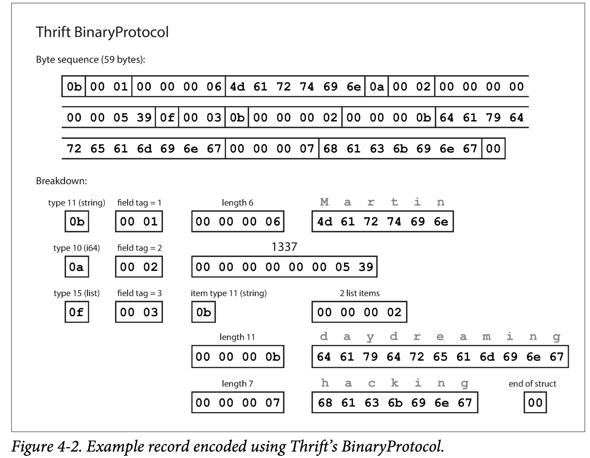
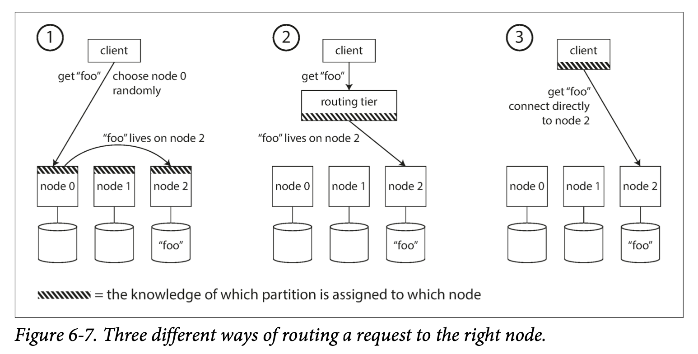
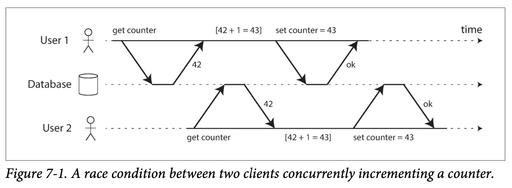

[toc]

# Designing Data Intensive Applications

## Chapter 1

we focus on three concerns that are important in most software systems:

### Reliability

The system should continue to work correctly even in the face of adversity (hardware or software faults, and even human error). 

- The application performs the function that the user expected.
- It can tolerate the user making mistakes or using the software in unexpected ways.
- Its performance is good enough for the required use case, under the expected load and data volume.
- The system prevents any unauthorized access and abuse.

The things that can go wrong are called faults, and systems that anticipate faults and can cope with them are called **fault-tolerant** or **resilient**. 

> **_NOTE:_** A fault is not the same as a failure. A fault is usually defined as one component of the system deviating from its spec, whereas a failure is when the system as a whole stops providing the required service to the user. It is impossible to reduce the probability of a fault to zero; therefore it is usually best to design fault-tolerance mechanisms that prevent faults from causing failures. 

Although we generally prefer tolerating faults over preventing faults, there are cases where prevention is better. This is the case with security matters, for example: if an attacker has compromised a system and gained access to sensitive data, that event cannot be undone.

#### Hardware Faults

#### Backup Machine

Normal way is to have backup machine to be able to restore to desired state quickly.

#### Software Fault-Tolenrance

As data volumes and applications's computing demands have increaded, more applications have begun using larger numbers of machines, which proportionally increases the rate of hardware faults. 

Using software fault-tolerance techniques in preference or in addition to hardware redundancy. Such systems also have operational advantages: a single-server system requires planned downtime if you need to reboot the machine, whereas a system that can tolerate machine failure can be patched one node at a time, without downtime of the entire system.

#### Software Faults

A systematic error within the system is harder to anticipate, and because they are correlated across nodes, they tend to cause many more system failures than uncorrelated hardware faults.

#### Prevention

- carefully thinking about assumptions and interactions in the system
- thorough testing
- process isolation
- allowing processes to crash and restart
- measuring, monitoring, and analyzing system behavior in production
- If a system is expected to provide some guarantee, it can constantly check itself while it is running and raise an alert if a discrepancy is found

#### Human Errors

- Design systems in a way that minimizes opportunities for error. For example, well-designed abstractions, APIs.
- Decouple the places where people make the most mistakes from the places where they can cause failures. In particular, provide fully featured non-production sandbox environments where people can explore and experiment safely, using real data, without affecting real users.
- Test thoroughly at all levels, from unit tests to whole system integration tests and manual tests. Automated testing is widely used, well understood, and especially valuable for covering corner cases that rarely arise in normal operation.
- Allow quick and easy recovery from human errors, to minimize the impact in the case of a failure.
- Set up detailed and clear monitoring, such as performance metrics and error rates.
- Implement good management practices and training.

### Scalability

**Scalability** is the term we use to describe a system’s ability to cope with increased load. 

### Maintainability

Over time, many different people will work on the system (engineering and operations, both maintaining current behavior and adapting the system to new use cases), and they should all be able to work on it productively.

## Chapter 2

Choose right database type for your application, SQL or NoSQL.

### Application Example

#### Resume

Most people have had more than one job in their career, so there is a one-to-many relationship from the user to their experiences and jobs.

In SQL way, there are three ways to store them:

1. Store positions, education and contact information in separate tables and associate with foreign key to user table.
2. Later version of the SQL support for structured datatypes and XML data which allowed multi-valued data to be stored within a single row.
3. Encode jobs, education and contact information as a JSON or XML and store it on a text column, but you can use the database to query for values inside the encoded column.

For a data structure like a résumé, which is mostly a self-contained document, a **JSON** representation can be quite appropriate.The JSON representation has better locality than the multi-table schema.

## Chapter 3 Storage and Retrieval

We need to select a storage engine that is appropriate for our application.There are two families of storage engines: `log-structured storage engines` and `page-oriented storage engines`.

### Log-Structured Storage Engines

#### Hash Table

Keeping an in-memory hash map for every segment where every key is mapped to a byte offset in the data file—the location at which the value can be found.

Whenever you append a new key-value pair to the file, you also update the hash map to reflect the offset of the data you just wrote (this works both for inserting new keys and for updating existing keys). 

When you want to look up a value, use the hash map to find the offset in the data file, seek to that location, and read the value.

This is essentially what `Bitcask` (the default storage engine in Riak) does. A storage engine like `Bitcask` is well suited to situations where the value for each key is **updated frequently**.

**To Avoid out of disk space:** Break the log into segments of a certain size by closing a segment file when it reaches a certain size, and making subsequent writes to a new segment file.We can then perform **compaction** on these segments by throwing away duplicate keys in the log, and keeping only the most recent update for each key. Since compaction often makes segments much smaller, we can also merge several segments together at the same time as performing the compaction. Such process can be done in the background thread. We continue to serve read and write requests as normal using the old segment files and switch read requests to using the new merged segment once the process is done.

Lots of detail goes into making this simple idea work in practice. Briefly, some of the issues that are important in a real implementation are:

**File Format** 

It’s faster and simpler to use a binary format that first encodes the length of a string in bytes, followed by the raw string (without need for escaping).

**Deleting Records**

If you want to delete a key and its associated value, you have to append a special deletion record to the data file (sometimes called a tombstone). When log segments are merged, the tombstone tells the merging process to discard any previous values for the deleted key.

**Crash recovery**

If the database is restarted, the in-memory hash maps are lost. In principle, you can restore each segment’s hash map by reading the entire segment file from beginning to end and noting the offset of the most recent value for every key as you go along. However, that might take a long time if the segment files are large, which would make server restarts painful. Bitcask speeds up recovery by storing a snapshot of each segment’s hash map on disk, which can be loaded into memory more quickly.

**Partially written records**

The database may crash at any time, including halfway through appending a record to the log. Bitcask files include checksums, allowing such corrupted parts of the log to be detected and ignored.

**Concurrency control**
As writes are appended to the log in a strictly sequential order, a common imple‐ mentation choice is to have only one writer thread. Data file segments are append-only and otherwise immutable, so they can be read concurrently by multiple threads.

**Why append-only design is good**

- Appending and segment merging are sequential write operations, which are generally much faster than random writes.
- Concurrency and crash recovery are much simpler if segment files are append-only or immutable. For example, you don’t have to worry about the case where a crash happened while a value was being overwritten, leaving you with a file containing part of the old and part of the new value spliced together.
- Merging old segments avoids the problem of data files getting fragmented over time.

**The hash table index also has limitations**

- The hash table must fit in memory.In principle, you could maintain a hash map on disk, but unfortunately it is difficult to make an on-disk hash map perform well. It requires a lot of random access I/O, it is expensive to grow when it becomes full, and hash collisions require fiddly logic.
- Range queries are not efficient. For example, you cannot easily scan over all keys between kitty00000 and kitty99999—you’d have to look up each key individually in the hash maps.

#### Sorted String Table(SSTable)

The sequence of key-value pairs is sorted by key.

Advantage over `Index Hash Table`:

- Merging segments is simple and efficient, even if the files are bigger than the available memory. Start reading the input files side by side, look at the first key in each file, copy the lowest key (according to the sort order) to the output file, and repeat. This produces a new merged segment file, also sorted by key.When multiple segments contain the same key, we can keep the value from the most recent segment and discard the values in older segments.
- Not need to keep indexing of all keys, an in-memory index to tell you the offsets for some of the keys, but it can be sparse: one key for every few kilobytes of segment file is sufficient, because a few kilobytes can be scanned very quickly.
- Since read requests need to scan over several key-value pairs in the requested range anyway, it is possible to group those records into a block and compress it before writing it to disk. Each entry of the sparse in-memory index then points at the start of a compressed block. Besides saving disk space, compression also reduces the I/O bandwidth use.

##### How it works

- When a write comes in, add it to an in-memory balanced tree data structure (for example, a red-black tree). This in-memory tree is sometimes called a `memtable`.

- When the `memtable` gets bigger than some threshold—typically a few megabytes, write it out to disk as an SSTable file. This can be done efficiently because the tree already maintains the key-value pairs sorted by key. The new SSTable file becomes the most recent segment of the database. While the SSTable is being written out to disk, writes can continue to a new `memtable` instance.
- In order to serve a read request, first try to find the key in the `memtable`, then in the most recent on-disk segment, then in the next-older segment, etc.
- From time to time, run a merging and compaction process in the background to combine segment files and to discard overwritten or deleted values.

**It only suffers from one problem**

If the database crashes, the most recent writes (which are in the memtable but not yet written out to disk) are lost. In order to avoid that problem, we can keep a separate log on disk to which every write is immediately appended. That log is not in sorted order, but that doesn’t matter, because its only purpose is to restore the `memtable` after a crash. Every time the `memtable` is written out to an SSTable, the corresponding log can be discarded.

##### Performance Optimisations

**Search for non-exist key**

Search non-exist key may required scan the whole database, can use additional Bloom filters to avoid scan the entire database.

> _**Note:**_ `Bloom filter` is a memory-efficient data structure for approximating the contents of a set. It can tell you if a key does not appear in the database, and thus saves many unnecessary disk reads for nonexistent keys.

**Compaction and Merge** 

In `size-tiered` compaction, newer and smaller SSTables are successively merged into older and larger SSTables. 

In `leveled` compaction, the key range is split up into smaller SSTables and older data is moved into separate “levels,” which allows the compaction to proceed more incrementally and use less disk space.

**Summary**

Even though there are many subtleties, the basic idea of LSM-trees—keeping a cascade of SSTables that are merged in the background—is simple and effective. 

Even when the dataset is much bigger than the available memory it continues to work well. Since data is stored in sorted order, you can efficiently perform range queries (scanning all keys above some minimum and up to some maximum).

Because the disk writes are sequential the LSM-tree can support remarkably high write throughput.

### Page-Oritented Storage

#### B-Tree

B-trees break the database down into fixed-size *blocks* or *pages*, traditionally 4 KB in size (sometimes bigger), and read or write one page at a time. This design corresponds more closely to the underlying hardware, as disks are also arranged in fixed-size blocks.

Each page can be identified using an address or location, which allows one page to refer to another—similar to a pointer, but on disk instead of in memory. We can use these page references to construct a tree of pages.

One page is designated as the root of the B-tree; whenever you want to look up a key in the index, you start here. The page contains several keys and references to child pages. Each child is responsible for a continuous range of keys, and the keys between the references indicate where the boundaries between those ranges lie.

Eventually we get down to a page containing individual keys (a leaf page), which either contains the value for each key inline or contains references to the pages where the values can be found.

The number of references to child pages in one page of the B-tree is called the `branching factor`. In practice, the branching factor depends on the amount of space required to store the page references and the range boundaries, but typically it is several hundred.

There is a big difference between storage engines that are optimized for transactional workloads and those that are optimized for analytics.

**Update**

If you want to update the value for an existing key in a B-tree, you search for the leaf page containing that key, change the value in that page, and write the page back to disk (any references to that page remain valid). 

**Add**

If you want to add a new key, you need to find the page whose range encompasses the new key and add it to that page. If there isn’t enough free space in the page to accommodate the new key, it is split into two half-full pages, and the parent page is updated to account for the new subdivision of key ranges

This algorithm ensures that the tree remains balanced: a B-tree with n keys always has a depth of O(log n). Most databases can fit into a B-tree that is three or four levels deep, so you don’t need to follow many page references to find the page you are looking for. (A four-level tree of 4 KB pages with a branching factor of 500 can store up to 256 TB.)

**Making B-Trees Reliable**

- The basic underlying write operation of a B-tree is to overwrite a page on disk with new data. It is assumed that the overwrite does not change the location of the page.
  - Moreover, some operations require several different pages to be overwritten. For example, **if you split a page because an insertion caused it to be overfull, you need to write the two pages that were split, and also overwrite their parent page to update the references to the two child pages.** This is a dangerous operation, because if the database crashes after only some of the pages have been written, you end up with a corrupted index (e.g., there may be an orphan page that is not a child of any parent).
  - In order to make the database resilient to crashes, it is common for B-tree implementations to include an additional data structure on disk: a write-ahead log (WAL, also known as a redo log). This is an append-only file to which every B-tree modification must be written before it can be applied to the pages of the tree itself. When the database comes back up after a crash, this log is used to restore the B-tree back to a consistent state.

- **Updating pages in place is that careful concurrency control is required if multiple threads are going to access the B-tree at the same time** —otherwise a thread may see the tree in an inconsistent state. This is typically done by protecting the tree’s data structures with latches (lightweight locks). 

**B-tree optimizations**

- Instead of overwriting pages and maintaining a WAL for crash recovery, some databases (like LMDB) use a copy-on-write scheme . A modified page is written to a different location, and a new version of the parent pages in the tree is created, pointing at the new location. 
- We can save space in pages by not storing the entire key, but abbreviating it. So that we can packing more keys into a page allows the tree to have a higher branching factor, and thus fewer levels.
- If a query needs to scan over a large part of the key range in sorted order, that page-by-page layout can be inefficient, because a disk seek may be required for every page that is read. Many B-tree implementations therefore try to lay out the tree so that leaf pages appear in sequential order on disk. However, it’s difficult to maintain that order as the tree grows.
- Additional pointers have been added to the tree. For example, each leaf page may have references to its sibling pages to the left and right, which allows scanning keys in order without jumping back to parent pages.
-  B-tree variants such as fractal trees borrow some log-structured ideas to reduce disk seeks. 

**Comparison between B-Trees and LSM-Trees**

| B-Tree                                                       | LSM-Tree                                                     |
| ------------------------------------------------------------ | ------------------------------------------------------------ |
| A B-tree index must write every piece of data at least twice: once to the write-ahead log, and once to the tree page itself.There is also overhead from having to write an entire page at a time, even if only a few bytes in that page changed. | Log-structured indexes also rewrite data multiple times due to repeated compaction and merging of SSTables. This effect—one write to the database resulting in multiple writes to the disk over the course of the database’s lifetime—is known as `write amplification`. **Low write amplification** |
| Less write throughput than LSM-trees                         | LSM-trees are typically able to **sustain higher write** throughput.<br />Partly because they sometimes have lower write amplification. <br />Partly because they sequentially write compact SSTable files rather than having to overwrite several pages in the tree. |
| B-tree storage engines leave some disk space unused due to fragmentation: when a page is split or when a row cannot fit into an existing page, some space in a page remains unused. | LSM-trees can be compressed better, and thus often produce smaller files on disk.**Low storage overheads**. |
| B-trees can be more predictable.                             | Compaction process can sometimes interfere with the performance of ongoing reads and writes.The impact on throughput and average response time is usually small, but at higher percentiles.The response time of queries to log-structured storage engines can sometimes be quite high. |
| -                                                            | Compaction arises at high write throughput: the disk’s finite write bandwidth needs to be shared between the initial write (logging and flushing a memtable to disk) and the compaction threads running in the background. When writing to an empty database, the full disk bandwidth can be used for the initial write, but the bigger the database gets, the more disk bandwidth is required for compaction. |
| Each key exists in exactly one place in the index. This aspect makes B-trees attractive in databases that want to offer strong transactional semantics. | May have multiple copies of the same key in different segments. |

### More Indexing Structures

**Secondary Indexes:** Same as primary indexes but it is not unique.

The key in an index is the thing that queries search for, but the value can be one of two things: 

1. It could be the actual row (document, vertex) in question
2. It could be a reference to the row stored elsewhere. 
   - The place where rows are stored is known as a heap file, and it stores data in no particular order (it may be append-only, or it may keep track of deleted rows in order to overwrite them with new data later). 
   - The heap file approach is common because it avoids duplicating data when multiple secondary indexes are present: each index just references a location in the heap file, and the actual data is kept in one place.
   - Efficient on updating a value without changing the key, provided that the new value is not larger than the old value.

> _**Clustered index:**_ In some situations, the extra hop from the index to the heap file is too much of a performance penalty for reads, so it can be desirable to store the indexed row directly within an index. This is known as a `clustered index`. 

****

#### Multi-column Indexes

The most common type of multi-column index is called a `concatenated index`, which simply combines several fields into one key by appending one column to another (the index definition specifies in which order the fields are concatenated).

**Multi-dimensional Indexes**

Multi-dimensional indexes are a more general way of querying several columns at once, which is particularly important for geospatial data. 

One option is to translate a two-dimensional location into a single number using a space-filling curve, and then to use a regular B-tree index. More commonly, specialized spatial indexes such as R-trees are used. 

#### Full-text search and fuzzy indexes

Use for finding similar keys or misspelled words.

`Lucene` is able to search text for words within a certain edit distance (an edit distance of 1 means that one letter has been added, removed, or replaced)

`Lucene` uses a SSTable-like structure for its term dictionary. This structure requires a small in-memory index that tells queries at which offset in the sorted file they need to look for a key.The in-memory index is a finite state automaton over the characters in the keys, similar to a trie. 

### In-memory Database

Some of the in-memory stores such as Memcached, are intended for caching use only, where it’s acceptable for data to be lost if a machine is restarted. But other in-memory databases aim for `durability`, which can be achieved with special hardware (such as battery-powered RAM), by writing a log of changes to disk, by writing periodic snapshots to disk, or by replicating the in-memory state to other machines.

Despite writing to disk, it’s still an in-memory database, because the disk is merely used as an append-only log for durability, and reads are served entirely from memory. Writing to disk also has operational advantages: files on disk can easily be backed up, inspected, and analyzed by external utilities.

**Performance Advantage**

The performance advantage of in-memory databases is they can avoid the overheads of encoding in-memory data structures in a form that can be written to disk.

**Simple Implementation**

In-memory databases is providing data models that are difficult to implement with disk-based indexes. For example, Redis offers a database-like interface to various data structures such as priority queues and sets. Because it keeps all data in memory, its implementation is comparatively simple.

**Anti-caching**

In-memory database architecture could be extended to support datasets larger than the available memory, without bringing back the overheads of a disk-centric architecture. It works by evicting the least recently used data from memory to disk when there is not enough memory, and loading it back into memory when it is accessed again in the future. This approach still requires indexes to fit entirely in memory.

### Transaction Processing and Analytics

An application looks up a small number of records by some key, using an index. Records are inserted or updated based on the user’s input. Because these applications are interactive, the access pattern became known as **online transaction processing** (**OLTP**).

Compared to data analytics, which  an analytic query needs to scan over a huge number of records, only reading a few columns per record, and calculates aggregate statistics (such as count, sum, or average) rather than returning the raw data to the user. These queries are often written by business analysts, and feed into reports that help the management of a company make better decisions (business intelligence). In order to differentiate this pattern of using databases from transaction processing, it has been called **online analytic processing** (**OLAP**)

| Property             | Transaction processing systems (OLTP)             | Analytic systems (OLAP)                   |
| -------------------- | ------------------------------------------------- | ----------------------------------------- |
| Main read pattern    | Small number of records per query, fetched by key | Aggregate over large number of records    |
| Main write pattern   | Random-access, low-latency writes from user input | Bulk import (ETL) or event stream         |
| Primarily used by    | End user/customer, via web application            | Internal analyst, for decision support    |
| What data represents | Latest state of data (current point in time)      | History of events that happened over time |
| Dataset size         | Gigabytes to terabytes                            | Terabytes to petabytes                    |

#### Data Warehousing

Data warehousing is a separate database mainly for data analysis without affecting OLTP operations.The data warehouse contains a read-only copy of the data in all the various OLTP systems in the company. Data is extracted from OLTP databases (using either a periodic data dump or a continuous stream of updates), transformed into an analysis-friendly schema, cleaned up, and then loaded into the data warehouse. This process of getting data into the warehouse is known as **Extract–Transform–Load** (**ETL**).

##### Star schema

Star schema or dimensional modelling in Figure 3-9 shows a data warehouse that might be found at a grocery retailer. At the center of the schema is a so-called fact table (in this example, it is called fact_sales). Each row of the fact table represents an event that occurred at a particular time (here, each row represents a customer’s purchase of a product). If we were analyzing website traffic rather than retail sales, each row might represent a page view or a click by a user.


Usually, facts are captured as individual events, because this allows maximum flexibility of analysis later. However, this means that the fact table can become extremely large.
Some of the columns in the fact table are attributes, such as the price at which the product was sold and the cost of buying it from the supplier (allowing the profit margin to be calculated). Other columns in the fact table are foreign key references to other tables, called dimension tables. As each row in the fact table represents an event, the dimensions represent the who, what, where, when, how, and why of the event.

##### Snowflask Schema

Snowflask schema is a variation of star schema, where dimensions are further broken down into subdimensions. For example, there could be separate tables for brands and product categories, and each row in the dim_product table could reference the brand and category as foreign keys, rather than storing them as strings in the dim_product table. Snowflake schemas are more normalized than star schemas, but star schemas are often preferred because they are simpler for analysts to work with.

### Column-Oriented Storage

In a typical data warehouse, tables are often very wide: fact tables often have over 100 columns, sometimes several hundred. Dimension tables can also be very wide, as they include all the metadata that may be relevant for analysis. If you have trillions of rows and petabytes of data in your fact tables, storing and querying them efficiently becomes a challenging problem.

But usually for the result of query, it only need few columns and ignore all other columns.

We can use `column-oriented storage` to make the query efficiently.The idea behind column-oriented storage is simple: don’t store all the values from one row together, but store all the values from each column together instead. If each column is stored in a separate file, a query only needs to read and parse those columns that are used in that query, which can save a lot of work. This principle is illustrated in Figure 3-10.


#### Column Compression

We can further reduce the demands on disk throughput by compressing data.One technique that is particularly effective in data warehouses is bitmap encoding, illustrated in Figure 3-11.


Often, the number of distinct values in a column is small compared to the number of rows. We can now take a column with n distinct values and turn it into n separate bitmaps: one bitmap for each distinct value, with one bit for each row. The bit is 1 if the row has that value, and 0 if not.

If n is very small (for example, a country column may have approximately 200 distinct values), those bitmaps can be stored with one bit per row. But if n is bigger, there will be a lot of zeros in most of the bitmaps (we say that they are sparse). In that case, the bitmaps can additionally be run-length encoded, as shown at the bottom of Figure 3-11. This can make the encoding of a column remarkably compact.

##### Memory bandwidth and vectorized processing

Column-oriented storage not only reducing the volume of data that needs to be loaded from disk but also good for making efficient use of CPU cycles. For example, the query engine can take a chunk of compressed column data that fits comfortably in the CPU’s L1 cache and iterate through it in a tight loop (that is, with no function calls). A CPU can execute such a loop much faster than code that requires a lot of function calls and conditions for each record that is processed. 

Column compression allows more rows from a column to fit in the same amount of L1 cache. Bitwise AND and OR operators can be designed to operate on such chunks of compressed column data directly. This technique is known as **vectorized processing**.

##### Sort Oder in Column Storage

The data needs to be sorted an entire row at a time.The sorted order will depend on analysis needs, with the sorted order data, we now can query more efficiently. Another advantage of sorted order is that it can help with compression of columns. we can used bitmaps to compress the non-distinct values down to a few kilobytes—even if the table has billions of rows.

##### Several different sort orders

Different queries benefit from different sort orders, we can store the same data sorted in several different ways in different replicated data machines. You don’t lose data if one machine fails. When you’re processing a query, you can use the version that best fits the query pattern.

##### Writing to Column-Oriented Storage

Column-oriented storage, compression, and sorting all help to make those read queries faster. However, they have the downside of making writes more difficult.

Fortunately, we have already seen a good solution: LSM-trees. All writes first go to an in-memory store, where they are added to a sorted structure and prepared for writing to disk. It doesn’t matter whether the in-memory store is row-oriented or column-oriented. When enough writes have accumulated, they are merged with the column files on disk and written to new files in bulk. This is essentially what Vertica does.

Queries need to examine both the column data on disk and the recent writes in memory, and combine the two. However, the query optimizer hides this distinction from the user.

##### Aggregation: Data Cubes and Materialized Views

Not every data warehouse is necessarily a column store: traditional row-oriented databases and a few other architectures are also used. Another aspect of data warehouses that is worth mentioning briefly is **materialized aggregates**. 

**Materialized Aggregates**

We can cache some of the counts or sums that queries use most often.One way of creating such a cache is a materialized view. In a relational data model, it is often defined like a standard (virtual) view: a table-like object whose contents are the results of some query. The difference is that a materialized view is an actual copy of the query results, written to disk, whereas a virtual view is just a shortcut for writing queries. When you read from a virtual view, the SQL engine expands it into the view’s underlying query on the fly and then processes the expanded query.

When the underlying data changes, a materialized view needs to be updated, because it is a denormalized copy of the data. The database can do that automatically, but such updates make writes more expensive, which is why materialized views are not often used in OLTP databases. In read-heavy data warehouses they can make more sense (whether or not they actually improve read performance depends on the individual case).

A common special case of a materialized view is known as a data cube or OLAP cube. It is a grid of aggregates grouped by different dimensions. Figure 3-12 shows an example.


You can apply the same aggregate along each row or column and get a summary that has been reduced by one dimension (the sales by product regardless of date, or the sales by date regardless of product).

**Advantage**

The advantage of a materialized data cube is that certain queries become very fast because they have effectively been precomputed. 

**Disadvantage**

The disadvantage is that a data cube doesn’t have the same flexibility as querying the raw data. 

## Chapter 4 Encoding and Evolution

In this chapter we will look at several formats for encoding data, including JSON, XML, Protocol Buffers, Thrift, and Avro. In particular, we will look at how they handle schema changes and how they support systems where old and new data and code need to coexist. We will then discuss how those formats are used for data storage and for communication: in web services, Representational State Transfer (REST), and remote procedure calls (RPC), as well as message-passing systems such as actors and message queues.

When a data format or schema changes, a corresponding change to application code often needs to happen. However, in a large application, code changes often cannot happen instantaneously:

- With server-side applications you may want to perform a rolling upgrade (also known as a staged rollout), deploying the new version to a few nodes at a time, checking whether the new version is running smoothly, and gradually working your way through all the nodes. This allows new versions to be deployed without service downtime, and thus encourages more frequent releases and better evolvability.
- With client-side applications you’re at the mercy of the user, who may not install the update for some time.

This means that old and new versions of the code, and old and new data formats, may potentially all coexist in the system at the same time. In order for the system to continue running smoothly, we need to maintain compatibility in both directions:

- Backward compatibility
  Newer code can read data that was written by older code.
- Forward compatibility
  Older code can read data that was written by newer code.

### Formats for Encoding Data

Programs usually work with data in (at least) two different representations:
1. In memory, data is kept in objects, structs, lists, arrays, hash tables, trees, and so on. These data structures are optimized for efficient access and manipulation by the CPU (typically using pointers).
2. When you want to write data to a file or send it over the network, you have to encode it as some kind of self-contained sequence of bytes (for example, a JSON document). Since a pointer wouldn’t make sense to any other process, this sequence-of-bytes representation looks quite different from the data structures that are normally used in memory.

Thus, we need some kind of translation between the two representations. The translation from the in-memory representation to a byte sequence is called encoding (also known as serialization or marshalling), and the reverse is called decoding (parsing, deserialization, unmarshalling)

#### Language-Specific Formats

Many programming languages come with built-in support for encoding in-memory objects into byte sequences. They are very convenient, because they allow in-memory objects to be saved and restored with minimal additional code. However, they also have a number of deep problems:

- The encoding is often tied to a particular programming language, and reading the data in another language is very difficult. If you store or transmit data in such an encoding, you are committing yourself to your current programming language for potentially a very long time, and precluding integrating your systems with those of other organizations (which may use different languages).
- In order to restore data in the same object types, the decoding process needs to be able to instantiate arbitrary classes. This is frequently a source of security problems: if an attacker can get your application to decode an arbitrary byte sequence, they can instantiate arbitrary classes, which in turn often allows them to do terrible things such as remotely executing arbitrary code.

- Versioning data is often an afterthought in these libraries: as they are intended for quick and easy encoding of data, they often neglect the inconvenient problems of forward and backward compatibility.
- Efficiency (CPU time taken to encode or decode, and the size of the encoded structure) is also often an afterthought. For example, Java’s built-in serialization is notorious for its bad performance and bloated encoding.

For these reasons **it’s generally a bad idea to use your language’s built-in encoding for anything other than very transient purposes**.

#### JSON, XML, and Binary Variants

JSON and XML  encodings that can be written and read by many programming languages. XML is often criticized for being too verbose and unnecessarily complicated. JSON’s popularity is mainly due to its built-in support in web browsers and simplicity relative to XML. CSV is another popular language-independent format, albeit less powerful.
JSON, XML, and CSV are textual formats, besides the superficial syntactic issues, they also have some subtle problems:

- There is a lot of ambiguity around the encoding of numbers. 
  - In XML and CSV, you cannot distinguish between a number and a string that happens to consist of digits (except by referring to an external schema). 
  - JSON distinguishes strings and numbers, but it doesn’t distinguish integers and floating-point numbers, and it doesn’t specify a precision.
    For example, integers greater than $2^{53}$ cannot be exactly represented in an IEEE 754 double-precision floating- point number. Twitter, which uses a 64-bit number to identify each tweet. The JSON returned by Twitter’s API includes tweet IDs twice, once as a JSON number and once as a decimal string, to work around the fact that the numbers are not correctly parsed by JavaScript applications.

- JSON and XML have good support for Unicode character strings, but they don’t support binary strings (sequences of bytes without a character encoding). Binary strings are a useful feature, so people get around this limitation by encoding the binary data as text using Base64. The schema is then used to indicate that the value should be interpreted as Base64-encoded. This works, but it’s somewhat hacky and increases the data size by 33%.

- There is optional schema support for both XML and JSON. These schema languages are quite powerful, and thus quite complicated to learn and implement. Use of XML schemas is fairly widespread, but many JSON-based tools don’t bother using schemas. Since the correct interpretation of data (such as numbers and binary strings) depends on information in the schema, applications that don’t use XML/JSON schemas need to potentially hardcode the appropriate encoding/decoding logic instead.
- CSV does not have any schema, so it is up to the application to define the meaning of each row and column. If an application change adds a new row or column, you have to handle that change manually. CSV is also a quite vague format (what happens if a value contains a comma or a newline character?). Although its escaping rules have been formally specified, not all parsers implement them correctly.

##### Binary encoding

Both JSON and XML use a lot of space compared to binary formats. This observation led to the development of a profusion of binary encodings for JSON (MessagePack, BSON, BJSON, UBJSON, BISON, and Smile, to name a few) and for XML (WBXML and Fast Infoset, for example). These formats have been adopted in various niches, but none of them are as widely adopted as the textual versions of JSON and XML.


Let’s look at an example of MessagePack, a binary encoding for JSON. Figure 4-1 shows the byte sequence that you get if you encode the JSON document in Example 4-1 with MessagePack. The first few bytes are as follows:
1. The first byte, 0x83, indicates that what follows is an object (top four bits = 0x80) with three fields (bottom four bits = 0x03). (In case you’re wondering what hap‐ pens if an object has more than 15 fields, so that the number of fields doesn’t fit in four bits, it then gets a different type indicator, and the number of fields is encoded in two or four bytes.)
2. The second byte, 0xa8, indicates that what follows is a string (top four bits = 0xa0) that is eight bytes long (bottom four bits = 0x08).
3. The next eight bytes are the field name userName in ASCII. Since the length was indicated previously, there’s no need for any marker to tell us where the string ends (or any escaping).
4. The next seven bytes encode the six-letter string value Martin with a prefix 0xa6, and so on.

The binary encoding is 66 bytes long, which is only a little less than the 81 bytes taken by the textual JSON encoding (with whitespace removed). All the binary encodings of JSON are similar in this regard. It’s not clear whether such a small space reduction (and perhaps a speedup in parsing) is worth the loss of human-readability.
In the following sections we will see how we can do much better, and encode the same record in just 32 bytes.

##### Thrift and Protocol Buffers

Both Thrift and Protocol Buffers require a schema for any data that is encoded. To encode the data in Example 4-1 in Thrift, you would describe the schema in the Thrift interface definition language (IDL) like this:


The equivalent schema definition for Protocol Buffers looks very similar:


Thrift and Protocol Buffers each come with a code generation tool that takes a schema, and produces classes that implement the schema in various programming languages.

Thrift has two different binary encoding formats called *BinaryProtocol* and *CompactProtocol*, respectively. 

**BinaryProtocol**

Let’s look at BinaryProtocol first, as shown in **Figure 4-2**.



Similarly to **Figure 4-1**, each field has a type annotation (to indicate whether it is a string, integer, list, etc.) and, where required, a length indication (length of a string, number of items in a list). The strings that appear in the data (“Martin”, “daydreaming”, “hacking”) are also encoded as ASCII (UTF-8).

The big difference compared to **Figure 4-1** is that there are no field names (userName, favoriteNumber, interests). Instead, the encoded data contains *field tags*, which are numbers (1, 2, and 3). Those are the numbers that appear in the schema definition.

**CompactProtocol**

The Thrift CompactProtocol encoding is semantically equivalent to BinaryProtocol, but as you can see in **Figure 4-3**, it packs the same information into only 34 bytes. It does this by packing the field type and tag number into a single byte, and by using variable-length integers. Rather than using a full eight bytes for the number 1337, it is encoded in two bytes, with the top bit of each byte used to indicate whether there are still more bytes to come. This means numbers between –64 and 63 are encoded in one byte, numbers between –8192 and 8191 are encoded in two bytes, etc. Bigger numbers use more bytes.


**Protocol Buffers**

Protocol Buffers (which has only one binary encoding format) encodes the same data as shown in **Figure 4-4**. It does the bit packing slightly differently, but is otherwise very similar to Thrift’s CompactProtocol. Protocol Buffers fits the same record in 33 bytes. 

> _**Note:**_  In the schemas shown earlier, each field was marked either required or optional, but this makes no difference to how the field is encoded (nothing in the binary data indicates whether a field was required). The difference is simply that required enables a runtime check that fails if the field is not set, which can be useful for catching bugs.


###### Field tags and schema evolution

Schemas inevitably need to change over time, we call this *schema evolution*. How do Thrift and Protocol Buffers handle schema changes while keeping backward and forward compatibility?

The encoded record is just the concatenation of its encoded fields. Each field is identified by its tag number (the numbers 1, 2, 3 in the sample schemas) and annotated with a datatype (e.g., string or integer). If a field value is not set, it is simply omitted from the encoded record. The field tags are critical to the meaning of the encoded data. You can change the name of a field in the schema, since the encoded data never refers to field names, but you cannot change a field’s tag, since that would make all existing encoded data invalid.

**Forward Compatibility**

You can add new fields to the schema, provided that you give each field a new tag number. If old code (which doesn’t know about the new tag numbers you added) tries to read data written by new code, including a new field with a tag number it doesn’t recognize, it can simply ignore that field. The datatype annotation allows the parser to determine how many bytes it needs to skip. This maintains forward compatibility: old code can read records that were written by new code.

**Backward Compatibility**

As long as each field has a unique tag number, new code can always read old data, because the tag numbers still have the same meaning. The only detail is that if you add a new field, you cannot make it required. If you were to add a field and make it required, that check would fail if new code read data written by old code, because the old code will not have written the new field that you added. Therefore, to maintain backward compatibility, every field you add after the initial deployment of the schema must be optional or have a default value.

Removing a field is just like adding a field, with backward and forward compatibility concerns reversed. That means you can only remove a field that is optional (a required field can never be removed), and you can never use the same tag number again (because you may still have data written somewhere that includes the old tag number, and that field must be ignored by new code).

###### Datatypes and schema evolution

What about changing the datatype of a field? There is a risk that values will lose precision or get truncated. For example, changing a 32-bit integer into a 64-bit integer, the old code reads data written by new code with any decoded 64-bit value won’t fit in 32 bits, it will be truncated.

A curious detail of Protocol Buffers is that it does not have a list or array datatype, but instead has a repeated marker for fields (which is a third option alongside required and optional). As you can see in **Figure 4-4**, the encoding of a repeated field is just what it says on the tin: the same field tag simply appears multiple times in the record. This has the nice effect that it’s okay to change an optional (single-valued) field into a repeated (multi-valued) field. New code reading old data sees a list with zero or one elements (depending on whether the field was present); old code reading new data sees only the last element of the list.

Thrift has a dedicated list datatype, which is parameterized with the datatype of the list elements. This does not allow the same evolution from single-valued to multi-valued as Protocol Buffers does, but it has the advantage of supporting nested lists.

##### Avro

Apache Avro is another binary encoding format that is interestingly different from Protocol Buffers and Thrift. It was started in 2009 as a subproject of Hadoop, as a result of Thrift not being a good fit for Hadoop’s use cases.

Avro also uses a schema to specify the structure of the data being encoded. It has two schema languages: one (Avro IDL) intended for human editing, and one (based on JSON) that is more easily machine-readable.

Our example schema, written in Avro IDL, might look like this:


The equivalent JSON representation of that schema is as follows:


First of all, notice that there are no tag numbers in the schema. If we encode our example record (**Example 4-1**) using this schema, the Avro binary encoding is just 32 bytes long—the most compact of all the encodings we have seen. The breakdown of the encoded byte sequence is shown in **Figure 4-5**.

There is nothing to identify fields or their datatypes. The encoding simply consists of values concatenated together. A string is just a length prefix followed by UTF-8 bytes, but there’s nothing in the encoded data that tells you that it is a string. It could just as well be an integer, or something else entirely. An integer is encoded using a variable-length encoding (the same as Thrift’s CompactProtocol).


To parse the binary data, you go through the fields in the order that they appear in the schema and use the schema to tell you the datatype of each field. This means that the binary data can only be decoded correctly if the code reading the data is using the *exact same schema* as the code that wrote the data. Any mismatch in the schema between the reader and the writer would mean incorrectly decoded data.

###### Schema Evolution

With Avro, when an application wants to encode some data, it encodes the data using whatever version of the schema it knows about—for example, that schema may be compiled into the application. This is known as the `writer’s schema`.

When an application wants to decode some data, it is expecting the data to be in some schema, which is known as the `reader’s schema`. That is the schema the application code is relying on —code may have been generated from that schema during the application’s build process.

The writer’s schema and the reader’s schema *don’t have to be the same*—they only need to be compatible. When data is decoded (read), the Avro library resolves the differences by looking at the writer’s schema and the reader’s schema side by side and translating the data from the writer’s schema into the reader’s schema. The Avro specification defines exactly how this resolution works, and it is illustrated in Figure 4-6.

1. If the writer’s schema and the reader’s schema have their fields in a different order, the schema resolution will matches up the fields by field name.
2. If the code reading the data encounters a field that appears in the writer’s schema but not in the reader’s schema, it is ignored.
3. If the code reading the data expects some field, but the writer’s schema does not contain a field of that name, it is filled in with a default value declared in the reader’s schema.


###### Schema Evolution Rules

With Avro, forward compatibility means that you can have a new version of the schema as writer and an old version of the schema as reader. Conversely, backward compatibility means that you can have a new version of the schema as reader and an old version as writer.

To maintain compatibility, you may only add or remove a field that has a default value.If you were to add a field that has no default value, new readers wouldn’t be able to read data written by old writers, so you would break backward compatibility. If you were to remove a field that has no default value, old readers wouldn’t be able to read data written by new writers, so you would break forward compatibility.

In Avro, if you want to allow a field to be null, you have to use a *union type*. For example, union { null, long, string } field; indicates that field can be a number, or a string, or null. You can only use null as a default value if it is one of the branches of the union. This is a little more verbose than having everything nullable by default, but it helps prevent bugs by being explicit about what can and cannot be null.

Consequently, Avro doesn’t have optional and required markers in the same way as Protocol Buffers and Thrift do (it has union types and default values instead).

Changing the datatype of a field is possible, provided that Avro can convert the type. Changing the name of a field is possible but a little tricky: the reader’s schema can contain aliases for field names, so it can match an old writer’s schema field names against the aliases. This means that changing a field name is backward compatible but not forward compatible. Similarly, adding a branch to a union type is backward compatible but not forward compatible.

 **Writer’s Schema**

How does the reader know the writer’s schema with which a particular piece of data was encoded? We can’t just include the entire schema with every record, because the schema would likely be much bigger than the encoded data, making all the space savings from the binary encoding futile.

The answer depends on the context in which Avro is being used. To give a few examples:

*Large file with lots of records*

​	A common use for Avro—especially in the context of Hadoop—is for storing a large file containing millions of records, all encoded with the same schema. In this case, the writer of that file can just include the writer’s schema once at the beginning of the file. Avro specifies a file format (object container files) to do this.

*Database with individually written records*

​	In a database, different records may be written at different points in time using different writer’s schemas. The simplest solution is to include a version number at the beginning of every encoded record, and to keep a list of schema versions in your database. A reader can fetch a record, extract the version number, and then fetch the writer’s schema for that version number from the database. Using that writer’s schema, it can decode the rest of the record. (Espresso works this way)

*Sending records over a network connection*

​	When two processes are communicating over a bidirectional network connection, they can negotiate the schema version on connection setup and then use that schema for the lifetime of the connection. The Avro RPC protocol works like this.

A database of schema versions is a useful thing to have in any case, since it acts as documentation and gives you a chance to check schema compatibility As the version number, you could use a simple incrementing integer, or you could use a hash of the schema.

###### Dynamically generated schemas

Avro is friendlier to *dynamically generated* schemas, because it's schema doesn’t contain any tag numbers. For example, say you have a relational database whose contents you want to dump to a file, and you want to use a binary format to avoid the aforementioned problems with textual formats (JSON, CSV, SQL). If you use Avro, you can fairly easily generate an Avro schema (in the JSON representation we saw earlier) from the relational schema and encode the database contents using that schema, dumping it all to an Avro object container file. You generate a record schema for each database table, and each column becomes a field in that record. The column name in the database maps to the field name in Avro.

If the database schema changes (one column added and one column removed), you can just generate a new Avro schema from the updated database schema and export data in the new Avro schema. The data export process does not need to pay any attention to the schema change—it can simply do the schema conversion every time it runs. Anyone who reads the new data files will see that the fields of the record have changed, but since the fields are identified by name, the updated writer’s schema can still be matched up with the old reader’s schema.

By contrast, if you were using Thrift or Protocol Buffers for this purpose, the field tags would likely have to be assigned by hand: every time the database schema changes, an administrator would have to manually update the mapping from database column names to field tags. (It might be possible to automate this, but the schema generator would have to be very careful to not assign previously used field tags.) This kind of dynamically generated schema simply wasn’t a design goal of Thrift or Protocol Buffers, whereas it was for Avro.

###### Code generation and dynamically typed languages

Thrift and Protocol Buffers rely on code generation: after a schema has been defined, you can generate code that implements this schema in a programming language of your choice. This is useful in statically typed languages such as Java, C++, or C#, because it allows efficient in-memory structures to be used for decoded data, and it allows type checking and autocompletion in IDEs when writing programs that access the data structures.

In dynamically typed programming languages such as JavaScript, Ruby, or Python, there is not much point in generating code, since there is no compile-time type checker to satisfy. Code generation is often frowned upon in these languages, since they otherwise avoid an explicit compilation step. Moreover, in the case of a dynamically generated schema (such as an Avro schema generated from a database table), code generation is an unnecessarily obstacle to getting to the data.

Avro provides optional code generation for statically typed programming languages, but it can be used just as well without any code generation. If you have an object container file (which embeds the writer’s schema), you can simply open it using the Avro library and look at the data in the same way as you could look at a JSON file. The file is *self-describing* since it includes all the necessary metadata.

This property is especially useful in conjunction with dynamically typed data processing languages like Apache Pig. In Pig, you can just open some Avro files, start analyzing them, and write derived datasets to output files in Avro format without even thinking about schemas.

##### The Merits of Schemas

Protocol Buffers, Thrift, and Avro all use a schema to describe a binary encoding format. Their schema languages are much simpler than XML Schema or JSON Schema, which support much more detailed validation rules (e.g., “the string value of this field must match this regular expression” or “the integer value of this field must be between 0 and 100”). As Protocol Buffers, Thrift, and Avro are simpler to implement and simpler to use, they have grown to support a fairly wide range of programming languages.

Many data systems also implement some kind of proprietary binary encoding for their data. For example, most relational databases have a network protocol over which you can send queries to the database and get back responses. Those protocols are generally specific to a particular database, and the database vendor provides a driver (e.g., using the ODBC or JDBC APIs) that decodes responses from the database’s network protocol into in-memory data structures.

So, we can see that although textual data formats such as JSON, XML, and CSV are widespread, binary encodings based on schemas are also a viable option. They have a number of nice properties:

- They can be much more compact than the various “binary JSON” variants, since they can omit field names from the encoded data.
- The schema is a valuable form of documentation, and because the schema is required for decoding, you can be sure that it is up to date (whereas manually maintained documentation may easily diverge from reality).
- Keeping a database of schemas allows you to check forward and backward compatibility of schema changes, before anything is deployed.
- For users of statically typed programming languages, the ability to generate code from the schema is useful, since it enables type checking at compile time.

In summary, schema evolution allows the same kind of flexibility as schemaless/schema-on-read JSON databases provide, while also providing better guarantees about your data and better tooling.

### Modes of Dataflow

We discussed a variety of different encodings methods when you want to send data over the network or write it to a file—you need to encode it as a sequence of bytes. We talked about forward and backward compatibility, which are important for evolvability (making change easy by allowing you to upgrade different parts of your system independently, and not having to change everything at once). Compatibility is a relationship between one process that encodes the data, and another process that decodes it.

We will explore some of the most common ways how data flows between processes:

- Via databases

- Via service calls
- Via asynchronous message passing

#### Dataflow Through Databases

In a database, the process that writes to the database encodes the data, and the process that reads from the database decodes it. There may just be a single process accessing the database, in which case the reader is simply a later version of the same process—in that case you can think of storing something in the database as *sending a message to your future self*.

Backward compatibility is clearly necessary here; otherwise your future self won’t be able to decode what you previously wrote.

In general, it’s common for several different processes to be accessing a database at the same time. Those processes might be several different applications or services, or they may simply be several instances of the same service. Either way, in an environment where the application is changing, it is likely that some processes accessing the database will be running newer code and some will be running older code—for example because a new version is currently being deployed in a rolling upgrade, so some instances have been updated while others haven’t yet.

This means that a value in the database may be written by a *newer* version of the code, and subsequently read by an *older* version of the code that is still running. Thus, forward compatibility is also often required for databases.

However, there is an additional snag. Say you add a field to a record schema, and the newer code writes a value for that new field to the database. Subsequently, an older version of the code (which doesn’t yet know about the new field) reads the record, updates it, and writes it back. In this situation, the desirable behavior is usually for the old code to keep the new field intact, even though it couldn’t be interpreted.

The encoding formats discussed previously support such preservation of unknown fields, but sometimes you need to take care at an application level, as illustrated in **Figure 4-7**. For example, if you decode a database value into model objects in the application, and later re-encode those model objects, the unknown field might be lost in that translation process. Solving this is not a hard problem; you just need to be aware of it.


#### Different values written at different times

A database generally allows any value to be updated at any time.When you deploy a new version of your application (of a server-side application, at least), you may entirely replace the old version with the new version within a few minutes. The same is not true of database contents: the five-year-old data will still be there, in the original encoding, unless you have explicitly rewritten it since then. This observation is sometimes summed up as *data outlives code*.

Rewriting (*migrating*) data into a new schema is certainly possible, but it’s an expensive thing to do on a large dataset, so most databases avoid it if possible. Most relational databases allow simple schema changes, such as adding a new column with a null default value, without rewriting existing data. When an old row is read, the database fills in nulls for any columns that are missing from the encoded data on disk. LinkedIn’s document database Espresso uses Avro for storage, allowing it to use Avro’s schema evolution rules.

Schema evolution thus allows the entire database to appear as if it was encoded with a single schema, even though the underlying storage may contain records encoded with various historical versions of the schema.

##### Archival storage

Perhaps you take a snapshot of your database from time to time, say for backup purposes or for loading into a data warehouse. In this case, the data dump will typically be encoded using the latest schema, even if the original encoding in the source database contained a mixture of schema versions from different eras. Since you’re copying the data anyway, you might as well encode the copy of the data consistently.

As the data dump is written in one go and is thereafter immutable, formats like Avro object container files are a good fit. This is also a good opportunity to encode the data in an analytics-friendly column-oriented format such as Parquet.

#### Dataflow Through Services: REST and RPC

When you have processes that need to communicate over a network, there are a few different ways of arranging that communication. The most common arrangement is to have two roles: *clients* and *servers*. The servers expose an API over the network, and the clients can connect to the servers to make requests to that API. The API exposed by the server is known as a *service*.

The web works this way: clients (web browsers) make requests to web servers, making GET requests to download HTML, CSS, JavaScript, images, etc., and making POST requests to submit data to the server. The API consists of a standardized set of protocols and data formats (HTTP, URLs, SSL/TLS, HTML, etc.). Because web browsers, web servers, and website authors mostly agree on these standards, you can use any web browser to access any website (at least in theory!).

Web browsers are not the only type of client. For example, a native app running on a mobile device or a desktop computer can also make network requests to a server, and a client-side JavaScript application running inside a web browser can use XMLHttpRequest to become an HTTP client (this technique is known as *Ajax*). In this case, the server’s response is typically not HTML for displaying to a human, but rather data in an encoding that is convenient for further processing by the client-side application code (such as JSON). Although HTTP may be used as the transport protocol, the API implemented on top is application-specific, and the client and server need to agree on the details of that API.

Moreover, a server can itself be a client to another service (for example, a typical web app server acts as client to a database). This approach is often used to decompose a large application into smaller services by area of functionality, such that one service makes a request to another when it requires some functionality or data from that other service. This way of building applications has traditionally been called a *service-oriented architecture* (SOA), more recently refined and rebranded as *microservices architecture*.

In some ways, services are similar to databases: they typically allow clients to submit and query data. However, while databases allow arbitrary queries using the query languages we discussed, services expose an application-specific API that only allows inputs and outputs that are predetermined by the business logic (application code) of the service. This restriction provides a degree of encapsulation: services can impose fine-grained restrictions on what clients can and cannot do.

A key design goal of a service-oriented/microservices architecture is to make the application easier to change and maintain by making services independently deployable and evolvable. For example, each service should be owned by one team, and that team should be able to release new versions of the service frequently, without having to coordinate with other teams. In other words, we should expect old and new versions of servers and clients to be running at the same time, and so the data encoding used by servers and clients must be compatible across versions of the service API.

##### Web services

When HTTP is used as the underlying protocol for talking to the service, it is called a *web service*. This is perhaps a slight misnomer, because web services are not only used on the web, but in several different contexts. For example:

1. A client application running on a user’s device making requests to a service over HTTP. These requests typically go over the public internet.
2. One service making requests to another service owned by the same organization, often located within the same datacenter, as part of a service-oriented/microservices architecture. (Software that supports this kind of use case is sometimes called *middleware*.)
3. One service making requests to a service owned by a different organization, usually via the internet. This is used for data exchange between different organizations’ backend systems. This category includes public APIs provided by online services, such as credit card processing systems, or OAuth for shared access to user data.

There are two popular approaches to web services: *REST* and *SOAP*. They are almost diametrically opposed in terms of philosophy, and often the subject of heated debate among their respective proponents.

REST is not a protocol, but rather a design philosophy that builds upon the principles of HTTP . It emphasizes simple data formats, using URLs for identifying resources and using HTTP features for cache control, authentication, and content type negotiation. REST has been gaining popularity compared to SOAP, at least in the context of cross-organizational service integration, and is often associated with microservices. An API designed according to the principles of REST is called *RESTful*.

By contrast, SOAP is an XML-based protocol for making network API requests. Although it is most commonly used over HTTP, it aims to be independent from HTTP and avoids using most HTTP features. Instead, it comes with a sprawling and complex multitude of related standards (the *web service framework*, known as *WS-\**) that add various features.

The API of a SOAP web service is described using an XML-based language called the Web Services Description Language, or WSDL. WSDL enables code generation so that a client can access a remote service using local classes and method calls (which are encoded to XML messages and decoded again by the framework). This is useful in statically typed programming languages, but less so in dynamically typed ones.

As WSDL is not designed to be human-readable, and as SOAP messages are often too complex to construct manually, users of SOAP rely heavily on tool support, code generation, and IDEs. For users of programming languages that are not supported by SOAP vendors, integration with SOAP services is difficult.

Even though SOAP and its various extensions are ostensibly standardized, interoperability between different vendors’ implementations often causes problems. For all of these reasons, although SOAP is still used in many large enterprises, it has fallen out of favor in most smaller companies.

RESTful APIs tend to favor simpler approaches, typically involving less code generation and automated tooling. A definition format such as OpenAPI, also known as Swagger , can be used to describe RESTful APIs and produce documentation.

##### The problems with remote procedure calls (RPCs)

Web services are merely the latest incarnation of a long line of technologies for making API requests over a network, many of which received a lot of hype but have serious problems. Enterprise JavaBeans (EJB) and Java’s Remote Method Invocation (RMI) are limited to Java. The Distributed Component Object Model (DCOM) is limited to Microsoft platforms. The Common Object Request Broker Architecture (CORBA) is excessively complex, and does not provide backward or forward compatibility.

All of these are based on the idea of a *remote procedure call* (RPC), which has been around since the 1970s. **The RPC model tries to make a request to a remote network service look the same as calling a function or method in your programming language**, within the same process (this abstraction is called *location transparency*). Although RPC seems convenient at first, the approach is fundamentally flawed. A network request is very different from a local function call:

- A local function call is predictable and either succeeds or fails, depending only on parameters that are under your control. A network request is unpredictable: the request or response may be lost due to a network problem, or the remote machine may be slow or unavailable, and such problems are entirely outside of your control. Network problems are common, so you have to anticipate them, for example by retrying a failed request.
- A local function call either returns a result, or throws an exception, or never returns (because it goes into an infinite loop or the process crashes). A network request has another possible outcome: it may return without a result, due to a *timeout*. In that case, you simply don’t know what happened: if you don’t get a response from the remote service, you have no way of knowing whether the request got through or not.
- If you retry a failed network request, it could happen that the requests are actually getting through, and only the responses are getting lost. In that case, retrying will cause the action to be performed multiple times, unless you build a mechanism for deduplication (*idempotence*) into the protocol. Local function calls don’t have this problem. 
- Every time you call a local function, it normally takes about the same time to execute. A network request is much slower than a function call, and its latency is also wildly variable: at good times it may complete in less than a millisecond, but when the network is congested or the remote service is overloaded it may take many seconds to do exactly the same thing.
- When you call a local function, you can efficiently pass it references (pointers) to objects in local memory. When you make a network request, all those parameters need to be encoded into a sequence of bytes that can be sent over the network. That’s okay if the parameters are primitives like numbers or strings, but quickly becomes problematic with larger objects.
- The client and the service may be implemented in different programming languages, so the RPC framework must translate datatypes from one language into another. This can end up ugly, since not all languages have the same types— recall JavaScript’s problems with numbers greater than $2^{53}$. This problem doesn’t exist in a single process written in a single language.

All of these factors mean that there’s no point trying to make a remote service look too much like a local object in your programming language, because it’s a fundamentally different thing. Part of the appeal of REST is that it doesn’t try to hide the fact that it’s a network protocol (although this doesn’t seem to stop people from building RPC libraries on top of REST).

##### Current directions for RPC

Despite all these problems, RPC isn’t going away. Various RPC frameworks have been built on top of all the encodings methods like: Thrift and Avro come with RPC support included, gRPC is an RPC implementation using Protocol Buffers, Finagle also uses Thrift, and Rest.li uses JSON over HTTP.

This new generation of RPC frameworks is more explicit about the fact that a remote request is different from a local function call. For example, Finagle and Rest.li use *futures* (*promises*) to encapsulate asynchronous actions that may fail. Futures also simplify situations where you need to make requests to multiple services in parallel, and combine their results. gRPC supports *streams*, where a call consists of not just one request and one response, but a series of requests and responses over time.

Some of these frameworks also provide *service discovery*—that is, allowing a client to find out at which IP address and port number it can find a particular service. 

Custom RPC protocols with a binary encoding format can achieve better performance than something generic like JSON over REST. However, a RESTful API has other significant advantages: 

1. it is good for experimentation and debugging (you can simply make requests to it using a web browser or the command-line tool curl, without any code generation or software installation)
2. it is supported by all mainstream programming languages and platforms, and there is a vast ecosystem of tools available (servers, caches, load balancers, proxies, firewalls, monitoring, debugging tools, testing tools, etc.).

For these reasons, REST seems to be the predominant style for public APIs. **The main focus of RPC frameworks is on requests between services owned by the same organization, typically within the same datacenter.**

##### Data encoding and evolution for RPC

For evolvability, it is important that RPC clients and servers can be changed and deployed independently. Compared to data flowing through databases, we can make a simplifying assumption in the case of dataflow through services: it is reasonable to assume that all the servers will be updated first, and all the clients second. Thus, you only need backward compatibility on requests, and forward compatibility on responses.

The backward and forward compatibility properties of an RPC scheme are inherited from whatever encoding it uses:

- Thrift, gRPC (Protocol Buffers), and Avro RPC can be evolved according to the compatibility rules of the respective encoding format.
- In SOAP, requests and responses are specified with XML schemas. These can be evolved, but there are some subtle pitfalls.
- RESTful APIs most commonly use JSON (without a formally specified schema) for responses, and JSON or URI-encoded/form-encoded request parameters for requests. Adding optional request parameters and adding new fields to response objects are usually considered changes that maintain compatibility.

Service compatibility is made harder by the fact that RPC is often used for communication across organizational boundaries, so the provider of a service often has no control over its clients and cannot force them to upgrade. Thus, compatibility needs to be maintained for a long time, perhaps indefinitely. If a compatibility-breaking change is required, the service provider often ends up maintaining multiple versions of the service API side by side.

There is no agreement on how API versioning should work (i.e., how a client can indicate which version of the API it wants to use). For RESTful APIs, common approaches are to use a version number in the URL or in the HTTP Accept header. For services that use API keys to identify a particular client, another option is to store a client’s requested API version on the server and to allow this version selection to be updated through a separate administrative interface.

#### Message-Passing Dataflow

In this final section, we will briefly look at *asynchronous message-passing* systems, which are somewhere between RPC and databases. They are similar to RPC in that a client’s request (usually called a *message*) is delivered to another process with low latency. They are similar to databases in that the message is not sent via a direct network connection, but goes via an intermediary called a *message broker* (also called a *message queue* or *message-oriented middleware*), which stores the message temporarily.

Using a message broker has several advantages compared to direct RPC:

- **It can act as a buffer** if the recipient is unavailable or overloaded, and thus improve system reliability.
- **It can automatically redeliver messages to a process that has crashed**, and thus prevent messages from being lost.
- **It avoids the sender needing to know the IP address and port number of the recipient** (which is particularly useful in a cloud deployment where virtual machines often come and go).
- **It allows one message to be sent to several recipients.**
- **It logically decouples the sender from the recipient** (the sender just publishes messages and doesn’t care who consumes them).

However, a difference compared to RPC is that **message-passing communication is usually one-way**: a sender normally doesn’t expect to receive a reply to its messages. It is possible for a process to send a response, but this would usually be done on a separate channel. This communication pattern is *asynchronous*: the sender doesn’t wait for the message to be delivered, but simply sends it and then forgets about it.

##### Message brokers

The detailed delivery semantics vary by implementation and configuration, but in general, message brokers are used as follows: one process sends a message to a named *queue* or *topic*, and the broker ensures that the message is delivered to one or more *consumers* of or *subscribers* to that queue or topic. There can be many producers and many consumers on the same topic.

A topic provides only one-way dataflow. However, a consumer may itself publish messages to another topic, or to a reply queue that is consumed by the sender of the original message.

Message brokers typically don’t enforce any particular data model—a message is just a sequence of bytes with some metadata, so you can use any encoding format. If the encoding is backward and forward compatible, you have the greatest flexibility to change publishers and consumers independently and deploy them in any order.

If a consumer republishes messages to another topic, you may need to be careful to preserve unknown fields, to prevent the issue described previously in the context of databases (Figure 4-7).

##### Distributed actor frameworks

The *actor model* is a programming model for concurrency in a single process. Rather than dealing directly with threads (and the associated problems of race conditions, locking, and deadlock), logic is encapsulated in *actors*. Each actor typically represents one client or entity, it may have some local state (which is not shared with any other actor), and it communicates with other actors by sending and receiving asynchronous messages. Message delivery is not guaranteed: in certain error scenarios, messages will be lost. Since each actor processes only one message at a time, it doesn’t need to worry about threads, and each actor can be scheduled independently by the framework.

In *distributed actor frameworks*, this programming model is used to scale an application across multiple nodes. The same message-passing mechanism is used, no matter whether the sender and recipient are on the same node or different nodes. If they are on different nodes, the message is transparently encoded into a byte sequence, sent over the network, and decoded on the other side.

Location transparency works better in the actor model than in RPC, because the actor model already assumes that messages may be lost, even within a single process. Although latency over the network is likely higher than within the same process, there is less of a fundamental mismatch between local and remote communication when using the actor model.

A distributed actor framework essentially integrates a message broker and the actor programming model into a single framework. However, if you want to perform rolling upgrades of your actor-based application, you still have to worry about forward and backward compatibility, as messages may be sent from a node running the new version to a node running the old version, and vice versa.

Three popular `distributed actor frameworks` handle message encoding as follows:

- *Akka* uses Java’s built-in serialization by default, which does not provide forward or backward compatibility. However, you can replace it with something like Protocol Buffers, and thus gain the ability to do rolling upgrades.
- *Orleans* by default uses a custom data encoding format that does not support rolling upgrade deployments; to deploy a new version of your application, you need to set up a new cluster, move traffic from the old cluster to the new one, and shut down the old one . Like with Akka, custom serialization plug-ins can be used.
- In *Erlang OTP* it is surprisingly hard to make changes to record schemas (despite the system having many features designed for high availability); rolling upgrades are possible but need to be planned carefully. An experimental new maps datatype (a JSON-like structure) may make this easier in the future.

#### Summary

Many services need to support rolling upgrades, where a new version of a service is gradually deployed to a few nodes at a time, rather than deploying to all nodes simultaneously. Rolling upgrades allow new versions of a service to be released without downtime (thus encouraging frequent small releases over rare big releases) and make deployments less risky (allowing faulty releases to be detected and rolled back before they affect a large number of users). These properties are hugely beneficial for *evolvability*, the ease of making changes to an application.

During rolling upgrades, or for various other reasons, we must assume that different nodes are running the different versions of our application’s code. Thus, it is important that all data flowing around the system is encoded in a way that provides backward compatibility (new code can read old data) and forward compatibility (old code can read new data).

We discussed several data encoding formats and their compatibility properties:

- Programming language–specific encodings are restricted to a single programming language and often fail to provide forward and backward compatibility.
- Textual formats like JSON, XML, and CSV are widespread, and their compatibility depends on how you use them. They have optional schema languages, which are sometimes helpful and sometimes a hindrance. These formats are somewhat ague about datatypes, so you have to be careful with things like numbers and binary strings.
- Binary schema–driven formats like Thrift, Protocol Buffers, and Avro allow compact, efficient encoding with clearly defined forward and backward compatibility semantics. The schemas can be useful for documentation and code generation in statically typed languages. However, they have the downside that data needs to be decoded before it is human-readable.

We also discussed several modes of dataflow, illustrating different scenarios in which data encodings are important:

- Databases, where the process writing to the database encodes the data and the process reading from the database decodes it
- RPC and REST APIs, where the client encodes a request, the server decodes the request and encodes a response, and the client finally decodes the response
- Asynchronous message passing (using message brokers or actors), where nodes communicate by sending each other messages that are encoded by the sender and decoded by the recipient

## Chapter 5 Distributed Data

There are various reasons why you might want to distribute a database across multiple machines:

*Scalability*

If your data volume, read load, or write load grows bigger than a single machine can handle, you can potentially spread the load across multiple machines.

*Fault tolerance/high availability*

If your application needs to continue working even if one machine (or several machines, or the network, or an entire datacenter) goes down, you can use multiple machines to give you redundancy. When one fails, another one can take over.

*Latency*

If you have users around the world, you might want to have servers at various locations worldwide so that each user can be served from a datacenter that is geo‐graphically close to them. That avoids the users having to wait for network packets to travel halfway around the world.

### Scaling to Higher Load

#### Shared-memory architecture

Buying a more powerful machine (sometimes called *vertical scaling* or *scaling up*) the cost grows faster than linearly. In this kind of *shared-memory architecture*, all the components can be treated as a single machine.And due to bottlenecks, a machine twice the size cannot necessarily handle twice the load.

A shared-memory architecture may offer limited fault tolerance—high-end machines have hot-swappable components, but it is definitely limited to a single geographic location.

#### Shared-disk architecture

Another approach is the *shared-disk architecture*, which uses several machines with independent CPUs and RAM, but stores data on an array of disks that is shared between the machines, which are connected via a fast network. This architecture is used for some data warehousing workloads, but contention and the overhead of locking limit the scalability of the shared-disk approach.

#### Shared-Nothing Architectures

By contrast, shared-nothing architectures(sometimes called *horizontal scaling* or *scaling out*) have gained a lot of popularity. In this approach, each machine or virtual machine running the database software is called a *node*. Each node uses its CPUs, RAM, and disks independently. Any coordination between nodes is done at the software level, using a conventional network.

No special hardware is required by a shared-nothing system, so you can use whatever machines have the best price/performance ratio. You can potentially distribute data across multiple geographic regions, and thus reduce latency for users and potentially be able to survive the loss of an entire datacenter. With cloud deployments of virtual machines, you don’t need to be operating at Google scale: even for small companies, a multi-region distributed architecture is now feasible.

If your data is distributed across multiple nodes, you need to be aware of the constraints and trade-offs that occur in such a distributed system—the database cannot magically hide these from you.

While a distributed shared-nothing architecture has many advantages, it usually also incurs additional complexity for applications and sometimes limits the expressiveness of the data models you can use.

#### Replication Versus Partitioning

There are two common ways data is distributed across multiple nodes:

*Replication*

Keeping a copy of the same data on several different nodes, potentially in different locations. Replication provides redundancy: if some nodes are unavailable, the data can still be served from the remaining nodes. Replication can also help improve performance. 

*Partitioning*
Splitting a big database into smaller subsets called *partitions* so that different partitions can be assigned to different nodes (also known as *sharding*).

These are separate mechanisms, but they often go hand in hand, as illustrated in Figure II-1.


### Replication

There are several reasons why you might want to replicate data:

- To keep data geographically close to your users (and thus reduce latency)
- To allow the system to continue working even if some of its parts have failed (and thus increase availability)
- To scale out the number of machines that can serve read queries (and thus increase read throughput)

We will assume that your dataset is so small that each machine can hold a copy of the entire dataset in this chapter.

All of the difficulty in replication lies in handling *changes* to replicated data. We will discuss three popular algorithms for replicating changes between nodes: *single-leader*, *multi-leader*, and *leaderless* replication. Almost all distributed databases use one of these three approaches. They all have various pros and cons, which we will examine in detail.

Replication of databases is an old topic—the principles haven’t changed much since they were studied in the 1970s, because the fundamental constraints of networks have remained the same. However, outside of research, many developers continued to assume for a long time that a database consisted of just one node. Mainstream use of distributed databases is more recent. Since many application developers are new to this area, there has been a lot of misunderstanding around issues such as *eventual consistency*. Later we will get more precise about eventual consistency and discuss things like the *read-your-writes* and *monotonic reads* guarantees.

#### Leaders and Followers

Each node that stores a copy of the database is called a *replica*. With multiple replicas, a question inevitably arises: how do we ensure that all the data ends up on all the replicas?

Every write to the database needs to be processed by every replica. The most common solution for this is called *leader-based replication* (also known as *active/passive* or *master–slave replication*) and is illustrated in **Figure 5-1**. It works as follows:

1. One of the replicas is designated the *leader* (also known as *master* or *primary*). When clients want to write to the database, they must send their requests to the leader, which first writes the new data to its local storage.
2. The other replicas are known as *followers* (*read replicas*, *slaves*, *secondaries*, or *hot standbys*). Whenever the leader writes new data to its local storage, it also sends the data change to all of its followers as part of a *replication log* or *change stream*. Each follower takes the log from the leader and updates its local copy of the database accordingly, by applying all writes in the same order as they were processed on the leader.
3. When a client wants to read from the database, it can query either the leader or any of the followers. However, writes are only accepted on the leader (the followers are read-only from the client’s point of view).


This mode of replication is a built-in feature of many relational databases, such as PostgreSQL (since version 9.0), MySQL, Oracle Data Guard, and SQL Server’s AlwaysOn Availability Groups. It is also used in some nonrelational databases, including MongoDB, RethinkDB, and Espresso. Finally, leader-based replication is not restricted to only databases: distributed message brokers such as Kafka and RabbitMQ highly available queues also use it. Some network filesystems and replicated block devices such as DRBD are similar.

##### Synchronous Versus Asynchronous Replication

An important detail of a replicated system is whether the replication happens *synchronously* or *asynchronously*. (In relational databases, this is often a configurable option; other systems are often hardcoded to be either one or the other.)

Think about what happens in **Figure 5-1**, where the user of a website updates their profile image. At some point in time, the client sends the update request to the leader; shortly afterward, it is received by the leader. At some point, the leader forwards the data change to the followers. Eventually, the leader notifies the client that the update was successful.

**Figure 5-2** shows the communication between various components of the system: the user’s client, the leader, and two followers. Time flows from left to right. A request or response message is shown as a thick arrow.


In the example of **Figure 5-2**, the replication to follower 1 is *synchronous*: the leader waits until follower 1 has confirmed that it received the write before reporting success to the user, and before making the write visible to other clients. The replication to follower 2 is *asynchronous*: the leader sends the message, but doesn’t wait for a response from the follower.

The diagram shows that there is a substantial delay before follower 2 processes the message. Normally, replication is quite fast: most database systems apply changes to followers in less than a second. However, there is no guarantee of how long it might take. There are circumstances when followers might fall behind the leader by several minutes or more; for example, if a follower is recovering from a failure, if the system is operating near maximum capacity, or if there are network problems between the nodes.

The advantage of synchronous replication is that the follower is guaranteed to have an up-to-date copy of the data that is consistent with the leader. If the leader suddenly fails, we can be sure that the data is still available on the follower. The disadvantage is that if the synchronous follower doesn’t respond (because it has crashed, or there is a network fault, or for any other reason), the write cannot be processed. The leader must block all writes and wait until the synchronous replica is available again.

For that reason, it is impractical for all followers to be synchronous: any one node outage would cause the whole system to grind to a halt. In practice, if you enable synchronous replication on a database, it usually means that *one* of the followers is synchronous, and the others are asynchronous. If the synchronous follower becomes unavailable or slow, one of the asynchronous followers is made synchronous. This guarantees that you have an up-to-date copy of the data on at least two nodes: the leader and one synchronous follower. This configuration is sometimes also called *semi-synchronous*.

Often, **leader-based replication** is configured to be completely asynchronous. In this case, if the leader fails and is not recoverable, any writes that have not yet been replicated to followers are lost. This means that a write is not guaranteed to be durable, even if it has been confirmed to the client. However, a fully asynchronous configuration has the advantage that the leader can continue processing writes, even if all of its followers have fallen behind.

Weakening durability may sound like a bad trade-off, but asynchronous replication is nevertheless widely used, especially if there are many followers or if they are geographically distributed.

##### Setting Up New Followers

From time to time, you need to set up new followers—perhaps to increase the number of replicas, or to replace failed nodes. 

You could make the files on disk consistent by locking the database (making it unavailable for writes), but that would go against our goal of high availability. Fortunately, setting up a follower can usually be done without downtime. Conceptually, the process looks like this:

1. Take a consistent snapshot of the leader’s database at some point in time—if possible, without taking a lock on the entire database. Most databases have this feature, as it is also required for backups. In some cases, third-party tools are needed, such as *innobackupex* for MySQL.
2. Copy the snapshot to the new follower node.
3. The follower connects to the leader and requests all the data changes that have happened since the snapshot was taken. This requires that the snapshot is associated with an exact position in the leader’s replication log. That position has various names: for example, PostgreSQL calls it the *log sequence number*, and MySQL calls it the *binlog coordinates*.
4. When the follower has processed the backlog of data changes since the snapshot, we say it has *caught up*. It can now continue to process data changes from the leader as they happen.

The practical steps of setting up a follower vary significantly by database. In some systems the process is fully automated, whereas in others it can be a somewhat arcane multi-step workflow that needs to be manually performed by an administrator.

##### Handling Node Outages

Any node in the system can go down, perhaps unexpectedly due to a fault, but just as likely due to planned maintenance (for example, rebooting a machine to install a kernel security patch). Being able to reboot individual nodes without downtime is a big advantage for operations and maintenance. Thus, our goal is to keep the system as a whole running despite individual node failures, and to keep the impact of a node outage as small as possible.

How do you achieve high availability with leader-based replication?

###### Follower failure: Catch-up recovery

On its local disk, each follower keeps a log of the data changes it has received from the leader. If a follower crashes and is restarted, or if the network between the leader and the follower is temporarily interrupted, the follower can recover quite easily: from its log, it knows the last transaction that was processed before the fault occurred. Thus, the follower can connect to the leader and request all the data changes that occurred during the time when the follower was disconnected. When it has applied these changes, it has caught up to the leader and can continue receiving a stream of data changes as before.

###### Leader failure: Failover

Handling a failure of the leader is trickier: one of the followers needs to be promoted to be the new leader, clients need to be reconfigured to send their writes to the new leader, and the other followers need to start consuming data changes from the new leader. This process is called *failover*.

Failover can happen manually (an administrator is notified that the leader has failed and takes the necessary steps to make a new leader) or automatically. An automatic failover process usually consists of the following steps:

1. *Determining that the leader has failed.* There are many things that could potentially go wrong: crashes, power outages, network issues, and more. There is no foolproof way of detecting what has gone wrong, so most systems simply use a timeout: nodes frequently bounce messages back and forth between each other, and if a node doesn’t respond for some period of time—say, 30 seconds—it is assumed to be dead. (If the leader is deliberately taken down for planned maintenance, this doesn’t apply.)
2. *Choosing a new leader.* This could be done through an election process (where the leader is chosen by a majority of the remaining replicas), or a new leader could be appointed by a previously elected *controller node*. The best candidate for leadership is usually the replica with the most up-to-date data changes from the old leader (to minimize any data loss). Getting all the nodes to agree on a new leader is a consensus problem, discussed in detail in Chapter 9.
3. *Reconfiguring the system to use the new leader.* Clients now need to send their write requests to the new leader. If the old leader comes back, it might still believe that it is the leader, not realizing that the other replicas have forced it to step down. The system needs to ensure that the old leader becomes a follower and recognizes the new leader.

###### Failover is fraught with things that can go wrong:

- If asynchronous replication is used, the new leader may not have received all the writes from the old leader before it failed. If the former leader rejoins the cluster after a new leader has been chosen, the new leader may have received conflicting writes in the meantime. The most common solution is for the old leader’s unreplicated writes to simply be discarded, which may violate clients’ durability expectations.
- Discarding writes is especially dangerous if other storage systems outside of the database need to be coordinated with the database contents. For example, in one incident at GitHub, an out-of-date MySQL follower was promoted to leader. The database used an auto incrementing counter to assign primary keys to new rows, but because the new leader’s counter lagged behind the old leader’s, it reused some primary keys that were previously assigned by the old leader. These primary keys were also used in a Redis store, so the reuse of primary keys resulted in inconsistency between MySQL and Redis, which caused some private data to be disclosed to the wrong users.
- In certain fault scenarios, it could happen that two nodes both believe that they are the leader. This situation is called *split brain*, and it is dangerous: if both leaders accept writes, and there is no process for resolving conflicts, data is likely to be lost or corrupted. As a safety catch, some systems have a mechanism to shut down one node if two leaders are detected. However, if this mechanism is not carefully designed, you can end up with both nodes being shut down.
- What is the right timeout before the leader is declared dead? A longer timeout means a longer time to recovery in the case where the leader fails. However, if the timeout is too short, there could be unnecessary failovers. For example, a temporary load spike could cause a node’s response time to increase above the timeout, or a network glitch could cause delayed packets. If the system is already struggling with high load or network problems, an unnecessary failover is likely to make the situation worse, not better.

There are no easy solutions to these problems. For this reason, some operations teams prefer to perform failovers manually, even if the software supports automatic failover.

These issues—node failures; unreliable networks; and trade-offs around replica consistency, durability, availability, and latency—are in fact fundamental problems in distributed systems. 

###### Implementation of Replication Logs

Several different replication methods are used in practice, so let’s look at each one briefly.

**Statement-based replication**

In the simplest case, the leader logs every write request (*statement*) that it executes and sends that statement log to its followers. For a relational database, this means that every INSERT, UPDATE, or DELETE statement is forwarded to followers, and each follower parses and executes that SQL statement as if it had been received from a client.

Although this may sound reasonable, there are various ways in which this approach to replication can break down:

- Any statement that calls a nondeterministic function, such as NOW() to get the current date and time or RAND() to get a random number, is likely to generate a different value on each replica.
- If statements use an auto-incrementing column, or if they depend on the existing data in the database (e.g., UPDATE ... WHERE *<some condition>*), they must be executed in exactly the same order on each replica, or else they may have a different effect. This can be limiting when there are multiple concurrently executing transactions.
- Statements that have side effects (e.g., triggers, stored procedures, user-defined functions) may result in different side effects occurring on each replica, unless the side effects are absolutely deterministic.

It is possible to work around those issues—for example, the leader can replace any nondeterministic function calls with a fixed return value when the statement is logged so that the followers all get the same value. However, because there are so many edge cases, other replication methods are now generally preferred.

Statement-based replication was used in MySQL before version 5.1. It is still sometimes used today, as it is quite compact, but by default MySQL now switches to row-based replication if there is any nondeterminism in a statement. VoltDB uses statement-based replication, and makes it safe by requiring transactions to be deterministic.

**Write-ahead log (WAL) shipping**

In Chapter 3 we discussed how storage engines represent data on disk, and we found that usually every write is appended to a log:

- In the case of a log-structured storage engine, this log is the main place for storage. Log segments are compacted and garbage-collected in the background.
- In the case of a B-tree, which overwrites individual disk blocks, every modification is first written to a write-ahead log so that the index can be restored to a consistent state after a crash.

In either case, the log is an append-only sequence of bytes containing all writes to the database. We can use the exact same log to build a replica on another node: besides writing the log to disk, the leader also sends it across the network to its followers.

When the follower processes this log, it builds a copy of the exact same data structures as found on the leader.

This method of replication is used in PostgreSQL and Oracle, among others. **The main disadvantage is that the log describes the data on a very low level: a WAL contains details of which bytes were changed in which disk blocks. This makes replication closely coupled to the storage engine.** If the database changes its storage format from one version to another, it is typically not possible to run different versions of the database software on the leader and the followers.

That may seem like a minor implementation detail, but it can have a big operational impact. If the replication protocol allows the follower to use a newer software version than the leader, you can perform a zero-downtime upgrade of the database software by first upgrading the followers and then performing a failover to make one of the upgraded nodes the new leader. If the replication protocol does not allow this version mismatch, as is often the case with WAL shipping, such upgrades require downtime.

**Logical (row-based) log replication**

An alternative is to use different log formats for replication and for the storage engine, which allows the replication log to be decoupled from the storage engine internals. This kind of replication log is called a *logical log*, to distinguish it from the storage engine’s (*physical*) data representation.

A logical log for a relational database is usually a sequence of records describing writes to database tables at the granularity of a row:

- For an inserted row, the log contains the new values of all columns.
- For a deleted row, the log contains enough information to uniquely identify the row that was deleted. Typically this would be the primary key, but if there is no primary key on the table, the old values of all columns need to be logged.
- For an updated row, the log contains enough information to uniquely identify the updated row, and the new values of all columns (or at least the new values of all columns that changed).

A transaction that modifies several rows generates several such log records, followed by a record indicating that the transaction was committed. MySQL’s binlog (when configured to use row-based replication) uses this approach.

Since a logical log is decoupled from the storage engine internals, it can more easily be kept backward compatible, allowing the leader and the follower to run different versions of the database software, or even different storage engines.

A logical log format is also easier for external applications to parse. This aspect is useful if you want to send the contents of a database to an external system, such as a data warehouse for offline analysis, or for building custom indexes and caches. This technique is called *change data capture*, and we will return to it in Chapter 11.

**Trigger-based replication**

The replication approaches described so far are implemented by the database system, without involving any application code. In many cases, that’s what you want—but there are some circumstances where more flexibility is needed. For example, if you want to only replicate a subset of the data, or want to replicate from one kind of database to another, or if you need conflict resolution logic, then you may need to move replication up to the application layer.

Some tools, such as Oracle GoldenGate, can make data changes available to an application by reading the database log. An alternative is to use features that are available in many relational databases: *triggers* and *stored procedures*.

A trigger lets you register custom application code that is automatically executed when a data change (write transaction) occurs in a database system. The trigger has the opportunity to log this change into a separate table, from which it can be read by an external process. That external process can then apply any necessary application logic and replicate the data change to another system. Databus for Oracle and Bucardo for Postgres work like this.

Trigger-based replication typically has greater overheads than other replication methods, and is more prone to bugs and limitations than the database’s built-in replication. However, it can nevertheless be useful due to its flexibility.

#### Problems with Replication Lag

Being able to tolerate node failures is just one reason for wanting replication. Other reasons are scalability (processing more requests than a single machine can handle) and latency (placing replicas geographically closer to users).

Leader-based replication requires all writes to go through a single node, but read-only queries can go to any replica. For workloads that consist of mostly reads and only a small percentage of writes (a common pattern on the web), there is an attractive option: create many followers, and distribute the read requests across those followers. This removes load from the leader and allows read requests to be served by nearby replicas.

In this *read-scaling* architecture, you can increase the capacity for serving read-only requests simply by adding more followers. However, this approach only realistically works with asynchronous replication—if you tried to synchronously replicate to all followers, a single node failure or network outage would make the entire system unavailable for writing. And the more nodes you have, the likelier it is that one will be down, so a fully synchronous configuration would be very unreliable.

Unfortunately, if an application reads from an *asynchronous* follower, it may see outdated information if the follower has fallen behind. This leads to apparent inconsistencies in the database: if you run the same query on the leader and a follower at the same time, you may get different results, because not all writes have been reflected in the follower. This inconsistency is just a temporary state—if you stop writing to the database and wait a while, the followers will eventually catch up and become consistent with the leader. For that reason, this effect is known as *eventual consistency*.

The term “eventually” is deliberately vague: in general, there is no limit to how far a replica can fall behind. In normal operation, the delay between a write happening on the leader and being reflected on a follower—the *replication lag*—may be only a fraction of a second, and not noticeable in practice. However, if the system is operating near capacity or if there is a problem in the network, the lag can easily increase to several seconds or even minutes.

**When the lag is so large, the inconsistencies it introduces are not just a theoretical issue but a real problem for applications.** In this section we will highlight three examples of problems that are likely to occur when there is replication lag and outline some approaches to solving them.

##### Reading Your Own Writes

Many applications let the user submit some data and then view what they have submitted. This might be a record in a customer database, or a comment on a discussion thread, or something else of that sort. When new data is submitted, it must be sent to the leader, but when the user views the data, it can be read from a follower. This is especially appropriate if data is frequently viewed but only occasionally written.

With asynchronous replication, there is a problem, illustrated in Figure 5-3: if the user views the data shortly after making a write, the new data may not yet have reached the replica. To the user, it looks as though the data they submitted was lost, so they will be understandably unhappy.


In this situation, we need *read-after-write consistency*, also known as *read-your-writes consistency*. This is a guarantee that if the user reloads the page, they will always see any updates they submitted themselves. It makes no promises about other users: other users’ updates may not be visible until some later time. However, it reassures the user that their own input has been saved correctly.

How can we implement **read-after-write consistency** in a system with leader-based replication? There are various possible techniques. To mention a few:

- When reading something that the user may have modified, read it from the leader; otherwise, read it from a follower. Always read the user’s own profile from the leader, and any other users’ profiles from a follower.

- If most things in the application are potentially editable by the user, we would have to be read from the leader (negating the benefit of read scaling). In that case, other criteria may be used to decide whether to read from the leader. For example, you could track the time of the last update and, for one minute after the last update, make all reads from the leader. You could also monitor the replication lag on followers and prevent queries on any follower that is more than one minute behind the leader.
- The client can remember the timestamp of its most recent write—then the system can ensure that the replica serving any reads for that user reflects updates at least until that timestamp. If a replica is not sufficiently up to date, either the read can be handled by another replica or the query can wait until the replica has caught up. The timestamp could be a *logical timestamp* (something that indicates ordering of writes, such as the log sequence number) or the actual system clock. 
- If your replicas are distributed across multiple datacenters (for geographical proximity to users or for availability), there is additional complexity. Any request that needs to be served by the leader must be routed to the datacenter that contains the leader.

**Another complication arises when the same user is accessing your service from multiple devices,** for example a desktop web browser and a mobile app. In this case you may want to provide *cross-device* read-after-write consistency: if the user enters some information on one device and then views it on another device, they should see the information they just entered.

In this case, there are some additional issues to consider:

- Approaches that require remembering the **timestamp** of the user’s last update become more difficult, because the code running on one device doesn’t know what updates have happened on the other device. **This metadata will need to be centralized.**
- If your replicas are distributed across different datacenters, there is no guarantee that connections from different devices will be routed to the same datacenter. If your approach requires reading from the leader, you may first need to route requests from all of a user’s devices to the same datacenter.

##### Monotonic Reads

Our second example of an anomaly that can occur when reading from asynchronous followers is that it’s possible for a user to see things *moving backward in time*.

This can happen if a user makes several reads from different replicas. For example, Figure 5-4 shows user 2345 making the same query twice, first to a follower with little lag, then to a follower with greater lag. (This scenario is quite likely if the user refreshes a web page, and each request is routed to a random server.) The first query returns a comment that was recently added by user 1234, but the second query doesn’t return anything because the lagging follower has not yet picked up that write. In effect, the second query is observing the system at an earlier point in time than the first query. This wouldn’t be so bad if the first query hadn’t returned anything, because user 2345 probably wouldn’t know that user 1234 had recently added a comment. However, it’s very confusing for user 2345 if they first see user 1234’s comment appear, and then see it disappear again.


*Monotonic reads* is a guarantee that this kind of anomaly does not happen. It’s a lesser guarantee than strong consistency, but a stronger guarantee than eventual consistency. When you read data, you may see an old value; monotonic reads only means that if one user makes several reads in sequence, they will not see time go backward— i.e., they will not read older data after having previously read newer data.

One way of achieving monotonic reads is to make sure that each user always makes their reads from the same replica (different users can read from different replicas). For example, the replica can be chosen based on a hash of the user ID, rather than randomly. However, if that replica fails, the user’s queries will need to be rerouted to another replica.

##### Consistent Prefix Reads

Our third example of replication lag anomalies concerns violation of causality. Imagine the following short dialog between Mr. Poons and Mrs. Cake:

*Mr. Poons*

How far into the future can you see, Mrs. Cake?

*Mrs. Cake*

About ten seconds usually, Mr. Poons.

There is a causal dependency between those two sentences: Mrs. Cake heard Mr. Poons’s question and answered it.

Now, imagine a third person is listening to this conversation through followers. The things said by Mrs. Cake go through a follower with little lag, but the things said by Mr. Poons have a longer replication lag (see Figure 5-5). This observer would hear the following:

*Mrs. Cake*

About ten seconds usually, Mr. Poons.

*Mr. Poons*

How far into the future can you see, Mrs. Cake?
 To the observer it looks as though Mrs. Cake is answering the question before Mr.

Poons has even asked it. Such psychic powers are impressive, but very confusing.


Preventing this kind of anomaly requires another type of guarantee: *consistent prefix reads*. **This guarantee says that if a sequence of writes happens in a certain order, then anyone reading those writes will see them appear in the same order.**

This is a particular problem in partitioned (sharded) databases, which we will discuss in Chapter 6. If the database always applies writes in the same order, reads always see a consistent prefix, so this anomaly cannot happen. However, in many distributed databases, different partitions operate independently, so there is no global ordering of writes: when a user reads from the database, they may see some parts of the database in an older state and some in a newer state.

One solution is to make sure that any writes that are causally related to each other are written to the same partition—but in some applications that cannot be done efficiently. There are also algorithms that explicitly keep track of causal dependencies.

##### Solutions for Replication Lag

When working with an eventually consistent system, it is worth thinking about how the application behaves if the replication lag increases to several minutes or even hours.If the result is a bad experience for users, it’s important to design the system to provide a stronger guarantee, such as read-after-write. Pretending that replication is synchronous when in fact it is asynchronous is a recipe for problems down the line.

As discussed earlier, there are ways in which an application can provide a stronger guarantee than the underlying database—for example, by performing certain kinds of reads on the leader. However, dealing with these issues in application code is complex and easy to get wrong.

It would be better if application developers didn’t have to worry about subtle replication issues and could just trust their databases to “do the right thing.” This is why *transactions* exist: they are a way for a database to provide stronger guarantees so that the application can be simpler.

Single-node transactions have existed for a long time. However, in the move to distributed (replicated and partitioned) databases, many systems have abandoned them, claiming that transactions are too expensive in terms of performance and availability, and asserting that eventual consistency is inevitable in a scalable system. There is some truth in that statement, but it is overly simplistic, and we will develop a more nuanced view over the course of the rest of this book.

#### Multi-Leader Replication

Leader-based replication has one major downside: there is only one leader, and all writes must go through it. If you can’t connect to the leader for any reason, for example due to a network interruption between you and the leader, you can’t write to the database.

A natural extension of the leader-based replication model is to allow more than one node to accept writes. Replication still happens in the same way: each node that processes a write must forward that data change to all the other nodes. We call this a *multi-leader* configuration (also known as *master–master* or *active/active replication*). In this setup, each leader simultaneously acts as a follower to the other leaders.

##### Use Cases for Multi-Leader Replication

It rarely makes sense to use a multi-leader setup within a single datacenter, because the benefits rarely outweigh the added complexity. However, there are some situations in which this configuration is reasonable.

###### Multi-datacenter operation

Imagine you have a database with replicas in several different datacenters (perhaps so that you can tolerate failure of an entire datacenter, or perhaps in order to be closer to your users). With a normal leader-based replication setup, the leader has to be in *one* of the datacenters, and all writes must go through that datacenter.

In a multi-leader configuration, you can have a leader in *each* datacenter. **Figure 5-6** shows what this architecture might look like. Within each datacenter, regular leader–follower replication is used; between datacenters, each datacenter’s leader replicates its changes to the leaders in other datacenters.


Let’s compare how the single-leader and multi-leader configurations fare in a multi-datacenter deployment:

*Performance*

In a single-leader configuration, every write must go over the internet to the datacenter with the leader. This can add significant latency to writes and might contravene the purpose of having multiple datacenters in the first place. 

In a multi-leader configuration, every write can be processed in the local datacenter and is replicated asynchronously to the other datacenters. Thus, the inter-datacenter network delay is hidden from users, which means the perceived performance may be better.

*Tolerance of datacenter outages*

In a single-leader configuration, if the datacenter with the leader fails, failover can promote a follower in another datacenter to be leader. 

In a multi-leader configuration, each datacenter can continue operating independently of the others, and replication catches up when the failed datacenter comes back online.

*Tolerance of network problems*

Traffic between datacenters usually goes over the public internet, which may be less reliable than the local network within a datacenter. A single-leader configuration is very sensitive to problems in this inter-datacenter link, because writes are made synchronously over this link. 

A multi-leader configuration with asynchronous replication can usually tolerate network problems better: a temporary network interruption does not prevent writes being processed.

Some databases support multi-leader configurations by default, but it is also often implemented with external tools, such as Tungsten Replicator for MySQL , BDR for PostgreSQL , and GoldenGate for Oracle.

As multi-leader replication is a somewhat retrofitted feature in many databases, there are often subtle configuration pitfalls and surprising interactions with other database features. For example, autoincrementing keys, triggers, and integrity constraints can be problematic. For this reason, **multi-leader replication is often considered dangerous territory that should be avoided if possible.**

###### Clients with offline operation

Another situation in which multi-leader replication is appropriate is if you have an application that needs to continue to work while it is disconnected from the internet.

Consider the calendar apps on your devices. You need to be able to see your meetings and enter new meetings at any time, regardless of whether your device currently has an internet connection. If you make any changes while you are offline, they need to be synced with a server and your other devices when the device is next online.

In this case, every device has a local database that acts as a leader (it accepts write requests), and there is an asynchronous multi-leader replication process (sync) between the replicas of your calendar on all of your devices. The replication lag may be hours or even days, depending on when you have internet access available.

From an architectural point of view, this setup is essentially the same as multi-leader replication between datacenters, taken to the extreme: each device is a “datacenter,” and the network connection between them is extremely unreliable. As the rich history of broken calendar sync implementations demonstrates, multi-leader replication is a tricky thing to get right.

There are tools that aim to make this kind of multi-leader configuration easier. For example, CouchDB is designed for this mode of operation.

###### Collaborative editing

*Real-time collaborative editing* applications allow several people to edit a document simultaneously. We don’t usually think of collaborative editing as a database replication problem, but it has a lot in common with the previously mentioned offline editing use case. When one user edits a document, the changes are instantly applied to their local replica (the state of the document in their web browser or client application) and asynchronously replicated to the server and any other users who are editing the same document.

If you want to guarantee that there will be no editing conflicts, the application must obtain a lock on the document before a user can edit it. If another user wants to edit the same document, they first have to wait until the first user has committed their changes and released the lock. This collaboration model is equivalent to single-leader replication with transactions on the leader.

However, for faster collaboration, you may want to make the unit of change very small (e.g., a single keystroke) and avoid locking. This approach allows multiple users to edit simultaneously, but it also brings all the challenges of multi-leader replication, including requiring conflict resolution.

##### Handling Write Conflicts

The biggest problem with multi-leader replication is that write conflicts can occur, which means that conflict resolution is required.

For example, consider a wiki page that is simultaneously being edited by two users, as shown in **Figure 5-7**. User 1 changes the title of the page from A to B, and user 2 changes the title from A to C at the same time. Each user’s change is successfully applied to their local leader. However, when the changes are asynchronously replicated, a conflict is detected. This problem does not occur in a single-leader database.


###### Synchronous versus asynchronous conflict detection

In a single-leader database, the second writer will either block and wait for the first write to complete, or abort the second write transaction, forcing the user to retry the write. On the other hand, in a multi-leader setup, both writes are successful, and the conflict is only detected asynchronously at some later point in time. At that time, it may be too late to ask the user to resolve the conflict.

In principle, you could make the conflict detection synchronous—i.e., wait for the write to be replicated to all replicas before telling the user that the write was successful. However, by doing so, you would lose the main advantage of multi-leader replication: allowing each replica to accept writes independently. If you want synchronous conflict detection, you might as well just use single-leader replication.

**Conflict avoidance**

The simplest strategy for dealing with conflicts is to avoid them: **if the application can ensure that all writes for a particular record go through the same leader, then conflicts cannot occur.** Since many implementations of multi-leader replication handle conflicts quite poorly, avoiding conflicts is a frequently recommended approach.

For example, in an application where a user can edit their own data, you can ensure that requests from a particular user are always routed to the same datacenter and use the leader in that datacenter for reading and writing. Different users may have different “home” datacenters, but from user’s point of view the configuration is essentially single-leader.

However, sometimes you might want to change the designated leader for a record— perhaps because one datacenter has failed and you need to reroute traffic to another datacenter, or perhaps because a user has moved to a different location and is now closer to a different datacenter. In this situation, conflict avoidance breaks down, and you have to deal with the possibility of concurrent writes on different leaders.

**Converging toward a consistent state**

A single-leader database applies writes in a sequential order: if there are several updates to the same field, the last write determines the final value of the field.

In a multi-leader configuration, there is no defined ordering of writes, so it’s not clear what the final value should be. In Figure 5-7, at leader 1 the title is first updated to B and then to C; at leader 2 it is first updated to C and then to B. Neither order is “more correct” than the other.

If each replica simply applied writes in the order that it saw the writes, the database would end up in an inconsistent state: the final value would be C at leader 1 and B at leader 2. That is not acceptable—every replication scheme must ensure that the data is eventually the same in all replicas. Thus, the database must resolve the conflict in a *convergent* way, which means that all replicas must arrive at the same final value when all changes have been replicated.

There are various ways of achieving convergent conflict resolution:

- Give each write a unique ID (e.g., a timestamp, a long random number, a UUID, or a hash of the key and value), pick the write with the highest ID as the *winner*, and throw away the other writes. If a timestamp is used, this technique is known as *last write wins* (LWW). Although this approach is popular, it is dangerously prone to data loss.
- Give each replica a unique ID, and let writes that originated at a higher- numbered replica always take precedence over writes that originated at a lower- numbered replica. This approach also implies data loss.
- Somehow merge the values together—e.g., order them alphabetically and then concatenate them (in Figure 5-7, the merged title might be something like “B/C”).
- Record the conflict in an explicit data structure that preserves all information, and write application code that resolves the conflict at some later time (perhaps by prompting the user).

###### Custom conflict resolution logic

As the most appropriate way of resolving a conflict may depend on the application, most multi-leader replication tools let you write conflict resolution logic using application code. That code may be executed on write or on read:

*On write*

As soon as the database system detects a conflict in the log of replicated changes, it calls the conflict handler. For example, Bucardo allows you to write a snippet of Perl for this purpose. This handler typically cannot prompt a user—it runs in a background process and it must execute quickly.

*On read*

When a conflict is detected, all the conflicting writes are stored. The next time the data is read, these multiple versions of the data are returned to the application. The application may prompt the user or automatically resolve the conflict, and write the result back to the database. CouchDB works this way, for example.

Note that conflict resolution usually applies at the level of an individual row or document, not for an entire transaction. Thus, if you have a transaction that atomically makes several different writes, each write is still considered separately for the purposes of conflict resolution.

##### Multi-Leader Replication Topologies

A *replication topology* describes the communication paths along which writes are propagated from one node to another. If you have two leaders, like in Figure 5-7, there is only one plausible topology: leader 1 must send all of its writes to leader 2, and vice versa. With more than two leaders, various different topologies are possible. Some examples are illustrated in **Figure 5-8**.


The most general topology is *all-to-all* (Figure 5-8 [c]), in which every leader sends its writes to every other leader. However, more restricted topologies are also used: for example, MySQL by default supports only a *circular topology*, in which each node receives writes from one node and forwards those writes (plus any writes of its own) to one other node. Another popular topology has the shape of a *star*: it designated root node forwards writes to all of the other nodes. The star topology can be generalized to a tree.

In circular and star topologies, a write may need to pass through several nodes before it reaches all replicas. Therefore, nodes need to forward data changes they receive from other nodes. To prevent infinite replication loops, each node is given a unique identifier, and in the replication log, each write is tagged with the identifiers of all the nodes it has passed through. When a node receives a data change that is tagged with its own identifier, that data change is ignored, because the node knows that it has already been processed.

A problem with circular and star topologies is that if just one node fails, it can interrupt the flow of replication messages between other nodes, causing them to be unable to communicate until the node is fixed. The topology could be reconfigured to work around the failed node, but in most deployments such reconfiguration would have to be done manually. **The fault tolerance of a more densely connected topology (such as all-to-all) is better because it allows messages to travel along different paths, avoiding a single point of failure.**

On the other hand, all-to-all topologies can have issues too. In particular, some network links may be faster than others (e.g., due to network congestion), with the result that some replication messages may “overtake” others, as illustrated in **Figure 5-9**.


In **Figure 5-9**, client A inserts a row into a table on leader 1, and client B updates that row on leader 3. However, leader 2 may receive the writes in a different order: it may first receive the update and only later receive the corresponding insert.

This is a problem of causality, similar to the one we saw in “Consistent Prefix Reads” : the update depends on the prior insert, so we need to make sure that all nodes process the insert first, and then the update. Simply attaching a timestamp to every write is not sufficient, because clocks cannot be trusted to be sufficiently in sync to correctly order these events at leader 2 (see Chapter 8).

To order these events correctly, a technique called *version vectors* can be used, which we will discuss later in this chapter. However, conflict detection techniques are poorly implemented in many multi-leader replication systems. For example, at the time of writing, PostgreSQL BDR does not provide causal ordering of writes, and Tungsten Replicator for MySQL doesn’t even try to detect conflicts.

If you are using a system with multi-leader replication, it is worth being aware of these issues, carefully reading the documentation, and thoroughly testing your database to ensure that it really does provide the guarantees you believe it to have.

#### Leaderless Replication

Some of the earliest replicated data systems were leaderless, but the idea was mostly forgotten during the era of dominance of relational databases. It once again became a fashionable architecture for databases after Amazon used it for its in-house *Dynamo* system. Riak, Cassandra, and Voldemort are open source datastores with leaderless replication models inspired by Dynamo, so this kind of database is also known as *Dynamo-style*.

In some leaderless implementations, the client directly sends its writes to several replicas, while in others, a coordinator node does this on behalf of the client. However, unlike a leader database, that coordinator does not enforce a particular ordering of writes. As we shall see, this difference in design has profound consequences for the way the database is used.

##### Writing to the Database When a Node Is Down

Imagine you have a database with three replicas, and one of the replicas is currently unavailable—perhaps it is being rebooted to install a system update. 

In a leader-based configuration, if you want to continue processing writes, you may need to perform a failover.

In a leaderless configuration, failover does not exist. **Figure 5-10** shows what happens: the client (user 1234) sends the write to all three replicas in parallel, and the two available replicas accept the write but the unavailable replica misses it. Let’s say that it’s sufficient for two out of three replicas to acknowledge the write: after user 1234 has received two *ok* responses, we consider the write to be successful. The client simply ignores the fact that one of the replicas missed the write.


Now imagine that the unavailable node comes back online, and clients start reading from it. Any writes that happened while the node was down are missing from that node. Thus, if you read from that node, you may get *stale* (outdated) values as responses.

To solve that problem, when a client reads from the database, it doesn’t just send its request to one replica: *read requests are also sent to several nodes in parallel*. The client may get different responses from different nodes; i.e., the up-to-date value from one node and a stale value from another. Version numbers are used to determine which value is newer.

###### Read repair and anti-entropy

The replication scheme should ensure that eventually all the data is copied to every replica. After an unavailable node comes back online, how does it catch up on the writes that it missed?

Two mechanisms are often used in Dynamo-style datastores:

***Read repair***

When a client makes a read from several nodes in parallel, it can detect any stale responses. For example, in Figure 5-10, user 2345 gets a version 6 value from replica 3 and a version 7 value from replicas 1 and 2. The client sees that replica 3 has a stale value and writes the newer value back to that replica. This approach works well for values that are frequently read.

***Anti-entropy process***

In addition, some datastores have a background process that constantly looks for differences in the data between replicas and copies any missing data from one replica to another. Unlike the replication log in leader-based replication, this *anti-entropy process* does not copy writes in any particular order, and there may be a significant delay before data is copied.

Not all systems implement both of these; for example, Voldemort currently does not have an anti-entropy process. Note that without an anti-entropy process, values that are rarely read may be missing from some replicas and thus have reduced durability, because read repair is only performed when a value is read by the application.

###### Quorums for reading and writing

In the example of **Figure 5-10**, we considered the write to be successful even though it was only processed on two out of three replicas. What if only one out of three replicas accepted the write? How far can we push this?

If we know that every successful write is guaranteed to be present on at least two out of three replicas, that means at most one replica can be stale. Thus, if we read from at least two replicas, we can be sure that at least one of the two is up to date. If the third replica is down or slow to respond, reads can nevertheless continue returning an up-to-date value.

More generally, if there are *n* replicas, every write must be confirmed by *w* nodes to be considered successful, and we must query at least *r* nodes for each read. (In our example, *n* = 3, *w* = 2, *r* = 2.) As long as *w* + *r* > *n*, we expect to get an up-to-date value when reading, because at least one of the *r* nodes we’re reading from must be up to date. Reads and writes that obey these *r* and *w* values are called *quorum* reads and writes.You can think of *r* and *w* as the minimum number of votes required for the read or write to be valid. In Dynamo-style databases, the parameters *n*, *w*, and *r* are typically configurable. A common choice is to make *n* an odd number (typically 3 or 5) and to set $w = r = \lceil{(n + 1) / 2}\rceil$. However, you can vary the numbers as you see fit. For example, a workload with few writes and many reads may benefit from setting *w* = *n* and *r* = 1. This makes reads faster, but has the disadvantage that just one failed node causes all database writes to fail.

> _**Note:**_ There may be more than *n* nodes in the cluster, but any given value is stored only on *n* nodes. This allows the dataset to be partitioned, supporting datasets that are larger than you can fit on one node.

The quorum condition, *w* + *r* > *n*, allows the system to tolerate unavailable nodes as follows:

- If *w* < *n*, we can still process writes if a node is unavailable.
- If *r* < *n*, we can still process reads if a node is unavailable.
- With *n* = 3, *w* = 2, *r* = 2 we can tolerate one unavailable node.
- With *n* = 5, *w* = 3, *r* = 3 we can tolerate two unavailable nodes. This case is illustrated in Figure 5-11.
- Normally, reads and writes are always sent to all *n* replicas in parallel. The parameters *w* and *r* determine how many nodes we wait for—i.e., how many of the *n* nodes need to report success before we consider the read or write to be successful.


If fewer than the required *w* or *r* nodes are available, writes or reads return an error. A node could be unavailable for many reasons: because the node is down (crashed, powered down), due to an error executing the operation (can’t write because the disk is full), due to a network interruption between the client and the node, or for any number of other reasons. We only care whether the node returned a successful response and don’t need to distinguish between different kinds of fault.

##### Limitations of Quorum Consistency

If you have *n* replicas, and you choose *w* and *r* such that *w* + *r* > *n*, you can generally expect every read to return the most recent value written for a key. This is the case because the set of nodes to which you’ve written and the set of nodes from which you’ve read must overlap. That is, among the nodes you read there must be at least one node with the latest value (illustrated in Figure 5-11).

Often, *r* and *w* are chosen to be a majority (more than *n*/2) of nodes, because that ensures *w* + *r* > *n* while still tolerating up to *n*/2 node failures. But quorums are not necessarily majorities—it only matters that the sets of nodes used by the read and write operations overlap in at least one node. Other quorum assignments are possible, which allows some flexibility in the design of distributed algorithms.

You may also set *w* and *r* to smaller numbers, so that *w* + *r* ≤ *n* (i.e., the quorum condition is not satisfied). In this case, reads and writes will still be sent to *n* nodes, but a smaller number of successful responses is required for the operation to succeed.

With a smaller *w* and *r* you are more likely to read stale values, because it’s more likely that your read didn’t include the node with the latest value. **On the upside, this configuration allows lower latency and higher availability**: if there is a network interruption and many replicas become unreachable, there’s a higher chance that you can continue processing reads and writes. Only after the number of reachable replicas falls below *w* or *r* does the database become unavailable for writing or reading, respectively.

However, even with *w* + *r* > *n*, there are likely to be edge cases where stale values are returned. These depend on the implementation, but possible scenarios include:

- If a sloppy quorum is used, the *w* writes may end up on different nodes than the *r* reads, so there is no longer a guaranteed overlap between the *r* nodes and the *w* nodes.
- If two writes occur concurrently, it is not clear which one happened first. In this case, the only safe solution is to merge the concurrent writes. If a winner is picked based on a timestamp (last write wins), writes can be lost due to clock skew.

- If a write happens concurrently with a read, the write may be reflected on only some of the replicas. In this case, it’s undetermined whether the read returns the old or the new value.
- If a write succeeded on some replicas but failed on others, and overall succeeded on fewer than *w* replicas, it is not rolled back on the replicas where it succeeded. This means that if a write was reported as failed, subsequent reads may or may not return the value from that write.
- If a node carrying a new value fails, and its data is restored from a replica carrying an old value, the number of replicas storing the new value may fall below *w*, breaking the quorum condition.
- Even if everything is working correctly, there are edge cases in which you can get unlucky with the timing.

Thus, although quorums appear to guarantee that a read returns the latest written value, in practice it is not so simple. Dynamo-style databases are generally optimized for use cases that can tolerate eventual consistency. The parameters *w* and *r* allow you to adjust the probability of stale values being read, but it’s wise to not take them as absolute guarantees.

In particular, you usually do not get the guarantees discussed in “Problems with Rep‐ lication Lag” (reading your writes, monotonic reads, or consistent prefix reads), so the previously mentioned anomalies can occur in applications. Stronger guarantees generally require transactions or consensus.

###### Monitoring staleness

From an operational perspective, it’s important to monitor whether your databases are returning up-to-date results. Even if your application can tolerate stale reads, you need to be aware of the health of your replication. If it falls behind significantly, it should alert you so that you can investigate the cause.

For leader-based replication, the database typically exposes metrics for the replication lag, which you can feed into a monitoring system. This is possible because writes are applied to the leader and to followers in the same order, and each node has a position in the replication log (the number of writes it has applied locally). By subtracting a follower’s current position from the leader’s current position, you can measure the amount of replication lag.

However, in systems with leaderless replication, there is no fixed order in which writes are applied, which makes monitoring more difficult. Moreover, if the database only uses read repair (no anti-entropy), there is no limit to how old a value might be —if a value is only infrequently read, the value returned by a stale replica may be ancient.

There has been some research on measuring replica staleness in databases with leaderless replication and predicting the expected percentage of stale reads depending on the parameters *n*, *w*, and *r*. This is unfortunately not yet common practice, but it would be good to include staleness measurements in the standard set of metrics for databases. Eventual consistency is a deliberately vague guarantee, but for operability it’s important to be able to quantify “eventual.”

##### Sloppy Quorums and Hinted Handoff

Databases with appropriately configured quorums can tolerate the failure of individual nodes without the need for failover. They can also tolerate individual nodes going slow, because requests don’t have to wait for all *n* nodes to respond—they can return when *w* or *r* nodes have responded. **These characteristics make databases with leaderless replication appealing for use cases that require high availability and low latency, and that can tolerate occasional stale reads.**

However, quorums (as described so far) are not as fault-tolerant as they could be. A network interruption can easily cut off a client from a large number of database nodes. Although those nodes are alive, and other clients may be able to connect to them, to a client that is cut off from the database nodes, they might as well be dead. In this situation, it’s likely that fewer than *w* or *r* reachable nodes remain, so the client can no longer reach a quorum.

In a large cluster (with significantly more than *n* nodes) it’s likely that the client can connect to *some* database nodes during the network interruption, just not to the nodes that it needs to assemble a quorum for a particular value. In that case, database designers face a trade-off:

- Is it better to return errors to all requests for which we cannot reach a quorum of *w* or *r* nodes?
- Or should we accept writes anyway, and write them to some nodes that are reachable but aren’t among the *n* nodes on which the value usually lives?

The latter is known as a *sloppy quorum* : writes and reads still require *w* and *r* successful responses, but those may include nodes that are not among the designated *n* “home” nodes for a value. By analogy, if you lock yourself out of your house, you may knock on the neighbour’s door and ask whether you may stay on their couch temporarily.

Once the network interruption is fixed, any writes that one node temporarily accepted on behalf of another node are sent to the appropriate “home” nodes. This is called ***hinted handoff***. (Once you find the keys to your house again, your neighbor politely asks you to get off their couch and go home.)

Sloppy quorums are particularly useful for increasing write availability: as long as *any w* nodes are available, the database can accept writes. However, this means that even when *w* + *r* > *n*, you cannot be sure to read the latest value for a key, because the latest value may have been temporarily written to some nodes outside of *n*.

Thus, a sloppy quorum actually isn’t a quorum at all in the traditional sense. It’s only an assurance of durability, namely that the data is stored on *w* nodes somewhere. There is no guarantee that a read of *r* nodes will see it until the **hinted handoff** has completed.

Sloppy quorums are optional in all common Dynamo implementations. In Riak they are enabled by default, and in Cassandra and Voldemort they are disabled by default.

###### Multi-datacenter operation

We previously discussed cross-datacenter replication as a use case for multi-leader replication. Leaderless replication is also suitable for multi-datacenter operation, since it is designed to tolerate conflicting concurrent writes, network interruptions, and latency spikes.

Cassandra and Voldemort implement their multi-datacenter support within the normal leaderless model: the number of replicas *n* includes nodes in all datacenters, and in the configuration you can specify how many of the *n* replicas you want to have in each datacenter. Each write from a client is sent to all replicas, regardless of datacenter, but the client usually only waits for acknowledgment from a quorum of nodes within its local datacenter so that it is unaffected by delays and interruptions on the cross-datacenter link. The higher-latency writes to other datacenters are often configured to happen asynchronously, although there is some flexibility in the configuration.

Riak keeps all communication between clients and database nodes local to one datacenter, so *n* describes the number of replicas within one datacenter. Cross-datacenter replication between database clusters happens asynchronously in the background, in a style that is similar to multi-leader replication.

##### Detecting Concurrent Writes

Dynamo-style databases allow several clients to concurrently write to the same key, which means that conflicts will occur even if strict quorums are used. The situation is similar to multi-leader replication, although in Dynamo-style databases conflicts can also arise during read repair or hinted handoff.

The problem is that events may arrive in a different order at different nodes, due to variable network delays and partial failures. For example, **Figure 5-12** shows two clients, A and B, simultaneously writing to a key *X* in a three-node datastore:

- Node 1 receives the write from A, but never receives the write from B due to a transient outage.

- Node 2 first receives the write from A, then the write from B.

- Node 3 first receives the write from B, then the write from A.


If each node simply overwrote the value for a key whenever it received a write request from a client, the nodes would become permanently inconsistent, as shown by the final *get* request in Figure 5-12: node 2 thinks that the final value of *X* is B, whereas the other nodes think that the value is A.

In order to become eventually consistent, the replicas should converge toward the same value. How do they do that? One might hope that replicated databases would handle this automatically, but unfortunately most implementations are quite poor: if you want to avoid losing data, as the application developer need to know a lot about the internals of your database’s conflict handling.

We briefly touched on some techniques for conflict resolution in “Handling Write Conflicts”. Let’s explore the issue in a bit more detail.

###### Last write wins (discarding concurrent writes)

One approach for achieving eventual convergence is to declare that each replica need only store the most “recent” value and allow “older” values to be overwritten and discarded. Then, as long as we have some way of unambiguously determining which write is more “recent,” and every write is eventually copied to every replica, the replicas will eventually converge to the same value.

As indicated by the quotes around “recent,” this idea is actually quite misleading. When the writes are *concurrent*, so their order is undefined.Even though the writes don’t have a natural ordering, we can force an arbitrary order on them. For example, we can attach a timestamp to each write, pick the biggest timestamp as the most “recent,” and discard any writes with an earlier timestamp. This conflict resolution algorithm, called ***last write wins* (LWW)**, is the only supported conflict resolution method in Cassandra, and an optional feature in Riak.

LWW achieves the goal of eventual convergence, but at the cost of durability: if there are several concurrent writes to the same key, even if they were all reported as successful to the client (because they were written to *w* replicas), only one of the writes will survive and the others will be silently discarded. Moreover, LWW may even drop writes that are not concurrent.

**There are some situations, such as caching, in which lost writes are perhaps acceptable. If losing data is not acceptable, LWW is a poor choice for conflict resolution.**

The only safe way of using a database with LWW is to ensure that a key is only written once and thereafter treated as immutable, thus avoiding any concurrent updates to the same key. For example, a recommended way of using Cassandra is to use a UUID as the key, thus giving each write operation a unique key.

###### The “happens-before” relationship and concurrency

An operation A *happens before* another operation B if B knows about A, or depends on A, or builds upon A in some way. Whether one operation happens before another operation is the key to defining what concurrency means. In fact, we can simply say that two operations are *concurrent* if neither happens before the other (i.e., neither knows about the other).

Thus, whenever you have two operations A and B, there are three possibilities: either A happened before B, or B happened before A, or A and B are concurrent. What we need is an algorithm to tell us whether two operations are concurrent or not. If one operation happened before another, the later operation should overwrite the earlier operation, but if the operations are concurrent, we have a conflict that needs to be resolved.

> _**Concurrency, Time, and Relativity:**_ It may seem that two operations should be called concurrent if they occur “at the same time”—but in fact, it is not important whether they literally overlap in time. Because of problems with clocks in distributed systems, it is actually quite difficult to tell whether two things happened at exactly the same time

###### Capturing the happens-before relationship

Let’s look at an algorithm that determines whether two operations are concurrent, or whether one happened before another. To keep things simple, let’s start with a database that has only one replica. Once we have worked out how to do this on a single replica, we can generalize the approach to a leaderless database with multiple replicas.

**Figure 5-13** shows two clients concurrently adding items to the same shopping cart. Initially, the cart is empty. Between them, the clients make five writes to the database:


1. Client 1 adds milk to the cart. This is the first write to that key, so the server successfully stores it and assigns it version 1. The server also echoes the value back to the client, along with the version number.
2. Client 2 adds eggs to the cart, not knowing that client 1 concurrently added milk (client 2 thought that its eggs were the only item in the cart). The server assigns version 2 to this write, and stores eggs and milk as two separate values. It then returns *both* values to the client, along with the version number of 2.
3. Client 1, oblivious to client 2’s write, wants to add flour to the cart, so it thinks the current cart contents should be [milk, flour]. It sends this value to the server, along with the version number 1 that the server gave client 1 previously. The server can tell from the version number that the write of [milk, flour] supersedes the prior value of [milk] but that it is concurrent with [eggs]. Thus, the server assigns version 3 to [milk, flour], overwrites the version 1 value [milk], but keeps the version 2 value [eggs] and returns both remaining values to the client.
4. Meanwhile, client 2 wants to add ham to the cart, unaware that client 1 just added flour. Client 2 received the two values [milk] and [eggs] from the server in the last response, so the client now merges those values and adds ham to form a new value, [eggs, milk, ham]. It sends that value to the server, along with the previous version number 2. The server detects that version 2 overwrites [eggs] but is concurrent with [milk, flour], so the two remaining values are [milk, flour] with version 3, and [eggs, milk, ham] with version 4.
5. Finally, client 1 wants to add bacon. It previously received [milk, flour] and [eggs] from the server at version 3, so it merges those, adds bacon, and sends the final value [milk, flour, eggs, bacon] to the server, along with the version number 3. This overwrites [milk, flour] (note that [eggs] was already over‐written in the last step) but is concurrent with [eggs, milk, ham], so the server keeps those two concurrent values.

The dataflow between the operations in Figure 5-13 is illustrated graphically in Figure 5-14. The arrows indicate which operation *happened before* which other operation, in the sense that the later operation *knew about* or *depended on* the earlier one. In this example, the clients are never fully up to date with the data on the server, since there is always another operation going on concurrently. But old versions of the value do get overwritten eventually, and no writes are lost.


**Note that the server can determine whether two operations are concurrent by looking at the version numbers**—it does not need to interpret the value itself (so the value could be any data structure). The algorithm works as follows:

- The server maintains a version number for every key, increments the version number every time that key is written, and stores the new version number along with the value written.
- When a client reads a key, the server returns all values that have not been overwritten, as well as the latest version number. A client must read a key before writing.
- When a client writes a key, it must include the version number from the prior read, and it must merge together all values that it received in the prior read. (The response from a write request can be like a read, returning all current values, which allows us to chain several writes like in the shopping cart example.)
- When the server receives a write with a particular version number, it can overwrite all values with that version number or below (since it knows that they have been merged into the new value), but it must keep all values with a higher version number (because those values are concurrent with the incoming write).

When a write includes the version number from a prior read, that tells us which previous state the write is based on. If you make a write without including a version number, it is concurrent with all other writes, so it will not overwrite anything—it will just be returned as one of the values on subsequent reads.

###### Merging concurrently written values

This algorithm ensures that no data is silently dropped, but it unfortunately requires that the clients do some extra work: if several operations happen concurrently, clients have to clean up afterward by merging the concurrently written values. Riak calls these concurrent values *siblings*.

Merging sibling values is essentially the same problem as conflict resolution in multi-leader replication, which we discussed previously. A simple approach is to just pick one of the values based on a version number or timestamp (last write wins), but that implies losing data. So, you may need to do something more intelligent in application code.

With the example of a shopping cart, a reasonable approach to merging siblings is to just take the union. In Figure 5-14, the two final siblings are [milk, flour, eggs, bacon] and [eggs, milk, ham]; note that milk and eggs appear in both, even though they were each only written once. The merged value might be something like [milk, flour, eggs, bacon, ham], without duplicates.

However, if you want to allow people to also *remove* things from their carts, and not just add things, then taking the union of siblings may not yield the right result: if you merge two sibling carts and an item has been removed in only one of them, then the removed item will reappear in the union of the siblings. To prevent this problem, an item cannot simply be deleted from the database when it is removed; instead, the system must leave a marker with an appropriate version number to indicate that the item has been removed when merging siblings. Such a deletion marker is known as a *tombstone*.

As merging siblings in application code is complex and error-prone, there are some efforts to design data structures that can perform this merging automatically. For example, Riak’s datatype support uses a family of data structures called CRDTs that can automatically merge siblings in sensible ways, including preserving deletions.

###### Version vectors

The example in Figure 5-13 used only a single replica. How does the algorithm change when there are multiple replicas, but no leader?

Figure 5-13 uses a single version number to capture dependencies between operations, but that is not sufficient when there are multiple replicas accepting writes concurrently. Instead, we need to use a version number *per replica* as well as per key. Each replica increments its own version number when processing a write, and also keeps track of the version numbers it has seen from each of the other replicas. This information indicates which values to overwrite and which values to keep as siblings.

The collection of version numbers from all the replicas is called a *version vector*. A few variants of this idea are in use, but the most interesting is probably the *dotted version vector* , which is used in Riak 2.0. We won’t go into the details, but the way it works is quite similar to what we saw in our cart example.

Like the version numbers in Figure 5-13, version vectors are sent from the database replicas to clients when values are read, and need to be sent back to the database when a value is subsequently written. (Riak encodes the version vector as a string that it calls *causal context*.) **The version vector allows the database to distinguish between overwrites and concurrent writes.**

Also, like in the single-replica example, the application may need to merge siblings. The version vector structure ensures that it is safe to read from one replica and subsequently write back to another replica. Doing so may result in siblings being created, but no data is lost as long as siblings are merged correctly.

### Summary

Replication can serve several purposes:

***High availability***

Keeping the system running, even when one machine (or several machines, or an entire datacenter) goes down

***Disconnected operation***

Allowing an application to continue working when there is a network interruption

***Latency***

Placing data geographically close to users, so that users can interact with it faster

***Scalability***

Being able to handle a higher volume of reads than a single machine could handle, by performing reads on replicas

Three main approaches to replication:

***Single-leader replication***

Clients send all writes to a single node (the leader), which sends a stream of data change events to the other replicas (followers). Reads can be performed on any replica, but reads from followers might be stale.

- It is fairly easy to understand and there is no conflict resolution to worry about.

***Multi-leader replication***

Clients send each write to one of several leader nodes, any of which can accept writes. The leaders send streams of data change events to each other and to any follower nodes.

- Multi-leader and leaderless replication can be more robust in the presence of faulty nodes, network interruptions, and latency spikes—at the cost of being harder to reason about and providing only very weak consistency guarantees.

***Leaderless replication***

Clients send each write to several nodes, and read from several nodes in parallel in order to detect and correct nodes with stale data.

Replication can be synchronous or asynchronous.

A few consistency models which are helpful for deciding how an application should behave under replication lag:

***Read-after-write consistency***

Users should always see data that they submitted themselves.

***Monotonic reads***

After users have seen the data at one point in time, they shouldn’t later see the data from some earlier point in time.

***Consistent prefix reads***

Users should see the data in a state that makes causal sense: for example, seeing a question and its reply in the correct order.

## Chapter 6 Partitioning

For very large datasets, or very high query throughput, replication is not sufficient: we need to break the data up into *partitions*, also known as *sharding*.Each partition is a small database of its own, although the database may support operations that touch multiple partitions at the same time.The main reason for wanting to partition data is *scalability*. Different partitions can be placed on different nodes in a shared-nothing cluster. Thus, a large dataset can be distributed across many disks, and the query load can be distributed across many processors.

For queries that operate on a single partition, each node can independently execute the queries for its own partition, so query throughput can be scaled by adding more nodes. Large, complex queries can potentially be parallelized across many nodes, although this gets significantly harder.

Partitioned databases were pioneered in the 1980s by products such as Teradata and Tandem NonStop SQL, and more recently rediscovered by NoSQL databases and Hadoop-based data warehouses. Some systems are designed for transactional workloads, and others for analytics , this difference affects how the system is tuned, but the fundamentals of partitioning apply to both kinds of workloads.

In this chapter we will first look at different approaches for partitioning large datasets and observe how the indexing of data interacts with partitioning. We’ll then talk about rebalancing, which is necessary if you want to add or remove nodes in your cluster. Finally, we’ll get an overview of how databases route requests to the right partitions and execute queries.

### Partitioning and Replication

Partitioning is usually combined with replication so that copies of each partition are stored on multiple nodes. This means that, even though each record belongs to exactly one partition, it may still be stored on several different nodes for fault tolerance.

A node may store more than one partition. If a leader–follower replication model is used, the combination of partitioning and replication can look like Figure 6-1. Each partition’s leader is assigned to one node, and its followers are assigned to other nodes. Each node may be the leader for some partitions and a follower for other partitions.


The choice of partitioning scheme is mostly independent of the choice of replication scheme.

#### Partitioning of Key-Value Data

**Our goal with partitioning is to spread the data and the query load evenly across nodes.** If every node takes a fair share, then—in theory—10 nodes should be able to handle 10 times as much data and 10 times the read and write throughput of a single node (ignoring replication for now).

**If the partitioning is unfair, so that some partitions have more data or queries than others, we call it *skewed*.** The presence of skew makes partitioning much less effective. In an extreme case, all the load could end up on one partition, so 9 out of 10 nodes are idle and your bottleneck is the single busy node. **A partition with disproportionately high load is called a *hot spot*.**

The simplest approach for avoiding hot spots would be to assign records to nodes randomly. That would distribute the data quite evenly across the nodes, but it has a big disadvantage: when you’re trying to read a particular item, you have no way of knowing which node it is on, so you have to query all nodes in parallel.

Let’s assume for now that you have a simple key-value data model, in which you always access a record by its primary key. For example, in an old- fashioned paper encyclopedia, you look up an entry by its title; since all the entries are alphabetically sorted by title, you can quickly find the one you’re looking for.

##### Partitioning by Key Range

One way of partitioning is to assign a continuous range of keys (from some minimum to some maximum) to each partition, like the volumes of a paper encyclopedia (Figure 6-2). If you know the boundaries between the ranges, you can easily determine which partition contains a given key. If you also know which partition is assigned to which node, then you can make your request directly to the appropriate node (or, in the case of the encyclopedia, pick the correct book off the shelf).


The ranges of keys are not necessarily evenly spaced, because your data may not be evenly distributed. For example, in Figure 6-2, volume 1 contains words starting with A and B, but volume 12 contains words starting with T, U, V, X, Y, and Z. Simply having one volume per two letters of the alphabet would lead to some volumes being much bigger than others. In order to distribute the data evenly, the partition boundaries need to adapt to the data.

The partition boundaries might be chosen manually by an administrator, or the database can choose them automatically. This partitioning strategy is used by Bigtable, its open source equivalent HBase, RethinkDB, and MongoDB before version 2.4.

Within each partition, we can keep keys in sorted order. This has the advantage that range scans are easy, and you can treat the key as a concatenated index in order to fetch several related records in one query. For example, consider an application that stores data from a network of sensors, where the key is the timestamp of the measurement. Range scans are very useful in this case, because they let you easily fetch, say, all the readings from a particular month.

However, the downside of key range partitioning is that certain access patterns can lead to hot spots. If the key is a timestamp, then the partitions correspond to ranges of time—e.g., one partition per day. Unfortunately, because we write data from the sensors to the database as the measurements happen, all the writes end up going to the same partition (the one for today), so that partition can be overloaded with writes while others sit idle.

To avoid this problem in the sensor database, you need to use something other than the timestamp as the first element of the key. For example, you could prefix each timestamp with the sensor name so that the partitioning is first by sensor name and then by time. Assuming you have many sensors active at the same time, the write load will end up more evenly spread across the partitions. Now, when you want to fetch the values of multiple sensors within a time range, you need to perform a separate range query for each sensor name.

##### Partitioning by Hash of Key

Because of this risk of skew and hot spots, many distributed datastores use a hash function to determine the partition for a given key.

A good hash function takes skewed data and makes it uniformly distributed. Say you have a 32-bit hash function that takes a string. Whenever you give it a new string, it returns a seemingly random number between 0 and $232−1$. Even if the input strings are very similar, their hashes are evenly distributed across that range of numbers.

For partitioning purposes, the hash function need not be cryptographically strong: for example, Cassandra and MongoDB use MD5, and Voldemort uses the FowlerNoll–Vo function. Many programming languages have simple hash functions built in (as they are used for hash tables), but they may not be suitable for partitioning: for example, in Java’s Object.hashCode() and Ruby’s Object#hash, the same key may have a different hash value in different processes.

Once you have a suitable hash function for keys, you can assign each partition a range of hashes (rather than a range of keys), and every key whose hash falls within a partition’s range will be stored in that partition. This is illustrated in Figure 6-3.


This technique is good at distributing keys fairly among the partitions. The partition boundaries can be evenly spaced, or they can be chosen pseudorandomly (in which case the technique is sometimes known as *consistent hashing*).

> _**Consistent Hashing:**_ Consistent hashing is a way of evenly distributing load across an internet-wide system of caches such as a content delivery network (CDN). It uses randomly chosen partition boundaries to avoid the need for central control or distributed consensus. 

Unfortunately however, by using the hash of the key for partitioning we lose a nice property of key-range partitioning: the ability to do efficient range queries. Keys that were once adjacent are now scattered across all the partitions, so their sort order is lost. In MongoDB, if you have enabled hash-based sharding mode, any range query has to be sent to all partitions. Range queries on the primary key are not supported by Riak, Couchbase, or Voldemort.

Cassandra achieves a compromise between the two partitioning strategies. A table in Cassandra can be declared with a *compound primary key* consisting of several columns. Only the first part of that key is hashed to determine the partition, but the other columns are used as a concatenated index for sorting the data in Cassandra’s SSTables. A query therefore cannot search for a range of values within the first column of a compound key, but if it specifies a fixed value for the first column, it can perform an efficient range scan over the other columns of the key.

The concatenated index approach enables an elegant data model for one-to-many relationships. For example, on a social media site, one user may post many updates. If the primary key for updates is chosen to be (user_id, update_timestamp), then you can efficiently retrieve all updates made by a particular user within some time interval, sorted by timestamp. Different users may be stored on different partitions, but within each user, the updates are stored ordered by timestamp on a single partition.

##### Skewed Workloads and Relieving Hot Spots

As discussed, hashing a key to determine its partition can help reduce hot spots. However, it can’t avoid them entirely: in the extreme case where all reads and writes are for the same key, you still end up with all requests being routed to the same partition.

This kind of workload is perhaps unusual, but not unheard of: for example, on a social media site, a celebrity user with millions of followers may cause a storm of activity when they do something. This event can result in a large volume of writes to the same key (where the key is perhaps the user ID of the celebrity, or the ID of the action that people are commenting on). Hashing the key doesn’t help, as the hash of two identical IDs is still the same.

Today, most data systems are not able to automatically compensate for such a highly skewed workload, so it’s the responsibility of the application to reduce the skew. For example, if one key is known to be very hot, a simple technique is to add a random number to the beginning or end of the key. Just a two-digit decimal random number would split the writes to the key evenly across 100 different keys, allowing those keys to be distributed to different partitions.

However, having split the writes across different keys, any reads now have to do additional work, as they have to read the data from all 100 keys and combine it. This technique also requires additional bookkeeping: it only makes sense to append the random number for the small number of hot keys; for the vast majority of keys with low write throughput this would be unnecessary overhead. Thus, you also need some way of keeping track of which keys are being split.

Perhaps in the future, data systems will be able to automatically detect and compensate for skewed workloads; but for now, you need to think through the trade-offs for your own application.

#### Partitioning and Secondary Indexes

The partitioning schemes we have discussed so far rely on a key-value data model. If records are only ever accessed via their primary key, we can determine the partition from that key and use it to route read and write requests to the partition responsible for that key.

The situation becomes more complicated if secondary indexes are involved. A secondary index usually doesn’t identify a record uniquely but rather is a way of searching for occurrences of a particular value: find all actions by user 123, find all articles containing the word hogwash, find all cars whose color is red, and so on.

Secondary indexes are the bread and butter of relational databases, and they are common in document databases too. Many key-value stores (such as HBase and Voldemort) have avoided secondary indexes because of their added implementation complexity, but some (such as Riak) have started adding them because they are so useful for data modeling. And finally, secondary indexes are the *raison d’être* of search servers such as Solr and Elasticsearch.

The problem with secondary indexes is that they don’t map neatly to partitions. There are two main approaches to partitioning a database with secondary indexes: document-based partitioning and term-based partitioning.

##### Partitioning Secondary Indexes by Document

For example, imagine you are operating a website for selling used cars (illustrated in Figure 6-4). Each listing has a unique ID—call it the *document ID*—and you partition the database by the document ID (for example, IDs 0 to 499 in partition 0, IDs 500 to 999 in partition 1, etc.).

You want to let users search for cars, allowing them to filter by color and by make, so you need a secondary index on color and make (in a document database these would be fields; in a relational database they would be columns). If you have declared the index, the database can perform the indexing automatically. For example, whenever a red car is added to the database, the database partition automatically adds it to the list of document IDs for the index entry color:red.


In this indexing approach, each partition is completely separate: each partition maintains its own secondary indexes, covering only the documents in that partition. It doesn’t care what data is stored in other partitions. Whenever you need to write to the database—to add, remove, or update a document—you only need to deal with the partition that contains the document ID that you are writing. For that reason, a document-partitioned index is also known as a *local index* (as opposed to a *global index*, described in the next section).

However, reading from a document-partitioned index requires care: unless you have done something special with the document IDs, there is no reason why all the cars with a particular color or a particular make would be in the same partition. In Figure 6-4, red cars appear in both partition 0 and partition 1. Thus, if you want to search for red cars, you need to send the query to *all* partitions, and combine all the results you get back.

This approach to querying a partitioned database is sometimes known as *scatter/gather*, and it can make read queries on secondary indexes quite expensive. Even if you query the partitions in parallel, scatter/gather is prone to tail latency amplification. Nevertheless, it is widely used: MongoDB, Riak, Cassandra, Elasticsearch, SolrCloud, and VoltDB all use document-partitioned secondary indexes. Most database vendors recommend that you structure your partitioning scheme so that secondary index queries can be served from a single partition, but that is not always possible, especially when you’re using multiple secondary indexes in a single query.

##### Partitioning Secondary Indexes by Term

Rather than each partition having its own secondary index (a *local index*), we can construct a *global index* that covers data in all partitions. However, we can’t just store that index on one node, since it would likely become a bottleneck and defeat the purpose of partitioning. A global index must also be partitioned, but it can be partitioned differently from the primary key index.

Figure 6-5 illustrates what this could look like: red cars from all partitions appear under color:red in the index, but the index is partitioned so that colors starting with the letters *a* to *r* appear in partition 0 and colors starting with *s* to *z* appear in partition 1. The index on the make of car is partitioned similarly (with the partition boundary being between *f* and *h*).


We call this kind of index *term-partitioned*, because the term we’re looking for determines the partition of the index. Here, a term would be color:red, for example. The name *term* comes from full-text indexes (a particular kind of secondary index), where the terms are all the words that occur in a document.

As before, we can partition the index by the term itself, or using a hash of the term. Partitioning by the term itself can be useful for range scans (e.g., on a numeric property, such as the asking price of the car), whereas partitioning on a hash of the term gives a more even distribution of load.

The advantage of a global (term-partitioned) index over a document-partitioned index is that it can make reads more efficient: rather than doing scatter/gather over all partitions, a client only needs to make a request to the partition containing the term that it wants. However, the downside of a global index is that writes are slower and more complicated, because a write to a single document may now affect multiple partitions of the index (every term in the document might be on a different partition, on a different node).

In an ideal world, the index would always be up to date, and every document written to the database would immediately be reflected in the index. However, in a term-partitioned index, that would require a distributed transaction across all partitions affected by a write, which is not supported in all databases.

In practice, updates to global secondary indexes are often asynchronous (that is, if you read the index shortly after a write, the change you just made may not yet be reflected in the index). For example, Amazon DynamoDB states that its global secondary indexes are updated within a fraction of a second in normal circumstances, but may experience longer propagation delays in cases of faults in the infrastructure.

Other uses of global term-partitioned indexes include Riak’s search feature and the Oracle data warehouse, which lets you choose between local and global indexing.

#### Rebalancing Partitions

Over time, things change in a database:

- The query throughput increases, so you want to add more CPUs to handle the load.
- The dataset size increases, so you want to add more disks and RAM to store it.
- A machine fails, and other machines need to take over the failed machine’s responsibilities.

All of these changes call for data and requests to be moved from one node to another. The process of moving load from one node in the cluster to another is called *rebalancing*.

No matter which partitioning scheme is used, rebalancing is usually expected to meet some minimum requirements:

- After rebalancing, the load (data storage, read and write requests) should be shared fairly between the nodes in the cluster.
- While rebalancing is happening, the database should continue accepting reads and writes.
- No more data than necessary should be moved between nodes, to make rebalancing fast and to minimize the network and disk I/O load.

##### Strategies for Rebalancing

There are a few different ways of assigning partitions to nodes. Let’s briefly discuss each in turn.

###### How not to do it: hash mod N

When partitioning by the hash of a key, we said earlier (Figure 6-3) that it’s best to divide the possible hashes into ranges and assign each range to a partition (e.g, assign *key* to partition 0 if $0 \le hash(key) \lt b_0$, to partition 1 if $b_0 \le hash(key) \lt b_1$, etc.).

Perhaps you wondered why we don’t just use *mod* (the % operator in many programming languages). For example, *hash*(*key*) *mod* 10 would return a number between 0 and 9 (if we write the hash as a decimal number, the hash *mod* 10 would be the last digit). If we have 10 nodes, numbered 0 to 9, that seems like an easy way of assigning each key to a node.

The problem with the *mod N* approach is that if the number of nodes *N* changes, most of the keys will need to be moved from one node to another. For example, say *hash*(*key*) = 123456. If you initially have 10 nodes, that key starts out on node 6 (because 123456 *mod* 10 = 6). When you grow to 11 nodes, the key needs to move to node 3 (123456 *mod* 11 = 3), and when you grow to 12 nodes, it needs to move to node 0 (123456 *mod* 12 = 0). Such frequent moves make rebalancing excessively expensive.

###### Fixed number of partitions

Fortunately, there is a fairly simple solution: create many more partitions than there are nodes, and assign several partitions to each node. For example, a database running on a cluster of 10 nodes may be split into 1,000 partitions from the outset so that approximately 100 partitions are assigned to each node.

Now, if a node is added to the cluster, the new node can *steal* a few partitions from every existing node until partitions are fairly distributed once again. This process is illustrated in Figure 6-6. If a node is removed from the cluster, the same happens in reverse.


Only entire partitions are moved between nodes. The number of partitions does not change, nor does the assignment of keys to partitions. The only thing that changes is the assignment of partitions to nodes. This change of assignment is not immediate— it takes some time to transfer a large amount of data over the network—so the old assignment of partitions is used for any reads and writes that happen while the transfer is in progress.

In principle, you can even account for mismatched hardware in your cluster: by assigning more partitions to nodes that are more powerful, you can force those nodes to take a greater share of the load.This approach to rebalancing is used in Riak, Elasticsearch, Couchbase, and Voldemort.

In this configuration, the number of partitions is usually fixed when the database is first set up and not changed afterward. Although in principle it’s possible to split and merge partitions, a fixed number of partitions is operationally simpler, and so many fixed-partition databases choose not to implement partition splitting. Thus, **the number of partitions configured at the outset is the maximum number of nodes you can have, so you need to choose it high enough to accommodate future growth. However, each partition also has management overhead, so it’s counterproductive to choose too high a number.**

Choosing the right number of partitions is difficult if the total size of the dataset is highly variable (for example, if it starts small but may grow much larger over time). Since each partition contains a fixed fraction of the total data, the size of each partition grows proportionally to the total amount of data in the cluster. If partitions are very large, rebalancing and recovery from node failures become expensive. But if partitions are too small, they incur too much overhead. The best performance is achieved when the size of partitions is “just right,” neither too big nor too small, which can be hard to achieve if the number of partitions is fixed but the dataset size varies.

###### Dynamic partitioning

For databases that use key range partitioning, a fixed number of partitions with fixed boundaries would be very inconvenient: if you got the boundaries wrong, you could end up with all of the data in one partition and all of the other partitions empty. Reconfiguring the partition boundaries manually would be very tedious.

For that reason, key range–partitioned databases such as HBase and RethinkDB create partitions dynamically. When a partition grows to exceed a configured size (on HBase, the default is 10 GB), it is split into two partitions so that approximately half of the data ends up on each side of the split [26]. Conversely, if lots of data is deleted and a partition shrinks below some threshold, it can be merged with an adjacent partition. This process is similar to what happens at the top level of a B-tree.

Each partition is assigned to one node, and each node can handle multiple partitions, like in the case of a fixed number of partitions. After a large partition has been split, one of its two halves can be transferred to another node in order to balance the load. In the case of HBase, the transfer of partition files happens through HDFS, the underlying distributed filesystem.

An advantage of dynamic partitioning is that the number of partitions adapts to the total data volume. If there is only a small amount of data, a small number of partitions is sufficient, so overheads are small; if there is a huge amount of data, the size of each individual partition is limited to a configurable maximum.

However, a caveat is that an empty database starts off with a single partition, since there is no *a priori* information about where to draw the partition boundaries. While the dataset is small—until it hits the point at which the first partition is split—all writes have to be processed by a single node while the other nodes sit idle. To mitigate this issue, HBase and MongoDB allow an initial set of partitions to be configured on an empty database (this is called *pre-splitting*). In the case of key-range partitioning, pre-splitting requires that you already know what the key distribution is going to look like.

Dynamic partitioning is not only suitable for key range–partitioned data, but can equally well be used with hash-partitioned data. MongoDB since version 2.4 supports both key-range and hash partitioning, and it splits partitions dynamically in either case.

###### Partitioning proportionally to nodes

With dynamic partitioning, the number of partitions is proportional to the size of the dataset, since the splitting and merging processes keep the size of each partition between some fixed minimum and maximum. On the other hand, with a fixed number of partitions, the size of each partition is proportional to the size of the dataset. In both of these cases, the number of partitions is independent of the number of nodes.

A third option, used by Cassandra and Ketama, is to make the number of partitions proportional to the number of nodes—in other words, to have a fixed number of partitions *per node*. In this case, the size of each partition grows proportionally to the dataset size while the number of nodes remains unchanged, but when you increase the number of nodes, the partitions become smaller again. Since a larger data volume generally requires a larger number of nodes to store, this approach also keeps the size of each partition fairly stable.

When a new node joins the cluster, it randomly chooses a fixed number of existing partitions to split, and then takes ownership of one half of each of those split partitions while leaving the other half of each partition in place. The randomization can produce unfair splits, but when averaged over a larger number of partitions, the new node ends up taking a fair share of the load from the existing nodes. Cassandra 3.0 introduced an alternative rebalancing algorithm that avoids unfair splits.

Picking partition boundaries randomly requires that hash-based partitioning is used. Indeed, this approach corresponds most closely to the original definition of consistent hashing. Newer hash functions can achieve a similar effect with lower metadata overhead.

##### Operations: Automatic or Manual Rebalancing

There is one important question with regard to rebalancing that we have glossed over: does the rebalancing happen automatically or manually?

There is a gradient between fully automatic rebalancing (the system decides automatically when to move partitions from one node to another, without any administrator interaction) and fully manual (the assignment of partitions to nodes is explicitly configured by an administrator, and only changes when the administrator explicitly reconfigures it). For example, Couchbase, Riak, and Voldemort generate a suggested partition assignment automatically, but require an administrator to commit it before it takes effect.

Fully automated rebalancing can be convenient, because there is less operational work to do for normal maintenance. However, it can be unpredictable. Rebalancing is an expensive operation, because it requires rerouting requests and moving a large amount of data from one node to another. If it is not done carefully, this process can overload the network or the nodes and harm the performance of other requests while the rebalancing is in progress.

Such automation can be dangerous in combination with automatic failure detection. For example, say one node is overloaded and is temporarily slow to respond to requests. The other nodes conclude that the overloaded node is dead, and automatically rebalance the cluster to move load away from it. This puts additional load on the overloaded node, other nodes, and the network—making the situation worse and potentially causing a cascading failure.

For that reason, it can be a good thing to have a human in the loop for rebalancing. It’s slower than a fully automatic process, but it can help prevent operational surprises.

#### Request Routing

We have now partitioned our dataset across multiple nodes running on multiple machines. But there remains an open question: when a client wants to make a request, how does it know which node to connect to? As partitions are rebalanced, the assignment of partitions to nodes changes. Somebody needs to stay on top of those changes in order to answer the question: if I want to read or write the key “foo”, which IP address and port number do I need to connect to?

This is an instance of a more general problem called *service discovery*, which isn’t limited to just databases. Any piece of software that is accessible over a network has this problem, especially if it is aiming for high availability (running in a redundant configuration on multiple machines). Many companies have written their own in- house service discovery tools, and many of these have been released as open source.

On a high level, there are a few different approaches to this problem (illustrated in Figure 6-7):

1. Allow clients to contact any node (e.g., via a round-robin load balancer). If that node coincidentally owns the partition to which the request applies, it can handle the request directly; otherwise, it forwards the request to the appropriate node, receives the reply, and passes the reply along to the client.
2. Send all requests from clients to a routing tier first, which determines the node that should handle each request and forwards it accordingly. This routing tier does not itself handle any requests; it only acts as a partition-aware load balancer.
3. Require that clients be aware of the partitioning and the assignment of partitions to nodes. In this case, a client can connect directly to the appropriate node, without any intermediary.



In all cases, the key problem is: how does the component making the routing decision learn about changes in the assignment of partitions to nodes?

This is a challenging problem, because it is important that all participants agree—otherwise requests would be sent to the wrong nodes and not handled correctly. There are protocols for achieving consensus in a distributed system, but they are hard to implement correctly.

Many distributed data systems rely on a separate coordination service such as Zoo‐Keeper to keep track of this cluster metadata, as illustrated in Figure 6-8. Each node registers itself in ZooKeeper, and ZooKeeper maintains the authoritative mapping of partitions to nodes. Other actors, such as the routing tier or the partitioning-aware client, can subscribe to this information in ZooKeeper. Whenever a partition changes ownership, or a node is added or removed, ZooKeeper notifies the routing tier so that it can keep its routing information up to date.


For example, LinkedIn’s Espresso uses Helix for cluster management (which in turn relies on ZooKeeper), implementing a routing tier as shown in Figure 6-8. HBase, SolrCloud, and Kafka also use ZooKeeper to track partition assignment. MongoDB has a similar architecture, but it relies on its own *config server* implementation and *mongos* daemons as the routing tier.

Cassandra and Riak take a different approach: they use a *gossip protocol* among the nodes to disseminate any changes in cluster state. Requests can be sent to any node, and that node forwards them to the appropriate node for the requested partition (approach 1 in Figure 6-7). This model puts more complexity in the database nodes but avoids the dependency on an external coordination service such as ZooKeeper.

Couchbase does not rebalance automatically, which simplifies the design. Normally it is configured with a routing tier called *moxi*, which learns about routing changes from the cluster nodes.

When using a routing tier or when sending requests to a random node, clients still need to find the IP addresses to connect to. These are not as fast-changing as the assignment of partitions to nodes, so it is often sufficient to use DNS for this purpose.

##### Parallel Query Execution

So far we have focused on very simple queries that read or write a single key (plus scatter/gather queries in the case of document-partitioned secondary indexes). This is about the level of access supported by most NoSQL distributed datastores.

However, *massively parallel processing* (MPP) relational database products, often used for analytics, are much more sophisticated in the types of queries they support. A typical data warehouse query contains several join, filtering, grouping, and aggregation operations. The MPP query optimizer breaks this complex query into a number of execution stages and partitions, many of which can be executed in parallel on different nodes of the database cluster. Queries that involve scanning over large parts of the dataset particularly benefit from such parallel execution.

Fast parallel execution of data warehouse queries is a specialized topic, and given the business importance of analytics, it receives a lot of commercial interest. We will discuss some techniques for parallel query execution in Chapter 10.

#### Summary

Partitioning is necessary when you have so much data that storing and processing it on a single machine is no longer feasible.

The goal of partitioning is to spread the data and query load evenly across multiple machines, avoiding hot spots (nodes with disproportionately high load). This requires choosing a partitioning scheme that is appropriate to your data, and rebalancing the partitions when nodes are added to or removed from the cluster.

We discussed two main approaches to partitioning:

- *Key range partitioning*, where keys are sorted, and a partition owns all the keys from some minimum up to some maximum. Sorting has the advantage that efficient range queries are possible, but there is a risk of hot spots if the application often accesses keys that are close together in the sorted order.

In this approach, partitions are typically rebalanced dynamically by splitting the range into two subranges when a partition gets too big.

- *Hash partitioning*, where a hash function is applied to each key, and a partition owns a range of hashes. This method destroys the ordering of keys, making range queries inefficient, but may distribute load more evenly.

When partitioning by hash, it is common to create a fixed number of partitions in advance, to assign several partitions to each node, and to move entire partitions from one node to another when nodes are added or removed. Dynamic partitioning can also be used.

Hybrid approaches are also possible, for example with a compound key: using one part of the key to identify the partition and another part for the sort order.

We also discussed the interaction between partitioning and secondary indexes. A secondary index also needs to be partitioned, and there are two methods:

• *Document-partitioned indexes* (local indexes), where the secondary indexes are stored in the same partition as the primary key and value. This means that only a single partition needs to be updated on write, but a read of the secondary index requires a scatter/gather across all partitions.

• *Term-partitioned indexes* (global indexes), where the secondary indexes are partitioned separately, using the indexed values. An entry in the secondary index may include records from all partitions of the primary key. When a document is written, several partitions of the secondary index need to be updated; however, a read can be served from a single partition.

Finally, we discussed techniques for routing queries to the appropriate partition, which range from simple partition-aware load balancing to sophisticated parallel query execution engines.

By design, every partition operates mostly independently—that’s what allows a partitioned database to scale to multiple machines. However, operations that need to write to several partitions can be difficult to reason about: for example, what happens if the write to one partition succeeds, but another fails? We will address that question in the following chapters.

## Chapter 7 Transactions

A transaction is a way for an application to group several reads and writes together into a logical unit. Conceptually, all the reads and writes in a transaction are executed as one operation: either the entire transaction succeeds (*commit*) or it fails (*abort*, *rollback*). If it fails, the application can safely retry. With transactions, error handling becomes much simpler for an application, because it doesn’t need to worry about partial failure—i.e., the case where some operations succeed and some fail (for whatever reason).

If you have spent years working with transactions, they may seem obvious, but we shouldn’t take them for granted. Transactions are not a law of nature; they were created with a purpose, namely to *simplify the programming model* for applications accessing a database. By using transactions, the application is free to ignore certain potential error scenarios and concurrency issues, because the database takes care of them instead (we call these *safety guarantees*).

Not every application needs transactions, and sometimes there are advantages to weakening transactional guarantees or abandoning them entirely (for example, to achieve higher performance or higher availability). Some safety properties can be achieved without transactions.

How do you figure out whether you need transactions? In order to answer that question, we first need to understand exactly what safety guarantees transactions can provide, and what costs are associated with them. Although transactions seem straightforward at first glance, there are actually many subtle but important details that come into play.

In this chapter, we will examine many examples of things that can go wrong, and explore the algorithms that databases use to guard against those issues. We will go especially deep in the area of concurrency control, discussing various kinds of race conditions that can occur and how databases implement isolation levels such as *read committed*, *snapshot isolation*, and *serializability*.

This chapter applies to both single-node and distributed databases; in Chapter 8 we will focus the discussion on the particular challenges that arise only in distributed systems.

### The Slippery Concept of a Transaction

Almost all relational databases today, and some nonrelational databases, support transactions. Most of them follow the style that was introduced in 1975 by IBM System R, the first SQL database. Although some implementation details have changed, the general idea has remained virtually the same for 40 years: the transaction support in MySQL, PostgreSQL, Oracle, SQL Server, etc., is uncannily similar to that of System R.

In the late 2000s, nonrelational (NoSQL) databases started gaining popularity. They aimed to improve upon the relational status quo by offering a choice of new data models, and by including replication and partitioning by default. Transactions were the main casualty of this movement: many of this new generation of databases abandoned transactions entirely, or redefined the word to describe a much weaker set of guarantees than had previously been understood.

With the hype around this new crop of distributed databases, there emerged a popular belief that transactions were the antithesis of scalability, and that any large-scale system would have to abandon transactions in order to maintain good performance and high availability. On the other hand, transactional guarantees are sometimes presented by database vendors as an essential requirement for “serious applications” with “valuable data.” Both viewpoints are pure hyperbole.

The truth is not that simple: like every other technical design choice, transactions have advantages and limitations. In order to understand those trade-offs, let’s go into the details of the guarantees that transactions can provide—both in normal operation and in various extreme (but realistic) circumstances.

#### The Meaning of ACID

The safety guarantees provided by transactions are often described by the well- known acronym *ACID*, which stands for *Atomicity*, *Consistency*, *Isolation*, and *Durability*. It was coined in 1983 by Theo Härder and Andreas Reuter in an effort to establish precise terminology for fault-tolerance mechanisms in databases.

However, in practice, one database’s implementation of ACID does not equal another’s implementation. For example, as we shall see, there is a lot of ambiguity around the meaning of *isolation*. The high-level idea is sound, but the devil is in the details. Today, when a system claims to be “ACID compliant,” it’s unclear what guarantees you can actually expect. ACID has unfortunately become mostly a marketing term.

(Systems that do not meet the ACID criteria are sometimes called *BASE*, which stands for *Basically Available*, *Softstate*, and *Eventual consistency*. This is even more vague than the definition of ACID. It seems that the only sensible definition of BASE is “not ACID”.

Let’s dig into the definitions of atomicity, consistency, isolation, and durability, as this will let us refine our idea of transactions.

##### Atomicity

In general, *atomic* refers to something that cannot be broken down into smaller parts. The word means similar but subtly different things in different branches of computing. For example, in multi-threaded programming, if one thread executes an atomic operation, that means there is no way that another thread could see the half-finished result of the operation. The system can only be in the state it was before the operation or after the operation, not something in between.

By contrast, in the context of ACID, atomicity is *not* about concurrency. It does not describe what happens if several processes try to access the same data at the same time, because that is covered under the letter *I*, for *isolation*.

Rather, ACID atomicity describes what happens if a client wants to make several writes, but a fault occurs after some of the writes have been processed—for example, a process crashes, a network connection is interrupted, a disk becomes full, or some integrity constraint is violated. If the writes are grouped together into an atomic transaction, and the transaction cannot be completed (*committed*) due to a fault, then the transaction is *aborted* and the database must discard or undo any writes it has made so far in that transaction.

Without atomicity, if an error occurs partway through making multiple changes, it’s difficult to know which changes have taken effect and which haven’t. The application could try again, but that risks making the same change twice, leading to duplicate or incorrect data. Atomicity simplifies this problem: if a transaction was aborted, the application can be sure that it didn’t change anything, so it can safely be retried.

The ability to abort a transaction on error and have all writes from that transaction discarded is the defining feature of ACID atomicity. Perhaps *abortability* would have been a better term than *atomicity*, but we will stick with *atomicity* since that’s the usual word.

##### Consistency

The word *consistency* is terribly overloaded:

- In Chapter 5 we discussed *replica consistency* and the issue of *eventual consistency* that arises in asynchronously replicated systems.
- *Consistent hashing* is an approach to partitioning that some systems use for rebalancing.
- In the CAP theorem, the word *consistency* is used to mean *linearizability*.
- In the context of ACID, *consistency* refers to an application-specific notion of the database being in a “good state.”

It’s unfortunate that the same word is used with at least four different meanings.The idea of ACID consistency is that you have certain statements about your data (*invariants*) that must always be true—for example, in an accounting system, credits and debits across all accounts must always be balanced. If a transaction starts with a database that is valid according to these invariants, and any writes during the transaction preserve the validity, then you can be sure that the invariants are always satisfied.

However, this idea of consistency depends on the application’s notion of invariants, and it’s the application’s responsibility to define its transactions correctly so that they preserve consistency. This is not something that the database can guarantee: if you write bad data that violates your invariants, the database can’t stop you. (Some specific kinds of invariants can be checked by the database, for example using foreign key constraints or uniqueness constraints. However, in general, the application defines what data is valid or invalid—the database only stores it.)

Atomicity, isolation, and durability are properties of the database, whereas consistency (in the ACID sense) is a property of the application. The application may rely on the database’s atomicity and isolation properties in order to achieve consistency, but it’s not up to the database alone. Thus, the letter C doesn’t really belong in ACID.

##### Isolation

Most databases are accessed by several clients at the same time. That is no problem if they are reading and writing different parts of the database, but if they are accessing the same database records, you can run into concurrency problems (race conditions).

Figure 7-1 is a simple example of this kind of problem. Say you have two clients simultaneously incrementing a counter that is stored in a database. Each client needs to read the current value, add 1, and write the new value back (assuming there is no increment operation built into the database). In Figure 7-1 the counter should have increased from 42 to 44, because two increments happened, but it actually only went to 43 because of the race condition.



*Isolation* in the sense of ACID means that concurrently executing transactions are isolated from each other: they cannot step on each other’s toes. The classic database textbooks formalize isolation as *serializability*, which means that each transaction can pretend that it is the only transaction running on the entire database. The database ensures that when the transactions have committed, the result is the same as if they had run *serially* (one after another), even though in reality they may have run concurrently.

However, in practice, serializable isolation is rarely used, because it carries a performance penalty. Some popular databases, such as Oracle 11g, don’t even implement it. In Oracle there is an isolation level called “serializable,” but it actually implements something called *snapshot isolation*, which is a weaker guarantee than serializability.

##### Durability

The purpose of a database system is to provide a safe place where data can be stored without fear of losing it. *Durability* is the promise that once a transaction has committed successfully, any data it has written will not be forgotten, even if there is a hardware fault or the database crashes.

In a single-node database, durability typically means that the data has been written to nonvolatile storage such as a hard drive or SSD. It usually also involves a write-ahead log or similar, which allows recovery in the event that the data structures on disk are corrupted. In a replicated database, durability may mean that the data has been successfully copied to some number of nodes. In order to provide a durability guarantee, a database must wait until these writes or replications are complete before reporting a transaction as successfully committed.

Perfect durability does not exist: if all your hard disks and all your backups are destroyed at the same time, there’s obviously nothing your database can do to save you.

#### Single-Object and Multi-Object Operations

To recap, in ACID, atomicity and isolation describe what the database should do if a client makes several writes within the same transaction:

*Atomicity*

If an error occurs halfway through a sequence of writes, the transaction should be aborted, and the writes made up to that point should be discarded. In other words, the database saves you from having to worry about partial failure, by giving an all-or-nothing guarantee.

*Isolation*

Concurrently running transactions shouldn’t interfere with each other. For example, if one transaction makes several writes, then another transaction should see either all or none of those writes, but not some subset.


These definitions assume that you want to modify several objects (rows, documents, records) at once. Such *multi-object transactions* are often needed if several pieces of data need to be kept in sync. Figure 7-2 shows an example from an email application. To display the number of unread messages for a user, you could query something like:

```sql

SELECT COUNT(*) FROM emails WHERE recipient_id = 2 AND unread_flag = true
```

However, you might find this query to be too slow if there are many emails, and decide to store the number of unread messages in a separate field (a kind of denormalization). Now, whenever a new message comes in, you have to increment the unread counter as well, and whenever a message is marked as read, you also have to decrement the unread counter.

In Figure 7-2, user 2 experiences an anomaly: the mailbox listing shows an unread message, but the counter shows zero unread messages because the counter increment has not yet happened. Isolation would have prevented this issue by ensuring that user 2 sees either both the inserted email and the updated counter, or neither, but not an inconsistent halfway point.


Figure 7-3 illustrates the need for atomicity: if an error occurs somewhere over the course of the transaction, the contents of the mailbox and the unread counter might become out of sync. In an atomic transaction, if the update to the counter fails, the transaction is aborted and the inserted email is rolled back.

Multi-object transactions require some way of determining which read and write operations belong to the same transaction. In relational databases, that is typically done based on the client’s TCP connection to the database server: on any particular connection, everything between a BEGIN TRANSACTION and a COMMIT statement is considered to be part of the same transaction.

On the other hand, many nonrelational databases don’t have such a way of grouping operations together. Even if there is a multi-object API (for example, a key-value store may have a *multi-put* operation that updates several keys in one operation), that doesn’t necessarily mean it has transaction semantics: the command may succeed for some keys and fail for others, leaving the database in a partially updated state.

##### Single-object writes

Atomicity and isolation also apply when a single object is being changed. For example, imagine you are writing a 20 KB JSON document to a database:

- If the network connection is interrupted after the first 10 KB have been sent, does the database store that unparseable 10 KB fragment of JSON?
- If the power fails while the database is in the middle of overwriting the previous value on disk, do you end up with the old and new values spliced together?
- If another client reads that document while the write is in progress, will it see a partially updated value?

Those issues would be incredibly confusing, so storage engines almost universally aim to provide atomicity and isolation on the level of a single object (such as a key-value pair) on one node. Atomicity can be implemented using a log for crash recovery, and isolation can be implemented using a lock on each object (allowing only one thread to access an object at any one time).

Some databases also provide more complex atomic operations, such as an increment operation, which removes the need for a read-modify-write cycle like that in Figure 7-1. Similarly popular is a compare-and-set operation, which allows a write to happen only if the value has not been concurrently changed by someone else.

These single-object operations are useful, as they can prevent lost updates when several clients try to write to the same object concurrently. However, they are not transactions in the usual sense of the word. Compare-and-set and other single-object operations have been dubbed “light‐weight transactions” or even “ACID” for marketing purposes, but that terminology is misleading. A transaction is usually understood as a mechanism for grouping multiple operations on multiple objects into one unit of execution.

##### The need for multi-object transactions

Many distributed datastores have abandoned multi-object transactions because they are difficult to implement across partitions, and they can get in the way in some scenarios where very high availability or performance is required. However, there is nothing that fundamentally prevents transactions in a distributed database, and we will discuss implementations of distributed transactions in Chapter 9.

But do we need multi-object transactions at all? Would it be possible to implement any application with only a key-value data model and single-object operations?

There are some use cases in which single-object inserts, updates, and deletes are sufficient. However, in many other cases writes to several different objects need to be coordinated:

- In a relational data model, a row in one table often has a foreign key reference to a row in another table. (Similarly, in a graph-like data model, a vertex has edges to other vertices.) Multi-object transactions allow you to ensure that these references remain valid: when inserting several records that refer to one another, the foreign keys have to be correct and up to date, or the data becomes nonsensical.

- In a document data model, the fields that need to be updated together are often within the same document, which is treated as a single object—no multi-object transactions are needed when updating a single document. However, document databases lacking join functionality also encourage denormalization. When denormalized information needs to be updated, like in the example of Figure 7-2, you need to update several documents in one go. Transactions are very useful in this situation to prevent denormalized data from going out of sync.

- In databases with secondary indexes (almost everything except pure key-value stores), the indexes also need to be updated every time you change a value. These indexes are different database objects from a transaction point of view: for example, without transaction isolation, it’s possible for a record to appear in one index but not another, because the update to the second index hasn’t happened yet.

Such applications can still be implemented without transactions. However, error handling becomes much more complicated without atomicity, and the lack of isolation can cause concurrency problems.

##### Handling errors and aborts

A key feature of a transaction is that it can be aborted and safely retried if an error occurred. ACID databases are based on this philosophy: if the database is in danger of violating its guarantee of atomicity, isolation, or durability, it would rather abandon the transaction entirely than allow it to remain half-finished.

Not all systems follow that philosophy, though. In particular, datastores with leaderless replication work much more on a “best effort” basis, which could be summarized as “the database will do as much as it can, and if it runs into an error, it won’t undo something it has already done”—so it’s the application’s responsibility to recover from errors.

Errors will inevitably happen, but many software developers prefer to think only about the happy path rather than the intricacies of error handling. For example, popular object-relational mapping (ORM) frameworks such as Rails’s ActiveRecord and Django don’t retry aborted transactions—the error usually results in an exception bubbling up the stack, so any user input is thrown away and the user gets an error message. This is a shame, because the whole point of aborts is to enable safe retries.

Although retrying an aborted transaction is a simple and effective error handling mechanism, it isn’t perfect:

- If the transaction actually succeeded, but the network failed while the server tried to acknowledge the successful commit to the client (so the client thinks it failed), then retrying the transaction causes it to be performed twice—unless you have an additional application-level deduplication mechanism in place.
- If the error is due to overload, retrying the transaction will make the problem worse, not better. To avoid such feedback cycles, you can limit the number of retries, use exponential backoff, and handle overload-related errors differently from other errors.
- It is only worth retrying after transient errors (for example due to deadlock, isolation violation, temporary network interruptions, and failover); after a permanent error (e.g., constraint violation) a retry would be pointless.
- If the transaction also has side effects outside of the database, those side effects may happen even if the transaction is aborted. For example, if you’re sending an email, you wouldn’t want to send the email again every time you retry the transaction. If you want to make sure that several different systems either commit or abort together, two-phase commit can help.
- If the client process fails while retrying, any data it was trying to write to the database is lost.

### Weak Isolation Levels

If two transactions don’t touch the same data, they can safely be run in parallel, because neither depends on the other. Concurrency issues (race conditions) only come into play when one transaction reads data that is concurrently modified by another transaction, or when two transactions try to simultaneously modify the same data.

Concurrency bugs are hard to find by testing, because such bugs are only triggered when you get unlucky with the timing. Such timing issues might occur very rarely, and are usually difficult to reproduce. Concurrency is also very difficult to reason about, especially in a large application where you don’t necessarily know which other pieces of code are accessing the database. Application development is difficult enough if you just have one user at a time; having many concurrent users makes it much harder still, because any piece of data could unexpectedly change at any time.

For that reason, databases have long tried to hide concurrency issues from application developers by providing *transaction isolation*. In theory, isolation should make your life easier by letting you pretend that no concurrency is happening: *serializable* isolation means that the database guarantees that transactions have the same effect as if they ran *serially*.

In practice, isolation is unfortunately not that simple. Serializable isolation has a performance cost, and many databases don’t want to pay that price. It’s therefore common for systems to use weaker levels of isolation, which protect against *some* concurrency issues, but not all. Those levels of isolation are much harder to understand, and they can lead to subtle bugs, but they are nevertheless used in practice.

Concurrency bugs caused by weak transaction isolation are not just a theoretical problem. They have caused substantial loss of money, led to investigation by financial auditors, and caused customer data to be corrupted. A popular comment on revelations of such problems is “Use an ACID database if you’re handling financial data!”—but that misses the point. Even many popular relational database systems (which are usually considered “ACID”) use weak isolation, so they wouldn’t necessarily have prevented these bugs from occurring.

Rather than blindly relying on tools, we need to develop a good understanding of the kinds of concurrency problems that exist, and how to prevent them. Then we can build applications that are reliable and correct, using the tools at our disposal.

In this section we will look at several weak (nonserializable) isolation levels that are used in practice, and discuss in detail what kinds of race conditions can and cannot occur, so that you can decide what level is appropriate to your application. Once we’ve done that, we will discuss serializability in detail. Our discussion of isolation levels will be informal, using examples. If you want rigorous definitions and analyses of their properties, you can find them in the aca‐ demic literature