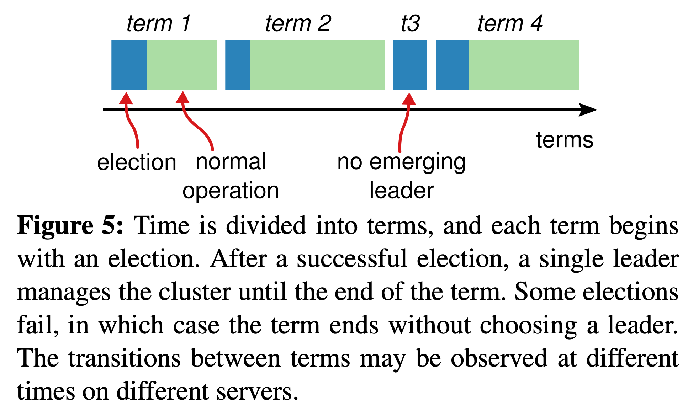

# Distributed System

## Consensus Algorithm

Consensus algorithms allow a collection of machines to work as a coherent group that can survive the failures of some of its members. Because of this, they play a key role in building reliable large-scale software systems.

### Replicated State Machines

Consensus algorithms typically arise in the context of *replicated state machines*. Replicated state machines are used to solve a variety of fault tolerance problems in distributed systems. In this approach, state machines on a collection of servers compute identical copies of the same state and can continue operating even if some of the servers are down. 

Replicated state machines are typically implemented using a replicated log, as shown in Figure 1. Each server stores a log containing a series of commands, which its state machine executes in order. Each log contains the same commands in the same order, so each state machine processes the same sequence of commands. Since the state machines are deterministic, each computes the same state and the same sequence of outputs.

Keeping the replicated log consistent is the job of the consensus algorithm. The consensus module on a server receives commands from clients and adds them to its log. It communicates with the consensus modules on other servers to ensure that every log eventually contains the same requests in the same order, even if some servers fail. Once commands are properly replicated, each server’s state machine processes them in log order, and the outputs are returned to clients. As a result, the servers appear to form a single, highly reliable state machine.

### Consensus Algorithm Properties

Consensus algorithms for practical systems typically have the following properties:

- They ensure *safety* (never returning an incorrect result) under all non-Byzantine conditions, including network delays, partitions, and packet loss, duplication, and reordering.
- They are fully functional (*available*) as long as any majority of the servers are operational and can communicate with each other and with clients. Thus, a typical cluster of five servers can tolerate the failure of any two servers. Servers are assumed to fail by stopping; they may later recover from state on stable storage and rejoin the cluster.
- They do not depend on timing to ensure the consistency of the logs: faulty clocks and extreme message delays can, at worst, cause availability problems.
- In the common case, a command can complete as soon as a majority of the cluster has responded to a single round of remote procedure calls; a minority of slow servers need not impact overall system performance.

### Raft

Raft is a consensus algorithm for managing a replicated log. Raft is similar in many ways to existing consensus algorithms, but it has several novel features:

- *Strong leader*: Raft uses a stronger form of leadership than other consensus algorithms. For example, log entries only flow from the leader to other servers. This simplifies the management of the replicated log and makes Raft easier to understand.
- *Leader election*: Raft uses randomized timers to elect leaders. This adds only a small amount of mechanism to the heartbeats already required for any consensus algorithm, while resolving conflicts simply and rapidly.
- *Membership changes*: Raft’s mechanism for changing the set of servers in the cluster uses a new *joint consensus* approach where the majorities of two different configurations overlap during transitions. This allows the cluster to continue operating normally during configuration changes.

Raft implements consensus by first electing a distinguished *leader*, then giving the leader complete responsibility for managing the replicated log. The leader accepts log entries from clients, replicates them on other servers, and tells servers when it is safe to apply log entries to their state machines. Having a leader simplifies the management of the replicated log. For example, the leader can decide where to place new entries in the log without consulting other servers, and data flows in a simple fashion from the leader to other servers. A leader can fail or become disconnected from the other servers, in which case a new leader is elected.

Raft decomposes the consensus problem into three relatively independent subproblems, which are discussed in the subsections that follow:

- *Leader election*: a new leader must be chosen when an existing leader fails.
- *Log replication*: the leader must accept log entries from clients and replicate them across the cluster, forcing the other logs to agree with its own.
- *Safety*: the key safety property for Raft is the State Machine Safety Property: if any server has applied a particular log entry to its state machine, then no other server may apply a different command for the same log index.
  - *Election Safety*: at most one leader can be elected in a given term.
  - *Leader Append-Only*: a leader never overwrites or deletes entries in its log; it only appends new entries.
  - *Log Matching*: if two logs contain an entry with the same index and term, then the logs are identical in all entries up through the given index.
  - *Leader Completeness*: if a log entry is committed in a given term, then that entry will be present in the logs of the leaders for all higher-numbered terms.
  - *State Machine Safety*: if a server has applied a log entry at a given index to its state machine, no other server will ever apply a different log entry for the same index.

#### Raft Basics

A Raft cluster contains several servers; five is a typical number, which allows the system to tolerate two failures. At any given time each server is in one of three states: *leader*, *follower*, or *candidate*. 

In normal operation there is exactly one leader and all of the other servers are followers.

- Followers are passive: they issue no requests on their own but simply respond to requests from leaders and candidates. 
- The leader handles all client requests (if a client contacts a follower, the follower redirects it to the leader). 
- The third state, candidate, is used to elect a new leader. 

Figure 4 shows the states and their transitions; the transitions are discussed below.

Raft divides time into *terms* of arbitrary length, as shown in Figure 5.Terms are numbered with consecutive integers. Each term begins with an *election*, in which one or more candidates attempt to become leader. If a candidate wins the election, then it serves as leader for the rest of the term. Raft ensures that there is at most one leader in a given term, if there are more than one leader get elected, the term will end with no leader; a new term (with a new election) will begin shortly. 

Different servers may observe the transitions between terms at different times, and in some situations a server may not observe an election or even entire terms. Terms act as a logical clock in Raft, and they allow servers to detect obsolete information such as stale leaders. Each server stores a *current term* number, which increases monotonically over time. Current terms are exchanged whenever servers communicate; 

- if one server’s current term is smaller than the other’s, then it updates its current term to the larger value. 
- If a candidate or leader discovers that its term is out of date, it immediately reverts to follower state. 
- If a server receives a request with a stale term number, it rejects the request.

Raft servers communicate using remote procedure calls (RPCs), and the basic consensus algorithm requires only two types of RPCs. Servers retry RPCs if they do not receive a response in a timely manner, and they issue RPCs in parallel for best performance.

- RequestVote RPCs are initiated by candidates during elections
- Append-Entries RPCs are initiated by leaders to replicate log entries and to provide a form of heartbeat. 
- Later will added a third RPC for transferring snapshots between servers. 

#### Leader Election

Raft uses a heartbeat mechanism to trigger leader election. When servers start up, they begin as followers. A server remains in follower state as long as it receives valid RPCs from a leader or candidate. Leaders send periodic heartbeats (AppendEntries RPCs that carry no log entries) to all followers in order to maintain their authority. If a follower receives no communication over a period of time called the *election timeout*, then it assumes there is no viable leader and begins an election to choose a new leader.

To begin an election, a follower increments its current term and transitions to candidate state. It then votes for itself and issues RequestVote RPCs in parallel to each of the other servers in the cluster. A candidate continues in this state until one of three things happens: 

1. it wins the election
   - A candidate wins an election if it receives votes from a majority of the servers in the full cluster for the same term. Each server will vote for at most one candidate in a given term, on a first-come-first-served basis. The majority rule ensures that at most one candidate can win the election for a particular term. Once a candidate wins an election, it becomes leader. It then sends heartbeat messages to all of the other servers to establish its authority and prevent new elections.
2. another server establishes itself as leader
   - While waiting for votes, a candidate may receive an AppendEntries RPC from another server claiming to be leader. If the leader’s term (included in its RPC) is at least as large as the candidate’s current term, then the candidate recognizes the leader as legitimate and returns to follower state. If the term in the RPC is smaller than the candidate’s current term, then the candidate rejects the RPC and continues in candidate state.
3. a period of time goes by with no winner.
   - The third possible outcome is that a candidate neither wins nor loses the election: if many followers become candidates at the same time, votes could be split so that no candidate obtains a majority. When this happens, each candidate will time out and start a new election by incrementing its term and initiating another round of Request-Vote RPCs. However, without extra measures split votes could repeat indefinitely.

Raft uses randomized election timeouts to ensure that split votes are rare and that they are resolved quickly. To prevent split votes in the first place, election timeouts are chosen randomly from a fixed interval (e.g., 150–300ms). This spreads out the servers so that in most cases only a single server will time out; it wins the election and sends heartbeats before any other servers time out. The same mechanism is used to handle split votes. Each candidate restarts its randomized election timeout at the start of an election, and it waits for that timeout to elapse before starting the next election; this reduces the likelihood of another split vote in the new election.

#### Log Replication

Once a leader has been elected, it begins servicing client requests. Each client request contains a command to be executed by the replicated state machines. The leader appends the command to its log as a new entry, then issues AppendEntries RPCs in parallel to each of the other servers to replicate the entry. When the entry has been safely replicated, the leader applies the entry to its state machine and returns the result of that execution to the client. If followers crash or run slowly, or if network packets are lost, the leader retries Append-Entries RPCs indefinitely (even after it has responded to the client) until all followers eventually store all log entries.

Logs are organized as shown in Figure 6. Each log entry stores a state machine command along with the term number when the entry was received by the leader. The term numbers in log entries are used to detect inconsistencies between logs and to ensure some of the properties. Each log entry also has an integer index identifying its position in the log.

The leader decides when it is safe to apply a log entry to the state machines; such an entry is called *committed*. Raft guarantees that committed entries are durable and will eventually be executed by all of the available state machines. A log entry is committed once the leader that created the entry has replicated it on a majority of the servers (e.g., entry 7 in Figure 6). This also commits all preceding entries in the leader’s log, including entries created by previous leaders. The leader keeps track of the highest index it knows to be committed, and it includes that index in future AppendEntries RPCs (including heartbeats) so that the other servers eventually find out. Once a follower learns that a log entry is committed, it applies the entry to its local state machine (in log order).

Raft maintains the following properties, which together constitute the Log Matching safety Property:

- If two entries in different logs have the same index and term, then they store the same command.
  - This follows from the fact that a leader creates at most one entry with a given log index in a given term, and log entries never change their position in the log. 
- If two entries in different logs have the same index and term, then the logs are identical in all preceding entries.
  - this is guaranteed by a simple consistency check performed by AppendEntries. When sending an AppendEntries RPC, the leader includes the index and term of the entry in its log that immediately precedes the new entries. If the follower does not find an entry in its log with the same index and term, then it refuses the new entries. The consistency check acts as an induction step: the initial empty state of the logs satisfies the Log Matching Property, and the consistency check preserves the Log Matching Property whenever logs are extended. As a result, whenever AppendEntries returns successfully, the leader knows that the follower’s log is identical to its own log up through the new entries.

During normal operation, the logs of the leader and followers stay consistent, so the AppendEntries consistency check never fails. However, leader crashes can leave the logs inconsistent (the old leader may not have fully replicated all of the entries in its log). These inconsistencies can compound over a series of leader and follower crashes. Figure 7 illustrates the ways in which followers’ logs may differ from that of a new leader. A follower may be missing entries that are present on the leader, it may have extra entries that are not present on the leader, or both. Missing and extraneous entries in a log may span multiple terms.

In Raft, the leader handles inconsistencies by forcing the followers’ logs to duplicate its own. This means that conflicting entries in follower logs will be overwritten with entries from the leader’s log. 

To bring a follower’s log into consistency with its own, the leader must find the latest log entry where the two logs agree, delete any entries in the follower’s log after that point, and send the follower all of the leader’s entries after that point. All of these actions happen in response to the consistency check performed by AppendEntries RPCs. The leader maintains a *nextIndex* for each follower, which is the index of the next log entry the leader will send to that follower. When a leader first comes to power, it initializes all nextIndex values to the index just after the last one in its log (11 in Figure 7). If a follower’s log is inconsistent with the leader’s, the AppendEntries consistency check will fail in the next AppendEntries RPC. After a rejection, the leader decrements nextIndex and retries the AppendEntries RPC. Eventually nextIndex will reach a point where the leader and follower logs match. When this happens, AppendEntries will succeed, which removes any conflicting entries in the follower’s log and appends entries from the leader’s log (if any). Once AppendEntries succeeds, the follower’s log is consistent with the leader’s, and it will remain that way for the rest of the term.

> _**Note**_: The protocol can be optimized to reduce the number of rejected AppendEntries RPCs. For example, when rejecting an AppendEntries request, the follower can include the term of the conflicting entry and the first index it stores for that term. With this information, the leader can decrement nextIndex to bypass all of the conflicting entries in that term; one AppendEntries RPC will be required for each term with conflicting entries, rather than one RPC per entry. In practice, we doubt this optimization is necessary, since failures happen infrequently and it is unlikely that there will be many inconsistent entries.

With this mechanism, a leader does not need to take any special actions to restore log consistency when it comes to power. It just begins normal operation, and the logs automatically converge in response to failures of the Append-Entries consistency check. A leader never overwrites or deletes entries in its own log.

This log replication mechanism exhibits the desirable consensus properties: Raft can accept, replicate, and apply new log entries as long as a majority of the servers are up; in the normal case a new entry can be replicated with a single round of RPCs to a majority of the cluster; and a single slow follower will not impact performance.

#### Safety

This section completes the Raft algorithm by adding a restriction on which servers may be elected leader. The restriction ensures that the leader for any given term contains all of the entries committed in previous terms (the Leader Completeness Property). Given the election restriction, we then make the rules for commitment more precise.

##### Election Restriction

In any leader-based consensus algorithm, the leader must eventually store all of the committed log entries. In some consensus algorithms, such as Viewstamped Replication, a leader can be elected even if it doesn’t initially contain all of the committed entries. These algorithms contain additional mechanisms to identify the missing entries and transmit them to the new leader, either during the election process or shortly afterwards. Unfortunately, this results in considerable additional mechanism and complexity. Raft uses a simpler approach where it guarantees that all the committed entries from previous terms are present on each new leader from the moment of its election, without the need to transfer those entries to the leader. This means that log entries only flow in one direction, from leaders to followers, and leaders never overwrite existing entries in their logs.

Raft uses the voting process to prevent a candidate from winning an election unless its log contains all committed entries. A candidate must contact a majority of the cluster in order to be elected, which means that every committed entry must be present in at least one of those servers. If the candidate’s log is at least as up-to-date as any other log in that majority (where “up-to-date” is defined precisely below), then it will hold all the committed entries. The RequestVote RPC implements this restriction: the RPC includes information about the candidate’s log, and the voter denies its vote if its own log is more up-to-date than that of the candidate.

Raft determines which of two logs is more up-to-date by comparing the index and term of the last entries in the logs. If the logs have last entries with different terms, then the log with the later term is more up-to-date. If the logs end with the same term, then whichever log is longer is more up-to-date.

##### Committing Entries from Previous Terms