# Golang

Go is a **static type** language.

Go code is grouped into packages, and packages are grouped into modules. Your package's module specifies the context Go needs to run the code, including the Go version the code is written for and the set of other modules it requires.

Go does not require semicolons at the ends of statements or declarations, except where two or more appear on the same line. In effect, newlines following certain tokens are converted into semicolons, so where newlines are placed matters to proper parsing of Go code. For instance, the opening brace { of the function must be on the same line as the end of the func declaration, not on a line by itself, and in the expression x + y, a newline is permitted after but not before the + operator.

It is implicitly initialized to the *zero value* for its type, which is 0 for numeric types and the empty string "" for strings.

## Packages and the Go Tool

### Go Tools

`goimports`: manages the insertion and removal of import declarations as needed.

`gofmt`: Format the code automatically.

### GO CLI

1. `go build` Compiles a bunch of go source code files.
2. `go run` Compiles and executes one or two files.
3. `go fmt` Formats all the code in each file in the current directory.
4. `go install` Compiles and "install" a package.
5. `go get` Downloads the raw source code of other's package.
6. `go test` Runs any tests associated with the current project.

### Package

Packages in Go serve the same purposes as libraries or modules in other languages, supporting modularity, encapsulation, separate compilation, and reuse.

Package-level names like the types and constants declared in one file of a package are visible to all the other files of the package, as if the source code were all in a single file. 

The *doc comment*  immediately preceding the package declaration documents the package as a whole. Conventionally, it should start with a summary sentence in the style illustrated. Only one file in each package should have a package doc comment. Extensive doc comments are often placed in a file of their own, conventionally called doc.go.

#### Public & private

Every function in the packages we've seen start with a capital letter. In Go if something starts with a capital letter that means other packages (and programs) are able to see it. If we had named the function `average` instead of `Average` our `main` program would not have been able to see it.

#### Alias

we  use an alias for an imported math: `m` is the alias.

```go
import m "golang-book/chapter11/math"

func main() {
  xs := []float64{1,2,3,4}
  avg := m.Average(xs)
  fmt.Println(avg)
}
```

#### Type of Package

There are two types of packages.

1. `Executable`: Generates a file that we can run, only`main` is the executable package
2. `Resuable`: Code used as 'helpers'. It's a good place to put reusable logic. Excepted `main`, other self defined package name will be treated as reusable package

```go
// simple go sample

// main is executable package and "main" function must exist
//others are resuable package
package main

import "fmt" // coming from standard library of GO

func main() {
  fmt.Println("Hello!")
}
```

#### Import Packages

```go
import "fmt"
import "golang-book/chapter11/math"

// or as a parenthesized list rather than as individual import declarations.
import (
  "fmt"
  "os"
)
```

#### Creating Packages

Let's create an application that will use a package we will write. Create a folder in `~/src/golang-book` called `chapter11`. Inside that folder create a file called `main.go` which contains this:

```go
package main

import "fmt"
import "golang-book/chapter11/math"

func main() {
  xs := []float64{1,2,3,4}
  avg := math.Average(xs)
  fmt.Println(avg)
}
```

Now create another folder inside of the `chapter11` folder called `math`. Inside of this folder create a file called `math.go` that contains this:

```go
package math

func Average(xs []float64) float64 {
  total := float64(0)
  for _, x := range xs {
    total += x
  }
  return total / float64(len(xs))
}
```

Using a terminal in the `math` folder you just created run `go install`. This will compile the `math.go` program and create a linkable object file: `~/pkg/os_arch/golang-book/chapter11/math.a`.Now go back to the `chapter11` folder and run `go run main.go`. You should see `2.5`. 

#### Package Initialization

Package initialization begins by initializing package-level variables in the order in which they are declared, except that dependencies are resolved first:

```go
var a = b + c // a initialized third, to 3
var b = f() // b initialized second, to 2, by calling f
var c = 1 // c initialized first, to 1

func f() int { return c + 1 }
```

##### Init Function

```go
   func init() { /* ... */ }
```

Within each file, init functions are automatically executed when the program starts, in the order in which they are declared.

## Documentation

Go has the ability to automatically generate documentation for packages we write in a similar way to the standard package documentation. In a terminal run this command:

```bash
godoc golang-book/chapter11/math Average
```

You should see information displayed for the function we just wrote. We can improve this documentation by adding a comment before the function:

```go
// Finds the average of a series of numbers
func Average(xs []float64) float64 {
```

If you run `go install` in the `math` folder, then re-run the `godoc` command you should see our comment below the function definition. This documentation is also available in web form by running this command:

```go
godoc -http=":6060"
```

and entering this URL into your browser:

```go
http://localhost:6060/pkg/
```

You should be able to browse through all of the packages installed on your system.

## Printf 

### Printf Verbs

Printf has over a dozen such conversions, which Go programmers call *verbs*. The verbs:

General:

```go
%v	the value in a default format
	when printing structs, the plus flag (%+v) adds field names
%#v	a Go-syntax representation of the value
%T	a Go-syntax representation of the type of the value
%%	a literal percent sign; consumes no value
```

Boolean:

```go
%t	the word true or false
```

Integer:

```go
%b	base 2
%c	the character represented by the corresponding Unicode code point
%d	base 10
%o	base 8
%O	base 8 with 0o prefix
%q	a single-quoted character literal safely escaped with Go syntax.
%x	base 16, with lower-case letters for a-f
%X	base 16, with upper-case letters for A-F
%U	Unicode format: U+1234; same as "U+%04X"
```

Floating-point and complex constituents:

```go
%b	decimalless scientific notation with exponent a power of two,
	in the manner of strconv.FormatFloat with the 'b' format,
	e.g. -123456p-78
%e	scientific notation, e.g. -1.234456e+78
%E	scientific notation, e.g. -1.234456E+78
%f	decimal point but no exponent, e.g. 123.456
%F	synonym for %f
%g	%e for large exponents, %f otherwise. Precision is discussed below.
%G	%E for large exponents, %F otherwise
%x	hexadecimal notation (with decimal power of two exponent), e.g. -0x1.23abcp+20
%X	upper-case hexadecimal notation, e.g. -0X1.23ABCP+20
```

String and slice of bytes (treated equivalently with these verbs):

```go
%s	the uninterpreted bytes of the string or slice
%q	a double-quoted string safely escaped with Go syntax
%x	base 16, lower-case, two characters per byte
%X	base 16, upper-case, two characters per byte
```

Slice:

```go
%p	address of 0th element in base 16 notation, with leading 0x
```

Pointer:

```go
%p	base 16 notation, with leading 0x
The %b, %d, %o, %x and %X verbs also work with pointers,
formatting the value exactly as if it were an integer.
```

The default format for %v is:

```go
bool:                    %t
int, int8 etc.:          %d
uint, uint8 etc.:        %d, %#x if printed with %#v
float32, complex64, etc: %g
string:                  %s
chan:                    %p
pointer:                 %p
```

For compound objects, the elements are printed using these rules, recursively, laid out like this:

```go
struct:             {field0 field1 ...}
array, slice:       [elem0 elem1 ...]
maps:               map[key1:value1 key2:value2 ...]
pointer to above:   &{}, &[], &map[]
```

Width is specified by an optional decimal number immediately preceding the verb. If absent, the width is whatever is necessary to represent the value. Precision is specified after the (optional) width by a period followed by a decimal number. If no period is present, a default precision is used. A period with no following number specifies a precision of zero. Examples:

```go
%f     default width, default precision
%9f    width 9, default precision
%.2f   default width, precision 2
%9.2f  width 9, precision 2
%9.f   width 9, precision 0
```

### Print Object In Table Form

```go
func printTracks(tracks []*Track) {
  const format = "%v\t%v\t%v\t%v\t%v\t\n"
  tw := new(tabwriter.Writer).Init(os.Stdout, 0, 8, 2, ' ', 0)
  fmt.Fprintf(tw, format, "Title", "Artist", "Album", "Year", "Length")
  fmt.Fprintf(tw, format, "-----", "------", "-----", "----", "------")
  for _, t := range tracks {
    fmt.Fprintf(tw, format, t.Title, t.Artist, t.Album, t.Year, t.Length)
  }
  tw.Flush() // calculate column widths and print table
}
```

### Operand Selector

You can select the variable to print in printf

```go
o := 0666
fmt.Printf("%d %[1]o %#[1]o\n", o) // "438 666 0666"
```

### Other Verbs

- `+` always print a sign for numeric values;
  guarantee ASCII-only output for %q (%+q)
- `-` pad with spaces on the right rather than the left (left-justify the field)
- `#` alternate format: 
  - add leading 0b for binary (%#b), 0 for octal (%#o),0x or 0X for hex (%#x or %#X); suppress 0x for %p (%#p);
  - for %q, print a raw (backquoted) string if strconv.CanBackquote
    returns true;
  - always print a decimal point for %e, %E, %f, %F, %g and %G;
  - do not remove trailing zeros for %g and %G;
  - write e.g. U+0078 'x' if the character is printable for %U (%#U).
- `' '`(space) leave a space for elided sign in numbers (% d); put spaces between bytes printing strings or slices in hex (% x, % X)
- `0`	pad with leading zeros rather than spaces; for numbers, this moves the padding after the sign

## Program Structure

### General Structure

A Go program is stored in one or more files whose names end in .go. Each file begins with a package declaration that says what package the file is part of. The package declaration is followed by any import declarations, and then a sequence of *package-level* declarations of types, variables, constants, and functions, in any order. 

### Names

The names of Go functions, variables, constants, types, statement labels, and packages follow a simple rule: a name begins with a letter (that is, anything that Unicode deems a letter) or an underscore and may have any number of additional letters, digits, and underscores, case matters.

Go has 25 *keywords* like if and switch that may be used only where the syntax permits; they can’t be used as names.

```go
break default func interface select
case defer go map struct
chan else goto package switch
const fallthrough if range type
continue for import return var
```

In addition, there are about three dozen *predeclared* names like int and true for built-in constants, types, and functions:

**Constants**: Types: true, false, iota, nil

**Types**: int int8 int16 int32 int64 uint uint8 uint16 uint32 uint64 uintptr float32 float64 complex128 complex64 bool byte rune string error

**Functions**: make len cap new append copy close delete complex real imag
 panic recover

These names are not reserved, so you may use them in declarations.

### Visibility

If the name begins with an upper-case letter, it is *exported*, which means that it is visible and accessible outside of its own package and may be referred to by other parts of the program, as with Printf in the fmt package. Package names themselves are always in lower case.

### Declarations

A *declaration* names a program entity and specifies some or all of its properties. There are four major kinds of declarations: **var**, **const**, **type**, and **func**.

### Variable

#### Declaration

```go
// these are all equivalent:
s := "" // most compact but not for package level variables
var s string //  implicit declaration
var s = "" // rarely used except when declaring multiple variables.
var s string = "" // explicit about the variable’s type, which is redundant 

// declare a group of variable
var (
  a = 5
  b = 10
  c = 15
)
```

In practice, you should generally use one of the first two forms, with explicit initialization to say that the initial value is important and implicit initialization to say that the initial value doesn’t matter.

##### Unnamed Variable

The expression new(T) creates an *unnamed variable* of type T, initializes it to the zero value of T, and returns its address, which is a value of type *T.

```go
p := new(int)   // p, of type *int, points to an unnamed int variable
fmt.Println(*p) // "0"
*p = 2          // sets the unnamed int to 2
fmt.Println(*p) // "2"
```

#### Lifetime of Variables

The *lifetime* of a variable is the interval of time during which it exists as the program executes. The lifetime of a package-level variable is the entire execution of the program. By contrast, local variables have dynamic lifetimes: a new instance is created each time the declaration statement is executed, and the variable lives on until it becomes *unreachable*, at which point its storage may be recycled. Function parameters and results are local variables too; they are created each time their enclosing function is called.

A compiler may choose to allocate local variables on the heap or on the stack but, perhaps surprisingly, this choice is not determined by whether var or new was used to declare the variable.

```go
var global *int
func f() {
  var x int
  x = 1
  global = &x
}
```

x must be heap-allocated because it is still reachable from the variable global after f has returned, despite being declared as a local variable; we say x *escapes from* f. Note that, each variable that escapes requires an extra memory allocation.

```go
func g() {
	y := new(int)
	*y = 1
}
```

Conversely, when g returns, the variable *y becomes unreachable and can be recycled. Since *y does not escape from g, it’s safe for the compiler to allocate *y on the stack, even though it was allocated with new.

To write efficient programs you still need to be aware of the lifetime of variables. For example, keeping unnecessary pointers to short-lived objects within long-lived objects, especially global variables, will prevent the garbage collector from reclaiming the short-lived objects.

### Assignment

The value held by a variable is updated by an assignment statement.

```go
x = 1
*p = true
person.name = "bob"
count[x] = count[x] * scale
count[x] *= scale
v := 1
++v
v++
v--
--v
```

#### Tuple Assignment

```go
x, y = y, x
a[i], a[j] = a[j], a[i]
```

### Type Declarations

A type declaration defines a new *named type* that has the same *underlying type* as an existing type. The named type provides a way to separate different and perhaps incompatible uses of the underlying type so that they can’t be mixed unintentionally.

```go
type name underlying_type
```

Type declarations most often appear at package level, where the named type is visible through- out the package, and if the name is exported (it starts with an upper-case letter), it’s accessible from other packages as well.

### Scope

The *scope* of a declaration is the part of the source code where a use of the declared name refers to that declaration.

A **syntactic *block*** is a sequence of statements enclosed in braces like those that surround the body of a function or loop. A name declared inside a **syntactic block** is not visible outside that block. The block encloses its declarations and determines their scope. We can generalize this notion of blocks to include other groupings of declarations that are not explicitly surrounded by braces in the source code; we’ll call them all ***lexical blocks***. There is a lexical block for the entire source code, called the ***universe block***; for each package; for each file; for each for, if, and switch statement; for each case in a switch or select statement; and, of course, for each explicit syntactic block.

The scope of a control-flow label, as used by break, continue, and goto statements, is the entire enclosing function. A program may contain multiple declarations of the same name so long as each declaration is in a different lexical block. 

When the compiler encounters a reference to a name, it looks for a declaration, starting with the innermost enclosing lexical block and working up to the universe block. If the compiler finds no declaration, it reports an ‘‘undeclared name’’ error. If a name is declared in both an outer block and an inner block, the inner declaration will be found first. In that case, the inner declaration is said to *shadow* or *hide* the outer one, making it inaccessible:

```go

func f() {}
var g = "g"
func main() {
  f := "f"
  fmt.Println(f) // "f"; local var f shadows package-level func   
  fmt.Println(g) // "g"; package level var
  fmt.Println(h) // compile error: undefined: h
 }
```

The example below also has three variables named x, each declared in a different block—one in the function body, one in the for statement’s block, and one in the loop body—but only two of the blocks are explicit:

```go
func main() {
  x := "hello"
  for _, x := range x {
    x := x + 'A' - 'a'
    fmt.Printf("%c", x) // "HELLO" (one letter per iteration)
  } 
}
```

Like for loops, if statements and switch statements also create implicit blocks in addition to their body blocks. The code in the following if-else chain shows the scope of x and y:

```go
if x := f(); x == 0 {
  fmt.Println(x)
} else if y := g(x); x == y {
  fmt.Println(x, y)
} else {
  fmt.Println(x, y)
}
fmt.Println(x, y) // compile error: x and y are not visible here
```

The second if statement is nested within the first, so variables declared within the first statement’s initializer are visible within the second. Similar rules apply to each case of a switch statement: there is a block for the condition and a block for each case body.

### Binary Operators

Go’s binary operators for arithmetic, logic, and comparison are listed here in order of decreasing precedence:

```go
* / % << >> & &^ 
+ - | ^
== != < <= > >=
&&
||
```

There are only five levels of precedence for binary operators. Operators at the same level associate to the left, so parentheses may be required for clarity, or to make the operators evaluate in the intended order in an expression like mask & (1 << 28).

#### Binary comparison operators

```go
== equal to
!= not equal to
< less than
<= less than or equal to
> greater than
>= greater than or equal to
```

#### Unary addition and subtraction operators

```go
+ unary positive (no effect)
- unary negation
```

####  Bitwise binary operators

```go
& bitwise AND
| bitwise OR
^ bitwise XOR
&^ bit clear (AND NOT) << left shift
>> right shift
```

The &^ operator is bit clear (AND NOT): in the expression z = x &^ y, each bit of z is 0 if the corresponding bit of y is 1; otherwise it equals the corresponding bit of x.

Left shifts fill the vacated bits with zeros, as do right shifts of unsigned numbers, but right shifts of signed numbers fill the vacated bits with copies of the sign bit. For this reason, **it is important to use unsigned arithmetic when you’re treating an integer as a bit pattern.**

Unsigned numbers tend to be used only when their bitwise operators or peculiar arithmetic operators are required, as when implementing bit sets, parsing binary file formats, or for hashing and cryptography. They are typically not used for merely non-negative quantities.

### Type Casting

In general, an explicit conversion is required to convert a value from one type to another, and binary operators for arithmetic and logic (except shifts) must have operands of the same type. Consider this sequence:

```go
var apples int32 = 1
var oranges int16 = 2
var compote int = apples + oranges // compile error
```

This type mismatch can be fixed in several ways, most directly by converting everything to a common type:

```go
var compote = int(apples) + int(oranges)
```

For every type T, the conversion operation T(x) converts the value x to type T if the conversion is allowed. **Many integer-to-integer conversions do not entail any change in value; they just tell the compiler how to interpret a value.** But a conversion that narrows a big integer into a smaller one, or a conversion from integer to floating-point or vice versa, may change the value or lose precision:

```go
f := 3.141 // a float64
i := int(f)
fmt.Println(f, i)   // "3.141 3"
f = 1.99
fmt.Println(int(f)) // "1"
```

## Basic Data Types

Go’s types fall into four categories: ***basic types***, ***aggregate types***, ***reference types***, and ***interface types***. Basic types include numbers, strings, and booleans. Aggregate types—arrays and structs —form more complicated data types by combining values of several simpler ones. Reference types are a diverse group that includes pointers, slices, maps , functions, and channels, but what they have in common is that they all refer to program variables or state *indirectly*, so that the effect of an operation applied to one reference is observed by all copies of that reference.

### Integer

Go provides both signed and unsigned integer arithmetic. There are four distinct sizes of signed integers—8, 16, 32, and 64 bits—represented by the types int8, int16, int32, and int64, and corresponding unsigned versions uint8, uint16, uint32, and uint64. Signed numbers are represented in 2’s-complement form.

Generally if you are working with integers you should just use the `int` type.

#### Max and Min

```go
// in math library
// accessing it like math.MaxInt8
const (
    MaxInt8   = 1<<7 - 1
    MinInt8   = -1 << 7
    MaxInt16  = 1<<15 - 1
    MinInt16  = -1 << 15
    MaxInt32  = 1<<31 - 1
    MinInt32  = -1 << 31
    MaxInt64  = 1<<63 - 1
    MinInt64  = -1 << 63
    MaxUint8  = 1<<8 - 1
    MaxUint16 = 1<<16 - 1
    MaxUint32 = 1<<32 - 1
    MaxUint64 = 1<<64 - 1
)
```

### Floating Point Numbers

Go has two floating point types: `float32` and `float64` (also often referred to as single precision and double precision respectively). Their arithmetic properties are governed by the IEEE 754 standard implemented by all modern CPUs.

A float32 provides approximately six decimal digits of precision, whereas a float64 provides about 15 digits; float64 should be preferred for most purposes because float32 computations accumulate error rapidly unless one is quite careful, and the smallest positive integer that cannot be exactly represented as a float32 is not large.

Floating-point numbers can be written literally using decimals, like this:

```go
const e = 2.71828 // (approximately)
```

Digits may be omitted before the decimal point (.707) or after it (1.). Very small or very large numbers are better written in scientific notation, with the letter e or E preceding the decimal exponent:

```go
const Avogadro = 6.02214129e23
const Planck   = 6.62606957e-34
```

In addition to numbers there are several other values which can be represented: “not a number” (`NaN`, for things like `0/0`) and positive and negative infinity. (`+∞` and `−∞`)

```go
var z float64
fmt.Println(z, -z, 1/z, -1/z, z/z) //  "0 -0 +Inf -Inf NaN"
```

#### NaN

The function math.IsNaN tests whether its argument is a not-a-number value, and math.NaN returns such a value. It’s tempting to use NaN as a sentinel value in a numeric computation, but testing whether a specific computational result is equal to NaN is fraught with peril because any comparison with NaN *always* yields false (except !=, which is always the negation of ==) :

```go
nan := math.NaN()
fmt.Println(nan == nan, nan < nan, nan > nan) // "false false false"

// check for is NaN
fmt.Println(math.IsNaN(nan)) // true
```

#### Max and Min

```go
const (
    MaxFloat32             = 3.40282346638528859811704183484516925440e+38  // 2**127 * (2**24 - 1) / 2**23
    SmallestNonzeroFloat32 = 1.401298464324817070923729583289916131280e-45 // 1 / 2**(127 - 1 + 23)

    MaxFloat64             = 1.797693134862315708145274237317043567981e+308 // 2**1023 * (2**53 - 1) / 2**52
    SmallestNonzeroFloat64 = 4.940656458412465441765687928682213723651e-324 // 1 / 2**(1023 - 1 + 52)
)
```

### Complex Numbers

Go provides two sizes of complex numbers, complex64 and complex128, whose components are float32 and float64 respectively. The built-in function complex creates a complex number from its real and imaginary components, and the built-in real and imag functions extract those components:

```go
var x complex128 = complex(1, 2) // 1+2i
var y complex128 = complex(3, 4) // 3+4i
fmt.Println(x*y) // "(-5+10i)"
fmt.Println(real(x*y)) // "-5"
fmt.Println(imag(x*y)) // "10"
```

If a floating-point literal or decimal integer literal is immediately followed by i, such as 3.141592i or 2i, it becomes an *imaginary literal*, denoting a complex number with a zero real component:

```go
fmt.Println(1i * 1i) // "(-1+0i)", i^2 = -1
```

Under the rules for constant arithmetic, complex constants can be added to other constants (integer or floating point, real or imaginary), allowing us to write complex numbers naturally, like 1+2i, or equivalently, 2i+1. The declarations of x and y above can be simplified:

```go
x := 1 + 2i
y := 3 + 4i
```

Complex numbers may be compared for equality with == and !=. Two complex numbers are equal if their real parts are equal and their imaginary parts are equal.

### String

A string is an immutable sequence of bytes. Strings may contain arbitrary data, including bytes with value 0, but usually they contain human-readable text. Text strings are conventionally interpreted as UTF-8-encoded sequences of Unicode code points (runes).

The built-in len function returns the number of bytes (not runes) in a string, and the *index* operation s[i] retrieves the *i*-th byte of string s, where 0 ≤ i < len(s).

```go
s := "hello, world"
fmt.Println(len(s))     // "12"
fmt.Println(s[0], s[7]) // "104 119"  ('h' and 'w')
```

The *i*-th byte of a string is not necessarily the *i*-th *character* of a string, because the UTF-8 encoding of a non-ASCII code point requires two or more bytes.

The *substring* operation s[i:j] yields a new string consisting of the bytes of the original string starting at index i and continuing up to, but not including, the byte at index j. The result contains j-i bytes.

```go
s := "hello, world"
fmt.Println(s[0:5]) // "hello"
```

#### Comparison

Strings may be compared with comparison operators like == and <; the comparison is done byte by byte, so the result is the natural lexicographic ordering.

#### Immutable

Since strings are immutable, constructions that try to modify a string’s data in place are not allowed:

```go
s[0] = 'L' // compile error: cannot assign to s[0]
```

#### String Literals

A string value can be written as a *string literal*, a sequence of bytes enclosed in double quotes: "Hello, 世界"

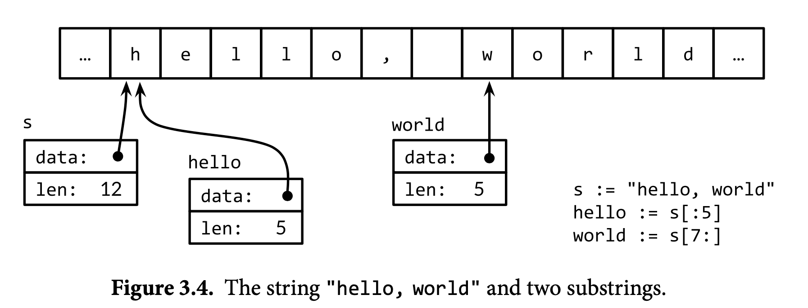

Because Go source files are always encoded in UTF-8 and Go text strings are conventionally interpreted as UTF-8, we can include Unicode code points in string literals.

#### Raw String

A *raw string literal* is written``` `...` ```, using backquotes instead of double quotes. Within a raw string literal, no escape sequences are processed; the contents are taken literally, including backslashes and newlines, so a raw string literal may spread over several lines in the program source. The only processing is that carriage returns are deleted so that the value of the string is the same on all platforms, including those that conventionally put carriage returns in text files.

Raw string literals are a convenient way to write regular expressions, which tend to have lots of backslashes. They are also useful for HTML templates, JSON literals, command usage messages, and the like, which often extend over multiple lines.

#### UTF-8

UTF-8 is a variable-length encoding of Unicode code points as bytes. 

```
0xxxxxxx 																runes 0−127 (ASCII)
110xxxxx	10xxxxxx		128−2047					(values <128 unused)
1110xxxx	10xxxxxx 	10xxxxxx		2048−65535 (values <2048 unused) 
11110xxx	10xxxxxx 	10xxxxxx 	10xxxxxx 65536−0x10ffff	(other values unused)

```

Thanks to the nice properties of UTF-8, many string operations don’t require decoding. We can test whether one string contains another as a prefix:

```go
// prefix
func HasPrefix(s, prefix string) bool {
  return len(s) >= len(prefix) && s[:len(prefix)] == prefix
}
// suffix
func HasSuffix(s, suffix string) bool {
         return len(s) >= len(suffix) && s[len(s)-len(suffix):] == suffix
}
//substring
func Contains(s, substr string) bool {
  for i := 0; i < len(s); i++ {
    if HasPrefix(s[i:], substr) {
      return true
    }
  }
  return false
}
```

using the same logic for UTF-8-encoded text as for raw bytes. This is not true for other encodings. (The functions above are drawn from the strings package, though its implementation of Contains uses a hashing technique to search more efficiently.)

On the other hand, if we really care about the individual Unicode characters, we have to use other mechanisms. Consider the string from our very first example, which includes two East Asian characters. Figure 3.5 illustrates its representation in memory. The string contains 13 bytes, but interpreted as UTF-8, it encodes only nine code points or runes:

```go
import "unicode/utf8"
s := "Hello, BF"
fmt.Println(len(s)) // "13" 
fmt.Println(utf8.RuneCountInString(s)) // "9"
```

To process those characters, we need a UTF-8 decoder. The unicode/utf8 package provides one that we can use like this:

```go
for i := 0; i < len(s); {
	r, size := utf8.DecodeRuneInString(s[i:])
	fmt.Printf("%d\t%c\n", i, r)
	i += size
}
for i, r := range s {
  fmt.Printf("%d\t%q\t%d\n", i, r, r)
}
```

Each call to DecodeRuneInString returns r, the rune itself, and size, the number of bytes occupied by the UTF-8 encoding of r. The size is used to update the byte index i of the next rune in the string. But this is clumsy, and we need loops of this kind all the time. Fortunately, Go’s range loop, when applied to a string, performs UTF-8 decoding implicitly.

##### Invalid Rune

Each time a UTF-8 decoder, whether explicit in a call to utf8.DecodeRuneInString or implicit in a range loop, consumes an unexpected input byte, it generates a special Unicode *replacement character*, '\uFFFD', which is usually printed as a white question mark inside a black hexagonal or diamond-like shape. When a program encounters this rune value, it’s often a sign that some upstream part of the system that generated the string data has been careless in its treatment of text encodings.

#### Strings and Byte Slices

Four standard packages are particularly important for manipulating strings: bytes, strings, strconv, and unicode. 

- The strings package provides many functions for searching, replacing, comparing, trimming, splitting, and joining strings.
- The bytes package has similar functions for manipulating slices of bytes, of type []byte, which share some properties with strings. Because strings are immutable, building up strings incrementally can involve a lot of allocation and copying. In such cases, it’s more efficient to use the bytes.Buffer.
- The strconv package provides functions for converting boolean, integer, and floating-point values to and from their string representations, and functions for quoting and unquoting strings.
- The unicode package provides functions like IsDigit, IsLetter, IsUpper, and IsLower for classifying runes. Each function takes a single rune argument and returns a boolean. Conversion functions like ToUpper and ToLower convert a rune into the given case if it is a letter. All these functions use the Unicode standard categories for letters, digits, and so on.

The strings package has similar functions, also called ToUpper and ToLower, that return a new string with the specified transformation applied to each character of the original string. If you try to avoid copy the string over and over again, use byte[].

Strings can be converted to byte slices and back again:

```go
s := "abc"
b := []byte(s)
s2 := string(b)
```

Conceptually, **the []byte(s) conversion allocates a new byte array holding a copy of the bytes of s, and yields a slice that references the entirety of that array.** An optimizing compiler may be able to avoid the allocation and copying in some cases, but in general copying is required to ensure that the bytes of s remain unchanged even if those of b are subsequently modified. The conversion from byte slice back to string with string(b) also makes a copy, to ensure immutability of the resulting string s2.

> _**Note**_: Use strings.Builder over bytes.Buffer if you want more efficient code as string convert to []bytes will allocates a new byte array holding a copy of the bytes version.

The bytes package provides the Buffer type for efficient manipulation of byte slices. A Buffer starts out empty but grows as data of types like string, byte, and []byte are written to it. As the example below shows, a bytes.Buffer variable requires no initialization because its zero value is usable:

```go
 // intsToString is like fmt.Sprint(values) but adds commas.
func intsToString(values []int) string {
  var buf bytes.Buffer
  buf.WriteByte('[')
	for i, v := range values {
		if i > 0 {
        buf.WriteString(", ")
    }
    fmt.Fprintf(&buf, "%d", v)
	}
	buf.WriteByte(']')
	return buf.String()
}
func main() {
  fmt.Println(intsToString([]int{1, 2, 3})) // "[1, 2, 3]"
}
```

#### ReadRune

The ReadRune method performs UTF-8 decoding and returns three values: the decoded rune, the length in bytes of its UTF-8 encoding, and an error value. The only error we expect is end- of-file. If the input was not a legal UTF-8 encoding of a rune, the returned rune is uni- code.ReplacementChar and the length is 1.

```go
package main
import (
  "bufio"
  "fmt"
  "io"
  "os"
  "unicode"
  "unicode/utf8"
)
func main() {
  in := bufio.NewReader(os.Stdin)
  for {
    r, n, err := in.ReadRune() // returns rune, nbytes, error
    if err == io.EOF {
      break
    }
    if err != nil {
      fmt.Fprintf(os.Stderr, "charcount: %v\n", err)
      os.Exit(1)
    }
    if r == unicode.ReplacementChar && n == 1 {
      invalid++
      continue
    }
    counts[r]++
    utflen[n]++
  }
}
```

#### Conversions between Strings and Numbers

To convert an integer to a string, one option is to use fmt.Sprintf; another is to use the function strconv.Itoa (‘‘integer to ASCII’’):

```go
x := 123
y := fmt.Sprintf("%d", x)
fmt.Println(y, strconv.Itoa(x)) // "123 123"
```

FormatInt and FormatUint can be used to format numbers in a different base: 

```go
fmt.Println(strconv.FormatInt(int64(x), 2)) // "1111011"
```

The fmt.Printf verbs %b, %d, %o, and %x are often more convenient than Format functions, especially if we want to include additional information besides the number:

```go
     s := fmt.Sprintf("x=%b", x) // "x=1111011"
```

To parse a string representing an integer, use the strconv functions Atoi or ParseInt, or ParseUint for unsigned integers:

```go
x, err := strconv.Atoi("123")             // x is an int
y, err := strconv.ParseInt("123", 10, 64) // base 10, up to 64 bits
```

The third argument of ParseInt gives the size of the integer type that the result must fit into; for example, 16 implies int16, and the special value of 0 implies int. In any case, the type of the result y is always int64, which you can then convert to a smaller type.

Sometimes fmt.Scanf is useful for parsing input that consists of orderly mixtures of strings and numbers all on a single line, but it can be inflexible, especially when handling incomplete or irregular input.

### Boolean

A value of type bool, or *boolean*, has only two possible values, true and false. The conditions in if and for statements are booleans, and comparison operators like == and < produce a boolean result. The unary operator ! is logical negation, so !true is false, or, one might say, (!true == false) == true, although as a matter of style, we always simplify redundant boolean expressions like x==true to x. Three logical operators are used with boolean values:

| &&   | and  |
| ---- | ---- |
| \|\| | or   |
| !    | not  |

Boolean values can be combined with the && (AND) and || (OR) operators, which have *short- circuit* behavior: if the answer is already determined by the value of the left operand, the right operand is not evaluated, making it safe to write expressions like this:

```go
     s != "" && s[0] == 'x'
```

where s[0] would panic if applied to an empty string.

### Constant

Constants are expressions whose value is known to the compiler and whose evaluation is guaranteed to occur at compile time, not at run time. The underlying type of every constant is a basic type: boolean, string, or number.

```go
const pi = 3.14159 // approximately; math.Pi is a better approximation
const (
  e  = 2.71828182845904523536028747135266249775724709369995957496696763
  pi = 3.14159265358979323846264338327950288419716939937510582097494459
)
```

When a sequence of constants is declared as a group, the right-hand side expression may be omitted for all but the first of the group, implying that the previous expression and its type should be used again. For example:

```go
const ( 
	a	= 1
  b 
  c = 2 
  d
)
fmt.Println(a, b, c, d) // "1 1 2 2"
```

This is not very useful if the implicitly copied right-hand side expression always evaluates to the same thing. But what if it could vary? This brings us to iota.

#### The Constant Generator iota

A const declaration may use the *constant generator* iota, which is used to create a sequence of related values without spelling out each one explicitly. In a const declaration, the value of iota begins at zero and increments by one for each item in the sequence.

Here’s an example from the time package, which defines named constants of type Weekday for the days of the week, starting with zero for Sunday. Types of this kind are often called *enu- merations*, or *enums* for short.

```go
type Weekday int
const (
  Sunday Weekday = iota
  Monday
  Tuesday
  Wednesday
  Thursday
  Friday
  Saturday
)
```

This declares Sunday to be 0, Monday to be 1, and so on.

We can use iota in more complex expressions too, as in this example from the net package where each of the lowest 5 bits of an unsigned integer is given a distinct name and boolean interpretation:

```go
type Flags uint
const (
  FlagUp Flags = 1 << iota // is up
	FlagBroadcast				// supports broadcast access capability
	FlagLoopback			// is a loopback interface
	FlagPointToPoint // belongs to a point-to-point link
	FlagMulticast // supports multicast access capability
)
```

As iota increments, each constant is assigned the value of 1 << iota, which evaluates to successive powers of two, each corresponding to a single bit. We can use these constants within functions that test, set, or clear one or more of these bits:

```go

func IsUp(v Flags) bool     { return v&FlagUp == FlagUp }
func TurnDown(v *Flags)     { *v &^= FlagUp }
func SetBroadcast(v *Flags) { *v |= FlagBroadcast }
func IsCast(v Flags) bool   { return v&(FlagBroadcast|FlagMulticast) != 0 }

func main() {
         var v Flags = FlagMulticast | FlagUp
         fmt.Printf("%b %t\n", v, IsUp(v)) // "10001 true"
         TurnDown(&v)
         fmt.Printf("%b %t\n", v, IsUp(v)) // "10000 false"
         SetBroadcast(&v)
         fmt.Printf("%b %t\n", v, IsUp(v))   // "10010 false"
         fmt.Printf("%b %t\n", v, IsCast(v)) // "10010 true"
}

```

As a more complex example of iota, this declaration names the powers of 1024:

```go
const (
  _ = 1 << (10 * iota)
  KiB // 1024
  MiB // 1048576
  GiB // 1073741824
  TiB // 1099511627776 (exceeds 1 << 32)
  PiB // 1125899906842624
  EiB // 1152921504606846976
  ZiB // 1180591620717411303424 (exceeds 1 << 64)
  YiB // 1208925819614629174706176
)
```

The iota mechanism has its limits. For example, it’s not possible to generate the more familiar powers of 1000 (KB, MB, and so on) because there is no exponentiation operator.

#### Untyped Constants

Constants in Go are a bit unusual. Although a constant can have any of the basic data types like int or float64, including named basic types like time.Duration, many constants are not committed to a particular type. The compiler represents **these uncommitted constants with much greater numeric precision than values of basic types, and arithmetic on them is more precise than machine arithmetic;** you may assume at least 256 bits of precision. There are six flavors of these uncommitted constants, called *untyped* boolean, untyped integer, untyped rune, untyped floating-point, untyped complex, and untyped string.

By deferring this commitment, untyped constants not only retain their higher precision until later, but they can participate in many more expressions than committed constants without requiring conversions. For example, the values ZiB and YiB in the example above are too big to store in any integer variable, but they are legitimate constants that may be used in expres- sions like this one:

```go
fmt.Println(YiB/ZiB) // "1024"
```

In a variable declaration without an explicit type (including short variable declarations), the flavor of the untyped constant implicitly determines the default type of the variable, as in these examples:

```go
i := 0      // untyped integer;        implicit int(0)
r := '\000' // untyped rune;           implicit rune('\000')
f := 0.0    // untyped floating-point; implicit float64(0.0)
c := 0i     // untyped complex;        implicit complex128(0i)
```

**Note the asymmetry: untyped integers are converted to int, whose size is not guaranteed**, but untyped floating-point and complex numbers are converted to the explicitly sized types float64 and complex128. The language has no unsized float and complex types analogous to unsized int, because it is very difficult to write correct numerical algorithms without knowing the size of one’s floating-point data types.

To give the variable a different type, we must explicitly convert the untyped constant to the desired type or state the desired type in the variable declaration, as in these examples:

```go
var i = int8(0)
var i int8 = 0
```

These defaults are particularly important when converting an untyped constant to an interface value since they determine its dynamic type.

```go
fmt.Printf("%T\n", 0) // "int"
fmt.Printf("%T\n", 0.0) // "float64"
fmt.Printf("%T\n", 0i)  // "complex128"
fmt.Printf("%T\n", '\000') // "int32" (rune)
```

## Composite Types

Composite types by combining the basic types in various ways. We’ll talk about four such types—**arrays**, **slices**, **maps**, and **structs**.

Arrays and structs are *aggregate* types; their values are concatenations of other values in memory. Arrays are **homogeneous**—their elements all have the same type—whereas structs are **heterogeneous**. Both arrays and structs are fixed size. In contrast, slices and maps are dynamic data structures that grow as values are added.

### Arrays

An array is a fixed-length sequence of zero or more elements of a particular type. Because of their fixed length, arrays are rarely used directly in Go. Slices, which can grow and shrink, are much more versatile, but to understand slices we must understand arrays first.

```go
var a [3]int             // array of 3 integers
fmt.Println(a[0])        // print the first element
fmt.Println(a[len(a)-1]) // print the last element, a[2]
```

By default, the elements of a new array variable are initially set to the zero value for the ele- ment type, which is 0 for numbers. We can use an *array literal* to initialize an array with a list of values:

```go
var q [3]int = [3]int{1, 2, 3}
var r [3]int = [3]int{1, 2}
fmt.Println(r[2]) // "0"
```

In an array literal, if an ellipsis ‘‘...’’ appears in place of the length, the array length is deter- mined by the number of initializers. The definition of q can be simplified to

```go
q := [...]int{1, 2, 3}
fmt.Printf("%T\n", q) // "[3]int"
```

As we’ll see, the literal syntax is similar for arrays, slices, maps, and structs. The specific form above is a list of values in order, but it is also possible to specify a list of index and value pairs, like this:

```go
type Currency int
const (
  USD Currency = iota
  EUR
  GBP
  RMB
)
symbol := [...]string{USD: "$", EUR: "E", GBP: "G", RMB: "R"}
fmt.Println(RMB, symbol[RMB]) // "R"
```

In this form, indices can appear in any order and some may be omitted; as before, unspecified values take on the zero value for the element type. For instance,

```go
r := [...]int{99: -1}
```

defines an array r with 100 elements, all zero except for the last, which has value −1.

#### Comparison

If an array’s element type is *comparable* then the array type is comparable too, so we may directly compare two arrays of that type using the == operator, which reports whether all corresponding elements are equal. The != operator is its negation.

```go
a := [2]int{1, 2}
b := [...]int{1, 2}
c := [2]int{1, 3}
fmt.Println(a == b, a == c, b == c) // "true false false"
d := [3]int{1, 2}
fmt.Println(a == d) // compile error: cannot compare [2]int == [3]int

```

### Slices

Slices represent variable-length sequences whose elements all have the same type. A slice type is written []T, where the elements have type T; it looks like an array type without a size.

A slice has three components: a pointer, a length, and a capacity. 

- The **pointer** points to the first element of the array that is reachable through the slice, which is not necessarily the array’s first element. 
- The length is the number of slice elements; it can’t exceed the capacity.
- **Capacity** is the number of elements between the start of the slice and the end of the underlying array. 

The built-in functions len and cap return those values.

Multiple slices can share the same underlying array and may refer to overlapping parts of that array. Figure 4.1 shows an array of strings for the months of the year, and two overlapping slices of it. The array is declared as

```go
months := [...]string{1: "January", /* ... */, 12: "December"}
```

The *slice operator* s[i:j], where 0 ≤ i ≤ j ≤ cap(s), creates a new slice that refers to elements `i` through `j-1` of the sequence s, which may be an array variable, a pointer to an array, or another slice. The resulting slice has `j-i` elements. If i is omitted, it’s 0, and if `j` is omitted, it’s len(s). Thus the slice months[1:13] refers to the whole range of valid months, as does the slice months[1:]; the slice months[:] refers to the whole array. Let’s define overlapping slices for the second quarter and the northern summer:

```go
Q2 := months[4:7]
summer := months[6:9]
fmt.Println(Q2)     // ["April" "May" "June"]
fmt.Println(summer) // ["June" "July" "August"]
```

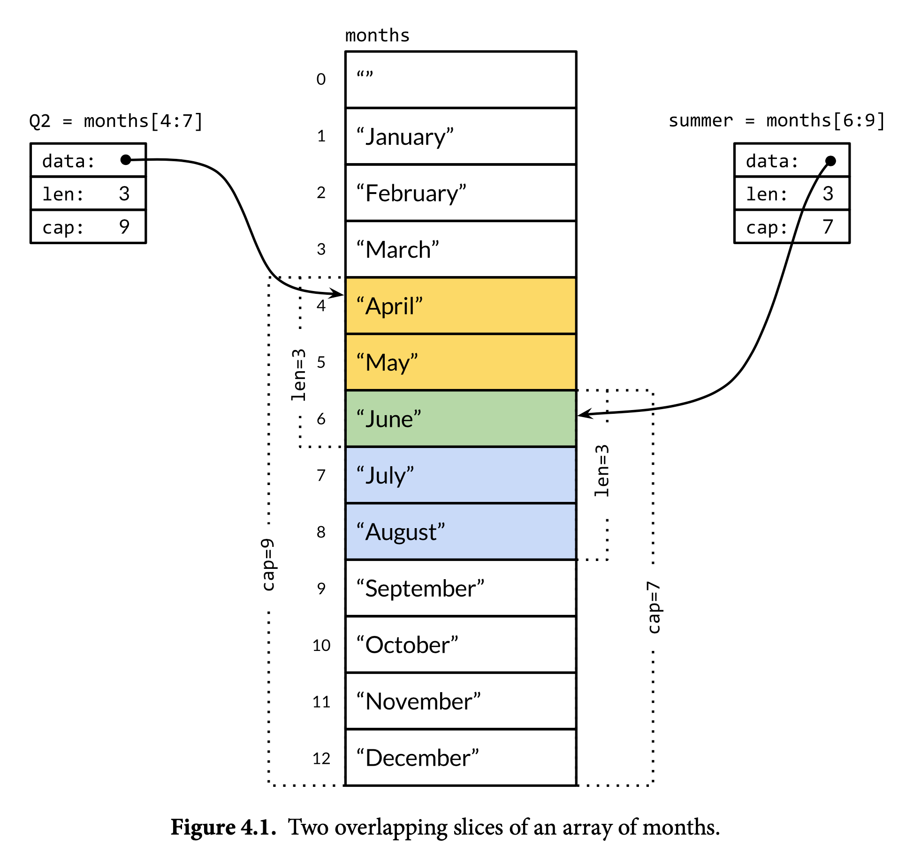


Since a slice contains a pointer to an element of an array, passing a slice to a function permits the function to modify the underlying array elements. In other words, copying a slice creates an *alias*  for the underlying array. The function reverse reverses the elements of an []int slice in place, and it may be applied to slices of any length.

```go
// reverse reverses a slice of ints in place.
     func reverse(s []int) {
         for i, j := 0, len(s)-1; i < j; i, j = i+1, j-1 {
             s[i], s[j] = s[j], s[i]
} }
```

A simple way to *rotate* a slice left by *n* elements is to apply the reverse function three times, first to the leading *n* elements, then to the remaining elements, and finally to the whole slice. (To rotate to the right, make the third call first.)

```go
s := []int{0, 1, 2, 3, 4, 5}
// Rotate s left by two positions.
reverse(s[:2])
reverse(s[2:])
reverse(s)
fmt.Println(s) // "[2 3 4 5 0 1]"
```

#### Comparison

Unlike arrays, slices are not comparable, so we cannot use == to test whether two slices contain the same elements. The standard library provides the highly optimized bytes.Equal function for comparing two slices of bytes ([]byte), but for other types of slice, we must do the comparison ourselves:

```go
func equal(x, y []string) bool {
  if len(x) != len(y) {
  	return false
  }
  for i := range x {
    if x[i] != y[i] {
      return false
    } 
  }
  return true
}
```

Given how natural this ‘‘deep’’ equality test is, and that it is no more costly at run time than the == operator for arrays of strings, it may be puzzling that slice comparisons do not also work this way. There are two reasons why deep equivalence is problematic. First, unlike array ele- ments, the elements of a slice are indirect, making it possible for a slice to contain itself. Although there are ways to deal with such cases, none is simple, efficient, and most importantly, obvious.

#### Slice of Nil

The zero value of a slice type is nil. A nil slice has no underlying array. The nil slice has length and capacity zero, but there are also non-nil slices of length and capacity zero, such as `[]int{}` or `make([]int, 3)[3:]`. As with any type that can have nil values, the nil value of a particular slice type can be written using a conversion expression such as `[]int(nil)`.

```go
var s []int    // len(s) == 0, s == nil
s = nil        // len(s) == 0, s == nil
s = []int(nil) // len(s) == 0, s == nil
s = []int{}    // len(s) == 0, s != nil
```

So, if you need to test whether a slice is empty, use `len(s) == 0`, not s == nil. Other than comparing equal to nil, a nil slice behaves like any other zero-length slice; reverse(nil) is perfectly safe, for example. Unless clearly documented to the contrary, Go functions should treat all zero-length slices the same way, whether nil or non-nil.

#### Create of Slice Using Make

The built-in function make creates a slice of a specified element type, length, and capacity. The capacity argument may be omitted, in which case the capacity equals the length.

```go
make([]T, len)
make([]T, len, cap) // same as make([]T, cap)[:len]
```

Under the hood, make creates an unnamed array variable and returns a slice of it; the array is accessible only through the returned slice. In the first form, the slice is a view of the entire array. In the second, the slice is a view of only the array’s first len elements, but its capacity includes the entire array. The additional elements are set aside for future growth.

#### The Append Function

The built-in append function appends items to slices:

```go
var runes []rune
for _, r := range "Hello, 世界" {
  runes = append(runes, r)
}
fmt.Printf("%q\n", runes) // "['H' 'e' 'l' 'l' 'o' ',' ' ' '世' '界']"
```

The append function is crucial to understanding how slices work, so let’s take a look at what is going on. Here’s a version called appendInt that is specialized for []int slices:

```go
func appendInt(x []int, y int) []int {
  var z []int
  zlen := len(x) + 1
  if zlen <= cap(x) {
    // There is room to grow.  Extend the slice.
    z = x[:zlen]
  } else {
    // There is insufficient space.  Allocate a new array.
    // Grow by doubling, for amortized linear complexity.
    zcap := zlen
    if zcap < 2*len(x) {
      zcap = 2 * len(x)
    }
    z = make([]int, zlen, zcap)
    copy(z, x) // a built-in function; copy(dest, source) return num of elements copied
  }
  z[len(x)] = y
  return z
}
```

If there is insufficient space for growth, appendInt must allocate a new array big enough to hold the result, copy the values from x into it, then append the new element y. The result z now refers to a different underlying array than the array that x refers to. It would be straightforward to copy the elements with explicit loops, but it’s easier to use the built-in function copy, which copies elements from one slice to another of the same type. Its first argument is the destination and its second is the source, resembling the order of operands in an assignment like dst = src. The slices may refer to the same underlying array; they may even overlap. Although we don’t use it here, copy returns the number of elements actually copied, which is the smaller of the two slice lengths, so there is no danger of running off the end or overwriting something out of range.

Expanding the array by doubling its size at each expansion avoids an excessive number of allocations and ensures that appending a single element takes constant time on average. This program demonstrates the effect:

```go
func main() {
  var x, y []int
  for i := 0; i < 10; i++ {
  	y = appendInt(x, i)
  	fmt.Printf("%d cap=%d\t%v\n", i, cap(y), y) 
    x = y
	} 
}
```

Each change in capacity indicates an allocation and a copy:

```go
0 cap=1 [0]
1 cap=2 [01]
2 cap=4 [012]
3 cap=4 [0123]
4 cap=8 [01234]
5 cap=8 [012345]
6 cap=8 [0123456]
7 cap=8 [01234567]
8 cap=16 [012345678]
9 cap=16 [0123456789]
```

Let’s take a closer look at the `i=3` iteration. The slice x contains the three elements [012] but has capacity 4, so there is a single element of slack at the end, and appendInt of the element 3 may proceed without reallocating. The resulting slice y has length and capacity 4, and has the same underlying array as the original slice x, as Figure 4.2 shows.

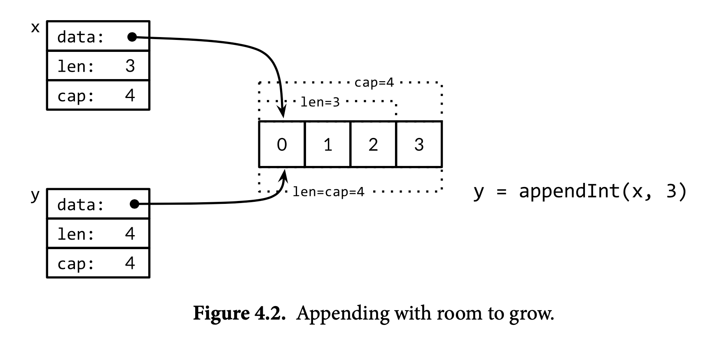

On the next iteration,` i=4`, there is no slack at all, so appendInt allocates a new array of size 8, copies the four elements [0 1 2 3] of x, and appends 4, the value of i. The resulting slice y has a length of 5 but a capacity of 8; the slack of 3 will save the next three iterations from the need to reallocate. The slices y and x are views of different arrays. This operation is depicted in Figure 4.3.

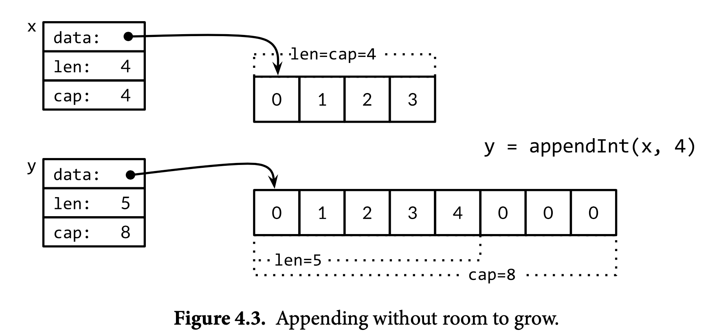

The built-in append function may use a more sophisticated growth strategy than appendInt’s simplistic one. Usually we don’t know whether a given call to append will cause a reallocation, so we can’t assume that the original slice refers to the same array as the resulting slice, nor that it refers to a different one. Similarly, we must not assume that operations on elements of the old slice will (or will not) be reflected in the new slice. As a result, it’s usual to assign the result of a call to append to the same slice variable whose value we passed to append:

```go
runes = append(runes, r)
```

#### In-Place Slice Techniques

Given a list of strings, the nonempty function returns the non-empty ones:

```go
import "fmt"
// nonempty returns a slice holding only the non-empty strings.
// The underlying array is modified during the call.
func nonempty(strings []string) []string {
  i := 0
  for _, s := range strings {
    if s != "" {
        strings[i] = s
    		i++ 
    }
  }
  return strings[:i]
}


data := []string{"one", "", "three"}
fmt.Printf("%q\n", nonempty(data)) // `["one" "three"]`
fmt.Printf("%q\n", data)           // `["one" "three" "three"]`
data = nonempty(data) 

```

Use slice as stack:

```go
stack = append(stack, v) // push v
top := stack[len(stack)-1] // top of stack
stack = stack[:len(stack)-1] // pop
```

To remove an element from the middle of a slice, preserving the order of the remaining elements, use copy to slide the higher-numbered elements down by one to fill the gap:

```go
func remove(slice []int, i int) []int {
  copy(slice[i:], slice[i+1:])
  return slice[:len(slice)-1]
}
func main() {
  s := []int{5, 6, 7, 8, 9}
  fmt.Println(remove(s, 2)) // "[5 6 8 9]"
}
```

### Maps

The hash table is one of the most ingenious and versatile of all data structures. It is an unordered collection of key/value pairs in which all the keys are distinct, and the value associated with a given key can be retrieved, updated, or removed using a constant number of key comparisons on the average, no matter how large the hash table.

In Go, a *map* is a reference to a hash table, and a map type is written map[K]V, where K and V are the types of its keys and values. All of the keys in a given map are of the same type, and all of the values are of the same type, but the keys need not be of the same type as the values. **The key type K must be comparable using ==, so that the map can test whether a given key is equal to one already within it.** Though floating-point numbers are comparable, it’s a bad idea to compare floats for equality.

The built-in function make can be used to create a map:

```go
ages := make(map[string]int) // mapping from strings to ints
```

We can also use a *map literal* to create a new map populated with some initial key/value pairs:

```go
ages := map[string]int{
  "alice":   31,
  "charlie": 34,
}
```

This is equivalent to

```go
ages := make(map[string]int)
ages["alice"] = 31
ages["charlie"] = 34
```

so an alternative expression for a new empty map is `map[string]int{}`. Map elements are accessed through the usual subscript notation:

```go
ages["alice"] = 32
fmt.Println(ages["alice"]) // "32"
```

 Removed with the built-in function delete:

```go
delete(ages, "alice") // remove element ages["alice"]
```

**All of these operations are safe even if the element isn’t in the map;** a map lookup using a key that isn’t present returns the zero value for its type, so, for instance, the following works even when "bob" is not yet a key in the map because the value of ages["bob"] will be 0.

```go
ages["bob"] = ages["bob"] + 1 // happy birthday!

ages["bob"] += 1 // or
ages["bob"]++ // or
```

But a map element is not a variable, and we cannot take its address:

```go
_ = &ages["bob"] // compile error: cannot take address of map element
```

One reason that we can’t take the address of a map element is that growing a map might cause rehashing of existing elements into new storage locations, thus potentially invalidating the address.

To enumerate all the key/value pairs in the map, we use a range-based for loop similar to those we saw for slices. Successive iterations of the loop cause the name and age variables to be set to the next key/value pair:

```go
for name, age := range ages {
  fmt.Printf("%s\t%d\n", name, age)
}
```

**The order of map iteration is unspecified, and different implementations might use a different hash function, leading to a different ordering.** This is intentional; making the sequence vary helps force programs to be robust across implementations. To enumerate the key/value pairs in order, we must sort the keys explicitly, for instance, using the Strings function from the sort package if the keys are strings. This is a common pattern:

```go
import "sort"
//var names []string version 1
names := make([]string, 0, len(ages)) //more efficient to allocate an array of the required size up front.
for name := range ages {
	names = append(names, name)
}
sort.Strings(names)
for _, name := range names {
	fmt.Printf("%s\t%d\n", name, ages[name])
}
```

In the first range loop above, we require only the keys of the ages map, so we omit the second loop variable. In the second loop, we require only the elements of the names slice, so we use the blank identifier _ to ignore the first variable, the index.

#### Map of Nil

The zero value for a map type is nil, that is, a reference to no hash table at all.

```go
var ages map[string]int
fmt.Println(ages == nil)    // "true"
fmt.Println(len(ages) == 0) // "true"
```

Most operations on maps, including lookup, delete, len, and range loops, are safe to per- form on a nil map reference, since it behaves like an empty map. But storing to a nil map causes a panic:

```go
ages["carol"] = 21 // panic: assignment to entry in nil map
```

You must allocate the map before you can store into it.


Accessing a map element by subscripting always yields a value. If the key is present in the map, you get the corresponding value; if not, you get the zero value for the element type, as we saw with ages["bob"]. For many purposes that’s fine, but sometimes you need to know whether the element was really there or not. For example, if the element type is numeric, you might have to distinguish between a nonexistent element and an element that happens to have the value zero, using a test like this:

```go
age, ok := ages["bob"]
if !ok { /* "bob" is not a key in this map; age == 0. */ }

```

You’ll often see these two statements combined, like this:

```go
if age, ok := ages["bob"]; !ok { /* ... */ }
```

#### Comparison

As with slices, maps cannot be compared to each other; the only legal comparison is with nil. To test whether two maps contain the same keys and the same associated values, we must write a loop:

```go
func equal(x, y map[string]int) bool {
  if len(x) != len(y) {
      return false
  }

	for k, xv := range x {
  	if yv, ok := y[k]; !ok || yv != xv {
    	return false
  	} 
  }
  return true
}
```

#### Map As Set

Go does not provide a set type, but since the keys of a map are distinct, a map can serve this purpose. 

```go
seen := make(map[string]bool) // a set of strings
```

#### Non-comparable Object As Key

Sometimes we need a map or set whose keys are slices, but because a map’s keys must be comparable, this cannot be expressed directly. However, it can be done in two steps. First we define a helper function k that maps each key to a string, with the property that k(x) == k(y) if and only if we consider x and y equivalent. Then we create a map whose keys are strings, applying the helper function to each key before we access the map.

We can uses `fmt.Sprintf` to convert a slice of strings into a single string that is a suitable map key, quoting each slice element with %q to record string boundaries faithfully:

```go
var m = make(map[string]int)
func k(list []string) string { return fmt.Sprintf("%q", list) }
func Add(list []string)       { m[k(list)]++ }
func Count(list []string) int { return m[k(list)] }
```

The same approach can be used for any non-comparable key type, not just slices. It’s even useful for comparable key types when you want a definition of equality other than ==, such as case-insensitive comparisons for strings. And the type of k(x) needn’t be a string; any comparable type with the desired equivalence property will do, such as integers, arrays, or structs.

#### Map of Map

The value type of a map can itself be a composite type, such as a map or slice. In the following code, the key type of graph is string and the value type is map[string]bool, representing a set of strings. Conceptually, graph maps a string to a set of related strings, its successors in a directed graph.

```go

var graph = make(map[string]map[string]bool)
func addEdge(from, to string) {
  edges := graph[from]
  if edges == nil {
    edges = make(map[string]bool)
    graph[from] = edges
  }
  edges[to] = true
}
func hasEdge(from, to string) bool {
  return graph[from][to]
}
         
```

The addEdge function shows the idiomatic way to populate a map lazily, that is, to initialize each value as its key appears for the first time. The hasEdge function shows how the zero value of a missing map entry is often put to work: even if neither from nor to is present, `graph[from][to]` will always give a meaningful result.

### Structs

A *struct* is an aggregate data type that groups together zero or more named values of arbitrary types as a single entity. Each value is called a *field*. 

Example of Employee struct:

```go
type Employee struct {
  ID        int
  Name      string
  Address   string
  DoB       time.Time
  Position  string
  Salary    int
  ManagerID int
}
var dilbert Employee
```

The individual fields of dilbert are accessed using dot notation like `dilbert.Name` and `dilbert.DoB`. Because dilbert is a variable, its fields are variables too, so we may assign to a field:

```go
 dilbert.Salary -= 5000 // demoted, for writing too few lines of code
```

or take its address and access it through a pointer:

```go
position := &dilbert.Position
*position = "Senior " + *position // promoted, for outsourcing to Elbonia
```

The dot notation also works with a pointer to a struct:

```go
var employeeOfTheMonth *Employee = &dilbert
employeeOfTheMonth.Position += " (proactive team player)" // option1

(*employeeOfTheMonth).Position += " (proactive team player)" // option2

```

Given an employee’s unique ID, the function EmployeeByID returns a pointer to an Employee struct. We can use the dot notation to access its fields:

```go
func EmployeeByID(id int) *Employee { /* ... */ }
fmt.Println(EmployeeByID(dilbert.ManagerID).Position) // "Pointy-haired boss"
id := dilbert.ID
EmployeeByID(id).Salary = 0 // fired for... no real reason
```

Fields are usually written one per line, with the field’s name preceding its type, but consecutive fields of the same type may be combined, as with Name and Address here:

```go
type Employee struct {
  ID            int
  Name, Address string
  DoB time.Time
  Position string
  Salary int
  ManagerID     int
}
```

Field order is significant to type identity. Had we also combined the declaration of the Position field (also a string), or interchanged Name and Address, we would be defining a different struct type. Typically we only combine the declarations of related fields.

The name of a struct field is exported if it begins with a capital letter; this is Go’s main access control mechanism. A struct type may contain a mixture of exported and unexported fields.

#### Struct of Struct

A named struct type S can’t declare a field of the same type S: an aggregate value cannot contain itself. (An analogous restriction applies to arrays.) But S may declare a field of the pointer type *S, which lets us create recursive data structures like linked lists and trees.

```go
type tree struct {
  value       int
  left, right *tree
}
```

#### Empty Struct

The struct type with no fields is called the *empty struct*, written struct{}. It has size zero and carries no information but may be useful nonetheless. Some Go programmers use it instead of bool as the value type of a map that represents a set, to emphasize that only the keys are significant, but the space saving is marginal and the syntax more cumbersome, so we generally avoid it.

```go
seen := make(map[string]struct{}) // set of strings
// ...
if _, ok := seen[s]; !ok {
  seen[s] = struct{}{}
  // ...first time seeing s...
}
```

#### Struct Literals

There are two forms of struct literal.

1. A value of a struct type can be written using a *struct literal* that specifies values for its fields. 

   ```go
   type Point struct{ X, Y int }
   p := Point{1, 2}
   ```

   It burdens the writer (and reader) with remembering exactly what the fields are, and it makes the code fragile should the set of fields later grow or be reordered. Accordingly, this form tends to be used only within the package that defines the struct type, or with smaller struct types for which there is an obvious field ordering convention, like `image.Point{x, y}` or `color.RGBA{red, green, blue, alpha}`

2. A struct value is initialized by listing some or all of the field names and their corresponding values:

   ```go
   type Point struct{ X, Y int }
   p := Point{Y:1, X:2}
   ```

#### Pointer For Struct

For efficiency, larger struct types are usually passed to or returned from functions indirectly using a pointer,

```go
func AwardAnnualRaise(e *Employee) {
  e.Salary = e.Salary * 105 / 100
}
```

Because structs are so commonly dealt with through pointers, it’s possible to use this shorthand notation to create and initialize a struct variable and obtain its address:

```go
// option 1
pp := &Point{1, 2} 

// option 2
pp := new(Point)
*pp = Point{1, 2} 

```

#### Comparison

If all the fields of a struct are comparable, the struct itself is comparable, so two expressions of that type may be compared using == or !=. The == operation compares the corresponding fields of the two structs in order, so the two printed expressions below are equivalent:

```go
type Point struct{ X, Y int }
p := Point{1, 2}
q := Point{2, 1}
fmt.Println(p.X == q.X && p.Y == q.Y) // "false"
fmt.Println(p == q)                   // "false"

a := Point{Y: 2, X: 1}
fmt.Println(a.X == p.X && a.Y == p.Y) //true
fmt.Println(a == p) //true
```

Comparable struct types, like other comparable types, may be used as the key type of a map.

```go
type address struct {
  hostname string
  port int
}

hits := make(map[address]int)
hits[address{"golang.org", 443}]++
```

#### Struct Embedding and Anonymous Fields

In this section, we’ll see how Go’s unusual *struct embedding* mechanism lets us use one named struct type as an *anonymous field* of another struct type, providing a convenient syntactic shortcut so that a simple dot expression like `x.f` can stand for a chain of fields like `x.d.e.f`.

```go
type Point struct {
  X, Y int
}
type Circle struct {
  Center Point
  Radius int
}
type Wheel struct {
  Circle Circle
  Spokes int
}
```

 This change makes accessing the fields of a Wheel more verbose:

```go
var w Wheel
w.Circle.Center.X = 8
w.Circle.Center.Y = 8
w.Circle.Radius = 5
w.Spokes = 20
```

Go lets us declare a field with a type but no name; such fields are called *anonymous fields*. The type of the field must be a named type or a pointer to a named type. Below, Circle and Wheel have one anonymous field each. We say that a Point is *embedded* within Circle, and a Circle is embedded within Wheel.

```go
type Circle struct {
  Point
  Radius int
}
type Wheel struct {
  Circle
  Spokes int
}
```

Thanks to embedding, we can refer to the names at the leaves of the implicit tree without giving the intervening names:

```go
var w Wheel
w.X = 8 // equivalent to w.Circle.Point.X = 8
w.Y = 8 // equivalent to w.Circle.Point.Y = 8
w.Radius = 5 // equivalent to w.Circle.Radius = 5
w.Spokes = 20
```

Unfortunately, there’s no corresponding shorthand for the struct literal syntax, so neither of these will compile:

```go
w = Wheel{8, 8, 5, 20}     // compile error: unknown fields
w = Wheel{X: 8, Y: 8, Radius: 5, Spokes: 20} // compile error: unknown fields


// instead
w = Wheel{Circle{Point{8, 8}, 5}, 20}
w = Wheel{
  Circle: Circle{
    Point:  Point{X: 8, Y: 8},
    Radius: 5,
  },
	Spokes: 20, // NOTE: trailing comma necessary here (and at Radius)
}

fmt.Printf("%#v\n", w)
// Output:
// Wheel{Circle:Circle{Point:Point{X:8, Y:8}, Radius:5}, Spokes:20}
w.X = 42
fmt.Printf("%#v\n", w)
// Output:
// Wheel{Circle:Circle{Point:Point{X:42, Y:8}, Radius:5}, Spokes:20}
```

Because ‘‘anonymous’’ fields do have implicit names, **you can’t have two anonymous fields of the same type since their names would conflict**. And because the name of the field is implicitly determined by its type, so too is the visibility of the field. In the examples above, the Point and Circle anonymous fields are exported. Had they been unexported (point and circle), we could still use the shorthand form

```go
w.X = 8 // equivalent to w.circle.point.X = 8
```

but the explicit long form shown in the comment would be forbidden outside the declaring package because circle and point would be inaccessible.

### JSON

JavaScript Object Notation (JSON) is a standard notation for sending and receiving structured information.

Go has excellent support for encoding and decoding these formats, provided by the standard library packages `encoding/json`, `encoding/xml`, `encoding/asn1`, and so on, and these packages all have similar APIs.

JSON is an encoding of JavaScript values—**strings**, **numbers**, booleans, **arrays**, and **objects**—as Unicode text.

The basic JSON types are numbers (in decimal or scientific notation), booleans (true or false), and strings, which are sequences of Unicode code points enclosed in double quotes, with backslash escapes using a similar notation to Go, though JSON’s \u*hhhh* numeric escapes denote UTF-16 codes, not runes.

These basic types may be combined recursively using JSON arrays and objects. A JSON array is an ordered sequence of values, written as a comma-separated list enclosed in square brackets; JSON arrays are used to encode Go arrays and slices. A JSON object is a mapping from strings to values, written as a sequence of name:value pairs separated by commas and sur- rounded by braces; JSON objects are used to encode Go maps (with string keys) and structs. For example:

```go
boolean true
number -273.15
string "She said \"Hello, BF\""
array  ["gold", "silver", "bronze"]
object  {"year": 1980,
         "event": "archery",
         "medals": ["gold", "silver", "bronze"]}


```

#### From Go Object To JSON

Example of Movie Object in Go:

```go
type Movie struct {
  Title  string
  Year   int  `json:"released"`
  Color  bool `json:"color,omitempty"`
  Actors []string
}
var movies = []Movie{
  {Title: "Casablanca", Year: 1942, Color: false,
   Actors: []string{"Humphrey Bogart", "Ingrid Bergman"}},

  {Title: "Cool Hand Luke", Year: 1967, Color: true,
   Actors: []string{"Paul Newman"}},
  {Title: "Bullitt", Year: 1968, Color: true,
   Actors: []string{"Steve McQueen", "Jacqueline Bisset"}},
  // ...
}
```

> _**Note**_: A *field tag* is a string of metadata associated at compile time with the field of a struct:
>
> ```go
>      Year  int  `json:"released"`
>      Color bool `json:"color,omitempty"`
> ```
>
> *omitempty* which indicates that no JSON output should be produced if the field has the zero value for its type (false, here) or is otherwise empty.

Converting a Go data structure like movies to JSON is called *marshaling*. Marshaling is done by `json.Marshal`:

```go
data, err := json.Marshal(movies)
if err != nil {
  log.Fatalf("JSON marshaling failed: %s", err)
}
fmt.Printf("%s\n", data)
```

Marshal produces a `byte slice` containing a very long string with no extraneous white space; we’ve folded the lines so it fits:

```go
[{"Title":"Casablanca","released":1942,"Actors":["Humphrey Bogart",
"Ingrid Bergman"]},{"Title":"Cool Hand Luke","released":1967,"color":
true,"Actors":["Paul Newman"]},{"Title":"Bullitt","released":1968,
"color":true,"Actors":["Steve McQueen","Jacqueline Bisset"]}]
```

For human consumption, a variant called `json.MarshalIndent` produces neatly indented output. Two additional arguments define a prefix for each line of output and a string for each level of indentation:

```go
data, err := json.MarshalIndent(movies, "", "    ")
if err != nil {
  log.Fatalf("JSON marshaling failed: %s", err)
}
fmt.Printf("%s\n", data)

```

Marshaling uses the Go struct field names as the field names for the JSON objects (through *reflection*). **Only exported fields are marshaled, which is why we chose capitalized names for all the Go field names.**

#### From JSON  To Go Object

The inverse operation to marshaling, decoding JSON and populating a Go data structure, is called *unmarshaling*, and it is done by `json.Unmarshal`.

The code below unmarshals the JSON movie data into a slice of structs whose only field is Title. **By defining suitable Go data structures in this way, we can select which parts of the JSON input to decode and which to discard**. When Unmarshal returns, it has filled in the slice with the Title information; other names in the JSON are ignored.

```go
var titles []struct{ Title string }
if err := json.Unmarshal(data, &titles); err != nil {
  log.Fatalf("JSON unmarshaling failed: %s", err)
}
fmt.Println(titles) // "[{Casablanca} {Cool Hand Luke} {Bullitt}]"
```

To illustrate, let’s query the GitHub issue tracker using its web-service interface. First we’ll define the necessary types and constants:

```go
package github
import "time"
const IssuesURL = "https://api.github.com/search/issues"

type IssuesSearchResult struct {
  TotalCount int `json:"total_count"`
  Items      []*Issue
}

type Issue struct {
  Number    int
  HTMLURL   string `json:"html_url"`
  Title     string
  State     string
  User      *User
  CreatedAt time.Time `json:"created_at"`
  Body      string    // in Markdown format
}

type User struct {
  Login   string
  HTMLURL string `json:"html_url"`
}
```

The names of all the struct fields must be capitalized even if their JSON names are not. However, the matching process that associates JSON names with Go struct names during unmarshaling is case-insensitive, so it’s only necessary to use a field tag when there’s an underscore in the JSON name but not in the Go name.


The SearchIssues function makes an HTTP request and decodes the result as JSON. Since the query terms presented by a user could contain characters like ? and & that have special meaning in a URL, we use url.QueryEscape to ensure that they are taken literally.

For variety, this example uses the *streaming* decoder, `json.Decoder`, which allows several JSON entities to be decoded in sequence from the same stream, although we don’t need that feature here. As you might expect, there is a corresponding streaming encoder called `json.Encoder`.

```go
import (
  "encoding/json"
  "fmt"
  "net/http"
  "net/url"
  "strings"
)
// SearchIssues queries the GitHub issue tracker.
func SearchIssues(terms []string) (*IssuesSearchResult, error) {
  q := url.QueryEscape(strings.Join(terms, " "))
  resp, err := http.Get(IssuesURL + "?q=" + q)
  if err != nil {
    return nil, err
  }
  // We must close resp.Body on all execution paths.
  // (Chapter 5 presents 'defer', which makes this simpler.)
  if resp.StatusCode != http.StatusOK {
    resp.Body.Close()
    return nil, fmt.Errorf("search query failed: %s", resp.Status)
  }
  var result IssuesSearchResult
  if err := json.NewDecoder(resp.Body).Decode(&result); err != nil {
    resp.Body.Close()
    return nil, err
  }
  resp.Body.Close()
  return &result, nil
}
```

The call to Decode populates the variable result. There are various ways we can format its value nicely. The simplest, demonstrated by the issues command below, is as a text table with fixed-width columns.

```go
package main
import (
  "fmt"
  "log"
  "os"
  "gopl.io/ch4/github"
)
func main() {
  result, err := github.SearchIssues(os.Args[1:])
  if err != nil {
    log.Fatal(err)
  }
  fmt.Printf("%d issues:\n", result.TotalCount)
  for _, item := range result.Items {
    fmt.Printf("#%-5d %9.9s %.55s\n",
               item.Number, item.User.Login, item.Title)
  } 
}

```

### Text and HTML Templates

#### Text Templates

Sometimes formatting must be more elaborate, and it’s desirable to separate the format from the code more completely. This can be done with the `text/template` and `html/template` packages, which provide a mechanism for substituting the values of variables into a text or HTML template.

A template is a string or file containing one or more portions enclosed in double braces, {{...}}, called *actions*. Most of the string is printed literally, but the actions trigger other behaviors. Each action contains an expression in the template language, a simple but powerful notation for printing values, selecting struct fields, calling functions and methods, expressing control flow such as if-else statements and range loops, and instantiating other templates. A simple template string is shown below:

```go
const templ = `{{.TotalCount}} issues:
     {{range .Items}}----------------------------------------
     Number: {{.Number}}
     User:   {{.User.Login}}
     Title:  {{.Title | printf "%.64s"}}
     Age:    {{.CreatedAt | daysAgo}} days
     {{end}}`

```

This template first prints the number of matching issues, then prints the number, user, title, and age in days of each one. Within an action, there is a notion of the current value, referred to as ‘‘dot’’ and written as `.` a period. The dot initially refers to the template’s parameter, which will be a *github.IssuesSearchResult* in this example. The `{{.TotalCount}}` action expands to the value of the TotalCount field, printed in the usual way. The `{{range .Items}}` and `{{end}}` actions create a loop, so the text between them is expanded multiple times, with dot bound to successive elements of Items.

Within an action, the `|` notation makes the result of one operation the argument of another, analogous to a Unix shell pipeline. In the case of Title, the second operation is the printf function, which is a built-in synonym for `fmt.Sprintf` in all templates. For Age, the second operation is the following function, daysAgo, which converts the CreatedAt field into an elapsed time, using time.Since:

```go
func daysAgo(t time.Time) int {
  return int(time.Since(t).Hours() / 24)
}
```

##### Producing Template

Producing output with a template is a two-step process. First we must parse the template into a suitable internal representation, and then execute it on specific inputs. Parsing need be done only once. 

The code below creates and parses the template *templ* defined above. Note the chaining of method calls: *template.New* creates and returns a template; *Funcs* adds *daysAgo* to the set of functions accessible within this template, then returns that template; finally, Parse is called on the result.

```go
report, err := template.New("report").
		Funcs(template.FuncMap{"daysAgo": daysAgo}).
		Parse(templ)
if err != nil {
  log.Fatal(err)
}
```

Once the template has been created, augmented with `daysAgo`, parsed, and checked, we can execute it using a *github.IssuesSearchResult* as the data source and os.Stdout as the destination:

```go
var report = template.Must(template.New("issuelist").
         Funcs(template.FuncMap{"daysAgo": daysAgo}).
         Parse(templ))
func main() {
  result, err := github.SearchIssues(os.Args[1:])
  if err != nil {
    log.Fatal(err)
  }
  if err := report.Execute(os.Stdout, result); err != nil {
    log.Fatal(err)
  } 
}
```

The program prints a plain text report like this:

```go
$ go build gopl.io/ch4/issuesreport
$ ./issuesreport repo:golang/go is:open json decoder
13 issues:
----------------------------------------
Number: 5680
User:   eaigner
Title:  encoding/json: set key converter on en/decoder
Age:    750 days
----------------------------------------
Number: 6050
User:   gopherbot
Title:  encoding/json: provide tokenizer
Age:    695 days
----------------------------------------
...

```

#### HTML Templates

The `html/template`package. It uses the same API and expression language as `text/template` but adds features for automatic and context-appropriate escaping of strings appearing within HTML, JavaScript, CSS, or URLs. These features can help avoid a perennial security problem of HTML generation, an *injection attack*, in which an adversary crafts a string value like the title of an issue to include malicious code that, when improperly escaped by a template, gives them control over the page.

The template below prints the list of issues as an HTML table. Note the different import:

```go
import "html/template"
var issueList = template.Must(template.New("issuelist").Parse(`
     <h1>{{.TotalCount}} issues</h1>
     <table>
     <tr style='text-align: left'>
       <th>#</th>
       <th>State</th>
       <th>User</th>
       <th>Title</th>
     </tr>
     {{range .Items}}
     <tr>
       <td><a href='{{.HTMLURL}}'>{{.Number}}</a></td>
       <td>{{.State}}</td>
       <td><a href='{{.User.HTMLURL}}'>{{.User.Login}}</a></td>
       <td><a href='{{.HTMLURL}}'>{{.Title}}</a></td>
     </tr>
     {{end}}
     </table>
     `))
```

The command below executes the new template on the results of a slightly different query:

```go
$ go build gopl.io/ch4/issueshtml
$ ./issueshtml repo:golang/go commenter:gopherbot json encoder >issues.html
```

##### Auto Escaping

If we used the `text/template` package by mistake, the four-character string "\&lt;" would have been rendered as a less-than character '<', and the string "<link>" would have become a link element, changing the structure of the HTML document and perhaps compromising its security.

We can suppress this *auto-escaping* behavior for fields that contain trusted HTML data by using the named string type template.HTML instead of string. Similar named types exist for trusted JavaScript, CSS, and URLs. The program below demonstrates the principle by using two fields with the same value but different types: A is a `string` and B is a `template.HTML`.

```go
func main() {
  const templ = `<p>A: {{.A}}</p><p>B: {{.B}}</p>`
  t := template.Must(template.New("escape").Parse(templ))
  var data struct {
    A string        // untrusted plain text
    B template.HTML // trusted HTML
  }
  data.A = "<b>Hello!</b>"
  data.B = "<b>Hello!</b>"
  if err := t.Execute(os.Stdout, data); err != nil {
    log.Fatal(err)
  } }
```

Figure 4.6 shows the template’s output as it appears in a browser. We can see that A was subject to escaping but B was not.

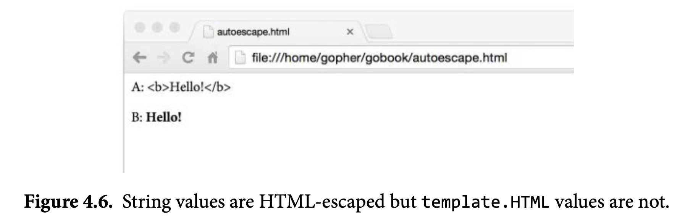

## Function

A function lets us wrap up a sequence of statements as a unit that can be called from elsewhere in a program, perhaps multiple times.

### Function Declarations

A function declaration has a name, a list of parameters, an optional list of results, and a body:

```go
// under scope rule, the parameters are only available inside the function (local)
func name(parameter-list) (result-list) { 
  body
}
```

You may occasionally encounter a function declaration without a body, indicating that the function is implemented in a language other than Go. Such a declaration defines the function signature.

```go
package math
func Sin(x float64) float64 // implemented in assembly language
```


### Function Signature

The type of a function is sometimes called its *signature*. Two functions have the same type or signature if they have the same sequence of parameter types and the same sequence of result types. The names of parameters and results don’t affect the type, nor does whether or not they were declared using the factored form.

### Parameters

Parameters are local variables within the body of the function, with their initial values set to the arguments supplied by the caller. Function parameters and named results are variables in the same *lexical block* as the function’s outermost local variables.

### Pass By Value

Arguments are passed *by value*, so the function receives a copy of each argument; modifications to the copy do not affect the caller. However, if the argument contains some kind of reference, like a **pointer**, **slice**, **map**, **function**, or **channel**, then the caller may be affected by any modifications the function makes to variables *indirectly* referred to by the argument.

### Recursion

Functions may be *recursive*, that is, they may call themselves, either directly or indirectly.

The example program below uses a non-standard package, golang.org/x/net/html, which provides an HTML parser. The `golang.org/x/...` repositories hold packages designed and maintained by the Go team for applications such as networking, internationalized text processing, mobile platforms, image manipulation, cryptography, and developer tools.

The function html.Parse reads a sequence of bytes, parses them, and returns the root of the HTML document tree, which is an html.Node. HTML has several kinds of nodes—text, comments, and so on—but here we are concerned only with *element* nodes of the form \<name key='value'\>.

```go
package html
type Node struct {
  Type                    NodeType
  Data                    string
  Attr                    []Attribute
  FirstChild, NextSibling *Node
}
type NodeType int32
const (
  ErrorNode NodeType = iota
  TextNode
  DocumentNode
  ElementNode
  CommentNode
  DoctypeNode
)

type Attribute struct {
  Key, Val string
}
func Parse(r io.Reader) (*Node, error)
```

The main function parses the standard input as HTML, extracts the links using a recursive visit function, and prints each discovered link:

```go
package main
import (
  "fmt"
  "os"
  "golang.org/x/net/html"
)
func main() {
  doc, err := html.Parse(os.Stdin)
  if err != nil {
    fmt.Fprintf(os.Stderr, "findlinks1: %v\n", err)
    os.Exit(1)
  }
  for _, link := range visit(nil, doc) {
    fmt.Println(link)
  } 
}
```

The visit function traverses an HTML node tree, extracts the link from the href attribute of each *anchor* element \<a href='…'\>, appends the links to a slice of strings, and returns the resulting slice:

```go
// visit appends to links each link found in n and returns the result.
func visit(links []string, n *html.Node) []string {
  if n.Type == html.ElementNode && n.Data == "a" {
    for _, a := range n.Attr {
      if a.Key == "href" {
        links = append(links, a.Val)
      } 
    }
  }
  for c := n.FirstChild; c != nil; c = c.NextSibling {
    links = visit(links, c)
  }
  return links
}
```

Example output of Go home page:

```go
$ go build gopl.io/ch1/fetch
$ go build gopl.io/ch5/findlinks1
$ ./fetch https://golang.org | ./findlinks1
#
/doc/
/pkg/
/help/
/blog/
http://play.golang.org/
//tour.golang.org/
https://golang.org/dl/
//blog.golang.org/
/LICENSE
/doc/tos.html
http://www.google.com/intl/en/policies/privacy/
```

#### Call Stack In GO

Many programming language implementations use a fixed-size function call stack; sizes from 64KB to 2MB are typical. Fixed-size stacks impose a limit on the depth of recursion, so one must be careful to avoid a *stack overflow* when traversing large data structures recursively; fixed-size stacks may even pose a security risk. In contrast, typical Go implementations use variable-size stacks that start small and grow as needed up to a limit on the order of a gigabyte. This lets us use recursion safely and without worrying about overflow.

### Return Values

You can return single or list of return values, below is an example of returning two values

```go
func findLinks(url string) ([]string, error) {
  resp, err := http.Get(url)
  if err != nil {
    return nil, err
  }
  if resp.StatusCode != http.StatusOK {
    resp.Body.Close()
    return nil, fmt.Errorf("getting %s: %s", url, resp.Status)
  }
  doc, err := html.Parse(resp.Body)
  resp.Body.Close()
  if err != nil {
    return nil, fmt.Errorf("parsing %s as HTML: %v", url, err)
  }
  return visit(nil, doc), nil
}
```

The result of calling a multi-valued function is a tuple of values. The caller of such a function must explicitly assign the values to variables if any of them are to be used:

```go
links, err := findLinks(url)

// ignore err
links, _ := findLinks(url) // errors ignored

//A multi-valued call may appear as the sole argument when calling a function of multiple parameters. 
log.Println(findLinks(url))
```

#### Named Results

In a function with named results, the operands of a return statement may be omitted. This is called a *bare return*.

```go

// CountWordsAndImages does an HTTP GET request for the HTML
// document url and returns the number of words and images in it.
func CountWordsAndImages(url string) (words, images int, err error) {
  resp, err := http.Get(url)
  if err != nil {
    // is equivalent to return words, images, err
    return
  }

  doc, err := html.Parse(resp.Body)
  resp.Body.Close()
  if err != nil {
    err = fmt.Errorf("parsing HTML: %s", err)
    return
  }
  words, images = countWordsAndImages(doc)
  return
}
func countWordsAndImages(n *html.Node) (words, images int) { /* ... */ }

```

### Function As Value

Functions are *first-class values* in Go: like other values, function values have types, and they may be assigned to variables or passed to or returned from functions. A function value may be called like any other function. For example:

```go
func square(n int) int     { return n * n }
func negative(n int) int   { return -n }
func product(m, n int) int { return m * n }
f := square
fmt.Println(f(3)) // "9"
f = negative
fmt.Println(f(3))     // "-3"
fmt.Printf("%T\n", f) // "func(int) int"
f = product // compile error: can't assign func(int, int) int to func(int) int


// The zero value of a function type is nil. Calling a nil function value causes a panic:
var f func(int) int
f(3) // panic: call of nil function
```

For instance, strings.Map applies a function to each character of a string, joining the results to make another string.

```go
func add1(r rune) rune { return r + 1 }
fmt.Println(strings.Map(add1, "HAL-9000")) // "IBM.:111"
fmt.Println(strings.Map(add1, "VMS"))      // "WNT"
fmt.Println(strings.Map(add1, "Admix"))    // "Benjy"
```

#### Comparison

Function values may be compared with nil:

```go
var f func(int) int
if f != nil {
  f(3)
}
```

but they are not comparable, so they may not be compared against each other or used as keys in a map.

### Anonymous Functions

**Named functions can be declared only at the package level**, but we can use a *function literal* to denote a function value within any expression. A function literal is written like a function declaration, but without a name following the func keyword. It is an expression, and its value is called an *anonymous function*.

The earlier call to strings.Map can be rewritten as

```go
strings.Map(func(r rune) rune { return r + 1 }, "HAL-9000")
```

More importantly, functions defined in this way have access to the entire lexical environment, so the inner function can refer to variables from the enclosing function, as this example shows:

```go
// squares returns a function that returns
// the next square number each time it is called.
func squares() func() int {
  var x int
  return func() int {
    x++
    return x * x
  } 
}
func main() {
  f := squares()
  fmt.Println(f()) // "1"
  fmt.Println(f()) // "4"
  fmt.Println(f()) // "9"
  fmt.Println(f()) // "16"
}
```

Consider the problem of computing a sequence of computer science courses that satisfies the prerequisite requirements of each one. The prerequisites are given in the prereqs table below, which is a mapping from each course to the list of courses that must be completed before it.

```go
var prereqs = map[string][]string{
  "algorithms": {"data structures"},
  "calculus":   {"linear algebra"},
  "compilers": {
    "data structures",
    "formal languages",
    "computer organization",
  },

  "data structures":               {"discrete math"},
  "databases":                       {"data structures"},
  "discrete math":                 {"intro to programming"},
  "formal languages":        {"discrete math"},
  "networks":                       {"operating systems"},
  "operating systems":      {"data structures", "computer organization"},
  "programming languages": {"data structures", "computer organization"},
}
```

This kind of problem is known as `topological sorting`. Conceptually, the prerequisite information forms a directed graph with a node for each course and edges from each course to the courses that it depends on. The graph is acyclic: there is no path from a course that leads back to itself. We can compute a valid sequence using depth-first search through the graph with the code below:

```go

func main() {
  for i, course := range topoSort(prereqs) {
    fmt.Printf("%d:\t%s\n", i+1, course)
  } 
}
func topoSort(m map[string][]string) []string {
  var order []string
  seen := make(map[string]bool)
  var visitAll func(items []string)

  visitAll = func(items []string) {
    for _, item := range items {
    }
    if !seen[item] {
      seen[item] = true
      visitAll(m[item])
      order = append(order, item)
    } }
  var keys []string
  for key := range m {
    keys = append(keys, key)
  }
  sort.Strings(keys)
  visitAll(keys)
  return order
}
```

When an anonymous function requires recursion, as in this example, we must first declare a variable, and then assign the anonymous function to that variable. Had these two steps been combined in the declaration, the function literal would not be within the scope of the variable visitAll so it would have no way to call itself recursively:

```go
visitAll := func(items []string) {
  // ...
  visitAll(m[item]) // compile error: undefined: visitAll
  // ...
}
```

### Caveat: Capturing Iteration Variables

Consider a program that must create a set of directories and later remove them. We can use a slice of function values to hold the clean-up operations. (For brevity, we have omitted all error handling in this example.)

```go
var rmdirs []func()
for _, d := range tempDirs() {
  dir := d               // NOTE: necessary!
  os.MkdirAll(dir, 0755) // creates parent directories too
  rmdirs = append(rmdirs, func() {
    os.RemoveAll(dir)
  }) 
}
// ...do some work...
for _, rmdir := range rmdirs {
  rmdir() // clean up
}
```

Why `dir := d` is necessary ? The reason is a consequence of the scope rules for loop variables. In the program immediately above, the for loop introduces a new lexical block in which the variable *d* is declared. **All function values created by this loop ‘‘capture’’ and share the same variable—an addressable storage location, not its value at that particular moment.** The value of `d` is updated in successive iterations, so by the time the cleanup functions are called, the `d` variable has been updated several times by the now-completed for loop. Thus `d` holds the value from the final iteration, and consequently all calls to os.RemoveAll will attempt to remove the same directory.

The problem of iteration variable capture is most often encountered when using the `go` statement or with `defer`since both may delay the execution of a function value until after the loop has finished. But the problem is not inherent to go or defer.

### Variadic Functions

A *variadic function* is one that can be called with varying numbers of arguments. The most familiar examples are `fmt.Printf` and its variants. `Printf` requires one fixed argument at the beginning, then accepts any number of subsequent arguments.

```go
func Printf(format string, a ...interface{}) (n int, err error) {
	return Fprintf(os.Stdout, format, a...)
}
```

> _**Note**_: The *interface{}* type means that this function can accept any values at all for its final arguments.

Implicitly, the caller allocates an array, copies the arguments into it, and passes a slice of the entire array to the function. Invoking a variadic function when the arguments are already in a slice: place an ellipsis after the final argument.

```go
values := []int{1, 2, 3, 4}
fmt.Println(sum(values...)) // "10"
```

Although the` …int` parameter behaves like a slice within the function body, the type of a variadic function is distinct from the type of a function with an ordinary slice parameter.

```go
func f(...int) {}
func g([]int)  {}
fmt.Printf("%T\n", f) // "func(...int)"
fmt.Printf("%T\n", g) // "func([]int)"
```

### Closure

It is possible to create functions inside of functions:

```go
func main() {
  add := func(x, y int) int {
    return x + y
  }
  fmt.Println(add(1,1))
}
```

One way to use closure is by writing a function which returns another function which can generate a sequence of numbers. For example here's how we might generate all the even numbers:

```go
func makeEvenGenerator() func() uint {
  i := uint(0)
  return func() (ret uint) {
    ret = i
    i += 2
    return
  }
}
func main() {
  nextEven := makeEvenGenerator()
  fmt.Println(nextEven()) // 0
  fmt.Println(nextEven()) // 2
  fmt.Println(nextEven()) // 4
}
```

`makeEvenGenerator` returns a function which generates even numbers. Each time it's called it adds 2 to the local `i` variable which – unlike normal local variables – persists between calls.

### Defer

Go has a special statement called `defer` which schedules a function call to be run after the function that contains the `defer` statement has finished, whether normally, by executing a return statement or falling off the end, or abnormally, by panicking. Any number of calls may be deferred; they are executed in the *reverse of the order* in which they were deferred. Consider the following example:

```go
package main

import "fmt"

func first() {
	fmt.Printf("1st\t")
}
func second() {
	fmt.Printf("2nd\t")
}
func third() {
	fmt.Printf("3rd\t")
}
func main() {
	defer second() // this function will only run after
	defer third()
	first()
}

//1st	3rd	2nd	
```

The right place for a `defer` statement that releases a resource is immediately after the resource has been successfully acquired.

```go
f, _ := os.Open(filename)
defer f.Close() // immediately after the resource has been successfully acquired
// ... other logic
```

#### Constructing An Event Flow

The defer statement can also be used to pair ‘‘on entry’’ and ‘‘on exit’’ actions when debugging a complex function. Consider the bigSlowOperation function below:

```go
func bigSlowOperation() {
  defer trace("bigSlowOperation")() // don't forget the extra parentheses
  // ...lots of work...
  time.Sleep(10 * time.Second) // simulate slow operation by sleeping
}
func trace(msg string) func() {
  start := time.Now()
  log.Printf("enter %s", msg)
  return func() { log.Printf("exit %s (%s)", msg, time.Since(start)) }
}
```

Each time bigSlowOperation is called, it logs its entry and exit and the elapsed time between them. 

```go

$ go build gopl.io/ch5/trace
$ ./trace
2015/11/18 09:53:26 enter bigSlowOperation
2015/11/18 09:53:36 exit bigSlowOperation (10.000589217s)
```

#### Debug The Return Value of Function

Deferred functions run *after* return statements have updated the function’s result variables. Because an anonymous function can access its enclosing function’s variables, including named results, a deferred anonymous function can observe the function’s results.

```go
func double(x int) (result int) {
  defer func() { fmt.Printf("double(%d) = %d\n", x, result) }()
  return x + x
}
_ = double(4)
// Output:
// "double(4) = 8"
```

#### Defer In Loop

Because deferred functions aren’t executed until the very end of a function’s execution, a defer statement in a loop deserves extra scrutiny. The code below could run out of file descriptors since no file will be closed until all files have been processed:

```go
for _, filename := range filenames {
  f, err := os.Open(filename)
  if err != nil {
    return err
  }
  defer f.Close() // NOTE: risky; could run out of file descriptors
  // ...process f...
}
```

One solution is to move the loop body, including the `defer` statement, into another function that is called on each iteration.

```go
for _, filename := range filenames {
  if err := doFile(filename); err != nil {
    return err
  } 
}
func doFile(filename string) error {
  f, err := os.Open(filename)
  if err != nil {
    return err
  }
  defer f.Close()
  // ...process f...
}
```

#### F.Close Without Defer

The example below is an improved fetch program showing below:

```go
// Fetch downloads the URL and returns the
// name and length of the local file.
func fetch(url string) (filename string, n int64, err error) {
  resp, err := http.Get(url)
  if err != nil {
    return "", 0, err
  }
  defer resp.Body.Close()
  
  local := path.Base(resp.Request.URL.Path)
  if local == "/" {
    local = "index.html"
  }
  f, err := os.Create(local)
  if err != nil {
    return "", 0, err
  }
  n, err = io.Copy(f, resp.Body)
  // Close file, but prefer error from Copy, if any.
  if closeErr := f.Close(); err == nil {
    err = closeErr
  }
  return local, n, err
}
```

The deferred call to `resp.Body.Close` should be familiar by now. It’s tempting to use a second deferred call, to `f.Close`, to close the local file, but this would be subtly wrong because os.Create opens a file for writing, creating it as needed. On many file systems, notably NFS, write errors are not reported immediately but may be postponed until the file is closed. Failure to check the result of the close operation could cause serious data loss to go unnoticed. However, if both `io.Copy` and `f.Close` fail, we should prefer to report the error from `io.Copy` since it occurred first and is more likely to tell us the root cause.

### Panic & Recover

#### Panic

When the Go runtime detects these mistakes, it *panics*. During a typical panic, normal execution stops, all deferred function calls in that goroutine are executed, and the program crashes with a log message. This log message includes the *panic value*, which is usually an error message of some sort, and, for each goroutine, a *stack trace* showing the stack of function calls that were active at the time of the panic. This log message often has enough information to diagnose the root cause of the problem without running the program again, so it should always be included in a bug report about a panicking program.

Not all panics come from the runtime. The built-in panic function may be called directly; it accepts any value as an argument. A panic is often the best thing to do when some ‘‘impossible’’ situation happens, for instance, execution reaches a case that logically can’t happen:

```go
switch s := suit(drawCard()); s {
  case "Spades":   // ...
case "Hearts":   // ...
case "Diamonds": // ...
case "Clubs":    // ...
default:
  panic(fmt.Sprintf("invalid suit %q", s)) // Joker?
}
```

Since a panic causes the program to crash, it is gener- ally used for grave errors, such as a logical inconsistency in the program; diligent program- mers consider any crash to be proof of a bug in their code. In a robust program, ‘‘expected’’ errors, the kind that arise from incorrect input, misconfiguration, or failing I/O, should be handled gracefully; they are best dealt with using error values.

For diagnostic purposes, the runtime package lets the programmer dump the stack using the same machinery. By deferring a call to `printStack`in main,

```go
func main() {
  defer printStack()
  f(3)
}
func printStack() {
  var buf [4096]byte
  n := runtime.Stack(buf[:], false)
  os.Stdout.Write(buf[:n])
}

```

#### Recover

Earlier we created a function that called the `panic` function to cause a run time error. We can handle a run-time panic with the built-in `recover` function. `recover` stops the panic and returns the value that was passed to the caller.

```go
// a fancier version might include the entire call stack using runtime.Stack.
func Parse(input string) (s *Syntax, err error) {
  defer func() {
    if p := recover(); p != nil {
      err = fmt.Errorf("internal error: %v", p)
    }
  }()
}
// ...parser...
```

Recovering from a panic within the same package can help simplify the handling of complex or unexpected errors, but as a general rule, you should not attempt to recover from another package’s panic. Public APIs should report failures as errors. Similarly, you should not recover from a panic that may pass through a function you do not maintain, such as a caller- provided callback, since you cannot reason about its safety.

Recovering from a panic mat risk leaking resources or leaving the failed handler in an unspecified state that could lead to other problems. It’s safest to recover selectively if at all.

```go
// soleTitle returns the text of the first non-empty title element
// in doc, and an error if there was not exactly one.
func soleTitle(doc *html.Node) (title string, err error) {
  type bailout struct{}

  defer func() {
    switch p := recover(); p {
      case nil:
      // no panic
      case bailout{}:
      // "expected" panic
      err = fmt.Errorf("multiple title elements")
      default:
      panic(p) // unexpected panic; carry on panicking
    } 
  }()
  // Bail out of recursion if we find more than one non-empty title.
  forEachNode(doc, func(n *html.Node) {
    if n.Type == html.ElementNode && n.Data == "title" && n.FirstChild != nil {
      if title != "" {
        panic(bailout{}) // multiple title elements
      } 
      title = n.FirstChild.Data
    }
  }, nil)

  if title == "" {
    return "", fmt.Errorf("no title element")
  }
  return title, nil
}
```

## Methods

A method is declared with a variant of the ordinary function declaration in which an extra parameter appears before the function name. The parameter attaches the function to the type of that parameter.

### Method Declarations

```go
package main

import (
	"fmt"
	"math"
)

type Point struct{ X, Y float64 }

// traditional function
func Distance(p, q Point) float64 {
  return math.Hypot(q.X-p.X, q.Y-p.Y)
}

// same thing, but as a method of the Point type
func (p Point) Distance(q Point) float64 {
	return math.Hypot(q.X-p.X, q.Y-p.Y)
}
func main() {
	p := Point{1, 2}
	q := Point{4, 6}
	fmt.Println(Distance(p, q)) // "5", function call
	fmt.Println(p.Distance(q))  // "5", method call
}
```

The extra parameter p is called the method’s *receiver*, a legacy from early object-oriented languages that described calling a method as ‘‘sending a message to an object.’’

A common choice for choosing *receiver* name is the first letter of the type name, like p for Point.

> _**Note**_: There’s no conflict between the two declarations of functions called Distance above. The first declares a package-level function. The second declares a method of the type Point, so its name is Point.Distance.

The expression p.Distance is called a *selector*, because it selects the appropriate Distance method for the receiver p of type Point. Selectors are also used to select fields of struct types, as in p.X. Since methods and fields inhabit the same name space, declaring a method X on the struct type Point would be ambiguous and the compiler will reject it.


It is often convenient to define additional behaviors for simple types such as numbers, strings, slices, maps, and sometimes even functions. Methods may be declared on any named type defined in the same package, so long as its underlying type is neither a pointer nor an interface.

### Methods with a Pointer Receiver

Because calling a function makes a copy of each argument value, if a function needs to update a variable, or if an argument is so large that we wish to avoid copying it, we must pass the address of the variable using a pointer. The same goes for methods that need to update the receiver variable: we attach them to the pointer type, such as `*Point`.

```go
func (p *Point) ScaleBy(factor float64) {
  p.X *= factor
  p.Y *= factor
}
```

The name of this method is `(*Point).ScaleBy`. The parentheses are necessary; without them, the expression would be parsed as `*(Point.ScaleBy)`.

The `(*Point).ScaleBy` method can be called by providing a `*Point` receiver, like this:

```go
r := &Point{1, 2}
r.ScaleBy(2)
fmt.Println(*r) // "{2, 4}"
```

or this:

```go
p := Point{1, 2}
pptr := &p
pptr.ScaleBy(2)
fmt.Println(p) // "{2, 4}"
```

or this:

```go
p := Point{1, 2}
(&p).ScaleBy(2)
fmt.Println(p) // "{2, 4}"
```

But the last two cases are ungainly. Fortunately, the language helps us here. If the receiver p is a *variable* of type Point but the method requires a `*Point` receiver, we can use this shorthand:

```go
p.ScaleBy(2)
```

and the compiler will perform an implicit *&p* on the variable. This works only for variables, including struct fields like *p.X* and array or slice elements like *perim[0]*. We cannot call a `*Point` method on a non-addressable Point receiver, because there’s no way to obtain the

address of a temporary value.

```go
Point{1, 2}.ScaleBy(2) // compile error: can't take address of Point literal
```

But we *can* call a Point method like *Point.Distance* with a `*Point` receiver, because there is a way to obtain the value from the address: just load the value pointed to by the receiver. The compiler inserts an implicit `*` operation for us. These two function calls are equivalent:

```go
pptr.Distance(q)
(*pptr).Distance(q)
```

Let’s summarize these three cases again, since they are a frequent point of confusion. In every valid method call expression, exactly one of these three statements is true.

Either the receiver argument has the same type as the receiver parameter, for example both have type T or both have type *T:

```go
Point{1, 2}.Distance(q) //  Point
pptr.ScaleBy(2)         // *Point
```

Or the receiver argument is a *variable* of type T and the receiver parameter has type *T. The compiler implicitly takes the address of the variable:

```go
p.ScaleBy(2) // implicit (&p)
```

Or the receiver argument has type *T and the receiver parameter has type T. The compiler implicitly dereferences the receiver, in other words, loads the value:

```go
pptr.Distance(q) // implicit (*pptr)
```

If all the methods of a named type T have a receiver type of T itself (not *T), it is safe to copy instances of that type; calling any of its methods necessarily makes a copy. For example, *time.Duration* values are liberally copied, including as arguments to functions. But if any method has a pointer receiver, you should avoid copying instances of T because doing so may violate internal invariants. For example, copying an instance of bytes.Buffer would cause the original and the copy to alias the same underlying array of bytes. Subsequent method calls would have unpredictable effects.

### Composing Types by Struct Embedding

Consider the type ColoredPoint:

```go
import "image/color"
type Point struct{ X, Y float64 }
type ColoredPoint struct {
  Point
  Color color.RGBA
}
```

We could have defined `ColoredPoint` as a struct of three fields, but instead we *embedded* a `Point` to provide the `X` and `Y` fields. If we want, we can select the fields of `ColoredPoint` that were contributed by the embedded Point without mentioning Point:

```go
var cp ColoredPoint
cp.X = 1
fmt.Println(cp.Point.X) // "1"
cp.Point.Y = 2
fmt.Println(cp.Y) // "2"
```

A similar mechanism applies to the *methods* of Point. We can call methods of the embedded Point field using a receiver of type `ColoredPoint`, even though `ColoredPoint` has no declared methods:

```go
red := color.RGBA{255, 0, 0, 255}
blue := color.RGBA{0, 0, 255, 255}
var p = ColoredPoint{Point{1, 1}, red}
var q = ColoredPoint{Point{5, 4}, blue}
fmt.Println(p.Distance(q.Point)) // "5"
p.ScaleBy(2)
q.ScaleBy(2)
fmt.Println(p.Distance(q.Point)) // "10"
```

The methods of `Point` have been *promoted* to `ColoredPoint`. In this way, embedding allows complex types with many methods to be built up by the *composition* of several fields, each providing a few methods.

A `ColoredPoint` is not a `Point`, but it ‘‘has a’’ `Point`, and it has two additional methods `Distance` and `ScaleBy` promoted from `Point`. If you prefer to think in terms of implementation, the embedded field instructs the compiler to generate additional wrapper methods that delegate to the declared methods, equivalent to these:

```go
func (p ColoredPoint) Distance(q Point) float64 {
  return p.Point.Distance(q)
}
func (p *ColoredPoint) ScaleBy(factor float64) {
  p.Point.ScaleBy(factor)
}
```

The type of an anonymous field may be a *pointer* to a named type, in which case fields and methods are promoted indirectly from the pointed-to object. Adding another level of indirection lets us share common structures and vary the relationships between objects dynamically. The declaration of `ColoredPoint` below embeds a `*Point`:

```go
type ColoredPoint struct {
  *Point
  Color color.RGBA
}
p := ColoredPoint{&Point{1, 1}, red}
q := ColoredPoint{&Point{5, 4}, blue}
fmt.Println(p.Distance(*q.Point)) // "5"
q.Point = p.Point                 // p and q now share the same Point
p.ScaleBy(2)
fmt.Println(*p.Point, *q.Point) // "{2 2} {2 2}"
```

A struct type may have more than one anonymous field. Had we declared `ColoredPoint` as

```go
type ColoredPoint struct {
  Point
  color.RGBA
}
```

then a value of this type would have all the methods of Point, all the methods of `RGBA`, and any additional methods declared on `ColoredPoint` directly. When the compiler resolves a selector such as `p.ScaleBy` to a method, it first looks for a directly declared method named `ScaleBy`, then for methods promoted once from `ColoredPoint’s` embedded fields, then for methods promoted twice from embedded fields within `Point` and `RGBA`, and so on. The compiler reports an error if the selector was ambiguous because two methods were promoted from the same rank.

Methods can be declared only on named types (like `Point`) and pointers to them (`Point`), but thanks to embedding, it’s possible and sometimes useful for *unnamed* struct types to have methods too.

```go
var cache = struct {
  sync.Mutex
  mapping map[string]string 
}{
  mapping: make(map[string]string),
}
func Lookup(key string) string {
  cache.Lock()
  v := cache.mapping[key]
  cache.Unlock()
  return v
}
```

### Method Values and Expressions

#### Method Values

Usually we select and call a method in the same expression, as in `p.Distance()`, but it’s possible to separate these two operations. The selector `p.Distance` yields a *method value*, a function that binds a method (`Point.Distance`) to a specific receiver value p. This function can then be invoked without a receiver value; it needs only the non-receiver arguments.

```go
p := Point{1, 2}
q := Point{4, 6}

distanceFromP := p.Distance // method value
fmt.Println(distanceFromP(q)) // "5"
var origin Point // {0, 0}
fmt.Println(distanceFromP(origin)) // "2.23606797749979", ;5

scaleP := p.ScaleBy // method value
scaleP(2) // p becomes (2, 4)
scaleP(3) //      then (6, 12)
scaleP(10) //      then (60, 120)

```

Method values are useful when a package’s API calls for a function value, and the client’s desired behavior for that function is to call a method on a specific receiver. For example, the function time.AfterFunc calls a function value after a specified delay. This program uses it to launch the rocket r after 10 seconds:

```go
type Rocket struct { /* ... */ }
func (r *Rocket) Launch() { /* ... */ }
r := new(Rocket)
time.AfterFunc(10 * time.Second, func() { r.Launch() })
```

The method value syntax is shorter:

```go
time.AfterFunc(10 * time.Second, r.Launch)
```

#### Method Expression

Related to the method value is the *method expression*. When calling a method, as opposed to an ordinary function, we must supply the receiver in a special way using the selector syntax. A method expression, written T.f or (*T).f where T is a type, yields a function value with a regular first parameter taking the place of the receiver, so it can be called in the usual way.

```go
p := Point{1, 2}
q := Point{4, 6}
distance := Point.Distance   // method expression
fmt.Println(distance(p, q))  // "5"
fmt.Printf("%T\n", distance) // "func(Point, Point) float64"
scale := (*Point).ScaleBy
scale(&p, 2)
fmt.Println(p)            // "{2 4}"
fmt.Printf("%T\n", scale) // "func(*Point, float64)"
```

### Example: Bit Vector Type

In domains such as dataflow analysis where set elements are small non-negative integers, sets have many elements, and set operations like union and intersection are common, a *bit vector* is ideal.


A bit vector uses a slice of unsigned integer values or ‘‘words,’’ each bit of which represents a possible element of the set. The set contains *i* if the *i*-th bit is set. The following program demonstrates a simple bit vector type with three methods:

```go
// An IntSet is a set of small non-negative integers.
// Its zero value represents the empty set.
type IntSet struct {
  words []uint64
}

// Has reports whether the set contains the non-negative value x.
func (s *IntSet) Has(x int) bool {
  word, bit := x/64, uint(x%64)
  return word < len(s.words) && s.words[word]&(1<<bit) != 0
}

// Add adds the non-negative value x to the set.
func (s *IntSet) Add(x int) {
  word, bit := x/64, uint(x%64)
  for word >= len(s.words) {
    s.words = append(s.words, 0)
  }
  s.words[word] |= 1 << bit
}

// UnionWith sets s to the union of s and t.
func (s *IntSet) UnionWith(t *IntSet) {
  for i, tword := range t.words {
    if i < len(s.words) {
      s.words[i] |= tword
    } else {
      s.words = append(s.words, tword)
    } 
  }
}
```

Since each word has 64 bits, to locate the bit for x, we use the quotient x/64 as the word index and the remainder x%64 as the bit index within that word. The UnionWith operation uses the bitwise OR operator | to compute the union 64 elements at a time. 

This implementation lacks many desirable features, but one is hard to live without a way to print an IntSet as a string. Let’s give it a String method:

```go
// String returns the set as a string of the form "{1 2 3}".
func (s *IntSet) String() string {
  var buf bytes.Buffer
  buf.WriteByte('{')
  for i, word := range s.words {
    if word == 0 {
      continue
    }
    for j := 0; j < 64; j++ {
      if word&(1<<uint(j)) != 0 {
        if buf.Len() > len("{") {
          buf.WriteByte(' ')
        }
        fmt.Fprintf(&buf, "%d", 64*i+j)
      }
    } 
  }
  buf.WriteByte('}')
  return buf.String()
}
```

We can now demonstrate IntSet in action:

```go
var x, y IntSet
x.Add(1)
x.Add(144)
x.Add(9)
fmt.Println(x.String()) // "{1 9 144}"
y.Add(9)
y.Add(42)
fmt.Println(y.String()) // "{9 42}"
x.UnionWith(&y)
fmt.Println(x.String()) // "{1 9 42 144}"
fmt.Println(x.Has(9), x.Has(123)) // "true false"
```

A word of caution: we declared String and Has as methods of the pointer type `*IntSet` not out of necessity, but for consistency with the other two methods, which need a pointer receiver because they assign to s.words. Consequently, an IntSet *value* does not have a String method, occasionally leading to surprises like this:

```go
fmt.Println(&x)         // "{1 9 42 144}"
fmt.Println(x.String()) // "{1 9 42 144}"
fmt.Println(x)          // "{[4398046511618 0 65536]}"
```

In the first case, we print an `*IntSet` pointer, which does have a String method. In the second case, we call String() on an IntSet variable; the compiler inserts the implicit & oper- ation, giving us a pointer, which has the String method. But in the third case, because the IntSet value does not have a String method, `fmt.Println` prints the representation of the struct instead. It’s important not to forget the & operator. Making String a method of IntSet, not `*IntSet`, might be a good idea, but this is a case-by-case judgment.

### Encapsulation

A variable or method of an object is said to be *encapsulated* if it is inaccessible to clients of the object. Encapsulation, sometimes called *information hiding*, is a key aspect of object-oriented programming.

Go has only one mechanism to control the visibility of names: capitalized identifiers are exported from the package in which they are defined, and uncapitalized names are not. The same mechanism that limits access to members of a package also limits access to the fields of a struct or the methods of a type. As a consequence, to encapsulate an object, we must make it a struct.

Encapsulation provides three benefits. 

- First, because clients cannot directly modify the object’s variables, one need inspect fewer statements to understand the possible values of those variables.
- Second, hiding implementation details prevents clients from depending on things that might change, which gives the designer greater freedom to evolve the implementation without breaking API compatibility.
- It prevents clients from setting an object’s variables arbitrarily. Because the object’s variables can be set only by functions in the same package, the author of that package can ensure that all those functions maintain the object’s internal invariants. 

## Control Structures

### For

```go
// for loop
// every variable declared need to be used inside the loop
// type 1
for i, card := range cards {
  fmt.Println(i, card)
}

// type 2
for i := 0; i < 100; i++ {
  fmt.Printf(i)
}

// inifite loop
for {
  
}
```

### If

```go
if i % 2 == 0 {
  // divisible by 2
} else if i % 3 == 0 {
  // divisible by 3
} else if i % 4 == 0 {
  // divisible by 4
}

// is ok is true then it will print out 
if name, ok := elements["Un"]; ok {
  fmt.Println(name, ok)
}
```

### Switch

```go
switch i {
  case 0: fmt.Println("Zero")
  case 1: fmt.Println("One")
  case 2: fmt.Println("Two")
  case 3: fmt.Println("Three")
  case 4: fmt.Println("Four")
  case 5: fmt.Println("Five")
  default: fmt.Println("Unknown Number")
 }

switch os := runtime.GOOS; os {
	case "darwin":
		fmt.Println("OS X.")
	case "linux":
		fmt.Println("Linux.")
	default:
		// freebsd, openbsd,
		// plan9, windows...
		fmt.Printf("%s.\n", os)
	}
```

A switch does not need an operand; it can just list the cases, each of which is a boolean expression: This form is called a *tagless switch*; it’s equivalent to switch true.

```go
func Signum(x int) int {
  switch {
    case x > 0:
    	return +1
    default:
    	return 0
    case x < 0:
    	return -1
  } 
}
```

## Pointers

A *pointer* value is the *address* of a variable.A pointer is thus the location at which a value is stored. Not every value has an address, but every variable does. With a pointer, we can read or update the value of a variable *indirectly*, without using or even knowing the name of the variable, if indeed it has a name.

If a variable is declared var x int, the expression &x (‘‘address of x’’) yields a pointer to an integer variable, that is, a value of type *int, which is pronounced ‘‘pointer to int.’’

```go
x := 1
p := &x         // p, of type *int, points to x
fmt.Println(*p) // "1"
*p = 2          // equivalent to x = 2
fmt.Println(x)  // "2"
```

> _**Note**_: It is perfectly safe for a function to return the address of a local variable in Go.

In Go, all the parameters are pass by value, so it is important to learn the pointer and pass the slices and other 'heavy' parameters by reference to avoid making a new copy.

### The * and & operators

`*` is also used to “dereference” pointer variables. Dereferencing a pointer gives us access to the value the pointer points to.

`&` operator to find the address of a variable. `&x` returns address of x in type of `*int` if x is type of `int`

### New

Another way to get a pointer is to use the built-in `new` function:

```go
func one(xPtr *int) {
  *xPtr = 1
}
func main() {
  xPtr := new(int)
  one(xPtr)
  fmt.Println(*xPtr) // x is 1
}
```

`new` takes a type as an argument, allocates enough memory to fit a value of that type and returns a pointer to it.

In some programming languages there is a significant difference between using `new` and `&`, with great care being needed to eventually delete anything created with `new`. Go is not like this, it's a garbage collected programming language which means memory is cleaned up automatically when nothing refers to it anymore.

### Passing Pointer to Function

Edit one item

```go
func zero(ptr *[32]byte) {
	for i := range ptr {
    ptr[i] = 0 // set idx i item to 0
	} 
}
```

Change whole array

```go
func zero(ptr *[32]byte) {
  *ptr = [32]byte{}
}
```

## Interfaces

`Interface` is a contract, any object implmented the contract methods will be accpted as it is one of the kind.

### Interface as Contracts

An interface is an *abstract type*.

An example of `FPrintf`:

```go
package fmt
type Writer interface {
  Write(p []byte) (n int, err error)
}

func Fprintf(w io.Writer, format string, args ...interface{}) (int, error)
func Printf(format string, args ...interface{}) (int, error) {
  return Fprintf(os.Stdout, format, args...)
}
func Sprintf(format string, args ...interface{}) string {
  var buf bytes.Buffer
  Fprintf(&buf, format, args...)
  return buf.String()
}

```

The *io.Writer* interface defines the contract between *Fprintf* and its callers. Let’s test this out using a new type. 

```go
type ByteCounter int
func (c *ByteCounter) Write(p []byte) (int, error) {
  *c += ByteCounter(len(p)) // convert int to ByteCounter
  return len(p), nil
}

var c ByteCounter
c.Write([]byte("hello"))
fmt.Println(c) // "5", = len("hello")
c = 0 // reset the counter
var name = "Dolly"
fmt.Fprintf(&c, "hello, %s", name)
fmt.Println(c) // "12", = len("hello, Dolly")

```

### Interface Types

The *io.Writer* type is one of the most widely used interfaces because it provides an abstraction of all the types to which bytes can be written.

```go
type Reader interface {
  Read(p []byte) (n int, err error)
}
type Closer interface {
  Close() error
}
```

We can implement ReadWriter and ReadWriteCloser with *io.Write*:

```go
type ReadWriter interface {
  Reader
  Writer
}
type ReadWriteCloser interface {
  Reader
  Writer
  Closer
}
```

Naming another interface as a shorthand for writing out all of its methods. This is called *embedding* an interface.

### Interface Satisfaction

A type *satisfies* an interface if it possesses all the methods the interface requires. For example, A **bytes.Buffer* satisfies Reader, Writer, and ReadWriter, but does not satisfy Closer because it does not have a Close method.

The assignability rule (§2.4.2) for interfaces is very simple: an expression may be assigned to an interface only if its type satisfies the interface. So:

```go
var w io.Writer
w = os.Stdout
w = new(bytes.Buffer)
w = time.Second
// OK: *os.File has Write method
// OK: *bytes.Buffer has Write method
// compile error: time.Duration lacks Write method
var rwc io.ReadWriteCloser
rwc = os.Stdout         // OK: *os.File has Read, Write, Close methods
rwc = new(bytes.Buffer) // compile error: *bytes.Buffer lacks Close method
```

This rule applies even when the right-hand side is itself an interface:

```go
w = rwc                 // OK: io.ReadWriteCloser has Write method
rwc = w                 // compile error: io.Writer lacks Close method
```

For each named concrete type T, some of its methods have a receiver of type T itself whereas others require a *T pointer. It is legal to call a *T method on an argument of type T so long as the argument is a *variable*; the compiler implicitly takes its address. But this is mere *syntactic sugar*: a value of type T does not possess all the methods that a *T pointer does, and as a result it might satisfy fewer interfaces. 

An example will make this clear. The String method of the IntSet type requires a pointer receiver, so we cannot call that method on a non-addressable IntSet value:

```go
type IntSet struct { /* ... */ }
func (*IntSet) String() string
var _ = IntSet{}.String() // compile error: String requires *IntSet receiver
```

but we can call it on an IntSet variable: 

```go
var s IntSet
var _ = s.String() // OK: s is a variable and &s has a String method
```

However, since only *IntSet has a String method, only *IntSet satisfies the fmt.Stringer interface:

```go
var _ fmt.Stringer = &s // OK
var _ fmt.Stringer = s  // compile error: IntSet lacks String method
```

An interface wraps and conceals the concrete type and value that it holds. Only the methods revealed by the interface type may be called, even if the concrete type has others:

```go
os.Stdout.Write([]byte("hello")) // OK: *os.File has Write method
os.Stdout.Close()                // OK: *os.File has Close method

var w io.Writer
w = os.Stdout
w.Write([]byte("hello")) // OK: io.Writer has Write method
w.Close()                // compile error: io.Writer lacks Close method
```

> _**Note**_: The type *interface{}*, which is called the *empty interface* type. Because the empty interface type places no demands on the types that satisfy it, we can assign *any* value to the empty interface.

### Parsing Flags with flag.Value

In this section, we’ll see how another standard interface, flag.Value, helps us define new notations for command-line flags. Consider the program below, which sleeps for a specified period of time.


```go
var period = flag.Duration("period", 1*time.Second, "sleep period")
func main() {
  flag.Parse()
  fmt.Printf("Sleeping for %v...", *period)
  time.Sleep(*period)
  fmt.Println()
}
```

```bash
$ go build gopl.io/ch7/sleep
$ ./sleep
Sleeping for 1s...
$ ./sleep -period 50ms
Sleeping for 50ms...
$ ./sleep -period 2m30s
Sleeping for 2m30s...
$ ./sleep -period 1.5h
Sleeping for 1h30m0s...
$ ./sleep -period "1 day" invalid value "1 day" for flag -period: time: invalid duration 1 day
```

We need only define a type that satisfies the flag.Value interface, whose declaration is below:

```go
package flag
// Value is the interface to the value stored in a flag.
type Value interface {
  String() string
  Set(string) error
}
```

The String method formats the flag’s value for use in command-line help messages; thus every flag.Value is also a fmt.Stringer. The Set method parses its string argument and updates the flag value. In effect, the Set method is the inverse of the String method, and it is good practice for them to use the same notation.

Let’s define a celsiusFlag type that allows a temperature to be specified in Celsius, or in Fahrenheit with an appropriate conversion. Notice that celsiusFlag embeds a Celsius, thereby getting a String method for free. To satisfy flag.Value, we need only declare the Set method:

```go
// *celsiusFlag satisfies the flag.Value interface.
type celsiusFlag struct{ Celsius }

func (f *celsiusFlag) Set(s string) error {
  var unit string
  var value float64
  fmt.Sscanf(s, "%f%s", &value, &unit) // no error check needed
  switch unit {
    case "C", "°C":
      f.Celsius = Celsius(value)
      return nil
    case "F", "°F":
      f.Celsius = FToC(Fahrenheit(value))
      return nil
  }
  return fmt.Errorf("invalid temperature %q", s)
}
```

The call to fmt.Sscanf parses a floating-point number (value) and a string (unit) from the input s.

The CelsiusFlag function below wraps it all up. 

```go
// CelsiusFlag defines a Celsius flag with the specified name,
// default value, and usage, and returns the address of the flag variable.
// The flag argument must have a quantity and a unit, e.g., "100C".
func CelsiusFlag(name string, value Celsius, usage string) *Celsius {
  f := celsiusFlag{value}
  flag.CommandLine.Var(&f, name, usage)
  return &f.Celsius
}
```

Now we can start using the new flag in our programs:

```go
gopl.io/ch7/tempflag
var temp = tempconv.CelsiusFlag("temp", 20.0, "the temperature")
func main() {
  flag.Parse()
  fmt.Println(*temp)
}
```

Here’s a typical session:

```zsh
$ go build gopl.io/ch7/tempflag
$ ./tempflag
20°C
$ ./tempflag -temp -18C
-18°C
$ ./tempflag -temp 212°F
100°C
$ ./tempflag -temp 273.15K
invalid value "273.15K" for flag -temp: invalid temperature "273.15K"
Usage of ./tempflag:
-temp value
the temperature (default 20°C)
$ ./tempflag -help
Usage of ./tempflag:
-temp value
the temperature (default 20°C)
```

### Interface Values

Conceptually, a value of an interface type, or *interface value*, has two components, a concrete type and a value of that type. These are called the interface’s *dynamic type* and *dynamic value*.

In our conceptual model, a set of values called *type descriptors* provide information about each type, such as its name and methods. In an interface value, the type component is represented by the appropriate type descriptor.

In the four statements below, the variable w takes on three different values. (The initial and final values are the same.)

```go
var w io.Writer
w = os.Stdout
w = new(bytes.Buffer)
w = nil
```

In Go, variables are always initialized to a well-defined value, and interfaces are no exception. The zero value for an interface has both its type and value components set to nil (Figure 7.1).

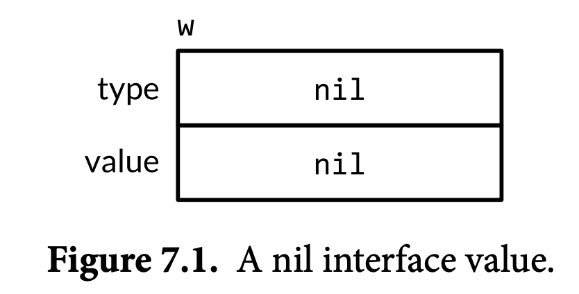

An interface value is described as nil or non-nil based on its dynamic type, so this is a nil interface value. 

When we assigns a value of type **os.File* to w:

```go
w = os.Stdout
```

This assignment involves an implicit conversion from a concrete type to an interface type, and is equivalent to the explicit conversion `io.Writer(os.Stdout)`. A conversion of this kind, whether explicit or implicit, captures the type and the value of its operand. The interface value’s dynamic type is set to the type descriptor for the pointer type `*os.File`, and its dynamic value holds a copy of `os.Stdout`, which is a pointer to the `os.File `variable representing the standard output of the process (Figure 7.2).

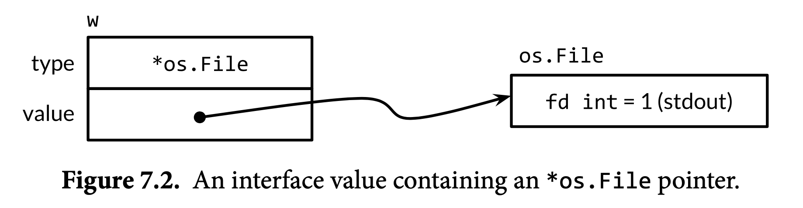

Calling the Write method on an interface value containing an \*os.File pointer causes the (\*os.File). Write method to be called. The call prints "hello".

```go
w.Write([]byte("hello")) // "hello"
```

The third statement assigns a value of type `*bytes.Buffer` to the interface value: 

```go
w = new(bytes.Buffer)
```

The dynamic type is now `*bytes.Buffer` and the dynamic value is a pointer to the newly allocated buffer (Figure 7.3).

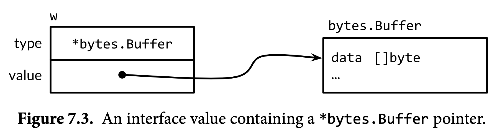

#### Caveat: An Interface Containing a Nil Pointer Is Non-Nil

A nil interface value, which contains no value at all, is not the same as an interface value containing a pointer that happens to be nil.

Consider the program below:

```go
const debug = true
func main() {
  var buf *bytes.Buffer
  if debug {
    buf = new(bytes.Buffer) // enable collection of output
  }
  f(buf) // NOTE: subtly incorrect!
  if debug {
    // ...use buf...
  } 
}
// If out is non-nil, output will be written to it.
func f(out io.Writer) {
  // ...do something...
  if out != nil {
    out.Write([]byte("done!\n"))
  } 
}
```

We might expect that changing debug to false would disable the collection of the output, but in fact it causes the program to panic during the `out.Write` call:

```go
if out != nil {
  out.Write([]byte("done!\n")) // panic: nil pointer dereference
}
```

When main calls f, it assigns a nil pointer of type `*bytes.Buffer` to the out parameter, so the dynamic value of out is nil. However, its dynamic type is `*bytes.Buffer`, meaning that out is a non-nil interface containing a nil pointer value (Figure 7.5), so the defensive check out != nil is still true.

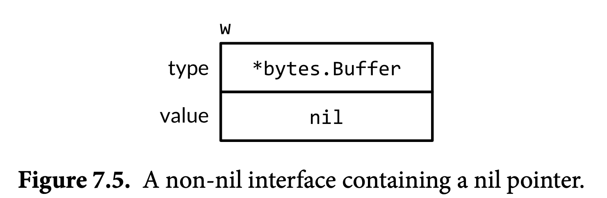

In particular, the call violates the implicit precondition of `(*bytes.Buffer).Write` that its receiver is not nil, so assigning the nil pointer to the interface was a mistake. The solution is to change the type of buf in main to io.Writer, thereby avoiding the assignment of the dysfunctional value to the interface in the first place:

```go
var buf io.Writer
if debug {
  buf = new(bytes.Buffer) // enable collection of output
}
f(buf) // OK
```

### Sorting with sort.Interface

Go use `sort.Interface`, to specify the contract between the generic sort algorithm and each sequence type that may be sorted.

An in-place sort algorithm needs three things—the length of the sequence, a means of comparing two elements, and a way to swap two elements—so they are the three methods of sort.Interface:

```go
package sort
type Interface interface {
  Len() int
  Less(i, j int) bool // i, j are indices of sequence elements
  Swap(i, j int)
}
```

To sort any sequence, we need to define a type that implements these three methods, then apply sort.Sort to an instance of that type.

```go
type StringSlice []string
func (p StringSlice) Len() int { return len(p) }
func (p StringSlice) Less(i, j int) bool { return p[i] < p[j] }
func (p StringSlice) Swap(i, j int)  { p[i], p[j] = p[j], p[i] }
sort.Sort(StringSlice(names))
```

#### Reverse Sort

The `sort.Reverse` uses composition, which is a struct that embeds a `sort.Interface`. 

```go
package sort
type reverse struct{ Interface } // that is, sort.Interface
func (r reverse) Less(i, j int) bool { 
  return r.Interface.Less(j, i) 
}
func Reverse(data Interface) Interface { return reverse{data} }
```

Len and Swap, the other two methods of reverse, are implicitly provided by the original sort.Interface value because it is an embedded field. The exported function Reverse returns an instance of the reverse type that contains the original `sort.Interface` value.

#### Sort only With Less

We can create a struct that combines a slice with a function, letting us define a new sort order by writing only the comparison function.

```go
type customSort struct {
  t    []*Track
  less func(x, y *Track) bool
}
func (x customSort) Len() int
func (x customSort) Less(i, j int) bool { return x.less(x.t[i], x.t[j]) }
func (x customSort) Swap(i, j int)      { x.t[i], x.t[j] = x.t[j], x.t[i] }
```

Now we can specify the order during init:

```go
sort.Sort(customSort{tracks, func(x, y *Track) bool {
  if x.Title != y.Title {
    return x.Title < y.Title
  }
  if x.Year != y.Year {
    return x.Year < y.Year
  }
  if x.Length != y.Length {
    return x.Length < y.Length
  }
  return false
}})
```

### The http.Handler Interface

In the program below, we create a ServeMux and use it to associate the URLs with the corresponding handlers for the `/list` and `/price` operations, which have been split into separate methods. We then use the ServeMux as the main handler in the call to ListenAndServe.

```go
package http
type HandlerFunc func(w ResponseWriter, r *Request)
func (f HandlerFunc) ServeHTTP(w ResponseWriter, r *Request) {
  f(w, r)
}


func main() {
  db := database{"shoes": 50, "socks": 5}
  mux := http.NewServeMux()
  mux.Handle("/list", http.HandlerFunc(db.list))
  mux.Handle("/price", http.HandlerFunc(db.price))
//ServeMux has a convenience method called HandleFunc that does it for us, so we can simplify the handler registration code to this:
  mux.HandleFunc("/list", db.list)
  mux.HandleFunc("/price", db.price)
  log.Fatal(http.ListenAndServe("localhost:8000", mux))
}
type database map[string]dollars
func (db database) list(w http.ResponseWriter, req *http.Request) {
  for item, price := range db {
    fmt.Fprintf(w, "%s: %s\n", item, price)
  } 
}
func (db database) price(w http.ResponseWriter, req *http.Request) {
  item := req.URL.Query().Get("item")
  price, ok := db[item]
  if !ok {
    w.WriteHeader(http.StatusNotFound) // 404
    fmt.Fprintf(w, "no such item: %q\n", item)
    return
  }

  fmt.Fprintf(w, "%s\n", price)
}

```

`net/http` provides a global ServeMux instance called DefaultServeMux and package-level functions called http.Handle and http.HandleFunc. To use Default- ServeMux as the server’s main handler, we needn’t pass it to ListenAndServe; nil will do.

```go
func main() {
  db := database{"shoes": 50, "socks": 5}
  http.HandleFunc("/list", db.list)
  http.HandleFunc("/price", db.price)
  log.Fatal(http.ListenAndServe("localhost:8000", nil))
}
```

> _**Note**_: the web server invokes each handler in a new goroutine, so handlers must take precautions such as *locking* when accessing variables that other goroutines, including other requests to the same handler.

### The Error Interface

```go
package errors
type error interface {
  Error() string
}
type errorString struct { 
  text string 
}
func New(text string) error { 
  return &errorString{text} 
}

func (e *errorString) Error() string { 
  return e.text 
}
```

Calls to errors.New are relatively infrequent because there’s a convenient wrapper function, `fmt.Errorf`, that does string formatting too.

```go
package fmt
import "errors"
func Errorf(format string, args ...interface{}) error {
  return errors.New(Sprintf(format, args...))
}
```

The syscall package provides Go’s low-level system call API. On many platforms, it defines a numeric type Errno that satisfies error, and on Unix platforms, Errno’s Error method does a lookup in a table of strings, as shown below:

```go

package syscall
type Errno uintptr // operating system error code
var errors = [...]string{
  1:   "operation not permitted",   // EPERM
  2:   "no such file or directory", // ENOENT
  3:   "no such process",           // ESRCH
  // ...
}
func (e Errno) Error() string {
  if 0 <= int(e) && int(e) < len(errors) {
    return errors[e]
  }
  return fmt.Sprintf("errno %d", e)
}

var err error = syscall.Errno(2)
fmt.Println(err.Error()) // "no such file or directory"
fmt.Println(err)         // "no such file or directory"
```

The value of err is shown graphically in Figure 7.6.

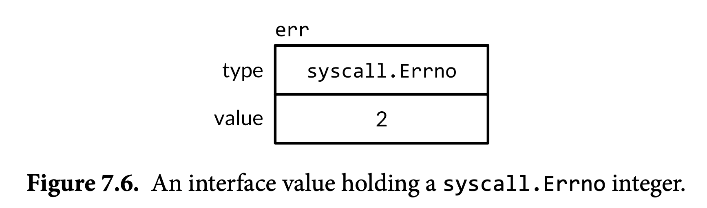

Errno is an efficient representation of system call errors drawn from a finite set, and it satisfies the standard error interface. 

### Example: Expression Evaluator

```go
// An Expr is an arithmetic expression.
type Expr interface {
  // Eval returns the value of this Expr in the environment env.
  Eval(env Env) float64
  // Check reports errors in this Expr and adds its Vars to the set.
  Check(vars map[Var]bool) error
}

// A Var identifies a variable, e.g., x.
type Var string
// A literal is a numeric constant, e.g., 3.141.
type literal float64
// A unary represents a unary operator expression, e.g., -x.
type unary struct {
  op rune // one of '+', '-'
  x  Expr
}
// A binary represents a binary operator expression, e.g., x+y.
type binary struct {
  op   rune // one of '+', '-', '*', '/'
  x, y Expr
}
// A call represents a function call expression, e.g., sin(x).
type call struct {
  fn   string // one of "pow", "sin", "sqrt"
  args []Expr
}

type Env map[Var]float64

func (v Var) Eval(env Env) float64 {
  return env[v]
}
func (l literal) Eval(_ Env) float64 {
  return float64(l)
}


func (u unary) Eval(env Env) float64 {
  switch u.op {
    case '+':
    return +u.x.Eval(env)
    case '-':
    return -u.x.Eval(env)
  }
  panic(fmt.Sprintf("unsupported unary operator: %q", u.op))
}
func (b binary) Eval(env Env) float64 {
  switch b.op {
    case '+':
    return b.x.Eval(env) + b.y.Eval(env)
    case '-':
    return b.x.Eval(env) - b.y.Eval(env)
    case '*':
    return b.x.Eval(env) * b.y.Eval(env)
    case '/':
    return b.x.Eval(env) / b.y.Eval(env)
  }
  panic(fmt.Sprintf("unsupported binary operator: %q", b.op))
}
func (c call) Eval(env Env) float64 {
  switch c.fn {
    case "pow":
    return math.Pow(c.args[0].Eval(env), c.args[1].Eval(env))
    case "sin":
    return math.Sin(c.args[0].Eval(env))
    case "sqrt":
    return math.Sqrt(c.args[0].Eval(env))
  }
  panic(fmt.Sprintf("unsupported function call: %s", c.fn))
}

// check
func (v Var) Check(vars map[Var]bool) error {
  vars[v] = true
  return nil
}
func (literal) Check(vars map[Var]bool) error {
  return nil
}
func (u unary) Check(vars map[Var]bool) error {
  if !strings.ContainsRune("+-", u.op) {
    return fmt.Errorf("unexpected unary op %q", u.op)
  }
  return u.x.Check(vars)
}


func (b binary) Check(vars map[Var]bool) error {
  if !strings.ContainsRune("+-*/", b.op) {
    return fmt.Errorf("unexpected binary op %q", b.op)
  }
  if err := b.x.Check(vars); err != nil {
    return err
  }
  return b.y.Check(vars)
}
func (c call) Check(vars map[Var]bool) error {
  arity, ok := numParams[c.fn]
  if !ok {
    return fmt.Errorf("unknown function %q", c.fn)
  }
  if len(c.args) != arity {
    return fmt.Errorf("call to %s has %d args, want %d",
                      c.fn, len(c.args), arity)
  }
  for _, arg := range c.args {
    if err := arg.Check(vars); err != nil {
      return err
    } 
  }
  return nil
}
var numParams = map[string]int{"pow": 2, "sin": 1, "sqrt": 1}
```

#### Testing

```go

func TestEval(t *testing.T) {
  tests := []struct {
    expr string
    env  Env
    want string
  }{

    {"sqrt(A / pi)", Env{"A": 87616, "pi": math.Pi}, "167"},
    {"pow(x, 3) + pow(y, 3)", Env{"x": 12, "y": 1}, "1729"},
    {"pow(x, 3) + pow(y, 3)", Env{"x": 9, "y": 10}, "1729"},
    {"5 / 9 * (F - 32)", Env{"F": -40}, "-40"},
    {"5 / 9 * (F - 32)", Env{"F": 32}, "0"},
    {"5 / 9 * (F - 32)", Env{"F": 212}, "100"},
  }
  var prevExpr string
  for _, test := range tests {
    // Print expr only when it changes.
    if test.expr != prevExpr {
      fmt.Printf("\n%s\n", test.expr)
      prevExpr = test.expr
    }
    expr, err := Parse(test.expr)
    if err != nil {
      t.Error(err) // parse error
      continue
    }
    got := fmt.Sprintf("%.6g", expr.Eval(test.env))
    fmt.Printf("\t%v => %s\n", test.env, got)
    if got != test.want {
      t.Errorf("%s.Eval() in %v = %q, want %q\n",
               test.expr, test.env, got, test.want)
    } 
  }
}

```

The go test command runs a package’s tests:

```bash
$ go test -v gopl.io/ch7/eval
```

The `-v` flag lets us see the printed output of the test, which is normally suppressed for a successful test like this one. Here is the output of the test’s `fmt.Printf` statements:

```
     sqrt(A / pi)
         map[A:87616 pi:3.141592653589793] => 167
     pow(x, 3) + pow(y, 3)
         map[x:12 y:1] => 1729
         map[x:9 y:10] => 1729
     5 / 9 * (F - 32)
         map[F:-40] => -40
         map[F:32] => 0
         map[F:212] => 100
```

```go
func parseAndCheck(s string) (eval.Expr, error) {
  if s == "" {
    return nil, fmt.Errorf("empty expression")
  }

  expr, err := eval.Parse(s)
  if err != nil {
    return nil, err
  }
  vars := make(map[eval.Var]bool)
  if err := expr.Check(vars); err != nil {
    return nil, err
  }
  for v := range vars {
    if v != "x" && v != "y" && v != "r" {
      return nil, fmt.Errorf("undefined variable: %s", v)
    } 
  }
  return expr, nil
}
```

To make this a web application, all we need is the plot function below, which has the familiar signature of an `http.HandlerFunc`:

```go
func plot(w http.ResponseWriter, r *http.Request) {
  r.ParseForm()
  expr, err := parseAndCheck(r.Form.Get("expr"))
  if err != nil {
    http.Error(w, "bad expr: "+err.Error(), http.StatusBadRequest)
    return
  }
  w.Header().Set("Content-Type", "image/svg+xml")
  surface(w, func(x, y float64) float64 {
    r := math.Hypot(x, y) // distance from (0,0)
    return expr.Eval(eval.Env{"x": x, "y": y, "r": r})
  }) 
}
```

### Type Assertions

A *type assertion* is an operation applied to an interface value. Syntactically, it looks like x.(T), where x is an expression of an interface type and T is a type, called the ‘‘asserted’’ type. A type assertion checks that the dynamic type of its operand matches the asserted type.

If the asserted type T is a concrete type, then the type assertion checks whether x’s dynamic type is *identical to* T.

```go
var w io.Writer
w = os.Stdout
f := w.(*os.File)      // success: f == os.Stdout
c := w.(*bytes.Buffer) // panic: interface holds *os.File, not *bytes.Buffer
```

If instead the asserted type T is an interface type, then the type assertion checks whether x’s dynamic type *satisfies* T. 

```go
var w io.Writer
w = os.Stdout
rw := w.(io.ReadWriter) // success: *os.File has both Read and Write
w = new(ByteCounter)
rw = w.(io.ReadWriter) // panic: *ByteCounter has no Read method

w = rw             // io.ReadWriter is assignable to io.Writer
w = rw.(io.Writer) // fails only if rw == nil
```

Test whether it is some particular type:

```go
var w io.Writer = os.Stdout
f, ok := w.(*os.File)      // success:  ok, f == os.Stdout
b, ok := w.(*bytes.Buffer) // failure: !ok, b == nil
```

### Discriminating Errors with Type Assertions

os package provides these three helper functions to classify the failure indicated by a given error value:

```go
package os
func IsExist(err error) bool
func IsNotExist(err error) bool
func IsPermission(err error) bool
```

The os package defines a type called PathError to describe failures involving an operation on a file path, like Open or Delete, and a variant called LinkError to describe failures of operations involving two file paths, like Symlink and Rename. Here’s `os.PathError`:

```go
package os
// PathError records an error and the operation and file path that caused it.
type PathError struct {
  Op   string
  Path string
  Err  error
}
func (e *PathError) Error() string {
  return e.Op + " " + e.Path + ": " + e.Err.Error()
}

_, err := os.Open("/no/such/file")
fmt.Println(err) // "open /no/such/file: No such file or directory"
fmt.Printf("%#v\n", err)
// Output:
// &os.PathError{Op:"open", Path:"/no/such/file", Err:0x2}

```

For example, `IsNotExist`:

```go
import (
  "errors"
  "syscall"
)
var ErrNotExist = errors.New("file does not exist")
// IsNotExist returns a boolean indicating whether the error is known to
// report that a file or directory does not exist. It is satisfied by
// ErrNotExist as well as some syscall errors.
func IsNotExist(err error) bool {
  if pe, ok := err.(*PathError); ok {
    err = pe.Err
  }
  return err == syscall.ENOENT || err == ErrNotExist
}
_, err := os.Open("/no/such/file")
fmt.Println(os.IsNotExist(err)) // "true"
```

### Querying Behaviors with Interface Type Assertions

```go
func writeHeader(w io.Writer, contentType string) error {
  if _, err := w.Write([]byte("Content-Type: ")); err != nil {
    return err
  }
  if _, err := w.Write([]byte(contentType)); err != nil {
    return err
  }
  // ...
}
```

Because the Write method requires a byte slice, and the value we wish to write is a string, a `[]byte(...)` conversion is required. This conversion allocates memory and makes a copy, but the copy is thrown away almost immediately after. 

We cannot assume that an arbitrary `io.Writer` w also has the `WriteString` method. But we can define a new interface that has just this method and use a type assertion to test whether the dynamic type of w satisfies this new interface.

```go
// writeString writes s to w.
// If w has a WriteString method, it is invoked instead of w.Write.
func writeString(w io.Writer, s string) (n int, err error) {
  type stringWriter interface {
    WriteString(string) (n int, err error)
  }
  if sw, ok := w.(stringWriter); ok {
    return sw.WriteString(s) // avoid a copy
  }
  return w.Write([]byte(s)) // allocate temporary copy
}

func writeHeader(w io.Writer, contentType string) error {
  if _, err := writeString(w, "Content-Type: "); err != nil {
    return err
  }
  if _, err := writeString(w, contentType); err != nil {
    return err
  }
  // ...
}
```

Within `fmt.Fprintf`, there is a step that converts a single operand to a string, something like this:

```go
package fmt
func formatOneValue(x interface{}) string {
  if err, ok := x.(error); ok {
    return err.Error()
  }
  if str, ok := x.(Stringer); ok {
    return str.String()
  }
  // ...all other types...
}
```

### Type Switches

Interfaces are used in two distinct styles. In the first style, exemplified by io.Reader, io.Writer, fmt.Stringer, sort.Interface, http.Handler, and error, an interface’s methods express the similarities of the concrete types that satisfy the interface but hide the representation details and intrinsic operations of those concrete types. The emphasis is on the methods, not on the concrete types.

The second style exploits the ability of an interface value to hold values of a variety of concrete types and considers the interface to be the *union* of those types. Type assertions are used to discriminate among these types dynamically and treat each case differently. In this style, the emphasis is on the concrete types that satisfy the interface, not on the interface’s methods (if indeed it has any), and there is no hiding of information.

Go’s API for querying an SQL database, like those of other languages, lets us cleanly separate the fixed part of a query from the variable parts. An example client might look like this:

```go

import "database/sql"
func listTracks(db sql.DB, artist string, minYear, maxYear int) {
  result, err := db.Exec(
    "SELECT * FROM tracks WHERE artist = ? AND ? <= year AND year <= ?",
    artist, minYear, maxYear)
  // ...
}
```

Within Exec, we might find a function like the one below, which converts each argument value to its literal SQL notation.

```go
func sqlQuote(x interface{}) string {
  if x == nil {
    return "NULL"
  } else if _, ok := x.(int); ok {
    return fmt.Sprintf("%d", x)
  } else if _, ok := x.(uint); ok {
    return fmt.Sprintf("%d", x)
  } else if b, ok := x.(bool); ok {
    if b {
      return "TRUE"
    }
    return "FALSE"
  } else if s, ok := x.(string); ok {
    return sqlQuoteString(s) // (not shown)
  } else {
    panic(fmt.Sprintf("unexpected type %T: %v", x, x))
  } 
}
// which can convert to better version
func sqlQuote(x interface{}) string {
  switch x := x.(type) {
    case nil:      
    return "NULL"
    case int, uint:
    return fmt.Sprintf("%d", x) // x has type interface{} here.
    case bool:
    if x {
      return "TRUE"
    }
    return "FALSE"
    case string:
    return sqlQuoteString(x) // (not shown)
    default:
    panic(fmt.Sprintf("unexpected type %T: %v", x, x))
  }
}
```

Although the type of x is interface{}, we consider it a *discriminated union* of int, uint, bool, string, and nil.

### Example: Token-Based XML Decoding

The `encoding/xml` package also provides a lower-level *token-based* API for decoding XML. In the token-based style, the parser consumes the input and produces a stream of tokens, primarily of four kinds—StartElement, EndElement, CharData, and Comment—each being a concrete type in the encoding/xml package. Each call to(*xml.Decoder). Token returns a token. The Token interface, which has no methods, is also an example of a discriminated union.

The relevant parts of the API are shown here:

```go
package xml
type Name struct {
  Local string // e.g., "Title" or "id"
}
type Attr struct { // e.g., name="value"
  Name  Name
  Value string
}
// A Token includes StartElement, EndElement, CharData,
// and Comment, plus a few esoteric types (not shown).
type Token interface{}
type StartElement struct { // e.g., <name>
  Name Name
  Attr []Attr
}
type EndElement struct { Name Name } // e.g., </name>
type CharData []byte                 // e.g., <p>CharData</p>
type Comment []byte                  // e.g., <!-- Comment -->
type Decoder struct{ /* ... */ }
func NewDecoder(io.Reader) *Decoder
func (*Decoder) Token() (Token, error) // returns next Token in sequence
```

The xmlselect program below extracts and prints the text found beneath certain elements in an XML document tree. Using the API above, it can do its job in a single pass over the input without ever materializing the tree.

```go
package main
import (
  "encoding/xml"
  "fmt"
  "io"
  "os"
  "strings"
)
func main() {
  dec := xml.NewDecoder(os.Stdin)
  var stack []string // stack of element names
  for {
    tok, err := dec.Token()
    if err == io.EOF {
      break
    } else if err != nil {
      fmt.Fprintf(os.Stderr, "xmlselect: %v\n", err)
      os.Exit(1)
    }
    switch tok := tok.(type) {
      case xml.StartElement:
      stack = append(stack, tok.Name.Local) // push
      case xml.EndElement:
      stack = stack[:len(stack)-1] // pop
      case xml.CharData:
      if containsAll(stack, os.Args[1:]) {
        fmt.Printf("%s: %s\n", strings.Join(stack, " "), tok)
      } 
    }
  }
}
// containsAll reports whether x contains the elements of y, in order.
func containsAll(x, y []string) bool {
  for len(y) <= len(x) {
    if len(y) == 0 {
      return true
    }
    if x[0] == y[0] {
      y = y[1:]
    }
    x = x[1:]
  }
  return false
}
```

## Concurrency


Making progress run more than one task simultaneously is known as concurrency. Go has rich support for concurrency using goroutines and channels.

### Go Routine

**GO Scheduler** monitors the activities carried out by **Go Routines**. By default Go tries to use one core. Place a `go` command in front of a function and main routine communicate with child routine  use **Channel**. One **channel** only pass one type of value.

> **Note**: Never access same variable from different routines, make a copy and pass it through as parameter.

### Channel

Each channel is a conduit for values of a particular type, called the channel’s *element type*. The type of a channel whose elements have type int is written chan int. As with maps, a channel is a *reference* to the data structure created by make. 

```go
c := make(chan string) // communicate use channel with string type
c <- 5 // send the value '5' into this channel

myNumber <- c // wait for a value to be sent into the channel. when we get one , assign the vlaue to 'myNumber'

```

#### Channel Direction

We can specify a direction on a channel type thus restricting it to either sending or receiving. For example:

```go
ch <- x  // a send statement
x = <-ch // a receive expression in an assignment statement
<-ch     // a receive statement; result is discarded
```

#### Unbuffered Channels

A send operation on an unbuffered channel blocks the sending goroutine until another goroutine executes a corresponding receive on the same channel, at which point the value is transmitted and both goroutines may continue. Conversely, if the receive operation was attempted first, the receiving goroutine is blocked until another goroutine performs a send on the same channel.

Communication over an unbuffered channel causes the sending and receiving goroutines to *synchronize*. Because of this, unbuffered channels are sometimes called *synchronous* channels.

```go
func mustCopy(dst io.Writer, src io.Reader) {
  if _, err := io.Copy(dst, src); err != nil {
    log.Fatal(err)
  } 
}
func main() {
  conn, err := net.Dial("tcp", "localhost:8000")
  if err != nil {
    log.Fatal(err)
  }
  done := make(chan struct{})
  go func() {
    io.Copy(os.Stdout, conn) // NOTE: ignoring errors
    log.Println("done")
    done <- struct{}{} // signal the main goroutine
  }()
  mustCopy(conn, os.Stdin)
  conn.Close()
  <-done // wait for background goroutine to finish
}
```

When the user closes the standard input stream, mustCopy returns and the main goroutine calls conn.Close(), closing both halves of the network connection. Closing the write half of the connection causes the server to see an end-of-file condition. Closing the read half causes the background goroutine’s call to io.Copy to return a ‘‘read from closed connection’’ error, which is why we’ve removed the error logging.

#### Pipelines

Channels can be used to connect goroutines together so that the output of one is the input to another. This is called a *pipeline*. The program below consists of three goroutines connected by two channels, as shown schematically in Figure 8.1.

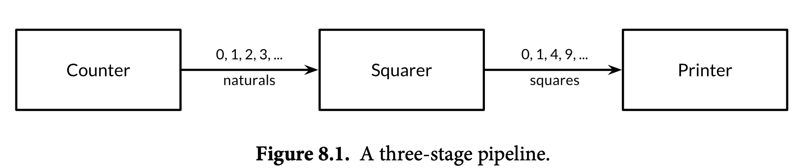

```go
func main() {
  naturals := make(chan int)
  squares := make(chan int)
  // Counter
  go func() {
    defer close(naturals)
    for x := 0; ; x++ {
      naturals <- x
    }
  }()
  // Squarer
  go func() {
    defer     close(squares)
    for {
      x, ok := <-naturals
      if !ok {
        break // channel was closed and drained
      }
      squares <- x * x
    } 

  }()

  // Better version of Squarer
  go func() {    
    defer     close(squares)
    for x := range naturals {
      squares <- x * x
    }
  }()
  // Printer (in main goroutine)
  for {
    fmt.Println(<-squares)
  } 
}
```

If the sender knows that no further values will ever be sent on a channel, it is useful to com- municate this fact to the receiver goroutines so that they can stop waiting. This is accomplished by *closing* the channel using the built-in close function:

```go
close(naturals)
```

You needn’t close every channel when you’ve finished with it. It’s only necessary to close a channel when it is important to tell the receiving goroutines that all data have been sent. A channel that the garbage collector determines to be unreachable will have its resources reclaimed whether or not it is closed.

#### Unidirectional Channel Types

To document this intent and prevent misuse, the Go type system provides *unidirectional* channel types that expose only one or the other of the send and receive operations.

```go
//send only
chan<- int
// receive-only
<-chan int
```

Since the close operation asserts that no more sends will occur on a channel, only the send- ing goroutine is in a position to call it, and for this reason it is a compile-time error to attempt to close a receive-only channel.

Here’s the squaring pipeline once more, this time with unidirectional channel types:

```go
func counter(out chan<- int) {
  for x := 0; x < 100; x++ {
    out <- x
  }
  close(out)
}
func squarer(out chan<- int, in <-chan int) {
  for v := range in {
    out <- v * v
  } 
  close(out)
}
func printer(in <-chan int) {
  for v := range in {
    fmt.Println(v)
  } 
}
func main() {
  naturals := make(chan int)
  squares := make(chan int)
  go counter(naturals)
  go squarer(squares, naturals)
  printer(squares)
}
```

### Buffered Channels

A buffered channel has a queue of elements. The queue’s maximum size is determined when it is created, by the capacity argument to make. The statement below creates a buffered channel capable of holding three string values. Figure 8.2 is a graphical representation of ch and the channel to which it refers.

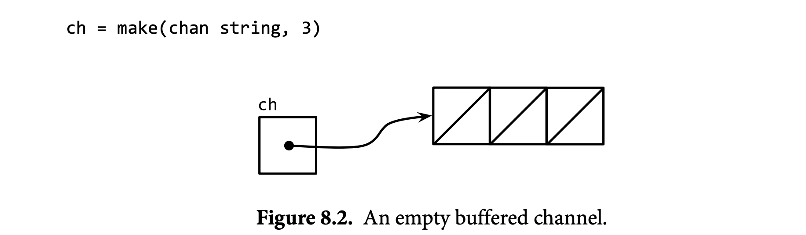

A send operation on a buffered channel inserts an element at the back of the queue, and a receive operation removes an element from the front. If the channel is full, the send operation blocks its goroutine until space is made available by another goroutine’s receive. Conversely, if the channel is empty, a receive operation blocks until a value is sent by another goroutine.

We can send up to three values on this channel without the goroutine blocking:

```go
ch <- "A"
ch <- "B"
ch <- "C"
```

At this point, the channel is full (Figure 8.3), and a fourth send statement would block.


If we receive one value,

```go
fmt.Println(<-ch) // "A"
```

the channel is neither full nor empty (Figure 8.4), so either a send operation or a receive operation could proceed without blocking. In this way, the channel’s buffer decouples the sending and receiving goroutines.

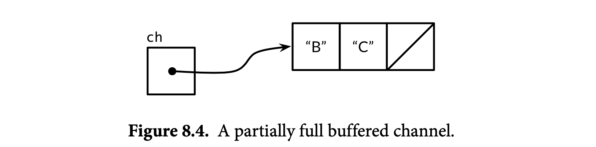

In the unlikely event that a program needs to know the channel’s buffer capacity or leng, it can be obtained by calling the built-in function:

```go
fmt.Println(cap(ch)) // "3"
fmt.Println(len(ch)) // "2"
```

Consider example below,  It sends their responses over a buffered channel, then receives and returns only the first response, which is the quickest one to arrive. Thus mirroredQuery returns a result even before the two slower servers have responded. 

```go
func mirroredQuery() string {
  responses := make(chan string, 3)
  go func() { responses <- request("asia.gopl.io") }()
  go func() { responses <- request("europe.gopl.io") }()
  go func() { responses <- request("americas.gopl.io") }()
  return <-responses // return the quickest response
}
func request(hostname string) (response string) { /* ... */ }
```

If we used an unbuffered channel, the two slower goroutines would have gotten stuck trying to send their responses on a channel from which no goroutine will ever receive. This situation, called a *goroutine leak*, would be a bug. Unlike garbage variables, leaked goroutines are not automatically collected, so it is important to make sure that goroutines terminate themselves when no longer needed.

#### Buffered Channels Vs Unbuffered Channels

The choice between unbuffered and buffered channels, and the choice of a buffered channel’s capacity, may both affect the correctness of a program. Unbuffered channels give stronger synchronization guarantees because every send operation is synchronized with its corresponding receive; with buffered channels, these operations are decoupled. Also, when we know an upper bound on the number of values that will be sent on a channel, it’s not unusual to create a buffered channel of that size and perform all the sends before the first value is received. Failure to allocate sufficient buffer capacity would cause the program to deadlock.

Channel buffering may also affect program performance. Imagine three cooks in a cake shop, one baking, one icing, and one inscribing each cake before passing it on to the next cook in the assembly line. In a kitchen with little space, each cook that has finished a cake must wait for the next cook to become ready to accept it; this rendezvous is analogous to communication over an unbuffered channel.

If there is space for one cake between each cook, a cook may place a finished cake there and immediately start work on the next; this is analogous to a buffered channel with capacity 1. So long as the cooks work at about the same rate on average, most of these handovers proceed quickly, smoothing out transient differences in their respective rates. More space between cooks—larger buffers—can smooth out bigger transient variations in their rates without stalling the assembly line, such as happens when one cook takes a short break, then later rushes to catch up.

On the other hand, if an earlier stage of the assembly line is consistently faster than the following stage, the buffer between them will spend most of its time full. Conversely, if the later stage is faster, the buffer will usually be empty. A buffer provides no benefit in this case.

The assembly line metaphor is a useful one for channels and goroutines. For example, if the second stage is more elaborate, a single cook may not be able to keep up with the supply from the first cook or meet the demand from the third. To solve the problem, we could hire another cook to help the second, performing the same task but working independently. This is analogous to creating another goroutine communicating over the same channels.

### Looping in Parallel

```go
// makeThumbnails3 makes thumbnails of the specified files in parallel.
func makeThumbnails3(filenames []string) {
  ch := make(chan struct{})
  for _, f := range filenames {
    go func(f string) {
      thumbnail.ImageFile(f) // NOTE: ignoring errors
      ch <- struct{}{}
    }(f) // must pass f as argument!
  }
  // Wait for goroutines to complete.
  for range filenames {
    <-ch
  } 
}
```

The next version of makeThumbnails uses a buffered channel to return the names of the generated image files along with any errors.

```go
// makeThumbnails5 makes thumbnails for the specified files in parallel.
// It returns the generated file names in an arbitrary order,
// or an error if any step failed.
func makeThumbnails5(filenames []string) (thumbfiles []string, err error) {
  type item struct {
    thumbfile string
    err       error
  }
  ch := make(chan item, len(filenames))
  for _, f := range filenames {
    go func(f string) {
      var it item
      it.thumbfile, it.err = thumbnail.ImageFile(f)
      ch <- it 
    }(f)
  }
  for range filenames {
    it := <-ch
    if it.err != nil {
      return nil, it.err
    }
    thumbfiles = append(thumbfiles, it.thumbfile)
  }
  return thumbfiles, nil
}
```

Our final version of makeThumbnails returns the total number of bytes occupied by the new files. Unlike the previous versions, however, it receives the file names not as a slice but over a channel of strings, so we cannot predict the number of loop iterations.

We need to increment a counter before each goroutine starts and decrement it as each goroutine finishes. This demands a special kind of counter, one that can be safely manipulated from multiple goroutines and that provides a way to wait until it becomes zero. This counter type is known as `sync.WaitGroup`, and the code below shows how to use it:

```go
// makeThumbnails6 makes thumbnails for each file received from the channel.
// It returns the number of bytes occupied by the files it creates.
func makeThumbnails6(filenames <-chan string) int64 {
  sizes := make(chan int64)
  var wg sync.WaitGroup // number of working goroutines
  for f := range filenames {
    wg.Add(1)
    // worker
    go func(f string) {
      defer wg.Done()
      thumb, err := thumbnail.ImageFile(f)
      if err != nil {
        log.Println(err)
        return
      }
      info, _ := os.Stat(thumb) // OK to ignore error
      sizes <- info.Size()
    }(f)
  }
  // closer
  go func() {
    wg.Wait()
    close(sizes)
  }()
  var total int64
  for size := range sizes {
    total += size
  }
  return total
}
```

Figure 8.5 illustrates the sequence of events in the makeThumbnails6 function. The vertical lines represent goroutines. The thin segments indicate sleep, the thick segments activity. The diagonal arrows indicate events that synchronize one goroutine with another. Time flows down. Notice how the main goroutine spends most of its time in the range loop asleep, waiting for a worker to send a value or the closer to close the channel.

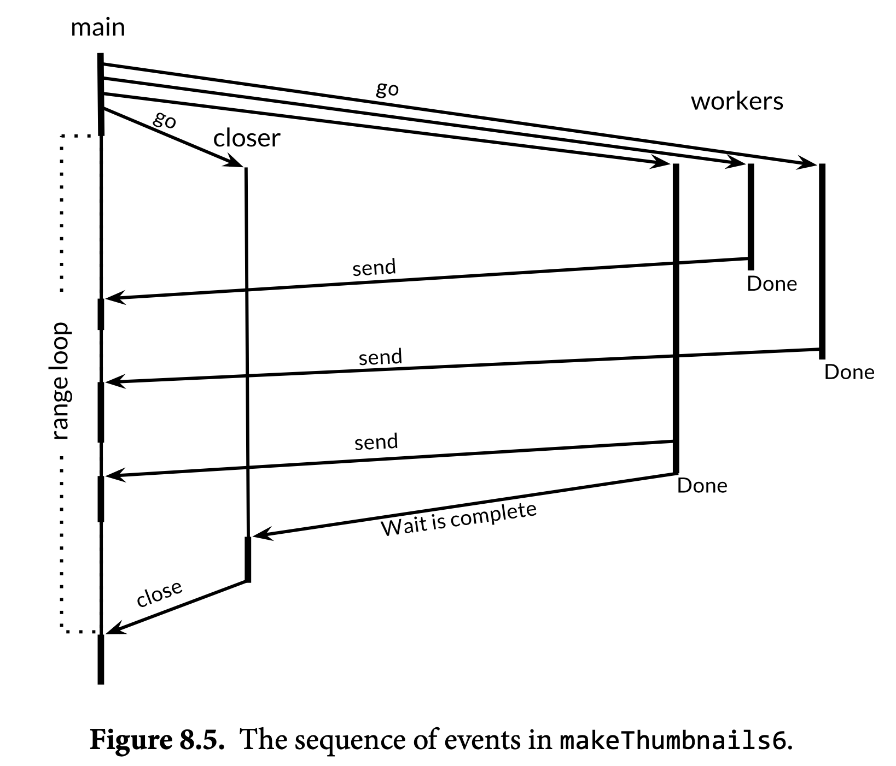

#### Limit Parallelism

We can limit parallelism using a buffered channel of capacity *n* to model a concurrency primitive called a *counting semaphore*.

```go
// tokens is a counting semaphore used to
// enforce a limit of 20 concurrent requests.
var tokens = make(chan struct{}, 20)
func crawl(url string) []string {
  fmt.Println(url)
  tokens <- struct{}{} // acquire a token
  list, err := links.Extract(url)
  <-tokens // release the token
  if err != nil {
    log.Print(err)
  }
  return list
}

func main() {
  worklist := make(chan []string)
  var n int // number of pending sends to worklist
  // Start with the command-line arguments.
  n++
  go func() { worklist <- os.Args[1:] }()
  // Crawl the web concurrently.
  seen := make(map[string]bool)
  for ; n > 0; n-- {
    list := <-worklist
    for _, link := range list {
      if !seen[link] {
        seen[link] = true
        n++ss
        go func(link string) {
          worklist <- crawl(link)
        }(link)
      }
    }
  }
}
```

### Multiplexing with Select

Go has a special statement called `select` which works like a `switch` but for channels:

```go
select {
  case <-ch1:
  // ...
  case x := <-ch2:
  // ...use x...
  case ch3 <- y:
  // ...
  default:
  }
// ...
select{} // waits forever.
```

The `select` statement is often used to implement a timeout:

```go
select {
case msg1 := <- c1:
  fmt.Println("Message 1", msg1)
case msg2 := <- c2:
  fmt.Println("Message 2", msg2)
case <- time.After(time.Second):
  fmt.Println("timeout")
}
```

`time.After` creates a channel and after the given duration will send the current time on it. (we weren't interested in the time so we didn't store it in a variable) We can also specify a `default` case:

```go
select {
case msg1 := <- c1:
  fmt.Println("Message 1", msg1)
case msg2 := <- c2:
  fmt.Println("Message 2", msg2)
case <- time.After(time.Second):
  fmt.Println("timeout")
default:
  fmt.Println("nothing ready")
}
```

The default case happens immediately if none of the channels are ready.

#### Example: Concurrent Directory Traversal

```go
// du
package main
import (
  "flag"
  "fmt"
  "io/ioutil"
  "os"
  "path/filepath"
)
var verbose = flag.Bool("v", false, "show verbose progress messages")

func main() {
  // Determine the initial directories.
  flag.Parse()
  roots := flag.Args()
  if len(roots) == 0 {
    roots = []string{"."}
  }

  // Traverse each root of the file tree in parallel.
  fileSizes := make(chan int64)
  var n sync.WaitGroup
  for _, root := range roots {
    n.Add(1)
    go walkDir(root, &n, fileSizes)
  }
  go func() {
    n.Wait()
    close(fileSizes)
  }()

  // Print the results periodically.
  var tick <-chan time.Time
  if *verbose {
    tick = time.Tick(500 * time.Millisecond)
  }
  var nfiles, nbytes int64
loop:
  for { 
    select {
      case size, ok := <-fileSizes:
        if !ok {
          break loop // fileSizes was closed
        }
        nfiles++
        nbytes += size
      case <-tick:
      	printDiskUsage(nfiles, nbytes)
    } 
  }
  printDiskUsage(nfiles, nbytes) // final totals
}

func walkDir(dir string, n *sync.WaitGroup, fileSizes chan<- int64) {
  defer n.Done()
  for _, entry := range dirents(dir) {
    if entry.IsDir() {
      n.Add(1)
      subdir := filepath.Join(dir, entry.Name())
      go walkDir(subdir, n, fileSizes)
    } else {
      fileSizes <- entry.Size()
    } 
  }
}


// sema is a counting semaphore for limiting concurrency in dirents.
var sema = make(chan struct{}, 20)

// dirents returns the entries of directory dir.
func dirents(dir string) []os.FileInfo {
  // to limit the concurrency up to 20
  sema <- struct{}{}        // acquire token
  defer func() { <-sema }() // release token

  entries, err := ioutil.ReadDir(dir)
  if err != nil {
    fmt.Fprintf(os.Stderr, "du1: %v\n", err)
    return nil
  }
  return entries
}

func printDiskUsage(nfiles, nbytes int64) {
  fmt.Printf("%d files  %.1f GB\n", nfiles, float64(nbytes)/1e9)
}

```

### Cancellation

For cancellation, what we need is a reliable mechanism to *broadcast* an event over a channel so that many goroutines can see it *as* it occurs and can later see that it *has* occurred.

After a channel has been closed and drained of all sent values, subsequent receive operations proceed immediately, yielding zero values. We can exploit this to create a broad- cast mechanism: don’t send a value on the channel, *close* it.

We can add cancellation to the du program from the previous section with a few simple changes. First, we create a cancellation channel on which no values are ever sent, but whose closure indicates that it is time for the program to stop what it is doing. We also define a utility function, cancelled, that checks or *polls* the cancellation state at the instant it is called.

```go
var done = make(chan struct{})
func cancelled() bool {
  select {
    case <-done:
    	return true
    default:
    	return false
  } 
}
```

Next, we create a goroutine that will read from the standard input, which is typically connected to the terminal. As soon as any input is read (for instance, the user presses the return key), this goroutine broadcasts the cancellation by closing the done channel.

```go
// Cancel traversal when input is detected.
go func() {
  os.Stdin.Read(make([]byte, 1)) // read a single byte
  close(done)
}()
```

In the main goroutine, we add a third case to the select statement that tries to receive from the done channel. The function returns if this case is ever selected, but before it returns it must first drain the fileSizes channel, discarding all values until the channel is closed. It does this to ensure that any active calls to walkDir can run to completion without getting stuck sending to fileSizes.

```go
for { 
  select {
    case <-done:
      // Drain fileSizes to allow existing goroutines to finish.
      for range fileSizes {
        // Do nothing.
      }
      return
    case size, ok := <-fileSizes:
    	// ...
  } 
}
```

The walkDir goroutine polls the cancellation status when it begins, and returns without doing anything if the status is set. This turns all goroutines created after cancellation into no-ops:

```go
func walkDir(dir string, n *sync.WaitGroup, fileSizes chan<- int64) {
  defer n.Done()
  if cancelled() {
    return
  }
  for _, entry := range dirents(dir) {
    // ...
  } 
}
```

The select below makes this operation cancellable and reduces the typical cancellation latency of the program from hundreds of milliseconds to tens:

```go
func dirents(dir string) []os.FileInfo {
  select {
    case sema <- struct{}{}: // acquire token
  	case <-done:
    	return nil // cancelled
  }
  defer func() { <-sema }() // release token
  // ...read directory...
}
```

There’s a handy trick we can use during testing: if instead of returning from main in the event of cancellation, we execute a call to panic, then the runtime will dump the stack of every goroutine in the program. If the main goroutine is the only one left, then it has cleaned up after itself. But if other goroutines remain, they may not have been properly cancelled, or perhaps they have been cancelled but the cancellation takes time; a little investigation may be worthwhile. The panic dump often contains sufficient information to distinguish these cases.

### Example: Chat Server

There are four kinds of goroutine in this program. There is one instance apiece of the main and broadcaster goroutines, and for each client connection there is one handleConn and one clientWriter goroutine. The broadcaster is a good illustration of how select is used, since it has to respond to three different kinds of messages.

The job of the main goroutine, shown below, is to listen for and accept incoming network connections from clients. For each one, it creates a new handleConn goroutine.

```go
func main() {
  listener, err := net.Listen("tcp", "localhost:8000")
  if err != nil {
    log.Fatal(err)
  }
  go broadcaster()
  for {
    conn, err := listener.Accept()
    if err != nil {
      log.Print(err)
      continue
    }
    go handleConn(conn)
  }
}
```

Next is the broadcaster. Its local variable clients records the current set of connected clients. The only information recorded about each client is the identity of its outgoing message channel, about which more later.

```go
type client chan<- string // an outgoing message channel
var (
  entering = make(chan client)
  leaving  = make(chan client)
  messages = make(chan string) // all incoming client messages
)
func broadcaster() {
  clients := make(map[client]bool) // all connected clients
  for {
    select {
      case msg := <-messages:
        // Broadcast incoming message to all
        // clients' outgoing message channels.
        for cli := range clients {
          cli <- msg
        }
      case cli := <-entering:
      	clients[cli] = true
      case cli := <-leaving:
      	delete(clients, cli)
      	close(cli)
    } 
  }
}
```

The handleConn function creates a new outgoing message channel for its client and announces the arrival of this client to the broadcaster over the entering channel. Then it reads every line of text from the client, sending each line to the broadcaster over the global incoming message channel, prefixing each message with the identity of its sender. Once there is nothing more to read from the client, handleConn announces the departure of the client over the leaving channel and closes the connection.

```go
func handleConn(conn net.Conn) {
  ch := make(chan string) // outgoing client messages
  go clientWriter(conn, ch)
  
  who := conn.RemoteAddr().String()
  ch <- "You are " + who
  messages <- who + " has arrived"
  entering <- ch
  input := bufio.NewScanner(conn)
  for input.Scan() {
    messages <- who + ": " + input.Text()
  }
  // NOTE: ignoring potential errors from input.Err()
  leaving <- ch
  messages <- who + " has left"
  conn.Close()
}
func clientWriter(conn net.Conn, ch <-chan string) {
  for msg := range ch {
    fmt.Fprintln(conn, msg) // NOTE: ignoring network errors
  } 
}
```

In addition, handleConn creates a clientWriter goroutine for each client that receives messages broadcast to the client’s outgoing message channel and writes them to the client’s network connection. The client writer’s loop terminates when the broadcaster closes the channel after receiving a leaving notification.

## Concurrency with Shared Variables

### Serial Confinement

It’s common to share a variable between goroutines in a pipeline by passing its address from one stage to the next over a channel. If each stage of the pipeline refrains from accessing the variable after sending it to the next stage, then all accesses to the variable are sequential. This discipline is sometimes called *serial confinement*.

In the example below, Cakes are serially confined, first to the baker goroutine, then to the icer goroutine:

```go
type Cake struct{ state string }
func baker(cooked chan<- *Cake) {
  for {
    cake := new(Cake)
    cake.state = "cooked"
    cooked <- cake // baker never touches this cake again
  } }
func icer(iced chan<- *Cake, cooked <-chan *Cake) {
  for cake := range cooked {
    cake.state = "iced"
    iced <- cake // icer never touches this cake again
  } 
}
```

### Mutual Exclusion

We can use a channel of capacity 1 to ensure that at most one goroutine accesses a shared variable at a time. A semaphore that counts only to 1 is called a *binary semaphore*.

```go
var (
  sema    = make(chan struct{}, 1) // a binary semaphore guarding balance
  balance int
)

func Deposit(amount int) {
  sema <- struct{}{} // acquire token
  balance = balance + amount
  <-sema // release token
}

func Balance() int {
  sema <- struct{}{} // acquire token
  b := balance
  <-sema // release token
  return b
}

// This pattern of mutual exclusion is so useful that it is supported directly by the Mutex type from the sync package.
import "sync"
var (
  mu      sync.Mutex // guards balance
  balance int
)
func Deposit(amount int) {
  mu.Lock()
  balance = balance + amount
  mu.Unlock()
}
func Balance() int {
  mu.Lock()
  b := balance
  mu.Unlock()
  return b
}
```

###  Lazy Initialization: sync.Once

The sync package provides a specialized solution to the problem of one-time ini- tialization: `sync.Once`. Conceptually, a Once consists of a mutex and a boolean variable that records whether initialization has taken place; the mutex guards both the boolean and the client’s data structures. Using `sync.Once` in this way, we can avoid sharing variables with other goroutines until they have been properly constructed.

```go
func loadIcons() {
  icons = make(map[string]image.Image)
  icons["spades.png"] = loadIcon("spades.png")
  icons["hearts.png"] = loadIcon("hearts.png")
  icons["diamonds.png"] = loadIcon("diamonds.png")
  icons["clubs.png"] = loadIcon("clubs.png")
}

var loadIconsOnce sync.Once
var icons map[string]image.Image
// Concurrency-safe.
func Icon(name string) image.Image {
  loadIconsOnce.Do(loadIcons)
  return icons[name]
}
```

### The Race Detector

Add the `-race` flag to your go build, go run, or go test command. This causes the compiler to build a modified version of your application or test with additional instrumentation that effectively records all accesses to shared variables that occurred during execution, along with the identity of the goroutine that read or wrote the variable. The race detector reports all data races that were actually executed. However, it can only detect race conditions that occur during a run.

### Example: Concurrent Non-Blocking Cache

#### Shared Variables and Locks

```go
package memo

type entry struct {
  res   result
  ready chan struct{} // closed when res is ready
}
func New(f Func) *Memo {
  return &Memo{f: f, cache: make(map[string]*entry)}
}
type Memo struct {
  f     Func
  mu    sync.Mutex // guards cache
  cache map[string]*entry
}

// Func is the type of the function to memoize.
type Func func(key string) (interface{}, error)

type result struct {
  value interface{}
  err   error
}

// NOTE: not concurrency-safe!
func (memo *Memo) Get(key string) (value interface{}, err error) {
  memo.mu.Lock()
  e := memo.cache[key]
  if e == nil {
    // This is the first request for this key.
    // This goroutine becomes responsible for computing
    // the value and broadcasting the ready condition.
    e = &entry{ready: make(chan struct{})}
    memo.cache[key] = e
    memo.mu.Unlock()
    e.res.value, e.res.err = memo.f(key)
    close(e.ready) // broadcast ready condition
  } else {
    // This is a repeat request for this key.
    memo.mu.Unlock()
    <-e.ready // wait for ready condition
  }
  return e.res.value, e.res.err
}
func main() {
  m := memo.New(httpGetBody)
  var n sync.WaitGroup
  for url := range incomingURLs() {
    n.Add(1)
    go func(url string) {
      start := time.Now()
      value, err := m.Get(url)
      if err != nil {
        log.Print(err)
      }
      fmt.Printf("%s, %s, %d bytes\n",
                 url, time.Since(start), len(value.([]byte)))
      n.Done()
    }(url)
  } 
  n.Wait()
}


```

#### Communicating Sequential Processes

```go
// A request is a message requesting that the Func be applied to key.
type request struct {
  key      string
  response chan<- result // the client wants a single result
}
type Memo struct{ requests chan request }
// New returns a memoization of f.  Clients must subsequently call Close.
func New(f Func) *Memo {
  memo := &Memo{requests: make(chan request)}
  go memo.server(f)
  return memo
}
func (memo *Memo) Get(key string) (interface{}, error) {
  response := make(chan result)
  memo.requests <- request{key, response}
  res := <-response
  return res.value, res.err
}
func (memo *Memo) Close() { close(memo.requests) }

func (memo *Memo) server(f Func) {
  cache := make(map[string]*entry)
  for req := range memo.requests {
    e := cache[req.key]
    if e == nil {
      // This is the first request for this key.
      e = &entry{ready: make(chan struct{})}
      cache[req.key] = e
      go e.call(f, req.key) // call f(key)
    }
    go e.deliver(req.response)
  }
}
func (e *entry) call(f Func, key string) {
  // Evaluate the function.
  e.res.value, e.res.err = f(key)
  // Broadcast the ready condition.
  close(e.ready)
}
func (e *entry) deliver(response chan<- result) {
  // Wait for the ready condition.
  <-e.ready
  // Send the result to the client.
  response <- e.res
}

```

### Goroutines and Threads

#### Growable Stacks

Each OS thread has a fixed-size block of memory (often as large as 2MB) for its *stack*, the work area where it saves the local variables of function calls that are in progress or temporarily suspended while another function is called.

In contrast, a goroutine starts life with a small stack, typically 2KB. A goroutine’s stack, like the stack of an OS thread, holds the local variables of active and suspended function calls, but unlike an OS thread, a goroutine’s stack is not fixed; it grows and shrinks as needed. The size limit for a goroutine stack may be as much as 1GB, orders of magnitude larger than a typical fixed-size thread stack, though of course few goroutines use that much.

#### Goroutine Scheduling

OS threads are scheduled by the OS kernel. Every few milliseconds, a hardware timer interrupts the processor, which causes a kernel function called the *scheduler* to be invoked. This function suspends the currently executing thread and saves its registers in memory, looks over the list of threads and decides which one should run next, restores that thread’s registers from memory, then resumes the execution of that thread. This operation is slow, due to its poor locality and the number of memory accesses required, and has historically only gotten worse as the number of CPU cycles required to access memory has increased.

The Go runtime contains its own scheduler that uses a technique known as *m:n scheduling*, because it multiplexes (or schedules) *m* goroutines on *n* OS threads. The job of the Go scheduler is analogous to that of the kernel scheduler, but it is concerned only with the goroutines of a single Go program.

The Go scheduler is not invoked periodically by a hardware timer, but implicitly by certain Go language constructs. For example, when a goroutine calls time.Sleep or blocks in a channel or mutex operation, the scheduler puts it to sleep and runs another goroutine until it is time to wake the first one up. Because it doesn’t need a switch to kernel context, rescheduling a goroutine is much cheaper than rescheduling a thread.

#### GOMAXPROCS

The Go scheduler uses a parameter called GOMAXPROCS to determine how many OS threads may be actively executing Go code simultaneously. Its default value is the number of CPUs on the machine, so on a machine with 8 CPUs, the scheduler will schedule Go code on up to 8 OS threads at once. (GOMAXPROCS is the *n* in *m:n* scheduling.) Goroutines that are sleeping or blocked in a communication do not need a thread at all. Goroutines that are blocked in I/O or other system calls or are calling non-Go functions, do need an OS thread, but GOMAXPROCS need not account for them.

You can explicitly control this parameter using the GOMAXPROCS environment variable or the runtime.GOMAXPROCS function.

## Testing

Create a testing with \<name of original Go file>_test.go. And run the test with command `go test`.


## Input / Output

 The `io` package consists of a few functions, but mostly interfaces used in other packages. 

The two main interfaces are `Reader` and `Writer`. `Reader`s support reading via the `Read` method. `Writer`s support writing via the `Write` method. Many functions in Go take `Reader`s or `Writer`s as arguments. For example the `io` package has a `Copy` function which copies data from a `Reader` to a `Writer`:

```go
func Copy(dst Writer, src Reader) (written int64, err error)
```

To read or write to a `[]byte` or a `string` you can use the `Buffer` struct found in the `bytes` package:

```go
var buf bytes.Buffer
buf.Write([]byte("test"))
```

A `Buffer` doesn't have to be initialized and supports both the `Reader` and `Writer` interfaces. You can convert it into a `[]byte` by calling `buf.Bytes()`. If you only need to read from a string you can also use the `strings.NewReader` function which is more efficient than using a buffer.

### Command Line Arguments

The variable `os.Args` is a *slice* of strings and provides the arguments that pass to the program. The first element of os.Args, os.Args[0], is the name of the command itself.

#### Command Line Flags

```go
package main
 import (
 "flag"
 "fmt"
 "strings"
)
var n = flag.Bool("n", false, "omit trailing newline")
var sep = flag.String("s", " ", "separator")
func main() {
  flag.Parse()
  fmt.Print(strings.Join(flag.Args(), *sep))
  if !*n {
    fmt.Println()
  } 
}
// running ./echo4 -s / a bc def
//  a/bc/def
```

### Scanner

The bufio package, which helps make input and output efficient and convenient. The scanner reads from the program’s standard input. Each call to input.Scan() reads the next line and removes the newline character from the end; the result can be retrieved by calling input.Text(). The Scan function returns true if there is a line and false when there is no more input.

```go
package main
import (
	"bufio"
	"fmt"
  "os"
)
func main() {
    counts := make(map[string]int)
    input := bufio.NewScanner(os.Stdin)
    for input.Scan() {
    	counts[input.Text()]++
		}
  // NOTE: ignoring potential errors from input.Err()
  	for line, n := range counts {
    	if n > 1 {
      	fmt.Printf("%d\t%s\n", n, line)
    	} 
    }
}
```

## Files & Folders

### Read Files

1. os.Open(file_name): return a os.File object, and use Scanner to process the  input
2. ReadFile: Read the entire file as bytes.
3. *os.File.Read: The lowest level of read file.

#### OS Open

To open a file in Go use the `Open` function from the `os` package. Here is an example of how to read the contents of a file and display them on the terminal:

```go
package main

import (
  "fmt"
  "os"
)

func main() {
  file, err := os.Open("test.txt")
  if err != nil {
    // handle the error here
    return
  }
  defer file.Close()

  // get the file size
  stat, err := file.Stat()
  if err != nil {
    return
  }
  // read the file option1
  bs := make([]byte, stat.Size())
  _, err = file.Read(bs)
  if err != nil {
    return
  }
  str := string(bs)
  fmt.Println(str)
  
  //read the file option2
input := bufio.NewScanner(file)
for input.Scan() {
	fmt.Println(input.Text())
	// NOTE: ignoring potential errors from input.Err()
}
}
```

We use `defer file.Close()` right after opening the file to make sure the file is closed as soon as the function completes. 

#### Read File

Reading files is very common, so there's a shorter way to do this:

```go
package main

import (
  "fmt"
  "io/ioutil"
)

func main() {
  bs, err := ioutil.ReadFile("test.txt")
  if err != nil {
    return
  }
  str := string(bs)
  fmt.Println(str)
}
```

### Create New File

```go
package main

import (
  "os"
)

func main() {
  file, err := os.Create("test.txt")
  if err != nil {
    // handle the error here
    return
  }
  defer file.Close()

  file.WriteString("test")
}
```

To get the contents of a directory we use the same `os.Open` function but give it a directory path instead of a file name. Then we call the `Readdir` method:

```go
package main

import (
  "fmt"
  "os"
)

func main() {
  dir, err := os.Open(".")
  if err != nil {
    return
  }
  defer dir.Close()

  fileInfos, err := dir.Readdir(-1)
  if err != nil {
    return
  }
  for _, fi := range fileInfos {
    fmt.Println(fi.Name())
  }
}
```

Often we want to recursively walk a folder (read the folder's contents, all the sub-folders, all the sub-sub-folders, …). To make this easier there's a `Walk` function provided in the `path/filepath` package:

```go
package main

import (
  "fmt"
  "os"
  "path/filepath"
)

func main() {
  filepath.Walk(".", func(path string, info os.FileInfo, err error) error {
    fmt.Println(path)
    return nil
  })
}
```

The function you pass to `Walk` is called for every file and folder in the root folder. (in this case `.`)

## Errors

A function for which failure is an expected behavior returns an additional result, conventionally the last one. If the failure has only one possible cause, the result is a boolean, usually called ok, as in this example of a cache lookup that always succeeds unless there was no entry for that key:

```go
value, ok := cache.Lookup(key)
if !ok {
  // ...cache[key] does not exist...
}
```

More often, and especially for I/O, the failure may have a variety of causes for which the caller will need an explanation. In such cases, the type of the additional result is error. The built-in type error is an interface type.

### Error Object

We can create our own errors by using the `New` function in the `errors` package:

```go
package main

import "errors"

func main() {
  err := errors.New("error message")
}
```

#### End of File (EOF)

The io package guarantees that any read failure caused by an end-of-file condition is always reported by a distinguished error, `io.EOF`, which is defined as follows:

```go
package io
import "errors"
// EOF is the error returned by Read when no more input is available.
var EOF = errors.New("EOF")

```

The caller can detect this condition using a simple comparison, as in the loop below, which reads runes from the standard input.

```go
in := bufio.NewReader(os.Stdin)
for {
}
r, _, err := in.ReadRune()
if err == io.EOF {
  break // finished reading
}
if err != nil {
  return fmt.Errorf("read failed: %v", err)
}
// ...use r...
```

### Error-Handling Strategies

When a function call returns an error, it’s the caller’s responsibility to check it and take appropriate action. Depending on the situation, there may be a number of possibilities. Let’s take a look at five of them.

#### Propagate The Error

A failure in a subroutine becomes a failure of the calling routine.

```go
resp, err := http.Get(url)
if err != nil {
	return nil, err
}
```

Structs a new error message using `fmt.Errorf`:

```go
doc, err := html.Parse(resp.Body)
resp.Body.Close()
if err != nil {
  return nil, fmt.Errorf("parsing %s as HTML: %v", url, err)
}
```

The `fmt.Errorf` function formats an error message using `fmt.Sprintf` and returns a new error value. We use it to build descriptive errors by successively prefixing additional context information to the original error message. When the error is ultimately handled by the program’s main function, it should provide a clear causal chain from the root problem to the overall failure, reminiscent of a NASA accident investigation:

```go
genesis: crashed: no parachute: G-switch failed: bad relay orientation
```

In general, **the call f(x) is responsible for reporting the attempted operation f and the argument value x as they relate to the context of the error.** The caller is responsible for adding further information that it has but the call f(x) does not, such as the URL in the call to html.Parse above.

#### Retry Operation

For errors that represent transient or unpredictable problems, it may make sense to *retry* the failed operation, possibly with a delay between tries, and perhaps with a limit on the number of attempts or the time spent trying before giving up entirely.

```go
// WaitForServer attempts to contact the server of a URL.
// It tries for one minute using exponential back-off.
// It reports an error if all attempts fail.
func WaitForServer(url string) error {
  const timeout = 1 * time.Minute
  deadline := time.Now().Add(timeout)
  for tries := 0; time.Now().Before(deadline); tries++ {
    _, err := http.Head(url)
    if err == nil {
      return nil // success
    }
    log.Printf("server not responding (%s); retrying...", err)
    time.Sleep(time.Second << uint(tries)) // exponential back-off
  }
  return fmt.Errorf("server %s failed to respond after %s", url, timeout)
}
```

#### Stop The Program

If progress is impossible, the caller can print the error and stop the program gracefully, but this course of action should generally be reserved for the main package of a program.

```go
// (In function main.)
if err := WaitForServer(url); err != nil {
  fmt.Fprintf(os.Stderr, "Site is down: %v\n", err)
  os.Exit(1)
}
```

The function `log.Fatalf` prints a message and calls *os.Exit(1)*, by default it prefixes the time and date to the error message.

```go
if err := WaitForServer(url); err != nil {
  log.Fatalf("Site is down: %v\n", err)
}
// 2006/01/02 15:04:05 Site is down: no such domain: bad.gopl.io
```

The default format is helpful in a long-running server, but less so for an interactive tool. For a more attractive output, we can set the prefix used by the log package to the name of the command, and suppress the display of the date and time:

```go
log.SetPrefix("wait: ")
log.SetFlags(0)
```

#### Log Errors And Continue

In some cases, it’s sufficient just to log the error and then continue, perhaps with reduced functionality. Again there’s a choice between using the log package, which adds the usual prefix:(All log functions append a newline if one is not already present.)

```go
if err := Ping(); err != nil {
  log.Printf("ping failed: %v; networking disabled", err)
}
```

Printing directly to the `standard error stream`:

```go
if err := Ping(); err != nil {
  fmt.Fprintf(os.Stderr, "ping failed: %v; networking disabled\n", err)
}
```

#### Ignore An Error

```go
dir, err := ioutil.TempDir("", "scratch")
if err != nil {
  return fmt.Errorf("failed to create temp dir: %v", err)
}
// ...use temp dir...
os.RemoveAll(dir) // ignore errors; $TMPDIR is cleaned periodically
```

The call to os.RemoveAll may fail, but the program ignores it because the operating system periodically cleans out the temporary directory. In this case, discarding the error was inten- tional, but the program logic would be the same had we forgotten to deal with it. **Get into the habit of considering errors after every function call, and when you deliberately ignore one, document your intention clearly.**

If failure causes the function to return, the logic for success is not indented within an else block but follows at the outer level. Functions tend to exhibit a common structure, with a series of initial checks to reject errors, followed by the substance of the function at the end, minimally indented.

## Containers & Sort

In addition to lists and maps Go has several more collections available underneath the container package. We'll take a look at the `container/list` package as an example.

### List

The `container/list` package implements a doubly-linked list. A linked list is a type of data structure that looks like this:


Each node of the list contains a value (1, 2, or 3 in this case) and a pointer to the next node. Since this is a doubly-linked list each node will also have pointers to the previous node. This list could be created by this program:

```go
package main

import ("fmt" ; "container/list")

func main() {
  var x list.List
  x.PushBack(1)
  x.PushBack(2)
  x.PushBack(3)

  for e := x.Front(); e != nil; e=e.Next() {
    fmt.Println(e.Value.(int))
  }
}
```

The zero value for a `List` is an empty list (a `*List` can also be created using `list.New`). Values are appended to the list using `PushBack`. We loop over each item in the list by getting the first element, and following all the links until we reach nil.

### Sort

The sort package contains functions for sorting arbitrary data. There are several predefined sorting functions (for slices of ints and floats) Here's an example for how to sort your own data:

```go
package main

import ("fmt" ; "sort")

type Person struct {
  Name string
  Age int
}

type ByName []Person

func (this ByName) Len() int {
  return len(this)
}
func (this ByName) Less(i, j int) bool {
  return this[i].Name < this[j].Name
}
func (this ByName) Swap(i, j int) {
  this[i], this[j] = this[j], this[i]
}

func main() {
  kids := []Person{
    {"Jill",9},
    {"Jack",10},
  }
  sort.Sort(ByName(kids))
  fmt.Println(kids)
}
```

The `Sort` function in `sort` takes a `sort.Interface` and sorts it. The `sort.Interface` requires 3 methods: `Len`, `Less` and `Swap`. To define our own sort we create a new type (`ByName`) and make it equivalent to a slice of what we want to sort. We then define the 3 methods.

Sorting our list of people is then as easy as casting the list into our new type. We could also sort by age by doing this:

```go
type ByAge []Person
func (this ByAge) Len() int {
  return len(this)
}
func (this ByAge) Less(i, j int) bool {
  return this[i].Age < this[j].Age
}
func (this ByAge) Swap(i, j int) {
  this[i], this[j] = this[j], this[i]
}
```

## Hashes & Cryptography

A hash function takes a set of data and reduces it to a smaller fixed size. Hashes are frequently used in programming for everything from looking up data to easily detecting changes. Hash functions in Go are broken into two categories: **cryptographic** and **non-cryptographic**.

The **non-cryptographic** hash functions can be found underneath the hash package and include `adler32`, `crc32`, `crc64` and `fnv`. Here's an example using `crc32`:

```go
package main

import (
  "fmt"
  "hash/crc32"
)

func main() {
  h := crc32.NewIEEE()
  h.Write([]byte("test"))
  v := h.Sum32()
  fmt.Println(v)
}
```

The `crc32` hash object implements the `Writer` interface, so we can write bytes to it like any other `Writer`. Once we've written everything we want we call `Sum32()` to return a `uint32`. A common use for `crc32` is to compare two files. If the `Sum32` value for both files is the same, it's highly likely (though not 100% certain) that the files are the same. If the values are different then the files are definitely not the same:

```go
package main

import (
  "fmt"
  "hash/crc32"
  "io/ioutil"
)

func getHash(filename string) (uint32, error) {
  bs, err := ioutil.ReadFile(filename)
  if err != nil {
    return 0, err
  }
  h := crc32.NewIEEE()
  h.Write(bs)
  return h.Sum32(), nil
}

func main() {
  h1, err := getHash("test1.txt")
  if err != nil {
    return
  }
  h2, err := getHash("test2.txt")
  if err != nil {
    return
  }
  fmt.Println(h1, h2, h1 == h2)
}
```

**Cryptographic** hash functions are similar to their **non-cryptographic** counterparts, but they have the added property of being hard to reverse. Given the cryptographic hash of a set of data, it's extremely difficult to determine what made the hash. These hashes are **often used in security applications**.

One common cryptographic hash function is known as SHA-1. Here's how it is used:

```go
package main

import (
  "fmt"
  "crypto/sha1"
)

func main() {
  h := sha1.New()
  h.Write([]byte("test"))
  bs := h.Sum([]byte{})
  fmt.Println(bs)
}
```

This example is very similar to the `crc32` one, because both `crc32` and `sha1` implement the `hash.Hash` interface. The main difference is that whereas `crc32` computes a 32 bit hash, `sha1` computes a 160 bit hash. There is no native type to represent a 160 bit number, so we use a slice of 20 bytes instead.

## Servers

Writing network servers in Go is very easy. We will first take a look at how to create a TCP server:

```go
package main

import (
  "encoding/gob"
  "fmt"
  "net"
)

func server() {
  // listen on a port
  ln, err := net.Listen("tcp", ":9999")
  if err != nil {
    fmt.Println(err)
    return
  }
  for {
    // accept a connection
    c, err := ln.Accept()
    if err != nil {
      fmt.Println(err)
      continue
    }
    // handle the connection
    go handleServerConnection(c)
  }
}

func handleServerConnection(c net.Conn) {
  // receive the message
  var msg string
  err := gob.NewDecoder(c).Decode(&msg)
  if err != nil {
    fmt.Println(err)
  } else {
    fmt.Println("Received", msg)
  }

  c.Close()
}

func client() {
  // connect to the server
  c, err := net.Dial("tcp", "127.0.0.1:9999")
  if err != nil {
    fmt.Println(err)
    return
  }

  // send the message
  msg := "Hello World"
  fmt.Println("Sending", msg)
  err = gob.NewEncoder(c).Encode(msg)
  if err != nil {
    fmt.Println(err)
  }

  c.Close()
}

func main() {
  go server()
  go client()

  var input string
  fmt.Scanln(&input)
}
```

This example uses the `encoding/gob` package which makes it easy to encode Go values so that other Go programs (or the same Go program in this case) can read them. Additional encodings are available in packages underneath `encoding` (like `encoding/json`) as well as in 3rd party packages. (for example we could use `labix.org/v2/mgo/bson` for bson support)

### HTTP

HTTP servers are even easier to setup and use:

```go
package main

import ("net/http" ; "io")

func hello(res http.ResponseWriter, req *http.Request) {
  res.Header().Set(
    "Content-Type",
    "text/html",
  )
  io.WriteString(
    res,
    `<DOCTYPE html>
<html>
  <head>
      <title>Hello World</title>
  </head>
  <body>
      Hello World!
  </body>
</html>`,
  )
}
func main() {
  http.HandleFunc("/hello", hello)
  http.ListenAndServe(":9000", nil)
}
```

`HandleFunc` handles a URL route (`/hello`) by calling the given function. We can also handle static files by using `FileServer`:

```go
http.Handle(
  "/assets/",
  http.StripPrefix(
    "/assets/",
    http.FileServer(http.Dir("assets")),
  ),
)
```

### RPC

The `net/rpc` (remote procedure call) and `net/rpc/jsonrpc` packages provide an easy way to expose methods so they can be invoked over a network. (rather than just in the program running them)

```go
package main

import (
  "fmt"
  "net"
  "net/rpc"
)

type Server struct {}
func (this *Server) Negate(i int64, reply *int64) error {
  *reply = -i
  return nil
}

func server() {
  rpc.Register(new(Server))
  ln, err := net.Listen("tcp", ":9999")
  if err != nil {
    fmt.Println(err)
    return
  }
  for {
    c, err := ln.Accept()
    if err != nil {
      continue
    }
    go rpc.ServeConn(c)
  }
}
func client() {
  c, err := rpc.Dial("tcp", "127.0.0.1:9999")
  if err != nil {
    fmt.Println(err)
    return
  }
  var result int64
  err = c.Call("Server.Negate", int64(999), &result)
  if err != nil {
    fmt.Println(err)
  } else {
    fmt.Println("Server.Negate(999) =", result)
  }
}
func main() {
  go server()
  go client()

  var input string
  fmt.Scanln(&input)
}
```

This program is similar to the TCP example, except now we created an object to hold all the methods we want to expose and we call the `Negate` method from the client. See the documentation in `net/rpc` for more details.

## Parsing Command Line Arguments

When we invoke a command on the terminal it's possible to pass that command arguments. We've seen this with the `go` command:

```
go run myfile.go
```

run and myfile.go are arguments. We can also pass flags to a command:

```
go run -v myfile.go
```

The flag package allows us to parse arguments and flags sent to our program. Here's an example program that generates a number between 0 and 6. We can change the max value by sending a flag (`-max=100`) to the program:

```go
package main

import ("fmt";"flag";"math/rand")

func main() {
  // Define flags
  maxp := flag.Int("max", 6, "the max value")
  // Parse
  flag.Parse()
  // Generate a number between 0 and max
  fmt.Println(rand.Intn(*maxp))
}
```

Any additional non-flag arguments can be retrieved with `flag.Args()` which returns a `[]string`.
