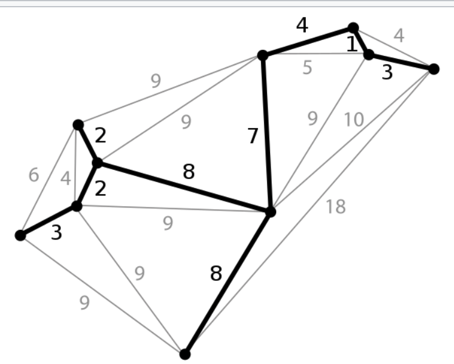
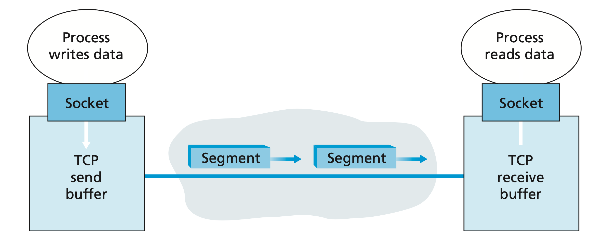
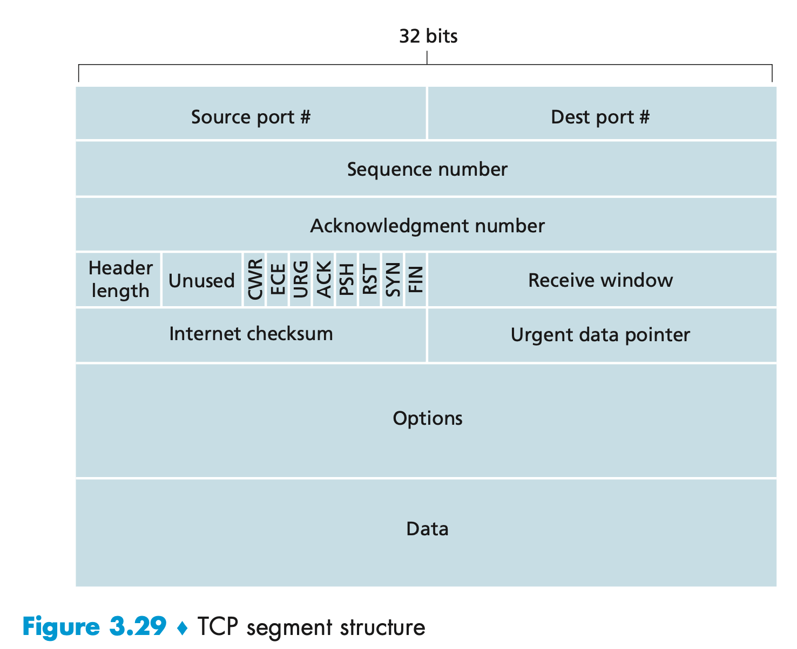
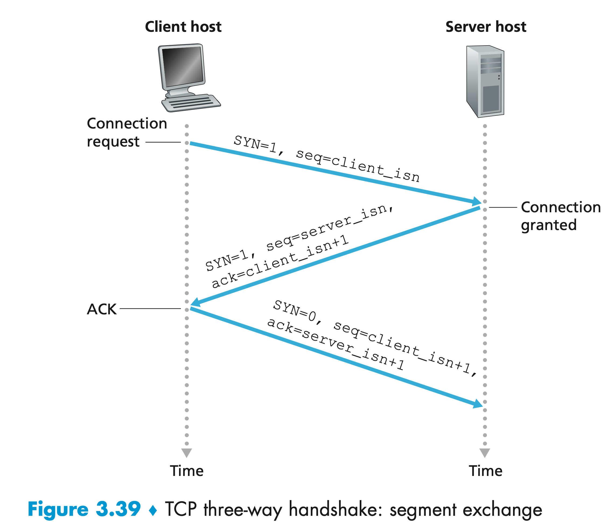
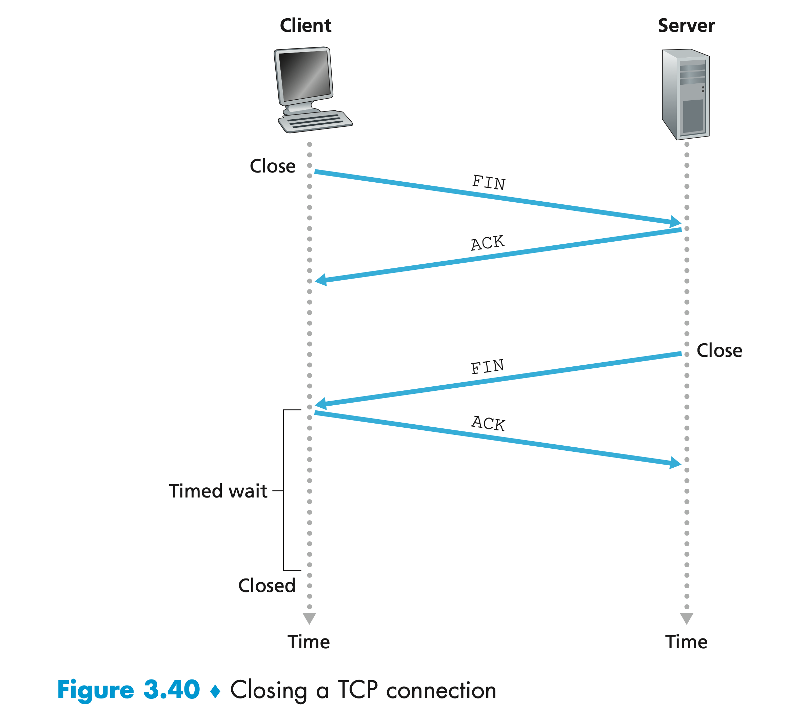
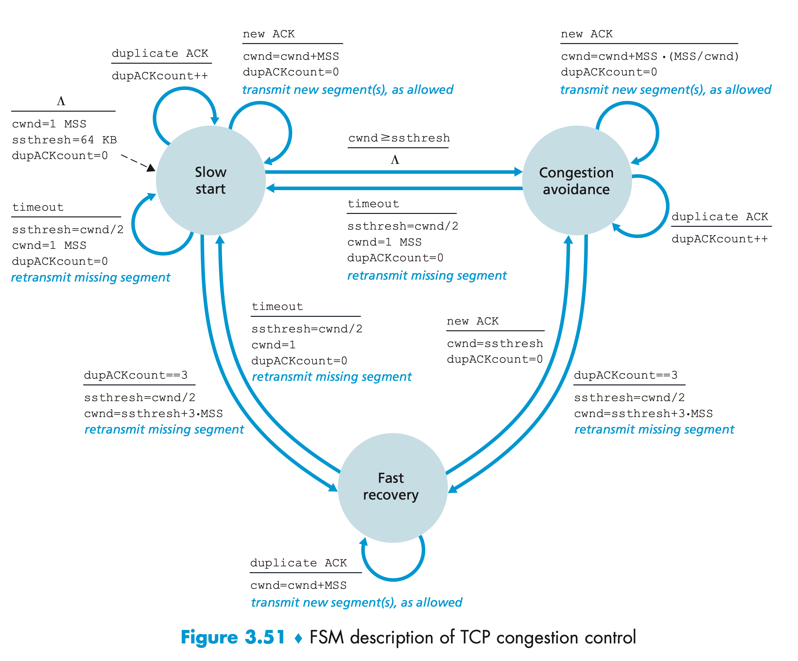

# Interview

## Algorithm

### Tree

#### Binary Tree

- has at most two children, left and right
- At most $2^{i-1}$ nodes at level $i$

##### Binary Search Tree

- the left children's values are always smaller or equal to it's parent node and the right children of the parent node

##### Binary Tree Traversal

###### General Form of Traversal

```go
func inorderTraversal(root *TreeNode) []int {

	if root == nil {
		return nil
	}
  ans := make([]int, 0)
	stack := make([]*TreeNode, 0)
	stack = append(stack, root)
	for len(stack) > 0 {
		node := stack[len(stack)-1]
		stack = stack[:len(stack)-1]
    if node != nil {
      // if we havent see the node first
      // accodring to order we arrange it accordingly 
      // below is the order of left mid right, as stack is LILO
			if node.Right != nil {
				stack = append(stack, node.Right)
			}
			stack = append(stack, node)
			stack = append(stack, nil)
			if node.Left != nil {
				stack = append(stack, node.Left)
			}
		} else {
      // nil as a indicator that we see the node before
      // so we append it to result
			node = stack[len(stack)-1]
			stack = stack[:len(stack)-1]
			ans = append(ans, node.Val)
		}
  }
}
```

###### In-order Traversal

```go
// In-order Traversal
func inorderTraversal(root *TreeNode) []int {
  ans := make([]int, 0)
  stack := make([]*TreeNode, 0)
  curr := root
  for curr != nil || len(stack) != 0 {
    for curr != nil {
      stack = append(stack, curr)
      curr = curr.Left
    }
    curr = stack[len(stack)-1]
    stack = stack[:len(stack)-1]
    ans = append(ans, curr.Val)
    curr = curr.Right
  }
  return ans
}
```

###### Pre-order Traversal

```go
//Pre-order Traversal
func preorderTraversal(root *TreeNode) []int {
  ans := make([]int, 0)
  stack := make([]*TreeNode, 0)
  if root != nil {
    stack = append(stack, root)
  }
  for len(stack) > 0 {
    node := stack[len(stack)-1]
    stack = stack[:len(stack)-1]
    ans = append(ans, node.Val)
    if node.Right != nil {
      stack = append(stack, node.Right)
    }
    if node.Left != nil {
      stack = append(stack, node.Left)
    }
  }
  return ans
}

```

###### Post-order Traversal

```go
// Post-order Traversal
func postorderTraversal(root *TreeNode) []int {
  ans := make([]int, 0)
  stack := make([]*TreeNode, 0)
  if root != nil {
    stack = append(stack, root)
  }
  for len(stack) > 0 {
    node := stack[len(stack)-1]
    stack = stack[:len(stack)-1]
    ans = append(ans, node.Val)
    if node.Left != nil {
      stack = append(stack, node.Left)
    }
    if node.Right != nil {
      stack = append(stack, node.Right)
    }
  }
  l, r := 0, len(ans)-1
  for l < r {
    ans[l], ans[r] = ans[r], ans[l]
    l++
    r--
  }
  return ans
}
```


#### AVL Tree

#### B Tree

#### B+ Tree

#### Red-Black Tree

#### Tire

#### Segment Tree

#### Haffman Tree

#### Binary Heap

#### Minimal Spanning Tree

**Minimum spanning tree** (**MST**) or **minimum weight spanning tree** is a subset of the edges of a connected, edge-weighted undirected graph that connects all the vertices together, without any cycles and with the minimum possible total edge weight.



##### Kruskal’s algorithm

1. Sort all the edges in increasing order of their weight
2. Pick the smallest edge. Check if it forms a cycle with the spanning tree formed so far. 
   - If cycle is not formed, include this edge. Else, discard it.
3. Repeat step 2 until there are (V-1) edges in the spanning tree.

##### Prim's algorithm

1. Find the smallest weight edge
2. Find the next smallest edge which the result tree will remain connected
3. Repeat step 2 until there are (V-1) edges in the spanning tree.

### Sort

Sort has few properties:

- stable:
  - stable sort: in an event of same value, it will change the place other same value
  - non-stable sort: it may has chance to change the position of same value

- in-place
  - Whether the swap is in place.

#### Merge Sort

```go
func merge(nums *[]int, temp *[]int, l, mid, r int) {
	i, j := l, mid+1
	for k := l; k <= r; k++ {
		if i > mid {
			(*temp)[k] = (*nums)[j]
			j++
		} else if j > r {
			(*temp)[k] = (*nums)[i]
			i++
		} else if (*nums)[i] <= (*nums)[j] {
			(*temp)[k] = (*nums)[i]
			i++
		} else {
			(*temp)[k] = (*nums)[j]
			j++
		}
	}
	for k := l; k <= r; k++ {
		(*nums)[k] = (*temp)[k]
	}
}
func sort(nums *[]int, temp *[]int, l, r int) {
	if l >= r {
		return
	}
	mid := l + (r-l)/2
	sort(nums, temp, l, mid)
	sort(nums, temp, mid+1, r)
	if (*nums)[mid] <= (*nums)[mid+1] {
		return
	}
	merge(nums, temp, l, mid, r)
}
func main() {
	nums := []int{9, 1, 1, 3, 5, 100}
	n := len(nums)
	temp := make([]int, n)
	sort(&nums, &temp, 0, n-1)
	fmt.Printf("%v", nums)
}
```

#### Quick Sort

```go
type quickSort struct {
}

func (q *quickSort) sort(nums *[]int, lo, hi int) {
	if hi <= lo {
		return
	}
	lt, i, gt := lo, lo+1, hi
	v := (*nums)[lo]
	for i <= gt {
		if (*nums)[i] > v {
			(*nums)[gt], (*nums)[i] = (*nums)[i], (*nums)[gt]
			gt--
		} else if (*nums)[i] < v {
			(*nums)[lt], (*nums)[i] = (*nums)[i], (*nums)[lt]
			lt++
			i++
		} else {
			i++
		}
	}
	q.sort(nums, lo, lt-1)
	q.sort(nums, gt+1, hi)
}
func shuffle(nums *[]int) {
	rand.Seed(time.Now().UnixNano())
	for i := range *nums {
		r := rand.Intn(i + 1)
		(*nums)[i], (*nums)[r] = (*nums)[r], (*nums)[i]
	}
}
func (q *quickSort) quickSort(data []int) {
	shuffle(&data)
	q.sort(&data, 0, len(data)-1)
}
func main() {
	nums := []int{4, 2, 9, 3, 1, 10, 6, 8, 7, 5}
	q := &quickSort{}
	q.quickSort(nums)
	fmt.Println(nums)
}
```

#### Topological Sort

Normally use it for cycle detection

1. Keep a set of visited set. Start with in-degree of 0 in the queue, loop through neighbours,
2. If we haven't visit that neighbour yet, mark it as visited and increase the in-degree by one. If it's in-degree of 0, add it to the queue.
3. Continue for all the nodes inside the queue, until the queue is empty.

### Search

#### 3-Way Quick Search

```go
// 3 way quick search for top k value
func shuffle(nums *[]int) {
	rand.Seed(time.Now().UnixNano())
	for i := range *nums {
		r := rand.Intn(i + 1)
		(*nums)[i], (*nums)[r] = (*nums)[r], (*nums)[i]
	}
}
func partition(nums *[]int, lo, hi int) (int, int) {
	lt, i, gt := lo, lo+1, hi
	v := (*nums)[lo]
	for i <= gt {
		if (*nums)[i] > v {
			(*nums)[gt], (*nums)[i] = (*nums)[i], (*nums)[gt]
			gt--
		} else if (*nums)[i] < v {
			(*nums)[lt], (*nums)[i] = (*nums)[i], (*nums)[lt]
			lt++
			i++
		} else {
			i++
		}
	}
	return lt, gt
}
func quickSelect(nums *[]int, k int) {
	n := len(*nums)
	if k < 0 || k >= n {
		return
	}
	shuffle(nums)
	lo, hi := 0, n-1
	for lo < hi {
		lt, gt := partition(nums, lo, hi)
		fmt.Printf("lt %v, gt %v, array after single partition %v\n", lt, gt, *nums)
		if k > gt {
			lo = gt + 1
		} else if k < lt {
			hi = lt - 1
		} else {
			return
		}
	}
	return
}
func main() {
	nums := []int{9, 7, 3, 5, 6, 8, 5, 4, 5, 5}
	n := len(nums)
	mid := n / 2
	fmt.Printf("Mid index is %v\n", mid)
	fmt.Printf("orinal array is %v\n", nums)
	quickSelect(&nums, mid)
	fmt.Printf("final array %v", nums)
}
```

### Hash Table

Key-Value pair store which key will be hashed using hash function.

#### Collision Resolution

- **Open addressing**: if the event of collision, it will find the next available slots
  - *linear probing*: Find the next available slot linearly by increasing the index
  - *Quadratic Probing*: If $(hash(x) + 1*1) % S$ is also full, then we try $(hash(x) + 2*2) % S$
  - *Double Hashing*:(hash1(key) + i \* hash2(key)) % TABLE_SIZE
- **Separate Chaining**: Every slots inside the array will be a chain of linked list which stores all the collision hash values

### Graph

#### Single Source Shortest Path

##### Dijkstra algorithm

1. Find the Source Point, Mark all other vertices's weight as infinity.
2. Relax the neighbour vertices by choosing the min weight, it will need to relax n times, where n is number of neighbours
   - From u to v, we have W(u): weight of v, C(u,v): cost of u to v.
   - W(u) = min(W(v) + C(u, v),  W(u))
3. Find the next min weight vertex and repeat the step 2-3 until all vertices are relaxed.

###### Runtime

$O(|V| |V - 1|) = O(V^2)$

#### Drawback

Only applied for positive weight directed acyclic graph(DAG)

##### Bellman-Ford

1. Find the Source Point, Mark all other vertices's weight as infinity.
2. List out all edges in sequences and relax the vertex
3. Continue Step 2 for V - 1 times where V is the number of vertices in the graph

###### Runtime

O(|E| |V-1|)

In a complete graph, $|E| = \frac{n(n - 1)}{2}, |E| \times|V-1| = V^3$ 

###### Drawback

Only applied for directed acyclic graph(DAG), can be negative weight but the graph should not contain cyclic.

### String

#### Pattern Matching

##### KMP

1. Create a Next array to keep track of repeating patterns

   - eg. abcab, the next array will be [0, 0, 0, 1, 2]

     ```go
     // where s is the pattern string
     prefix := make([]int, n)
     j := 0
     for i := 1; i < n; i++ {
       for j > 0 && s[i] != s[j] {
         j = prefix[j-1]
       }
       if s[i] == s[j] {
         j++
       }
       prefix[i] = j
     }
     ```

2. base on the next array to find out the matching pattern in linear time.

   - if there is no match for search string ptr and pattern string ptr, we back track to previous next array content index
   - if there is a match, increase both ptr for search string and pattern string

3. we end the search if

   - we reach the end of pattern string, which means, there is a match
   - we reach the end of search string but not pattern, it means we does not have a match.

   ```go
   func strStr(haystack string, needle string) int {
   	n, m := len(haystack), len(needle)
   	if m == 0 {
   		return 0
   	}
   	if n < m {
   		return -1
   	}
   
   	// create prefix table with m + 1 size
   	// index 0 as placeholder
   	prefix := make([]int, m)
   	j := 0
   	for i := 1; i < m; i++ {
   		for j > 0 && needle[i] != needle[j] {
   			j = prefix[j-1]
   		}
   		if needle[i] == needle[j] {
   			j++
   		}
   		prefix[i] = j
   	}
   
   	// search
   	j = 0
   	for i := range haystack {
   		for j > 0 && haystack[i] != needle[j] {
   			j = prefix[j-1]
   		}
   
   		if haystack[i] == needle[j] {
   			j++
   			if j == m {
   				return i - m + 1
   			}
   		}
   	}
   
   	return -1
   }
   ```

   


## Network

### TCP

TCP directs this data to the connection’s **send buffer**, which is one of the buffers that is set aside during the initial three-way handshake. 

The maximum amount of data that can be grabbed and placed in a segment is limited by the **maximum segment size (MSS)**. Setting the MSS to ensure that a TCP segment (when encapsulated in an IP datagram) plus the TCP/IP header length (typically 40 bytes) will fit into a single link-layer frame. Both Ethernet and PPP link-layer protocols have an MTU of 1,500 bytes. Thus a typical value of MSS is 1460 bytes. Note that the MSS is the maximum amount of application-layer data in the segment, not the maximum size of the TCP segment including headers.





- The **source and destination port numbers**, which are used for multiplexing/demultiplexing data from/to upper-layer applications.
- The  **checksum field** to check the error bits.
- The 32-bit **sequence number field**：The byte-stream number of the first byte in the segment.
- The 32-bit **acknowledgment number field**:The acknowledgment number that Host A puts in its segment is the sequence number of the next byte Host A is expecting from Host B. 
- The 16-bit **receive window** field is used for flow control. It is used to indicate the number of bytes that a receiver is willing to accept.
- The 4-bit **header length field** specifies the length of the TCP header in 32-bit words. The TCP header can be of variable length due to the TCP options field. (Typically, the options field is empty, so that **the length of the typical TCP header is 20 bytes**.)
- The optional and variable-length **options field** is used when a sender and receiver negotiate the *maximum segment size (MSS)* or as a window scaling factor for use in high-speed networks. A time-stamping option is also defined. See RFC 854 and RFC 1323 for additional details.
- The **flag field** contains 6 bits. 
  - The **ACK bit** is used to indicate that the value carried in the acknowledgment field is valid; that is, the segment contains an acknowledgment for a segment that has been successfully received. 
  - The **RST**,**SYN**, and **FIN** bits are used for connection setup and teardown. 
  - The **CWR** and **ECE** bits are used in explicit congestion notification.
  - Setting the **PSH** bit indicates that the receiver should pass the data to the upper layer immediately. 
  - **RST** bit set when need to send errors, eg suppose a host receives a TCP SYN packet with desti- nation port 80, but the host is not accepting connections on port 80. Then the host will send a special reset segment to the source. This TCP segment has the RST flag bit (see Section 3.5.2) set to 1. 
  - Finally, the **URG** bit is used to indicate that there is data in this segment that the sending-side upper-layer entity has marked as “urgent.” The location of the last byte of this urgent data is indicated by the 16-bit **urgent data pointer field**. TCP must inform the receiving-side upper-layer entity when urgent data exists and pass it a pointer to the end of the urgent data. 

(In practice, the PSH, URG, and the urgent data pointer are not used. However, we mention these fields for completeness.)

**Estimating the Round-Trip Time**

At any point in time, the SampleRTT is being estimated for only one of the transmitted but currently unacknowledged segments, leading to a new value of SampleRTT approximately once every RTT.

The recommended value of α is α = 0.125

$EstimatedRTT=(1–α)\times EstimatedRTT+α \times SampleRTT$

The RTT variation, DevRTT, as an estimate of how much SampleRTT typically deviates from EstimatedRTT:

$ DevRTT=(1–β)\times DevRTT+β \times|SampleRTT–EstimatedRTT|$

So the timeout interval will be:

$TimeoutInterval = EstimatedRTT + 4 \times DevRTT$

An initial TimeoutInterval value of 1 second is recommended. when a timeout occurs, the value of TimeoutInterval is doubled to avoid a premature timeout occurring for a subsequent segment that will soon be acknowledged. However, as soon as a segment is received and EstimatedRTT is updated, the TimeoutInterval is again computed using the formula above.

**Reliable Data Transfer**

In the event of timeout:

- There is a timer, TCP starts the timer when the segment is passed to IP. The expiration interval for this timer is the TimeoutInterval mentioned above.
- TCP responds to the timeout event by retransmitting the segment that caused the timeout. TCP then restarts the timer. Each time TCP retransmits, it sets the next timeout interval to twice the previous value

In the event of lost package or lost ack reply, send will re-send the whole package or the lost ack segment.

**Fast Retransmit**

A **duplicate ACK** is an ACK that reacknowledges a segment for which the sender has already received an earlier acknowledgment. If the TCP sender receives three duplicate ACKs for the same data, it takes this as an indication that the segment following the segment that has been ACKed three times has been lost. The TCP sender performs a **fast retransmit** , retransmitting the missing segment *before* that segment’s timer expires. 

**Flow Control**

TCP provides a **flow-control service** to its applications to eliminate the possibility of the sender overflowing the receiver’s buffer. 

TCP provides flow control by having the *sender* maintain a variable called the **receive window**. Informally, the receive window is used to give the sender an idea of how much free buffer space is available at the receiver.

Let's have a RcvBuffer and define the following variables:

- *LastByteRead*: the number of the last byte in the data stream read from the buffer by the application process

- *LastByteRcvd*: the number of the last byte in the data stream that has arrived from the network and has been placed in the receive buffer

Make sure $LastByteRcvd – LastByteRead <= RcvBuffer$

The receive window, denoted *rwnd* is set to the amount of spare room in the buffer:

$rwnd = RcvBuffer\ – \ [\ LastByteRcvd\ \ –\ \  LastByteRead\ ]$

Receiver tells sender how much spare room it has in the connection buffer by placing its current value of *rwnd* in the receive window field of every segment it sends to sender. Initially, receiver sets rwnd = RcvBuffer. 

keeps track of two variables, *LastByteSent* and *Last-ByteAcked*. By keeping the amount of unacknowledged data less than the value of rwnd, sender make sure

$LastByteSent\ – \ LastByteAcked <= rwnd$

The TCP specification requires sender to continue to send segments with one data byte when receiver window is zero. 

#### Hand Shake

1. The client-side TCP first sends a special TCP segment to the server-side TCP. 
   - no application-layer data but SYN bit is set to 1
   - randomly chooses an initial sequence number (client_isn)
2. The server extracts the TCP SYN segment from the datagram, allocates the TCP buffers and variables to the connection, and sends a connection-granted segment to the client TCP.
   - The SYN bit is set to 1. 
   - The acknowledgment field of the TCP segment header is set to client_isn+1. 
   - The server chooses its own initial sequence number (server_isn) and puts this value in the sequence number field of the TCP segment header.
3. The client also allocates buffers and variables to the connection. The client host then sends the server yet another segment; this last segment acknowledges the server’s connection-granted segment (the client does so by putting the value server_isn+1 in the acknowledgment field of the TCP segment header). The SYN bit is set to zero, since the connection is established. This third stage of the three-way handshake may carry client-to- server data in the segment payload.



#### Close Connection

When the client application process issues a close command.

1. this causes the client TCP to send a special TCP segment to the server process. This special segment has a flag bit in the segment’s header, the FIN bit set to 1. 
2. When the server receives this segment, it sends the client an acknowledgment segment in return. 
3. The server then sends its own shutdown segment, which has the FIN bit set to 1. 
4. Finally, the client acknowledges the server’s shutdown segment. At this point, all the resources in the two hosts are now deallocated.



#### Congestion Control

At the highest level, we can distinguish among congestion-control approaches by whether the network layer provides explicit assistance to the transport layer for congestion-control purposes:

- *End-to-end congestion control*. In an end-to-end approach to congestion control, the network layer provides no explicit support to the transport layer for congestion-control purposes.
- *Network-assisted congestion control*. With network-assisted congestion control, routers provide explicit feedback to the sender and/or receiver regarding the congestion state of the network. 
  - Direct feedback may be sent from a network router to the sender.
  - The more common form of notification occurs when a router marks/updates a field in a packet flowing from sender to receiver to indicate congestion. Upon receipt of a marked packet, the receiver then notifies the sender of the congestion indication.

TCP must use end-to-end congestion control rather than network-assisted congestion control, since the IP layer provides no explicit feedback to the end systems regarding network congestion.

The approach taken by TCP is to have each sender limit the rate at which it sends traffic into its connection as a function of perceived network congestion. 

- If a TCP sender perceives that there is little congestion on the path between itself and the destination, then the TCP sender increases its send rate.
- If the sender perceives that there is congestion along the path, then the sender reduces its send rate. 

**How does a TCP sender limit the rate at which it sends traffic into its connection?**

- TCP has extra variables called **congestion window** denoted *cwnd*, imposes a constraint on the rate at which a TCP sender can send traffic into the network. Specifically, the amount of unacknowledged data at a sender may not exceed the minimum of *cwnd* and *rwnd*, that is:

  $LastByteSent\ –\ LastByteAcked <= min(cwnd, rwnd)$

  Assume rwnd is always larger than cwnd, so the send rate will limit to cwnd/RTT.

**How does a TCP sender perceive that there is congestion on the path between itself and the destination?** 

The results in a loss event at the sender—either a timeout or the receipt of three duplicate ACKs—which is taken by the sender to be an indication of congestion on the sender-to-receiver path. 

**What algorithm should the sender use to change its send rate as a function of perceived end-to-end congestion?**

Use acknowledgments to increase its congestion window size (and hence its transmission rate). Note that if acknowledgments arrive at a relatively slow rate (e.g., if the end-end path has high delay or contains a low-bandwidth link), then the congestion window will be increased at a relatively slow rate. On the other hand, if acknowledgments arrive at a high rate, then the congestion window will be increased more quickly. Because TCP uses acknowledgments to trigger (or clock) its increase in congestion window size, TCP is said to be **self-clocking**.

**How should a TCP sender determine the rate at which it should send?**

 TCP using the following guiding principles:

- *A lost segment implies congestion, and hence, the TCP sender’s rate should be decreased when a segment is lost.*
- *An acknowledged segment indicates that the network is delivering the sender’s segments to the receiver, and hence, the sender’s rate can be increased when an ACK arrives for a previously unacknowledged segment.*
- *Bandwidth probing*. Given ACKs indicating a congestion-free source-to-destination path and loss events indicating a congested path, TCP’s strategy for adjusting its transmission rate is to increase its rate in response to arriving ACKs until a loss event occurs, at which point, the transmission rate is decreased. 

##### TCP congestion-control algorithm

Slow start and congestion avoidance are mandatory components of TCP, differing in how they increase the size of cwnd in response to received ACKs. Slow start increases the size of cwnd more rapidly than congestion avoidance. Fast recovery is recommended, but not required, for TCP senders.

- slow start
  - When a TCP connection begins, the value of cwnd is typically initialized to a small value of 1 MSS, resulting in an initial sending rate of roughly MSS/ RTT. And increases by 1 MSS(for every ACK) every time a transmitted segment is first acknowledged. 
  - If there is a loss event (i.e., congestion) indicated by a timeout
    - the TCP sender sets the value of cwnd to 1 and begins the slow start process anew.
    -  It also sets the value of a second state variable, *ssthresh* (shorthand for “slow start threshold”) to *cwnd/2*—half of the value of the congestion window value when congestion was detected.
  - When the value of cwnd equals ssthresh, slow start ends and TCP transitions into congestion avoidance mode. TCP increases cwnd more cautiously when in congestion avoidance mode. 
  - If three duplicate ACKs are detected, in which case TCP performs a fast retransmit and enters the fast recovery state. 
- congestion avoidance
  - increases the value of cwnd by just a single MSS every RTT. A common approach is for the TCP sender to increase cwnd by MSS bytes (MSS/cwnd) whenever a new acknowledgment arrives. 
    - For example, if MSS is 1,460 bytes and cwnd is 14,600 bytes, then 10 segments are being sent within an RTT. Each arriving ACK (assuming one ACK per segment) increases the congestion window size by 1/10 MSS, and thus, the value of the congestion window will have increased by one MSS after ACKs when all 10 segments have been received.
  - If three duplicate ACKs are detected, TCP halves the value of cwnd (adding in 3 MSS for good measure to account for the triple duplicate ACKs received) and records the value of ssthresh to be half the value of cwnd when the triple duplicate ACKs were received. The fast-recovery state is then entered.
- fast recovery
  - the value of cwnd is increased by 1 MSS for every duplicate ACK received for the missing segment that caused TCP to enter the fast-recovery state. Eventually, when an ACK arrives for the missing segment, TCP enters the congestion-avoidance state after deflating cwnd. 
  - If a timeout event occurs, fast recovery transitions to the slow-start state after performing the same actions as in slow start and congestion avoidance: The value of cwnd is set to 1 MSS, and the value of ssthresh is set to half the value of cwnd when the loss event occurred.



Ignoring the initial slow-start period when a connection begins and assuming that losses are indicated by triple duplicate ACKs rather than timeouts, TCP’s congestion control consists of linear (additive) increase in cwnd of 1 MSS per RTT and then a halving (multiplicative decrease) of cwnd on a triple duplicate-ACK event. For this reason, TCP congestion control is often referred to as an **additive-increase, multiplicative- decrease (AIMD)** form of congestion control. 
