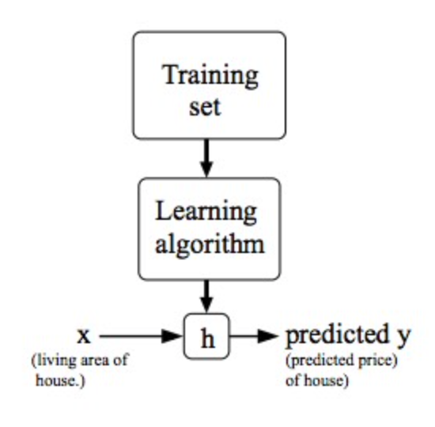

[toc]

# Machine Learning

## Type of Machine Learning Algorithms

- Supervised learning
- Unsupervised learning
- Reinforcement learning
- Recommended systems

## Supervised Learning

### Model Representation

We’ll use $x^{(i)}$ to denote the “input” variables, also called input features, and $y^{(i)}$ to denote the “output” or target variable that we are trying to predict. A pair $(x^{(i)}, y^{(i)})$ is called a training example, and the datasets that we’ll be using to learn—a list of m training examples $(x^{(i)}, y^{(i)}); i=1,...,m$ —is called a training set. 

> **_Note_**: The superscript `(i)` in the notation is simply an index into the training set, and has nothing to do with exponentiation. 

We will also use `X` to denote the space of input values, and `Y` to denote the space of output values. In this example, X = Y = ℝ. 

To describe the supervised learning problem slightly more formally, our goal is, given a training set, to learn a function h : X → Y so that h(x) is a “good” predictor for the corresponding value of y. For historical reasons, this function h is called a hypothesis. Seen pictorially, the process is therefore like this:

When the target variable that we’re trying to predict is continuous, such as in our housing example, we say the learning problem is a `regression problem`. 

When `y` can take on only a small number of discrete values (such as if, given the living area, we wanted to predict if a dwelling is a house or an apartment, say), we call it a `classification problem`.

### Cost Function

We can measure the accuracy of our hypothesis function by using a **cost function**. This takes an average difference (actually a fancier version of an average) of all the results of the hypothesis with inputs from x's and the actual output y's.
$$
J(\theta_0, \theta_1) = \frac{1}{2m}\sum_{i=1}^n(h_0(x^{(i)} - y^{(i)}))^2
$$
To break it apart, it is $\frac{1}{2}\overline{x}$ where $\overline{x}$ is the mean of the squares of $h_0(x_i) - y_i$, or the difference between the predicted value and the actual value.

This function is otherwise called the "Squared error function", or "Mean squared error". The mean is halved $(\frac{1}{2})$ as a convenience for the computation of the gradient descent, as the derivative term of the square function will cancel out the term.The goal is to minimise the $j(\theta_0, \theta_1)$

### Gradient Descent

A algorithm to minimise the cost function.

Repeat until convergence {
$$
\theta_j := ~ \theta_j - \alpha \frac{\partial}{\partial \theta_j} J(\theta_0, \theta_1) ~ (for ~ j = 0 ~ and ~ j = 1)
$$
}

Where

1. `:=` means assign
2. $\theta$, learning rate

#### Correct Implementation

Simultaneous update
$$
temp0 := \theta_0 - \alpha \frac{\partial}{\partial \theta_0} J(\theta_0, \theta_1)
\\
temp1 := \theta_1 - \alpha \frac{\partial}{\partial \theta_1} J(\theta_0, \theta_1)
\\
\theta_0 := temp0
\\
\theta_1 := temp1
$$

#### Gradient Descent Intuition

Assume one example
$$
\theta_1 := \theta_1 - \alpha \frac{\part}{\part \theta_1} ~ J(\theta_1)
$$
The $\frac{\part}{\part \theta_1} ~ J(\theta_1)$ represent the slope of the curve, 

If the curve is increasing, then $\frac{\part}{\part \theta_1} ~ J(\theta_1)$ will be positive. Since the curve is increasing , we need to decrease $\theta_1$ to get minimise $\theta_1$

If the curve is decreasing, then $\frac{\part}{\part \theta_1} ~ J(\theta_1)$ will be negative. Since the curve is decreasing , we need to increase $\theta_1$ to get minimise $\theta_1$

## Unsupervised Learning

Use Clustering algorithms to group the data together.

