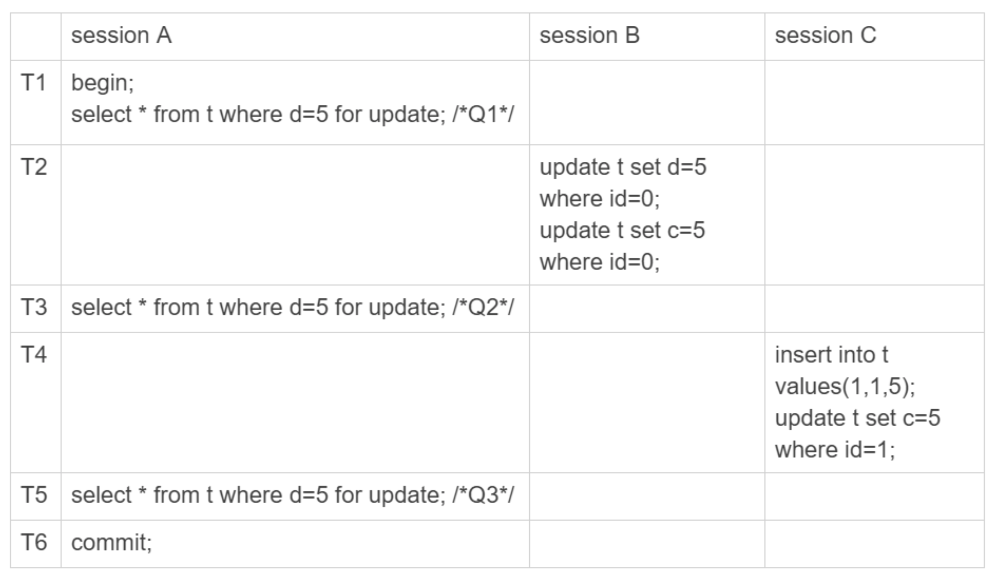
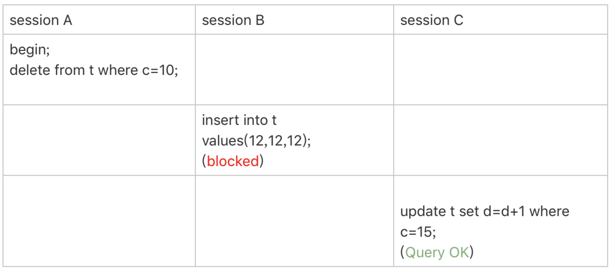
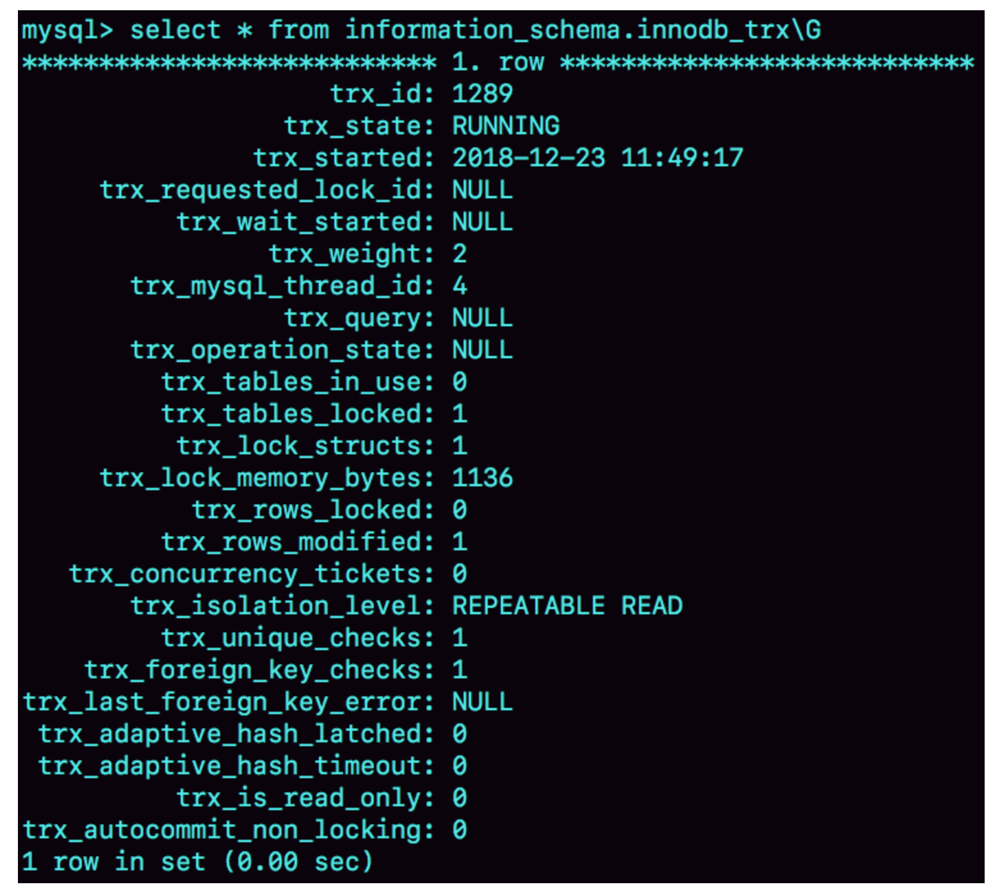
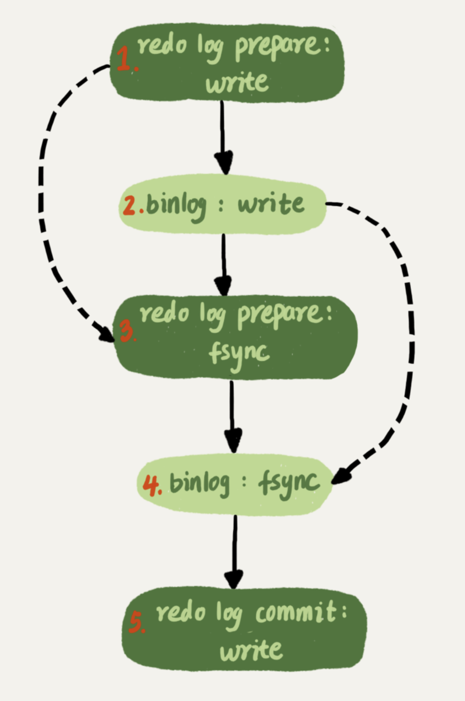

# MySQL

## MySQL 架构


MySQL可以分为Server层和存储引擎层两部分

Server层包括连接器、查询缓存、分析器、优化器、执行器等，涵盖MySQL的大多数核心服务功能，以及所有的内置函数（如日期、时间、数学和加密函数等），所有跨存储引擎的功能都在这一层实现，比如存储过程、触发器、视图等。

而存储引擎层负责数据的存储和提取。其架构模式是插件式的，支持InnoDB、MyISAM、Memory等多个存储引擎。现在最常用的存储引擎是InnoDB，它从MySQL 5.5.5版本开始成为了默认存储引擎。

当执行create table建表的时候，如果不指定引擎类型，默认使用的就是InnoDB。不过，你也可以通过指定存储引擎的类型来选择别的引擎，比如在create table语句中使用engine=memory, 来指定使用内存引擎创建表。不同存储引擎的表数据存取方式不同，支持的功能也不同。

### 连接器

第一步，你会先连接到这个数据库上，这时候接待你的就是连接器。连接器负责跟客户端建立连接、获取权限、维持和管理连接。连接命令一般是这么写的：

```
mysql -h$ip -P$port -u$user -p
```

连接命令中的mysql是客户端工具，用来跟服务端建立连接。在完成经典的TCP握手后，连接器就要开始认证你的身份，这个时候用的就是你输入的用户名和密码。

- 如果用户名或密码不对，你就会收到一个"Access denied for user"的错误，然后客户端程序结束执行。
- 如果用户名密码认证通过，连接器会到权限表里面查出你拥有的权限。之后，这个连接里面的权限判断逻辑，都将依赖于此时读到的权限。

这就意味着，一个用户成功建立连接后，即使你用管理员账号对这个用户的权限做了修改，也不会影响已经存在连接的权限。修改完成后，只有再新建的连接才会使用新的权限设置。

使用长连接后，你可能会发现，有些时候MySQL占用内存涨得特别快，这是因为MySQL在执行过程中临时使用的内存是管理在连接对象里面的。这些资源会在连接断开的时候才释放。所以如果长连接累积下来，可能导致内存占用太大，被系统强行杀掉（OOM），从现象看就是MySQL异常重启了。

怎么解决这个问题呢？你可以考虑以下两种方案。

1. 定期断开长连接。使用一段时间，或者程序里面判断执行过一个占用内存的大查询后，断开连接，之后要查询再重连。
2. 如果你用的是MySQL 5.7或更新版本，可以在每次执行一个比较大的操作后，通过执行 mysql_reset_connection来重新初始化连接资源。这个过程不需要重连和重新做权限验证，但是会将连接恢复到刚刚创建完时的状态。

### 查询缓存

连接建立完成后，你就可以执行select语句了。执行逻辑就会来到第二步：查询缓存。

MySQL拿到一个查询请求后，会先到查询缓存看看，之前是不是执行过这条语句。之前执行过的语句及其结果可能会以key-value对的形式，被直接缓存在内存中。key是查询的语句，value是查询的结果。如果你的查询能够直接在这个缓存中找到key，那么这个value就会被直接返回给客户端。

如果语句不在查询缓存中，就会继续后面的执行阶段。执行完成后，执行结果会被存入查询缓存中。你可以看到，如果查询命中缓存，MySQL不需要执行后面的复杂操作，就可以直接返回结果，这个效率会很高。

**但是大多数情况下我会建议你不要使用查询缓存，为什么呢？因为查询缓存往往弊大于利。**

查询缓存的失效非常频繁，只要有对一个表的更新，这个表上所有的查询缓存都会被清空。因此很可能你费劲地把结果存起来，还没使用呢，就被一个更新全清空了。对于更新压力大的数据库来说，查询缓存的命中率会非常低。除非你的业务就是有一张静态表，很长时间才会更新一次。比如，一个系统配置表，那这张表上的查询才适合使用查询缓存。

好在MySQL也提供了这种“按需使用”的方式。你可以将参数query_cache_type设置成DEMAND，这样对于默认的SQL语句都不使用查询缓存。而对于你确定要使用查询缓存的语句，可以用SQL_CACHE显式指定，像下面这个语句一样：

```
mysql> select SQL_CACHE * from T where ID=10；
```

需要注意的是，MySQL 8.0版本直接将查询缓存的整块功能删掉了，也就是说8.0开始彻底没有这个功能了。

### 分析器

如果没有命中查询缓存，就要开始真正执行语句了。首先，MySQL需要知道你要做什么，因此需要对SQL语句做解析。

分析器先会做“词法分析”。你输入的是由多个字符串和空格组成的一条SQL语句，MySQL需要识别出里面的字符串分别是什么，代表什么。

MySQL从你输入的"select"这个关键字识别出来，这是一个查询语句。它也要把字符串“T”识别成“表名T”，把字符串“ID”识别成“列ID”。

做完了这些识别以后，就要做“语法分析”。根据词法分析的结果，语法分析器会根据语法规则，判断你输入的这个SQL语句是否满足MySQL语法。

如果你的语句不对，就会收到“You have an error in your SQL syntax”的错误提醒，比如下面这个语句select少打了开头的字母“s”。

```
mysql> elect * from t where ID=1;

ERROR 1064 (42000): You have an error in your SQL syntax; check the manual that corresponds to your MySQL server version for the right syntax to use near 'elect * from t where ID=1' at line 1
```

一般语法错误会提示第一个出现错误的位置，所以你要关注的是紧接“use near”的内容。

### 优化器

经过了分析器，MySQL就知道你要做什么了。在开始执行之前，还要先经过优化器的处理。

优化器是在表里面有多个索引的时候，决定使用哪个索引；或者在一个语句有多表关联（join）的时候，决定各个表的连接顺序。比如你执行下面这样的语句，这个语句是执行两个表的join：

```
mysql> select * from t1 join t2 using(ID)  where t1.c=10 and t2.d=20;
```

- 既可以先从表t1里面取出c=10的记录的ID值，再根据ID值关联到表t2，再判断t2里面d的值是否等于20。
- 也可以先从表t2里面取出d=20的记录的ID值，再根据ID值关联到t1，再判断t1里面c的值是否等于10。

这两种执行方法的逻辑结果是一样的，但是执行的效率会有不同，而优化器的作用就是决定选择使用哪一个方案。

优化器阶段完成后，这个语句的执行方案就确定下来了，然后进入执行器阶段

### 执行器

MySQL通过分析器知道了你要做什么，通过优化器知道了该怎么做，于是就进入了执行器阶段，开始执行语句。

开始执行的时候，要先判断一下你对这个表T有没有执行查询的权限，如果没有，就会返回没有权限的错误，如下所示(在工程实现上，如果命中查询缓存，会在查询缓存放回结果的时候，做权限验证。查询也会在优化器之前调用precheck验证权限)。

```
mysql> select * from T where ID=10;

ERROR 1142 (42000): SELECT command denied to user 'b'@'localhost' for table 'T'
```

如果有权限，就打开表继续执行。打开表的时候，执行器就会根据表的引擎定义，去使用这个引擎提供的接口。

比如我们这个例子中的表T中，ID字段没有索引，那么执行器的执行流程是这样的：

1. 调用InnoDB引擎接口取这个表的第一行，判断ID值是不是10，如果不是则跳过，如果是则将这行存在结果集中；
2. 调用引擎接口取“下一行”，重复相同的判断逻辑，直到取到这个表的最后一行。
3. 执行器将上述遍历过程中所有满足条件的行组成的记录集作为结果集返回给客户端。

至此，这个语句就执行完成了。

对于有索引的表，执行的逻辑也差不多。第一次调用的是“取满足条件的第一行”这个接口，之后循环取“满足条件的下一行”这个接口，这些接口都是引擎中已经定义好的。

你会在数据库的慢查询日志中看到一个rows_examined的字段，表示这个语句执行过程中扫描了多少行。这个值就是在执行器每次调用引擎获取数据行的时候累加的。

在有些场景下，执行器调用一次，在引擎内部则扫描了多行，因此**引擎扫描行数跟rows_examined并不是完全相同的。**

## 日志模块

### redo log

redo log是InnoDB引擎特有的日志, 用来保证crash safe， 物理日志。

如果每一次的更新操作都需要写进磁盘，然后磁盘也要找到对应的那条记录，然后再更新，整个过程IO成本、查找成本都很高。为了解决这个问题，MySQL里经常说到的WAL技术，WAL的全称是Write-Ahead Logging，它的关键点就是先写日志，再写磁盘。

具体来说，当有一条记录需要更新的时候，InnoDB引擎就会先把记录写到redo log里面，并更新内存，这个时候更新就算完成了。同时，InnoDB引擎会在适当的时候，将这个操作记录更新到磁盘里面，而这个更新往往是在系统比较空闲的时候做。

InnoDB的redo log是固定大小的，比如可以配置为一组4个文件，每个文件的大小是1GB。从头开始写，写到末尾就又回到开头循环写，如下面这个图所示。


write pos是当前记录的位置，一边写一边后移，写到第3号文件末尾后就回到0号文件开头。checkpoint是当前要擦除的位置，也是往后推移并且循环的，擦除记录前要把记录更新到数据文件。

write pos和checkpoint之间的是“粉板”上还空着的部分，可以用来记录新的操作。如果write pos追上checkpoint，表示“粉板”满了，这时候不能再执行新的更新，得停下来先擦掉一些记录，把checkpoint推进一下。

有了redo log，InnoDB就可以保证即使数据库发生异常重启，之前提交的记录都不会丢失，这个能力称为**crash-safe**。

### binlog

Server层也有自己的日志，称为binlog（归档日志), 逻辑日志。 Binlog有两种模式，statement 格式的话是记sql语句， row格式会记录行的内容，记两条，更新前和更新后都有。

最开始MySQL里并没有InnoDB引擎。MySQL自带的引擎是MyISAM，但是MyISAM没有crash-safe的能力，binlog日志只能用于归档。而InnoDB是另一个公司以插件形式引入MySQL的，既然只依靠binlog是没有crash-safe能力的，所以InnoDB使用另外一套日志系统——也就是redo log来实现crash-safe能力。

这两种日志有以下三点不同。

1. redo log是InnoDB引擎特有的；binlog是MySQL的Server层实现的，所有引擎都可以使用。
2. redo log是物理日志，记录的是“在某个数据页上做了什么修改”；binlog是逻辑日志，记录的是这个语句的原始逻辑，比如“给ID=2这一行的c字段加1 ”。
3. redo log是循环写的，空间固定会用完；binlog是可以追加写入的。“追加写”是指binlog文件写到一定大小后会切换到下一个，并不会覆盖以前的日志。

有了对这两个日志的概念性理解，我们再来看执行器和InnoDB引擎在执行这个简单的update语句时的内部流程。

```sql
update T set c=c+1 where ID=2;
```

1. 执行器先找引擎取ID=2这一行。ID是主键，引擎直接用树搜索找到这一行。如果ID=2这一行所在的数据页本来就在内存中，就直接返回给执行器；否则，需要先从磁盘读入内存，然后再返回。
2. 执行器拿到引擎给的行数据，把这个值加上1，比如原来是N，现在就是N+1，得到新的一行数据，再调用引擎接口写入这行新数据。
3. 引擎将这行新数据更新到内存中，同时将这个更新操作记录到redo log里面，此时redo log处于prepare状态。然后告知执行器执行完成了，随时可以提交事务。
4. 执行器生成这个操作的binlog，并把binlog写入磁盘。
5. 执行器调用引擎的提交事务接口，引擎把刚刚写入的redo log改成提交（commit）状态，更新完成。

这里我给出这个update语句的执行流程图，图中浅色框表示是在InnoDB内部执行的，深色框表示是在执行器中执行的。


### 两阶段提交

redo log和binlog都可以用于表示事务的提交状态，而两阶段提交就是让这两个状态保持逻辑上的一致。

redo log用于保证crash-safe能力。

- innodb_flush_log_at_trx_commit这个参数设置成1的时候，表示每次事务的redo log都直接持久化到磁盘。总是把它设置成1，这样可以保证MySQL异常重启之后数据不丢失。

- sync_binlog这个参数设置成1的时候，表示每次事务的binlog都持久化到磁盘。总是把它也设置成1，这样可以保证MySQL异常重启之后binlog不丢失。

#### 在两阶段提交的不同时刻，MySQL异常重启会出现什么现象

- 写入redo log 处于prepare阶段之后、写binlog之前，发生了崩溃（crash），由于此时binlog还没写，redo log也还没提交，崩溃恢复的时候，这个事务会回滚。这时候，binlog还没写，所以也不会传到备库。

- 当binlog写完，redo log还没commit前发生crash。
  - 如果redo log里面的事务是完整的，也就是已经有了commit标识，则直接提交；
  - 如果redo log里面的事务只有完整的prepare，则判断对应的事务binlog是否存在并完整：
    - 如果是，则提交事务
    - 否则，回滚事务。 

####  binlog的完整性

一个事务的binlog是有完整格式的：

- statement格式的binlog，最后会有COMMIT；
- row格式的binlog，最后会有一个XID event。
- binlog-checksum参数，用来验证binlog内容的正确性。对于binlog日志由于磁盘原因，可能会在日志中间出错的情况，MySQL可以通过校验checksum的结果来发现。

#### redo log 和 binlog是怎么关联起来的

它们有一个共同的数据字段，叫XID。崩溃恢复的时候，会按顺序扫描redo log：

- 如果碰到既有prepare、又有commit的redo log，就直接提交；
- 如果碰到只有parepare、而没有commit的redo log，就拿着XID去binlog找对应的事务。

#### 处于prepare阶段的redo log加上完整binlog，重启就能恢复，MySQL为什么要这么设计?

其实，这个问题还是跟我们在反证法中说到的数据与备份的一致性有关。在binlog写完以后MySQL发生崩溃，这时候binlog已经写入了，之后就会被从库（或者用这个binlog恢复出来的库）使用。

所以，在主库上也要提交这个事务。采用这个策略，主库和备库的数据就保证了一致性。

#### 既然处于prepare阶段的redo log加上完整binlog，重启就能恢复，为什么还需要还要两阶段提交

保证事务的持久性问题，对于InnoDB引擎来说，如果redo log提交完成了，事务就不能回滚（如果这还允许回滚，就可能覆盖掉别的事务的更新）。而如果redo log直接提交，然后binlog写入的时候失败，InnoDB又回滚不了，数据和binlog日志又不一致了。两阶段提交就是为了给所有人一个机会，当每个人都说“我ok”的时候，再一起提交。

#### 只用binlog来支持崩溃恢复，又能支持归档

- InnoDB并不是MySQL的原生存储引擎。MySQL的原生引擎是MyISAM，设计之初就有没有支持崩溃恢复。

- InnoDB在作为MySQL的插件加入MySQL引擎家族之前，就已经是一个提供了崩溃恢复和事务支持的引擎了。

InnoDB接入了MySQL后，发现既然binlog没有崩溃恢复的能力，那就用InnoDB原有的redo log好了。

**在实现上**， 只用binlog来实现崩溃恢复的流程如下


这样的流程下，binlog没有能力恢复“数据页”，当binlog2写完了，但是整个事务还没有commit的时候，MySQL发生了crash。重启后，引擎内部事务2会回滚，然后应用binlog2可以补回来；但是对于事务1来说，系统已经认为提交完成了，不会再应用一次binlog1。

但是，InnoDB引擎使用的是WAL技术，执行事务的时候，写完内存和日志，事务就算完成了。如果之后崩溃，要依赖于日志来恢复数据页。

也就是说在图中这个位置发生崩溃的话，事务1也是可能丢失了的，而且是数据页级的丢失。此时，binlog里面并没有记录数据页的更新细节，是补不回来的。binlog的内容，让它来记录数据页的更改可以吗？但，这其实就是又做了一个redo log出来。

#### 只用redo log，不要binlog？

只从崩溃恢复的角度来讲是可以的。你可以把binlog关掉，这样就没有两阶段提交了，但系统依然是crash-safe的。

- binlog的归档是redo log无法替代的。redo log是循环写，写到末尾是要回到开头继续写的。这样历史日志没法保留，redo log也就起不到归档的作用。
- 一个就是MySQL系统依赖于binlog。binlog作为MySQL一开始就有的功能，被用在了很多地方。其中，MySQL系统高可用的基础，就是binlog复制。
- 还有很多公司有异构系统（比如一些数据分析系统），这些系统就靠消费MySQL的binlog来更新自己的数据。关掉binlog的话，这些下游系统就没法输入了。

#### redo log一般设置多大

redo log太小的话，会导致很快就被写满，然后不得不强行刷redo log，这样WAL机制的能力就发挥不出来了。如果是现在常见的几个TB的磁盘的话，可直接将redo log设置为4个文件、每个文件1GB吧。

#### 正常运行中的实例，数据写入后的最终落盘，是从redo log更新过来的还是从buffer pool更新过来的呢？

redo log并没有记录数据页的完整数据，所以它并没有能力自己去更新磁盘数据页，也就不存在“数据最终落盘，是由redo log更新过去”的情况。

1. 如果是正常运行的实例的话，数据页被修改以后，跟磁盘的数据页不一致，称为脏页。最终数据落盘，就是把内存中的数据页写盘。这个过程，甚至与redo log毫无关系。
2. 在崩溃恢复场景中，InnoDB如果判断到一个数据页可能在崩溃恢复的时候丢失了更新，就会将它读到内存，然后让redo log更新内存内容。更新完成后，内存页变成脏页，就回到了第一种情况的状态。

#### redo log buffer是什么？是先修改内存，还是先写redo log文件？

在一个事务的更新过程中，日志是要写多次的。比如下面这个事务：

```sql
begin;
insert into t1 ...
insert into t2 ...
commit;
```

这个事务要往两个表中插入记录，插入数据的过程中，生成的日志都得先保存起来，但又不能在还没commit的时候就直接写到redo log文件里。

所以，redo log buffer就是一块内存，用来先存redo日志的。也就是说，在执行第一个insert的时候，数据的内存被修改了，redo log buffer也写入了日志。

但是，真正把日志写到redo log文件（文件名是 ib_logfile+数字），是在执行commit语句的时候做的。

（这里说的是事务执行过程中不会“主动去刷盘”，以减少不必要的IO消耗。但是可能会出现“被动写入磁盘”，比如内存不够、其他事务提交等情况。）。

单独执行一个更新语句的时候，InnoDB会自己启动一个事务，在语句执行完成的时候提交。过程跟上面是一样的，只不过是“压缩”到了一个语句里面完成。

## 事务隔离

### 隔离性与隔离级别

ACID（Atomicity、Consistency、Isolation、Durability，即原子性、一致性、隔离性、持久性）

当数据库上有多个事务同时执行的时候，就可能出现

- 脏读（dirty read)
- 不可重复读（non-repeatable read)
- 幻读（phantom read)

所以就有了“隔离级别”的概念。隔离得越严实，效率就会越低。我们都要在二者之间寻找一个平衡点。SQL标准的事务隔离级别包括：

- 读未提交（read uncommitted): 一个事务还没提交时，它做的变更就能被别的事务看到。
- 读提交（read committed): 一个事务提交之后，它做的变更才会被其他事务看到。
- 可重复读（repeatable read): 一个事务执行过程中看到的数据，总是跟这个事务在启动时看到的数据是一致的。当然在可重复读隔离级别下，未提交变更对其他事务也是不可见的。
  - 事务T启动的时候会创建一个视图read-view，之后事务T执行期间，即使有其他事务修改了数据，事务T看到的仍然跟在启动时看到的一样。
- 串行化（serializable): 对于同一行记录，“写”会加“写锁”，“读”会加“读锁”。当出现读写锁冲突的时候，后访问的事务必须等前一个事务执行完成，才能继续执行。


在不同的隔离级别下，事务A会有哪些不同的返回结果，也就是图里面V1、V2、V3的返回值分别是什么。

- 若隔离级别是“读未提交”， 则V1的值就是2。这时候事务B虽然还没有提交，但是结果已经被A看到了。因此，V2、V3也都是2。
- 若隔离级别是“读提交”，则V1是1，V2的值是2。事务B的更新在提交后才能被A看到。所以， V3的值也是2。
- 若隔离级别是“可重复读”，则V1、V2是1，V3是2。之所以V2还是1，遵循的就是这个要求：事务在执行期间看到的数据前后必须是一致的。
- 若隔离级别是“串行化”，则在事务B执行“将1改成2”的时候，会被锁住。直到事务A提交后，事务B才可以继续执行。所以从A的角度看， V1、V2值是1，V3的值是2。

Oracle数据库的默认隔离级别其实就是“读提交”，因此对于一些从Oracle迁移到MySQL的应用，为保证数据库隔离级别的一致，你一定要记得将MySQL的隔离级别设置为“读提交”。

配置的方式是，将启动参数transaction-isolation的值设置成READ-COMMITTED。你可以用show variables来查看当前的值。

### 事务隔离的实现

每条记录在更新的时候都会同时记录一条回滚操作。同一条记录在系统中可以存在多个版本，这就是数据库的多版本并发控制（MVCC）

回滚日志什么时候删除？系统会判断当没有事务需要用到这些回滚日志的时候，回滚日志会被删除。回滚日志什么时候删除？系统会判断当没有事务需要用到这些回滚日志的时候，回滚日志会被删除。

### 长事务

长事务意味着系统里面会存在很老的事务视图，在这个事务提交之前，回滚记录都要保留，这会导致大量占用存储空间。除此之外，长事务还占用锁资源，可能会拖垮库。

你可以在information_schema库的innodb_trx这个表中查询长事务，比如下面这个语句，用于查找持续时间超过60s的事务。

```
select * from information_schema.innodb_trx where TIME_TO_SEC(timediff(now(),trx_started))>60
```

### 事务的启动方式

MySQL的事务启动方式有以下几种：

1. 显式启动事务语句， begin 或 start transaction。配套的提交语句是commit，回滚语句是rollback。
2. set autocommit=0，这个命令会将这个线程的自动提交关掉。意味着如果你只执行一个select语句，这个事务就启动了，而且并不会自动提交。这个事务持续存在直到你主动执行commit 或 rollback 语句，或者断开连接。

有些客户端连接框架会默认连接成功后先执行一个set autocommit=0的命令。这就导致接下来的查询都在事务中，如果是长连接，就导致了意外的长事务。

因此，我会建议你总是使用set autocommit=1, 通过显式语句的方式来启动事务。

但是有的开发同学会纠结“多一次交互”的问题。对于一个需要频繁使用事务的业务，第二种方式每个事务在开始时都不需要主动执行一次 “begin”，减少了语句的交互次数。如果你也有这个顾虑，我建议你使用commit work and chain语法。

在autocommit为1的情况下，用begin显式启动的事务，如果执行commit则提交事务。如果执行 commit work and chain，则是提交事务并自动启动下一个事务，这样也省去了再次执行begin语句的开销。同时带来的好处是从程序开发的角度明确地知道每个语句是否处于事务中。

begin/start transaction 命令并不是一个事务的起点，在执行到它们之后的第一个操作InnoDB表的语句（第一个快照读语句），事务才真正启动。如果你想要马上启动一个事务，可以使用start transaction with consistent snapshot 这个命令。

### 如何避免长事务对业务的影响

从应用开发端和数据库端来看。

- 应用开发端:

1. 确认是否使用了set autocommit=0。这个确认工作可以在测试环境中开展，把MySQL的general_log开起来，然后随便跑一个业务逻辑，通过general_log的日志来确认。一般框架如果会设置这个值，也就会提供参数来控制行为，你的目标就是把它改成1。
2. 确认是否有不必要的只读事务。有些框架会习惯不管什么语句先用begin/commit框起来。有些是业务并没有这个需要，但是也把好几个select语句放到了事务中。这种只读事务可以去掉。
3. 业务连接数据库的时候，根据业务本身的预估，通过SET MAX_EXECUTION_TIME命令，来控制每个语句执行的最长时间，避免单个语句意外执行太长时间

- 数据库端：

1. 监控 information_schema.Innodb_trx表，设置长事务阈值，超过就报警/或者kill；
2. Percona的pt-kill这个工具不错，推荐使用；
3. 在业务功能测试阶段要求输出所有的general_log，分析日志行为提前发现问题；
4. 如果使用的是MySQL 5.6或者更新版本，把innodb_undo_tablespaces设置成2（或更大的值）。如果真的出现大事务导致回滚段过大，这样设置后清理起来更方便。

### 视图

在MySQL里，有两个“视图”的概念：

- 一个是view。它是一个用查询语句定义的虚拟表，在调用的时候执行查询语句并生成结果。创建视图的语法是create view ... ，而它的查询方法与表一样。
- 另一个是InnoDB在实现MVCC时用到的一致性读视图，即consistent read view，用于支持RC（Read Committed，读提交）和RR（Repeatable Read，可重复读）隔离级别的实现。它没有物理结构，作用是事务执行期间用来定义“我能看到什么数据”。

###  “快照”在MVCC里是怎么工作的？

在可重复读隔离级别下，事务在启动的时候就“拍了个快照”。注意，这个快照是基于整库的。InnoDB里面每个事务有一个唯一的事务ID，叫作transaction id。它是在事务开始的时候向InnoDB的事务系统申请的，是按申请顺序严格递增的。而每行数据也都是有多个版本的。每次事务更新数据的时候，都会生成一个新的数据版本，并且把transaction id赋值给这个数据版本的事务ID，记为row trx_id。同时，旧的数据版本要保留，并且在新的数据版本中，能够有信息可以直接拿到它。

也就是说，数据表中的一行记录，其实可能有多个版本(row)，每个版本有自己的row trx_id。如图2所示，就是一个记录被多个事务连续更新后的状态。


图中的三个虚线箭头是undo log；而V1、V2、V3并不是物理上真实存在的，而是每次需要的时候根据当前版本和undo log计算出来的。比如，需要V2的时候，就是通过V4依次执行U3、U2算出来。

在实现上， InnoDB为每个事务构造了一个数组，用来保存这个事务启动瞬间，当前正在“活跃”的所有事务ID。“活跃”指的就是，启动了但还没提交。数组里面事务ID的最小值记为低水位，当前系统里面已经创建过的事务ID的最大值加1记为高水位。这个视图数组和高水位，就组成了当前事务的一致性视图（read-view）。而数据版本的可见性规则，就是基于数据的row trx_id和这个一致性视图的对比结果得到的。


这个视图数组把所有的row trx_id 分成了几种不同的情况。对于当前事务的启动瞬间来说，一个数据版本的row trx_id，有以下几种可能：

1. 如果落在绿色部分，表示这个版本是已提交的事务或者是当前事务自己生成的，这个数据是可见的；
2. 如果落在红色部分，表示这个版本是由将来启动的事务生成的，是肯定不可见的；
3. 如果落在黄色部分，那就包括两种情况
   a. 若 row trx_id在数组中，表示这个版本是由还没提交的事务生成的，不可见；
   b. 若 row trx_id不在数组中，表示这个版本是已经提交了的事务生成的，可见。

换而言之，一个数据版本，对于一个事务视图来说，除了自己的更新总是可见以外，有三种情况：

1. 版本未提交，不可见；
2. 版本已提交，但是是在视图创建后提交的，不可见；
3. 版本已提交，而且是在视图创建前提交的，可见。

**InnoDB利用了“所有数据都有多个版本”的这个特性，实现了“秒级创建快照”的能力。**

### 更新逻辑

**更新数据都是先读后写的，而这个读，只能读当前的值，称为“当前读”（current read）**，也就是说查询值会保证查询历史版本的值，但如果是更新数据，就会用current read， 如果 select 语句加了锁，那也是current read。

```sql
mysql> select k from t where id=1 lock in share mode;
mysql> select k from t where id=1 for update;
```

### 重复读

读提交的逻辑和可重复读的逻辑类似，它们最主要的区别是：

- 在可重复读隔离级别下，只需要在事务开始的时候创建一致性视图，之后事务里的其他查询都共用这个一致性视图；
- 在读提交隔离级别下，每一个语句执行前都会重新算出一个新的视图。


## 索引

### 索引的常见模型

- 哈希表: **哈希表这种结构适用于只有等值查询的场景**，比如Memcached及其他一些NoSQL引擎。
- 有序数组: **有序数组索引只适用于静态存储引擎**
- 搜索树
  - 二叉树:磁盘随机读一个数据块需要10 ms, 二叉树有多个数据块，会导致查询慢
  - N叉树: N取决于数据块的大小，从而减少树高 来得到查询值时 减少访问磁盘的次数

数据库底层存储的核心就是基于这些数据模型的。每碰到一个新数据库，我们需要先关注它的数据模型，这样才能从理论上分析出这个数据库的适用场景。

### InnoDB 的索引模型

在InnoDB中，表都是根据主键顺序以索引的形式存放的，这种存储方式的表称为索引组织表。InnoDB使用了B+树索引模型，数据都是存储在B+树中的。每一个索引在InnoDB里面对应一棵B+树。

根据叶子节点的内容，索引类型分为主键索引和非主键索引。

主键索引的叶子节点存的是整行数据。在InnoDB里，主键索引也被称为聚簇索引（clustered index）。

非主键索引的叶子节点内容是主键的值。在InnoDB里，非主键索引也被称为二级索引（secondary index）。

根据上面的索引结构说明，我们来讨论一个问题：**基于主键索引和普通索引的查询有什么区别？**

####  基于主键索引和普通索引的查询有什么区别

假设，我们有一个主键列为ID的表，表中有字段k，并且在k上有索引


```sql
mysql> create table T(
id int primary key, 
k int not null, 
name varchar(16),
index (k))engine=InnoDB;
```

- 如果语句是select * from T where ID=500，即主键查询方式，则只需要搜索ID这棵B+树；
- 如果语句是select * from T where k=5，即普通索引查询方式，则需要先搜索k索引树，得到ID的值为500，再到ID索引树搜索一次。这个过程称为回表。

基于非主键索引的查询需要多扫描一棵索引树, 我们在应用中应该尽量使用主键查询。

### 索引创建

```sql
CREATE TABLE `t` (
  `id` int(11) NOT NULL,
  `a` int(11) DEFAULT NULL,
  `b` int(11) DEFAULT NULL,
  PRIMARY KEY (`id`),
  KEY `a` (`a`),
  KEY `b` (`b`)
) ENGINE=InnoDB；
```

#### 邮箱登陆的索引创建

```sql
mysql> create table SUser(
ID bigint unsigned primary key,
email varchar(64), 
... 
)engine=innodb; 
```

如果我们没创建索引， 下面的语句只能做全标扫描

```sql
mysql> select f1, f2 from SUser where email='xxx';
```

我们可以创建前缀索引或者索引

```sql
# 索引 (全字符串)
mysql> alter table SUser add index index1(email);
# 前缀索引 （前6个字节）
mysql> alter table SUser add index index2(email(6));
```


由于email(6)这个索引结构中每个邮箱字段都只取前6个字节（即：zhangs），所以占用的空间会更小，这就是使用前缀索引的优势。但，这同时带来的损失是，可能会增加额外的记录扫描次数。

我们再看看下面这个语句

```sql
select id,name,email from SUser where email='zhangssxyz@xxx.com';
```

**如果email整个字符串的索引结构**，执行顺序是这样的：

1. 从索引树找到满足索引值是’zhangssxyz@xxx.com’的这条记录，取得ID2的值；
2. 到主键上查到主键值是ID2的行，判断email的值是正确的，将这行记录加入结果集；
3. 取index1索引树上刚刚查到的位置的下一条记录，发现已经不满足email='zhangssxyz@xxx.com’的条件了，循环结束。

这个过程中，只需要回主键索引取一次数据，所以系统认为只扫描了一行。

**如果用 email(6)索引结构**，执行顺序是这样的：

1. 从index2索引树找到满足索引值是’zhangs’的记录，找到的第一个是ID1；
2. 到主键上查到主键值是ID1的行，判断出email的值不是’zhangssxyz@xxx.com’，这行记录丢弃；
3. 取index2上刚刚查到的位置的下一条记录，发现仍然是’zhangs’，取出ID2，再到ID索引上取整行然后判断，这次值对了，将这行记录加入结果集；
4. 重复上一步，直到在idxe2上取到的值不是’zhangs’时，循环结束。

在这个过程中，要回主键索引取4次数据，也就是扫描了4行。**使用前缀索引后，可能会导致查询语句读数据的次数变多。** 对于这个查询语句来说，如果你定义的index2是email(7），也就是说取email字段的前7个字节来构建索引的话，即满足前缀’zhangss’的记录只有一个，也能够直接查到ID2，只扫描一行就结束了。也就是说**使用前缀索引，定义好长度，就可以做到既节省空间，又不用额外增加太多的查询成本。**

我们在建立索引时关注的是区分度，区分度越高越好。因为区分度越高，意味着重复的键值越少。因此，我们可以通过统计索引上有多少个不同的值来判断要使用多长的前缀。

##### 创建步骤

1. 你可以使用下面这个语句，算出这个列上有多少个不同的值：

```sql
mysql> select count(distinct email) as L from SUser;
```

2. 然后，依次选取不同长度的前缀来看这个值，比如我们要看一下4~7个字节的前缀索引，可以用这个语句：

```sql
mysql> select 
  count(distinct left(email,4)）as L4,
  count(distinct left(email,5)）as L5,
  count(distinct left(email,6)）as L6,
  count(distinct left(email,7)）as L7,
from SUser;
```

当然，使用前缀索引很可能会损失区分度，所以你需要预先设定一个可以接受的损失比例，比如5%。然后，在返回的L4~L7中，找出不小于 L * 95%的值，假设这里L6、L7都满足，你就可以选择前缀长度为6。

##### 前缀索引对覆盖索引的影响

前缀索引不止会增加扫描行数

如果我们把

```sql
select id,email from SUser where email='zhangssxyz@xxx.com';
#换成
select id,name,email from SUser where email='zhangssxyz@xxx.com';
```

如果使用index1（即email整个字符串的索引结构）的话，可以利用覆盖索引，从index1查到结果后直接就返回了，不需要回到ID索引再去查一次。而如果使用index2（即email(6)索引结构）的话，就不得不回到ID索引再去判断email字段的值。

即使你将index2的定义修改为email(18)的前缀索引，这时候虽然index2已经包含了所有的信息，但InnoDB还是要回到id索引再查一下，因为系统并不确定前缀索引的定义是否截断了完整信息。

也就是说，使用前缀索引就用不上覆盖索引对查询性能的优化了，这也是你在选择是否使用前缀索引时需要考虑的一个因素。

#### 身份证索引

假设你维护的数据库是一个市的公民信息系统，这时候如果对身份证号做长度为6的前缀索引的话，这个索引的区分度就非常低了。可能你需要创建长度为12以上的前缀索引，才能够满足区分度要求。但是，索引选取的越长，占用的磁盘空间就越大，相同的数据页能放下的索引值就越少，搜索的效率也就会越低。那么，如果我们能够确定业务需求里面只有按照身份证进行等值查询的需求如果让它既可以占用更小的空间，也能达到相同的查询效率。

- **使用倒序存储。**如果你存储身份证号的时候把它倒过来存，每次查询的时候，你可以这么写：

  ```sql
  mysql> select field_list from t where id_card = reverse('input_id_card_string');
  ```

  由于身份证号的最后6位没有地址码这样的重复逻辑，所以最后这6位很可能就提供了足够的区分度。当然了，实践中你不要忘记使用count(distinct)方法去做个验证。

- **使用hash字段。**你可以在表上再创建一个整数字段，来保存身份证的校验码，同时在这个字段上创建索引。

  ```sql
  mysql> alter table t add id_card_crc int unsigned, add index(id_card_crc);
  ```

  然后每次插入新记录的时候，都同时用crc32()这个函数得到校验码填到这个新字段。由于校验码可能存在冲突，也就是说两个不同的身份证号通过crc32()函数得到的结果可能是相同的，所以你的查询语句where部分要判断id_card的值是否精确相同。

  ```sql
  mysql> select field_list from t where id_card_crc=crc32('input_id_card_string') and id_card='input_id_card_string'
  ```

  这样，索引的长度变成了4个字节，比原来小了很多。

**使用倒序存储和使用hash字段这两种方法的异同点。**

首先，它们的相同点是，都不支持范围查询。倒序存储的字段上创建的索引是按照倒序字符串的方式排序的，已经没有办法利用索引方式查出身份证号码在[ID_X, ID_Y]的所有市民了。同样地，hash字段的方式也只能支持等值查询。

它们的区别，主要体现在以下三个方面：

1. 从占用的额外空间来看，倒序存储方式在主键索引上，不会消耗额外的存储空间，而hash字段方法需要增加一个字段。当然，倒序存储方式使用4个字节的前缀长度应该是不够的，如果再长一点，这个消耗跟额外这个hash字段也差不多抵消了。
2. 在CPU消耗方面，倒序方式每次写和读的时候，都需要额外调用一次reverse函数，而hash字段的方式需要额外调用一次crc32()函数。如果只从这两个函数的计算复杂度来看的话，reverse函数额外消耗的CPU资源会更小些。
3. 从查询效率上看，使用hash字段方式的查询性能相对更稳定一些。因为crc32算出来的值虽然有冲突的概率，但是概率非常小，可以认为每次查询的平均扫描行数接近1。而倒序存储方式毕竟还是用的前缀索引的方式，也就是说还是会增加扫描行数。

### 索引维护

当一个数据页已经满了，需要申请一个新的数据页，然后挪动部分数据过去。这个过程称为页分裂。在这种情况下，性能自然会受影响。还影响数据页的利用率。原本放在一个页的数据，现在分到两个页中，整体空间利用率降低大约50%。

当相邻两个页由于删除了数据，利用率很低之后，会将数据页做合并。合并的过程，可以认为是分裂过程的逆过程。

#### 自增主键

自增主键是指自增列上定义的主键，在建表语句中一般是这么定义的： NOT NULL PRIMARY KEY AUTO_INCREMENT。插入新记录的时候可以不指定ID的值，系统会获取当前ID最大值加1作为下一条记录的ID值。自增主键的插入数据模式，正符合了我们前面提到的递增插入的场景。每次插入一条新记录，都是追加操作，都不涉及到挪动其他记录，也不会触发叶子节点的分裂。

当用业务逻辑的字段做主键

- 不容易保证有序插入，这样写数据成本相对较高。

假设你的表中确实有一个唯一字段，比如字符串类型的身份证号，那应该用身份证号做主键，还是用自增字段做主键呢？

由于每个非主键索引的叶子节点上都是主键的值。如果用身份证号做主键，那么每个二级索引的叶子节点占用约20个字节，而如果用整型做主键，则只要4个字节，如果是长整型（bigint）则是8个字节。**显然，主键长度越小，普通索引的叶子节点就越小，普通索引占用的空间也就越小。**从性能和存储空间方面考量，自增主键往往是更合理的选择。

当业务的场景需求是这样的（key-value store)：

1. 只有一个索引；
2. 该索引必须是唯一索引。

这就是典型的KV场景, 由于没有其他索引，所以也就不用考虑其他索引的叶子节点大小的问题。

这时候我们就要优先考虑上一段提到的“尽量使用主键查询”原则，直接将这个索引设置为主键，可以避免每次查询需要搜索两棵树。

### 重建索引

```sql
alter table T drop index k;
alter table T add index(k);
```

### 搜索操作

```sql
 select * from T where k between 3 and 5
```

需要执行几次树的搜索操作，会扫描多少行？

初始化语句

```sql
mysql> create table T (
ID int primary key,
k int NOT NULL DEFAULT 0, 
s varchar(16) NOT NULL DEFAULT '',
index k(k))
engine=InnoDB;

insert into T values(100,1, 'aa'),(200,2,'bb'),(300,3,'cc'),(500,5,'ee'),(600,6,'ff'),(700,7,'gg');
```


执行流程：

1. 在k索引树上找到k=3的记录，取得 ID = 300；
2. 再到ID索引树查到ID=300对应的R3；
3. 在k索引树取下一个值k=5，取得ID=500；
4. 再回到ID索引树查到ID=500对应的R4；
5. 在k索引树取下一个值k=6，不满足条件，循环结束。

在这个过程中，**回到主键索引树搜索的过程，我们称为回表**。可以看到，这个查询过程读了k索引树的3条记录（步骤1、3和5），回表了两次（步骤2和4）。

### 覆盖索引

如果执行的语句是select ID from T where k between 3 and 5，这时只需要查ID的值，而ID的值已经在k索引树上了，因此可以直接提供查询结果，不需要回表。也就是说，在这个查询里面，索引k已经“覆盖了”我们的查询需求，我们称为覆盖索引。**由于覆盖索引可以减少树的搜索次数，显著提升查询性能，所以使用覆盖索引是一个常用的性能优化手段。** 在引擎内部使用覆盖索引在索引k上其实读了三个记录，R3~R5（对应的索引k上的记录项），但是对于MySQL的Server层来说，它就是找引擎拿到了两条记录，因此MySQL认为扫描行数是2。

### 最左前缀原则

**B+树这种索引结构，可以利用索引的“最左前缀”，来定位记录。**

我们用（name，age）这个联合索引来分析


在建立联合索引的时候，第一原则是，如果通过调整顺序，可以少维护一个索引，那么这个顺序往往就是需要优先考虑采用的。 再者考虑的原则就是空间，比如上面这个市民表的情况，name字段是比age字段大的 ，那我就建议你创建一个（name,age)的联合索引和一个(age)的单字段索引。

### 索引下推（index condition pushdown)

在索引遍历过程中，对索引中包含的字段先做判断，直接过滤掉不满足条件的记录，减少回表次数。

### 唯一索引与普通索引

#### 查询过程


假设，执行查询的语句是 select id from T where k=5。这个查询语句在索引树上查找的过程，先是通过B+树从树根开始，按层搜索到叶子节点，也就是图中右下角的这个数据页，然后可以认为数据页内部通过二分法来定位记录。

- 对于普通索引来说，查找到满足条件的第一个记录(5,500)后，需要查找下一个记录，直到碰到第一个不满足k=5条件的记录。
- 对于唯一索引来说，由于索引定义了唯一性，查找到第一个满足条件的记录后，就会停止继续检索。

这个不同带来的性能差距微乎其微，InnoDB的数据是按数据页为单位来读写的。也就是说，当需要读一条记录的时候，并不是将这个记录本身从磁盘读出来，而是以页为单位，将其整体读入内存。在InnoDB中，每个数据页的大小默认是16KB。因为引擎是按页读写的，所以说，当找到k=5的记录的时候，它所在的数据页就都在内存里了。那么，对于普通索引来说，要多做的那一次“查找和判断下一条记录”的操作，就只需要一次指针寻找和一次计算。

当然，如果k=5这个记录刚好是这个数据页的最后一个记录，那么要取下一个记录，必须读取下一个数据页，这个操作会稍微复杂一些。但是，我们之前计算过，对于整型字段，一个数据页可以放近千个key，因此出现这种情况的概率会很低。所以，我们计算平均性能差异时，仍可以认为这个操作成本对于现在的CPU来说可以忽略不计。

#### 更新过程

当需要更新一个数据页时，如果数据页在内存中就直接更新，而如果这个数据页还没有在内存中的话，在不影响数据一致性的前提下，InooDB会将这些更新操作缓存在change buffer中，这样就不需要从磁盘中读入这个数据页了。change buffer在内存中有拷贝，也会被写入到磁盘上。

将change buffer中的操作应用到原数据页，得到最新结果的过程称为merge。除了访问这个数据页会触发merge外，系统有后台线程会定期merge。在数据库正常关闭（shutdown）的过程中，也会执行merge操作。

显然，如果能够将更新操作先记录在change buffer，减少读磁盘，语句的执行速度会得到明显的提升。而且，数据读入内存是需要占用buffer pool的，所以这种方式还能够避免占用内存，提高内存利用率。

对于唯一索引来说，所有的更新操作都要先判断这个操作是否违反唯一性约束。比如，要插入(4,400)这个记录，就要先判断现在表中是否已经存在k=4的记录，而这必须要将数据页读入内存才能判断。如果都已经读入到内存了，那直接更新内存会更快，就没必要使用change buffer了。

因此，唯一索引的更新就不能使用change buffer，实际上也只有普通索引可以使用。

change buffer用的是buffer pool里的内存，因此不能无限增大。change buffer的大小，可以通过参数innodb_change_buffer_max_size来动态设置。这个参数设置为50的时候，表示change buffer的大小最多只能占用buffer pool的50%。

**如果要在这张表中插入一个新记录(4,400)的话，InnoDB的处理流程是怎样的。**

第一种情况是，**这个记录要更新的目标页在内存中**。这时，InnoDB的处理流程如下：

- 对于唯一索引来说，找到3和5之间的位置，判断到没有冲突，插入这个值，语句执行结束；
- 对于普通索引来说，找到3和5之间的位置，插入这个值，语句执行结束。

第二种情况是，**这个记录要更新的目标页不在内存中**。这时，InnoDB的处理流程如下：

- 对于唯一索引来说，需要将数据页读入内存，判断到没有冲突，插入这个值，语句执行结束；
- 对于普通索引来说，则是将更新记录在change buffer，语句执行就结束了。

将数据从磁盘读入内存涉及随机IO的访问，是数据库里面成本最高的操作之一。change buffer因为减少了随机磁盘访问，所以对更新性能的提升是会很明显的。

因为merge的时候是真正进行数据更新的时刻，而change buffer的主要目的就是将记录的变更动作缓存下来，所以在一个数据页做merge之前，change buffer记录的变更越多（也就是这个页面上要更新的次数越多），收益就越大。

因此，对于写多读少的业务来说，页面在写完以后马上被访问到的概率比较小，此时change buffer的使用效果最好。这种业务模型常见的就是账单类、日志类的系统。

假设一个业务的更新模式是写入之后马上会做查询，那么即使满足了条件，将更新先记录在change buffer，但之后由于马上要访问这个数据页，会立即触发merge过程。这样随机访问IO的次数不会减少，反而增加了change buffer的维护代价。所以，对于这种业务模式来说，change buffer反而起到了副作用。

#### 索引选择和实践

主要考虑的是对更新性能的影响, 我建议你尽量选择普通索引。如果所有的更新后面，都马上伴随着对这个记录的查询，那么你应该关闭change buffer。而在其他情况下，change buffer都能提升更新性能。普通索引和change buffer的配合使用，对于数据量大的表的更新优化还是很明显的。当你有一个类似“历史数据”的库，并且出于成本考虑用的是机械硬盘时，那你应该特别关注这些表里的索引，尽量使用普通索引，然后把change buffer 尽量开大，以确保这个“历史数据”表的数据写入速度。

当我们选择索引类型时，应保证业务正确性优先。如果业务代码无法保证不会写入重复数据，那必须创建唯一索引。如果碰上了大量插入数据慢、内存命中率低的时候，可以给你多提供一个排查思路。

在一些“归档库”的场景，比如，线上数据只需要保留半年，然后历史数据保存在归档库。这时候，归档数据已经是确保没有唯一键冲突了。要提高归档效率，可以考虑把表里面的唯一索引改成普通索引。

#### change buffer 和 redo log

假设我们要执行

```sql
mysql> insert into t(id,k) values(id1,k1),(id2,k2);
```

当前k索引树的状态，查找到位置后，k1所在的数据页在内存(InnoDB buffer pool)中，k2所在的数据页不在内存中。如图2所示是带change buffer的更新状态图。


这条更新语句做了如下的操作（按照图中的数字顺序）：

1. Page 1在内存中，直接更新内存；
2. Page 2没有在内存中，就在内存的change buffer区域，记录下“我要往Page 2插入一行”这个信息
3. 将上述两个动作记入redo log中（图中3和4）

执行这条更新语句的成本很低，就是写了两处内存，然后写了一处磁盘（两次操作合在一起写了一次磁盘），而且还是顺序写的。图中的两个虚线箭头，是后台操作，不影响更新的响应时间。


如果读语句发生在更新语句后不久，内存中的数据都还在，那么此时的这两个读操作就与系统表空间（ibdata1）和 redo log（ib_log_fileX）无关了。

从图中可以看到：

1. 读Page 1的时候，直接从内存返回。你可以看一下图，虽然磁盘上还是之前的数据，但是这里直接从内存返回结果，结果是正确的。
2. 要读Page 2的时候，需要把Page 2从磁盘读入内存中，然后应用change buffer里面的操作日志，生成一个正确的版本并返回结果。

如果要简单地对比这两个机制在提升更新性能上的收益的话，**redo log 主要节省的是随机写磁盘的IO消耗（转成顺序写），而change buffer主要节省的则是随机读磁盘的IO消耗。**


## 优化器


A开启事务，随后，session B把数据都删除后，又调用了 idata这个存储过程，插入了10万行数据。

```sql
# 将慢查询日志的阈值设置为0，表示这个线程接下来的语句都会被记录入慢查询日志中；
set long_query_time=0;
# Q1是session B原来的查询；
select * from t where a between 10000 and 20000; /*Q1*/
# Q2是加了force index(a)来和session B原来的查询语句执行情况对比。
select * from t force index(a) where a between 10000 and 20000;/*Q2*/
```

Q1扫描了10万行，显然是走了全表扫描，执行时间是40毫秒。Q2扫描了10001行，执行了21毫秒。也就是说，我们在没有使用force index的时候，MySQL用错了索引，导致了更长的执行时间。


### 优化器的逻辑

MySQL在真正开始执行语句之前，并不能精确地知道满足这个条件的记录有多少条，而只能根据统计信息来估算记录数。

这个统计信息就是索引的“区分度”。显然，一个索引上不同的值越多，这个索引的区分度就越好。而一个索引上不同的值的个数，我们称之为“基数”（cardinality）。也就是说，这个基数越大，索引的区分度越好。

**MySQL是怎样得到索引的基数的呢？**

MySQL采样统计的方法，采样统计的时候，InnoDB默认会选择N个数据页，统计这些页面上的不同值，得到一个平均值，然后乘以这个索引的页面数，就得到了这个索引的基数。而数据表是会持续更新的，索引统计信息也不会固定不变。所以，当变更的数据行数超过1/M的时候，会自动触发重新做一次索引统计。

在MySQL中，有两种存储索引统计的方式，可以通过设置参数innodb_stats_persistent的值来选择：

- 设置为on的时候，表示统计信息会持久化存储。这时，默认的N是20，M是10。
- 设置为off的时候，表示统计信息只存储在内存中。这时，默认的N是8，M是16。

由于是采样统计，所以不管N是20还是8，这个基数都是很容易不准的。

你可以从图4中看到，这次的索引统计值（cardinality列）虽然不够精确，但大体上还是差不多的，选错索引一定还有别的原因。

其实索引统计只是一个输入，对于一个具体的语句来说，优化器还要判断，执行这个语句本身要扫描多少行。

```sql
# rows column 分析需要扫描行数
explain select * from t where a between 10000 and 20000;
# analyze table t 命令，可以用来重新统计索引信息。我们来看一下执行效果。
analyze table t;


```

### 索引选择异常和处理

执行下面的语句，我们选哪个索引。

```sql
mysql> select * from t where (a between 1 and 1000)  and (b between 50000 and 100000) order by b limit 1;
```


如果使用索引a进行查询，那么就是扫描索引a的前1000个值，然后取到对应的id，再到主键索引上去查出每一行，然后根据字段b来过滤。显然这样需要扫描1000行。

如果使用索引b进行查询，那么就是扫描索引b的最后50001个值，与上面的执行过程相同，也是需要回到主键索引上取值再判断，所以需要扫描50001行。

优化器选择使用索引b，是因为它认为使用索引b可以避免排序（b本身是索引，已经是有序的了，如果选择索引b的话，不需要再做排序，只需要遍历），所以即使扫描行数多，也判定为代价更小。


其实大多数时候优化器都能找到正确的索引，但偶尔原本可以执行得很快的SQL语句，执行速度却比你预期的慢很多。可以通过以下几种方法来解决：

- **采用force index强行选择一个索引。**MySQL会根据词法解析的结果分析出可能可以使用的索引作为候选项，然后在候选列表中依次判断每个索引需要扫描多少行。如果force index指定的索引在候选索引列表中，就直接选择这个索引，不再评估其他索引的执行代价。

  ```sql
  select * from t force index(a) where a between 1 and 1000 and b between 50000 and 100000 order by b limit 1
  ```

  不过使用force index，也有一些缺点：

  - 如果索引改了名字，这个语句也得改
  - 如果以后迁移到别的数据库的话，这个语法还可能会不兼容。
  - 变更的及时性。因为选错索引的情况还是比较少出现的，所以开发的时候通常不会先写上force index。而是等到线上出现问题的时候，你才会再去修改SQL语句、加上force index。但是修改之后还要测试和发布，对于生产系统来说，这个过程不够敏捷。

- **修改语句，引导MySQL使用我们期望的索引。** 比如把上面的例子“order by b limit 1” 改成 “order by b,a limit 1” ，语义的逻辑是相同的。order by b,a 这种写法，要求按照b,a排序，就意味着使用这两个索引都需要排序。因此，扫描行数成了影响决策的主要条件，于是此时优化器选了只需要扫描1000行的索引a。或者， 改成

  ```sql
  mysql> select * from  (select * from t where (a between 1 and 1000)  and (b between 50000 and 100000) order by b limit 100)alias limit 1;
  ```

  我们用limit 100让优化器意识到，使用b索引代价是很高的。其实是我们根据数据特征诱导了一下优化器，也不具备通用性。

- **新建一个更合适的索引，来提供给优化器做选择，或删掉误用的索引**


## 锁

根据加锁的范围，MySQL里面的锁大致可以分成全局锁、表级锁和行锁三类。

### 全局锁

MySQL提供了一个加全局读锁的方法，命令是

```sql
Flush tables with read lock (FTWRL)
```

当你需要让整个库处于只读状态的时候，可以使用这个命令，之后其他线程的以下语句会被阻塞：数据更新语句（数据的增删改）、数据定义语句（包括建表、修改表结构等）和更新类事务的提交语句。**全局锁的典型使用场景是，做全库逻辑备份。**也就是把整库每个表都select出来存成文本。

官方自带的逻辑备份工具是mysqldump。当mysqldump使用参数–single-transaction的时候，导数据之前就会启动一个事务，来确保拿到一致性视图。而由于MVCC的支持，这个过程中数据是可以正常更新的。

**一致性读是好，但前提是引擎要支持这个隔离级别。**比如，对于MyISAM这种不支持事务的引擎，如果备份过程中有更新，总是只能取到最新的数据，那么就破坏了备份的一致性。这时，我们就需要使用FTWRL命令了。所以，**single-transaction方法只适用于所有的表使用事务引擎的库。**如果有的表使用了不支持事务的引擎，那么备份就只能通过FTWRL方法。这往往是DBA要求业务开发人员使用InnoDB替代MyISAM的原因之一。

**既然要全库只读，为什么不使用set global readonly=true的方式呢**？确实readonly方式也可以让全库进入只读状态，但我还是会建议你用FTWRL方式，主要有两个原因：

1. 在有些系统中，readonly的值会被用来做其他逻辑，比如用来判断一个库是主库还是备库。因此，修改global变量的方式影响面更大，我不建议你使用。

2. 在异常处理机制上有差异。如果执行FTWRL命令之后由于客户端发生异常断开，那么MySQL会自动释放这个全局锁，整个库回到可以正常更新的状态。而将整个库设置为readonly之后，如果客户端发生异常，则数据库就会一直保持readonly状态，这样会导致整个库长时间处于不可写状态，风险较高。

### 表级锁

MySQL里面表级别的锁有两种：

1. 表锁
   1. **表锁的语法是 lock tables … read/write。**与FTWRL类似，可以用unlock tables主动释放锁，也可以在客户端断开的时候自动释放。需要注意，lock tables语法除了会限制别的线程的读写外，也限定了本线程接下来的操作对象。
   2. 对于InnoDB这种支持行锁的引擎，一般不使用lock tables命令来控制并发，毕竟锁住整个表的影响面还是太大。
2. 是元数据锁（meta data lock，MDL)。
   1. MDL不需要显式使用，在访问一个表的时候会被自动加上。MDL的作用是，保证读写的正确性。如果一个查询正在遍历一个表中的数据，而执行期间另一个线程对这个表结构做变更，删了一列，那么查询线程拿到的结果跟表结构对不上，肯定是不行的。
   2. 当对一个表做增删改查操作的时候，加MDL读锁；当要对表做结构变更操作的时候，加MDL写锁。
      - 读锁之间不互斥，因此你可以有多个线程同时对一张表增删改查。
      - 读写锁之间、写锁之间是互斥的，用来保证变更表结构操作的安全性。因此，如果有两个线程要同时给一个表加字段，其中一个要等另一个执行完才能开始执行。

### 如何安全地给小表加字段？

首先我们要解决长事务，事务不提交，就会一直占着MDL锁。在MySQL的information_schema 库的 innodb_trx 表中，你可以查到当前执行中的事务。如果你要做DDL变更的表刚好有长事务在执行，要考虑先暂停DDL，或者kill掉这个长事务。

如果你要变更的表是一个热点表，虽然数据量不大，但是上面的请求很频繁。这时候kill可能未必管用，因为新的请求马上就来了。比较理想的机制是，在alter table语句里面设定等待时间，如果在这个指定的等待时间里面能够拿到MDL写锁最好，拿不到也不要阻塞后面的业务语句，先放弃。之后开发人员或者DBA再通过重试命令重复这个过程。

MariaDB已经合并了AliSQL的这个功能，所以这两个开源分支目前都支持DDL NOWAIT/WAIT n这个语法。

```sql
ALTER TABLE tbl_name NOWAIT add column ...
ALTER TABLE tbl_name WAIT N add column ... 
```

### 行锁

**在InnoDB事务中，行锁是在需要的时候才加上的，但并不是不需要了就立刻释放，而是要等到事务结束时才释放。这个就是两阶段锁协议。** 如果你的事务中需要锁多个行，要把最可能造成锁冲突、最可能影响并发度的锁尽量往后放。

假设你负责实现一个电影票在线交易业务，顾客A要在影院B购买电影票。我们简化一点，这个业务需要涉及到以下操作：

1. 从顾客A账户余额中扣除电影票价；
2. 给影院B的账户余额增加这张电影票价；
3. 记录一条交易日志。

试想如果同时有另外一个顾客C要在影院B买票，那么这两个事务冲突的部分就是语句2了。因为它们要更新同一个影院账户的余额，需要修改同一行数据。根据两阶段锁协议，不论你怎样安排语句顺序，所有的操作需要的行锁都是在事务提交的时候才释放的。所以，如果你把语句2安排在最后，比如按照3、1、2这样的顺序，那么影院账户余额这一行的锁时间就最少。这就最大程度地减少了事务之间的锁等待，提升了并发度。

#### 死锁和死锁检测

当并发系统中不同线程出现循环资源依赖，涉及的线程都在等待别的线程释放资源时，就会导致这几个线程都进入无限等待的状态，称为死锁。

如果这个影院做活动，可以低价预售一年内所有的电影票，而且这个活动只做一天。于是在活动时间开始的时候，你的MySQL就挂了。你登上服务器一看，CPU消耗接近100%，但整个数据库每秒就执行不到100个事务。可能是因为死锁的问题。


事务A在等待事务B释放id=2的行锁，而事务B在等待事务A释放id=1的行锁。 事务A和事务B在互相等待对方的资源释放，就是进入了死锁状态。当出现死锁以后，有两种策略：

- 直接进入等待，直到超时。这个超时时间可以通过参数innodb_lock_wait_timeout来设置，innodb_lock_wait_timeout的默认值是50s。 这个等待时间往往是无法接受的。

  但是，我们又不可能直接把这个时间设置成一个很小的值，比如1s。这样当出现死锁的时候，确实很快就可以解开，但如果不是死锁，而是简单的锁等待呢？所以，超时时间设置太短的话，会出现很多误伤。 

- 发起死锁检测，发现死锁后，主动回滚死锁链条中的某一个事务，让其他事务得以继续执行。将参数innodb_deadlock_detect设置为on，表示开启这个逻辑。主动死锁检测在发生死锁的时候，是能够快速发现并进行处理的，但是它也是有额外负担的。

如果是我们上面说到的所有事务都要更新同一行的场景，每个新来的被堵住的线程，都要判断会不会由于自己的加入导致了死锁。假设有1000个并发线程要同时更新同一行，那么死锁检测操作就是100万这个量级的。虽然最终检测的结果是没有死锁，但是这期间要消耗大量的CPU资源。因此，你就会看到CPU利用率很高，但是每秒却执行不了几个事务。

怎么解决由这种热点行更新导致的性能问题呢：

- **如果你能确保这个业务一定不会出现死锁，可以临时把死锁检测关掉。**但是这种操作本身带有一定的风险，因为业务设计的时候一般不会把死锁当做一个严重错误，毕竟出现死锁了，就回滚，然后通过业务重试一般就没问题了，这是业务无损的。而关掉死锁检测意味着可能会出现大量的超时，这是业务有损的。
- **另一个思路是控制并发度。** 你会发现如果并发能够控制住，比如同一行同时最多只有10个线程在更新，那么死锁检测的成本很低，就不会出现这个问题。并发控制要做在数据库服务端。如果你有中间件，可以考虑在中间件实现；如果你的团队有能修改MySQL源码的人，也可以做在MySQL里面。基本思路就是，对于相同行的更新，在进入引擎之前排队。这样在InnoDB内部就不会有大量的死锁检测工作了。

**如果团队里暂时没有数据库方面的专家，** 你可以考虑通过将一行改成逻辑上的多行来减少锁冲突。还是以影院账户为例，可以考虑放在多条记录上，比如10个记录，影院的账户总额等于这10个记录的值的总和。这样每次要给影院账户加金额的时候，随机选其中一条记录来加。这样每次冲突概率变成原来的1/10，可以减少锁等待个数，也就减少了死锁检测的CPU消耗。

这个方案看上去是无损的，但其实这类方案需要根据业务逻辑做详细设计。如果账户余额可能会减少，比如退票逻辑，那么这时候就需要考虑当一部分行记录变成0的时候，代码要有特殊处理。

## Flush

有时候，一条SQL语句，正常执行的时候特别快，但是有时也不知道怎么回事，它就会变得特别慢，并且这样的场景很难复现，它不只随机，而且持续时间还很短。

**当内存数据页跟磁盘数据页内容不一致的时候，我们称这个内存页为“脏页”。内存数据写入到磁盘后，内存和磁盘上的数据页的内容就一致了，称为“干净页”**。

平时执行很快的更新操作，其实就是在写内存和日志，而偶尔慢的那个瞬间，可能就是在刷脏页（flush）。

flush 发生的情况：

- InnoDB的redo log写满了。这时候系统会停止所有更新操作，把checkpoint往前推进，redo log留出空间可以继续写。checkpoint可不是随便往前修改一下位置就可以的。比如下图中，把checkpoint位置从CP推进到CP’，就需要将两个点之间的日志（浅绿色部分），对应的所有脏页都flush到磁盘上。之后，图中从write pos到CP’之间就是可以再写入的redo log的区域。
  

- 系统内存不足。当需要新的内存页，而内存不够用的时候，就要淘汰一些数据页，空出内存给别的数据页使用。如果淘汰的是“脏页”，就要先将脏页写到磁盘。为什么不能直接把内存淘汰掉，下次需要请求的时候，从磁盘读入数据页，然后拿redo log出来应用不就行了？这里其实是从性能考虑的。如果刷脏页一定会写盘，就保证了每个数据页有两种状态：
  - 一种是内存里存在，内存里就肯定是正确的结果，直接返回；
  - 另一种是内存里没有数据，就可以肯定数据文件上是正确的结果，读入内存后返回。
    这样的效率最高。
- MySQL 会定期找机会刷一点“脏页”
- MySQL正常关闭的情况。这时候，MySQL会把内存的脏页都flush到磁盘上，这样下次MySQL启动的时候，就可以直接从磁盘上读数据，启动速度会很快。

第一种是“redo log写满了，要flush脏页”，这种情况是InnoDB要尽量避免的。因为出现这种情况的时候，整个系统就不能再接受更新了，所有的更新都必须堵住。如果你从监控上看，这时候更新数会跌为0。

第二种是“内存不够用了，要先将脏页写到磁盘”，这种情况其实是常态。**InnoDB用缓冲池（buffer pool）管理内存，缓冲池中的内存页有三种状态：**

- 第一种是，还没有使用的；
- 第二种是，使用了并且是干净页；
- 第三种是，使用了并且是脏页。

InnoDB的策略是尽量使用内存，因此对于一个长时间运行的库来说，未被使用的页面很少。

而当要读入的数据页没有在内存的时候，就必须到缓冲池中申请一个数据页。这时候只能把最久不使用的数据页从内存中淘汰掉：如果要淘汰的是一个干净页，就直接释放出来复用；但如果是脏页呢，就必须将脏页先刷到磁盘，变成干净页后才能复用。

所以，刷脏页虽然是常态，但是出现以下这两种情况，都是会明显影响性能的：

1. 一个查询要淘汰的脏页个数太多，会导致查询的响应时间明显变长；
2. 日志写满，更新全部堵住，写性能跌为0，这种情况对敏感业务来说，是不能接受的。

所以，InnoDB需要有控制脏页比例的机制，来尽量避免上面的这两种情况。

### InnoDB刷脏页的控制策略

首先，你要正确地告诉InnoDB所在主机的IO能力，这样InnoDB才能知道需要全力刷脏页的时候，可以刷多快。

这就要用到innodb_io_capacity这个参数了，它会告诉InnoDB你的磁盘能力。这个值我建议你设置成磁盘的IOPS。磁盘的IOPS可以通过fio这个工具来测试，下面的语句是我用来测试磁盘随机读写的命令：

```sql
 fio -filename=$filename -direct=1 -iodepth 1 -thread -rw=randrw -ioengine=psync -bs=16k -size=500M -numjobs=10 -runtime=10 -group_reporting -name=mytest 
```

如果没能正确地设置innodb_io_capacity参数，会导致MySQL的写入速度很慢，TPS很低，但是数据库主机的IO压力并不大。InnoDB认为这个系统的能力就这么差，所以刷脏页刷得特别慢，甚至比脏页生成的速度还慢，这样就造成了脏页累积，影响了查询和更新性能。

InnoDB的刷盘速度就是要参考这两个因素：

- 脏页比例
- redo log写盘速度。

参数innodb_max_dirty_pages_pct是脏页比例上限，默认值是75%。InnoDB会根据当前的脏页比例（假设为M），算出一个范围在0到100之间的数字

InnoDB每次写入的日志都有一个序号，当前写入的序号跟checkpoint对应的序号之间的差值，我们假设为N。InnoDB会根据这个N算出一个范围在0到100之间的数字，这个计算公式可以记为F2(N)。F2(N)算法比较复杂，你只要知道N越大，算出来的值越大就好了。

然后，**根据上述算得的F1(M)和F2(N)两个值，取其中较大的值记为R，之后引擎就可以按照innodb_io_capacity定义的能力乘以R%来控制刷脏页的速度。**

图下的F1、F2就是上面我们通过脏页比例和redo log写入速度算出来的两个值。


如果要避免卡顿，你就要合理地设置innodb_io_capacity的值，并且**平时要多关注脏页比例，不要让它经常接近75%**。其中，脏页比例是通过Innodb_buffer_pool_pages_dirty/Innodb_buffer_pool_pages_total得到的，具体的命令参考下面的代码：

```sql
mysql> select VARIABLE_VALUE into @a from global_status where VARIABLE_NAME = 'Innodb_buffer_pool_pages_dirty';
select VARIABLE_VALUE into @b from global_status where VARIABLE_NAME = 'Innodb_buffer_pool_pages_total';
select @a/@b;
```

一旦一个查询请求需要在执行过程中先flush掉一个脏页时，这个查询就可能要比平时慢了。而MySQL中的一个机制，可能让你的查询会更慢：在准备刷一个脏页的时候，所有相邻的脏页都会被刷掉。

在InnoDB中，innodb_flush_neighbors 参数就是用来控制这个行为的，值为1的时候会有上述的“连坐”机制，值为0时表示不找邻居，自己刷自己的。

找“邻居”这个优化在机械硬盘时代是很有意义的，可以减少很多随机IO。机械硬盘的随机IOPS一般只有几百，相同的逻辑操作减少随机IO就意味着系统性能的大幅度提升。

而如果使用的是SSD这类IOPS比较高的设备的话，我就建议你把innodb_flush_neighbors的值设置成0。因为这时候IOPS往往不是瓶颈，而“只刷自己”，就能更快地执行完必要的刷脏页操作，减少SQL语句响应时间。

在MySQL 8.0中，innodb_flush_neighbors参数的默认值已经是0了。

## 表

### 表数据

表数据既可以存在共享表空间里，也可以是单独的文件。这个行为是由参数innodb_file_per_table控制的：

1. 这个参数设置为OFF表示的是，表的数据放在系统共享表空间，也就是跟数据字典放在一起；
2. 这个参数设置为ON表示的是，每个InnoDB表数据存储在一个以 .ibd为后缀的文件中。

一个表单独存储为一个文件更容易管理，而且在你不需要这个表的时候，通过drop table命令，系统就会直接删除这个文件。而如果是放在共享表空间中，即使表删掉了，空间也是不会回收的。所以，**将innodb_file_per_table设置为ON，是推荐做法，我们接下来的讨论都是基于这个设置展开的。**

### 数据删除流程

InnoDB里的数据都是用B+树的结构组织的。


假设，我们要删掉R4这个记录，InnoDB引擎只会把R4这个记录标记为删除。如果之后要再插入一个ID在300和600之间的记录时，可能会复用这个位置。但是，磁盘文件的大小并不会缩小。

如果我们删掉了一个数据页上的所有记录，那么整个数据页就可以被复用了。但是，**数据页的复用跟记录的复用是不同的。**

- 记录的复用，只限于符合范围条件的数据。比如上面的这个例子，R4这条记录被删除后，如果插入一个ID是400的行，可以直接复用这个空间。但如果插入的是一个ID是800的行，就不能复用这个位置了。
- 而当整个页从B+树里面摘掉以后，可以复用到任何位置。以图1为例，如果将数据页page A上的所有记录删除以后，page A会被标记为可复用。这时候如果要插入一条ID=50的记录需要使用新页的时候，page A是可以被复用的。

如果相邻的两个数据页利用率都很小，系统就会把这两个页上的数据合到其中一个页上，另外一个数据页就被标记为可复用。如果我们用delete命令把整个表的数据删除呢？结果就是，所有的数据页都会被标记为可复用。但是磁盘上，文件不会变小。

**不止是删除数据会造成空洞，插入数据也会，更新索引上的值，可以理解为删除一个旧的值，再插入一个新值。不难理解，这也是会造成空洞的**

### 重建表

alter table A engine=InnoDB命令来重建表。

Online DDL 重建表的流程：

1. 建立一个临时文件，扫描表A主键的所有数据页；
2. 用数据页中表A的记录生成B+树，存储到临时文件中；
3. 生成临时文件的过程中，将所有对A的操作记录在一个日志文件（row log）中，对应的是图中state2的状态；
4. 临时文件生成后，将日志文件中的操作应用到临时文件，得到一个逻辑数据上与表A相同的数据文件，对应的就是图中state3的状态；
5. 用临时文件替换表A的数据文件。

对于很大的表来说，这个操作是很消耗IO和CPU资源的。因此，如果是线上服务，你要很小心地控制操作时间。如果想要比较安全的操作的话，我推荐你使用GitHub开源的gh-ost来做。

optimize table、analyze table和alter table这三种方式重建表的区别：

- 从MySQL 5.6版本开始，alter table t engine = InnoDB（也就是recreate）默认的就是上面图的流程了；
- analyze table t 其实不是重建表，只是对表的索引信息做重新统计，没有修改数据，这个过程中加了MDL读锁；
- optimize table t 等于recreate+analyze。

### Online 和 inplace

我们重建表的这个语句alter table t engine=InnoDB，其实隐含的意思是：

```sql
alter table t engine=innodb,ALGORITHM=inplace;
```

跟inplace对应的就是拷贝表的方式了，用法是：

```sql
alter table t engine=innodb,ALGORITHM=copy;
```

当你使用ALGORITHM=copy的时候，表示的是强制拷贝表.

比如，如果我要给InnoDB表的一个字段加全文索引，写法是：

```sql
alter table t add FULLTEXT(field_name);
```

这个过程是inplace的，但会阻塞增删改操作，是非Online的。

如果说这两个逻辑之间的关系是什么的话，可以概括为：

1. DDL过程如果是Online的，就一定是inplace的；
2. 反过来未必，也就是说inplace的DDL，有可能不是Online的。截止到MySQL 8.0，添加全文索引（FULLTEXT index）和空间索引(SPATIAL index)就属于这种情况。

## 底层命令的实现

### Count 的实现

#### 不同Count的 用法

count(*)、count(主键id)和count(1) 都表示返回满足条件的结果集的总行数；而count(字段），则表示返回满足条件的数据行里面，参数“字段”不为NULL的总个数。

至于分析性能差别的时候，你可以记住这么几个原则：

1. server层要什么就给什么；
2. InnoDB只给必要的值；
3. 现在的优化器只优化了count(*)的语义为“取行数”，其他“显而易见”的优化并没有做。

**对于count(主键id)来说**，InnoDB引擎会遍历整张表，把每一行的id值都取出来，返回给server层。server层拿到id后，判断是不可能为空的，就按行累加。

**对于count(1)来说**，InnoDB引擎遍历整张表，但不取值。server层对于返回的每一行，放一个数字“1”进去，判断是不可能为空的，按行累加。

单看这两个用法的差别的话，你能对比出来，count(1)执行得要比count(主键id)快。因为从引擎返回id会涉及到解析数据行，以及拷贝字段值的操作。

**对于count(字段)来说**：

1. 如果这个“字段”是定义为not null的话，一行行地从记录里面读出这个字段，判断不能为null，按行累加；
2. 如果这个“字段”定义允许为null，那么执行的时候，判断到有可能是null，还要把值取出来再判断一下，不是null才累加。

也就是前面的第一条原则，server层要什么字段，InnoDB就返回什么字段。

**但是count(\*)是例外**，并不会把全部字段取出来，而是专门做了优化，不取值。count(*)肯定不是null，按行累加。

按照效率排序的话，count(字段)<count(主键id)<count(1)≈count(\*)，所以我建议你，尽量使用count(\*)。

#### Count （*）的实现

在不同的MySQL引擎中，count(*)有不同的实现方式。

- MyISAM引擎把一个表的总行数存在了磁盘上，因此执行count(*)的时候会直接返回这个数，效率很高；
- 而InnoDB引擎就麻烦了，它执行count(*)的时候，需要把数据一行一行地从引擎里面读出来，然后累积计数。

这里需要注意的是，我们在这篇文章里讨论的是没有过滤条件的count(*)，如果加了where 条件的话，MyISAM表也是不能返回得这么快的。

在前面的文章中，我们一起分析了为什么要使用InnoDB，因为不论是在事务支持、并发能力还是在数据安全方面，InnoDB都优于MyISAM。我猜你的表也一定是用了InnoDB引擎。这就是当你的记录数越来越多的时候，计算一个表的总行数会越来越慢的原因。

InnoDB是索引组织表，主键索引树的叶子节点是数据，而普通索引树的叶子节点是主键值。所以，普通索引树比主键索引树小很多。对于count(*)这样的操作，遍历哪个索引树得到的结果逻辑上都是一样的。因此，MySQL优化器会找到最小的那棵树来遍历。**在保证逻辑正确的前提下，尽量减少扫描的数据量，是数据库系统设计的通用法则之一。**

- MyISAM表虽然count(*)很快，但是不支持事务；
- show table status命令虽然返回很快，但是不准确；
- InnoDB表直接count(*)会遍历全表，虽然结果准确，但会导致性能问题。

如果你现在有一个页面经常要显示交易系统的操作记录总数，我们只能自己计数。以下有几种自己计数的方法：

1. **用缓存系统保存计数**，比如 redis，问题是 redis 可能异常重启导致数据不准确。即使机场重启数据没问题，在并发时候，我们无法保证 计数与数据的同步性，比如redis 计数加1了 可还未真的插入数据，反之亦然。

2. **在数据库保存计数**，我们把这个计数直接放到数据库里单独的一张计数表C，InnoDB是支持崩溃恢复不丢数据的。数据不准确的问题可以通过事务来解决。

   

### Order By

```sql
CREATE TABLE `t` (
  `id` int(11) NOT NULL,
  `city` varchar(16) NOT NULL,
  `name` varchar(16) NOT NULL,
  `age` int(11) NOT NULL,
  `addr` varchar(128) DEFAULT NULL,
  PRIMARY KEY (`id`),
  KEY `city` (`city`)
) ENGINE=InnoDB;

select city,name,age from t where city='杭州' order by name limit 1000  ;
```

我们来了解下上面的执行流程，为避免全表扫描，我们需要在city字段加上索引。

在city字段上创建索引之后，我们用explain命令来看看这个语句的执行情况。


Extra这个字段中的“Using filesort”表示的就是需要排序，MySQL会给每个线程分配一块内存用于排序，称为sort_buffer。


从图中可以看到，满足city='杭州’条件的行，是从ID_X到ID_(X+N)的这些记录。

通常情况下，这个语句执行流程如下所示 ：

1. 初始化sort_buffer，确定放入name、city、age这三个字段；
2. 从索引city找到第一个满足city='杭州’条件的主键id，也就是图中的ID_X；
3. 到主键id索引取出整行，取name、city、age三个字段的值，存入sort_buffer中；
4. 从索引city取下一个记录的主键id；
5. 重复步骤3、4直到city的值不满足查询条件为止，对应的主键id也就是图中的ID_Y；
6. 对sort_buffer中的数据按照字段name做快速排序；
7. 按照排序结果取前1000行返回给客户端。

我们暂且把这个排序过程，称为全字段排序，执行流程的示意图如下所示


图中“按name排序”这个动作，可能在内存中完成，也可能需要使用外部排序，这取决于排序所需的内存和参数sort_buffer_size。

- sort_buffer_size，就是MySQL为排序开辟的内存（sort_buffer）的大小。如果要排序的数据量小于sort_buffer_size，排序就在内存中完成。但如果排序数据量太大，内存放不下，则不得不利用磁盘临时文件辅助排序。

确定一个排序语句是否使用了临时文件：

```sql
/* 打开optimizer_trace，只对本线程有效 */
SET optimizer_trace='enabled=on'; 

/* @a保存Innodb_rows_read的初始值 */
select VARIABLE_VALUE into @a from  performance_schema.session_status where variable_name = 'Innodb_rows_read';

/* 执行语句 */
select city, name,age from t where city='杭州' order by name limit 1000; 

/* 查看 OPTIMIZER_TRACE 输出 */
SELECT * FROM `information_schema`.`OPTIMIZER_TRACE`\G

/* @b保存Innodb_rows_read的当前值 */
select VARIABLE_VALUE into @b from performance_schema.session_status where variable_name = 'Innodb_rows_read';

/* 计算Innodb_rows_read差值 */
select @b-@a;
```

这个方法是通过查看 OPTIMIZER_TRACE 的结果来确认的，你可以从 number_of_tmp_files中看到是否使用了临时文件。


外部排序一般使用归并排序算法，**MySQL将需要排序的数据分成12份，每一份单独排序后存在这些临时文件中。然后把这12个有序文件再合并成一个有序的大文件。**

如果sort_buffer_size超过了需要排序的数据量的大小，number_of_tmp_files就是0，表示排序可以直接在内存中完成。

否则就需要放在临时文件中排序。sort_buffer_size越小，需要分成的份数越多，number_of_tmp_files的值就越大。

sort_mode 里面的packed_additional_fields的意思是，排序过程对字符串做了“紧凑”处理。即使name字段的定义是varchar(16)，在排序过程中还是要按照实际长度来分配空间的。

同时，最后一个查询语句select @b-@a 的返回结果是4000，表示整个执行过程只扫描了4000行。

为了避免对结论造成干扰，我把internal_tmp_disk_storage_engine设置成MyISAM。否则，select @b-@a的结果会显示为4001。

这是因为查询OPTIMIZER_TRACE这个表时，需要用到临时表，而internal_tmp_disk_storage_engine的默认值是InnoDB。如果使用的是InnoDB引擎的话，把数据从临时表取出来的时候，会让Innodb_rows_read的值加1。

#### rowid排序

在上面这个算法过程里面，只对原表的数据读了一遍，剩下的操作都是在sort_buffer和临时文件中执行的。但这个算法有一个问题，就是如果查询要返回的字段很多的话，那么sort_buffer里面要放的字段数太多，这样内存里能够同时放下的行数很少，要分成很多个临时文件，排序的性能会很差。

让MySQL采用另外一种算法。

```sql
SET max_length_for_sort_data = 16;
```

如果单行的长度超过这个值，MySQL就认为单行太大，要换一个算法。

city、name、age 这三个字段的定义总长度是36，我把max_length_for_sort_data设置为16，我们再来看看计算过程有什么改变。

新的算法放入sort_buffer的字段，只有要排序的列（即name字段）和主键id。

但这时，排序的结果就因为少了city和age字段的值，不能直接返回了，整个执行流程就变成如下所示的样子：

1. 初始化sort_buffer，确定放入两个字段，即name和id；
2. 从索引city找到第一个满足city='杭州’条件的主键id，也就是图中的ID_X；
3. 到主键id索引取出整行，取name、id这两个字段，存入sort_buffer中；
4. 从索引city取下一个记录的主键id；
5. 重复步骤3、4直到不满足city='杭州’条件为止，也就是图中的ID_Y；
6. 对sort_buffer中的数据按照字段name进行排序；
7. 遍历排序结果，取前1000行，并按照id的值回到原表中取出city、name和age三个字段返回给客户端。

这个执行流程的示意图如下，我把它称为rowid排序。


对上面的全字段排序流程图你会发现，rowid排序多访问了一次表t的主键索引，就是步骤7。

最后的“结果集”是一个逻辑概念，实际上MySQL服务端从排序后的sort_buffer中依次取出id，然后到原表查到city、name和age这三个字段的结果，不需要在服务端再耗费内存存储结果，是直接返回给客户端的。

select @b-@a这个语句的值变成5000了。因为这时候除了排序过程外，在排序完成后，还要根据id去原表取值。由于语句是limit 1000，因此会多读1000行。

从OPTIMIZER_TRACE的结果中，你还能看到另外两个信息也变了。

- sort_mode变成了<sort_key, rowid>，表示参与排序的只有name和id这两个字段。
- number_of_tmp_files变成10了，是因为这时候参与排序的行数虽然仍然是4000行，但是每一行都变小了，因此需要排序的总数据量就变小了，需要的临时文件也相应地变少了。

#### 全字段排序 VS rowid排序

如果MySQL实在是担心排序内存太小，会影响排序效率，才会采用rowid排序算法，这样排序过程中一次可以排序更多行，但是需要再回到原表去取数据。

如果MySQL认为内存足够大，会优先选择全字段排序，把需要的字段都放到sort_buffer中，这样排序后就会直接从内存里面返回查询结果了，不用再回到原表去取数据。

这也就体现了MySQL的一个设计思想：**如果内存够，就要多利用内存，尽量减少磁盘访问。**

对于InnoDB表来说，rowid排序会要求回表多造成磁盘读，因此不会被优先选择。

MySQL做排序是一个成本比较高的操作。那么你会问，是不是所有的order by都需要排序操作呢？如果不排序就能得到正确的结果，那对系统的消耗会小很多，语句的执行时间也会变得更短。

其实，并不是所有的order by语句，都需要排序操作的。从上面分析的执行过程，我们可以看到，MySQL之所以需要生成临时表，并且在临时表上做排序操作，**其原因是原来的数据都是无序的。**

你可以设想下，如果能够保证从city这个索引上取出来的行，天然就是按照name递增排序的话，是不是就可以不用再排序了呢？

所以，我们可以在这个市民表上创建一个city和name的联合索引，对应的SQL语句是：

```sql
alter table t add index city_user(city, name);
```

作为与city索引的对比，我们来看看这个索引的示意图。


在这个索引里面，我们依然可以用树搜索的方式定位到第一个满足city='杭州’的记录，并且额外确保了，接下来按顺序取“下一条记录”的遍历过程中，只要city的值是杭州，name的值就一定是有序的。

这样整个查询过程的流程就变成了：

1. 从索引(city,name)找到第一个满足city='杭州’条件的主键id；
2. 到主键id索引取出整行，取name、city、age三个字段的值，作为结果集的一部分直接返回；
3. 从索引(city,name)取下一个记录主键id；
4. 重复步骤2、3，直到查到第1000条记录，或者是不满足city='杭州’条件时循环结束。


这个查询过程不需要临时表，也不需要排序。接下来，我们用explain的结果来印证一下。


Extra字段中没有Using filesort了，也就是不需要排序了。而且由于(city,name)这个联合索引本身有序，所以这个查询也不用把4000行全都读一遍，只要找到满足条件的前1000条记录就可以退出了。也就是说，在我们这个例子里，只需要扫描1000次。

我们可以用覆盖索引来更加简化流程：**覆盖索引是指，索引上的信息足够满足查询请求，不需要再回到主键索引上去取数据。**

针对这个查询，我们可以创建一个city、name和age的联合索引，对应的SQL语句就是：

```sql
alter table t add index city_user_age(city, name, age);
```

这时，对于city字段的值相同的行来说，还是按照name字段的值递增排序的，此时的查询语句也就不再需要排序了。这样整个查询语句的执行流程就变成了：

1. 从索引(city,name,age)找到第一个满足city='杭州’条件的记录，取出其中的city、name和age这三个字段的值，作为结果集的一部分直接返回；
2. 从索引(city,name,age)取下一个记录，同样取出这三个字段的值，作为结果集的一部分直接返回；
3. 重复执行步骤2，直到查到第1000条记录，或者是不满足city='杭州’条件时循环结束。


explain的结果


Extra字段里面多了“Using index”，表示的就是使用了覆盖索引，性能上会快很多。

当然，这里并不是说要为了每个查询能用上覆盖索引，就要把语句中涉及的字段都建上联合索引，毕竟索引还是有维护代价的。这是一个需要权衡的决定。

## 问题

### 业务设计问题

> 业务上有这样的需求，A、B两个用户，如果互相关注，则成为好友。设计上是有两张表，一个是like表，一个是friend表，like表有user_id、liker_id两个字段，我设置为复合唯一索引即uk_user_id_liker_id。语句执行逻辑是这样的：

> 以A关注B为例：
> 第一步，先查询对方有没有关注自己（B有没有关注A）
> select * from like where user_id = B and liker_id = A;

> 如果有，则成为好友
> insert into friend;

> 没有，则只是单向关注关系
> insert into like;

> 但是如果A、B同时关注对方，会出现不会成为好友的情况。因为上面第1步，双方都没关注对方。第1步即使使用了排他锁也不行，因为记录不存在，行锁无法生效。请问这种情况，在MySQL锁层面有没有办法处理？

表如下

```sql
CREATE TABLE `like` (
  `id` int(11) NOT NULL AUTO_INCREMENT,
  `user_id` int(11) NOT NULL,
  `liker_id` int(11) NOT NULL,
  PRIMARY KEY (`id`),
  UNIQUE KEY `uk_user_id_liker_id` (`user_id`,`liker_id`)
) ENGINE=InnoDB;

CREATE TABLE `friend` (
  id` int(11) NOT NULL AUTO_INCREMENT,
  `friend_1_id` int(11) NOT NULL,
  `firned_2_id` int(11) NOT NULL,
  UNIQUE KEY `uk_friend` (`friend_1_id`,`firned_2_id`)
  PRIMARY KEY (`id`)
) ENGINE=InnoDB;
```

> _**注意**_： “like”是关键字，一般不建议使用关键字作为库名、表名、字段名或索引名。

两个事务的执行语句列出来：


第1步即使使用了排他锁也不行，因为记录不存在，行锁无法生效。

**方法**

给“like”表增加一个字段，比如叫作 relation_ship，并设为整型，取值1、2、3。

> 值是1的时候，表示user_id 关注 liker_id;
> 值是2的时候，表示liker_id 关注 user_id;
> 值是3的时候，表示互相关注。

然后，当 A关注B的时候，逻辑改成如下所示的样子：

应用代码里面，比较A和B的大小，如果A<B，就执行下面的逻辑

```sql
mysql> begin; /*启动事务*/
insert into `like`(user_id, liker_id, relation_ship) values(A, B, 1) on duplicate key update relation_ship=relation_ship | 1;
select relation_ship from `like` where user_id=A and liker_id=B;
/*代码中判断返回的 relation_ship，
  如果是1，事务结束，执行 commit
  如果是3，则执行下面这两个语句：
  */
insert ignore into friend(friend_1_id, friend_2_id) values(A,B);
commit;
```

如果A>B，则执行下面的逻辑

```sql
mysql> begin; /*启动事务*/
insert into `like`(user_id, liker_id, relation_ship) values(B, A, 2) on duplicate key update relation_ship=relation_ship | 2;
select relation_ship from `like` where user_id=B and liker_id=A;
/*代码中判断返回的 relation_ship，
  如果是2，事务结束，执行 commit
  如果是3，则执行下面这两个语句：
*/
insert ignore into friend(friend_1_id, friend_2_id) values(B,A);
commit;
```

这个设计里，让“like”表里的数据保证user_id < liker_id，这样不论是A关注B，还是B关注A，在操作“like”表的时候，如果反向的关系已经存在，就会出现行锁冲突。

然后，insert … on duplicate语句，确保了在事务内部，执行了这个SQL语句后，就强行占住了这个行锁，之后的select 判断relation_ship这个逻辑时就确保了是在行锁保护下的读操作。

操作符 “|” 是按位或，连同最后一句insert语句里的ignore，是为了保证重复调用时的幂等性。

这样，即使在双方“同时”执行关注操作，最终数据库里的结果，也是like表里面有一条关于A和B的记录，而且relation_ship的值是3， 并且friend表里面也有了A和B的这条记录。

### 随机选择性能问题

从一个单词表中随机选出三个单词。这个表的建表语句和初始数据的命令如下：

```sql
mysql> CREATE TABLE `words` (
  `id` int(11) NOT NULL AUTO_INCREMENT,
  `word` varchar(64) DEFAULT NULL,
  PRIMARY KEY (`id`)
) ENGINE=InnoDB;

delimiter ;;
create procedure idata()
begin
  declare i int;
  set i=0;
  while i<10000 do
    insert into words(word) values(concat(char(97+(i div 1000)), char(97+(i % 1000 div 100)), char(97+(i % 100 div 10)), char(97+(i % 10))));
    set i=i+1;
  end while;
end;;
delimiter ;

call idata();
```

我们就一起看看要随机选择3个单词，有什么方法实现，存在什么问题以及如何改进。

#### 内存临时表

首先，你会想到用order by rand()来实现这个逻辑。

```sql
mysql> select word from words order by rand() limit 3;
```

explain命令


Extra字段显示Using temporary，表示的是需要使用临时表；Using filesort，表示的是需要执行排序操作。

**对于内存表，回表过程只是简单地根据数据行的位置，直接访问内存得到数据，根本不会导致多访问磁盘**。优化器没有了这一层顾虑，那么它会优先考虑的，就是用于排序的行越少越好了，所以，MySQL这时就会选择rowid排序。

这条语句的执行流程是这样的：

1. 创建一个临时表。这个临时表使用的是memory引擎，表里有两个字段，第一个字段是double类型，为了后面描述方便，记为字段R，第二个字段是varchar(64)类型，记为字段W。并且，这个表没有建索引。
2. 从words表中，按主键顺序取出所有的word值。对于每一个word值，调用rand()函数生成一个大于0小于1的随机小数，并把这个随机小数和word分别存入临时表的R和W字段中，到此，扫描行数是10000。
3. 现在临时表有10000行数据了，接下来你要在这个没有索引的内存临时表上，按照字段R排序。
4. 初始化 sort_buffer。sort_buffer中有两个字段，一个是double类型，另一个是整型。
5. 从内存临时表中一行一行地取出R值和位置信息（我后面会和你解释这里为什么是“位置信息”），分别存入sort_buffer中的两个字段里。这个过程要对内存临时表做全表扫描，此时扫描行数增加10000，变成了20000。
6. 在sort_buffer中根据R的值进行排序。注意，这个过程没有涉及到表操作，所以不会增加扫描行数。
7. 排序完成后，取出前三个结果的位置信息，依次到内存临时表中取出word值，返回给客户端。这个过程中，访问了表的三行数据，总扫描行数变成了20003。

慢查询日志（slow log）来验证一下我们分析得到的扫描行数是否正确。

```sql
# Query_time: 0.900376  Lock_time: 0.000347 Rows_sent: 3 Rows_examined: 20003
SET timestamp=1541402277;
select word from words order by rand() limit 3;
```

其中，Rows_examined：20003就表示这个语句执行过程中扫描了20003行，也就验证了我们分析得出的结论。


InnoDB的排序模式里面，rowid表示的是：每个引擎用来唯一标识数据行的信息。

- 对于有主键的InnoDB表来说，这个rowid就是主键ID；
- 对于没有主键的InnoDB表来说，这个rowid就是由系统生成的；
- MEMORY引擎不是索引组织表。在这个例子里面，你可以认为它就是一个数组。因此，这个rowid其实就是数组的下标。

**order by rand()使用了内存临时表，内存临时表排序的时候使用了rowid排序方法。**

#### 磁盘临时表

tmp_table_size这个配置限制了内存临时表的大小，默认值是16M。如果临时表大小超过了tmp_table_size，那么内存临时表就会转成磁盘临时表。

磁盘临时表使用的引擎默认是InnoDB，是由参数internal_tmp_disk_storage_engine控制的。

当使用磁盘临时表的时候，对应的就是一个没有显式索引的InnoDB表的排序过程。

为了复现这个过程，我把tmp_table_size设置成1024，把sort_buffer_size设置成 32768, 把 max_length_for_sort_data 设置成16。

```sql
set tmp_table_size=1024;
set sort_buffer_size=32768;
set max_length_for_sort_data=16;
/* 打开 optimizer_trace，只对本线程有效 */
SET optimizer_trace='enabled=on'; 

/* 执行语句 */
select word from words order by rand() limit 3;

/* 查看 OPTIMIZER_TRACE 输出 */
SELECT * FROM `information_schema`.`OPTIMIZER_TRACE`\G
```


将max_length_for_sort_data设置成16，小于word字段的长度定义，所以我们看到sort_mode里面显示的是rowid排序，参与排序的是随机值R字段和rowid字段组成的行。

MySQL 5.6版本引入的一个新的排序算法，即：优先队列排序算法。

优先队列算法，就可以精确地只得到三个最小值，执行流程如下：

1. 对于这10000个准备排序的(R,rowid)，先取前三行，构造成一个堆；

（对数据结构印象模糊的同学，可以先设想成这是一个由三个元素组成的数组）

1. 取下一个行(R’,rowid’)，跟当前堆里面最大的R比较，如果R’小于R，把这个(R,rowid)从堆中去掉，换成(R’,rowid’)；
2. 重复第2步，直到第10000个(R’,rowid’)完成比较。

filesort_priority_queue_optimization这个部分的chosen=true，就表示使用了优先队列排序算法，这个过程不需要临时文件，因此对应的number_of_tmp_files是0。

当limit 超过sort_buffer_size大小，mysql只能使用归并排序算法。

#### 随机排序方法

1. 取得整个表的行数，并记为C。
2. 取得 Y = floor(C * rand())。 floor函数在这里的作用，就是取整数部分。
3. 再用limit Y,1 取得一行。

我们把这个算法，称为随机算法2。下面这段代码，就是上面流程的执行语句的序列。

```
mysql> select count(*) into @C from t;
set @Y = floor(@C * rand());
set @sql = concat("select * from t limit ", @Y, ",1");
prepare stmt from @sql;
execute stmt;
DEALLOCATE prepare stmt;
```

由于limit 后面的参数不能直接跟变量，所以我在上面的代码中使用了prepare+execute的方法。你也可以把拼接SQL语句的方法写在应用程序中，会更简单些。

在实际应用的过程中，比较规范的用法就是：尽量将业务逻辑写在业务代码中，让数据库只做“读写数据”的事情。因此，这类方法的应用还是比较广泛的。

### 逻辑相同，性能差异巨大

#### 条件字段函数操作

假设你现在维护了一个交易系统，其中交易记录表tradelog包含交易流水号（tradeid）、交易员id（operator）、交易时间（t_modified）等字段。为了便于描述，我们先忽略其他字段。这个表的建表语句如下：

```sql
mysql> CREATE TABLE `tradelog` (
  `id` int(11) NOT NULL,
  `tradeid` varchar(32) DEFAULT NULL,
  `operator` int(11) DEFAULT NULL,
  `t_modified` datetime DEFAULT NULL,
  PRIMARY KEY (`id`),
  KEY `tradeid` (`tradeid`),
  KEY `t_modified` (`t_modified`)
) ENGINE=InnoDB DEFAULT CHARSET=utf8mb4;
```

假设，现在已经记录了从2016年初到2018年底的所有数据，如果我们要统计发生在所有年份中7月份的交易记录总数，SQL语句可能会这么写：

```
mysql> select count(*) from tradelog where month(t_modified)=7;
```

由于t_modified字段上有索引，于是你就很放心地在生产库中执行了这条语句，但却发现执行了特别久，才返回了结果。因为对字段做了函数计算，就用不上索引了。**因为索引字段做函数操作，可能会破坏索引值的有序性，因此优化器就决定放弃走树搜索功能。**

用explain命令，查看一下这条SQL语句的执行结果。


key="t_modified"表示的是，使用了t_modified这个索引；我在测试表数据中插入了10万行数据，rows=100335，说明这条语句扫描了整个索引的所有值；Extra字段的Using index，表示的是使用了覆盖索引。

也就是说，由于在t_modified字段加了month()函数操作，导致了全索引扫描。为了能够用上索引的快速定位能力，我们就要把SQL语句改成基于字段本身的范围查询。按照下面这个写法，优化器就能按照我们预期的，用上t_modified索引的快速定位能力了。

```sql
mysql> select count(*) from tradelog where
    -> (t_modified >= '2016-7-1' and t_modified<'2016-8-1') or
    -> (t_modified >= '2017-7-1' and t_modified<'2017-8-1') or 
    -> (t_modified >= '2018-7-1' and t_modified<'2018-8-1');
```

当然，如果你的系统上线时间更早，或者后面又插入了之后年份的数据的话，你就需要再把其他年份补齐。

有时候即使是对于不改变有序性的函数，也不会考虑使用索引。比如，对于select * from tradelog where id + 1 = 10000这个SQL语句，这个加1操作并不会改变有序性，但是MySQL优化器还是不能用id索引快速定位到9999这一行。所以，需要你在写SQL语句的时候，手动改写成 where id = 10000 -1才可以。

#### 隐式类型转换

```sql
mysql> select * from tradelog where tradeid=110717;
```

交易编号tradeid这个字段上，本来就有索引，但是explain的结果却显示，这条语句需要走全表扫描。你可能也发现了，tradeid的字段类型是varchar(32)，而输入的参数却是整型，所以需要做类型转换。

对于优化器来说，这个语句相当于：

```sql
mysql> select * from tradelog where  CAST(tradid AS signed int) = 110717;
```

#### 隐式字符编码转换

为了便于量化分析和复现，我往交易日志表tradelog和交易详情表trade_detail这两个表里插入一些数据。

```sql
mysql> CREATE TABLE `trade_detail` (
  `id` int(11) NOT NULL,
  `tradeid` varchar(32) DEFAULT NULL,
  `trade_step` int(11) DEFAULT NULL, /*操作步骤*/
  `step_info` varchar(32) DEFAULT NULL, /*步骤信息*/
  PRIMARY KEY (`id`),
  KEY `tradeid` (`tradeid`)
) ENGINE=InnoDB DEFAULT CHARSET=utf8;

insert into tradelog values(1, 'aaaaaaaa', 1000, now());
insert into tradelog values(2, 'aaaaaaab', 1000, now());
insert into tradelog values(3, 'aaaaaaac', 1000, now());

insert into trade_detail values(1, 'aaaaaaaa', 1, 'add');
insert into trade_detail values(2, 'aaaaaaaa', 2, 'update');
insert into trade_detail values(3, 'aaaaaaaa', 3, 'commit');
insert into trade_detail values(4, 'aaaaaaab', 1, 'add');
insert into trade_detail values(5, 'aaaaaaab', 2, 'update');
insert into trade_detail values(6, 'aaaaaaab', 3, 'update again');
insert into trade_detail values(7, 'aaaaaaab', 4, 'commit');
insert into trade_detail values(8, 'aaaaaaac', 1, 'add');
insert into trade_detail values(9, 'aaaaaaac', 2, 'update');
insert into trade_detail values(10, 'aaaaaaac', 3, 'update again');
insert into trade_detail values(11, 'aaaaaaac', 4, 'commit');
```

这时候，如果要查询id=2的交易的所有操作步骤信息，SQL语句可以这么写：

```sql
mysql> select d.* from tradelog l, trade_detail d where d.tradeid=l.tradeid and l.id=2; /*语句Q1*/
```


1. 第一行显示优化器会先在交易记录表tradelog上查到id=2的行，这个步骤用上了主键索引，rows=1表示只扫描一行；
2. 第二行key=NULL，表示没有用上交易详情表trade_detail上的tradeid索引，进行了全表扫描。

在这个执行计划里，是从tradelog表中取tradeid字段，再去trade_detail表里查询匹配字段。因此，我们把tradelog称为驱动表，把trade_detail称为被驱动表，把tradeid称为关联字段。

接下来，我们看下这个explain结果表示的执行流程：


- 第1步，是根据id在tradelog表里找到L2这一行；
- 第2步，是从L2中取出tradeid字段的值；
- 第3步，是根据tradeid值到trade_detail表中查找条件匹配的行。explain的结果里面第二行的key=NULL表示的就是，这个过程是通过遍历主键索引的方式，一个一个地判断tradeid的值是否匹配。

第3步不符合我们的预期。因为表trade_detail里tradeid字段上是有索引的，我们本来是希望通过使用tradeid索引能够快速定位到等值的行。但，这里并没有。

如果单独把第三步改成SQL语句的话，那就是：

```sql
mysql> select * from trade_detail where tradeid=$L2.tradeid.value; 
```

其中，$L2.tradeid.value的字符集是utf8mb4。

字符集utf8mb4是utf8的超集，所以当这两个类型的字符串在做比较的时候，MySQL内部的操作是，先把utf8字符串转成utf8mb4字符集，再做比较。

在执行上面这个语句的时候，需要将被驱动数据表里的字段一个个地转换成utf8mb4，再跟L2做比较。实际上这个语句等同于下面这个写法：

```sql
select * from trade_detail  where CONVERT(traideid USING utf8mb4)=$L2.tradeid.value; 
```

字符集不同只是条件之一，**连接过程中要求在被驱动表的索引字段上加函数操作**，是直接导致对被驱动表做全表扫描的原因。

作为对比验证，我给你提另外一个需求，“查找trade_detail表里id=4的操作，对应的操作者是谁”，再来看下这个语句和它的执行计划。

```sql
mysql>select l.operator from tradelog l , trade_detail d where d.tradeid=l.tradeid and d.id=4;
```


假设驱动表trade_detail里id=4的行记为R4，那么在连接的时候（图5的第3步），被驱动表tradelog上执行的就是类似这样的SQL 语句：

```sql
select operator from tradelog  where traideid =$R4.tradeid.value; 
```

这时候$R4.tradeid.value的字符集是utf8, 按照字符集转换规则，要转成utf8mb4，所以这个过程就被改写成：

```sql
select operator from tradelog  where traideid =CONVERT($R4.tradeid.value USING utf8mb4); 
```

你看，这里的CONVERT函数是加在输入参数上的，这样就可以用上被驱动表的traideid索引。

所以我们可以通过两种做法优化：

- 比较常见的优化方法是，把trade_detail表上的tradeid字段的字符集也改成utf8mb4，这样就没有字符集转换的问题了。

```sql
alter table trade_detail modify tradeid varchar(32) CHARACTER SET utf8mb4 default null;
```

- 如果数据量比较大， 或者业务上暂时不能做这个DDL的话，那就只能采用修改SQL语句的方法了。

```sql
mysql> select d.* from tradelog l , trade_detail d where d.tradeid=CONVERT(l.tradeid USING utf8) and l.id=2; 
```

> _**Note**_: 每次业务代码升级时，把可能出现的、新的SQL语句explain一下，是一个很好的习惯。

### 查一行的语句，也执行这么慢

构造一个表，基于这个表来说明今天的问题。这个表有两个字段id和c，并且我在里面插入了10万行记录。

```sql
mysql> CREATE TABLE `t` (
  `id` int(11) NOT NULL,
  `c` int(11) DEFAULT NULL,
  PRIMARY KEY (`id`)
) ENGINE=InnoDB;

delimiter ;;
create procedure idata()
begin
  declare i int;
  set i=1;
  while(i<=100000)do
    insert into t values(i,i);
    set i=i+1;
  end while;
end;;
delimiter ;

call idata();
```

#### 查询长时间不返回

如图1所示，在表t执行下面的SQL语句：

```sql
mysql> select * from t where id=1;
```

查询结果长时间不返回。一般碰到这种情况的话，大概率是表t被锁住了。接下来分析原因的时候，一般都是首先执行一下show processlist命令，看看当前语句处于什么状态。

然后我们再针对每种状态，去分析它们产生的原因、如何复现，以及如何处理。

##### 等MDL锁

show processlist命令查看Waiting for table metadata lock的示意图。


出现**这个状态表示的是，现在有一个线程正在表t上请求或者持有MDL写锁，把select语句堵住了。**

MySQL启动时需要设置performance_schema=on，相比于设置为off会有10%左右的性能损失)

通过查询sys.schema_table_lock_waits这张表，我们就可以直接找出造成阻塞的process id，把这个连接用kill 命令断开即可。


##### 等flush

在表t上，执行下面的SQL语句：

```sql
mysql> select * from information_schema.processlist where id=1;
```

线程的状态是Waiting for table flush


这个状态表示的是，现在有一个线程正要对表t做flush操作。MySQL里面对表做flush操作的用法，一般有以下两个：

```sql
#只关闭表t
flush tables t with read lock;
#关闭MySQL里所有打开的表
flush tables with read lock;
```

正常这两个语句执行起来都很快，除非它们也被别的线程堵住了。

所以，出现Waiting for table flush状态的可能情况是：有一个flush tables命令被别的语句堵住了，然后它又堵住了我们的select语句。

图7是这个复现步骤的show processlist结果。这个例子的排查也很简单，你看到这个show processlist的结果，肯定就知道应该怎么做了。


##### 等行锁

```sql
mysql> select * from t where id=1 lock in share mode; 
```

由于访问id=1这个记录时要加读锁，如果这时候已经有一个事务在这行记录上持有一个写锁，我们的select语句就会被堵住。


显然，session A启动了事务，占有写锁，还不提交，是导致session B被堵住的原因。如果你用的是MySQL 5.7版本，可以通过sys.innodb_lock_waits 表查到。

查询方法是：

```sql
mysql> select * from t sys.innodb_lock_waits where locked_table=`'test'.'t'`\G
```


KILL QUERY 4”。这个命令表示停止4号线程当前正在执行的语句，而这个方法其实是没有用的。因为占有行锁的是update语句，这个语句已经是之前执行完成了的，现在执行KILL QUERY，无法让这个事务去掉id=1上的行锁。KILL 4才有效，也就是说直接断开这个连接。连接被断开的时候，会自动回滚这个连接里面正在执行的线程，也就释放了id=1上的行锁。

#### 查询慢

```sql
mysql> select * from t where c=50000 limit 1;
```

```
mysql> select * from t where c=50000 limit 1;
```

由于字段c上没有索引，这个语句只能走id主键顺序扫描，因此需要扫描5万行。数据量大起来的话，执行时间就线性涨上去了。

```sql
mysql> select * from t where id=1；
```

虽然扫描行数是1，但执行时间却长达800毫秒。select * from t where id=1 lock in share mode，执行时扫描行数也是1行，执行时间是0.2毫秒。


session A先用start transaction with consistent snapshot命令启动了一个事务，之后session B才开始执行update 语句。

session B执行完100万次update语句后，id=1这一行处于所有undo log 之后


带lock in share mode的SQL语句，是当前读，因此会直接读到1000001这个结果，所以速度很快；而select * from t where id=1这个语句，是一致性读，因此需要从1000001开始，依次执行undo log，执行了100万次以后，才将1这个结果返回。undo log里记录的其实是“把2改成1”，“把3改成2”这样的操作逻辑，画成减1的目的是方便你看图。

### 幻读

```sql
CREATE TABLE `t` (
  `id` int(11) NOT NULL,
  `c` int(11) DEFAULT NULL,
  `d` int(11) DEFAULT NULL,
  PRIMARY KEY (`id`),
  KEY `c` (`c`)
) ENGINE=InnoDB;

insert into t values(0,0,0),(5,5,5),
(10,10,10),(15,15,15),(20,20,20),(25,25,25);
```

这个表除了主键id外，还有一个索引c，初始化语句在表中插入了6行数据。

下面的语句序列，是怎么加锁的，加的锁又是什么时候释放的呢？

```sql
begin;
select * from t where d=5 for update;
commit;
```

这个语句会命中d=5的这一行，对应的主键id=5，因此在select 语句执行完成后，id=5这一行会加一个写锁，而且由于两阶段锁协议，这个写锁会在执行commit语句的时候释放。

由于字段d上没有索引，因此这条查询语句会做全表扫描。那么，其他被扫描到的，但是不满足条件的5行记录上，会不会被加锁呢？

InnoDB的默认事务隔离级别是可重复读，所以本文接下来没有特殊说明的部分，都是设定在可重复读隔离级别下。

如果只在id=5这一行加锁，而其他行的不加锁的话，会怎么样。


我们来看一下这三条SQL语句，分别会返回什么结果。

1. Q1只返回id=5这一行；
2. 在T2时刻，session B把id=0这一行的d值改成了5，因此T3时刻Q2查出来的是id=0和id=5这两行；
3. 在T4时刻，session C又插入一行（1,1,5），因此T5时刻Q3查出来的是id=0、id=1和id=5的这三行。

Q3读到id=1这一行的现象，被称为“幻读”。幻读指的是一个事务在前后两次查询同一个范围的时候，后一次查询看到了前一次查询没有看到的行。

这里，我需要对“幻读”做一个说明：

1. 在可重复读隔离级别下，普通的查询是快照读，是不会看到别的事务插入的数据的。因此，幻读在“当前读”下才会出现。
2. 上面session B的修改结果，被session A之后的select语句用“当前读”看到，不能称为幻读。幻读仅专指“新插入的行”。

因为这三个查询都是加了for update，都是当前读。而当前读的规则，就是要能读到所有已经提交的记录的最新值。并且，session B和sessionC的两条语句，执行后就会提交，所以Q2和Q3就是应该看到这两个事务的操作效果，而且也看到了，这跟事务的可见性规则并不矛盾。

#### 幻读的问题？

**首先是语义上的。**

session A在T1时刻就声明了，“我要把所有d=5的行锁住，不准别的事务进行读写操作”。而实际上，这个语义被破坏了。

再往session B和session C里面分别加一条SQL语句



session B的第二条语句update t set c=5 where id=0，语义是“我把id=0、d=5这一行的c值，改成了5”。

由于在T1时刻，session A 还只是给id=5这一行加了行锁， 并没有给id=0这行加上锁。因此，session B在T2时刻，是可以执行这两条update语句的。这样，就破坏了 session A 里Q1语句要锁住所有d=5的行的加锁声明。

session C也是一样的道理，对id=1这一行的修改，也是破坏了Q1的加锁声明。

**数据一致性的问题。**

锁的设计是为了保证数据的一致性。而这个一致性，不止是数据库内部数据状态在此刻的一致性，还包含了数据和日志在逻辑上的一致性。

为了说明这个问题，我给session A在T1时刻再加一个更新语句，即：update t set d=100 where d=5。


update的加锁语义和select ...for update 是一致的，所以这时候加上这条update语句也很合理。session A声明说“要给d=5的语句加上锁”，就是为了要更新数据，新加的这条update语句就是把它认为加上了锁的这一行的d值修改成了100。

现在，我们来分析一下图3执行完成后，数据库里会是什么结果。

1. 经过T1时刻，id=5这一行变成 (5,5,100)，当然这个结果最终是在T6时刻正式提交的;
2. 经过T2时刻，id=0这一行变成(0,5,5);
3. 经过T4时刻，表里面多了一行(1,5,5);
4. 其他行跟这个执行序列无关，保持不变。

这样看，这些数据也没啥问题，但是我们再来看看这时候binlog里面的内容。

1. T2时刻，session B事务提交，写入了两条语句；
2. T4时刻，session C事务提交，写入了两条语句；
3. T6时刻，session A事务提交，写入了update t set d=100 where d=5 这条语句。

我统一放到一起的话，就是这样的：

```sql
update t set d=5 where id=0; /*(0,0,5)*/
update t set c=5 where id=0; /*(0,5,5)*/

insert into t values(1,1,5); /*(1,1,5)*/
update t set c=5 where id=1; /*(1,5,5)*/

update t set d=100 where d=5;/*所有d=5的行，d改成100*/
```

这个语句序列，不论是拿到备库去执行，还是以后用binlog来克隆一个库，这三行的结果，都变成了 (0,5,100)、(1,5,100)和(5,5,100)。

也就是说，id=0和id=1这两行，发生了数据不一致。这个问题很严重，是不行的。

到这里，我们再回顾一下，**这个数据不一致到底是怎么引入的？**

我们分析一下可以知道，这是我们假设“select * from t where d=5 for update这条语句只给d=5这一行，也就是id=5的这一行加锁”导致的。

我们把扫描过程中碰到的行，也都加上写锁，再来看看执行效果.


由于session A把所有的行都加了写锁，所以session B在执行第一个update语句的时候就被锁住了。需要等到T6时刻session A提交以后，session B才能继续执行。

这样对于id=0这一行，在数据库里的最终结果还是 (0,5,5)。在binlog里面，执行序列是这样的：

```sql
insert into t values(1,1,5); /*(1,1,5)*/
update t set c=5 where id=1; /*(1,5,5)*/

update t set d=100 where d=5;/*所有d=5的行，d改成100*/

update t set d=5 where id=0; /*(0,0,5)*/
update t set c=5 where id=0; /*(0,5,5)*/
```

按照日志顺序执行，id=0这一行的最终结果也是(0,5,5)。所以，id=0这一行的问题解决了。

但同时你也可以看到，id=1这一行，在数据库里面的结果是(1,5,5)，而根据binlog的执行结果是(1,5,100)，也就是说幻读的问题还是没有解决。

在T3时刻，我们给所有行加锁的时候，id=1这一行还不存在，不存在也就加不上锁。

**也就是说，即使把所有的记录都加上锁，还是阻止不了新插入的记录，**这也是为什么“幻读”会被单独拿出来解决的原因。

#### 如何解决幻读

InnoDB只好引入新的锁，也就是间隙锁(Gap Lock)。间隙锁，锁的就是两个值之间的空隙。比如文章开头的表t，初始化插入了6个记录，这就产生了7个间隙。


当你执行 select * from t where d=5 for update的时候，就不止是给数据库中已有的6个记录加上了行锁，还同时加了7个间隙锁。这样就确保了无法再插入新的记录。

**跟间隙锁存在冲突关系的，是“往这个间隙中插入一个记录”这个操作。**间隙锁之间都不存在冲突关系。

举个例子：


session B并不会被堵住。因为表t里并没有c=7这个记录，因此session A加的是间隙锁(5,10)。而session B也是在这个间隙加的间隙锁。它们有共同的目标，即：保护这个间隙，不允许插入值。但，它们之间是不冲突的。

间隙锁和行锁合称next-key lock，每个next-key lock是前开后闭区间。也就是说，我们的表t初始化以后，如果用select * from t for update要把整个表所有记录锁起来，就形成了7个next-key lock，分别是 (-∞,0]、(0,5]、(5,10]、(10,15]、(15,20]、(20, 25]、(25, +suprenum]。InnoDB给每个索引加了一个不存在的最大值suprenum，这样才符合我们前面说的“都是前开后闭区间”。

#### next-key lock 的问题


我们按语句执行顺序来分析一下：

1. session A 执行select ... for update语句，由于id=9这一行并不存在，因此会加上间隙锁(5,10);
2. session B 执行select ... for update语句，同样会加上间隙锁(5,10)，间隙锁之间不会冲突，因此这个语句可以执行成功；
3. session B 试图插入一行(9,9,9)，被session A的间隙锁挡住了，只好进入等待；
4. session A试图插入一行(9,9,9)，被session B的间隙锁挡住了。

至此，两个session进入互相等待状态，形成死锁。当然，InnoDB的死锁检测马上就发现了这对死锁关系，让session A的insert语句报错返回了。

**间隙锁的引入，可能会导致同样的语句锁住更大的范围，这其实是影响了并发度的**

今天和你分析的问题都是在可重复读隔离级别下的，间隙锁是在可重复读隔离级别下才会生效的。所以，你如果把隔离级别设置为读提交的话，就没有间隙锁了。但同时，你要解决可能出现的数据和日志不一致问题，需要把binlog格式设置为row。这也是现在不少公司使用的配置组合。

如果业务不需要可重复读的保证，这样考虑到读提交下操作数据的锁范围更小（没有间隙锁），这个选择是合理的。

### 只改一行 却那么多锁

#### 间隙锁和next-key lock的加锁规则

间隙锁和next-key lock的加锁规则基于 5.x系列<=5.7.24，8.0系列 <=8.0.13

**我总结的加锁规则里面，包含了两个“原则”、两个“优化”和一个“bug”。**

1. 原则1：加锁的基本单位是next-key lock。希望你还记得，next-key lock是前开后闭区间。
2. 原则2：查找过程中访问到的对象才会加锁。
3. 优化1：索引上的等值查询，给唯一索引加锁的时候，next-key lock退化为行锁。
4. 优化2：索引上的等值查询，向右遍历时且最后一个值不满足等值条件的时候，next-key lock退化为间隙锁。
5. 一个bug：唯一索引上的范围查询会访问到不满足条件的第一个值为止。

表t的建表语句和初始化语句如下。

```sql
CREATE TABLE `t` (
  `id` int(11) NOT NULL,
  `c` int(11) DEFAULT NULL,
  `d` int(11) DEFAULT NULL,
  PRIMARY KEY (`id`),
  KEY `c` (`c`)
) ENGINE=InnoDB;

insert into t values(0,0,0),(5,5,5),
(10,10,10),(15,15,15),(20,20,20),(25,25,25);
```

##### 案例一：等值查询间隙锁


由于表t中没有id=7的记录，所以用我们上面提到的加锁规则判断一下的话：

1. 根据原则1，加锁单位是next-key lock，session A加锁范围就是(5,10]；
2. 同时根据优化2，这是一个等值查询(id=7)，而id=10不满足查询条件，next-key lock退化成间隙锁，因此最终加锁的范围是(5,10)。

session B要往这个间隙里面插入id=8的记录会被锁住，但是session C修改id=10这行是可以的。

##### 案例二：非唯一索引等值锁


session A要给索引c上c=5的这一行加上读锁。

1. 根据原则1，加锁单位是next-key lock，因此会给(0,5]加上next-key lock。
2. 要注意c是普通索引，因此仅访问c=5这一条记录是不能马上停下来的，需要向右遍历，查到c=10才放弃。根据原则2，访问到的都要加锁，因此要给(5,10]加next-key lock。
3. 但是同时这个符合优化2：等值判断，向右遍历，最后一个值不满足c=5这个等值条件，因此退化成间隙锁(5,10)。
4. 根据原则2 ，**只有访问到的对象才会加锁**，这个查询使用覆盖索引，并不需要访问主键索引，所以主键索引上没有加任何锁，这就是为什么session B的update语句可以执行完成。

但session C要插入一个(7,7,7)的记录，就会被session A的间隙锁(5,10)锁住。

需要注意，在这个例子中，lock in share mode只锁覆盖索引，但是如果是for update就不一样了。 执行 for update时，系统会认为你接下来要更新数据，因此会顺便给主键索引上满足条件的行加上行锁。

这个例子说明，锁是加在索引上的；同时，它给我们的指导是，如果你要用lock in share mode来给行加读锁避免数据被更新的话，就必须得绕过覆盖索引的优化，在查询字段中加入索引中不存在的字段。比如，将session A的查询语句改成select d from t where c=5 lock in share mode。你可以自己验证一下效果。

##### 案例三：主键索引范围锁

下面这两条查询语句，加锁范围不相同

```sql
mysql> select * from t where id=10 for update;
mysql> select * from t where id>=10 and id<11 for update;
```


1. 开始执行的时候，要找到第一个id=10的行，因此本该是next-key lock(5,10]。 根据优化1， 主键id上的等值条件，退化成行锁，只加了id=10这一行的行锁。
2. 范围查找就往后继续找，找到id=15这一行停下来，因此需要加next-key lock(10,15]。

所以，session A这时候锁的范围就是主键索引上，行锁id=10和next-key lock(10,15]。这样，session B和session C的结果你就能理解了。

这里你需要注意一点，首次session A定位查找id=10的行的时候，是当做等值查询来判断的，而向右扫描到id=15的时候，用的是范围查询判断。

##### 非唯一索引范围锁

与案例三不同的是，案例四中查询语句的where部分用的是字段c。


这次session A用字段c来判断，加锁规则跟案例三唯一的不同是：在第一次用c=10定位记录的时候，索引c上加了(5,10]这个next-key lock后，由于索引c是非唯一索引，没有优化规则，也就是说不会蜕变为行锁，因此最终sesion A加的锁是，索引c上的(5,10] 和(10,15] 这两个next-key lock。

所以从结果上来看，sesson B要插入（8,8,8)的这个insert语句时就被堵住了。

这里需要扫描到c=15才停止扫描，是合理的，因为InnoDB要扫到c=15，才知道不需要继续往后找了。

##### 唯一索引范围锁bug


session A是一个范围查询，按照原则1的话，应该是索引id上只加(10,15]这个next-key lock，并且因为id是唯一键，所以循环判断到id=15这一行就应该停止了。

但是实现上，InnoDB会往前扫描到第一个不满足条件的行为止，也就是id=20。而且由于这是个范围扫描，因此索引id上的(15,20]这个next-key lock也会被锁上。

所以你看到了，session B要更新id=20这一行，是会被锁住的。同样地，session C要插入id=16的一行，也会被锁住。

照理说，这里锁住id=20这一行的行为，其实是没有必要的。因为扫描到id=15，就可以确定不用往后再找了。但实现上还是这么做了，因此我认为这是个bug。

##### 案例六：非唯一索引上存在"等值"的例子

接下来的例子，是为了更好地说明“间隙”这个概念。这里，我给表t插入一条新记录。

```
mysql> insert into t values(30,10,30);
```

新插入的这一行c=10，也就是说现在表里有两个c=10的行。那么，这时候索引c上的间隙是什么状态了呢？你要知道，由于非唯一索引上包含主键的值，所以是不可能存在“相同”的两行的。

虽然有两个c=10，但是它们的主键值id是不同的（分别是10和30），因此这两个c=10的记录之间，也是有间隙的。

图中我画出了索引c上的主键id。为了跟间隙锁的开区间形式进行区别，我用(c=10,id=30)这样的形式，来表示索引上的一行。


看一下案例六。这次我们用delete语句来验证。注意，delete语句加锁的逻辑，其实跟select ... for update 是类似的，也就是两个“原则”、两个“优化”和一个“bug”。



这时，session A在遍历的时候，先访问第一个c=10的记录。同样地，根据原则1，这里加的是(c=5,id=5)到(c=10,id=10)这个next-key lock。

然后，session A向右查找，直到碰到(c=15,id=15)这一行，循环才结束。根据优化2，这是一个等值查询，向右查找到了不满足条件的行，所以会退化成(c=10,id=10) 到 (c=15,id=15)的间隙锁。

也就是说，这个delete语句在索引c上的加锁范围，就是下图中蓝色区域覆盖的部分。这个蓝色区域左右两边都是虚线，表示开区间，即(c=5,id=5)和(c=15,id=15)这两行上都没有锁。


##### 案例七：limit 语句加锁

例子6也有一个对照案例，场景如下所示：


这个例子里，session A的delete语句加了 limit 2。你知道表t里c=10的记录其实只有两条，因此加不加limit 2，删除的效果都是一样的，但是加锁的效果却不同。可以看到，session B的insert语句执行通过了，跟案例六的结果不同。

这是因为，案例七里的delete语句明确加了limit 2的限制，因此在遍历到(c=10, id=30)这一行之后，满足条件的语句已经有两条，循环就结束了。

因此，索引c上的加锁范围就变成了从（c=5,id=5)到（c=10,id=30)这个前开后闭区间，如下图所示：


可以看到，(c=10,id=30）之后的这个间隙并没有在加锁范围里，因此insert语句插入c=12是可以执行成功的。

这个例子对我们实践的指导意义就是，**在删除数据的时候尽量加limit**。这样不仅可以控制删除数据的条数，让操作更安全，还可以减小加锁的范围。

##### 案例八：一个死锁的例子

前面的例子中，我们在分析的时候，是按照next-key lock的逻辑来分析的，因为这样分析比较方便。最后我们再看一个案例，目的是说明：next-key lock实际上是间隙锁和行锁加起来的结果。


现在，我们按时间顺序来分析一下为什么是这样的结果。

1. session A 启动事务后执行查询语句加lock in share mode，在索引c上加了next-key lock(5,10] 和间隙锁(10,15)；
2. session B 的update语句也要在索引c上加next-key lock(5,10] ，进入锁等待；
3. 然后session A要再插入(8,8,8)这一行，被session B的间隙锁锁住。由于出现了死锁，InnoDB让session B回滚。

session B的“加next-key lock(5,10] ”操作，实际上分成了两步，先是加(5,10)的间隙锁，加锁成功；然后加c=10的行锁，这时候才被锁住的。

也就是说，我们在分析加锁规则的时候可以用next-key lock来分析。但是要知道，具体执行的时候，是要分成间隙锁和行锁两段来执行的。

上面的所有案例都是在可重复读隔离级别(repeatable-read)下验证的。同时，可重复读隔离级别遵守两阶段锁协议，所有加锁的资源，都是在事务提交或者回滚的时候才释放的。

在读提交隔离级别下还有一个优化，即：语句执行过程中加上的行锁，在语句执行完成后，就要把“不满足条件的行”上的行锁直接释放了，不需要等到事务提交。

也就是说，读提交隔离级别下，锁的范围更小，锁的时间更短，这也是不少业务都默认使用读提交隔离级别的原因。

### 短暂提升性能

业务高峰期，生产环境的MySQL压力太大，没法正常响应，需要短期内、临时性地提升一些性能。

#### 短连接风暴

正常的短连接模式就是连接到数据库后，执行很少的SQL语句就断开，下次需要的时候再重连。如果使用的是短连接，在业务高峰期的时候，就可能出现连接数突然暴涨的情况。

MySQL建立连接的过程，成本是很高的。除了正常的网络连接三次握手外，还需要做登录权限判断和获得这个连接的数据读写权限。

短连接模型存在一个风险，就是一旦数据库处理得慢一些，连接数就会暴涨。max_connections参数，用来控制一个MySQL实例同时存在的连接数的上限，超过这个值，系统就会拒绝接下来的连接请求，并报错提示“Too many connections”。对于被拒绝连接的请求来说，从业务角度看就是数据库不可用。

在机器负载比较高的时候，处理现有请求的时间变长，每个连接保持的时间也更长。这时，再有新建连接的话，就可能会超过max_connections的限制。

调高max_connections的值。但这样做是有风险的。因为设计max_connections这个参数的目的是想保护MySQL，如果我们把它改得太大，让更多的连接都可以进来，那么系统的负载可能会进一步加大，大量的资源耗费在权限验证等逻辑上，结果可能是适得其反，已经连接的线程拿不到CPU资源去执行业务的SQL请求。

以下是两种有损方法

##### 先处理掉那些占着连接但是不工作的线程

max_connections的计算，不是看谁在running，是只要连着就占用一个计数位置。对于那些不需要保持的连接，我们可以通过kill connection主动踢掉。这个行为跟事先设置wait_timeout的效果是一样的。设置wait_timeout参数表示的是，一个线程空闲wait_timeout这么多秒之后，就会被MySQL直接断开连接。

但是需要注意，在show processlist的结果里，踢掉显示为sleep的线程，可能是有损的。我们来看下面这个例子。


在上面这个例子里，如果断开session A的连接，因为这时候session A还没有提交，所以MySQL只能按照回滚事务来处理；而断开session B的连接，就没什么大影响。所以，如果按照优先级来说，你应该优先断开像session B这样的事务外空闲的连接。

session C在T时刻之后的30秒执行show processlist，看到的结果是这样的。


图中id=4和id=5的两个会话都是Sleep 状态。而要看事务具体状态的话，你可以查information_schema库的innodb_trx表。



这个结果里，trx_mysql_thread_id=4，表示id=4的线程还处在事务中。

因此，如果是连接数过多，你可以优先断开事务外空闲太久的连接；如果这样还不够，再考虑断开事务内空闲太久的连接。

从服务端断开连接使用的是kill connection + id的命令， 一个客户端处于sleep状态时，它的连接被服务端主动断开后，这个客户端并不会马上知道。直到客户端在发起下一个请求的时候，才会收到这样的报错“ERROR 2013 (HY000): Lost connection to MySQL server during query”。

从数据库端主动断开连接可能是有损的，尤其是有的应用端收到这个错误后，不重新连接，而是直接用这个已经不能用的句柄重试查询。这会导致从应用端看上去，“MySQL一直没恢复”。

如果你是一个支持业务的DBA，不要假设所有的应用代码都会被正确地处理。即使只是一个断开连接的操作，也要确保通知到业务开发团队。

##### 第二种方法：减少连接过程的消耗

有的业务代码会在短时间内先大量申请数据库连接做备用，如果现在数据库确认是被连接行为打挂了，那么一种可能的做法，是让数据库跳过权限验证阶段。

跳过权限验证的方法是：重启数据库，并使用–skip-grant-tables参数启动。这样，整个MySQL会跳过所有的权限验证阶段，包括连接过程和语句执行过程在内。但是此方法风险极高，尤其你的库外网可访问。

在MySQL 8.0版本里，如果你启用–skip-grant-tables参数，MySQL会默认把 --skip-networking参数打开，表示这时候数据库只能被本地的客户端连接。

除了短连接数暴增可能会带来性能问题外，实际上，我们在线上碰到更多的是查询或者更新语句导致的性能问题。其中，查询问题比较典型的有两类，

- 由新出现的慢查询导致的，
- 由QPS（每秒查询数）突增导致的

#### 慢查询性能问题

在MySQL中，会引发性能问题的慢查询，大体有以下三种可能：

1. 索引没有设计好

   - 通过紧急创建索引来解决。MySQL 5.6版本以后，创建索引都支持Online DDL了，对于那种高峰期数据库已经被这个语句打挂了的情况，最高效的做法就是直接执行alter table 语句。

     比较理想的是能够在备库先执行。假设你现在的服务是一主一备，主库A、备库B，这个方案的大致流程是这样的：

     1. 在备库B上执行 set sql_log_bin=off，也就是不写binlog，然后执行alter table 语句加上索引；
     2. 执行主备切换；
     3. 这时候主库是B，备库是A。在A上执行 set sql_log_bin=off，然后执行alter table 语句加上索引。

     这是一个“古老”的DDL方案。平时在做变更的时候，你应该考虑类似gh-ost这样的方案，更加稳妥。但是在需要紧急处理时，上面这个方案的效率是最高的。

2. SQL语句没写好

   - MySQL 5.7提供了query_rewrite功能，可以把输入的一种语句改写成另外一种模式。

     比如，语句被错误地写成了 select * from t where id + 1 = 10000，你可以通过下面的方式，增加一个语句改写规则。

     ```sql
     mysql> insert into query_rewrite.rewrite_rules(pattern, replacement, pattern_database) values ("select * from t where id + 1 = ?", "select * from t where id = ? - 1", "db1");
     
     call query_rewrite.flush_rewrite_rules();
     ```

     call query_rewrite.flush_rewrite_rules()这个存储过程，是让插入的新规则生效。

     确认改写规则是否生效。

     

3. MySQL选错了索引

   - 应急方案就是给这个语句加上force index。

     同样地，使用查询重写功能，给原来的语句加上force index，也可以解决这个问题。

实际上出现最多的是索引没设计好和语句没写好。他们可以完全避免的。比如，通过下面这个过程，我们就可以预先发现问题。

1. 上线前，在测试环境，把慢查询日志（slow log）打开，并且把long_query_time设置成0，确保每个语句都会被记录入慢查询日志
2. 在测试表里插入模拟线上的数据，做一遍回归测试
3. 观察慢查询日志里每类语句的输出，特别留意Rows_examined字段是否与预期一致。

当做全量回归测试时候，你需要工具帮你检查所有的SQL语句的返回结果。比如，你可以使用开源工具pt-query-digest(https://www.percona.com/doc/percona-toolkit/3.0/pt-query-digest.html)。

#### QPS突增问题

有时候由于业务突然出现高峰，或者应用程序bug，导致某个语句的QPS突然暴涨，也可能导致MySQL压力过大，影响服务。

我之前碰到过一类情况，是由一个新功能的bug导致的。当然，最理想的情况是让业务把这个功能下掉，服务自然就会恢复。

而下掉一个功能，如果从数据库端处理的话，对应于不同的背景，有不同的方法可用。

1. 一种是由全新业务的bug导致的。假设你的DB运维是比较规范的，也就是说白名单是一个个加的。这种情况下，如果你能够确定业务方会下掉这个功能，只是时间上没那么快，那么就可以从数据库端直接把白名单去掉。
2. 如果这个新功能使用的是单独的数据库用户，可以用管理员账号把这个用户删掉，然后断开现有连接。这样，这个新功能的连接不成功，由它引发的QPS就会变成0。
3. 如果这个新增的功能跟主体功能是部署在一起的，那么我们只能通过处理语句来限制。这时，我们可以使用上面提到的查询重写功能，把压力最大的SQL语句直接重写成"select 1"返回。

当然，这个操作的风险很高，它可能存在两个副作用：

1. 如果别的功能里面也用到了这个SQL语句模板，会有误伤；
2. 很多业务并不是靠这一个语句就能完成逻辑的，所以如果单独把这一个语句以select 1的结果返回的话，可能会导致后面的业务逻辑一起失败。

所以，方案3是用于止血的，跟前面提到的去掉权限验证一样，应该是你所有选项里优先级最低的一个方案。

同时你会发现，其实方案1和2都要依赖于规范的运维体系：虚拟化、白名单机制、业务账号分离。由此可见，更多的准备，往往意味着更稳定的系统。

### 数据不丢失

只要redo log和binlog保证持久化到磁盘，就能确保MySQL异常重启后，数据可以恢复。

#### binlog的写入机制

其实，binlog的写入逻辑比较简单：事务执行过程中，先把日志写到binlog cache，事务提交的时候，再把binlog cache写到binlog文件中。

一个事务的binlog是不能被拆开的，因此不论这个事务多大，也要确保一次性写入。这就涉及到了binlog cache的保存问题。

系统给binlog cache分配了一片内存，每个线程一个，参数 binlog_cache_size用于控制单个线程内binlog cache所占内存的大小。如果超过了这个参数规定的大小，就要暂存到磁盘。

事务提交的时候，执行器把binlog cache里的完整事务写入到binlog中，并清空binlog cache。状态如图下所示。


可以看到，每个线程有自己binlog cache，但是共用同一份binlog文件。

- 图中的write，指的就是指把日志写入到文件系统的page cache，并没有把数据持久化到磁盘，所以速度比较快。
- 图中的fsync，才是将数据持久化到磁盘的操作。一般情况下，我们认为fsync才占磁盘的IOPS。

write 和fsync的时机，是由参数sync_binlog控制的：

1. sync_binlog=0的时候，表示每次提交事务都只write，不fsync；
2. sync_binlog=1的时候，表示每次提交事务都会执行fsync；
3. sync_binlog=N(N>1)的时候，表示每次提交事务都write，但累积N个事务后才fsync。

因此，在出现IO瓶颈的场景里，将sync_binlog设置成一个比较大的值，可以提升性能。在实际的业务场景中，考虑到丢失日志量的可控性，一般不建议将这个参数设成0，比较常见的是将其设置为100~1000中的某个数值。

但是，将sync_binlog设置为N，对应的风险是：如果主机发生异常重启，会丢失最近N个事务的binlog日志。

#### redo log的写入机制

事务在执行过程中，生成的redo log是要先写到redo log buffer的。redo log buffer里面的内容，不会每次生成后都要直接持久化到磁盘，但事务还没提交的时候，redo log buffer中的部分日志可能会被持久化到磁盘。

redo log有三种状态，对应的就是下图 中的三个颜色块。


这三种状态分别是：

1. 存在redo log buffer中，物理上是在MySQL进程内存中
2. 写到磁盘(write)，但是没有持久化（fsync)，物理上是在文件系统的page cache里面
3. 持久化到磁盘，对应的是hard disk

日志写到redo log buffer与wirte到page cache是很快的，但是持久化到磁盘的速度就慢多了。

为了控制redo log的写入策略，InnoDB提供了innodb_flush_log_at_trx_commit参数，它有三种可能取值：

1. 设置为0的时候，表示每次事务提交时都只是把redo log留在redo log buffer中;
2. 设置为1的时候，表示每次事务提交时都将redo log直接持久化到磁盘；
3. 设置为2的时候，表示每次事务提交时都只是把redo log写到page cache。

没有提交的事务的redo log写入到磁盘中的情况：

- **InnoDB有一个后台线程**，每隔1秒，就会把redo log buffer中的日志，调用write写到文件系统的page cache，然后调用fsync持久化到磁盘。事务执行中间过程的redo log也是直接写在redo log buffer中的，这些redo log也会被后台线程一起持久化到磁盘。所以一个没有提交的事务的redo log，也是可能已经持久化到磁盘的。
- **redo log buffer占用的空间即将达到 innodb_log_buffer_size一半的时候**，后台线程会主动写盘。但由于这个事务并没有提交，所以这个写盘动作只是write，而没有调用fsync，也就是只留在了文件系统的page cache。
- **并行的事务提交的时候，顺带将这个事务的redo log buffer持久化到磁盘。**假设一个事务A执行到一半，已经写了一些redo log到buffer中，这时候有另外一个线程的事务B提交，如果innodb_flush_log_at_trx_commit设置的是1，那么按照这个参数的逻辑，事务B要把redo log buffer里的日志全部持久化到磁盘。这时候，就会带上事务A在redo log buffer里的日志一起持久化到磁盘。

时序上redo log先prepare， 再写binlog，最后再把redo log commit。

如果把innodb_flush_log_at_trx_commit设置成1，那么redo log在prepare阶段就要持久化一次，因为有一个崩溃恢复逻辑是要依赖于prepare 的redo log，再加上binlog来恢复的。

每秒一次后台轮询刷盘，再加上崩溃恢复这个逻辑，InnoDB就认为redo log在commit的时候就不需要fsync了，只会write到文件系统的page cache中就够了。

通常我们说MySQL的“双1”配置，指的就是sync_binlog和innodb_flush_log_at_trx_commit都设置成 1。也就是说，一个事务完整提交前，需要等待两次刷盘，一次是redo log（prepare 阶段），一次是binlog。

这时候，你可能有一个疑问，这意味着我从MySQL看到的TPS是每秒两万的话，每秒就会写四万次磁盘。但是，我用工具测试出来，磁盘能力也就两万左右，怎么能实现两万的TPS？

解释这个问题，就要用到组提交（group commit）机制了。

#### 组提交（group commit)

日志逻辑序列号（log sequence number，LSN）的概念。LSN是单调递增的，用来对应redo log的一个个写入点。每次写入长度为length的redo log， LSN的值就会加上length。

LSN也会写到InnoDB的数据页中，来确保数据页不会被多次执行重复的redo log。

如下图所示，是三个并发事务(trx1, trx2, trx3)在prepare 阶段，都写完redo log buffer，持久化到磁盘的过程，对应的LSN分别是50、120 和160。


从图中可以看到，

1. trx1是第一个到达的，会被选为这组的 leader；
2. 等trx1要开始写盘的时候，这个组里面已经有了三个事务，这时候LSN也变成了160；
3. trx1去写盘的时候，带的就是LSN=160，因此等trx1返回时，所有LSN小于等于160的redo log，都已经被持久化到磁盘；
4. 这时候trx2和trx3就可以直接返回了。

一次组提交里面，组员越多，节约磁盘IOPS的效果越好。但如果只有单线程压测，那就只能老老实实地一个事务对应一次持久化操作了。

在并发更新场景下，第一个事务写完redo log buffer以后，接下来这个fsync越晚调用，组员可能越多，节约IOPS的效果就越好。

MySQL为了让组提交的效果更好，把redo log做fsync的时间拖到了步骤1之后。



这么一来，binlog也可以组提交了。在执行图5中第4步把binlog fsync到磁盘时，如果有多个事务的binlog已经写完了，也是一起持久化的，这样也可以减少IOPS的消耗。

不过通常情况下第3步执行得会很快，所以binlog的write和fsync间的间隔时间短，导致能集合到一起持久化的binlog比较少，因此binlog的组提交的效果通常不如redo log的效果那么好。

如果你想提升binlog组提交的效果，可以通过设置 binlog_group_commit_sync_delay 和 binlog_group_commit_sync_no_delay_count来实现。

1. binlog_group_commit_sync_delay参数，表示延迟多少微秒后才调用fsync;
2. binlog_group_commit_sync_no_delay_count参数，表示累积多少次以后才调用fsync。

这两个条件只要有一个满足条件就会调用fsync。

所以，当binlog_group_commit_sync_delay设置为0的时候，binlog_group_commit_sync_no_delay_count也无效了。

WAL机制是减少磁盘写，WAL机制主要得益于两个方面：

1. redo log 和 binlog都是顺序写，磁盘的顺序写比随机写速度要快；
2. 组提交机制，可以大幅度降低磁盘的IOPS消耗。

分析到这里，我们再来回答这个问题：**如果你的MySQL现在出现了性能瓶颈，而且瓶颈在IO上，可以通过哪些方法来提升性能呢？**

针对这个问题，可以考虑以下三种方法：

1. 设置 binlog_group_commit_sync_delay 和 binlog_group_commit_sync_no_delay_count参数，减少binlog的写盘次数。这个方法是基于“额外的故意等待”来实现的，因此可能会增加语句的响应时间，但没有丢失数据的风险。
2. 将sync_binlog 设置为大于1的值（比较常见是100~1000）。这样做的风险是，主机掉电时会丢binlog日志。
3. 将innodb_flush_log_at_trx_commit设置为2。这样做的风险是，主机掉电的时候会丢数据。

我不建议你把innodb_flush_log_at_trx_commit 设置成0。因为把这个参数设置成0，表示redo log只保存在内存中，这样的话MySQL本身异常重启也会丢数据，风险太大。而redo log写到文件系统的page cache的速度也是很快的，所以将这个参数设置成2跟设置成0其实性能差不多，但这样做MySQL异常重启时就不会丢数据了，相比之下风险会更小。

### 主备一致

#### MySQL 主备原理


在状态1中，客户端的读写都直接访问节点A，而节点B是A的备库，只是将A的更新都同步过来，到本地执行。这样可以保持节点B和A的数据是相同的。

当需要切换的时候，就切成状态2。这时候客户端读写访问的都是节点B，而节点A是B的备库。

在状态1中，虽然节点B没有被直接访问，但是我依然建议你把节点B（也就是备库）设置成只读（readonly）模式。这样做，有以下几个考虑：

1. 有时候一些运营类的查询语句会被放到备库上去查，设置为只读可以防止误操作；
2. 防止切换逻辑有bug，比如切换过程中出现双写，造成主备不一致；
3. 可以用readonly状态，来判断节点的角色。

readonly设置对超级(super)权限用户是无效的，而用于同步更新的线程，就拥有超级权限。

我们再看看**节点A到B这条线的内部流程是什么样的**。图下中画出的就是一个update语句在节点A执行，然后同步到节点B的完整流程图。


备库B跟主库A之间维持了一个长连接。主库A内部有一个线程，专门用于服务备库B的这个长连接。一个事务日志同步的完整过程是这样的：

1. 在备库B上通过change master命令，设置主库A的IP、端口、用户名、密码，以及要从哪个位置开始请求binlog，这个位置包含文件名和日志偏移量。
2. 在备库B上执行start slave命令，这时候备库会启动两个线程，就是图中的io_thread和sql_thread。其中io_thread负责与主库建立连接。
3. 主库A校验完用户名、密码后，开始按照备库B传过来的位置，从本地读取binlog，发给B。
4. 备库B拿到binlog后，写到本地文件，称为中转日志（relay log）。
5. sql_thread读取中转日志，解析出日志里的命令，并执行。

后来由于多线程复制方案的引入，sql_thread演化成为了多个线程，跟我们今天要介绍的原理没有直接关系，暂且不展开。

binlog里面到底是什么内容，为什么备库拿过去可以直接执行。

#### binlog的三种格式对比

inlog有两种格式，一种是statement，一种是row, 还有一种是mixed.

```sql
mysql> CREATE TABLE `t` (
  `id` int(11) NOT NULL,
  `a` int(11) DEFAULT NULL,
  `t_modified` timestamp NOT NULL DEFAULT CURRENT_TIMESTAMP,
  PRIMARY KEY (`id`),
  KEY `a` (`a`),
  KEY `t_modified`(`t_modified`)
) ENGINE=InnoDB;

insert into t values(1,1,'2018-11-13');
insert into t values(2,2,'2018-11-12');
insert into t values(3,3,'2018-11-11');
insert into t values(4,4,'2018-11-10');
insert into t values(5,5,'2018-11-09');
```

如果要在表中删除一行数据的话，我们来看看这个delete语句的binlog是怎么记录的。

下面这个语句包含注释，如果你用MySQL客户端来做这个实验的话，要记得加-c参数，否则客户端会自动去掉注释。

```sql
mysql> delete from t /*comment*/  where a>=4 and t_modified<='2018-11-10' limit 1;
```

当binlog_format=statement时，binlog里面记录的就是SQL语句的原文。你可以用

```sql
mysql> show binlog events in 'master.000001';
```

statement格式下， binlog的内容


- 第一行SET @@SESSION.GTID_NEXT='ANONYMOUS’你可以先忽略，后面文章我们会在介绍主备切换的时候再提到；
- 第二行是一个BEGIN，跟第四行的commit对应，表示中间是一个事务；
- 第三行就是真实执行的语句了。可以看到，在真实执行的delete命令之前，还有一个“use ‘test’”命令。这条命令不是我们主动执行的，而是MySQL根据当前要操作的表所在的数据库，自行添加的。这样做可以保证日志传到备库去执行的时候，不论当前的工作线程在哪个库里，都能够正确地更新到test库的表t。
  use 'test’命令之后的delete 语句，就是我们输入的SQL原文了。可以看到，binlog“忠实”地记录了SQL命令，甚至连注释也一并记录了。
- 最后一行是一个COMMIT。你可以看到里面写着xid=61。

如果binlog 在statement格式下，并语句中有limit，那我们运行delete 命令可能是不安全的。因为delete 带limit，很可能会出现主备数据不一致的情况。比如上面这个例子：

1. 如果delete语句使用的是索引a，那么会根据索引a找到第一个满足条件的行，也就是说删除的是a=4这一行；
2. 但如果使用的是索引t_modified，那么删除的就是 t_modified='2018-11-09’也就是a=5这一行。

由于statement格式下，记录到binlog里的是语句原文，因此可能会出现这样一种情况：在主库执行这条SQL语句的时候，用的是索引a；而在备库执行这条SQL语句的时候，却使用了索引t_modified。因此，MySQL认为这样写是有风险的。

而 row格式的binlog里没有了SQL语句的原文，而是替换成了两个event：Table_map和Delete_rows。

1. Table_map event，用于说明接下来要操作的表是test库的表t;
2. Delete_rows event，用于定义删除的行为。

binlog 内容如下：


通过mysqlbinlog工具查看更详细的binlog信息，用下面这个命令解析和查看binlog中的内容。因为图5中的信息显示，这个事务的binlog是从8900这个位置开始的，所以可以用start-position参数来指定从这个位置的日志开始解析。

```sql
mysqlbinlog  -vv data/master.000001 --start-position=8900;
```


从这个图中，我们可以看到以下几个信息：

- server id 1，表示这个事务是在server_id=1的这个库上执行的。
- 每个event都有CRC32的值，这是因为我把参数binlog_checksum设置成了CRC32。
- Table_map event跟在图5中看到的相同，显示了接下来要打开的表，map到数字226。现在我们这条SQL语句只操作了一张表，如果要操作多张表呢？每个表都有一个对应的Table_map event、都会map到一个单独的数字，用于区分对不同表的操作。
- 我们在mysqlbinlog的命令中，使用了-vv参数是为了把内容都解析出来，所以从结果里面可以看到各个字段的值（比如，@1=4、 @2=4这些值）。
- binlog_row_image的默认配置是FULL，因此Delete_event里面，包含了删掉的行的所有字段的值。如果把binlog_row_image设置为MINIMAL，则只会记录必要的信息，在这个例子里，就是只会记录id=4这个信息。
- 最后的Xid event，用于表示事务被正确地提交了。

你可以看到，当binlog_format使用row格式的时候，binlog里面记录了真实删除行的主键id，这样binlog传到备库去的时候，就肯定会删除id=4的行，不会有主备删除不同行的问题。

#### 为什么会有mixed格式的binlog？

- 因为有些statement格式的binlog可能会导致主备不一致，所以要使用row格式。
- 但row格式的缺点是，很占空间。比如你用一个delete语句删掉10万行数据，用statement的话就是一个SQL语句被记录到binlog中，占用几十个字节的空间。但如果用row格式的binlog，就要把这10万条记录都写到binlog中。这样做，不仅会占用更大的空间，同时写binlog也要耗费IO资源，影响执行速度。
- 所以，MySQL就取了个折中方案，也就是有了mixed格式的binlog。mixed格式的意思是，MySQL自己会判断这条SQL语句是否可能引起主备不一致，如果有可能，就用row格式，否则就用statement格式。

现在越来越多的场景要求把MySQL的binlog格式设置成row。这么做的理由有很多，我来给你举一个可以直接看出来的好处：**恢复数据**。

在 row 格式下，如果你执行完一条delete语句，发现删错数据了，可以直接把binlog中记录的delete语句转成insert，把被错删的数据插入回去就可以恢复了。

而insert语句的binlog里会记录所有的字段信息，这些信息可以用来精确定位刚刚被插入的那一行。这时，你直接把insert语句转成delete语句，删除掉这被误插入的一行数据就可以了。

如果执行的是update语句的话，binlog里面会记录修改前整行的数据和修改后的整行数据。所以，如果你误执行了update语句的话，只需要把这个event前后的两行信息对调一下，再去数据库里面执行，就能恢复这个更新操作了。

由delete、insert或者update语句导致的数据操作错误，需要恢复到操作之前状态的情况，也时有发生。MariaDB的[Flashback](https://mariadb.com/kb/en/library/flashback/)工具就是基于上面介绍的原理来回滚数据的。

#### 循环复制问题

图1中我画的是M-S结构，但实际生产上使用比较多的是双M结构，也就是图下所示的主备切换流程。


双M结构和M-S结构，其实区别只是多了一条线，即：节点A和B之间总是互为主备关系。这样在切换的时候就不用再修改主备关系。

但是，双M结构还有一个问题需要解决。

业务逻辑在节点A上更新了一条语句，然后再把生成的binlog 发给节点B，节点B执行完这条更新语句后也会生成binlog。（我建议你把参数log_slave_updates设置为on，表示备库执行relay log后生成binlog）。

如果节点A同时是节点B的备库，binlog就会不断的被循环执行。MySQL在binlog中记录了实例的server id。因此，我们可以用下面的逻辑，来解决两个节点间的循环复制的问题：

1. 规定两个库的server id必须不同，如果相同，则它们之间不能设定为主备关系；
2. 一个备库接到binlog并在重放的过程中，生成与原binlog的server id相同的新的binlog；
3. 每个库在收到从自己的主库发过来的日志后，先判断server id，如果跟自己的相同，表示这个日志是自己生成的，就直接丢弃这个日志。

按照这个逻辑，如果我们设置了双M结构，日志的执行流就会变成这样：

1. 从节点A更新的事务，binlog里面记的都是A的server id；
2. 传到节点B执行一次以后，节点B生成的binlog 的server id也是A的server id；
3. 再传回给节点A，A判断到这个server id与自己的相同，就不会再处理这个日志。所以，死循环在这里就断掉了。
