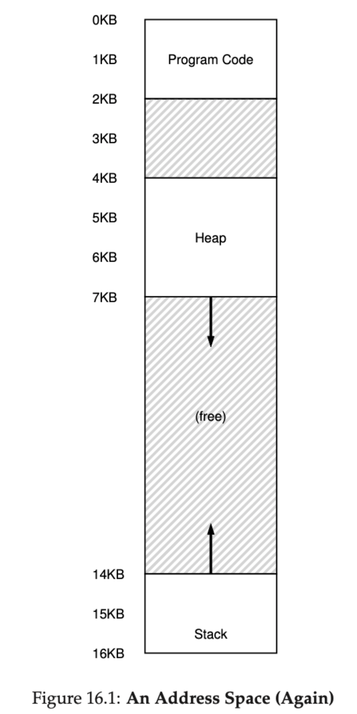
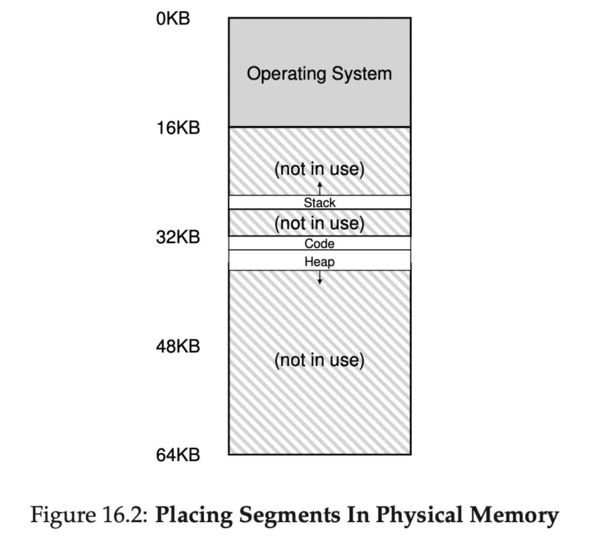
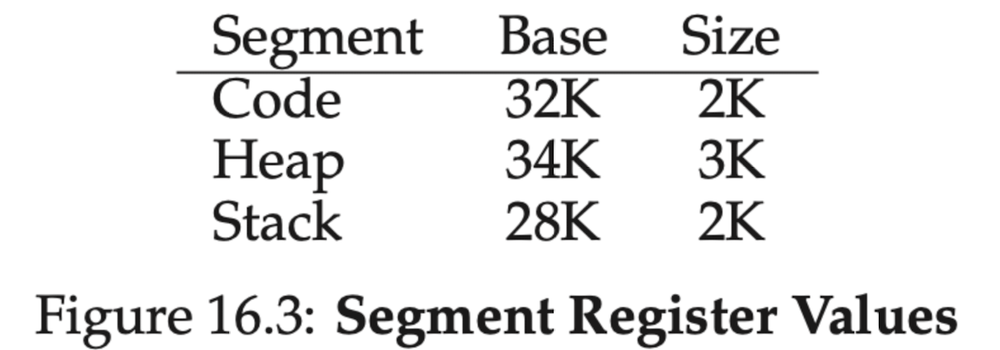
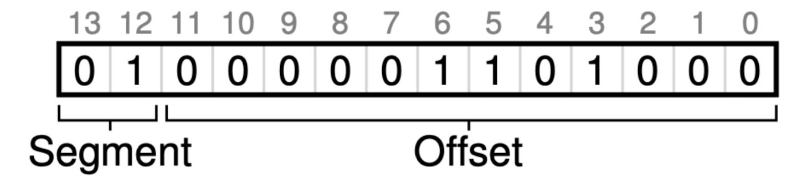
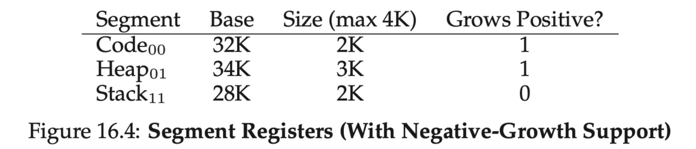
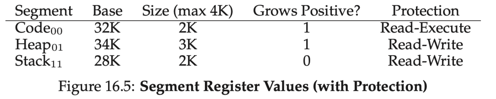

[toc]

# Virtualizaiton of CPU

## Key CPU virtualization terms

The CPU should support at least two modes of execution:
- **User mode:** The applications do not have full access to hardware resources(**restricted mode**).
- **Kernel mode:** The OS has access to the full resources of the machine(**privileged mode**).

### Instruction Flow

1. Typical user applications run in user mode, and use a system call to trap into the kernel to request operating system services.
2. The trap instruction saves register state carefully, changes the hardware status to kernel mode, and jumps into the OS to a pre-specified destination: the **trap table**.

> __**Trap Table**:__ A *trap table* is what is conventionally used by the *system call handler* to invoke the requested operating service routine. It protected by the kernel, so does not enable execution at an arbitrary address. It *maps* a requested service (typically a small number) to a function that provides that service.

3. When the OS finishes servicing a system call, it returns to the user program via another special **return-from-trap** instruction, which reduces privilege and returns control to the instruction after the trap that jumped into the OS.

> _**NOTE**:_ The trap tables must be set up by the OS at boot time, and make sure that they cannot be readily modified by user programs. All of this is part of the limited direct execution protocol which runs programs efficiently but without loss of OS control.

### Cooperative & Non-Cooperative

Once a program is running, the OS must use hardware mechanisms to ensure the user program does not run forever, namely the **timer interrupt**. This approach is a **non-cooperative** approach to CPU scheduling.

- **Cooperative:** Program volunteering give up CPU so that the OS can devide to run some other task.
- **Non-cooperative:** A timer device can be programmed to raise an interrupt periodically; when the interrupt is raised, the currently running process is halted, and a pre-configured interrupt handler in the OS runs. The OS has regained control of the CPU.

### Context Switch

Sometimes the OS, during a timer interrupt or system call, might wish to switch from running the current process to a different one, a low-level technique known as a **context switch** .

## Limited Direct Exectuion

1. The OS boots by initializing **trap table** and the hardware will remember addresses of syscall handler and timer handler.
2. The OS start interrupt timer and handware will start timer interrupt CPU in X ms.
3. During the running of process A, timer interrrupt happened. It saves register values of A to it's kernal stack and move to kernel mode, jump to trap handler.
4. The OS will handle the trap by calling switch(). It will save register values of A to process structure of A, restore correpoding values from process structure of B and switch to kernel stack of B. Finally **return-from-trap** into B.
5. The hardware will restore register valus of B from kernel stack of B and move to user mode and jump to B's PC then process B will start running.

## Scheduling

### Turnaround time

The turnaround time of a job is defined as the time at which the job completes minus the time at which the job arrived in the system.

### Response time

The time from when the job arrives in a system to the first time it is scheduled.

### Types of Scheduler

#### First In, First Out(FIFO)

Early arrive process will get executed first.

- It suffers from **convoy effect**, where a number of relatively-short potential consumers of a resource get queued behind a heavy weight resource comsumer.

> **_Convoy Effect:_** Convoy Effect is phenomenon associated with the First Come First Serve (FCFS) algorithm, in which the whole Operating System slows down due to few slow processes. 

#### Shortest Job First(SJF, non-preemptive)

Shortest process get executed first.But this algorithm still does not solve the problem when heavy process run first, as it is **non-preemptive** the short process which arrive late will still suffer from **convoy effect**.

#### Shortest Time-to-Completion First (STCF, preemptive)

Preemptive version of **SJF**. The **STCF** scheduler determines which of the remaining jobs (including the new job) has the least time left, and schedules that one.

#### Round Robin

Instead of running jobs to completion, **RR** runs a job for a time slice (sometimes called a scheduling quantum) and then switches to the next job in the run queue. It repeatedly does so until the jobs are finished. RR is sometimes called time-slicing. 

> **_Note:_**  The length of a time slice must be a multiple of the timer-interrupt period; thus if the timer interrupts every 10 milliseconds, the time slice could be 10, 20, or any other multiple of 10 ms.

**SJF** or **STCS** has less turnaround time but suffer from bad response time compare to **RR**. **RR** has a great response time but has worst turnaround time. Either good at turnaround time or response time, but not both. Such **trade-off** is common in systems.

#### Multi-Level Feefback Queue(MLFQ)

**Multilevel Feedback Queue** scheduling allows a process to move between queues. This movement is facilitated by the characteristic of the CPU burst of the process. If a process uses too much CPU time, it will be moved to a lower-priority queue. This scheme leaves I/O-bound and interactive processes in the higher priority queues. 

- Rule 1: If Priority(A) > Priority(B), A runs (B doesn’t).
- Rule 2: If Priority(A) = Priority(B), A & B run in round-robin fash-
  ion using the time slice (quantum length) of the given queue.
- Rule 3: When a job enters the system, it is placed at the highest
  priority (the topmost queue).
- Rule 4: Once a job uses up its time allotment at a given level (re-
  gardless of how many times it has given up the CPU), its priority is
  reduced (i.e., it moves down one queue).
- Rule 5: After some time period S, move all the jobs in the system
  to the topmost queue.

### Proportional-Share Scheduler:(Fair-Share Scheduler)

#### Lottery Scheduling

Programs have tickets, scheduler will draw the ticket and decide which program should run

##### Ticket Mechanisms

- **Ticket currency**
  - Programs can have currency to their sub-jobs, system can converts currency to global ticket
- **Ticket transfer**
  - Tickets can be transfer to other program. Eg, In client/server setting, client can pass tickets to server after query and thus try to maximise the performace of the server while handling the client's request. And the server will transfers the ticket back to the client after finished.
- **Ticket inflation**
  - Only applid for trust processes, a process can temporarily raise or lower the number of tickets it owns.

- **Stride scheduling**
- Processes get a stride value which is inverse propotional to their tickets.All processes will have a global value of 0,the process who has lower global value runs and increase it's global value by it's stride

#### The Linux Completely Fair Scheduler(CFS)

Highly efficient and scalable.CFS aims to spend very little time making scheduling decisions, through both its inherent design and its clever use of data structures well-suited to the task.

##### virtual runtime

It fairly divide a CPU evenly among all competing processes. It does so through a simple counting-based technique known as **virtual runtime** (**vruntime**).As each process runs, it accumulates vruntime.CFS will pick the process with the lowest vruntime to run next.

##### Sched latency

Sched latency (usually 48ms), CFS uses this value to determine how long one process should run before considering a switch. The time slice will be **shce latency** / n where n is number of processes.

##### Small Time Slice

To prevent too small time slice, **min granularity** was introduced, which is usually set to a value like 6 ms.CFS will never set the time slice of a process to less than this value, ensuring that not too much time is spent in scheduling overhead.

##### Weighting

CFS also enables controls over process priority, enabling users or admin- istrators to give some processes a higher share of the CPU through UNIX mechanism known as **nice** level of a process. The nice parameter is from -20 to +19 with a deafult 0.Positive nice values imply lower priority and negative values imply higher priority.It follows below formula below
$$
time\_slice_k = \frac{weight_k}{\sum_{i=0}^{n - 1}weight_i}\times sched\_latency
$$
The **vruntime** formula
$$
vruntime_i = vruntime_i + \frac{weight_0}{weight_i}\times runtime_i
$$

##### Red-Black Tree

By keeping processes in a Red-Black tree to find the next job to run as quickly as possible.

- CFS does not keep all process in this structure; rather, only running (or runnable) processes are kept therein.If a process goes to sleep, it will be removed from the tree and kept track of elsewhere.
- Processes are ordered in the tree by **vruntime**, and most operations (such as insertion and deletion) are logarithmic in time, i.e., O(log n)

##### Dealing with I/O and sleeping processes

The process may monopolize the CPU for the duration of it's sleep time while it catches up, effectively starving A.

- CFS handles this case by altering the vruntime of a job when it wakes up. Specifically, CFS sets the **vruntime** of that job to the minimum value found in the tree. In this way, CFS avoids starvation, but not without a cost: jobs that sleep for short periods of time frequently do not ever get their fair share of the CPU.

## Multiprocessor Scheduling

TODO. Section 10 -12

# Virtualizaiton of Memory

The VM system is responsible for providing the illusion of a large, sparse, private address space to programs, which hold all of their instructions and data therein. The OS, with some serious hardware help, will take each of these virtual memory references, and turn them into physical addresses, which can be presented to the physical memory in order to fetch the desired information. The OS will do this for many processes at once, making sure to protect programs from one another, as well as protect the OS. The entire approach requires a great deal of mechanism (lots of low-level machinery) as well as some critical policies to work.

## Type of Memory

We use C as a example when talking about stack and heap.

### Stack

Allocations and deallocations of Stack memory is implicitly by the compiler. In C, the `func` is stoed in stack, when you return from the function, the compiler deallocates the memory for you(**it means you can access the data inside the function after your return**).

### Heap

The heap memory, the programmers are responsible for allocating and deallocating the memory. In C, declare the data into heap by using `malloc(...)` function call.

#### Compile Time operator

`sizeof()` is compile time operator(not a function call) which means the size is known at **compile time**. A function call would take place at run time.

## Common Errors Memory Management

### Forgetting To Allocate Memory

```c
char *c;
c = "a"; // will lead to Segmentation fault
```

### Not Allocating Enough Memory

```c
char src = "hello"
char *c = (char *) malloc (strlen(src));   // too small, you need to extra 1 len to store end of line string('\0'). 
strcpy(c, src); // such error called buffer overflow
```

### Forgetting to Initialize Allocated Memory

```c
char *c = malloc() // uninitialized read
```

### Forgetting To Free Memory

Forget to call `free(x)` after using of pointer `x` will lead to **memory leak**.

### Freeing Memory Before You Are Done With It

Sometimes a program will free memory before it is finished using it; such a mistake is called a **dangling pointer**.

### Freeing Memory Repeatedly

Programs also sometimes free memory more than once; this is known as the **double free**. The result of doing so is undefined.

### Calling free() Incorrectly

When you pass in some other value, bad things can (and do) happen. Thus, such invalid frees are dangerous and of course should also be avoided.

> **_NOTE:_**  Underlying OS Support, OS is responsbile for clean up the unused memeory when a process exited. So technically, you can don't free the memory for a short-lived program which OS will help you clean up the memory for you. **BUT!!!** It always a good habit to learn and free the memory whenever you can.

## Address Translation

With address translation, the OS can control each and every memory access from a process, ensuring the accesses stay within the bounds of the address space. Key to the efficiency of this technique is hardware support, which performs the translation quickly for each access, turning virtual addresses (the process’s view of memory) into physical ones (the actual view). All of this is performed in a way that is transparent to the process that has been relocated; the process has no idea its memory references are being translated, making for a wonderful illusion.

### Dynamic Relocation

**Base and bounds** or **dynamic relocation** require two registers, one register stores base address and another one stores the size of the allocated memeory. 

#### Advantage

- **Efficient**: Base-and-bounds virtualization is quite efficient, as only a little more hardware logic is required to add abase register to the virtual address and check that the address generated by the process is in bounds. 
- **Protection**: Base-and-bounds also offers protection; the OS and hardware combine to ensure no process can generate memory references outside its own address space. Protection is certainly one of the most important goals of the OS; without it, the OS could not control the machine (if processes were free to overwrite memory, they could easily do nasty things like overwrite the trap table and take over the system).

#### Disadvantage

- **Internal fragmentation**: The space between two process maybe wasted(if it is too small to fit one process)

# Segmentation

With the **Dynamic relocation** we mentioned above, there is one issue.As you can imagine from Figure 16.1, although the space between the stack and heap is not being used by the process, it is still taking up physical memory when we relocate the entire address space somewhere in physical memory; thus, the simple approach of using a base and bounds register pair to virtualise memory is wasteful.



To solve this problem, an idea was born, and it is called `segmentation`.

The idea is simple: instead of having just one base and bounds pair in our MMU, why not have a base and bounds pair per logical segment of the address space. A `segment` is just a contiguous portion of the address space of a particular length, and in our canonical address space, we have three logically-different segments: `code`, `stack`, and `heap`.

What segmentation allows the OS to do is to place each one of those segments in different parts of physical memory, and thus avoid filling physical memory with unused virtual address space.





> _**Note:**_ **Segmentation fault** arises from a memory access on a segmented machine to an illegal address.

## Segmentation Referring

### Use Top Bit

If we use the top two bits of our 14-bit virtual address to select the segment, our virtual address.Let’s take our example heap virtual address from above (4200) and translate it, just to make sure this is clear. The virtual address 4200, in binary form, can be seen here:



**Issue of such approach**:

1. We use two bits to holds three segments(code, heap , stack)
2. It limits use of t he virtual address space.

### Implicit Approach

The hardware determines the segment by noticing how the address was formed. 

If, for example, the address was generated from the program counter (i.e., it was an instruction fetch), then the address is within the code segment; if the address is based off of the stack or base pointer, it must be in the stack segment; any other address must be in the heap.

### Backward Growing Stack

The stack is grows backwards, it must be handle differently.We meed hardware support to know the segment grow direction.



## Support For Sharing

It is useful to share certain memory segments between address spaces. In particular, code sharing is common and still in use in systems today.

we need a little extra support from the hardware, in the form of `protection bits`. Basic support adds a few bits per segment, indicating whether or not a program can read or write a segment, or perhaps execute code that lies within the segment.



By setting a code segment to read-only, the same code can be shared across multiple processes, without worry of harming isolation.

## OS Support

Segmentation raises a number of new issues for the operating system. 

1. what should the OS do on a context switch?The segment registers must be saved and restored. Clearly, each process has its own virtual address space, and the OS must make sure to set up these registers correctly before letting the process run again.
2. OS interaction when segments grow (or perhaps shrink).Malloc for variables or maybe the heap itself need grows.
3. Managing free space in physical memory. We have a number of segments per process, and each segment might be a different size.

> _**Note:**_ The general problem that arises is that physical memory quickly becomes full of little holes of free space, making it difficult to allocate new segments, or to grow existing ones. We call this problem **external fragmentation**.

A simple approach to `external fragmentation` is to use algorithm to choose the free spaces. Such as the `best-fit`(the closest free spaces in size that satisfies the desired allocation) free spaces, `worst-fit`, `first-fit` or more complex schemes like `buddy algorithm`.Unfortunately, though, no matter how smart the algorithm, external fragmentation will still exist; thus, a good algorithm simply attempts to minimize it.