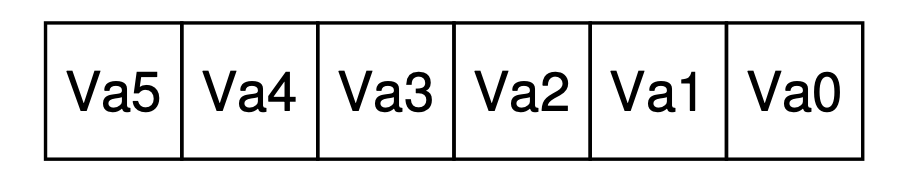

[toc]

# Operation Sytem

## Virtualizaiton of CPU

### Key CPU virtualization terms

The CPU should support at least two modes of execution:
- **User mode:** The applications do not have full access to hardware resources(**restricted mode**).
- **Kernel mode:** The OS has access to the full resources of the machine(**privileged mode**).

#### Instruction Flow

1. Typical user applications run in user mode, and use a system call to trap into the kernel to request operating system services.
2. The trap instruction saves register state carefully, changes the hardware status to kernel mode, and jumps into the OS to a pre-specified destination: the **trap table**.

> __**Trap Table**:__ A *trap table* is what is conventionally used by the *system call handler* to invoke the requested operating service routine. It protected by the kernel, so does not enable execution at an arbitrary address. It *maps* a requested service (typically a small number) to a function that provides that service.

3. When the OS finishes servicing a system call, it returns to the user program via another special **return-from-trap** instruction, which reduces privilege and returns control to the instruction after the trap that jumped into the OS.

> _**NOTE**:_ The trap tables must be set up by the OS at boot time, and make sure that they cannot be readily modified by user programs. All of this is part of the limited direct execution protocol which runs programs efficiently but without loss of OS control.

#### Cooperative & Non-Cooperative

Once a program is running, the OS must use hardware mechanisms to ensure the user program does not run forever, namely the **timer interrupt**. This approach is a **non-cooperative** approach to CPU scheduling.

- **Cooperative:** Program volunteering give up CPU so that the OS can devide to run some other task.
- **Non-cooperative:** A timer device can be programmed to raise an interrupt periodically; when the interrupt is raised, the currently running process is halted, and a pre-configured interrupt handler in the OS runs. The OS has regained control of the CPU.

#### Context Switch

Sometimes the OS, during a timer interrupt or system call, might wish to switch from running the current process to a different one, a low-level technique known as a **context switch** .

### Limited Direct Exectuion

1. The OS boots by initializing **trap table** and the hardware will remember addresses of syscall handler and timer handler.
2. The OS start interrupt timer and handware will start timer interrupt CPU in X ms.
3. During the running of process A, timer interrrupt happened. It saves register values of A to it's kernal stack and move to kernel mode, jump to trap handler.
4. The OS will handle the trap by calling switch(). It will save register values of A to process structure of A, restore correpoding values from process structure of B and switch to kernel stack of B. Finally **return-from-trap** into B.
5. The hardware will restore register valus of B from kernel stack of B and move to user mode and jump to B's PC then process B will start running.

### Scheduling

#### Turnaround time

The turnaround time of a job is defined as the time at which the job completes minus the time at which the job arrived in the system.

#### Response time

The time from when the job arrives in a system to the first time it is scheduled.

#### Types of Scheduler

##### First In, First Out(FIFO)

Early arrive process will get executed first.

- It suffers from **convoy effect**, where a number of relatively-short potential consumers of a resource get queued behind a heavy weight resource comsumer.

> **_Convoy Effect:_** Convoy Effect is phenomenon associated with the First Come First Serve (FCFS) algorithm, in which the whole Operating System slows down due to few slow processes. 

##### Shortest Job First(SJF, non-preemptive)

Shortest process get executed first.But this algorithm still does not solve the problem when heavy process run first, as it is **non-preemptive** the short process which arrive late will still suffer from **convoy effect**.

##### Shortest Time-to-Completion First (STCF, preemptive)

Preemptive version of **SJF**. The **STCF** scheduler determines which of the remaining jobs (including the new job) has the least time left, and schedules that one.

##### Round Robin

Instead of running jobs to completion, **RR** runs a job for a time slice (sometimes called a scheduling quantum) and then switches to the next job in the run queue. It repeatedly does so until the jobs are finished. RR is sometimes called time-slicing. 

> **_Note:_**  The length of a time slice must be a multiple of the timer-interrupt period; thus if the timer interrupts every 10 milliseconds, the time slice could be 10, 20, or any other multiple of 10 ms.

**SJF** or **STCS** has less turnaround time but suffer from bad response time compare to **RR**. **RR** has a great response time but has worst turnaround time. Either good at turnaround time or response time, but not both. Such **trade-off** is common in systems.

##### Multi-Level Feefback Queue(MLFQ)

**Multilevel Feedback Queue** scheduling allows a process to move between queues. This movement is facilitated by the characteristic of the CPU burst of the process. If a process uses too much CPU time, it will be moved to a lower-priority queue. This scheme leaves I/O-bound and interactive processes in the higher priority queues. 

- Rule 1: If Priority(A) > Priority(B), A runs (B doesn’t).
- Rule 2: If Priority(A) = Priority(B), A & B run in round-robin fash-
  ion using the time slice (quantum length) of the given queue.
- Rule 3: When a job enters the system, it is placed at the highest
  priority (the topmost queue).
- Rule 4: Once a job uses up its time allotment at a given level (re-
  gardless of how many times it has given up the CPU), its priority is
  reduced (i.e., it moves down one queue).
- Rule 5: After some time period S, move all the jobs in the system
  to the topmost queue.

#### Proportional-Share Scheduler:(Fair-Share Scheduler)

##### Lottery Scheduling

Programs have tickets, scheduler will draw the ticket and decide which program should run

###### Ticket Mechanisms

- **Ticket currency**
  - Programs can have currency to their sub-jobs, system can converts currency to global ticket
- **Ticket transfer**
  - Tickets can be transfer to other program. Eg, In client/server setting, client can pass tickets to server after query and thus try to maximise the performace of the server while handling the client's request. And the server will transfers the ticket back to the client after finished.
- **Ticket inflation**
  - Only applid for trust processes, a process can temporarily raise or lower the number of tickets it owns.

- **Stride scheduling**
- Processes get a stride value which is inverse propotional to their tickets.All processes will have a global value of 0,the process who has lower global value runs and increase it's global value by it's stride

##### The Linux Completely Fair Scheduler(CFS)

Highly efficient and scalable.CFS aims to spend very little time making scheduling decisions, through both its inherent design and its clever use of data structures well-suited to the task.

###### virtual runtime

It fairly divide a CPU evenly among all competing processes. It does so through a simple counting-based technique known as **virtual runtime** (**vruntime**).As each process runs, it accumulates vruntime.CFS will pick the process with the lowest vruntime to run next.

###### Sched latency

Sched latency (usually 48ms), CFS uses this value to determine how long one process should run before considering a switch. The time slice will be **shce latency** / n where n is number of processes.

###### Small Time Slice

To prevent too small time slice, **min granularity** was introduced, which is usually set to a value like 6 ms.CFS will never set the time slice of a process to less than this value, ensuring that not too much time is spent in scheduling overhead.

###### Weighting

CFS also enables controls over process priority, enabling users or admin- istrators to give some processes a higher share of the CPU through UNIX mechanism known as **nice** level of a process. The nice parameter is from -20 to +19 with a deafult 0.Positive nice values imply lower priority and negative values imply higher priority.It follows below formula below
$$
time\_slice_k = \frac{weight_k}{\sum_{i=0}^{n - 1}weight_i}\times sched\_latency
$$
The **vruntime** formula
$$
vruntime_i = vruntime_i + \frac{weight_0}{weight_i}\times runtime_i
$$

###### Red-Black Tree

By keeping processes in a Red-Black tree to find the next job to run as quickly as possible.

- CFS does not keep all process in this structure; rather, only running (or runnable) processes are kept therein.If a process goes to sleep, it will be removed from the tree and kept track of elsewhere.
- Processes are ordered in the tree by **vruntime**, and most operations (such as insertion and deletion) are logarithmic in time, i.e., O(log n)

###### Dealing with I/O and sleeping processes

The process may monopolize the CPU for the duration of it's sleep time while it catches up, effectively starving A.

- CFS handles this case by altering the vruntime of a job when it wakes up. Specifically, CFS sets the **vruntime** of that job to the minimum value found in the tree. In this way, CFS avoids starvation, but not without a cost: jobs that sleep for short periods of time frequently do not ever get their fair share of the CPU.

### Multiprocessor Scheduling

TODO. Section 10 -12

## Virtualizaiton of Memory

The VM system is responsible for providing the illusion of a large, sparse, private address space to programs, which hold all of their instructions and data therein. The OS, with some serious hardware help, will take each of these virtual memory references, and turn them into physical addresses, which can be presented to the physical memory in order to fetch the desired information. The OS will do this for many processes at once, making sure to protect programs from one another, as well as protect the OS. The entire approach requires a great deal of mechanism (lots of low-level machinery) as well as some critical policies to work.

### Type of Memory

We use C as a example when talking about stack and heap.

#### Stack

Allocations and deallocations of Stack memory is implicitly by the compiler. In C, the `func` is stoed in stack, when you return from the function, the compiler deallocates the memory for you(**it means you can access the data inside the function after your return**).

#### Heap

The heap memory, the programmers are responsible for allocating and deallocating the memory. In C, declare the data into heap by using `malloc(...)` function call.

##### Compile Time operator

`sizeof()` is compile time operator(not a function call) which means the size is known at **compile time**. A function call would take place at run time.

### Common Errors Memory Management

#### Forgetting To Allocate Memory

```c
char *c;
c = "a"; // will lead to Segmentation fault
```

#### Not Allocating Enough Memory

```c
char src = "hello"
char *c = (char *) malloc (strlen(src));   // too small, you need to extra 1 len to store end of line string('\0'). 
strcpy(c, src); // such error called buffer overflow
```

#### Forgetting to Initialize Allocated Memory

```c
char *c = malloc() // uninitialized read
```

#### Forgetting To Free Memory

Forget to call `free(x)` after using of pointer `x` will lead to **memory leak**.

#### Freeing Memory Before You Are Done With It

Sometimes a program will free memory before it is finished using it; such a mistake is called a **dangling pointer**.

#### Freeing Memory Repeatedly

Programs also sometimes free memory more than once; this is known as the **double free**. The result of doing so is undefined.

#### Calling free() Incorrectly

When you pass in some other value, bad things can (and do) happen. Thus, such invalid frees are dangerous and of course should also be avoided.

> **_NOTE:_**  Underlying OS Support, OS is responsbile for clean up the unused memeory when a process exited. So technically, you can don't free the memory for a short-lived program which OS will help you clean up the memory for you. **BUT!!!** It always a good habit to learn and free the memory whenever you can.

### Address Translation

With address translation, the OS can control each and every memory access from a process, ensuring the accesses stay within the bounds of the address space. Key to the efficiency of this technique is hardware support, which performs the translation quickly for each access, turning virtual addresses (the process’s view of memory) into physical ones (the actual view). All of this is performed in a way that is transparent to the process that has been relocated; the process has no idea its memory references are being translated, making for a wonderful illusion.

#### Dynamic Relocation

**Base and bounds** or **dynamic relocation** require two registers, one register stores base address and another one stores the size of the allocated memeory. 

##### Advantage

- **Efficient**: Base-and-bounds virtualization is quite efficient, as only a little more hardware logic is required to add abase register to the virtual address and check that the address generated by the process is in bounds. 
- **Protection**: Base-and-bounds also offers protection; the OS and hardware combine to ensure no process can generate memory references outside its own address space. Protection is certainly one of the most important goals of the OS; without it, the OS could not control the machine (if processes were free to overwrite memory, they could easily do nasty things like overwrite the trap table and take over the system).

##### Disadvantage

- **Internal fragmentation**: The space between two process maybe wasted(if it is too small to fit one process)

## Segmentation

With the base and bounds registers, the OS can easily relocate processes to different parts of physical memory. However, as you can imagine from Figure 16.1, although the space between the stack and heap is not being used by the process, it is still taking up physical memory when we relocate the entire address space somewhere in physical memory; thus, the simple approach of using a base and bounds register pair to virtualise memory is wasteful.


A `segment` is just a contiguous portion of the address space of a particular length, and in our canonical address space, we have three logically-different segments: `code`, `stack`, and `heap`. Instead of having just one base and bounds pair in our MMU, every logical segment of have a base and bounds.

What segmentation allows the OS to do is to place each one of those segments in different parts of physical memory, and thus avoid filling physical memory with unused virtual address space.


The hardware structure in our MMU required to support segmentation by providing a set of three base and bounds register pairs which show in Figure 16.3


> _**Note:**_ **Segmentation fault** arises from a memory access on a segmented machine to an illegal address.

### Segmentation Referring

#### Explicit Approach

In our example above, we have three segments; thus we need two bits to accomplish our task. If we use the top two bits of our 14-bit virtual address to select the segment. If the top two bits are 01, the hardware knows the address is in the heap, and thus uses the heap base and bounds.


**Issue of such approach**:

1. We use two bits to holds three segments(code, heap , stack), unused of bit `11`
   - Some systems put code in the same segment as the heap and thus use only one bit to select which segment to use.
2. It limits use of the virtual address space.
   - 16KB address space gets chopped into four pieces.

#### Implicit Approach

The hardware determines the segment by noticing how the address was formed. 

- If the address was generated from the program counter (i.e., it was an instruction fetch), then the address is within the code segment 
- if the address is based off of the stack or base pointer, it must be in the stack segment
- any other address must be in the heap.

### Backward Growing Stack

The stack is grows backwards, it must be handle differently. We meed hardware support to know the segment grow direction which is another bit to indicate the direction.


Assume we wish to access virtual address 15KB, which should map to physical address 27KB. The address 11 1100 0000 0000 (hex 0x3C00);

- `11` indicate is stack
- `1100 0000 0000` is 3KB offset. 
- Max segment size if 4KB
- negative offset is 3KB - 4KB = -1 KB
- Add -1KB to 28KB, we get physical address of 27KB
- bound check: abs(negative offset) <= Segement Size

### Support For Sharing

To save memory, It is useful to share certain memory segments between address spaces. In particular, *code sharing* is common.

Basic support adds a few bits(`Protection bits`) per segment, indicating whether or not a program can read or write a segment, or perhaps execute code that lies within the segment.


By setting a code segment to read-only, the same code can be shared across multiple processes, without worry of harming isolation.

### Fine-grained vs. Coarse-grained Segmentation

Systems with just a few segments (i.e., code, stack, heap); we can think of this segmentation as **coarse-grained**.

The address spaces to consist of a large number of smaller segments, referred to as **fine-grained** segmentation. Supporting many segments requires a **segment table** of some kind stored in memory.

### OS Support

Segmentation raises a number of new issues for the operating system. 

1. The segment registers must be saved and restored during context switching. Each process has its own virtual address space, and the OS must make sure to set up these registers correctly before letting the process run again.
2. When segments grow (or perhaps shrink):
   - if the heap segment itself may need to grow, the memory-allocation library will perform a system call to grow the heap. The OS will then (usually) provide more space, updating the segment size register to the new (bigger) size, and informing the library of success; the library can then allocate space for the new object and return successfully to the calling program. 
3. Managing free space in physical memory. When a new address space is created, the OS has to be able to find space in physical memory for its segments. We have a number of segments per process, and each segment might be a different size.

> _**Note:**_ The general problem that arises is that physical memory quickly becomes full of little holes of free space, making it difficult to allocate new segments, or to grow existing ones. We call this problem **external fragmentation**. Show in Figure 16.6(left)


One solution to this problem would be to **compact** physical memory by rearranging the existing segments. However, compaction is expensive, as copying segments is memory-intensive and generally uses a fair amount of processor time. Compaction also (ironically) makes requests to grow existing segments hard to serve, and may thus cause further rearrangement to accommodate such requests.

A simpler approach might instead be to use a free-list management algorithm that tries to keep large extents of memory available for allocation.  Such as the `best-fit`(the closest free spaces in size that satisfies the desired allocation) free spaces, `worst-fit`, `first-fit` or more complex schemes like `buddy algorithm`.Unfortunately, though, no matter how smart the algorithm, external fragmentation will still exist; thus, a good algorithm simply attempts to minimize it.

## Free-Space Management

Free-space management becomes more difficult when it consists of variable-sized units; this arises in a user-level memory-allocation library (as in malloc() and free()) and in an OS managing physical memory when using **segmentation** to implement virtual memory. In either case, the problem that exists is known as **external fragmentation**: the free space gets chopped into little pieces of different sizes and is thus fragmented; subsequent requests may fail because there is no single contiguous space that can satisfy the request, even though the total amount of free space exceeds the size of the request.

`void *malloc(size t size)` takes a single parameter, size, which is the number of bytes requested by the application; it hands back a pointer (of no particular type, or a **void pointer** in C lingo) to a region of that size (or greater). The complementary routine `void free(void *ptr)` takes a pointer and frees the corresponding chunk. 

The space that this library manages is known historically as the heap, and the generic data structure used to manage free space in the heap is some kind of **free list**. This structure contains references to all of the free chunks of space in the managed region of memory. Of course, this data structure need not be a list *perse*, but just some kind of data structure to track free space.

> _**Note**_: There is **internal fragmentation** when user requests memories that is more than what they need. we’ll mostly focus on **external fragmentation** only.

### Splitting and Coalescing

A free list contains a set of elements that describe the free space still remaining in the heap. Thus, assume the following 30-byte heap:


The free list for this heap would have two elements on it. One entry describes the first 10-byte free segment (bytes 0-9), and one entry describes the other free segment (bytes 20-29):


Assume we have a request for just a single byte of memory. In this case, the allocator will perform an action known as **splitting**: it will find a free chunk of memory that can satisfy the request and split it into two. The first chunk it will return to the caller; the second chunk will remain on the list. Thus, in our example above, if a request for 1 byte were made, and the allocator decided to use the second of the two elements on the list to satisfy the request, the call to `malloc()` would return 20 (the address of the 1-byte allocated region) and the list would end up looking like this:


A corollary mechanism found in many allocators is known as **coalescing** of free space. When User free the `Addr 10`, if any free space nearby the free Addr, merge them into a single larger free chunk. Thus, with coalescing, our final list should look like this:


Most allocators store a little bit of extra information in a **header** block which is kept in memory, usually just before the handed-out chunk of memory of the `void *maclloc()`. Thus, when a user requests N bytes of memory, the library searches for a free chunk of size N plus the size of the header. A simple header looks like:

```c
typedef struct {
    int size;
    int magic;
} header_t;
```

When the user calls `free(ptr)`, the library then uses simple pointer arithmetic to figure out where the header begins:

```c
void free(void *ptr) {
    header_t *hptr = (header_t *) ptr - 1;
    //...
}
```

Assume we have a 4096-byte chunk of memory to manage (i.e., the heap is 4KB). To manage this as a free list, we first have to initialize a list, it should have one entry, of size 4096 (minus the header size). Here is the description of a node of the list:

```c
typedef struct __node_t {
  int              size;
  struct __node_t *next;
} node_t;
```

Now let’s look at some code that initializes the heap and puts the first element of the free list inside that space.

```c
// mmap() returns a pointer to a chunk of free space
node_t *head = mmap(NULL, 4096, PROT_READ|PROT_WRITE,
                    MAP_ANON|MAP_PRIVATE, -1, 0);
head->size= 4096 - sizeof(node_t);
head->next=NULL;
```


After running this code, the status of the list is that it has a single entry, of size 4088. Visually, the heap thus looks like what you see in Figure 17.3.

Assume a chunk of memory of 100 bytes is requested. The library will first find a chunk that is large enough to accommodate the request; because there is only one free chunk (size: 4088), this chunk will be chosen. Then, the chunk will be **split** into two: one chunk big enough to service the request (and header, as described above), and the remaining free chunk. Assuming an 8-byte header (an integer size and an integer magic number), the space in the heap now looks like what you see in Figure 17.4.


When the memory is been freed, go through the list and **merge** neighboring chunks.

### Basic Strategies

There are many strategies to minimize the external fragmentation:

- **Best Fit**:  search through the free list and return the smallest chunk that can fit the request.
- **Worst Fit**: The **worst fit** approach is the opposite of best fit; find the largest chunk and return the requested amount.
- **First Fit**: The **first fit** method simply finds the first block that is big enough and returns the requested amount to the user.
  - First fit has the advantage of speed.
- **Next Fit**: the **next fit** algorithm keeps an extra pointer to the location within the list where one was looking last.

### Other Approaches

#### Segregated Lists

If a particular application has one (or a few) popular-sized request that it makes, keep a separate list just to manage objects of that size; all other requests are forwarded to a more general memory allocator.

By having a chunk of memory dedicated for one particular size of requests, fragmentation is much less of a concern; moreover, allocation and free requests can be served quite quickly when they are of the right size, as no complicated search of a list is required.

#### Buddy Allocation

Because coalescing is critical for an allocator, some approaches have been designed around making coalescing simple. One good example is found in the **binary buddy allocator**.

In such a system, free memory is first conceptually thought of as one big space of size $2^N$ . When a request for memory is made, the search for free space recursively divides free space by two until a block that is big enough to accommodate the request is found (and a further split into two would result in a space that is too small).

Here is an example of a 64KB free space getting divided in the search for a 7KB block (Figure 17.8).


> _**Note**_: This scheme can suffer from **internal fragmentation**, as you are only allowed to give out power-of-two-sized blocks.

When returning the 8KB block to the free list, the allocator checks whether the “buddy” 8KB is free; if so, it coalesces the two blocks into a 16KB block. The allocator then checks if the buddy of the 16KB block is still free; if so, it coalesces those two blocks. This recursive coalescing process continues up the tree, either restoring the entire free space or stopping when a buddy is found to be in use.

The address of each buddy pair only differs by a single bit; which bit is determined by the level in the buddy tree, which makes it easy to determine the buddy of a particular block.

## Paging: Introduction

Instead of splitting up a process’s address space into some number of variable-sized logical segments (e.g., code, heap, stack), we divide it into fixed-sized units, each of which we call a **page**. Correspondingly, we view physical memory as an array of fixed-sized slots called **page frames**; each of these frames can contain a single virtual memory page. 

Paging has a number of advantages over segmentation approaches:

- *flexibility*: with a fully-developed paging approach, the system will be able to support the abstraction of an address space effectively, regardless of how a process uses the address space.
- the *simplicity* of free-space management that paging affords.

To record where each virtual page of the address space is placed in physical memory, the operating system usually keeps a *per-process* data structure known as a **page table**. The major role of the page table is to store **address translations** for each of the virtual pages of the address space.

If another process were to run in our example above, the OS would have to manage a different page table for it, as its virtual pages obviously map to *different* physical pages.

To **translate** this virtual address that the process generated, we have to first split it into two components: the **virtual page number (VPN)**, and the **offset** within the page. For this example, because the virtual address space of the process is 64 bytes, we need 6 bits total for our virtual address ($2^6 = 64$). Thus, our virtual address can be conceptualized as follows:



Where Va5 is the highest-order bit of the virtual address, and Va0 the lowest-order bit. Assume page size is 16 bytes, we can further divide the virtual address as follows:


Use VPN to locate the virtual page number and index the page table to find which physical frame. Thus, we can translate the virtual address by replacing the VPN with the  **physical frame number**(PFN) (also sometimes called the **physical page number** or **PPN**) and then issue the load to physical memory (Figure 18.3).


The Page table will be huge if the VPN increased, it is impractical to store it inside the MMU. So it is normally store page table for each process in memory.c

> _**Note**_: One of the most important data structures in the memory management subsystem of a modern OS is the **page table**. In general, a page table stores **virtual-to-physical address translations**, thus letting the system know where each page of an address space actually resides in physical memory. 

The simplest form of page table is called a **linear page table**, which is just an array. The OS *indexes* the array by the virtual page number (VPN), and looks up the page-table entry (PTE) at that index in order to find the desired physical frame number (PFN).

For contents of each PTE, there are some special purpose bits:

- A **valid bit** is common to indicate whether the particular translation is valid. All the unused space will be marked **invalid**, and if the process tries to access such memory, it will generate a trap to the OS which will likely terminate the process. By simply marking all the unused pages in the address space invalid, we remove the need to allocate physical frames for those pages and thus save a great deal of memory.
- A **protection bits**, indicating whether the page could be read from, written to, or executed from. Again, accessing a page in a way not allowed by these bits will generate a trap to the OS.
- A **present bit** indicates whether this page is in physical memory or on disk (i.e., it has been **swapped out**).
- A **dirty bit** is indicating whether the page has been modified since it was brought into memory.
- A **reference bit** (a.k.a. **accessed bit**) is sometimes used to track whether a page has been accessed, and is useful in determining which pages are popular and thus should be kept in memory; such knowledge is critical during **page replacement**.

