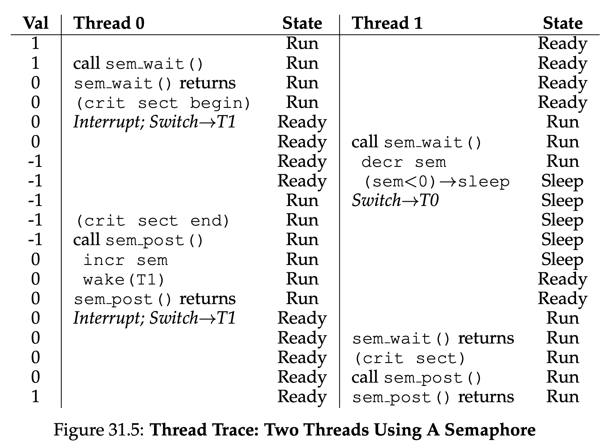
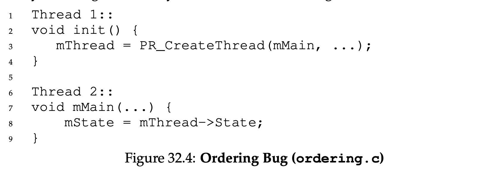

[toc]

# Operation Sytem

## Virtualizaiton of CPU

### Key CPU virtualization terms

The CPU should support at least two modes of execution:
- **User mode:** The applications do not have full access to hardware resources(**restricted mode**).
- **Kernel mode:** The OS has access to the full resources of the machine(**privileged mode**).

#### Instruction Flow

1. Typical user applications run in user mode, and use a system call to trap into the kernel to request operating system services.
2. The trap instruction saves register state carefully, changes the hardware status to kernel mode, and jumps into the OS to a pre-specified destination: the **trap table**.

> __**Trap Table**:__ A *trap table* is what is conventionally used by the *system call handler* to invoke the requested operating service routine. It protected by the kernel, so does not enable execution at an arbitrary address. It *maps* a requested service (typically a small number) to a function that provides that service.

3. When the OS finishes servicing a system call, it returns to the user program via another special **return-from-trap** instruction, which reduces privilege and returns control to the instruction after the trap that jumped into the OS.

> _**NOTE**:_ The trap tables must be set up by the OS at boot time, and make sure that they cannot be readily modified by user programs. All of this is part of the limited direct execution protocol which runs programs efficiently but without loss of OS control.

#### Cooperative & Non-Cooperative

Once a program is running, the OS must use hardware mechanisms to ensure the user program does not run forever, namely the **timer interrupt**. This approach is a **non-cooperative** approach to CPU scheduling.

- **Cooperative:** Program volunteering give up CPU so that the OS can devide to run some other task.
- **Non-cooperative:** A timer device can be programmed to raise an interrupt periodically; when the interrupt is raised, the currently running process is halted, and a pre-configured interrupt handler in the OS runs. The OS has regained control of the CPU.

#### Context Switch

Sometimes the OS, during a timer interrupt or system call, might wish to switch from running the current process to a different one, a low-level technique known as a **context switch** .

### Limited Direct Exectuion

1. The OS boots by initializing **trap table** and the hardware will remember addresses of syscall handler and timer handler.
2. The OS start interrupt timer and handware will start timer interrupt CPU in X ms.
3. During the running of process A, timer interrrupt happened. It saves register values of A to it's kernal stack and move to kernel mode, jump to trap handler.
4. The OS will handle the trap by calling switch(). It will save register values of A to process structure of A, restore correpoding values from process structure of B and switch to kernel stack of B. Finally **return-from-trap** into B.
5. The hardware will restore register valus of B from kernel stack of B and move to user mode and jump to B's PC then process B will start running.

### Scheduling

#### Turnaround time

The turnaround time of a job is defined as the time at which the job completes minus the time at which the job arrived in the system.

#### Response time

The time from when the job arrives in a system to the first time it is scheduled.

#### Types of Scheduler

##### First In, First Out(FIFO)

Early arrive process will get executed first.

- It suffers from **convoy effect**, where a number of relatively-short potential consumers of a resource get queued behind a heavy weight resource comsumer.

> **_Convoy Effect:_** Convoy Effect is phenomenon associated with the First Come First Serve (FCFS) algorithm, in which the whole Operating System slows down due to few slow processes. 

##### Shortest Job First(SJF, non-preemptive)

Shortest process get executed first.But this algorithm still does not solve the problem when heavy process run first, as it is **non-preemptive** the short process which arrive late will still suffer from **convoy effect**.

##### Shortest Time-to-Completion First (STCF, preemptive)

Preemptive version of **SJF**. The **STCF** scheduler determines which of the remaining jobs (including the new job) has the least time left, and schedules that one.

##### Round Robin

Instead of running jobs to completion, **RR** runs a job for a time slice (sometimes called a scheduling quantum) and then switches to the next job in the run queue. It repeatedly does so until the jobs are finished. RR is sometimes called time-slicing. 

> **_Note:_**  The length of a time slice must be a multiple of the timer-interrupt period; thus if the timer interrupts every 10 milliseconds, the time slice could be 10, 20, or any other multiple of 10 ms.

**SJF** or **STCS** has less turnaround time but suffer from bad response time compare to **RR**. **RR** has a great response time but has worst turnaround time. Either good at turnaround time or response time, but not both. Such **trade-off** is common in systems.

##### Multi-Level Feefback Queue(MLFQ)

**Multilevel Feedback Queue** scheduling allows a process to move between queues. This movement is facilitated by the characteristic of the CPU burst of the process. If a process uses too much CPU time, it will be moved to a lower-priority queue. This scheme leaves I/O-bound and interactive processes in the higher priority queues. 

- Rule 1: If Priority(A) > Priority(B), A runs (B doesn’t).
- Rule 2: If Priority(A) = Priority(B), A & B run in round-robin fash-
  ion using the time slice (quantum length) of the given queue.
- Rule 3: When a job enters the system, it is placed at the highest
  priority (the topmost queue).
- Rule 4: Once a job uses up its time allotment at a given level (re-
  gardless of how many times it has given up the CPU), its priority is
  reduced (i.e., it moves down one queue).
- Rule 5: After some time period S, move all the jobs in the system
  to the topmost queue.

#### Proportional-Share Scheduler:(Fair-Share Scheduler)

##### Lottery Scheduling

Programs have tickets, scheduler will draw the ticket and decide which program should run

###### Ticket Mechanisms

- **Ticket currency**
  - Programs can have currency to their sub-jobs, system can converts currency to global ticket
- **Ticket transfer**
  - Tickets can be transfer to other program. Eg, In client/server setting, client can pass tickets to server after query and thus try to maximise the performace of the server while handling the client's request. And the server will transfers the ticket back to the client after finished.
- **Ticket inflation**
  - Only applid for trust processes, a process can temporarily raise or lower the number of tickets it owns.

- **Stride scheduling**
- Processes get a stride value which is inverse propotional to their tickets.All processes will have a global value of 0,the process who has lower global value runs and increase it's global value by it's stride

##### The Linux Completely Fair Scheduler(CFS)

Highly efficient and scalable.CFS aims to spend very little time making scheduling decisions, through both its inherent design and its clever use of data structures well-suited to the task.

###### virtual runtime

It fairly divide a CPU evenly among all competing processes. It does so through a simple counting-based technique known as **virtual runtime** (**vruntime**).As each process runs, it accumulates vruntime.CFS will pick the process with the lowest vruntime to run next.

###### Sched latency

Sched latency (usually 48ms), CFS uses this value to determine how long one process should run before considering a switch. The time slice will be **shce latency** / n where n is number of processes.

###### Small Time Slice

To prevent too small time slice, **min granularity** was introduced, which is usually set to a value like 6 ms.CFS will never set the time slice of a process to less than this value, ensuring that not too much time is spent in scheduling overhead.

###### Weighting

CFS also enables controls over process priority, enabling users or admin- istrators to give some processes a higher share of the CPU through UNIX mechanism known as **nice** level of a process. The nice parameter is from -20 to +19 with a deafult 0.Positive nice values imply lower priority and negative values imply higher priority.It follows below formula below
$$
time\_slice_k = \frac{weight_k}{\sum_{i=0}^{n - 1}weight_i}\times sched\_latency
$$
The **vruntime** formula
$$
vruntime_i = vruntime_i + \frac{weight_0}{weight_i}\times runtime_i
$$

###### Red-Black Tree

By keeping processes in a Red-Black tree to find the next job to run as quickly as possible.

- CFS does not keep all process in this structure; rather, only running (or runnable) processes are kept therein.If a process goes to sleep, it will be removed from the tree and kept track of elsewhere.
- Processes are ordered in the tree by **vruntime**, and most operations (such as insertion and deletion) are logarithmic in time, i.e., O(log n)

###### Dealing with I/O and sleeping processes

The process may monopolize the CPU for the duration of it's sleep time while it catches up, effectively starving A.

- CFS handles this case by altering the vruntime of a job when it wakes up. Specifically, CFS sets the **vruntime** of that job to the minimum value found in the tree. In this way, CFS avoids starvation, but not without a cost: jobs that sleep for short periods of time frequently do not ever get their fair share of the CPU.

### Multiprocessor Scheduling

TODO. Section 10 -12

## Virtualizaiton of Memory

The VM system is responsible for providing the illusion of a large, sparse, private address space to programs, which hold all of their instructions and data therein. The OS, with some serious hardware help, will take each of these virtual memory references, and turn them into physical addresses, which can be presented to the physical memory in order to fetch the desired information. The OS will do this for many processes at once, making sure to protect programs from one another, as well as protect the OS. The entire approach requires a great deal of mechanism (lots of low-level machinery) as well as some critical policies to work.

### Type of Memory

We use C as a example when talking about stack and heap.

#### Stack

Allocations and deallocations of Stack memory is implicitly by the compiler. In C, the `func` is stoed in stack, when you return from the function, the compiler deallocates the memory for you(**it means you can access the data inside the function after your return**).

#### Heap

The heap memory, the programmers are responsible for allocating and deallocating the memory. In C, declare the data into heap by using `malloc(...)` function call.

##### Compile Time operator

`sizeof()` is compile time operator(not a function call) which means the size is known at **compile time**. A function call would take place at run time.

### Common Errors Memory Management

#### Forgetting To Allocate Memory

```c
char *c;
c = "a"; // will lead to Segmentation fault
```

#### Not Allocating Enough Memory

```c
char src = "hello"
char *c = (char *) malloc (strlen(src));   // too small, you need to extra 1 len to store end of line string('\0'). 
strcpy(c, src); // such error called buffer overflow
```

#### Forgetting to Initialize Allocated Memory

```c
char *c = malloc() // uninitialized read
```

#### Forgetting To Free Memory

Forget to call `free(x)` after using of pointer `x` will lead to **memory leak**.

#### Freeing Memory Before You Are Done With It

Sometimes a program will free memory before it is finished using it; such a mistake is called a **dangling pointer**.

#### Freeing Memory Repeatedly

Programs also sometimes free memory more than once; this is known as the **double free**. The result of doing so is undefined.

#### Calling free() Incorrectly

When you pass in some other value, bad things can (and do) happen. Thus, such invalid frees are dangerous and of course should also be avoided.

> **_NOTE:_**  Underlying OS Support, OS is responsbile for clean up the unused memeory when a process exited. So technically, you can don't free the memory for a short-lived program which OS will help you clean up the memory for you. **BUT!!!** It always a good habit to learn and free the memory whenever you can.

### Address Translation

With address translation, the OS can control each and every memory access from a process, ensuring the accesses stay within the bounds of the address space. Key to the efficiency of this technique is hardware support, which performs the translation quickly for each access, turning virtual addresses (the process’s view of memory) into physical ones (the actual view). All of this is performed in a way that is transparent to the process that has been relocated; the process has no idea its memory references are being translated, making for a wonderful illusion.

#### Dynamic Relocation

**Base and bounds** or **dynamic relocation** require two registers, one register stores base address and another one stores the size of the allocated memeory. 

##### Advantage

- **Efficient**: Base-and-bounds virtualization is quite efficient, as only a little more hardware logic is required to add abase register to the virtual address and check that the address generated by the process is in bounds. 
- **Protection**: Base-and-bounds also offers protection; the OS and hardware combine to ensure no process can generate memory references outside its own address space. Protection is certainly one of the most important goals of the OS; without it, the OS could not control the machine (if processes were free to overwrite memory, they could easily do nasty things like overwrite the trap table and take over the system).

##### Disadvantage

- **Internal fragmentation**: The space between two process maybe wasted(if it is too small to fit one process)

### Segmentation

With the base and bounds registers, the OS can easily relocate processes to different parts of physical memory. However, as you can imagine from Figure 16.1, although the space between the stack and heap is not being used by the process, it is still taking up physical memory when we relocate the entire address space somewhere in physical memory; thus, the simple approach of using a base and bounds register pair to virtualise memory is wasteful.


A `segment` is just a contiguous portion of the address space of a particular length, and in our canonical address space, we have three logically-different segments: `code`, `stack`, and `heap`. Instead of having just one base and bounds pair in our MMU, every logical segment of have a base and bounds.

What segmentation allows the OS to do is to place each one of those segments in different parts of physical memory, and thus avoid filling physical memory with unused virtual address space.


The hardware structure in our MMU required to support segmentation by providing a set of three base and bounds register pairs which show in Figure 16.3


> _**Note:**_ **Segmentation fault** arises from a memory access on a segmented machine to an illegal address.

#### Segmentation Referring

##### Explicit Approach

In our example above, we have three segments; thus we need two bits to accomplish our task. If we use the top two bits of our 14-bit virtual address to select the segment. If the top two bits are 01, the hardware knows the address is in the heap, and thus uses the heap base and bounds.


**Issue of such approach**:

1. We use two bits to holds three segments(code, heap , stack), unused of bit `11`
   - Some systems put code in the same segment as the heap and thus use only one bit to select which segment to use.
2. It limits use of the virtual address space.
   - 16KB address space gets chopped into four pieces.

##### Implicit Approach

The hardware determines the segment by noticing how the address was formed. 

- If the address was generated from the program counter (i.e., it was an instruction fetch), then the address is within the code segment 
- if the address is based off of the stack or base pointer, it must be in the stack segment
- any other address must be in the heap.

#### Backward Growing Stack

The stack is grows backwards, it must be handle differently. We meed hardware support to know the segment grow direction which is another bit to indicate the direction.


Assume we wish to access virtual address 15KB, which should map to physical address 27KB. The address 11 1100 0000 0000 (hex 0x3C00);

- `11` indicate is stack
- `1100 0000 0000` is 3KB offset. 
- Max segment size if 4KB
- negative offset is 3KB - 4KB = -1 KB
- Add -1KB to 28KB, we get physical address of 27KB
- bound check: abs(negative offset) <= Segement Size

#### Support For Sharing

To save memory, It is useful to share certain memory segments between address spaces. In particular, *code sharing* is common.

Basic support adds a few bits(`Protection bits`) per segment, indicating whether or not a program can read or write a segment, or perhaps execute code that lies within the segment.


By setting a code segment to read-only, the same code can be shared across multiple processes, without worry of harming isolation.

#### Fine-grained vs. Coarse-grained Segmentation

Systems with just a few segments (i.e., code, stack, heap); we can think of this segmentation as **coarse-grained**.

The address spaces to consist of a large number of smaller segments, referred to as **fine-grained** segmentation. Supporting many segments requires a **segment table** of some kind stored in memory.

#### OS Support

Segmentation raises a number of new issues for the operating system. 

1. The segment registers must be saved and restored during context switching. Each process has its own virtual address space, and the OS must make sure to set up these registers correctly before letting the process run again.
2. When segments grow (or perhaps shrink):
   - if the heap segment itself may need to grow, the memory-allocation library will perform a system call to grow the heap. The OS will then (usually) provide more space, updating the segment size register to the new (bigger) size, and informing the library of success; the library can then allocate space for the new object and return successfully to the calling program. 
3. Managing free space in physical memory. When a new address space is created, the OS has to be able to find space in physical memory for its segments. We have a number of segments per process, and each segment might be a different size.

> _**Note:**_ The general problem that arises is that physical memory quickly becomes full of little holes of free space, making it difficult to allocate new segments, or to grow existing ones. We call this problem **external fragmentation**. Show in Figure 16.6(left)


One solution to this problem would be to **compact** physical memory by rearranging the existing segments. However, compaction is expensive, as copying segments is memory-intensive and generally uses a fair amount of processor time. Compaction also (ironically) makes requests to grow existing segments hard to serve, and may thus cause further rearrangement to accommodate such requests.

A simpler approach might instead be to use a free-list management algorithm that tries to keep large extents of memory available for allocation.  Such as the `best-fit`(the closest free spaces in size that satisfies the desired allocation) free spaces, `worst-fit`, `first-fit` or more complex schemes like `buddy algorithm`.Unfortunately, though, no matter how smart the algorithm, external fragmentation will still exist; thus, a good algorithm simply attempts to minimize it.

### Free-Space Management

Free-space management becomes more difficult when it consists of variable-sized units; this arises in a user-level memory-allocation library (as in malloc() and free()) and in an OS managing physical memory when using **segmentation** to implement virtual memory. In either case, the problem that exists is known as **external fragmentation**: the free space gets chopped into little pieces of different sizes and is thus fragmented; subsequent requests may fail because there is no single contiguous space that can satisfy the request, even though the total amount of free space exceeds the size of the request.

`void *malloc(size t size)` takes a single parameter, size, which is the number of bytes requested by the application; it hands back a pointer (of no particular type, or a **void pointer** in C lingo) to a region of that size (or greater). The complementary routine `void free(void *ptr)` takes a pointer and frees the corresponding chunk. 

The space that this library manages is known historically as the heap, and the generic data structure used to manage free space in the heap is some kind of **free list**. This structure contains references to all of the free chunks of space in the managed region of memory. Of course, this data structure need not be a list *perse*, but just some kind of data structure to track free space.

> _**Note**_: There is **internal fragmentation** when user requests memories that is more than what they need. we’ll mostly focus on **external fragmentation** only.

#### Splitting and Coalescing

A free list contains a set of elements that describe the free space still remaining in the heap. Thus, assume the following 30-byte heap:


The free list for this heap would have two elements on it. One entry describes the first 10-byte free segment (bytes 0-9), and one entry describes the other free segment (bytes 20-29):


Assume we have a request for just a single byte of memory. In this case, the allocator will perform an action known as **splitting**: it will find a free chunk of memory that can satisfy the request and split it into two. The first chunk it will return to the caller; the second chunk will remain on the list. Thus, in our example above, if a request for 1 byte were made, and the allocator decided to use the second of the two elements on the list to satisfy the request, the call to `malloc()` would return 20 (the address of the 1-byte allocated region) and the list would end up looking like this:


A corollary mechanism found in many allocators is known as **coalescing** of free space. When User free the `Addr 10`, if any free space nearby the free Addr, merge them into a single larger free chunk. Thus, with coalescing, our final list should look like this:


Most allocators store a little bit of extra information in a **header** block which is kept in memory, usually just before the handed-out chunk of memory of the `void *maclloc()`. Thus, when a user requests N bytes of memory, the library searches for a free chunk of size N plus the size of the header. A simple header looks like:

```c
typedef struct {
    int size;
    int magic;
} header_t;
```

When the user calls `free(ptr)`, the library then uses simple pointer arithmetic to figure out where the header begins:

```c
void free(void *ptr) {
    header_t *hptr = (header_t *) ptr - 1;
    //...
}
```

Assume we have a 4096-byte chunk of memory to manage (i.e., the heap is 4KB). To manage this as a free list, we first have to initialize a list, it should have one entry, of size 4096 (minus the header size). Here is the description of a node of the list:

```c
typedef struct __node_t {
  int              size;
  struct __node_t *next;
} node_t;
```

Now let’s look at some code that initializes the heap and puts the first element of the free list inside that space.

```c
// mmap() returns a pointer to a chunk of free space
node_t *head = mmap(NULL, 4096, PROT_READ|PROT_WRITE,
                    MAP_ANON|MAP_PRIVATE, -1, 0);
head->size= 4096 - sizeof(node_t);
head->next=NULL;
```


After running this code, the status of the list is that it has a single entry, of size 4088. Visually, the heap thus looks like what you see in Figure 17.3.

Assume a chunk of memory of 100 bytes is requested. The library will first find a chunk that is large enough to accommodate the request; because there is only one free chunk (size: 4088), this chunk will be chosen. Then, the chunk will be **split** into two: one chunk big enough to service the request (and header, as described above), and the remaining free chunk. Assuming an 8-byte header (an integer size and an integer magic number), the space in the heap now looks like what you see in Figure 17.4.


When the memory is been freed, go through the list and **merge** neighboring chunks.

#### Basic Strategies

There are many strategies to minimize the external fragmentation:

- **Best Fit**:  search through the free list and return the smallest chunk that can fit the request.
- **Worst Fit**: The **worst fit** approach is the opposite of best fit; find the largest chunk and return the requested amount.
- **First Fit**: The **first fit** method simply finds the first block that is big enough and returns the requested amount to the user.
  - First fit has the advantage of speed.
- **Next Fit**: the **next fit** algorithm keeps an extra pointer to the location within the list where one was looking last.

#### Other Approaches

##### Segregated Lists

If a particular application has one (or a few) popular-sized request that it makes, keep a separate list just to manage objects of that size; all other requests are forwarded to a more general memory allocator.

By having a chunk of memory dedicated for one particular size of requests, fragmentation is much less of a concern; moreover, allocation and free requests can be served quite quickly when they are of the right size, as no complicated search of a list is required.

##### Buddy Allocation

Because coalescing is critical for an allocator, some approaches have been designed around making coalescing simple. One good example is found in the **binary buddy allocator**.

In such a system, free memory is first conceptually thought of as one big space of size $2^N$ . When a request for memory is made, the search for free space recursively divides free space by two until a block that is big enough to accommodate the request is found (and a further split into two would result in a space that is too small).

Here is an example of a 64KB free space getting divided in the search for a 7KB block (Figure 17.8).


> _**Note**_: This scheme can suffer from **internal fragmentation**, as you are only allowed to give out power-of-two-sized blocks.

When returning the 8KB block to the free list, the allocator checks whether the “buddy” 8KB is free; if so, it coalesces the two blocks into a 16KB block. The allocator then checks if the buddy of the 16KB block is still free; if so, it coalesces those two blocks. This recursive coalescing process continues up the tree, either restoring the entire free space or stopping when a buddy is found to be in use.

The address of each buddy pair only differs by a single bit; which bit is determined by the level in the buddy tree, which makes it easy to determine the buddy of a particular block.

### Paging

#### Introduction

Instead of splitting up a process’s address space into some number of variable-sized logical segments (e.g., code, heap, stack), we divide it into fixed-sized units, each of which we call a **page**. Correspondingly, we view physical memory as an array of fixed-sized slots called **page frames**; each of these frames can contain a single virtual memory page. 

Paging has a number of advantages over segmentation approaches:

- *flexibility*: with a fully-developed paging approach, the system will be able to support the abstraction of an address space effectively, regardless of how a process uses the address space.
- the *simplicity* of free-space management that paging affords.

To record where each virtual page of the address space is placed in physical memory, the operating system usually keeps a *per-process* data structure known as a **page table**. The major role of the page table is to store **address translations** for each of the virtual pages of the address space.

If another process were to run in our example above, the OS would have to manage a different page table for it, as its virtual pages obviously map to *different* physical pages.

To **translate** this virtual address that the process generated, we have to first split it into two components: the **virtual page number (VPN)**, and the **offset** within the page. For this example, because the virtual address space of the process is 64 bytes, we need 6 bits total for our virtual address ($2^6 = 64$). Thus, our virtual address can be conceptualized as follows:


Where Va5 is the highest-order bit of the virtual address, and Va0 the lowest-order bit. Assume page size is 16 bytes, we can further divide the virtual address as follows:


Use VPN to locate the virtual page number and index the page table to find which physical frame. Thus, we can translate the virtual address by replacing the VPN with the  **physical frame number**(PFN) (also sometimes called the **physical page number** or **PPN**) and then issue the load to physical memory (Figure 18.3).


The Page table will be huge if the VPN increased, it is impractical to store it inside the MMU. So it is normally store page table for each process in memory.c

> _**Note**_: One of the most important data structures in the memory management subsystem of a modern OS is the **page table**. In general, a page table stores **virtual-to-physical address translations**, thus letting the system know where each page of an address space actually resides in physical memory. 

The simplest form of page table is called a **linear page table**, which is just an array. The OS *indexes* the array by the virtual page number (VPN), and looks up the page-table entry (PTE) at that index in order to find the desired physical frame number (PFN).

For contents of each PTE, there are some special purpose bits:

- A **valid bit** is common to indicate whether the particular translation is valid. All the unused space will be marked **invalid**, and if the process tries to access such memory, it will generate a trap to the OS which will likely terminate the process. By simply marking all the unused pages in the address space invalid, we remove the need to allocate physical frames for those pages and thus save a great deal of memory.
- A **protection bits**, indicating whether the page could be read from, written to, or executed from. Again, accessing a page in a way not allowed by these bits will generate a trap to the OS.
- A **present bit** indicates whether this page is in physical memory or on disk (i.e., it has been **swapped out**).
- A **dirty bit** is indicating whether the page has been modified since it was brought into memory.
- A **reference bit** (a.k.a. **accessed bit**) is sometimes used to track whether a page has been accessed, and is useful in determining which pages are popular and thus should be kept in memory; such knowledge is critical during **page replacement**.

#### Faster Translations (TLBs)

To speed address translation, we are going to add what is called a **translation-lookaside buffer** (**TLB**). A TLB is part of the chip’s **memory-management unit** (**MMU**), and is simply a hardware **cache** of popular virtual-to-physical address translations; thus, a better name would be an **address-translation cache**. 

Upon each virtual memory reference, the hardware first checks the TLB to see if the desired translation is held therein; if so, the translation is performed (quickly) *without* having to consult the page table (which has all translations).

##### TLB Basic Algorithm

The algorithm the hardware follows works like this: 

1. extract the virtual page number (VPN) from the virtual address
2. check if the TLB holds the translation for this VPN. 
   1. If it does, we have a **TLB hit**, which means the TLB holds the translation. We can now extract the page frame number (PFN) from the relevant TLB entry, concatenate that onto the offset from the original virtual address, and form the desired physical address (PA), and access memory, assuming protection checks do not fail.
   2. If the CPU does not find the translation in the TLB (a **TLB miss**), the hardware accesses the page table to find the translation. Assuming that the virtual memory reference generated by the process is valid and accessible, updates the TLB with the translation. These set of actions are costly, primarily because of the extra memory reference needed to access the page table.

##### Handles The TLB Miss

Either the hardware, or the software (OS) can handles the TLB miss:

1. the hardware has a **pagetable base register** to stores the location of the page table in memory and knowing the exact format. When miss happened, it find the correct page-table entry and extract the desired translation, update the TLB with the translation, and retry the instruction.
2. More modern architectures have a  **software-managed TLB**. On a TLB miss, the hardware simply raises an exception, which pauses the current instruction stream, raises the privilege level to kernel mode, and jumps to a **trap handler**. This trap handler is code within the OS that is written with the express purpose of handling TLB misses. When run, the code will lookup the translation in the page table, use special “privileged” instructions to update the TLB, and return from the trap; at this point, the hardware retries the instruction (resulting in a TLB hit).
   - The primary advantage of the software-managed approach is *flexibil- ity*: the OS can use any data structure it wants to implement the page table, without necessitating hardware change.
   - Another advantage is *simplicity*. The hardware doesn’t do much on a miss: just raise an exception and let the OS TLB miss handler do the rest.

The return-from-trap of TLB miss is different from normal system call. In normal system call, the return-from-trap should resume execution at the instruction *after* the trap into the OS, just as a return from a procedure call returns to the instruction immediately following the call into the procedure. In even of TLB miss,  the hardware must resume execution at the instruction that *caused* the trap; this retry resulting in a TLB hit.

Thus, depending on how a trap or exception was caused, the hardware must save a different PC when trapping into the OS, in order to resume properly when the time to do so arrives.

When running the TLB miss-handling code, the OS needs to be extra careful not to cause an infinite chain of TLB misses to occur. Many solutions exist:

1. keep TLB miss handlers in physical memory (where they are **unmapped** and not subject to address translation)
2. reserve some entries in the TLB for permanently-valid translations and use some of those permanent translation slots for the handler code itself; these **wired** translations always hit in the TLB.

> <center><strong>TLB VALID BIT and PAGE TABLE VALID BIT</strong></center>
>
> In a page table, when a page-table entry (PTE) is marked invalid, it means that the page has not been allocated by the process, and should not be accessed by a correctly-working program.
>
> A TLB valid bit, in contrast, simply refers to whether a TLB entry has a valid translation within it.
>
> By setting all TLB entries to invalid, the system can ensure that the about-to-be-run process does not accidentally use a virtual-to-physical translation from a previous process.

##### TLB Contents

A TLB entry might look like this:

<center>VPN  |  PFN  |  other bits</center>

Other bits:

1. A **valid** bit: whether the entry has a valid translation.
2. A **protection** bits, which determine how a page can be accessed(read, write, execute).
3. A **address-space identifier**.
4. A **dirty bit**.

##### Context Switches

The TLB contains virtual-to-physical translations that are only valid for the currently running process; these translations are not meaningful for other processes.

There are a number of possible solutions to this problem:

1. simply **flush** the TLB on context switches, thus emptying it before running the next process by setting all the valid bits to 0.
   - On a software-based system, this can be accomplished with an explicit (and privileged) hardware instruction; 
   - with a hardware-managed TLB, the flush could be enacted when the page-table base register is changed. 
   - If the OS switches between processes frequently, this cost may be high.
2. Some systems add hardware support to enable sharing of the TLB across context switches.
   - Provide an **address space identifier** (**ASID**) field in the TLB. ASID is similar to a **process identifier** (**PID**), but it has fewer bits.
   - During a context switch, set some privileged register to the ASID of the current process in order to know which process is currently running.

##### Replacement Policy

**Least-recently-used** or **LRU** tries to take advantage of locality in the memory-reference stream, assuming it is likely that an entry that has not recently been used is a good candidate for eviction.

**Random** policy, which evicts a TLB mapping at random.

##### A Real TLB Entry


Figure 19.4 shows a modern system MIPS R4000 which supports a 32-bit address space with 4KB pages. Thus, we would expect a 20-bit VPN and 12-bit offset in our typical virtual address. However, there is only 19-bit in this case, which half of it reserved for the kernel. 

The VPN translates to up to a 24-bit physical frame number (PFN), and hence can support systems with up to 64GB of (physical) main memory ($2^{24}$ 4KB pages).

There are a few other interesting bits in the MIPS TLB. 

1. A *global* bit (G), which is used for pages that are globally-shared among processes. Thus, if the global bit is set, the ASID is ignored.
2. A 8-bit *ASID*
3. 3 *Coherence* (C) bits, which determine how a page is cached by the hardware
4. A *dirty* bit which is marked when the page has been written to
5. A *valid* bit which tells the hardware if there is a valid translation present in the entry.

Finally, some of the 64 bits are unused (shaded gray in the diagram). MIPS TLBs usually have 32 or 64 of these entries, most of which are used by user processes as they run. However, a few are reserved for the OS. A *wired* register can be set by the OS to tell the hardware how many slots of the TLB to reserve for the OS; the OS uses these reserved mappings for code and data that it wants to access during critical times, where a TLB miss would be problematic (e.g., in the TLB miss handler).

The MIPS provides four such instructions: 

1. *TLBP*, which probes the TLB to see if a particular translation is in there.
2. *TLBR*, which reads the contents of a TLB entry into registers; 
3. *TLBWI*, which replaces a specific TLB entry
4. *TLBWR*, which replaces a random TLB entry. 

The OS uses these instructions to manage the TLB’s contents. It is of course critical that these instructions are **privileged**; imagine what a user process could do if it could modify the contents of the TLB.

#### Multi-level Page Tables

The basic idea behind a multi-level page table is simple. First, chop up the page table into page-sized units; then, if an entire page of page-table entries (PTEs) is invalid, don’t allocate that page of the page table at all. To track whether a page of the page table is valid (and if valid, where it is in memory), use a new structure, called the **page directory**. The page directory thus either can be used to tell you where a page of the page table is, or that the entire page of the page table contains no valid pages.

##### Two Level Page Table

Figure 20.3 shows comparison between linear and multi-level page tables:


The page directory, in a simple two-level table, contains one entry per page of the page table. It consists of a number of **page directory entries** (**PDE**). A PDE (minimally) has a **valid bit** and a **page frame number** (PFN), similar to a PTE. If the PDE is valid, it means that at least one of the pages of the page table that the entry points to (via the PFN) is valid.

Multi-level page tables have some obvious advantages:

1. The multi-level table only allocates page-table space in proportion to the amount of address space you are using.
2. If carefully constructed, each portion of the page table fits neatly within a page, making it easier to manage memory; the OS can simply grab the next free page when it needs to allocate or grow a page table.

Multi-level page tables have some drawbacks too:

1. On a TLB miss, two loads from memory will be required to get the right translation information from the page table (one for the page directory, and one for the PTE itself). Thus, the multi-level table is a small example of a **time-space trade-off**. 
2. *Complexity*. Whether it is the hardware or OS handling the page-table lookup (on a TLB miss), doing so is undoubtedly more involved than a simple linear page-table lookup.

Assuming page directory entries contains 16 pages, we need to use top four bits of the VPN as page directory index:


```c
PDEAddr = PageDirBase + (PDIndex * sizeof(PDE))
```

To find the PTE, we have to index into the portion of the page table using the remaining bits of the VPN:


Note that the page-frame number (PFN) obtained from the page-directory entry must be left-shifted into place before combining it with the page- table index to form the address of the PTE.

```c
PTEAddr = (PDE.PFN << SHIFT) + (PTIndex * sizeof(PTE))
```

##### More Than Two Levels

Two Level will face the same issue with page directory entries become too big. To determine how many levels are needed in a multi-level table to make all pieces of the page table fit within a page, we start by determining how many page-table entries fit within a page. 

Assume we have a 30-bit virtual address space, and our virtual address has a 21-bit virtual page number component and a 9-bit offset. Our page size of 512 bytes, and assuming a PTE size of 4 bytes, you should see that you can fit 128 PTEs on a single page. When we index into a page of the page table, we can thus conclude we’ll need the least significant 7 bits ($log_2128$) of the VPN as an index:


The left page directory is 14 bits. If our page directory has $2^{14}$ entries, it spans not one page but 128, and thus our goal of making every piece of the multi-level page table fit into a page vanishes.

By splitting the page directory itself into multiple pages, and then adding another page directory on top of that, to point to the pages of the page directory. We can thus split up our virtual address as follows:


When indexing the upper-level page directory, we use the very top bits of the virtual address (PD Index 0 in the diagram); this index can be used to fetch the page-directory entry from the top-level page directory. If valid, the second level of the page directory is consulted by combining the physical frame number from the top-level PDE and the next part of the VPN (PD Index 1). Finally, if valid, the PTE address can be formed by using the page-table index combined with the address from the second-level PDE. 

#### Inverted Page Tables

An even more extreme space savings in the world of page tables is found with **inverted page tables**. Instead of having many page tables (one per process of the system), we keep a single page table that has an entry for each *physical page* of the system. The entry tells us which process is using this page, and which virtual page of that process maps to this physical page.

Finding the correct entry is now a matter of searching through this data structure. A hash table is often built over the base structure to speed up lookups.

### Swapping

**Swap space** refers to some reserved space on the disk for moving pages back and forth. The OS will need to remember the **disk address** of a given page.

The **present bit** in each page-table entry indicates whether the page is present in physical memory in the event of TLB miss. If present bit is set to zero, the page is *not* in memory but rather on disk somewhere. Otherwise, it is in the physical memory. 

The act of accessing a page that is not in physical memory is commonly referred to as a **page fault**. Upon a page fault, the OS is invoked to service the page fault. A particular piece of code, known as a **page-fault handler**, runs, and must service the page fault.

> <center><strong>TYPES OF CACHE MISSES</strong></center>
>
> A **compulsory miss** (or **cold-start miss**) occurs because the cache is empty to begin with and this is the first reference to the item.
>
> A **capacity miss** occurs because the cache ran out of space and had to evict an item to bring a new item into the cache.
>
> A **conflict miss** arises in hardware because of limits on where an item can be placed in a hardware cache, due to something known as **set-associativity**; it does not arise in the OS page cache because such caches are always **fully-associative**.

#### The Page Fault

The OS could use the bits in the PTE normally used for data such as the PFN of the page for a disk address. When the OS receives a page fault for a page, it looks in the PTE to find the address, and issues the request to disk to fetch the page into memory.

When the disk I/O completes, the OS will then update the page table to mark the page as present, update the PFN field of the page-table entry (PTE) to record the in-memory location of the newly-fetched page, and retry the instruction. This next attempt may generate a TLB miss, which would then be serviced and update the TLB with the translation (one could alternately update the TLB when servicing the page fault to avoid this step). Finally, a last restart would find the translation in the TLB and thus proceed to fetch the desired data or instruction from memory at the translated physical address.

#### Page Fault Control Flow

Figures 21.2 shows what the hardware does during translation.


Figures 21.3 shows what the OS does upon a page fault.


#### When Replacements Really Occur

To keep a small amount of memory free, most operating systems thus have some kind of **high watermark** (HW) and **low watermark** (LW) to help decide when to start evicting pages from memory. When the OS notices that there are fewer than LW pages available, a background thread that is responsible for freeing memory runs. The thread evicts pages until there are HW pages available, then goes to sleep. The background thread, sometimes called the **swap daemon** or **page daemon**.

#### Swapping Policies

The optimal solution is to replaces the page that will be accessed *furthest in the future* is the optimal policy, resulting in the fewest-possible cache misses. But the future is not generally known; you can’t build the optimal policy for a general-purpose operating system. Thus, the optimal policy will serve only as a comparison point, to know how close we are to “perfect”.

1. **First-in First-out (FIFO)**: The pages were simply placed in a queue when they enter the system; when a replacement occurs, the page on the tail of the queue (the “first-in” page) is evicted. FIFO has one great strength: it is quite simple to implement.
2. **Random**: Which simply picks a random page to replace under memory pressure.
3. **Least-Frequently-Used** (**LFU**): replaces the least-frequently-used page when an eviction must take place.
4. **Least-Recently- Used** (**LRU**): policy replaces the least-recently-used page.
   - Use bit per page of the system, and the use bits live in memory somewhere (they could be in the per-process page tables, for example, or just in an array somewhere). Whenever a page is referenced (i.e., read or written), the use bit is set by hardware to 1. Imagine all the pages of the system arranged in a circular list. A **clock hand** points to some particular page to begin with. When a replacement must occur, the OS checks if the currently-pointed to page P has a use bit of 1 or 0.
     - If 1, this implies that page P was recently used and thus is *not* a good candidate for replacement. Thus, the use bit for P is set to 0 (cleared), and the clock hand is incremented to the next page (P + 1). 
     - The algorithm continues until it finds a use bit that is set to 0, implying this page has not been recently used.
   - One small modification to the clock algorithm is to additional consideration of whether a page has been modified or not while in memory. The reason for this: if a page has been **modified** and is thus **dirty**, it must be written back to disk to evict it, which is expensive. If it has not been modified (and is thus **clean**), the eviction is free; the physical frame can simply be reused for other purposes without additional I/O. Thus, some VM systems prefer to evict clean pages over dirty pages.

#### Other VM Policies

##### Page Selection Policy

For most pages, the OS simply uses **demand paging**, which means the OS brings the page into memory when it is accessed. The OS could guess that a page is about to be used, and thus bring it in ahead of time; this behavior is known as **prefetching** and should only be done when there is reasonable chance of success. For example, some systems will assume that if a code page P is brought into memory, that code page P +1 will likely soon be accessed and thus should be brought into memory too.

##### Clustering Write

This policy determines how the OS writes pages out to disk. Many systems collect a number of pending writes together in memory and write them to disk in one (more efficient) write. This behavior is usually called **clustering** or simply **grouping** of writes, and is effective because of the nature of disk drives, which perform a single large write more efficiently than many small ones.

### Other Optimizations

#### Thrashing

When the system will constantly be paging, it referred to as **thrashing**. An **admission control** states that it is sometimes better to do less work well than to try to do everything at once poorly.  For example, given a set of processes, a system could decide not to run a sub- set of processes, with the hope that the reduced set of processes’ **working sets** (the pages that they are using actively) fit in memory and thus can make progress.

Some current systems take more a draconian approach to memory overload. For example, some versions of Linux run an **out-of-memory killer** when memory is oversubscribed; this daemon chooses a memory-intensive process and kills it, thus reducing memory in a none-too-subtle manner.

#### Memory Hogs

Programs that use a lot of memory and make it hard for other programs to run called **Memory hogs**. The **segmented FIFO** replacement policy introduces to resolve it, each process has a maximum number of pages it can keep in memory, known as its **resident set size** (**RSS**). Each of these pages is kept on a FIFO list; when a process exceeds its RSS, the “first-in” page is evicted. **Second-chance lists** can improve FIFO's performance, the pages are placed inside the before getting evicted from memory.

#### Demand Zeroing

In a naive implementation, the OS responds to a request to add a page to your heap by finding a page in physical memory, zeroing it (required for security; otherwise you’d be able to see what was on the page from when some other process used it!), and then mapping it into your address space (i.e., setting up the page table to refer to that physical page as desired). But the naive implementation can be costly, particularly if the page does not get used by the process.

With **demand zeroing**, the OS instead does very little work when the page is added to your address space; it puts an entry in the page table that marks the page inaccessible. If the process then reads or writes the page, a trap into the OS takes place. When handling the trap, the OS notices (usually through some bits marked in the “reserved for OS” portion of the page table entry) that this is actually a demand-zero page; at this point, the OS does the needed work of finding a physical page, zeroing it, and mapping it into the process’s address space. If the process never accesses the page, all such work is avoided, and thus the virtue of demand zeroing.

#### Copy-on-Write

When the OS needs to copy a page from one address space to another, instead of copying it, it can map it into the target address space and mark it read-only in both address spaces. If both address spaces only read the page, no further action is taken, and thus the OS has realized a fast copy without actually moving any data.

However, one of the address spaces does indeed try to write to the page, it will trap into the OS. The OS will then notice that the page is a COW page, and thus (lazily) allocate a new page, fill it with the data, and map this new page into the address space of the faulting process. The process then continues and now has its own private copy of the page.

### The Linux Address Space

Linux virtual address space consists of a user portion(where user program code, stack, heap, and other parts reside) and a kernel portion (where kernel code, stacks, heap, and other parts reside). Upon a context switch, the user portion of the currently-running address space changes; the kernel portion is the same across processes. A program running in user mode cannot access kernel virtual pages; only by trapping into the kernel and transitioning to privileged mode can such memory be accessed.

Figure 23.2 shows a depiction of a typical (simplified) address space.


One slightly interesting aspect of Linux is that it contains two types of kernel virtual addresses. 

1. The first are known as **kernel logical addresses**. This is what you would consider the normal virtual address space of the kernel
   - to get more memory of this type, kernel code merely needs to call **kmalloc**.
   - Most kernel data structures live here, such as page tables, per-process kernel stacks, and so forth. 
   - Unlike most other memory in the system, kernel logical memory *cannot* be swapped to disk.
   - there is a direct mapping between kernel logical addresses and the first portion of physical memory. Thus, kernel logical address 0xC0000000 translates to physical address 0x00000000, 0xC0000FFF to 0x00000FFF, and so forth. This direct mapping has two implications.
     - it is simple to translate back and forth between kernel logical addresses and physical addresses, as a result, these addresses are often treated as if they are indeed physical.
     - If a chunk of memory is contiguous in kernel logical address space, it is also contiguous in physical memory. This makes memory allocated in this part of the kernel’s address space suitable for operations which need contiguous physical memory to work correctly, such as I/O transfers to and from devices via **directory memory access** (**DMA**).
2. The other type of kernel address is a **kernel virtual address**.
   - Kernel code calls **vmalloc** to get memory of this type, which returns a pointer to a virtually contiguous region of the desired size.
   - kernel virtual memory is usually not contiguous; each kernel virtual page may map to non-contiguous physical pages (and is thus not suitable for DMA).

#### Page Table Structure

The x86 provides a hardware-managed, multi-level page table structure, with one page table per process; the OS simply sets up mappings in its memory, points a privileged register at the start of the page directory, and the hardware handles the rest. The OS gets involved, as expected, at process creation, deletion, and upon context switches, making sure in each case that the correct page table is being used by the hardware MMU to perform translations.

The full 64-bit nature of the virtual address space is not yet in use, however, rather only the bottom 48 bits. Thus, a virtual address can be viewed as follows:


The bottom 12 bits (due to the 4-KB page size) are used as the offset, leaving the middle 36 bits of virtual address to take part in the translation. The P1 portion of the address is used to index into the topmost page directory, and the translation proceeds from there, one level at a time, until the actual page of the page table is indexed by P4, yielding the desired page table entry.

#### Large Page Support

Intel x86 allows for the use of multiple page sizes, not just the standard 4-KB page. Specifically, recent designs support 2-MB and even 1-GB pages in hardware. Thus, over time, Linux has evolved to allow applications to utilize these **huge pages** (as they are called in the world of Linux).

Huge pages bring benefits:

- Reduces the number of mappings that are needed in the page table.
- Reduces page-table entries.
- Lead to better TLB behavior and related performance gains.
  - Huge pages allow a process to access a large tract of memory without TLB misses, by using fewer slots in the TLB.
  - There are other benefits to huge pages: there is a shorter TLB-miss path; can serve TLB miss more quickly.

#### The Page Cache

To reduce costs of accessing persistent storage (the focus of the third part of this book), most systems use aggressive **caching** subsystems to keep popular data items in memory(inclued Linux).

The Linux **page cache** is unified, keeping pages in memory from three primary sources: 

1. **memory-mapped files**, file data.
2. metadata from devices (usually accessed by directing read() and write() calls to the file system).
3. heap and stack pages that comprise each process (sometimes called **anonymous memory**, because there is no named file underneath of it, but rather swap space). 

These entities are kept in a **page cache hash table**, allowing for quick lookup when data is needed.

The page cache tracks if entries are **clean** (read but not updated) or **dirty** (a.k.a., **modified**). Dirty data is periodically written to the backing store by background threads (called `pdflush`), thus ensuring that modified data eventually is written back to persistent storage. This background activity either takes place after a certain time period or if too many pages are considered dirty (both configurable parameters).

##### 2Q Replacement

A standard LRU replacement is effective, but can be subverted by certain common access patterns. For example, if a process repeatedly accesses a large file (especially one that is nearly the size of memory, or larger), LRU will kick every other file out of memory. Even worse: retaining portions of this file in memory isn’t useful, as they are never re-referenced before getting kicked out of memory.

The Linux version of the 2Q replacement algorithm solves this problem by keeping two lists, and dividing memory between them. When accessed for the first time, a page is placed on one queue (called **inactive list**); when it is re-referenced, the page is promoted to the other queue (called **active list** ). When replacement needs to take place, the candidate for replacement is taken from the inactive list. Linux also periodically moves pages from the bottom of the active list to the inactive list, keeping the active list to about two-thirds of the total page cache size.

## Concurrency

A **multi-threaded** program has more than one point of execution. Perhaps another way to think of this is that each thread is very much like a separate process, except for one difference: they *share* the same address space and thus can access the same data.

The state of a single thread is thus very similar to that of a process. 

- It has a program counter (PC) that tracks where the program is fetching instructions from. 
- Each thread has its own private set of registers it uses for computation; thus, if there are two threads that are running on a single processor, when switching from running one (T1) to running the other (T2), a **context switch** must take place. The context switch between threads is quite similar to the context switch between processes, as the register state of T1 must be saved and the register state of T2 restored before running T2. 
- With processes, we saved state to a **process control block (PCB)**; now, we’ll need one or more **thread control blocks (TCBs)** to store the state of each thread of a process. 

There are differences too, refer to figure 26.1.

- There is one major difference, though, in the context switch we perform between threads as compared to processes: the address space remains the same (i.e., there is no need to switch which page table we are using).
- One other major difference between threads and processes concerns the stack. In a multi-threaded process, each thread runs independently and of course may call into various routines to do whatever work it is doing. Instead of a single stack in the address space, there will be one per thread. Let’s say we have a multi-threaded process that has two threads in it; the resulting address space looks different


A **critical section** is a piece of code that accesses a *shared* resource, usually a variable or data structure.

A **race condition** arises if multiple threads of execution enter the critical section at roughly the same time; both attempt to update the shared data structure, leading to a surprising (and perhaps undesirable) outcome.

An **indeterminate** program consists of one or more race conditions; the output of the program varies from run to run, depending on which threads ran when. The outcome is thus not **deterministic**, something we usually expect from computer systems.

To avoid these problems, threads should use some kind of **mutual exclusion** primitives; doing so guarantees that only a single thread ever enters a critical section, thus avoiding races, and resulting in deterministic program outputs.

### Locks

A lock is just a variable, which can be used to protect the critical section. If one thread acquire the lock by calling `lock()` and another thread then calls lock() on that same lock variable, it will not return while the lock is held by another thread but wait for the lock to be released.

Once the owner of the lock calls `unlock()`, the lock is now available (free) again. If no other threads are waiting for the lock, the state of the lock is simply changed to free. If there are waiting threads (stuck in lock()), one of them will (eventually) notice (or be informed of) this change of the lock’s state, acquire the lock, and enter the critical section.

#### Pthread Locks

The name that the POSIX library uses for a lock is a **mutex**, as it is used to provide **mutual exclusion** between threads, i.e., if one thread is in the critical section, it excludes the others from entering until it has completed the section. 

```c
pthread_mutex_t lock = PTHREAD_MUTEX_INITIALIZER; 
Pthread_mutex_lock(&lock); // wrapper; exits on failure
balance = balance + 1;
Pthread_mutex_unlock(&lock);
```

You might also notice here that the POSIX version passes a variable to lock and unlock, as we may be using *different* locks to protect different variables. Doing so can increase concurrency: instead of one big lock that is used any time any critical section is accessed (a **coarse-grained** locking strategy), one will often protect different data and data structures with different locks, thus allowing more threads to be in locked code at once (a more **fine-grained** approach).

#### Evaluating Locks

To evaluate whether a lock works (and works well), we should establish some basic criteria. 

1. The first is whether the lock does its basic task, which is to provide **mutual exclusion**.
2. The second is **fairness**. Does each thread contending for the lock get a fair shot at acquiring it once it is free?
3. The final criterion is **performance**, specifically the time overheads added by using the lock. There are a few different cases that are worth considering here. 
   1. One is the case of no contention; when a single thread is running and grabs and releases the lock. 
   2. Another is the case where multiple threads are contending for the lock on a single CPU.
   3. How does the lock perform when there are multiple CPUs involved, and threads on each contending for the lock.

By comparing these different scenarios, we can better understand the performance impact of using various locking techniques, as described below.

#### Building Working Spin Locks with Test-And-Set

```c
int TestAndSet(int *old_ptr, int new) {
  int old = *old_ptr; // fetch old value at old_ptr
  *old_ptr = new;     // store ’new’ into old_ptr
  return old;         // return the old value
}
typedef struct __lock_t {
  int flag;
} lock_t;

void init(lock_t *lock) {
  // 0: lock is available, 1: lock is held
  lock->flag = 0;
}
void lock(lock_t *lock) {
  while (TestAndSet(&lock->flag, 1) == 1)
    ; // spin-wait (do nothing)
}
void unlock(lock_t *lock) {
    lock->flag = 0;
}

```

#### Compare-And-Swap

```c
int CompareAndSwap(int *ptr, int expected, int new) {
  int original = *ptr;
  if (original == expected)
    *ptr = new;
  return original;
}

void lock(lock_t *lock) {
  while (CompareAndSwap(&lock->flag, 0, 1) == 1)
    ; // spin
}
```

#### Load-Linked and Store-Conditional

```c
int LoadLinked(int *ptr) {
  return *ptr;
}
int StoreConditional(int *ptr, int value) {
  if (no update to *ptr since LoadLinked to this address) {
    *ptr = value;
    return 1; // success!
  }else{
    return 0; // failed to update
  }
}
void lock(lock_t *lock) {
  while (LoadLinked(&lock->flag) ||
         !StoreConditional(&lock->flag, 1))
    ; // spin
}

void unlock(lock_t *lock) {
  lock->flag = 0;
}
```

####  Ticket Locks

```c
int FetchAndAdd(int *ptr) {
  int old = *ptr;
  *ptr = old + 1;
  return old;
}
typedef struct __lock_t {
    int ticket;
    int turn;
} lock_t;
void lock_init(lock_t *lock) {
  lock->ticket = 0;
  lock->turn = 0;
}
void lock(lock_t *lock) {
  int myturn = FetchAndAdd(&lock->ticket)
  while (lock->turn != myturn)
    ; // spin
}
void unlock(lock_t *lock) {
  lock->turn = lock->turn + 1;
}
```

#### Using Queues: Sleeping Instead Of Spinning

Linux provides a **futex** which each futex has associated with it a specific physical memory location, as well as a per-futex in-kernel queue. Callers can use futex calls (described below) to sleep and wake as need be.

The call to futex wait(address, expected) puts the calling thread to sleep, assuming the value at address is equal to expected. If it is *not* equal, the call returns immediately. The call to the routine futex wake(address) wakes one thread that is waiting on the queue. The usage of these calls in a Linux mutex is shown in Figure 28.10.


This code snippet from `lowlevellock.h` in the `nptl` library (part of the gnu libc library) is interesting for a few reasons. First, it uses a single integer to track both whether the lock is held or not (the high bit of the integer) and the number of waiters on the lock (all the other bits). Thus, if the lock is negative, it is held (because the high bit is set and that bit determines the sign of the integer). Second, the code snippet shows how to optimize for the common case, specifically when there is no contention for the lock; with only one thread acquiring and releasing a lock, very little work is done

#### Two-Phase Locks

A two-phase lock realizes that spinning can be useful, particularly if the lock is about to be released. So in the first phase, the lock spins for a while, hoping that it can acquire the lock.

However, if the lock is not acquired during the first spin phase, a second phase is entered, where the caller is put to sleep, and only woken up when the lock becomes free later. The Linux lock above is a form of such a lock, but it only spins once; a generalization of this could spin in a loop for a fixed amount of time before using **futex** support to sleep.

### Condition Variables

In multi-threaded programs, it is often useful for a thread to wait for some condition to become true before proceeding. To wait for a condition to become true, a thread can make use of what is known as a **condition variable**. A **condition variable** is an explicit queue that threads can put themselves on when some state of execution (i.e., some **condition**) is not as desired (by **waiting** on the condition); some other thread, when it changes said state, can then wake one (or more) of those waiting threads and thus allow them to continue (by **signaling** on the condition).

To declare such a condition variable, use `pthread cond t c`, which declares c as a condition variable (note: proper initialization is also required). A condition variable has two operations associated with it: `wait()` and `signal()`. The wait() call is executed when a thread wishes to put itself to sleep; the signal() call is executed when a thread has changed something in the program and thus wants to wake a sleeping thread waiting on this condition.

```c
pthread_cond_wait(pthread_cond_t *c, pthread_mutex_t *m);
pthread_cond_signal(pthread_cond_t *c);
```

The wait() call is that it also takes a mutex as a parameter; it assumes that this mutex is locked when wait() is called. The responsibility of wait() is to release the lock and put the calling thread to sleep (atomically); when the thread wakes up (after some other thread has signaled it), it must re-acquire the lock before returning to the caller. This complexity stems from the desire to prevent certain race conditions from occurring when a thread is trying to put itself to sleep.

> _**Note**_: Always **hold the lock when calling signal or wait**, and you will always be in good shape. When checking for a condition in a multi-threaded program, using a while loop is always correct; using an if statement only might be, depending on the semantics of signaling. Thus, always use while and your code will behave as expected.


#### The Producer/Consumer (Bounded Buffer) Problem


A producer only sleeps if all buffers are currently filled (p2); similarly, a consumer only sleeps if all buffers are currently empty (c2). And thus we solve the producer/consumer problem; time to sit back and drink a cold one.

#### Covering Conditions

Consider the following scenario. Assume there are zero bytes free; thread $T_a$ calls allocate(100), followed by thread $T_b$ which asks for less memory by calling allocate(10). Both $T_a$ and $T_b$ thus wait on the condition and go to sleep; there aren’t enough free bytes to satisfy either of these requests. Assume a third thread, $T_c$ calls free(50). Unfortunately, when it calls signal to wake a waiting thread, it might not wake the correct waiting thread $T_b$ which is waiting for only 10 bytes to be freed; $T_a$ should remain waiting, as not enough memory is yet free. Thus, the code in the figure does not work, as the thread waking other threads does not know which thread (or threads) to wake up.


Replace the `pthread_cond_signal()` call in the code above with a call to `pthread_cond_broadcast()`, which wakes up *all* waiting threads. By doing so, we guarantee that any threads that should be woken are. The downside, of course, can be a negative performance impact, as we might needlessly wake up many other waiting threads that shouldn’t (yet) be awake.

Such a condition a *covering condition*, as it covers all the cases where a thread needs to wake up (conservatively).

### Semaphores

A semaphore is an object with an integer value that we can manipulate with two routines; in the POSIX standard, these routines are `sem_wait()` and `sem_post()`. The behavior of these two functions is seen in Figure 31.2.


#### Binary Semaphores (Locks)


Figure 31.3 shows a code snippet for using semaphore as lock. The X will be 1 here. Assume the first thread (Thread 0) calls `sem_wait()`; it will first decrement the value of the semaphore, changing it to 0. Then, it will wait only if the value is *not* greater than or equal to 0. Because the value is 0, `sem_wait()` will simply return and the calling thread will continue; Thread 0 is now free to enter the critical section. If no other thread tries to acquire the lock while Thread 0 is inside the critical section, when it calls `sem_post()`, it will simply restore the value of the semaphore to 1 (and not wake a waiting thread, because there are none). Figure 31.4 shows a trace of this scenario.


A more interesting case arises when Thread 0 “holds the lock” and another thread (Thread 1) tries to enter the critical section by calling `sem_wait()`. In this case, Thread 1 will decrement the value of the semaphore to -1, and wait (putting itself to sleep and relinquishing the processor). When Thread 0 runs again, it will eventually call `sem_post()`, incrementing the value of the semaphore back to zero, and then wake the waiting thread (Thread 1), which will then be able to acquire the lock for itself. When Thread 1 finishes, it will again increment the value of the semaphore, restoring it to 1 again. Figure 31.5 shows a trace of this example. 



#### Semaphores For Ordering

Imagine a thread creates another thread and then wants to wait for it to complete its execution (Figure 31.6).


There are two cases to consider. 

- If the parent creates the child but the child has not run yet, then the parent will call `sem_wait()` before the child has called `sem_post()`. We’d like the parent to wait for the child to run. The only way this will happen is if the value of the semaphore is not greater or equals than 0; hence, 0 is the initial value. The parent runs, decrements the semaphore (to -1), then waits (sleeping). When the child finally runs, it will call `sem_post()`, increment the value of the semaphore to 0, and wake the parent, which will then return from `sem_wait()` and finish the program.
- If the child runs to completion before the parent gets a chance to call `sem_wait()`. The child will first call `sem_post()`, thus incrementing the value of the semaphore from 0 to 1. When the parent then gets a chance to run, it will call `sem_wait()` and find the value of the semaphore to be 1; the parent will thus decrement the value (to 0) return from `sem_wait()` without waiting.

 


> <center><strong>The Initial Value of A Semaphore</strong></center>
>
> Consider the number of resources you are willing to give away immediately after initialization. With the lock, it was 1, because you are willing to have the lock locked (given away) immediately after initialization. With the ordering case, it was 0, because there is nothing to give away at the start; only when the child thread is done is the resource created, at which point, the value is incremented to 1.

#### The Producer/Consumer (Bounded Buffer) Problem


#### Reader-Writer Locks

Imaging a number of concurrent list operations, including inserts and simple lookups. While inserts change the state of the list (and thus a traditional critical section makes sense), lookups simply *read* the data structure; as long as we can guarantee that no insert is on-going, we can allow many lookups to proceed concurrently. The special type of lock we will now develop to support this type of operation is known as a **reader-writer lock**. The code for such a lock is available in Figure 31.13.


However, it would be relatively easy for readers to starve writers. More sophisticated solutions to this problem exist; perhaps you can think of a better implementation? Hint: think about what you would need to do to prevent more readers from entering the lock once a writer is waiting.

#### The Dining Philosophers

Assume there are five “philosophers” sitting around a table. Between each pair of philosophers is a single fork (and thus, five total). The philosophers each have times where they think, and don’t need any forks, and times where they eat. In order to eat, a philosopher needs two forks, both the one on their left and the one on their right.


Here is the basic loop of each philosopher, assuming each has a unique thread identifier p from 0 to 4 (inclusive):

```c
while (1) {
  think();
  get_forks(p);
  eat();
  put_forks(p);
}
```

The key challenge, then, is to write the routines `get_forks()` and `put_forks()` such that there is no deadlock, no philosopher starves and never gets to eat, and concurrency is high (i.e., as many philosophers can eat at the same time as possible).

```c
int left(int p)  { return p; }
int right(int p) { return (p + 1) % 5; }

void put_forks(int p) {
  sem_post(&forks[left(p)]);
  sem_post(&forks[right(p)]);
}
void get_forks(int p) {
  // with one guy who pick the right fork first , will break the deadlock
  if (p == 4) {
    sem_wait(&forks[right(p)]);
    sem_wait(&forks[left(p)]);
  } else {
    sem_wait(&forks[left(p)]);
    sem_wait(&forks[right(p)]);
  }
}
```

#### Thread Throttling

How can a programmer prevent “too many” threads from doing something at once and bogging the system down? Use a semaphore to limit the number of threads concurrently executing the piece of code in question. We call this approach **throttling**, and consider it a form of **admission control**.

Imagine that you create hundreds of threads to work on some problem in parallel. However, in a certain part of the code, each thread acquires a large amount of memory to perform part of the computation; let’s call this part of the code the *memory-intensive region*. If *all* of the threads enter the memory-intensive region at the same time, the sum of all the memory allocation requests will exceed the amount of physical memory on the machine. As a result, the machine will start thrashing (i.e., swapping pages to and from the disk), and the entire computation will slow to a crawl.

By initializing the value of the semaphore to the maximum number of threads you wish to enter the memory-intensive region at once, and then putting a `sem_wait()` and `sem_post()` around the region, a semaphore can naturally throttle the number of threads that are ever concurrently in the dangerous region of the code.

#### Semaphores Implementation


> _**Note**_: One subtle difference between our Zemaphore and pure semaphores as defined by Dijkstra is that we don’t maintain the invariant that the value of the semaphore, when negative, reflects the number of waiting threads; indeed, the value will never be lower than zero. This behavior is easier to implement and matches the current Linux implementation.

### Common Concurrent Bugs

#### Non-Deadlock Bugs

Two major types of non-deadlock bugs: **atomicity violation** bugs and **order violation** bug.

##### Atomicity-Violation Bugs

The desired serializability among multiple memory accesses is violated. Assume the code at Figure 32.2.


If the flow is line 2 to line 7, then when it return to thread 1 line 3, the condition of `thd->proc_info != NULL` is no longer true. The atomically guarantee is the line 2 and line 3 must be executed one by the another.

To fix the bug, we can add locks between the critical section.

  

##### Order-Violation Bugs



Certain codes need to follow specify order. Figure 32.4, line 8 must always get executed after line 3. Using **condition variables** is an easy and robust way to add this style of synchronization into modern code bases. In the example above, we could thus rewrite the code as seen in Figure 32.5.


#### Deadlock Bugs

Deadlock occurs when a thread (say Thread 1) is holding a lock (L1) and waiting for another lock (L2); unfortunately, the thread (Thread 2) that holds lock L2 is waiting for L1 to be released. Here is a code snippet that demonstrates such a potential deadlock:


Four conditions need to hold for a deadlock to occur [C+71]:

- **Mutual exclusion:** Threads claim exclusive control of resources that they require (e.g., a thread grabs a lock).
- **Hold-and-wait:** Threads hold resources allocated to them(e.g.,locks that they have already acquired) while waiting for additional resources (e.g., locks that they wish to acquire).
- **No preemption:** Resources (e.g., locks) cannot be forcibly removed from threads that are holding them.
- **Circular wait:** There exists a circular chain of threads such that each thread holds one or more resources (e.g., locks) that are being requested by the next thread in the chain.

If any of these four conditions are not met, deadlock cannot occur. Thus, we first explore techniques to *prevent* deadlock; each of these strategies seeks to prevent one of the above conditions from arising and thus is one approach to handling the deadlock problem.

##### Prevention

**Circular Wait**

The Circular Wait requirement for deadlock can be avoided by providing a **total ordering** on lock acquisition. For example, if there are only two locks in the system (L1 and L2), you can prevent deadlock by always acquiring L1 before L2. Such strict ordering ensures that no cyclical wait arises; hence, no deadlock.

In more complex systems, more than two locks will exist, a partial ordering can be a useful way to structure lock acquisition so as to avoid deadlock.

> <center><strong>Enforce Lock Ordering by Lock Address</strong></center>
>
> By acquiring locks in either high-to-low or low-to-high address order, a function can guarantee that it always acquires locks in the same order, regardless of which order they are passed in. The code would look something like this:
>
> ```c
> if (m1 > m2) { // grab in high-to-low address order
>   pthread_mutex_lock(m1);
>   pthread_mutex_lock(m2);
> } else {
>   pthread_mutex_lock(m2);
>   pthread_mutex_lock(m1);
> }
> // Code assumes that m1 != m2 (not the same lock)
> ```
>
> By using this simple technique, a programmer can ensure a simple and efficient deadlock-free implementation of multi-lock acquisition.

**Hold-and-wait**

The hold-and-wait requirement for deadlock can be avoided by acquiring all locks at once, atomically. In practice, this could be achieved as follows:

```c
pthread_mutex_lock(prevention); // begin acquisition
pthread_mutex_lock(L1);
pthread_mutex_lock(L2);
// ...
pthread_mutex_unlock(prevention); // end
```

This approach requires us to know exactly which locks must be held and to acquire them ahead of time. This technique also is likely to decrease concurrency as all locks must be acquired early on (at once) instead of when they are truly needed.

**No Preemption**

The routine `pthread_mutex_trylock()` either grabs the lock (if it is available) and returns success or returns an error code indicating the lock is held; in the latter case, you can try again later if you want to grab that lock. Such an interface could be used as follows to build a deadlock-free, ordering-robust lock acquisition protocol:

```c
top:
pthread_mutex_lock(L1);
if (pthread_mutex_trylock(L2) != 0) {
  pthread_mutex_unlock(L1);
  goto top;
}
```

This solution might introduce livelock which two threads could both be repeatedly attempting this sequence and repeatedly failing to acquire both locks but no progress is being made. We could add a random delay before looping back and trying the entire thing over again, thus decreasing the odds of repeated interference among competing threads.

**Mutual Exclusion**

The final prevention technique would be to avoid the need for mutual exclusion at all. The idea behind these **lock-free** (and related **wait-free**) approaches. Using powerful hardware instructions, you can build data structures in a manner that does not require explicit locking.

**Deadlock Avoidance via Scheduling**

Instead of deadlock prevention, in some scenarios deadlock **avoidance** is preferable. Avoidance requires some global knowledge of which locks various threads might grab during their execution, and subsequently schedules said threads in a way as to guarantee no deadlock can occur.  You need to know all the details about the each program and it can limit concurrency as we need to prevent the deadlock by not allowing them run at same time. Thus, avoidance of deadlock via scheduling is not a widely-used general-purpose solution.

**Detect and Recover**

One final general strategy is to allow deadlocks to occasionally occur, and then take some action once such a deadlock has been detected.

Many database systems employ deadlock detection and recovery techniques. A deadlock detector runs periodically, building a resource graph and checking it for cycles. In the event of a cycle (deadlock), the system needs to be restarted. If more intricate repair of data structures