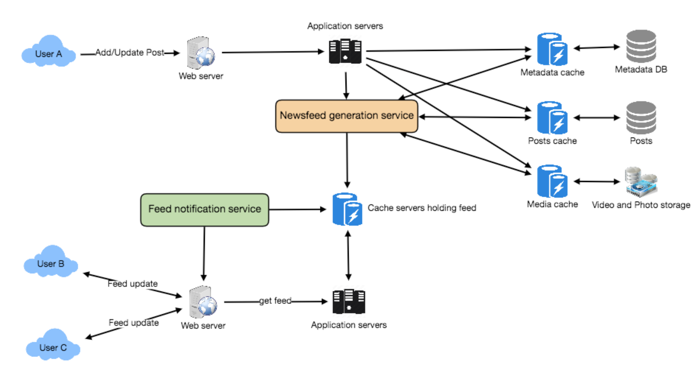

# System Design

## Designing Twitter

### 1. Requirement

**Functional Requirements**

1. User should be able to post new post.
2. User should be able to follow other users.
3. User should be able to mark tweets as favourites.
4. Create own Timeline and view other's timeline.
5. Tweets can contains photos and videos.

**Non-Functional Requirements**

1. Provides reliability, scalability and maintainability
2. Low latency for linetime generation
3. Consistency

**Extended Requirements**

1. Search for tweets
2. Replying to tweets
3. Trending topic
4. Tagging other users
5. Tweet notification
6. Suggestion on potential friends
7. Moments

### 2. Capacity Estimation and Constraints

Assume 1 B total users,

200 M is daily active user, 

100 M new tweets every day,

Each user follows 200 people on average,

Each user favorites five tweets per day

**How many favorites per day**: $200M * 5 = 1B $ favorites tweets

**How many total tweet-views will the system generate**: assume a user visit their timeline two times a day and visits five other people's pages and each user has 20 tweets on single page.  $200M * ((2+5)*20\ tweets) = 28B/day$

**Storage per day**: Let’s say each tweet has 140 characters and we need two bytes to store a character without compression. 

Let’s assume we need 30 bytes to store metadata with each tweet (like ID, timestamp, user ID, etc.). 

Total storage we would need: 100M * (280 + 30) bytes => 30GB/day
**Storage for five years**: 5 * 365 * 30GB => 20k * 30 GB => 600 TB for tweets, assume 1kb for user meta data and we have 1B * 1kb => 1TB

let’s assume that on average every fifth tweet has a photo and every tenth has a video. Let’s also assume on average a photo is 200KB and a video is 2MB. This will lead us to have 24TB of new media every day. (100M/5 photos * 200KB) + (100M/10 videos * 2MB) ~= 24TB/day

**Bandwidth Estimates** Since total ingress is 24TB per day, this would translate into 290MB/sec.
Remember that we have 28B tweet views per day. We must show the photo of every tweet (if it has a photo), but let’s assume that the users watch every 3rd video they see in their timeline. So, total egress will be:

(28B * 280 bytes) / 86400s of text => 93MB/s +

(28B/5 * 200KB ) / 86400s of photos => 13GB/S + 

(28B/10/3 * 2MB ) / 86400s of Videos => 22GB/s
Total ~= 35GB/s

### 3. System APIs

Using REST APIs to expose the functionality of our service. 

Following could be the definition of the API for posting a new tweet:

```go
tweet(api_dev_key, tweet_data, tweet_location, user_location, media_ids)
// Returns: (string) A successful post will return the URL to access that tweet. Otherwise, an appropriate HTTP error is returned.
```

Parameters:
`api_dev_key` (string): The API developer key of a registered account.
`tweet_data` (string): The text of the tweet, typically up to 140 characters.
`tweet_location` (string): Optional location (longitude, latitude) this Tweet refers to. 

`user_location` (string): Optional location (longitude, latitude) of the user adding the tweet.
`media_ids` (number[]): Optional list of media_ids to be `associated` with the Tweet. (All the media photo, video, etc. need to be uploaded separately).

### 4. High Level System Design

We need a system that can efficiently store all the new tweets, 

100M/86400s => 1150 tweets per second and read 28B/86400s => 325K tweets per second. 

It is clear from the requirements that this will be a read-heavy system.

At a high level, we need multiple application servers to serve all these requests with load balancers in front of them for traffic distributions. 

On the backend, we need an efficient database that can store all the new tweets and can support a huge number of reads. We also need some file storage to store photos and videos.

Although our expected daily write load is 100 million and read load is 28 billion tweets. This means on average our system will receive around 1160 new tweets and 325K read requests per second. This traffic will be distributed unevenly throughout the day, though, at peak time we should expect at least a few thousand write requests and around 1M read requests per second. We should keep this in mind while designing the architecture of our system.

### 5. Database Schema

We will have Tweet table, User table, UserFollow table and favorite. Indicate database choice between SQL and No SQL.

### 6. Data Sharding

We need to distribute our data onto multiple machines such that we can read/write it efficiently. 

We have many options to shard our data; let’s go through them one by one:

- **Sharding based on UserID**: We can try storing all the data of a user on one server. While storing, we can pass the UserID to our hash function that will map the user to a database server where we will store all of the user’s tweets, favorites, follows, etc. While querying for tweets/follows/favorites of a user, we can ask our hash function where can we find the data of a user and then read it from there. 

  This approach has a couple of issues:

  - A hot user  will causing high load and affect the performance of our service.
  - Over time some users can end up storing a lot of tweets or having a lot of follows compared to others. Maintaining a uniform distribution of growing user data is quite difficult.

  To recover from these situations either we have to repartition/redistribute our data or use consistent hashing.

- **Sharding based on TweetID**: Our hash function will map each TweetID to a random server where we will store that Tweet. To search for tweets, we have to query all servers, and each server will return a set of tweets. A centralized server will aggregate these results to return them to the user. 

  Let’s look into timeline generation example; here are the number of steps our system has to perform to generate a user’s timeline:

  1. Our application (app) server will find all the people the user follows.
  2. App server will send the query to all database servers to find tweets from these people.
  3. Each database server will find the tweets for each user, sort them by recency and return the top
     tweets.
  4. App server will merge all the results and sort them again to return the top results to the user.

  This approach solves the problem of hot users, but, in contrast to sharding by UserID, we have to query all database partitions to find tweets of a user, which can result in higher latencies.We can further improve our performance by introducing cache to store hot tweets in front of the database servers.

- **Sharding based on Tweet creation time**: Storing tweets based on creation time will give us the advantage of fetching all the top tweets quickly and we only have to query a very small set of servers. The problem here is that the traffic load will not be distributed, e.g., while writing, all new tweets will be going to one server and the remaining servers will be sitting idle. Similarly, while reading, the server holding the latest data will have a very high load as compared to servers holding old data.

**Combing sharding by TweedID and Tweet creation time** If we don’t store tweet creation time separately and use TweetID to reflect that, we can get benefits of both the approaches. This way it will be quite quick to find the latest Tweets. For this, we must make each TweetID universally unique in our system and each TweetID should contain a timestamp too.
We can use epoch time for this. Let’s say our TweetID will have two parts: the first part will be representing epoch seconds and the second part will be an auto-incrementing sequence. So, to make a new TweetID, we can take the current epoch time and append an auto-incrementing number to it. We can figure out the shard number from this TweetID and store it there.
What could be the size of our TweetID? Let’s say our epoch time starts today, how many bits we would need to store the number of seconds for the next 50 years?
86400 sec/day * 365 (days a year) * 50 (years) => 1.6B

We would need 31 bits to store this number. Since on average we are expecting 1150 new tweets per second, we can allocate 17 bits to store auto incremented sequence; this will make our TweetID 48 bits long. So, every second we can store (2^17 => 130K) new tweets. We can reset our auto incrementing sequence every second. For fault tolerance and better performance, we can have two database servers to generate auto-incrementing keys for us, one generating even numbered keys and the other generating odd numbered keys.
If we assume our current epoch seconds are “1483228800,” our TweetID will look like this:

1483228800 000001 1483228800 000002 1483228800 000003 1483228800 000004 ...
If we make our TweetID 64bits (8 bytes) long, we can easily store tweets for the next 100 years and also store them for mili-seconds granularity.
In the above approach, we still have to query all the servers for timeline generation, but our reads (and writes) will be substantially quicker.
1. Since we don’t have any secondary index (on creation time) this will reduce our write latency. 
2. While reading, we don’t need to filter on creation-time as our primary key has epoch time
    included in it.

### 7. Cache

We can introduce a cache for database servers to cache hot tweets and users. We can use an off-the-shelf solution like `Memcache` that can store the whole tweet objects. Application servers, before hitting database, can quickly check if the cache has desired tweets. Based on clients’ usage patterns we can determine how many cache servers we need.
Which cache replacement policy: Least Recently Used (LRU) can be a reasonable policy for our system. Under this policy, we discard the least recently viewed tweet first.
How can we have a more intelligent cache? If we go with 80-20 rule, that is 20% of tweets generating 80% of read traffic which means that certain tweets are so popular that a majority of people read them. This dictates that we can try to cache 20% of daily read volume from each shard.
What if we cache the latest data? Our service can benefit from this approach. Let’s say if 80% of our users see tweets from the past three days only; we can try to cache all the tweets from the past three days. Let’s say we have dedicated cache servers that cache all the tweets from all the users from the past three days. As estimated above, we are getting 100 million new tweets or 30GB of new data every day (without photos and videos). If we want to store all the tweets from last three days, we will need less than 100GB of memory. This data can easily fit into one server, but we should replicate it onto multiple servers to distribute all the read traffic to reduce the load on cache servers. So whenever we are generating a user’s timeline, we can ask the cache servers if they have all the recent tweets for that user. If yes, we can simply return all the data from the cache. If we don’t have enough tweets in the cache, we have to query the backend server to fetch that data. On a similar design, we can try caching photos and videos from the last three days.
Our cache would be like a hash table where ‘key’ would be ‘OwnerID’ and ‘value’ would be a doubly linked list containing all the tweets from that user in the past three days. Since we want to retrieve the most recent data first, we can always insert new tweets at the head of the linked list, which means all the older tweets will be near the tail of the linked list. Therefore, we can remove tweets from the tail to make space for newer tweets.

### 8. Replication and Fault Toleration

Since our system is read-heavy, we can have multiple secondary database servers for each DB partition. Secondary servers will be used for read traffic only. All writes will first go to the primary server and then will be replicated to secondary servers. This scheme will also give us fault tolerance, since whenever the primary server goes down we can failover to a secondary server.

### 9. Load Balancing

We can add Load balancing layer at three places in our system 

1. Between Clients and Application servers 
2. Between Application servers and database replication servers 
3. Between Aggregation servers and Cache server. 

Initially, a simple Round Robin approach can be adopted; that distributes incoming requests equally among servers. This LB is simple to implement and does not introduce any overhead. Another benefit of this approach is that if a server is dead, LB will take it out of the rotation and will stop sending any traffic to it. A problem with Round Robin LB is that it won’t take servers load into consideration. If a server is overloaded or slow, the LB will not stop sending new requests to that server. To handle this, a more intelligent LB solution can be placed that periodically queries backend server about their load and adjusts traffic based on that.
### 10. Monitoring

Having the ability to monitor our systems is crucial. We should constantly collect data to get an instant insight into how our system is doing. We can collect following metrics/counters to get an understanding of the performance of our service:

1. New tweets per day/second, what is the daily peak?
2. Timeline delivery stats, how many tweets per day/second our service is delivering. 
3. Average latency that is seen by the user to refresh timeline.

By monitoring these counters, we will realize if we need more replication, load balancing, or caching.

### 11. Extended Requirements

**How do we serve feeds?** Get all the latest tweets from the people someone follows and merge/sort them by time. Use pagination to fetch/show tweets. Only fetch top N tweets from all the people someone follows. This N will depend on the client’s Viewport, since on a mobile we show fewer tweets compared to a Web client. We can also cache next top tweets to speed things up.
Alternately, we can pre-generate the feed to improve efficiency; for details please see ‘Ranking and timeline generation’ under Designing Instagram.
**Retweet**: With each Tweet object in the database, we can store the ID of the original Tweet and not store any contents on this retweet object.
**Trending Topics**: We can cache most frequently occurring hashtags or search queries in the last N seconds and keep updating them after every M seconds. We can rank trending topics based on the frequency of tweets or search queries or retweets or likes. We can give more weight to topics which are shown to more people.
**Who to follow? How to give suggestions?** This feature will improve user engagement. We can suggest friends of people someone follows. We can go two or three levels down to find famous people for the suggestions. We can give preference to people with more followers.
As only a few suggestions can be made at any time, use Machine Learning (ML) to shuffle and reprioritize. ML signals could include people with recently increased follow-ship, common followers if the other person is following this user, common location or interests, etc.
**Moments**: Get top news for different websites for past 1 or 2 hours, figure out related tweets, prioritize them, categorize them (news, support, financial, entertainment, etc.) using ML – supervised learning or Clustering. Then we can show these articles as trending topics in Moments.
**Search**: Search involves Indexing, Ranking, and Retrieval of tweets. A similar solution is discussed in our next problem Design Twitter Search

## Design Youtube or Netflix

### 1. Requirements and Goals of the System

**Functional Requirements:**

1. Users should be able to upload videos.
2. Users should be able to share and view videos.
3. Users should be able to perform searches based on video titles.
4. Our services should be able to record stats of videos, e.g., likes/dislikes, total number of views,
etc.
5. Users should be able to add and view comments on videos.

**Non-Functional Requirements:**

1. The system should be highly reliable, any video uploaded should not be lost.
2. The system should be highly available.
3. Users should have a real time experience while watching videos and should not feel any lag.

Not in scope: Video recommendations, most popular videos, channels, subscriptions, watch later, favorites, etc.

### 2. Capacity Estimation and Constraints

Let’s assume we have 1.5 billion total users, 

800 million of whom are daily active users. 

On average, a user views five videos per day then the total video-views per second would be:
800M * 5 / 86400 sec => 46K videos/sec
Let’s assume our upload:view ratio is 1:200, i.e., for every video upload we have 200 videos viewed, giving us 230 videos uploaded per second.
46K / 200 => 230 videos/sec

**Storage Estimates**: Let’s assume that every minute 500 hours worth of videos are uploaded to Youtube. If on average, one minute of video needs 50MB of storage (videos need to be stored in multiple formats), the total storage needed for videos uploaded in a minute would be:
500 hours * 60 min * 50MB => 1500 GB/min (25 GB/sec)
These numbers are estimated with ignoring video compression and replication, which would change our estimates.
**Bandwidth estimates**: With 500 hours of video uploads per minute and assuming each video upload takes a bandwidth of 10MB/min, we would be getting 300GB of uploads every minute.
500 hours * 60 mins * 10MB => 300GB/min (5GB/sec)
Assuming an upload:view ratio of 1:200, we would need 1TB/s outgoing bandwidth.

### 3. System APIs

The following could be the definitions of the APIs for uploading and searching videos:

```go
uploadVideo(api_dev_key, video_title, vide_description, tags[], category_id,
default_language,recording_details, video_contents)
// Returns: (string)
// A successful upload will return HTTP 202 (request accepted) and once the video encoding is completed the user is notified through email with a link to access the video. We can also expose a queryable API to let users know the current status of their uploaded video.
```

Parameters:
`api_dev_key` (string): The API developer key of a registered account. This will be used to, among other things, throttle users based on their allocated quota.
`video_title` (string): Title of the video.
`vide_description` (string): Optional description of the video.
`tags` (string[]): Optional tags for the video.
`category_id` (string): Category of the video, e.g., Film, Song, People, etc. 

`default_language` (string): For example English, Mandarin, Hindi, etc. 

`recording_details` (string): Location where the video was recorded. 

`video_contents` (stream): Video to be uploaded.

```go
searchVideo(api_dev_key, search_query, user_location, maximum_videos_to_return, page_token)
// Returns: (JSON)
// A JSON containing information about the list of video resources matching the search query. Each video resource will have a video title, a thumbnail, a video creation date, and a view count.
```

Parameters:
`api_dev_key` (string): The API developer key of a registered account of our service. 

`search_query` (string): A string containing the search terms.
`user_location` (string): Optional location of the user performing the search. 

`maximum_videos_to_return` (number): Maximum number of results returned in one request. 

`page_token` (string): This token will specify a page in the result set that should be returned.

```go
streamVideo(api_dev_key, video_id, offset, codec, resolution)
// Returns: (STREAM)
// A media stream (a video chunk) from the given offset.
```

Parameters:
`api_dev_key` (string): The API developer key of a registered account of our service.
`video_id` (string): A string to identify the video.
`offset` (number): We should be able to stream video from any offset; this offset would be a time in seconds from the beginning of the video. If we support playing/pausing a video from multiple devices, we will need to store the offset on the server. This will enable the users to start watching a video on any device from the same point where they left off.
`codec` (string) & `resolution`(string): We should send the codec and resolution info in the API from the client to support play/pause from multiple devices. Imagine you are watching a video on your TV’s Netflix app, paused it, and started watching it on your phone’s Netflix app. In this case, you would need codec and resolution, as both these devices have a different resolution and use a different codec.

### 4. High Level Design

At a high-level we would need the following components:
1. *Processing Queue*: Each uploaded video will be pushed to a processing queue to be de-queued later for encoding, thumbnail generation, and storage.
2. *Encoder*: To encode each uploaded video into multiple formats.
3. *Thumbnails generator*: To generate a few thumbnails for each video.
4. *Video and Thumbnail storage*: To store video and thumbnail files in some distributed file
storage.
5. *User Database*: To store user’s information, e.g., name, email, address, etc.
6. *Video metadata storage*: A metadata database to store all the information about videos like
title, file path in the system, uploading user, total views, likes, dislikes, etc. It will also be used to store all the video comments.

### 5. Database Schema

**Video metadata storage - MySql**

Videos metadata can be stored in a SQL database. The following information should be stored with each video:
• VideoID
• Title
• Description
• Size
• Thumbnail
• Uploader/User
• Total number of likes
• Total number of dislikes
• Total number of views
For each video comment, we need to store following information:
• CommentID 

• VideoID
• UserID
• Comment
• TimeOfCreation User data storage - MySql
• UserID, Name, email, address, age, registration details etc

### 6. Detailed Component Design

The service would be read-heavy, so we will focus on building a system that can retrieve videos quickly. We can expect our read:write ratio to be 200:1, which means for every video upload there are 200 video views.
**Where would videos be stored**? Videos can be stored in a distributed file storage system like HDFS or GlusterFS.
**How should we efficiently manage read traffic**? We should segregate our read traffic from write traffic. Since we will have multiple copies of each video, we can distribute our read traffic on different servers. For metadata, we can have master-worker configurations where writes will go to master first and then gets applied at all the slaves. Such configurations can cause some staleness in data, e.g., when a new video is added, its metadata would be inserted in the master first and before it gets applied at the worker,and the worker would not be able to see it; and therefore it will be returning stale results to the user. This staleness might be acceptable in our system as it would be very short-lived and the user would be able to see the new videos after a few milliseconds.
**Where would thumbnails be stored**? There will be a lot more thumbnails than videos. If we assume that every video will have five thumbnails, we need to have a very efficient storage system that can serve a huge read traffic. There will be two consideration before deciding which storage system should be used for thumbnails:

1. Thumbnails are small files with, say, a maximum 5KB each.
2. Read traffic for thumbnails will be huge compared to videos. Users will be watching one video
at a time, but they might be looking at a page that has 20 thumbnails of other videos.

Let’s evaluate storing all the thumbnails on a disk. Given that we have a huge number of files, we have to perform a lot of seeks to different locations on the disk to read these files. This is quite inefficient and will result in higher latencies.
Bigtable can be a reasonable choice here as it combines multiple files into one block to store on the disk and is very efficient in reading a small amount of data. 

> **_Note_**: Bigtable is a compressed, high performance, proprietary data storage system built on Google File System. A Bigtable is a sparse, distributed, persistent multi-dimensional sorted map.

Both of these are the two most significant requirements of our service. Keeping hot thumbnails in the cache will also help in improving the latencies and, given that thumbnails files are small in size, we can easily cache a large number of such files in memory.

**Video Uploads**: Since videos could be huge, if while uploading the connection drops we should support resuming from the same point.
**Video Encoding**: Newly uploaded videos are stored on the server and a new task is added to the processing queue to encode the video into multiple formats. Once all the encoding will be completed the uploader will be notified and the video is made available for view/sharing.

### 7. Metadata Sharding

Since we have a huge number of new videos every day and our read load is extremely high, therefore, we need to distribute our data onto multiple machines so that we can perform read/write operations efficiently. We have many options to shard our data. Let’s go through different strategies of sharding this data one by one:
**Sharding based on UserID**: We can try storing all the data for a particular user on one server. While storing, we can pass the UserID to our hash function which will map the user to a database server where we will store all the metadata for that user’s videos. While querying for videos of a user, we can ask our hash function to find the server holding the user’s data and then read it from there. To search videos by titles we will have to query all servers and each server will return a set of videos. A centralized server will then aggregate and rank these results before returning them to the user.
This approach has a couple of issues:

1. **What if a user becomes popular?** There could be a lot of queries on the server holding that user; this could create a performance bottleneck. This will also affect the overall performance of our service. (Hot spot)
2. Over time, some users can end up storing a lot of videos compared to others. Maintaining a uniform distribution of growing user data is quite tricky.
To recover from these situations either we have to repartition/redistribute our data or used consistent hashing to balance the load between servers.

**Sharding based on VideoID**: Our hash function will map each VideoID to a random server where we will store that Video’s metadata. To find videos of a user we will query all servers and each server will return a set of videos. A centralized server will aggregate and rank these results before returning them to the user. This approach solves our problem of popular users but shifts it to popular videos. (replicated server to solve the issue?)
We can further improve our performance by introducing a cache to store hot videos in front of the database servers.

### 8. Video Deduplication

With a huge number of users uploading a massive amount of video data our service will have to deal with widespread video duplication. Duplicate videos often differ in aspect ratios or encodings, can contain overlays or additional borders, or can be excerpts from a longer original video. The proliferation of duplicate videos can have an impact on many levels:

1. *Data Storage*: We could be wasting storage space by keeping multiple copies of the same video.
2. *Caching*: Duplicate videos would result in degraded cache efficiency by taking up space that
could be used for unique content.
3. *Network usage*: Duplicate videos will also increase the amount of data that must be sent over
the network to in-network caching systems.
4. *Energy consumption*: Higher storage, inefficient cache, and network usage could result in
energy wastage.

For the end user, these inefficiencies will be realized in the form of duplicate search results, longer video startup times, and interrupted streaming.
For our service, deduplication makes most sense early; when a user is uploading a video as compared to post-processing it to find duplicate videos later. Inline deduplication will save us a lot of resources that can be used to encode, transfer, and store the duplicate copy of the video. As soon as any user starts uploading a video, our service can run video matching algorithms (e.g., Block Matching, Phase Correlation, etc.) to find duplications. If we already have a copy of the video being uploaded, we can either stop the upload and use the existing copy or continue the upload and use the newly uploaded video if it is of higher quality. If the newly uploaded video is a subpart of an existing video or, vice versa, we can intelligently divide the video into smaller chunks so that we only upload the parts that are missing.

### 9. Load Balancing

We should use Consistent Hashing among our cache servers, which will also help in balancing the load between cache servers. Since we will be using a static hash-based scheme to map videos to hostnames it can lead to an uneven load on the logical replicas due to the different popularity of each video. For instance, if a video becomes popular, the logical replica corresponding to that video will experience more traffic than other servers. These uneven loads for logical replicas can then translate into uneven load distribution on corresponding physical servers. To resolve this issue any busy server in one location can redirect a client to a less busy server in the same cache location. We can use dynamic HTTP redirections for this scenario.
However, the use of redirections also has its drawbacks. First, since our service tries to load balance locally, it leads to multiple redirections if the host that receives the redirection can’t serve the video. Also, each redirection requires a client to make an additional HTTP request; it also leads to higher delays before the video starts playing back. Moreover, inter-tier (or cross data-center) redirections lead a client to a distant cache location because the higher tier caches are only present at a small number of locations.
### 10. Cache

To serve globally distributed users, our service needs a massive-scale video delivery system. Our service should push its content closer to the user using a large number of geographically distributed video cache servers. We need to have a strategy that will maximize user performance and also evenly distributes the load on its cache servers.
We can introduce a cache for metadata servers to cache hot database rows. Using Memcache to cache the data and Application servers before hitting database can quickly check if the cache has the desired rows. Least Recently Used (LRU) can be a reasonable cache eviction policy for our system. Under this policy, we discard the least recently viewed row first.
How can we build more intelligent cache? If we go with 80-20 rule, i.e., 20% of daily read volume for videos is generating 80% of traffic, meaning that certain videos are so popular that the majority of people view them; it follows that we can try caching 20% of daily read volume of videos and metadata.

### 11. Content Delivery Network (CDN)

A CDN is a system of distributed servers that deliver web content to a user based in the geographic locations of the user, the origin of the web page and a content delivery server. Take a look at ‘CDN’ section in our Caching chapter.
Our service can move popular videos to CDNs:

- CDNs replicate content in multiple places. There’s a better chance of videos being closer to the user and, with fewer hops, videos will stream from a friendlier network.
- CDN machines make heavy use of caching and can mostly serve videos out of memory.
  Less popular videos (1-20 views per day) that are not cached by CDNs can be served by our servers in various data centers.

### 12. Fault Tolerance

We should use Consistent Hashing for distribution among database servers. Consistent hashing will not only help in replacing a dead server, but also help in distributing load among servers.

## Designing an API Rate Limiter

### 1.Requirements and Goals of the System

Our Rate Limiter should meet the following requirements:

**Functional Requirements:**

1. Limit the number of requests an entity can send to an API within a time window, e.g., 15 requests per second.
2. The APIs are accessible through a cluster, so the rate limit should be considered across different servers. The user should get an error message whenever the defined threshold is crossed within a single server or across a combination of servers.

**Non-Functional Requirements:**

1. The system should be highly available. The rate limiter should always work since it protects our service from external attacks.

2. Our rate limiter should not introduce substantial latencies affecting the user experience.

### 2.Basic System Design and Algorithm

Let’s take the example where we want to limit the number of requests per user. Under this scenario, for each unique user, we would keep a count representing how many requests the user has made and a timestamp when we started counting the requests. We can keep it in a hashtable, where the ‘key’ would be the ‘UserID’ and ‘value’ would be a structure containing an integer for the ‘Count’ and an integer for the Epoch time:

Let’s assume our rate limiter is allowing three requests per minute per user, so whenever a new request comes in, our rate limiter will perform the following steps:

1. If the ‘UserID’ is not present in the hash-table, insert it, set the ‘Count’ to 1, set ‘StartTime’ to the current time (normalized to a minute), and allow the request.

2. Otherwise, find the record of the ‘UserID’ and if CurrentTime – StartTime >= 1 min, set the ‘StartTime’ to the current time, ‘Count’ to 1, and allow the request.

3. If CurrentTime - StartTime <= 1 min and

- If ‘Count < 3’, increment the Count and allow the request.
- If ‘Count >= 3’, reject the request.

### 3.Sliding Window algorithm

Let’s assume our rate limiter is allowing three requests per minute per user, so, whenever a new request comes in, the Rate Limiter will perform following steps:

1. Remove all the timestamps from the Sorted Set that are older than “CurrentTime - 1 minute”.
2. Count the total number of elements in the sorted set. Reject the request if this count is greater than our throttling limit of “3”.
3. Insert the current time in the sorted set and accept the request.

### 4. Sliding Window with Counters

What if we keep track of request counts for each user using multiple fixed time windows, e.g., 1/60th the size of our rate limit’s time window. For example, if we have an hourly rate limit we can keep a count for each minute and calculate the sum of all counters in the past hour when we receive a new request to calculate the throttling limit. This would reduce our memory footprint. Let’s take an example where we rate-limit at 500 requests per hour with an additional limit of 10 requests per minute. This means that when the sum of the counters with timestamps in the past hour exceeds the request threshold (500), Kristie has exceeded the rate limit. In addition to that, she can’t send more than ten requests per minute. This would be a reasonable and practical consideration, as none of the real users would send frequent requests. Even if they do, they will see success with retries since their limits get reset every minute.

We can store our counters in a Redis Hash since it offers incredibly efficient storage for fewer than 100 keys. When each request increments a counter in the hash, it also sets the hash to expire an hour later. We will normalize each ‘time’ to a minute.

### 5.Data Sharding and Caching

We can shard based on the ‘UserID’ to distribute the user’s data. For fault tolerance and replication we should use Consistent Hashing. If we want to have different throttling limits for different APIs, we can choose to shard per user per API. Take the example of URL Shortener; we can have different rate limiter for createURL() and deleteURL() APIs for each user or IP.

If our APIs are partitioned, a practical consideration could be to have a separate (somewhat smaller) rate limiter for each API shard as well. Let’s take the example of our URL Shortener where we want to limit each user not to create more than 100 short URLs per hour. Assuming we are using **Hash-Based Partitioning** for our createURL() API, we can rate limit each partition to allow a user to create not more than three short URLs per minute in addition to 100 short URLs per hour.

Our system can get huge benefits from caching recent active users. Application servers can quickly check if the cache has the desired record before hitting backend servers. Our rate limiter can significantly benefit from the **Write-back cache** by updating all counters and timestamps in cache only. The write to the permanent storage can be done at fixed intervals. This way we can ensure minimum latency added to the user’s requests by the rate limiter. The reads can always hit the cache first; which will be extremely useful once the user has hit their maximum limit and the rate limiter will only be reading data without any updates.

Least Recently Used (LRU) can be a reasonable cache eviction policy for our system.

### 6.Should we rate limit by IP or by user?

Let’s discuss the pros and cons of using each one of these schemes:

**IP:** In this scheme, we throttle requests per-IP; although it’s not optimal in terms of differentiating between ‘good’ and ‘bad’ actors, it’s still better than not have rate limiting at all. The biggest problem with IP based throttling is when multiple users share a single public IP like in an internet cafe or smartphone users that are using the same gateway. One bad user can cause throttling to other users. Another issue could arise while caching IP-based limits, as there are a huge number of IPv6 addresses available to a hacker from even one computer, it’s trivial to make a server run out of memory tracking IPv6 addresses!

**User:** Rate limiting can be done on APIs after user authentication. Once authenticated, the user will be provided with a token which the user will pass with each request. This will ensure that we will rate limit against a particular API that has a valid authentication token. But what if we have to rate limit on

the login API itself? The weakness of this rate-limiting would be that a hacker can perform a denial of service attack against a user by entering wrong credentials up to the limit; after that the actual user will not be able to log-in.

**How about if we combine the above two schemes?**

**Hybrid:** A right approach could be to do both per-IP and per-user rate limiting, as they both have weaknesses when implemented alone, though, this will result in more cache entries with more details per entry, hence requiring more memory and storage.

## Designing Twitter Search

### 1.Requirements and Goals of the System

- Let’s assume Twitter has 1.5 billion total users with 800 million daily active users.
- On average Twitter gets 400 million tweets every day.
- The average size of a tweet is 300 bytes.
- Let’s assume there will be 500M searches every day.
- The search query will consist of multiple words combined with AND/OR. 

### 2. Capacity Estimation and Constraints

**Storage Capacity:** Since we have 400 million new tweets every day and each tweet on average is 300 bytes, the total storage we need, will be:

400M * 300 => 120GB/day

Total storage per second:

120GB / 24hours / 3600sec ~= 1.38MB/second

### 3.System APIs

We can have SOAP or REST APIs to expose functionality of our service; following could be the definition of the search API:

```go
search(api_dev_key, search_terms, maximum_results_to_return, sort, page_token)
```

**Parameters:**

*api_dev_key* (string): The API developer key of a registered account. This will be used to, among other things, throttle users based on their allocated quota.
*search_terms* (string): A string containing the search terms.
*maximum_results_to_return* (number): Number of tweets to return.

*sort* (number): Optional sort mode: Latest first (0 - default), Best matched (1), Most liked (2).

*page_token* (string): This token will specify a page in the result set that should be returned.

**Returns:** (JSON)
 A JSON containing information about a list of tweets matching the search query. Each result entry can have the user ID & name, tweet text, tweet ID, creation time, number of likes, etc.

### 4. High Level Design

At the high level, we need to store all the statues in a database and also build an index that can keep track of which word appears in which tweet. This index will help us quickly find tweets that users are trying to search.

### 5. Detailed Component Design

**1. Storage:** We need to store 120GB of new data every day. Given this huge amount of data, we need to come up with a data partitioning scheme that will be efficiently distributing the data onto multiple servers. If we plan for next five years, we will need the following storage:

120GB * 365days * 5years ~= 200TB

If we never want to be more than 80% full at any time, we approximately will need 250TB of total storage. Let’s assume that we want to keep an extra copy of all tweets for fault tolerance; then, our total storage requirement will be 500TB. 

Let’s start with a simplistic design where we store the tweets in a MySQL database. We can assume that we store the tweets in a table having two columns, TweetID and TweetText. Let’s assume we partition our data based on TweetID. If our TweetIDs are unique system-wide, we can define a hash function that can map a TweetID to a storage server where we can store that tweet object.

**How can we create system-wide unique TweetIDs?** If we are getting 400M new tweets each day, then how many tweet objects we can expect in five years?

400M * 365 days * 5 years => 730 billion

This means we would need a five bytes number to identify TweetIDs uniquely. Let’s assume we have a service that can generate a unique TweetID whenever we need to store an object (The TweetID discussed here will be similar to TweetID discussed in Designing Twitter). We can feed the TweetID to our hash function to find the storage server and store our tweet object there.

**2. Index:** What should our index look like? Since our tweet queries will consist of words, let’s build the index that can tell us which word comes in which tweet object. Let’s first estimate how big our index will be. If we want to build an index for all the English words and some famous nouns like people names, city names, etc., and if we assume that we have around 300K English words and 200K nouns, then we will have 500k total words in our index. Let’s assume that the average length of a word is five characters. If we are keeping our index in memory, we need 2.5MB of memory to store all the words:

500K * 5 => 2.5 MB

Let’s assume that we want to keep the index in memory for all the tweets from only past two years. Since we will be getting 730B tweets in 5 years, this will give us 292B tweets in two years. Given that each TweetID will be 5 bytes, how much memory will we need to store all the TweetIDs?

292B * 5 => 1460 GB

So our index would be like a big distributed hash table, where ‘key’ would be the word and ‘value’ will be a list of TweetIDs of all those tweets which contain that word. Assuming on average we have 40 words in each tweet and since we will not be indexing prepositions and other small words like ‘the’, ‘an’, ‘and’ etc., let’s assume we will have around 15 words in each tweet that need to be indexed. This means each TweetID will be stored 15 times in our index. So total memory we will need to store our index:

(1460 * 15) + 2.5MB ~= 21 TB

Assuming a high-end server has 144GB of memory, we would need 152 such servers to hold our index. 

We can shard our data based on two criteria:

**Sharding based on Words:** While building our index, we will iterate through all the words of a tweet and calculate the hash of each word to find the server where it would be indexed. To find all tweets containing a specific word we have to query only the server which contains this word.

We have a couple of issues with this approach:

1. What if a word becomes hot? Then there will be a lot of queries on the server holding that word. This high load will affect the performance of our service.

2.  Over time, some words can end up storing a lot of TweetIDs compared to others, therefore, maintaining a uniform distribution of words while tweets are growing is quite tricky.

To recover from these situations we either have to repartition our data or use Consistent Hashing.

**Sharding based on the tweet object:** While storing, we will pass the TweetID to our hash function to find the server and index all the words of the tweet on that server. While querying for a particular word, we have to query all the servers, and each server will return a set of TweetIDs. A centralized server will aggregate these results to return them to the user.

### 6.Fault Tolerance

What will happen when an index server dies? We can have a secondary replica of each server and if the primary server dies it can take control after the failover. Both primary and secondary servers will have the same copy of the index.

What if both primary and secondary servers die at the same time? We have to allocate a new server and rebuild the same index on it. How can we do that? We don’t know what words/tweets were kept on this server. If we were using ‘Sharding based on the tweet object’, the brute-force solution would be to iterate through the whole database and filter TweetIDs using our hash function to figure out all the required tweets that would be stored on this server. This would be inefficient and also during the time when the server was being rebuilt we would not be able to serve any query from it, thus missing some tweets that should have been seen by the user.

How can we efficiently retrieve a mapping between tweets and the index server? We have to build a reverse index that will map all the TweetID to their index server. Our Index-Builder server can hold this information. We will need to build a Hashtable where the ‘key’ will be the index server number and the ‘value’ will be a HashSet containing all the TweetIDs being kept at that index server. Notice that we are keeping all the TweetIDs in a HashSet; this will enable us to add/remove tweets from our index quickly. So now, whenever an index server has to rebuild itself, it can simply ask the Index-Builder server for all the tweets it needs to store and then fetch those tweets to build the index. This approach will surely be fast. We should also have a replica of the Index-Builder server for fault tolerance.

### 7. Cache

To deal with hot tweets we can introduce a cache in front of our database. We can use Memcached, which can store all such hot tweets in memory. Application servers, before hitting the backend database, can quickly check if the cache has that tweet. Based on clients’ usage patterns, we can adjust how many cache servers we need. For cache eviction policy, Least Recently Used (LRU) seems suitable for our system.

### 8.Load Balancing

We can add a load balancing layer at two places in our system 1) Between Clients and Application servers and 2) Between Application servers and Backend server. Initially, a simple Round Robin approach can be adopted; that distributes incoming requests equally among backend servers. This LB is simple to implement and does not introduce any overhead. Another benefit of this approach is LB will take dead servers out of the rotation and will stop sending any traffic to it. A problem with Round Robin LB is it won’t take server load into consideration. If a server is overloaded or slow, the LB will not stop sending new requests to that server. To handle this, a more intelligent LB solution can be placed that periodically queries the backend server about their load and adjust traffic based on that.

### 9. Ranking

How about if we want to rank the search results by social graph distance, popularity, relevance, etc?

Let’s assume we want to rank tweets by popularity, like how many likes or comments a tweet is getting, etc. In such a case, our ranking algorithm can calculate a ‘popularity number’ (based on the number of likes etc.) and store it with the index. Each partition can sort the results based on this popularity number before returning results to the aggregator server. The aggregator server combines all these results, sorts them based on the popularity number, and sends the top results to the user.

## Designing a Web Crawler

### Requirements and Goals of the System

Let’s assume we need to crawl all the web.

**Scalability:** Our service needs to be scalable such that it can crawl the entire Web and can be used to fetch hundreds of millions of Web documents.

**Extensibility:** Our service should be designed in a modular way with the expectation that new functionality will be added to it. There could be newer document types that needs to be downloaded and processed in the future.

### Some Design Considerations

Crawling the web is a complex task, and there are many ways to go about it. We should be asking a few questions before going any further:

**Is it a crawler for HTML pages only? Or should we fetch and store other types of media, such as sound files, images, videos, etc.?** This is important because the answer can change the design. If we are writing a general-purpose crawler to download different media types, we might want to break down the parsing module into different sets of modules: one for HTML, another for images, or another for videos, where each module extracts what is considered interesting for that media type.

Let’s assume for now that our crawler is going to deal with HTML only, but it should be extensible and make it easy to add support for new media types.

**What protocols are we looking at? HTTP? What about FTP links? What different protocols should our crawler handle?** For the sake of the exercise, we will assume HTTP. Again, it shouldn’t be hard to extend the design to use FTP and other protocols later.

**What is the expected number of pages we will crawl? How big will the URL database become?**

Let’s assume we need to crawl one billion websites. Since a website can contain many, many URLs, let’s assume an upper bound of 15 billion different web pages that will be reached by our crawler.

**What is ‘RobotsExclusion’ and how should we deal with it?** Courteous Web crawlers implement the Robots Exclusion Protocol, which allows Webmasters to declare parts of their sites off limits to crawlers. The Robots Exclusion Protocol requires a Web crawler to fetch a special document called robot.txt which contains these declarations from a Web site before downloading any real content from it.

### Capacity Estimation and Constraints

If we want to crawl 15 billion pages within four weeks, how many pages do we need to fetch per second?

15B / (4 weeks * 7 days * 86400 sec) ~= 6200 pages/sec

**What about storage?** Page sizes vary a lot, but, as mentioned above since, we will be dealing with HTML text only, let’s assume an average page size of 100KB. With each page, if we are storing 500 bytes of metadata, total storage we would need:

15B * (100KB + 500) ~= 1.5 petabytes

Assuming a 70% capacity model (we don’t want to go above 70% of the total capacity of our storage system), total storage we will need:

1.5 petabytes / 0.7 ~= 2.14 petabytes

### High Level design

The basic algorithm executed by any Web crawler is to take a list of seed URLs as its input and repeatedly execute the following steps.

1. Pick a URL from the unvisited URL list.
2. Determine the IP Address of its host-name.
3. Establish a connection to the host to download the corresponding document. 
4. Parse the document contents to look for new URLs.
5. Add the new URLs to the list of unvisited URLs.
6. Process the downloaded document, e.g., store it or index its contents, etc.
7. Go back to step 1

**How to crawl?**

**Breadth first or depth first?** Breadth-first search (BFS) is usually used. However, Depth First Search (DFS) is also utilized in some situations, such as, if your crawler has already established a connection with the website, it might just DFS all the URLs within this website to save some handshaking overhead.

**Path-ascending crawling:** Path-ascending crawling can help discover a lot of isolated resources or resources for which no inbound link would have been found in regular crawling of a particular Web site. In this scheme, a crawler would ascend to every path in each URL that it intends to crawl. For example, when given a seed URL of http://foo.com/a/b/page.html, it will attempt to crawl /a/b/, /a/, and /.

**Difficulties in implementing efficient web crawler**

There are two important characteristics of the Web that makes Web crawling a very difficult task:

**1. Large volume of Web pages:** A large volume of web pages implies that web crawler can only download a fraction of the web pages at any time and hence it is critical that web crawler should be intelligent enough to prioritize download.

**2. Rate of change on web pages.** Another problem with today’s dynamic world is that web pages on the internet change very frequently. As a result, by the time the crawler is downloading the last page from a site, the page may change, or a new page may be added to the site.

A bare minimum crawler needs at least these components:

**1. URL frontier:** To store the list of URLs to download and also prioritize which URLs should be crawled first.
 **2. HTTP Fetcher:** To retrieve a web page from the server.
 **3. Extractor:** To extract links from HTML documents.

**4. Duplicate Eliminator:** To make sure the same content is not extracted twice unintentionally. **5. Datastore:** To store retrieved pages, URLs, and other metadata.

###  Detailed Component Design

Let’s assume our crawler is running on one server and all the crawling is done by multiple working threads where each working thread performs all the steps needed to download and process a document in a loop.

The first step of this loop is to remove an absolute URL from the shared URL frontier for downloading. An absolute URL begins with a scheme (e.g., “HTTP”) which identifies the network protocol that should be used to download it. We can implement these protocols in a modular way for extensibility, so that later if our crawler needs to support more protocols, it can be easily done. Based on the URL’s scheme, the worker calls the appropriate protocol module to download the document. After downloading, the document is placed into a Document Input Stream (DIS). Putting documents into DIS will enable other modules to re-read the document multiple times.

Once the document has been written to the DIS, the worker thread invokes the dedupe test to determine whether this document (associated with a different URL) has been seen before. If so, the document is not processed any further and the worker thread removes the next URL from the frontier.

Next, our crawler needs to process the downloaded document. Each document can have a different MIME type like HTML page, Image, Video, etc. We can implement these MIME schemes in a modular way, so that later if our crawler needs to support more types, we can easily implement them. Based on the downloaded document’s MIME type, the worker invokes the process method of each processing module associated with that MIME type.

Furthermore, our HTML processing module will extract all links from the page. Each link is converted into an absolute URL and tested against a user-supplied URL filter to determine if it should be downloaded. If the URL passes the filter, the worker performs the URL-seen test, which checks if the URL has been seen before, namely, if it is in the URL frontier or has already been downloaded. If the URL is new, it is added to the frontier.

Let’s discuss these components one by one, and see how they can be distributed onto multiple machines:

**1. The URL frontier:** The URL frontier is the data structure that contains all the URLs that remain to be downloaded. We can crawl by performing a breadth-first traversal of the Web, starting from the pages in the seed set. Such traversals are easily implemented by using a FIFO queue.

Since we’ll be having a huge list of URLs to crawl, we can distribute our URL frontier into multiple servers. Let’s assume on each server we have multiple worker threads performing the crawling tasks. Let’s also assume that our hash function maps each URL to a server which will be responsible for crawling it.

Following politeness requirements must be kept in mind while designing a distributed URL frontier:

1. Our crawler should not overload a server by downloading a lot of pages from it. 
2. We should not have multiple machines connecting a web server.

To implement this politeness constraint our crawler can have a collection of distinct FIFO sub-queues on each server. Each worker thread will have its separate sub-queue, from which it removes URLs for crawling. When a new URL needs to be added, the FIFO sub-queue in which it is placed will be determined by the URL’s canonical hostname. Our hash function can map each hostname to a thread number. Together, these two points imply that, at most, one worker thread will download documents from a given Web server and also, by using FIFO queue, it’ll not overload a Web server.

**How big will our URL frontier be?** The size would be in the hundreds of millions of URLs. Hence, we need to store our URLs on a disk. We can implement our queues in such a way that they have separate buffers for enqueuing and dequeuing. Enqueue buffer, once filled, will be dumped to the disk, whereas dequeue buffer will keep a cache of URLs that need to be visited; it can periodically read from disk to fill the buffer.

**2. The fetcher module:** The purpose of a fetcher module is to download the document corresponding to a given URL using the appropriate network protocol like HTTP. As discussed above, webmasters create robot.txt to make certain parts of their websites off limits for the crawler. To avoid downloading this file on every request, our crawler’s HTTP protocol module can maintain a fixed-sized cache mapping host-names to their robot’s exclusion rules.

**3. Document input stream:** Our crawler’s design enables the same document to be processed by multiple processing modules. To avoid downloading a document multiple times, we cache the document locally using an abstraction called a Document Input Stream (DIS).

A DIS is an input stream that caches the entire contents of the document read from the internet. It also provides methods to re-read the document. The DIS can cache small documents (64 KB or less) entirely in memory, while larger documents can be temporarily written to a backing file.

Each worker thread has an associated DIS, which it reuses from document to document. After extracting a URL from the frontier, the worker passes that URL to the relevant protocol module, which initializes the DIS from a network connection to contain the document’s contents. The worker then passes the DIS to all relevant processing modules.

**4. Document Dedupe test:** Many documents on the Web are available under multiple, different URLs. There are also many cases in which documents are mirrored on various servers. Both of these effects will cause any Web crawler to download the same document multiple times. To prevent processing of a document more than once, we perform a dedupe test on each document to remove duplication.

To perform this test, we can calculate a 64-bit checksum of every processed document and store it in a database. For every new document, we can compare its checksum to all the previously calculated checksums to see the document has been seen before. We can use MD5 or SHA to calculate these checksums.

**How big would be the checksum store?** If the whole purpose of our checksum store is to do dedupe, then we just need to keep a unique set containing checksums of all previously processed document. Considering 15 billion distinct web pages, we would need:

15B * 8 bytes => 120 GB

Although this can fit into a modern-day server’s memory, if we don’t have enough memory available, we can keep smaller LRU based cache on each server with everything backed by persistent storage.

The dedupe test first checks if the checksum is present in the cache. If not, it has to check if the checksum resides in the back storage. If the checksum is found, we will ignore the document. Otherwise, it will be added to the cache and back storage.

**5. URL filters:** The URL filtering mechanism provides a customizable way to control the set of URLs that are downloaded. This is used to blacklist websites so that our crawler can ignore them. Before adding each URL to the frontier, the worker thread consults the user-supplied URL filter. We can define filters to restrict URLs by domain, prefix, or protocol type.

**6. Domain name resolution:** Before contacting a Web server, a Web crawler must use the Domain Name Service (DNS) to map the Web server’s hostname into an IP address. DNS name resolution will be a big bottleneck of our crawlers given the amount of URLs we will be working with. To avoid repeated requests, we can start caching DNS results by building our local DNS server.

**7. URL dedupe test:** While extracting links, any Web crawler will encounter multiple links to the same document. To avoid downloading and processing a document multiple times, a URL dedupe test must be performed on each extracted link before adding it to the URL frontier.

To perform the URL dedupe test, we can store all the URLs seen by our crawler in canonical form in a database. To save space, we do not store the textual representation of each URL in the URL set, but rather a fixed-sized checksum.

To reduce the number of operations on the database store, we can keep an in-memory cache of popular URLs on each host shared by all threads. The reason to have this cache is that links to some URLs are quite common, so caching the popular ones in memory will lead to a high in-memory hit rate.

**How much storage we would need for URL’s store?** If the whole purpose of our checksum is to do URL dedupe, then we just need to keep a unique set containing checksums of all previously seen URLs. Considering 15 billion distinct URLs and 4 bytes for checksum, we would need:

15B * 4 bytes => 60 GB

**Can we use bloom filters for deduping?** Bloom filters are a probabilistic data structure for set membership testing that may yield false positives. A large bit vector represents the set. An element is added to the set by computing ‘n’ hash functions of the element and setting the corresponding bits. An element is deemed to be in the set if the bits at all ‘n’ of the element’s hash locations are set. Hence, a document may incorrectly be deemed to be in the set, but false negatives are not possible.

The disadvantage of using a bloom filter for the URL seen test is that each false positive will cause the URL not to be added to the frontier and, therefore, the document will never be downloaded. The chance of a false positive can be reduced by making the bit vector larger.

**8. Checkpointing:** A crawl of the entire Web takes weeks to complete. To guard against failures, our crawler can write regular snapshots of its state to the disk. An interrupted or aborted crawl can easily be restarted from the latest checkpoint.

### Fault tolerance

We should use consistent hashing for distribution among crawling servers. Consistent hashing will not only help in replacing a dead host, but also help in distributing load among crawling servers.

All our crawling servers will be performing regular checkpointing and storing their FIFO queues to disks. If a server goes down, we can replace it. Meanwhile, consistent hashing should shift the load to other servers.

### Data Partitioning

Our crawler will be dealing with three kinds of data: 1) URLs to visit 2) URL checksums for dedupe 3) Document checksums for dedupe.

Since we are distributing URLs based on the hostnames, we can store these data on the same host. So, each host will store its set of URLs that need to be visited, checksums of all the previously visited URLs and checksums of all the downloaded documents. Since we will be using consistent hashing, we can assume that URLs will be redistributed from overloaded hosts.

Each host will perform checkpointing periodically and dump a snapshot of all the data it is holding onto a remote server. This will ensure that if a server dies down another server can replace it by taking its data from the last snapshot.

### Crawler Traps

There are many crawler traps, spam sites, and cloaked content. A crawler trap is a URL or set of URLs that cause a crawler to crawl indefinitely. Some crawler traps are unintentional. For example, a symbolic link within a file system can create a cycle. Other crawler traps are introduced intentionally. For example, people have written traps that dynamically generate an infinite Web of documents. The motivations behind such traps vary. Anti-spam traps are designed to catch crawlers used by spammers looking for email addresses, while other sites use traps to catch search engine crawlers to boost their search ratings.

## Designing Facebook’s Newsfeed

A Newsfeed is the constantly updating list of stories in the middle of Facebook’s homepage. It includes status updates, photos, videos, links, app activity, and ‘likes’ from people, pages, and groups that a user follows on Facebook. In other words, it is a compilation of a complete scrollable version of your friends’ and your life story from photos, videos, locations, status updates, and other activities.

For any social media site you design - Twitter, Instagram, or Facebook - you will need some newsfeed system to display updates from friends and followers.

### Requirements and Goals of the System

**Functional requirements:**

1. Newsfeed will be generated based on the posts from the people, pages, and groups that a user follows.

2. A user may have many friends and follow a large number of pages/groups.

3. Feeds may contain images, videos, or just text.

4. Our service should support appending new posts as they arrive to the newsfeed for all active users.

**Non-functional requirements:**

1. Our system should be able to generate any user’s newsfeed in real-time, maximum latency seen by the end user would be 2s.

2. A post shouldn’t take more than 5s to make it to a user’s feed assuming a new newsfeed request comes in.

### Capacity Estimation and Constraints

Let’s assume on average a user has 300 friends and follows 200 pages.

**Traffic estimates:** Let’s assume 300M daily active users with each user fetching their timeline an average of five times a day. This will result in 1.5B newsfeed requests per day or approximately 17,500 requests per second.

**Storage estimates:** On average, let’s assume we need to have around 500 posts in every user’s feed that we want to keep in memory for a quick fetch. Let’s also assume that on average each post would be 1KB in size. This would mean that we need to store roughly 500KB of data per user. To store all this data for all the active users we would need 150TB of memory. If a server can hold 100GB we would need around 1500 machines to keep the top 500 posts in memory for all active users.

### System APIs

The following could be the definition of the API for getting the newsfeed:

```go
getUserFeed(api_dev_key, user_id, since_id, count, max_id, exclude_replies)
```

Parameters:

**api_dev_key** (string): The API developer key of a registered can be used to, among other things, throttle users based on their allocated quota.

**user_id (number):** The ID of the user for whom the system will generate the newsfeed.
 **since_id (number):** Optional; returns results with an ID higher than (that is, more recent than) the specified ID.
 **count (number):** Optional; specifies the number of feed items to try and retrieve up to a maximum of 200 per distinct request.
 **max_id (number):** Optional; returns results with an ID less than (that is, older than) or equal to the specified ID.
 **exclude_replies(boolean):** Optional; this parameter will prevent replies from appearing in the returned timeline.

**Returns:** (JSON) Returns a JSON object containing a list of feed items.

### Database Design

There are three primary objects: User, Entity (e.g. page, group, etc.), and FeedItem (or Post). Here are some observations about the relationships between these entities:

- A User can follow other entities and can become friends with other users.
- Both users and entities can post FeedItems which can contain text, images, or videos.
- Each FeedItem will have a UserID which will point to the User who created it. For simplicity, let’s assume that only users can create feed items, although, on Facebook Pages can post feed item too.
- Each FeedItem can optionally have an EntityID pointing to the page or the group where that post was created.

If we are using a relational database, we would need to model two relations: User-Entity relation and FeedItem-Media relation. Since each user can be friends with many people and follow a lot of entities, we can store this relation in a separate table. The “Type” column in “UserFollow” identifies if the entity being followed is a User or Entity. Similarly, we can have a table for FeedMedia relation.

### High Level System Design

At a high level this problem can be divided into two parts:

**Feed generation:** Newsfeed is generated from the posts (or feed items) of users and entities (pages and groups) that a user follows. So, whenever our system receives a request to generate the feed for a user (say Jane), we will perform the following steps:

1. Retrieve IDs of all users and entities that Jane follows.
2. Retrieve latest, most popular and relevant posts for those IDs. These are the potential posts that we can show in Jane’s newsfeed.
3. Rank these posts based on the relevance to Jane. This represents Jane’s current feed.
4. Store this feed in the cache and return top posts (say 20) to be rendered on Jane’s feed.
5. On the front-end, when Jane reaches the end of her current feed, she can fetch the next 20 posts from the server and so on.

One thing to notice here is that we generated the feed once and stored it in the cache. What about new incoming posts from people that Jane follows? If Jane is online, we should have a mechanism to rank and add those new posts to her feed. We can periodically (say every five minutes) perform the above steps to rank and add the newer posts to her feed. Jane can then be notified that there are newer items in her feed that she can fetch.

**Feed publishing:** Whenever Jane loads her newsfeed page, she has to request and pull feed items from the server. When she reaches the end of her current feed, she can pull more data from the server. For newer items either the server can notify Jane and then she can pull, or the server can push, these new posts. We will discuss these options in detail later.

At a high level, we will need following components in our Newsfeed service:

1. **Web servers:** To maintain a connection with the user. This connection will be used to transfer data between the user and the server.
2. **Application server:** To execute the workflows of storing new posts in the database servers. We will also need some application servers to retrieve and to push the newsfeed to the end user.
3. **Metadata database and cache:** To store the metadata about Users, Pages, and Groups.
4. **Posts database and cache:** To store metadata about posts and their contents.
5. **Video and photo storage, and cache:** Blob storage, to store all the media included in the posts.
6. **Newsfeed generation service:** To gather and rank all the relevant posts for a user to generate newsfeed and store in the cache. This service will also receive live updates and will add these newer feed items to any user’s timeline.
7. **Feed notification service:** To notify the user that there are newer items available for their newsfeed.



### Detailed Component Design

**a. Feed generation**

Let’s take the simple case of the newsfeed generation service fetching most recent posts from all the users and entities that Jane follows; the query would look like this:

```sql
(SELECT FeedItemID FROM FeedItem WHERE UserID in (
  SELECT EntityOrFriendID FROM UserFollow WHERE UserID = <current_user_id> and
  type = 0(user))
)
UNION
(SELECT FeedItemID FROM FeedItem WHERE EntityID in (
  SELECT EntityOrFriendID FROM UserFollow WHERE UserID = <current_user_id> and
  type = 1(entity))
)
ORDER BY CreationDate DESC
LIMIT 100
```

Here are issues with this design for the feed generation service:

1. Crazy slow for users with a lot of friends/follows as we have to perform sorting/merging/ranking of a huge number of posts.
2. We generate the timeline when a user loads their page. This would be quite slow and have a high latency.
3. For live updates, each status update will result in feed updates for all followers. This could result in high backlogs in our Newsfeed Generation Service.
4. For live updates, the server pushing (or notifying about) newer posts to users could lead to very heavy loads, especially for people or pages that have a lot of followers. To improve the efficiency, we can pre-generate the timeline and store it in a memory.

**Offline generation for newsfeed:** We can have dedicated servers that are continuously generating users’ newsfeed and storing them in memory. So, whenever a user requests for the new posts for their feed, we can simply serve it from the pre-generated, stored location. Using this scheme, user’s newsfeed is not compiled on load, but rather on a regular basis and returned to users whenever they request for it.

Whenever these servers need to generate the feed for a user, they will first query to see what was the last time the feed was generated for that user. Then, new feed data would be generated from that time onwards. We can store this data in a hash table where the “key” would be UserID and “value” would be a STRUCT like this:

```
Struct {
    LinkedHashMap<FeedItemID, FeedItem> feedItems;
    DateTime lastGenerated;
}
```

We can store FeedItemIDs in a data structure similar to Linked HashMap or TreeMap, which can allow us to not only jump to any feed item but also iterate through the map easily. Whenever users want to fetch more feed items, they can send the last FeedItemID they currently see in their newsfeed, we can then jump to that FeedItemID in our hash-map and return next batch/page of feed items from there.

**How many feed items should we store in memory for a user’s feed?** Initially, we can decide to store 500 feed items per user, but this number can be adjusted later based on the usage pattern. For example, if we assume that one page of a user’s feed has 20 posts and most of the users never browse more than ten pages of their feed, we can decide to store only 200 posts per user. For any user who wants to see more posts (more than what is stored in memory), we can always query backend servers.

**Should we generate (and keep in memory) newsfeeds for all users?** There will be a lot of users that don’t login frequently. Here are a few things we can do to handle this; 1) a more straightforward approach could be, to use a LRU based cache that can remove users from memory that haven’t accessed their newsfeed for a long time 2) a smarter solution can figure out the login pattern of users to pre-generate their newsfeed, e.g., at what time of the day a user is active and which days of the week does a user access their newsfeed? etc.

Let’s now discuss some solutions to our “live updates” problems in the following section.

**b. Feed publishing**

The process of pushing a post to all the followers is called a fanout. By analogy, the push approach is called fanout-on-write, while the pull approach is called fanout-on-load. Let’s discuss different options for publishing feed data to users.

1. **“Pull” model or Fan-out-on-load:** This method involves keeping all the recent feed data in memory so that users can pull it from the server whenever they need it. Clients can pull the feed data on a regular basis or manually whenever they need it. Possible problems with this approach are 

   ​	a) New data might not be shown to the users until they issue a pull request, 

   ​	b) It’s hard to find the right pull cadence, as most of the time pull requests will result in an empty response if there is no new data, causing waste of resources.

2. **“Push” model or Fan-out-on-write:** For a push system, once a user has published a post, we can immediately push this post to all the followers. The advantage is that when fetching feed you don’t need to go through your friend’s list and get feeds for each of them. It significantly reduces read operations. To efficiently handle this, users have to maintain a Long Poll request with the server for receiving the updates. A possible problem with this approach is that when a user has millions of followers (a celebrity-user) the server has to push updates to a lot of people.

3. **Hybrid:** An alternate method to handle feed data could be to use a hybrid approach, i.e., to do a combination of fan-out-on-write and fan-out-on-load. Specifically, we can stop pushing posts from users with a high number of followers (a celebrity user) and only push data for those users who have a few hundred (or thousand) followers. For celebrity users, we can let the followers pull the updates. Since the push operation can be extremely costly for users who have a lot of friends or followers, by disabling fanout for them, we can save a huge number of resources. Another alternate approach could be that, once a user publishes a post, we can limit the fanout to only her online friends. Also, to get benefits from both the approaches, a combination of ‘push to notify’ and ‘pull for serving’ end users is a great way to go. Purely a push or pull model is less versatile.

**How many feed items can we return to the client in each request?** We should have a maximum limit for the number of items a user can fetch in one request (say 20). But, we should let the client specify how many feed items they want with each request as the user may like to fetch a different number of posts depending on the device (mobile vs. desktop).

**Should we always notify users if there are new posts available for their newsfeed?** It could be useful for users to get notified whenever new data is available. However, on mobile devices, where data usage is relatively expensive, it can consume unnecessary bandwidth. Hence, at least for mobile devices, we can choose not to push data, instead, let users “Pull to Refresh” to get new posts.

### Feed Ranking

The most straightforward way to rank posts in a newsfeed is by the creation time of the posts, but today’s ranking algorithms are doing a lot more than that to ensure “important” posts are ranked higher.

The high-level idea of ranking is first to select key “signals” that make a post important and then to find out how to combine them to calculate a final ranking score.

More specifically, we can select features that are relevant to the importance of any feed item, e.g., number of likes, comments, shares, time of the update, whether the post has images/videos, etc., and then, a score can be calculated using these features. This is generally enough for a simple ranking system. A better ranking system can significantly improve itself by constantly evaluating if we are making progress in user stickiness, retention, ads revenue, etc.

### Data Partitioning

**a. Sharding posts and metadata**

Since we have a huge number of new posts every day and our read load is extremely high too, we need to distribute our data onto multiple machines such that we can read/write it efficiently. For sharding our databases that are storing posts and their metadata, we can have a similar design as discussed under Designing Twitter.

**b. Sharding feed data**

For feed data, which is being stored in memory, we can partition it based on UserID. We can try storing all the data of a user on one server. When storing, we can pass the UserID to our hash function that will map the user to a cache server where we will store the user’s feed objects. Also, for any given user, since we don’t expect to store more than 500 FeedItmeIDs, we will not run into a scenario where feed data for a user doesn’t fit on a single server. To get the feed of a user, we would always have to query only one server. For future growth and replication, we must use Consistent Hashing.

## Designing Yelp or Nearby Friends

Let's design a Yelp like service, where users can search for nearby places like restaurants, theaters, or shopping malls, etc., and can also add/view reviews of places. Similar Services: Proximity server. Difficulty Level: Hard

### Requirements and Goals of the System

**What do we wish to achieve from a Yelp like service?** Our service will be storing information about different places so that users can perform a search on them. Upon querying, our service will return a list of places around the user.

**Functional Requirements:**

1. Users should be able to add/delete/update Places.
2. Given their location (longitude/latitude), users should be able to find all nearby places within a given radius.
3. Users should be able to add feedback/review about a place. The feedback can have pictures, text, and a rating.

**Non-functional Requirements:**

1. Users should have a real-time search experience with minimum latency.

2. Our service should support a heavy search load. There will be a lot of search requests compared to adding a new place.


### Scale Estimation

Let’s build our system assuming that we have 500M places and 100K queries per second (QPS). Let’s also assume a 20% growth in the number of places and QPS each year.

### Database Schema

Each location can have the following fields:

1. LocationID (8 bytes): Uniquely identifies a location. 
2. Name (256 bytes)
3. Latitude (8 bytes)
4. Longitude (8 bytes)

5. Description (512 bytes)
6. Category (1 byte): E.g., coffee shop, restaurant, theater, etc.

Although a four bytes number can uniquely identify 500M locations, with future growth in mind, we will go with 8 bytes for LocationID.

Total size: 8 + 256 + 8 + 8 + 512 + 1 => 793 bytes

We also need to store reviews, photos, and ratings of a Place. We can have a separate table to store reviews for Places:

1. LocationID (8 bytes)

2. ReviewID (4 bytes): Uniquely identifies a review, assuming any location will not have more

   than 2^32 reviews.

3. ReviewText (512 bytes)

4. Rating (1 byte): how many stars a place gets out of ten.

Similarly, we can have a separate table to store photos for Places and Reviews.

### System APIs

```go
search(api_dev_key, search_terms, user_location, radius_filter,
       maximum_results_to_return,
       category_filter, sort, page_token)
```

**Parameters:**

*api_dev_key* (string): The API developer key of a registered account. This will be used to, among other things, throttle users based on their allocated quota.
*search_terms* (string): A string containing the search terms.
*user_location* (string): Location of the user performing the search.

*radius_filter* (number): Optional search radius in meters.
*maximum_results_to_return* (number): Number of business results to return.
*category_filter* (string): Optional category to filter search results, e.g., Restaurants, Shopping Centers, etc.
*sort* (number): Optional sort mode: Best matched (0 - default), Minimum distance (1), Highest rated (2).
*page_token* (string): This token will specify a page in the result set that should be returned.

**Returns:** (JSON)
 A JSON containing information about a list of businesses matching the search query. Each result entry will have the business name, address, category, rating, and thumbnail.

### Basic System Design and Algorithm

At a high level, we need to store and index each dataset described above (places, reviews, etc.). For users to query this massive database, the indexing should be read efficient, since while searching for the nearby places users expect to see the results in real-time.

Given that the location of a place doesn’t change that often, we don’t need to worry about frequent updates of the data. As a contrast, if we intend to build a service where objects do change their location frequently, e.g., people or taxis, then we might come up with a very different design.

Let’s see what are different ways to store this data and also find out which method will suit best for our use cases:

**a. SQL solution**

One simple solution could be to store all the data in a database like MySQL. Each place will be stored in a separate row, uniquely identified by LocationID. Each place will have its longitude and latitude stored separately in two different columns, and to perform a fast search; we should have indexes on both these fields.

To find all the nearby places of a given location (X, Y) within a radius ‘D’, we can query like this:

```sql
Select * from Places where Latitude between X-D and X+D and Longitude between Y-D and Y+D
```

The above query is not completely accurate, as we know that to find the distance between two points we have to use the distance formula (Pythagorean theorem), but for simplicity let’s take this.

**How efficient would this query be?** We have estimated 500M places to be stored in our service. Since we have two separate indexes, each index can return a huge list of places and performing an intersection on those two lists won’t be efficient. Another way to look at this problem is that there could be too many locations between ‘X-D’ and ‘X+D’, and similarly between ‘Y-D’ and ‘Y+D’. If we can somehow shorten these lists, it can improve the performance of our query.

**b. Grids**

We can divide the whole map into smaller grids to group locations into smaller sets. Each grid will store all the Places residing within a specific range of longitude and latitude. This scheme would enable us to query only a few grids to find nearby places. Based on a given location and radius, we can find all the neighboring grids and then query these grids to find nearby places.

Let’s assume that GridID (a four bytes number) would uniquely identify grids in our system.

**What could be a reasonable grid size?** Grid size could be equal to the distance we would like to query since we also want to reduce the number of grids. If the grid size is equal to the distance we want to query, then we only need to search within the grid which contains the given location and neighboring eight grids. Since our grids would be statically defined (from the fixed grid size), we can easily find the grid number of any location (lat, long) and its neighboring grids.

In the database, we can store the GridID with each location and have an index on it, too, for faster searching. Now, our query will look like:

```go
Select * from Places where Latitude between X-D and X+D and Longitude between Y-D and Y+D and
GridID in (GridID, GridID1, GridID2, ..., GridID8)
```

This will undoubtedly improve the runtime of our query.

**Should we keep our index in memory?** Maintaining the index in memory will improve the performance of our service. We can keep our index in a hash table where ‘key’ is the grid number and ‘value’ is the list of places contained in that grid.

**How much memory will we need to store the index?** Let’s assume our search radius is 10 miles; given that the total area of the earth is around 200 million square miles, we will have 20 million grids. We would need a four bytes number to uniquely identify each grid and, since LocationID is 8 bytes, we would need 4GB of memory (ignoring hash table overhead) to store the index.

(4 * 20M) + (8 * 500M) ~= 4 GB

This solution can still run slow for those grids that have a lot of places since our places are not uniformly distributed among grids. We can have a thickly dense area with a lot of places, and on the other hand, we can have areas which are sparsely populated.

This problem can be solved if we can dynamically adjust our grid size such that whenever we have a grid with a lot of places we break it down to create smaller grids. A couple of challenges with this approach could be: 1) how to map these grids to locations and 2) how to find all the neighboring grids of a grid.

**c. Dynamic size grids**

Let’s assume we don’t want to have more than 500 places in a grid so that we can have a faster searching. So, whenever a grid reaches this limit, we break it down into four grids of equal size and distribute places among them. This means thickly populated areas like downtown San Francisco will have a lot of grids, and sparsely populated area like the Pacific Ocean will have large grids with places only around the coastal lines.

**What data-structure can hold this information?** A tree in which each node has four children can serve our purpose. Each node will represent a grid and will contain information about all the places in that grid. If a node reaches our limit of 500 places, we will break it down to create four child nodes under it and distribute places among them. In this way, all the leaf nodes will represent the grids that cannot be further broken down. So leaf nodes will keep a list of places with them. This tree structure in which each node can have four children is called a QuadTree.

**How will we build a QuadTree?** We will start with one node that will represent the whole world in one grid. Since it will have more than 500 locations, we will break it down into four nodes and distribute locations among them. We will keep repeating this process with each child node until there are no nodes left with more than 500 locations.

**How will we find the grid for a given location?** We will start with the root node and search downward to find our required node/grid. At each step, we will see if the current node we are visiting has children. If it has, we will move to the child node that contains our desired location and repeat this process. If the node does not have any children, then that is our desired node.

**How will we find neighboring grids of a given grid?** Since only leaf nodes contain a list of locations, we can connect all leaf nodes with a doubly linked list. This way we can iterate forward or backward among the neighboring leaf nodes to find out our desired locations. Another approach for finding adjacent grids would be through parent nodes. We can keep a pointer in each node to access its parent, and since each parent node has pointers to all of its children, we can easily find siblings of a node. We can keep expanding our search for neighboring grids by going up through the parent pointers. Once we have nearby LocationIDs, we can query the backend database to find details about those places.

**What will be the search workflow?** We will first find the node that contains the user’s location. If that node has enough desired places, we can return them to the user. If not, we will keep expanding to the neighboring nodes (either through the parent pointers or doubly linked list) until either we find the required number of places or exhaust our search based on the maximum radius.

**How much memory will be needed to store the QuadTree?** For each Place, if we cache only LocationID and Lat/Long, we would need 12GB to store all places.

24 * 500M => 12 GB

Since each grid can have a maximum of 500 places, and we have 500M locations, how many total grids we will have?

500M / 500 => 1M grids

Which means we will have 1M leaf nodes and they will be holding 12GB of location data. A QuadTree with 1M leaf nodes will have approximately 1/3rd internal nodes, and each internal node will have 4 pointers (for its children). If each pointer is 8 bytes, then the memory we need to store all internal nodes would be:

1M * 1/3 * 4 * 8 = 10 MB

So, total memory required to hold the whole QuadTree would be 12.01GB. This can easily fit into a modern-day server.

**How would we insert a new Place into our system?** Whenever a new Place is added by a user, we need to insert it into the databases as well as in the QuadTree. If our tree resides on one server, it is easy to add a new Place, but if the QuadTree is distributed among different servers, first we need to find the grid/server of the new Place and then add it there (discussed in the next section).

### Data Partitioning

What if we have a huge number of places such that our index does not fit into a single machine’s memory? With 20% growth each year we will reach the memory limit of the server in the future. Also, what if one server cannot serve the desired read traffic? To resolve these issues, we must partition our QuadTree!

We will explore two solutions here (both of these partitioning schemes can be applied to databases, too):

**a. Sharding based on regions:** We can divide our places into regions (like zip codes), such that all places belonging to a region will be stored on a fixed node. To store a place we will find the server through its region and, similarly, while querying for nearby places we will ask the region server that contains user’s location. This approach has a couple of issues:

1. What if a region becomes hot? There would be a lot of queries on the server holding that region, making it perform slow. This will affect the performance of our service.

2. Over time, some regions can end up storing a lot of places compared to others. Hence, maintaining a uniform distribution of places, while regions are growing is quite difficult.

To recover from these situations, either we have to repartition our data or use consistent hashing.

**b. Sharding based on LocationID:** Our hash function will map each LocationID to a server where we will store that place. While building our QuadTree, we will iterate through all the places and calculate the hash of each LocationID to find a server where it would be stored. To find places near a location, we have to query all servers and each server will return a set of nearby places. A centralized server will aggregate these results to return them to the user.

**Will we have different QuadTree structure on different partitions?** Yes, this can happen since it is not guaranteed that we will have an equal number of places in any given grid on all partitions. However, we do make sure that all servers have approximately an equal number of Places. This different tree structure on different servers will not cause any issue though, as we will be searching all the neighboring grids within the given radius on all partitions.

The remaining part of this chapter assumes that we have partitioned our data based on LocationID.

### Replication and Fault Tolerance

Having replicas of QuadTree servers can provide an alternate to data partitioning. To distribute read traffic, we can have replicas of each QuadTree server. We can have a master-slave configuration where replicas (slaves) will only serve read traffic; all write traffic will first go to the master and then applied to slaves. Slaves might not have some recently inserted places (a few milliseconds delay will be there), but this could be acceptable.

What will happen when a QuadTree server dies? We can have a secondary replica of each server and, if primary dies, it can take control after the failover. Both primary and secondary servers will have the same QuadTree structure.

**What if both primary and secondary servers die at the same time?** We have to allocate a new server and rebuild the same QuadTree on it. How can we do that, since we don’t know what places were kept on this server? The brute-force solution would be to iterate through the whole database and filter LocationIDs using our hash function to figure out all the required places that will be stored on this server. This would be inefficient and slow; also, during the time when the server is being rebuilt, we will not be able to serve any query from it, thus missing some places that should have been seen by users.

**How can we efficiently retrieve a mapping between Places and QuadTree server?** We have to build a reverse index that will map all the Places to their QuadTree server. We can have a separate QuadTree Index server that will hold this information. We will need to build a HashMap where the ‘key’ is the QuadTree server number and the ‘value’ is a HashSet containing all the Places being kept on that QuadTree server. We need to store LocationID and Lat/Long with each place because information servers can build their QuadTrees through this. Notice that we are keeping Places’ data in a HashSet, this will enable us to add/remove Places from our index quickly. So now, whenever a QuadTree server needs to rebuild itself, it can simply ask the QuadTree Index server for all the Places it needs to store. This approach will surely be quite fast. We should also have a replica of the QuadTree Index server for fault tolerance. If a QuadTree Index server dies, it can always rebuild its index from iterating through the database.

### Cache

To deal with hot Places, we can introduce a cache in front of our database. We can use an off-the-shelf solution like Memcache, which can store all data about hot places. Application servers, before hitting the backend database, can quickly check if the cache has that Place. Based on clients’ usage pattern, we can adjust how many cache servers we need. For cache eviction policy, Least Recently Used (LRU) seems suitable for our system.

### Load Balancing (LB)

We can add LB layer at two places in our system 1) Between Clients and Application servers and 2) Between Application servers and Backend server. Initially, a simple Round Robin approach can be adopted; that will distribute all incoming requests equally among backend servers. This LB is simple to implement and does not introduce any overhead. Another benefit of this approach is if a server is dead the load balancer will take it out of the rotation and will stop sending any traffic to it.

A problem with Round Robin LB is, it won’t take server load into consideration. If a server is overloaded or slow, the load balancer will not stop sending new requests to that server. To handle this, a more intelligent LB solution would be needed that periodically queries backend server about their load and adjusts traffic based on that.

### Ranking

How about if we want to rank the search results not just by proximity but also by popularity or relevance?

**How can we return most popular places within a given radius?** Let’s assume we keep track of the overall popularity of each place. An aggregated number can represent this popularity in our system, e.g., how many stars a place gets out of ten (this would be an average of different rankings given by users)? We will store this number in the database as well as in the QuadTree. While searching for the top 100 places within a given radius, we can ask each partition of the QuadTree to return the top 100 places with maximum popularity. Then the aggregator server can determine the top 100 places among all the places returned by different partitions.

Remember that we didn’t build our system to update place’s data frequently. With this design, how can we modify the popularity of a place in our QuadTree? Although we can search a place and update its popularity in the QuadTree, it would take a lot of resources and can affect search requests and system throughput. Assuming the popularity of a place is not expected to reflect in the system within a few hours, we can decide to update it once or twice a day, especially when the load on the system is minimum.

Our next problem, Designing Uber backend, discusses dynamic updates of the QuadTree in detail.

## Designing Uber backend

### Requirements and Goals of the System

Let’s start with building a simpler version of Uber.
There are two kinds of users in our system: 1) Drivers 2) Customers.

- Drivers need to regularly notify the service about their current location and their availability to pick passengers.

- Passengers get to see all the nearby available drivers.

- Customer can request a ride; nearby drivers are notified that a customer is ready to be picked

  up.

- Once a driver and a customer accept a ride, they can constantly see each other’s current location until the trip finishes.

- Upon reaching the destination, the driver marks the journey complete to become available for

  the next ride.

### Capacity Estimation and Constraints

Let’s assume we have 300M customers and 1M drivers with 1M daily active customers and 500K daily active drivers, 1M daily rides, all active drivers notify their current location every three seconds.

Once a customer puts in a request for a ride, the system should be able to contact drivers in real-

time.

###  Basic System Design and Algorithm

We will take the solution discussed in Designing Yelp and modify it to make it work for the above- mentioned “Uber” use cases. The biggest difference we have is that our QuadTree was not built keeping in mind that there would be frequent updates to it. So, we have two issues with our Dynamic Grid solution:

- Since all active drivers are reporting their locations every three seconds, we need to update our data structures to reflect that. If we have to update the QuadTree for every change in the driver’s position, it will take a lot of time and resources. To update a driver to its new location, we must find the right grid based on the driver’s previous location. If the new position does not belong to the current grid, we have to remove the driver from the current grid and move/reinsert the user to the correct grid. After this move, if the new grid reaches the maximum limit of drivers, we have to repartition it.
- We need to have a quick mechanism to propagate the current location of all the nearby drivers to any active customer in that area. Also, when a ride is in progress, our system needs to notify both the driver and passenger about the current location of the car.

Although our QuadTree helps us find nearby drivers quickly, a fast update in the tree is not guaranteed.
**Do we need to modify our QuadTree every time a driver reports their location**? If we don’t update our QuadTree with every update from the driver, it will have some old data and will not reflect the current location of drivers correctly. If you recall, our purpose of building the QuadTree was to find nearby drivers (or places) efficiently. Since all active drivers report their location every three seconds, therefore there will be a lot more updates happening to our tree than querying for nearby drivers. So, what if we keep the latest position reported by all drivers in a hash table and update our QuadTree a little less frequently? Let’s assume we guarantee that a driver’s current location will be reflected in the QuadTree within 15 seconds. Meanwhile, we will maintain a hash table that will store the current location reported by drivers; let’s call this DriverLocationHT.
**How much memory we need for DriverLocationHT**? We need to store DriveID, their present and old location, in the hash table. So, we need a total of 35 bytes to store one record:

1. DriverID (3 bytes - 1 million drivers) 
2. Old latitude (8 bytes)
3. Old longitude (8 bytes)
4. New latitude (8 bytes)
5. New longitude (8 bytes) Total = 35 bytes

If we have 1 million total drivers, we need the following memory (ignoring hash table overhead):

1 million * 35 bytes => 35 MB

**How much bandwidth will our service consume to receive location updates from all drivers?** If we get DriverID and their location, it will be (3+16 => 19 bytes). If we receive this information every three seconds from one million drivers, we will be getting 19MB per three seconds.

**Do we need to distribute DriverLocationHT onto multiple servers?** Although our memory and bandwidth requirements don’t require this, since all this information can easily be stored on one server, but, for scalability, performance, and fault tolerance, we should distribute DriverLocationHT onto multiple servers. We can distribute based on the DriverID to make the distribution completely random. Let’s call the machines holding DriverLocationHT the Driver Location server. Other than storing the driver’s location, each of these servers will do two things:

1. As soon as the server receives an update for a driver’s location, they will broadcast that information to all the interested customers.

2. The server needs to notify the respective QuadTree server to refresh the driver’s location. As discussed above, this can happen every 10 seconds.

**How can we efficiently broadcast the driver’s location to customers?** We can have a **Push Model** where the server will push the positions to all the relevant users. We can have a dedicated Notification Service that can broadcast the current location of drivers to all the interested customers. We can build our Notification service on a publisher/subscriber model. When a customer opens the Uber app on their cell phone, they query the server to find nearby drivers. On the server side, before returning the list of drivers to the customer, we will subscribe the customer for all the updates from those drivers. We can maintain a list of customers (subscribers) interested in knowing the location of a driver and, whenever we have an update in DriverLocationHT for that driver, we can broadcast the current location of the driver to all subscribed customers. This way, our system makes sure that we always show the driver’s current position to the customer.

**How much memory will we need to store all these subscriptions?** As we have estimated above, we will have 1M daily active customers and 500K daily active drivers. On average let’s assume that five customers subscribe to one driver. Let’s assume we store all this information in a hash table so that we can update it efficiently. We need to store driver and customer IDs to maintain the subscriptions. Assuming we will need 3 bytes for DriverID and 8 bytes for CustomerID, we will need 21MB of memory.

(500K * 3) + (500K * 5 * 8 ) ~= 21 MB

**How much bandwidth will we need to broadcast the driver’s location to customers?** For every active driver, we have five subscribers, so the total subscribers we have:

5 * 500K => 2.5M

To all these customers we need to send DriverID (3 bytes) and their location (16 bytes) every second, so, we need the following bandwidth:

2.5M * 19 bytes => 47.5 MB/s

**How can we efficiently implement Notification service?** We can either use HTTP long polling or push notifications.

**How will the new publishers/drivers get added for a current customer?** As we have proposed above, customers will be subscribed to nearby drivers when they open the Uber app for the first time, what will happen when a new driver enters the area the customer is looking at? To add a new customer/driver subscription dynamically, we need to keep track of the area the customer is watching. This will make our solution complicated; how about if instead of pushing this information, clients pull it from the server?

**How about if clients pull information about nearby drivers from the server?** Clients can send their current location, and the server will find all the nearby drivers from the QuadTree to return them to the client. Upon receiving this information, the client can update their screen to reflect current positions of the drivers. Clients can query every five seconds to limit the number of round trips to the server. This solution looks simpler compared to the push model described above.

**Do we need to repartition a grid as soon as it reaches the maximum limit?** We can have a cushion to let each grid grow a little bigger beyond the limit before we decide to partition it. Let’s say our grids can grow/shrink an extra 10% before we partition/merge them. This should decrease the load for a grid partition or merge on high traffic grids.